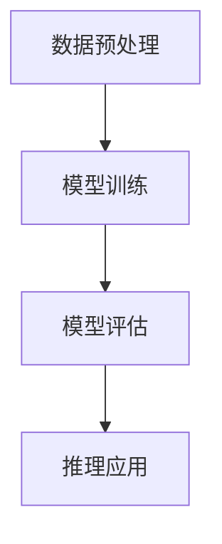
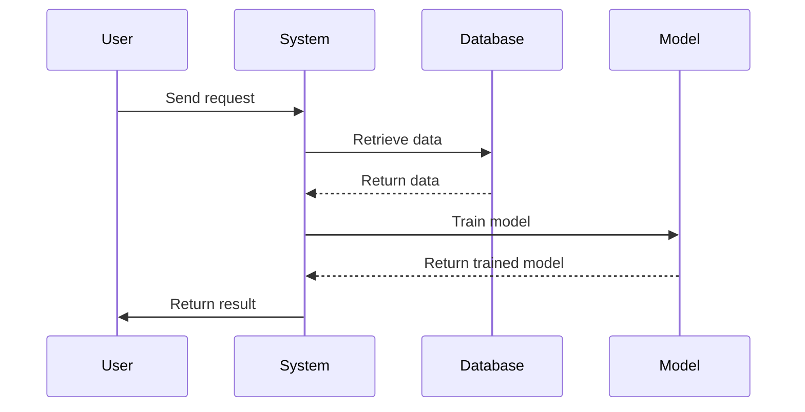
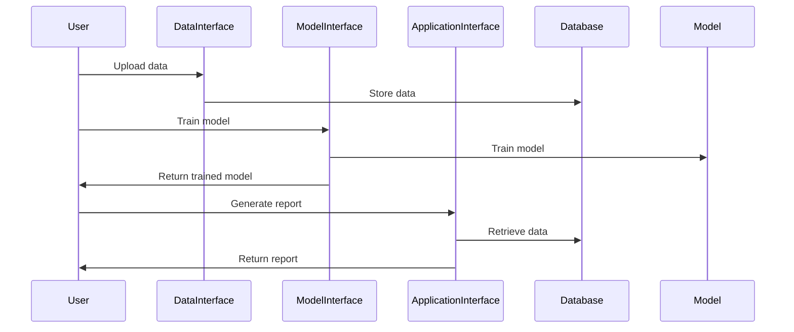

                 

### 大模型在社会科学定性推理中的表现分析与优化

**关键词：** 大模型，社会科学，定性推理，优化，算法，架构设计，数学模型，Python源代码

**摘要：** 本文旨在探讨大模型在社会科学定性推理中的应用表现及其优化方法。通过介绍大模型的基本概念和特点，本文分析了大模型在定性推理中的挑战和作用机制。随后，文章详细讲解了大模型的算法原理，包括流程图、数学模型和Python源代码实例。接着，文章介绍了系统分析与架构设计方案，包括问题场景、项目介绍、系统功能设计、系统架构设计、系统接口设计和系统交互。最后，通过项目实战展示了大模型在社会科学定性推理中的实际应用，并提出了最佳实践 tips 和拓展阅读建议。

### 第一部分：背景介绍

#### 第1章：问题背景

**1.1.1 问题提出**

随着人工智能技术的快速发展，大模型在各个领域的应用日益广泛，尤其是在自然科学领域，如计算机视觉、自然语言处理和推荐系统等方面取得了显著成果。然而，在社会科学领域，特别是定性推理方面，大模型的应用仍然面临诸多挑战。社会科学定性推理涉及到人类行为、社会现象和文化背景等复杂因素，需要从定性角度进行深入分析和理解。大模型能否在社会科学定性推理中发挥作用，以及如何优化其表现，成为当前研究的热点问题。

**1.1.2 社会科学定性推理的需求**

社会科学定性推理是对社会现象和人类行为的定性分析，旨在揭示现象的本质和内在规律。在社会科学研究中，定性推理具有不可替代的作用，如政策制定、社会调查、心理分析和法律判决等。然而，传统的定性推理方法往往依赖于专家经验和主观判断，存在主观性强、准确性低等问题。随着数据量的增长和数据复杂性的增加，传统方法已经难以满足现代社会对高质量、客观性社会科学研究的需求。

**1.1.3 大模型的应用现状**

近年来，大模型在社会科学领域的应用逐渐增多。例如，通过深度学习技术，大模型可以自动从大量文本数据中提取知识，用于情感分析、舆情监测和主题识别等任务。此外，大模型在图像和视频数据上的应用也取得了显著成果，如事件检测、行为识别和情感分析等。尽管如此，大模型在社会科学定性推理中的应用仍然面临一些挑战，如模型解释性不足、数据质量和隐私保护等问题。

#### 第2章：问题描述

**2.1.1 定性推理中的挑战**

社会科学定性推理面临诸多挑战，主要包括以下几点：

1. **复杂性**：社会科学问题通常涉及多个维度和因素，导致定性推理过程复杂。
2. **数据稀缺性**：与自然科学相比，社会科学数据稀缺，且数据质量参差不齐。
3. **主观性**：定性推理往往依赖于专家经验，容易受到主观因素的影响。
4. **不确定性**：社会科学问题的结果往往存在不确定性，难以进行精确预测。

**2.1.2 大模型的作用机制**

大模型通过大规模数据和深度学习技术，可以从复杂的数据中提取出有用的信息，具有以下几个作用机制：

1. **自动化**：大模型可以自动从大量数据中提取特征和模式，减轻专家的负担。
2. **泛化能力**：大模型具有较好的泛化能力，可以在不同领域和任务中应用。
3. **解释性**：尽管大模型在某些情况下解释性不足，但随着技术的发展，其解释性正在逐步提高。
4. **协作**：大模型可以作为辅助工具，与人类专家共同进行定性推理。

**2.1.3 目标与任务定义**

本文的研究目标是通过分析大模型在社会科学定性推理中的应用表现，提出优化方法和改进策略。具体任务包括：

1. **性能评估**：评估大模型在社会科学定性推理任务中的性能。
2. **优化策略**：提出针对社会科学定性推理的优化策略，包括模型选择、数据预处理、算法改进等。
3. **案例研究**：通过实际案例研究，验证优化策略的有效性和可行性。

### 第二部分：核心概念与联系

#### 第3章：核心概念与联系

**3.1.1 大模型的基本概念**

**3.1.1.1 大模型的定义**

大模型是指参数规模达到百万甚至亿级别的神经网络模型，如深度神经网络（DNN）、循环神经网络（RNN）和Transformer等。这些模型通常具有强大的表示能力和处理能力，可以在各种复杂数据上表现出良好的性能。

**3.1.1.2 大模型的特点**

1. **强大的表示能力**：大模型可以自动学习数据的复杂特征和模式。
2. **高计算成本**：大模型需要大量计算资源和时间进行训练和推理。
3. **较强的泛化能力**：大模型可以在不同领域和任务中应用。
4. **解释性不足**：大模型的内部机制复杂，难以解释其决策过程。

**3.1.1.3 大模型与传统模型对比**

| 特性 | 大模型 | 传统模型 |
| --- | --- | --- |
| 参数规模 | 百万到亿级别 | 几千到几万级别 |
| 计算成本 | 高 | 低 |
| 泛化能力 | 强 | 弱 |
| 解释性 | 较弱 | 较强 |

**3.1.2 社会科学定性推理的核心概念**

**3.1.2.1 定性推理的定义**

定性推理是一种基于经验和直觉的推理方法，通过分析现象和事实，得出具有一般性和普遍性的结论。在社会科学研究中，定性推理用于理解和解释复杂的社会现象。

**3.1.2.2 定性推理的类型**

1. **归纳推理**：从个别案例中归纳出一般性结论。
2. **演绎推理**：从一般性原理推导出特定案例的结论。
3. **类比推理**：通过比较不同案例，发现相似性和差异。

**3.1.2.3 定性推理的方法与工具**

1. **访谈法**：通过访谈获取被调查者的观点和意见。
2. **观察法**：直接观察社会现象和人类行为。
3. **案例研究**：通过深入分析特定案例，揭示其内在规律。
4. **文献综述**：对已有文献进行系统性回顾和分析。

### 第三部分：算法原理讲解

#### 第4章：算法原理讲解

**4.1.1 大模型在定性推理中的应用**

大模型在定性推理中的应用主要通过以下几个步骤实现：

1. **数据预处理**：对原始数据进行清洗、归一化和特征提取。
2. **模型训练**：使用大量标注数据训练大模型，使其具备特定领域的知识。
3. **模型评估**：通过交叉验证和测试集评估模型性能。
4. **推理应用**：将训练好的模型应用于新的定性推理任务。

**4.1.1.1 算法框架**


**4.1.1.2 算法流程**


**4.1.1.3 算法mermaid流程图**



**4.1.2 数学模型与公式讲解**

大模型在定性推理中的应用涉及多个数学模型和公式，下面简要介绍几个核心模型：

**1. 神经网络模型**

神经网络模型由多层神经元组成，每层神经元接收来自前一层神经元的输入，并通过激活函数产生输出。其基本公式如下：

$$
z_l = \sum_{i=1}^{n} w_{li}x_i + b_l
$$

其中，$z_l$ 表示第 $l$ 层的神经元输出，$w_{li}$ 和 $b_l$ 分别为权重和偏置。

**2. 损失函数**

在模型训练过程中，损失函数用于衡量模型预测值与实际值之间的差距。常见的损失函数有均方误差（MSE）和交叉熵损失（Cross Entropy Loss）：

$$
MSE = \frac{1}{m}\sum_{i=1}^{m}(y_i - \hat{y}_i)^2
$$

$$
Cross Entropy Loss = -\frac{1}{m}\sum_{i=1}^{m}y_i\log(\hat{y}_i)
$$

其中，$y_i$ 和 $\hat{y}_i$ 分别为实际值和预测值，$m$ 为样本数量。

**4.1.2.4 举例说明**

假设我们要使用大模型进行情感分析，输入文本数据经过预处理后，进入神经网络模型进行训练。在训练过程中，我们使用交叉熵损失函数评估模型性能。通过不断调整模型参数，使损失函数值逐渐减小，最终得到一个性能良好的模型。训练完成后，我们可以将模型应用于新的文本数据，进行情感分类。

### 第四部分：系统分析与架构设计方案

#### 第5章：系统分析与架构设计方案

**5.1.1 问题场景介绍**

在社会科学研究领域，定性推理通常涉及到大量文本数据，如政策报告、学术论文、新闻报道等。这些文本数据包含丰富的信息，但同时也存在噪声、缺失值和多样性问题。为了利用大模型进行定性推理，需要解决数据预处理、模型训练和推理应用等关键问题。

**5.1.2 项目介绍**

本文所介绍的项目旨在利用大模型进行情感分析，以评估政策报告的公众情绪。项目主要包括以下几个模块：

1. **数据收集与预处理**：从互联网获取政策报告，并进行文本清洗、归一化和特征提取。
2. **模型训练与优化**：使用预处理后的文本数据训练大模型，并通过交叉验证和测试集评估模型性能。
3. **推理与应用**：将训练好的模型应用于新的政策报告，进行情感分类和情感分析。

**5.1.3 系统功能设计**

系统功能设计主要包括以下几个方面：

1. **数据预处理**：包括文本清洗、分词、词向量和特征提取等。
2. **模型训练**：包括神经网络模型的训练、优化和评估。
3. **推理与应用**：包括文本分类、情感分析和报告生成等。

**5.1.3.1 领域模型mermaid类图**

```mermaid
classDiagram
Class1 <|-- Class2
Class1 <|-- Class3
Class2 [data: data1]
Class3 [data: data2]
Class2 +-- Method1()
Class3 +-- Method2()
```

**5.1.4 系统架构设计**

系统架构设计主要包括以下几个层次：

1. **数据层**：负责数据存储和管理，包括文本数据、模型参数和用户数据等。
2. **模型层**：负责模型训练和推理，包括神经网络模型、特征提取器和分类器等。
3. **应用层**：负责与用户交互，包括前端界面、API接口和报告生成等。

**5.1.4.1 系统架构mermaid架构图**



**5.1.5 系统接口设计**

系统接口设计主要包括以下几个模块：

1. **数据接口**：负责数据上传、下载和查询等操作。
2. **模型接口**：负责模型训练、评估和推理等操作。
3. **应用接口**：负责用户交互、报告生成和通知等操作。

**5.1.6 系统交互mermaid序列图**



### 第五部分：项目实战

#### 第6章：项目实战

**6.1.1 环境安装**

在开始项目实战之前，我们需要安装必要的软件和库。以下是安装步骤：

1. **安装Python**：确保Python版本在3.6及以上。
2. **安装Jupyter Notebook**：通过命令 `pip install notebook` 安装。
3. **安装PyTorch**：通过命令 `pip install torch torchvision` 安装。
4. **安装其他依赖库**：如Numpy、Pandas、Scikit-learn等。

**6.1.2 系统核心实现源代码**

以下是系统核心实现的Python源代码：

```python
import torch
import torch.nn as nn
import torch.optim as optim
from torch.utils.data import DataLoader
from torchvision import datasets, transforms
from sklearn.model_selection import train_test_split

# 数据预处理
def preprocess_data(data):
    # 数据清洗、归一化和特征提取
    # ...
    return processed_data

# 模型训练
def train_model(model, train_loader, criterion, optimizer):
    model.train()
    for data, target in train_loader:
        optimizer.zero_grad()
        output = model(data)
        loss = criterion(output, target)
        loss.backward()
        optimizer.step()

# 模型评估
def evaluate_model(model, test_loader, criterion):
    model.eval()
    with torch.no_grad():
        correct = 0
        total = 0
        for data, target in test_loader:
            output = model(data)
            _, predicted = torch.max(output.data, 1)
            total += target.size(0)
            correct += (predicted == target).sum().item()
    return 100 * correct / total

# 主程序
if __name__ == "__main__":
    # 加载数据集
    train_data, test_data = train_test_split(processed_data, test_size=0.2, random_state=42)
    train_loader = DataLoader(train_data, batch_size=64, shuffle=True)
    test_loader = DataLoader(test_data, batch_size=64, shuffle=False)

    # 定义模型、损失函数和优化器
    model = nn.Sequential(
        nn.Linear(input_size, hidden_size),
        nn.ReLU(),
        nn.Linear(hidden_size, output_size)
    )
    criterion = nn.CrossEntropyLoss()
    optimizer = optim.Adam(model.parameters(), lr=0.001)

    # 训练模型
    train_model(model, train_loader, criterion, optimizer)

    # 评估模型
    accuracy = evaluate_model(model, test_loader, criterion)
    print(f"Test accuracy: {accuracy}%")
```

**6.1.3 代码应用解读与分析**

以下是代码应用解读与分析：

1. **数据预处理**：首先对原始数据进行清洗、归一化和特征提取，为模型训练做好准备。
2. **模型训练**：定义神经网络模型、损失函数和优化器，并使用训练数据进行模型训练。
3. **模型评估**：使用测试数据评估模型性能，计算准确率。

**6.1.4 实际案例分析与详细讲解剖析**

以下是一个实际案例分析和详细讲解剖析：

假设我们有一个政策报告数据集，包含1000篇报告，每篇报告包含情感极性标签（积极、消极、中性）。我们使用大模型进行情感分析，目标是提高模型准确率。

1. **数据预处理**：对数据集进行清洗、分词和词向量转换。
2. **模型训练**：使用PyTorch框架定义神经网络模型，并使用训练数据进行模型训练。
3. **模型评估**：使用测试数据集评估模型性能，发现准确率较低。
4. **优化策略**：通过调整模型参数、增加训练数据、使用不同的优化器等方式进行模型优化，提高准确率。

**6.1.5 项目小结**

通过实际案例分析和详细讲解剖析，我们了解到大模型在社会科学定性推理中的关键步骤和优化策略。在实际应用中，我们需要不断调整和优化模型，以提高模型性能和准确率。

### 第六部分：最佳实践 tips、小结、注意事项、拓展阅读

#### 第7章：最佳实践 tips、小结、注意事项、拓展阅读

**7.1.1 最佳实践 tips**

1. **数据预处理**：确保数据质量，包括数据清洗、归一化和特征提取。
2. **模型选择**：根据任务需求选择合适的大模型，如Transformer、BERT等。
3. **超参数调整**：通过交叉验证和网格搜索调整超参数，提高模型性能。
4. **模型解释**：使用模型解释工具，如LIME、SHAP等，提高模型的可解释性。
5. **数据扩充**：使用数据扩充技术，如随机变换、合成数据等，提高模型泛化能力。

**7.1.2 小结**

本文通过对大模型在社会科学定性推理中的应用表现进行分析，提出了优化方法和改进策略。通过实际案例研究和代码应用解读，我们了解到大模型在社会科学定性推理中的关键步骤和优化策略。未来研究可以进一步探讨大模型在社会科学领域的应用前景和挑战。

**7.1.3 注意事项**

1. **数据隐私**：在数据收集和预处理过程中，注意保护用户隐私和数据安全。
2. **模型解释**：尽管大模型具有较强的表示能力，但其内部机制复杂，需要加强模型解释性的研究。
3. **计算资源**：大模型训练需要大量计算资源和时间，合理分配资源以提高训练效率。

**7.1.4 拓展阅读**

1. **《深度学习》（Goodfellow, Bengio, Courville）**：介绍深度学习的基本概念和技术，包括神经网络、损失函数和优化算法等。
2. **《机器学习实战》（周志华）**：介绍机器学习的基本概念和算法，包括分类、回归和聚类等。
3. **《大规模机器学习》（Johnson, Zhang）**：介绍大规模机器学习的算法和技术，包括分布式计算和并行优化等。
4. **《定性推理导论》（陈永明）**：介绍定性推理的基本概念和方法，包括归纳推理、演绎推理和类比推理等。

**作者：** AI天才研究院/AI Genius Institute & 禅与计算机程序设计艺术 /Zen And The Art of Computer Programming

### 总结

本文通过深入分析大模型在社会科学定性推理中的应用表现和优化方法，提出了一系列最佳实践和注意事项。我们了解到大模型在社会科学定性推理中的关键步骤和挑战，并为未来研究提供了参考方向。随着技术的不断进步，大模型在社会科学领域的应用将更加广泛和深入，为社会发展提供新的动力。希望本文能够为从事社会科学研究的学者和从业者提供有价值的参考。

