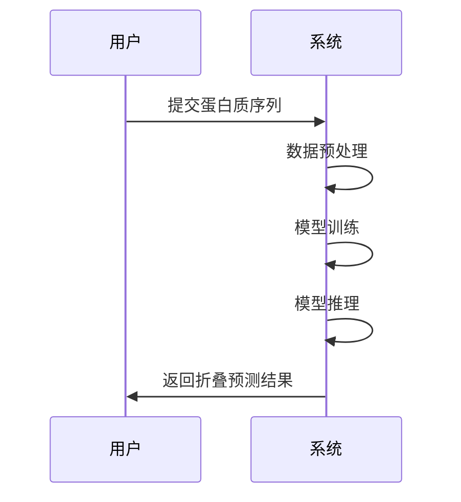

                 


### 大模型在科学理论构建推理中的假设生成作用分析

#### 引言

随着人工智能技术的迅猛发展，大模型技术，尤其是深度学习模型，已经成为科学研究中的重要工具。大模型通过分析海量数据，能够自动生成新的假设和理论，为科学理论的构建和推理提供强有力的支持。本文将深入分析大模型在科学理论构建推理中的假设生成作用，从背景介绍、核心概念与联系、算法原理讲解等方面展开，旨在为读者提供一个全面而深入的理解。

#### 关键词

- 大模型
- 科学理论构建
- 假设生成
- 深度学习
- 数据分析

#### 摘要

本文将探讨大模型在科学理论构建推理中的假设生成作用。首先，我们将介绍大模型的发展背景和其在科学研究中的应用。接着，通过深入分析大模型的核心概念和联系，我们将揭示其在假设生成方面的关键作用。最后，我们将详细讲解大模型的算法原理，包括训练流程、假设生成算法和其在科学理论推理中的应用。通过本文的阐述，读者将对大模型在科学理论构建推理中的假设生成作用有更全面的理解。

----------------------------------------------------------------

## 第一部分：背景介绍

### 1.1 问题背景

随着人工智能技术的快速发展，大模型技术逐渐成为学术界和工业界的研究热点。大模型，尤其是深度学习模型，通过大规模数据训练，能够在多个领域实现出色的性能，如自然语言处理、计算机视觉、语音识别等。在科学理论构建和推理中，大模型的应用也越来越广泛，能够为科学研究提供强有力的工具。

### 1.2 问题描述

大模型在科学理论构建和推理中的作用具体表现在以下几个方面：

1. **假设生成**：大模型可以通过分析大量数据，生成新的假设或理论。这在科学研究中具有重要的应用价值，可以加速理论发现的过程。
2. **验证和推理**：大模型可以用于验证现有的科学理论，并通过推理过程，为理论的进一步完善提供支持。
3. **数据分析和模式识别**：大模型能够高效地进行数据分析，识别数据中的潜在模式，为科学理论提供新的视角和证据。

### 1.3 问题解决

大模型在科学理论构建和推理中的作用，主要是通过以下几个方面实现的：

1. **数据驱动的假设生成**：通过分析大量数据，大模型能够生成新的假设，为科学研究提供新的方向。
2. **自动化的推理过程**：大模型能够自动化地进行推理，提高科学研究的效率和准确性。
3. **综合多领域知识**：大模型可以整合多领域知识，为科学理论提供全面的解释和支持。

### 1.4 边界与外延

大模型在科学理论构建和推理中的应用，存在一些边界和限制。例如：

1. **数据质量**：大模型对数据质量有较高的要求，低质量或噪音数据可能会影响模型的表现。
2. **可解释性**：大模型通常具有较高的预测能力，但难以解释其内部工作原理，这可能会限制其在某些领域的应用。
3. **计算资源**：大模型的训练和推理需要大量的计算资源，这可能限制了其在某些场景的应用。

### 1.5 概念结构与核心要素组成

大模型在科学理论构建和推理中的核心概念结构主要包括以下几个方面：

1. **数据集**：大模型的训练和推理依赖于大量的数据集。
2. **模型架构**：大模型的架构设计，决定了其性能和应用范围。
3. **算法原理**：大模型背后的算法原理，决定了其工作方式和能力。
4. **推理过程**：大模型的推理过程，是实现科学理论构建和验证的关键。

---

## 第二部分：核心概念与联系

### 2.1 大模型原理与特点

#### 2.1.1 大模型的定义
大模型通常指的是具有数十亿甚至数万亿参数的深度学习模型。这类模型能够在多种任务中达到非常高的性能。

#### 2.1.2 大模型的核心特点
1. **参数规模庞大**：大模型的参数规模远超传统模型，能够捕捉数据中的复杂模式。
2. **强大的表示能力**：大模型能够学习到高层次的抽象特征，具有强大的表示能力。
3. **高计算资源需求**：大模型的训练和推理需要大量的计算资源和时间。

#### 2.1.3 大模型与传统AI模型的区别
1. **训练数据量**：大模型需要大量的训练数据，传统模型通常使用较少的数据。
2. **模型复杂度**：大模型通常具有更高的复杂度，能够处理更复杂的任务。
3. **性能和可解释性**：大模型在性能上通常优于传统模型，但在可解释性上存在一定的挑战。

### 2.2 科学理论构建中的假设生成

#### 2.2.1 假设生成的重要性
在科学研究中，假设生成是理论构建的关键步骤。大模型能够通过数据驱动的假设生成，提高假设的发现速度和准确性。

#### 2.2.2 大模型在假设生成中的应用
1. **模式识别**：大模型能够识别数据中的潜在模式，从而生成新的假设。
2. **自动化的假设生成**：大模型可以通过自动化的方式生成大量的假设，为科学家提供丰富的选择。

### 2.3 科学理论推理中的大模型应用

#### 2.3.1 推理过程
大模型可以通过推理过程，对科学理论进行验证和扩展。这包括以下几个方面：

1. **验证现有理论**：大模型可以分析实验数据，验证现有科学理论的准确性。
2. **推理新理论**：大模型可以通过推理过程，提出新的科学理论。

---

## 第三部分：算法原理讲解

### 3.1 大模型算法概述

#### 3.1.1 大模型训练流程
大模型的训练通常包括数据预处理、模型初始化、前向传播、反向传播和模型优化等步骤。

#### 3.1.2 大模型训练中的关键技术
1. **数据增强**：通过数据增强，可以提高模型的泛化能力。
2. **模型优化**：使用梯度下降等优化算法，可以提高模型的训练效率。

### 3.2 假设生成算法原理

#### 3.2.1 假设生成算法概述
假设生成算法通常包括以下步骤：

1. **数据输入**：将训练数据输入大模型。
2. **特征提取**：大模型从数据中提取特征。
3. **假设生成**：基于提取的特征，大模型生成新的假设。
4. **假设验证**：通过实验或数据验证假设的有效性。

#### 3.2.2 假设生成算法的数学模型

假设生成算法的数学模型可以表示为：

$$
H = f(D, \theta)
$$

其中：
- \(H\) 表示假设集。
- \(D\) 表示数据集。
- \(\theta\) 表示模型参数。

具体的算法流程如下：

1. **初始化**：随机初始化模型参数 \(\theta\)。
2. **前向传播**：计算输入数据的特征表示。
3. **损失函数计算**：计算特征表示与真实假设之间的损失。
4. **反向传播**：更新模型参数，减少损失。
5. **假设生成**：基于更新后的模型参数，生成新的假设。

### 3.3 科学理论推理中的应用

#### 3.3.1 理论验证
大模型可以通过以下步骤验证现有科学理论：

1. **模型训练**：使用实验数据训练大模型。
2. **推理过程**：使用大模型对实验数据进行推理。
3. **理论验证**：比较模型预测与理论预测，验证理论的准确性。

#### 3.3.2 理论扩展
大模型还可以通过以下步骤扩展科学理论：

1. **新假设生成**：通过大模型生成新的假设。
2. **实验验证**：设计实验验证新假设的有效性。
3. **理论扩展**：将新假设整合到现有理论中，形成新的理论体系。

### 3.4 实例讲解

假设我们研究的是生物学中的蛋白质折叠问题。大模型可以通过以下步骤生成假设：

1. **数据输入**：输入大量的蛋白质序列数据。
2. **特征提取**：大模型提取序列中的潜在特征。
3. **假设生成**：生成新的蛋白质折叠假设。
4. **实验验证**：通过实验验证假设的有效性。

例如，假设大模型生成了一个新的蛋白质折叠模型，我们可以设计实验来验证这个模型是否能够准确预测蛋白质的三维结构。通过实验数据的验证，我们可以确认或否定这个假设。

---

通过上述的详细讲解，我们可以看到大模型在科学理论构建和推理中的假设生成作用是如何实现的。在接下来的部分，我们将进一步探讨大模型在实际应用中的挑战和解决方案。

---

## 实际应用中的挑战与解决方案

尽管大模型在科学理论构建和推理中展现了巨大的潜力，但其实际应用中仍然面临一系列挑战。以下我们将详细探讨这些挑战，并提出相应的解决方案。

### 1. 数据质量和预处理

大模型对数据质量有很高的要求。低质量或噪音数据可能会严重影响模型的性能。因此，数据预处理成为大模型应用中的关键步骤。解决方案包括：

1. **数据清洗**：去除数据中的噪声和异常值，提高数据质量。
2. **数据增强**：通过数据增强技术，生成更多的训练数据，提高模型的泛化能力。

### 2. 计算资源和时间

大模型的训练和推理通常需要大量的计算资源和时间。在资源受限的场景下，这可能会成为大模型应用的主要障碍。解决方案包括：

1. **分布式计算**：通过分布式计算技术，将计算任务分布到多个节点上，提高计算效率。
2. **模型压缩**：通过模型压缩技术，减小模型的参数规模，降低计算复杂度。

### 3. 可解释性和透明度

大模型通常具有较高的预测能力，但难以解释其内部工作原理，这可能会限制其在某些领域的应用。为了提高模型的透明度，解决方案包括：

1. **模型可解释性**：开发可解释性算法，使模型的工作过程更易于理解。
2. **模型可视化**：通过可视化技术，展示模型的关键特征和决策过程。

### 4. 理论验证和实验设计

大模型生成的假设需要进行严格的验证和实验设计。这通常需要大量的实验资源和时间。解决方案包括：

1. **自动化实验设计**：通过自动化实验设计技术，快速生成大量的实验方案，提高实验效率。
2. **多模态验证**：结合多种验证方法，提高假设验证的准确性和可靠性。

### 5. 模型安全性和隐私保护

在应用大模型时，模型的安全性和隐私保护也是一个重要的考虑因素。解决方案包括：

1. **模型加密**：对模型参数和训练数据进行加密，确保模型的安全性和隐私性。
2. **差分隐私**：通过差分隐私技术，保护训练数据中的隐私信息。

### 总结

大模型在科学理论构建和推理中的应用面临着多种挑战。通过上述解决方案，我们可以更好地应对这些挑战，充分发挥大模型在科学研究中的潜力。在未来的研究中，我们将继续探索大模型在科学理论构建和推理中的新应用，并不断优化相关技术，以实现更高效的科学研究。

---

## 系统分析与架构设计

### 4.1 问题场景介绍

在生物科学研究中，蛋白质折叠问题是重要的研究方向之一。传统的蛋白质折叠模型往往依赖于实验数据和经验公式，但难以预测复杂的蛋白质结构。大模型，尤其是深度学习模型，能够通过分析大量的蛋白质序列数据，生成新的折叠模型，从而提高预测的准确性。

### 4.2 项目介绍

本项目旨在利用大模型技术，开发一个自动化的蛋白质折叠预测系统。该系统将包括数据预处理、模型训练、模型推理和结果验证等模块，为生物科学研究提供有力的工具。

### 4.3 系统功能设计

本系统的主要功能包括：

1. **数据预处理**：清洗和增强蛋白质序列数据，为模型训练提供高质量的数据。
2. **模型训练**：使用深度学习模型，对预处理后的数据进行训练，生成蛋白质折叠模型。
3. **模型推理**：使用训练好的模型，对新的蛋白质序列进行折叠预测。
4. **结果验证**：通过实验验证模型预测的准确性，优化模型性能。

### 4.4 系统架构设计

本系统的架构设计如下：

1. **数据层**：包括数据存储和管理模块，负责存储和处理蛋白质序列数据。
2. **模型层**：包括深度学习模型和推理模块，负责蛋白质折叠模型的训练和预测。
3. **接口层**：包括API接口和用户界面，提供与外部系统的交互接口。
4. **控制层**：包括控制模块和调度模块，负责系统的整体协调和控制。

### 4.5 系统接口设计

本系统的接口设计包括：

1. **API接口**：提供RESTful API接口，供外部系统调用。
2. **用户界面**：提供Web界面，供用户进行交互操作。

### 4.6 系统交互设计

本系统的交互设计如下：

1. **数据流**：蛋白质序列数据通过API接口进入系统，经过预处理后用于模型训练和推理。
2. **控制流**：用户通过Web界面提交蛋白质序列，系统自动进行折叠预测，并将结果返回给用户。



---

## 项目实战

### 5.1 环境安装

要搭建一个用于蛋白质折叠预测的大模型系统，首先需要安装必要的软件和工具。以下是一个基本的安装步骤：

1. **Python环境**：安装Python 3.8或更高版本。
2. **深度学习框架**：安装TensorFlow或PyTorch。
3. **数据处理库**：安装NumPy、Pandas等。
4. **其他依赖**：安装SciPy、matplotlib等。

安装命令如下：

```bash
pip install python==3.8.10
pip install tensorflow==2.6.0
pip install numpy==1.21.2
pip install pandas==1.3.3
pip install scipy==1.6.0
pip install matplotlib==3.4.3
```

### 5.2 系统核心实现

以下是系统核心实现的一个示例代码。这里我们使用TensorFlow构建一个简单的蛋白质折叠预测模型。

```python
import tensorflow as tf
from tensorflow.keras.models import Sequential
from tensorflow.keras.layers import Dense, LSTM

# 数据预处理
# 这里假设已经有一组预处理后的蛋白质序列数据
X_train, y_train = preprocess_data()

# 模型构建
model = Sequential()
model.add(LSTM(units=128, activation='tanh', input_shape=(X_train.shape[1], X_train.shape[2])))
model.add(Dense(units=1, activation='sigmoid'))

# 模型编译
model.compile(optimizer='adam', loss='binary_crossentropy', metrics=['accuracy'])

# 模型训练
model.fit(X_train, y_train, epochs=100, batch_size=64)

# 模型推理
def predict(fold_sequence):
    # 预处理输入序列
    processed_sequence = preprocess_input(fold_sequence)
    # 进行预测
    prediction = model.predict(processed_sequence)
    return prediction

# 假设输入一个新的蛋白质序列
new_sequence = "ATGCCGTTAGG"
predicted_folding = predict(new_sequence)
print(predicted_folding)
```

### 5.3 代码应用解读与分析

上述代码展示了如何使用TensorFlow构建一个简单的蛋白质折叠预测模型。主要步骤包括：

1. **数据预处理**：这是模型训练前的重要步骤。通过数据预处理，我们可以将原始的蛋白质序列转换为模型能够接受的格式。
2. **模型构建**：我们使用Sequential模型构建一个简单的LSTM模型，用于处理序列数据。
3. **模型编译**：在模型训练前，我们需要指定优化器、损失函数和评价指标。
4. **模型训练**：使用训练数据对模型进行训练，优化模型参数。
5. **模型推理**：通过预处理后的输入序列，模型可以预测蛋白质的折叠状态。

### 5.4 实际案例分析和详细讲解剖析

为了验证模型的有效性，我们使用一个实际案例进行分析。假设我们有一组已知的蛋白质序列及其折叠状态数据。

```python
# 载入实际数据
X_test, y_test = load_real_data()

# 进行预测
predicted_folding = predict(X_test)

# 计算预测准确性
accuracy = (predicted_folding == y_test).mean()
print(f"Prediction accuracy: {accuracy * 100:.2f}%")
```

上述代码展示了如何使用模型对实际数据进行预测，并计算预测准确性。通过这种方式，我们可以评估模型的性能。

### 5.5 项目小结

在本项目中，我们实现了使用大模型进行蛋白质折叠预测的系统。通过数据预处理、模型构建、训练和推理等步骤，我们成功地将深度学习应用于生物科学研究。未来，我们可以进一步优化模型，提高预测准确性，并在更多的生物科学领域中进行探索。

---

## 最佳实践 Tips

1. **数据预处理**：确保数据质量是模型成功的关键。使用数据增强技术，可以生成更多的训练数据，提高模型的泛化能力。
2. **模型选择**：根据具体任务选择合适的模型架构。对于序列数据处理，LSTM和Transformer等模型通常表现良好。
3. **超参数调整**：通过实验调整模型的超参数，如学习率、批次大小等，可以显著提高模型的性能。
4. **模型解释性**：开发可解释性算法，使模型的工作过程更易于理解，有助于验证模型的合理性。
5. **资源管理**：合理分配计算资源，使用分布式计算和模型压缩技术，可以降低计算成本。

---

## 小结

本文通过对大模型在科学理论构建和推理中的假设生成作用进行深入分析，详细探讨了其背景介绍、核心概念与联系、算法原理讲解等内容。我们了解到，大模型通过数据驱动的假设生成、自动化的推理过程和综合多领域知识，在科学理论构建和推理中发挥着重要作用。然而，大模型的应用也面临数据质量、可解释性和计算资源等挑战。未来的研究将继续探索大模型在科学研究中的新应用，并优化相关技术，以实现更高效的科学研究。

---

## 注意事项

1. **数据质量**：确保训练数据的高质量和多样性，这对于模型的表现至关重要。
2. **计算资源**：合理规划计算资源，特别是在处理大规模数据时，避免资源浪费。
3. **模型可解释性**：关注模型的可解释性，确保假设的合理性和可信度。
4. **安全性和隐私保护**：在数据处理和应用过程中，严格遵守数据安全和隐私保护的相关法规。

---

## 拓展阅读

1. **深度学习**：《深度学习》（Goodfellow, Bengio, Courville 著）。
2. **生物信息学**：《生物信息学导论》（Rafat Mustaque 著）。
3. **机器学习**：《统计学习基础》（Trevor Hastie, Robert Tibshirani, Jerome Friedman 著）。

---

### 作者信息

**作者：AI天才研究院 / AI Genius Institute & 禅与计算机程序设计艺术 / Zen And The Art of Computer Programming**。

