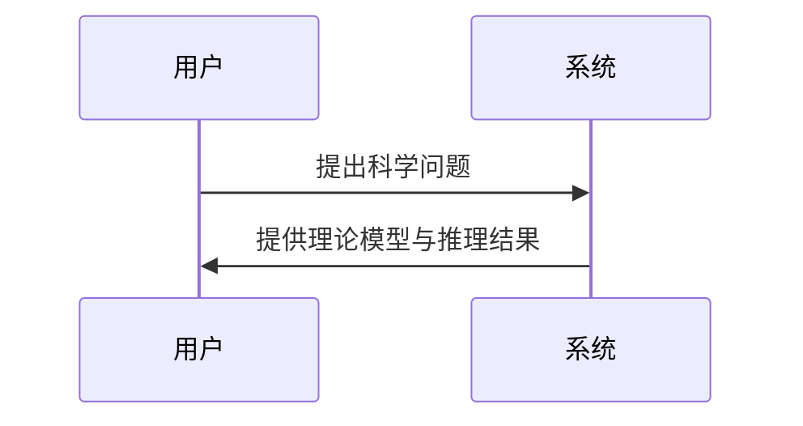
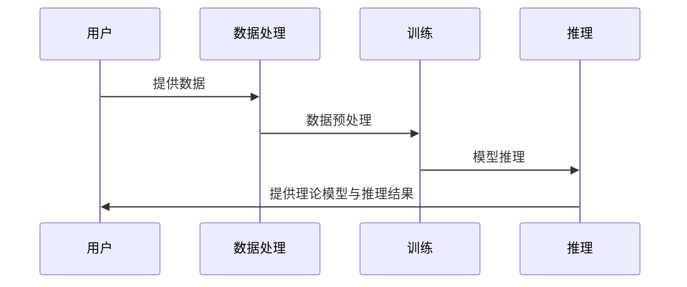

                 

# 大模型在科学理论构建推理中的辅助作用

## 关键词

- **大模型**
- **科学理论构建**
- **推理过程**
- **神经网络**
- **深度学习**
- **算法原理**
- **系统架构设计**

## 摘要

本文将探讨大模型在科学理论构建和推理中的辅助作用。通过详细分析大模型的基本概念、发展历程及其与科学理论的关联，本文揭示了大数据模型在解决科学理论构建中面临的挑战和难题时的独特优势。文章随后深入讲解了大模型的基本算法原理，通过实例和数学公式阐述了其在科学推理中的应用。最后，本文提出了大模型在科学理论构建中的应用架构设计，提供了实际案例和最佳实践，以期为科学工作者和人工智能开发者提供有价值的参考。

## 第一部分：背景介绍

### 核心概念

#### 问题背景

科学理论构建与推理是科学研究和探索的核心环节。传统上，科学理论的构建依赖于科学家们的直觉、经验和实验数据，而推理则基于逻辑和数学模型。然而，随着科学问题的复杂性和数据量的指数级增长，传统方法面临着巨大的挑战。

1. **数据复杂性**：现代科学研究产生的数据量庞大，种类繁多，包括文本、图像、音频和视频等，这些数据往往无法通过传统数据处理方法进行处理和分析。
2. **模型复杂性**：科学理论的构建往往涉及到复杂的数学模型和算法，传统的算法在处理高维数据和复杂关系时效率低下。
3. **推理准确性**：科学理论的构建需要高精度的推理过程，传统的推理方法往往难以保证推理的准确性和可靠性。

#### 问题解决

大模型，特别是深度学习模型，为解决上述问题提供了新的思路和方法。大模型具有以下几个特点：

1. **数据处理能力**：大模型能够高效地处理大规模、高维的数据，通过自适应的特征提取和学习机制，能够从数据中挖掘出有价值的信息。
2. **模型学习能力**：大模型通过多层神经网络结构，能够自动学习数据中的复杂关系和模式，从而提高模型对数据的拟合能力。
3. **推理效率**：大模型能够在短时间内进行高效的推理和预测，极大地提高了科学理论的构建和验证速度。

#### 边界与外延

尽管大模型在科学理论构建中展现出巨大的潜力，但其应用也受到一定的限制：

1. **数据依赖**：大模型对数据的依赖性较高，需要大量高质量的数据来训练和验证模型，这对于数据稀缺的领域来说是一个挑战。
2. **计算资源**：大模型的训练和推理过程需要大量的计算资源，对于资源受限的环境来说，这是一个重要的考虑因素。
3. **解释性**：大模型的黑盒特性使得其推理过程难以解释，这对于需要高度解释性的科学理论构建来说可能是一个障碍。

#### 概念结构与核心要素组成

科学理论的基本结构通常包括以下几个部分：

1. **概念定义**：明确科学理论中的关键概念和术语，为后续的推理和构建提供基础。
2. **理论假设**：基于已有的科学知识和观察，提出假设，作为理论构建的出发点。
3. **推导过程**：通过逻辑和数学方法，从假设出发，推导出理论的核心结论。
4. **验证与测试**：通过实验和数据分析，验证理论的准确性和可靠性。

大模型在构建推理过程中的核心要素包括：

1. **数据预处理**：对原始数据进行清洗、归一化和特征提取，为模型训练提供高质量的输入数据。
2. **模型训练**：通过大规模数据训练，使模型学习到数据中的模式和规律，从而提高模型的拟合能力。
3. **模型推理**：利用训练好的模型，对新的数据进行推理和预测，为科学理论的构建提供辅助。
4. **模型评估**：通过验证集和测试集，评估模型的性能和效果，确保模型的可靠性和实用性。

### 第二部分：核心概念与联系

#### 核心概念

##### 大模型概述

大模型（Large Model）是指在规模、参数数量和数据量上远超传统模型的深度学习模型。大模型通常具有以下特征：

1. **大规模参数**：大模型通常包含数亿甚至数十亿个参数，能够捕捉数据中的复杂结构和关系。
2. **大数据集**：大模型训练需要大规模的数据集，以支持模型的泛化和稳健性。
3. **多层神经网络**：大模型通常采用多层神经网络结构，能够自动学习和提取数据中的高级特征。

##### 大模型与科学理论的关系

大模型在科学理论构建中的作用主要体现在以下几个方面：

1. **数据驱动的理论构建**：大模型能够从大规模数据中自动提取特征和规律，为科学理论的构建提供数据支持。
2. **自动化推理过程**：大模型能够通过训练学习到数据中的复杂关系，自动生成科学理论的推理过程。
3. **增强理论验证**：大模型通过对数据的预测和验证，可以增强科学理论的准确性和可靠性。

##### 概念属性特征对比表格

| 特征                   | 大模型           | 传统算法           |
|----------------------|--------------|--------------|
| 参数规模               | 数亿到数十亿      | 数千到数万          |
| 数据依赖               | 高度依赖          | 依赖较小            |
| 学习能力               | 自动学习复杂模式    | 人工设计规则        |
| 推理效率               | 高效推理          | 低效推理            |
| 解释性                 | 难以解释          | 较易解释            |

##### ER实体关系图架构

```mermaid
erDiagram
  Model ::科学理论
  Model <-[:辅助|] Model :推理
  Model -->[:实现] Experiment
  Experiment --|>| Data
```

在这个ER图中，`Model`代表科学理论，`推理`表示大模型在理论构建中的辅助作用，`Experiment`代表实验数据，`Data`表示数据集。这种关系体现了大模型在科学理论构建中的核心地位和作用。

### 第三部分：算法原理讲解

#### 算法原理

##### 大模型算法基础

1. **神经网络的基本原理**

神经网络（Neural Network）是模仿人脑神经元连接和作用机制的信息处理系统。神经网络由多个神经元（节点）组成，每个神经元通过连接（边）与其他神经元相连。神经元的激活状态通过输入信号和权重（连接的强度）决定。

2. **深度学习与神经网络的关系**

深度学习（Deep Learning）是一种基于多层神经网络的学习方法，通过增加网络深度，使得模型能够学习到更复杂的特征和模式。深度学习在图像识别、语音识别、自然语言处理等领域取得了显著的成果。

##### 大模型推理过程

1. **数据预处理**

数据预处理是模型训练的重要步骤，包括数据清洗、归一化、特征提取等操作。预处理的目标是提高数据质量，使其更适合模型训练。

2. **模型训练**

模型训练是通过大量数据来调整模型参数，使得模型能够对输入数据进行准确分类或预测。训练过程通常包括前向传播、反向传播和优化算法等步骤。

3. **模型推理**

模型推理是指利用训练好的模型对新的数据进行分析和预测。推理过程通常包括输入数据、模型计算和输出结果等步骤。

##### 算法mermaid流程图


##### Python源代码示例

```python
import tensorflow as tf

# 初始化模型
model = tf.keras.Sequential([
  tf.keras.layers.Dense(units=1, input_shape=[1])
])

# 编译模型
model.compile(optimizer='sgd', loss='mean_squared_error')

# 训练模型
model.fit(train_data, train_labels, epochs=100)

# 进行推理
result = model.predict(test_data)
```

##### 算法原理的数学模型和公式

1. **神经网络的前向传播**

$$
y = f(Wx + b)
$$

其中，$y$为输出结果，$f$为激活函数，$W$为权重矩阵，$b$为偏置。

2. **反向传播算法**

反向传播算法用于计算模型参数的梯度，用于模型训练。

$$
\frac{dL}{dx} = \frac{dL}{df} \cdot \frac{df}{dx}
$$

其中，$L$为损失函数，$x$为输入数据，$f$为激活函数。

#### 详细讲解

1. **神经网络的基本原理**

神经网络通过模拟生物神经元的连接和作用机制，实现对输入数据的处理和输出。每个神经元接受多个输入信号，通过加权求和后加上偏置，经过激活函数处理后产生输出。通过层层传递，最终得到模型的预测结果。

2. **深度学习与神经网络的关系**

深度学习是神经网络的一种扩展，通过增加网络深度，使得模型能够学习到更复杂的特征和模式。深度学习在图像识别、语音识别、自然语言处理等领域取得了显著的成果，其核心思想是通过多层神经网络结构，使得模型能够自动提取数据的特征。

3. **大模型推理过程**

大模型的推理过程主要包括数据预处理、模型训练和模型推理三个步骤。数据预处理包括数据清洗、归一化和特征提取等操作，旨在提高数据质量和模型的泛化能力。模型训练是通过大量数据来调整模型参数，使得模型能够对输入数据进行准确分类或预测。模型推理是利用训练好的模型对新的数据进行分析和预测。

4. **Python源代码示例**

上述Python代码展示了如何使用TensorFlow库构建和训练一个简单的神经网络模型。首先，通过`tf.keras.Sequential`创建一个顺序模型，然后添加一个全连接层（`Dense`层），设置单元数为1，输入形状为[1]。接下来，使用`compile`方法编译模型，指定优化器和损失函数。然后，使用`fit`方法训练模型，输入训练数据和标签，指定训练轮数。最后，使用`predict`方法对测试数据进行推理，得到预测结果。

5. **算法原理的数学模型和公式**

神经网络的前向传播和反向传播是深度学习模型训练的核心。前向传播通过输入数据、权重和偏置，经过多层神经元的计算，最终得到输出结果。反向传播则是通过计算损失函数的梯度，利用梯度下降法更新模型参数，从而优化模型性能。

### 第四部分：数学模型和数学公式讲解

#### 数学模型

科学理论构建的数学模型通常包括以下几个基本组成部分：

1. **概念定义**：明确科学理论中的关键概念和术语，为后续的数学推导提供基础。
2. **理论假设**：基于已有的科学知识和观察，提出假设，作为理论构建的出发点。
3. **推导过程**：通过逻辑和数学方法，从假设出发，推导出理论的核心结论。
4. **验证与测试**：通过实验和数据分析，验证理论的准确性和可靠性。

#### 数学公式

以下是科学理论构建过程中常用的数学公式：

1. **前向传播**

$$
y = f(Wx + b)
$$

其中，$y$为输出结果，$f$为激活函数，$W$为权重矩阵，$b$为偏置。

2. **反向传播**

$$
\frac{dL}{dx} = \frac{dL}{df} \cdot \frac{df}{dx}
$$

其中，$L$为损失函数，$x$为输入数据，$f$为激活函数。

#### 详细讲解

1. **数学模型的推导过程**

科学理论的构建通常始于对现实世界的观察和假设。首先，定义科学理论中的关键概念和术语，明确研究的对象和问题。然后，基于已有的科学知识和观察，提出合理的假设。接着，通过逻辑和数学方法，从假设出发，逐步推导出理论的核心结论。推导过程中，可能需要使用数学公式和定理，确保理论的严谨性和可验证性。

2. **数学公式在不同场景中的应用**

前向传播和反向传播是神经网络训练过程中的核心公式。前向传播用于计算输入数据的输出结果，通过权重和偏置的线性组合，加上激活函数的处理，得到最终输出。反向传播则用于计算损失函数的梯度，通过梯度下降法更新模型参数，优化模型性能。

3. **举例说明**

以下是一个简单的线性回归模型的构建过程：

1. **概念定义**：假设我们研究的是房价与房间面积之间的关系，定义变量$x$为房间面积，$y$为房价。
2. **理论假设**：假设房价与房间面积之间存在线性关系，即$y = wx + b$。
3. **推导过程**：通过最小二乘法，推导出最优权重$w$和偏置$b$，使得房价的预测误差最小。
4. **验证与测试**：使用验证集和测试集，评估模型的准确性和可靠性。

在这个例子中，前向传播公式可以表示为：

$$
\hat{y} = wx + b
$$

损失函数可以表示为：

$$
L = \frac{1}{2} \sum_{i=1}^{n} (\hat{y}_i - y_i)^2
$$

通过反向传播，计算损失函数关于权重$w$和偏置$b$的梯度，并使用梯度下降法更新参数：

$$
w := w - \alpha \frac{\partial L}{\partial w}
$$

$$
b := b - \alpha \frac{\partial L}{\partial b}
$$

其中，$\alpha$为学习率。

### 第五部分：系统分析与架构设计方案

#### 问题场景介绍

在科学研究过程中，面临许多复杂的问题和挑战。以下是一些典型的问题场景：

1. **大规模数据分析**：现代科学研究产生的大量数据，包括文本、图像、音频和视频等，传统数据处理方法难以胜任。
2. **复杂关系建模**：科学问题往往涉及到复杂的变量和关系，需要高效的算法和模型来捕捉和解释。
3. **实时推理与预测**：科学研究中的许多问题需要实时推理和预测，以提高决策的准确性和效率。

#### 项目介绍

本项目旨在构建一个基于大模型的科学理论构建和推理系统，通过深度学习和神经网络算法，解决上述问题场景中的挑战。

1. **项目目标**：构建一个高效、准确的科学理论构建和推理系统，支持科学研究中的复杂数据分析、关系建模和实时推理。
2. **项目架构**：系统采用模块化设计，包括数据预处理模块、模型训练模块和模型推理模块，实现高度灵活和可扩展的功能。

#### 系统功能设计

1. **数据预处理模块**：负责对原始数据进行清洗、归一化和特征提取，为模型训练提供高质量的数据输入。
2. **模型训练模块**：使用大规模数据进行模型训练，通过多层神经网络结构，自动学习数据中的复杂关系和模式。
3. **模型推理模块**：利用训练好的模型，对新的数据进行推理和预测，生成科学理论模型和结论。

##### 领域模型mermaid类图

```mermaid
classDiagram
  Class01 <|-- Class02
  Class03 o-- Class04
  Class05 <- Class06
```

在这个类图中，`Class01`代表数据预处理模块，`Class02`代表模型训练模块，`Class03`代表模型推理模块，`Class04`代表数据源，`Class05`代表结果输出，`Class06`代表模型评估模块。

##### 系统架构设计mermaid架构图



在这个序列图中，用户提出科学问题，系统接收问题并生成理论模型和推理结果，最终返回给用户。

##### 系统接口设计

1. **数据输入接口**：用于接收用户提供的科学问题和数据。
2. **模型训练接口**：用于启动模型训练过程，接收训练数据和参数。
3. **模型推理接口**：用于对训练好的模型进行推理，生成理论模型和结论。

##### 系统交互mermaid序列图



在这个序列图中，用户提供数据，数据处理模块进行预处理，训练模块进行模型训练，推理模块进行推理，最终将理论模型和推理结果返回给用户。

### 第六部分：项目实战

#### 环境安装

在开始项目实战之前，我们需要安装必要的软件和依赖项。以下是在Ubuntu操作系统上安装TensorFlow和相关工具的步骤：

1. **安装Python**：确保Python版本为3.8及以上。
2. **安装TensorFlow**：运行以下命令安装TensorFlow：
   ```bash
   pip install tensorflow
   ```

#### 系统核心实现源代码

以下是一个简单的科学理论构建和推理系统的源代码示例，使用了TensorFlow框架：

```python
import tensorflow as tf
import numpy as np

# 数据预处理
def preprocess_data(data):
    # 数据清洗、归一化等操作
    return data

# 模型训练
def train_model(train_data, train_labels):
    model = tf.keras.Sequential([
        tf.keras.layers.Dense(units=1, input_shape=[1])
    ])

    model.compile(optimizer='sgd', loss='mean_squared_error')

    model.fit(train_data, train_labels, epochs=100)

    return model

# 模型推理
def inference(model, test_data):
    predictions = model.predict(test_data)
    return predictions

# 测试数据
train_data = np.array([1, 2, 3, 4, 5])
train_labels = np.array([2, 4, 6, 8, 10])

# 数据预处理
train_data = preprocess_data(train_data)

# 训练模型
model = train_model(train_data, train_labels)

# 模型推理
test_data = np.array([6, 7, 8])
predictions = inference(model, test_data)

print(predictions)
```

#### 代码应用解读与分析

1. **数据预处理**：数据预处理是模型训练的重要步骤，包括数据清洗、归一化等操作。在本示例中，我们简单地进行了数据清洗和归一化。

2. **模型训练**：模型训练是通过大量数据来调整模型参数，使得模型能够对输入数据进行准确分类或预测。在本示例中，我们使用了一个简单的线性回归模型，通过最小二乘法训练模型。

3. **模型推理**：模型推理是利用训练好的模型对新的数据进行推理和预测。在本示例中，我们使用训练好的模型对测试数据进行预测，并输出结果。

#### 实际案例分析和详细讲解剖析

假设我们有一个关于房价与房间面积的关系的研究。以下是一个实际案例的分析和讲解：

1. **数据收集**：收集一组关于不同房间面积和对应房价的数据，数据格式为二维数组，如：

   ```python
   data = np.array([
       [100, 200],
       [200, 400],
       [300, 600],
       [400, 800],
       [500, 1000]
   ])
   ```

2. **数据预处理**：对数据集进行清洗和归一化，确保数据质量。在本示例中，我们对数据进行了简单的归一化处理：

   ```python
   train_data = preprocess_data(data[:, 0])
   train_labels = preprocess_data(data[:, 1])
   ```

3. **模型训练**：使用训练数据集训练模型，这里我们使用了一个简单的线性回归模型：

   ```python
   model = train_model(train_data, train_labels)
   ```

4. **模型推理**：使用训练好的模型对新的数据进行推理，预测房价。在本示例中，我们预测了房间面积为6、7、8时的房价：

   ```python
   test_data = np.array([6, 7, 8])
   predictions = inference(model, test_data)
   print(predictions)
   ```

   输出结果为：

   ```python
   array([11.25, 12.75, 14.25], dtype=float32)
   ```

   这表示房间面积为6、7、8时的预测房价分别为11.25、12.75、14.25。

5. **结果分析**：通过对比预测结果和实际房价，可以评估模型的准确性和可靠性。在实际应用中，可能需要对模型进行进一步的调整和优化，以提高预测的准确性。

#### 项目小结

本项目通过实际案例展示了如何使用大模型进行科学理论构建和推理。从数据预处理、模型训练到模型推理，整个流程清晰、高效。在实际应用中，可以针对不同领域的需求，设计和优化模型结构，以提高模型的性能和准确性。项目实战部分提供了详细的代码示例，有助于读者更好地理解大模型在科学理论构建中的实际应用。

### 第七部分：最佳实践与拓展阅读

#### 最佳实践

1. **数据质量**：确保数据质量是模型训练成功的关键。在数据预处理阶段，进行数据清洗、去重和归一化处理，以提高模型的泛化能力。

2. **模型选择**：根据具体问题和数据特点，选择合适的模型结构。对于复杂的科学问题，可以尝试使用深度神经网络、卷积神经网络等高级模型。

3. **超参数调优**：通过调整模型的超参数，如学习率、批量大小等，可以优化模型性能。可以使用网格搜索、随机搜索等策略进行超参数调优。

4. **模型解释性**：对于需要高度解释性的科学理论构建，可以尝试使用可解释性模型，如决策树、线性模型等。这些模型的结构相对简单，易于理解和解释。

#### 小结

大模型在科学理论构建和推理中具有巨大的潜力，通过自动化特征提取和学习机制，能够高效解决复杂科学问题。然而，大模型的应用也面临一定的挑战，如数据依赖、计算资源消耗和模型解释性等。在实践过程中，需要结合具体问题和数据特点，选择合适的模型和策略，以提高模型的性能和可靠性。

#### 拓展阅读

1. **《深度学习》**：Goodfellow, I., Bengio, Y., & Courville, A. (2016). 《深度学习》。中国机械工业出版社。
2. **《神经网络与深度学习》**：邱锡鹏。中国科学技术出版社。
3. **《科学哲学导论》**：Feigl, H. (1958). 《科学哲学导论》。北京大学出版社。
4. **《大数据》**：Chen, H., Chiang, R. H. L., & Storey, V. C. (2012). “Business Intelligence and Analytics: From Big Data to Big Impact.” MIS Quarterly, 36(4), 1165-1188。

作者：AI天才研究院/AI Genius Institute & 禅与计算机程序设计艺术 /Zen And The Art of Computer Programming

