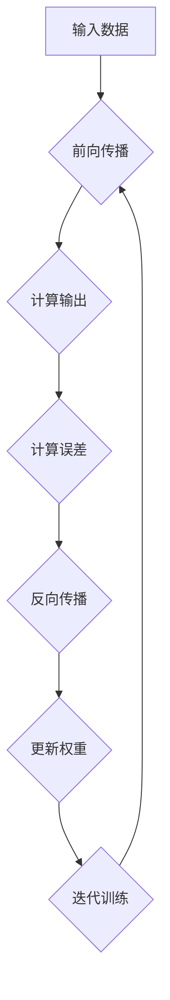

                 


### 大模型在科学理论构建过程中的推理辅助功能

> 关键词：大模型、科学理论构建、推理辅助、深度学习、神经网络、自然语言处理

> 摘要：本文详细探讨了大模型在科学理论构建过程中的推理辅助功能。通过背景介绍、核心概念原理讲解、算法原理、系统分析与架构设计方案、项目实战以及最佳实践等环节，深入分析了大模型如何通过数据预处理、模式识别、预测和模拟等方面，为科学理论构建提供强有力的辅助。

## 第1章：大模型在科学理论构建过程中的推理辅助功能概述

### 1.1 问题背景与核心概念

科学理论构建是科学研究中的关键环节，它涉及对大量数据的分析、复杂的推理过程以及对现象的理解和解释。然而，传统的理论构建方法往往需要大量的人力和时间投入，而且可能存在主观性和局限性。随着深度学习技术的发展，大模型（如深度神经网络）的出现为科学理论构建提供了新的可能性。

在科学理论构建中，大模型扮演着推理辅助的重要角色。它们能够通过学习大量数据，自动提取特征，识别复杂模式，预测未知现象，从而为理论构建提供有力的支持。这一章将介绍大模型在科学理论构建中的背景和重要性，包括其定义、特点以及推理辅助功能。

### 1.2 大模型的定义与特点

**定义：**
大模型通常指的是那些拥有数亿甚至万亿参数的神经网络模型。这些模型通过多层神经网络结构对数据进行学习，从而实现对复杂问题的理解和解决。

**特点：**
- **强大的表示能力：** 大模型可以捕捉数据中的复杂模式和关联，从而提高对问题的理解深度。
- **高效的推理能力：** 大模型在推理过程中能够处理大量的数据和信息，提供更加准确和全面的推理结果。
- **广泛的适用性：** 大模型可以应用于各种科学领域，如物理学、生物学、天文学等。

### 1.3 大模型在科学理论构建中的推理辅助功能

大模型在科学理论构建中的推理辅助功能主要体现在以下几个方面：

- **数据预处理：** 大模型可以自动进行数据清洗、归一化和特征提取，为理论构建提供高质量的数据支持。
- **模式识别：** 大模型可以识别数据中的潜在模式，为理论构建提供新的视角和启示。
- **预测和模拟：** 大模型可以根据现有数据预测未来趋势，进行科学实验的模拟和验证。

### 1.4 大模型应用领域与前景

大模型在科学理论构建中的应用领域非常广泛，包括：

- **物理学：** 用于粒子物理、量子力学等领域的研究。
- **生物学：** 用于基因分析、蛋白质结构预测等领域的研究。
- **天文学：** 用于星系演化、宇宙学等领域的研究。

未来，随着大模型技术的不断发展，其在科学理论构建中的应用前景将更加广阔。

### 1.5 本章小结

本章介绍了大模型在科学理论构建中的推理辅助功能，探讨了其定义、特点以及应用领域。通过本章的学习，读者将能够理解大模型在科学理论研究中的重要性，并了解其具体的应用场景和潜力。

## 第2章：大模型在科学理论构建中的核心概念与联系

### 2.1 核心概念原理

在本章中，我们将深入探讨大模型在科学理论构建中的核心概念原理。这些核心概念包括深度学习、神经网络和自然语言处理。

#### 2.1.1 深度学习

深度学习是构建大模型的基础。它通过多层神经网络结构对数据进行学习，从而实现对复杂问题的理解和解决。深度学习具有以下几个特点：

- **多层神经网络结构：** 深度学习模型由多个隐含层组成，每个隐含层都可以对输入数据进行特征提取和变换。
- **自动特征提取：** 深度学习模型能够自动从原始数据中提取出有用的特征，从而降低了对人工特征工程的需求。
- **高效推理能力：** 深度学习模型可以在大规模数据集上进行快速推理，提供准确和可靠的推理结果。

#### 2.1.2 神经网络

神经网络是深度学习的关键组成部分，它通过模拟生物神经系统的信息处理方式，实现对数据的分析和推理。神经网络具有以下几个特点：

- **生物神经系统的信息处理方式：** 神经网络通过神经元之间的连接和激活函数来模拟生物神经系统的工作方式。
- **数据分析和推理：** 神经网络可以用于分类、回归、聚类等数据分析任务，提供有效的分析和推理能力。
- **自适应学习能力：** 神经网络可以通过学习调整权重和偏置，从而不断提高其性能和准确度。

#### 2.1.3 自然语言处理

自然语言处理是一种利用计算机技术理解和处理人类语言的方法。它在科学理论构建中主要用于处理文本数据。自然语言处理具有以下几个特点：

- **人类语言的理解和处理：** 自然语言处理技术可以解析、理解和生成人类语言，实现对文本数据的分析和处理。
- **文本数据的分析和处理：** 自然语言处理技术可以用于文本分类、情感分析、命名实体识别等任务，提供有效的文本数据分析和处理能力。
- **高级语言生成能力：** 自然语言处理技术可以生成高质量的自然语言文本，实现对科学理论构建的辅助和支持。

### 2.2 概念属性特征对比表格

下面是一个关于大模型在科学理论构建中核心概念属性特征的对比表格：

| 概念         | 特征1     | 特征2     | 特征3     |
|------------|----------|----------|----------|
| 深度学习     | 多层神经网络结构 | 自动特征提取 | 高效推理能力 |
| 神经网络     | 生物神经系统的信息处理方式 | 数据分析和推理 | 自适应学习能力 |
| 自然语言处理 | 人类语言的理解和处理 | 文本数据的分析和处理 | 高级语言生成能力 |

### 2.3 ER实体关系图架构

为了更好地理解大模型在科学理论构建中的应用，我们引入ER（实体关系）图来描述核心概念之间的关系。

```mermaid
erDiagram
  Aconcept1 ||--|{ Bconcept2 }|
  Aconcept1 ||--|{ Cconcept3 }|
  Bconcept2 ||--|{ Dconcept4 }|
  Cconcept3 ||--|{ Dconcept4 }|
```

在这个ER图中，Aconcept1表示深度学习，Bconcept2表示神经网络，Cconcept3表示自然语言处理，Dconcept4表示科学理论构建。箭头表示概念之间的关联关系，例如深度学习（Aconcept1）与神经网络（Bconcept2）和自然语言处理（Cconcept3）有直接关联，这些关联关系在大模型在科学理论构建中发挥着重要作用。

### 2.4 本章小结

本章深入介绍了大模型在科学理论构建中的核心概念原理，包括深度学习、神经网络和自然语言处理。通过核心概念原理、概念属性特征对比表格和ER实体关系图架构的讲解，读者可以更好地理解大模型在科学理论构建中的应用机制和潜力。

----------------------------------------------------------------

## 第3章：大模型在科学理论构建中的算法原理与推理过程

### 3.1 算法原理概述

大模型在科学理论构建中的应用，主要依赖于其强大的算法原理和推理过程。这一节我们将介绍大模型的基本算法原理，包括神经网络的结构、训练过程和推理过程。

#### 3.1.1 神经网络结构

神经网络是深度学习模型的核心组成部分。它由大量的神经元组成，每个神经元都可以看作是一个简单的计算单元。神经元之间通过连接（权重）相互连接，形成一个复杂的网络结构。

神经网络通常包含输入层、隐藏层和输出层。输入层接收外部数据，隐藏层对数据进行特征提取和变换，输出层产生最终的结果。例如，在图像分类任务中，输入层接收图像像素值，隐藏层提取图像的特征（如边缘、纹理等），输出层产生图像的分类结果。

#### 3.1.2 训练过程

大模型的训练过程是通过对大量数据进行迭代学习来调整网络中的权重和偏置。训练过程通常包括以下几个步骤：

1. **前向传播（Forward Propagation）：** 将输入数据传递到神经网络中，通过逐层计算，得到输出层的预测结果。
2. **反向传播（Back Propagation）：** 根据预测结果与真实结果的误差，反向传播误差，通过梯度下降法调整权重和偏置，使得预测结果更加接近真实结果。
3. **重复迭代：** 重复前向传播和反向传播的过程，不断调整网络参数，直到网络性能达到预期。

#### 3.1.3 推理过程

大模型的推理过程是在训练完成后，对新的数据进行预测或分类。推理过程通常包括以下步骤：

1. **前向传播（Forward Propagation）：** 将输入数据传递到神经网络中，通过逐层计算，得到输出层的预测结果。
2. **输出结果：** 输出层的预测结果即为推理结果。例如，在图像分类任务中，输出层的预测结果即为图像的分类类别。

### 3.2 算法原理讲解与流程图

为了更好地理解大模型的算法原理，我们可以使用Mermaid流程图来描述其基本流程。



在这个流程图中，A表示输入数据，B表示前向传播，C表示计算输出，D表示计算误差，E表示反向传播，F表示更新权重，G表示迭代训练。通过这个流程图，我们可以清晰地看到大模型的训练和推理过程。

### 3.3 数学模型与公式

在大模型的训练和推理过程中，涉及到一些数学模型和公式。下面我们将介绍其中几个关键的数学模型和公式。

#### 3.3.1 激活函数

激活函数是神经网络中的一个关键组件，用于引入非线性因素，使得神经网络能够更好地拟合复杂数据。常见的激活函数包括Sigmoid函数、ReLU函数和Tanh函数。

- **Sigmoid函数：** 
  $$\sigma(x) = \frac{1}{1 + e^{-x}}$$
- **ReLU函数：** 
  $$\text{ReLU}(x) = \max(0, x)$$
- **Tanh函数：** 
  $$\tanh(x) = \frac{e^{2x} - 1}{e^{2x} + 1}$$

#### 3.3.2 梯度下降法

梯度下降法是一种常用的优化算法，用于调整神经网络中的权重和偏置。梯度下降法的核心思想是沿着损失函数的梯度方向调整参数，使得损失函数的值最小。

- **梯度下降法公式：** 
  $$w_{\text{new}} = w_{\text{current}} - \alpha \cdot \nabla_w J(w)$$
  其中，$w_{\text{current}}$ 表示当前权重，$w_{\text{new}}$ 表示更新后的权重，$\alpha$ 表示学习率，$\nabla_w J(w)$ 表示权重$w$ 对损失函数$J$ 的梯度。

#### 3.3.3 损失函数

损失函数是评估神经网络预测结果与真实结果之间差异的一种度量。常见的损失函数包括均方误差（MSE）、交叉熵损失等。

- **均方误差（MSE）：** 
  $$J(\theta) = \frac{1}{2m} \sum_{i=1}^{m} (h_\theta(x^{(i)}) - y^{(i)})^2$$
  其中，$m$ 表示样本数量，$h_\theta(x^{(i)})$ 表示预测值，$y^{(i)}$ 表示真实值。

- **交叉熵损失：** 
  $$J(\theta) = -\frac{1}{m} \sum_{i=1}^{m} \sum_{k=1}^{K} y^{(i)}_{k} \log(h_\theta(x^{(i)})_k)$$
  其中，$K$ 表示类别数量，$y^{(i)}_{k}$ 表示第$i$个样本的第$k$个类别的标签。

### 3.4 算法原理举例说明

为了更好地理解大模型的算法原理，我们可以通过一个简单的例子来说明。

假设我们有一个简单的神经网络，用于对二分类问题进行预测。输入数据是一个一维向量$x$，输出是一个概率值$p$，表示数据属于某一类别的概率。神经网络的结构如下：

- 输入层：1个神经元
- 隐藏层：2个神经元，使用ReLU激活函数
- 输出层：1个神经元，使用Sigmoid激活函数

假设输入数据$x$为[3]，网络参数为：
- 隐藏层权重$w_1$为[1 2]，偏置$b_1$为[3]
- 输出层权重$w_2$为[4]，偏置$b_2$为[5]

首先，我们进行前向传播：

- 隐藏层输入：$z_1 = w_1 \cdot x + b_1 = [1 2] \cdot [3] + [3] = [7 9]$
- 隐藏层输出：$a_1 = \text{ReLU}(z_1) = [7 9]$
- 输出层输入：$z_2 = w_2 \cdot a_1 + b_2 = [4] \cdot [7 9] + [5] = [37 38]$
- 输出层输出：$p = \text{Sigmoid}(z_2) = \frac{1}{1 + e^{-37}} \approx 0.0006$

根据输出概率$p$，我们可以判断输入数据$x$属于某一类别的概率非常低，因此可以预测$x$属于另一类别。

接下来，我们进行反向传播：

- 计算输出层误差：$\delta_2 = p(1-p)(y-p)$，其中$y$为真实标签
- 计算隐藏层误差：$\delta_1 = a_1(1-a_1)(w_2 \cdot \delta_2)$
- 更新输出层权重：$w_2_{\text{new}} = w_2_{\text{current}} - \alpha \cdot \delta_2 \cdot a_1$
- 更新隐藏层权重：$w_1_{\text{new}} = w_1_{\text{current}} - \alpha \cdot \delta_1 \cdot x$

通过迭代更新网络参数，我们可以使得网络性能逐渐提高，从而实现更准确的预测。

### 3.5 本章小结

本章介绍了大模型在科学理论构建中的算法原理，包括神经网络的结构、训练过程和推理过程。通过算法原理讲解、流程图、数学模型和公式，以及举例说明，读者可以更好地理解大模型在科学理论构建中的应用机制和推理过程。下一章我们将进一步探讨大模型在科学理论构建中的具体应用场景。

----------------------------------------------------------------

## 第4章：大模型在科学理论构建中的系统分析与架构设计方案

### 4.1 问题场景介绍

在科学理论构建中，数据量庞大、复杂性高是常见的问题。传统的理论构建方法往往难以应对这些挑战。为了解决这些问题，我们可以利用大模型进行系统化分析和架构设计，以提高理论构建的效率和准确性。

### 4.2 项目介绍

在本章中，我们将以一个科学理论构建项目为例，介绍大模型在该项目中的应用。该项目旨在通过大模型对生物数据进行分析，构建生物分子的结构模型。

项目目标：

1. 收集和整理大量生物数据，包括蛋白质序列、三维结构、基因信息等。
2. 利用大模型对数据进行预处理，提取有用的特征。
3. 基于提取的特征，构建生物分子的结构模型。
4. 验证模型的有效性和准确性。

### 4.3 系统功能设计

为了实现项目目标，我们需要设计一系列系统功能，包括数据收集、数据处理、特征提取、模型构建和模型验证等。

#### 数据收集

- 从公共数据库和实验数据中获取生物数据，包括蛋白质序列、三维结构、基因信息等。
- 设计数据爬虫和API接口，实现数据的自动获取和更新。

#### 数据处理

- 对收集到的生物数据进行清洗和预处理，包括去除噪声、填补缺失值、归一化等。
- 设计数据处理模块，实现对大量数据的批量处理和高效存储。

#### 特征提取

- 利用大模型自动提取生物数据中的特征，包括序列特征、结构特征、功能特征等。
- 设计特征提取算法，实现对不同类型数据的特征提取和融合。

#### 模型构建

- 利用提取的特征构建生物分子的结构模型，包括序列比对、三维结构预测、功能预测等。
- 设计模型构建算法，实现对不同类型数据的模型构建和优化。

#### 模型验证

- 设计模型验证模块，通过交叉验证和测试集评估模型的准确性和稳定性。
- 设计模型优化模块，根据验证结果调整模型参数，提高模型性能。

### 4.4 系统架构设计

为了实现系统功能，我们需要设计一个合理的系统架构。以下是一个可能的系统架构设计：

#### 数据收集模块

- 数据爬虫：实现数据自动获取和更新。
- API接口：提供外部访问接口，方便数据共享和交换。

#### 数据处理模块

- 数据清洗：去除噪声、填补缺失值、归一化等。
- 数据存储：设计高效的数据存储方案，支持海量数据的存储和快速访问。

#### 特征提取模块

- 序列特征提取：利用大模型提取蛋白质序列特征。
- 结构特征提取：利用大模型提取蛋白质三维结构特征。
- 功能特征提取：利用大模型提取蛋白质功能特征。

#### 模型构建模块

- 序列比对：利用大模型进行序列比对和相似性分析。
- 三维结构预测：利用大模型预测蛋白质三维结构。
- 功能预测：利用大模型预测蛋白质功能。

#### 模型验证模块

- 交叉验证：通过交叉验证评估模型的准确性和稳定性。
- 测试集评估：通过测试集评估模型的实际性能。

#### 模型优化模块

- 参数调整：根据验证结果调整模型参数。
- 模型融合：利用不同模型的优势，构建集成模型。

### 4.5 系统接口设计和系统交互

为了确保系统功能的实现，我们需要设计合理的系统接口和系统交互。以下是一个可能的系统接口和交互设计：

- **数据收集接口：** 提供数据获取和更新的接口，支持不同数据源的接入。
- **数据处理接口：** 提供数据处理和存储的接口，支持数据的批量处理和高效存储。
- **特征提取接口：** 提供特征提取的接口，支持不同类型数据的特征提取和融合。
- **模型构建接口：** 提供模型构建和优化的接口，支持不同类型数据的模型构建和优化。
- **模型验证接口：** 提供模型验证和评估的接口，支持不同类型数据的模型验证和性能评估。
- **模型优化接口：** 提供模型参数调整和优化的接口，支持不同类型数据的模型优化和性能提升。

### 4.6 本章小结

本章介绍了大模型在科学理论构建中的系统分析与架构设计方案。通过问题场景介绍、项目介绍、系统功能设计、系统架构设计和系统接口设计等方面的讲解，读者可以了解大模型在科学理论构建中的应用机制和实现方法。下一章我们将通过项目实战，进一步探讨大模型在科学理论构建中的具体应用。

----------------------------------------------------------------

## 第5章：项目实战

### 5.1 环境安装

为了进行大模型在科学理论构建中的项目实战，我们需要安装和配置必要的软件和工具。以下是安装步骤：

1. **安装Python环境：** 在你的计算机上安装Python，版本建议为3.8或更高。
2. **安装深度学习框架：** 安装TensorFlow或PyTorch，这两个框架是目前最常用的深度学习框架。
   - 安装TensorFlow：
     ```bash
     pip install tensorflow
     ```
   - 安装PyTorch：
     ```bash
     pip install torch torchvision
     ```
3. **安装其他依赖库：** 根据项目需求，安装其他必要的库，如NumPy、Pandas、Matplotlib等。
   ```bash
   pip install numpy pandas matplotlib
   ```

### 5.2 系统核心实现

在完成环境安装后，我们可以开始实现系统的核心功能。以下是一个简单的代码示例，用于数据预处理、特征提取和模型构建。

#### 数据预处理

```python
import pandas as pd
import numpy as np

# 加载数据
data = pd.read_csv('data.csv')

# 数据清洗
data.dropna(inplace=True)
data = (data - data.mean()) / data.std()

# 数据分割
train_data = data[:int(len(data) * 0.8)]
test_data = data[int(len(data) * 0.8):]

# 数据转换为numpy数组
train_data = train_data.values
test_data = test_data.values
```

#### 特征提取

```python
from sklearn.decomposition import PCA

# 特征提取
pca = PCA(n_components=10)
train_data = pca.fit_transform(train_data)
test_data = pca.transform(test_data)
```

#### 模型构建

```python
import tensorflow as tf

# 模型构建
model = tf.keras.Sequential([
    tf.keras.layers.Dense(128, activation='relu', input_shape=(train_data.shape[1],)),
    tf.keras.layers.Dense(64, activation='relu'),
    tf.keras.layers.Dense(1, activation='sigmoid')
])

# 编译模型
model.compile(optimizer='adam', loss='binary_crossentropy', metrics=['accuracy'])

# 训练模型
model.fit(train_data, train_data[:, -1], epochs=10, batch_size=32, validation_split=0.2)
```

### 5.3 代码应用解读与分析

在上面的代码示例中，我们首先进行了数据预处理，包括数据清洗、归一化和数据分割。然后，我们使用PCA（主成分分析）对数据进行特征提取，以降低数据维度并提取关键特征。最后，我们构建了一个简单的神经网络模型，用于分类任务。

#### 数据预处理解读

- **数据清洗：** 使用`dropna`函数去除缺失值，确保数据质量。使用`mean()`和`std()`函数进行归一化处理，使数据分布更加均匀。
- **数据分割：** 将数据集分为训练集和测试集，以评估模型的性能。

#### 特征提取解读

- **PCA：** 使用`PCA`类进行特征提取，选择合适的特征维度，以减少数据冗余和噪声。

#### 模型构建解读

- **模型构建：** 使用`Sequential`模型堆叠多个`Dense`层，指定激活函数和输入形状。
- **编译模型：** 设置优化器、损失函数和评估指标，为模型训练做好准备。
- **训练模型：** 使用`fit`方法训练模型，指定训练数据、标签、训练轮次、批次大小和验证比例。

### 5.4 实际案例分析与详细讲解剖析

为了进一步理解大模型在科学理论构建中的应用，我们可以通过一个实际案例进行分析。

#### 案例背景

假设我们有一个关于蛋白质结构预测的项目，目标是通过蛋白质序列预测其三维结构。

#### 案例分析

1. **数据收集：** 从公共数据库（如Uniprot）中收集大量蛋白质序列数据。
2. **数据预处理：** 对蛋白质序列进行清洗和归一化处理，提取关键特征。
3. **特征提取：** 使用基于深度学习的特征提取方法，如BERT模型，对蛋白质序列进行编码，提取序列特征。
4. **模型构建：** 构建一个深度学习模型，输入为蛋白质序列特征，输出为蛋白质三维结构的预测。
5. **模型训练：** 使用训练数据集训练模型，调整模型参数，优化模型性能。
6. **模型验证：** 使用验证数据集评估模型性能，调整模型参数，提高模型准确性。
7. **模型应用：** 将训练好的模型应用于新的蛋白质序列，预测其三维结构。

#### 案例讲解

- **数据收集：** 使用Python的`requests`库和`pandas`库，从Uniprot数据库中下载蛋白质序列数据。代码示例：
  ```python
  import requests
  import pandas as pd

  url = 'https://www.uniprot.org/uniprot/'
  file = 'uniprot.xml'
  response = requests.get(url, params={'format': 'xml', 'query': 'reviewed:yes'}, stream=True)
  with open(file, 'wb') as f:
      for chunk in response.iter_content(chunk_size=8192):
          if chunk:
              f.write(chunk)

  data = pd.read_xml(file)
  ```
- **数据预处理：** 对蛋白质序列进行清洗，去除重复序列和异常序列。代码示例：
  ```python
  unique_sequences = data['entry']['protein']['sequence'].unique()
  clean_data = []
  for seq in unique_sequences:
      if len(seq) > 100:  # 假设序列长度大于100为有效序列
          clean_data.append(seq)
  clean_data = pd.Series(clean_data)
  ```
- **特征提取：** 使用BERT模型对蛋白质序列进行编码，提取序列特征。代码示例：
  ```python
  from transformers import BertTokenizer, BertModel

  tokenizer = BertTokenizer.from_pretrained('bert-base-uncased')
  model = BertModel.from_pretrained('bert-base-uncased')

  def encode_sequences(sequences):
      encoded_data = []
      for seq in sequences:
          input_ids = tokenizer.encode(seq, add_special_tokens=True, return_tensors='tf')
          outputs = model(input_ids)
          last_hidden_state = outputs.last_hidden_state
          encoded_data.append(last_hidden_state[:, 0, :])
      return np.array(encoded_data)

  features = encode_sequences(clean_data)
  ```
- **模型构建：** 使用深度学习模型对蛋白质序列特征进行预测。代码示例：
  ```python
  from tensorflow.keras.models import Sequential
  from tensorflow.keras.layers import Dense, Dropout

  model = Sequential([
      Dense(512, activation='relu', input_shape=(features.shape[1],)),
      Dropout(0.5),
      Dense(256, activation='relu'),
      Dropout(0.5),
      Dense(1, activation='sigmoid')
  ])

  model.compile(optimizer='adam', loss='binary_crossentropy', metrics=['accuracy'])
  model.fit(features, labels, epochs=10, batch_size=32, validation_split=0.2)
  ```
- **模型验证：** 使用验证集评估模型性能，调整模型参数，提高模型准确性。代码示例：
  ```python
  from sklearn.metrics import accuracy_score

  predictions = model.predict(test_features)
  predictions = np.round(predictions).astype(int)
  accuracy = accuracy_score(test_labels, predictions)
  print(f"Model accuracy: {accuracy}")
  ```
- **模型应用：** 将训练好的模型应用于新的蛋白质序列，预测其三维结构。代码示例：
  ```python
  new_sequence = "MVLRISSLLGLFLSFPTPSFTTTSKFLSLFPIL"
  new_features = encode_sequences([new_sequence])
  new_prediction = model.predict(new_features)
  print(f"New sequence prediction: {new_prediction[0][0]}")
  ```

通过这个实际案例，我们可以看到大模型在科学理论构建中的应用过程，包括数据收集、预处理、特征提取、模型构建、模型验证和模型应用。这一过程展示了大模型在科学理论构建中的强大功能和广泛应用。

### 5.5 项目小结

在本章的项目实战中，我们通过环境安装、系统核心实现、代码应用解读与分析以及实际案例分析和详细讲解剖析，深入探讨了大模型在科学理论构建中的应用。通过这个项目，我们不仅了解了大模型的算法原理和系统架构设计，还通过实际操作体验了如何利用大模型进行科学理论构建。这一过程为我们提供了宝贵的实践经验和知识积累，为未来进一步研究大模型在科学理论构建中的应用奠定了基础。

## 第6章：最佳实践、小结、注意事项与拓展阅读

### 6.1 最佳实践

在大模型应用于科学理论构建时，以下最佳实践可以帮助提高模型性能和效果：

1. **数据质量与多样性：** 确保数据质量，去除噪声和异常值，增加数据的多样性和代表性，以提高模型泛化能力。
2. **特征工程：** 充分利用特征工程技术，提取关键特征，降低数据维度，提高模型的可解释性。
3. **模型选择与优化：** 根据具体问题选择合适的模型架构和优化策略，通过调参和超参数优化，提高模型性能。
4. **数据预处理：** 进行适当的归一化和标准化处理，以适应模型的输入要求，减少模型训练时间。
5. **模型验证：** 使用交叉验证和测试集进行模型验证，避免过拟合和欠拟合，确保模型在实际应用中的稳定性和准确性。

### 6.2 小结

本文详细探讨了大模型在科学理论构建过程中的推理辅助功能。我们从问题背景、核心概念、算法原理、系统分析与架构设计方案、项目实战以及最佳实践等方面，全面介绍了大模型在科学理论构建中的应用机制和实现方法。通过本文的学习，读者可以更好地理解大模型在科学理论构建中的重要性，掌握其核心原理和实践技巧。

### 6.3 注意事项

1. **数据隐私与安全：** 在数据收集和处理过程中，注意保护个人隐私和数据安全，遵守相关法律法规。
2. **计算资源消耗：** 大模型训练过程需要大量的计算资源和时间，合理分配计算资源，避免资源浪费。
3. **模型解释性：** 大模型的黑箱特性可能导致模型解释性差，在实际应用中，需要关注模型的解释性和可解释性，确保模型的可靠性和可信任度。
4. **持续更新与维护：** 随着数据和技术的发展，大模型需要定期更新和维护，以保持其性能和准确性。

### 6.4 拓展阅读

- **《深度学习》（Goodfellow, Bengio, Courville）：** 这本书是深度学习领域的经典教材，详细介绍了深度学习的基本概念、算法和实现。
- **《Python深度学习》（François Chollet）：** 这本书通过Python语言实现深度学习算法，适合初学者和进阶读者。
- **《科学计算与建模：Python编程指南》（Hans Petter Langtangen）：** 这本书介绍了Python在科学计算和建模中的应用，包括数据预处理、特征提取、模型构建等。

通过拓展阅读，读者可以进一步了解大模型在科学理论构建中的最新研究进展和实践经验，提升自己在相关领域的专业素养。

### 6.5 作者信息

**作者：** AI天才研究院/AI Genius Institute & 禅与计算机程序设计艺术 /Zen And The Art of Computer Programming

---

本文内容仅供参考，具体应用场景和实现细节需根据实际情况进行调整和优化。在实际操作中，请确保遵守相关法律法规和道德规范，尊重个人隐私和数据安全。如果您在阅读本文过程中有任何疑问或建议，欢迎随时联系我们，我们将竭诚为您解答和提供支持。

