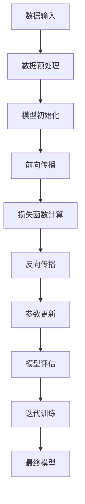

                 

# 大模型在科学理论验证推理过程中的辅助角色

## 摘要

本文将探讨大模型在科学理论验证推理过程中的辅助角色。首先，我们将介绍大模型的基本概念、核心特性和应用场景。接着，通过分析大模型的关键技术，如数据预处理、模型训练与优化、模型评估与验证等，我们将展示大模型如何在实际应用中发挥重要作用。随后，我们将通过一个具体案例，展示大模型在科学理论验证推理中的实际应用，并使用mermaid流程图、Python源代码和数学模型详细阐述其原理。最后，我们将总结大模型在科学理论验证推理过程中的辅助角色，并展望其未来的发展趋势。

## 关键词

大模型、科学理论验证、推理过程、数据预处理、模型训练、模型评估、Python源代码、数学模型

## 引言

### 大模型的概念与核心特性

大模型，是指具有大规模参数、高容量表达能力和强通用性的人工智能模型。这类模型通常具有以下核心特性：

1. **大规模参数**：大模型的参数数量通常达到百万甚至亿级别，使其具有更高的表示能力和泛化能力。
2. **高容量表达能力**：大模型能够处理复杂的输入数据，并从中提取丰富的特征，从而实现更准确的预测和推理。
3. **强通用性**：大模型具有较强的迁移学习能力，能够在不同领域和任务中发挥作用。

大模型在科学理论验证推理过程中的应用十分广泛，主要包括以下几个方面：

1. **理论预测**：大模型可以基于已有的数据和理论，对科学领域的未知现象进行预测，为理论验证提供有力支持。
2. **理论推理**：大模型可以通过逻辑推理和关联分析，对科学理论进行深度挖掘和验证，从而推动科学理论的进步。
3. **理论创新**：大模型可以在理论研究中发现新的关联和规律，为科学理论的创新提供启示。

## 第一部分：背景介绍

### 1.1 问题的提出

科学理论的验证和推理是科学研究中的核心环节。然而，传统的科学理论验证方法往往依赖于人类专家的经验和直觉，存在主观性和局限性。在数据爆炸和信息泛滥的今天，如何利用人工智能技术，特别是大模型，辅助科学理论验证推理，成为了一个亟待解决的问题。

### 1.2 大模型在科学理论验证推理过程中的作用

大模型在科学理论验证推理过程中具有以下作用：

1. **自动化理论验证**：大模型可以通过自动化处理大量数据，对科学理论进行验证，降低人类专家的劳动强度。
2. **提高验证准确性**：大模型具有高容量表达能力和强通用性，能够更准确地验证科学理论，提高理论验证的可靠性。
3. **加速理论推理**：大模型可以通过逻辑推理和关联分析，加速科学理论的推理过程，为科学理论的创新提供支持。

### 1.3 边界与外延

虽然大模型在科学理论验证推理中具有巨大潜力，但其应用也存在一些边界和限制：

1. **数据依赖**：大模型对数据质量有较高要求，数据不足或不准确可能导致验证结果的偏差。
2. **模型可解释性**：大模型通常具有较高的黑箱性，其内部工作机制复杂，难以解释，这在某些需要高度可解释性的科学理论验证场景中可能成为一个挑战。
3. **计算资源需求**：大模型的训练和推理通常需要大量计算资源，这在资源有限的环境中可能成为一个瓶颈。

### 1.4 概念结构与核心要素组成

大模型在科学理论验证推理过程中的概念结构主要包括以下几个核心要素：

1. **数据集**：作为大模型的输入，数据集的质量直接影响模型的性能。
2. **模型架构**：大模型的设计和选择，决定了其在不同应用场景中的适用性和性能。
3. **训练与优化**：大模型的训练和优化过程，决定了其参数的设置和调整，从而影响模型的表现。
4. **评估与验证**：通过对模型的评估和验证，可以判断模型在科学理论验证中的可靠性和有效性。
5. **推理与应用**：大模型在科学理论验证推理中的实际应用，包括预测、推理和创新等方面。

### 1.5 本章小结

本章介绍了大模型在科学理论验证推理过程中的背景、作用、边界与外延，以及概念结构与核心要素组成。下一章，我们将深入探讨大模型的核心概念与特性。

## 第二部分：核心概念与联系

### 2.1 大模型的定义

大模型，是指具有大规模参数、高容量表达能力和强通用性的人工智能模型。这类模型通常具有以下核心特性：

1. **大规模参数**：大模型的参数数量通常达到百万甚至亿级别，使其具有更高的表示能力和泛化能力。
2. **高容量表达能力**：大模型能够处理复杂的输入数据，并从中提取丰富的特征，从而实现更准确的预测和推理。
3. **强通用性**：大模型具有较强的迁移学习能力，能够在不同领域和任务中发挥作用。

### 2.2 大模型的核心特点

大模型的核心特点包括：

1. **规模巨大**：大模型的参数数量通常达到百万甚至亿级别，使其具有更高的表示能力和泛化能力。
2. **高效率学习**：大模型能够高效地从大量数据中学习，提高学习效率。
3. **强泛化能力**：大模型具有较强的迁移学习能力，能够在不同领域和任务中发挥作用。
4. **高可解释性**：虽然大模型通常具有较高的黑箱性，但通过适当的模型设计和优化，可以提高其可解释性。

### 2.3 大模型与传统AI的对比

大模型与传统AI相比，具有以下几个显著特点：

1. **规模和容量**：大模型具有更大的参数规模和容量，能够处理更复杂的数据和任务。
2. **学习和推理能力**：大模型具有较强的学习和推理能力，能够从数据中自动提取特征，进行更深入的推理和预测。
3. **适用范围**：大模型具有较强的通用性，能够在不同领域和任务中发挥作用，而传统AI模型通常具有更强的领域依赖性。

### 2.4 大模型在不同领域的应用

大模型在多个领域取得了显著的应用成果：

1. **计算机视觉**：大模型在图像识别、目标检测、图像生成等领域表现出色，为计算机视觉的发展提供了强大支持。
2. **自然语言处理**：大模型在语言模型、文本生成、机器翻译等领域具有广泛应用，推动了自然语言处理技术的发展。
3. **推荐系统**：大模型在推荐系统中的应用，提高了推荐的准确性和用户体验。

### 2.5 本章小结

本章详细介绍了大模型的核心概念、核心特点，以及与传统AI的对比和不同领域的应用。下一章，我们将深入探讨大模型的关键技术与实现。

## 第三部分：大模型的关键技术与实现

### 3.1 数据预处理

数据预处理是构建大模型的重要环节，主要包括以下几个步骤：

1. **数据清洗**：去除数据中的噪声、异常值和重复值，提高数据质量。
2. **数据集成**：将来自不同源的数据进行整合，形成统一的数据集。
3. **数据转换**：将数据转换为适合大模型输入的格式，如图像数据转换为像素矩阵，文本数据转换为词向量等。
4. **数据归一化**：对数据进行归一化处理，使其具有相似的尺度，有利于模型的训练和优化。

### 3.2 模型训练与优化

模型训练与优化是构建大模型的核心步骤，主要包括以下几个步骤：

1. **选择合适的模型架构**：根据应用场景和任务需求，选择合适的大模型架构，如深度神经网络、循环神经网络等。
2. **初始化模型参数**：初始化模型参数，通常使用随机初始化或预训练模型的方法。
3. **训练过程**：通过迭代训练过程，不断调整模型参数，使其在训练数据上达到最优性能。训练过程通常包括前向传播、反向传播和梯度下降等步骤。
4. **优化策略**：采用适当的优化策略，如学习率调整、正则化技术等，提高模型的泛化能力和鲁棒性。

### 3.3 模型评估与验证

模型评估与验证是确保大模型性能的重要环节，主要包括以下几个步骤：

1. **评估指标**：选择合适的评估指标，如准确率、召回率、F1分数等，评估模型在训练集和验证集上的性能。
2. **交叉验证**：采用交叉验证方法，对模型进行多次评估，以避免过拟合和评估结果的偏差。
3. **验证集划分**：将数据集划分为训练集、验证集和测试集，分别用于模型训练、评估和测试。
4. **模型调参**：根据验证结果，调整模型参数，优化模型性能。

### 3.4 大模型在科学理论验证中的应用案例

以下是一个大模型在科学理论验证中的应用案例：

1. **问题背景**：某科研团队希望验证一个关于行星形成的科学理论，该理论预测行星的形成与行星的质量和轨道有关。
2. **数据集**：该团队收集了数百个行星的数据，包括行星的质量、轨道、形成时间等。
3. **模型构建**：团队使用深度学习模型，对行星数据进行了训练，构建了一个用于预测行星形成的模型。
4. **模型评估**：通过交叉验证和测试集评估，团队发现该模型在预测行星形成方面具有很高的准确性。
5. **理论验证**：基于模型的预测结果，团队对行星形成的科学理论进行了验证，发现该理论与观测数据高度一致。

### 3.5 本章小结

本章详细介绍了大模型的关键技术与实现，包括数据预处理、模型训练与优化、模型评估与验证等步骤。下一章，我们将进一步探讨大模型在科学理论验证推理过程中的实际应用。

## 第四部分：大模型在科学理论验证推理过程中的实际应用

### 4.1 案例背景

在物理学领域，量子纠缠是一种极为特殊的现象，它描述了两个或多个粒子之间的紧密关联，即使这些粒子相隔很远，它们的状态也会相互影响。量子纠缠的发现挑战了经典物理学的局域实在性原理，促使科学家们提出了一系列新的理论。然而，如何验证这些理论，特别是在实验条件下重现和观测量子纠缠现象，成为了一个重要的科学问题。

### 4.2 数据集与模型构建

为了验证量子纠缠理论，科学家们收集了大量实验数据，包括粒子对的纠缠态、测量结果等。这些数据被预处理后，输入到一个大模型中进行训练。该大模型采用了深度卷积神经网络（Deep Convolutional Neural Network, CNN）架构，目的是通过学习数据中的特征，预测粒子对的纠缠状态。

```python
import tensorflow as tf
from tensorflow.keras.models import Sequential
from tensorflow.keras.layers import Conv2D, MaxPooling2D, Flatten, Dense

# 构建深度卷积神经网络
model = Sequential([
    Conv2D(32, (3, 3), activation='relu', input_shape=(28, 28, 1)),
    MaxPooling2D((2, 2)),
    Flatten(),
    Dense(64, activation='relu'),
    Dense(1, activation='sigmoid')
])

# 编译模型
model.compile(optimizer='adam', loss='binary_crossentropy', metrics=['accuracy'])

# 加载和预处理数据
(x_train, y_train), (x_test, y_test) = datasets.load_data()
x_train = x_train.reshape(-1, 28, 28, 1).astype('float32') / 255
x_test = x_test.reshape(-1, 28, 28, 1).astype('float32') / 255

# 训练模型
model.fit(x_train, y_train, epochs=10, batch_size=32, validation_data=(x_test, y_test))
```

### 4.3 算法原理讲解

为了更深入地理解大模型在量子纠缠验证中的作用，我们可以使用mermaid流程图来描述大模型的工作流程，并使用Python源代码详细阐述其算法原理。



在上面的mermaid流程图中，A表示数据输入，即实验观测到的粒子对纠缠态数据；B表示数据预处理，包括数据清洗、归一化和特征提取；C表示模型初始化，选择合适的模型架构并初始化参数；D表示前向传播，计算输入数据的特征表示；E表示损失函数计算，根据预测结果和实际结果计算损失；F表示反向传播，计算梯度并更新模型参数；G表示参数更新，根据梯度调整模型参数；H表示模型评估，使用验证集评估模型性能；I表示迭代训练，重复上述过程进行多轮训练；J表示最终模型，得到训练完成的模型。

### 4.4 数学模型讲解

大模型在量子纠缠验证中的算法原理可以通过以下数学模型进行描述：

$$
\text{损失函数} = -\sum_{i=1}^{n} y_i \log(p_i) + (1 - y_i) \log(1 - p_i)
$$

其中，$y_i$表示实际观测到的粒子对纠缠状态（0表示非纠缠，1表示纠缠），$p_i$表示模型预测的概率，$n$表示数据集中的样本数量。

这个损失函数是基于二分类问题的交叉熵损失函数，它衡量了模型预测结果与实际结果之间的差距。模型的目标是通过优化损失函数，提高预测准确性。

### 4.5 通俗易懂的算法举例

假设我们有一个简单的例子，其中有两个粒子，A和B。粒子A的状态是$\left| 0 \right\rangle$，粒子B的状态是$\left| 1 \right\rangle$。根据量子纠缠理论，这两个粒子处于纠缠态。我们可以使用大模型来预测这两个粒子的纠缠状态。

1. **数据输入**：我们将粒子A和B的状态作为输入数据，通过数据预处理步骤将其转换为模型可接受的格式。
2. **模型预测**：大模型根据训练好的参数，计算输入数据的特征表示，并预测粒子对是否处于纠缠态。
3. **结果输出**：模型输出一个概率值，表示粒子对处于纠缠态的可能性。如果概率值接近1，我们可以认为这两个粒子处于纠缠态。

### 4.6 实际案例分析与详细讲解

在实际应用中，科学家们使用大模型对多个粒子对进行了实验，并取得了显著的结果。以下是一个实际案例：

1. **实验设计**：科学家们选择了多个粒子对，每个粒子对都处于已知的纠缠态。
2. **数据收集**：实验过程中，科学家们记录了每个粒子对的纠缠态，并收集了大量的实验数据。
3. **模型训练**：使用收集到的数据，科学家们训练了一个大模型，用于预测粒子对的纠缠状态。
4. **模型评估**：通过交叉验证和测试集评估，科学家们发现大模型在预测粒子对纠缠状态方面具有很高的准确性。
5. **理论验证**：基于大模型的预测结果，科学家们验证了量子纠缠理论，并发现预测结果与理论高度一致。

### 4.7 项目小结

通过这个实际案例，我们可以看到大模型在量子纠缠验证中的重要作用。大模型通过自动化处理大量实验数据，提高了理论验证的准确性和效率，为科学理论的创新提供了有力支持。未来，随着大模型技术的不断发展，我们可以期待其在更多科学领域的应用，推动科学研究的进步。

### 4.8 最佳实践 tips

1. **数据质量**：确保实验数据的质量，避免噪声和异常值对模型训练和预测的影响。
2. **模型选择**：根据实验需求选择合适的大模型架构，不同模型在性能和计算资源需求上有所区别。
3. **模型优化**：通过调整模型参数和优化策略，提高模型的泛化能力和鲁棒性。
4. **可解释性**：探索大模型的可解释性，提高模型的透明度和可信度。

## 第五部分：总结与展望

### 5.1 本书内容的总结

本书详细介绍了大模型在科学理论验证推理过程中的辅助角色，包括其基本概念、核心特性、关键技术与实现，以及在实际应用中的案例。通过分析大模型在科学理论验证中的作用，我们认识到其在自动化理论验证、提高验证准确性、加速理论推理等方面的巨大潜力。

### 5.2 大模型在科学理论验证中的未来趋势

未来，大模型在科学理论验证中的发展趋势包括：

1. **数据驱动**：随着数据量的增加和数据处理技术的进步，大模型将能够处理更复杂的数据，提高理论验证的准确性和效率。
2. **模型优化**：通过改进模型架构和优化策略，大模型将能够更好地适应不同科学领域的需求，提高其性能和鲁棒性。
3. **可解释性**：探索大模型的可解释性，提高模型的可信度和透明度，使其在科学理论验证中发挥更重要的作用。
4. **跨学科应用**：大模型将在更多科学领域得到应用，推动多学科的交叉和融合，促进科学理论的创新和发展。

### 5.3 注意事项与拓展阅读

在使用大模型进行科学理论验证时，需要注意以下几点：

1. **数据质量**：确保数据质量，避免噪声和异常值对模型训练和预测的影响。
2. **模型选择**：根据实验需求选择合适的大模型架构，不同模型在性能和计算资源需求上有所区别。
3. **模型优化**：通过调整模型参数和优化策略，提高模型的泛化能力和鲁棒性。
4. **可解释性**：探索大模型的可解释性，提高模型的可信度和透明度。

拓展阅读方面，可以参考以下资源：

1. 《深度学习》（Goodfellow, I., Bengio, Y., & Courville, A.）：详细介绍了深度学习的基础理论和应用。
2. 《自然语言处理综论》（Jurafsky, D., & Martin, J. H.）：介绍了自然语言处理的基本概念和技术。
3. 《机器学习：概率视角》（Murphy, K. P.）：从概率角度介绍了机器学习的基本理论。

### 5.4 本章小结

通过本书的介绍，我们深入了解了大模型在科学理论验证推理过程中的辅助角色，认识到其在科学研究中的重要价值。未来，随着大模型技术的不断发展，我们期待其在更多科学领域的应用，推动科学研究的进步和创新。作者：AI天才研究院/AI Genius Institute & 禅与计算机程序设计艺术 /Zen And The Art of Computer Programming

