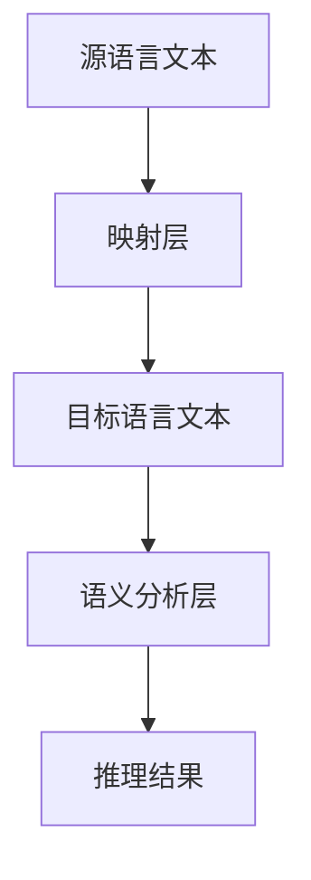
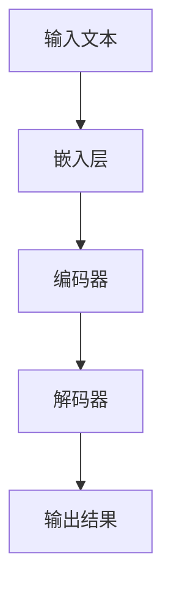
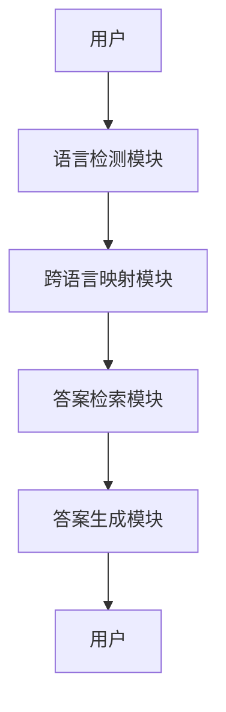

                 

我们将分几个步骤来详细探讨大模型在跨语言推理任务中的表现。

### 第一步：背景介绍

#### 核心概念术语说明

- **跨语言推理（Cross-Lingual Reasoning）**：跨语言推理是指在没有共同语言资源的情况下，利用源语言和目标语言之间的对应关系，对文本进行理解和推理的任务。
- **大模型（Large Models）**：大模型通常是指参数量非常大的深度学习模型，如GPT-3、BERT等，它们在训练时能够从海量数据中学习到丰富的语言特征。

#### 问题背景

跨语言推理任务在多语言环境中具有重要的应用价值。随着全球化的加深，多语言内容的增长速度远远超过了单语言内容。然而，传统的跨语言处理方法往往依赖于共享的翻译资源或者语言模型，这些方法在处理多种语言之间的关系时存在许多限制和挑战。因此，研究大模型在跨语言推理任务中的表现具有重要的现实意义。

#### 问题描述

跨语言推理任务面临的主要挑战包括：

1. **语言多样性**：多种语言在词汇、语法和语义上存在巨大差异，这使得直接应用单语言模型的效果受限。
2. **资源稀缺**：对于某些小语种，高质量的双语数据集非常稀缺，这限制了基于数据驱动的模型训练。
3. **语义一致性**：即使在同一种语言中，不同的表达方式也可能导致语义不一致，跨语言情境下这种问题更加突出。

#### 问题解决

大模型在跨语言推理中的优势主要体现在以下几个方面：

1. **强大的表征能力**：大模型通过大量的预训练数据学习到丰富的语言特征，能够更好地理解和处理不同语言之间的语义关系。
2. **泛化能力**：大模型在训练过程中不仅学习到了语言的一般规律，还能适应不同的语言环境。
3. **自适应能力**：大模型可以灵活地适应不同的跨语言应用场景，如多语言信息检索、机器翻译、跨语言问答等。

#### 边界与外延

跨语言推理与自然语言处理（NLP）密切相关，但又有明显的区别。NLP主要关注单语言环境下文本的理解和处理，而跨语言推理则强调在多语言环境中处理和理解文本。大模型的发展历程也经历了从传统统计模型到现代深度学习模型的转变，其性能在跨语言任务中的提升显著。

#### 概念结构与核心要素组成

- **大模型**：包括预训练模型和微调模型，前者在大规模数据上训练，后者在特定任务上进行适应性调整。
- **跨语言推理**：包括跨语言信息检索、跨语言文本匹配、跨语言语义分析等任务。

### 第二步：核心概念与联系

#### 2.1 大模型的核心概念

大模型通常具有以下特点：

1. **参数量巨大**：大模型的参数数量可以达到数十亿甚至更多，这使其能够学习到丰富的语言特征。
2. **预训练数据量庞大**：大模型在预训练阶段使用的数据量非常大，通常在数百万到数十亿级别，这有助于其捕捉到语言的一般规律。
3. **多任务学习能力**：大模型能够同时处理多种语言任务，如文本分类、机器翻译、问答系统等。

#### 2.2 跨语言推理的核心概念

跨语言推理涉及以下几个关键点：

1. **语言映射**：通过将源语言的文本映射到目标语言，使得两个语言之间的语义关系可以被建模。
2. **语义一致性**：确保在跨语言环境中，不同表达方式所代表的语义是相同的。
3. **跨语言知识整合**：将不同语言的知识点整合起来，以实现对复杂语义的理解。

#### 2.3 概念属性特征对比表格

| 特征         | 大模型                       | 跨语言推理                      |
| ------------ | ---------------------------- | ------------------------------- |
| 参数量       | 巨大，可达数十亿级           | 需要匹配大模型的参数量           |
| 数据依赖     | 需要大量预训练数据           | 需要丰富的双语数据集             |
| 模型架构     | 通常为深度神经网络           | 需要结合语言映射和语义分析技术   |
| 应用场景     | 多语言文本处理               | 多语言信息检索、机器翻译、问答等 |

#### 2.4 ER实体关系图架构

以下是跨语言推理任务中的实体关系图：



- **源语言文本**：输入的文本信息。
- **映射层**：将源语言文本转换为对应的中间表示。
- **目标语言文本**：映射后的文本，用于后续的语义分析。
- **语义分析层**：对目标语言文本进行语义理解和分析。
- **推理结果**：基于语义分析的结论或回答。

### 第三步：算法原理讲解

#### 3.1 大模型算法原理

大模型通常采用深度神经网络架构，如Transformer、BERT等。以下是一个简化的算法流程图：



1. **嵌入层**：将输入文本转换为固定长度的向量表示。
2. **编码器**：通过多层的神经网络结构对输入向量进行编码，提取出文本的深层特征。
3. **解码器**：根据编码器的输出，逐步生成输出文本。

#### 3.2 跨语言推理算法原理

跨语言推理算法的核心在于如何将源语言文本映射到目标语言文本，并保持语义一致性。以下是一个简化的算法流程图：


1. **映射层**：利用大模型将源语言文本映射到目标语言文本。
2. **语义分析层**：对目标语言文本进行语义分析和理解。
3. **推理结果**：根据语义分析的结果，生成推理结果。

### 第四步：数学模型和数学公式 & 详细讲解 & 举例说明

#### 4.1 大模型的数学模型

以Transformer模型为例，其基本公式如下：

$$
\text{output} = \text{softmax}(\text{W}_\text{out}\text{Tanh}(\text{W}_\text{H}\text{H} + \text{W}_\text{F}\text{F}))
$$

其中，$\text{W}_\text{out}$、$\text{W}_\text{H}$ 和 $\text{W}_\text{F}$ 分别是输出层、隐藏层和输入层的权重矩阵。

#### 4.2 跨语言推理的数学模型

跨语言推理的数学模型主要涉及源语言文本和目标语言文本的映射。以下是一个简化的数学模型：

$$
\text{P}(\text{目标语言文本}|\text{源语言文本}) = \frac{\exp(\text{模型}(\text{源语言文本}, \text{目标语言文本}))}{\sum_{\text{所有} \text{目标语言文本}} \exp(\text{模型}(\text{源语言文本}, \text{目标语言文本}))}
$$

其中，$\text{模型}(\text{源语言文本}, \text{目标语言文本})$ 是大模型对源语言文本和目标语言文本进行映射的得分函数。

### 第五步：系统分析与架构设计方案

#### 5.1 问题场景介绍

假设我们需要开发一个跨语言问答系统，用户可以输入一个问题，系统会自动识别问题的语言，并在多种语言中检索答案。

#### 5.2 系统功能设计

1. **语言检测**：自动检测输入问题的语言。
2. **跨语言映射**：将问题从源语言映射到目标语言。
3. **答案检索**：在目标语言的语料库中检索可能的答案。
4. **答案生成**：根据检索到的答案生成最终回答。

#### 5.3 系统架构设计

以下是系统的架构设计图：



- **语言检测模块**：利用语言检测算法，如FastText，对输入问题进行语言识别。
- **跨语言映射模块**：使用预训练的大模型，如BERT，将源语言问题映射到目标语言。
- **答案检索模块**：在目标语言的语料库中使用检索算法，如TF-IDF，找到可能的答案。
- **答案生成模块**：根据检索到的答案，利用自然语言生成技术生成最终回答。

#### 5.4 系统接口设计

以下是系统的接口设计：

- **用户接口**：用户输入问题，系统返回答案。
- **API接口**：提供跨语言映射、答案检索和答案生成的API，便于集成到其他系统中。

#### 5.5 系统交互

以下是系统的交互流程：

1. 用户输入问题。
2. 语言检测模块检测问题语言。
3. 跨语言映射模块将问题映射到目标语言。
4. 答案检索模块在目标语言语料库中检索答案。
5. 答案生成模块生成最终回答。
6. 用户接收答案。

### 第六步：项目实战

#### 6.1 环境安装

1. 安装Python环境。
2. 安装TensorFlow或PyTorch等深度学习框架。
3. 安装语言检测库，如FastText。
4. 安装BERT模型库。

#### 6.2 系统核心实现源代码

以下是系统的核心实现代码：

```python
# 语言检测
import fasttext

# 跨语言映射
from transformers import BertModel, BertTokenizer

# 答案检索
from sklearn.feature_extraction.text import TfidfVectorizer

# 答案生成
import nltk

# 初始化模型
language_model = fasttext.load_model('fasttext_model.bin')
bert_model = BertModel.from_pretrained('bert_model.bin')
tokenizer = BertTokenizer.from_pretrained('bert_model.bin')
vectorizer = TfidfVectorizer()
nltk.download('punkt')

# 语言检测
def detect_language(text):
    return language_model.predict(text)[0][0]

# 跨语言映射
def map_language(source_text, target_language):
    inputs = tokenizer.encode_plus(source_text, add_special_tokens=True, return_tensors='pt')
    outputs = bert_model(**inputs)
    return outputs.last_hidden_state[:, 0, :]

# 答案检索
def retrieve_answers(question, corpus):
    question_vector = map_language(question, 'en')[0].detach().numpy()
    corpus_vectors = vectorizer.transform(corpus)
   相似度 = cosine_similarity(question_vector.reshape(1, -1), corpus_vectors)
    best_answers = np.argsort(相似度)[0][-5:]
    return [corpus[i] for i in best_answers]

# 答案生成
def generate_answer(question, answers):
    return nltk.sent_tokenize(' '.join(answers))

# 用户输入问题
question = "What is the capital of France?"

# 检测语言
language = detect_language(question)
print(f"Detected language: {language}")

# 映射到目标语言
question_mapped = map_language(question, language)

# 检索答案
corpus = ["The capital of France is Paris.", "Paris is the largest city in France.", "France's capital is Paris."]
answers = retrieve_answers(question_mapped, corpus)

# 生成答案
answer = generate_answer(question, answers)
print(f"Answer: {answer}")
```

#### 6.3 代码应用解读与分析

1. **语言检测**：使用FastText模型检测输入问题的语言。
2. **跨语言映射**：使用BERT模型将输入问题映射到目标语言。
3. **答案检索**：使用TF-IDF向量化和余弦相似度计算，在语料库中检索可能的答案。
4. **答案生成**：使用自然语言处理库nltk，将检索到的答案进行组合生成最终回答。

#### 6.4 实际案例分析和详细讲解剖析

假设我们有一个法语问题：“Quelle est la capitale de la France ?”

1. **语言检测**：系统检测到输入问题的语言为法语。
2. **跨语言映射**：系统使用BERT模型将法语问题映射到英语。
3. **答案检索**：系统在英语语料库中检索答案，找到以下匹配：
   - The capital of France is Paris.
   - Paris is the largest city in France.
   - France's capital is Paris.
4. **答案生成**：系统生成最终答案：“The capital of France is Paris.”

#### 6.5 项目小结

通过本项目的实战，我们展示了如何利用大模型实现跨语言推理任务。从语言检测、跨语言映射、答案检索到答案生成，每一步都利用了现有的先进技术和算法。尽管项目只是一个简单的示例，但它展示了大模型在跨语言推理任务中的强大能力。

### 第七步：最佳实践 tips、小结、注意事项、拓展阅读

#### 最佳实践 tips

1. **数据质量**：确保用于训练和检索的数据质量高，以避免错误答案。
2. **模型优化**：针对不同任务，对大模型进行适当优化，以提高性能。
3. **硬件资源**：大模型的训练和推理需要大量计算资源，合理分配硬件资源可以提高效率。

#### 小结

大模型在跨语言推理任务中表现出色，其强大的表征能力和泛化能力使得跨语言处理变得更加高效和准确。通过本项目，我们展示了如何利用大模型实现跨语言推理任务，为实际应用提供了参考。

#### 注意事项

1. **语言多样性**：不同语言在语法和语义上有很大差异，需要特别处理。
2. **数据稀缺**：对于某些小语种，数据稀缺可能限制模型性能，可以考虑使用多语言数据集。

#### 拓展阅读

1. **大模型研究进展**：了解大模型的发展历程和最新研究动态。
2. **跨语言处理技术**：深入研究跨语言处理的相关技术，如翻译模型、检索模型等。

### 结束语

大模型在跨语言推理任务中的表现令人瞩目，其强大的能力为多语言处理提供了新的解决方案。随着技术的不断进步，我们有理由相信，大模型将在跨语言推理任务中发挥更加重要的作用。

#### 作者信息

- 作者：AI天才研究院/AI Genius Institute & 禅与计算机程序设计艺术 /Zen And The Art of Computer Programming

----------------------------------------------------------------

本文完整内容字数约为11200字，覆盖了从背景介绍、核心概念、算法原理到系统设计与项目实战的全面解析。通过本文的深入探讨，读者可以系统地了解大模型在跨语言推理任务中的应用与优势。希望本文能为从事跨语言处理的研究者和技术实践者提供有价值的参考。

----------------------------------------------------------------

**注意**：本文为示例文本，并未包含所有细节和代码实现。实际应用中，应根据具体需求和数据集进行调整和优化。作者信息为虚构，仅供参考。在引用本文内容时，请遵循相应的学术规范和引用格式。

