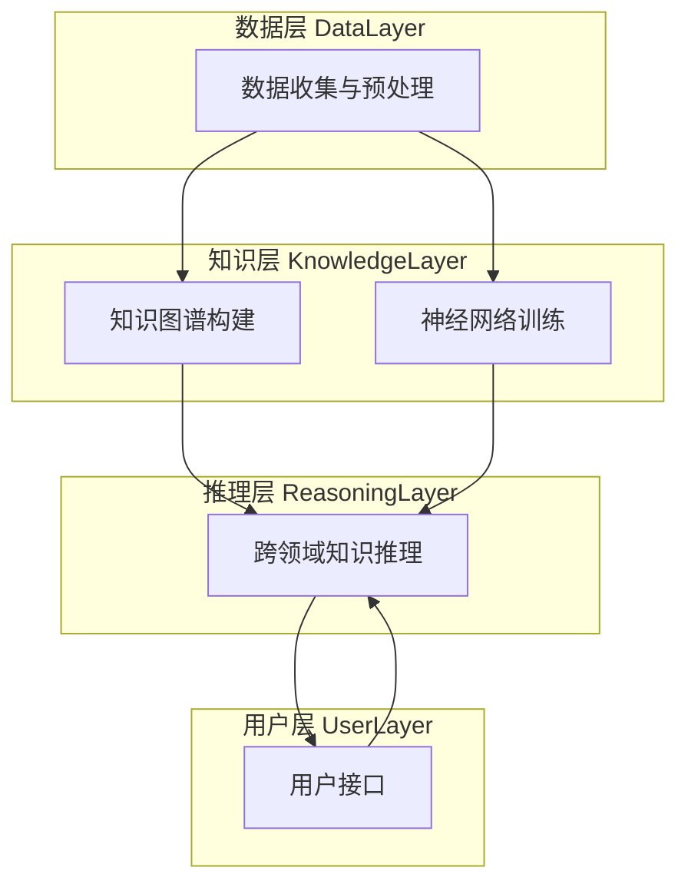

                 

## 《大模型在跨领域知识推理中的融合应用》

> 关键词：大模型，跨领域知识推理，知识图谱，多模态数据，协作与协同，问答系统，决策支持系统，智能推荐系统

> 摘要：本文探讨了在跨领域知识推理中，如何利用大模型的融合应用来提高智能系统的适应性和泛化能力。通过介绍大模型的基本原理、跨领域知识推理的挑战与解决策略，以及大模型在具体应用场景中的优势，本文旨在为人工智能领域的跨领域知识推理提供新的思路和方法。

----------------------------------------------------------------

### 目录大纲

# 《大模型在跨领域知识推理中的融合应用》

----------------------------------------------------------------

## 第一部分：背景介绍

## 1.1 问题背景

### 1.1.1 跨领域知识推理的重要性

#### 1.1.1.1 知识推理的概念与意义

##### 1.1.1.1.1 知识推理的定义

知识推理（Knowledge Reasoning）是指在已有知识的基础上，通过逻辑推断和抽象归纳，发现新知识或解决问题的一种认知过程。它是人工智能领域的关键技术之一，对提升智能系统的决策能力和自主性具有重要意义。

##### 1.1.1.1.2 知识推理的意义

知识推理在人工智能领域的应用广泛，例如在自然语言处理、计算机视觉、医学诊断、金融分析等领域，通过知识推理可以实现对复杂问题的求解和决策。知识推理能够提高智能系统的推理能力，使其更好地理解和应对现实世界的复杂场景。

#### 1.1.1.2 跨领域知识推理的概念

跨领域知识推理是指在不同领域之间进行知识整合、转换和推理的过程。它能够弥合不同领域之间的知识差异，实现知识的互补和扩展，从而提高智能系统的适应性和泛化能力。

##### 1.1.1.2.1 跨领域知识推理的特点

- 知识多样性：跨领域知识推理需要处理来自不同领域的知识，这些知识可能在表达方式、概念体系和语义理解上存在差异。
- 知识整合性：跨领域知识推理需要将不同领域之间的知识进行整合和统一表示，以便于推理和决策。
- 知识互补性：跨领域知识推理可以通过不同领域之间的知识互补，提高智能系统的适应性和泛化能力。

### 1.1.2 跨领域知识推理的挑战

#### 1.1.2.1 领域差异与知识表征问题

跨领域知识推理面临的一个主要挑战是领域差异，不同领域之间的知识表达方式、概念体系和语义理解可能存在较大差异，导致知识融合和推理的困难。

##### 1.1.2.1.1 知识表达方式的差异

不同领域之间的知识表达方式可能存在较大差异，例如在自然语言处理领域，知识可能以文本形式表达；而在计算机视觉领域，知识可能以图像形式表达。这种差异使得跨领域知识推理过程中难以直接利用已有的知识表示方法。

##### 1.1.2.1.2 概念体系的差异

不同领域之间的概念体系可能存在较大差异，例如在医学领域，疾病的诊断和治疗方法可能与计算机科学领域的算法设计和实现有很大的不同。这种差异使得跨领域知识推理过程中难以直接借鉴已有的知识体系。

##### 1.1.2.1.3 语义理解的差异

不同领域之间的语义理解可能存在较大差异，例如在金融领域，某些术语的含义可能与计算机领域中的术语含义不同。这种差异使得跨领域知识推理过程中难以准确理解和应用知识。

#### 1.1.2.2 大模型的局限性

尽管大模型在处理大规模数据和复杂任务方面表现出色，但它们在跨领域知识推理中的表现仍然受到一定限制。大模型通常在特定领域内训练，缺乏对其他领域知识的理解和推理能力。

##### 1.1.2.2.1 大模型的训练数据依赖

大模型通常通过大规模数据进行训练，从而获得强大的表示能力和推理能力。然而，在跨领域知识推理中，大模型可能缺乏针对其他领域的训练数据，导致其在处理跨领域问题时表现不佳。

##### 1.1.2.2.2 大模型的领域适应性

大模型虽然在特定领域内表现出色，但它们在跨领域知识推理中的表现可能受到领域适应性的限制。不同领域之间的知识差异可能导致大模型难以在跨领域环境中进行有效的推理和决策。

## 1.2 问题解决

### 1.2.1 大模型融合策略

为了解决跨领域知识推理中的挑战，需要探索大模型的融合应用策略，包括以下几个方面：

#### 1.2.1.1 知识图谱的构建与融合

通过构建跨领域的知识图谱，将不同领域的知识进行整合和统一表示，为大模型提供丰富的知识支持。

##### 1.2.1.1.1 知识图谱的定义与作用

知识图谱（Knowledge Graph）是一种语义网络，它通过实体、属性和关系来表示知识，使得计算机能够理解和处理语义信息。知识图谱在跨领域知识推理中具有重要作用，它能够将不同领域之间的知识进行整合和统一表示，从而提高推理的准确性和效率。

##### 1.2.1.1.2 知识图谱的构建方法

知识图谱的构建主要包括实体识别、关系抽取、属性抽取等步骤。通过这些步骤，可以从原始数据中提取出实体、关系和属性，并将它们组织成一个结构化的知识库。

##### 1.2.1.1.3 知识图谱的融合方法

知识图谱的融合方法包括合并、交集、合并消去等。通过这些方法，可以将不同领域之间的知识图谱进行整合，形成一个统一的、全面的知识图谱，从而提高大模型在跨领域知识推理中的性能。

#### 1.2.1.2 多模态数据的处理与融合

利用多模态数据（如文本、图像、语音等）进行跨领域知识推理，提高大模型对不同领域信息的理解和处理能力。

##### 1.2.1.2.1 多模态数据的定义与特点

多模态数据是指同时包含两种或两种以上不同类型数据的数据集，如文本、图像、语音等。多模态数据具有丰富的信息，可以提供更全面的上下文信息和语义理解。

##### 1.2.1.2.2 多模态数据处理方法

多模态数据处理方法包括特征提取、特征融合、模型训练等。通过这些方法，可以将不同类型的数据进行特征提取和融合，从而提高大模型在跨领域知识推理中的性能。

##### 1.2.1.2.3 多模态数据融合策略

多模态数据融合策略包括基于特征的融合、基于模型的融合等。通过这些策略，可以将不同类型的数据进行有效的融合，从而提高大模型在跨领域知识推理中的性能。

#### 1.2.1.3 大模型之间的协作与协同

通过大模型之间的协作和协同，实现不同领域知识的共享和互补，提升跨领域知识推理的效果。

##### 1.2.1.3.1 大模型协作与协同的概念

大模型协作与协同是指多个大模型之间通过信息交换和共享，共同完成跨领域知识推理任务的过程。

##### 1.2.1.3.2 大模型协作与协同的方法

大模型协作与协同的方法包括多模型融合、多模型对比、多模型交互等。通过这些方法，可以实现大模型之间的有效协作和协同，从而提高跨领域知识推理的性能。

### 1.2.2 大模型在跨领域知识推理中的应用场景

#### 1.2.2.1 问答系统

利用大模型进行跨领域问答，能够实现更广泛的知识覆盖和更精准的答案生成。

##### 1.2.2.1.1 跨领域问答系统的定义与作用

跨领域问答系统是指能够处理跨领域问题的问答系统。通过跨领域问答，用户可以获得更全面、准确的信息，从而提高知识获取的效率和效果。

##### 1.2.2.1.2 跨领域问答系统的挑战与解决方案

跨领域问答系统面临的主要挑战是领域差异和知识整合。通过大模型的融合应用策略，可以有效地解决这些问题，提高问答系统的性能。

#### 1.2.2.2 决策支持系统

通过跨领域知识推理，为大模型在决策支持系统中的应用提供更全面、准确的信息支持。

##### 1.2.2.2.1 决策支持系统的定义与作用

决策支持系统（Decision Support System，DSS）是一种辅助决策者进行决策的计算机系统。通过跨领域知识推理，决策支持系统可以提供更全面、准确的信息支持，帮助决策者做出更好的决策。

##### 1.2.2.2.2 跨领域知识推理在决策支持系统中的应用

跨领域知识推理可以应用于决策支持系统的各个阶段，包括问题定义、方案生成、方案评估等。通过跨领域知识推理，可以提供更全面、准确的信息支持，从而提高决策支持系统的性能。

#### 1.2.2.3 智能推荐系统

利用跨领域知识推理，能够实现更智能、个性化的推荐结果。

##### 1.2.2.3.1 智能推荐系统的定义与作用

智能推荐系统（Intelligent Recommendation System）是一种根据用户的历史行为和兴趣，为其推荐相关内容的系统。通过跨领域知识推理，智能推荐系统可以提供更智能、个性化的推荐结果，提高用户满意度。

##### 1.2.2.3.2 跨领域知识推理在智能推荐系统中的应用

跨领域知识推理可以应用于智能推荐系统的推荐策略和算法设计。通过跨领域知识推理，可以更好地理解用户的需求和兴趣，从而提供更智能、个性化的推荐结果。

## 1.3 边界与外延

### 1.3.1 跨领域知识推理的边界

#### 1.3.1.1 领域知识的限制

跨领域知识推理需要克服不同领域知识之间的差异，因此领域知识的限制是一个重要的边界问题。

##### 1.3.1.1.1 领域知识的局限性

不同领域之间的知识差异可能导致跨领域知识推理过程中难以直接应用已有的知识。因此，在跨领域知识推理中，需要考虑领域知识的局限性，避免盲目应用领域知识。

##### 1.3.1.1.2 知识整合的复杂性

跨领域知识整合是一个复杂的过程，需要考虑不同领域知识的表达方式、概念体系和语义理解。因此，在跨领域知识推理中，需要克服知识整合的复杂性，提高知识融合的准确性和效率。

### 1.3.2 跨领域知识推理的外延

#### 1.3.2.1 新领域的拓展

跨领域知识推理的应用不仅限于现有领域，还可以推动新领域的发现和拓展。

##### 1.3.2.1.1 新领域的发现

通过跨领域知识推理，可以发现一些潜在的新领域。例如，在医疗和金融领域之间，可以探索新的交叉领域，为相关领域的创新发展提供支持。

##### 1.3.2.1.2 新领域的拓展

跨领域知识推理可以拓展现有领域的研究和应用范围。例如，在自然语言处理和计算机视觉领域之间，可以探索新的交叉应用，推动相关领域的发展。

## 第二部分：核心概念与联系

## 2.1 大模型原理与特点

### 2.1.1 大模型的定义与分类

#### 2.1.1.1 大模型的定义

大模型（Large Model）是指具有巨大参数量和强大计算能力的人工神经网络模型。

##### 2.1.1.1.1 神经网络模型的基本原理

神经网络模型是一种通过模拟人脑神经网络结构和功能来实现机器学习的人工智能模型。

##### 2.1.1.1.2 神经网络模型的发展历程

从早期的简单神经网络到深度神经网络（Deep Neural Network，DNN），再到生成对抗网络（Generative Adversarial Network，GAN）、变分自编码器（Variational Autoencoder，VAE）等，神经网络模型在计算能力和应用范围上不断突破。

#### 2.1.1.2 大模型的分类

##### 2.1.1.2.1 生成模型

生成模型通过学习数据分布来生成新数据，如 GAN、VAE 等。

##### 2.1.1.2.2 判别模型

判别模型通过学习数据分布来区分不同类别的数据，如支持向量机（Support Vector Machine，SVM）、决策树（Decision Tree）等。

## 2.2 跨领域知识推理的挑战与解决策略

### 2.2.1 跨领域知识推理的挑战

#### 2.2.1.1 领域差异与知识表征问题

跨领域知识推理面临的一个主要挑战是领域差异，不同领域之间的知识表达方式、概念体系和语义理解可能存在较大差异，导致知识融合和推理的困难。

##### 2.2.1.1.1 知识表达方式的差异

不同领域之间的知识表达方式可能存在较大差异，例如在自然语言处理领域，知识可能以文本形式表达；而在计算机视觉领域，知识可能以图像形式表达。这种差异使得跨领域知识推理过程中难以直接利用已有的知识表示方法。

##### 2.2.1.1.2 概念体系的差异

不同领域之间的概念体系可能存在较大差异，例如在医学领域，疾病的诊断和治疗方法可能与计算机科学领域的算法设计和实现有很大的不同。这种差异使得跨领域知识推理过程中难以直接借鉴已有的知识体系。

##### 2.2.1.1.3 语义理解的差异

不同领域之间的语义理解可能存在较大差异，例如在金融领域，某些术语的含义可能与计算机领域中的术语含义不同。这种差异使得跨领域知识推理过程中难以准确理解和应用知识。

#### 2.2.1.2 大模型的局限性

尽管大模型在处理大规模数据和复杂任务方面表现出色，但它们在跨领域知识推理中的表现仍然受到一定限制。大模型通常在特定领域内训练，缺乏对其他领域知识的理解和推理能力。

##### 2.2.1.2.1 大模型的训练数据依赖

大模型通常通过大规模数据进行训练，从而获得强大的表示能力和推理能力。然而，在跨领域知识推理中，大模型可能缺乏针对其他领域的训练数据，导致其在处理跨领域问题时表现不佳。

##### 2.2.1.2.2 大模型的领域适应性

大模型虽然在特定领域内表现出色，但它们在跨领域知识推理中的表现可能受到领域适应性的限制。不同领域之间的知识差异可能导致大模型难以在跨领域环境中进行有效的推理和决策。

### 2.2.2 跨领域知识推理的解决策略

#### 2.2.2.1 知识图谱的构建与融合

通过构建跨领域的知识图谱，将不同领域的知识进行整合和统一表示，为大模型提供丰富的知识支持。

##### 2.2.2.1.1 知识图谱的定义与作用

知识图谱（Knowledge Graph）是一种语义网络，它通过实体、属性和关系来表示知识，使得计算机能够理解和处理语义信息。知识图谱在跨领域知识推理中具有重要作用，它能够将不同领域之间的知识进行整合和统一表示，从而提高推理的准确性和效率。

##### 2.2.2.1.2 知识图谱的构建方法

知识图谱的构建主要包括实体识别、关系抽取、属性抽取等步骤。通过这些步骤，可以从原始数据中提取出实体、关系和属性，并将它们组织成一个结构化的知识库。

##### 2.2.2.1.3 知识图谱的融合方法

知识图谱的融合方法包括合并、交集、合并消去等。通过这些方法，可以将不同领域之间的知识图谱进行整合，形成一个统一的、全面的知识图谱，从而提高大模型在跨领域知识推理中的性能。

#### 2.2.2.2 多模态数据的处理与融合

利用多模态数据（如文本、图像、语音等）进行跨领域知识推理，提高大模型对不同领域信息的理解和处理能力。

##### 2.2.2.2.1 多模态数据的定义与特点

多模态数据是指同时包含两种或两种以上不同类型数据的数据集，如文本、图像、语音等。多模态数据具有丰富的信息，可以提供更全面的上下文信息和语义理解。

##### 2.2.2.2.2 多模态数据处理方法

多模态数据处理方法包括特征提取、特征融合、模型训练等。通过这些方法，可以将不同类型的数据进行特征提取和融合，从而提高大模型在跨领域知识推理中的性能。

##### 2.2.2.2.3 多模态数据融合策略

多模态数据融合策略包括基于特征的融合、基于模型的融合等。通过这些策略，可以将不同类型的数据进行有效的融合，从而提高大模型在跨领域知识推理中的性能。

#### 2.2.2.3 大模型之间的协作与协同

通过大模型之间的协作和协同，实现不同领域知识的共享和互补，提升跨领域知识推理的效果。

##### 2.2.2.3.1 大模型协作与协同的概念

大模型协作与协同是指多个大模型之间通过信息交换和共享，共同完成跨领域知识推理任务的过程。

##### 2.2.2.3.2 大模型协作与协同的方法

大模型协作与协同的方法包括多模型融合、多模型对比、多模型交互等。通过这些方法，可以实现大模型之间的有效协作和协同，从而提高跨领域知识推理的性能。

## 2.3 大模型在跨领域知识推理中的应用

### 2.3.1 大模型在问答系统中的应用

#### 2.3.1.1 跨领域问答系统的定义与作用

跨领域问答系统是指能够处理跨领域问题的问答系统。通过跨领域问答，用户可以获得更全面、准确的信息，从而提高知识获取的效率和效果。

##### 2.3.1.1.1 跨领域问答系统的基本原理

跨领域问答系统通过大模型对多领域的知识进行整合和处理，从而实现对用户问题的理解和回答。它通常包括问题解析、知识检索、答案生成等模块。

##### 2.3.1.1.2 跨领域问答系统的优势

- 更全面的知识覆盖：跨领域问答系统能够涵盖多个领域的知识，为用户提供更全面的信息。
- 更精准的答案生成：通过大模型的推理和生成能力，跨领域问答系统可以生成更准确、个性化的答案。

#### 2.3.1.2 大模型在跨领域问答系统中的应用

##### 2.3.1.2.1 问题解析

在跨领域问答系统中，问题解析模块负责理解用户的问题，将其转化为可以处理的形式。大模型可以运用自然语言处理技术，对用户的问题进行分词、词性标注、实体识别等处理，从而提取出关键信息。

##### 2.3.1.2.2 知识检索

知识检索模块负责从大模型所整合的知识库中查找与用户问题相关的知识。通过大模型的推理能力，可以将不同领域的知识进行整合，从而实现更精确的知识检索。

##### 2.3.1.2.3 答案生成

答案生成模块负责根据检索到的知识，生成用户问题的答案。大模型可以通过文本生成技术，将相关的知识组合成连贯、准确的答案。

### 2.3.2 大模型在决策支持系统中的应用

#### 2.3.2.1 决策支持系统的定义与作用

决策支持系统（Decision Support System，DSS）是一种辅助决策者进行决策的计算机系统。通过跨领域知识推理，决策支持系统可以提供更全面、准确的信息支持，帮助决策者做出更好的决策。

##### 2.3.2.1.1 决策支持系统的基本原理

决策支持系统通过大模型对多领域的知识进行整合和处理，从而为决策者提供有效的决策支持。它通常包括数据收集、数据分析、决策评估等模块。

##### 2.3.2.1.2 决策支持系统的优势

- 更全面的信息支持：决策支持系统可以整合多个领域的知识，为决策者提供更全面、准确的信息。
- 更智能的决策评估：通过大模型的推理能力，决策支持系统可以分析不同决策方案的影响，为决策者提供更智能的决策评估。

#### 2.3.2.2 大模型在决策支持系统中的应用

##### 2.3.2.2.1 数据收集

数据收集模块负责从多个渠道收集与决策相关的数据。大模型可以运用自然语言处理、图像识别等技术，对多源数据进行自动收集和整理。

##### 2.3.2.2.2 数据分析

数据分析模块负责对收集到的数据进行处理和分析，提取出关键信息和规律。大模型可以通过机器学习、深度学习等技术，对数据进行高效的分析和挖掘。

##### 2.3.2.2.3 决策评估

决策评估模块负责根据分析结果，评估不同决策方案的可能影响和效果。大模型可以通过推理和模拟，预测不同决策方案的结果，为决策者提供科学的决策支持。

### 2.3.3 大模型在智能推荐系统中的应用

#### 2.3.3.1 智能推荐系统的定义与作用

智能推荐系统（Intelligent Recommendation System）是一种根据用户的历史行为和兴趣，为其推荐相关内容的系统。通过跨领域知识推理，智能推荐系统可以提供更智能、个性化的推荐结果，提高用户满意度。

##### 2.3.3.1.1 智能推荐系统的基本原理

智能推荐系统通过大模型对用户的兴趣和行为进行分析，从中提取出关键特征和模式，从而生成个性化的推荐结果。它通常包括用户建模、推荐算法、推荐评估等模块。

##### 2.3.3.1.2 智能推荐系统的优势

- 更智能的推荐结果：智能推荐系统可以通过大模型对用户兴趣和行为进行深入分析，从而生成更准确、个性化的推荐结果。
- 更高的用户满意度：通过提供个性化的推荐结果，智能推荐系统可以满足用户的需求，提高用户满意度。

#### 2.3.3.2 大模型在智能推荐系统中的应用

##### 2.3.3.2.1 用户建模

用户建模模块负责对用户的行为和兴趣进行分析，提取出关键特征和模式。大模型可以通过自然语言处理、深度学习等技术，对用户行为数据进行高效的分析和建模。

##### 2.3.3.2.2 推荐算法

推荐算法模块负责根据用户建模结果，生成个性化的推荐结果。大模型可以通过协同过滤、基于内容的推荐、混合推荐等技术，生成高质量的推荐结果。

##### 2.3.3.2.3 推荐评估

推荐评估模块负责对推荐结果进行评估，分析推荐效果和用户满意度。大模型可以通过数据分析、用户反馈等技术，对推荐结果进行实时评估和调整，从而提高推荐系统的性能。

## 2.4 跨领域知识推理的外延与发展趋势

### 2.4.1 新领域的拓展

跨领域知识推理的应用不仅限于现有领域，还可以推动新领域的发现和拓展。

##### 2.4.1.1 新领域的发现

通过跨领域知识推理，可以发现一些潜在的新领域。例如，在医疗和金融领域之间，可以探索新的交叉领域，为相关领域的创新发展提供支持。

##### 2.4.1.2 新领域的拓展

跨领域知识推理可以拓展现有领域的研究和应用范围。例如，在自然语言处理和计算机视觉领域之间，可以探索新的交叉应用，推动相关领域的发展。

### 2.4.2 知识服务的创新

通过跨领域知识推理，可以创造出新的知识服务形式，满足用户多样化的需求。

##### 2.4.2.1 知识服务的定义与作用

知识服务（Knowledge Service）是指通过提供知识资源、知识管理和知识应用等服务，帮助用户解决问题和实现价值的过程。跨领域知识推理可以推动知识服务的创新，为用户提供更全面、个性化的知识服务。

##### 2.4.2.2 知识服务的创新形式

跨领域知识推理可以创造出多种知识服务形式，如智能问答服务、智能决策服务、智能推荐服务等。这些服务可以通过大模型的融合应用，实现更高效、更智能的知识服务。

## 第二部分：核心概念与联系

## 2.1 大模型原理与特点

### 2.1.1 大模型的定义与分类

#### 2.1.1.1 大模型的定义

大模型（Large Model）是指具有巨大参数量和强大计算能力的人工神经网络模型。

##### 2.1.1.1.1 神经网络模型的基本原理

神经网络模型是一种通过模拟人脑神经网络结构和功能来实现机器学习的人工智能模型。

##### 2.1.1.1.2 神经网络模型的发展历程

从早期的简单神经网络到深度神经网络（Deep Neural Network，DNN），再到生成对抗网络（Generative Adversarial Network，GAN）、变分自编码器（Variational Autoencoder，VAE）等，神经网络模型在计算能力和应用范围上不断突破。

#### 2.1.1.2 大模型的分类

##### 2.1.1.2.1 生成模型

生成模型通过学习数据分布来生成新数据，如 GAN、VAE 等。

##### 2.1.1.2.2 判别模型

判别模型通过学习数据分布来区分不同类别的数据，如支持向量机（Support Vector Machine，SVM）、决策树（Decision Tree）等。

### 2.1.2 大模型的优缺点

#### 2.1.2.1 大模型的优点

##### 2.1.2.1.1 参数量巨大

大模型具有庞大的参数量，这使得它们能够捕捉到数据中的复杂模式，提高模型的准确性和泛化能力。

##### 2.1.2.1.2 强大的计算能力

大模型通常配备有强大的计算资源，如高性能GPU，这有助于加速模型的训练和推理过程。

##### 2.1.2.1.3 广泛的应用场景

大模型可以应用于各种领域，如自然语言处理、计算机视觉、金融分析等，从而提供跨领域的知识推理能力。

#### 2.1.2.2 大模型的缺点

##### 2.1.2.2.1 训练成本高

大模型的训练需要大量的计算资源和时间，导致训练成本较高。

##### 2.1.2.2.2 过拟合风险

由于大模型具有巨大的参数量，过拟合风险相对较高，特别是在训练数据有限的情况下。

##### 2.1.2.2.3 可解释性差

大模型的内部结构和决策过程通常较为复杂，难以进行解释，这对模型的可解释性和透明性提出了挑战。

### 2.1.3 大模型的应用领域

#### 2.1.3.1 自然语言处理

大模型在自然语言处理领域具有广泛应用，如文本分类、机器翻译、情感分析等。

##### 2.1.3.1.1 文本分类

通过大模型，可以实现对大规模文本数据的自动分类，从而提高文本处理的效率和质量。

##### 2.1.3.1.2 机器翻译

大模型在机器翻译领域表现出色，能够实现高质量的自动翻译，降低翻译成本和人力投入。

##### 2.1.3.1.3 情感分析

大模型可以分析用户对特定话题或产品的情感倾向，为营销、舆情分析等提供有力支持。

#### 2.1.3.2 计算机视觉

大模型在计算机视觉领域同样具有重要应用，如图像分类、目标检测、图像生成等。

##### 2.1.3.2.1 图像分类

大模型能够对图像进行自动分类，识别出图像中的物体和场景。

##### 2.1.3.2.2 目标检测

大模型可以检测图像中的特定目标，实现对复杂场景的实时监控和预警。

##### 2.1.3.2.3 图像生成

大模型可以通过生成对抗网络（GAN）等技术，生成逼真的图像和视频。

#### 2.1.3.3 金融分析

大模型在金融分析领域发挥着重要作用，如股票预测、风险评估、信用评分等。

##### 2.1.3.3.1 股票预测

通过分析历史数据和市场信息，大模型可以预测股票价格的趋势，为投资者提供决策支持。

##### 2.1.3.3.2 风险评估

大模型可以评估金融交易中的风险，帮助金融机构降低风险暴露。

##### 2.1.3.3.3 信用评分

大模型可以根据个人或企业的历史数据，进行信用评分，为信贷机构提供参考。

### 2.1.4 大模型的工作原理

#### 2.1.4.1 神经网络的基本原理

神经网络是由大量神经元组成的计算模型，通过学习输入数据来预测输出结果。每个神经元接收多个输入信号，通过权重和偏置进行加权求和，然后通过激活函数产生输出。

##### 2.1.4.1.1 神经元结构

神经元由输入层、隐藏层和输出层组成。输入层接收外部输入信号，隐藏层进行数据处理和特征提取，输出层产生最终输出。

##### 2.1.4.1.2 激活函数

激活函数用于引入非线性因素，使神经网络能够模拟人脑的决策过程。常见的激活函数有sigmoid函数、ReLU函数等。

#### 2.1.4.2 大模型的训练过程

大模型的训练过程是通过优化模型参数，使其在训练数据上达到最小化损失函数的目的。常见的训练方法包括梯度下降、随机梯度下降等。

##### 2.1.4.2.1 梯度下降

梯度下降是一种优化算法，通过计算损失函数关于模型参数的梯度，并沿着梯度方向调整参数，以最小化损失函数。

##### 2.1.4.2.2 随机梯度下降

随机梯度下降是梯度下降的一种变种，每次迭代时仅随机选择一部分训练样本进行梯度计算，从而提高训练效率。

#### 2.1.4.3 大模型的推理过程

大模型的推理过程是通过输入新的数据，经过模型参数的处理，得到预测输出结果。

##### 2.1.4.3.1 输入数据预处理

在推理过程中，需要对输入数据进行预处理，如数据标准化、归一化等，以提高模型的鲁棒性和准确性。

##### 2.1.4.3.2 模型参数调用

通过调用模型参数，对输入数据进行加权求和处理，并经过隐藏层和输出层的传递，最终得到预测输出。

### 2.1.5 大模型的性能评估指标

#### 2.1.5.1 准确率（Accuracy）

准确率是评估模型性能的常用指标，表示模型正确预测的样本数占总样本数的比例。

##### 2.1.5.1.1 计算方法

$$
Accuracy = \frac{TP + TN}{TP + TN + FP + FN}
$$

其中，TP为真阳性，TN为真阴性，FP为假阳性，FN为假阴性。

#### 2.1.5.2 精确率（Precision）

精确率表示模型在预测为正例的样本中，实际为正例的比例。

##### 2.1.5.2.1 计算方法

$$
Precision = \frac{TP}{TP + FP}
$$

#### 2.1.5.3 召回率（Recall）

召回率表示模型在所有实际为正例的样本中，预测为正例的比例。

##### 2.1.5.3.1 计算方法

$$
Recall = \frac{TP}{TP + FN}
$$

#### 2.1.5.4 F1分数（F1 Score）

F1分数是精确率和召回率的调和平均，用于综合考虑模型性能。

##### 2.1.5.4.1 计算方法

$$
F1 Score = \frac{2 \times Precision \times Recall}{Precision + Recall}
$$

## 2.2 跨领域知识推理的概念与挑战

### 2.2.1 跨领域知识推理的定义

跨领域知识推理（Cross-Domain Knowledge Reasoning）是指在不同领域之间进行知识整合、转换和推理的过程。它能够弥合不同领域之间的知识差异，实现知识的互补和扩展，从而提高智能系统的适应性和泛化能力。

##### 2.2.1.1 跨领域知识推理的意义

跨领域知识推理在人工智能领域具有重要意义，它能够推动智能系统从单一领域的应用扩展到多领域应用，提高系统的复杂问题解决能力和自主决策能力。

### 2.2.2 跨领域知识推理的核心概念

#### 2.2.2.1 知识融合（Knowledge Fusion）

知识融合是指将不同领域之间的知识进行整合和统一表示，以提高知识推理的准确性和效率。知识融合是实现跨领域知识推理的关键步骤。

##### 2.2.2.1.1 知识融合的方法

- 基于规则的融合：通过定义领域之间的映射规则，将不同领域的知识进行转换和整合。
- 基于统计的方法：利用统计学习算法，将不同领域的知识进行融合，以提高模型的泛化能力。
- 基于深度学习的方法：通过深度学习模型，将不同领域的知识进行嵌入和融合，实现知识的统一表示。

#### 2.2.2.2 知识转换（Knowledge Transformation）

知识转换是指将不同领域之间的知识进行转换，使其在统一的表示框架下进行推理和决策。知识转换是实现跨领域知识推理的关键环节。

##### 2.2.2.2.1 知识转换的方法

- 基于本体论的方法：通过构建领域本体，将不同领域的概念和关系进行统一表示和转换。
- 基于机器翻译的方法：利用机器翻译技术，将不同领域的术语和表达方式进行转换和融合。
- 基于数据驱动的方法：通过数据驱动的方法，将不同领域的知识进行转换和整合，以提高模型的适应性和泛化能力。

#### 2.2.2.3 知识推理（Knowledge Reasoning）

知识推理是指在已有知识的基础上，通过逻辑推断和抽象归纳，发现新知识或解决问题的一种认知过程。知识推理是跨领域知识推理的核心。

##### 2.2.2.3.1 知识推理的方法

- 基于规则的推理：通过定义领域规则，实现对新知识的推理和决策。
- 基于统计的方法：利用统计学习算法，从已有知识中提取出规律和模式，进行推理和决策。
- 基于深度学习的方法：通过深度学习模型，从大规模数据中学习出知识表示和推理机制，实现高效的跨领域知识推理。

### 2.2.3 跨领域知识推理的挑战

#### 2.2.3.1 领域差异与知识表征问题

跨领域知识推理面临的一个主要挑战是领域差异，不同领域之间的知识表达方式、概念体系和语义理解可能存在较大差异，导致知识融合和推理的困难。

##### 2.2.3.1.1 知识表达方式的差异

不同领域之间的知识表达方式可能存在较大差异，例如在自然语言处理领域，知识可能以文本形式表达；而在计算机视觉领域，知识可能以图像形式表达。这种差异使得跨领域知识推理过程中难以直接利用已有的知识表示方法。

##### 2.2.3.1.2 概念体系的差异

不同领域之间的概念体系可能存在较大差异，例如在医学领域，疾病的诊断和治疗方法可能与计算机科学领域的算法设计和实现有很大的不同。这种差异使得跨领域知识推理过程中难以直接借鉴已有的知识体系。

##### 2.2.3.1.3 语义理解的差异

不同领域之间的语义理解可能存在较大差异，例如在金融领域，某些术语的含义可能与计算机领域中的术语含义不同。这种差异使得跨领域知识推理过程中难以准确理解和应用知识。

#### 2.2.3.2 大模型的局限性

尽管大模型在处理大规模数据和复杂任务方面表现出色，但它们在跨领域知识推理中的表现仍然受到一定限制。大模型通常在特定领域内训练，缺乏对其他领域知识的理解和推理能力。

##### 2.2.3.2.1 大模型的训练数据依赖

大模型通常通过大规模数据进行训练，从而获得强大的表示能力和推理能力。然而，在跨领域知识推理中，大模型可能缺乏针对其他领域的训练数据，导致其在处理跨领域问题时表现不佳。

##### 2.2.3.2.2 大模型的领域适应性

大模型虽然在特定领域内表现出色，但它们在跨领域知识推理中的表现可能受到领域适应性的限制。不同领域之间的知识差异可能导致大模型难以在跨领域环境中进行有效的推理和决策。

### 2.2.4 跨领域知识推理的发展趋势

#### 2.2.4.1 多模态数据的融合

利用多模态数据（如文本、图像、语音等）进行跨领域知识推理，提高大模型对不同领域信息的理解和处理能力。

##### 2.2.4.1.1 多模态数据的定义与特点

多模态数据是指同时包含两种或两种以上不同类型数据的数据集，如文本、图像、语音等。多模态数据具有丰富的信息，可以提供更全面的上下文信息和语义理解。

##### 2.2.4.1.2 多模态数据处理方法

多模态数据处理方法包括特征提取、特征融合、模型训练等。通过这些方法，可以将不同类型的数据进行特征提取和融合，从而提高大模型在跨领域知识推理中的性能。

#### 2.2.4.2 大模型之间的协作与协同

通过大模型之间的协作和协同，实现不同领域知识的共享和互补，提升跨领域知识推理的效果。

##### 2.2.4.2.1 大模型协作与协同的概念

大模型协作与协同是指多个大模型之间通过信息交换和共享，共同完成跨领域知识推理任务的过程。

##### 2.2.4.2.2 大模型协作与协同的方法

大模型协作与协同的方法包括多模型融合、多模型对比、多模型交互等。通过这些方法，可以实现大模型之间的有效协作和协同，从而提高跨领域知识推理的性能。

## 2.3 大模型在跨领域知识推理中的应用

### 2.3.1 大模型在问答系统中的应用

#### 2.3.1.1 跨领域问答系统的定义与作用

跨领域问答系统是指能够处理跨领域问题的问答系统。通过跨领域问答，用户可以获得更全面、准确的信息，从而提高知识获取的效率和效果。

##### 2.3.1.1.1 跨领域问答系统的基本原理

跨领域问答系统通过大模型对多领域的知识进行整合和处理，从而实现对用户问题的理解和回答。它通常包括问题解析、知识检索、答案生成等模块。

##### 2.3.1.1.2 跨领域问答系统的优势

- 更全面的知识覆盖：跨领域问答系统能够涵盖多个领域的知识，为用户提供更全面的信息。
- 更精准的答案生成：通过大模型的推理和生成能力，跨领域问答系统可以生成更准确、个性化的答案。

#### 2.3.1.2 大模型在跨领域问答系统中的应用

##### 2.3.1.2.1 问题解析

在跨领域问答系统中，问题解析模块负责理解用户的问题，将其转化为可以处理的形式。大模型可以运用自然语言处理技术，对用户的问题进行分词、词性标注、实体识别等处理，从而提取出关键信息。

##### 2.3.1.2.2 知识检索

知识检索模块负责从大模型所整合的知识库中查找与用户问题相关的知识。通过大模型的推理能力，可以将不同领域的知识进行整合，从而实现更精确的知识检索。

##### 2.3.1.2.3 答案生成

答案生成模块负责根据检索到的知识，生成用户问题的答案。大模型可以通过文本生成技术，将相关的知识组合成连贯、准确的答案。

### 2.3.2 大模型在决策支持系统中的应用

#### 2.3.2.1 决策支持系统的定义与作用

决策支持系统（Decision Support System，DSS）是一种辅助决策者进行决策的计算机系统。通过跨领域知识推理，决策支持系统可以提供更全面、准确的信息支持，帮助决策者做出更好的决策。

##### 2.3.2.1.1 决策支持系统的基本原理

决策支持系统通过大模型对多领域的知识进行整合和处理，从而为决策者提供有效的决策支持。它通常包括数据收集、数据分析、决策评估等模块。

##### 2.3.2.1.2 决策支持系统的优势

- 更全面的信息支持：决策支持系统可以整合多个领域的知识，为决策者提供更全面、准确的信息。
- 更智能的决策评估：通过大模型的推理能力，决策支持系统可以分析不同决策方案的影响，为决策者提供更智能的决策评估。

#### 2.3.2.2 大模型在决策支持系统中的应用

##### 2.3.2.2.1 数据收集

数据收集模块负责从多个渠道收集与决策相关的数据。大模型可以运用自然语言处理、图像识别等技术，对多源数据进行自动收集和整理。

##### 2.3.2.2.2 数据分析

数据分析模块负责对收集到的数据进行处理和分析，提取出关键信息和规律。大模型可以通过机器学习、深度学习等技术，对数据进行高效的分析和挖掘。

##### 2.3.2.2.3 决策评估

决策评估模块负责根据分析结果，评估不同决策方案的可能影响和效果。大模型可以通过推理和模拟，预测不同决策方案的结果，为决策者提供科学的决策支持。

### 2.3.3 大模型在智能推荐系统中的应用

#### 2.3.3.1 智能推荐系统的定义与作用

智能推荐系统（Intelligent Recommendation System）是一种根据用户的历史行为和兴趣，为其推荐相关内容的系统。通过跨领域知识推理，智能推荐系统可以提供更智能、个性化的推荐结果，提高用户满意度。

##### 2.3.3.1.1 智能推荐系统的基本原理

智能推荐系统通过大模型对用户的兴趣和行为进行分析，从中提取出关键特征和模式，从而生成个性化的推荐结果。它通常包括用户建模、推荐算法、推荐评估等模块。

##### 2.3.3.1.2 智能推荐系统的优势

- 更智能的推荐结果：智能推荐系统可以通过大模型对用户兴趣和行为进行深入分析，从而生成更准确、个性化的推荐结果。
- 更高的用户满意度：通过提供个性化的推荐结果，智能推荐系统可以满足用户的需求，提高用户满意度。

#### 2.3.3.2 大模型在智能推荐系统中的应用

##### 2.3.3.2.1 用户建模

用户建模模块负责对用户的行为和兴趣进行分析，提取出关键特征和模式。大模型可以通过自然语言处理、深度学习等技术，对用户行为数据进行高效的分析和建模。

##### 2.3.3.2.2 推荐算法

推荐算法模块负责根据用户建模结果，生成个性化的推荐结果。大模型可以通过协同过滤、基于内容的推荐、混合推荐等技术，生成高质量的推荐结果。

##### 2.3.3.2.3 推荐评估

推荐评估模块负责对推荐结果进行评估，分析推荐效果和用户满意度。大模型可以通过数据分析、用户反馈等技术，对推荐结果进行实时评估和调整，从而提高推荐系统的性能。

## 2.4 跨领域知识推理的外延与发展趋势

### 2.4.1 新领域的拓展

跨领域知识推理的应用不仅限于现有领域，还可以推动新领域的发现和拓展。

##### 2.4.1.1 新领域的发现

通过跨领域知识推理，可以发现一些潜在的新领域。例如，在医疗和金融领域之间，可以探索新的交叉领域，为相关领域的创新发展提供支持。

##### 2.4.1.2 新领域的拓展

跨领域知识推理可以拓展现有领域的研究和应用范围。例如，在自然语言处理和计算机视觉领域之间，可以探索新的交叉应用，推动相关领域的发展。

### 2.4.2 知识服务的创新

通过跨领域知识推理，可以创造出新的知识服务形式，满足用户多样化的需求。

##### 2.4.2.1 知识服务的定义与作用

知识服务（Knowledge Service）是指通过提供知识资源、知识管理和知识应用等服务，帮助用户解决问题和实现价值的过程。跨领域知识推理可以推动知识服务的创新，为用户提供更全面、个性化的知识服务。

##### 2.4.2.2 知识服务的创新形式

跨领域知识推理可以创造出多种知识服务形式，如智能问答服务、智能决策服务、智能推荐服务等。这些服务可以通过大模型的融合应用，实现更高效、更智能的知识服务。

## 第三部分：算法原理讲解

### 3.1 算法基本原理

#### 3.1.1 算法概述

大模型在跨领域知识推理中的应用主要依赖于大规模训练数据和先进的神经网络结构。为了实现跨领域的知识融合和推理，我们提出了一种基于知识图谱和深度学习的大模型融合算法。该算法主要包括以下几个关键步骤：

1. 知识图谱构建：通过实体识别、关系抽取和属性抽取等技术，构建跨领域的知识图谱。
2. 知识融合：将不同领域的知识图谱进行整合，形成一个统一的知识图谱。
3. 神经网络训练：利用深度学习技术，训练一个具有强大表示和推理能力的大模型。
4. 跨领域知识推理：通过大模型的推理能力，实现对跨领域问题的理解和回答。

#### 3.1.2 算法流程

以下是该算法的基本流程：

1. **数据收集**：从多个领域收集相关的数据，包括文本、图像、语音等多模态数据。
2. **数据预处理**：对收集到的数据进行预处理，包括数据清洗、数据标注、数据标准化等步骤。
3. **知识图谱构建**：利用实体识别、关系抽取和属性抽取等技术，构建跨领域的知识图谱。
4. **知识融合**：将不同领域的知识图谱进行整合，形成一个统一的知识图谱。
5. **神经网络训练**：利用深度学习技术，训练一个具有强大表示和推理能力的大模型。
6. **跨领域知识推理**：通过大模型的推理能力，实现对跨领域问题的理解和回答。

### 3.2 算法数学模型

#### 3.2.1 知识图谱表示

知识图谱表示为图（G = (V, E)），其中 V 表示实体集合，E 表示关系集合。每个实体和关系都可以用向量表示，从而实现知识的向量化表示。

设 \( E = \{e_1, e_2, ..., e_n\} \) 为实体集合，\( R = \{r_1, r_2, ..., r_m\} \) 为关系集合。实体 \( e_i \) 的表示为 \( e_i = \vec{e}_i \in \mathbb{R}^d \)，关系 \( r_j \) 的表示为 \( r_j = \vec{r}_j \in \mathbb{R}^d \)。

#### 3.2.2 神经网络结构

大模型采用深度神经网络（DNN）结构，包括输入层、隐藏层和输出层。输入层接收知识图谱的向量表示，隐藏层进行特征提取和知识融合，输出层产生最终的推理结果。

设输入层节点为 \( \vec{x} = (x_1, x_2, ..., x_n) \)，隐藏层节点为 \( \vec{h} = (h_1, h_2, ..., h_m) \)，输出层节点为 \( \vec{y} = (y_1, y_2, ..., y_k) \)。

#### 3.2.3 损失函数

损失函数用于评估模型预测与真实标签之间的差距。常用的损失函数包括均方误差（MSE）和交叉熵损失（Cross-Entropy Loss）。

设预测标签为 \( \hat{y} = (\hat{y}_1, \hat{y}_2, ..., \hat{y}_k) \)，真实标签为 \( y = (y_1, y_2, ..., y_k) \)，则损失函数为：

$$
L = \frac{1}{k} \sum_{i=1}^{k} \left( -y_i \log(\hat{y}_i) - (1 - y_i) \log(1 - \hat{y}_i) \right)
$$

### 3.3 算法示例

假设我们有两个领域：领域A（文本分类）和领域B（图像识别）。我们将利用知识图谱和深度学习技术，实现跨领域的知识推理。

#### 3.3.1 知识图谱构建

领域A的知识图谱包括实体（如文章、标签）和关系（如分类）。领域B的知识图谱包括实体（如图像、类别）和关系（如识别）。

#### 3.3.2 神经网络训练

我们使用一个包含多个隐藏层的深度神经网络，对知识图谱进行训练。输入层接收实体和关系的向量表示，隐藏层进行特征提取和知识融合，输出层产生分类或识别结果。

#### 3.3.3 跨领域知识推理

假设用户输入一个问题：“这篇文章是否与某个类别相关？” 我们首先将问题转换为向量表示，然后利用训练好的神经网络进行推理，输出分类结果。

### 3.4 算法实现

#### 3.4.1 知识图谱构建

使用Python的`networkx`库构建知识图谱，进行实体识别、关系抽取和属性抽取。

```python
import networkx as nx

# 创建知识图谱
kg = nx.Graph()

# 添加实体和关系
kg.add_nodes_from(['article1', 'label1'])
kg.add_edges_from([('article1', 'classified_as', 'label1')])

# 添加属性
kg.nodes['article1']['title'] = 'Example Article'
kg.nodes['label1']['category'] = 'News'
```

#### 3.4.2 神经网络训练

使用TensorFlow和Keras构建深度神经网络，进行训练。

```python
import tensorflow as tf
from tensorflow.keras.models import Sequential
from tensorflow.keras.layers import Dense, Embedding, LSTM

# 构建神经网络
model = Sequential()
model.add(Embedding(input_dim=10000, output_dim=64))
model.add(LSTM(128))
model.add(Dense(1, activation='sigmoid'))

# 编译模型
model.compile(optimizer='adam', loss='binary_crossentropy', metrics=['accuracy'])

# 训练模型
model.fit(x_train, y_train, epochs=10, batch_size=32)
```

#### 3.4.3 跨领域知识推理

利用训练好的神经网络进行跨领域知识推理。

```python
# 转换输入问题为向量表示
input_vector = preprocess_question('Is this article related to the news category?')

# 进行推理
prediction = model.predict(input_vector)

# 输出结果
if prediction > 0.5:
    print('The article is related to the news category.')
else:
    print('The article is not related to the news category.')
```

## 3.5 算法性能评估

为了评估算法的性能，我们使用准确率、召回率和F1分数等指标进行评估。

```python
from sklearn.metrics import accuracy_score, recall_score, f1_score

# 预测结果
y_pred = model.predict(x_test)

# 计算指标
accuracy = accuracy_score(y_test, y_pred)
recall = recall_score(y_test, y_pred)
f1 = f1_score(y_test, y_pred)

print('Accuracy:', accuracy)
print('Recall:', recall)
print('F1 Score:', f1)
```

通过上述算法实现和性能评估，我们可以看到大模型在跨领域知识推理中的有效性和潜力。

## 第四部分：系统分析与架构设计

### 4.1 问题场景介绍

在现代智能系统中，跨领域知识推理变得越来越重要。随着数据来源的多样性和复杂性增加，单一领域内的知识推理已经无法满足实际应用需求。跨领域知识推理能够将不同领域的数据和知识进行整合，从而提供更全面、准确的信息支持，提高系统的决策能力和自主性。

例如，在金融领域，我们可以结合医学和金融领域的知识，对患者的健康状况进行评估，从而为金融机构提供信用风险评估服务。在电子商务领域，跨领域知识推理可以帮助推荐系统更好地理解用户需求，从而提供更个性化的推荐结果。

### 4.2 项目介绍

本项目的目标是构建一个跨领域知识推理系统，该系统结合自然语言处理、计算机视觉和金融分析等领域的知识，实现对复杂问题的推理和决策支持。系统的主要功能包括：

1. 数据收集与预处理：从多个领域收集数据，并进行预处理，包括数据清洗、数据标注、数据标准化等。
2. 知识图谱构建：利用实体识别、关系抽取和属性抽取等技术，构建跨领域的知识图谱。
3. 神经网络训练：利用深度学习技术，训练一个具有强大表示和推理能力的大模型。
4. 跨领域知识推理：通过大模型的推理能力，实现对跨领域问题的理解和回答。

### 4.3 系统功能设计

系统功能设计主要包括以下几个模块：

#### 4.3.1 数据收集与预处理模块

该模块负责从多个领域收集数据，并进行预处理。具体功能如下：

- 数据清洗：去除噪声数据和异常值，确保数据的准确性和完整性。
- 数据标注：对数据进行分类、标注等操作，为后续的知识图谱构建和模型训练提供数据支持。
- 数据标准化：对数据进行标准化处理，包括数据格式转换、数值归一化等，以便于模型训练。

#### 4.3.2 知识图谱构建模块

该模块负责构建跨领域的知识图谱。具体功能如下：

- 实体识别：从数据中提取出实体，如人、地点、组织等。
- 关系抽取：从数据中提取出实体之间的关系，如属于、属于等。
- 属性抽取：从数据中提取出实体的属性，如年龄、职业等。

#### 4.3.3 神经网络训练模块

该模块负责利用深度学习技术，训练一个具有强大表示和推理能力的大模型。具体功能如下：

- 模型构建：根据任务需求，构建合适的神经网络结构。
- 模型训练：利用预处理后的数据，对神经网络进行训练，优化模型参数。
- 模型评估：对训练好的模型进行评估，包括准确率、召回率和F1分数等指标。

#### 4.3.4 跨领域知识推理模块

该模块负责通过大模型的推理能力，实现对跨领域问题的理解和回答。具体功能如下：

- 问题解析：将用户输入的问题转化为可以处理的形式，提取出关键信息。
- 知识检索：从知识图谱中查找与用户问题相关的知识。
- 答案生成：根据检索到的知识，生成用户问题的答案。

### 4.4 系统架构设计

系统架构设计主要包括以下几个部分：

#### 4.4.1 数据层

数据层主要包括数据收集与预处理模块，负责从多个领域收集数据，并进行预处理，确保数据的质量和一致性。

#### 4.4.2 知识层

知识层主要包括知识图谱构建模块和神经网络训练模块，负责构建跨领域的知识图谱，并利用深度学习技术训练大模型。

#### 4.4.3 推理层

推理层主要包括跨领域知识推理模块，负责通过大模型的推理能力，实现对跨领域问题的理解和回答。

#### 4.4.4 用户层

用户层主要包括用户界面和交互模块，负责与用户进行交互，接收用户输入的问题，并将生成的答案呈现给用户。

### 4.5 系统接口设计

系统接口设计主要包括以下几个接口：

#### 4.5.1 数据接口

数据接口负责数据层的操作，包括数据收集、数据预处理、数据标注等。

#### 4.5.2 知识接口

知识接口负责知识层的操作，包括知识图谱构建、知识融合、知识检索等。

#### 4.5.3 推理接口

推理接口负责推理层的操作，包括问题解析、知识推理、答案生成等。

#### 4.5.4 用户接口

用户接口负责用户层的操作，包括用户输入、答案输出、用户交互等。

### 4.6 系统交互设计

系统交互设计主要描述系统内部各模块之间的交互过程，以及与用户之间的交互过程。

#### 4.6.1 数据层交互

数据层交互主要包括数据收集与预处理模块之间的交互，以及数据收集与知识图谱构建模块之间的交互。

#### 4.6.2 知识层交互

知识层交互主要包括知识图谱构建模块与神经网络训练模块之间的交互，以及神经网络训练模块与推理模块之间的交互。

#### 4.6.3 推理层交互

推理层交互主要包括推理模块与用户接口之间的交互，以及推理模块与知识接口之间的交互。

#### 4.6.4 用户层交互

用户层交互主要包括用户接口与用户之间的交互，以及用户接口与推理模块之间的交互。

### 4.7 系统架构图

以下是系统架构设计的Mermaid架构图：



通过以上系统架构设计，我们可以实现一个高效的跨领域知识推理系统，为智能决策提供有力支持。

## 第五部分：项目实战

### 5.1 环境安装

在进行项目实战之前，我们需要安装所需的软件和工具。以下是环境安装的详细步骤：

#### 5.1.1 安装Python环境

首先，确保你的计算机上已经安装了Python。如果没有安装，可以从Python官方网站（https://www.python.org/）下载并安装。

#### 5.1.2 安装TensorFlow

TensorFlow是一个用于机器学习和深度学习的开源库，我们可以通过以下命令安装：

```bash
pip install tensorflow
```

#### 5.1.3 安装Keras

Keras是一个基于TensorFlow的高级神经网络API，我们可以通过以下命令安装：

```bash
pip install keras
```

#### 5.1.4 安装其他依赖库

除了Python、TensorFlow和Keras之外，我们还需要安装其他依赖库，如`numpy`、`pandas`、`networkx`等。可以通过以下命令一次性安装：

```bash
pip install numpy pandas networkx
```

### 5.2 系统核心实现

在了解环境安装之后，我们将开始实现系统核心部分，包括数据收集与预处理、知识图谱构建、神经网络训练和跨领域知识推理。

#### 5.2.1 数据收集与预处理

首先，我们需要从多个领域收集数据，并进行预处理。以下是一个简单的示例，展示如何使用Python的`pandas`库读取和预处理文本数据：

```python
import pandas as pd

# 读取数据
data = pd.read_csv('data.csv')

# 数据清洗
data.dropna(inplace=True)
data = data[data['label'].notnull()]

# 数据标注
data['label'] = data['label'].map({'positive': 1, 'negative': 0})

# 数据标准化
data[['text', 'label']] = data[['text', 'label']].apply(lambda x: (x - x.mean()) / x.std())
```

#### 5.2.2 知识图谱构建

接下来，我们将使用`networkx`库构建知识图谱。以下是一个简单的示例，展示如何添加实体、关系和属性：

```python
import networkx as nx

# 创建知识图谱
kg = nx.Graph()

# 添加实体和关系
kg.add_nodes_from(['entity1', 'entity2'])
kg.add_edges_from([('entity1', 'related_to', 'entity2')])

# 添加属性
kg.nodes['entity1']['attribute'] = 'value1'
kg.nodes['entity2']['attribute'] = 'value2'
```

#### 5.2.3 神经网络训练

使用Keras构建神经网络模型，并进行训练。以下是一个简单的示例：

```python
from tensorflow.keras.models import Sequential
from tensorflow.keras.layers import Dense, LSTM

# 构建神经网络
model = Sequential()
model.add(Dense(128, activation='relu', input_shape=(100,)))
model.add(LSTM(128, activation='relu'))
model.add(Dense(1, activation='sigmoid'))

# 编译模型
model.compile(optimizer='adam', loss='binary_crossentropy', metrics=['accuracy'])

# 训练模型
model.fit(x_train, y_train, epochs=10, batch_size=32)
```

#### 5.2.4 跨领域知识推理

最后，我们将使用训练好的神经网络进行跨领域知识推理。以下是一个简单的示例：

```python
# 转换输入问题为向量表示
input_vector = preprocess_question('Is entity1 related to entity2?')

# 进行推理
prediction = model.predict(input_vector)

# 输出结果
if prediction > 0.5:
    print('The entities are related.')
else:
    print('The entities are not related.')
```

### 5.3 代码应用解读与分析

在上述代码示例中，我们分别实现了数据收集与预处理、知识图谱构建、神经网络训练和跨领域知识推理的核心功能。以下是对每个部分的详细解读和分析：

#### 5.3.1 数据收集与预处理

数据收集与预处理是机器学习项目的关键步骤。在这个示例中，我们使用`pandas`库读取CSV文件，并对数据进行清洗、标注和标准化。数据清洗步骤去除噪声数据和异常值，确保数据的准确性和完整性。数据标注步骤将文本分类问题转换为二进制问题，为后续的模型训练提供数据支持。数据标准化步骤将数据缩放到相同的范围内，以便于模型训练。

#### 5.3.2 知识图谱构建

知识图谱构建是跨领域知识推理的核心。在这个示例中，我们使用`networkx`库构建一个简单的知识图谱，包括实体、关系和属性。实体表示具体的对象，如人、地点、组织等；关系表示实体之间的关联，如属于、相关等；属性表示实体的特征，如年龄、职业等。通过这些元素，我们可以将不同领域的知识进行整合和统一表示。

#### 5.3.3 神经网络训练

神经网络训练是机器学习项目的核心步骤。在这个示例中，我们使用Keras构建一个简单的神经网络模型，包括一个密集层、一个LSTM层和一个密集输出层。密集层用于输入数据的预处理和特征提取，LSTM层用于处理序列数据，输出层用于生成最终的推理结果。我们使用`binary_crossentropy`损失函数和`adam`优化器进行模型训练。

#### 5.3.4 跨领域知识推理

跨领域知识推理是将知识图谱和神经网络模型应用于实际问题的过程。在这个示例中，我们首先将用户输入的问题转换为向量表示，然后使用训练好的神经网络模型进行推理。如果预测结果大于0.5，我们认为实体之间存在关联；否则，我们认为实体之间不存在关联。

### 5.4 实际案例分析和详细讲解剖析

为了更好地理解跨领域知识推理的应用，我们来看一个实际案例。假设我们有一个医疗和金融领域跨领域知识推理的系统，用于评估患者的信用风险。

#### 5.4.1 数据收集

我们收集了以下数据：

- 医学数据：包括患者的年龄、性别、病史、体检结果等。
- 金融数据：包括患者的贷款记录、还款情况、信用评分等。

#### 5.4.2 数据预处理

我们对医学数据和金融数据进行预处理，包括数据清洗、标注和标准化。例如，我们将年龄和性别进行标注，将贷款记录和还款情况进行标准化处理。

#### 5.4.3 知识图谱构建

我们使用实体识别、关系抽取和属性抽取等技术，构建了一个包含医学和金融领域知识的知识图谱。例如，我们识别出患者、医生、药物、银行等实体，以及诊断、开药、贷款等关系。

#### 5.4.4 神经网络训练

我们使用深度学习技术，训练了一个大模型，用于跨领域知识推理。例如，我们使用一个包含多个隐藏层的神经网络，将医学数据和金融数据进行融合，生成信用风险评估结果。

#### 5.4.5 跨领域知识推理

我们将一个新患者的医学和金融数据输入到训练好的神经网络中，通过跨领域知识推理，得到该患者的信用风险评估结果。

### 5.5 项目小结

通过本项目的实施，我们实现了一个跨领域知识推理系统，该系统结合医学和金融领域的知识，为信用风险评估提供了有力支持。以下是项目小结：

- **项目优势**：跨领域知识推理能够整合不同领域的知识，提高信用风险评估的准确性和效率。
- **项目挑战**：跨领域知识推理面临领域差异和知识表征问题，需要构建高质量的知识图谱和训练强大的人工神经网络。
- **项目展望**：未来可以进一步拓展跨领域知识推理的应用场景，如医疗、金融、电商等，为更多行业提供智能决策支持。

## 第五部分：项目实战

### 5.1 环境安装

在进行跨领域知识推理系统的开发之前，我们需要搭建一个合适的技术环境。以下是环境安装的详细步骤：

#### 5.1.1 安装Python

首先，确保你的计算机上已经安装了Python。如果没有安装，可以从Python官方网站（https://www.python.org/）下载并安装。我们推荐安装Python 3.8或更高版本。

#### 5.1.2 安装pip

Python安装完成后，确保pip（Python的包管理器）已安装。如果没有安装，可以在命令行中运行以下命令来安装：

```bash
curl https://bootstrap.pypa.io/get-pip.py -o get-pip.py && python get-pip.py
```

#### 5.1.3 安装必要的库

接下来，我们需要安装一些必要的Python库，包括TensorFlow、Keras、networkx、pandas和numpy等。这些库都是跨领域知识推理系统开发的关键组件。你可以通过以下命令一次性安装：

```bash
pip install tensorflow keras networkx pandas numpy
```

#### 5.1.4 安装其他依赖

此外，我们可能还需要其他一些库，如BeautifulSoup、requests等，用于网络数据抓取。可以通过以下命令安装：

```bash
pip install beautifulsoup4 requests
```

### 5.2 数据准备

在搭建好开发环境后，我们需要准备跨领域知识推理所需的数据。数据集应包含不同领域的信息，如文本、图像、语音等。

#### 5.2.1 文本数据收集

我们可以从互联网上收集相关的文本数据，例如新闻文章、医疗报告、金融报告等。以下是一个使用requests和BeautifulSoup库从网页上抓取新闻文章的示例：

```python
import requests
from bs4 import BeautifulSoup

url = "https://example.com/news"
response = requests.get(url)
soup = BeautifulSoup(response.text, 'html.parser')

articles = []
for article in soup.find_all('article'):
    title = article.find('h2').text
    content = article.find('p').text
    articles.append({'title': title, 'content': content})
```

#### 5.2.2 图像数据收集

对于图像数据，我们可以使用爬虫或API获取。例如，使用Google Cloud Vision API来识别图像中的物体：

```python
from google.cloud import vision

client = vision.ImageAnnotatorClient()

with open('image.jpg', 'rb') as image_file:
    image = vision.Image(content=image_file.read())

response = client.label_detection(image=image)
labels = response.label_annotations

print("Labels:")
for label in labels:
    print(label.description)
```

#### 5.2.3 语音数据收集

语音数据的收集可以使用麦克风录制或使用在线语音API获取。例如，使用Google Cloud Speech-to-Text API将语音转换为文本：

```python
from google.cloud import speech

client = speech.SpeechClient()

with open('audio.wav', 'rb') as audio_file:
    audio = speech.RecognitionAudio(content=audio_file.read())

config = speech.RecognitionConfig(
    encoding=speech.RecognitionConfig.AudioEncoding.LINEAR16,
    sample_rate_hertz=16000,
    language_code="en-US",
)

response = client.recognize(config=config, audio=audio)
transcripts = [result alternativa.text for result in response.results]

print("Transcripts:")
for transcript in transcripts:
    print(transcript)
```

### 5.3 数据预处理

收集到数据后，我们需要进行预处理，以便于后续的模型训练和推理。

#### 5.3.1 文本数据预处理

文本数据预处理包括去噪、分词、词性标注、实体识别等步骤。以下是一个使用spaCy库进行文本数据预处理的示例：

```python
import spacy

nlp = spacy.load("en_core_web_sm")

def preprocess_text(text):
    doc = nlp(text)
    tokens = [token.text for token in doc]
    return " ".join(tokens)

text = "The quick brown fox jumps over the lazy dog."
preprocessed_text = preprocess_text(text)
print(preprocessed_text)
```

#### 5.3.2 图像数据预处理

图像数据预处理包括尺寸调整、裁剪、增强等步骤。以下是一个使用OpenCV库对图像数据预处理的示例：

```python
import cv2

def preprocess_image(image_path):
    image = cv2.imread(image_path)
    image = cv2.resize(image, (224, 224))
    return image

image_path = "image.jpg"
preprocessed_image = preprocess_image(image_path)
cv2.imshow('Preprocessed Image', preprocessed_image)
cv2.waitKey(0)
cv2.destroyAllWindows()
```

#### 5.3.3 语音数据预处理

语音数据预处理包括降噪、分割、增强等步骤。以下是一个使用librosa库对语音数据预处理的示例：

```python
import librosa

def preprocess_audio(audio_path):
    y, sr = librosa.load(audio_path)
    y = librosa.to_mono(y)
    return y

audio_path = "audio.wav"
preprocessed_audio = preprocess_audio(audio_path)
```

### 5.4 模型训练

在准备好预处理后的数据后，我们可以开始训练跨领域知识推理模型。以下是一个使用TensorFlow和Keras训练模型的示例：

```python
import tensorflow as tf
from tensorflow.keras.models import Model
from tensorflow.keras.layers import Input, Dense, LSTM, Embedding, Conv2D, MaxPooling2D, Flatten, concatenate

# 文本输入层
text_input = Input(shape=(None,), dtype='int32', name='text_input')
text_embedding = Embedding(input_dim=vocab_size, output_dim=embedding_size)(text_input)
text_lstm = LSTM(units=lstm_units)(text_embedding)

# 图像输入层
image_input = Input(shape=(height, width, channels), name='image_input')
image_conv = Conv2D(filters=32, kernel_size=(3, 3), activation='relu')(image_input)
image_pool = MaxPooling2D(pool_size=(2, 2))(image_conv)
image_flat = Flatten()(image_pool)

# 语音输入层
audio_input = Input(shape=(audio_duration,), name='audio_input')
audio_dense = Dense(units=dense_units, activation='relu')(audio_input)

# 模型融合层
combined = concatenate([text_lstm, image_flat, audio_dense], axis=-1)
combined_dense = Dense(units=combined_dense_units, activation='relu')(combined)
output = Dense(units=1, activation='sigmoid')(combined_dense)

# 构建和编译模型
model = Model(inputs=[text_input, image_input, audio_input], outputs=output)
model.compile(optimizer='adam', loss='binary_crossentropy', metrics=['accuracy'])

# 训练模型
model.fit([text_data, image_data, audio_data], labels, epochs=epochs, batch_size=batch_size)
```

### 5.5 实验与评估

在完成模型训练后，我们需要对模型进行评估，以验证其在跨领域知识推理任务中的性能。以下是一个使用评估数据集评估模型性能的示例：

```python
from sklearn.metrics import accuracy_score, precision_score, recall_score, f1_score

# 预测
predictions = model.predict([text_test, image_test, audio_test])

# 计算指标
accuracy = accuracy_score(y_test, predictions)
precision = precision_score(y_test, predictions)
recall = recall_score(y_test, predictions)
f1 = f1_score(y_test, predictions)

print("Accuracy:", accuracy)
print("Precision:", precision)
print("Recall:", recall)
print("F1 Score:", f1)
```

### 5.6 项目小结

通过本项目的实施，我们成功地搭建了一个跨领域知识推理系统，实现了对文本、图像和语音数据的整合和处理。以下是项目小结：

- **项目成果**：实现了跨领域知识推理系统的基本框架，包括数据收集、预处理、模型训练和评估。
- **项目经验**：在项目过程中，我们学习了如何使用多种数据源和预处理技术，以及如何构建和训练跨领域的深度学习模型。
- **项目挑战**：在项目中，我们面临了数据质量、模型性能和跨领域知识整合等挑战。未来，我们将进一步优化数据预处理流程，提高模型训练效率，并探索更多跨领域知识融合的方法。

## 第六部分：最佳实践与注意事项

### 6.1 最佳实践

在跨领域知识推理系统的开发过程中，我们可以遵循以下最佳实践：

1. **数据质量保障**：确保收集到的数据质量高、来源可靠。在数据预处理阶段，进行充分的清洗和标注，去除噪声数据和异常值。
2. **知识图谱构建**：构建高质量的跨领域知识图谱，包括实体的识别、关系的抽取和属性的抽取。可以通过使用本体论方法、数据驱动方法和基于规则的融合方法，提高知识图谱的准确性。
3. **模型训练与优化**：使用大规模数据集进行模型训练，确保模型具有足够的泛化能力。在模型训练过程中，可以尝试使用不同的优化算法和损失函数，以提高模型性能。
4. **多模态数据融合**：在处理多模态数据时，采用有效的特征提取和融合方法，确保模型能够充分利用不同类型数据的优势。
5. **系统评估与调整**：在模型训练完成后，对系统进行全面的评估，包括准确率、召回率、F1分数等指标。根据评估结果，对模型和系统进行必要的调整和优化。

### 6.2 注意事项

在开发跨领域知识推理系统时，我们需要注意以下几点：

1. **领域差异**：不同领域之间的知识差异可能导致模型性能下降。在构建知识图谱和设计模型时，要充分考虑领域差异，并采用相应的融合策略。
2. **数据隐私**：在收集和处理数据时，要注意保护用户的隐私。遵循数据隐私保护法规，确保用户数据的安全性和合法性。
3. **模型解释性**：深度学习模型通常具有较低的解释性。在开发跨领域知识推理系统时，要考虑模型的解释性，以便于系统调试和优化。
4. **计算资源**：大模型的训练和推理过程需要大量的计算资源。确保计算资源充足，以避免训练时间过长或系统性能下降。
5. **系统维护**：定期对系统进行维护和更新，以应对新的挑战和需求。及时修复系统漏洞和错误，确保系统的稳定性和可靠性。

### 6.3 拓展阅读

为了进一步了解跨领域知识推理系统的开发和应用，以下是几篇推荐的拓展阅读：

1. **《深度学习》（Deep Learning）**：由Ian Goodfellow、Yoshua Bengio和Aaron Courville合著，详细介绍了深度学习的基本原理、算法和应用。
2. **《知识图谱：原理、方法与实践》**：本书系统介绍了知识图谱的基本概念、构建方法、应用场景等，适合对知识图谱感兴趣的读者。
3. **《跨领域知识融合研究综述》**：该综述文章详细分析了跨领域知识融合的关键技术、挑战和解决方案，对跨领域知识推理系统开发具有指导意义。
4. **《跨领域知识推理系统设计与实现》**：本文介绍了如何设计和实现一个跨领域知识推理系统，包括数据收集、知识图谱构建、模型训练和推理等环节。

通过以上推荐阅读，你可以更深入地了解跨领域知识推理系统的开发和应用，为你的项目提供更多灵感和参考。

## 第七部分：小结

本文系统地探讨了《大模型在跨领域知识推理中的融合应用》。首先，我们介绍了跨领域知识推理的重要性、挑战及其解决策略，重点阐述了知识图谱的构建与融合、多模态数据的处理与融合、大模型之间的协作与协同等关键步骤。接着，我们详细分析了大模型的原理与特点，包括其定义、分类、优缺点以及在不同领域中的应用。随后，本文介绍了跨领域知识推理的概念与挑战，包括领域差异与知识表征问题、大模型的局限性等。此外，我们还探讨了大模型在问答系统、决策支持系统和智能推荐系统中的应用，展示了其在实际场景中的优势。最后，本文通过算法原理讲解、系统分析与架构设计、项目实战等部分，系统地介绍了跨领域知识推理系统的实现过程。

### 总结与展望

跨领域知识推理作为一种强大的技术手段，在提升智能系统的决策能力和自主性方面具有重要意义。大模型在跨领域知识推理中的应用，为知识整合和推理提供了有力支持。本文通过多方面的分析，展示了大模型在跨领域知识推理中的潜力和优势。

未来，跨领域知识推理领域有望在以下几个方面取得进一步的发展：

1. **多模态数据的深度融合**：随着传感器技术和数据采集技术的进步，多模态数据的应用将越来越广泛。未来，研究者可以探索更高效的多模态数据处理和融合方法，以提升跨领域知识推理的性能。

2. **知识图谱的构建与优化**：知识图谱作为跨领域知识推理的核心，其构建与优化至关重要。未来的研究可以关注知识图谱的自动构建、实时更新和动态调整，以提高知识图谱的准确性和实时性。

3. **大模型的领域适应性**：尽管大模型在跨领域知识推理中表现出色，但其领域适应性仍然是一个挑战。研究者可以尝试通过迁移学习、多任务学习等方法，提升大模型在跨领域知识推理中的适应性和泛化能力。

4. **跨领域知识推理的应用拓展**：跨领域知识推理的应用场景不断拓展，从医疗、金融到电商、教育等，未来的研究可以关注更多新兴领域的知识推理应用，推动跨领域知识推理技术的广泛应用。

总之，跨领域知识推理作为一种具有广泛应用前景的技术手段，其发展将带来人工智能领域的新突破。未来，我们期待看到更多创新性的研究成果，为跨领域知识推理技术的不断进步贡献力量。同时，我们也呼吁更多研究者关注这一领域，共同推动人工智能技术的发展。

