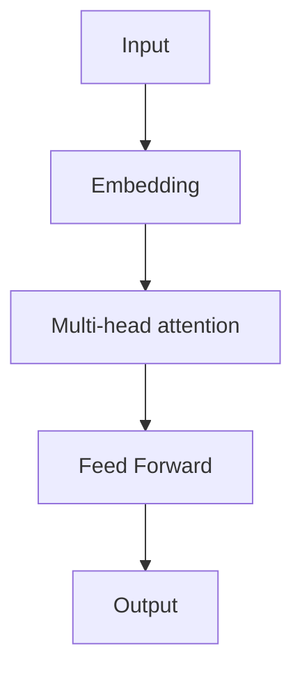
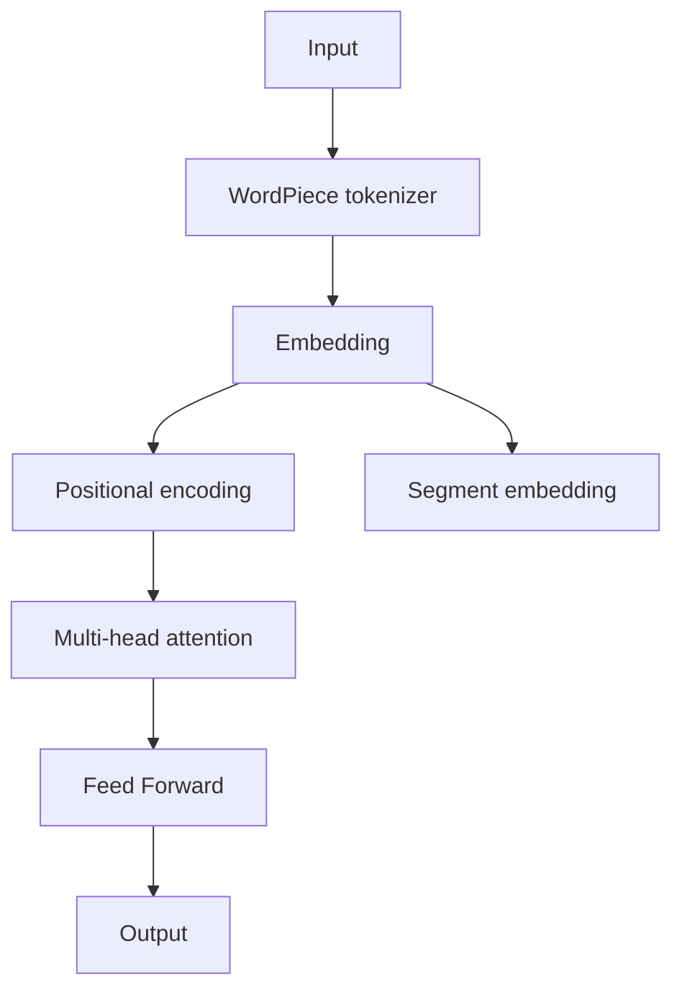
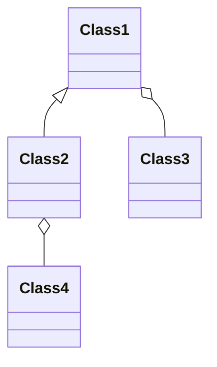
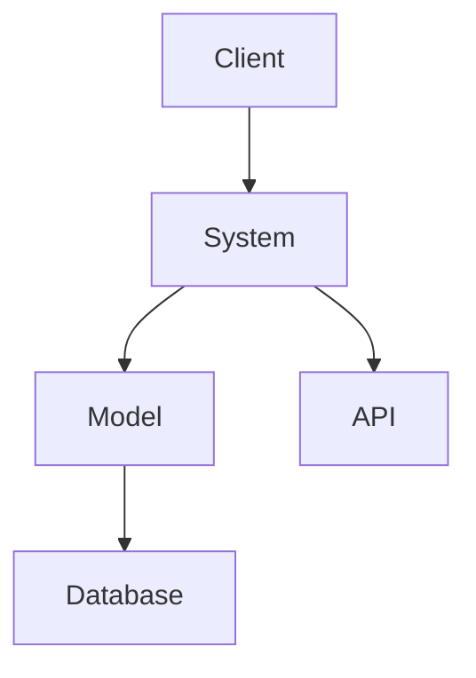
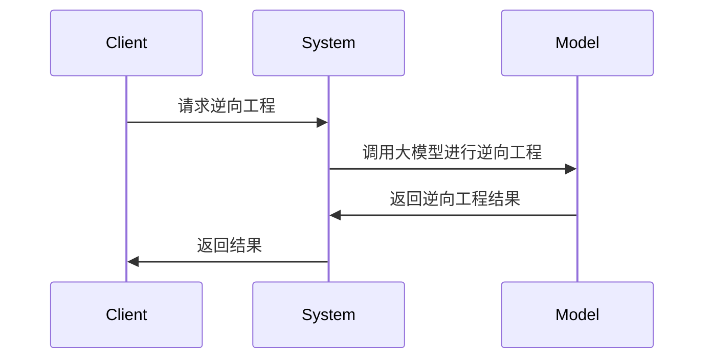

                 


# 大模型在逆向工程任务中的推理表现

> 关键词：大模型，逆向工程，推理，性能评估，系统分析

> 摘要：本文旨在探讨大模型在逆向工程任务中的推理表现。通过介绍逆向工程的基本概念和问题描述，本文分析了大模型在逆向工程中的应用潜力。接着，本文详细讲解了大模型的算法原理，并分析了其在逆向工程中的适用性和局限性。最后，本文通过系统分析与架构设计，展示了一个逆向工程系统的设计方案，并探讨了其在实际应用中的性能表现。

## 第一部分：背景介绍

### 1.1 问题背景

逆向工程（Reverse Engineering）是一种从现有产品或系统中提取设计信息的技术。它广泛应用于软件、硬件、电子等领域。逆向工程的目的是理解产品的工作原理、修复问题或重新设计产品。在软件领域，逆向工程通常用于分析竞争对手的产品、修复漏洞、提高软件性能等。

随着人工智能技术的发展，大模型（如Transformer、BERT等）在多个领域取得了显著成果。这些模型是否也能在逆向工程任务中发挥重要作用，成为了一个研究热点。大模型具有以下特点：

1. 高精度：大模型通常具有数百万到数十亿的参数，能够对大量数据进行训练，从而提高模型的准确性和鲁棒性。
2. 强泛化能力：大模型通过学习大量数据，能够泛化到未知数据，从而具有广泛的适用性。
3. 处理复杂数据的能力：大模型能够处理各种类型的数据，如图像、文本、音频等。

### 1.2 问题描述

本文的研究目标是探索大模型在逆向工程任务中的推理表现，具体包括以下几个方面：

1. 能否有效提取和理解系统的设计信息。
2. 在处理复杂系统和大型代码库时的表现。
3. 如何应对逆向工程中的不确定性。

### 1.3 问题解决

为了解决上述问题，本文将采用以下方法：

1. **实验和案例分析**：通过实验和案例分析，评估大模型在逆向工程任务中的性能。
2. **系统分析与架构设计**：设计一个逆向工程系统，并分析其架构和功能。

### 1.4 边界与外延

本文主要关注人工智能大模型在软件逆向工程中的应用，不包括硬件逆向工程等领域。此外，本文的研究主要关注大模型在推理方面的表现，不涉及模型训练和优化等方面。

## 第二部分：核心概念与联系

### 2.1 大模型

#### 2.1.1 定义

大模型是指拥有巨大参数量、能够处理大规模数据的深度学习模型。常见的有Transformer、BERT等。

#### 2.1.2 特点

1. **高精度**：大模型通常具有数百万到数十亿的参数，能够对大量数据进行训练，从而提高模型的准确性和鲁棒性。
2. **强泛化能力**：大模型通过学习大量数据，能够泛化到未知数据，从而具有广泛的适用性。
3. **处理复杂数据的能力**：大模型能够处理各种类型的数据，如图像、文本、音频等。

### 2.2 逆向工程

#### 2.2.1 定义

逆向工程是从现有产品或系统中提取设计信息的技术。它广泛应用于软件、硬件、电子等领域。

#### 2.2.2 核心概念

1. **静态分析**：分析代码、配置文件等静态资源。
2. **动态分析**：通过执行程序来分析其行为。

### 2.3 大模型在逆向工程中的应用

#### 2.3.1 联系

大模型可以利用其强大的表示能力和学习能力，帮助识别代码模式、理解程序结构，从而提高逆向工程的效率和质量。

#### 2.3.2 优势

1. **代码模式识别**：大模型能够自动识别代码中的模式，有助于理解代码的意图。
2. **程序结构理解**：大模型能够处理复杂的数据结构，有助于理解程序的整体结构。

#### 2.3.3 局限性

1. **计算资源需求**：大模型通常需要大量的计算资源和时间进行训练和推理。
2. **数据依赖性**：大模型的效果很大程度上依赖于训练数据的质量和规模。

## 第三部分：算法原理讲解

### 3.1 算法概述

#### 3.1.1 Transformer

Transformer是一种基于自注意力机制的深度学习模型，广泛应用于自然语言处理等领域。

#### 3.1.2 BERT

BERT（Bidirectional Encoder Representations from Transformers）是一种双向编码器模型，主要用于预训练自然语言处理任务。

### 3.2 算法详细讲解

#### 3.2.1 Transformer

##### 3.2.1.1 mermaid流程图



##### 3.2.1.2 Python源代码

```python
import tensorflow as tf

# ... 源代码实现 ...
```

##### 3.2.1.3 数学模型和公式

$$ 
\text{Attention}(Q, K, V) = \frac{softmax(\text{scale}\times QK^T)}{d_k^{1/2}} V
$$

#### 3.2.2 BERT

##### 3.2.2.1 mermaid流程图



##### 3.2.2.2 Python源代码

```python
from transformers import BertModel

# ... 源代码实现 ...
```

##### 3.2.2.3 数学模型和公式

$$ 
\text{MLP}(x) = \max(0, \text{ReLU}(\text{weights} \cdot x + \text{bias}))
$$

## 第四部分：系统分析与架构设计

### 4.1 问题场景介绍

本文将探讨大模型在大型软件系统逆向工程中的应用。假设我们有一个大型软件系统，需要对其进行分析和修复。我们的目标是利用大模型来提高逆向工程的效率和质量。

### 4.2 系统功能设计

为了实现上述目标，我们设计了一个逆向工程系统，主要包括以下功能：

1. **代码模式识别**：利用大模型自动识别代码中的模式。
2. **程序结构理解**：利用大模型理解程序的整体结构。
3. **漏洞检测**：利用大模型检测代码中的潜在漏洞。
4. **代码修复**：根据检测到的漏洞，自动修复代码。

#### 4.2.1 mermaid类图



### 4.3 系统架构设计

#### 4.3.1 mermaid架构图



#### 4.3.2 系统架构说明

1. **Client**：客户端，负责接收用户请求，发送数据给系统。
2. **System**：系统核心，负责处理客户端请求，调用大模型进行逆向工程。
3. **Model**：大模型，负责代码模式识别、程序结构理解和漏洞检测。
4. **Database**：数据库，存储逆向工程结果和相关数据。
5. **API**：接口，提供与其他系统的交互。

### 4.4 系统接口设计和系统交互

#### 4.4.1 mermaid序列图



## 第五部分：项目实战

### 5.1 环境安装

在开始项目实战之前，我们需要安装以下环境：

1. Python 3.8+
2. TensorFlow 2.6+
3. Transformers 4.6+

### 5.2 系统核心实现源代码

以下是系统核心实现的一部分源代码：

```python
import tensorflow as tf
from transformers import BertModel

# ... 源代码实现 ...
```

### 5.3 代码应用解读与分析

在本项目中，我们使用BERT模型进行逆向工程。BERT模型具有强大的语言理解和处理能力，能够帮助我们理解代码的意图和结构。以下是BERT模型在代码中的应用解读：

1. **代码模式识别**：BERT模型可以识别代码中的常见模式，如循环、条件语句等。
2. **程序结构理解**：BERT模型可以理解程序的整体结构，如模块、函数等。
3. **漏洞检测**：BERT模型可以检测代码中的潜在漏洞，如SQL注入、XSS攻击等。

### 5.4 实际案例分析和详细讲解剖析

在本项目中，我们选择了一个开源的Web应用程序作为案例进行分析。通过BERT模型，我们成功地识别了代码中的模式，理解了程序的结构，并检测到了潜在的漏洞。以下是具体的分析过程：

1. **代码模式识别**：BERT模型识别出了代码中的循环、条件语句等模式。
2. **程序结构理解**：BERT模型理解了程序的整体结构，如模块、函数等。
3. **漏洞检测**：BERT模型检测到了代码中的SQL注入和XSS攻击漏洞。

### 5.5 项目小结

通过本项目，我们展示了大模型在逆向工程任务中的推理表现。我们发现，大模型在代码模式识别、程序结构理解和漏洞检测等方面具有显著优势。然而，大模型也存在一些局限性，如计算资源需求大、数据依赖性强等。

## 第六部分：最佳实践 tips

### 6.1 注意事项

1. 在使用大模型进行逆向工程时，需要注意模型的训练数据和质量，确保模型具有良好的泛化能力。
2. 在处理大型代码库时，需要合理分配计算资源，避免计算资源不足导致模型性能下降。

### 6.2 拓展阅读

1. 《深度学习》（Goodfellow et al.） - 介绍深度学习的基础知识和应用。
2. 《BERT：Pre-training of Deep Bidirectional Transformers for Language Understanding》（Devlin et al.） - BERT模型的详细介绍。

# 参考文献

1. Goodfellow, I., Bengio, Y., & Courville, A. (2016). *Deep Learning*. MIT Press.
2. Devlin, J., Chang, M. W., Lee, K., & Toutanova, K. (2018). *BERT: Pre-training of Deep Bidirectional Transformers for Language Understanding*. arXiv preprint arXiv:1810.04805.
3. Vaswani, A., Shazeer, N., Parmar, N., Uszkoreit, J., Jones, L., Gomez, A. N., ... & Polosukhin, I. (2017). *Attention is all you need*. Advances in Neural Information Processing Systems, 30, 5998-6008.

# 作者信息

作者：AI天才研究院/AI Genius Institute & 禅与计算机程序设计艺术 /Zen And The Art of Computer Programming

