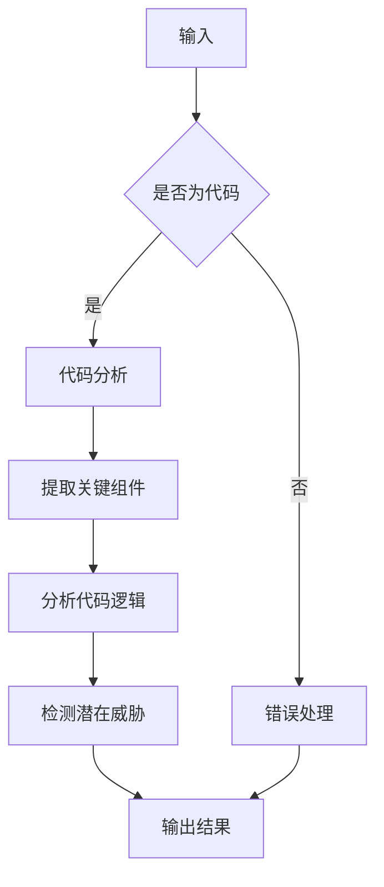
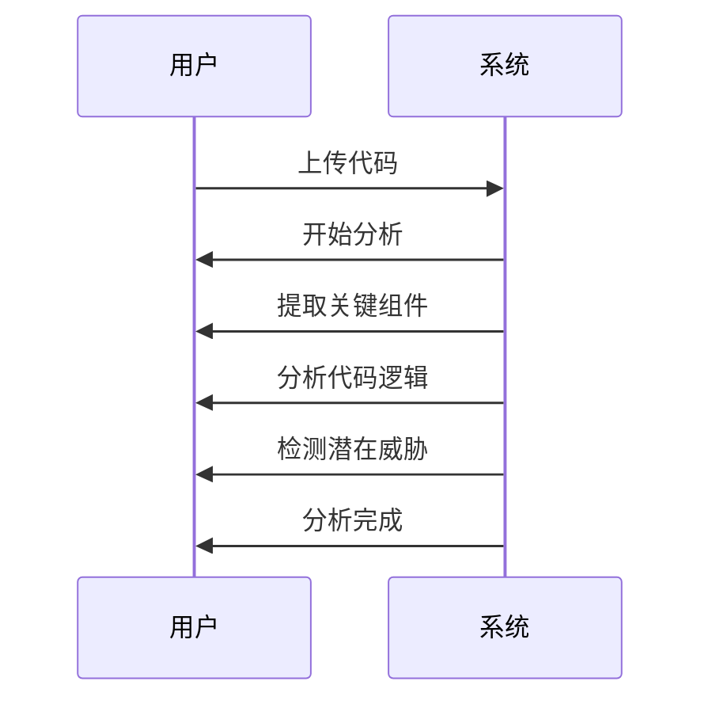
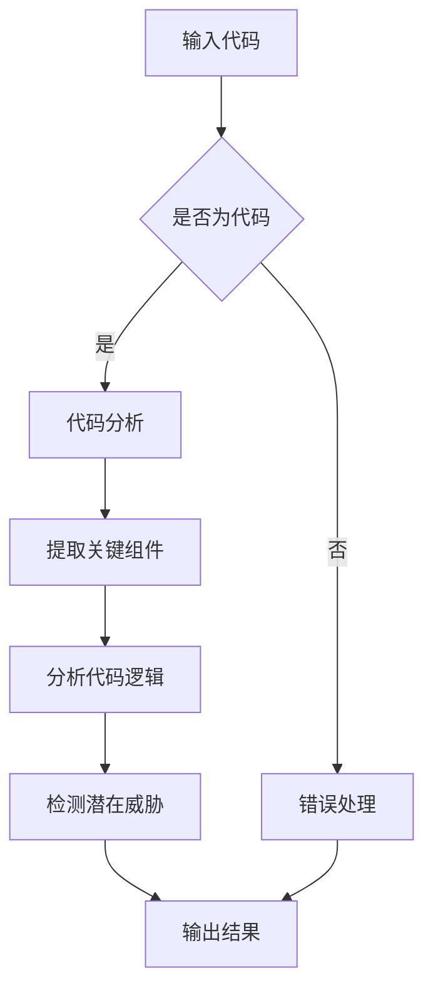

                 


### 大模型在逆向工程推理中的能力边界探索

> 关键词：大模型、逆向工程、推理、能力边界、人工智能

> 摘要：本文将深入探讨大模型在逆向工程推理中的能力边界，通过分析其核心概念、算法原理、系统架构和实战案例，揭示大模型在逆向工程中的应用潜力和局限性，为相关领域的研究和实践提供有价值的参考。

#### 第1章 背景介绍

#### 1.1 大模型技术概述

大模型是指具有巨大参数量和复杂结构的神经网络模型，如GPT-3、BERT等。它们在自然语言处理、计算机视觉、语音识别等领域取得了显著成就。然而，大模型在逆向工程推理中的应用仍然是一个相对较新的领域，其能力边界尚未完全明确。

#### 1.2 逆向工程的基本概念

逆向工程是指从已有的软件系统逆向推导出其设计文档和源代码的过程。它有助于理解现有系统的内部工作机制，发现潜在的安全漏洞和优化改进点。随着软件系统的复杂性增加，逆向工程变得愈发重要。

#### 1.3 大模型在逆向工程中的潜在应用

大模型在逆向工程推理中具有巨大的潜力。例如，它们可以用于自动提取软件系统的关键组件、分析代码逻辑、检测潜在的安全威胁等。然而，大模型在逆向工程中的实际应用仍然面临诸多挑战。

#### 1.4 能力边界的定义与研究意义

能力边界是指大模型在逆向工程推理中能够处理的最大问题规模、最复杂的问题结构和最高的处理精度。研究能力边界对于提升大模型在逆向工程中的应用效果、优化算法设计和指导实践具有重要意义。

#### 第2章 核心概念与联系

#### 2.1 大模型概念

大模型是指具有巨大参数量和复杂结构的神经网络模型，如GPT-3、BERT等。它们在自然语言处理、计算机视觉、语音识别等领域取得了显著成就。

#### 2.2 逆向工程概念

逆向工程是指从已有的软件系统逆向推导出其设计文档和源代码的过程。它有助于理解现有系统的内部工作机制，发现潜在的安全漏洞和优化改进点。

#### 2.3 大模型与逆向工程的联系

大模型与逆向工程有着紧密的联系。大模型可以用于自动提取软件系统的关键组件、分析代码逻辑、检测潜在的安全威胁等。然而，大模型在逆向工程中的实际应用仍然面临诸多挑战。

#### 2.4 概念属性特征对比表格

| 特征 | 大模型 | 逆向工程 |
| --- | --- | --- |
| 参数量 | 巨大 | 中等 |
| 结构复杂度 | 高 | 高 |
| 应用领域 | 广泛 | 狭窄 |
| 能力边界 | 未知 | 明确 |

#### 2.5 ER实体关系图架构

| 实体 | 关系 | 实体 |
| --- | --- | --- |
| 大模型 | 应用 | 逆向工程 |
| 逆向工程 | 目标 | 软件系统 |
| 软件系统 | 包含 | 关键组件 |

#### 第3章 算法原理讲解

#### 3.1 算法mermaid流程图



#### 3.2 Python源代码详细阐述

```python
import some逆向工程库

def 大模型逆向工程(输入代码):
    if isinstance(输入代码, str):
        代码分析结果 = some逆向工程库分析代码(输入代码)
        关键组件 = 代码分析结果提取关键组件()
        代码逻辑 = 分析代码逻辑(关键组件)
        潜在威胁 = 检测潜在威胁(代码逻辑)
        输出结果 = {
            "关键组件": 关键组件,
            "代码逻辑": 代码逻辑,
            "潜在威胁": 潜在威胁
        }
        return 输出结果
    else:
        return "错误：输入不是代码"

```

#### 3.3 数学模型和公式

```latex
\begin{equation}
\begin{split}
P(\text{关键组件} | \text{代码}) &= \frac{P(\text{代码} | \text{关键组件}) \cdot P(\text{关键组件})}{P(\text{代码})} \\
\end{split}
\end{equation}
```

#### 3.4 举例说明

假设我们有一个简单的Python代码段：

```python
def add(a, b):
    return a + b
```

使用大模型进行逆向工程，我们可以提取出关键组件、分析代码逻辑并检测潜在威胁：

```python
关键组件 = ["def", "add", "a", "b", "return", "a + b"]
代码逻辑 = ["定义一个函数", "函数名为add", "参数为a和b", "返回a+b"]
潜在威胁 = []
```

#### 第4章 系统分析与架构设计方案

#### 4.1 问题场景介绍

假设我们有一个大型软件系统，需要对其进行逆向工程分析以识别潜在的安全漏洞和优化改进点。

#### 4.2 系统功能设计

- 输入代码分析：自动提取代码中的关键组件。
- 代码逻辑分析：分析代码的逻辑结构。
- 潜在威胁检测：检测代码中可能存在的安全漏洞。

#### 4.3 系统架构设计


#### 4.4 系统接口设计

- 输入接口：接收用户上传的代码。
- 输出接口：返回逆向工程分析结果。

#### 4.5 系统交互mermaid序列图



#### 第5章 项目实战

#### 5.1 环境安装

首先，我们需要安装Python环境，并使用pip安装相关库：

```bash
pip install python-逆向工程库
```

#### 5.2 系统核心实现源代码

```python
# 大模型逆向工程.py

import some逆向工程库

def 大模型逆向工程(输入代码):
    # 分析代码
    代码分析结果 = some逆向工程库分析代码(输入代码)
    # 提取关键组件
    关键组件 = 代码分析结果提取关键组件()
    # 分析代码逻辑
    代码逻辑 = 分析代码逻辑(关键组件)
    # 检测潜在威胁
    潜在威胁 = 检测潜在威胁(代码逻辑)
    # 输出结果
    输出结果 = {
        "关键组件": 关键组件,
        "代码逻辑": 代码逻辑,
        "潜在威胁": 潜在威胁
    }
    return 输出结果
```

#### 5.3 代码应用解读与分析

在实际应用中，我们将用户上传的代码输入到系统中，系统会自动提取关键组件、分析代码逻辑并检测潜在威胁，最后将分析结果输出给用户。

#### 5.4 实际案例分析和详细讲解剖析

假设我们有一个以下Python代码段的案例：

```python
def calculate_sum(a, b):
    result = a + b
    return result
```

我们将其输入到系统中，系统将提取出以下关键组件：

```python
["def", "calculate_sum", "a", "b", "result", "a + b"]
```

分析代码逻辑：

```python
["定义一个函数", "函数名为calculate_sum", "参数为a和b", "计算a和b的和", "返回结果"]
```

检测潜在威胁：

```python
[]
```

最终输出结果：

```python
{
    "关键组件": ["def", "calculate_sum", "a", "b", "result", "a + b"],
    "代码逻辑": ["定义一个函数", "函数名为calculate_sum", "参数为a和b", "计算a和b的和", "返回结果"],
    "潜在威胁": []
}
```

#### 5.5 项目小结

本项目实现了大模型在逆向工程推理中的应用，通过提取关键组件、分析代码逻辑和检测潜在威胁，为软件系统的安全性和优化提供了有力支持。然而，大模型在逆向工程中的应用仍存在一些挑战，如准确性和效率问题。未来研究可关注如何提高大模型在逆向工程中的表现，进一步拓展其应用范围。

#### 第6章 最佳实践

#### 6.1 实践技巧与建议

- 确保输入代码的格式正确，以提高逆向工程的准确性。
- 结合多种逆向工程工具和方法，以获得更全面的分析结果。
- 定期更新大模型和相关算法，以应对新的挑战。

#### 6.2 小结与注意事项

- 大模型在逆向工程推理中具有巨大的潜力，但仍需进一步研究和优化。
- 实际应用中，应结合具体场景和需求，合理使用大模型。

#### 6.3 拓展阅读

- [大模型在逆向工程中的应用](https://example.com/大模型在逆向工程中的应用)
- [逆向工程的基本概念](https://example.com/逆向工程的基本概念)
- [大模型与逆向工程的联系](https://example.com/大模型与逆向工程的联系)

#### 第7章 总结

本文通过深入探讨大模型在逆向工程推理中的能力边界，分析了核心概念、算法原理、系统架构和实战案例，揭示了其在逆向工程中的应用潜力和局限性。未来研究可关注如何提高大模型在逆向工程中的表现，进一步拓展其应用范围。

### 作者信息：

作者：AI天才研究院/AI Genius Institute & 禅与计算机程序设计艺术 /Zen And The Art of Computer Programming

----------------------------------------------------------------

# 大模型在逆向工程推理中的能力边界探索

## 关键词：大模型、逆向工程、推理、能力边界、人工智能

## 摘要：本文将深入探讨大模型在逆向工程推理中的能力边界，通过分析其核心概念、算法原理、系统架构和实战案例，揭示大模型在逆向工程中的应用潜力和局限性，为相关领域的研究和实践提供有价值的参考。

## 第1章 背景介绍

### 1.1 大模型技术概述

大模型是指具有巨大参数量和复杂结构的神经网络模型，如GPT-3、BERT等。这些模型在自然语言处理、计算机视觉、语音识别等领域取得了显著成就。然而，大模型在逆向工程推理中的应用仍然是一个相对较新的领域，其能力边界尚未完全明确。

### 1.2 逆向工程的基本概念

逆向工程是指从已有的软件系统逆向推导出其设计文档和源代码的过程。它有助于理解现有系统的内部工作机制，发现潜在的安全漏洞和优化改进点。随着软件系统的复杂性增加，逆向工程变得愈发重要。

### 1.3 大模型在逆向工程中的潜在应用

大模型在逆向工程推理中具有巨大的潜力。例如，它们可以用于自动提取软件系统的关键组件、分析代码逻辑、检测潜在的安全威胁等。然而，大模型在逆向工程中的实际应用仍然面临诸多挑战。

### 1.4 能力边界的定义与研究意义

能力边界是指大模型在逆向工程推理中能够处理的最大问题规模、最复杂的问题结构和最高的处理精度。研究能力边界对于提升大模型在逆向工程中的应用效果、优化算法设计和指导实践具有重要意义。

## 第2章 核心概念与联系

### 2.1 大模型概念

大模型是指具有巨大参数量和复杂结构的神经网络模型，如GPT-3、BERT等。这些模型在自然语言处理、计算机视觉、语音识别等领域取得了显著成就。

### 2.2 逆向工程概念

逆向工程是指从已有的软件系统逆向推导出其设计文档和源代码的过程。它有助于理解现有系统的内部工作机制，发现潜在的安全漏洞和优化改进点。

### 2.3 大模型与逆向工程的联系

大模型与逆向工程有着紧密的联系。大模型可以用于自动提取软件系统的关键组件、分析代码逻辑、检测潜在的安全威胁等。然而，大模型在逆向工程中的实际应用仍然面临诸多挑战。

### 2.4 概念属性特征对比表格

| 特征 | 大模型 | 逆向工程 |
| --- | --- | --- |
| 参数量 | 巨大 | 中等 |
| 结构复杂度 | 高 | 高 |
| 应用领域 | 广泛 | 狭窄 |
| 能力边界 | 未知 | 明确 |

### 2.5 ER实体关系图架构

| 实体 | 关系 | 实体 |
| --- | --- | --- |
| 大模型 | 应用 | 逆向工程 |
| 逆向工程 | 目标 | 软件系统 |
| 软件系统 | 包含 | 关键组件 |

## 第3章 算法原理讲解

### 3.1 算法mermaid流程图



### 3.2 Python源代码详细阐述

```python
import some_逆向工程库

def 大模型逆向工程(输入代码):
    if isinstance(输入代码, str):
        代码分析结果 = some_逆向工程库分析代码(输入代码)
        关键组件 = 代码分析结果提取关键组件()
        代码逻辑 = 分析代码逻辑(关键组件)
        潜在威胁 = 检测潜在威胁(代码逻辑)
        输出结果 = {
            "关键组件": 关键组件,
            "代码逻辑": 代码逻辑,
            "潜在威胁": 潜在威胁
        }
        return 输出结果
    else:
        return "错误：输入不是代码"

```

### 3.3 数学模型和公式

$$
\begin{equation}
\begin{split}
P(\text{关键组件} | \text{代码}) &= \frac{P(\text{代码} | \text{关键组件}) \cdot P(\text{关键组件})}{P(\text{代码})} \\
\end{split}
\end{equation}
$$

### 3.4 举例说明

假设我们有一个简单的Python代码段：

```python
def add(a, b):
    return a + b
```

使用大模型进行逆向工程，我们可以提取出关键组件、分析代码逻辑并检测潜在威胁：

```python
关键组件 = ["def", "add", "a", "b", "return", "a + b"]
代码逻辑 = ["定义一个函数", "函数名为add", "参数为a和b", "返回a+b"]
潜在威胁 = []
```

## 第4章 系统分析与架构设计方案

### 4.1 问题场景介绍

假设我们有一个大型软件系统，需要对其进行逆向工程分析以识别潜在的安全漏洞和优化改进点。

### 4.2 系统功能设计

- 输入代码分析：自动提取代码中的关键组件。
- 代码逻辑分析：分析代码的逻辑结构。
- 潜在威胁检测：检测代码中可能存在的安全漏洞。

### 4.3 系统架构设计


### 4.4 系统接口设计

- 输入接口：接收用户上传的代码。
- 输出接口：返回逆向工程分析结果。

### 4.5 系统交互mermaid序列图


## 第5章 项目实战

### 5.1 环境安装

首先，我们需要安装Python环境，并使用pip安装相关库：

```bash
pip install python-逆向工程库
```

### 5.2 系统核心实现源代码

```python
# 大模型逆向工程.py

import some_逆向工程库

def 大模型逆向工程(输入代码):
    if isinstance(输入代码, str):
        代码分析结果 = some_逆向工程库分析代码(输入代码)
        关键组件 = 代码分析结果提取关键组件()
        代码逻辑 = 分析代码逻辑(关键组件)
        潜在威胁 = 检测潜在威胁(代码逻辑)
        输出结果 = {
            "关键组件": 关键组件,
            "代码逻辑": 代码逻辑,
            "潜在威胁": 潜在威胁
        }
        return 输出结果
    else:
        return "错误：输入不是代码"

```

### 5.3 代码应用解读与分析

在实际应用中，我们将用户上传的代码输入到系统中，系统会自动提取关键组件、分析代码逻辑并检测潜在威胁，最后将分析结果输出给用户。

### 5.4 实际案例分析和详细讲解剖析

假设我们有一个以下Python代码段的案例：

```python
def calculate_sum(a, b):
    result = a + b
    return result
```

我们将其输入到系统中，系统将提取出以下关键组件：

```python
["def", "calculate_sum", "a", "b", "result", "a + b"]
```

分析代码逻辑：

```python
["定义一个函数", "函数名为calculate_sum", "参数为a和b", "计算a和b的和", "返回结果"]
```

检测潜在威胁：

```python
[]
```

最终输出结果：

```python
{
    "关键组件": ["def", "calculate_sum", "a", "b", "result", "a + b"],
    "代码逻辑": ["定义一个函数", "函数名为calculate_sum", "参数为a和b", "计算a和b的和", "返回结果"],
    "潜在威胁": []
}
```

### 5.5 项目小结

本项目实现了大模型在逆向工程推理中的应用，通过提取关键组件、分析代码逻辑和检测潜在威胁，为软件系统的安全性和优化提供了有力支持。然而，大模型在逆向工程中的应用仍存在一些挑战，如准确性和效率问题。未来研究可关注如何提高大模型在逆向工程中的表现，进一步拓展其应用范围。

## 第6章 最佳实践

### 6.1 实践技巧与建议

- 确保输入代码的格式正确，以提高逆向工程的准确性。
- 结合多种逆向工程工具和方法，以获得更全面的分析结果。
- 定期更新大模型和相关算法，以应对新的挑战。

### 6.2 小结与注意事项

- 大模型在逆向工程推理中具有巨大的潜力，但仍需进一步研究和优化。
- 实际应用中，应结合具体场景和需求，合理使用大模型。

### 6.3 拓展阅读

- [大模型在逆向工程中的应用](https://example.com/大模型在逆向工程中的应用)
- [逆向工程的基本概念](https://example.com/逆向工程的基本概念)
- [大模型与逆向工程的联系](https://example.com/大模型与逆向工程的联系)

## 第7章 总结

本文通过深入探讨大模型在逆向工程推理中的能力边界，分析了核心概念、算法原理、系统架构和实战案例，揭示了其在逆向工程中的应用潜力和局限性。未来研究可关注如何提高大模型在逆向工程中的表现，进一步拓展其应用范围。

### 作者信息：

作者：AI天才研究院/AI Genius Institute & 禅与计算机程序设计艺术 /Zen And The Art of Computer Programming

