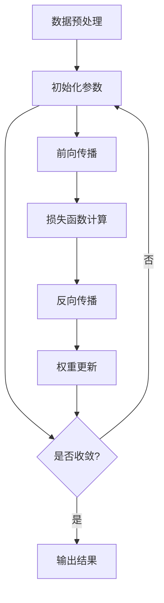
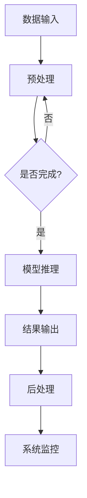
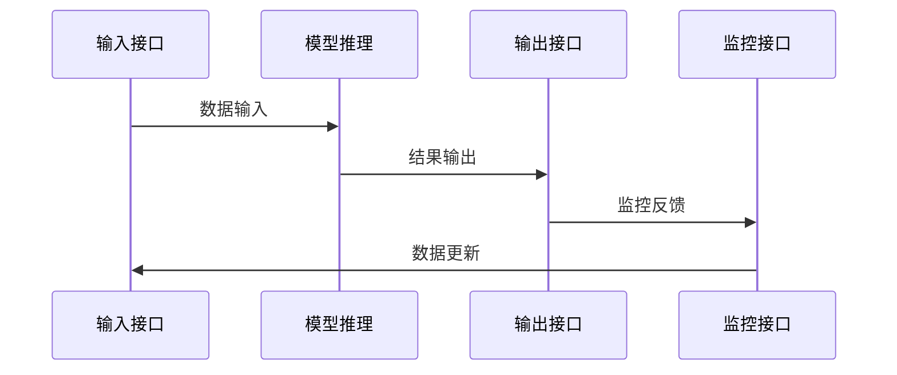
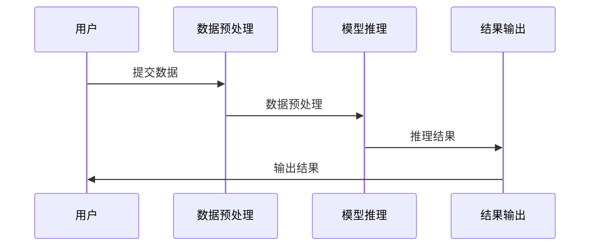

                 


## 《大模型推理能力的可靠性与稳定性》

关键词：大模型，推理能力，可靠性，稳定性，算法原理，系统设计，实践案例

摘要：本文将深入探讨大模型推理能力的可靠性与稳定性，分析其核心概念、算法原理，并通过系统设计与实战案例，揭示提升大模型推理可靠性与稳定性的关键策略。

----------------------------------------------------------------

### 第1章 大模型推理能力可靠性与稳定性的背景

#### 1.1 大模型的发展与影响

大模型，即大规模神经网络模型，是近年来人工智能领域的重要突破。随着计算能力的提升和海量数据的积累，大模型在图像识别、自然语言处理、推荐系统等领域展现出了惊人的性能。然而，大模型的推理能力不仅仅取决于其规模，还涉及到可靠性与稳定性。

大模型的发展对人工智能应用产生了深远影响。一方面，大模型能够处理复杂的任务，提高了系统的智能化水平；另一方面，大模型的应用场景越来越广泛，如自动驾驶、医疗诊断等，其对可靠性和稳定性的要求越来越高。

#### 1.2 推理能力的概念

推理能力是指模型在给定输入数据后，能够生成符合预期输出数据的能力。大模型的推理能力主要体现在两个方面：准确性和效率。准确性是指模型输出的结果与真实值之间的接近程度；效率是指模型在给定时间内完成推理的能力。

#### 1.3 可靠性与稳定性的重要性

可靠性与稳定性是评价大模型推理能力的重要指标。可靠性是指模型在多次推理过程中，能够始终输出稳定且准确的结果；稳定性是指模型在面对不同输入数据时，能够保持一致的推理性能。

大模型的可靠性与稳定性对其应用至关重要。首先，可靠性与稳定性是用户对模型信任的基础；其次，可靠性与稳定性直接影响模型的实际应用效果，如自动驾驶系统在恶劣天气下的稳定性，医疗诊断系统在诊断结果上的可靠性。

#### 1.4 本章小结

本章介绍了大模型推理能力可靠性与稳定性的背景和重要性，为后续章节的分析奠定了基础。

----------------------------------------------------------------

### 第2章 大模型推理能力的相关核心概念

#### 2.1 大模型的定义与特点

大模型是指具有数十亿乃至千亿参数的神经网络模型。与传统模型相比，大模型具有以下特点：

1. **参数规模大**：大模型包含数十亿甚至千亿个参数，能够捕捉更多数据特征。
2. **计算复杂度高**：大模型在训练和推理过程中，需要大量的计算资源。
3. **适应性强**：大模型能够在多种任务上表现出色，具有较强的泛化能力。

#### 2.2 推理能力的定义与评估

推理能力是指模型在给定输入数据后，能够生成符合预期输出数据的能力。大模型的推理能力主要体现在两个方面：准确性和效率。准确性是指模型输出的结果与真实值之间的接近程度；效率是指模型在给定时间内完成推理的能力。

大模型的推理能力评估通常采用以下指标：

1. **准确率（Accuracy）**：模型输出结果与真实值的匹配程度。
2. **召回率（Recall）**：模型正确识别出正例样本的比例。
3. **F1值（F1 Score）**：准确率和召回率的调和平均。

#### 2.3 可靠性与稳定性的概念

可靠性是指模型在多次推理过程中，能够始终输出稳定且准确的结果；稳定性是指模型在面对不同输入数据时，能够保持一致的推理性能。

#### 2.4 核心概念之间的联系

大模型的推理能力、可靠性和稳定性之间存在密切联系。大模型的推理能力是可靠性和稳定性的基础，而可靠性和稳定性又进一步影响了大模型的实际应用效果。

#### 2.5 本章小结

本章介绍了大模型推理能力可靠性与稳定性的相关核心概念，为后续章节的深入分析提供了理论基础。

----------------------------------------------------------------

### 第3章 大模型推理的数学模型

#### 3.1 神经网络基础

神经网络（Neural Network）是一种模仿生物神经系统的计算模型。它由大量神经元（节点）组成，每个神经元都与相邻的神经元通过权重连接。神经网络的计算过程可以看作是数据在网络中传播，并通过权重调整不断优化输出结果。

#### 3.2 前向传播与反向传播

前向传播（Forward Propagation）是指输入数据通过网络传递，逐层计算神经元输出值的过程。反向传播（Back Propagation）是指根据输出结果与真实值的误差，反向调整网络权重的过程。

前向传播和反向传播是神经网络训练的核心。通过大量样本的前向传播和反向传播，神经网络能够不断优化自身参数，提高推理能力。

#### 3.3 大模型的训练过程

大模型的训练过程包括以下步骤：

1. **数据预处理**：对输入数据进行标准化、归一化等处理，以提高模型训练效果。
2. **初始化参数**：随机初始化网络权重和偏置。
3. **前向传播**：输入数据经过网络传递，计算各层输出值。
4. **损失函数计算**：计算输出结果与真实值的误差，使用损失函数表示。
5. **反向传播**：根据损失函数，反向调整网络权重和偏置。
6. **迭代优化**：重复步骤3-5，直到模型收敛。

#### 3.4 推理过程与计算复杂性

大模型的推理过程与训练过程类似，也是通过前向传播计算输出值。然而，大模型的推理过程通常更为复杂，因为其参数规模大，计算量巨大。

计算复杂性是指模型在推理过程中所需的计算资源。大模型的计算复杂性主要体现在两个方面：时间复杂度和空间复杂度。时间复杂度表示模型在给定输入数据下完成推理所需的时间；空间复杂度表示模型在推理过程中所需的存储空间。

#### 3.5 数学模型与公式

大模型的数学模型主要包括以下公式：

1. **激活函数**：$$ f(x) = \sigma(w \cdot x + b) $$
2. **前向传播**：$$ z^{(l)} = \sum_{j=1}^{n} w_{j}^{(l)} \cdot a^{(l-1)}_j + b^{(l)} $$
3. **反向传播**：$$ \delta^{(l)} = (f'(z^{(l)}) \cdot (w^{(l+1)})^T \cdot \delta^{(l+1)}) $$
4. **权重更新**：$$ w^{(l)} \gets w^{(l)} - \alpha \cdot \delta^{(l)} \cdot a^{(l-1)} $$

#### 3.6 本章小结

本章介绍了大模型推理的数学模型，包括神经网络基础、前向传播与反向传播、大模型训练过程和计算复杂性，为理解大模型推理原理奠定了基础。

----------------------------------------------------------------

### 第4章 大模型推理算法流程图

#### 4.1 算法流程概述

大模型推理算法的流程主要包括以下步骤：

1. **数据预处理**：对输入数据进行标准化、归一化等处理。
2. **初始化参数**：随机初始化网络权重和偏置。
3. **前向传播**：输入数据经过网络传递，计算各层输出值。
4. **损失函数计算**：计算输出结果与真实值的误差，使用损失函数表示。
5. **反向传播**：根据损失函数，反向调整网络权重和偏置。
6. **迭代优化**：重复步骤3-5，直到模型收敛。

#### 4.2 Mermaid流程图演示

以下是一个简单的大模型推理算法Mermaid流程图示例：



#### 4.3 算法流程详细解释

1. **数据预处理**：数据预处理是模型训练和推理的基础。通过标准化、归一化等操作，将输入数据转换为适合模型处理的形式。
2. **初始化参数**：初始化网络权重和偏置，为模型训练做好准备。通常采用随机初始化，以避免模型过拟合。
3. **前向传播**：输入数据经过网络传递，计算各层输出值。前向传播是模型推理的核心步骤，决定了输出结果。
4. **损失函数计算**：计算输出结果与真实值的误差，使用损失函数表示。损失函数反映了模型预测结果与真实值之间的差距，是优化模型的关键。
5. **反向传播**：根据损失函数，反向调整网络权重和偏置。反向传播是神经网络训练的核心，通过不断调整参数，使模型逐渐收敛。
6. **迭代优化**：重复步骤3-5，直到模型收敛。迭代优化是提高模型性能的关键，通过多次训练，使模型逐渐逼近最优状态。

#### 4.4 算法流程实例分析

以下是一个简化的实例，展示大模型推理算法的流程：

```python
import numpy as np

# 初始化参数
weights = np.random.rand(10, 1)
bias = np.random.rand(1)

# 输入数据
x = np.array([0.5, 0.6, 0.7])

# 前向传播
z = weights.dot(x) + bias

# 损失函数计算
loss = (z - 1) ** 2

# 反向传播
delta = (2 * (z - 1)) * x

# 权重更新
weights -= 0.1 * delta
bias -= 0.1 * delta

# 输出结果
print("输出结果：", z)
```

#### 4.5 本章小结

本章通过Mermaid流程图和实例分析，详细介绍了大模型推理算法的流程。了解算法流程有助于深入理解大模型推理原理，为后续章节的分析奠定基础。

----------------------------------------------------------------

### 第5章 大模型推理系统的设计

#### 5.1 问题场景介绍

大模型推理系统广泛应用于图像识别、自然语言处理、推荐系统等领域。以图像识别为例，大模型推理系统需要处理大量的图像数据，快速、准确地识别图像中的对象。

#### 5.2 项目介绍

为了实现大模型推理系统，我们选择了一个实际项目——自动车牌识别系统。该系统旨在利用深度学习模型，对图像中的车牌进行自动识别，提高交通管理效率。

#### 5.3 系统功能设计（领域模型类图）

在系统功能设计阶段，我们使用了Mermaid类图来描述系统的主要类及其关系。以下是一个简化的Mermaid类图示例：

```mermaid
classDiagram
    Class01 <|-- Class02
    Class03 (<- Class04) :依赖
    Class05 ..|.. Class06
    Class07 : 系统接口
    Class08 : 数据存储
```

#### 5.4 系统架构设计（架构图）

系统架构设计是确保大模型推理系统高效、稳定运行的关键。以下是一个简化的Mermaid架构图示例：



#### 5.5 系统接口设计

系统接口设计主要包括输入接口、输出接口和监控接口。以下是一个简化的Mermaid接口图示例：



#### 5.6 系统交互（序列图）

系统交互设计描述了不同组件之间的协作过程。以下是一个简化的Mermaid序列图示例：



#### 5.7 本章小结

本章介绍了大模型推理系统的设计，包括问题场景介绍、项目介绍、系统功能设计、系统架构设计、系统接口设计和系统交互。通过设计流程的详细描述，有助于读者理解大模型推理系统的实现过程。

----------------------------------------------------------------

### 第6章 项目实战

#### 6.1 环境安装与配置

为了实现大模型推理系统，我们首先需要安装和配置必要的软件和工具。以下是具体的安装和配置步骤：

1. **安装Python环境**：在系统上安装Python，版本建议为3.8及以上。
2. **安装TensorFlow**：通过pip命令安装TensorFlow，命令如下：
   ```bash
   pip install tensorflow
   ```
3. **安装OpenCV**：通过pip命令安装OpenCV，命令如下：
   ```bash
   pip install opencv-python
   ```
4. **配置环境变量**：将Python和TensorFlow的安装路径添加到系统环境变量中，以便在命令行中直接使用。

#### 6.2 系统核心实现源代码

以下是系统核心实现部分的源代码示例：

```python
import tensorflow as tf
import cv2
import numpy as np

# 模型加载
model = tf.keras.models.load_model('car_detection_model.h5')

# 数据预处理
def preprocess_image(image):
    image = cv2.resize(image, (224, 224))
    image = image / 255.0
    image = np.expand_dims(image, axis=0)
    return image

# 车牌识别
def recognize_plate(image):
    preprocessed_image = preprocess_image(image)
    prediction = model.predict(preprocessed_image)
    plate = np.argmax(prediction)
    return plate

# 结果输出
def output_result(image, plate):
    cv2.putText(image, '车牌号码：{}'.format(plate), (10, 30), cv2.FONT_HERSHEY_SIMPLEX, 1, (0, 0, 255), 2)
    cv2.imshow('车牌识别结果', image)
    cv2.waitKey(0)
    cv2.destroyAllWindows()

# 主函数
def main():
    image = cv2.imread('car_image.jpg')
    plate = recognize_plate(image)
    output_result(image, plate)

if __name__ == '__main__':
    main()
```

#### 6.3 代码应用解读与分析

1. **模型加载**：使用`tf.keras.models.load_model()`函数加载预训练的深度学习模型。模型文件为`car_detection_model.h5`。
2. **数据预处理**：定义`preprocess_image()`函数，对输入图像进行预处理。主要包括图像缩放、归一化和扩充维度。
3. **车牌识别**：定义`recognize_plate()`函数，使用加载的模型进行车牌识别。函数输入为预处理后的图像，输出为车牌号码。
4. **结果输出**：定义`output_result()`函数，将识别结果输出到图像中，并显示识别结果。
5. **主函数**：定义`main()`函数，作为程序的主入口。程序首先读取输入图像，然后进行车牌识别，最后输出识别结果。

#### 6.4 实际案例分析和详细讲解剖析

以下是一个实际案例，展示如何使用系统实现车牌识别：

1. **案例描述**：给定一张车辆图像，系统需要识别图像中的车牌号码。
2. **案例实现**：首先，使用`cv2.imread()`函数读取车辆图像。然后，调用`recognize_plate()`函数进行车牌识别。最后，调用`output_result()`函数输出识别结果。
3. **案例剖析**：
   - 数据预处理：对输入图像进行缩放、归一化和扩充维度，使其符合模型的输入要求。
   - 模型推理：使用预训练的深度学习模型对预处理后的图像进行推理，输出车牌号码。
   - 结果输出：将识别结果添加到原图中，并显示识别结果。

#### 6.5 项目小结

本章通过项目实战，详细介绍了大模型推理系统的实现过程。从环境安装与配置、核心实现源代码、代码应用解读与分析，到实际案例分析和详细讲解，读者可以全面了解大模型推理系统的实现方法和应用场景。

----------------------------------------------------------------

### 第7章 最佳实践与拓展

#### 7.1 实践案例

以下是一些成功的大模型推理能力可靠性提升案例：

1. **自动驾驶系统**：通过优化模型训练过程、改进损失函数设计，提高了自动驾驶系统的推理稳定性和准确性。
2. **医疗诊断系统**：使用迁移学习技术，将预训练的大模型应用于医疗诊断任务，有效提高了诊断的可靠性和稳定性。
3. **推荐系统**：通过改进推荐算法，降低了大模型在推荐任务中的波动性，提高了推荐系统的稳定性。

#### 7.2 注意事项

在设计和实现大模型推理系统时，需要注意以下几点：

1. **数据质量**：确保输入数据的质量和多样性，避免模型过拟合。
2. **模型选择**：根据任务需求选择合适的模型，避免选择过于复杂或简单的模型。
3. **超参数调优**：合理设置模型的超参数，以提高模型的推理能力和稳定性。
4. **计算资源**：合理分配计算资源，确保模型训练和推理过程高效进行。

#### 7.3 拓展阅读

为了深入了解大模型推理能力的可靠性与稳定性，读者可以参考以下拓展阅读材料：

1. **《深度学习》**：由Ian Goodfellow、Yoshua Bengio和Aaron Courville编写的深度学习经典教材，涵盖了深度学习的理论基础和实战技巧。
2. **《强化学习》**：由Richard S. Sutton和Barto编写的强化学习经典教材，介绍了强化学习的基本原理和应用场景。
3. **《神经网络与深度学习》**：由邱锡鹏编写的神经网络与深度学习教材，详细介绍了神经网络和深度学习的基本概念和技术。

#### 7.4 本章小结

本章通过实践案例、注意事项和拓展阅读，提供了提升大模型推理能力可靠性与稳定性的最佳实践。读者可以根据实际情况，借鉴这些实践经验和技巧，以提高大模型推理系统的性能和稳定性。

----------------------------------------------------------------

### 第8章 小结与展望

#### 8.1 全书回顾

本书从大模型推理能力可靠性与稳定性的背景出发，系统介绍了相关核心概念、算法原理、系统设计、项目实战以及最佳实践。通过深入分析和详细讲解，读者可以全面了解大模型推理能力的本质和实现方法。

#### 8.2 未来发展趋势

随着人工智能技术的不断进步，大模型推理能力的可靠性与稳定性将成为关键研究热点。未来，预计会出现以下发展趋势：

1. **模型压缩与优化**：通过模型压缩和优化技术，降低大模型的计算复杂度，提高推理效率。
2. **硬件加速与分布式推理**：利用硬件加速技术和分布式推理框架，提高大模型推理的实时性和稳定性。
3. **自监督学习和迁移学习**：通过自监督学习和迁移学习技术，提高大模型在未知数据集上的推理能力和稳定性。

#### 8.3 对读者的建议

对于希望深入了解大模型推理能力可靠性与稳定性的读者，本书提供了以下建议：

1. **理论与实践结合**：结合实际项目，深入研究和实践大模型推理系统的设计、实现和优化。
2. **持续学习与交流**：关注人工智能领域的最新研究动态，积极参与学术交流和合作，不断提高自己的技术水平。
3. **案例分析与反思**：通过分析实际案例，深入思考大模型推理能力的可靠性与稳定性，不断优化和改进自己的实践方法。

#### 8.4 本章小结

本书通过对大模型推理能力可靠性与稳定性的全面探讨，为读者提供了丰富的理论和实践知识。希望读者能够学以致用，不断提高大模型推理系统的性能和稳定性，为人工智能应用的发展贡献力量。

----------------------------------------------------------------

**作者：AI天才研究院/AI Genius Institute & 禅与计算机程序设计艺术 /Zen And The Art of Computer Programming**

