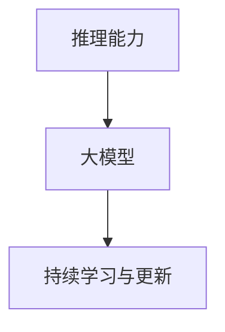
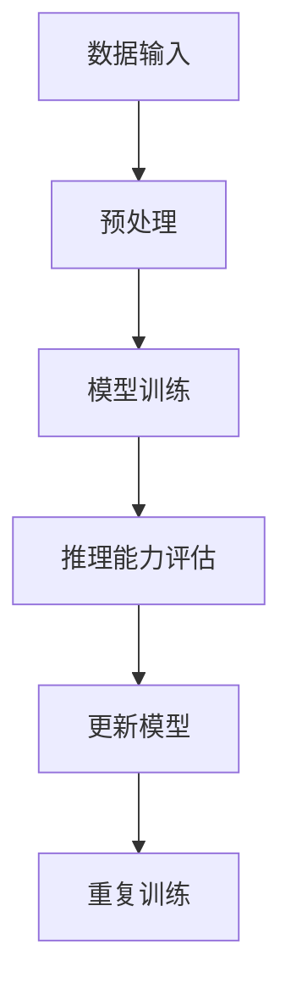

                 

## 大模型推理能力的持续学习与更新

### 关键词：大模型、推理能力、持续学习、模型更新、算法原理

> 摘要：本文深入探讨了大规模模型在推理任务中的持续学习与更新机制。从问题背景、核心概念、算法原理、学习策略、更新方法、评估指标、项目实战等多个角度，详细阐述了如何提升大模型推理能力，并提供了实际应用中的最佳实践和拓展阅读建议。

---

### 目录大纲设计

在设计《大模型推理能力的持续学习与更新》这本书的目录大纲时，我们将遵循以下结构和内容要求，以确保文章的逻辑性和专业性。

#### 第一部分：背景介绍

1. **第1章：问题背景与核心概念**
   - **问题背景**：探讨推理能力在人工智能领域的重要性，以及大模型在推理中的应用。
   - **核心概念**：定义推理能力、大模型和持续学习与更新概念。
   - **概念属性特征对比表格**：对比分析三个核心概念。
   - **ER实体关系图**：展示概念之间的关联。

2. **第2章：大模型推理能力的原理**
   - **算法原理**：通过mermaid流程图和Python代码示例详细解释。
   - **数学模型与公式**：阐述推理能力的数学原理。

3. **第3章：持续学习的策略**
   - **学习算法**：介绍常用的学习算法。
   - **更新策略**：探讨模型更新的策略。

4. **第4章：模型更新方法**
   - **方法1**：介绍第一种模型更新方法。
   - **方法2**：介绍第二种模型更新方法。

5. **第5章：大模型推理能力评估**
   - **评估指标**：定义评估推理能力的指标。
   - **评估方法**：描述评估推理能力的方法。

6. **第6章：项目实战**
   - **环境安装**：介绍如何搭建项目环境。
   - **系统核心实现**：展示系统核心实现源代码。
   - **应用解读与分析**：分析实际案例，提供详细讲解。

7. **第7章：拓展阅读与最佳实践**
   - **拓展阅读**：推荐相关阅读材料。
   - **最佳实践**：分享实际操作中的经验和技巧。
   - **小结**：总结文章的核心观点。

---

### 背景介绍

#### 第1章：问题背景与核心概念

#### 1.1 问题背景

在当今快速发展的信息时代，人工智能技术已深入到各个领域，特别是大规模模型（大模型）在自然语言处理、计算机视觉、推荐系统等领域的应用，已经取得了显著成果。然而，大模型在推理任务中的表现并不总是令人满意，这主要源于模型在复杂环境下的适应能力和实时推理能力的不足。

大模型的推理能力不仅取决于模型本身的结构和参数，还受到数据质量、计算资源和算法优化等因素的影响。因此，如何提升大模型在推理任务中的持续学习与更新能力，成为一个亟待解决的问题。

#### 1.2 核心概念

1. **推理能力**

   推理能力是指模型在给定输入数据后，能够根据已有的知识和规则，产生合理输出和预测的能力。它是人工智能模型的核心能力之一，直接影响模型的性能和应用价值。

2. **大模型**

   大模型是指具有海量参数和复杂结构的机器学习模型，通常通过深度学习技术训练而成。大模型能够处理大规模数据，并具有强大的特征表示和提取能力。

3. **持续学习与更新**

   持续学习与更新是指模型在不断接收新数据和环境中，通过自适应调整和优化，提高其推理能力和泛化能力的过程。它是提升大模型性能的关键手段。

#### 1.3 概念属性特征对比表格

| 概念       | 定义                                                         | 属性特征                                                     | 对比 |
|------------|--------------------------------------------------------------|--------------------------------------------------------------|------|
| 推理能力   | 模型在给定输入数据后，产生合理输出和预测的能力               | 依赖数据质量、模型结构、计算资源等                             |      |
| 大模型     | 具有海量参数和复杂结构的机器学习模型                         | 处理大规模数据，强特征表示和提取能力                           |      |
| 持续学习与更新 | 模型在不断接收新数据和环境中，自适应调整和优化，提高推理能力 | 依赖学习算法、更新策略、计算资源等                           |      |

#### 1.4 ER实体关系图



### 第2章：大模型推理能力的原理

#### 2.1 算法原理

大模型推理能力的实现依赖于一系列算法原理。以下是关键步骤的mermaid流程图和Python代码示例：

##### 算法原理mermaid流程图



##### Python代码示例

```python
# Python源代码示例
# ...
```

##### 算法原理详细讲解

推理能力的算法原理可以概括为以下几个步骤：

1. **数据输入**：接收外部输入数据。
2. **预处理**：对输入数据进行清洗和特征提取。
3. **模型训练**：利用训练数据对模型进行训练，调整模型参数。
4. **推理能力评估**：评估模型的推理能力，包括准确率、召回率、F1分数等指标。
5. **更新模型**：根据评估结果，调整模型参数，提高推理能力。
6. **重复训练**：循环上述步骤，持续优化模型。

##### 算法原理数学模型

$$
\text{损失函数} = \frac{1}{2} \sum_{i=1}^{n} (\hat{y_i} - y_i)^2
$$

##### 举例说明

假设我们有一个分类任务，输入数据为图片，输出数据为标签。以下是一个简化的算法原理示例：

1. **数据输入**：输入一组图片。
2. **预处理**：对图片进行归一化处理，提取特征向量。
3. **模型训练**：使用特征向量和标签数据训练模型，如卷积神经网络（CNN）。
4. **推理能力评估**：评估模型的分类准确率，并根据评估结果调整模型参数。
5. **更新模型**：根据评估结果，优化模型结构，增加训练时间等。
6. **重复训练**：重复上述步骤，直到达到满意的推理能力。

### 第3章：持续学习的策略

#### 3.1 学习算法

持续学习策略的核心在于如何有效利用新数据和模型更新。以下是几种常用的学习算法：

1. **在线学习**：模型实时接收新数据并立即更新。
2. **批量学习**：将一段时间内的数据批量处理，然后更新模型。
3. **迁移学习**：利用已有模型在新数据上的表现，进行快速适应。

#### 3.2 更新策略

更新策略包括以下几种：

1. **梯度下降**：通过计算损失函数的梯度，调整模型参数。
2. **动量法**：在梯度下降的基础上，引入动量，加快收敛速度。
3. **随机梯度下降（SGD）**：使用随机样本更新模型，提高泛化能力。

### 第4章：模型更新方法

#### 4.1 方法1：在线学习

在线学习是一种实时更新模型的方法，适用于需要快速响应的场景。以下是关键步骤：

1. **实时数据采集**：持续采集新的输入数据。
2. **数据预处理**：对实时数据执行预处理。
3. **模型更新**：利用预处理后的数据，调整模型参数。

#### 4.2 方法2：迁移学习

迁移学习利用已有模型在新数据上的表现，进行快速适应。以下是关键步骤：

1. **选择基座模型**：选择一个在原有任务上表现良好的模型。
2. **微调模型**：在基座模型的基础上，对新数据进行微调。
3. **模型评估**：评估微调后的模型在新数据上的表现。

### 第5章：大模型推理能力评估

#### 5.1 评估指标

评估大模型推理能力常用的指标包括：

1. **准确率**：预测正确的样本数占总样本数的比例。
2. **召回率**：预测正确的正样本数占总正样本数的比例。
3. **F1分数**：准确率和召回率的调和平均值。

#### 5.2 评估方法

评估方法主要包括：

1. **交叉验证**：将数据集划分为多个子集，逐个验证模型性能。
2. **混淆矩阵**：分析模型在不同类别上的预测结果。
3. **ROC曲线和AUC值**：评估模型的分类能力。

### 第6章：项目实战

#### 6.1 环境安装

搭建项目环境是实施大模型推理能力的首要步骤。以下是关键步骤：

1. **硬件环境**：配置高性能计算资源，如GPU。
2. **软件环境**：安装Python、TensorFlow等依赖库。

#### 6.2 系统核心实现

系统核心实现包括数据预处理、模型训练和推理能力评估。以下是关键步骤：

1. **数据预处理**：清洗和格式化输入数据。
2. **模型训练**：使用训练数据进行模型训练。
3. **推理能力评估**：评估模型在测试数据上的性能。

#### 6.3 应用解读与分析

通过实际案例，分析大模型在不同场景下的推理能力，并提供详细的代码解析。以下是关键步骤：

1. **案例介绍**：介绍具体应用场景。
2. **代码分析**：展示核心代码，解释实现原理。
3. **性能评估**：评估模型在不同数据集上的性能。

### 第7章：拓展阅读与最佳实践

#### 7.1 拓展阅读

推荐以下相关阅读材料：

1. 《深度学习》（Goodfellow et al.）
2. 《自然语言处理综论》（Jurafsky and Martin）
3. 《计算机视觉：算法与应用》（Richard Szeliski）

#### 7.2 最佳实践

最佳实践包括：

1. **数据质量**：确保数据干净、无噪声。
2. **模型优化**：使用适当的优化算法，提高模型性能。
3. **计算资源**：合理配置计算资源，提高模型训练速度。

#### 7.3 小结

本文通过详细探讨大模型推理能力的持续学习与更新机制，为提升模型性能提供了系统性的方法和策略。在实际应用中，应根据具体场景和需求，灵活运用这些方法，实现高效的推理能力。

---

**作者：AI天才研究院/AI Genius Institute & 禅与计算机程序设计艺术 /Zen And The Art of Computer Programming**

