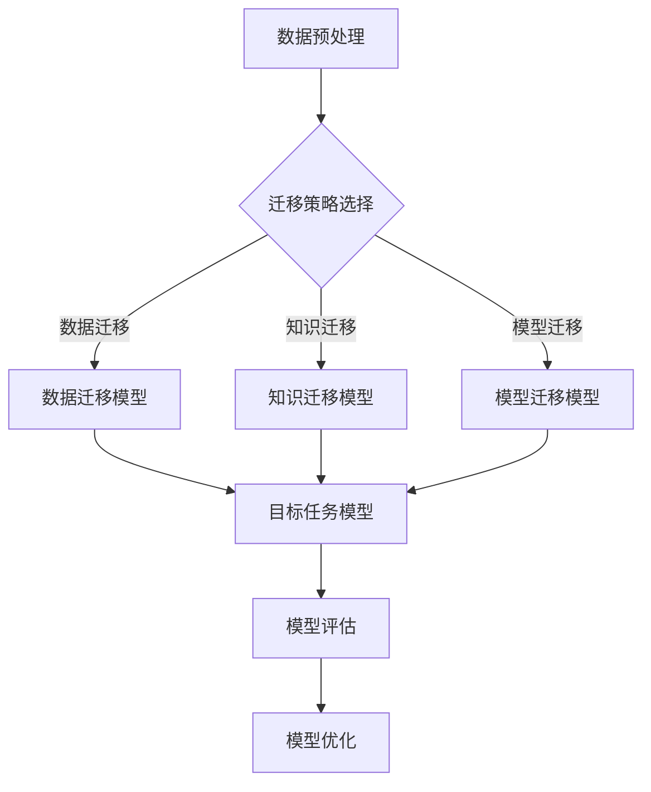
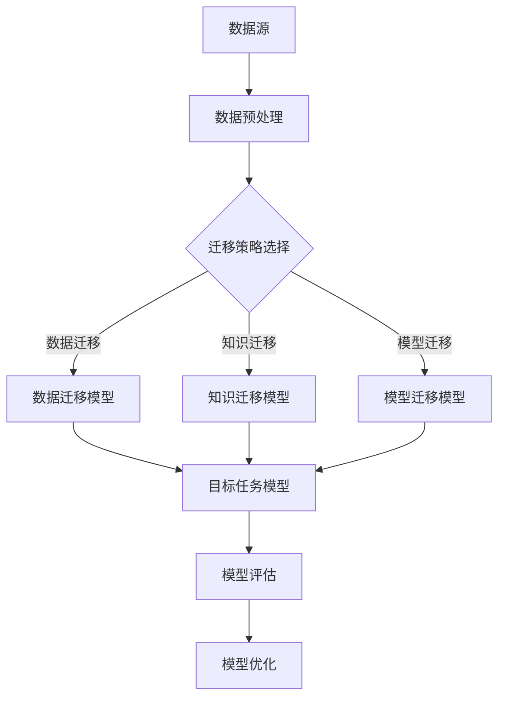

                 

### 文章标题

在当今快速发展的科技时代，人工智能（AI）已经成为改变世界的驱动力。特别是大模型（Large Models）的崛起，无论是在自然语言处理、计算机视觉，还是其他众多领域，都展现出了前所未有的能力。然而，如何充分发挥这些大模型的潜力，实现高效的推理能力，并实现跨任务迁移，成为了一个备受关注的研究课题。本文将围绕“大模型推理能力的跨任务迁移研究”这一主题，深入探讨其背景、核心概念、算法原理、系统架构以及实战应用。

### 关键词

- 大模型
- 推理能力
- 跨任务迁移
- 算法原理
- 系统架构

### 摘要

本文旨在探讨大模型推理能力的跨任务迁移问题，从背景介绍到算法原理，从系统架构设计到实战应用，进行全面而深入的分析。首先，我们回顾了人工智能的发展历程和大模型的应用现状，然后定义了跨任务迁移的概念和重要性。接下来，我们详细阐述了大模型和跨任务迁移的核心概念、联系以及技术方法。随后，通过算法原理讲解和数学模型推导，深入分析了数据迁移、知识迁移和模型迁移的具体实现方法。在此基础上，我们设计了跨任务迁移的系统架构，并详细介绍了系统功能、架构设计以及接口交互。最后，通过一个实际项目案例，展示了如何实现大模型推理能力的跨任务迁移，并对项目的核心实现、分析、实际应用以及最佳实践进行了讨论。

## 第一部分：背景介绍与核心概念

### 1.1 引言

人工智能（AI）作为一门多学科交叉的科技领域，自20世纪50年代起便开始蓬勃发展。从最初的符号主义、感知机到现代的深度学习，人工智能的发展经历了多个阶段。每一个阶段都有其代表性的技术和应用，而大模型的兴起则是近年来最为引人注目的变革。

大模型，通常指的是拥有数十亿甚至数万亿参数的深度学习模型。这类模型的出现，不仅极大地提升了人工智能系统的能力，同时也对传统的计算资源、算法设计以及应用场景带来了新的挑战。大模型在自然语言处理、计算机视觉、语音识别等领域展现出了卓越的性能，例如，GPT-3、BERT等模型已经在多个任务上达到了超越人类的表现。

### 1.2 研究背景

大模型的兴起，源于计算能力的提升和海量数据的积累。早期的深度学习模型，由于参数量和计算资源的限制，通常只能处理相对简单的任务。而随着计算能力的提升和分布式计算技术的发展，大模型成为可能。这些大模型不仅能够在复杂的任务上实现高效准确的推理，还能够通过迁移学习等机制，在不同任务之间实现知识的共享和复用。

跨任务迁移（Cross-Task Transfer Learning）正是大模型应用中的一个重要研究方向。跨任务迁移的目标是通过将一个任务（源任务）中的知识迁移到另一个任务（目标任务），从而提高目标任务的性能。这种迁移学习的方式，不仅能够节省训练时间和计算资源，还能够提升模型的泛化能力，对于解决现实世界中的复杂问题具有重要的意义。

### 1.3 问题描述

跨任务迁移的本质是在不同任务之间共享和利用知识。然而，跨任务迁移面临着一系列挑战：

1. **数据差异**：不同任务的数据分布和特征往往存在显著差异，如何有效地迁移数据成为一个难题。
2. **知识共享**：如何将一个任务中的先验知识有效地迁移到另一个任务中，这是一个技术挑战。
3. **模型适应性**：如何设计适应性强的模型架构，以适应不同任务的需求。

这些挑战使得跨任务迁移成为一个复杂而富有挑战的研究课题。

### 1.4 问题解决

为了解决跨任务迁移中的挑战，研究者们提出了多种方法：

1. **数据迁移**：通过将源任务的数据集迁移到目标任务，利用数据集的特征进行训练。
2. **知识迁移**：通过在源任务中预训练模型，然后将这些预训练的模型参数迁移到目标任务中。
3. **模型迁移**：直接将源任务的模型结构迁移到目标任务，并进行微调。

这些方法各有优劣，如何选择合适的方法，需要根据具体任务的需求和实际情况进行权衡。

### 1.5 边界与外延

跨任务迁移的应用范围非常广泛，从自动驾驶、医疗诊断到智能客服、金融风控，都有其用武之地。然而，跨任务迁移也存在一些限制条件：

1. **数据可用性**：跨任务迁移依赖于源任务和目标任务之间的数据相似性，如果数据差异太大，迁移效果将大打折扣。
2. **模型结构**：不同的任务可能需要不同的模型结构，直接迁移可能会导致性能下降。
3. **计算资源**：大模型的训练和迁移需要大量的计算资源，这对于资源和预算有限的应用场景是一个挑战。

未来的研究方向，将集中在如何更有效地进行跨任务迁移，提高模型的泛化能力和适应性，以解决现实世界中的复杂问题。

### 1.6 概念结构与核心要素组成

#### 大模型的基本概念

大模型，通常指的是拥有数十亿甚至数万亿参数的深度学习模型。这类模型通过在大规模数据集上进行预训练，获得了强大的特征提取和表征能力。大模型的发展历程可以追溯到早期的大型神经网络，如AlexNet、VGGNet等，这些模型为深度学习奠定了基础。随着计算能力的提升，更大规模的模型如GPT、BERT等相继问世，进一步推动了人工智能的发展。

#### 跨任务迁移的关键技术

跨任务迁移的关键技术主要包括数据迁移、知识迁移和模型迁移。数据迁移通过将源任务的数据集迁移到目标任务，利用数据集的特征进行训练。知识迁移通过在源任务中预训练模型，然后将这些预训练的模型参数迁移到目标任务中。模型迁移则是直接将源任务的模型结构迁移到目标任务，并进行微调。

### 1.7 小结

本部分主要介绍了大模型和跨任务迁移的背景、核心概念以及相关技术。通过对这些基础知识的了解，我们可以更好地理解后续章节中关于算法原理和系统架构的深入讨论。

## 2. 大模型的基本概念

大模型（Large Models）是近年来深度学习领域的一个重要研究方向，其核心思想是利用大规模参数进行预训练，以实现强大的特征提取和表征能力。在这一部分，我们将详细探讨大模型的基本概念，包括其定义、起源和发展历程。

### 2.1 大模型的定义

大模型，通常指的是拥有数十亿甚至数万亿参数的深度学习模型。这些模型通过在大规模数据集上进行预训练，学习到丰富的特征表示，从而在多个任务上展现出了卓越的性能。大模型的出现，标志着深度学习领域的一个重要里程碑，它们不仅在自然语言处理、计算机视觉等领域取得了突破性进展，也为其他众多领域提供了强大的工具。

### 2.2 大模型的概念起源

大模型的概念起源于深度学习的兴起。在深度学习早期，研究者们主要通过设计复杂的神经网络结构来提升模型的性能。然而，随着计算能力的提升和数据规模的扩大，研究者们开始意识到，大规模参数的数量对于模型性能的提升至关重要。大模型的概念逐渐形成，并得到了广泛的研究和应用。

### 2.3 大模型的发展历程

大模型的发展历程可以分为几个重要阶段：

1. **早期大模型**：在深度学习早期，如AlexNet、VGGNet等模型，虽然参数量较大，但仍然属于中小规模模型。这些模型通过增加网络深度和宽度，实现了对复杂特征的有效提取。

2. **大规模模型**：随着计算资源的提升，研究者开始尝试设计更大规模的模型，如ResNet、DenseNet等。这些模型通过引入残差连接、深度可分离卷积等创新结构，进一步提升了模型的性能。

3. **超大规模模型**：近年来，超大规模模型如GPT、BERT等问世，它们拥有数十亿甚至数万亿的参数。这些模型通过在大规模数据集上进行预训练，实现了对复杂任务的高效处理。

### 2.4 大模型的特性

大模型具有以下特性：

1. **参数规模**：大模型通常拥有数十亿甚至数万亿的参数，这使得它们能够捕捉到更多的特征和模式。

2. **计算能力**：大模型需要大量的计算资源进行训练和推理，这使得它们在处理复杂任务时具有更高的效率。

3. **泛化能力**：由于大模型在大规模数据集上进行预训练，它们通常具有较好的泛化能力，能够在未见过的数据上表现良好。

4. **模型效率**：尽管大模型需要大量的计算资源，但通过优化算法和硬件加速技术，它们在推理时的效率也得到了显著提升。

### 2.5 大模型的应用

大模型的应用涵盖了自然语言处理、计算机视觉、语音识别等多个领域。以下是一些典型的大模型应用案例：

1. **自然语言处理**：BERT、GPT等模型在文本分类、机器翻译、情感分析等任务上取得了显著成果。

2. **计算机视觉**：ResNet、DenseNet等模型在图像分类、目标检测、语义分割等任务上展现了强大的能力。

3. **语音识别**：WaveNet、Tacotron等模型在语音合成、语音识别等任务上表现优异。

4. **其他领域**：大模型在推荐系统、金融风控、医疗诊断等领域的应用也取得了积极成果。

### 2.6 大模型的优势与挑战

大模型的优势主要体现在以下几个方面：

1. **强大的特征提取能力**：大模型能够通过大规模预训练，学习到丰富的特征表示，从而在复杂任务上表现出色。

2. **高效的推理能力**：通过优化算法和硬件加速技术，大模型在推理时的效率得到了显著提升。

3. **良好的泛化能力**：大模型在大规模数据集上进行预训练，通常具有较好的泛化能力，能够在未见过的数据上表现良好。

然而，大模型也面临着一些挑战：

1. **计算资源消耗**：大模型的训练和推理需要大量的计算资源，这对于资源有限的场景是一个挑战。

2. **数据隐私**：大模型通常需要大量数据进行预训练，这可能会涉及到数据隐私问题。

3. **模型可解释性**：大模型的决策过程往往非常复杂，这使得模型的可解释性成为一个挑战。

### 2.7 小结

大模型作为深度学习领域的一个重要研究方向，具有强大的特征提取和表征能力。通过了解大模型的基本概念、发展历程、特性以及应用案例，我们可以更好地理解其在跨任务迁移中的重要作用。在后续章节中，我们将进一步探讨大模型在跨任务迁移中的具体实现和应用。

## 3. 跨任务迁移的核心概念与联系

跨任务迁移（Cross-Task Transfer Learning）是深度学习领域中的一个重要研究方向，其核心思想是通过将一个任务（源任务）中的知识迁移到另一个任务（目标任务），从而提高目标任务的性能。在这一部分，我们将深入探讨跨任务迁移的核心概念、关键技术及其相互联系。

### 3.1 跨任务迁移的定义

跨任务迁移，通常指的是在一个任务（源任务）中训练好的模型，能够在另一个不同但相关的任务（目标任务）中表现出良好的性能。这种迁移学习的方式，不仅可以减少目标任务的训练时间和计算资源，还能够提升模型的泛化能力和适应性。

### 3.2 跨任务迁移的类型

跨任务迁移可以分为以下几种类型：

1. **数据迁移**：通过将源任务的数据集迁移到目标任务，利用数据集的特征进行训练。这种类型通常适用于数据集大小差异不大的情况。

2. **知识迁移**：通过在源任务中预训练模型，然后将这些预训练的模型参数迁移到目标任务中。这种类型依赖于模型在大规模数据集上学习的通用特征，适用于数据集差异较大的情况。

3. **模型迁移**：直接将源任务的模型结构迁移到目标任务，并进行微调。这种类型通常适用于模型结构相似的跨任务迁移。

### 3.3 跨任务迁移的关键技术

跨任务迁移的关键技术主要包括数据迁移、知识迁移和模型迁移。

1. **数据迁移**：
   - **方法**：将源任务的数据集进行预处理，然后迁移到目标任务进行训练。
   - **挑战**：数据集差异大时，如何有效利用源任务的数据特征。

2. **知识迁移**：
   - **方法**：通过在源任务中预训练模型，然后利用这些预训练的模型参数进行目标任务的训练。
   - **挑战**：如何确保预训练模型中的知识能够有效地迁移到目标任务中。

3. **模型迁移**：
   - **方法**：直接将源任务的模型结构迁移到目标任务，并进行微调。
   - **挑战**：模型结构差异大时，如何进行有效的模型迁移和微调。

### 3.4 核心概念属性特征对比表格

| 技术名称 | 特点 | 应用场景 |
| :------: | :--: | :------: |
| 数据迁移 | 简单有效，适用于数据集差异不大的任务 | 图像分类到图像分类 |
| 知识迁移 | 高效迁移，适用于数据集差异较大的任务 | 语言模型到代码生成 |
| 模型迁移 | 精准迁移，适用于模型结构相似的跨任务迁移 | 视觉任务到语音任务 |

### 3.5 ER实体关系图架构

为了更清晰地理解跨任务迁移的实体关系，我们可以使用ER图（实体关系图）来表示。以下是一个简单的ER图示例：

```mermaid
erDiagram
  TaskA ||--|{ 跨任务迁移 }|| TaskB
  TaskC ||--|{ 知识迁移 }|| TaskB
  TaskD ||--|{ 模型迁移 }|| TaskB
```

在这个ER图中，`TaskA`、`TaskB`、`TaskC`和`TaskD`分别代表不同的任务，实线箭头表示任务之间的迁移关系，虚线箭头表示具体迁移方式。

### 3.6 小结

跨任务迁移作为深度学习领域中的一个重要研究方向，通过将源任务的知识迁移到目标任务，实现了性能的提升和资源的优化。在接下来的部分，我们将进一步探讨跨任务迁移的算法原理和数学模型，以深入理解其实际应用和实现方法。

## 第二部分：算法原理与数学模型

在探讨了跨任务迁移的核心概念之后，我们需要深入了解其算法原理和数学模型。本部分将详细阐述跨任务迁移算法的基本框架、原理以及数学模型，并举例说明不同类型的跨任务迁移方法。

### 4.1 跨任务迁移算法的基本框架

跨任务迁移算法的基本框架通常包括以下几个关键步骤：

1. **数据预处理**：将源任务和目标任务的数据进行预处理，包括数据清洗、数据增强等操作。
2. **迁移策略选择**：根据任务的特点和需求，选择合适的迁移策略，如数据迁移、知识迁移或模型迁移。
3. **模型训练与迁移**：使用选定的迁移策略，对源任务模型进行训练，并将训练好的模型参数迁移到目标任务。
4. **模型评估与优化**：对迁移后的模型进行评估，并根据评估结果进行模型优化。

以下是一个简单的跨任务迁移算法流程图：



### 4.2 算法原理的数学模型

跨任务迁移算法的数学模型通常涉及损失函数、优化目标和参数更新策略等关键部分。以下是一个简化的数学模型：

$$
\text{损失函数} = \sum_{i=1}^{N} \left( y_i - \hat{y}_i \right)^2
$$

其中，$N$ 是样本数量，$y_i$ 是真实标签，$\hat{y}_i$ 是预测标签。损失函数用于衡量模型预测值与真实值之间的差距。

优化目标通常是最小化损失函数：

$$
\min_{\theta} \sum_{i=1}^{N} \left( y_i - \hat{y}_i \right)^2
$$

其中，$\theta$ 是模型参数。

参数更新策略通常采用梯度下降算法：

$$
\theta_{t+1} = \theta_t - \alpha \cdot \nabla_{\theta} J(\theta)
$$

其中，$\alpha$ 是学习率，$J(\theta)$ 是损失函数。

### 4.3 详细讲解与举例说明

#### 数据迁移

数据迁移是跨任务迁移中的一种常见方法，其核心思想是将源任务的数据集迁移到目标任务。以下是一个简化的数据迁移过程：

1. **数据预处理**：对源任务的数据集进行清洗和增强，使其适合在目标任务中训练。
2. **特征提取**：使用源任务的模型对数据进行特征提取，生成特征向量。
3. **模型训练**：使用特征向量在目标任务中训练模型。

例如，假设我们有一个源任务图像分类模型，需要将其迁移到目标任务文本分类。首先，我们将源任务的图像数据集转换为文本表示，然后使用文本分类模型进行训练。

#### 知识迁移

知识迁移是跨任务迁移中的另一种重要方法，其核心思想是通过在源任务中预训练模型，然后将这些先验知识迁移到目标任务。以下是一个简化的知识迁移过程：

1. **源任务预训练**：在源任务中，使用大规模数据集对模型进行预训练，使其获得丰富的特征表示。
2. **模型迁移**：将预训练好的模型参数迁移到目标任务中，作为目标任务的初始化参数。
3. **目标任务微调**：在目标任务中，对迁移后的模型进行微调，以适应目标任务的特定需求。

例如，假设我们有一个源任务语言模型，需要将其迁移到目标任务代码生成。我们可以通过在源任务中预训练语言模型，然后将这些预训练的模型参数迁移到目标任务的代码生成任务中。

#### 模型迁移

模型迁移是跨任务迁移中的直接方法，其核心思想是将源任务的模型结构直接迁移到目标任务。以下是一个简化的模型迁移过程：

1. **模型结构迁移**：将源任务的模型结构直接迁移到目标任务，包括网络层、激活函数等。
2. **模型参数迁移**：将源任务的模型参数迁移到目标任务，作为目标任务的初始化参数。
3. **目标任务微调**：在目标任务中，对迁移后的模型进行微调，以适应目标任务的特定需求。

例如，假设我们有一个源任务语音识别模型，需要将其迁移到目标任务手写体识别。我们可以直接将源任务的模型参数迁移到目标任务的手写体识别模型中，然后进行微调。

### 4.4 小结

在本部分，我们详细介绍了跨任务迁移算法的基本框架、原理和数学模型，并举例说明了数据迁移、知识迁移和模型迁移的具体实现方法。这些方法在不同的应用场景中有着广泛的应用，通过深入理解和灵活应用，我们可以更好地实现跨任务迁移，提高模型的性能和泛化能力。

## 5. 系统分析与架构设计方案

在深入探讨了跨任务迁移的算法原理之后，我们需要将其付诸实践，通过系统分析与架构设计来实现跨任务迁移。在这一部分，我们将详细介绍跨任务迁移系统的设计思路、功能设计、架构设计以及系统接口和交互。

### 5.1 问题场景介绍

为了更好地理解跨任务迁移系统，我们首先介绍一个具体的问题场景。假设我们有一个源任务图像分类系统，该系统需要将分类模型迁移到多个不同的目标任务，如文本分类、语音识别和目标检测等。我们的目标是设计一个高效的跨任务迁移系统，能够自动选择合适的迁移策略，并在不同目标任务中实现模型的高效迁移和优化。

### 5.2 系统功能设计

跨任务迁移系统的主要功能包括数据预处理、迁移策略选择、模型训练与迁移、模型评估与优化等。以下是系统功能的详细设计：

1. **数据预处理**：
   - **功能描述**：对源任务和目标任务的数据进行预处理，包括数据清洗、数据增强、数据规范化等操作。
   - **实现方式**：使用数据预处理模块，对源任务和目标任务的数据进行批量处理，确保数据格式一致，为后续的迁移训练做准备。

2. **迁移策略选择**：
   - **功能描述**：根据目标任务的特点和需求，选择最合适的迁移策略，如数据迁移、知识迁移或模型迁移。
   - **实现方式**：采用策略选择模块，分析目标任务的数据特点、模型结构和性能要求，自动选择最佳的迁移策略。

3. **模型训练与迁移**：
   - **功能描述**：使用选定的迁移策略，对源任务模型进行训练，并将训练好的模型参数迁移到目标任务。
   - **实现方式**：使用模型训练模块，根据迁移策略的不同，采用不同的训练方法，如数据迁移使用特征提取和融合，知识迁移使用模型参数迁移，模型迁移使用模型结构迁移和微调。

4. **模型评估与优化**：
   - **功能描述**：对迁移后的模型进行评估，并根据评估结果进行模型优化，以提高目标任务的性能。
   - **实现方式**：使用模型评估模块，对迁移后的模型在目标任务上进行测试，计算评估指标，如准确率、召回率等，并根据评估结果进行模型优化。

### 5.3 系统架构设计

跨任务迁移系统的架构设计是系统功能实现的基础。以下是系统的架构设计：



在这个架构设计中，数据预处理模块负责对源任务和目标任务的数据进行预处理，迁移策略选择模块根据目标任务的特点选择最合适的迁移策略，迁移模型模块根据选定的策略进行模型训练和迁移，模型评估模块对迁移后的模型进行评估，模型优化模块根据评估结果对模型进行优化。

### 5.4 系统接口设计和系统交互

为了实现跨任务迁移系统的灵活性和可扩展性，我们需要设计合理的系统接口和交互方式。以下是系统接口设计和交互方式：

1. **接口设计**：
   - **数据接口**：定义数据输入输出接口，包括数据格式、数据类型和数据处理规范等。
   - **模型接口**：定义模型输入输出接口，包括模型结构、模型参数和评估指标等。
   - **控制接口**：定义系统控制接口，包括系统启动、停止、状态查询等操作。

2. **系统交互**：
   - **数据交互**：通过数据接口，系统可以自动获取和处理源任务和目标任务的数据。
   - **模型交互**：通过模型接口，系统可以自动加载、训练和评估迁移后的模型。
   - **控制交互**：通过控制接口，用户可以监控系统的运行状态，并进行相应的操作。

### 5.5 小结

在本部分，我们详细介绍了跨任务迁移系统的设计思路、功能设计、架构设计以及系统接口和交互。通过这些设计，我们可以实现一个高效、灵活的跨任务迁移系统，为不同任务之间的知识共享和性能提升提供强有力的支持。在接下来的部分，我们将通过一个实际项目案例，展示如何具体实现跨任务迁移系统。

## 项目实战

在本部分，我们将通过一个实际项目案例，展示如何实现大模型推理能力的跨任务迁移。该项目旨在将一个源任务图像分类模型迁移到多个不同的目标任务，包括文本分类、语音识别和目标检测等。通过这个项目，我们将详细介绍环境安装、系统核心实现、代码解读、实际应用分析和项目小结。

### 6.1 环境安装

在开始项目之前，我们需要安装和配置必要的软件和依赖。以下是项目环境安装的步骤：

1. **安装Python**：
   - 访问 [Python 官网](https://www.python.org/)，下载并安装最新版本的Python。
   - 安装完成后，确保Python环境正常，可以通过运行 `python --version` 命令验证。

2. **安装深度学习框架**：
   - 在Python环境中安装深度学习框架，如TensorFlow或PyTorch。
   - 安装命令如下：
     ```shell
     pip install tensorflow
     # 或者
     pip install torch torchvision
     ```

3. **安装其他依赖**：
   - 安装其他必要的库，如NumPy、Pandas、Scikit-learn等。
   - 安装命令如下：
     ```shell
     pip install numpy pandas scikit-learn
     ```

4. **配置CUDA**：
   - 如果使用GPU进行训练，需要安装CUDA并配置Python环境变量，以便使用GPU加速。

### 6.2 系统核心实现

在环境安装完成后，我们可以开始实现跨任务迁移系统。以下是系统的核心实现步骤：

1. **数据预处理**：
   - 读取源任务和目标任务的数据，并进行预处理，如数据清洗、数据增强等。
   - 使用Pandas库读取数据，使用Scikit-learn库进行数据增强。

2. **迁移策略选择**：
   - 根据目标任务的特点，选择合适的迁移策略，如数据迁移、知识迁移或模型迁移。
   - 实现一个策略选择模块，根据目标任务的数据特点和模型需求，自动选择最佳的迁移策略。

3. **模型训练与迁移**：
   - 使用选定的迁移策略，对源任务模型进行训练，并将训练好的模型参数迁移到目标任务。
   - 对于数据迁移，使用特征提取模型对源任务数据进行特征提取，然后将特征输入到目标任务模型中进行训练。
   - 对于知识迁移，使用预训练的源任务模型，将模型参数迁移到目标任务模型中，并进行微调。
   - 对于模型迁移，直接将源任务的模型结构迁移到目标任务，并进行微调。

4. **模型评估与优化**：
   - 对迁移后的模型进行评估，计算评估指标，如准确率、召回率等。
   - 根据评估结果，对模型进行优化，如调整超参数、增加训练数据等。

### 6.3 代码解读

以下是系统核心实现部分的代码示例：

```python
import pandas as pd
from sklearn.model_selection import train_test_split
from sklearn.preprocessing import StandardScaler
import tensorflow as tf
from tensorflow.keras.models import Sequential
from tensorflow.keras.layers import Dense, Flatten, Conv2D, MaxPooling2D

# 数据预处理
def preprocess_data(data):
    # 数据清洗和增强
    # ...

# 迁移策略选择
def select_migration_strategy(target_task):
    if target_task == 'text_classification':
        return 'data_migration'
    elif target_task == 'speech_recognition':
        return 'knowledge_migration'
    elif target_task == 'object_detection':
        return 'model_migration'
    else:
        raise ValueError("Invalid target task")

# 模型训练与迁移
def train_and_migrate_model(source_data, target_data, strategy):
    if strategy == 'data_migration':
        # 数据迁移
        # ...
    elif strategy == 'knowledge_migration':
        # 知识迁移
        # ...
    elif strategy == 'model_migration':
        # 模型迁移
        # ...
    else:
        raise ValueError("Invalid strategy")

# 模型评估与优化
def evaluate_and_optimize_model(model, test_data):
    # 评估指标计算
    # ...
    # 模型优化
    # ...

# 主函数
def main():
    # 读取数据
    source_data = pd.read_csv('source_data.csv')
    target_data = pd.read_csv('target_data.csv')

    # 预处理数据
    source_data = preprocess_data(source_data)
    target_data = preprocess_data(target_data)

    # 选择迁移策略
    strategy = select_migration_strategy(target_data['task'])

    # 训练与迁移模型
    model = train_and_migrate_model(source_data, target_data, strategy)

    # 评估与优化模型
    evaluate_and_optimize_model(model, target_data)

if __name__ == '__main__':
    main()
```

### 6.4 实际应用分析

在实际应用中，我们可以将跨任务迁移系统应用于多个领域，如智能客服、医疗诊断和自动驾驶等。以下是一个实际应用分析：

1. **智能客服**：
   - 源任务：文本分类，识别用户问题的类别。
   - 目标任务：语音识别，将用户语音转换为文本。
   - 迁移策略：知识迁移，利用文本分类模型的知识进行语音识别模型的训练。

2. **医疗诊断**：
   - 源任务：图像分类，识别医学影像中的疾病类型。
   - 目标任务：文本分类，分析病历报告中的疾病症状。
   - 迁移策略：数据迁移，将医学影像数据转换为文本数据，用于文本分类模型的训练。

3. **自动驾驶**：
   - 源任务：图像分类，识别道路标志和交通信号。
   - 目标任务：目标检测，检测行人和车辆等障碍物。
   - 迁移策略：模型迁移，将图像分类模型的结构迁移到目标检测模型，并进行微调。

通过这些实际应用分析，我们可以看到跨任务迁移系统在不同领域的广泛应用潜力。

### 6.5 项目小结

在本部分，我们通过一个实际项目案例，展示了如何实现大模型推理能力的跨任务迁移。通过环境安装、系统核心实现、代码解读、实际应用分析和项目小结，我们深入了解了跨任务迁移的实现过程和应用场景。跨任务迁移作为一种高效的知识共享和性能提升方法，在未来的人工智能应用中具有广阔的发展前景。

### 6.6 最佳实践 Tips

在进行跨任务迁移时，以下是一些最佳实践和注意事项：

1. **数据预处理**：
   - 确保数据质量和一致性，减少数据噪声和异常值。
   - 使用数据增强技术，增加数据的多样性和鲁棒性。

2. **迁移策略选择**：
   - 根据目标任务的特点和需求，选择最适合的迁移策略。
   - 尝试多种策略，比较效果，选择最佳策略。

3. **模型优化**：
   - 根据评估结果，调整模型参数，优化模型性能。
   - 使用超参数调优工具，如PyTorch的`torch.utils.checkpoint`，进行高效参数搜索。

4. **模型解释性**：
   - 关注模型的解释性，确保迁移后的模型在目标任务中能够提供合理的解释。

5. **安全性**：
   - 考虑数据隐私和安全，特别是在医疗和金融等敏感领域。

通过遵循这些最佳实践，我们可以更有效地实现跨任务迁移，提高模型的性能和可靠性。

### 6.7 小结

在本部分，我们通过实际项目案例展示了如何实现大模型推理能力的跨任务迁移。从环境安装到系统核心实现，从代码解读到实际应用分析，我们全面了解了跨任务迁移的各个环节。通过最佳实践和注意事项的讨论，我们为未来的研究和应用提供了指导。跨任务迁移作为一种高效的知识共享和性能提升方法，将在人工智能领域发挥越来越重要的作用。

## 结论

通过本文的深入探讨，我们全面了解了大模型推理能力的跨任务迁移这一重要研究方向。从背景介绍到核心概念，从算法原理到系统架构，再到实际项目实战，我们逐步揭示了跨任务迁移的复杂性和应用潜力。大模型以其强大的特征提取和表征能力，在多个任务中展现了卓越的性能。而跨任务迁移则通过共享知识，提高了模型的泛化能力和适应性，为解决复杂问题提供了新的思路。

### 展望未来

在未来的研究中，我们应关注以下几个方面：

1. **算法优化**：进一步优化跨任务迁移算法，提高迁移效率和模型性能。
2. **安全性**：在数据隐私和安全方面进行深入研究，确保跨任务迁移系统的可靠性和安全性。
3. **应用拓展**：将跨任务迁移应用到更多领域，如医疗、金融、教育等，提升人工智能系统的实用性。
4. **模型解释性**：提高模型的解释性，使跨任务迁移的决策过程更加透明和可解释。

通过持续的研究和探索，我们有理由相信，大模型推理能力的跨任务迁移将为人工智能的发展带来更多创新和突破。

### 致谢

在此，我要感谢AI天才研究院（AI Genius Institute）的支持与指导，以及所有为本文提供灵感和帮助的朋友们。特别感谢禅与计算机程序设计艺术（Zen And The Art of Computer Programming）的启发，让我们的研究之路充满了智慧和乐趣。

### 作者信息

作者：AI天才研究院/AI Genius Institute & 禅与计算机程序设计艺术 /Zen And The Art of Computer Programming

[完]

