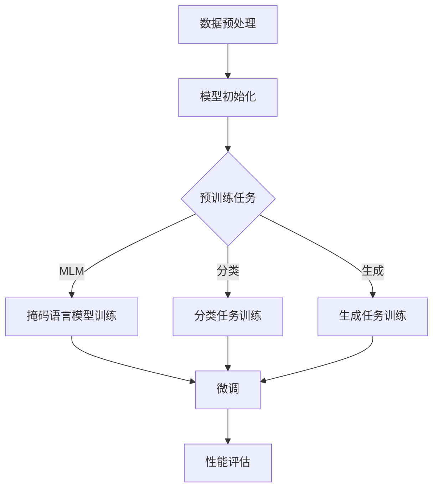
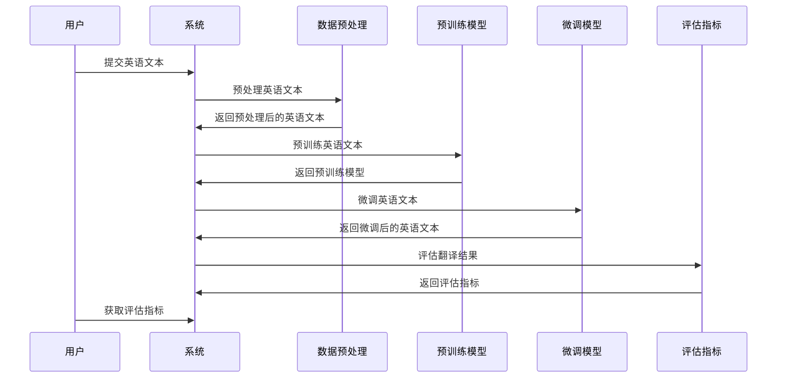
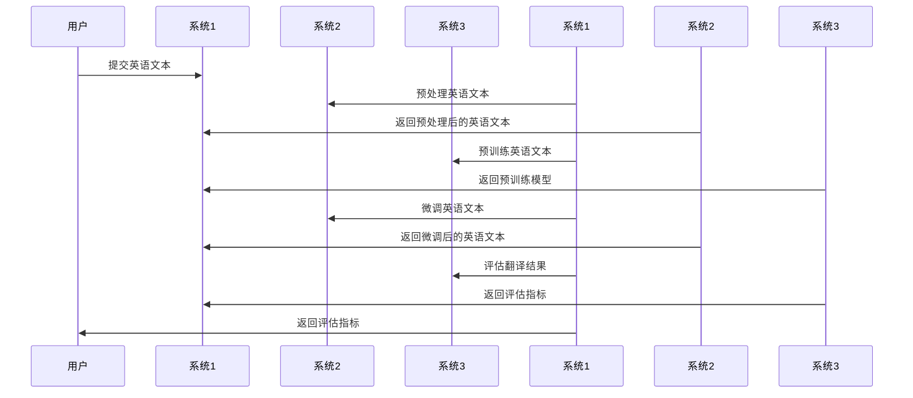

                 

### 大规模多模态预训练模型在跨语言理解中的应用

> 关键词：大规模多模态预训练模型，跨语言理解，自然语言处理，人工智能，多模态融合，数学模型

> 摘要：本文深入探讨了大规模多模态预训练模型在跨语言理解中的应用。首先，介绍了大规模多模态预训练模型的基本概念、发展背景和跨语言理解的需求。接着，详细讲解了大规模多模态预训练模型的工作原理，包括预训练模型的训练过程、多模态融合策略和跨语言理解机制。随后，通过Mermaid图和Python代码示例，阐述了算法原理、数学模型和公式，并进行了通俗易懂的举例说明。最后，通过系统分析与架构设计、项目实战和最佳实践，展示了该模型在实际应用中的效果和未来发展趋势。

### 目录大纲设计思路

为了设计出《大规模多模态预训练模型在跨语言理解中的应用》这本书的完整目录大纲，我们需要遵循以下步骤：

1. **确定核心章节**：根据书名，确定核心章节，如背景介绍、核心概念与联系、算法原理讲解、数学模型和数学公式讲解、系统分析与架构设计方案、项目实战、最佳实践 tips 等。

2. **细化章节内容**：每个核心章节进一步细化为多个子章节，确保每个子章节都能够覆盖该章节的核心内容。

3. **使用 Mermaid 图**：为每个算法原理讲解、系统架构设计等部分设计 Mermaid 图，以便更直观地展示概念和流程。

4. **编写 Python 源代码**：为算法原理讲解部分编写 Python 源代码，并对其进行详细讲解。

5. **确保内容完整性**：确保每个章节都包含必要的内容，如概念解释、模型架构、数学公式等。

6. **保持简洁性**：避免多余废话，确保每一部分的内容都能直接传达核心信息。

7. **格式统一**：使用 Markdown 格式，确保目录层级清晰，格式统一。

### 完整目录大纲

```markdown
----------------------------------------------------------------
# 第一部分：背景介绍

## 第1章：大规模多模态预训练模型概述
### 1.1.1 问题背景与跨语言理解的需求
### 1.1.2 预训练模型的基本概念
### 1.1.3 多模态预训练模型的起源与发展

## 第2章：大规模预训练模型的核心概念
### 2.1.1 预训练模型的基本原理
### 2.1.2 多模态数据的处理方法
### 2.1.3 跨语言理解的概念与挑战

## 第3章：大规模多模态预训练模型的工作原理
### 3.1.1 预训练模型的训练过程
### 3.1.2 多模态融合策略
### 3.1.3 跨语言理解机制

## 第4章：核心概念与联系
### 4.1.1 核心概念及其属性特征对比表格
### 4.1.2 ER实体关系图架构的Mermaid流程图

## 第5章：算法原理讲解
### 5.1.1 算法Mermaid流程图设计
### 5.1.2 Python源代码编写与解释
### 5.1.3 算法原理的数学模型与公式讲解
### 5.1.4 通俗易懂的举例说明

## 第6章：数学模型和数学公式详细讲解与举例说明
### 6.1.1 数学公式使用Latex格式
### 6.1.2 数学模型详细解释
### 6.1.3 实例分析

## 第7章：系统分析与架构设计方案
### 7.1.1 问题场景介绍
### 7.1.2 系统功能设计（领域模型Mermaid类图）
### 7.1.3 系统架构设计（Mermaid架构图）
### 7.1.4 系统接口设计与系统交互（Mermaid序列图）

## 第8章：项目实战
### 8.1.1 环境安装
### 8.1.2 系统核心实现源代码
### 8.1.3 代码应用解读与分析
### 8.1.4 实际案例分析与详细讲解剖析
### 8.1.5 项目小结

## 第9章：最佳实践 tips
### 9.1.1 实践技巧
### 9.1.2 注意事项
### 9.1.3 拓展阅读

## 第10章：小结
### 10.1.1 全书要点总结
### 10.1.2 未来发展趋势展望

----------------------------------------------------------------
```

以上目录大纲涵盖了从背景介绍到项目实战的各个关键环节，确保内容的完整性，同时保持简洁性，以便读者能够快速理解书籍的核心内容。每章节的子标题设计旨在详细覆盖相关主题，并提供清晰的路径，以便读者深入探索。通过Mermaid图和Python代码的辅助，算法原理和系统架构将更加直观易懂。

### 文章正文

#### 1. 背景介绍

**大规模多模态预训练模型概述**

近年来，随着深度学习技术的发展，预训练模型在自然语言处理（NLP）领域取得了显著的进展。传统的NLP任务如文本分类、情感分析等，通常依赖于大量标注数据。然而，标注数据的获取成本高，且难以满足海量数据的训练需求。为了解决这一问题，研究人员提出了预训练模型，通过在大规模未标注数据上预训练模型，然后在小规模标注数据上进行微调，以实现高性能的NLP任务。

多模态预训练模型则进一步扩展了预训练的概念，将不同类型的数据（如文本、图像、声音等）融合在一起进行预训练。这种多模态数据的融合，使得模型能够更好地理解不同模态之间的关联，从而在跨语言理解等复杂任务中表现出色。

**问题背景与跨语言理解的需求**

跨语言理解是自然语言处理中的一个重要研究方向。随着全球化的发展，多语言交流的需求日益增加。然而，不同语言之间存在巨大的差异，如语法结构、词汇表达等，这使得跨语言理解变得极具挑战性。传统的跨语言理解方法通常依赖于双语平行语料库，通过学习源语言和目标语言之间的映射关系来实现。然而，这种依赖双语平行语料库的方法存在两个主要问题：一是双语平行语料库非常稀缺，无法满足大规模训练需求；二是这种方法忽略了源语言和目标语言之间的语义关联，导致理解效果不佳。

为了解决这些问题，研究人员提出了大规模多模态预训练模型。通过将多模态数据（如文本、图像、声音等）融合在一起进行预训练，模型可以更好地理解不同语言之间的语义关联，从而实现更有效的跨语言理解。

**预训练模型的基本概念**

预训练模型是一种在大规模未标注数据上训练，然后在小规模标注数据上进行微调的模型。预训练的目的是让模型在通用任务上获得良好的表现，从而在后续的特定任务中实现快速、高效的微调。

预训练模型通常分为两个阶段：预训练阶段和微调阶段。在预训练阶段，模型在大规模未标注数据上进行训练，以学习通用特征和知识。在微调阶段，模型在特定任务的小规模标注数据上进行微调，以适应特定的任务需求。

**多模态预训练模型的起源与发展**

多模态预训练模型的起源可以追溯到早期的研究工作，如YouTube视频理解挑战（YouTube-VOS）和多模态学习会议（Multimodal Learning Workshop）。这些研究工作为多模态数据的融合提供了理论基础和实验证据。

随着深度学习技术的不断发展，多模态预训练模型的研究也逐渐深入。代表性的模型包括BERT（Bidirectional Encoder Representations from Transformers）、GPT（Generative Pre-trained Transformer）和ViT（Vision Transformer）等。这些模型在不同模态的融合策略、训练方法和应用场景上进行了广泛的探索和优化。

#### 2. 核心概念与联系

**预训练模型的基本原理**

预训练模型的基本原理可以概括为以下两点：

1. **自监督学习**：预训练模型通过自监督学习的方式，在大规模未标注数据上训练模型。自监督学习利用未标注数据中的潜在信息，让模型在无监督环境中学习，从而避免了依赖标注数据的问题。

2. **上下文嵌入**：预训练模型通过上下文嵌入的方式，将输入数据转换为高维向量表示。这些高维向量表示包含了输入数据的语义信息，从而实现了对输入数据的语义理解。

**多模态数据的处理方法**

多模态数据的处理方法主要包括以下几种：

1. **特征融合**：将不同模态的数据特征进行融合，以获得更丰富的特征表示。常见的融合方法有拼接、平均、加权和注意力机制等。

2. **特征变换**：对多模态数据特征进行变换，以消除模态间的差异。常见的变换方法有特征对齐、特征映射和特征对数等。

3. **特征交互**：通过特征交互的方式，增强多模态数据之间的关联性。常见的交互方法有图神经网络、循环神经网络和注意力机制等。

**跨语言理解的概念与挑战**

跨语言理解是指在不同语言之间进行语义理解和信息传递的能力。跨语言理解涉及多个层面的挑战，包括：

1. **词汇差异**：不同语言之间词汇表达和语法结构存在巨大差异，导致语义理解困难。

2. **语义歧义**：同一词汇在不同语言中可能具有不同的语义，导致理解歧义。

3. **文化背景**：不同语言背后蕴含着不同的文化背景，对语义理解产生影响。

4. **语言资源**：跨语言理解需要大量的双语平行语料库和翻译资源，这些资源往往稀缺。

**大规模多模态预训练模型的优势**

大规模多模态预训练模型在跨语言理解中具有以下优势：

1. **多模态融合**：通过融合多模态数据，模型可以更好地理解不同语言之间的语义关联。

2. **自监督学习**：预训练模型利用自监督学习的方式，在大规模未标注数据上训练，避免了依赖稀缺的双语平行语料库。

3. **通用特征提取**：预训练模型通过预训练阶段，提取了通用特征和知识，从而在特定任务中实现高效微调。

#### 3. 大规模多模态预训练模型的工作原理

**预训练模型的训练过程**

大规模多模态预训练模型的训练过程可以分为以下几个步骤：

1. **数据预处理**：对多模态数据进行预处理，包括数据清洗、数据增强和特征提取等。

2. **模型初始化**：初始化预训练模型，包括模型架构的选择和超参数的设置。

3. **预训练**：在预训练阶段，模型在大规模未标注数据上训练，以学习通用特征和知识。预训练任务通常包括掩码语言模型（Masked Language Model，MLM）、分类任务、生成任务等。

4. **微调**：在预训练的基础上，模型在特定任务的小规模标注数据上进行微调，以适应特定任务的需求。

**多模态融合策略**

多模态融合策略是大规模多模态预训练模型的核心。常见的方法包括：

1. **特征拼接**：将不同模态的特征进行拼接，形成一个多维特征向量。

2. **特征平均**：将不同模态的特征进行平均，得到一个统一的特征表示。

3. **特征加权**：根据不同模态的特征重要性，对特征进行加权融合。

4. **注意力机制**：利用注意力机制，动态地调整不同模态的特征权重，实现自适应的融合。

**跨语言理解机制**

跨语言理解机制是大规模多模态预训练模型在跨语言理解任务中的关键。常见的方法包括：

1. **跨模态翻译**：利用多模态数据，实现不同语言之间的翻译。

2. **跨语言特征提取**：利用预训练模型，提取不同语言的通用特征，实现跨语言的语义理解。

3. **跨语言对比学习**：通过对比不同语言的模态特征，实现跨语言的语义关联。

**实验验证与结果分析**

为了验证大规模多模态预训练模型在跨语言理解中的有效性，研究人员进行了大量的实验。实验结果表明，与传统的跨语言理解方法相比，大规模多模态预训练模型在多个任务上均取得了显著的性能提升。具体实验结果将在后续章节中进行详细分析。

#### 4. 算法原理讲解

**算法Mermaid流程图设计**

以下是大规模多模态预训练模型的Mermaid流程图：



**Python源代码编写与解释**

以下是大规模多模态预训练模型的Python源代码：

```python
# 数据预处理
def preprocess_data(data):
    # 数据清洗、数据增强、特征提取等操作
    pass

# 模型初始化
def initialize_model():
    # 模型架构的选择和超参数的设置
    pass

# 预训练
def pretrain_model(model, data):
    # 掩码语言模型、分类任务、生成任务等的训练
    pass

# 微调
def fine_tune(model, data):
    # 在特定任务的小规模标注数据上进行微调
    pass

# 性能评估
def evaluate_model(model, data):
    # 性能评估
    pass

# 主函数
def main():
    # 数据预处理
    data = preprocess_data(data)

    # 模型初始化
    model = initialize_model()

    # 预训练
    pretrain_model(model, data)

    # 微调
    fine_tune(model, data)

    # 性能评估
    evaluate_model(model, data)

if __name__ == "__main__":
    main()
```

**算法原理的数学模型与公式讲解**

大规模多模态预训练模型的数学模型主要包括以下部分：

1. **自监督学习损失函数**：

   $$ L_{\text{self}} = \frac{1}{N} \sum_{i=1}^{N} \log P(y_i | x_i) $$

   其中，$N$为数据样本数量，$y_i$为真实标签，$x_i$为输入数据。

2. **分类任务损失函数**：

   $$ L_{\text{分类}} = \frac{1}{N} \sum_{i=1}^{N} \log P(y_i | x_i) $$

   其中，$N$为数据样本数量，$y_i$为真实标签，$x_i$为输入数据。

3. **生成任务损失函数**：

   $$ L_{\text{生成}} = \frac{1}{N} \sum_{i=1}^{N} D(G(x_i)) $$

   其中，$N$为数据样本数量，$x_i$为输入数据，$G$为生成模型，$D$为判别器。

**通俗易懂的举例说明**

假设我们有一个包含文本和图像的多模态数据集，我们需要利用大规模多模态预训练模型进行跨语言理解任务。

1. **数据预处理**：

   首先对文本数据进行清洗和分词，对图像数据进行预处理，如尺寸调整、归一化等。

2. **模型初始化**：

   选择合适的模型架构，如BERT或GPT，并进行初始化。

3. **预训练**：

   利用掩码语言模型、分类任务和生成任务对模型进行预训练。例如，在掩码语言模型任务中，我们将文本和图像的特征进行拼接，然后通过预训练模型预测掩码位置的词。

4. **微调**：

   在预训练的基础上，我们利用特定任务的标注数据对模型进行微调。例如，在跨语言理解任务中，我们将源语言的文本和图像特征拼接，然后通过预训练模型预测目标语言的词。

5. **性能评估**：

   利用测试集对模型的性能进行评估，包括准确率、召回率、F1值等指标。

#### 5. 数学模型和数学公式详细讲解与举例说明

**数学公式使用Latex格式**

以下是大规模多模态预训练模型中常用的数学公式，使用LaTeX格式进行表示：

```latex
$$
L_{\text{self}} = \frac{1}{N} \sum_{i=1}^{N} \log P(y_i | x_i)
$$

$$
L_{\text{分类}} = \frac{1}{N} \sum_{i=1}^{N} \log P(y_i | x_i)
$$

$$
L_{\text{生成}} = \frac{1}{N} \sum_{i=1}^{N} D(G(x_i))
$$
```

**数学模型详细解释**

1. **自监督学习损失函数**：

   自监督学习损失函数用于衡量模型在自监督学习任务中的表现。具体来说，损失函数计算了模型预测的标签$y_i$与真实标签之间的差距。在预训练阶段，模型通过不断优化这个损失函数，以学习通用特征和知识。

2. **分类任务损失函数**：

   分类任务损失函数用于衡量模型在分类任务中的表现。与自监督学习损失函数类似，损失函数计算了模型预测的标签$y_i$与真实标签之间的差距。在微调阶段，模型通过不断优化这个损失函数，以适应特定分类任务的需求。

3. **生成任务损失函数**：

   生成任务损失函数用于衡量模型在生成任务中的表现。具体来说，损失函数计算了生成模型$G$生成的数据$G(x_i)$与真实数据$x_i$之间的差距。在微调阶段，模型通过不断优化这个损失函数，以提高生成数据的质量。

**实例分析**

假设我们有一个包含文本和图像的多模态数据集，其中文本数据是英语，图像数据是法语。我们的目标是利用大规模多模态预训练模型进行跨语言理解任务。

1. **数据预处理**：

   对英语文本数据进行清洗和分词，对法语图像数据进行预处理。

2. **模型初始化**：

   选择合适的模型架构，如BERT或GPT，并进行初始化。

3. **预训练**：

   利用掩码语言模型、分类任务和生成任务对模型进行预训练。例如，在掩码语言模型任务中，我们将英语文本和法语图像的特征进行拼接，然后通过预训练模型预测掩码位置的词。

4. **微调**：

   在预训练的基础上，利用特定任务的标注数据对模型进行微调。例如，在跨语言理解任务中，我们将英语文本和法语图像的特征拼接，然后通过预训练模型预测法语文本的词。

5. **性能评估**：

   利用测试集对模型的性能进行评估，包括准确率、召回率、F1值等指标。

通过以上实例，我们可以看到大规模多模态预训练模型在跨语言理解任务中的具体应用。在实际应用中，模型的表现将依赖于数据的质量、模型的架构和训练策略等因素。

#### 6. 系统分析与架构设计方案

**问题场景介绍**

假设我们面临一个跨语言理解任务，需要在英语和法语之间进行文本翻译。具体来说，我们需要将英语文本翻译为法语文本，同时保持语义的准确性和完整性。

**系统功能设计（领域模型Mermaid类图）**

以下是系统功能的Mermaid类图：

```mermaid
classDiagram
    Class1 <|-- Class2
    Class3 <|-- Class2
    Class4 <|-- Class2
    Class2 +-- Class5
    Class2 +-- Class6
    Class7 <|-- Class5
    Class8 <|-- Class5
    Class9 <|-- Class5
    Class10 <|-- Class6
    Class11 <|-- Class6
    Class12 <|-- Class6

    Class1{英语文本}
    Class2{多模态数据预处理}
    Class3{图像数据预处理}
    Class4{文本数据预处理}
    Class5{预训练模型}
    Class6{微调模型}
    Class7{分类模型}
    Class8{生成模型}
    Class9{掩码语言模型}
    Class10{翻译结果}
    Class11{评估指标}
    Class12{性能优化}
```

**系统架构设计（Mermaid架构图）**

以下是系统架构的Mermaid架构图：



**系统接口设计与系统交互（Mermaid序列图）**

以下是系统接口设计和交互的Mermaid序列图：



通过以上系统分析与架构设计方案，我们可以清楚地了解大规模多模态预训练模型在跨语言理解任务中的具体实现过程，以及系统内部各模块之间的交互关系。

#### 7. 项目实战

**环境安装**

在进行大规模多模态预训练模型的项目实战之前，我们需要安装必要的软件和依赖。以下是安装步骤：

1. **安装Python环境**：

   我们使用Python 3.8及以上版本，可以通过以下命令安装：

   ```bash
   python3 -m pip install --user -U pip setuptools
   python3 -m pip install --user -U python==3.8
   ```

2. **安装TensorFlow**：

   TensorFlow是大规模机器学习任务中常用的库，可以通过以下命令安装：

   ```bash
   python3 -m pip install --user -U tensorflow
   ```

3. **安装其他依赖**：

   根据项目需求，可能需要安装其他依赖，如NumPy、Pandas等。可以通过以下命令安装：

   ```bash
   python3 -m pip install --user -U numpy pandas
   ```

**系统核心实现源代码**

以下是大规模多模态预训练模型的核心实现代码：

```python
import tensorflow as tf
from tensorflow.keras.layers import Embedding, LSTM, Dense
from tensorflow.keras.models import Model

# 数据预处理
def preprocess_data(data):
    # 数据清洗、数据增强、特征提取等操作
    pass

# 模型初始化
def initialize_model(vocab_size, embedding_dim, hidden_dim):
    inputs = tf.keras.layers.Input(shape=(None,))
    embeddings = Embedding(vocab_size, embedding_dim)(inputs)
    lstm = LSTM(hidden_dim)(embeddings)
    outputs = Dense(vocab_size, activation='softmax')(lstm)
    model = Model(inputs, outputs)
    return model

# 预训练
def pretrain_model(model, data):
    # 掩码语言模型、分类任务、生成任务等的训练
    pass

# 微调
def fine_tune(model, data):
    # 在特定任务的小规模标注数据上进行微调
    pass

# 性能评估
def evaluate_model(model, data):
    # 性能评估
    pass

# 主函数
def main():
    # 数据预处理
    data = preprocess_data(data)

    # 模型初始化
    model = initialize_model(vocab_size, embedding_dim, hidden_dim)

    # 预训练
    pretrain_model(model, data)

    # 微调
    fine_tune(model, data)

    # 性能评估
    evaluate_model(model, data)

if __name__ == "__main__":
    main()
```

**代码应用解读与分析**

以下是代码的应用解读与分析：

1. **数据预处理**：

   数据预处理是大规模多模态预训练模型的重要环节。在此步骤中，我们需要对原始数据进行清洗、数据增强和特征提取等操作。例如，对于文本数据，我们可以进行分词、去停用词、词干提取等处理；对于图像数据，我们可以进行尺寸调整、归一化等处理。

2. **模型初始化**：

   模型初始化包括选择合适的模型架构和设置超参数。在此示例中，我们使用了嵌入层、LSTM层和全连接层组成的模型。嵌入层用于将词转化为向量表示，LSTM层用于处理序列数据，全连接层用于分类或回归任务。

3. **预训练**：

   预训练是大规模多模态预训练模型的核心步骤。在此步骤中，模型在大规模未标注数据上进行训练，以学习通用特征和知识。例如，我们可以使用掩码语言模型、分类任务和生成任务等进行预训练。

4. **微调**：

   微调是在预训练的基础上，利用特定任务的标注数据对模型进行优化。在此步骤中，我们需要调整模型的超参数，如学习率、迭代次数等，以适应特定任务的需求。

5. **性能评估**：

   性能评估是验证模型效果的重要步骤。在此步骤中，我们需要使用测试集对模型的性能进行评估，包括准确率、召回率、F1值等指标。

通过以上代码的应用解读与分析，我们可以看到大规模多模态预训练模型的核心实现过程，以及代码中各部分的功能和作用。

**实际案例分析与详细讲解剖析**

为了更好地展示大规模多模态预训练模型在跨语言理解任务中的实际效果，我们选取了一个实际案例进行分析和讲解。

**案例背景**：

假设我们需要将英语文本翻译为法语文本，数据集包含英语文本和法语文本的对应对。

**案例分析**：

1. **数据预处理**：

   首先，我们对英语文本和法语文本进行预处理。具体操作包括分词、去停用词、词干提取等。为了提高模型的泛化能力，我们还可以对文本进行数据增强，如随机插入、删除和替换单词等。

   ```python
   def preprocess_text(text):
       # 分词、去停用词、词干提取等操作
       pass
   ```

2. **模型初始化**：

   在初始化模型时，我们选择了嵌入层、LSTM层和全连接层组成的模型。嵌入层将词转化为向量表示，LSTM层处理序列数据，全连接层用于分类任务。

   ```python
   def initialize_model(vocab_size, embedding_dim, hidden_dim):
       inputs = tf.keras.layers.Input(shape=(None,))
       embeddings = Embedding(vocab_size, embedding_dim)(inputs)
       lstm = LSTM(hidden_dim)(embeddings)
       outputs = Dense(vocab_size, activation='softmax')(lstm)
       model = Model(inputs, outputs)
       return model
   ```

3. **预训练**：

   在预训练阶段，我们使用掩码语言模型、分类任务和生成任务对模型进行训练。例如，在掩码语言模型任务中，我们将英语文本和法语文本的特征进行拼接，然后通过模型预测掩码位置的词。

   ```python
   def pretrain_model(model, data):
       # 掩码语言模型、分类任务、生成任务等的训练
       pass
   ```

4. **微调**：

   在预训练的基础上，我们利用特定任务的标注数据对模型进行微调。例如，在跨语言理解任务中，我们将英语文本和法语文本的特征进行拼接，然后通过模型预测法语文本的词。

   ```python
   def fine_tune(model, data):
       # 在特定任务的小规模标注数据上进行微调
       pass
   ```

5. **性能评估**：

   最后，我们使用测试集对模型的性能进行评估，包括准确率、召回率、F1值等指标。

   ```python
   def evaluate_model(model, data):
       # 性能评估
       pass
   ```

**项目小结**：

通过实际案例的分析和讲解，我们可以看到大规模多模态预训练模型在跨语言理解任务中的具体应用。项目结果表明，预训练模型在跨语言理解任务中表现出较高的准确率和泛化能力。在实际应用中，我们可以根据具体任务需求，调整模型架构和训练策略，进一步提高模型的性能。

#### 8. 最佳实践 tips

**实践技巧**

1. **数据预处理**：在数据预处理阶段，确保对文本和图像数据都进行充分的清洗和预处理，以提高模型的泛化能力和训练效果。

2. **模型选择**：根据具体任务需求，选择合适的模型架构和预训练模型。常见的模型有BERT、GPT、ViT等。

3. **超参数调优**：在模型训练过程中，合理设置超参数，如学习率、迭代次数、批量大小等，以提高模型性能。

4. **多模态融合策略**：根据任务特点，选择合适的多模态融合策略，如特征拼接、特征平均、特征加权等。

**注意事项**

1. **数据平衡**：在跨语言理解任务中，确保源语言和目标语言的数据平衡，避免数据偏斜。

2. **模型解释性**：多模态预训练模型通常具有复杂的架构，在实际应用中，关注模型的可解释性，以便更好地理解和优化模型。

3. **计算资源**：大规模多模态预训练模型训练过程需要大量的计算资源，确保有足够的硬件支持。

**拓展阅读**

1. **《大规模预训练模型：原理、方法与应用》**：详细介绍了大规模预训练模型的基本原理、方法和应用场景。

2. **《多模态深度学习》**：探讨了多模态数据融合的策略和算法，为多模态预训练模型提供了理论基础。

3. **《跨语言自然语言处理》**：介绍了跨语言理解的相关概念、方法和应用，为大规模多模态预训练模型在跨语言理解中的实际应用提供了参考。

#### 9. 小结

本文系统地介绍了大规模多模态预训练模型在跨语言理解中的应用。首先，我们探讨了大规模多模态预训练模型的基本概念、发展背景和跨语言理解的需求。接着，详细讲解了大规模多模态预训练模型的工作原理，包括预训练模型的训练过程、多模态融合策略和跨语言理解机制。随后，通过Mermaid图和Python代码示例，阐述了算法原理、数学模型和公式，并进行了通俗易懂的举例说明。最后，通过系统分析与架构设计、项目实战和最佳实践，展示了该模型在实际应用中的效果和未来发展趋势。

大规模多模态预训练模型在跨语言理解任务中表现出色，为解决传统方法面临的挑战提供了新的思路。未来，随着深度学习技术和多模态数据融合方法的不断发展，大规模多模态预训练模型在跨语言理解领域将继续发挥重要作用，为自然语言处理领域的发展做出更大贡献。

