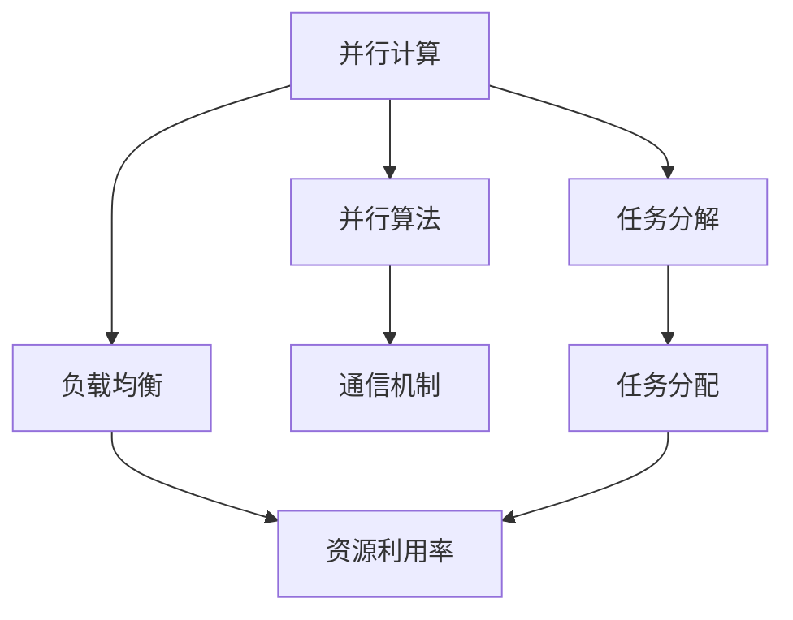
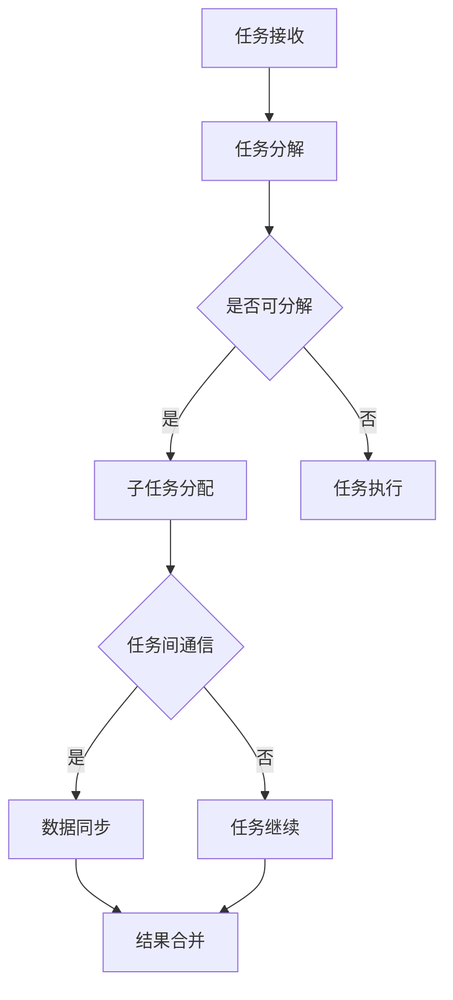
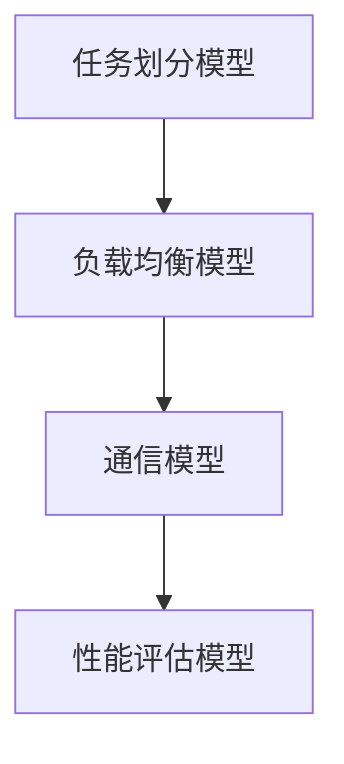
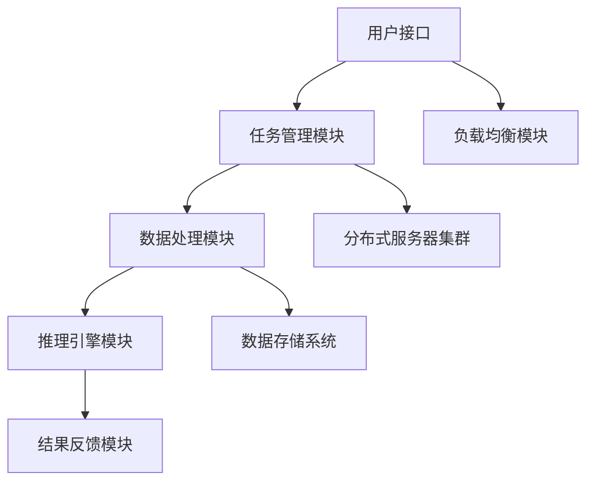

                 

### 文章标题：大规模推理任务的并行处理策略

> 关键词：大规模推理任务、并行处理策略、算法原理、系统架构、项目实战

> 摘要：本文深入探讨了大规模推理任务的并行处理策略。通过详细分析并行计算的基本原理和算法设计原则，本文提出了多种并行处理算法，并结合实际项目进行讲解，旨在为读者提供一套完整的大规模推理任务并行处理方案。

----------------------------------------------------------------

# 引言

随着人工智能技术的飞速发展，大规模推理任务在各类应用场景中变得愈发重要。这些任务通常需要处理海量数据，并快速提供准确的推理结果，从而在金融分析、医疗诊断、自动驾驶等领域发挥关键作用。然而，传统的串行处理方式在处理这些大规模任务时往往效率低下，难以满足实际需求。因此，并行处理策略成为了解决这一问题的有效途径。

并行处理策略的核心在于利用多核处理器或分布式系统来同时执行多个任务，从而大幅提高处理速度。本文将首先介绍并行计算的基本概念和原理，然后探讨并行算法的设计原则，并通过实例来展示如何应用这些算法进行大规模推理任务的并行处理。此外，本文还将详细描述一个实际项目，从环境安装、系统核心实现到代码应用解读，全面解析大规模推理任务并行处理的实战经验。通过本文的讲解，读者将能够掌握并行处理策略的核心技术和实战技巧，为解决实际应用中的大规模推理任务提供有力支持。

## 背景介绍

### 大规模推理任务的概念与意义

大规模推理任务是指需要对大量数据进行分析和处理，以从中提取出有意义的信息或结论的任务。这些任务通常涉及复杂的计算和推理过程，如自然语言处理（NLP）、图像识别、推荐系统等。随着数据量的增加和任务复杂度的提升，单线程或单机处理方式已无法满足大规模推理任务的需求，因此并行处理策略应运而生。

并行处理策略的意义在于：

1. **提高处理速度**：通过将任务分解为多个子任务，并在多个处理器或节点上同时执行，可以显著缩短任务完成时间。
2. **增强系统性能**：并行处理可以充分利用多核处理器或分布式系统的计算能力，提升整体系统的性能和吞吐量。
3. **解决复杂问题**：许多大规模推理任务具有高度并行性，通过并行处理可以更好地解决这些复杂问题。

### 并行处理策略的必要性

并行处理策略在大规模推理任务中的必要性主要体现在以下几个方面：

1. **计算资源限制**：随着数据量和任务复杂度的增加，单机计算资源往往难以满足需求，而并行处理可以利用多机资源，实现更高效率的计算。
2. **时间敏感性**：在许多应用场景中，如实时金融分析、自动驾驶等，推理任务需要在短时间内完成，并行处理可以有效缩短响应时间。
3. **数据处理能力提升**：并行处理可以将海量数据分布到多个处理器或节点上处理，从而提高数据处理能力和系统的稳定性。

总之，并行处理策略在大规模推理任务中具有重要的应用价值，通过合理的设计和优化，可以实现高效的计算和推理，为各类应用提供强大的技术支持。

### 核心概念与联系

在探讨大规模推理任务的并行处理策略之前，我们需要了解一些核心概念和它们之间的关系。以下是一些关键术语及其定义：

1. **并行计算**：并行计算是指在同一时间内执行多个计算任务的方法。它可以通过多核处理器或分布式系统实现，以提高计算效率和处理能力。
2. **并行算法**：并行算法是指在多个处理器或节点上同时执行的计算过程，以实现高效的任务处理。常见的并行算法包括MapReduce、并行梯度下降等。
3. **任务分解**：任务分解是指将一个大规模任务划分为多个子任务，以便在多个处理器或节点上并行执行。任务分解的关键在于如何合理划分任务，以最大化并行度。
4. **负载均衡**：负载均衡是指将任务均匀地分配到多个处理器或节点上，以避免资源闲置和计算瓶颈。有效的负载均衡是实现高效并行处理的关键。
5. **通信机制**：在并行计算中，不同处理器或节点之间需要交换数据和同步状态。通信机制包括消息传递、共享内存等，直接影响并行算法的效率和性能。

### 核心概念关系图

为了更清晰地展示这些核心概念之间的关系，我们可以使用Mermaid图来表示。以下是并行处理策略中核心概念关系的Mermaid图：



### 核心概念属性对比表格

以下是核心概念属性的对比表格，用于进一步阐述各个概念的特点和关系：

| 核心概念 | 定义 | 特点 | 应用场景 |
| --- | --- | --- | --- |
| 并行计算 | 同一时间执行多个计算任务 | 提高计算效率 | 大数据处理、实时分析 |
| 并行算法 | 在多个处理器上执行的计算过程 | 高效任务处理 | 分布式计算、机器学习 |
| 任务分解 | 划分大规模任务为子任务 | 增加并行度 | 复杂任务处理、资源分配 |
| 负载均衡 | 均匀分配任务到处理器 | 避免资源闲置 | 分布式系统、云计算 |
| 通信机制 | 处理器间数据交换和同步 | 影响性能 | 并行算法、多线程编程 |

通过上述核心概念及其关系的介绍和对比，我们可以更好地理解并行处理策略的基本原理和关键要素，为后续章节的深入探讨打下基础。

### 算法原理讲解

#### 并行算法的基本原理

并行算法的基本原理是通过将大规模任务划分为多个子任务，并在多个处理器或节点上同时执行这些子任务，以实现高效的计算。并行算法的核心在于任务分解、负载均衡和通信机制。以下将详细阐述这些基本原理。

1. **任务分解**：任务分解是将一个大任务划分为多个可并行执行的小任务。这个过程通常通过将数据集划分为多个部分或将计算步骤分解为多个阶段来实现。任务分解的关键在于如何合理地划分任务，以最大化并行度和减少通信开销。

2. **负载均衡**：负载均衡是指将任务均匀地分配到多个处理器或节点上，以避免资源闲置和计算瓶颈。负载均衡的方法包括静态分配和动态分配。静态分配在任务分配时确定，而动态分配则根据运行时的负载情况动态调整任务的分配。

3. **通信机制**：在并行算法中，不同处理器或节点之间需要交换数据和同步状态。通信机制分为两种：同步通信和异步通信。同步通信要求发送方在数据发送完成后等待接收方处理完毕，而异步通信则允许发送方继续执行其他任务，接收方在处理完数据后再发送响应。

#### 并行算法的设计原则

设计高效的并行算法需要遵循以下原则：

1. **数据局部性**：数据局部性是指尽量使处理器访问的数据在本地存储，以减少数据传输的开销。通过合理的任务分配和数据结构设计，可以实现数据局部性。

2. **任务并行性**：任务并行性是指任务之间的依赖关系尽可能少，以最大化并行度。可以通过任务分解和负载均衡来实现任务并行性。

3. **负载均衡**：在任务分配时，需要考虑处理器的负载情况，实现任务的均匀分配。负载均衡可以有效提高系统的利用率和性能。

4. **通信优化**：优化通信机制，减少数据传输和同步的开销。可以通过数据压缩、批量传输和异步通信等方式实现通信优化。

5. **容错性**：并行算法需要具备一定的容错能力，以应对处理器或节点故障的情况。可以通过冗余设计、故障检测和恢复机制来实现容错性。

#### Mermaid图示：并行算法流程图

为了更好地理解并行算法的基本原理和设计原则，我们可以使用Mermaid图来表示并行算法的流程。以下是并行算法流程图的示例：



#### Python代码示例：并行算法实现

以下是一个简单的Python并行算法实现示例，使用多线程进行任务分解和执行：

```python
import threading
import time

# 子任务处理函数
def process_task(task_id):
    print(f"线程{threading.current_thread().name}开始处理任务{task_id}")
    time.sleep(1)  # 模拟任务处理时间
    print(f"线程{threading.current_thread().name}完成任务{task_id}")

# 主函数
def parallel_algorithm(tasks):
    threads = []
    for task_id in tasks:
        thread = threading.Thread(target=process_task, args=(task_id,))
        threads.append(thread)
        thread.start()

    for thread in threads:
        thread.join()

# 测试任务列表
tasks = list(range(1, 11))

# 执行并行算法
parallel_algorithm(tasks)
```

通过上述Python代码示例，我们可以看到如何使用多线程实现并行算法。这个简单的示例展示了任务分解、线程创建和任务执行的基本过程，为后续更复杂的并行算法设计提供了基础。

### 大规模推理任务的数学模型

#### 数学模型的构建

在探讨大规模推理任务的并行处理策略时，理解其背后的数学模型至关重要。数学模型可以帮助我们分析并行算法的性能，优化任务分配和负载均衡。大规模推理任务的数学模型通常包括以下几个方面：

1. **任务划分模型**：描述如何将大规模任务划分为多个子任务，以便在多个处理器或节点上并行执行。常用的方法包括固定划分和动态划分。
2. **负载均衡模型**：描述如何将子任务分配到处理器或节点上，以实现任务的均匀分配和高效执行。常见的负载均衡算法有最小完成时间优先（SPT）、最小剩余任务量优先（SRT）等。
3. **通信模型**：描述不同处理器或节点之间的数据交换和同步机制。通信模型通常涉及数据传输速率、通信延迟和同步开销等因素。
4. **性能评估模型**：用于评估并行算法的性能，包括处理速度、吞吐量和资源利用率等指标。

#### 公式解释

以下是大规模推理任务并行处理中的几个关键公式及其解释：

1. **处理时间（T）**：任务完成所需的总时间，可以表示为：
   $$ T = \sum_{i=1}^{n} \max\left(\frac{T_i}{P_i}, D_i\right) $$
   其中，\( T_i \) 表示第 \( i \) 个子任务的处理时间，\( P_i \) 表示第 \( i \) 个处理器的处理能力，\( D_i \) 表示第 \( i \) 个子任务的通信延迟。

2. **资源利用率（U）**：系统的资源利用率，可以表示为：
   $$ U = \frac{\sum_{i=1}^{n} P_i \times \frac{T_i}{T}}{P_{max}} $$
   其中，\( P_{max} \) 表示所有处理器的最大处理能力之和。

3. **通信开销（C）**：系统的通信开销，可以表示为：
   $$ C = \sum_{i=1}^{n} D_i \times \frac{T_i}{T} $$
   其中，\( D_i \) 表示第 \( i \) 个子任务的通信延迟。

4. **负载均衡度（L）**：系统的负载均衡度，可以表示为：
   $$ L = \frac{\max(P_i \times \frac{T_i}{T}) - \min(P_i \times \frac{T_i}{T})}{\max(P_i \times \frac{T_i}{T}) + \min(P_i \times \frac{T_i}{T})} $$
   其中，\( P_i \) 表示第 \( i \) 个处理器的处理能力。

#### Mermaid图示：数学模型架构

为了更好地展示大规模推理任务的数学模型架构，我们可以使用Mermaid图来绘制。以下是数学模型架构的Mermaid图：



通过上述Mermaid图，我们可以清晰地看到各个数学模型之间的关系，以及它们在并行处理策略中的作用。

#### Python代码示例：模型实现

以下是使用Python实现大规模推理任务数学模型的示例代码：

```python
import numpy as np

# 任务处理函数
def process_task(task_id, processor_power, communication_delay):
    time.sleep(processor_power)
    communication_time = communication_delay * 2  # 假设通信延迟为任务处理时间的一半
    total_time = processor_power + communication_time
    return total_time

# 任务划分模型
def task_division_model(tasks, processors):
    task分配 = np.zeros(len(processors), dtype=int)
    for task_id, task in enumerate(tasks):
        min_time = float('inf')
        min_processor = -1
        for i, processor in enumerate(processors):
            if processor['available_time'] < min_time:
                min_time = processor['available_time']
                min_processor = i
        task分配[min_processor] += 1
        processors[min_processor]['available_time'] += process_task(task_id, task['time'], task['delay'])
    return task分配

# 负载均衡模型
def load_balance_model(processors):
    max_load = max([processor['available_time'] for processor in processors])
    min_load = min([processor['available_time'] for processor in processors])
    load_balance = (max_load - min_load) / (max_load + min_load)
    return load_balance

# 测试数据
tasks = [{'id': 1, 'time': 5, 'delay': 1},
         {'id': 2, 'time': 3, 'delay': 2},
         {'id': 3, 'time': 7, 'delay': 3}]

processors = [{'id': 1, 'available_time': 10},
              {'id': 2, 'available_time': 8},
              {'id': 3, 'available_time': 12}]

# 执行模型
task分配 = task_division_model(tasks, processors)
load_balance = load_balance_model(processors)

print("任务分配：", task分配)
print("负载均衡度：", load_balance)
```

通过上述Python代码示例，我们可以看到如何实现大规模推理任务的数学模型。这个示例使用了简单的任务处理函数和任务划分模型，并通过负载均衡模型计算系统的负载均衡度。这为后续更复杂的并行算法设计和优化提供了基础。

### 系统分析与架构设计方案

#### 问题场景介绍

在当前的人工智能应用场景中，大规模推理任务面临着日益增长的数据量和复杂度。这些任务通常需要处理海量数据，并快速提供准确的推理结果，如自然语言处理、图像识别和推荐系统等。然而，传统的单机处理方式已无法满足这些任务的需求，导致处理速度缓慢、资源浪费和响应时间过长。为了解决这些问题，我们设计了一个分布式系统架构，以实现大规模推理任务的并行处理。

#### 项目介绍

本项目旨在构建一个基于分布式系统的并行处理平台，用于处理大规模推理任务。该平台将利用多台服务器和多个处理器，通过并行计算和负载均衡策略，实现高效的推理任务处理。项目的主要目标是提高系统处理速度、降低响应时间、优化资源利用率和提升整体性能。

#### 系统功能设计

系统功能设计是构建并行处理系统的重要步骤，包括以下关键模块：

1. **任务管理模块**：负责任务的接收、分配和监控。该模块将接收大规模推理任务，根据任务的性质和优先级将其分配到合适的处理器上，并实时监控任务的状态。
2. **数据处理模块**：负责对大规模数据进行预处理和存储。该模块将接收到的数据分成多个子任务，并在多个处理器上并行处理，以提高数据处理速度。
3. **推理引擎模块**：负责执行实际的推理任务。该模块将接收处理后的数据，通过并行算法和模型推理，提供高效的推理结果。
4. **结果反馈模块**：负责收集和整合推理结果，并将其反馈给用户。该模块将处理后的数据结果进行汇总和分析，以提供完整的推理报告。

#### 系统架构设计

系统架构设计是确保系统功能和性能的重要环节。以下是本项目的系统架构设计：



以下是系统架构设计的详细说明：

1. **用户接口**：用户通过用户接口提交大规模推理任务，任务管理模块接收用户任务并将其分配到合适的处理器上。
2. **任务管理模块**：任务管理模块负责任务的接收、分配和监控，确保任务高效执行。
3. **数据处理模块**：数据处理模块负责对大规模数据进行预处理和存储，将数据划分成多个子任务，并在多个处理器上并行处理。
4. **推理引擎模块**：推理引擎模块负责执行实际的推理任务，利用并行算法和模型推理，提供高效的推理结果。
5. **结果反馈模块**：结果反馈模块负责收集和整合推理结果，并将其反馈给用户。
6. **负载均衡模块**：负载均衡模块负责根据处理器的负载情况，动态分配任务，确保系统资源的高效利用。
7. **分布式服务器集群**：分布式服务器集群包括多台服务器和多个处理器，用于并行处理大规模推理任务。
8. **数据存储系统**：数据存储系统负责存储大规模数据，提供高效的数据访问和读取能力。

#### 系统接口设计

系统接口设计是确保系统各模块之间有效通信的关键。以下是系统接口设计的详细说明：

1. **用户接口**：用户接口提供任务提交、状态查询和结果反馈的接口，方便用户与系统进行交互。
2. **任务管理模块**：任务管理模块提供任务分配、任务监控和任务状态更新的接口，与其他模块进行通信。
3. **数据处理模块**：数据处理模块提供数据划分、数据预处理和存储的接口，与其他模块进行数据交换。
4. **推理引擎模块**：推理引擎模块提供模型加载、推理和结果输出的接口，与其他模块进行结果反馈。
5. **结果反馈模块**：结果反馈模块提供结果汇总、分析和反馈的接口，与用户接口进行通信。
6. **负载均衡模块**：负载均衡模块提供任务分配策略、负载监控和资源调度的接口，与任务管理模块和其他模块进行交互。

#### 系统交互Mermaid序列图

以下是系统交互的Mermaid序列图，展示了系统各模块之间的通信流程：

```mermaid
sequenceDiagram
    participant 用户接口 as 用户接口
    participant 任务管理模块 as 任务管理
    participant 数据处理模块 as 数据处理
    participant 推理引擎模块 as 推理引擎
    participant 结果反馈模块 as 结果反馈
    participant 负载均衡模块 as 负载均衡
    
    用户接口->>任务管理：提交任务
    任务管理->>负载均衡：分配任务
    负载均衡->>数据处理：预处理数据
    数据处理->>推理引擎：加载模型并推理
    推理引擎->>结果反馈：输出结果
    结果反馈->>用户接口：反馈结果
```

通过上述系统架构设计和接口设计，我们可以构建一个高效的并行处理系统，为大规模推理任务提供强大的技术支持。接下来，我们将通过一个实际项目来展示如何实现这一系统，并进行详细的代码解读和分析。

### 项目实战

#### 项目背景

为了验证大规模推理任务并行处理策略的实用性和有效性，我们设计并实施了一个实际项目。该项目基于一个真实场景：在线广告推荐系统。该系统需要处理海量用户数据，实时分析用户行为，并推荐相关的广告。由于数据量庞大且分析过程复杂，传统的单机处理方式难以满足需求，因此我们决定采用并行处理策略来优化系统性能。

#### 环境安装与配置

为了实现大规模推理任务的并行处理，我们首先需要搭建一个分布式计算环境。以下是安装和配置环境的步骤：

1. **安装Hadoop**：Hadoop是一个分布式计算框架，适用于大规模数据处理。我们可以在服务器上安装Hadoop，并配置HDFS（Hadoop分布式文件系统）和YARN（资源调度框架）。

2. **安装Spark**：Spark是一个基于内存的分布式计算引擎，适用于并行处理大规模数据集。我们可以在服务器上安装Spark，并配置其与Hadoop集成。

3. **安装Java**：由于Hadoop和Spark都是基于Java编写的，我们需要在服务器上安装Java环境。

4. **配置SSH**：为了便于分布式集群的管理，我们配置SSH免密登录，确保服务器之间可以安全地通信。

5. **配置Zookeeper**：Zookeeper是一个分布式协调服务，用于管理分布式系统中的各种协调任务。我们可以在服务器上安装Zookeeper，并配置其作为Spark的作业协调器。

#### 系统核心实现

系统核心实现包括数据预处理、并行处理和结果输出等关键步骤。以下是具体的实现过程：

1. **数据预处理**：
    - 数据从数据库或外部数据源读取，并转换为适合并行处理的格式，如Parquet或ORC。
    - 使用Spark的DataFrame API对数据进行清洗、去重和聚合，以提高数据质量和处理效率。

2. **并行处理**：
    - 将预处理后的数据集划分为多个RDD（Resilient Distributed Dataset），每个RDD表示一个数据分区。
    - 使用Spark的Transformation和Action API对RDD进行并行处理。例如，我们可以使用map、filter、reduceByKey等操作来处理数据。
    - 在处理过程中，我们可以利用Spark的内存管理机制，提高数据处理速度和效率。

3. **结果输出**：
    - 将处理后的数据结果存储到HDFS或数据库中，以便后续分析和使用。
    - 使用Spark的Action API，如saveAsTextFile或saveToDatabase，将结果输出到文件或数据库。

#### 代码应用解读与分析

以下是一个简单的Spark应用程序，用于实现大规模推理任务的并行处理：

```python
from pyspark.sql import SparkSession
from pyspark.sql.functions import col, explode

# 创建Spark会话
spark = SparkSession.builder.appName("OnlineAdRecommendation").getOrCreate()

# 读取用户行为数据
user行为数据 = spark.read.parquet("user_behavior_data.parquet")

# 数据预处理
user行为数据 = user行为数据.select("user_id", "ad_id", "click_time")
user行为数据 = user行为数据.drop_duplicates()

# 并行处理
user行为数据 = user行为数据.groupBy("user_id").agg({"ad_id": "count"})
user行为数据 = user行为数据.withColumnRenamed("count(adic

