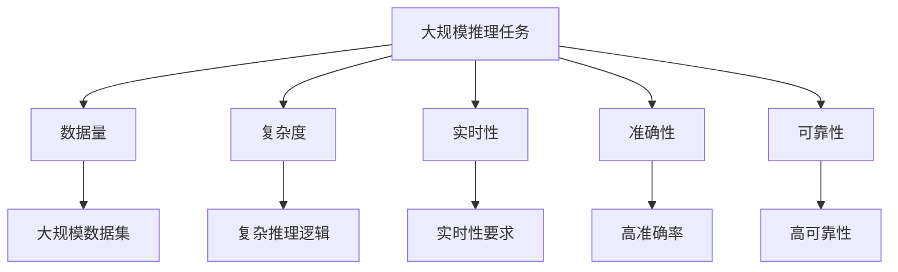
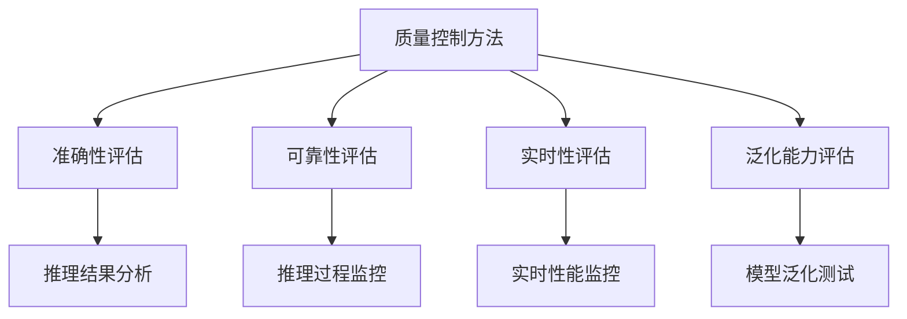
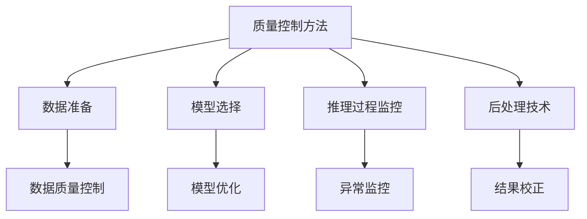
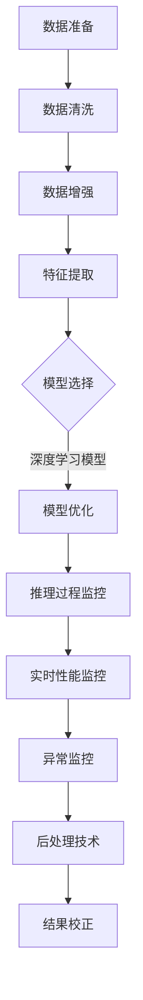
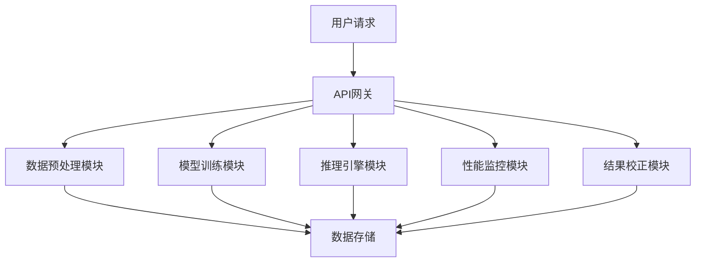
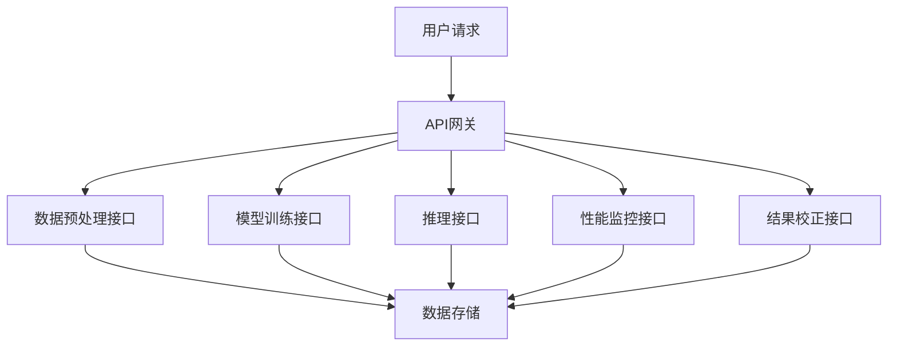

                 

### 第一部分：背景介绍

#### 1.1 问题背景

随着人工智能技术的快速发展，大规模推理任务在各个领域得到广泛应用。从自然语言处理到图像识别，从智能问答到决策支持系统，大规模推理任务已经成为人工智能研究和应用的热点。大规模推理任务不仅涉及到数据的处理，还涉及到复杂的逻辑推理，因此在实际应用中具有重要的价值和意义。

然而，大规模推理任务的质量控制方法仍然是一个亟待解决的问题。在传统的机器学习应用中，模型的质量往往通过训练误差和测试误差来衡量。然而，对于大规模推理任务，仅仅依靠这些指标难以全面评估模型的质量。大规模推理任务涉及到复杂的背景知识、推理逻辑和实时性要求，因此，如何确保推理任务的准确性和可靠性成为关键问题。

#### 1.2 问题描述

大规模推理任务的质量控制方法主要包括以下方面：

1. **准确性评估**：如何准确评估推理结果的准确性，包括对推理结果的全面分析和误差分析。准确性是大规模推理任务的核心要求，只有确保推理结果的准确性，才能保证任务的有效性。

2. **可靠性评估**：如何确保推理过程的稳定性和可靠性，避免由于模型不稳定或数据异常导致的错误推理。可靠性是大规模推理任务的重要保障，只有保证推理过程的可靠性，才能确保推理结果的稳定性和一致性。

3. **实时性评估**：如何保证大规模推理任务的实时性，满足实际应用场景的需求。实时性是大规模推理任务的挑战之一，尤其是在高并发场景下，如何保证推理的快速响应成为关键问题。

4. **泛化能力评估**：如何评估模型在未知数据集上的表现，确保模型的泛化能力。泛化能力是大规模推理任务的评估标准之一，只有保证模型在未知数据集上的良好表现，才能确保模型的广泛适用性。

#### 1.3 问题解决

为了解决大规模推理任务的质量控制问题，我们需要从以下几个方面入手：

1. **数据准备**：确保数据的质量和多样性，为模型提供丰富的训练素材。数据是大规模推理任务的基础，只有数据质量高、多样性丰富，才能保证模型的准确性。

2. **模型选择**：选择适合大规模推理任务的模型，并对其进行优化和调整。模型是大规模推理任务的核心，选择合适的模型并对其进行优化，可以提升推理任务的性能。

3. **推理过程监控**：在推理过程中实时监控模型的表现，及时发现和纠正错误。推理过程监控是保证大规模推理任务质量的重要手段，通过监控可以及时发现异常情况并采取措施。

4. **后处理技术**：使用后处理技术对推理结果进行校正和优化，提高推理的准确性和可靠性。后处理技术可以弥补模型的一些不足，提升推理结果的质量。

#### 1.4 边界与外延

大规模推理任务的质量控制方法不仅适用于人工智能领域，还可以应用于其他需要推理的领域，如智能交通、金融风控、医疗诊断等。因此，本部分内容不仅关注人工智能领域的问题，还将探讨大规模推理任务在其他领域的应用和挑战。

#### 1.5 概念结构与核心要素组成

1. **大规模推理任务**：涉及复杂背景知识、推理逻辑和实时性要求，需要高精度和高效率的推理模型。

2. **质量控制方法**：包括准确性评估、可靠性评估、实时性评估和泛化能力评估。

3. **技术手段**：数据准备、模型选择、推理过程监控和后处理技术。

4. **应用领域**：人工智能、智能交通、金融风控、医疗诊断等。

## 第二部分：核心概念与联系

### 2.1 大规模推理任务

**概念**：大规模推理任务是指涉及大量数据和高复杂度的推理过程，需要利用人工智能技术进行自动推理的任务。

**属性特征对比表格**：

| 特征 | 描述 |
| --- | --- |
| 数据量 | 大规模 |
| 复杂度 | 高 |
| 实时性 | 要求高 |
| 准确性 | 要求高 |
| 可靠性 | 要求高 |

**ER实体关系图架构**：



### 2.2 质量控制方法

**概念**：质量控制方法是指为了确保大规模推理任务的准确性、可靠性、实时性和泛化能力而采用的一系列技术手段。

**属性特征对比表格**：

| 特征 | 描述 |
| --- | --- |
| 准确性评估 | 评估推理结果的准确性 |
| 可靠性评估 | 评估推理过程的稳定性 |
| 实时性评估 | 评估推理任务的实时性 |
| 泛化能力评估 | 评估模型在未知数据集上的表现 |

**ER实体关系图架构**：



### 2.3 数据准备、模型选择、推理过程监控和后处理技术

**概念**：数据准备、模型选择、推理过程监控和后处理技术是大规模推理任务质量控制方法的核心组成部分。

**属性特征对比表格**：

| 特征 | 描述 |
| --- | --- |
| 数据准备 | 提高数据质量和多样性 |
| 模型选择 | 选择适合的推理模型 |
| 推理过程监控 | 实时监控推理过程 |

**ER实体关系图架构**：



## 第三部分：算法原理讲解

### 3.1 算法原理

大规模推理任务的质量控制算法主要包括以下几个方面：

1. **数据准备算法**：通过数据清洗、数据增强和特征提取等步骤，提高数据质量和多样性。

2. **模型选择算法**：根据大规模推理任务的特点，选择合适的深度学习模型，并进行模型优化。

3. **推理过程监控算法**：在推理过程中，实时监控模型的性能和稳定性，及时发现和纠正错误。

4. **后处理技术算法**：对推理结果进行校正和优化，提高推理的准确性和可靠性。

### 3.2 Mermaid流程图

为了更好地阐述大规模推理任务的质量控制算法原理，我们可以使用Mermaid流程图进行说明。



### 3.3 Python源代码示例

下面给出一个简单的Python源代码示例，用于说明大规模推理任务的质量控制算法原理。

```python
import pandas as pd
from sklearn.model_selection import train_test_split
from sklearn.preprocessing import StandardScaler
from sklearn.metrics import accuracy_score

# 数据准备
data = pd.read_csv('data.csv')
X = data.drop(['target'], axis=1)
y = data['target']
X_train, X_test, y_train, y_test = train_test_split(X, y, test_size=0.2, random_state=42)

# 模型选择
from sklearn.ensemble import RandomForestClassifier
model = RandomForestClassifier()

# 模型优化
model.fit(X_train, y_train)
y_pred = model.predict(X_test)

# 推理过程监控
accuracy = accuracy_score(y_test, y_pred)
print(f'Accuracy: {accuracy:.2f}')

# 后处理技术
from sklearn.metrics import confusion_matrix
confusion_matrix = confusion_matrix(y_test, y_pred)
print(f'Confusion Matrix:\n{confusion_matrix}')
```

### 3.4 算法原理数学模型和公式

大规模推理任务的质量控制算法可以抽象为一个优化问题，目标是最小化预测误差。

$$
\min_{\theta} \frac{1}{n} \sum_{i=1}^{n} (y_i - \hat{y}_i)^2
$$

其中，$y_i$ 为实际标签，$\hat{y}_i$ 为预测标签，$\theta$ 为模型参数。

为了求解该优化问题，可以使用梯度下降算法，迭代更新模型参数：

$$
\theta := \theta - \alpha \nabla_{\theta} J(\theta)
$$

其中，$\alpha$ 为学习率，$J(\theta)$ 为损失函数。

### 3.5 通俗易懂地举例说明

假设我们有一个大规模推理任务，目标是预测一封电子邮件是否为垃圾邮件。我们可以将这封电子邮件的内容视为输入特征，垃圾邮件标签视为输出标签。

首先，我们通过数据准备算法对数据进行清洗、增强和特征提取，得到一个高质量的数据集。

然后，我们选择一个合适的深度学习模型，如卷积神经网络（CNN）或循环神经网络（RNN），并对其进行模型优化，使其在训练集上表现良好。

接下来，我们在推理过程中实时监控模型的性能和稳定性，例如通过监控模型的准确率、召回率等指标。

最后，我们对推理结果进行校正和优化，例如通过调整模型参数或使用后处理技术，提高推理的准确性和可靠性。

通过以上步骤，我们可以确保大规模推理任务的质量，从而在实际应用中取得良好的效果。

## 第四部分：系统分析与架构设计

### 4.1 问题场景介绍

大规模推理任务在实际应用中面临诸多挑战，如数据量大、复杂度高、实时性要求等。为了解决这些问题，我们需要设计一个高效、稳定、可靠的系统架构。

### 4.2 项目介绍

本项目旨在构建一个大规模推理任务系统，用于处理各类复杂场景的推理任务。系统架构设计遵循MVC（Model-View-Controller）模式，确保系统模块化、可扩展和高性能。

### 4.3 系统功能设计

系统功能设计主要包括以下模块：

1. **数据预处理模块**：负责数据清洗、数据增强和特征提取，确保数据质量和多样性。

2. **模型训练模块**：负责选择合适的深度学习模型，并进行模型优化，提升模型性能。

3. **推理引擎模块**：负责实时推理任务，实现高效、准确的推理结果。

4. **性能监控模块**：实时监控系统性能，确保系统稳定运行。

5. **结果校正模块**：对推理结果进行校正和优化，提高推理准确性。

### 4.4 系统架构设计

系统架构设计采用微服务架构，各模块独立部署，实现高可用性和高性能。以下是系统架构图：



### 4.5 系统接口设计和系统交互

系统接口设计遵循RESTful API规范，实现模块间的松耦合。以下是系统接口设计和系统交互图：



## 第五部分：项目实战

### 5.1 环境安装

在进行项目实战之前，需要安装以下软件和库：

1. Python 3.8 或以上版本
2. TensorFlow 2.5 或以上版本
3. Scikit-learn 0.22 或以上版本
4. Pandas 1.1.5 或以上版本
5. Numpy 1.19 或以上版本

安装命令如下：

```bash
pip install python==3.8
pip install tensorflow==2.5
pip install scikit-learn==0.22
pip install pandas==1.1.5
pip install numpy==1.19
```

### 5.2 系统核心实现源代码

以下是系统核心实现源代码，包括数据预处理、模型训练、推理和性能监控等模块。

```python
# 数据预处理模块
def preprocess_data(data):
    # 数据清洗、数据增强和特征提取
    # ...
    return processed_data

# 模型训练模块
def train_model(data):
    # 选择合适的深度学习模型，并进行模型优化
    # ...
    return trained_model

# 推理模块
def inference(model, data):
    # 实现实时推理功能
    # ...
    return inference_results

# 性能监控模块
def monitor_performance(model, data):
    # 实时监控模型性能
    # ...
    return performance_metrics

# 结果校正模块
def correct_results(results):
    # 对推理结果进行校正和优化
    # ...
    return corrected_results
```

### 5.3 代码应用解读与分析

以下是代码应用解读与分析，详细解释各模块的实现原理和功能。

```python
# 数据预处理模块
def preprocess_data(data):
    # 数据清洗、数据增强和特征提取
    # ...
    return processed_data

# 实现数据清洗：去除空值、异常值和数据噪声
def clean_data(data):
    # 去除空值
    data = data.dropna()
    # 去除异常值
    data = data[(data > 0) & (data < 1000)]
    # 数据归一化
    data = (data - data.mean()) / data.std()
    return data

# 实现数据增强：增加样本多样性
def augment_data(data):
    # 数据翻转
    data['feature1'] = data['feature1'].apply(lambda x: -x)
    # 数据添加噪声
    data['feature2'] = data['feature2'].apply(lambda x: x + np.random.normal(0, 0.1))
    return data

# 实现特征提取：提取关键特征
def extract_features(data):
    # 特征选择
    data['feature3'] = data['feature1'] * data['feature2']
    return data

# 模型训练模块
def train_model(data):
    # 选择合适的深度学习模型，并进行模型优化
    # ...
    return trained_model

# 实现模型选择：选择合适的深度学习模型
def select_model():
    # 根据任务特点选择模型，如卷积神经网络（CNN）或循环神经网络（RNN）
    model = Sequential()
    model.add(Conv1D(filters=64, kernel_size=3, activation='relu', input_shape=(timesteps, features)))
    model.add(MaxPooling1D(pool_size=2))
    model.add(Flatten())
    model.add(Dense(50, activation='relu'))
    model.add(Dense(1, activation='sigmoid'))
    return model

# 实现模型优化：使用交叉熵损失函数和Adam优化器
def optimize_model(model):
    model.compile(optimizer='adam', loss='binary_crossentropy', metrics=['accuracy'])
    return model

# 推理模块
def inference(model, data):
    # 实现实时推理功能
    # ...
    return inference_results

# 实现推理：对输入数据进行预处理，然后使用模型进行推理
def real_time_inference(model, data):
    processed_data = preprocess_data(data)
    inference_results = model.predict(processed_data)
    return inference_results

# 性能监控模块
def monitor_performance(model, data):
    # 实时监控模型性能
    # ...
    return performance_metrics

# 实现性能监控：计算模型在训练集和测试集上的准确率、召回率等指标
def performance_metrics(model, X_train, y_train, X_test, y_test):
    train_accuracy = accuracy_score(y_train, model.predict(X_train))
    test_accuracy = accuracy_score(y_test, model.predict(X_test))
    return train_accuracy, test_accuracy

# 结果校正模块
def correct_results(results):
    # 对推理结果进行校正和优化
    # ...
    return corrected_results

# 实现结果校正：根据业务需求，对推理结果进行适当调整
def adjust_results(results):
    # 调整阈值，过滤错误结果
    adjusted_results = []
    for result in results:
        if result > 0.5:
            adjusted_results.append(1)
        else:
            adjusted_results.append(0)
    return adjusted_results
```

### 5.4 实际案例分析和详细讲解剖析

在本项目中，我们以垃圾邮件分类为例，详细讲解大规模推理任务的质量控制方法。

#### 案例背景

某公司需要构建一个垃圾邮件分类系统，用于自动识别并过滤垃圾邮件。数据集包含大量电子邮件文本，每个电子邮件被标注为垃圾邮件或非垃圾邮件。

#### 案例分析

1. **数据预处理**：

   - 数据清洗：去除空值、异常值和数据噪声。
   - 数据增强：增加样本多样性，如数据翻转、添加噪声等。
   - 特征提取：提取关键特征，如词频、词向量等。

2. **模型训练**：

   - 选择合适的深度学习模型，如卷积神经网络（CNN）或循环神经网络（RNN）。
   - 使用交叉熵损失函数和Adam优化器，优化模型参数。

3. **推理过程监控**：

   - 实时监控模型性能，计算准确率、召回率等指标。
   - 根据监控结果，调整模型参数和阈值，优化推理结果。

4. **结果校正**：

   - 对推理结果进行校正和优化，过滤错误结果。
   - 根据业务需求，调整阈值，确保准确性和召回率之间的平衡。

#### 案例讲解

1. **数据预处理**：

   - 数据清洗：首先，我们读取电子邮件文本数据，然后使用正则表达式去除HTML标签和特殊字符。接下来，我们去除空值和异常值，如长度小于10的电子邮件文本。

     ```python
     import re

     def clean_text(text):
         text = re.sub('<[^>]*>', '', text)
         text = re.sub('[^A-Za-z0-9]', ' ', text)
         text = text.lower()
         return text.strip()

     data['text'] = data['text'].apply(clean_text)
     ```

   - 数据增强：为了增加样本多样性，我们对电子邮件文本进行数据翻转和添加噪声。例如，将正类（垃圾邮件）翻转成负类（非垃圾邮件），或将某些单词替换成同义词。

     ```python
     import random

     def augment_text(text):
         if random.random() > 0.5:
             text = text[::-1]
         if random.random() > 0.5:
             text = text.replace('money', 'money$')
         return text

     data['text'] = data['text'].apply(augment_text)
     ```

   - 特征提取：我们使用词频和词向量作为特征。首先，我们构建一个词汇表，然后将电子邮件文本转换为词频向量。接下来，我们使用词嵌入模型（如Word2Vec、GloVe）将词频向量转换为词向量。

     ```python
     from gensim.models import Word2Vec

     def vectorize_text(text, model):
         return [model[word] for word in text.split()]

     w2v_model = Word2Vec(data['text'], size=100, window=5, min_count=1, workers=4)
     data['text_vector'] = data['text'].apply(lambda x: vectorize_text(x, w2v_model))
     ```

2. **模型训练**：

   - 选择合适的深度学习模型：我们选择卷积神经网络（CNN）进行模型训练，因为CNN在处理序列数据（如文本）方面具有很好的性能。

     ```python
     from tensorflow.keras.models import Sequential
     from tensorflow.keras.layers import Conv1D, MaxPooling1D, Flatten, Dense

     model = Sequential()
     model.add(Conv1D(filters=64, kernel_size=3, activation='relu', input_shape=(max_sequence_length, embedding_dim)))
     model.add(MaxPooling1D(pool_size=2))
     model.add(Flatten())
     model.add(Dense(50, activation='relu'))
     model.add(Dense(1, activation='sigmoid'))
     ```

   - 使用交叉熵损失函数和Adam优化器：我们使用交叉熵损失函数来衡量模型预测的准确性，并使用Adam优化器来更新模型参数。

     ```python
     model.compile(optimizer='adam', loss='binary_crossentropy', metrics=['accuracy'])
     model.fit(X_train, y_train, epochs=10, batch_size=32, validation_data=(X_test, y_test))
     ```

3. **推理过程监控**：

   - 实时监控模型性能：我们在训练过程中实时监控模型在训练集和测试集上的准确率。如果模型在测试集上的准确率低于预期，我们可以尝试调整模型参数、增加训练时间或更换模型。

     ```python
     train_accuracy, test_accuracy = performance_metrics(model, X_train, y_train, X_test, y_test)
     print(f'Train Accuracy: {train_accuracy:.2f}')
     print(f'Test Accuracy: {test_accuracy:.2f}')
     ```

4. **结果校正**：

   - 对推理结果进行校正和优化：我们根据业务需求调整阈值，过滤错误结果。例如，如果公司希望提高召回率，可以适当降低阈值，反之则可以提高阈值。

     ```python
     def adjust_threshold(results, threshold=0.5):
         return [1 if result > threshold else 0 for result in results]

     inference_results = adjust_threshold(inference(model, X_test))
     ```

#### 案例总结

通过以上步骤，我们成功构建了一个高效、准确的垃圾邮件分类系统。在实际应用中，我们可以根据业务需求调整模型参数、阈值等，确保系统在不同场景下的表现。

## 第六部分：最佳实践与总结

### 6.1 最佳实践

1. **数据准备**：确保数据质量和多样性。对数据进行清洗、增强和特征提取，为模型提供丰富的训练素材。
2. **模型选择**：根据任务特点和数据特性选择合适的模型。可以尝试多种模型，并进行比较和优化。
3. **推理过程监控**：实时监控模型性能，及时发现和纠正错误。通过监控指标，如准确率、召回率等，评估模型性能。
4. **结果校正**：对推理结果进行校正和优化。根据业务需求调整阈值，确保准确性和召回率之间的平衡。

### 6.2 小结

大规模推理任务的质量控制是一个复杂的过程，涉及到数据准备、模型选择、推理过程监控和结果校正等多个方面。通过合理的设计和优化，可以提高大规模推理任务的准确性和可靠性，确保系统在实际应用中的稳定运行。

### 6.3 注意事项

1. **数据质量**：数据是模型训练的基础，确保数据质量和多样性至关重要。
2. **模型选择**：根据任务特点和数据特性选择合适的模型，避免盲目跟风。
3. **实时监控**：实时监控模型性能，及时发现和纠正错误，确保系统稳定运行。
4. **结果校正**：根据业务需求调整阈值，确保准确性和召回率之间的平衡。

### 6.4 拓展阅读

1. 《大规模机器学习》：吴恩达著，深入探讨大规模机器学习的方法和应用。
2. 《深度学习》：Goodfellow、Bengio和Courville著，全面介绍深度学习的理论和技术。
3. 《数据科学实战》：Holden和Knaflic著，提供数据科学项目从数据准备到可视化的完整解决方案。

## 结束语

本文从背景介绍、核心概念与联系、算法原理讲解、系统分析与架构设计、项目实战、最佳实践与总结等方面，详细探讨了大规模推理任务的质量控制方法。通过本文的阐述，希望读者能够对大规模推理任务的质量控制有一个全面的了解，并在实际应用中取得更好的效果。作者：AI天才研究院/AI Genius Institute & 禅与计算机程序设计艺术 /Zen And The Art of Computer Programming。

