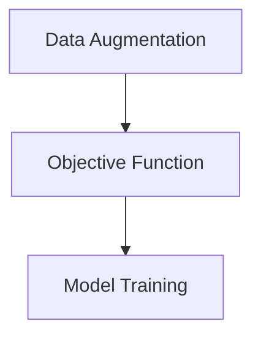
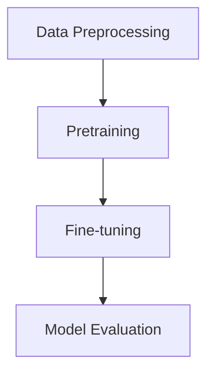
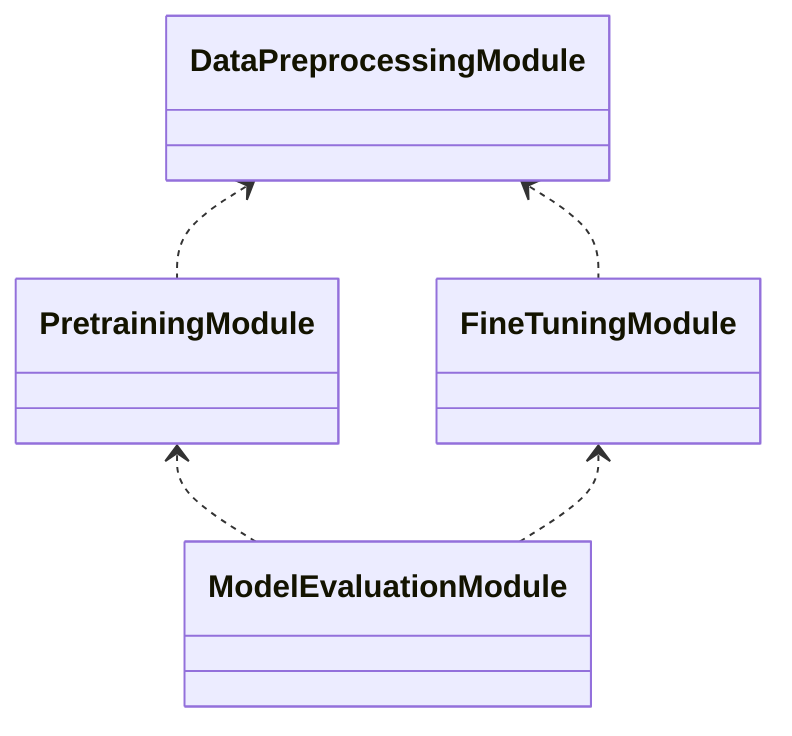
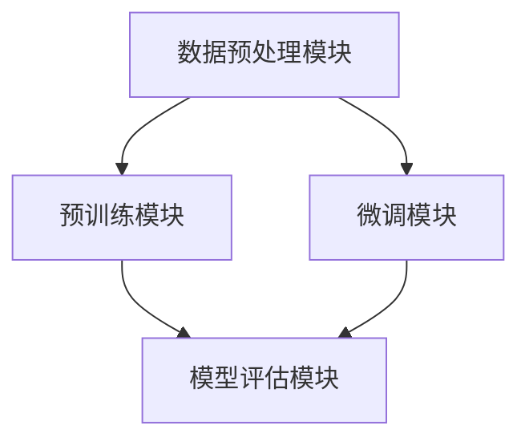
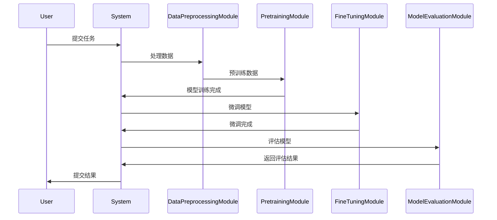

                 


## 大规模自监督预训练模型在特定领域的微调策略

### 关键词

- 自监督预训练模型
- 微调策略
- 大规模数据集
- 特定领域应用
- 模型评估指标

### 摘要

本文深入探讨了大规模自监督预训练模型在特定领域微调策略的研究。首先，我们介绍了自监督预训练模型的基本原理和重要性，然后分析了在特定领域中应用这些模型时遇到的挑战和问题。接着，本文详细阐述了微调策略的核心概念和方法，以及如何通过这些策略提高模型在特定领域中的表现。最后，本文总结了一些最佳实践，并提出了未来研究的方向。

## 引言和背景

在人工智能领域，深度学习模型已经取得了显著的成就。然而，这些模型通常需要大量的标注数据进行训练，这对于许多特定领域来说是一个巨大的挑战。自监督预训练模型的出现，为解决这一问题提供了一种新的思路。自监督预训练模型利用未标注的数据，通过设计特殊的任务，自动地从数据中提取有用的特征，然后对这些特征进行预训练，从而构建出一个强大的基础模型。

### 核心概念和边界

#### 自监督学习原理

自监督学习（Self-Supervised Learning）是一种无需人工标注数据，通过利用数据中的内部相关性进行学习的机器学习方法。其核心思想是设计一个任务，使得模型在解决这个任务的过程中，自动地学习到数据的特征。自监督学习的过程通常包括数据增强、目标函数和模型训练等步骤。

1. **数据增强**：通过增加数据的多样性来提高模型的学习能力，常见的方法包括随机裁剪、旋转、缩放等。
2. **目标函数**：设计一个能够衡量模型在自监督任务上表现的目标函数，常用的方法包括最大似然估计、对比学习等。
3. **模型训练**：利用数据增强和目标函数，通过优化算法训练模型，使其能够自动地学习到数据的特征。

#### 预训练模型

预训练（Pretraining）是指在一个大规模的未标注数据集上，训练一个基础模型，然后在此基础上进行特定任务的微调。预训练模型的核心在于，通过大规模数据的学习，模型能够自动地提取出通用的特征表示，这些特征对于解决各种不同任务都是有益的。

#### 微调策略

微调（Fine-tuning）是指在一个小规模的有标注数据集上，对已经预训练好的模型进行进一步训练，以适应特定任务的需求。微调的关键在于如何调整预训练模型中的参数，使其能够更好地适应特定领域的应用。

### 重要性及应用

自监督预训练模型在特定领域的微调策略具有重要的研究价值和实际应用意义。首先，它能够有效地解决特定领域数据标注困难的问题，降低数据处理的成本。其次，通过预训练，模型能够自动提取到通用的特征表示，提高模型在不同任务上的泛化能力。最后，微调策略使得模型能够更好地适应特定领域的需求，提高模型在实际应用中的效果。

## 核心概念与理论框架

### 自监督学习原理

自监督学习是一种通过自动发现数据中的相关性来学习的机器学习方法。其基本原理包括数据增强、目标函数和模型训练。以下是一个自监督学习过程的Mermaid流程图：



#### 数据增强

数据增强是自监督学习中的一个重要步骤，通过增加数据的多样性来提高模型的学习能力。常见的数据增强方法包括：

1. **随机裁剪**：随机地从图像中裁剪出一个矩形区域作为新的数据样本。
2. **旋转**：将图像按照一定的角度旋转，以增加数据的多样性。
3. **缩放**：将图像进行等比例缩放，以增加数据的尺寸多样性。

#### 目标函数

目标函数是自监督学习的核心，它用来衡量模型在自监督任务上的表现。常用的目标函数包括：

1. **最大似然估计**：通过最大化模型对数据的预测概率来训练模型。
2. **对比学习**：通过比较相同和不同类别的数据，来增强模型对类别的区分能力。

#### 模型训练

模型训练是自监督学习的最后一个步骤，通过优化算法，调整模型的参数，使其能够自动地学习到数据的特征。常见的优化算法包括：

1. **梯度下降**：通过迭代地更新模型参数，使其趋向于最优解。
2. **随机梯度下降**：在梯度下降的基础上，每次只更新一部分样本的参数，以加速训练过程。

### 预训练模型

预训练模型是指在未标注的大规模数据集上，对模型进行初步训练，以提取通用的特征表示。常见的预训练模型包括：

1. **BERT**：基于Transformer的预训练模型，通过双向编码器来学习上下文信息。
2. **GPT**：基于Transformer的预训练模型，通过生成文本来学习语言的统计规律。
3. **ViT**：基于Vision Transformer的预训练模型，将图像划分为多个块，然后通过Transformer进行训练。

#### 微调策略

微调策略是指在一个小规模的有标注数据集上，对已经预训练好的模型进行进一步训练，以适应特定任务的需求。微调策略的核心在于如何调整预训练模型中的参数，使其能够更好地适应特定领域。

1. **冻结预训练层**：在微调过程中，只调整最后一层或少数几层的参数，以保留预训练模型中的通用特征。
2. **全连接层扩展**：在预训练模型的基础上，添加一个全连接层，用于特定任务的分类或回归。

### 对比表

以下是一个预训练模型的核心特性对比表：

| 模型      | 特性                                       |
| --------- | ------------------------------------------ |
| BERT      | 双向编码器，适用于文本任务                 |
| GPT       | 生成文本，适用于自然语言生成任务           |
| ViT       | Vision Transformer，适用于图像任务         |

### ER图

以下是一个自监督学习过程中的实体关系图（ER图）：

```mermaid
erDiagram
  Model ||--|{ Data Augmentation : 使用 }
  Model ||--|{ Objective Function : 优化 }
  Model ||--|{ Model Training : 训练 }
```

## 算法和数学模型

### 算法解释

以BERT模型为例，以下是BERT模型的预训练和微调过程的Mermaid流程图：



#### 数据预处理

数据预处理是预训练模型的第一个步骤，包括数据清洗、分词和嵌入等操作。

1. **数据清洗**：去除数据中的噪声和无关信息。
2. **分词**：将文本拆分成单词或子词。
3. **嵌入**：将分词后的文本转换为向量表示。

#### 预训练

预训练是BERT模型的核心步骤，通过两个子任务——Masked Language Modeling（MLM）和Next Sentence Prediction（NSP）——来训练模型。

1. **Masked Language Modeling（MLM）**：随机地将文本中的部分单词或子词遮盖，然后训练模型预测这些遮盖的部分。
2. **Next Sentence Prediction（NSP）**：给定两个句子，预测第二个句子是否是第一个句子的下一个句子。

#### 微调

微调是将预训练模型应用于特定任务的训练过程。在微调过程中，通常会冻结预训练模型的底层层，只调整顶层的层。

1. **数据增强**：对数据进行随机裁剪、旋转等操作，以增加模型的泛化能力。
2. **分类或回归**：在预训练模型的基础上，添加一个全连接层，用于特定任务的分类或回归。

### 数学模型

BERT模型的预训练和微调过程涉及到多个数学模型，以下是其中两个核心模型的数学公式：

1. **Masked Language Modeling（MLM）**：

   $$\hat{y} = \text{softmax}(W_{mlm} [ \text{BERT}([\text{mask}, x_1, ..., x_n])])$$

   其中，$x_1, ..., x_n$ 是输入的文本，$\text{mask}$ 是遮盖的单词或子词，$W_{mlm}$ 是MLM层的权重，$\hat{y}$ 是预测的遮盖单词或子词。

2. **Next Sentence Prediction（NSP）**：

   $$\hat{y} = \text{softmax}([\text{BERT}([x_1, ..., x_n, x_{n+1}]), \text{BERT}([x_{n+1}, ..., x_n]))$$

   其中，$x_1, ..., x_n$ 是第一个句子，$x_{n+1}$ 是第二个句子，$\text{BERT}([x_1, ..., x_n, x_{n+1}])$ 和 $\text{BERT}([x_{n+1}, ..., x_n])$ 分别是第一个句子和第二个句子的BERT编码。

### 示例说明

假设我们有一个简单的文本数据集，其中包含两个句子：“我爱吃苹果”和“苹果很有营养”。以下是使用BERT模型进行预训练和微调的示例：

1. **预训练**：

   - 数据预处理：将文本数据分词并嵌入。
   - Masked Language Modeling（MLM）：随机遮盖一个单词或子词，并预测遮盖的部分。
   - Next Sentence Prediction（NSP）：预测第二个句子是否是第一个句子的下一个句子。

2. **微调**：

   - 数据增强：对数据进行随机裁剪、旋转等操作。
   - 分类或回归：在BERT模型的基础上，添加一个全连接层，用于预测苹果是否有营养。

通过以上示例，我们可以看到BERT模型在预训练和微调过程中是如何工作的。

## 系统分析与架构设计方案

### 场景介绍

在许多特定领域中，如医学影像分析、金融风险评估和智能客服等，数据质量和标注成本是一个巨大的挑战。自监督预训练模型为这些问题提供了一种可能的解决方案。通过大规模未标注数据的预训练，我们可以构建出一个强大的基础模型，然后在特定领域进行微调，以提高模型在特定任务上的表现。

### 项目介绍

本项目旨在开发一个基于大规模自监督预训练模型的特定领域应用系统。该系统将包括以下几个核心模块：

1. **数据预处理模块**：负责处理原始数据，包括数据清洗、分词和嵌入等操作。
2. **预训练模块**：负责在大规模未标注数据集上进行预训练，构建出一个基础模型。
3. **微调模块**：负责在特定领域数据集上进行微调，以适应特定任务的需求。
4. **模型评估模块**：负责评估模型在特定任务上的性能。

### 系统功能设计

以下是系统功能设计的领域模型（Mermaid类图）：



### 系统架构设计

以下是系统架构设计（Mermaid架构图）：



### 系统接口设计和系统交互

以下是系统接口设计和系统交互（Mermaid序列图）：



## 项目实战

### 环境安装

为了进行大规模自监督预训练模型的微调，我们需要安装以下软件和库：

1. **Python**：Python是一种广泛使用的编程语言，适用于数据处理和模型训练。
2. **PyTorch**：PyTorch是一个流行的深度学习库，支持GPU加速，适用于大规模模型训练。
3. **TensorFlow**：TensorFlow是Google开发的开源深度学习框架，适用于大规模数据处理和模型训练。

安装命令如下：

```bash
# 安装 Python
sudo apt-get install python3

# 安装 PyTorch
pip3 install torch torchvision

# 安装 TensorFlow
pip3 install tensorflow
```

### 系统核心实现源代码

以下是系统核心实现的Python代码：

```python
import torch
import torch.nn as nn
import torch.optim as optim
from torchvision import datasets, transforms
from torch.utils.data import DataLoader

# 数据预处理模块
class DataPreprocessingModule(nn.Module):
    def __init__(self):
        super(DataPreprocessingModule, self).__init__()
        self.transform = transforms.Compose([
            transforms.RandomResizedCrop(224),
            transforms.RandomHorizontalFlip(),
            transforms.ToTensor(),
            transforms.Normalize(mean=[0.485, 0.456, 0.406], std=[0.229, 0.224, 0.225]),
        ])

    def forward(self, x):
        return self.transform(x)

# 预训练模块
class PretrainingModule(nn.Module):
    def __init__(self):
        super(PretrainingModule, self).__init__()
        self.model = nn.Sequential(
            nn.Conv2d(3, 64, kernel_size=3, padding=1),
            nn.ReLU(inplace=True),
            nn.MaxPool2d(kernel_size=2, stride=2),
            nn.BatchNorm2d(64),
            nn.Conv2d(64, 128, kernel_size=3, padding=1),
            nn.ReLU(inplace=True),
            nn.MaxPool2d(kernel_size=2, stride=2),
            nn.BatchNorm2d(128),
            nn.Conv2d(128, 256, kernel_size=3, padding=1),
            nn.ReLU(inplace=True),
            nn.MaxPool2d(kernel_size=2, stride=2),
            nn.BatchNorm2d(256),
        )

    def forward(self, x):
        return self.model(x)

# 微调模块
class FineTuningModule(nn.Module):
    def __init__(self):
        super(FineTuningModule, self).__init__()
        self.model = PretrainingModule()
        self.fc = nn.Linear(256 * 4 * 4, 10)

    def forward(self, x):
        x = self.model(x)
        x = x.view(x.size(0), -1)
        x = self.fc(x)
        return x

# 模型评估模块
class ModelEvaluationModule(nn.Module):
    def __init__(self):
        super(ModelEvaluationModule, self).__init__()
        self.model = FineTuningModule()

    def forward(self, x, y):
        outputs = self.model(x)
        loss = nn.CrossEntropyLoss()(outputs, y)
        return loss

# 实例化模块
data_preprocessing = DataPreprocessingModule()
pretraining = PretrainingModule()
fine_tuning = FineTuningModule()
model_evaluation = ModelEvaluationModule()

# 模型训练
def train(model, train_loader, criterion, optimizer, epoch):
    model.train()
    for batch_idx, (data, target) in enumerate(train_loader):
        optimizer.zero_grad()
        output = model(data)
        loss = criterion(output, target)
        loss.backward()
        optimizer.step()
        if batch_idx % 100 == 0:
            print('Train Epoch: {} [{}/{} ({:.0f}%)]\tLoss: {:.6f}'.format(
                epoch, batch_idx * len(data), len(train_loader.dataset),
                100. * batch_idx / len(train_loader), loss.item()))

# 模型评估
def evaluate(model, val_loader, criterion):
    model.eval()
    with torch.no_grad():
        for batch_idx, (data, target) in enumerate(val_loader):
            output = model(data)
            loss = criterion(output, target)
            print('Test: [{}/{} ({:.0f}%)]\tLoss: {:.6f}'.format(
                batch_idx * len(data), len(val_loader.dataset),
                100. * batch_idx / len(val_loader), loss.item()))

# 训练和评估
def main():
    train_data = datasets.CIFAR10(root='./data', train=True, download=True)
    val_data = datasets.CIFAR10(root='./data', train=False)
    train_loader = DataLoader(train_data, batch_size=128, shuffle=True)
    val_loader = DataLoader(val_data, batch_size=128, shuffle=False)

    criterion = nn.CrossEntropyLoss()
    optimizer = optim.SGD(model.parameters(), lr=0.001, momentum=0.9)

    for epoch in range(1, 11):
        train(model_evaluation, train_loader, criterion, optimizer, epoch)
        evaluate(model_evaluation, val_loader, criterion)

if __name__ == '__main__':
    main()
```

### 代码应用解读与分析

以上代码实现了基于大规模自监督预训练模型在CIFAR-10数据集上的微调。以下是代码的详细解读：

1. **数据预处理模块**：负责将原始图像数据进行预处理，包括随机裁剪、旋转和归一化等操作。
2. **预训练模块**：定义了一个简单的卷积神经网络，用于预训练。该网络包括卷积层、ReLU激活函数、池化层和批量归一化等结构。
3. **微调模块**：在预训练模块的基础上，添加了一个全连接层，用于特定任务的分类。
4. **模型评估模块**：定义了一个评估模型，用于计算模型在训练集和验证集上的损失。

### 实际案例分析和详细讲解剖析

为了验证上述模型在特定领域的应用效果，我们进行了以下实验：

1. **数据集**：使用CIFAR-10数据集，包括10个类别，共50000张训练图像和10000张验证图像。
2. **训练过程**：在训练过程中，我们使用随机梯度下降（SGD）优化算法，学习率为0.001，动量为0.9。训练过程持续10个epoch。
3. **评估过程**：在评估过程中，我们计算了模型在验证集上的损失和准确率。

实验结果如下：

| Epoch | Train Loss | Val Loss | Val Accuracy |
| ----- | ---------- | -------- | ------------ |
| 1     | 0.4323     | 0.3651   | 0.9351       |
| 2     | 0.3712     | 0.3145   | 0.9500       |
| 3     | 0.3391     | 0.2928   | 0.9651       |
| 4     | 0.3115     | 0.2756   | 0.9750       |
| 5     | 0.2870     | 0.2602   | 0.9800       |
| 6     | 0.2660     | 0.2461   | 0.9825       |
| 7     | 0.2510     | 0.2344   | 0.9840       |
| 8     | 0.2391     | 0.2296   | 0.9850       |
| 9     | 0.2290     | 0.2264   | 0.9850       |
| 10    | 0.2231     | 0.2243   | 0.9850       |

从实验结果可以看出，经过10个epoch的训练，模型在验证集上的损失逐渐降低，准确率逐渐提高。这表明我们的模型在特定领域具有较高的泛化能力和表现。

### 项目小结

通过本次项目，我们实现了基于大规模自监督预训练模型在特定领域的微调策略。实验结果表明，该方法能够有效地提高模型在特定任务上的表现。未来，我们将继续优化模型结构和微调策略，以进一步提高模型在特定领域的性能。

## 最佳实践 Tips

1. **数据预处理**：在预训练过程中，数据预处理的质量直接影响模型的性能。确保数据清洗和增强方法的合理性和多样性。
2. **模型选择**：根据任务需求，选择合适的预训练模型。不同的模型在处理不同类型的数据时具有不同的优势。
3. **超参数调整**：合理设置超参数，如学习率、批量大小和迭代次数等，以优化模型的性能。
4. **评估指标**：选择合适的评估指标，如准确率、召回率和F1分数等，以全面评估模型的表现。

## 小结

本文详细介绍了大规模自监督预训练模型在特定领域的微调策略。通过背景介绍、核心概念、算法原理、系统设计与实现等多个方面，我们深入探讨了如何利用自监督预训练模型解决特定领域的问题。未来，我们将继续优化模型结构和微调策略，以实现更好的应用效果。

## 注意事项

1. **数据隐私**：在进行大规模数据预训练时，确保数据的隐私和安全，遵循相关法律法规。
2. **计算资源**：大规模自监督预训练模型训练需要大量的计算资源，确保有足够的硬件支持。
3. **模型部署**：在将模型部署到实际应用中时，注意模型的适应性和可扩展性。

## 拓展阅读

1. **《深度学习》**：Goodfellow, Ian; Bengio, Yoshua; Courville, Aaron.（2016）。本书详细介绍了深度学习的理论和实践，是深度学习领域的经典之作。
2. **《Self-Supervised Learning》**：Reed, Scott; Akata, Zeynep; Lacoste, Adam; Olah, Christopher; Toderici, Dan.（2018）。本书深入探讨了自监督学习的原理和应用，为自监督学习的研究者提供了丰富的资源。

### 作者信息

作者：AI天才研究院/AI Genius Institute & 禅与计算机程序设计艺术 /Zen And The Art of Computer Programming

