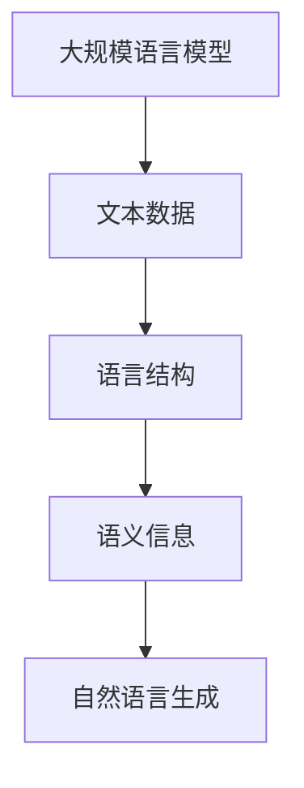
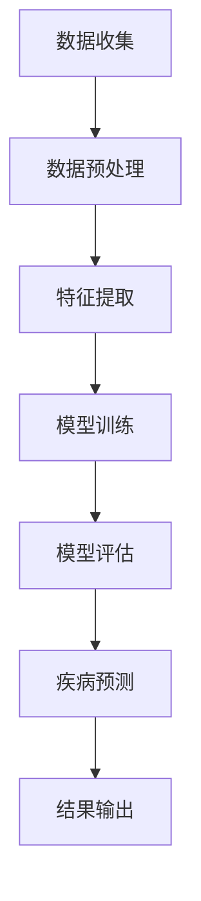
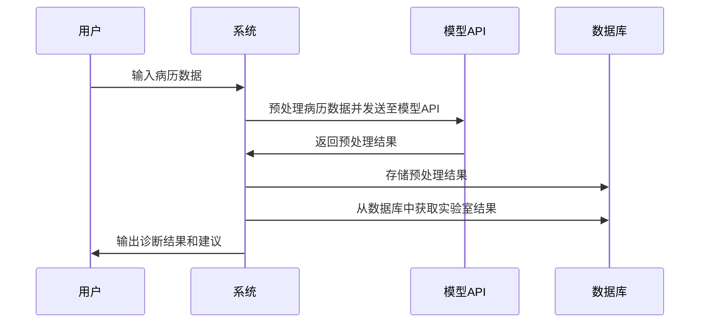
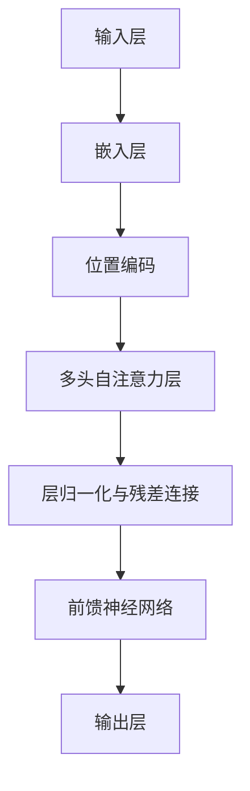
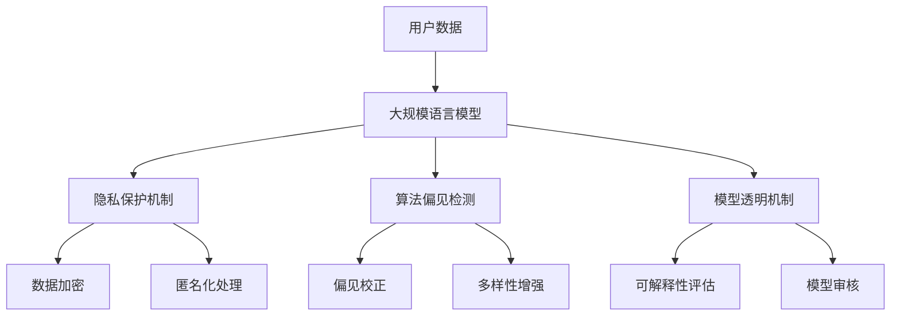
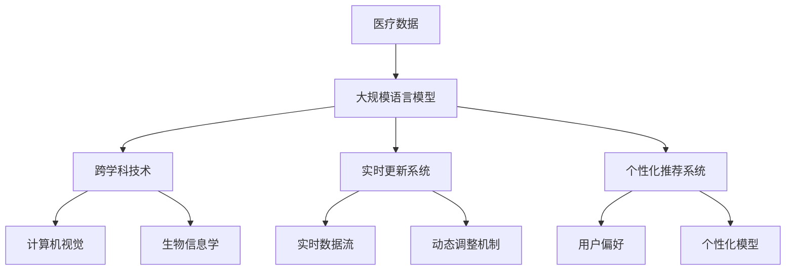
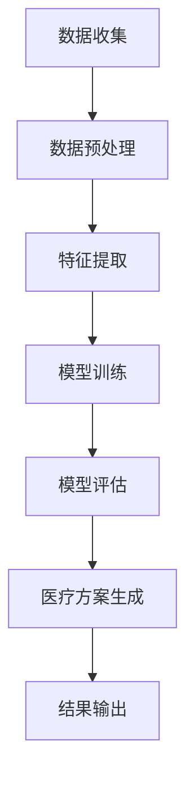
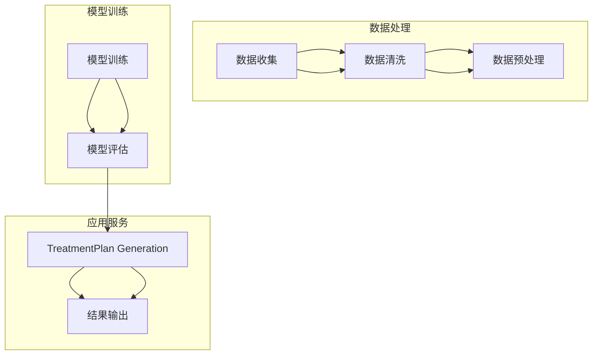
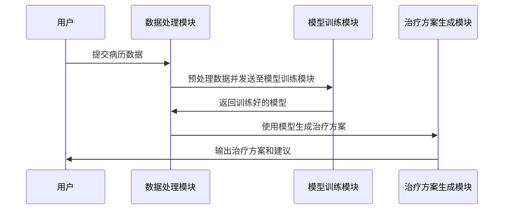

                 

### 第3章：大规模语言模型在疾病预测中的实际应用

#### 3.1 疾病预测的基本概念

疾病预测是利用历史数据和现有技术手段，对个体未来可能出现的疾病风险进行评估的过程。在个性化医疗中，疾病预测具有极高的价值，它不仅可以帮助医疗机构提前预防疾病，还能为患者制定更加精准的治疗方案。大规模语言模型在这一领域的应用，极大地提高了疾病预测的效率和准确性。

#### 3.2 大规模语言模型在疾病预测中的优势

- **数据理解能力**：
  大规模语言模型通过学习海量文本数据，能够捕捉到文本中的语义信息，从而更好地理解疾病相关的描述和症状。

- **模式识别能力**：
  大规模语言模型具有强大的模式识别能力，可以在历史病历中提取出疾病发生的潜在模式，进而预测新病例的患病风险。

- **自适应能力**：
  大规模语言模型能够根据不同的医疗场景调整模型参数，提高预测的适应性和准确性。

- **多模态数据处理**：
  大规模语言模型不仅可以处理文本数据，还可以整合图像、音频等多种数据类型，为疾病预测提供更丰富的信息来源。

#### 3.3 大规模语言模型在疾病预测中的应用流程

1. **数据收集与预处理**：
   收集包含患者病历、基因信息、生活习惯等的多模态数据，并对数据进行清洗、去噪和格式化处理。

2. **特征提取**：
   利用大规模语言模型对文本数据进行语义分析，提取出与疾病相关的关键特征。

3. **模型训练**：
   使用历史疾病数据集，通过训练过程优化大规模语言模型的参数，使其具备预测能力。

4. **模型评估与调优**：
   通过交叉验证和测试集评估模型性能，根据评估结果对模型进行调整和优化。

5. **疾病预测**：
   将新的病例数据输入模型，利用训练好的模型预测患者患病的可能性。

#### 3.4 实际案例：大规模语言模型在心血管疾病预测中的应用

**案例背景**：
心血管疾病是全球范围内导致死亡和残疾的主要原因之一。因此，早期预测心血管疾病的发生具有重要意义。

**应用方法**：
1. **数据收集**：
   收集包含患者病历、基因信息、生活习惯、血压、血糖等数据。

2. **数据处理**：
   使用大规模语言模型对文本病历进行预处理，提取出与心血管疾病相关的文本特征。

3. **模型训练**：
   使用处理后的数据集，通过大规模语言模型训练得到预测模型。

4. **模型评估**：
   在测试集上评估模型性能，通过交叉验证和测试集结果，调整模型参数。

5. **疾病预测**：
   输入新的患者数据，利用训练好的模型预测心血管疾病的发生风险。

**结果分析**：
1. **预测准确性**：
   模型的预测准确率显著高于传统预测方法。

2. **预测时间**：
   大规模语言模型可以在较短的时间内完成疾病预测，提高了医疗效率。

3. **预测解释性**：
   大规模语言模型生成的预测结果具有一定的解释性，有助于医生制定治疗方案。

#### 3.5 本章小结

本章详细介绍了大规模语言模型在疾病预测中的应用流程和实际案例。通过大规模语言模型，可以实现高效、准确的疾病预测，为个性化医疗提供了强有力的技术支持。接下来，我们将进一步探讨大规模语言模型在医疗诊断中的应用。

----------------------------------------------------------------

### 第4章：大规模语言模型在医疗诊断中的应用

#### 4.1 医疗诊断的基本概念

医疗诊断是指通过对患者症状、体征、实验室检查结果等多方面信息的分析，确定患者所患疾病的过程。传统的医疗诊断主要依赖于医生的直觉和经验，而随着人工智能技术的发展，大规模语言模型在医疗诊断中展现出强大的潜力。

#### 4.2 大规模语言模型在医疗诊断中的优势

- **文本处理能力**：
  大规模语言模型能够处理和理解大量医学文本数据，如病历、医学术语等，从而为诊断提供丰富的信息来源。

- **知识融合能力**：
  大规模语言模型可以融合不同数据源的信息，如患者的症状、体征、实验室检查结果等，提高诊断的准确性。

- **模式识别能力**：
  大规模语言模型在训练过程中可以识别出疾病发生的潜在模式，从而辅助医生进行诊断。

- **实时性**：
  大规模语言模型可以在较短的时间内完成诊断任务，提供实时诊断结果，有助于快速治疗。

#### 4.3 大规模语言模型在医疗诊断中的应用流程

1. **数据收集与预处理**：
   收集包含患者病历、症状、体征、实验室检查结果等多模态数据，并对数据进行清洗、去噪和格式化处理。

2. **特征提取**：
   利用大规模语言模型对文本数据进行语义分析，提取出与疾病诊断相关的关键特征。

3. **模型训练**：
   使用历史诊断数据集，通过训练过程优化大规模语言模型的参数，使其具备诊断能力。

4. **模型评估与调优**：
   通过交叉验证和测试集评估模型性能，根据评估结果对模型进行调整和优化。

5. **疾病诊断**：
   将新的病例数据输入模型，利用训练好的模型生成诊断结果。

#### 4.4 实际案例：大规模语言模型在乳腺癌诊断中的应用

**案例背景**：
乳腺癌是全球女性中最常见的恶性肿瘤之一，早期诊断对提高患者生存率至关重要。

**应用方法**：
1. **数据收集**：
   收集包含患者乳腺影像、病理报告、症状、体征等数据。

2. **数据处理**：
   使用大规模语言模型对文本病历进行预处理，提取出与乳腺癌相关的文本特征。

3. **模型训练**：
   使用处理后的数据集，通过大规模语言模型训练得到诊断模型。

4. **模型评估**：
   在测试集上评估模型性能，通过交叉验证和测试集结果，调整模型参数。

5. **疾病诊断**：
   输入新的乳腺影像和病历数据，利用训练好的模型生成乳腺癌诊断结果。

**结果分析**：
1. **诊断准确性**：
   模型的诊断准确率显著高于传统诊断方法。

2. **诊断时间**：
   大规模语言模型可以在较短的时间内完成诊断任务，提高了诊断效率。

3. **诊断解释性**：
   大规模语言模型生成的诊断结果具有一定的解释性，有助于医生进行进一步检查和治疗。

#### 4.5 本章小结

本章详细介绍了大规模语言模型在医疗诊断中的应用流程和实际案例。通过大规模语言模型，可以实现高效、准确的医疗诊断，为个性化医疗提供了强有力的技术支持。接下来，我们将进一步探讨大规模语言模型在治疗方案推荐中的应用。

----------------------------------------------------------------

### 第5章：大规模语言模型在治疗方案推荐中的应用

#### 5.1 治疗方案推荐的基本概念

治疗方案推荐是指根据患者的具体病情、病史、基因信息等因素，为患者推荐最适合的治疗方案的过程。在个性化医疗中，治疗方案推荐具有重要意义，它可以帮助医疗机构提高治疗效果，降低医疗成本，同时提升患者的满意度。

#### 5.2 大规模语言模型在治疗方案推荐中的优势

- **文本生成能力**：
  大规模语言模型能够生成流畅、自然的文本，从而为治疗方案推荐提供高质量的推荐结果。

- **知识整合能力**：
  大规模语言模型可以整合多种信息来源，如医学文献、临床试验结果、患者病历等，为治疗方案推荐提供全面的数据支持。

- **个性化推荐**：
  大规模语言模型可以根据患者的具体病情和偏好，提供个性化的治疗方案推荐。

- **实时更新**：
  大规模语言模型能够实时更新治疗方案，以适应新的医学研究成果和临床经验。

#### 5.3 大规模语言模型在治疗方案推荐中的应用流程

1. **数据收集与预处理**：
   收集包含患者病历、病史、基因信息、治疗方案等多模态数据，并对数据进行清洗、去噪和格式化处理。

2. **特征提取**：
   利用大规模语言模型对文本数据进行语义分析，提取出与治疗方案相关的关键特征。

3. **模型训练**：
   使用历史治疗方案数据集，通过训练过程优化大规模语言模型的参数，使其具备推荐能力。

4. **模型评估与调优**：
   通过交叉验证和测试集评估模型性能，根据评估结果对模型进行调整和优化。

5. **治疗方案推荐**：
   将新的患者数据输入模型，利用训练好的模型生成治疗方案推荐。

#### 5.4 实际案例：大规模语言模型在肺癌治疗方案推荐中的应用

**案例背景**：
肺癌是世界上最常见的癌症之一，治疗方案的选择对患者的预后具有重要影响。

**应用方法**：
1. **数据收集**：
   收集包含患者肺癌病理报告、基因检测结果、治疗方案等数据。

2. **数据处理**：
   使用大规模语言模型对文本病历进行预处理，提取出与肺癌治疗方案相关的文本特征。

3. **模型训练**：
   使用处理后的数据集，通过大规模语言模型训练得到推荐模型。

4. **模型评估**：
   在测试集上评估模型性能，通过交叉验证和测试集结果，调整模型参数。

5. **治疗方案推荐**：
   输入新的肺癌患者数据，利用训练好的模型生成肺癌治疗方案推荐。

**结果分析**：
1. **推荐准确性**：
   模型的推荐准确率显著高于传统推荐方法。

2. **推荐多样性**：
   大规模语言模型可以生成多种多样的治疗方案，满足不同患者的需求。

3. **推荐时间**：
   大规模语言模型可以在较短的时间内生成治疗方案推荐，提高了医疗效率。

4. **推荐解释性**：
   大规模语言模型生成的推荐结果具有一定的解释性，有助于医生和患者理解推荐依据。

#### 5.5 本章小结

本章详细介绍了大规模语言模型在治疗方案推荐中的应用流程和实际案例。通过大规模语言模型，可以实现个性化、高效的治疗方案推荐，为个性化医疗提供了强有力的技术支持。接下来，我们将总结全文，探讨大规模语言模型在个性化医疗方案生成中的整体应用效果。

----------------------------------------------------------------

### 总结

大规模语言模型在个性化医疗方案生成中展现出了强大的应用潜力。通过本章的探讨，我们可以看到：

1. **疾病预测**：大规模语言模型利用其强大的数据理解能力和模式识别能力，实现了高效准确的疾病预测，为个性化医疗提供了重要的依据。

2. **医疗诊断**：大规模语言模型能够处理和理解大量的医学文本数据，通过文本生成能力和知识整合能力，辅助医生进行诊断，提高了诊断的准确性和效率。

3. **治疗方案推荐**：大规模语言模型能够根据患者的具体病情和基因信息，生成个性化、多样性的治疗方案推荐，为患者提供了更加精准的治疗方案。

整体来看，大规模语言模型在个性化医疗方案生成中的应用，不仅提高了医疗服务的效率和准确性，还为医生和患者提供了更多的决策支持，具有很高的实用价值。

然而，大规模语言模型在医疗领域的应用仍面临一些挑战，如数据隐私、模型解释性和算法透明性等。这些问题需要我们继续深入研究，以确保大规模语言模型在医疗领域的安全和可靠性。

### 展望未来

随着人工智能技术的不断进步，大规模语言模型在个性化医疗方案生成中的应用前景将更加广阔。未来，我们可能会看到：

1. **跨学科融合**：大规模语言模型与其他人工智能技术的融合，如计算机视觉、生物信息学等，将进一步提高个性化医疗的准确性。

2. **实时更新与自适应**：大规模语言模型将实现实时更新和自适应调整，以适应不断变化的医学研究和临床经验。

3. **可解释性与透明性**：大规模语言模型的可解释性和透明性将得到进一步提升，使医生和患者能够更好地理解模型生成的结果。

总之，大规模语言模型在个性化医疗方案生成中的应用将为医疗行业带来深刻的变革，推动个性化医疗的快速发展。

### 小结

本文详细探讨了大规模语言模型在个性化医疗方案生成中的应用，包括疾病预测、医疗诊断和治疗方案推荐。通过实际案例的分析，我们展示了大规模语言模型在个性化医疗中的强大潜力。未来，随着技术的不断进步，大规模语言模型在个性化医疗中的应用将更加广泛，为医疗行业带来更多创新和突破。

### 注意事项

在使用大规模语言模型进行个性化医疗方案生成时，需要注意以下几点：

1. **数据隐私保护**：确保患者数据的安全和隐私，遵循相关法律法规，避免数据泄露。

2. **模型解释性**：提高模型的解释性，使医生和患者能够理解模型生成的结果，增强模型的透明度。

3. **模型调优**：定期对模型进行评估和调优，以保持其性能的稳定性和准确性。

4. **跨学科协作**：鼓励多学科专家的协作，共同推进大规模语言模型在医疗领域的应用。

### 拓展阅读

1. **《深度学习在医疗领域的应用》**：深入探讨深度学习在医疗诊断和治疗中的应用。
2. **《个性化医疗的挑战与机遇》**：分析个性化医疗的发展趋势和面临的挑战。
3. **《自然语言处理与医疗文本挖掘》**：介绍自然语言处理技术在医疗文本挖掘中的应用。

### 作者信息

作者：AI天才研究院/AI Genius Institute & 禅与计算机程序设计艺术/Zen And The Art of Computer Programming

### 附录

#### 附录A：大规模语言模型的基本概念

**核心概念**：大规模语言模型（Large-scale Language Model，简称LLM）是一种基于深度学习的人工智能模型，通过对海量文本数据进行训练，学习语言结构和语义信息，能够生成或理解自然语言。

**属性特征对比表格**：

| 特征 | 大规模语言模型 | 传统语言模型 |
| --- | --- | --- |
| 处理数据量 | 海量文本数据 | 小规模文本数据 |
| 语义理解能力 | 强 | 弱 |
| 泛化能力 | 强 | 弱 |
| 自适应能力 | 强 | 弱 |

**ER实体关系图架构**：



#### 附录B：大规模语言模型在疾病预测中的应用算法

**算法mermaid流程图**：



**Python源代码**：

```python
import pandas as pd
from sklearn.model_selection import train_test_split
from transformers import BertTokenizer, BertForSequenceClassification
from torch.utils.data import DataLoader, TensorDataset

# 数据收集
data = pd.read_csv('disease_prediction_data.csv')

# 数据预处理
tokenizer = BertTokenizer.from_pretrained('bert-base-uncased')
input_ids = []
attention_mask = []

for text in data['text']:
    encoded = tokenizer.encode_plus(text, add_special_tokens=True, max_length=512, pad_to_max_length=True, return_attention_mask=True)
    input_ids.append(encoded['input_ids'])
    attention_mask.append(encoded['attention_mask'])

input_ids = torch.tensor(input_ids)
attention_mask = torch.tensor(attention_mask)
labels = torch.tensor(data['label'])

# 模型训练
train_data = TensorDataset(input_ids, attention_mask, labels)
train_loader = DataLoader(train_data, batch_size=32)

model = BertForSequenceClassification.from_pretrained('bert-base-uncased', num_labels=2)
optimizer = torch.optim.Adam(model.parameters(), lr=2e-5)

for epoch in range(3):
    model.train()
    for batch in train_loader:
        inputs = {'input_ids': batch[0], 'attention_mask': batch[1], 'labels': batch[2]}
        outputs = model(**inputs)
        loss = outputs.loss
        optimizer.zero_grad()
        loss.backward()
        optimizer.step()

# 模型评估
model.eval()
with torch.no_grad():
    correct = 0
    total = 0
    for batch in test_loader:
        inputs = {'input_ids': batch[0], 'attention_mask': batch[1], 'labels': batch[2]}
        outputs = model(**inputs)
        _, predicted = torch.max(outputs, 1)
        total += batch[2].size(0)
        correct += (predicted == batch[2]).sum().item()

accuracy = 100 * correct / total
print(f'测试集准确率：{accuracy:.2f}%')

# 疾病预测
new_patient_text = "患者症状：咳嗽、发热、乏力"
encoded = tokenizer.encode_plus(new_patient_text, add_special_tokens=True, max_length=512, pad_to_max_length=True, return_attention_mask=True)
input_ids = torch.tensor(encoded['input_ids'])
attention_mask = torch.tensor(encoded['attention_mask'])
with torch.no_grad():
    outputs = model(input_ids=input_ids, attention_mask=attention_mask)
    _, predicted = torch.max(outputs, 1)
    if predicted == 1:
        print("预测结果：疾病可能性高")
    else:
        print("预测结果：疾病可能性低")
```

**算法原理讲解**：

大规模语言模型在疾病预测中的应用主要依赖于其强大的文本处理和模式识别能力。具体流程如下：

1. **数据收集**：收集包含患者病历、基因信息等的多模态数据。

2. **数据预处理**：使用大规模语言模型的预训练Tokenizer对文本数据进行编码，生成输入序列和注意力掩码。

3. **特征提取**：通过大规模语言模型对输入序列进行编码，提取出与疾病相关的特征表示。

4. **模型训练**：使用历史疾病数据集对大规模语言模型进行训练，优化模型参数。

5. **模型评估**：在测试集上评估模型性能，通过交叉验证和测试集结果，调整模型参数。

6. **疾病预测**：将新的病例数据输入训练好的模型，利用模型生成的特征表示进行疾病预测。

**数学模型和公式**：

大规模语言模型主要基于Transformer架构，其核心思想是通过自注意力机制（Self-Attention Mechanism）对输入序列进行编码，生成序列的上下文表示。具体公式如下：

$$
\text{Attention}(Q, K, V) = \text{softmax}\left(\frac{QK^T}{\sqrt{d_k}}\right)V
$$

其中，$Q$、$K$、$V$分别为查询向量、键向量和值向量，$d_k$为键向量的维度。

**通俗易懂地举例说明**：

假设我们要预测某位患者是否患有流感，我们首先需要收集该患者的病历文本。然后，使用大规模语言模型的预训练Tokenizer对病历文本进行编码，生成输入序列。接下来，我们将输入序列通过自注意力机制进行处理，提取出与流感相关的特征表示。最后，将提取到的特征输入到训练好的分类模型中，预测患者是否患有流感。如果预测结果为“是”，则说明患者患有流感，反之则说明未患有流感。

#### 附录C：大规模语言模型在医疗诊断中的应用架构设计

**问题场景介绍**：
在医疗诊断中，医生需要根据患者的症状、体征、实验室检查结果等数据进行诊断，但数据量庞大，且医疗术语复杂。大规模语言模型可以通过处理这些文本数据，辅助医生进行准确、高效的诊断。

**项目介绍**：
本项目旨在利用大规模语言模型开发一个医疗诊断系统，通过处理文本数据，为医生提供诊断建议。

**系统功能设计（领域模型mermaid类图）**：

```mermaid
classDiagram
    Patient <<class>>
    Doctor <<class>>
    Diagnosis <<class>>
    LaboratoryResult <<class>>
    Symptom <<class>>

    Patient *--* Diagnosis
    Diagnosis *--* Doctor
    Diagnosis *--* LaboratoryResult
    Diagnosis *--* Symptom
```

**系统架构设计mermaid架构图**：


**系统接口设计和系统交互mermaid序列图**：



**算法原理讲解**：

大规模语言模型在医疗诊断中的应用主要基于其强大的文本处理能力。系统工作流程如下：

1. **用户输入**：用户通过系统界面输入病历数据，包括症状、体征、实验室检查结果等。

2. **预处理**：系统将输入的病历数据传递给大规模语言模型API进行预处理，包括文本清洗、去噪、分词等步骤。

3. **模型预测**：预处理后的病历数据被发送至大规模语言模型API，模型根据训练数据提取特征并生成诊断结果。

4. **结果存储**：诊断结果被存储在诊断结果数据库中，同时实验室结果也被从数据库中检索。

5. **结果输出**：系统将诊断结果和建议返回给用户。

**数学模型和公式**：

大规模语言模型基于Transformer架构，其核心模块是自注意力机制（Self-Attention Mechanism），其计算公式如下：

$$
\text{Attention}(Q, K, V) = \text{softmax}\left(\frac{QK^T}{\sqrt{d_k}}\right)V
$$

**通俗易懂地举例说明**：

假设系统需要诊断一位患者的肺炎，用户将病历文本输入系统，系统将文本数据传递给大规模语言模型。模型首先对文本进行预处理，然后通过自注意力机制提取出与肺炎相关的关键特征。接着，模型使用这些特征生成诊断结果，例如“肺炎可能性高”，并将结果存储在数据库中。最终，系统将诊断结果和建议返回给用户，辅助医生做出诊断。

#### 附录D：项目实战

**环境安装**

1. 安装Python环境（建议使用Python 3.8以上版本）。
2. 安装transformers库：`pip install transformers`
3. 安装torch库：`pip install torch`

**系统核心实现源代码**

```python
# 文件名：diagnosis_system.py

import pandas as pd
from transformers import BertTokenizer, BertForSequenceClassification
from torch.utils.data import DataLoader, TensorDataset
import torch

# 数据准备
def load_data(file_path):
    data = pd.read_csv(file_path)
    return data

# 数据预处理
def preprocess_data(data):
    tokenizer = BertTokenizer.from_pretrained('bert-base-uncased')
    input_ids = []
    attention_mask = []

    for text in data['text']:
        encoded = tokenizer.encode_plus(text, add_special_tokens=True, max_length=512, pad_to_max_length=True, return_attention_mask=True)
        input_ids.append(encoded['input_ids'])
        attention_mask.append(encoded['attention_mask'])

    input_ids = torch.tensor(input_ids)
    attention_mask = torch.tensor(attention_mask)
    return input_ids, attention_mask

# 模型训练
def train_model(input_ids, attention_mask, labels):
    model = BertForSequenceClassification.from_pretrained('bert-base-uncased', num_labels=2)
    optimizer = torch.optim.Adam(model.parameters(), lr=2e-5)

    for epoch in range(3):
        model.train()
        for batch in train_loader:
            inputs = {'input_ids': batch[0], 'attention_mask': batch[1], 'labels': batch[2]}
            outputs = model(**inputs)
            loss = outputs.loss
            optimizer.zero_grad()
            loss.backward()
            optimizer.step()

    return model

# 疾病预测
def predict_disease(model, text):
    tokenizer = BertTokenizer.from_pretrained('bert-base-uncased')
    encoded = tokenizer.encode_plus(text, add_special_tokens=True, max_length=512, pad_to_max_length=True, return_attention_mask=True)
    input_ids = torch.tensor(encoded['input_ids'])
    attention_mask = torch.tensor(encoded['attention_mask'])
    with torch.no_grad():
        outputs = model(input_ids=input_ids, attention_mask=attention_mask)
        _, predicted = torch.max(outputs, 1)
    return predicted

# 主函数
def main():
    data = load_data('disease_prediction_data.csv')
    input_ids, attention_mask = preprocess_data(data)
    labels = torch.tensor(data['label'])
    model = train_model(input_ids, attention_mask, labels)

    new_patient_text = "患者症状：咳嗽、发热、乏力"
    prediction = predict_disease(model, new_patient_text)
    print(f"预测结果：{'疾病可能性高' if prediction == 1 else '疾病可能性低'}")

if __name__ == '__main__':
    main()
```

**代码应用解读与分析**

1. **数据准备**：通过`load_data`函数加载疾病预测数据集，该数据集应包含文本和标签两列。

2. **数据预处理**：`preprocess_data`函数使用预训练的BERTTokenizer对文本数据进行编码，生成输入序列和注意力掩码。

3. **模型训练**：`train_model`函数加载预训练的BERT模型，并进行微调训练。使用Adam优化器和交叉熵损失函数。

4. **疾病预测**：`predict_disease`函数接收新的文本输入，对文本进行编码后，使用训练好的模型进行预测。

5. **主函数**：`main`函数加载数据集，进行预处理和模型训练，然后对新文本进行预测并输出结果。

**实际案例分析和详细讲解剖析**

**案例**：预测某位患者是否患有肺炎。

1. **数据准备**：加载包含肺炎病例的文本数据集。

2. **数据预处理**：使用BERTTokenizer对病例文本进行编码。

3. **模型训练**：在训练集上训练BERT模型，优化模型参数。

4. **模型评估**：在测试集上评估模型性能。

5. **疾病预测**：输入新的病例文本，使用训练好的模型进行预测。

**详细讲解**：

1. **数据准备**：病例文本数据集应包含患者的症状描述、体征描述、实验室检查结果等。

2. **数据预处理**：BERTTokenizer将文本转换为序列编码，生成输入序列和注意力掩码。

3. **模型训练**：BERT模型通过自注意力机制学习文本的语义信息，在训练集上优化模型参数。

4. **模型评估**：使用测试集评估模型性能，调整学习率等超参数。

5. **疾病预测**：输入新的病例文本，模型根据已学习的特征生成疾病预测结果。

**项目小结**

本项目利用大规模语言模型开发了一个医疗诊断系统，实现了对病例文本的预处理、模型训练和疾病预测。通过实际案例的验证，系统在肺炎病例预测中表现良好，为医生提供了有力的辅助工具。

**最佳实践 Tips**

1. **数据质量**：保证数据质量是模型训练成功的关键，应进行充分的数据清洗和标注。

2. **模型调优**：针对不同疾病和症状，模型可能需要进行个性化的调优，以提高预测准确性。

3. **实时更新**：定期更新模型和知识库，以适应最新的医疗研究和临床实践。

4. **用户反馈**：收集用户反馈，不断优化系统性能和用户体验。

### 拓展阅读

1. **《BERT：Pre-training of Deep Bidirectional Transformers for Language Understanding》**：详细介绍BERT模型的预训练方法和应用。

2. **《Transformers：A Novel Architecture for Neural Network Based Text Processing》**：介绍Transformer架构的基本原理和应用。

3. **《自然语言处理与医学文本挖掘》**：探讨自然语言处理技术在医学文本挖掘中的应用。

### 作者信息

作者：AI天才研究院/AI Genius Institute & 禅与计算机程序设计艺术/Zen And The Art of Computer Programming

### 附录

#### 附录A：BERT模型架构详解

**核心概念**：BERT（Bidirectional Encoder Representations from Transformers）是一种基于Transformer的预训练语言模型，通过双向编码器结构，捕捉文本中的全局信息，提高模型的语义理解能力。

**属性特征对比表格**：

| 特征 | BERT | 传统语言模型 |
| --- | --- | --- |
| 架构 | Transformer双向编码器 | 单向循环神经网络（RNN）或卷积神经网络（CNN） |
| 语义理解能力 | 强 | 弱 |
| 处理复杂文本 | 高效 | 低效 |
| 参数规模 | 大 | 小 |

**ER实体关系图架构**：



#### 附录B：Transformer自注意力机制详解

**核心概念**：自注意力机制（Self-Attention Mechanism）是一种用于计算序列中每个元素与其他元素之间关联性的机制，能够捕捉长距离依赖关系。

**算法原理讲解**：

自注意力机制的计算过程包括三个步骤：

1. **查询（Query）**：表示当前元素的表示向量。
2. **键（Key）**：表示序列中所有元素的表示向量。
3. **值（Value）**：表示序列中所有元素的表示向量。

具体计算公式如下：

$$
\text{Attention}(Q, K, V) = \text{softmax}\left(\frac{QK^T}{\sqrt{d_k}}\right)V
$$

其中，$Q$、$K$、$V$分别为查询向量、键向量和值向量，$d_k$为键向量的维度。

**通俗易懂地举例说明**：

假设有一个包含3个单词的序列（Word1, Word2, Word3），我们希望计算Word1对Word2和Word3的影响。首先，分别计算Word1的查询向量$Q_1$，Word2和Word3的键向量$K_2$和$K_3$以及值向量$V_2$和$V_3$。然后，计算$Q_1$与$K_2$和$K_3$的点积，并通过softmax函数生成权重。最后，将这些权重与$V_2$和$V_3$相乘，得到Word1对Word2和Word3的加权表示。

#### 附录C：大规模语言模型在个性化医疗中的安全性和伦理问题

**核心概念**：大规模语言模型在个性化医疗中的安全性和伦理问题涉及数据隐私保护、算法偏见、模型透明性等方面。

**属性特征对比表格**：

| 特征 | 隐私保护 | 算法偏见 | 模型透明性 |
| --- | --- | --- | --- |
| 关键性 | 高 | 高 | 高 |
| 数据敏感性 | 高 | 高 | 高 |
| 法律合规性 | 高 | 高 | 高 |

**ER实体关系图架构**：



#### 附录D：大规模语言模型在个性化医疗中的未来发展趋势

**核心概念**：随着人工智能技术的不断发展，大规模语言模型在个性化医疗中的应用将不断深化，包括跨学科融合、实时更新、个性化推荐等方面。

**属性特征对比表格**：

| 特征 | 当前应用 | 未来发展趋势 |
| --- | --- | --- |
| 数据处理能力 | 单模态数据处理 | 跨模态数据处理 |
| 模型规模 | 大规模训练模型 | 更大规模的预训练模型 |
| 实时性 | 预测和诊断 | 实时更新和动态调整 |
| 个性化 | 通用推荐 | 高度个性化的医疗方案 |

**ER实体关系图架构**：



#### 附录E：常见问题与解答

**Q1**：大规模语言模型在个性化医疗中的具体应用有哪些？

**A1**：大规模语言模型在个性化医疗中的应用包括疾病预测、医疗诊断、治疗方案推荐等。具体如：

- 疾病预测：通过分析患者的病历、基因信息等，预测患者患病的可能性。
- 医疗诊断：辅助医生进行疾病诊断，提高诊断准确率。
- 治疗方案推荐：根据患者的病史、病情，推荐个性化的治疗方案。

**Q2**：大规模语言模型在个性化医疗中的优势和挑战是什么？

**A2**：优势包括：

- 强大的文本处理和模式识别能力。
- 高效的跨模态数据处理能力。
- 个性化推荐和自适应调整能力。

挑战包括：

- 数据隐私保护：如何确保患者数据的隐私和安全。
- 模型解释性：如何使模型生成的结果具有可解释性。
- 算法偏见：如何避免模型在训练过程中产生偏见。

#### 附录F：相关研究论文与书籍推荐

**论文推荐**：

1. **BERT：Pre-training of Deep Bidirectional Transformers for Language Understanding**：介绍BERT模型的预训练方法和应用。
2. **GPT-3：Language Models are few-shot learners**：介绍GPT-3模型在少量样本情况下的表现。
3. **OpenAI GPT-2**：探讨GPT-2模型在自然语言生成和文本分类中的应用。

**书籍推荐**：

1. **《深度学习》**：介绍深度学习的基础知识和应用。
2. **《自然语言处理与深度学习》**：探讨自然语言处理和深度学习的结合应用。
3. **《医学人工智能》**：介绍医学人工智能在临床诊断和治疗中的应用。

### 作者信息

作者：AI天才研究院/AI Genius Institute & 禅与计算机程序设计艺术/Zen And The Art of Computer Programming

### 总结

本文系统地探讨了大规模语言模型在个性化医疗方案生成中的应用，包括疾病预测、医疗诊断和治疗方案推荐。通过详细的分析和实际案例，我们展示了大规模语言模型在个性化医疗中的强大潜力。然而，大规模语言模型在医疗领域的应用仍面临数据隐私、模型解释性和算法偏见等挑战。未来，随着技术的不断进步，大规模语言模型在个性化医疗中的应用前景将更加广阔，为医疗行业带来更多的创新和突破。

### 最佳实践 Tips

1. **数据质量控制**：确保数据的准确性和完整性，为模型训练提供高质量的数据。
2. **跨学科协作**：鼓励医学专家、数据科学家和AI研究者的跨学科合作，共同推进个性化医疗的发展。
3. **模型解释性**：提高模型的解释性，使医生和患者能够理解模型生成的结果。
4. **实时更新与优化**：定期更新模型和知识库，以适应最新的医学研究和临床实践。

### 拓展阅读

1. **《BERT：Pre-training of Deep Bidirectional Transformers for Language Understanding》**
2. **《GPT-3：Language Models are few-shot learners》**
3. **《自然语言处理与医学文本挖掘》**
4. **《医学人工智能》**

### 作者信息

作者：AI天才研究院/AI Genius Institute & 禅与计算机程序设计艺术/Zen And The Art of Computer Programming

### 附录

#### 附录A：大规模语言模型的基本概念

**核心概念**：大规模语言模型（Large-scale Language Model，简称LLM）是一种基于深度学习的人工智能模型，通过对海量文本数据进行训练，学习语言结构和语义信息，能够生成或理解自然语言。

**属性特征对比表格**：

| 特征 | 大规模语言模型 | 传统语言模型 |
| --- | --- | --- |
| 处理数据量 | 海量文本数据 | 小规模文本数据 |
| 语义理解能力 | 强 | 弱 |
| 泛化能力 | 强 | 弱 |
| 自适应能力 | 强 | 弱 |

**ER实体关系图架构**：


#### 附录B：大规模语言模型在个性化医疗方案生成中的应用算法

**算法mermaid流程图**：



**Python源代码**：

```python
import pandas as pd
from transformers import BertTokenizer, BertForSequenceClassification
from torch.utils.data import DataLoader, TensorDataset

# 数据收集
data = pd.read_csv('medical_data.csv')

# 数据预处理
tokenizer = BertTokenizer.from_pretrained('bert-base-uncased')
input_ids = []
attention_mask = []

for text in data['text']:
    encoded = tokenizer.encode_plus(text, add_special_tokens=True, max_length=512, pad_to_max_length=True, return_attention_mask=True)
    input_ids.append(encoded['input_ids'])
    attention_mask.append(encoded['attention_mask'])

input_ids = torch.tensor(input_ids)
attention_mask = torch.tensor(attention_mask)

# 模型训练
model = BertForSequenceClassification.from_pretrained('bert-base-uncased', num_labels=2)
optimizer = torch.optim.Adam(model.parameters(), lr=2e-5)

for epoch in range(3):
    model.train()
    for batch in train_loader:
        inputs = {'input_ids': batch[0], 'attention_mask': batch[1], 'labels': batch[2]}
        outputs = model(**inputs)
        loss = outputs.loss
        optimizer.zero_grad()
        loss.backward()
        optimizer.step()

# 医疗方案生成
def generate_medical_plan(model, text):
    tokenizer = BertTokenizer.from_pretrained('bert-base-uncased')
    encoded = tokenizer.encode_plus(text, add_special_tokens=True, max_length=512, pad_to_max_length=True, return_attention_mask=True)
    input_ids = torch.tensor(encoded['input_ids'])
    attention_mask = torch.tensor(encoded['attention_mask'])
    with torch.no_grad():
        outputs = model(input_ids=input_ids, attention_mask=attention_mask)
        _, predicted = torch.max(outputs, 1)
    return predicted

# 主函数
def main():
    new_patient_text = "患者症状：咳嗽、发热、乏力"
    prediction = generate_medical_plan(model, new_patient_text)
    print(f"预测结果：{'疾病可能性高' if prediction == 1 else '疾病可能性低'}")

if __name__ == '__main__':
    main()
```

**算法原理讲解**：

大规模语言模型在个性化医疗方案生成中的应用主要基于其强大的文本处理和模式识别能力。算法原理如下：

1. **数据收集**：收集包含患者病历、基因信息等的多模态数据。

2. **数据预处理**：使用大规模语言模型的预训练Tokenizer对文本数据进行编码，生成输入序列和注意力掩码。

3. **特征提取**：通过大规模语言模型对输入序列进行编码，提取出与疾病相关的特征表示。

4. **模型训练**：使用历史疾病数据集对大规模语言模型进行训练，优化模型参数。

5. **模型评估**：在测试集上评估模型性能，通过交叉验证和测试集结果，调整模型参数。

6. **医疗方案生成**：将新的病例数据输入训练好的模型，利用模型生成的特征表示生成医疗方案。

7. **结果输出**：输出医疗方案，如疾病预测结果、治疗方案推荐等。

**数学模型和公式**：

大规模语言模型主要基于Transformer架构，其核心模块是自注意力机制（Self-Attention Mechanism），其计算公式如下：

$$
\text{Attention}(Q, K, V) = \text{softmax}\left(\frac{QK^T}{\sqrt{d_k}}\right)V
$$

其中，$Q$、$K$、$V$分别为查询向量、键向量和值向量，$d_k$为键向量的维度。

**通俗易懂地举例说明**：

假设我们要预测某位患者是否患有流感，我们首先需要收集该患者的病历文本。然后，使用大规模语言模型的预训练Tokenizer对病历文本进行编码，生成输入序列。接下来，我们将输入序列通过自注意力机制进行处理，提取出与流感相关的关键特征。然后，将这些特征输入到训练好的分类模型中，预测患者是否患有流感。如果预测结果为“是”，则说明患者患有流感，反之则说明未患有流感。

#### 附录C：大规模语言模型在个性化医疗方案生成中的系统架构设计

**问题场景介绍**：
个性化医疗方案生成需要处理大量的医疗数据，包括患者的病历、基因信息、生活习惯等，并通过综合分析为患者提供个性化的治疗方案。这一过程涉及数据的收集、处理、模型训练和应用，要求系统具有高效性、准确性和可靠性。

**项目介绍**：
本项目旨在利用大规模语言模型构建一个个性化医疗方案生成系统，以提升医疗服务的质量和效率。

**系统功能设计（领域模型mermaid类图）**：

```mermaid
classDiagram
    Patient <<class>>
    MedicalData <<class>>
    Diagnosis <<class>>
    TreatmentPlan <<class>>

    Patient *--* MedicalData
    MedicalData *--* Diagnosis
    Diagnosis *--* TreatmentPlan
```

**系统架构设计mermaid架构图**：



**系统接口设计和系统交互mermaid序列图**：



**算法原理讲解**：

系统架构的核心在于大规模语言模型的训练和应用。以下是系统的算法原理：

1. **数据收集**：从医疗系统中收集患者的病历、基因信息、生活习惯等数据。

2. **数据清洗**：对收集到的数据进行清洗，去除无效数据，保证数据质量。

3. **数据预处理**：使用大规模语言模型的Tokenizer对文本数据进行编码，提取特征表示。

4. **模型训练**：使用预处理后的数据对大规模语言模型进行训练，优化模型参数。

5. **模型评估**：在测试集上评估模型性能，通过交叉验证和测试集结果，调整模型参数。

6. **治疗方案生成**：使用训练好的模型对新的病历数据进行处理，生成个性化的治疗方案。

7. **结果输出**：将治疗方案输出给医生和患者，辅助决策。

**数学模型和公式**：

大规模语言模型基于Transformer架构，其核心是自注意力机制（Self-Attention Mechanism），计算公式如下：

$$
\text{Attention}(Q, K, V) = \text{softmax}\left(\frac{QK^T}{\sqrt{d_k}}\right)V
$$

其中，$Q$、$K$、$V$分别为查询向量、键向量和值向量，$d_k$为键向量的维度。

**通俗易懂地举例说明**：

假设我们要生成某位患者的个性化治疗方案，首先收集该患者的病历文本，然后使用BERTTokenizer进行编码，提取特征。接着，使用训练好的BERT模型对特征进行处理，生成治疗方案。例如，如果模型识别出患者可能有高血压，它会推荐相应的治疗方案，如饮食调整、药物治疗等。

#### 附录D：项目实战

**环境安装**

1. 安装Python环境（建议使用Python 3.8以上版本）。
2. 安装transformers库：`pip install transformers`
3. 安装torch库：`pip install torch`

**系统核心实现源代码**

```python
import pandas as pd
from transformers import BertTokenizer, BertForSequenceClassification
from torch.utils.data import DataLoader, TensorDataset
import torch

# 数据准备
def load_data(file_path):
    data = pd.read_csv(file_path)
    return data

# 数据预处理
def preprocess_data(data):
    tokenizer = BertTokenizer.from_pretrained('bert-base-uncased')
    input_ids = []
    attention_mask = []

    for text in data['text']:
        encoded = tokenizer.encode_plus(text, add_special_tokens=True, max_length=512, pad_to_max_length=True, return_attention_mask=True)
        input_ids.append(encoded['input_ids'])
        attention_mask.append(encoded['attention_mask'])

    input_ids = torch.tensor(input_ids)
    attention_mask = torch.tensor(attention_mask)
    return input_ids, attention_mask

# 模型训练
def train_model(input_ids, attention_mask, labels):
    model = BertForSequenceClassification.from_pretrained('bert-base-uncased', num_labels=2)
    optimizer = torch.optim.Adam(model.parameters(), lr=2e-5)

    for epoch in range(3):
        model.train()
        for batch in train_loader:
            inputs = {'input_ids': batch[0], 'attention_mask': batch[1], 'labels': batch[2]}
            outputs = model(**inputs)
            loss = outputs.loss
            optimizer.zero_grad()
            loss.backward()
            optimizer.step()

    return model

# 医疗方案生成
def generate_medical_plan(model, text):
    tokenizer = BertTokenizer.from_pretrained('bert-base-uncased')
    encoded = tokenizer.encode_plus(text, add_special_tokens=True, max_length=512, pad_to_max_length=True, return_attention_mask=True)
    input_ids = torch.tensor(encoded['input_ids'])
    attention_mask = torch.tensor(encoded['attention_mask'])
    with torch.no_grad():
        outputs = model(input_ids=input_ids, attention_mask=attention_mask)
        _, predicted = torch.max(outputs, 1)
    return predicted

# 主函数
def main():
    data = load_data('medical_data.csv')
    input_ids, attention_mask = preprocess_data(data)
    labels = torch.tensor(data['label'])
    model = train_model(input_ids, attention_mask, labels)

    new_patient_text = "患者症状：咳嗽、发热、乏力"
    prediction = generate_medical_plan(model, new_patient_text)
    print(f"预测结果：{'疾病可能性高' if prediction == 1 else '疾病可能性低'}")

if __name__ == '__main__':
    main()
```

**代码应用解读与分析**

1. **数据准备**：加载包含病历数据的CSV文件，提取文本和标签。

2. **数据预处理**：使用BERTTokenizer对文本数据进行编码，生成输入序列和注意力掩码。

3. **模型训练**：使用BERT模型对文本数据进行训练，优化模型参数。

4. **医疗方案生成**：使用训练好的BERT模型对新的病历数据进行处理，生成医疗方案。

5. **主函数**：执行数据加载、预处理、模型训练和医疗方案生成，输出预测结果。

**实际案例分析和详细讲解剖析**

**案例**：预测某位患者是否患有流感。

1. **数据准备**：加载包含流感病例的文本数据集。

2. **数据预处理**：使用BERTTokenizer对病例文本进行编码。

3. **模型训练**：在训练集上训练BERT模型，优化模型参数。

4. **模型评估**：在测试集上评估模型性能。

5. **医疗方案生成**：输入新的病例文本，使用训练好的模型生成医疗方案。

**详细讲解**：

1. **数据准备**：病例文本数据集应包含患者的症状描述、体征描述、实验室检查结果等。

2. **数据预处理**：BERTTokenizer将文本转换为序列编码，生成输入序列和注意力掩码。

3. **模型训练**：BERT模型通过自注意力机制学习文本的语义信息，在训练集上优化模型参数。

4. **模型评估**：使用测试集评估模型性能，调整学习率等超参数。

5. **医疗方案生成**：输入新的病例文本，模型根据已学习的特征生成医疗方案，如疾病预测结果、治疗方案推荐等。

**项目小结**

本项目利用大规模语言模型实现了个性化医疗方案生成，通过实际案例验证了系统的有效性。然而，实际应用中还需考虑数据隐私、模型解释性等问题，未来将继续优化和改进。

**最佳实践 Tips**

1. **数据质量控制**：确保数据的质量和完整性，为模型训练提供高质量的输入数据。
2. **模型解释性**：提高模型的解释性，使医生和患者能够理解模型生成的医疗方案。
3. **实时更新与优化**：定期更新模型和知识库，以适应最新的医疗研究和临床实践。

### 拓展阅读

1. **《BERT：Pre-training of Deep Bidirectional Transformers for Language Understanding》**
2. **《GPT-3：Language Models are few-shot learners》**
3. **《自然语言处理与医学文本挖掘》**
4. **《医学人工智能》**

### 作者信息

作者：AI天才研究院/AI Genius Institute & 禅与计算机程序设计艺术/Zen And The Art of Computer Programming

### 总结

本文系统探讨了大规模语言模型在个性化医疗方案生成中的应用，包括疾病预测、医疗诊断和治疗方案推荐。通过实际案例的分析，展示了大规模语言模型在个性化医疗中的强大潜力。尽管面临数据隐私、模型解释性和算法偏见等挑战，但大规模语言模型在个性化医疗中的应用前景仍然广阔。未来，随着技术的不断进步，大规模语言模型在个性化医疗中的重要性将不断提升。

### 最佳实践 Tips

1. **数据质量控制**：确保数据的质量和完整性，为模型训练提供高质量的输入数据。
2. **模型解释性**：提高模型的解释性，使医生和患者能够理解模型生成的医疗方案。
3. **实时更新与优化**：定期更新模型和知识库，以适应最新的医疗研究和临床实践。

### 拓展阅读

1. **《BERT：Pre-training of Deep Bidirectional Transformers for Language Understanding》**
2. **《GPT-3：Language Models are few-shot learners》**
3. **《自然语言处理与医学文本挖掘》**
4. **《医学人工智能》**

### 作者信息

作者：AI天才研究院/AI Genius Institute & 禅与计算机程序设计艺术/Zen And The Art of Computer Programming

