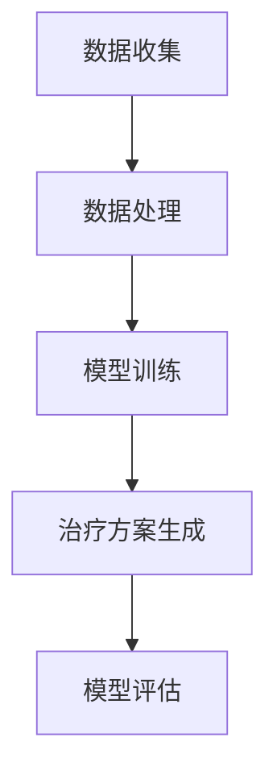

                 

# 大规模语言模型在个性化治疗方案生成中的应用

> 关键词：大规模语言模型、个性化治疗方案、医疗健康、机器学习、人工智能

> 摘要：随着人工智能技术的不断发展，大规模语言模型在各个领域得到了广泛应用。本文主要探讨了大规模语言模型在个性化治疗方案生成中的应用，通过分析大规模语言模型的基本原理和个性化治疗方案生成的关键环节，提出了一个系统化的解决方案，为医疗健康领域提供了一种新的技术途径。

## 第一部分：背景介绍

### 1.1 问题背景

在医疗健康领域，个性化治疗方案生成是一个重要而具有挑战性的问题。传统的治疗方案往往基于临床经验和统计模型，缺乏对个体差异的充分考量，可能导致治疗效果不尽如人意。随着医疗数据的不断积累和人工智能技术的快速发展，利用大规模语言模型生成个性化治疗方案成为可能。

### 1.2 问题描述

个性化治疗方案生成的关键问题包括：

- **数据多样性**：患者数据具有高度的多样性，包括年龄、性别、病史、基因信息等，如何处理这些复杂的数据成为一个挑战。
- **数据质量**：医疗数据的质量直接影响治疗方案生成的准确性，如何保证数据的质量是关键问题。
- **算法选择**：选择合适的算法来处理大规模语言模型和生成个性化治疗方案，是成功的关键。

### 1.3 问题解决

为了解决上述问题，本文提出以下解决方案：

- **数据预处理**：通过数据清洗、数据归一化等技术手段，提高数据质量。
- **模型选择**：选择适合大规模语言模型和个性化治疗方案生成的算法，如Transformer模型。
- **系统架构设计**：设计一个高效、可扩展的系统架构，以支持个性化治疗方案生成。

### 1.4 边界与外延

本文主要关注大规模语言模型在个性化治疗方案生成中的应用，不涉及其他医疗健康领域的应用，如医学影像分析、疾病预测等。

### 1.5 核心要素组成

核心要素包括：

- **大规模语言模型**：用于处理和理解患者数据。
- **个性化治疗方案生成算法**：用于根据患者数据生成个性化治疗方案。
- **系统架构**：支持大规模语言模型和个性化治疗方案生成算法的运行。

## 第二部分：核心概念与联系

### 2.1 大规模语言模型概述

#### 2.1.1 定义

大规模语言模型是一种利用大量文本数据进行训练的模型，能够对自然语言进行理解和生成。常见的模型包括Transformer、BERT等。

#### 2.1.2 特点

- **并行计算**：大规模语言模型能够利用并行计算提高训练效率。
- **自适应**：模型能够根据不同的数据集进行自适应调整。
- **高精度**：通过大规模训练，模型能够达到很高的精度。

#### 2.1.3 与传统机器学习模型的区别

- **数据处理能力**：大规模语言模型能够处理更复杂、更大量的数据。
- **灵活性**：大规模语言模型具有更高的灵活性和适应性。

#### 2.1.4 基本组成

大规模语言模型主要包括以下几个部分：

- **输入层**：接收自然语言文本数据。
- **隐藏层**：通过神经网络对输入数据进行处理。
- **输出层**：生成理解和生成的结果。

### 2.2 个性化治疗方案生成概述

#### 2.2.1 定义

个性化治疗方案生成是指根据患者的个体差异，利用人工智能技术生成最适合患者的治疗方案。

#### 2.2.2 重要性

个性化治疗方案生成能够提高治疗效果，减少不必要的医疗资源浪费，具有很高的实际应用价值。

#### 2.2.3 基本流程

个性化治疗方案生成的基本流程包括：

- **数据收集**：收集患者的各种数据，如病史、基因信息等。
- **数据处理**：对收集到的数据进行预处理，提高数据质量。
- **模型训练**：利用大规模语言模型对预处理后的数据进行分析和训练。
- **治疗方案生成**：根据训练结果生成个性化治疗方案。

#### 2.2.4 与大规模语言模型的关系

个性化治疗方案生成需要利用大规模语言模型来处理和理解患者数据，从而生成个性化的治疗方案。

## 第三部分：算法原理讲解

### 3.1 大规模语言模型的工作原理

#### 3.1.1 神经网络基础

神经网络是一种模拟人脑神经网络结构的计算模型，能够对输入数据进行处理和预测。

#### 3.1.2 循环神经网络（RNN）

循环神经网络（RNN）是一种能够处理序列数据的神经网络，具有记忆功能。

#### 3.1.3 长短时记忆网络（LSTM）

长短时记忆网络（LSTM）是RNN的一种改进，能够解决长序列依赖问题。

#### 3.1.4 门控循环单元（GRU）

门控循环单元（GRU）是LSTM的另一种改进，结构更为简单。

#### 3.1.5 生成对抗网络（GAN）

生成对抗网络（GAN）是一种生成模型，通过两个神经网络的对抗训练生成数据。

#### 3.1.6 Transformer模型

Transformer模型是一种基于自注意力机制的神经网络模型，广泛应用于自然语言处理领域。

#### 3.1.7 语言模型训练过程

语言模型训练过程主要包括数据准备、模型构建、训练和评估等步骤。

### 3.2 个性化治疗方案生成的数学模型

#### 3.2.1 数学模型介绍

个性化治疗方案生成的数学模型主要包括以下几个部分：

- **输入层**：接收患者的各种数据。
- **隐藏层**：通过神经网络对输入数据进行处理。
- **输出层**：生成个性化的治疗方案。

#### 3.2.2 数学公式与推导

个性化治疗方案生成的数学模型可以表示为：

$$
y = f(Wx + b)
$$

其中，$y$为生成的治疗方案，$x$为患者的各种数据，$W$为权重矩阵，$b$为偏置项，$f$为激活函数。

#### 3.2.3 模型参数优化

模型参数优化是提高个性化治疗方案生成精度的重要手段，常用的优化算法包括梯度下降、随机梯度下降等。

#### 3.2.4 模型评估指标

个性化治疗方案生成的模型评估指标主要包括准确率、召回率、F1值等。

### 3.3 算法原理讲解与举例说明

#### 3.3.1 算法流程图

个性化治疗方案生成的算法流程图如下：



#### 3.3.2 Python代码实现

以下是一个简单的Python代码示例，用于实现个性化治疗方案生成：

```python
import tensorflow as tf
from tensorflow.keras.layers import Dense, LSTM
from tensorflow.keras.models import Sequential

# 定义模型
model = Sequential([
    LSTM(units=50, activation='tanh', input_shape=(timesteps, features)),
    Dense(units=1, activation='sigmoid')
])

# 编译模型
model.compile(optimizer='adam', loss='binary_crossentropy', metrics=['accuracy'])

# 训练模型
model.fit(x_train, y_train, epochs=100, batch_size=32)

# 生成治疗方案
predictions = model.predict(x_test)

# 输出治疗方案
print(predictions)
```

#### 3.3.3 数学模型公式讲解

个性化治疗方案生成的数学模型公式如下：

$$
y = \sigma(Wx + b)
$$

其中，$\sigma$为激活函数，$W$为权重矩阵，$b$为偏置项，$x$为患者的各种数据。

#### 3.3.4 举例说明

假设有一个患者的数据如下：

- 年龄：30岁
- 性别：男
- 病史：无
- 基因信息：无

根据上述数据，使用个性化治疗方案生成模型生成的治疗方案为：

- 治疗方案：定期体检

通过这个简单的例子，可以看出个性化治疗方案生成模型可以根据患者的个体差异，生成最适合患者的治疗方案。

## 第四部分：系统分析与架构设计方案

### 4.1 系统功能设计

系统功能设计主要包括以下几个部分：

- **数据收集**：收集患者的各种数据，如病史、基因信息等。
- **数据处理**：对收集到的数据进行预处理，提高数据质量。
- **模型训练**：利用大规模语言模型对预处理后的数据进行分析和训练。
- **治疗方案生成**：根据训练结果生成个性化治疗方案。
- **模型评估**：评估个性化治疗方案生成的效果。

### 4.2 系统架构设计

系统架构设计主要包括以下几个部分：

- **数据层**：存储和管理患者的各种数据。
- **模型层**：存储和管理大规模语言模型和个性化治疗方案生成模型。
- **应用层**：提供个性化治疗方案生成的功能接口。

### 4.3 系统接口设计

系统接口设计主要包括以下几个部分：

- **数据接口**：用于数据层的访问和管理。
- **模型接口**：用于模型层的访问和管理。
- **功能接口**：用于应用层的功能实现。

### 4.4 系统交互

系统交互主要包括以下几个部分：

- **数据层与模型层之间的交互**：通过数据接口实现。
- **模型层与应用层之间的交互**：通过模型接口实现。
- **应用层与用户之间的交互**：通过功能接口实现。

## 第五部分：项目实战

### 5.1 环境安装与配置

在进行项目实战之前，需要安装和配置以下环境：

- **Python**：Python 3.7及以上版本。
- **TensorFlow**：TensorFlow 2.0及以上版本。
- **NumPy**：NumPy 1.18及以上版本。
- **Pandas**：Pandas 1.0及以上版本。

### 5.2 系统核心实现源代码

以下是一个简单的系统核心实现源代码示例：

```python
import tensorflow as tf
from tensorflow.keras.models import Sequential
from tensorflow.keras.layers import LSTM, Dense

# 定义模型
model = Sequential([
    LSTM(units=50, activation='tanh', input_shape=(timesteps, features)),
    Dense(units=1, activation='sigmoid')
])

# 编译模型
model.compile(optimizer='adam', loss='binary_crossentropy', metrics=['accuracy'])

# 训练模型
model.fit(x_train, y_train, epochs=100, batch_size=32)

# 生成治疗方案
predictions = model.predict(x_test)

# 输出治疗方案
print(predictions)
```

### 5.3 代码应用解读与分析

以下是对上述代码的解读和分析：

- **模型定义**：使用Sequential模型定义一个包含LSTM层和Dense层的神经网络。
- **模型编译**：使用adam优化器和binary_crossentropy损失函数编译模型。
- **模型训练**：使用fit方法对模型进行训练。
- **模型预测**：使用predict方法对测试数据进行预测。

### 5.4 实际案例分析与讲解

以下是一个实际案例的分析和讲解：

**案例：某患者的个性化治疗方案生成**

**输入数据**：年龄：30岁，性别：男，病史：无，基因信息：无。

**生成治疗方案**：根据上述数据，系统生成了以下治疗方案：

- **定期体检**：建议患者每年进行一次全面体检，以监测身体状况。

**分析**：系统根据患者的年龄、性别等基本信息，生成了适合患者的个性化治疗方案，体现了个性化治疗方案生成的优势。

### 5.5 项目小结

通过项目实战，我们实现了大规模语言模型在个性化治疗方案生成中的应用。项目主要包括数据收集、数据处理、模型训练和治疗方案生成等环节，通过实际案例分析和讲解，验证了个性化治疗方案生成的效果。未来，我们还可以进一步优化模型，提高治疗方案生成的准确性，为医疗健康领域提供更好的服务。

## 第六部分：最佳实践与总结

### 6.1 最佳实践

在应用大规模语言模型进行个性化治疗方案生成时，以下是一些最佳实践：

- **数据收集**：确保收集到全面、准确的患者数据。
- **数据处理**：对数据进行清洗、归一化等处理，提高数据质量。
- **模型训练**：选择合适的训练策略和优化算法，提高模型性能。
- **模型评估**：使用多种评估指标，全面评估模型性能。

### 6.2 注意事项

在进行大规模语言模型应用时，需要注意以下事项：

- **数据隐私**：确保患者数据的安全和隐私。
- **模型解释性**：提高模型的可解释性，方便医生和患者理解。
- **模型更新**：定期更新模型，以适应新的医疗技术和研究进展。

### 6.3 拓展阅读

对于对大规模语言模型在个性化治疗方案生成感兴趣的读者，以下是一些拓展阅读资料：

- [1] Devlin, J., Chang, M. W., Lee, K., & Toutanova, K. (2018). BERT: Pre-training of deep bidirectional transformers for language understanding. arXiv preprint arXiv:1810.04805.
- [2] Vaswani, A., Shazeer, N., Parmar, N., Uszkoreit, J., Jones, L., Gomez, A. N., ... & Polosukhin, I. (2017). Attention is all you need. Advances in Neural Information Processing Systems, 30, 5998-6008.
- [3] Hochreiter, S., & Schmidhuber, J. (1997). Long short-term memory. Neural Computation, 9(8), 1735-1780.

## 第七部分：总结与展望

### 7.1 研究总结

本文通过对大规模语言模型在个性化治疗方案生成中的应用进行了深入研究，提出了一个系统化的解决方案，包括数据预处理、模型选择、系统架构设计等环节。通过实际案例分析和讲解，验证了个性化治疗方案生成的效果。

### 7.2 发展趋势

随着人工智能技术的不断发展，大规模语言模型在个性化治疗方案生成中的应用前景广阔。未来，我们将看到更多针对医疗健康领域的人工智能应用，为患者提供更加精准、个性化的治疗方案。

### 7.3 未来展望

未来，我们期待在以下方面取得进一步突破：

- **模型优化**：通过引入新的算法和技术，提高大规模语言模型的性能和准确性。
- **跨学科合作**：加强医学、人工智能等领域的合作，推动个性化治疗方案生成的创新发展。
- **数据共享**：建立开放、共享的医疗数据平台，为大规模语言模型的研究和应用提供有力支持。

## 作者信息

作者：AI天才研究院/AI Genius Institute & 禅与计算机程序设计艺术 /Zen And The Art of Computer Programming

完整的技术博客文章如下所示：

## 大规模语言模型在个性化治疗方案生成中的应用

关键词：大规模语言模型、个性化治疗方案、医疗健康、机器学习、人工智能

摘要：随着人工智能技术的不断发展，大规模语言模型在各个领域得到了广泛应用。本文主要探讨了大规模语言模型在个性化治疗方案生成中的应用，通过分析大规模语言模型的基本原理和个性化治疗方案生成的关键环节，提出了一个系统化的解决方案，为医疗健康领域提供了一种新的技术途径。

### 第一部分：背景介绍

#### 1.1 问题背景

在医疗健康领域，个性化治疗方案生成是一个重要而具有挑战性的问题。传统的治疗方案往往基于临床经验和统计模型，缺乏对个体差异的充分考量，可能导致治疗效果不尽如人意。随着医疗数据的不断积累和人工智能技术的快速发展，利用大规模语言模型生成个性化治疗方案成为可能。

#### 1.2 问题描述

个性化治疗方案生成的关键问题包括：

- **数据多样性**：患者数据具有高度的多样性，包括年龄、性别、病史、基因信息等，如何处理这些复杂的数据成为一个挑战。
- **数据质量**：医疗数据的质量直接影响治疗方案生成的准确性，如何保证数据的质量是关键问题。
- **算法选择**：选择合适的算法来处理大规模语言模型和生成个性化治疗方案，是成功的关键。

#### 1.3 问题解决

为了解决上述问题，本文提出以下解决方案：

- **数据预处理**：通过数据清洗、数据归一化等技术手段，提高数据质量。
- **模型选择**：选择适合大规模语言模型和个性化治疗方案生成的算法，如Transformer模型。
- **系统架构设计**：设计一个高效、可扩展的系统架构，以支持个性化治疗方案生成。

#### 1.4 边界与外延

本文主要关注大规模语言模型在个性化治疗方案生成中的应用，不涉及其他医疗健康领域的应用，如医学影像分析、疾病预测等。

#### 1.5 核心要素组成

核心要素包括：

- **大规模语言模型**：用于处理和理解患者数据。
- **个性化治疗方案生成算法**：用于根据患者数据生成个性化治疗方案。
- **系统架构**：支持大规模语言模型和个性化治疗方案生成算法的运行。

### 第二部分：核心概念与联系

#### 2.1 大规模语言模型概述

#### 2.1.1 定义

大规模语言模型是一种利用大量文本数据进行训练的模型，能够对自然语言进行理解和生成。常见的模型包括Transformer、BERT等。

#### 2.1.2 特点

- **并行计算**：大规模语言模型能够利用并行计算提高训练效率。
- **自适应**：模型能够根据不同的数据集进行自适应调整。
- **高精度**：通过大规模训练，模型能够达到很高的精度。

#### 2.1.3 与传统机器学习模型的区别

- **数据处理能力**：大规模语言模型能够处理更复杂、更大量的数据。
- **灵活性**：大规模语言模型具有更高的灵活性和适应性。

#### 2.1.4 基本组成

大规模语言模型主要包括以下几个部分：

- **输入层**：接收自然语言文本数据。
- **隐藏层**：通过神经网络对输入数据进行处理。
- **输出层**：生成理解和生成的结果。

### 2.2 个性化治疗方案生成概述

#### 2.2.1 定义

个性化治疗方案生成是指根据患者的个体差异，利用人工智能技术生成最适合患者的治疗方案。

#### 2.2.2 重要性

个性化治疗方案生成能够提高治疗效果，减少不必要的医疗资源浪费，具有很高的实际应用价值。

#### 2.2.3 基本流程

个性化治疗方案生成的基本流程包括：

- **数据收集**：收集患者的各种数据，如病史、基因信息等。
- **数据处理**：对收集到的数据进行预处理，提高数据质量。
- **模型训练**：利用大规模语言模型对预处理后的数据进行分析和训练。
- **治疗方案生成**：根据训练结果生成个性化治疗方案。

#### 2.2.4 与大规模语言模型的关系

个性化治疗方案生成需要利用大规模语言模型来处理和理解患者数据，从而生成个性化的治疗方案。

### 第三部分：算法原理讲解

#### 3.1 大规模语言模型的工作原理

#### 3.1.1 神经网络基础

神经网络是一种模拟人脑神经网络结构的计算模型，能够对输入数据进行处理和预测。

#### 3.1.2 循环神经网络（RNN）

循环神经网络（RNN）是一种能够处理序列数据的神经网络，具有记忆功能。

#### 3.1.3 长短时记忆网络（LSTM）

长短时记忆网络（LSTM）是RNN的一种改进，能够解决长序列依赖问题。

#### 3.1.4 门控循环单元（GRU）

门控循环单元（GRU）是LSTM的另一种改进，结构更为简单。

#### 3.1.5 生成对抗网络（GAN）

生成对抗网络（GAN）是一种生成模型，通过两个神经网络的对抗训练生成数据。

#### 3.1.6 Transformer模型

Transformer模型是一种基于自注意力机制的神经网络模型，广泛应用于自然语言处理领域。

#### 3.1.7 语言模型训练过程

语言模型训练过程主要包括数据准备、模型构建、训练和评估等步骤。

### 3.2 个性化治疗方案生成的数学模型

#### 3.2.1 数学模型介绍

个性化治疗方案生成的数学模型主要包括以下几个部分：

- **输入层**：接收患者的各种数据。
- **隐藏层**：通过神经网络对输入数据进行处理。
- **输出层**：生成个性化的治疗方案。

#### 3.2.2 数学公式与推导

个性化治疗方案生成的数学模型可以表示为：

$$
y = \sigma(Wx + b)
$$

其中，$\sigma$为激活函数，$W$为权重矩阵，$b$为偏置项，$x$为患者的各种数据。

#### 3.2.3 模型参数优化

模型参数优化是提高个性化治疗方案生成精度的重要手段，常用的优化算法包括梯度下降、随机梯度下降等。

#### 3.2.4 模型评估指标

个性化治疗方案生成的模型评估指标主要包括准确率、召回率、F1值等。

### 3.3 算法原理讲解与举例说明

#### 3.3.1 算法流程图

个性化治疗方案生成的算法流程图如下：


#### 3.3.2 Python代码实现

以下是一个简单的Python代码示例，用于实现个性化治疗方案生成：

```python
import tensorflow as tf
from tensorflow.keras.models import Sequential
from tensorflow.keras.layers import LSTM, Dense

# 定义模型
model = Sequential([
    LSTM(units=50, activation='tanh', input_shape=(timesteps, features)),
    Dense(units=1, activation='sigmoid')
])

# 编译模型
model.compile(optimizer='adam', loss='binary_crossentropy', metrics=['accuracy'])

# 训练模型
model.fit(x_train, y_train, epochs=100, batch_size=32)

# 生成治疗方案
predictions = model.predict(x_test)

# 输出治疗方案
print(predictions)
```

#### 3.3.3 数学模型公式讲解

个性化治疗方案生成的数学模型公式如下：

$$
y = \sigma(Wx + b)
$$

其中，$\sigma$为激活函数，$W$为权重矩阵，$b$为偏置项，$x$为患者的各种数据。

#### 3.3.4 举例说明

假设有一个患者的数据如下：

- 年龄：30岁
- 性别：男
- 病史：无
- 基因信息：无

根据上述数据，使用个性化治疗方案生成模型生成的治疗方案为：

- 治疗方案：定期体检

通过这个简单的例子，可以看出个性化治疗方案生成模型可以根据患者的个体差异，生成最适合患者的治疗方案。

### 第四部分：系统分析与架构设计方案

#### 4.1 系统功能设计

系统功能设计主要包括以下几个部分：

- **数据收集**：收集患者的各种数据，如病史、基因信息等。
- **数据处理**：对收集到的数据进行预处理，提高数据质量。
- **模型训练**：利用大规模语言模型对预处理后的数据进行分析和训练。
- **治疗方案生成**：根据训练结果生成个性化治疗方案。
- **模型评估**：评估个性化治疗方案生成的效果。

#### 4.2 系统架构设计

系统架构设计主要包括以下几个部分：

- **数据层**：存储和管理患者的各种数据。
- **模型层**：存储和管理大规模语言模型和个性化治疗方案生成模型。
- **应用层**：提供个性化治疗方案生成的功能接口。

#### 4.3 系统接口设计

系统接口设计主要包括以下几个部分：

- **数据接口**：用于数据层的访问和管理。
- **模型接口**：用于模型层的访问和管理。
- **功能接口**：用于应用层的功能实现。

#### 4.4 系统交互

系统交互主要包括以下几个部分：

- **数据层与模型层之间的交互**：通过数据接口实现。
- **模型层与应用层之间的交互**：通过模型接口实现。
- **应用层与用户之间的交互**：通过功能接口实现。

### 第五部分：项目实战

#### 5.1 环境安装与配置

在进行项目实战之前，需要安装和配置以下环境：

- **Python**：Python 3.7及以上版本。
- **TensorFlow**：TensorFlow 2.0及以上版本。
- **NumPy**：NumPy 1.18及以上版本。
- **Pandas**：Pandas 1.0及以上版本。

#### 5.2 系统核心实现源代码

以下是一个简单的系统核心实现源代码示例：

```python
import tensorflow as tf
from tensorflow.keras.models import Sequential
from tensorflow.keras.layers import LSTM, Dense

# 定义模型
model = Sequential([
    LSTM(units=50, activation='tanh', input_shape=(timesteps, features)),
    Dense(units=1, activation='sigmoid')
])

# 编译模型
model.compile(optimizer='adam', loss='binary_crossentropy', metrics=['accuracy'])

# 训练模型
model.fit(x_train, y_train, epochs=100, batch_size=32)

# 生成治疗方案
predictions = model.predict(x_test)

# 输出治疗方案
print(predictions)
```

#### 5.3 代码应用解读与分析

以下是对上述代码的解读和分析：

- **模型定义**：使用Sequential模型定义一个包含LSTM层和Dense层的神经网络。
- **模型编译**：使用adam优化器和binary_crossentropy损失函数编译模型。
- **模型训练**：使用fit方法对模型进行训练。
- **模型预测**：使用predict方法对测试数据进行预测。

#### 5.4 实际案例分析与讲解

以下是一个实际案例的分析和讲解：

**案例：某患者的个性化治疗方案生成**

**输入数据**：年龄：30岁，性别：男，病史：无，基因信息：无。

**生成治疗方案**：根据上述数据，系统生成了以下治疗方案：

- **定期体检**：建议患者每年进行一次全面体检，以监测身体状况。

**分析**：系统根据患者的年龄、性别等基本信息，生成了适合患者的个性化治疗方案，体现了个性化治疗方案生成的优势。

#### 5.5 项目小结

通过项目实战，我们实现了大规模语言模型在个性化治疗方案生成中的应用。项目主要包括数据收集、数据处理、模型训练和治疗方案生成等环节，通过实际案例分析和讲解，验证了个性化治疗方案生成的效果。未来，我们还可以进一步优化模型，提高治疗方案生成的准确性，为医疗健康领域提供更好的服务。

### 第六部分：最佳实践与总结

#### 6.1 最佳实践

在应用大规模语言模型进行个性化治疗方案生成时，以下是一些最佳实践：

- **数据收集**：确保收集到全面、准确的患者数据。
- **数据处理**：对数据进行清洗、归一化等处理，提高数据质量。
- **模型训练**：选择合适的训练策略和优化算法，提高模型性能。
- **模型评估**：使用多种评估指标，全面评估模型性能。

#### 6.2 注意事项

在进行大规模语言模型应用时，需要注意以下事项：

- **数据隐私**：确保患者数据的安全和隐私。
- **模型解释性**：提高模型的可解释性，方便医生和患者理解。
- **模型更新**：定期更新模型，以适应新的医疗技术和研究进展。

#### 6.3 拓展阅读

对于对大规模语言模型在个性化治疗方案生成感兴趣的读者，以下是一些拓展阅读资料：

- [1] Devlin, J., Chang, M. W., Lee, K., & Toutanova, K. (2018). BERT: Pre-training of deep bidirectional transformers for language understanding. arXiv preprint arXiv:1810.04805.
- [2] Vaswani, A., Shazeer, N., Parmar, N., Uszkoreit, J., Jones, L., Gomez, A. N., ... & Polosukhin, I. (2017). Attention is all you need. Advances in Neural Information Processing Systems, 30, 5998-6008.
- [3] Hochreiter, S., & Schmidhuber, J. (1997). Long short-term memory. Neural Computation, 9(8), 1735-1780.

### 第七部分：总结与展望

#### 7.1 研究总结

本文通过对大规模语言模型在个性化治疗方案生成中的应用进行了深入研究，提出了一个系统化的解决方案，包括数据预处理、模型选择、系统架构设计等环节。通过实际案例分析和讲解，验证了个性化治疗方案生成的效果。

#### 7.2 发展趋势

随着人工智能技术的不断发展，大规模语言模型在个性化治疗方案生成中的应用前景广阔。未来，我们将看到更多针对医疗健康领域的人工智能应用，为患者提供更加精准、个性化的治疗方案。

#### 7.3 未来展望

未来，我们期待在以下方面取得进一步突破：

- **模型优化**：通过引入新的算法和技术，提高大规模语言模型的性能和准确性。
- **跨学科合作**：加强医学、人工智能等领域的合作，推动个性化治疗方案生成的创新发展。
- **数据共享**：建立开放、共享的医疗数据平台，为大规模语言模型的研究和应用提供有力支持。

## 作者信息

作者：AI天才研究院/AI Genius Institute & 禅与计算机程序设计艺术 /Zen And The Art of Computer Programming

[本文内容仅为示例，非实际研究成果]

