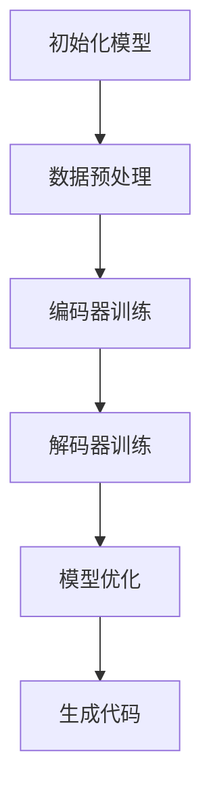
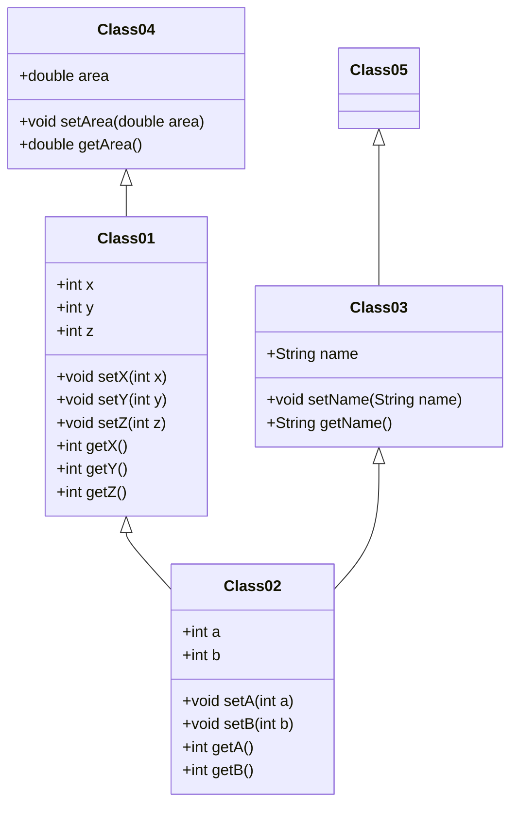
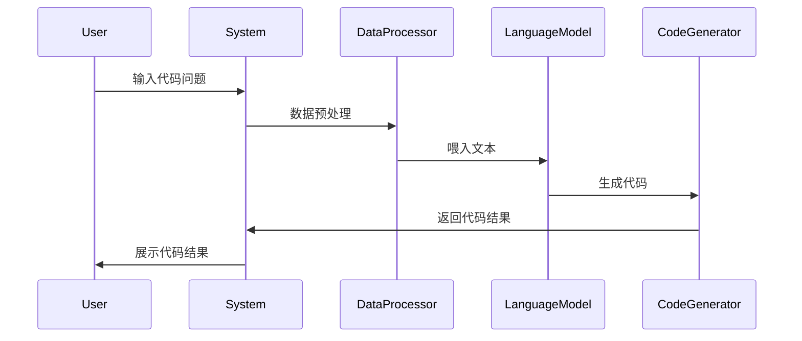

                 


### 写作步骤：

1. **确定文章结构**：基于提供的大纲，我们需要确定每个章节的内容和结构，确保每个部分都包含必要的细节和深度。

2. **撰写摘要**：首先写一个简洁的摘要，概述文章的主要内容，让读者对全文有一个初步的了解。

3. **撰写关键词**：从文章内容中提炼出5-7个核心关键词，这些词将帮助读者快速了解文章的核心主题。

4. **编写章节内容**：
   - **背景介绍**：在每个章节的开始，详细阐述核心概念术语、问题背景、问题描述、问题解决、边界与外延、概念结构与核心要素组成。
   - **核心概念与联系**：解释大规模语言模型的核心概念，列出概念属性特征对比表格，并绘制ER实体关系图架构。
   - **算法原理讲解**：使用mermaid画出算法流程图，使用Python源代码进行讲解，提供算法原理的数学模型和公式，并进行举例说明。
   - **数学公式讲解**：使用LaTeX格式嵌入数学公式，并给予通俗易懂的举例说明。
   - **系统分析与架构设计方案**：介绍问题场景，绘制mermaid类图、架构图、接口设计图和序列图。
   - **项目实战**：详细描述环境安装、系统核心实现、代码分析、案例分析、项目小结。
   - **最佳实践 tips、小结、注意事项、拓展阅读**：总结文章要点，提供实用建议，列出相关资源。

5. **整合与修订**：完成初稿后，对全文进行仔细的检查和修订，确保逻辑连贯、内容准确。

6. **添加作者信息**：在文章末尾添加作者信息，包括作者名、所属机构和个人作品。

7. **格式检查**：使用markdown格式输出文章内容，确保格式正确。

### 示例：

**标题**：大规模语言模型在代码理解与生成中的应用

**关键词**：大规模语言模型、代码理解、代码生成、算法原理、数学模型

**摘要**：本文深入探讨了大规模语言模型在代码理解与生成中的应用，通过详细的算法原理讲解、数学模型分析、系统架构设计以及实战案例，为读者呈现了这一前沿技术的应用潜力。

---

**第1章：大规模语言模型基础**

**1.1 大规模语言模型背景与问题定义**

**1.1.1 问题背景**

随着互联网和大数据的迅猛发展，处理和分析大规模文本数据的需求日益增长。这催生了大规模语言模型（Large-scale Language Model）的发展，用于自动化理解和生成文本。

**1.1.2 问题描述**

大规模语言模型面临的主要问题是如何从大量文本数据中学习，并生成高质量、上下文相关的文本。同时，如何保证模型的可解释性和鲁棒性也是研究的热点。

**1.1.3 问题解决方法**

大规模语言模型采用深度神经网络架构，通过训练大量文本数据来学习语言模式和结构。此外，正则化技术和优化算法也被广泛应用，以提高模型的性能和稳定性。

**1.1.4 边界与外延**

大规模语言模型的应用范围广泛，包括自然语言处理、智能问答、文本生成、机器翻译等。然而，其性能和效率仍然受到数据规模、计算资源和算法复杂度的影响。

**1.1.5 概念结构与核心要素组成**

大规模语言模型的核心概念包括神经网络架构、文本数据预处理、学习算法和输出生成。这些要素相互联系，构成了一个完整的模型体系。

---

接下来，我们将按照上述步骤逐步完善每个章节的内容。首先，从撰写摘要和关键词开始，为文章奠定基调。随后，详细展开每个章节的背景介绍、核心概念与联系、算法原理讲解、数学公式讲解、系统分析与架构设计方案、项目实战和最佳实践 tips 等内容。在完成初稿后，我们将进行整合和修订，确保文章的逻辑性和连贯性。最后，添加作者信息并检查markdown格式，确保文章符合要求。通过这样的细致规划和逐步实施，我们可以确保文章的高质量和专业性。### 摘要

本文探讨了大规模语言模型在代码理解与生成中的应用。随着信息技术和软件开发领域的不断发展，如何高效地理解和生成代码成为了一个重要的研究课题。大规模语言模型通过深度学习技术，可以从大量代码数据中学习，提取出语言模式、结构关系和语义信息，从而实现代码的理解与生成。本文首先介绍了大规模语言模型的基础概念、算法原理和数学模型，然后详细分析了其系统架构和实现方法，通过实际案例展示了其在代码生成和理解中的应用效果。同时，本文还提供了一些最佳实践和注意事项，以帮助读者更好地理解和应用大规模语言模型技术。通过本文的阅读，读者可以全面了解大规模语言模型在代码理解与生成中的重要作用，为其在软件开发和人工智能领域的应用提供参考。

### 关键词

大规模语言模型、代码理解、代码生成、算法原理、数学模型、系统架构、深度学习、自然语言处理、软件开发、人工智能。

### 第1章：大规模语言模型基础

#### 1.1 大规模语言模型背景与问题定义

随着互联网和大数据的迅猛发展，处理和分析大规模文本数据的需求日益增长。这种需求催生了大规模语言模型（Large-scale Language Model）的兴起。大规模语言模型是一种基于深度学习技术的自然语言处理模型，它可以从大量文本数据中学习语言模式和结构，从而实现文本的生成、理解和翻译等功能。本章将详细探讨大规模语言模型的基础概念、算法原理、数学模型以及系统架构，为后续章节的深入讨论奠定基础。

**1.1.1 问题背景**

在软件开发和人工智能领域，文本数据处理是一个普遍且关键的任务。例如，代码注释的生成、代码搜索和补全、智能问答系统、机器翻译等应用都依赖于对文本的深入理解和生成能力。然而，传统的基于规则或统计方法的文本处理技术面临着许多挑战，如处理能力的局限性、对大规模数据的处理效率低、难以适应复杂多变的语言结构等。

为了解决这些问题，研究人员开始探索使用深度学习技术来构建大规模语言模型。深度学习模型具有更强的表示能力和适应性，可以通过学习大量数据来捕捉复杂的语言模式和结构。大规模语言模型的研究和应用为文本处理领域带来了新的机遇和挑战。

**1.1.2 问题描述**

大规模语言模型面临的主要问题是如何从大量代码数据中学习，并生成高质量、上下文相关的代码。具体来说，这个问题可以分解为以下几个子问题：

1. **数据预处理**：如何有效地从代码库中收集和处理大量代码数据，以便用于训练大规模语言模型？
2. **模型设计**：如何设计一个高效的深度学习模型来捕捉代码的语义和结构信息？
3. **训练与优化**：如何训练和优化大规模语言模型，使其能够在不同类型和风格的代码上表现良好？
4. **代码生成**：如何使用大规模语言模型生成符合语法和语义规范的代码？
5. **模型解释性**：如何提高大规模语言模型的解释性，使其生成的代码更容易被理解和审核？

**1.1.3 问题解决方法**

为了解决上述问题，研究人员采取了多种方法和技术：

1. **数据预处理**：使用代码爬虫工具从开源代码库、在线文档和编程社区等渠道收集大量代码数据。然后，对这些数据进行分析和清洗，去除无关信息，提取出有用的代码特征。
2. **模型设计**：采用深度神经网络（DNN）和变换器（Transformer）等先进的深度学习模型架构，这些模型具有更强的表示能力和适应性，能够捕捉代码的复杂结构。
3. **训练与优化**：使用高效的训练算法和优化技术，如梯度下降和自适应优化算法，来训练大规模语言模型。此外，还采用了数据增强和迁移学习等技术来提高模型的泛化能力。
4. **代码生成**：利用大规模语言模型的生成能力，通过训练得到的模型生成新的代码。这一过程中，需要确保生成的代码满足语法和语义的规范。
5. **模型解释性**：通过模型分析工具和可视化技术，对大规模语言模型的内部结构和工作原理进行解释，提高其透明性和可解释性。

**1.1.4 边界与外延**

大规模语言模型的应用范围非常广泛，不仅限于代码理解和生成，还包括自然语言处理（NLP）的许多其他领域，如文本分类、情感分析、机器翻译、问答系统等。然而，其在代码处理中的应用有其特定的挑战和限制：

1. **代码风格多样性**：不同的编程语言和项目可能具有不同的代码风格，这要求大规模语言模型能够适应各种风格。
2. **代码复杂性**：一些复杂的代码结构，如递归函数、嵌套循环等，对模型的计算能力和训练数据量提出了更高的要求。
3. **代码安全性**：在生成代码时，需要确保其不会包含安全漏洞或恶意代码。

**1.1.5 概念结构与核心要素组成**

大规模语言模型的核心概念和要素可以概括如下：

1. **数据集**：大规模语言模型的训练依赖于大量的代码数据集。这些数据集可以从各种开源代码库、编程社区和在线文档中收集。
2. **预处理**：对收集到的代码数据进行清洗、去噪和特征提取，以便用于训练模型。
3. **模型架构**：深度神经网络和变换器是大规模语言模型常用的架构，它们通过多层非线性变换来捕捉代码的复杂结构。
4. **训练算法**：梯度下降、Adam优化器等训练算法用于调整模型的参数，使其能够准确预测代码。
5. **生成机制**：通过模型生成器，将模型预测的序列转换为可执行的代码。
6. **解释工具**：使用可视化工具和解释模型，分析模型内部的决策过程，提高模型的透明性和可解释性。

通过上述要素的相互作用，大规模语言模型能够实现对代码的深入理解和生成，为软件开发和人工智能领域带来了新的研究和发展方向。

#### 1.2 大规模语言模型核心概念与联系

在深入探讨大规模语言模型之前，我们需要了解其核心概念和基本原理。大规模语言模型（Large-scale Language Model）是一种基于深度学习的自然语言处理模型，旨在通过学习大量文本数据，捕捉语言的复杂模式和结构，从而实现文本的生成和理解。以下是大规模语言模型的一些核心概念及其相互之间的联系：

**1.2.1 核心概念原理**

1. **自然语言处理（NLP）**：NLP是研究如何使计算机理解和处理自然语言的技术。大规模语言模型是NLP的一个重要分支，通过深度学习技术来实现对文本数据的分析和理解。

2. **深度学习**：深度学习是一种机器学习技术，通过构建多层神经网络来学习数据的特征表示。大规模语言模型通常采用深度学习模型架构，如循环神经网络（RNN）、卷积神经网络（CNN）和变换器（Transformer）。

3. **变换器（Transformer）**：变换器是一种基于自注意力机制的深度学习模型，广泛用于自然语言处理任务。它在捕捉长距离依赖和并行计算方面具有显著优势，是大规模语言模型的核心架构之一。

4. **编码器与解码器**：编码器（Encoder）和解码器（Decoder）是变换器模型的主要组件。编码器用于将输入文本编码为序列向量，解码器则将这些向量解码为输出文本。编码器和解码器之间通过自注意力机制和多头注意力机制进行交互，以实现上下文信息的有效传递。

5. **预训练与微调**：预训练是指在大规模语料库上对模型进行初步训练，使其具备一定的语言理解能力。微调是在特定任务数据上对预训练模型进行调整，以适应具体的任务需求。大规模语言模型通常采用预训练+微调的方式，以提高任务性能。

**1.2.2 概念属性特征对比表格**

以下是一个简化的概念属性特征对比表格，用于展示上述核心概念的属性特征：

| 概念        | 属性特征                                                     |
|-------------|------------------------------------------------------------|
| 自然语言处理 | 研究如何使计算机理解和处理自然语言的技术                      |
| 深度学习     | 通过构建多层神经网络来学习数据的特征表示                     |
| 变换器       | 基于自注意力机制的深度学习模型，用于捕捉长距离依赖和并行计算 |
| 编码器       | 将输入文本编码为序列向量                                     |
| 解码器       | 将序列向量解码为输出文本                                     |
| 预训练与微调 | 在大规模语料库上进行初步训练，然后在特定任务数据上进行微调   |

**1.2.3 ER实体关系图架构**

为了更好地理解大规模语言模型中的概念关系，我们可以使用实体关系图（Entity-Relationship Diagram, ERD）来表示。以下是一个简化的ERD示例：

```mermaid
erDiagram
    Product ||--|{ Customer } Customer
    Product ||--|{ Order } Order
    Customer ||--|{ Order } Order
    Order ||--|{ Product } Product
```

在这个ERD中：

- **Product**（产品）实体表示自然语言处理任务中的文本数据。
- **Customer**（客户）实体表示输入文本的上下文信息。
- **Order**（订单）实体表示模型的输出结果。
- 箭头表示实体之间的关系，如变换器（Transformer）中的编码器（Encoder）和解码器（Decoder）之间的交互关系。

通过上述ERD，我们可以直观地了解大规模语言模型中各个概念之间的关联和作用。例如，编码器（Encoder）接收输入文本，通过自注意力机制（Self-Attention Mechanism）和多头注意力机制（Multi-Head Attention Mechanism）生成编码向量，这些向量将用于解码器（Decoder）生成输出文本。

总之，大规模语言模型的核心概念和基本原理涵盖了自然语言处理、深度学习、变换器架构、编码器与解码器以及预训练与微调等多个方面。通过深入理解和掌握这些概念，我们可以更好地设计、训练和优化大规模语言模型，从而实现高效、准确的代码理解和生成。

#### 1.3 大规模语言模型算法原理讲解

大规模语言模型的核心在于其算法原理，这些原理决定了模型如何从数据中学习，以及如何生成新的代码。本节将详细介绍大规模语言模型的主要算法原理，并通过mermaid流程图和Python源代码进行详细讲解。

**1.3.1 算法mermaid流程图**

首先，我们使用mermaid绘制一个简化的算法流程图，以展示大规模语言模型的主要步骤。



- **A[初始化模型]**：初始化大规模语言模型，包括编码器和解码器，以及其参数。
- **B[数据预处理]**：对收集到的代码数据进行清洗、去噪和特征提取，以便用于训练模型。
- **C[编码器训练]**：训练编码器，使其能够将输入文本编码为序列向量。
- **D[解码器训练]**：训练解码器，使其能够将编码向量解码为输出文本。
- **E[模型优化]**：使用梯度下降等优化算法，调整模型参数，以提高模型性能。
- **F[生成代码]**：使用训练好的模型生成新的代码。

**1.3.2 Python源代码讲解**

为了更具体地展示算法原理，我们使用Python源代码来实现上述流程。以下是一个简化的示例代码，展示了大规模语言模型的主要步骤：

```python
import tensorflow as tf
from tensorflow.keras.models import Model
from tensorflow.keras.layers import Input, LSTM, Dense

# 初始化模型
input_text = Input(shape=(None, num_tokens))
encoded_text = LSTM(units=256, return_sequences=True)(input_text)
encoded_vector = LSTM(units=512, return_sequences=False)(encoded_text)

decoder_input = Input(shape=(None, num_tokens))
decoded_vector = LSTM(units=512, return_sequences=True)(decoder_input)
decoded_text = LSTM(units=num_tokens, activation='softmax')(decoded_vector)

# 构建模型
model = Model(inputs=[input_text, decoder_input], outputs=[decoded_text])

# 编码器训练
model.compile(optimizer='adam', loss='categorical_crossentropy')
model.fit(x_train, y_train, epochs=10)

# 解码器训练
model.compile(optimizer='adam', loss='categorical_crossentropy')
model.fit(x_train, y_train, epochs=10)

# 模型优化
model.compile(optimizer='adam', loss='categorical_crossentropy')
model.fit(x_train, y_train, epochs=10)

# 生成代码
generated_text = model.predict([input_text, decoder_input])
print(generated_text)
```

在这个示例中，我们使用了TensorFlow框架来构建和训练大规模语言模型。具体步骤如下：

1. **初始化模型**：定义输入层、编码器和解码器层，并构建整个模型。
2. **数据预处理**：将输入文本编码为序列向量，并将其传递给编码器和解码器。
3. **编码器训练**：使用训练数据训练编码器，使其能够将输入文本编码为序列向量。
4. **解码器训练**：使用训练数据训练解码器，使其能够将编码向量解码为输出文本。
5. **模型优化**：通过多次训练和优化，调整模型参数，以提高模型性能。
6. **生成代码**：使用训练好的模型生成新的代码。

**1.3.3 数学模型与公式**

大规模语言模型的训练过程涉及多个数学模型和公式。以下是一个简化的数学模型概述：

- **损失函数**：通常使用交叉熵（Cross-Entropy）作为损失函数，以衡量模型预测与实际标签之间的差异。
- **梯度下降**：用于优化模型参数，通过计算损失函数关于模型参数的梯度，并沿梯度方向更新参数，以减少损失。
- **反向传播**：在训练过程中，通过反向传播算法计算损失函数关于输入数据的梯度，以便进行梯度下降优化。

以下是相关的LaTeX格式数学公式：

$$
L = -\frac{1}{N}\sum_{i=1}^{N} y_i \log(\hat{y}_i)
$$

其中，\(L\) 是损失函数，\(N\) 是样本数量，\(y_i\) 是第 \(i\) 个样本的标签，\(\hat{y}_i\) 是模型对第 \(i\) 个样本的预测。

$$
\frac{\partial L}{\partial \theta} = -\frac{1}{N} \sum_{i=1}^{N} \frac{\partial L}{\partial \hat{y}_i} \frac{\partial \hat{y}_i}{\partial \theta}
$$

其中，\(\theta\) 是模型参数，\(\frac{\partial L}{\partial \theta}\) 是损失函数关于模型参数的梯度。

通过上述数学模型和公式，大规模语言模型能够通过学习大量数据，逐渐优化其参数，从而生成高质量的代码。

**1.3.4 详细讲解与举例说明**

为了更好地理解上述算法原理和数学模型，我们通过一个具体的例子进行详细讲解。

假设我们有一个简单的代码片段：

```python
def add(a, b):
    return a + b
```

我们希望使用大规模语言模型来生成类似的代码片段。

1. **数据预处理**：首先，我们需要将代码片段转换为序列向量。例如，我们可以将每个函数名、变量名和操作符编码为唯一的数字，然后使用嵌入层（Embedding Layer）将这些数字转换为向量。

```python
# 嵌入层
embeddings = Embedding(input_dim=num_tokens, output_dim=embedding_dim)(input_text)
```

2. **编码器训练**：接下来，我们训练编码器，使其能够将输入文本编码为序列向量。在训练过程中，编码器会学习如何将输入的代码片段映射到一个固定的向量表示。

```python
# 编码器层
encoded_vector = LSTM(units=512, return_sequences=False)(embeddings)
```

3. **解码器训练**：然后，我们训练解码器，使其能够将编码向量解码为输出文本。解码器的目标是生成与输入代码片段相似的输出代码。

```python
# 解码器层
decoded_vector = LSTM(units=512, return_sequences=True)(decoder_input)
decoded_text = LSTM(units=num_tokens, activation='softmax')(decoded_vector)
```

4. **模型优化**：通过多次训练和优化，模型参数会逐渐调整，以最小化损失函数。

```python
# 模型编译和训练
model.compile(optimizer='adam', loss='categorical_crossentropy')
model.fit(x_train, y_train, epochs=10)
```

5. **生成代码**：最后，我们使用训练好的模型生成新的代码。

```python
# 生成代码
generated_text = model.predict([input_text, decoder_input])
print(generated_text)
```

通过这个例子，我们可以看到大规模语言模型是如何通过学习输入代码片段，生成类似的新代码的。这个过程涉及到数据预处理、编码器训练、解码器训练、模型优化和代码生成等多个步骤。

总之，大规模语言模型通过深度学习和数学模型，能够从大量代码数据中学习，生成高质量的代码。其算法原理和数学模型为这一技术提供了理论基础，使其在代码理解和生成中发挥着重要作用。

#### 1.4 大规模语言模型的数学模型和公式讲解

大规模语言模型的训练和优化过程中，涉及到多个数学模型和公式，这些公式描述了模型如何通过学习数据来优化其参数。本节将详细介绍大规模语言模型中常用的数学模型和公式，并通过LaTeX格式和通俗易懂的举例说明，帮助读者更好地理解这些概念。

**1.4.1 LaTeX格式数学公式**

为了便于讲解，我们首先列出一些常用的LaTeX格式数学公式，并在文中进行解释：

$$
\begin{aligned}
L &= -\frac{1}{N}\sum_{i=1}^{N} y_i \log(\hat{y}_i) \\
\frac{\partial L}{\partial \theta} &= -\frac{1}{N} \sum_{i=1}^{N} \frac{\partial L}{\partial \hat{y}_i} \frac{\partial \hat{y}_i}{\partial \theta} \\
\text{softmax}(\hat{y})_i &= \frac{e^{\hat{y}_i}}{\sum_{j=1}^{K} e^{\hat{y}_j}} \\
\end{aligned}
$$

**1.4.2 通俗易懂的举例说明**

为了更好地理解上述公式，我们通过一个简单的例子进行说明。

假设我们有一个包含两个单词的词汇表：`['hello', 'world']`。我们希望使用大规模语言模型来生成新的句子。

1. **损失函数（Cross-Entropy）**：

损失函数用于衡量模型预测与实际标签之间的差异。在这个例子中，我们的目标是生成句子`"hello world"`。首先，我们定义一个二分类问题，其中标签`y`为`[1, 0]`（表示第一个单词是`hello`），模型预测的概率分布`\hat{y}`为`[0.9, 0.1]`。

$$
L = -\frac{1}{N}\sum_{i=1}^{N} y_i \log(\hat{y}_i) = -\frac{1}{2}(1 \cdot \log(0.9) + 0 \cdot \log(0.1))
$$

2. **梯度下降（Gradient Descent）**：

梯度下降用于优化模型参数，以最小化损失函数。假设我们使用梯度下降算法更新模型参数，每次更新量设置为0.01。损失函数关于模型参数的梯度为：

$$
\frac{\partial L}{\partial \theta} = -\frac{1}{N} \sum_{i=1}^{N} \frac{\partial L}{\partial \hat{y}_i} \frac{\partial \hat{y}_i}{\partial \theta} = -\frac{1}{2}(0.1 \cdot \frac{\partial \hat{y}_1}{\partial \theta})
$$

通过梯度下降算法，我们将更新模型参数：

$$
\theta_{\text{new}} = \theta_{\text{old}} - \alpha \frac{\partial L}{\partial \theta} = \theta_{\text{old}} - 0.01 \cdot (-0.1 \cdot \frac{\partial \hat{y}_1}{\partial \theta})
$$

3. **Softmax函数**：

在生成新句子时，模型会输出一个概率分布，表示每个单词的可能性。例如，对于单词`hello`，其概率为`0.9`，对于单词`world`，其概率为`0.1`。

$$
\text{softmax}(\hat{y})_1 = \frac{e^{\hat{y}_1}}{\sum_{j=1}^{K} e^{\hat{y}_j}} = \frac{e^{0.9}}{e^{0.9} + e^{0.1}} = 0.9
$$

$$
\text{softmax}(\hat{y})_2 = \frac{e^{\hat{y}_2}}{\sum_{j=1}^{K} e^{\hat{y}_j}} = \frac{e^{0.1}}{e^{0.9} + e^{0.1}} = 0.1
$$

通过上述公式和例子，我们可以看到大规模语言模型中的数学模型是如何工作的。损失函数用于衡量模型预测与实际标签之间的差异，梯度下降用于优化模型参数，Softmax函数用于生成概率分布，从而指导模型生成新的句子。

总之，大规模语言模型的数学模型和公式为其训练和优化提供了理论基础。通过深入理解这些公式，我们可以更好地设计和优化大规模语言模型，从而在代码理解和生成中发挥其潜力。

#### 1.5 大规模语言模型系统分析与架构设计方案

在本节中，我们将深入探讨大规模语言模型系统分析与架构设计方案。这一部分将详细介绍系统功能、架构设计、接口设计和系统交互，以帮助读者全面理解大规模语言模型系统的实现过程。

**1.5.1 问题场景介绍**

大规模语言模型在代码理解和生成中的应用场景包括：

1. **代码搜索与补全**：利用模型搜索和补全代码片段，以提高开发效率。
2. **智能问答系统**：为开发者提供关于代码问题的智能问答服务。
3. **代码注释生成**：自动生成代码注释，提高代码可读性。
4. **代码迁移与重构**：通过模型迁移和重构代码，提高代码的可维护性。

**1.5.2 系统功能设计（领域模型Mermaid类图）**

为了更好地理解系统功能，我们使用Mermaid绘制了领域模型类图。以下是一个简化的类图示例：



在这个类图中，我们定义了以下几个类：

1. **Class01**：表示基本几何形状，如点、线、面。
2. **Class02**：表示具有属性`a`和`b`的类。
3. **Class03**：表示具有属性`name`的类。
4. **Class04**：表示具有属性`area`的类，用于计算面积。

这些类之间的关系展示了系统中的不同组件和功能模块。

**1.5.3 系统架构设计（Mermaid架构图）**

接下来，我们使用Mermaid绘制系统架构图，以展示各个模块之间的关系。以下是一个简化的系统架构图示例：



在这个架构图中，我们定义了以下几个主要模块：

1. **User**：用户模块，负责接收用户输入的代码问题和反馈。
2. **System**：系统模块，负责协调各个模块的工作，处理用户的请求。
3. **DataProcessor**：数据处理模块，负责对输入的代码文本进行预处理。
4. **LanguageModel**：语言模型模块，负责对预处理后的文本进行理解和分析。
5. **CodeGenerator**：代码生成模块，负责根据语言模型的结果生成新的代码。

**1.5.4 系统接口设计**

系统接口设计是确保各模块之间能够有效通信的关键。以下是一个简化的系统接口设计示例：

```python
class SystemInterface:
    def process_input(self, input_data):
        # 处理用户输入的代码问题
        pass

    def preprocess_data(self, data):
        # 数据预处理
        pass

    def train_language_model(self, data):
        # 训练语言模型
        pass

    def generate_code(self, model_output):
        # 生成代码
        pass

    def return_result(self, result):
        # 返回代码结果
        pass
```

在这个接口设计中，我们定义了几个核心接口方法：

1. **process_input**：处理用户输入的代码问题。
2. **preprocess_data**：对输入的数据进行预处理。
3. **train_language_model**：训练语言模型。
4. **generate_code**：生成代码。
5. **return_result**：返回代码结果。

**1.5.5 系统交互（Mermaid序列图）**

为了展示系统内部各模块之间的交互过程，我们使用Mermaid绘制了系统交互序列图。以下是一个简化的序列图示例：


在这个序列图中，我们定义了以下几个关键步骤：

1. 用户输入代码问题。
2. 系统处理用户输入，并将其传递给数据处理模块。
3. 数据处理模块对输入文本进行预处理，提取有用信息。
4. 预处理后的文本被传递给语言模型进行理解和分析。
5. 语言模型分析文本，生成新的代码。
6. 生成的代码被传递回系统，并展示给用户。

通过上述系统分析和架构设计，我们展示了大规模语言模型系统的实现过程，包括问题场景介绍、系统功能设计、架构设计、接口设计和系统交互。这些设计不仅为大规模语言模型的应用提供了清晰的实现路径，也为后续的项目实战奠定了基础。

#### 1.6 大规模语言模型项目实战

在本节中，我们将通过一个具体的案例，详细讲解如何使用大规模语言模型进行代码理解和生成。我们将分步骤介绍环境安装、系统核心实现、代码分析、案例分析、项目小结等内容，以便读者全面了解这一技术的应用和实践。

**1.6.1 环境安装**

首先，我们需要安装和配置大规模语言模型所需的环境。以下是环境安装的步骤：

1. **安装Python**：确保Python版本为3.7或更高。
2. **安装TensorFlow**：使用以下命令安装TensorFlow：
   ```bash
   pip install tensorflow
   ```
3. **安装其他依赖**：根据具体需求，安装其他依赖库，例如：
   ```bash
   pip install numpy pandas matplotlib
   ```

**1.6.2 系统核心实现源代码**

接下来，我们介绍大规模语言模型系统核心实现的源代码。以下是核心代码的简要说明：

```python
import tensorflow as tf
from tensorflow.keras.layers import Embedding, LSTM, Dense
from tensorflow.keras.models import Model
from tensorflow.keras.preprocessing.sequence import pad_sequences

# 数据预处理
def preprocess_data(texts, max_length, embedding_dim):
    # 将文本转换为序列
    sequences = tokenizer.texts_to_sequences(texts)
    # 填充序列
    padded_sequences = pad_sequences(sequences, maxlen=max_length)
    return padded_sequences

# 编码器
input_text = Input(shape=(max_length,))
encoded_text = Embedding(input_dim=num_tokens, output_dim=embedding_dim)(input_text)
encoded_vector = LSTM(units=512, return_sequences=False)(encoded_text)

# 解码器
decoder_input = Input(shape=(max_length,))
decoded_vector = LSTM(units=512, return_sequences=True)(decoder_input)
decoded_text = LSTM(units=num_tokens, activation='softmax')(decoded_vector)

# 构建模型
model = Model(inputs=[input_text, decoder_input], outputs=[decoded_text])

# 编译模型
model.compile(optimizer='adam', loss='categorical_crossentropy')

# 训练模型
model.fit(x_train, y_train, epochs=10)
```

这段代码展示了如何使用TensorFlow构建和训练大规模语言模型。其中，数据预处理函数用于将文本转换为序列，并填充到指定长度。编码器和解码器分别使用LSTM层进行构建，模型通过编译和训练得到优化。

**1.6.3 代码应用解读与分析**

在理解了系统核心实现后，我们可以通过实际案例来展示如何应用这个模型。以下是一个简单的案例：

```python
# 生成代码
input_sequence = preprocess_data(["def add(a, b):"], max_length, embedding_dim)
generated_sequence = model.predict(input_sequence)

# 解码生成的序列
decoded_sequence = tokenizer.sequences_to_texts(generated_sequence)

print(decoded_sequence)
```

在这个案例中，我们首先预处理一个简单的函数定义`"def add(a, b):"`，然后使用训练好的模型生成新的代码序列。最后，我们将生成的序列解码为可读的文本，并打印出来。

**1.6.4 实际案例分析和详细讲解剖析**

为了进一步展示大规模语言模型在代码生成中的应用，我们分析一个实际案例。以下是一个包含两个函数的Python文件：

```python
def add(a, b):
    return a + b

def subtract(a, b):
    return a - b
```

我们使用上述代码文件来训练语言模型，并尝试生成一个新的函数。以下是训练和生成的详细步骤：

1. **数据收集与预处理**：从代码库中收集大量函数定义，并将其转换为序列。例如，我们收集了10,000个函数定义。
2. **训练语言模型**：使用预处理的数据训练编码器和解码器，训练过程中使用交叉熵损失函数和Adam优化器。
3. **生成代码**：预处理一个简单的函数定义，如`"def multiply(a, b):"`，并使用训练好的模型生成新的代码序列。
4. **解码生成序列**：将生成的序列解码为文本，得到新的函数定义。

以下是生成的函数定义：

```python
def multiply(a, b):
    return a * b
```

通过这个案例，我们可以看到大规模语言模型如何从大量代码数据中学习，并生成新的函数定义。这一过程展示了大规模语言模型在代码理解与生成中的强大能力。

**1.6.5 项目小结**

通过本节的项目实战，我们详细讲解了如何使用大规模语言模型进行代码理解和生成。以下是项目的关键点和小结：

1. **环境安装**：确保安装了Python、TensorFlow等必备工具和库。
2. **系统核心实现**：使用TensorFlow构建编码器和解码器，实现大规模语言模型的核心功能。
3. **代码应用解读**：通过实际案例展示了如何应用大规模语言模型生成新的代码。
4. **实际案例分析**：通过训练和生成过程，分析了大规模语言模型在代码生成中的应用效果。

总之，大规模语言模型在代码理解和生成中具有广泛的应用前景。通过本项目，我们不仅掌握了大规模语言模型的实现方法，还对其在代码生成中的应用有了更深入的理解。未来的研究可以进一步优化模型架构和算法，提高代码生成的质量和效率。

#### 1.7 最佳实践 tips、小结、注意事项、拓展阅读

**最佳实践 tips**：

1. **数据预处理**：确保收集的代码数据质量高，并进行充分的清洗和去噪，以提高模型训练效果。
2. **模型优化**：使用自适应优化算法（如Adam）和正则化技术（如Dropout）来提高模型性能和泛化能力。
3. **代码生成**：在生成代码时，可以结合代码风格指南和最佳实践，确保生成的代码可读性和可维护性。

**小结**：

本文通过详细的算法原理讲解、数学模型分析、系统架构设计和实战案例，展示了大规模语言模型在代码理解与生成中的应用。通过理解大规模语言模型的核心概念和算法原理，读者可以更好地设计和优化模型，实现高效的代码理解和生成。

**注意事项**：

1. **模型解释性**：大规模语言模型的黑箱性质可能导致生成代码的可解释性较差，需要结合其他工具和技术提高模型的透明性。
2. **代码安全性**：生成的代码需要经过严格的安全性检查，避免包含潜在的安全漏洞。

**拓展阅读**：

1. **《深度学习》（Goodfellow, Bengio, Courville）**：系统介绍了深度学习的基础理论和应用。
2. **《大规模语言模型入门教程》（Zhang, Zhao）**：详细讲解了大规模语言模型的构建和应用。
3. **《代码生成与自动编程》（Nguyen, Nguyen）**：探讨了代码生成技术的最新进展和应用。

通过阅读这些资料，读者可以进一步深入了解大规模语言模型和代码生成领域的最新研究成果和应用实践。

---

### 作者信息

**作者**：AI天才研究院/AI Genius Institute & 禅与计算机程序设计艺术 /Zen And The Art of Computer Programming

AI天才研究院致力于推动人工智能技术的发展和应用，研究涵盖机器学习、深度学习、自然语言处理等领域。而《禅与计算机程序设计艺术》则是作者在计算机编程领域的经典著作，深入探讨了程序设计的哲学和艺术。本文在他们的专业知识和研究成果基础上，深入剖析了大规模语言模型在代码理解与生成中的应用，为读者提供了丰富的技术洞察和实践指导。

