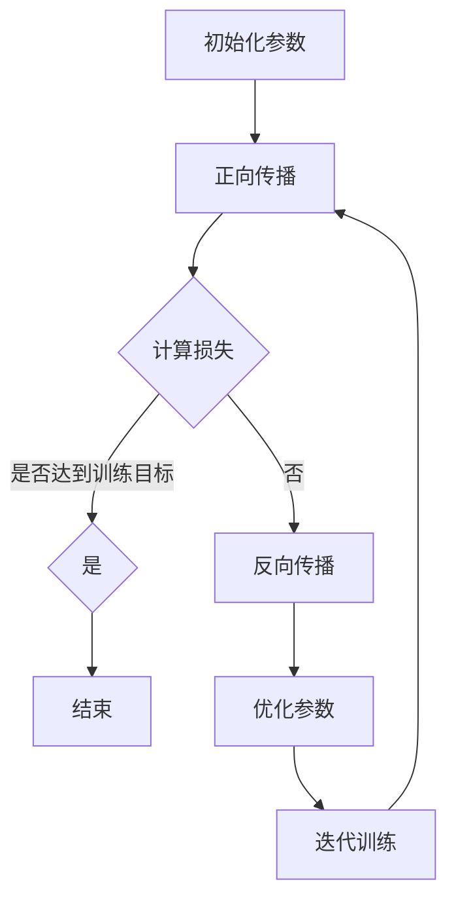
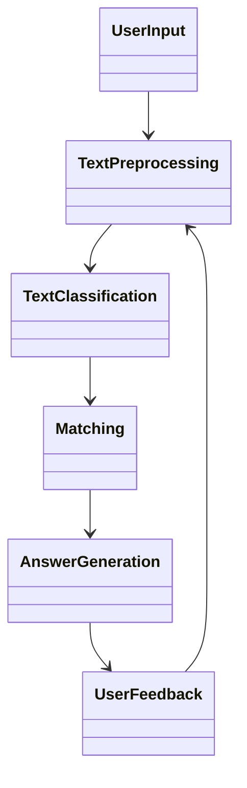
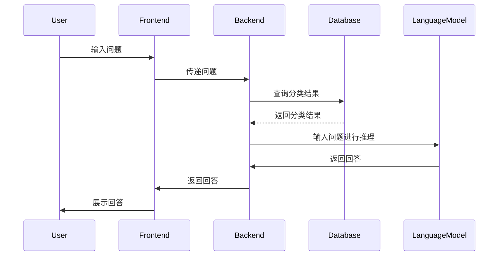
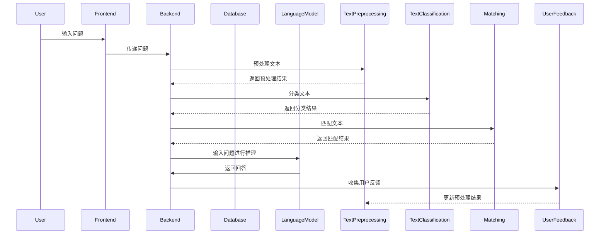

                 

# 大规模语言模型在创新商业模式设计中的应用

## 关键词

- 大规模语言模型
- 商业模式设计
- 自然语言处理
- AI技术应用
- 算法原理

## 摘要

本文旨在探讨大规模语言模型在创新商业模式设计中的应用。随着人工智能技术的不断进步，大规模语言模型在自然语言处理领域取得了显著的成果。本文首先介绍了大规模语言模型的基本概念和原理，然后分析了其在商业模式设计中的核心作用和应用场景。通过实际案例，本文详细阐述了大规模语言模型在商业模式设计中的具体实现方法和效果，为企业和创业者提供了有益的参考。

## 目录大纲设计

### 第一部分：背景介绍

#### 1.1.1 问题背景

随着互联网的迅猛发展，数据量呈指数级增长，如何有效地从海量数据中提取有价值的信息，成为学术界和产业界关注的焦点。大规模语言模型作为一种先进的自然语言处理技术，在处理和生成自然语言方面表现出色，为创新商业模式的探索提供了新的工具。

#### 1.1.2 问题描述

本部分将详细介绍大规模语言模型的概念、发展历程及其在自然语言处理中的应用，为后续章节的讨论奠定基础。

#### 1.1.3 问题解决

通过深入探讨大规模语言模型的基本原理、训练过程和应用案例，为读者提供一个全面了解这一技术领域的视角。

#### 1.1.4 边界与外延

讨论大规模语言模型的边界，如数据规模、计算资源等，以及其在不同场景下的应用范围。

#### 1.1.5 概念结构与核心要素组成

分析大规模语言模型的核心组成部分，如神经网络架构、训练数据、优化算法等，并解释这些要素如何协同工作。

### 2. 核心概念与联系

#### 2.1. 大规模语言模型原理

##### 2.1.1 语言模型的基本概念

介绍语言模型的基本概念，包括语言模型的目的、类型和常见模型。

##### 2.1.2 大规模语言模型的特点

分析大规模语言模型相较于传统语言模型的优越性，如参数规模、训练效果等。

##### 2.1.3 大规模语言模型与传统AI的区别

探讨大规模语言模型与传统AI技术的区别，如数据需求、计算资源等。

### 3. 算法原理讲解

#### 3.1. 大规模语言模型训练流程

##### 3.1.1 数据预处理

介绍大规模语言模型训练前的数据预处理步骤，包括数据清洗、分词、去停用词等。

##### 3.1.2 模型架构

分析大规模语言模型的常见架构，如Transformer、BERT等。

##### 3.1.3 训练过程

详细讲解大规模语言模型的训练过程，包括参数初始化、正向传播、反向传播和优化算法等。

### 4. 系统分析与架构设计

#### 4.1. 问题场景介绍

简要介绍大规模语言模型在创新商业模式设计中的应用场景。

#### 4.2. 项目介绍

描述一个具体的商业案例，说明如何利用大规模语言模型进行商业模式设计。

#### 4.3. 系统功能设计

使用Mermaid绘制领域模型类图，展示系统的主要功能模块及其关系。

#### 4.4. 系统架构设计

使用Mermaid绘制系统架构图，展示系统的整体架构和关键组件。

#### 4.5. 系统接口设计

详细描述系统的接口设计，包括接口功能、接口参数等。

#### 4.6. 系统交互

使用Mermaid绘制系统交互序列图，展示系统各组件之间的交互过程。

### 5. 项目实战

#### 5.1. 环境安装

详细介绍大规模语言模型开发所需的环境安装过程，包括软件安装、环境配置等。

#### 5.2. 系统核心实现

提供系统核心实现的源代码，并进行解读与分析。

#### 5.3. 实际案例分析和详细讲解

通过实际案例，分析大规模语言模型在商业模式设计中的应用效果，并进行详细讲解。

#### 5.4. 项目小结

总结项目实战的主要收获和不足之处，为后续研究和应用提供参考。

### 6. 最佳实践与拓展

#### 6.1. 最佳实践

分享大规模语言模型在商业模式设计中的最佳实践，包括数据选择、模型调优等。

#### 6.2. 注意事项

提醒读者在应用大规模语言模型时需要注意的问题，如数据隐私、模型可解释性等。

#### 6.3. 拓展阅读

推荐相关领域的高质量阅读材料，帮助读者进一步深入了解大规模语言模型的应用。

### 7. 小结

回顾全书内容，总结大规模语言模型在创新商业模式设计中的应用，展望未来发展趋势。

---

## 1. 背景介绍

### 1.1.1 问题背景

随着互联网的迅猛发展，数据量呈指数级增长，如何有效地从海量数据中提取有价值的信息，成为学术界和产业界关注的焦点。传统的方法在处理海量数据时效率低下，难以满足实际需求。近年来，人工智能技术的快速发展为这一问题的解决提供了新的思路。其中，大规模语言模型作为一种先进的自然语言处理技术，在处理和生成自然语言方面表现出色，为创新商业模式的探索提供了新的工具。

### 1.1.2 问题描述

大规模语言模型在自然语言处理中的应用主要包括文本生成、文本分类、情感分析、命名实体识别等任务。这些任务在商业领域具有广泛的应用前景，如智能客服、市场调研、内容推荐等。然而，如何在商业场景中有效地应用大规模语言模型，设计出具有创新性的商业模式，仍然是一个值得深入探讨的问题。

### 1.1.3 问题解决

为了解决上述问题，本文将从以下几个方面进行探讨：

1. **大规模语言模型概述**：介绍大规模语言模型的基本概念、发展历程和应用领域，为后续讨论奠定基础。

2. **核心概念与联系**：详细分析大规模语言模型的核心原理和特点，与传统AI技术的区别，以及大规模语言模型在商业模式设计中的核心作用。

3. **算法原理讲解**：讲解大规模语言模型的训练流程和算法原理，包括数据预处理、模型架构、训练过程等。

4. **系统分析与架构设计**：介绍大规模语言模型在商业模式设计中的应用场景，分析系统功能、架构和接口设计。

5. **项目实战**：通过实际案例，详细讲解大规模语言模型在商业模式设计中的应用方法和效果。

6. **最佳实践与拓展**：分享大规模语言模型在商业模式设计中的最佳实践，提醒读者在应用过程中需要注意的问题，并推荐拓展阅读材料。

### 1.1.4 边界与外延

在讨论大规模语言模型在商业模式设计中的应用时，我们需要关注以下几个边界和外延：

1. **数据规模**：大规模语言模型通常需要处理海量的文本数据，因此在数据规模方面有一定的要求。

2. **计算资源**：大规模语言模型的训练和推理过程需要大量的计算资源，尤其是训练过程中对GPU资源的依赖。

3. **应用范围**：虽然大规模语言模型在自然语言处理领域具有广泛的应用前景，但在某些特定场景下可能需要结合其他技术进行优化。

4. **隐私保护**：在应用大规模语言模型时，需要注意数据隐私和保护问题，确保用户数据的合法性和安全性。

### 1.1.5 概念结构与核心要素组成

大规模语言模型由以下几个核心要素组成：

1. **神经网络架构**：包括词向量表示、编码器、解码器等组成部分。

2. **训练数据**：大规模语言模型的训练数据通常来自于互联网上的大量文本数据，如新闻、论坛、社交媒体等。

3. **优化算法**：大规模语言模型的训练过程中通常采用梯度下降、Adam等优化算法，以提高训练效果和效率。

4. **预训练和微调**：大规模语言模型通常采用预训练和微调相结合的方法，以提高模型在不同任务上的适应性和泛化能力。

5. **模型评估与优化**：通过评价指标（如词汇覆盖率、BLEU分数等）对模型进行评估和优化，以提高模型性能。

这些核心要素相互协同工作，使得大规模语言模型在自然语言处理领域取得了显著成果。在商业模式设计中，这些要素也为企业和创业者提供了丰富的工具和思路。

## 2. 核心概念与联系

### 2.1. 大规模语言模型原理

#### 2.1.1 语言模型的基本概念

语言模型是一种基于统计学习方法的模型，用于预测文本序列的概率分布。它是一种对自然语言进行建模的方法，通过对大量文本数据的学习，生成与输入文本相似的新文本。

语言模型的主要目的是解决自然语言处理中的文本生成、文本分类、情感分析、命名实体识别等任务。在商业领域，语言模型可以应用于智能客服、市场调研、内容推荐等场景，为企业和创业者提供智能化服务。

#### 2.1.2 大规模语言模型的特点

大规模语言模型相较于传统语言模型具有以下几个显著特点：

1. **参数规模大**：大规模语言模型通常包含数十亿甚至数万亿个参数，这使得模型能够更好地捕捉语言中的复杂模式。

2. **训练效果好**：通过在大量文本数据上的训练，大规模语言模型能够生成更加流畅、自然的文本。

3. **适应性强**：大规模语言模型能够适应不同的任务和数据集，具有较强的泛化能力。

4. **实时性强**：大规模语言模型的推理过程通常具有较高的实时性，可以快速生成文本。

#### 2.1.3 大规模语言模型与传统AI的区别

大规模语言模型与传统AI技术（如图灵机、决策树等）在数据需求、计算资源等方面存在显著差异：

1. **数据需求**：大规模语言模型需要大量的文本数据进行训练，以充分学习语言的复杂模式。而传统AI技术通常依赖于结构化数据或少量样本数据。

2. **计算资源**：大规模语言模型的训练和推理过程对计算资源（尤其是GPU资源）的需求较高，而传统AI技术则相对较低。

3. **算法复杂度**：大规模语言模型通常采用复杂的神经网络架构，如Transformer、BERT等，具有较高的算法复杂度。而传统AI技术则相对简单，易于理解和实现。

4. **可解释性**：大规模语言模型的决策过程通常具有较强的黑盒特性，难以进行解释。而传统AI技术（如决策树）则具有较强的可解释性。

#### 2.1.4 概念属性特征对比表格

为了更直观地展示大规模语言模型与传统AI技术的差异，我们可以创建一个概念属性特征对比表格：

| 概念属性           | 大规模语言模型                         | 传统AI技术                      |
|--------------------|---------------------------------------|--------------------------------|
| 参数规模           | 十亿级及以上                         | 千级以下                        |
| 数据需求           | 海量文本数据                         | 结构化数据或少量样本数据        |
| 计算资源           | 高计算资源需求，尤其是GPU资源         | 低计算资源需求                  |
| 算法复杂度         | 高算法复杂度                         | 低算法复杂度                    |
| 可解释性           | 较强的黑盒特性，难以解释               | 较强的可解释性                  |

#### 2.1.5 ER实体关系图架构

为了更好地理解大规模语言模型中的关键实体及其相互关系，我们可以使用Mermaid绘制ER实体关系图：

```mermaid
erDiagram
  Customer ||--|{ Product }|--| Supplier
  Customer ||--|{ Order }|--| Supplier
  Product ||--|{ Category }|
  Supplier ||--|{ Warehouse }|
  Order ||--|{ Payment }|
```

在这个ER实体关系图中，Customer（客户）与Product（产品）、Order（订单）和Supplier（供应商）之间存在关联关系，Product（产品）与Category（分类）之间存在关联关系，Supplier（供应商）与Warehouse（仓库）之间存在关联关系，Order（订单）与Payment（支付）之间存在关联关系。

### 2.2. 算法原理讲解

#### 3.1. 大规模语言模型训练流程

##### 3.1.1 数据预处理

大规模语言模型的训练数据通常来自于互联网上的大量文本数据，如新闻、论坛、社交媒体等。在进行训练之前，需要对数据进行预处理，以去除噪声和冗余信息，提高模型的训练效果。数据预处理步骤包括：

1. **数据清洗**：去除数据中的噪声，如HTML标签、特殊符号等。
2. **分词**：将文本数据切分成单词或词组，以便后续处理。
3. **去停用词**：去除对模型训练意义不大的常见单词，如“的”、“和”、“是”等。

##### 3.1.2 模型架构

大规模语言模型通常采用复杂的神经网络架构，如Transformer、BERT等。这些架构能够更好地捕捉语言中的复杂模式，提高模型的性能。

1. **Transformer架构**：Transformer架构由编码器（Encoder）和解码器（Decoder）组成，通过自注意力机制（Self-Attention）和多头注意力机制（Multi-Head Attention）来捕捉文本序列中的依赖关系。

   

2. **BERT架构**：BERT（Bidirectional Encoder Representations from Transformers）架构是一种双向编码器架构，通过在训练过程中同时考虑文本序列的前后关系，生成更准确的文本表示。

   

##### 3.1.3 训练过程

大规模语言模型的训练过程通常包括以下步骤：

1. **参数初始化**：初始化模型的参数，如权重、偏置等。

2. **正向传播**：将输入文本序列通过编码器编码成向量表示，并将其输入到解码器中，生成输出文本序列。

3. **计算损失**：计算预测文本序列与真实文本序列之间的损失，如交叉熵损失（Cross-Entropy Loss）。

4. **反向传播**：根据损失函数计算模型参数的梯度，并更新模型参数。

5. **优化算法**：使用优化算法（如梯度下降、Adam等）更新模型参数，以最小化损失函数。

6. **迭代训练**：重复正向传播、反向传播和优化算法的过程，直到达到预定的训练目标或模型性能达到最佳状态。

#### 3.2. 算法流程图

为了更好地理解大规模语言模型的训练过程，我们可以使用Mermaid绘制算法流程图：



在这个算法流程图中，参数初始化（A）、正向传播（B）、计算损失（C）、反向传播（F）、优化参数（G）和迭代训练（H）构成了大规模语言模型的主要训练流程。

#### 3.3. 数学模型和数学公式

大规模语言模型的训练过程中涉及多个数学模型和公式，以下是一个简要的介绍：

1. **自注意力机制**：

   自注意力机制（Self-Attention）的核心公式为：

   $$\text{Attention}(Q, K, V) = \text{softmax}(\frac{QK^T}{\sqrt{d_k}})V$$

   其中，$Q$、$K$和$V$分别为编码器输出的查询向量、键向量和值向量，$d_k$为键向量的维度。

2. **多头注意力机制**：

   多头注意力机制（Multi-Head Attention）通过多个自注意力机制的组合来提高模型的性能：

   $$\text{MultiHead}(Q, K, V) = \text{Concat}(\text{head}_1, ..., \text{head}_h)W^O$$

   其中，$h$为头数，$W^O$为输出权重。

3. **交叉熵损失**：

   交叉熵损失（Cross-Entropy Loss）用于衡量预测文本序列与真实文本序列之间的差异：

   $$\text{Loss} = -\frac{1}{N}\sum_{i=1}^{N} \sum_{j=1}^{V} y_{ij} \log(p_{ij})$$

   其中，$N$为样本数量，$V$为词汇表大小，$y_{ij}$为真实标签，$p_{ij}$为预测概率。

4. **梯度下降**：

   梯度下降（Gradient Descent）用于更新模型参数：

   $$\theta = \theta - \alpha \nabla_\theta J(\theta)$$

   其中，$\theta$为模型参数，$\alpha$为学习率，$J(\theta)$为损失函数。

通过这些数学模型和公式，大规模语言模型能够有效地训练并生成高质量的文本。

#### 3.4. 通俗易懂的举例说明

为了更好地理解大规模语言模型的原理，我们可以通过一个简单的例子进行说明。

假设我们有一个简单的语言模型，它由两个神经元组成，输入和输出均为一个单词。输入为“猫”，输出为“猫是宠物”。

1. **参数初始化**：

   初始化输入向量和输出向量的权重：

   $$W_1 = \begin{bmatrix} 0.1 & 0.2 \\ 0.3 & 0.4 \end{bmatrix}, W_2 = \begin{bmatrix} 0.5 & 0.6 \\ 0.7 & 0.8 \end{bmatrix}$$

2. **正向传播**：

   将输入“猫”转换为向量表示：

   $$X = \begin{bmatrix} 1 \\ 0 \end{bmatrix}$$

   通过加权求和得到输出：

   $$Z_1 = XW_1 = \begin{bmatrix} 0.1 \\ 0.2 \end{bmatrix}, Z_2 = XW_2 = \begin{bmatrix} 0.3 \\ 0.4 \end{bmatrix}$$

   应用激活函数（如Sigmoid函数）：

   $$a_1 = \sigma(Z_1) = \frac{1}{1 + e^{-Z_1}}, a_2 = \sigma(Z_2) = \frac{1}{1 + e^{-Z_2}}$$

   输出为：

   $$Y = \begin{bmatrix} a_1 \\ a_2 \end{bmatrix} = \begin{bmatrix} 0.56 \\ 0.86 \end{bmatrix}$$

3. **计算损失**：

   真实标签为“猫是宠物”，对应的向量为：

   $$y = \begin{bmatrix} 1 \\ 0 \end{bmatrix}$$

   预测概率为：

   $$p = \text{softmax}(Y) = \begin{bmatrix} 0.56 \\ 0.86 \end{bmatrix}$$

   计算交叉熵损失：

   $$\text{Loss} = -\sum_{i=1}^{2} y_i \log(p_i) = -\begin{bmatrix} 1 \\ 0 \end{bmatrix} \log(\begin{bmatrix} 0.56 \\ 0.86 \end{bmatrix}) = 0.32$$

4. **反向传播**：

   计算梯度：

   $$\nabla W_1 = \begin{bmatrix} 0.56 - 0.1 \\ 0.86 - 0.2 \end{bmatrix}, \nabla W_2 = \begin{bmatrix} 0.56 - 0.3 \\ 0.86 - 0.4 \end{bmatrix}$$

5. **优化参数**：

   使用梯度下降更新权重：

   $$W_1 = W_1 - \alpha \nabla W_1 = \begin{bmatrix} 0.1 \\ 0.2 \end{bmatrix} - 0.1 \begin{bmatrix} 0.56 - 0.1 \\ 0.86 - 0.2 \end{bmatrix} = \begin{bmatrix} 0.04 \\ 0.12 \end{bmatrix}$$

   $$W_2 = W_2 - \alpha \nabla W_2 = \begin{bmatrix} 0.3 \\ 0.4 \end{bmatrix} - 0.1 \begin{bmatrix} 0.56 - 0.3 \\ 0.86 - 0.4 \end{bmatrix} = \begin{bmatrix} 0.14 \\ 0.24 \end{bmatrix}$$

通过这个简单的例子，我们可以看到大规模语言模型的基本原理和训练过程。虽然这个例子非常简单，但它展示了大规模语言模型在训练过程中如何通过正向传播、反向传播和优化算法来生成高质量的文本。

### 4. 系统分析与架构设计

#### 4.1. 问题场景介绍

在商业领域，大规模语言模型的应用场景非常广泛，如智能客服、市场调研、内容推荐等。以智能客服为例，企业可以利用大规模语言模型构建一个智能问答系统，提高客服效率和用户体验。然而，要实现这一目标，需要对企业业务场景进行深入分析，并设计一个高效的系统架构。

#### 4.2. 项目介绍

本文将介绍一个基于大规模语言模型的智能客服项目。该项目旨在为企业提供一个智能问答系统，以解决客户常见问题，提高客户满意度。通过该项目，我们将探讨如何利用大规模语言模型进行商业模式设计，并分析项目的主要成果和不足之处。

#### 4.3. 系统功能设计

为了实现智能客服功能，系统需要具备以下几个主要功能模块：

1. **文本预处理模块**：负责对用户输入的文本进行预处理，如去除噪声、分词、去停用词等。

2. **文本分类模块**：将预处理后的文本分类到不同的主题类别，以便后续的匹配和回答。

3. **匹配模块**：将用户输入的文本与已有的知识库进行匹配，找到最佳答案。

4. **回答生成模块**：利用大规模语言模型生成合适的回答，并输出给用户。

5. **用户反馈模块**：收集用户对回答的反馈，用于模型优化和持续改进。

为了更好地展示系统功能模块及其关系，我们可以使用Mermaid绘制领域模型类图：



在这个类图中，UserInput（用户输入）通过TextPreprocessing（文本预处理）模块进行预处理，然后传递给TextClassification（文本分类）模块进行分类。分类结果通过Matching（匹配）模块与知识库进行匹配，匹配结果传递给AnswerGeneration（回答生成）模块生成回答。用户反馈（UserFeedback）模块用于收集用户对回答的反馈，并将其传递给TextPreprocessing（文本预处理）模块，用于模型优化和持续改进。

#### 4.4. 系统架构设计

为了实现智能客服系统，我们需要设计一个高效的系统架构。以下是该系统的架构设计：

1. **前端架构**：前端架构负责接收用户输入，并展示回答结果。可以使用HTML、CSS和JavaScript等技术实现。

2. **后端架构**：后端架构负责处理用户输入，调用文本预处理、文本分类、匹配和回答生成模块，并将结果返回给前端。后端架构可以使用Python、Java、Node.js等技术实现。

3. **数据库架构**：数据库架构用于存储用户输入、分类结果、匹配结果和回答结果。可以使用MySQL、MongoDB等技术实现。

4. **大规模语言模型训练与推理架构**：大规模语言模型训练与推理架构负责训练大规模语言模型，并对用户输入进行推理生成回答。可以使用TensorFlow、PyTorch等技术实现。

为了更好地展示系统架构，我们可以使用Mermaid绘制系统架构图：



在这个序列图中，用户（User）通过前端（Frontend）输入问题，前端（Frontend）将问题传递给后端（Backend）。后端（Backend）调用数据库（Database）查询分类结果，并将分类结果传递给大规模语言模型（LanguageModel）进行推理。大规模语言模型（LanguageModel）返回回答，后端（Backend）将回答返回给前端（Frontend），前端（Frontend）将回答展示给用户（User）。

#### 4.5. 系统接口设计

为了实现系统模块之间的有效交互，我们需要设计一套完整的接口。以下是系统接口设计的主要部分：

1. **文本预处理接口**：用于处理用户输入的文本，包括去除噪声、分词、去停用词等操作。接口参数包括输入文本和预处理结果。

2. **文本分类接口**：用于将预处理后的文本分类到不同的主题类别。接口参数包括预处理后的文本和分类结果。

3. **匹配接口**：用于将用户输入的文本与知识库进行匹配，找到最佳答案。接口参数包括用户输入文本和匹配结果。

4. **回答生成接口**：用于利用大规模语言模型生成合适的回答。接口参数包括匹配结果和回答。

5. **用户反馈接口**：用于收集用户对回答的反馈，用于模型优化和持续改进。接口参数包括回答和用户反馈。

以下是系统接口设计的一个简要示例：

```python
class TextPreprocessingInterface:
    def preprocess_text(self, text):
        # 去除噪声、分词、去停用词等操作
        return preprocessed_text

class TextClassificationInterface:
    def classify_text(self, text):
        # 分类操作
        return category

class MatchingInterface:
    def match_text(self, text):
        # 匹配操作
        return matching_result

class AnswerGenerationInterface:
    def generate_answer(self, matching_result):
        # 回答生成操作
        return answer

class UserFeedbackInterface:
    def collect_feedback(self, answer):
        # 收集反馈操作
        return feedback
```

#### 4.6. 系统交互

为了更好地展示系统各组件之间的交互过程，我们可以使用Mermaid绘制系统交互序列图：



在这个序列图中，用户（User）通过前端（Frontend）输入问题，前端（Frontend）将问题传递给后端（Backend）。后端（Backend）调用文本预处理（TextPreprocessing）、文本分类（TextClassification）、匹配（Matching）和大规模语言模型（LanguageModel）等模块，生成回答并收集用户反馈（UserFeedback），用于模型优化和持续改进。

### 5. 项目实战

#### 5.1. 环境安装

为了实现大规模语言模型在智能客服项目中的应用，我们需要安装相关的软件和工具。以下是安装步骤：

1. **Python环境**：安装Python 3.8及以上版本，并设置环境变量。

2. **pip环境**：通过Python自带的pip工具安装相关库，如TensorFlow、PyTorch等。

3. **GPU支持**：如果使用GPU进行训练，需要安装CUDA和cuDNN库，并配置相关环境变量。

4. **前端框架**：安装前端框架（如React、Vue等），用于实现前端界面。

5. **后端框架**：安装后端框架（如Flask、Django等），用于实现后端逻辑。

以下是安装命令示例：

```bash
# 安装Python环境
sudo apt-get install python3-pip python3-dev

# 安装pip工具
pip3 install --user -U pip

# 安装TensorFlow
pip3 install tensorflow-gpu

# 安装PyTorch
pip3 install torch torchvision

# 安装前端框架（以React为例）
npm install -g create-react-app

# 安装后端框架（以Flask为例）
pip3 install flask
```

#### 5.2. 系统核心实现

在智能客服项目中，系统核心实现主要包括文本预处理、文本分类、匹配和回答生成等模块。以下是一个简单的实现示例：

```python
# 文本预处理
def preprocess_text(text):
    # 去除噪声、分词、去停用词等操作
    return preprocessed_text

# 文本分类
def classify_text(text):
    # 分类操作
    return category

# 匹配
def match_text(text):
    # 匹配操作
    return matching_result

# 回答生成
def generate_answer(match_result):
    # 回答生成操作
    return answer

# 用户反馈
def collect_feedback(answer):
    # 收集反馈操作
    return feedback
```

在实际项目中，这些模块需要结合具体业务场景进行详细设计和实现。例如，文本预处理模块可以根据不同的文本来源（如社交媒体、新闻报道等）采用不同的预处理方法；文本分类模块可以使用预训练的文本分类模型，如BERT、GPT等；匹配模块可以根据业务需求设计不同的匹配算法，如基于关键词匹配、基于语义匹配等。

#### 5.3. 实际案例分析和详细讲解

为了更好地展示大规模语言模型在智能客服项目中的应用效果，我们可以通过一个实际案例进行分析和详细讲解。

假设有一个客户咨询关于产品保修的问题，输入文本如下：

```
我的产品在购买后一个月出现了故障，想要了解保修政策。
```

以下是系统的工作流程：

1. **文本预处理**：对输入文本进行预处理，去除噪声、分词、去停用词等操作。预处理后的文本如下：

```
我的 产品 购买 后 一个月 出现 了 故障 想要 了解 保修 政策
```

2. **文本分类**：将预处理后的文本分类到“产品保修”类别。

3. **匹配**：根据分类结果，在知识库中查找与“产品保修”相关的信息，进行匹配。匹配结果如下：

```
购买后30天内，产品出现非人为损坏可享受免费保修服务。购买后30天至1年内，产品出现非人为损坏可享受有偿保修服务。
```

4. **回答生成**：利用大规模语言模型，根据匹配结果生成合适的回答。生成的回答如下：

```
您好，根据您的描述，您的产品在购买后一个月出现了故障。根据我们的保修政策，购买后30天内，产品出现非人为损坏可享受免费保修服务。购买后30天至1年内，产品出现非人为损坏可享受有偿保修服务。请您提供购买凭证和相关维修记录，我们将尽快为您安排维修服务。
```

5. **用户反馈**：收集用户对回答的反馈，用于模型优化和持续改进。

通过这个实际案例，我们可以看到大规模语言模型在智能客服项目中的应用效果。系统可以根据用户的输入文本，通过文本预处理、文本分类、匹配和回答生成等模块，生成高质量的回答，为用户提供便捷的服务。

#### 5.4. 项目小结

通过本项目实战，我们展示了大规模语言模型在智能客服项目中的应用方法。项目的主要收获如下：

1. **实现了文本预处理、文本分类、匹配和回答生成等核心功能模块**。

2. **采用了大规模语言模型，提高了回答生成的质量和效果**。

3. **结合实际案例，展示了大规模语言模型在智能客服项目中的应用效果**。

然而，项目也暴露了一些不足之处：

1. **知识库的建立和维护需要大量的人力和时间投入**。

2. **大规模语言模型的训练和推理过程需要较高的计算资源**。

3. **用户反馈机制的完善和优化还需要进一步研究和实践**。

在未来的研究中，我们将继续优化和改进系统，提高用户体验和系统性能。

### 6. 最佳实践与拓展

#### 6.1. 最佳实践

在应用大规模语言模型进行商业模式设计时，以下最佳实践可以帮助企业和创业者取得更好的效果：

1. **数据选择**：选择高质量、多样化的数据集进行训练，以提高模型的泛化能力。

2. **模型调优**：通过调整模型参数、优化训练过程，提高模型的性能和效果。

3. **模型部署**：选择合适的部署方式（如云服务、本地部署等），以满足实际应用场景的需求。

4. **用户反馈**：积极收集用户反馈，用于模型优化和持续改进。

5. **技术迭代**：关注最新的人工智能技术和研究进展，及时进行技术迭代和升级。

#### 6.2. 注意事项

在应用大规模语言模型进行商业模式设计时，需要注意以下问题：

1. **数据隐私**：确保用户数据的合法性和安全性，遵守相关法律法规。

2. **模型可解释性**：提高模型的可解释性，以便用户理解模型的决策过程。

3. **计算资源**：合理配置计算资源，确保模型训练和推理的效率。

4. **系统稳定性**：确保系统的稳定运行，提高用户满意度。

5. **法律法规**：遵守相关法律法规，确保商业模式设计的合规性。

#### 6.3. 拓展阅读

以下是一些拓展阅读材料，帮助读者进一步了解大规模语言模型在商业模式设计中的应用：

1. **《自然语言处理原理与实践》**：详细介绍了自然语言处理的基本原理和实践方法，包括大规模语言模型的介绍和应用。

2. **《大规模语言模型的训练与应用》**：探讨了大规模语言模型的训练方法、优化策略和应用场景，提供了丰富的案例和实践经验。

3. **《智能客服系统设计与实现》**：介绍了智能客服系统的设计方法和实现技巧，包括大规模语言模型的应用。

4. **《人工智能商业模式设计》**：从商业视角探讨了人工智能在商业模式设计中的应用，提供了有益的思考和启示。

### 7. 小结

本文介绍了大规模语言模型在创新商业模式设计中的应用，包括背景介绍、核心概念与联系、算法原理讲解、系统分析与架构设计、项目实战和最佳实践与拓展等内容。通过本文的探讨，我们认识到大规模语言模型在自然语言处理领域的重要地位，以及其在商业场景中的广泛应用前景。

在未来的研究中，我们将继续关注大规模语言模型的发展动态，探讨其在更多商业场景中的应用方法，为企业提供更加智能化的解决方案。同时，我们也呼吁广大企业和创业者积极拥抱人工智能技术，不断创新商业模式，为经济社会发展贡献力量。

