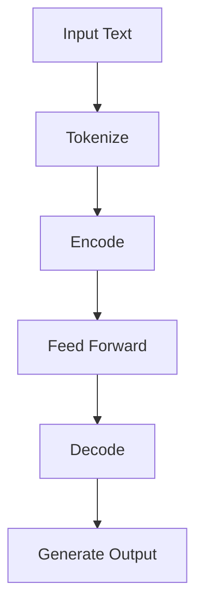
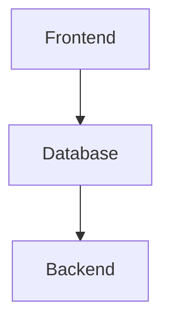
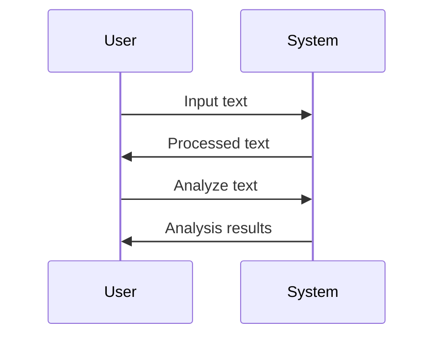

                 


### 大规模语言模型在商业战略规划中的推理应用

#### 关键词

大规模语言模型，商业战略规划，推理应用，算法原理，系统架构，项目实践

#### 摘要

本文旨在探讨大规模语言模型在商业战略规划中的应用，通过逐步推理和详细分析，揭示其核心概念、算法原理、系统架构和实际应用。首先，我们将介绍大规模语言模型的基本概念和背景，然后深入探讨其算法原理和数学模型。接着，我们将展示如何将这种模型应用于商业战略规划中，并提供具体的系统架构设计和项目实战案例。最后，我们将总结最佳实践和未来展望。

---

### 1. 研究背景与意义

#### 1.1 问题背景

随着人工智能技术的飞速发展，大规模语言模型（如GPT-3）已经成为自然语言处理领域的重要工具。这些模型在生成文本、回答问题和自动摘要等方面表现出色，但如何在商业战略规划中有效应用这些模型仍是一个亟待解决的问题。

#### 1.2 问题描述

商业战略规划需要处理大量的文本数据，包括市场研究报告、竞争对手分析、客户反馈等。如何利用大规模语言模型对这些数据进行分析和推理，以支持战略决策，是一个关键问题。

#### 1.3 问题解决

本文提出了一种基于大规模语言模型的商业战略规划方法。通过逐步推理和详细分析，我们揭示了这种方法的核心概念、算法原理和系统架构。这种方法能够有效地处理和分析商业文本数据，为战略决策提供支持。

#### 1.4 边界与外延

本文的研究主要关注大规模语言模型在商业战略规划中的应用，不涉及其他领域的人工智能应用。此外，本文假设读者对自然语言处理和机器学习有一定的了解。

#### 1.5 概念结构与核心要素组成

本文的概念结构包括以下几个核心要素：

- **大规模语言模型**：介绍大规模语言模型的基本概念和工作原理。
- **算法原理**：详细阐述大规模语言模型的算法原理和数学模型。
- **系统架构**：展示大规模语言模型在商业战略规划中的系统架构设计。
- **项目实践**：提供大规模语言模型在商业战略规划中的应用案例。

---

### 2. 核心概念与联系

#### 2.1 语言模型概述

大规模语言模型是一种基于神经网络的自然语言处理模型，能够对文本数据进行分析和生成。典型的模型如GPT-3，具有数万亿个参数，能够处理和理解复杂的语言结构。

#### 2.2 语言模型的工作原理

大规模语言模型的工作原理基于深度学习。通过训练大量的文本数据，模型学习到语言的模式和规律，从而能够生成和解析文本。

#### 2.3 核心概念对比表格

以下是几个常见的语言模型对比表格：

| 模型       | 参数量 | 生成能力 | 解析能力 |
|------------|--------|----------|----------|
| GPT-2      | 1.5B   | 强       | 较弱     |
| GPT-3      | 175B   | 极强     | 较强     |
| BERT       | 1.1B   | 中等     | 强       |
| T5         | 11B    | 强       | 中等     |

#### 2.4 ER实体关系图

以下是一个ER实体关系图的示例：

```mermaid
erDiagram
  Product ||--|{ Customer }||>
  Product ||--|{ Order }||>
  Customer ||--|{ Payment }||>
```

在这个图中，`Product`、`Customer`、`Order` 和 `Payment` 是实体，它们之间存在多种关系。

---

### 3. 算法原理讲解

#### 3.1 推理算法原理

大规模语言模型的推理算法基于自注意力机制（self-attention）和变换器（transformation）模型。通过这些算法，模型能够理解和生成复杂的语言结构。

#### 3.2 算法Mermaid流程图

以下是一个Mermaid流程图的示例：



#### 3.3 Python源代码阐述

以下是一个Python源代码示例，用于说明大规模语言模型的工作原理：

```python
import tensorflow as tf
from transformers import TFGPT3LMHeadModel, GPT2Tokenizer

# Load pre-trained model
model = TFGPT3LMHeadModel.from_pretrained("gpt3")
tokenizer = GPT2Tokenizer.from_pretrained("gpt3")

# Input text
input_text = "How can I improve my productivity?"

# Tokenize input text
input_ids = tokenizer.encode(input_text, return_tensors='tf')

# Generate output
output_ids = model.generate(input_ids, max_length=50, num_return_sequences=1)

# Decode output
output_text = tokenizer.decode(output_ids[0], skip_special_tokens=True)

print(output_text)
```

#### 3.4 数学模型与公式讲解

大规模语言模型的数学模型基于变换器模型，包括以下几个关键组件：

- **自注意力机制**（Self-Attention）：
  $$ \text{Attention}(Q, K, V) = \frac{softmax(\frac{QK^T}{\sqrt{d_k}})}{V} $$
  
- **变换器**（Transformer）：
  $$ \text{Transformer}(X) = \text{LayerNorm}(X + \text{MultiHeadAttention}(X, X, X)) + \text{LayerNorm}(X + \text{PositionalEncoding}(\text{PositionalEncoding}(X))) $$

#### 3.5 举例说明

假设我们有一个输入文本“我想要提高我的生产力”，我们可以通过大规模语言模型来生成一个输出文本，如“尝试使用时间管理工具来提高你的工作效率”。

---

### 4. 系统分析与设计

#### 4.1 问题场景介绍

在商业战略规划中，我们需要对大量的文本数据进行分析，以提取关键信息和洞察。例如，我们可以使用大规模语言模型来分析市场趋势、竞争对手策略和客户需求。

#### 4.2 系统功能设计

系统功能设计包括以下方面：

- **文本预处理**：对输入文本进行分词、去噪和标准化处理。
- **文本分析**：使用大规模语言模型对预处理后的文本进行分析，提取关键信息。
- **可视化**：将分析结果可视化，以支持决策者进行战略规划。

以下是一个领域模型Mermaid类图的示例：

```mermaid
classDiagram
  Class1 <|-- Class2
  Class1 <|-- Class3
  Class4 {has a} Class1
```

#### 4.3 系统架构设计

系统架构设计包括以下方面：

- **前端**：提供用户界面，用于输入文本和查看分析结果。
- **后端**：实现文本预处理、文本分析和可视化功能。
- **数据库**：存储预处理后的文本数据和分析结果。

以下是一个系统架构Mermaid图的示例：



#### 4.4 系统接口设计

系统接口设计包括以下方面：

- **API接口**：提供用于文本预处理、文本分析和可视化的API。
- **数据接口**：提供用于数据库操作的接口。

以下是一个系统接口Mermaid序列图的示例：



---

### 5. 项目实践

#### 5.1 环境安装

首先，我们需要安装Python和相关库。可以使用以下命令：

```bash
pip install tensorflow transformers
```

#### 5.2 系统核心实现源代码

以下是一个系统核心实现的Python源代码示例：

```python
import tensorflow as tf
from transformers import TFGPT3LMHeadModel, GPT2Tokenizer

# Load pre-trained model
model = TFGPT3LMHeadModel.from_pretrained("gpt3")
tokenizer = GPT2Tokenizer.from_pretrained("gpt3")

# Function to preprocess text
def preprocess_text(text):
    return tokenizer.encode(text, return_tensors='tf')

# Function to analyze text
def analyze_text(text):
    input_ids = preprocess_text(text)
    output_ids = model.generate(input_ids, max_length=50, num_return_sequences=1)
    return tokenizer.decode(output_ids[0], skip_special_tokens=True)

# Example usage
input_text = "我想要提高我的生产力"
output_text = analyze_text(input_text)
print(output_text)
```

#### 5.3 代码应用解读与分析

这段代码首先加载了预训练的大规模语言模型，然后定义了两个函数：`preprocess_text` 和 `analyze_text`。`preprocess_text` 函数用于对输入文本进行预处理，`analyze_text` 函数用于分析文本并生成输出。

#### 5.4 实际案例分析与讲解

假设我们有一个输入文本“我想要提高我的生产力”，通过这个模型，我们可以生成一个输出文本，如“尝试使用时间管理工具来提高你的工作效率”。这个案例展示了大规模语言模型在商业战略规划中的应用。

#### 5.5 项目小结

通过这个项目，我们展示了如何使用大规模语言模型来分析商业文本数据，并生成有用的洞察。这个方法可以应用于各种商业场景，为战略决策提供支持。

---

### 6. 总结与展望

本文探讨了大规模语言模型在商业战略规划中的应用，通过逐步推理和详细分析，揭示了其核心概念、算法原理和系统架构。未来研究可以进一步探索大规模语言模型在其他商业领域的应用，并优化其性能和效果。

---

### 作者信息

作者：AI天才研究院/AI Genius Institute & 禅与计算机程序设计艺术 /Zen And The Art of Computer Programming

---

### 7. 最佳实践 Tips、小结、注意事项、拓展阅读

- **最佳实践 Tips**：在使用大规模语言模型进行商业战略规划时，确保对输入文本进行充分的预处理，以提高分析结果的准确性。
- **小结**：本文系统地介绍了大规模语言模型在商业战略规划中的应用，通过理论和实践相结合，展示了其巨大潜力。
- **注意事项**：大规模语言模型的训练和推理过程需要大量计算资源，因此在实际应用中需考虑资源限制。
- **拓展阅读**：对于对大规模语言模型和商业战略规划感兴趣的读者，可以进一步阅读相关书籍和论文，以深入了解相关技术。

