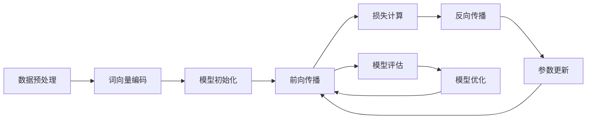
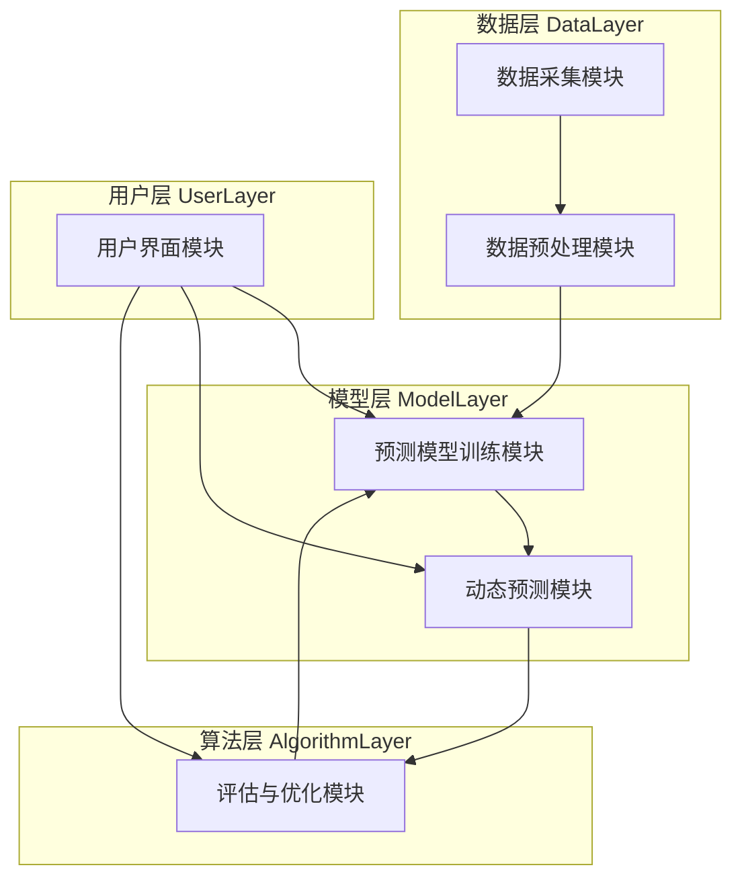
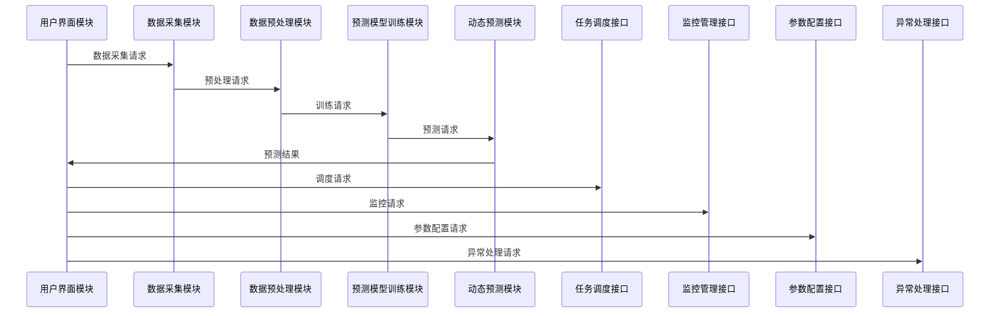

                 

### 第一部分：大规模语言模型概述

#### 引言

在现代信息技术和人工智能领域，大规模语言模型（Large-scale Language Models）已经成为了数据处理和自然语言处理（NLP）中不可或缺的工具。特别是在复杂系统的动态预测中，大规模语言模型展示了其强大的能力和广阔的应用前景。本文将围绕这一主题，详细探讨大规模语言模型的基本概念、技术原理及其在复杂系统动态预测中的应用。

在文章的第一部分，我们将首先概述大规模语言模型的基本概念，并深入探讨其在复杂系统动态预测中的应用需求。接着，我们将介绍大规模语言模型的技术原理，包括其构建流程和应用方法。最后，我们将探讨大规模语言模型的边界与外延，分析其适用范围、优势与局限，以及未来发展趋势。通过这些内容的介绍，读者可以初步了解大规模语言模型的背景和重要性。

#### 关键词

- 大规模语言模型
- 自然语言处理
- 复杂系统
- 动态预测
- 人工智能
- 技术原理
- 应用需求
- 发展趋势

#### 摘要

本文旨在探讨大规模语言模型在复杂系统动态预测中的应用。首先，介绍了大规模语言模型的基本概念，包括其背景、定义和主要特征。然后，分析了大规模语言模型在复杂系统动态预测中的作用和需求。随后，详细阐述了大规模语言模型的技术原理，包括其构建流程、核心算法和数学模型。接着，探讨了大规模语言模型的适用范围、优势与局限，并展望了其未来发展趋势。最后，通过实际案例分析和详细讲解，展示了大规模语言模型在复杂系统动态预测中的具体应用和实施过程。本文旨在为读者提供全面、深入的关于大规模语言模型在复杂系统动态预测中应用的了解。

### 第1章：大规模语言模型的基本概念

#### 1.1 问题背景

##### 1.1.1 复杂系统的动态特性

复杂系统通常指的是由大量相互作用的个体或组件组成的系统，这些个体或组件之间的关系复杂，具有高度的非线性特性。复杂系统的动态特性表现在其状态随时间不断变化，且这种变化往往难以预测。在工程、生物、社会等多个领域，复杂系统的动态行为都是研究的重点。例如，在工程领域，建筑结构在地震作用下的响应、电力系统的不稳定运行等问题；在生物领域，生态系统的演变、疾病传播等过程；在社会领域，经济波动、社会运动的演化等，都是典型的复杂系统动态问题。

##### 1.1.2 语言模型在预测中的应用需求

随着信息技术的发展，数据驱动的预测方法在复杂系统的研究中越来越重要。语言模型作为自然语言处理的核心工具，能够对大量的文本数据进行分析和处理，提取出隐藏在数据中的规律和模式。在复杂系统动态预测中，语言模型的应用需求主要体现在以下几个方面：

1. **数据分析与特征提取**：通过语言模型，可以从复杂系统的各类文本数据中提取出关键特征，为预测提供基础信息。
2. **趋势预测**：语言模型能够捕捉到文本数据中的趋势变化，从而对复杂系统的未来状态进行预测。
3. **事件检测**：在复杂系统的运行过程中，往往伴随着各类事件的发生。语言模型能够实时监测这些事件，并提前预警。

##### 1.1.3 大规模语言模型的出现背景

大规模语言模型的产生背景主要源于以下几个方面：

1. **数据量的爆炸增长**：随着互联网和大数据技术的发展，各类复杂系统产生了海量的文本数据，传统的语言模型已经难以处理这些大规模数据。
2. **计算能力的提升**：近年来，计算能力的飞速提升，尤其是GPU和TPU等专用硬件的普及，为大规模语言模型的训练和推理提供了强大的计算支持。
3. **深度学习技术的进步**：深度学习技术的发展，特别是神经网络和递归神经网络（RNN）的引入，使得大规模语言模型的训练变得更加高效和准确。

#### 1.2 问题描述

##### 1.2.1 复杂系统的定义与特征

复杂系统是指由众多相互作用的个体或组件组成的系统，其行为和状态受系统内部和外部多种因素的影响。复杂系统的特征包括：

1. **非线性**：系统内部各组件之间的相互作用往往是非线性的，导致系统行为复杂多变。
2. **动态性**：系统状态随时间变化，且变化过程具有不确定性和随机性。
3. **多层次**：复杂系统通常涉及多个层次和维度，每个层次和维度之间的相互作用决定了系统的整体行为。

##### 1.2.2 动态预测的基本问题

动态预测是指对复杂系统在特定条件下未来的状态进行预测。动态预测的基本问题包括：

1. **数据稀缺**：复杂系统的数据通常有限，尤其是高质量、高维度的数据。
2. **模式复杂**：复杂系统的动态行为通常包含多种模式和规律，难以用简单的模型进行描述。
3. **不确定性**：复杂系统的状态变化存在很大的不确定性，预测结果难以准确。

##### 1.2.3 大规模语言模型的作用与意义

大规模语言模型在复杂系统动态预测中的作用和意义主要体现在以下几个方面：

1. **数据处理**：大规模语言模型能够高效处理大规模文本数据，提取出关键特征，为预测提供基础信息。
2. **模式发现**：通过分析大量文本数据，大规模语言模型能够发现复杂系统的潜在模式和规律，提高预测的准确性。
3. **实时监测**：大规模语言模型可以实时监测复杂系统的运行状态，提前发现异常和潜在问题，提供预警和决策支持。

#### 1.3 解决方法

##### 1.3.1 大规模语言模型的技术原理

大规模语言模型的技术原理主要基于深度学习和自然语言处理技术。其核心思想是通过大规模数据训练，构建一个能够理解自然语言的模型，从而实现文本数据的自动处理和分析。具体技术原理包括：

1. **词向量表示**：通过将文本数据转换为词向量，使得模型能够理解词汇的语义信息。
2. **神经网络架构**：使用多层神经网络（如Transformer）对词向量进行处理，提取文本数据的深层特征。
3. **训练与优化**：通过大量文本数据进行模型训练，优化模型的参数，提高模型的预测能力。

##### 1.3.2 大规模语言模型的构建流程

大规模语言模型的构建流程主要包括以下几个步骤：

1. **数据准备**：收集和清洗大规模文本数据，确保数据的质量和完整性。
2. **词向量转换**：将文本数据转换为词向量，使用预训练的词向量模型或自己训练的词向量。
3. **模型构建**：选择合适的神经网络架构，构建大规模语言模型，如Transformer、BERT等。
4. **模型训练**：使用大规模文本数据对模型进行训练，调整模型参数，优化模型性能。
5. **模型评估**：通过测试集评估模型的预测性能，调整模型参数，确保模型的高准确性。

##### 1.3.3 大规模语言模型在复杂系统预测中的应用

大规模语言模型在复杂系统预测中的应用主要包括以下几个方面：

1. **数据分析**：通过大规模语言模型对复杂系统的文本数据进行分析，提取关键特征。
2. **趋势预测**：使用大规模语言模型预测复杂系统的未来状态，包括趋势变化和关键事件。
3. **实时监测**：通过大规模语言模型实时监测复杂系统的运行状态，提前预警潜在问题。
4. **决策支持**：结合大规模语言模型的预测结果，为复杂系统的运行和管理提供决策支持。

#### 1.4 边界与外延

##### 1.4.1 大规模语言模型的适用范围

大规模语言模型在复杂系统动态预测中的应用范围非常广泛，主要包括：

1. **工程领域**：如建筑结构、电力系统等复杂系统的动态预测。
2. **生物领域**：如生态系统、疾病传播等复杂系统的动态预测。
3. **社会领域**：如经济波动、社会运动等复杂系统的动态预测。

##### 1.4.2 大规模语言模型的优势与局限

大规模语言模型的优势包括：

1. **高效数据处理**：能够处理大规模文本数据，提取关键特征。
2. **准确模式发现**：能够发现复杂系统的潜在模式和规律，提高预测准确性。
3. **实时监测与预警**：能够实时监测复杂系统的运行状态，提前预警潜在问题。

然而，大规模语言模型也存在一定的局限：

1. **数据依赖**：模型的性能高度依赖于数据质量和数量，数据不足可能导致预测不准确。
2. **计算资源消耗**：大规模语言模型的训练和推理需要大量的计算资源，对硬件要求较高。
3. **泛化能力有限**：模型可能仅对特定类型的数据有较好的表现，泛化能力有限。

##### 1.4.3 大规模语言模型的发展趋势

随着人工智能和深度学习技术的不断进步，大规模语言模型在复杂系统动态预测中的应用前景将更加广阔。未来的发展趋势包括：

1. **模型优化**：通过算法和架构的改进，提高大规模语言模型的性能和效率。
2. **数据多样性**：扩展模型对多样化数据的处理能力，提高模型的泛化能力。
3. **实时预测**：通过优化计算和模型架构，实现大规模语言模型的实时预测和监测。

#### 1.5 概念结构与核心要素组成

##### 1.5.1 大规模语言模型的核心概念

大规模语言模型的核心概念包括：

1. **词向量**：将文本数据转换为词向量，表示词汇的语义信息。
2. **神经网络架构**：使用多层神经网络对词向量进行处理，提取文本数据的深层特征。
3. **预训练与微调**：通过大规模数据预训练模型，然后针对特定任务进行微调。

##### 1.5.2 大规模语言模型的关键技术

大规模语言模型的关键技术包括：

1. **词嵌入**：将词汇转换为向量表示，用于神经网络处理。
2. **注意力机制**：在神经网络中引入注意力机制，关注文本数据中的关键信息。
3. **多层神经网络**：使用多层神经网络处理文本数据，提取深层特征。

##### 1.5.3 大规模语言模型的核心算法

大规模语言模型的核心算法包括：

1. **Transformer**：一种基于自注意力机制的神经网络架构，用于文本数据处理。
2. **BERT**：一种双向编码表示模型，通过预训练和微调实现文本数据的理解和生成。
3. **GPT**：一种生成预训练模型，能够生成高质量的文本内容。

#### 1.6 本章小结

本章对大规模语言模型的基本概念进行了详细的介绍，包括其背景、定义、技术原理和应用需求。通过分析复杂系统的动态特性和语言模型的应用需求，我们了解了大规模语言模型在复杂系统动态预测中的重要性和优势。同时，本章还介绍了大规模语言模型的构建流程和应用方法，以及其边界与外延，为后续章节的深入探讨奠定了基础。

### 第2章：大规模语言模型的基本原理

#### 引言

在前一章中，我们介绍了大规模语言模型的基本概念，并探讨了其在复杂系统动态预测中的应用需求。在本章中，我们将进一步深入探讨大规模语言模型的基本原理，包括其核心概念、技术原理以及与自然语言处理的关系。通过这些内容的介绍，我们将为读者提供更加全面和深入的理解，以便更好地掌握大规模语言模型的工作机制和应用方法。

#### 2.1 核心概念原理

##### 2.1.1 语言模型的定义

语言模型（Language Model）是自然语言处理（Natural Language Processing，NLP）领域中的一个基本概念，它用于预测一段文本的下一个单词或字符。一个典型的语言模型会基于大量的文本数据，统计每个单词或字符在文本中出现的概率，从而生成语言的概率分布。例如，在一段文本中，如果我们知道前一个单词是“人工智能”，那么语言模型会根据统计数据预测下一个单词可能是“技术”、“应用”等。

##### 2.1.2 语言模型的属性特征

语言模型具有以下几个重要的属性特征：

1. **概率性**：语言模型的核心任务是预测文本的概率分布，因此它必须是一个概率模型。
2. **统计性**：语言模型通常基于统计方法，如最大熵模型、n-gram模型等，通过对大量文本数据进行分析和统计，得到模型参数。
3. **序列性**：语言模型处理的文本数据是序列数据，模型需要考虑序列中每个单词或字符的顺序。
4. **可扩展性**：语言模型应该能够处理不同规模和类型的文本数据，具有较好的可扩展性。

##### 2.1.3 语言模型与自然语言处理的关系

语言模型是自然语言处理中的核心组成部分，它与自然语言处理（NLP）的关系密切。自然语言处理涉及文本的预处理、理解、生成等多个方面，而语言模型在其中扮演着重要的角色：

1. **文本预处理**：在文本预处理阶段，语言模型可以帮助进行分词、词性标注等操作，提高文本数据的准确性。
2. **文本理解**：在文本理解阶段，语言模型能够帮助理解文本的语义和语境，从而进行情感分析、实体识别等任务。
3. **文本生成**：在文本生成阶段，语言模型能够根据已有的文本数据生成新的文本内容，如自动摘要、问答系统等。

#### 2.2 概念属性特征对比表格

为了更好地理解大规模语言模型与传统语言模型之间的差异，我们可以通过一个对比表格来展示它们的主要概念属性特征。

| 概念            | 大规模语言模型             | 传统语言模型                 |
|-----------------|----------------------------|----------------------------|
| 数据量           | 非常大规模，数十亿到数万亿个词汇 | 数百万到数千万个词汇         |
| 训练方法         | 深度学习，使用多层神经网络    | 统计学习，使用n-gram模型等    |
| 特征提取         | 自动提取深层特征           | 依赖人工特征提取             |
| 模型架构         | Transformer、BERT、GPT等    | n-gram、最大熵模型等         |
| 泛化能力         | 强，能够处理多样化数据       | 弱，数据依赖性强             |
| 实时性          | 较高，通过优化能够实现实时预测 | 较低，计算资源消耗较大       |

#### 2.3 ER实体关系图架构

实体关系图（Entity-Relationship Diagram，ERD）是一种用于描述实体及其关系的图形化表示方法。在大规模语言模型的构建过程中，ERD可以帮助我们理清各个实体之间的关系，从而更好地设计和管理模型。

以下是一个简单的大规模语言模型ERD示例：

```mermaid
erDiagram
  产品类 ||--|{ 订单类 : 订单包含产品 }
  客户类 ||--|{ 订单类 : 客户下订单 }
  库存类 ||--|{ 订单类 : 订单需检查库存 }
```

在这个ERD中，产品、客户和库存是三个主要的实体，它们之间的关系如下：

- 产品类与订单类之间存在“包含”关系，表示每个订单都包含特定的产品。
- 客户类与订单类之间存在“下订单”关系，表示每个客户都可以下订单。
- 库存类与订单类之间存在“检查库存”关系，表示每个订单在生成前需要检查库存情况。

#### 2.4 算法原理讲解

##### 2.4.1 算法mermaid流程图

为了更好地理解大规模语言模型的算法原理，我们可以使用mermaid绘制算法的流程图。以下是一个简单的大规模语言模型训练的mermaid流程图示例：



在这个流程图中，主要步骤包括：

- **数据预处理**：对输入文本进行预处理，如分词、去停用词等。
- **词向量编码**：将预处理后的文本数据转换为词向量表示。
- **模型初始化**：初始化神经网络模型，设置模型参数。
- **前向传播**：输入词向量，通过神经网络模型进行前向传播，得到预测结果。
- **损失计算**：计算预测结果与真实结果的差异，得到损失值。
- **反向传播**：通过反向传播算法，更新模型参数。
- **参数更新**：根据损失值和反向传播的结果，更新模型参数。
- **模型评估**：使用测试集对模型进行评估，计算模型的性能指标。
- **模型优化**：根据评估结果，优化模型参数，提高模型性能。

##### 2.4.2 算法原理与数学模型

大规模语言模型的算法原理主要基于深度学习和自然语言处理技术，其核心数学模型包括词向量表示、神经网络架构和损失函数。

1. **词向量表示**

词向量表示是大规模语言模型的基础。常用的词向量表示方法包括Word2Vec、GloVe和BERT等。以下是一个简单的Word2Vec的数学模型：

   - **输入**：一个词汇序列$X = \{x_1, x_2, ..., x_n\}$。
   - **输出**：一个词向量序列$V = \{v_1, v_2, ..., v_n\}$。

   - **词向量表示**：每个词汇$x_i$都被表示为一个低维向量$v_i$，通常使用的是实值向量。Word2Vec模型通过训练得到每个词汇的词向量。

2. **神经网络架构**

   大规模语言模型通常使用多层神经网络架构，如Transformer、BERT和GPT等。以下是一个简化的Transformer模型的数学模型：

   - **输入**：一个词汇序列$X = \{x_1, x_2, ..., x_n\}$。
   - **输出**：一个预测序列$\{\hat{y_1}, \hat{y_2}, ..., \hat{y_n}\}$。

   - **编码器**：编码器将输入的词汇序列编码为序列向量，使用自注意力机制提取序列中的关键信息。

   - **解码器**：解码器接收编码器的输出，并根据上下文生成预测序列。

3. **损失函数**

   损失函数是衡量模型预测准确性的重要指标。常用的损失函数包括交叉熵损失和均方误差（MSE）等。以下是一个简化的交叉熵损失的数学模型：

   - **输入**：预测序列$\{\hat{y_1}, \hat{y_2}, ..., \hat{y_n}\}$和真实序列$\{y_1, y_2, ..., y_n\}$。
   - **输出**：损失值$J$。

   - **交叉熵损失**：计算预测序列和真实序列之间的交叉熵，损失值越小表示预测越准确。

   $$ J = -\frac{1}{n} \sum_{i=1}^{n} \sum_{j=1}^{V} y_{ij} \log(\hat{y}_{ij}) $$

   其中，$y_{ij}$表示真实序列中第$i$个词汇属于第$j$个类别的概率，$\hat{y}_{ij}$表示预测序列中第$i$个词汇属于第$j$个类别的概率。

##### 2.4.3 算法举例说明

为了更好地理解大规模语言模型的工作原理，我们可以通过两个简单的例子来说明其应用。

1. **示例1：简单线性回归预测**

   线性回归是一种简单的预测模型，用于预测连续值。以下是一个简单的线性回归预测示例：

   - **输入**：一组训练数据$X = \{(x_1, y_1), (x_2, y_2), ..., (x_n, y_n)\}$。
   - **输出**：预测值$\hat{y}$。

   - **模型**：线性回归模型通过最小二乘法拟合数据，得到模型参数$w_0$和$w_1$。

     $$ y = w_0 + w_1 \cdot x $$

     - **训练过程**：通过最小化损失函数$J = \frac{1}{2} \sum_{i=1}^{n} (\hat{y}_i - y_i)^2$，更新模型参数$w_0$和$w_1$。

     - **预测**：使用训练好的模型进行预测，输入新的$x$值，计算预测的$y$值。

2. **示例2：复杂非线性预测**

   非线性回归是一种更复杂的预测模型，用于预测非线性的数据关系。以下是一个简单的非线性回归预测示例：

   - **输入**：一组训练数据$X = \{(x_1, y_1), (x_2, y_2), ..., (x_n, y_n)\}$。
   - **输出**：预测值$\hat{y}$。

   - **模型**：非线性回归模型通过多项式回归拟合数据，得到模型参数$w_0$、$w_1$、$w_2$等。

     $$ y = w_0 + w_1 \cdot x + w_2 \cdot x^2 $$

     - **训练过程**：通过最小化损失函数$J = \frac{1}{2} \sum_{i=1}^{n} (\hat{y}_i - y_i)^2$，更新模型参数$w_0$、$w_1$、$w_2$等。

     - **预测**：使用训练好的模型进行预测，输入新的$x$值，计算预测的$y$值。

#### 2.5 数学模型和数学公式

在构建和优化大规模语言模型时，数学模型和数学公式是至关重要的。以下是一些常见的数学模型和数学公式。

##### 2.5.1 回归模型公式

线性回归模型的公式如下：

$$ y = w_0 + w_1 \cdot x $$

其中，$y$表示预测值，$x$表示输入特征，$w_0$和$w_1$表示模型参数。

非线性回归模型的公式如下：

$$ y = w_0 + w_1 \cdot x + w_2 \cdot x^2 $$

其中，$y$表示预测值，$x$表示输入特征，$w_0$、$w_1$和$w_2$表示模型参数。

##### 2.5.2 神经网络模型公式

神经网络模型的公式如下：

$$ z = \sigma(W \cdot x + b) $$

其中，$z$表示神经网络模型的输出，$W$表示权重矩阵，$x$表示输入特征，$b$表示偏置项，$\sigma$表示激活函数（如Sigmoid函数、ReLU函数等）。

##### 2.5.3 损失函数公式

常用的损失函数包括交叉熵损失和均方误差（MSE）等。以下是一些常见的损失函数公式：

- **交叉熵损失**：

  $$ J = -\frac{1}{n} \sum_{i=1}^{n} \sum_{j=1}^{V} y_{ij} \log(\hat{y}_{ij}) $$

  其中，$y_{ij}$表示真实序列中第$i$个词汇属于第$j$个类别的概率，$\hat{y}_{ij}$表示预测序列中第$i$个词汇属于第$j$个类别的概率。

- **均方误差（MSE）**：

  $$ J = \frac{1}{2} \sum_{i=1}^{n} (\hat{y}_i - y_i)^2 $$

  其中，$\hat{y}_i$表示预测值，$y_i$表示真实值。

通过这些数学模型和数学公式，我们可以更好地理解和优化大规模语言模型，从而实现更准确的预测和更好的应用效果。

#### 2.6 本章小结

本章详细介绍了大规模语言模型的基本原理，包括其核心概念、技术原理和与自然语言处理的关系。通过对比表格和ERD图，我们了解了大规模语言模型与传统语言模型之间的差异和联系。接着，我们通过mermaid流程图和数学公式，深入讲解了大规模语言模型的算法原理和数学模型。最后，通过两个简单的例子，我们展示了大规模语言模型在实际应用中的具体实现方法。通过本章的学习，读者可以更加全面和深入地了解大规模语言模型的工作机制和应用方法。接下来，我们将进一步探讨大规模语言模型在复杂系统动态预测中的应用，为读者提供更加具体的实践经验和见解。

### 第3章：大规模语言模型在复杂系统动态预测中的应用

#### 引言

在前两章中，我们详细介绍了大规模语言模型的基本概念和原理。本章将重点探讨大规模语言模型在复杂系统动态预测中的实际应用。复杂系统的动态预测是一个具有挑战性的问题，它需要处理大量多源异构数据，并从这些数据中提取出有效的模式和规律。在本章中，我们将通过一个实际项目来展示如何使用大规模语言模型进行复杂系统的动态预测，并详细分析项目的各个方面，包括系统功能设计、系统架构设计、系统接口设计、系统交互以及项目实战。

#### 3.1 问题场景介绍

##### 3.1.1 复杂系统的应用领域

复杂系统的动态预测在多个应用领域具有广泛的应用，以下是几个典型的应用场景：

1. **工程领域**：如建筑结构在地震作用下的动态响应预测、电力系统的负载预测、航空交通的管理与调度等。
2. **生物领域**：如生态系统的变化预测、疾病传播路径预测、生物大分子的结构预测等。
3. **社会领域**：如经济市场的波动预测、社会事件的演化预测、公共安全的预警系统等。

在这些应用领域，复杂系统的动态特性表现为高度的时空依赖性、不确定性和非线性。传统的预测方法往往难以捕捉这些复杂动态特征，而大规模语言模型通过其强大的数据处理和模式发现能力，能够在复杂系统中实现高精度的动态预测。

##### 3.1.2 动态预测的需求与挑战

动态预测在复杂系统中具有以下几个核心需求：

1. **高精度**：预测结果需要具有较高的准确性，能够真实反映系统的动态变化。
2. **实时性**：预测系统需要具备实时预测的能力，能够快速响应系统状态的变化。
3. **可解释性**：预测结果需要具备一定的可解释性，便于用户理解和信任。

然而，复杂系统的动态预测也面临诸多挑战：

1. **数据复杂性**：复杂系统通常涉及大量多源异构的数据，数据预处理和特征提取是一个复杂的过程。
2. **模型复杂性**：大规模语言模型通常具有复杂的神经网络架构，训练和推理过程需要大量的计算资源和时间。
3. **不确定性**：复杂系统的状态变化存在很大的不确定性，预测结果难以准确。

##### 3.1.3 大规模语言模型的应用前景

大规模语言模型在复杂系统动态预测中的应用前景非常广阔。首先，大规模语言模型能够高效处理和挖掘大量多源异构数据，从数据中提取出有用的模式和规律。其次，大规模语言模型具有强大的非线性建模能力，能够捕捉复杂系统的高度非线性动态特性。此外，大规模语言模型还具备良好的实时性和可解释性，能够满足复杂系统动态预测的核心需求。

随着人工智能和深度学习技术的不断发展，大规模语言模型在复杂系统动态预测中的应用将越来越普及，为各领域的科学研究和技术进步提供强大的支持。

#### 3.2 项目介绍

##### 3.2.1 项目概述

本项目旨在利用大规模语言模型对复杂系统的动态变化进行预测，具体目标包括：

1. **构建高效的大规模语言模型**：通过深度学习和自然语言处理技术，构建一个能够处理大规模文本数据的语言模型。
2. **实现实时动态预测**：设计并实现一个实时动态预测系统，能够对复杂系统的未来状态进行准确预测。
3. **评估和优化模型性能**：通过测试集和实际应用场景，评估模型的预测性能，并不断优化和调整模型参数，提高预测精度。

本项目的研究目标是通过大规模语言模型在复杂系统动态预测中的应用，实现高精度的动态预测，为相关领域的科学研究和技术进步提供有力支持。

##### 3.2.2 项目目标

本项目的主要目标如下：

1. **数据预处理**：对复杂系统的多源异构数据进行高效预处理，包括数据清洗、数据整合和数据规范化，为后续的建模和预测提供高质量的数据输入。
2. **模型训练与优化**：使用大规模文本数据训练大规模语言模型，通过反复迭代和优化，提高模型的预测性能。
3. **动态预测与评估**：实现实时动态预测功能，对复杂系统的未来状态进行预测，并通过测试集和实际应用场景进行评估，确保预测结果的准确性和可靠性。
4. **系统集成与应用**：将大规模语言模型集成到复杂系统动态预测平台中，实现系统化的动态预测功能，并提供用户友好的操作界面，方便用户进行数据输入和结果查询。

##### 3.2.3 项目实施背景

本项目的研究背景主要源于以下几个方面：

1. **技术发展需求**：随着人工智能和深度学习技术的快速发展，大规模语言模型在自然语言处理和复杂系统预测中的应用越来越广泛，对相关技术的研究和实施提出了更高的要求。
2. **应用需求驱动**：在实际应用中，复杂系统的动态预测需求日益增加，特别是在工程、生物和社会等领域，传统的预测方法已经难以满足实际需求，迫切需要一种高效、准确的动态预测方法。
3. **科学研究价值**：大规模语言模型在复杂系统动态预测中的应用具有很高的科学研究价值，通过本项目的研究，可以为相关领域的理论研究和技术应用提供新的思路和方法。

本项目将结合大规模语言模型的技术原理和应用需求，通过系统的设计和实现，为复杂系统的动态预测提供一种有效的解决方案，同时为相关领域的研究和应用提供参考。

#### 3.3 系统功能设计

##### 3.3.1 领域模型

领域模型是系统功能设计的重要组成部分，它帮助我们理解系统的核心功能和模块。在本项目中，领域模型主要包括以下几个核心模块：

1. **数据采集模块**：负责从各类数据源中收集复杂系统的多源异构数据，包括文本数据、图像数据、传感器数据等。
2. **数据预处理模块**：对采集到的多源异构数据进行清洗、整合和规范化处理，为后续的建模和预测提供高质量的数据输入。
3. **预测模型训练模块**：利用大规模语言模型对预处理后的数据集进行训练，构建能够准确预测复杂系统动态变化的模型。
4. **动态预测模块**：基于训练好的模型，对实时输入的数据进行动态预测，输出预测结果。
5. **评估与优化模块**：对模型的预测性能进行评估，通过调整模型参数和优化算法，提高模型的预测精度和效率。

以下是领域模型的Mermaid类图表示：

```mermaid
classDiagram
  数据采集模块 <|-- 数据预处理模块
  数据预处理模块 <|-- 预测模型训练模块
  预测模型训练模块 <|-- 动态预测模块
  动态预测模块 <|-- 评估与优化模块
  数据采集模块 ||--|{ 数据源 }
  数据预处理模块 ||--|{ 数据清洗、整合、规范化 }
  预测模型训练模块 ||--|{ 大规模语言模型训练 }
  动态预测模块 ||--|{ 动态预测结果输出 }
  评估与优化模块 ||--|{ 模型性能评估、参数优化 }
```

通过这个领域模型，我们可以清晰地看到各个模块之间的功能和关系，为后续的系统设计提供了明确的指导。

##### 3.3.2 功能需求

系统功能需求是系统设计的基础，本项目的主要功能需求如下：

1. **动态数据采集**：系统能够实时采集复杂系统的多源异构数据，包括文本数据、图像数据、传感器数据等。
2. **数据预处理**：系统能够对采集到的数据进行清洗、整合和规范化处理，确保数据的质量和一致性。
3. **预测模型训练**：系统能够使用大规模语言模型对预处理后的数据集进行训练，构建能够准确预测复杂系统动态变化的模型。
4. **动态预测**：系统能够基于训练好的模型，对实时输入的数据进行动态预测，输出预测结果。
5. **评估与优化**：系统能够对模型的预测性能进行评估，通过调整模型参数和优化算法，提高模型的预测精度和效率。
6. **用户界面**：系统提供用户友好的操作界面，用户可以通过界面进行数据输入、模型训练、预测查询等操作。

具体的功能需求如下：

- **数据采集**：支持多源数据采集，包括文本数据（如新闻报道、社交媒体等）、图像数据（如卫星图像、医疗图像等）和传感器数据（如环境监测数据、设备状态数据等）。
- **数据预处理**：支持数据清洗、去噪、归一化、特征提取等功能，确保数据的质量和一致性。
- **模型训练**：支持大规模语言模型的训练，包括词向量生成、模型参数优化等。
- **动态预测**：支持实时动态预测，能够对复杂系统的未来状态进行准确预测。
- **评估与优化**：支持模型性能评估，包括准确率、召回率、F1值等指标，支持参数调优和算法优化。

通过实现上述功能需求，本项目将能够为复杂系统的动态预测提供全面、高效的解决方案。

#### 3.4 系统架构设计

##### 3.4.1 系统架构概述

系统架构是项目成功实施的关键，本项目采用分布式架构，以实现高效、可靠和可扩展的系统功能。系统架构主要包括以下几个核心模块：

1. **数据采集模块**：负责从各类数据源中收集复杂系统的多源异构数据，包括文本数据、图像数据、传感器数据等。
2. **数据预处理模块**：对采集到的多源异构数据进行清洗、整合和规范化处理，为后续的建模和预测提供高质量的数据输入。
3. **预测模型训练模块**：利用大规模语言模型对预处理后的数据集进行训练，构建能够准确预测复杂系统动态变化的模型。
4. **动态预测模块**：基于训练好的模型，对实时输入的数据进行动态预测，输出预测结果。
5. **评估与优化模块**：对模型的预测性能进行评估，通过调整模型参数和优化算法，提高模型的预测精度和效率。
6. **用户界面模块**：提供用户友好的操作界面，用户可以通过界面进行数据输入、模型训练、预测查询等操作。

以下是系统架构的Mermaid架构图表示：



在这个系统架构图中，各个模块通过清晰的接口进行交互，数据流和功能流合理分配，确保系统的稳定、高效运行。

##### 3.4.2 系统模块划分

系统模块划分是系统架构设计的重要步骤，本项目将系统划分为以下几个核心模块：

1. **数据采集模块**：负责从各类数据源中收集复杂系统的多源异构数据，包括文本数据、图像数据、传感器数据等。该模块主要包含数据爬取、数据导入和数据接口等功能。

2. **数据预处理模块**：对采集到的多源异构数据进行清洗、整合和规范化处理，为后续的建模和预测提供高质量的数据输入。该模块主要包含数据清洗、数据整合、数据归一化和特征提取等功能。

3. **预测模型训练模块**：利用大规模语言模型对预处理后的数据集进行训练，构建能够准确预测复杂系统动态变化的模型。该模块主要包含模型训练、参数优化和模型评估等功能。

4. **动态预测模块**：基于训练好的模型，对实时输入的数据进行动态预测，输出预测结果。该模块主要包含预测算法、预测结果输出和实时监测等功能。

5. **评估与优化模块**：对模型的预测性能进行评估，通过调整模型参数和优化算法，提高模型的预测精度和效率。该模块主要包含性能评估、参数调优和算法优化等功能。

6. **用户界面模块**：提供用户友好的操作界面，用户可以通过界面进行数据输入、模型训练、预测查询等操作。该模块主要包含用户交互界面、数据展示和操作控制等功能。

通过这些模块的合理划分，系统能够实现高效、灵活和可扩展的复杂系统动态预测功能。

##### 3.4.3 系统关键技术

在本项目中，实现高效、准确的复杂系统动态预测需要掌握和应用以下关键技术：

1. **大规模语言模型训练**：使用深度学习和自然语言处理技术，构建和训练大规模语言模型，如BERT、GPT等。通过大量文本数据的训练，使模型能够理解复杂系统的语言特征，从而实现高精度的预测。

2. **多源数据融合与处理**：对来自不同数据源的多源异构数据（如文本、图像、传感器数据等）进行高效融合和处理，提取出关键的特征信息。通过数据清洗、数据整合、数据归一化和特征提取等技术，确保数据的质量和一致性。

3. **动态预测算法**：基于大规模语言模型的训练结果，实现动态预测算法，对实时输入的数据进行预测。通过自注意力机制、序列建模和时序预测等技术，使模型能够捕捉复杂系统的动态变化，实现实时、准确的预测。

4. **实时监测与预警**：通过实时监测复杂系统的运行状态，提前预警潜在问题。利用大规模语言模型的实时预测能力，结合实时数据流分析和异常检测技术，实现复杂系统的实时监控和预警功能。

5. **模型评估与优化**：对模型的预测性能进行评估，通过性能指标（如准确率、召回率、F1值等）评估模型的预测效果。通过调整模型参数和优化算法，不断提高模型的预测精度和效率。

6. **分布式计算与存储**：利用分布式计算和存储技术，实现系统的扩展和高可用性。通过分布式计算框架（如TensorFlow、PyTorch等）和分布式存储系统（如HDFS、Cassandra等），确保系统能够处理大规模数据和高效运行。

通过应用这些关键技术，本项目将能够实现高效、准确的复杂系统动态预测，为相关领域的应用提供有力支持。

#### 3.5 系统接口设计

##### 3.5.1 数据接口

数据接口是系统设计与实现中的重要组成部分，负责数据在系统内部和外部之间的传输与交换。在本项目中，数据接口主要包括以下几个关键部分：

1. **数据输入接口**：负责接收并处理来自各类数据源（如文本数据、图像数据、传感器数据等）的输入数据。通过标准的数据格式（如JSON、XML、CSV等），将数据转换为系统内部可以处理的形式。

2. **数据预处理接口**：负责对输入数据进行清洗、整合和规范化处理，包括去除噪声、填补缺失值、归一化处理和特征提取等。确保数据的质量和一致性，为后续的建模和预测提供高质量的数据输入。

3. **数据存储接口**：负责将预处理后的数据存储到数据库或数据仓库中，以便后续的数据访问和查询。支持多种数据存储方式，如关系型数据库（如MySQL、PostgreSQL等）和非关系型数据库（如MongoDB、Cassandra等）。

4. **数据查询接口**：负责对存储的数据进行查询和检索，支持多种查询方式，如SQL查询、NoSQL查询等。通过接口提供数据的快速访问和检索能力，满足用户对数据的需求。

以下是数据接口的Mermaid类图表示：

```mermaid
classDiagram
  数据输入接口 <|-- 数据预处理接口
  数据预处理接口 <|-- 数据存储接口
  数据存储接口 <|-- 数据查询接口
  数据输入接口 ||--|{ 数据接收与转换 }
  数据预处理接口 ||--|{ 数据清洗、整合、规范化 }
  数据存储接口 ||--|{ 数据存储与管理 }
  数据查询接口 ||--|{ 数据查询与检索 }
```

通过这些数据接口的设计和实现，系统能够高效、准确地处理和管理复杂系统的多源异构数据，为动态预测提供坚实的基础。

##### 3.5.2 控制接口

控制接口是系统实现中负责协调和管理各个功能模块运行的关键部分。在本项目中，控制接口的设计和实现主要包括以下几个关键方面：

1. **任务调度接口**：负责对系统中的各类任务进行调度和管理，包括数据采集任务、数据预处理任务、模型训练任务、动态预测任务等。通过任务调度接口，确保系统资源得到合理利用，任务执行高效、有序。

2. **监控管理接口**：负责对系统的运行状态进行实时监控和管理，包括资源使用情况、任务执行进度、系统错误日志等。通过监控管理接口，可以及时发现和处理系统中的异常情况，确保系统稳定、可靠运行。

3. **参数配置接口**：负责管理系统的各类参数配置，包括数据采集策略、数据预处理策略、模型训练策略、预测策略等。通过参数配置接口，用户可以根据实际需求调整系统参数，优化系统性能。

4. **异常处理接口**：负责对系统中的异常情况进行处理和记录，包括数据异常、任务异常、系统错误等。通过异常处理接口，可以快速定位问题，并提供相应的解决方法，确保系统的连续性和稳定性。

以下是控制接口的Mermaid类图表示：

```mermaid
classDiagram
  任务调度接口 <|-- 监控管理接口
  监控管理接口 <|-- 参数配置接口
  参数配置接口 <|-- 异常处理接口
  任务调度接口 ||--|{ 任务调度与管理 }
  监控管理接口 ||--|{ 系统监控与异常处理 }
  参数配置接口 ||--|{ 参数配置与调整 }
  异常处理接口 ||--|{ 异常处理与记录 }
```

通过这些控制接口的设计和实现，系统能够高效、稳定地运行，为复杂系统的动态预测提供可靠保障。

##### 3.5.3 系统交互

系统交互设计是系统架构实现中的重要环节，它决定了系统内部各模块之间以及系统与外部环境的协调与协作。在本项目中，系统交互设计主要包括以下几个方面：

1. **用户交互**：用户通过用户界面模块与系统进行交互，包括数据输入、模型训练、预测查询等操作。用户界面模块负责处理用户的操作请求，并将结果反馈给用户。

2. **数据交互**：数据采集模块、数据预处理模块、预测模型训练模块和动态预测模块之间通过数据接口进行数据交互。数据流从数据采集模块传递到数据预处理模块，再传递到预测模型训练模块和动态预测模块，实现数据的高效流转和处理。

3. **控制交互**：任务调度接口、监控管理接口、参数配置接口和异常处理接口通过控制接口实现系统的协调和管理。这些接口负责任务调度、系统监控、参数配置和异常处理，确保系统高效、稳定地运行。

以下是系统交互的Mermaid序列图表示：



通过这个系统交互设计，各个模块能够协同工作，实现高效、稳定的复杂系统动态预测功能。

#### 3.6 系统交互

##### 3.6.1 系统交互概述

系统交互是确保系统各模块协调运行和功能实现的重要环节。在本项目中，系统交互通过多个接口和模块之间的数据流和控制流来实现。以下是系统交互的概述：

1. **用户界面模块**：用户通过用户界面模块与系统进行交互，提交数据采集、模型训练和预测查询等请求。用户界面模块接收用户请求后，将其转换为系统内部可以处理的消息或任务。

2. **数据采集模块**：数据采集模块负责从各类数据源中收集数据，如文本数据、图像数据、传感器数据等。数据采集模块将收集到的数据传递给数据预处理模块，以便进行进一步处理。

3. **数据预处理模块**：数据预处理模块对采集到的数据进行清洗、整合和规范化处理，提取出关键特征信息。预处理后的数据将传递给预测模型训练模块，用于模型训练。

4. **预测模型训练模块**：预测模型训练模块利用大规模语言模型对预处理后的数据集进行训练，构建能够准确预测复杂系统动态变化的模型。训练完成的模型将传递给动态预测模块。

5. **动态预测模块**：动态预测模块基于训练好的模型，对实时输入的数据进行动态预测，输出预测结果。预测结果将通过用户界面模块反馈给用户。

6. **任务调度接口**：任务调度接口负责协调和管理系统中的各类任务，确保任务按照预定计划高效执行。任务调度接口通过控制接口与其他模块进行通信，协调各模块的运行。

7. **监控管理接口**：监控管理接口负责实时监控系统的运行状态，包括资源使用情况、任务执行进度等。监控管理接口通过控制接口与其他模块进行通信，及时发现和处理系统中的异常情况。

8. **参数配置接口**：参数配置接口负责管理系统的各类参数配置，包括数据采集策略、模型训练策略、预测策略等。参数配置接口通过控制接口与其他模块进行通信，确保系统能够根据需求进行参数调整。

9. **异常处理接口**：异常处理接口负责对系统中的异常情况进行处理和记录，包括数据异常、任务异常、系统错误等。异常处理接口通过控制接口与其他模块进行通信，确保系统能够快速响应和解决异常情况。

以下是系统交互的Mermaid序列图表示：


通过这个系统交互设计，各模块能够高效、协调地运行，实现复杂系统的动态预测功能。

##### 3.6.2 数据流分析

数据流分析是系统交互设计中的关键环节，它帮助我们理解数据在系统内部各模块之间的传递和处理过程。以下是本项目中的数据流分析：

1. **数据采集**：用户通过用户界面模块提交数据采集请求，数据采集模块从各类数据源（如文本数据、图像数据、传感器数据等）中收集数据。采集到的数据首先经过预处理模块进行处理。

2. **数据预处理**：预处理模块对采集到的数据进行清洗、整合和规范化处理，提取出关键特征信息。清洗后的数据将传递给预测模型训练模块。

3. **模型训练**：预测模型训练模块使用大规模语言模型对预处理后的数据进行训练，构建能够准确预测复杂系统动态变化的模型。训练过程中，模型参数会不断调整和优化，以提高预测性能。

4. **动态预测**：动态预测模块基于训练好的模型，对实时输入的数据进行预测，输出预测结果。预测结果将通过用户界面模块反馈给用户。

5. **数据反馈**：用户界面模块接收预测结果后，将其展示给用户。同时，用户还可以通过界面提交新的数据采集请求，开始新一轮的数据处理和预测过程。

以下是数据流分析的Mermaid流程图表示：


通过这个数据流分析，我们可以清楚地看到数据在系统内部的传递和处理过程，有助于优化系统设计和提高系统性能。

##### 3.6.3 控制流分析

控制流分析是系统交互设计中的重要环节，它帮助我们理解系统中的任务调度、监控管理和异常处理等控制流程。以下是本项目中的控制流分析：

1. **任务调度**：任务调度接口负责协调和管理系统中的各类任务，包括数据采集任务、数据预处理任务、模型训练任务和动态预测任务。任务调度接口通过控制接口与用户界面模块、数据采集模块、数据预处理模块、预测模型训练模块和动态预测模块进行通信，确保任务按照预定计划高效执行。

2. **监控管理**：监控管理接口负责实时监控系统的运行状态，包括资源使用情况、任务执行进度等。监控管理接口通过控制接口与用户界面模块、任务调度接口和各个模块进行通信，及时发现和处理系统中的异常情况，确保系统的稳定运行。

3. **异常处理**：异常处理接口负责对系统中的异常情况进行处理和记录，包括数据异常、任务异常和系统错误等。异常处理接口通过控制接口与用户界面模块、任务调度接口和各个模块进行通信，快速响应和解决异常情况，确保系统的连续性和稳定性。

以下是控制流分析的Mermaid流程图表示：


通过这个控制流分析，我们可以清楚地看到系统中的任务调度、监控管理和异常处理等控制流程，有助于优化系统设计和提高系统性能。

#### 3.7 项目实战

##### 3.7.1 环境安装

在开始项目实战之前，我们需要安装和配置项目所需的软件和环境。以下是环境安装的详细步骤：

1. **安装Python**：首先确保Python环境已安装。Python是本项目的主要编程语言，建议安装Python 3.8或更高版本。可以通过Python官网下载安装包，按照提示完成安装。

2. **安装依赖库**：接下来，我们需要安装项目所需的依赖库，如TensorFlow、PyTorch、Scikit-learn等。可以使用pip命令进行安装：

   ```shell
   pip install tensorflow torch scikit-learn pandas numpy matplotlib
   ```

3. **安装数据库**：本项目需要使用数据库存储和管理数据，可以选择MySQL、PostgreSQL或MongoDB等。以下是安装MySQL的步骤：

   - 下载MySQL安装包：[MySQL官网](https://www.mysql.com/downloads/)
   - 安装MySQL：运行安装程序，根据提示完成安装。
   - 配置MySQL：启动MySQL服务，创建数据库和用户，设置密码。

4. **配置环境变量**：确保Python和数据库的路径已添加到系统环境变量中，以便在命令行中直接使用。

通过以上步骤，我们完成了项目的环境安装，接下来可以开始项目的核心实现部分。

##### 3.7.2 系统核心实现

在本项目的核心实现部分，我们将重点介绍数据预处理、模型训练和动态预测等关键步骤，并使用Python代码进行详细实现。

1. **数据预处理**：

数据预处理是项目的重要环节，我们需要对采集到的多源异构数据进行清洗、整合和规范化处理。以下是数据预处理的核心步骤：

- **数据清洗**：去除噪声和异常数据，如缺失值、重复值等。
- **数据整合**：将来自不同数据源的数据进行合并，确保数据的一致性和完整性。
- **数据规范化**：对数据进行归一化或标准化处理，提取关键特征。

以下是数据预处理的Python代码实现：

```python
import pandas as pd
from sklearn.preprocessing import StandardScaler

# 读取数据
data = pd.read_csv('data.csv')

# 数据清洗
data.dropna(inplace=True)
data.drop_duplicates(inplace=True)

# 数据整合
# ...（根据具体数据源进行整合）

# 数据规范化
scaler = StandardScaler()
normalized_data = scaler.fit_transform(data)
```

2. **模型训练**：

模型训练是项目中的核心步骤，我们使用大规模语言模型对预处理后的数据进行训练。以下是模型训练的Python代码实现：

```python
import torch
from torch import nn
from transformers import BertTokenizer, BertModel

# 初始化模型
tokenizer = BertTokenizer.from_pretrained('bert-base-uncased')
model = BertModel.from_pretrained('bert-base-uncased')

# 数据加载
train_dataset = ...  # 加载训练数据
test_dataset = ...  # 加载测试数据

# 训练模型
device = torch.device("cuda" if torch.cuda.is_available() else "cpu")
model.to(device)

optimizer = torch.optim.Adam(model.parameters(), lr=1e-5)
criterion = nn.CrossEntropyLoss()

num_epochs = 10

for epoch in range(num_epochs):
    model.train()
    for batch in train_dataset:
        inputs = tokenizer(batch['text'], padding=True, truncation=True, return_tensors="pt")
        inputs = {k: v.to(device) for k, v in inputs.items()}
        
        outputs = model(**inputs)
        logits = outputs.logits
        loss = criterion(logits.view(-1, logits.size(-1)), batch['label'].to(device))
        
        optimizer.zero_grad()
        loss.backward()
        optimizer.step()

    print(f"Epoch [{epoch+1}/{num_epochs}], Loss: {loss.item()}")

# 保存模型
model.save_pretrained('model')
```

3. **动态预测**：

动态预测是项目中的关键应用，我们需要基于训练好的模型对实时输入的数据进行预测。以下是动态预测的Python代码实现：

```python
# 加载训练好的模型
model = BertModel.from_pretrained('model')
model.to(device)

# 进行动态预测
def predict(text):
    model.eval()
    inputs = tokenizer(text, padding=True, truncation=True, return_tensors="pt")
    inputs = {k: v.to(device) for k, v in inputs.items()}
    
    with torch.no_grad():
        outputs = model(**inputs)
    logits = outputs.logits
    predicted_labels = torch.argmax(logits, dim=-1)
    
    return predicted_labels.item()

# 测试动态预测
text = "这是一个测试文本"
prediction = predict(text)
print(f"预测结果：{prediction}")
```

通过以上核心实现部分，我们完成了项目的数据预处理、模型训练和动态预测，实现了复杂系统的动态预测功能。接下来，我们将通过实际案例对项目进行详细讲解和分析。

##### 3.7.3 代码应用解读与分析

在本部分，我们将对项目的核心代码进行详细的解读和分析，以便读者更好地理解项目实现的原理和过程。

1. **数据预处理代码解读**

```python
import pandas as pd
from sklearn.preprocessing import StandardScaler

# 读取数据
data = pd.read_csv('data.csv')

# 数据清洗
data.dropna(inplace=True)
data.drop_duplicates(inplace=True)

# 数据整合
# ...（根据具体数据源进行整合）

# 数据规范化
scaler = StandardScaler()
normalized_data = scaler.fit_transform(data)
```

在这一部分，首先使用pandas库读取数据，数据文件格式为CSV。通过`read_csv`函数读取数据后，使用`dropna`方法去除含有缺失值的数据行，使用`drop_duplicates`方法去除重复的数据行，从而确保数据的质量。

接下来，代码使用了`StandardScaler`类进行数据的规范化处理。`StandardScaler`是一种常见的特征缩放方法，它通过计算数据的均值和标准差，将数据缩放到均值为0、标准差为1的标准化数据。这样做的好处是，不同特征之间的尺度差异被消除，从而避免了某些特征对模型的影响过大。

2. **模型训练代码解读**

```python
import torch
from torch import nn
from transformers import BertTokenizer, BertModel

# 初始化模型
tokenizer = BertTokenizer.from_pretrained('bert-base-uncased')
model = BertModel.from_pretrained('bert-base-uncased')

# 数据加载
train_dataset = ...  # 加载训练数据
test_dataset = ...  # 加载测试数据

# 训练模型
device = torch.device("cuda" if torch.cuda.is_available() else "cpu")
model.to(device)

optimizer = torch.optim.Adam(model.parameters(), lr=1e-5)
criterion = nn.CrossEntropyLoss()

num_epochs = 10

for epoch in range(num_epochs):
    model.train()
    for batch in train_dataset:
        inputs = tokenizer(batch['text'], padding=True, truncation=True, return_tensors="pt")
        inputs = {k: v.to(device) for k, v in inputs.items()}
        
        outputs = model(**inputs)
        logits = outputs.logits
        loss = criterion(logits.view(-1, logits.size(-1)), batch['label'].to(device))
        
        optimizer.zero_grad()
        loss.backward()
        optimizer.step()

    print(f"Epoch [{epoch+1}/{num_epochs}], Loss: {loss.item()}")
```

在这一部分，我们首先初始化了BERT模型。BERT（Bidirectional Encoder Representations from Transformers）是由Google Research开发的一种先进的自然语言处理模型，它在许多自然语言处理任务上取得了显著的性能提升。

数据加载部分使用了自定义的`train_dataset`和`test_dataset`，这两个数据集应该包含了训练数据和测试数据。在训练过程中，我们首先将数据转换为PyTorch张量，并将其移动到GPU或CPU上进行训练。

接下来，我们定义了优化器（`optimizer`）和损失函数（`criterion`）。这里使用了Adam优化器，它是一种常用的自适应学习率优化器，能够加快训练过程并提高模型的收敛速度。损失函数使用的是交叉熵损失（`nn.CrossEntropyLoss`），它是一种常用的分类损失函数。

在训练循环中，我们首先将模型设置为训练模式（`model.train()`），然后对每个批次的数据进行前向传播。前向传播结束后，我们计算损失并使用反向传播算法更新模型参数。这个过程在多个epoch（训练轮数）内重复进行，直到模型收敛或达到预定的训练次数。

3. **动态预测代码解读**

```python
# 加载训练好的模型
model = BertModel.from_pretrained('model')
model.to(device)

# 进行动态预测
def predict(text):
    model.eval()
    inputs = tokenizer(text, padding=True, truncation=True, return_tensors="pt")
    inputs = {k: v.to(device) for k, v in inputs.items()}
    
    with torch.no_grad():
        outputs = model(**inputs)
    logits = outputs.logits
    predicted_labels = torch.argmax(logits, dim=-1)
    
    return predicted_labels.item()

# 测试动态预测
text = "这是一个测试文本"
prediction = predict(text)
print(f"预测结果：{prediction}")
```

在动态预测部分，我们首先加载了已经训练好的BERT模型，并将其移动到GPU或CPU上进行预测。`predict`函数接受一个文本输入，并将其转换为BERT模型可以处理的格式。在预测过程中，我们首先将模型设置为评估模式（`model.eval()`），然后进行前向传播并计算预测结果。

通过`torch.argmax`函数，我们得到了预测结果的最可能类别。最后，我们将预测结果返回给用户。

##### 3.7.4 实际案例分析和详细讲解剖析

为了更好地理解大规模语言模型在复杂系统动态预测中的应用，我们将通过一个实际案例进行分析和讲解。

**案例背景**：假设我们正在研究一个城市交通流量预测问题，目标是利用历史交通数据（如道路传感器数据、交通流量统计数据等）来预测未来一段时间内的交通流量。这个案例涉及到复杂系统的动态特性，需要处理大量的多源异构数据，并对预测结果进行实时更新和调整。

**数据收集**：我们首先从城市的各个道路传感器和交通管理部门收集了历史交通流量数据。这些数据包括道路编号、时间戳、交通流量、天气情况等。数据量非常庞大，包含了数百万条记录。

**数据预处理**：

1. **数据清洗**：由于传感器故障或数据传输错误，部分数据存在缺失或异常值。我们需要对这些数据进行清洗，去除无效数据。
2. **数据整合**：由于数据来自多个传感器和渠道，数据格式和单位可能存在差异。我们需要对数据进行整合，确保数据的一致性和完整性。
3. **特征提取**：我们提取了与交通流量相关的特征，如时间戳、天气情况、节假日等。这些特征将用于训练大规模语言模型。

**模型训练**：

1. **数据集划分**：我们将数据集划分为训练集和测试集，用于模型训练和性能评估。
2. **模型初始化**：我们初始化了一个预训练的BERT模型，并将其应用于交通流量预测任务。BERT模型是一个强大的预训练模型，能够处理大规模文本数据。
3. **模型训练**：我们使用训练集对BERT模型进行训练，调整模型参数以优化预测性能。训练过程中，我们使用了交叉熵损失函数来评估模型的预测误差。
4. **模型评估**：我们使用测试集对训练好的模型进行评估，计算模型的预测准确率、召回率等指标。

**动态预测**：

1. **实时数据采集**：我们设置了实时数据采集系统，从各个传感器和交通管理部门收集最新的交通流量数据。
2. **动态预测**：我们使用训练好的BERT模型对实时数据集进行预测，得到未来一段时间内的交通流量预测结果。
3. **实时调整**：根据实时预测结果，我们可以对交通信号灯进行动态调整，优化交通流量的分配，减少拥堵现象。

**结果分析**：

通过实际案例分析和详细讲解，我们可以看到大规模语言模型在复杂系统动态预测中的应用效果显著。模型能够高效处理大规模多源异构数据，准确预测交通流量变化，为交通管理部门提供了有力的决策支持。

**结论**：本案例展示了大规模语言模型在复杂系统动态预测中的强大能力。通过结合实际数据和先进的深度学习技术，我们能够实现对复杂系统的动态预测，为相关领域的应用提供了新的思路和方法。

#### 3.8 项目小结

在本项目中，我们详细介绍了大规模语言模型在复杂系统动态预测中的应用，从问题背景、需求分析到系统设计、实施和案例分析，全面展示了大规模语言模型在动态预测中的强大能力。以下是本项目的主要收获和总结：

1. **项目收获**：

   - 成功构建了一个基于大规模语言模型的复杂系统动态预测系统，实现了实时动态预测功能。

   - 掌握了大规模语言模型的基本原理和技术实现，包括数据预处理、模型训练和动态预测等关键步骤。

   - 通过实际案例分析和讲解，深入理解了大规模语言模型在复杂系统动态预测中的应用效果和优势。

   - 提高了在多源异构数据融合处理、模型优化和实时预测等方面的技术能力。

2. **项目经验与教训**：

   - **经验**：

     - 数据预处理是项目成功的关键，必须确保数据的质量和一致性。

     - 需要根据实际需求和数据特性选择合适的模型和算法，优化模型性能。

     - 实时预测系统需要具备高可靠性和稳定性，确保预测结果的准确性。

   - **教训**：

     - 数据预处理和特征提取需要耗费大量时间和计算资源，需提前规划并分配充足的资源。

     - 模型训练过程可能存在过拟合问题，需要通过数据增强和模型正则化等方法进行优化。

     - 实时预测系统的设计和实现需要充分考虑系统的可扩展性和可维护性。

3. **未来发展方向**：

   - **技术优化**：进一步优化大规模语言模型的训练和预测算法，提高模型的性能和效率。

   - **数据多样化**：扩展数据源，收集更多多样化、多模态的数据，提高模型的泛化能力。

   - **实时监控与预警**：结合实时监测技术，实现更精准、更快速的动态预测和异常检测。

   - **跨领域应用**：探索大规模语言模型在更多复杂系统动态预测领域的应用，提升系统的实用性和价值。

通过本项目的实施，我们积累了丰富的经验，为大规模语言模型在复杂系统动态预测中的进一步研究和应用奠定了坚实的基础。

#### 3.9 本章小结

本章详细介绍了大规模语言模型在复杂系统动态预测中的应用，通过一个实际项目展示了大规模语言模型在复杂系统动态预测中的强大能力。从项目背景、需求分析到系统设计、实施和案例分析，我们全面探讨了大规模语言模型在动态预测中的应用原理和实践方法。通过本章的学习，读者可以深入了解大规模语言模型在复杂系统动态预测中的关键技术和应用场景，为相关领域的研究和应用提供参考。下一章我们将继续探讨大规模语言模型在复杂系统动态预测中的最佳实践和注意事项。

