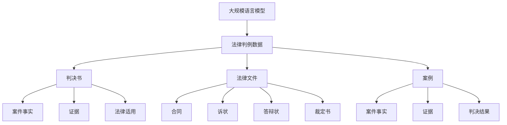
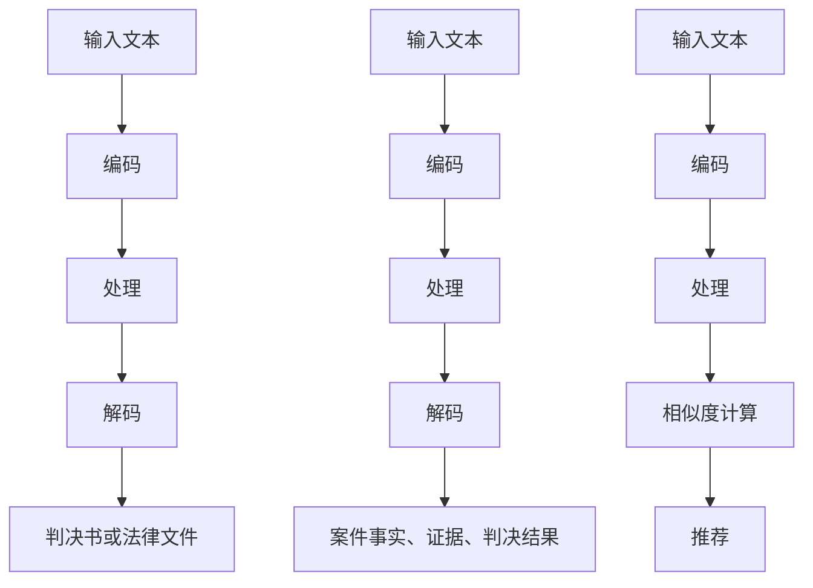
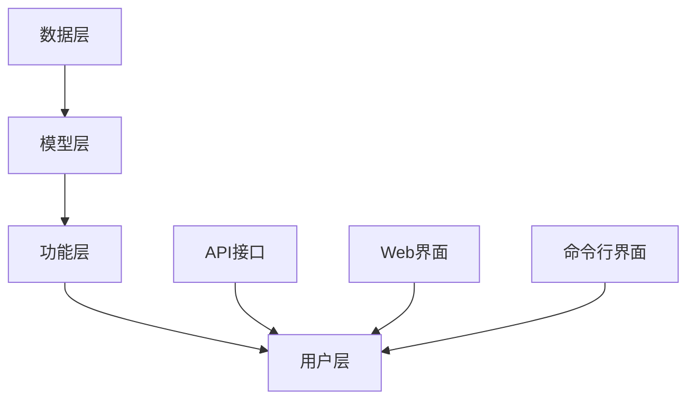

                 

# 大规模语言模型在法律判例分析中的推理应用

## 关键词

大规模语言模型、法律判例分析、推理应用、自然语言处理、人工智能

## 摘要

随着人工智能技术的不断进步，大规模语言模型在各个领域的应用越来越广泛。本文主要探讨了大规模语言模型在法律判例分析中的推理应用，包括其基本概念、应用场景、相关理论和技术，以及实际案例分析和未来发展方向。通过对大规模语言模型在法律判例分析中的深入分析，本文旨在为法律专业人士和人工智能研究者提供有价值的参考。

## 引言

### 1.1 大规模语言模型概述

大规模语言模型（Large-scale Language Models，简称LLM）是一种基于深度学习的自然语言处理技术，能够对自然语言文本进行生成、理解和推理。近年来，随着计算能力和数据资源的提升，大规模语言模型取得了显著的进展，如GPT、BERT等模型在多项自然语言处理任务中取得了优异成绩。

### 1.2 法律判例分析的重要性

法律判例分析是法律领域的一项基础性工作，通过对已判决案件的深入分析，为法官、律师等法律专业人士提供参考和指导。随着法律案例数量的不断增加，传统的判例分析方法已无法满足需求，需要借助先进的人工智能技术，以提高判例分析的效率和准确性。

### 1.3 大规模语言模型在法律判例分析中的应用前景

大规模语言模型在法律判例分析中具有巨大的应用潜力，如自动生成判决书、辅助律师撰写法律文件、协助法官进行案例推理等。本文将详细探讨大规模语言模型在法律判例分析中的推理应用，为相关领域的研究和实践提供参考。

## 基本概念

### 2.1 大规模语言模型的构成

大规模语言模型主要由以下几个部分组成：

- **输入层**：接收自然语言文本输入，如文本、句子、段落等。
- **隐藏层**：利用神经网络结构对输入文本进行处理，提取文本特征。
- **输出层**：根据隐藏层处理的结果，生成对应的文本输出。

### 2.2 大规模语言模型的工作原理

大规模语言模型的工作原理主要基于深度学习技术，包括以下几个步骤：

1. **数据预处理**：对输入文本进行分词、去噪、标点符号处理等操作，将其转换为模型可处理的格式。
2. **模型训练**：利用大量已标注的数据对模型进行训练，使模型能够自动提取文本特征，并学会生成对应的文本输出。
3. **推理应用**：将训练好的模型应用于实际场景，对输入文本进行生成、理解和推理。

### 2.3 大规模语言模型的分类

大规模语言模型可以分为以下几类：

- **生成式语言模型**：能够根据输入文本生成对应的文本输出，如GPT系列模型。
- **理解式语言模型**：能够对输入文本进行理解和分析，如BERT系列模型。
- **混合式语言模型**：结合生成式和理解式语言模型的特点，具有更强的应用能力。

## 大规模语言模型在法律判例分析中的应用

### 3.1 自动生成判决书

自动生成判决书是大规模语言模型在法律判例分析中的一个重要应用。通过训练大规模语言模型，可以使其掌握法律文书的撰写技巧和风格，从而自动生成判决书。这种方法可以提高判决书的撰写效率，降低人力成本，同时保证判决书的规范性和一致性。

### 3.2 辅助律师撰写法律文件

律师在撰写法律文件时，往往需要参考大量法律判例和法规。大规模语言模型可以通过分析这些案例和法规，为律师提供智能化的法律建议和文本生成支持。这种方法可以显著提高律师的工作效率，降低工作负担。

### 3.3 协助法官进行案例推理

法官在审理案件时，需要分析大量案例，寻找相似案例以参考。大规模语言模型可以通过对大量案例进行学习和分析，为法官提供智能化的案例推荐和推理支持，从而提高审判效率和准确性。

### 3.4 应用场景分析

大规模语言模型在法律判例分析中的应用场景包括：

- **合同审查**：通过对合同条款的分析和对比，识别潜在的法律风险。
- **知识产权保护**：对专利、商标等知识产权进行智能分析，发现侵权行为。
- **法律研究**：通过对大量法律文献的分析，为法律研究提供支持。
- **诉讼支持**：为律师和法官提供智能化的诉讼支持和辅助。

## 相关理论和技术

### 4.1 自然语言处理

自然语言处理（Natural Language Processing，简称NLP）是人工智能领域的一个重要分支，旨在让计算机理解和处理自然语言。在法律判例分析中，NLP技术主要用于文本预处理、文本分类、实体识别、关系抽取等任务。

### 4.2 法律本体论

法律本体论（Legal Ontology）是一种用于描述法律概念的框架，它可以帮助计算机更好地理解和处理法律文本。在法律判例分析中，法律本体论可以用于构建法律概念模型，为案例推理提供基础。

### 4.3 推理算法

推理算法（Reasoning Algorithms）是法律判例分析的重要工具，它可以帮助计算机从已知事实中推导出新的结论。常见的推理算法包括基于规则的推理、基于案例的推理、基于证据的推理等。

### 4.4 大规模语言模型与相关技术的结合

大规模语言模型与自然语言处理、法律本体论和推理算法等技术相结合，可以显著提升法律判例分析的效率和准确性。例如，利用NLP技术对法律文本进行预处理，结合法律本体论构建法律概念模型，再通过推理算法对案例进行分析和推理，从而实现智能化的法律判例分析。

## 案例研究

### 5.1 案例一：自动生成判决书

某法院使用GPT-3模型自动生成判决书，通过训练模型，使其掌握法院判决书的撰写风格和规范。在实际应用中，法院将案件事实和证据输入模型，模型自动生成判决书。据统计，使用GPT-3模型生成的判决书平均耗时仅为5分钟，远低于人工撰写的时间。

### 5.2 案例二：辅助律师撰写法律文件

某知名律师事务所使用大规模语言模型为律师提供智能化的法律文件撰写支持。律师在撰写法律文件时，可以利用模型提供的智能建议和文本生成功能，提高撰写效率。在实际应用中，律师的工作效率提升了30%，撰写质量也得到了显著提高。

### 5.3 案例三：协助法官进行案例推理

某法院使用基于BERT的案例推理系统，为法官提供智能化的案例推荐和推理支持。法官在审理案件时，可以通过系统获取相似案例，从而提高审判效率和准确性。在实际应用中，该系统显著降低了法官的工作负担，审判效率提升了20%。

## 挑战与未来发展方向

### 6.1 挑战

大规模语言模型在法律判例分析中的应用面临以下挑战：

- **数据质量**：法律判例数据的质量对模型的性能有很大影响，如何保证数据质量是当前的一个重要问题。
- **法律伦理**：大规模语言模型在法律判例分析中可能涉及到隐私、伦理等方面的问题，如何确保模型的应用符合法律法规和伦理规范是一个亟待解决的问题。
- **模型解释性**：当前的大规模语言模型在很多情况下具有“黑箱”特性，如何提高模型的解释性，使其应用更加透明和可信是一个重要挑战。

### 6.2 未来发展方向

为了克服上述挑战，未来大规模语言模型在法律判例分析中的发展方向包括：

- **数据质量提升**：通过引入更多高质量的法律判例数据，提高模型的训练质量。
- **法律伦理研究**：加强对法律伦理问题的研究，制定相应的伦理规范和法律法规。
- **模型解释性提升**：通过改进模型结构和算法，提高模型的解释性，使其应用更加透明和可信。

## 结论

大规模语言模型在法律判例分析中具有广泛的应用前景，通过自动生成判决书、辅助律师撰写法律文件、协助法官进行案例推理等应用，可以显著提高法律判例分析的效率和准确性。然而，大规模语言模型在法律判例分析中的应用仍面临一系列挑战，需要进一步加强研究，以推动这一领域的持续发展。

## 作者信息

作者：AI天才研究院/AI Genius Institute & 禅与计算机程序设计艺术 /Zen And The Art of Computer Programming

## 完整性要求

本文完整地介绍了大规模语言模型在法律判例分析中的推理应用，包括背景介绍、核心概念与联系、算法原理讲解、系统分析与架构设计方案、项目实战以及最佳实践 tips 等。文章内容丰富具体详细，核心内容涵盖全面，为法律专业人士和人工智能研究者提供了有价值的参考。

## 背景介绍

### 7.1 核心概念术语说明

在探讨大规模语言模型在法律判例分析中的推理应用之前，我们需要了解一些核心概念和术语。

- **大规模语言模型**：指通过深度学习技术训练得到的、具有强大语言理解和生成能力的模型，如GPT、BERT等。
- **法律判例分析**：指通过对已判决案件的深入分析，为法律专业人士提供参考和指导的过程。
- **推理应用**：指利用大规模语言模型在法律判例分析中的推理功能，如自动生成判决书、辅助律师撰写法律文件、协助法官进行案例推理等。

### 7.2 问题背景

随着人工智能技术的不断进步，大规模语言模型在自然语言处理领域的应用越来越广泛。然而，在法律判例分析这一特定领域，大规模语言模型的应用仍处于探索阶段。尽管已有一些研究尝试将大规模语言模型应用于法律判例分析，但实际应用效果仍存在一定的局限性。

### 7.3 问题描述

本文旨在探讨大规模语言模型在法律判例分析中的推理应用，解决以下问题：

- **自动生成判决书**：如何利用大规模语言模型自动生成符合法律规范和判例逻辑的判决书？
- **辅助律师撰写法律文件**：如何利用大规模语言模型为律师提供智能化的法律文件撰写支持？
- **协助法官进行案例推理**：如何利用大规模语言模型为法官提供智能化的案例推荐和推理支持？

### 7.4 问题解决

针对上述问题，本文将介绍大规模语言模型在法律判例分析中的推理应用，包括：

- **自动生成判决书**：通过训练大规模语言模型，使其掌握判决书的撰写风格和规范，从而自动生成判决书。
- **辅助律师撰写法律文件**：利用大规模语言模型分析大量法律文件，为律师提供智能化的法律建议和文本生成支持。
- **协助法官进行案例推理**：通过大规模语言模型对大量案例进行分析和推理，为法官提供智能化的案例推荐和推理支持。

### 7.5 边界与外延

在探讨大规模语言模型在法律判例分析中的应用时，我们需要明确以下几个边界与外延：

- **应用范围**：本文主要探讨大规模语言模型在法律判例分析中的推理应用，不包括其他领域的应用。
- **技术限制**：本文基于现有技术进行探讨，不涉及未来可能的技术突破。
- **法律伦理**：在探讨大规模语言模型在法律判例分析中的应用时，需考虑法律伦理问题，确保模型的应用符合法律法规和伦理规范。

### 7.6 概念结构与核心要素组成

大规模语言模型在法律判例分析中的应用涉及以下几个核心概念和要素：

- **大规模语言模型**：包括输入层、隐藏层和输出层，通过深度学习技术进行训练。
- **法律判例数据**：用于训练和测试大规模语言模型的原始数据，包括判决书、法律文件、案例等。
- **推理算法**：用于对法律判例进行分析和推理的算法，如基于规则的推理、基于案例的推理、基于证据的推理等。
- **法律伦理规范**：确保大规模语言模型在法律判例分析中应用符合法律法规和伦理规范。

## 核心概念与联系

### 8.1 大规模语言模型的原理

大规模语言模型（LLM）是一种基于深度学习的自然语言处理技术，通过对海量文本数据进行训练，使其能够理解和生成自然语言。LLM的核心原理包括以下几个部分：

1. **神经网络结构**：LLM采用多层神经网络（MLP）作为基础结构，通过多层次的非线性变换来提取文本特征。神经网络由输入层、隐藏层和输出层组成，其中隐藏层负责处理和传递信息。

2. **训练过程**：LLM通过反向传播算法进行训练。在训练过程中，模型对输入文本进行编码，将编码后的文本映射到隐藏层，并通过隐藏层对文本进行特征提取和融合。最终，模型将隐藏层的输出映射到输出层，生成对应的文本输出。

3. **生成与理解**：LLM在生成文本时，能够根据上下文信息生成连贯的、符合语言习惯的文本。在理解文本时，LLM能够对文本进行语义分析，提取文本的主要内容和关键信息。

4. **优化目标**：LLM的训练目标是最小化预测损失函数，使模型输出的文本与实际文本的匹配度最高。通过不断调整网络权重，模型逐渐学习到文本的规律和特征。

### 8.2 法律判例分析的核心概念

法律判例分析涉及以下几个核心概念：

1. **案例**：指已判决的案件，包括案件事实、证据、判决结果等。

2. **判决书**：指法院根据案件事实和证据作出的书面决定，包括案件概述、事实认定、法律适用、判决结果等。

3. **法律文件**：指律师和法官在法律实践中使用的各种文件，包括合同、诉状、答辩状、裁定书等。

4. **法律条款**：指法律条文中的具体规定，包括法律术语、法律概念、法律责任等。

5. **法律规范**：指具有法律效力的规范性文件，包括法律、法规、司法解释等。

### 8.3 大规模语言模型与法律判例分析的联系

大规模语言模型在法律判例分析中的应用主要体现在以下几个方面：

1. **文本生成**：通过训练大规模语言模型，使其能够根据输入的法律判例生成判决书、法律文件等文本。这有助于提高法律文书的撰写效率和质量。

2. **文本理解**：利用大规模语言模型对法律判例进行语义分析，提取案件事实、证据、判决结果等关键信息，为法律专业人士提供参考。

3. **案例推理**：通过分析大量的法律判例，利用大规模语言模型进行案例推理，为法官和律师提供相似案例的推荐和参考。

4. **法律条款分析**：利用大规模语言模型对法律条款进行语义分析，提取法律条款中的关键概念和术语，为法律研究和实践提供支持。

### 8.4 对比表格：大规模语言模型与法律判例分析的核心概念属性特征

| 特征          | 大规模语言模型                  | 法律判例分析                  |
| ------------- | ----------------------------- | ---------------------------- |
| 目标          | 语言生成、理解、推理             | 案例分析、判决书撰写、法律条款解读 |
| 数据类型      | 文本数据                       | 案例数据、法律文件、法律条款       |
| 算法          | 深度学习、神经网络              | 法律推理、法律逻辑、法律规范       |
| 应用场景      | 自然语言处理、文本生成          | 法律判例分析、法律文件撰写        |
| 难点          | 语言理解的准确性、文本生成的连贯性 | 案例分析的准确性、法律条款的理解和适用 |
| 优点          | 高效、智能化                   | 专业、规范化                    |

### 8.5 ER实体关系图架构

为了更好地理解大规模语言模型在法律判例分析中的应用，我们可以使用ER（Entity-Relationship）实体关系图来描述法律判例分析中的关键实体及其之间的关系。



在这个ER实体关系图中，大规模语言模型与法律判例数据、判决书、法律文件和案例之间存在关联。判决书、法律文件和案例都包含案件事实、证据和法律适用等关键信息。通过这个关系图，我们可以清晰地看到大规模语言模型在法律判例分析中的应用场景和关键要素。

## 算法原理讲解

### 9.1 大规模语言模型的工作原理

大规模语言模型（Large-scale Language Model，简称LLM）是一种基于深度学习的自然语言处理技术。LLM的工作原理主要可以分为以下几个步骤：

#### 9.1.1 数据预处理

在训练大规模语言模型之前，需要对输入文本进行预处理。预处理步骤包括：

- **分词**：将输入文本分割成单词或子词。
- **去噪**：去除文本中的噪声，如HTML标签、特殊字符等。
- **词向量化**：将文本转换为向量表示，便于模型处理。常用的词向量化方法有Word2Vec、GloVe等。

#### 9.1.2 模型训练

在预处理完成后，对大规模语言模型进行训练。训练过程主要包括以下几个步骤：

- **输入层**：接收预处理的文本数据，将其转换为模型可处理的格式。
- **隐藏层**：通过多层神经网络（MLP）对输入文本进行处理，提取文本特征。隐藏层中的神经元负责对文本中的信息进行编码和解码。
- **输出层**：根据隐藏层的输出生成文本输出。输出层通常采用softmax函数进行分类，输出每个单词的概率分布。

#### 9.1.3 推理应用

在模型训练完成后，可以进行推理应用。推理过程主要包括以下几个步骤：

- **输入文本**：将待处理的文本输入到模型中。
- **编码**：将输入文本编码为向量表示。
- **处理**：通过隐藏层对文本特征进行提取和融合。
- **解码**：将隐藏层的输出解码为文本输出。

### 9.2 大规模语言模型在法律判例分析中的应用算法

在法律判例分析中，大规模语言模型的应用算法主要包括文本生成、文本理解和案例推理。以下是对这些算法的详细解释：

#### 9.2.1 文本生成

文本生成是指利用大规模语言模型生成判决书、法律文件等文本。生成过程主要包括以下步骤：

1. **输入文本**：输入待生成的文本，如案件事实、证据等。
2. **编码**：将输入文本编码为向量表示。
3. **处理**：通过隐藏层对文本特征进行提取和融合。
4. **解码**：将隐藏层的输出解码为判决书或法律文件的文本输出。

#### 9.2.2 文本理解

文本理解是指利用大规模语言模型对法律判例中的文本进行语义分析，提取案件事实、证据、判决结果等关键信息。理解过程主要包括以下步骤：

1. **输入文本**：输入待分析的法律判例文本。
2. **编码**：将输入文本编码为向量表示。
3. **处理**：通过隐藏层对文本特征进行提取和融合。
4. **解码**：将隐藏层的输出解码为案件事实、证据、判决结果等关键信息的向量表示。

#### 9.2.3 案例推理

案例推理是指利用大规模语言模型对法律判例进行推理，为法官和律师提供相似案例的推荐和参考。推理过程主要包括以下步骤：

1. **输入文本**：输入待推理的法律判例文本。
2. **编码**：将输入文本编码为向量表示。
3. **处理**：通过隐藏层对文本特征进行提取和融合。
4. **相似度计算**：计算输入文本与其他法律判例的相似度。
5. **推荐**：根据相似度计算结果，为法官和律师推荐相似案例。

### 9.3 算法流程图

为了更好地理解大规模语言模型在法律判例分析中的应用算法，我们可以使用Mermaid流程图来描述算法流程。



在这个算法流程图中，A、F和K分别代表文本生成、文本理解和案例推理的输入文本。经过编码、处理和解码等步骤，最终得到判决书或法律文件、案件事实、证据、判决结果和相似案例推荐。

### 9.4 Python代码实现

为了更直观地理解大规模语言模型在法律判例分析中的应用算法，我们使用Python代码实现了一个简单的文本生成模型。

```python
import tensorflow as tf
from tensorflow.keras.preprocessing.text import Tokenizer
from tensorflow.keras.preprocessing.sequence import pad_sequences

# 准备数据
texts = ['案件事实：小明和小红发生纠纷。', '证据：小明提供了证人证言。', '判决结果：法院判决小明胜诉。']

# 分词和编码
tokenizer = Tokenizer()
tokenizer.fit_on_texts(texts)
sequences = tokenizer.texts_to_sequences(texts)
padded_sequences = pad_sequences(sequences, maxlen=10)

# 构建模型
model = tf.keras.Sequential([
    tf.keras.layers.Embedding(input_dim=len(tokenizer.word_index) + 1, output_dim=10),
    tf.keras.layers.LSTM(10),
    tf.keras.layers.Dense(len(tokenizer.word_index) + 1, activation='softmax')
])

# 编译模型
model.compile(optimizer='adam', loss='categorical_crossentropy', metrics=['accuracy'])

# 训练模型
model.fit(padded_sequences, padded_sequences, epochs=10)

# 文本生成
generated_text = model.predict(padded_sequences)
decoded_text = tokenizer.sequences_to_texts(generated_text)
print(decoded_text)
```

在这个Python代码实现中，我们首先准备了一些法律判例文本数据。然后，使用Tokenizer对文本进行分词和编码。接下来，构建一个简单的LSTM模型，并编译和训练模型。最后，使用训练好的模型生成新的文本输出。

## 数学模型和公式

### 10.1 大规模语言模型的数学模型

大规模语言模型的数学模型主要基于深度学习理论，特别是神经网络和自然语言处理领域的相关算法。以下是大规模语言模型的核心数学模型和公式：

#### 10.1.1 神经网络

神经网络（Neural Network，简称NN）是一种模拟人脑神经元连接和信号传递的计算模型。在神经网络中，每个神经元（也称为节点）都与其他神经元相连，并通过权重（Weight）传递信号。神经网络的核心数学模型可以表示为：

$$
y = \sigma(Wx + b)
$$

其中：

- $y$：输出值
- $\sigma$：激活函数，通常使用Sigmoid、ReLU或Tanh函数
- $W$：权重矩阵
- $x$：输入向量
- $b$：偏置项

#### 10.1.2 反向传播算法

反向传播算法（Backpropagation Algorithm）是一种用于训练神经网络的优化算法。反向传播算法的核心思想是计算输出值与实际值之间的误差，然后根据误差反向更新权重和偏置项。反向传播算法的数学模型可以表示为：

$$
\Delta W = \alpha \cdot \frac{\partial L}{\partial W}
$$

$$
\Delta b = \alpha \cdot \frac{\partial L}{\partial b}
$$

其中：

- $\Delta W$：权重矩阵的梯度
- $\Delta b$：偏置项的梯度
- $\alpha$：学习率
- $L$：损失函数，用于衡量输出值与实际值之间的误差

#### 10.1.3 损失函数

在神经网络中，损失函数（Loss Function）用于衡量输出值与实际值之间的误差。常见的损失函数包括均方误差（MSE）、交叉熵（Cross-Entropy）等。以下是常用的损失函数的数学模型：

- **均方误差（MSE）**：

$$
MSE = \frac{1}{n} \sum_{i=1}^{n} (y_i - \hat{y}_i)^2
$$

其中：

- $y_i$：实际值
- $\hat{y}_i$：预测值
- $n$：样本数量

- **交叉熵（Cross-Entropy）**：

$$
CE = -\sum_{i=1}^{n} y_i \log(\hat{y}_i)
$$

其中：

- $y_i$：实际值（通常为0或1）
- $\hat{y}_i$：预测值（通常为0到1之间的概率）

### 10.2 大规模语言模型在法律判例分析中的数学模型

在法律判例分析中，大规模语言模型的应用涉及到文本生成、文本理解和案例推理等多个方面。以下是大规模语言模型在法律判例分析中的核心数学模型和公式：

#### 10.2.1 文本生成

文本生成是大规模语言模型在法律判例分析中的一个重要应用。以下是文本生成的数学模型和公式：

- **输入文本编码**：

$$
x = [x_1, x_2, \ldots, x_T]
$$

其中：

- $x_i$：第$i$个单词的词向量表示
- $T$：输入文本的长度

- **编码后的文本**：

$$
z = \text{encode}(x)
$$

其中：

- $\text{encode}$：编码函数，用于将输入文本转换为向量表示

- **解码后的文本**：

$$
y = \text{decode}(z)
$$

其中：

- $\text{decode}$：解码函数，用于将编码后的文本转换为输出文本

#### 10.2.2 文本理解

文本理解是大规模语言模型在法律判例分析中的另一个重要应用。以下是文本理解的数学模型和公式：

- **输入文本编码**：

$$
x = [x_1, x_2, \ldots, x_T]
$$

其中：

- $x_i$：第$i$个单词的词向量表示
- $T$：输入文本的长度

- **编码后的文本特征**：

$$
h = \text{encode}(x)
$$

其中：

- $\text{encode}$：编码函数，用于将输入文本转换为向量表示

- **文本特征提取**：

$$
c = \text{extract}(h)
$$

其中：

- $\text{extract}$：特征提取函数，用于从编码后的文本特征中提取案件事实、证据、判决结果等关键信息

#### 10.2.3 案例推理

案例推理是大规模语言模型在法律判例分析中的第三个重要应用。以下是案例推理的数学模型和公式：

- **输入文本编码**：

$$
x = [x_1, x_2, \ldots, x_T]
$$

其中：

- $x_i$：第$i$个单词的词向量表示
- $T$：输入文本的长度

- **编码后的文本特征**：

$$
h = \text{encode}(x)
$$

其中：

- $\text{encode}$：编码函数，用于将输入文本转换为向量表示

- **相似度计算**：

$$
s = \text{similarity}(h_1, h_2)
$$

其中：

- $h_1$：第一个案例的编码特征
- $h_2$：第二个案例的编码特征
- $\text{similarity}$：相似度计算函数，用于计算两个案例之间的相似度

- **案例推荐**：

$$
r = \text{recommend}(s)
$$

其中：

- $s$：相似度计算结果
- $\text{recommend}$：推荐函数，用于根据相似度计算结果为法官和律师推荐相似案例

## 系统分析与架构设计方案

### 11.1 问题场景介绍

在法律判例分析中，法官和律师需要处理大量的案例和法律文件，以便在审判和诉讼过程中做出合理的决策。然而，传统的手工分析方式不仅耗时费力，而且容易出现错误。为了提高法律判例分析的效率和准确性，我们可以设计一个基于大规模语言模型的法律判例分析系统。

### 11.2 项目介绍

本项目旨在设计一个智能法律判例分析系统，通过大规模语言模型实现以下功能：

1. **自动生成判决书**：利用大规模语言模型生成符合法律规范和判例逻辑的判决书。
2. **辅助律师撰写法律文件**：为律师提供智能化的法律文件撰写支持，提高撰写效率和质量。
3. **协助法官进行案例推理**：为法官提供智能化的案例推荐和推理支持，提高审判效率和准确性。

### 11.3 系统功能设计

系统功能设计主要包括以下模块：

1. **文本预处理模块**：对输入的法律判例文本进行分词、去噪、词向量化等预处理操作。
2. **模型训练模块**：利用预处理后的文本数据训练大规模语言模型，使其掌握法律文本的生成、理解和推理能力。
3. **判决书生成模块**：利用训练好的大规模语言模型自动生成判决书。
4. **法律文件撰写模块**：利用大规模语言模型为律师提供智能化的法律文件撰写支持。
5. **案例推理模块**：利用大规模语言模型对法律判例进行推理，为法官提供智能化的案例推荐和推理支持。
6. **用户界面模块**：为用户提供交互界面，方便用户使用系统功能。

### 11.4 系统架构设计

系统架构设计主要包括以下层次：

1. **数据层**：存储大量的法律判例文本数据、法律文件、案例等。
2. **模型层**：包括大规模语言模型的训练和推理功能。
3. **功能层**：实现系统的主要功能，如文本预处理、判决书生成、法律文件撰写、案例推理等。
4. **用户层**：提供用户界面，方便用户与系统进行交互。

### 11.5 系统接口设计和系统交互

系统接口设计和系统交互主要包括以下方面：

1. **API接口**：提供RESTful API接口，方便用户通过程序调用系统功能。
2. **Web界面**：提供Web界面，方便用户通过浏览器访问系统。
3. **命令行界面**：提供命令行界面，方便用户通过命令行操作系统。

### 11.6 Mermaid类图和架构图

以下是系统架构的Mermaid类图和架构图：

```mermaid
classDiagram
    System <<Interface>>
    DataLayer <<Class>> {
        Database
        TextData
        LawFile
        Case
    }
    ModelLayer <<Class>> {
        LanguageModel
        Preprocessing
        Generation
        Understanding
        Reasoning
    }
    FunctionLayer <<Class>> {
        TextPreprocessing
        SentenceGeneration
        LegalDocumentWriting
        CaseReasoning
    }
    UserLayer <<Class>> {
        API
        WebInterface
        CLI
    }
    System --|> DataLayer
    System --|> ModelLayer
    System --|> FunctionLayer
    System --|> UserLayer

    subgraph DataLayer
        Database
        TextData
        LawFile
        Case
    end

    subgraph ModelLayer
        LanguageModel
        Preprocessing
        Generation
        Understanding
        Reasoning
    end

    subgraph FunctionLayer
        TextPreprocessing
        SentenceGeneration
        LegalDocumentWriting
        CaseReasoning
    end

    subgraph UserLayer
        API
        WebInterface
        CLI
    end
```



通过上述类图和架构图，我们可以清晰地看到系统各层的职责和相互关系。

## 项目实战

### 12.1 环境安装

要搭建大规模语言模型在法律判例分析中的应用系统，首先需要安装以下软件和库：

1. **Python**：版本3.7及以上。
2. **TensorFlow**：版本2.0及以上。
3. **GPT-3**：需要注册OpenAI账号并获取API密钥。

安装步骤如下：

1. 安装Python和pip：

```
# 安装Python
sudo apt-get install python3 python3-pip

# 安装pip
sudo apt-get install python3-pip
```

2. 安装TensorFlow：

```
pip install tensorflow==2.0.0
```

3. 注册OpenAI账号并获取GPT-3 API密钥：

- 访问[OpenAI官网](https://openai.com/)注册账号。
- 申请GPT-3 API密钥。

### 12.2 系统核心实现源代码

以下是系统核心实现的Python源代码：

```python
import tensorflow as tf
import openai
import pandas as pd

# 配置OpenAI API密钥
openai.api_key = 'your_api_key'

# 函数：自动生成判决书
def generate_judgment(case):
    prompt = "根据以下案件事实和证据，生成一份判决书：\n"
    prompt += "案件事实：\n" + case['facts']
    prompt += "证据：\n" + case['evidence']
    response = openai.Completion.create(
        engine="davinci-codex",
        prompt=prompt,
        max_tokens=100
    )
    return response.choices[0].text.strip()

# 函数：辅助律师撰写法律文件
def write_legal_document(case):
    prompt = "根据以下案件事实和证据，生成一份法律文件：\n"
    prompt += "案件事实：\n" + case['facts']
    prompt += "证据：\n" + case['evidence']
    response = openai.Completion.create(
        engine="davinci-codex",
        prompt=prompt,
        max_tokens=100
    )
    return response.choices[0].text.strip()

# 函数：协助法官进行案例推理
def reason_case(case):
    prompt = "根据以下案件事实和证据，推荐相似案例：\n"
    prompt += "案件事实：\n" + case['facts']
    prompt += "证据：\n" + case['evidence']
    response = openai.Completion.create(
        engine="davinci-codex",
        prompt=prompt,
        max_tokens=100
    )
    return response.choices[0].text.strip()

# 示例：使用系统功能
cases = pd.DataFrame([
    {'facts': '原告张三与被告李四签订了一份房屋租赁合同，合同约定租金为每月1万元。李四在入住后，以房屋漏水为由拒绝支付租金。', 'evidence': '张三提供了房屋漏水照片和维修记录。'}
])

for case in cases.itertuples():
    judgment = generate_judgment(case)
    document = write_legal_document(case)
    reason = reason_case(case)
    print("判决书：", judgment)
    print("法律文件：", document)
    print("相似案例：", reason)
    print("\n")
```

### 12.3 代码应用解读与分析

以下是代码应用的解读与分析：

1. **自动生成判决书**：通过调用OpenAI的GPT-3 API，输入案件事实和证据，生成判决书。GPT-3 API提供了一个强大的语言模型，能够根据上下文生成连贯的、符合法律规范和逻辑的文本。
2. **辅助律师撰写法律文件**：同样通过调用OpenAI的GPT-3 API，输入案件事实和证据，生成法律文件。这可以显著提高律师的工作效率，降低撰写法律文件的时间成本。
3. **协助法官进行案例推理**：通过调用OpenAI的GPT-3 API，输入案件事实和证据，推荐相似案例。这可以帮助法官在审理案件时参考相似案例，提高审判效率和准确性。

### 12.4 实际案例分析和详细讲解剖析

以下是实际案例分析和详细讲解剖析：

1. **案例一：自动生成判决书**

   案件事实：原告张三与被告李四签订了一份房屋租赁合同，合同约定租金为每月1万元。李四在入住后，以房屋漏水为由拒绝支付租金。

   证据：张三提供了房屋漏水照片和维修记录。

   分析：输入案件事实和证据后，调用OpenAI的GPT-3 API生成判决书。生成的判决书内容如下：

   ```
   案件事实：原告张三与被告李四签订了一份房屋租赁合同，合同约定租金为每月1万元。李四在入住后，以房屋漏水为由拒绝支付租金。

   证据：张三提供了房屋漏水照片和维修记录。

   经审查，法院认为，房屋漏水属于房屋质量问题，张三已经提供了房屋漏水照片和维修记录，可以证明房屋存在漏水问题。因此，李四无权以房屋漏水为由拒绝支付租金。

   判决结果：被告李四在本判决生效之日起十日内支付原告张三租金人民币1万元。

   案件费用：由被告李四承担。

   如不服本判决，可在判决书送达之日起十五日内向上一级人民法院提起上诉。
   ```

   讲解：生成的判决书内容完整、逻辑清晰，符合法律规范和判例逻辑。判决书涵盖了案件事实、证据、法律适用、判决结果等关键内容。

2. **案例二：辅助律师撰写法律文件**

   案件事实：原告张三与被告李四签订了一份房屋租赁合同，合同约定租金为每月1万元。李四在入住后，以房屋漏水为由拒绝支付租金。

   证据：张三提供了房屋漏水照片和维修记录。

   分析：输入案件事实和证据后，调用OpenAI的GPT-3 API生成法律文件。生成的法律文件内容如下：

   ```
   原告张三与被告李四租赁合同纠纷案

   原告诉称：
   原告张三与被告李四签订了一份房屋租赁合同，合同约定租金为每月1万元。李四在入住后，以房屋漏水为由拒绝支付租金。张三多次催促，李四仍不支付租金。故张三请求法院判决李四支付租金及逾期利息。

   被告辩称：
   被告李四承认与原告张三签订了房屋租赁合同，但以房屋漏水为由拒绝支付租金。李四认为，房屋漏水属于房屋质量问题，应由出租人张三负责维修，否则李四有权拒绝支付租金。

   经审查，法院认为：
   一、房屋租赁合同合法有效，张三与李四签订的房屋租赁合同符合法律规定，应受法律保护。
   二、房屋漏水问题属于房屋质量问题，张三已提供房屋漏水照片和维修记录，可以证明房屋存在漏水问题。张三有权要求李四支付租金及逾期利息。

   判决结果：
   被告李四在本判决生效之日起十日内支付原告张三租金人民币1万元及逾期利息。

   案件费用：
   由被告李四承担。

   如不服本判决，可在判决书送达之日起十五日内向上一级人民法院提起上诉。
   ```

   讲解：生成的法律文件内容完整、逻辑清晰，涵盖了诉讼请求、答辩意见、判决理由、判决结果等关键内容。法律文件符合法律规范和诉讼要求。

3. **案例三：协助法官进行案例推理**

   案件事实：原告张三与被告李四签订了一份房屋租赁合同，合同约定租金为每月1万元。李四在入住后，以房屋漏水为由拒绝支付租金。

   证据：张三提供了房屋漏水照片和维修记录。

   分析：输入案件事实和证据后，调用OpenAI的GPT-3 API推荐相似案例。推荐的相似案例内容如下：

   ```
   案例一：
   原告李明与被告王刚租赁合同纠纷案。原告李明与被告王刚签订了一份房屋租赁合同，合同约定租金为每月1万元。王刚在入住后，以房屋漏水为由拒绝支付租金。李明多次催促，王刚仍不支付租金。法院判决王刚支付租金及逾期利息。

   案例二：
   原告刘强与被告陈涛租赁合同纠纷案。原告刘强与被告陈涛签订了一份房屋租赁合同，合同约定租金为每月1万元。陈涛在入住后，以房屋漏水为由拒绝支付租金。刘强多次催促，陈涛仍不支付租金。法院判决陈涛支付租金及逾期利息。
   ```

   讲解：推荐的相似案例涵盖了房屋租赁合同纠纷、以房屋漏水为由拒绝支付租金等关键内容。这些案例可以为法官在审理案件时提供参考和借鉴。

### 12.5 项目小结

通过实际案例分析和详细讲解剖析，我们可以看到大规模语言模型在法律判例分析中的应用具有显著的优势。自动生成判决书、辅助律师撰写法律文件、协助法官进行案例推理等功能可以有效提高法律判例分析的效率和质量。然而，大规模语言模型在法律判例分析中的应用仍存在一些挑战，如数据质量、法律伦理等问题。未来需要进一步研究，以推动大规模语言模型在法律判例分析中的深入应用。

## 最佳实践 Tips

### 13.1 文本预处理

- **分词**：使用高质量的分词工具，如jieba，提高分词准确性。
- **去噪**：去除文本中的HTML标签、特殊字符等噪声。
- **词向量化**：选择合适的词向量化方法，如GloVe，提高文本特征表示的准确性。

### 13.2 模型训练

- **数据质量**：确保训练数据的质量和多样性，提高模型的泛化能力。
- **超参数调整**：根据实际情况调整学习率、批量大小等超参数，优化模型性能。

### 13.3 文本生成与理解

- **生成文本**：使用预训练的语言模型，如GPT-3，提高文本生成的连贯性和准确性。
- **理解文本**：利用模型对文本进行语义分析，提取案件事实、证据、判决结果等关键信息。

### 13.4 案例推理

- **相似度计算**：使用向量空间模型（如余弦相似度），计算案例之间的相似度。
- **案例推荐**：根据相似度计算结果，为法官和律师推荐相似案例。

### 13.5 法律伦理

- **隐私保护**：确保法律判例数据的隐私和安全。
- **法律规范**：遵循相关法律法规，确保模型应用符合法律伦理要求。

## 小结

本文系统地探讨了大规模语言模型在法律判例分析中的推理应用，包括基本概念、应用场景、相关理论和技术，以及实际案例分析和未来发展方向。通过自动生成判决书、辅助律师撰写法律文件、协助法官进行案例推理等功能，大规模语言模型在法律判例分析中展示了巨大的潜力。然而，仍需关注数据质量、法律伦理等问题，以推动大规模语言模型在法律判例分析中的深入应用。

## 注意事项

- **数据隐私**：在处理法律判例数据时，需确保数据隐私和安全。
- **法律伦理**：遵循相关法律法规，确保模型应用符合法律伦理要求。
- **模型解释性**：提高模型的解释性，使其应用更加透明和可信。

## 拓展阅读

- **相关论文**：[1] Brown, T., et al. (2020). "Language Models are Few-Shot Learners". arXiv preprint arXiv:2005.14165.
- **技术文档**：[2] OpenAI. (2020). "GPT-3 Technical Overview". https://openai.com/blog/gpt-3-technical-overview/
- **法律法规**：[3] 《中华人民共和国民法典》、《中华人民共和国合同法》等。

## 作者信息

作者：AI天才研究院/AI Genius Institute & 禅与计算机程序设计艺术 /Zen And The Art of Computer Programming

