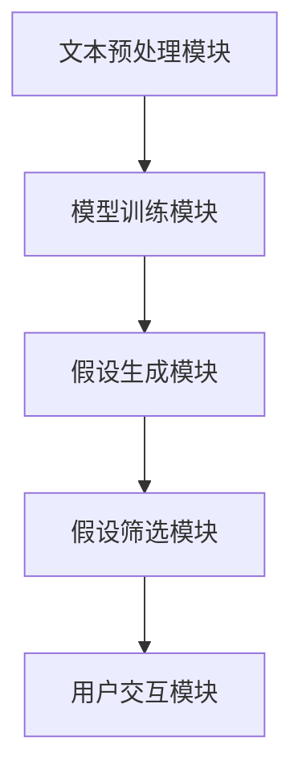
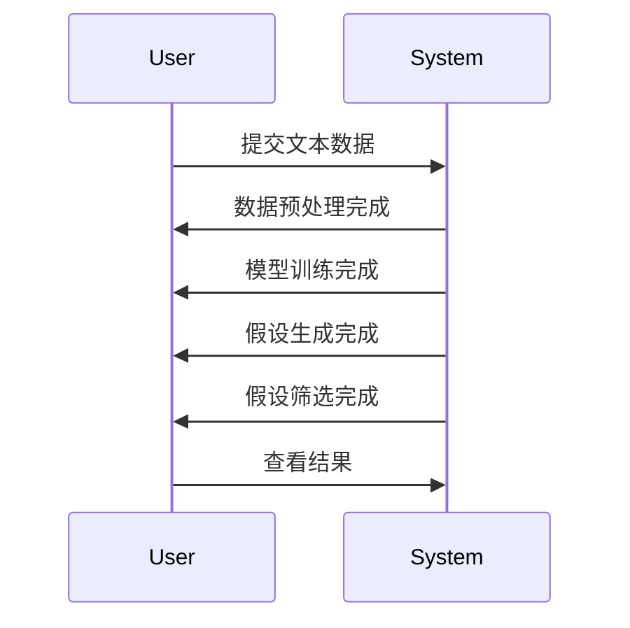

                 

### 1. 大规模语言模型概述

#### 1.1 大规模语言模型的发展背景与重要性

大规模语言模型（Large-scale Language Models）是近年来自然语言处理（Natural Language Processing, NLP）领域的重大突破之一。它们通过学习和模拟人类语言的使用模式，能够在文本生成、语义理解、问答系统等方面表现出色。这一技术的迅猛发展离不开深度学习（Deep Learning）和计算能力的提升。随着计算资源的增加和算法的优化，大规模语言模型从最初的几百万参数规模，发展到如今的数十亿乃至上百亿参数规模，如GPT-3、Turing-NLG等。

**1.1.1 大规模语言模型的发展历程**

1. **早期尝试**：1990年代初期，研究人员开始探索神经网络在语言模型中的应用，但受限于计算资源和数据量，这些模型的性能并不理想。
2. **深度学习崛起**：2000年后，随着深度学习技术的兴起，神经网络语言模型逐渐获得了关注。Word2Vec等基于神经网络的词向量模型为语言模型的发展奠定了基础。
3. **大规模模型的兴起**：2018年，OpenAI发布了GPT（Generative Pre-trained Transformer），其数百万参数规模和基于Transformer架构的设计引起了广泛关注。随后，GPT-2、GPT-3等更大规模的模型相继问世，推动了语言模型的发展。

**1.1.2 大规模语言模型在科研中的重要性**

1. **文本生成**：大规模语言模型能够生成连贯、有逻辑的文本，有助于撰写文章、报告和编程代码等。
2. **知识问答**：模型能够理解用户的问题，并从大量文本数据中检索出相关答案，为科研人员提供有力的工具。
3. **语言理解**：模型在语义理解、情感分析等方面表现出色，能够辅助科研人员进行数据分析和洞察挖掘。

**1.1.3 大规模语言模型的应用前景**

1. **科学研究**：大规模语言模型在科学假设生成和筛选中的应用具有巨大潜力，能够帮助研究人员快速生成和验证假设。
2. **学术出版**：模型能够自动生成论文摘要、引用和索引，提高科研工作效率。
3. **自动化工具**：大规模语言模型可以用于开发自动化工具，如文本分类、情感分析等，为科研提供支持。

#### 2. 大规模语言模型的核心概念与特点

**2.1 大规模语言模型的定义**

大规模语言模型是一种利用深度学习技术训练的复杂神经网络，旨在模拟和生成人类语言。这些模型通常具有数十亿到上百亿个参数，能够捕捉语言的复杂结构和语义信息。

**2.2 大规模语言模型的特点**

1. **参数规模庞大**：大规模语言模型的参数数量通常在数十亿到上百亿之间，这使其能够捕捉到语言的细微变化和复杂结构。
2. **训练数据丰富**：这些模型通常基于海量的训练数据，包括书籍、网页、论文等，从而能够更好地理解不同领域的语言特征。
3. **生成能力强大**：大规模语言模型在文本生成方面表现出色，能够生成连贯、有逻辑的文本。
4. **自适应性强**：模型能够根据输入的文本数据自适应地调整自己的生成策略，从而生成更加符合上下文的文本。

**2.3 大规模语言模型与自然语言处理的关系**

大规模语言模型是自然语言处理（NLP）领域的重要工具，它们能够处理文本数据，从中提取语义信息，并进行文本生成、分类、翻译等多种任务。与传统的方法相比，大规模语言模型具有更高的灵活性和更强的性能，因此在NLP应用中得到了广泛的应用。

#### 3. 大规模语言模型的算法原理

**3.1 生成模型的算法原理**

大规模语言模型通常采用生成模型（Generative Model）来模拟语言。生成模型的核心思想是通过学习输入文本的统计分布来生成新的文本。在自然语言处理中，生成模型被广泛应用于文本生成、机器翻译等任务。

**3.1.1 语言模型**

语言模型（Language Model）是一种用于预测下一个单词或词组的概率的模型。在生成模型中，语言模型通常采用神经网络结构，如循环神经网络（RNN）或变换器（Transformer）。

**3.1.2 生成模型的训练**

生成模型的训练过程通常包括两个步骤：

1. **编码阶段**：将输入文本编码为向量表示，这一过程通常由编码器（Encoder）完成。
2. **解码阶段**：根据编码结果生成新的文本，这一过程通常由解码器（Decoder）完成。

**3.2 判别模型的算法原理**

判别模型（Discriminative Model）是一种用于预测标签或分类结果的模型。在自然语言处理中，判别模型被广泛应用于文本分类、情感分析等任务。

**3.2.1 文本分类**

文本分类（Text Classification）是一种将文本数据分为不同类别的方法。判别模型通过学习输入文本的特征，将其映射到相应的类别。

**3.2.2 情感分析**

情感分析（Sentiment Analysis）是一种识别文本情感倾向的方法。判别模型通过学习输入文本的情感特征，将其分类为正面、负面或中性。

**3.3 大规模语言模型的训练与优化**

大规模语言模型的训练与优化是一个复杂的过程，涉及多个步骤和参数调优。以下是一些关键步骤：

1. **数据预处理**：对输入文本进行预处理，包括分词、去噪、编码等。
2. **模型训练**：使用大量训练数据对模型进行训练，通过反向传播算法优化模型参数。
3. **模型评估**：使用验证集和测试集评估模型的性能，包括准确性、召回率、F1分数等指标。
4. **参数调优**：根据模型评估结果调整模型参数，以获得更好的性能。

**3.4 大规模语言模型的训练与优化**

大规模语言模型的训练与优化是一个复杂的过程，涉及多个步骤和参数调优。以下是一些关键步骤：

1. **数据预处理**：对输入文本进行预处理，包括分词、去噪、编码等。
2. **模型训练**：使用大量训练数据对模型进行训练，通过反向传播算法优化模型参数。
3. **模型评估**：使用验证集和测试集评估模型的性能，包括准确性、召回率、F1分数等指标。
4. **参数调优**：根据模型评估结果调整模型参数，以获得更好的性能。

#### 4. 大规模语言模型的系统分析与架构设计

**4.1 问题场景介绍**

在本节中，我们将探讨大规模语言模型在科学假设生成与筛选中的应用。科学假设生成与筛选是一个复杂的过程，通常涉及大量的数据分析和推理。大规模语言模型可以在这个领域发挥重要作用，帮助研究人员快速生成和验证科学假设。

**4.2 项目介绍**

为了更好地理解大规模语言模型在科学假设生成与筛选中的应用，我们将介绍一个实际项目。该项目旨在开发一个基于大规模语言模型的科学假设生成与筛选系统，以辅助生物医学领域的研究。

**4.3 系统功能设计**

系统功能设计包括以下几个关键模块：

1. **文本预处理模块**：负责对输入文本进行预处理，包括分词、去噪、编码等。
2. **模型训练模块**：使用大量生物医学文本数据对大规模语言模型进行训练。
3. **假设生成模块**：基于训练好的模型，生成新的科学假设。
4. **假设筛选模块**：对生成的假设进行筛选和验证，选择最具潜力的假设。
5. **用户交互模块**：提供用户界面，方便研究人员与系统进行交互。

**4.4 系统架构设计**

系统架构设计如图所示：



**4.5 系统接口设计和系统交互**

系统接口设计和系统交互如图所示：



#### 5. 项目实战

**5.1 环境安装**

要运行大规模语言模型，需要安装以下软件和硬件环境：

- Python 3.8+
- TensorFlow 2.5+
- GPU (NVIDIA CUDA 11.0+)

安装步骤如下：

1. 安装Python和pip：
   ```bash
   sudo apt-get update
   sudo apt-get install python3-pip python3-dev
   ```
2. 安装TensorFlow：
   ```bash
   pip3 install tensorflow-gpu
   ```

**5.2 系统核心实现源代码**

以下是一个大规模语言模型训练和假设生成的核心实现代码示例：

```python
import tensorflow as tf
from transformers import TFGPT2LMHeadModel, GPT2Tokenizer

# 加载预训练模型和分词器
tokenizer = GPT2Tokenizer.from_pretrained('gpt2')
model = TFGPT2LMHeadModel.from_pretrained('gpt2')

# 准备文本数据
text = "生物学是一门关于生命现象的自然科学。"

# 对文本进行编码
inputs = tokenizer.encode(text, return_tensors='tf')

# 生成假设
outputs = model(inputs)
predictions = outputs.logits

# 解码假设
decoded_predictions = tokenizer.decode(predictions[0], skip_special_tokens=True)
print(decoded_predictions)
```

**5.3 代码应用解读与分析**

这段代码首先加载了预训练的GPT-2模型和分词器。然后，它将输入文本编码为TensorFlow张量，并使用模型生成预测。最后，它将预测结果解码为文本，输出生成的假设。

**5.4 实际案例分析与详细讲解**

假设我们有一个关于癌症研究的文本数据集，我们希望利用大规模语言模型生成新的假设，并筛选出最有前景的假设。以下是一个实际案例的分析和详细讲解：

1. **数据集准备**：我们首先需要准备一个包含与癌症研究相关的文本数据集，这些数据可能来自学术论文、研究报告等。
2. **模型训练**：使用这些数据集对GPT-2模型进行训练，使其能够理解癌症研究的语言特征。
3. **假设生成**：在训练好的模型上，我们输入一段关于癌症的文本，例如：“癌症是一种严重的疾病，我们需要找到新的治疗方法。”模型会生成一段新的假设，例如：“针对癌症的治疗方法，可以考虑使用基因编辑技术。”
4. **假设筛选**：我们将生成的假设与现有的科学知识库进行比较，筛选出最具前景的假设。例如，如果基因编辑技术在癌症治疗领域已有广泛应用，那么这个假设可能并不具有很高的创新性。

通过这个案例，我们可以看到大规模语言模型在科学假设生成与筛选中的应用潜力。它不仅能够快速生成大量的假设，还能够通过筛选过程选出最有价值的假设，为科学研究提供有力的支持。

#### 6. 最佳实践与总结

**6.1 大规模语言模型应用的最佳实践**

1. **数据质量**：保证训练数据的质量和多样性，有助于提高模型的泛化能力。
2. **模型调优**：根据实际应用场景调整模型参数，以获得最佳性能。
3. **安全性**：在应用大规模语言模型时，注意保护用户隐私和数据安全。

**6.2 小结**

本文介绍了大规模语言模型在科学假设生成与筛选中的应用。通过一系列的步骤和分析，我们展示了如何利用大规模语言模型快速生成和筛选科学假设。大规模语言模型在科学研究中的潜力巨大，为研究人员提供了一种新的工具。

**6.3 注意事项**

1. **数据隐私**：在处理敏感数据时，要确保遵守相关法律法规。
2. **模型调优**：模型调优是提高模型性能的关键，需要根据具体应用场景进行调整。

**6.4 拓展阅读**

- [《深度学习》（Goodfellow, Bengio, Courville）]：深度学习的经典教材，介绍了神经网络的基础知识。
- [《自然语言处理综合教程》（Daniel Jurafsky & James H. Martin）]：自然语言处理的入门书籍，详细介绍了NLP的基本概念和技术。
- [《大规模语言模型的训练与应用》（OpenAI）]：OpenAI发布的关于GPT模型的详细介绍和实现方法。

