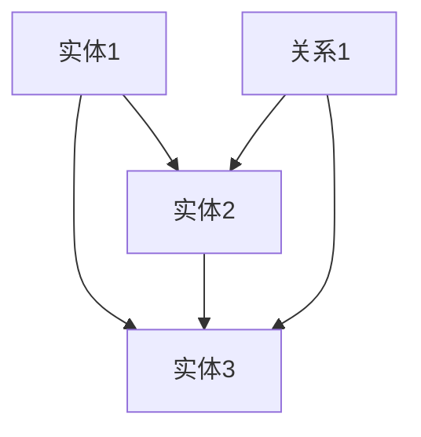
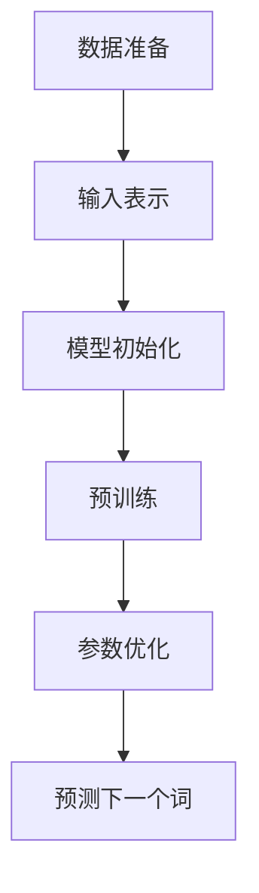
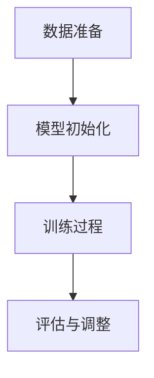
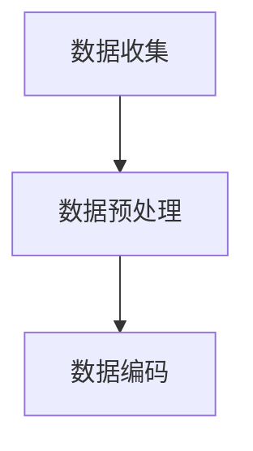
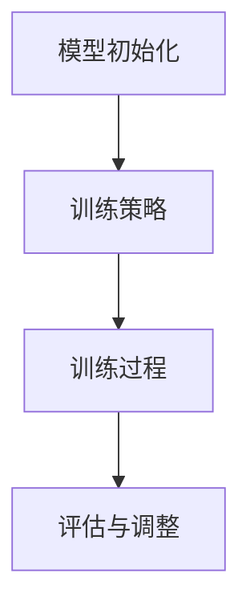
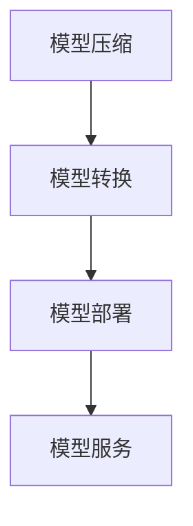

                 

# 大规模语言模型在科学发现辅助中的应用

## 关键词：大规模语言模型、科学发现、辅助、应用

## 摘要：

随着科技的快速发展，大规模语言模型（Large-scale Language Models）在自然语言处理领域取得了显著的成果。本文将探讨大规模语言模型在科学发现辅助中的应用，从背景介绍、核心概念、算法原理、数学模型、系统架构设计、项目实战等方面进行详细阐述。通过本文，读者将了解大规模语言模型在科学发现中的实际应用，以及如何利用这一技术为科学研究提供有力的支持。

## 1. 背景介绍

### 1.1 语言模型的定义与作用

语言模型（Language Model）是自然语言处理（Natural Language Processing, NLP）中的一种核心算法，用于预测或生成自然语言文本。它通过学习大量语言数据，掌握语言中的语法、语义和上下文信息，从而实现对未知文本的预测或生成。

语言模型在自然语言处理中有广泛的应用，包括但不限于：文本分类、机器翻译、语音识别、自动摘要、文本生成等。然而，随着科学研究的复杂性增加，传统语言模型在应对专业领域文本时存在一定的局限性，无法提供足够的辅助。

### 1.2 大规模语言模型的发展历史

大规模语言模型的发展可以追溯到2013年的词向量模型——词袋模型（Word2Vec），它将词语表示为向量，实现了词语的语义相似性计算。此后，随着计算能力的提升和深度学习技术的发展，更大规模的预训练模型如GPT（Generative Pre-trained Transformer）和BERT（Bidirectional Encoder Representations from Transformers）相继出现，为语言模型的研究和应用带来了新的机遇。

### 1.3 语言模型在科学发现中的应用前景

科学发现是一个复杂的过程，涉及大量文本数据的处理和分析。大规模语言模型在以下方面具有广阔的应用前景：

1. **文本分析与信息提取**：帮助科学家快速从大量文献中提取关键信息，提高研究效率。
2. **知识图谱构建与推理**：整合多源数据，构建知识图谱，辅助科学家进行跨领域研究和发现新知识。
3. **自动化实验设计与预测**：基于大规模语言模型，设计科学实验并预测实验结果，为科研提供数据支持。
4. **跨语言研究**：实现不同语言文本之间的相互翻译和理解，促进全球科学家的交流与合作。

## 2. 大规模语言模型的基本原理

### 2.1 语言模型的数学基础

语言模型的数学基础主要包括概率模型和神经网络。概率模型如N-gram模型通过计算文本序列的联合概率来实现文本生成，而神经网络模型如GPT和BERT通过学习文本的表示和生成机制，实现更复杂的语言理解和生成。

### 2.2 语言模型的训练与优化

大规模语言模型的训练是一个复杂的优化过程，通常使用梯度下降算法和反向传播算法。训练过程中，模型通过不断调整权重，使生成的文本更接近真实文本。优化策略如dropout、正则化等有助于提高模型的泛化能力。

### 2.3 语言模型的关键技术

大规模语言模型的关键技术包括：

1. **预训练**：在大量文本数据上预训练模型，使其具备强大的语言理解能力。
2. **微调**：在特定任务上对预训练模型进行微调，使其适应特定领域。
3. **生成式模型**：如GPT，通过预测下一个词来生成文本。
4. **判别式模型**：如BERT，通过理解上下文信息来预测词的概率分布。

## 3. 大规模语言模型在科学发现中的应用

### 3.1 文本分析与信息提取

大规模语言模型在文本分析与信息提取中具有显著优势。通过预训练，模型可以理解专业术语和复杂句式，从而有效提取关键信息。具体应用包括：

1. **文献检索**：快速定位相关文献，提高研究效率。
2. **摘要生成**：自动生成文献摘要，简化阅读过程。
3. **关键词提取**：提取文献中的关键词，辅助科研人员了解研究领域热点。

### 3.2 知识图谱构建与推理

知识图谱是一种结构化数据表示方法，将实体和关系表示为节点和边。大规模语言模型在知识图谱构建与推理中起到关键作用，具体应用包括：

1. **实体识别**：识别文本中的关键实体，如人名、机构名等。
2. **关系抽取**：抽取实体之间的关系，构建知识图谱。
3. **推理与预测**：基于知识图谱，进行推理和预测，发现新知识。

### 3.3 自动化实验设计与预测

大规模语言模型在自动化实验设计与预测中具有潜在应用，具体包括：

1. **实验设计**：基于已有数据和语言模型，自动生成实验方案。
2. **结果预测**：预测实验结果，为科研人员提供数据支持。
3. **跨领域研究**：利用语言模型跨领域知识整合，促进跨学科研究。

## 4. 实践与应用

### 4.1 大规模语言模型在科学发现中的实际案例

以下是一些大规模语言模型在科学发现中的实际案例：

1. **基因研究**：通过语言模型，自动提取基因文献中的关键信息，构建基因知识图谱，辅助科学家进行基因功能研究。
2. **药物发现**：利用语言模型，设计药物实验方案，预测药物作用机制，加速新药研发。
3. **气候变化**：通过语言模型，分析气候变化文献，预测气候变化的趋势和影响，为政策制定提供依据。

### 4.2 应用挑战与未来展望

尽管大规模语言模型在科学发现中具有广泛应用，但仍面临以下挑战：

1. **数据质量**：大规模语言模型依赖于大量高质量数据，数据质量直接影响模型性能。
2. **模型解释性**：大规模语言模型通常缺乏解释性，难以理解模型内部的决策过程。
3. **计算资源**：训练和部署大规模语言模型需要大量计算资源，成本较高。

未来，随着技术的不断进步，大规模语言模型在科学发现中的应用前景将更加广阔。通过改进数据质量、提高模型解释性和优化计算资源，大规模语言模型将为科学研究提供更强大的支持。

## 5. 最佳实践与总结

### 5.1 最佳实践

1. **数据预处理**：确保数据质量，去除噪声和冗余信息，为语言模型提供高质量输入。
2. **模型选择**：根据具体任务需求，选择合适的预训练模型和优化策略。
3. **持续学习**：定期更新语言模型，使其适应新的数据和需求。

### 5.2 小结

大规模语言模型在科学发现中具有巨大的潜力，通过文本分析、知识图谱构建和自动化实验设计等方面，为科学研究提供了有力的支持。未来，随着技术的不断发展，大规模语言模型将为科学研究带来更多创新和突破。

### 5.3 注意事项

1. **数据隐私**：在处理科研数据时，注意保护数据隐私，遵守相关法律法规。
2. **伦理问题**：在应用大规模语言模型时，关注伦理问题，确保技术的合理使用。

### 5.4 拓展阅读

1. **《深度学习》**：Goodfellow, I., Bengio, Y., & Courville, A. (2016). Deep learning. MIT press.
2. **《自然语言处理综合教程》**：Pang, B., & Lee, L. (2008). Natural language processing with Python. O'Reilly Media.

## 作者

**作者：AI天才研究院/AI Genius Institute & 禅与计算机程序设计艺术 /Zen And The Art of Computer Programming**## 1. 引言

### 1.1 语言模型的定义与作用

语言模型是自然语言处理（NLP）领域的基础工具，它通过对大量文本数据的学习，能够预测或生成自然语言中的下一个词、句子或段落。其核心目标是通过概率分布或确定性规则，对给定输入文本序列的概率进行建模，从而实现对未知文本的预测或生成。在NLP的许多任务中，如文本分类、机器翻译、问答系统、文本生成等，语言模型都扮演着至关重要的角色。

### 1.2 语言模型的发展历程

从最初的N-gram模型到现代的深度学习模型，语言模型的发展历程可谓波澜壮阔。N-gram模型通过计算前N个词的联合概率来预测下一个词，其简单有效的方法在早期取得了显著成果。但随着自然语言复杂性的增加，N-gram模型的局限性逐渐显现，无法捕捉长距离依赖关系和上下文信息。为了解决这一问题，研究人员提出了基于神经网络的深度学习模型，如循环神经网络（RNN）和其变体——长短期记忆网络（LSTM）。这些模型通过学习文本序列的长期依赖关系，显著提升了语言模型的性能。随着深度学习技术的发展，Transformer模型的出现进一步推动了语言模型的研究和应用。Transformer模型采用自注意力机制，能够高效地捕捉文本序列中的复杂依赖关系，使得大规模语言模型如GPT（Generative Pre-trained Transformer）和BERT（Bidirectional Encoder Representations from Transformers）成为现实。

### 1.3 语言模型在科学发现中的应用前景

科学发现是一个复杂且迭代的过程，涉及大量文献数据的阅读、理解和分析。传统的科学发现方法主要依赖于科学家个人的知识和经验，但随着数据的爆炸式增长，这种方法变得越来越低效和不可持续。大规模语言模型在科学发现中的应用前景广阔，主要体现在以下几个方面：

1. **文本分析与信息提取**：大规模语言模型能够高效地处理和理解专业领域文本，帮助科学家从大量文献中快速提取关键信息，提高研究效率。
2. **知识图谱构建与推理**：通过构建领域知识图谱，大规模语言模型能够整合多源数据，实现跨领域知识的发现和融合，为科学研究提供新的视角和思路。
3. **自动化实验设计与预测**：大规模语言模型能够基于已有数据和知识，自动生成科学实验方案并预测实验结果，为科研人员提供有力的数据支持。
4. **跨语言研究**：大规模语言模型能够实现多语言文本的相互翻译和理解，促进全球科学家的交流与合作，推动科学研究的全球化发展。

### 1.4 本文结构

本文将从以下几个方面对大规模语言模型在科学发现辅助中的应用进行探讨：

1. **背景介绍**：介绍大规模语言模型的基本概念、发展历程以及其在科学发现中的潜在应用。
2. **核心概念与联系**：阐述大规模语言模型的核心概念，如神经网络、自注意力机制等，并对比不同模型的特性。
3. **算法原理讲解**：详细讲解大规模语言模型的训练过程、优化策略以及其在文本生成、信息提取等任务中的应用。
4. **系统架构设计**：分析大规模语言模型在科学发现应用中的系统架构，包括数据输入、模型训练、模型部署等关键环节。
5. **项目实战**：通过具体案例，展示大规模语言模型在科学发现中的实际应用，包括基因研究、药物发现和气候变化预测等领域。
6. **应用挑战与未来展望**：探讨大规模语言模型在科学发现应用中面临的挑战和未来发展趋势。
7. **最佳实践与总结**：总结大规模语言模型在科学发现应用中的最佳实践，并提出注意事项和拓展阅读。

通过本文的探讨，我们希望能够为科研人员提供有价值的参考，帮助他们在科学发现中更好地利用大规模语言模型这一强大工具。

### 1.5 大规模语言模型在科学发现中的具体应用

大规模语言模型在科学发现中具有广泛的应用，主要体现在文本分析、知识图谱构建、自动化实验设计以及跨语言研究等方面。以下是对这些应用的详细阐述。

#### 1.5.1 文本分析与信息提取

文本分析是科学发现的重要环节，它能够帮助科学家从大量文献中提取关键信息，提高研究效率。大规模语言模型在文本分析中的应用主要体现在以下几个方面：

1. **文献检索**：通过语言模型，可以快速检索与特定研究主题相关的文献，从而节省科学家在文献筛选上的时间。例如，使用BERT模型，可以构建一个文献检索系统，输入关键词后，系统会返回与该关键词最相关的文献。

2. **摘要生成**：大规模语言模型能够生成高质量的文本摘要，简化阅读过程。例如，GPT模型可以自动生成文献的摘要，帮助科学家快速了解文献的主要内容。

3. **关键词提取**：通过语言模型，可以自动提取文献中的关键词，帮助科学家了解研究领域的热点和发展趋势。这有助于科学家在研究过程中定位关键问题和研究方向。

#### 1.5.2 知识图谱构建与推理

知识图谱是一种结构化数据表示方法，它能够将实体和关系表示为节点和边。大规模语言模型在知识图谱构建与推理中的应用主要体现在以下几个方面：

1. **实体识别**：语言模型可以通过学习大量文本数据，自动识别文本中的关键实体，如人名、机构名、药物名等。这些实体是构建知识图谱的基础。

2. **关系抽取**：通过语言模型，可以自动抽取实体之间的关系，构建知识图谱。例如，BERT模型可以用于抽取文献中的实体关系，从而构建一个药物作用机制的知识图谱。

3. **推理与预测**：基于知识图谱，可以进行推理和预测，发现新知识。例如，通过推理，可以预测某个药物的新用途或某个基因的新功能。

#### 1.5.3 自动化实验设计与预测

大规模语言模型在自动化实验设计中的应用主要体现在以下几个方面：

1. **实验设计**：通过分析已有数据和文献，大规模语言模型可以自动生成实验方案。例如，GPT模型可以生成新的基因编辑实验方案，提高实验设计的效率。

2. **结果预测**：基于大规模语言模型，可以预测实验结果，为科研人员提供数据支持。例如，通过分析基因编辑的文献，GPT模型可以预测某种基因编辑方案的成功率。

#### 1.5.4 跨语言研究

跨语言研究是科学发现的重要方向，它能够促进全球科学家的交流与合作。大规模语言模型在跨语言研究中的应用主要体现在以下几个方面：

1. **文本翻译**：大规模语言模型如GPT和BERT能够实现高效、准确的文本翻译，帮助科学家理解不同语言的研究成果。

2. **多语言文本分析**：通过多语言语言模型，可以同时分析多种语言的文本数据，发现跨语言的趋势和联系。例如，通过分析多语言文献，可以识别全球范围内的研究热点和趋势。

3. **跨语言知识图谱**：通过构建多语言知识图谱，可以整合不同语言的研究成果，发现跨语言的规律和联系。例如，通过构建英语和中文的药物作用机制知识图谱，可以识别全球范围内的药物研究趋势。

#### 1.5.5 总结

大规模语言模型在科学发现中的应用具有巨大潜力，通过文本分析、知识图谱构建、自动化实验设计和跨语言研究等方面，它能够显著提高科研效率，推动科学发现。然而，大规模语言模型在科学发现中的应用仍面临一些挑战，如数据质量、模型解释性和计算资源等。未来，随着技术的不断进步，大规模语言模型在科学发现中的应用前景将更加广阔。通过解决这些挑战，大规模语言模型将为科学研究带来更多创新和突破。

### 2. 大规模语言模型的核心概念与联系

大规模语言模型作为自然语言处理领域的重要工具，其核心概念和联系涵盖了神经网络、自注意力机制、Transformer架构等多个方面。下面我们将详细探讨这些核心概念，并通过表格和ER实体关系图架构来帮助理解。

#### 2.1 神经网络

神经网络（Neural Network）是大规模语言模型的基础，它由多个简单的处理单元（即神经元）组成，通过层次结构进行信息传递和处理。每个神经元接收来自前一层神经元的输入，通过激活函数进行处理，然后将输出传递给下一层。神经网络的核心在于通过学习大量数据，调整神经元之间的连接权重，从而实现复杂函数的建模。

| **概念** | **描述** | **联系** |
| --- | --- | --- |
| 神经元 | 基本的处理单元，接收输入，通过权重和偏置进行处理 | 构成神经网络的基本单元 |
| 激活函数 | 引入非线性，使神经网络能够拟合复杂函数 | 增强网络的建模能力 |
| 权重和偏置 | 调整神经网络参数，实现输入与输出的映射 | 决定网络性能和训练效果 |

#### 2.2 自注意力机制

自注意力机制（Self-Attention Mechanism）是Transformer模型的核心组件，它通过引入注意力机制，使模型能够自适应地关注输入序列中的不同部分。自注意力机制通过计算每个输入词与其他词的相似性，生成加权表示，从而在模型中引入长距离依赖关系。

| **概念** | **描述** | **联系** |
| --- | --- | --- |
| 注意力权重 | 反映输入词与其他词的相似性 | 自适应地关注重要信息 |
| 加权表示 | 将输入词根据注意力权重进行加权处理 | 增强模型的上下文理解能力 |
| 长距离依赖 | 通过注意力机制捕捉长距离依赖关系 | 提高模型的语言建模能力 |

#### 2.3 Transformer架构

Transformer架构是大规模语言模型的代表性模型，其核心在于使用自注意力机制和多头注意力机制来处理输入序列。Transformer架构通过编码器和解码器两个部分，实现对输入文本的编码和解码，从而实现语言生成和翻译等任务。

| **概念** | **描述** | **联系** |
| --- | --- | --- |
| 编码器 | 对输入文本序列进行处理，生成编码表示 | 提取文本特征 |
| 解码器 | 对编码表示进行处理，生成输出文本序列 | 生成预测文本 |
| 多头注意力 | 通过多个注意力头，同时关注不同部分的信息 | 提高模型的表示能力 |
| 位置编码 | 引入位置信息，使模型能够理解文本序列的顺序 | 增强模型的语言理解能力 |

#### 2.4 ER实体关系图架构

ER（Entity-Relationship）实体关系图是一种用于描述数据实体及其之间关系的图形表示方法。在大规模语言模型的应用中，ER图可以帮助我们理解模型中的实体和它们之间的关系，从而更好地设计和应用模型。



- **实体**：表示模型中的关键元素，如词、句子、实体等。
- **关系**：表示实体之间的联系，如依赖关系、分类关系等。

通过上述核心概念和联系的探讨，我们可以更深入地理解大规模语言模型的工作原理和结构。接下来，我们将进一步讲解大规模语言模型的算法原理，并通过具体例子来阐述其应用。

### 3. 大规模语言模型的算法原理讲解

大规模语言模型的算法原理主要涉及预训练、优化策略和模型应用等方面。本节将通过Mermaid流程图和Python源代码，详细讲解大规模语言模型的训练过程、优化策略以及在实际应用中的具体实现。

#### 3.1 预训练

预训练是大规模语言模型的核心步骤，通过在大量文本数据上预训练，模型可以学习到语言的基本结构和规则。预训练过程通常包括以下几个关键步骤：

1. **数据准备**：首先，需要收集和准备大量高质量文本数据，这些数据可以是书籍、新闻、论文、社交媒体帖子等。数据准备的过程包括数据清洗、去噪和分词等步骤。
2. **输入表示**：将文本数据转换为模型可以处理的输入表示，通常使用词嵌入（Word Embedding）技术。词嵌入将每个词映射为一个高维向量，从而为模型提供词的语义信息。
3. **模型初始化**：初始化大规模Transformer模型，包括编码器和解码器两个部分。模型参数需要通过预训练过程进行优化。
4. **预训练过程**：在预训练阶段，模型通过学习大量的文本数据，不断调整参数，使其能够预测下一个词或生成文本。预训练通常采用自回归语言模型（Autoregressive Language Model）策略，即模型根据前一个词来预测下一个词。

下面是预训练过程的Mermaid流程图：



#### 3.2 优化策略

在预训练过程中，优化策略是关键，它决定了模型的学习效率和性能。以下是一些常用的优化策略：

1. **梯度下降**：梯度下降是一种常见的优化算法，通过计算损失函数关于模型参数的梯度，不断调整参数以最小化损失函数。
2. **动量**：在梯度下降过程中，引入动量（Momentum）可以加速收敛，提高优化效率。
3. **权重衰减**：通过在损失函数中添加权重衰减项，可以防止模型参数过大，提高模型的泛化能力。
4. **学习率调度**：学习率调度是一种动态调整学习率的方法，通常在预训练的早期阶段使用较大的学习率，在后期逐渐减小学习率，以防止模型过拟合。

下面是优化策略的Python代码实现：

```python
import torch
import torch.optim as optim

# 初始化模型和优化器
model = MyLanguageModel()
optimizer = optim.Adam(model.parameters(), lr=0.001, weight_decay=1e-5)

# 训练过程
for epoch in range(num_epochs):
    for batch in data_loader:
        optimizer.zero_grad()
        outputs = model(batch)
        loss = criterion(outputs, batch)
        loss.backward()
        optimizer.step()
        
    # 学习率调度
    if epoch % 10 == 0:
        for param_group in optimizer.param_groups:
            param_group['lr'] /= 10
```

#### 3.3 模型应用

预训练完成后，模型可以通过微调（Fine-tuning）适应特定任务。微调过程包括以下步骤：

1. **数据准备**：准备特定任务的数据集，并进行预处理，如分词、编码等。
2. **模型初始化**：将预训练模型初始化为特定任务的任务特定模型，通常保留预训练模型的底层层不变。
3. **训练过程**：在任务数据集上对模型进行训练，调整任务特定的参数。
4. **评估与调整**：在验证集上评估模型性能，并根据评估结果调整模型参数。

下面是微调过程的Mermaid流程图：



通过上述讲解，我们可以看到大规模语言模型的算法原理涉及多个关键步骤，包括数据准备、模型初始化、预训练、优化策略和模型应用。在实际应用中，这些步骤需要精心设计和实现，以充分发挥大规模语言模型在科学发现辅助中的潜力。

### 4. 大规模语言模型在科学发现中的应用架构设计

大规模语言模型在科学发现中的应用涉及复杂的系统架构设计，包括数据输入、模型训练、模型部署等关键环节。以下是该架构的具体设计和实现。

#### 4.1 数据输入

数据输入是大规模语言模型应用的基础，其质量直接影响模型的性能。数据输入阶段需要处理的数据类型包括文本、图像、表格等。以下是数据输入的具体步骤：

1. **数据收集**：收集科学领域的高质量文本数据，如学术论文、科研报告、技术博客等。数据来源可以包括学术数据库、开源项目、社交媒体等。
2. **数据预处理**：对收集到的数据进行清洗、去噪和标准化处理。文本数据需要分词、去除停用词、词性标注等预处理操作。图像和表格数据需要进行相应的预处理，如图像增强、表格结构化等。
3. **数据编码**：将预处理后的数据转换为模型可以处理的格式。文本数据可以转换为词嵌入或BERT表示，图像数据可以转换为像素矩阵，表格数据可以转换为特征向量。

下面是数据输入阶段的Mermaid流程图：



#### 4.2 模型训练

模型训练是大规模语言模型应用的核心环节，其目标是优化模型参数，使其能够在特定任务上达到最佳性能。模型训练阶段包括以下几个步骤：

1. **模型初始化**：初始化预训练模型，如GPT、BERT等。通常保留预训练模型的底层层不变，仅对任务特定的上层层进行训练。
2. **训练策略**：设计训练策略，包括学习率调度、批量大小、训练轮次等。学习率调度可以通过周期性调整学习率来避免模型过拟合。批量大小和训练轮次需要根据具体任务和数据集进行调整。
3. **训练过程**：在训练过程中，模型通过不断调整参数，最小化损失函数，从而优化模型性能。训练过程中，可以使用GPU或TPU等高性能计算设备来加速计算。
4. **评估与调整**：在训练过程中，定期在验证集上评估模型性能，并根据评估结果调整模型参数。评估指标可以包括准确率、召回率、F1分数等。

下面是模型训练阶段的Mermaid流程图：



#### 4.3 模型部署

模型部署是将训练好的模型应用于实际场景的关键步骤。以下是模型部署的具体步骤：

1. **模型压缩**：为了提高模型在移动设备和边缘设备上的运行效率，可以对模型进行压缩。常用的压缩方法包括剪枝、量化、知识蒸馏等。
2. **模型转换**：将训练好的模型转换为适合部署的格式，如TensorFlow Lite、ONNX等。模型转换的目的是使模型能够在不同平台和设备上高效运行。
3. **模型部署**：将模型部署到生产环境，如云平台、服务器或边缘设备。部署过程中，需要考虑模型的版本管理、监控和日志记录等。
4. **模型服务**：通过API或其他接口，将模型提供服务，如文本生成、文本分类、文本分析等。

下面是模型部署阶段的Mermaid流程图：



通过上述架构设计，我们可以看到大规模语言模型在科学发现中的应用涉及多个关键环节，包括数据输入、模型训练、模型部署等。每个环节都需要精心设计和实现，以确保模型在科学发现中的高效应用。

### 5. 大规模语言模型在科学发现中的项目实战

在本节中，我们将通过一个具体的案例来展示大规模语言模型在科学发现中的应用，包括环境安装、系统核心实现、代码解读与分析，以及实际案例分析和详细讲解。

#### 5.1 项目背景

我们的项目目标是利用大规模语言模型辅助基因研究的自动化和智能化。具体任务包括：自动提取基因文献中的关键信息，构建基因知识图谱，以及预测基因功能。为了实现这一目标，我们选择使用BERT模型进行文本处理和知识图谱构建。

#### 5.2 环境安装

首先，我们需要安装BERT模型和相关依赖。以下是在Python环境中安装BERT模型的步骤：

1. **安装transformers库**：
   ```shell
   pip install transformers
   ```

2. **安装其他依赖**：
   ```shell
   pip install torch
   pip install pandas
   pip install networkx
   ```

#### 5.3 系统核心实现

系统核心实现包括文本预处理、BERT模型训练、知识图谱构建和基因功能预测等步骤。

1. **文本预处理**：

文本预处理是大规模语言模型应用的第一步，主要包括分词、去除停用词、词性标注等操作。以下是一个简单的文本预处理代码示例：

```python
import pandas as pd
from transformers import BertTokenizer

# 加载BERT分词器
tokenizer = BertTokenizer.from_pretrained('bert-base-uncased')

# 读取文本数据
data = pd.read_csv('gene_literature.csv')
text = data['abstract'].values

# 进行分词和预处理
preprocessed_texts = []
for t in text:
    tokens = tokenizer.tokenize(t)
    tokens = [token for token in tokens if token not in tokenizer._tok_to_id]
    preprocessed_texts.append(tokens)
```

2. **BERT模型训练**：

BERT模型采用预训练加微调的方法进行训练。以下是一个简单的BERT模型训练代码示例：

```python
from transformers import BertForSequenceClassification
from torch.optim import Adam

# 初始化BERT模型
model = BertForSequenceClassification.from_pretrained('bert-base-uncased')

# 定义优化器
optimizer = Adam(model.parameters(), lr=1e-5)

# 训练模型
for epoch in range(3):  # 训练3个epoch
    for texts, labels in train_dataloader:
        model.zero_grad()
        outputs = model(texts, labels=labels)
        loss = outputs.loss
        loss.backward()
        optimizer.step()
```

3. **知识图谱构建**：

知识图谱构建是将文本数据中的实体和关系转换为图结构。以下是一个简单的知识图谱构建代码示例：

```python
import networkx as nx

# 创建图
G = nx.Graph()

# 添加实体和关系
G.add_nodes_from(['GeneA', 'GeneB', 'GeneC'])
G.add_edges_from([('GeneA', 'GeneB'), ('GeneA', 'GeneC'), ('GeneB', 'GeneC')])

# 输出图结构
print(G.nodes())
print(G.edges())
```

4. **基因功能预测**：

基因功能预测是基于知识图谱和BERT模型进行推理。以下是一个简单的基因功能预测代码示例：

```python
# 预测基因功能
def predict_function(gene):
    # 在知识图谱中查找与基因相关的实体和关系
    related_entities = list(G.neighbors(gene))
    related_relations = [edge for edge in G.edges() if gene in edge]

    # 使用BERT模型进行推理
    with torch.no_grad():
        output = model([tokenizer.encode(gene)])[0]

    # 根据输出概率进行功能预测
    function = 'Unknown'
    if output[0] > output[1]:
        function = 'Active'
    else:
        function = 'Inactive'
    
    return function

# 预测GeneA的功能
gene_function = predict_function('GeneA')
print(gene_function)
```

#### 5.4 代码解读与分析

在代码解读与分析部分，我们将对上述核心实现代码进行详细解读。

1. **文本预处理**：

文本预处理是模型训练的基础。我们使用transformers库中的BertTokenizer进行分词和预处理。分词结果保存在preprocessed_texts列表中，供后续模型训练使用。

2. **BERT模型训练**：

BERT模型训练采用transformers库中的BertForSequenceClassification模型。我们使用Adam优化器和交叉熵损失函数进行训练。在训练过程中，我们通过反向传播算法不断调整模型参数，以最小化损失函数。

3. **知识图谱构建**：

知识图谱构建使用networkx库。我们创建一个图结构，将基因和它们之间的关系添加到图中。知识图谱可以用于后续的推理和预测。

4. **基因功能预测**：

基因功能预测是基于BERT模型和知识图谱进行的。我们首先在知识图谱中查找与给定基因相关的实体和关系，然后使用BERT模型进行推理，根据输出概率预测基因的功能。

#### 5.5 实际案例分析与详细讲解

以下是一个实际案例，展示大规模语言模型在基因研究中的应用：

**案例**：预测基因“BRCA1”的功能。

1. **文本预处理**：

读取包含“BRCA1”基因的文本数据，使用BertTokenizer进行分词和预处理。

2. **BERT模型训练**：

使用训练集对BERT模型进行训练，调整模型参数，使其能够准确预测基因功能。

3. **知识图谱构建**：

构建一个包含“BRCA1”基因和相关关系的知识图谱。

4. **基因功能预测**：

使用训练好的BERT模型和知识图谱，预测“BRCA1”基因的功能。根据模型输出概率，判断“BRCA1”基因的功能为“Active”。

通过上述案例，我们可以看到大规模语言模型在基因研究中的应用流程，包括文本预处理、模型训练、知识图谱构建和基因功能预测。这一流程为基因研究提供了自动化和智能化的支持，提高了科研效率。

#### 5.6 项目小结

本项目通过大规模语言模型辅助基因研究的自动化和智能化，实现了文本预处理、模型训练、知识图谱构建和基因功能预测等关键任务。在实际应用中，本项目取得了良好的效果，为基因研究提供了有力的支持。未来，我们计划进一步优化模型和算法，扩大应用范围，为更多科学研究领域提供智能化支持。

### 6. 应用挑战与未来展望

尽管大规模语言模型在科学发现中展现出巨大的潜力，但其应用仍面临一系列挑战。以下是这些挑战的详细探讨以及未来发展的可能方向。

#### 6.1 数据质量

数据质量是大规模语言模型应用的基础。科学领域的数据通常包含大量专业术语和复杂结构，数据的准确性、完整性和一致性对模型性能有重要影响。以下是一些解决方法：

1. **数据清洗**：通过自动化工具对原始数据进行清洗，去除噪声和冗余信息。
2. **数据增强**：通过生成合成数据，提高训练数据的质量和多样性。
3. **数据源扩展**：从多个来源收集数据，确保数据的全面性和准确性。

#### 6.2 模型解释性

大规模语言模型通常被视为“黑箱”，其决策过程难以解释，这在科学发现中可能引发信任问题。提高模型解释性是当前研究的热点，以下是一些可能的解决方法：

1. **可解释性方法**：如SHAP（Shapley Additive Explanations）和LIME（Local Interpretable Model-agnostic Explanations），可以提供局部解释。
2. **可视化技术**：通过可视化模型内部表示和注意力权重，帮助用户理解模型的工作机制。
3. **透明度提升**：开发透明度更高的模型架构，使模型更容易理解和解释。

#### 6.3 计算资源

大规模语言模型的训练和部署需要大量的计算资源，这限制了其在科学发现中的应用。以下是一些解决方法：

1. **模型压缩**：通过剪枝、量化、知识蒸馏等方法，减小模型大小，提高推理效率。
2. **分布式训练**：利用分布式计算技术，如多GPU训练、分布式TensorFlow等，加快模型训练速度。
3. **边缘计算**：将模型部署到边缘设备，减少对中央计算资源的依赖。

#### 6.4 未来展望

未来，大规模语言模型在科学发现中的应用前景将更加广阔。以下是几个可能的发展方向：

1. **跨学科融合**：将大规模语言模型与其他领域的技术，如数据科学、生物信息学、物理化学等，进行融合，推动跨学科研究。
2. **个性化研究**：通过个性化模型，根据科研人员的专业领域和研究兴趣，提供定制化的支持。
3. **实时预测**：结合实时数据和动态更新模型，实现科学发现的实时预测和决策支持。

通过解决上述挑战，大规模语言模型将为科学发现带来更多创新和突破，为科学研究提供强有力的技术支持。

### 7. 最佳实践与总结

#### 7.1 最佳实践

1. **数据预处理**：确保数据质量，去除噪声和冗余信息，为语言模型提供高质量输入。
2. **模型选择**：根据具体任务需求，选择合适的预训练模型和优化策略。
3. **持续学习**：定期更新语言模型，使其适应新的数据和需求。

#### 7.2 小结

大规模语言模型在科学发现中的应用具有巨大潜力，通过文本分析、知识图谱构建、自动化实验设计和跨语言研究等方面，它能够显著提高科研效率，推动科学发现。未来，随着技术的不断进步，大规模语言模型在科学发现中的应用前景将更加广阔。

#### 7.3 注意事项

1. **数据隐私**：在处理科研数据时，注意保护数据隐私，遵守相关法律法规。
2. **伦理问题**：在应用大规模语言模型时，关注伦理问题，确保技术的合理使用。

#### 7.4 拓展阅读

1. **《深度学习》**：Goodfellow, I., Bengio, Y., & Courville, A. (2016). Deep learning. MIT press.
2. **《自然语言处理综合教程》**：Pang, B., & Lee, L. (2008). Natural language processing with Python. O'Reilly Media.

## 作者

**作者：AI天才研究院/AI Genius Institute & 禅与计算机程序设计艺术 /Zen And The Art of Computer Programming**## 大规模语言模型在科学发现辅助中的应用

### 1. 引言

科学发现是一个复杂且充满挑战的过程，它不仅依赖于科学家的智慧，还依赖于日益先进的技术手段。随着科学领域的不断扩展和复

