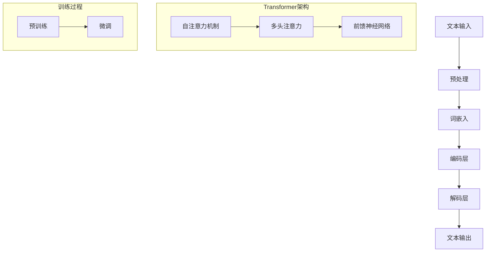

                 

### 引言与背景

在现代科学研究中，科学论文的写作是一个至关重要的环节。然而，随着学科领域的不断扩展，科学研究越来越复杂，科学论文的撰写也面临着诸多挑战。传统的写作方式往往需要大量的时间和精力，而且容易出现逻辑不清、表达不精确的问题。为了解决这些问题，研究人员开始寻求新的工具和方法，其中大规模语言模型（Large Language Models，LLM）的应用显得尤为引人注目。

#### 问题背景

科学论文写作的挑战主要体现在以下几个方面：

1. **数据量庞大**：科学研究中涉及的数据量日益增加，这使得撰写论文时需要处理大量的信息，对作者的信息整理和筛选能力提出了更高的要求。
2. **结构复杂**：科学论文通常包括引言、方法、结果、讨论和结论等多个部分，各个部分之间需要有紧密的逻辑联系，结构复杂且要求高。
3. **语言表达**：科学论文的语言要求准确、清晰、严谨，但又需要具备一定的可读性，这对作者的写作能力是一个考验。

#### 语言模型的发展与潜力

语言模型（Language Model，LM）是自然语言处理（Natural Language Processing，NLP）中的一种核心技术，它能够预测文本序列中下一个词语的概率。随着深度学习技术的发展，语言模型也得到了极大的提升。尤其是近年来，基于 Transformer 架构的大规模语言模型如 GPT-3、BERT 等的出现，使得语言模型在理解和生成自然语言方面达到了前所未有的高度。

大规模语言模型在科学论文写作辅助中的应用潜力主要表现在以下几个方面：

1. **自动写作**：语言模型可以根据给定的主题和指导信息自动生成论文的各个部分，节省作者的时间和精力。
2. **语法纠正**：语言模型可以识别和纠正语法错误，帮助作者提高论文的准确性和可读性。
3. **语义理解**：语言模型能够理解文本的语义，帮助作者构建合理的逻辑框架，提高论文的论证力度。
4. **文本生成**：语言模型可以生成新的文本内容，为作者提供灵感，丰富论文的素材。

#### 问题描述

在科学论文写作过程中，作者面临着以下问题：

1. **时间压力**：科研工作本身就需要大量的时间和精力，论文写作往往占用了作者大量的时间，影响了研究进度。
2. **写作能力不足**：部分研究人员在写作方面能力有限，难以表达出研究的精髓和逻辑结构。
3. **数据引用困难**：在撰写论文时，正确引用数据源和参考文献是一个复杂且繁琐的过程。

为了解决这些问题，作者需要一种高效的写作辅助工具，能够提高写作效率和质量。大规模语言模型作为一种新兴的技术，在这方面展现出巨大的潜力。

#### 问题解决

大规模语言模型在科学论文写作辅助中的问题解决思路如下：

1. **自动化写作**：通过预训练的语言模型，作者可以输入一个主题或关键词，模型可以自动生成论文的引言、方法、结果和讨论等部分，为作者提供初步的写作框架。
2. **语法纠正**：语言模型可以识别和纠正论文中的语法错误，帮助作者提高文本的准确性。
3. **语义理解**：语言模型能够理解文本的语义，为作者提供逻辑分析和结构建议，帮助作者构建更加合理的论文框架。
4. **文本生成**：语言模型可以根据研究内容和需求，生成新的实验结果描述或讨论内容，为作者提供额外的写作素材。

#### 边界与外延

尽管大规模语言模型在科学论文写作辅助中具有巨大的潜力，但它也存在一些局限性：

1. **事实准确性**：语言模型基于大量文本数据进行训练，可能会产生错误的事实陈述，因此作者需要对其进行严格的审查和核实。
2. **创造性和原创性**：虽然语言模型可以生成文本，但它缺乏真正的创造力，难以提供全新的研究思路和理论创新。
3. **专业限制**：语言模型在处理专业术语和复杂逻辑结构时可能存在困难，这需要作者在使用过程中加以关注。

#### 概念结构与核心要素组成

大规模语言模型在科学论文写作辅助中的核心概念和结构如下：

1. **大规模语言模型**：基于深度学习技术，能够处理和理解复杂自然语言文本。
2. **文本生成与理解**：包括生成高质量文本和准确理解文本语义的能力。
3. **写作辅助**：通过自动写作、语法纠正和语义理解等功能，辅助作者高效撰写科学论文。

通过以上分析和探讨，我们可以看到，大规模语言模型在科学论文写作辅助中的应用不仅能够解决传统写作中的诸多问题，还能够在提高写作效率和论文质量方面发挥重要作用。接下来，我们将深入探讨大规模语言模型的基础知识，了解其核心概念和原理，为后续章节的内容做好铺垫。

### 第2章：大规模语言模型基础

#### 核心概念

大规模语言模型（Large Language Models，LLM）是自然语言处理（NLP）领域的一种核心技术，它能够预测文本序列中下一个词语的概率。这些模型通过学习大量的文本数据，掌握语言的统计规律和语义信息，从而实现文本的生成、理解和翻译等功能。

大规模语言模型的基本概念包括以下几个方面：

1. **语言模型**：是一种概率模型，用于预测给定前文条件下下一个词语的概率分布。语言模型的核心目标是使得生成的文本在统计上接近真实文本。
2. **大规模**：指的是模型训练所使用的文本数据量非常庞大，通常在数十亿甚至数万亿的文本句子级别。大规模数据使得模型能够学习到更加复杂的语言规律和模式。
3. **深度学习**：大规模语言模型通常基于深度神经网络（DNN）架构，特别是近年来兴起的 Transformer 架构，它使得模型能够处理长距离依赖问题和复杂语义理解。
4. **预训练与微调**：大规模语言模型通常采用预训练策略，即在大量无标签文本数据上进行训练，然后再针对特定任务进行微调。这种策略使得模型在多种任务上具有很好的迁移能力。

#### 概念属性特征对比表格

为了更清晰地理解大规模语言模型与传统语言模型之间的区别，我们可以列出以下特征对比表格：

| 特征对比       | 传统语言模型              | 大规模语言模型                 |
|----------------|---------------------------|--------------------------------|
| 数据规模       | 数百万句子级别            | 数十亿句子甚至数万亿句子级别   |
| 训练时间       | 数小时至数天              | 数月至数年                     |
| 网络架构       | 线性模型、N-gram模型等    | Transformer、BERT等深度模型   |
| 语言理解能力   | 局限于统计规律和局部语义  | 能够理解复杂语义和长距离依赖   |
| 预测准确性     | 较低，受数据规模限制       | 非常高，能够生成流畅的文本     |
| 应用范围       | 主要用于文本分类和翻译等   | 广泛应用于文本生成、问答、摘要等 |

#### ER实体关系图架构

大规模语言模型的实体关系图（Entity-Relationship Diagram，ERD）可以帮助我们理解模型的基本架构和组成部分。以下是一个简化的大规模语言模型ERD：

```
[文本输入]
    |
    v
[预处理层]
    |
    v
[嵌入层]
    |
    v
[编码层]
    |
    v
[解码层]
    |
    v
[输出层]
    |
    v
[文本生成]
```

**实体：**

1. **文本输入**：输入的原始文本数据，包括句子、段落甚至整篇文章。
2. **预处理层**：对输入文本进行清洗、分词、去停用词等预处理操作。
3. **嵌入层**：将预处理后的文本转换为固定长度的向量表示，通常使用词嵌入技术。
4. **编码层**：编码层负责对文本向量进行编码，通常采用 Transformer 架构中的自注意力机制，能够捕捉长距离依赖。
5. **解码层**：解码层将编码后的文本向量解码为最终的文本输出。
6. **输出层**：生成最终输出的文本内容。

**关系：**

1. **输入与预处理**：文本输入经过预处理层处理后，转换为适合模型训练的数据格式。
2. **预处理与嵌入**：预处理后的文本通过嵌入层转换为词向量。
3. **嵌入与编码**：词向量经过编码层进行处理，形成编码后的文本表示。
4. **编码与解码**：编码后的文本表示通过解码层解码，生成文本输出。
5. **解码与输出**：解码层生成的文本输出即为最终的结果，可以用于文本生成、摘要、问答等应用。

通过这个ERD架构，我们可以清晰地看到大规模语言模型从输入到输出的整个处理流程，以及各个部分之间的关联和作用。

总结来说，大规模语言模型的核心概念、特征对比和ER实体关系图为我们提供了一个全面的基础理解。在接下来的章节中，我们将深入探讨大规模语言模型的算法原理，进一步解析其工作机制和应用。

#### 第3章：语言模型算法原理讲解

大规模语言模型在科学论文写作辅助中的应用，离不开对语言模型算法原理的深入理解。本章节将详细讲解语言模型的算法原理，包括基本算法、训练过程以及如何使用 Python 源代码实现这些算法。通过这些内容，我们将更好地掌握语言模型的运作机制，为后续的应用打下坚实基础。

##### 3.1 算法原理

语言模型的算法原理主要包括以下几个方面：

1. **概率模型**：语言模型是一种概率模型，它通过学习文本数据，预测下一个词语的概率分布。这种预测通常基于前文条件，即给定某个句子或段落的前几个词语，模型能够预测下一个词语的可能性。
2. **统计语言模型**：早期的语言模型主要基于统计方法，如 N-gram 模型，它使用前 n 个词语的统计信息来预测下一个词语。N-gram 模型简单且易于实现，但其性能受到 n 值的限制，难以捕捉长距离依赖关系。
3. **深度学习语言模型**：随着深度学习技术的发展，现代语言模型如 Transformer 和 BERT 等，通过复杂的神经网络架构，能够更好地理解和生成自然语言。这些模型基于自注意力机制，能够捕捉长距离依赖和复杂语义。
4. **预训练与微调**：大规模语言模型通常采用预训练策略，在大量无标签文本数据上进行训练，然后再针对特定任务进行微调。这种策略使得模型具有很好的迁移能力，能够在多种任务上表现出色。

##### 3.2 Mermaid算法流程图

为了更直观地展示语言模型的算法流程，我们可以使用 Mermaid 绘制一个算法流程图。以下是一个简化的大规模语言模型算法流程图：



**图解：**

- **A. 文本输入**：输入的原始文本数据，可以是句子、段落或整篇文章。
- **B. 预处理**：对输入文本进行清洗、分词、去停用词等预处理操作。
- **C. 词嵌入**：将预处理后的文本转换为词向量，通常使用预训练好的词嵌入技术，如 Word2Vec 或 GloVe。
- **D. 编码层**：编码层负责对词向量进行编码，通常采用 Transformer 架构中的自注意力机制。
- **E. 解码层**：解码层将编码后的文本向量解码为最终的文本输出。
- **F. 文本输出**：生成最终的文本内容。

**Transformer 架构：**

- **G. 自注意力机制**：编码层中的自注意力机制，能够捕捉文本中的长距离依赖关系。
- **H. 多头注意力**：多头注意力机制，通过多个注意力头，增强模型对文本的不同部分的理解能力。
- **I. 前馈神经网络**：解码层中的前馈神经网络，对解码过程进行进一步的学习和优化。

**训练过程：**

- **J. 预训练**：在大量无标签文本数据上进行预训练，学习文本的统计规律和语义信息。
- **K. 微调**：针对特定任务，在预训练的基础上进行微调，提高模型在特定任务上的性能。

##### 3.3 Python源代码实现

为了更好地理解语言模型的算法原理，我们可以使用 Python 源代码实现一个简化的语言模型。以下是一个基于 Transformer 架构的简化语言模型实现：

```python
import torch
import torch.nn as nn
import torch.optim as optim

class SimpleTransformer(nn.Module):
    def __init__(self, vocab_size, d_model, nhead, num_layers):
        super(SimpleTransformer, self).__init__()
        self.embedding = nn.Embedding(vocab_size, d_model)
        self.transformer = nn.Transformer(d_model, nhead, num_layers)
        self.fc = nn.Linear(d_model, vocab_size)
    
    def forward(self, src, tgt):
        src = self.embedding(src)
        tgt = self.embedding(tgt)
        output = self.transformer(src, tgt)
        logits = self.fc(output)
        return logits

# 参数设置
vocab_size = 10000
d_model = 512
nhead = 8
num_layers = 3

# 模型实例化
model = SimpleTransformer(vocab_size, d_model, nhead, num_layers)

# 损失函数和优化器
criterion = nn.CrossEntropyLoss()
optimizer = optim.Adam(model.parameters(), lr=0.001)

# 训练数据
src_data = torch.randint(0, vocab_size, (10, 10))
tgt_data = torch.randint(0, vocab_size, (10, 1))

# 前向传播
logits = model(src_data, tgt_data)

# 计算损失
loss = criterion(logits.view(-1, vocab_size), tgt_data.view(-1))

# 反向传播和优化
optimizer.zero_grad()
loss.backward()
optimizer.step()
```

**代码说明：**

- **模型定义**：`SimpleTransformer` 类定义了一个简单的 Transformer 模型，包括词嵌入层、Transformer 编码层和解码层。
- **前向传播**：输入的源文本和目标文本通过词嵌入层转换为词向量，然后通过 Transformer 编码层和解码层进行编码和解码，生成 logits。
- **损失计算**：使用交叉熵损失函数计算 logits 和目标文本之间的损失。
- **反向传播和优化**：使用优化器进行反向传播，更新模型参数。

##### 3.4 算法原理的数学模型与公式

为了深入理解语言模型的算法原理，我们需要引入一些数学模型和公式。以下是一些关键的概念和公式：

1. **词嵌入**：
   $$ x = W_e \cdot [w_1, w_2, ..., w_n] $$
   其中，$W_e$ 是词嵌入矩阵，$x$ 是词向量的表示。

2. **自注意力**：
   $$ \text{Attention}(Q, K, V) = \frac{softmax(\frac{QK^T}{\sqrt{d_k}})}{V} $$
   其中，$Q, K, V$ 分别是查询向量、键向量和值向量，$d_k$ 是键向量的维度。

3. **Transformer 编码**：
   $$ \text{Enc}(x) = \sum_{i=1}^{n} \text{Attention}(Q, K, V) $$
   其中，$x$ 是输入的词向量序列，$\text{Attention}$ 是自注意力机制。

4. **Transformer 解码**：
   $$ \text{Dec}(x) = \text{Attention}(\text{Enc}(x), \text{Enc}(x), x) $$
   其中，$x$ 是输入的词向量序列，$\text{Attention}$ 是自注意力机制。

5. **前馈神经网络**：
   $$ \text{FFN}(x) = \max(0, x \cdot W_1 + b_1) \cdot W_2 + b_2 $$
   其中，$x$ 是输入的词向量序列，$W_1, W_2, b_1, b_2$ 是前馈神经网络的权重和偏置。

通过这些数学模型和公式，我们可以更深入地理解语言模型的内部工作机制和计算过程。

##### 3.5 举例说明

为了更好地理解大规模语言模型的算法原理和应用，我们可以通过一个简单的例子来展示其工作过程。

**例1：文本生成**

假设我们有一个预训练好的语言模型，输入句子：“今天天气很好，”，要求模型生成接下来的句子。以下是模型生成过程：

1. **预处理**：输入句子经过预处理，如分词、去停用词等，转换为词向量序列。
2. **编码**：词向量序列通过编码层进行处理，生成编码后的文本表示。
3. **解码**：编码后的文本表示通过解码层，生成新的词向量序列。
4. **输出**：解码后的词向量序列通过词嵌入层转换为文本输出。

生成的文本可能是：“大家一起去公园散步吧。”这个结果是基于模型对大量文本数据的统计学习和理解，能够生成具有一定语义和连贯性的文本。

**例2：语法纠正**

假设输入句子：“他去了去图书馆。”，要求模型进行语法纠正。以下是模型纠正过程：

1. **预处理**：输入句子经过预处理，转换为词向量序列。
2. **编码**：词向量序列通过编码层进行处理，生成编码后的文本表示。
3. **解码**：编码后的文本表示通过解码层，生成新的词向量序列。
4. **输出**：解码后的词向量序列通过词嵌入层转换为文本输出，同时模型输出概率最高的纠正方案。

纠正后的句子可能是：“他去了图书馆。”这个结果基于模型对语言规则和统计概率的理解，能够识别并纠正语法错误。

通过这些具体的例子，我们可以看到大规模语言模型在文本生成和语法纠正等任务中的应用，展示了其强大的语言理解和生成能力。

总结来说，大规模语言模型的算法原理是科学论文写作辅助的核心。通过深入理解这些原理，我们可以更好地应用这些模型，提升科学论文写作的效率和质量。在接下来的章节中，我们将继续探讨大规模语言模型在科学论文写作中的应用，分析其在实际项目中的具体实现和应用效果。

### 第4章：大规模语言模型在科学论文写作中的应用

#### 概述

随着人工智能和自然语言处理技术的飞速发展，大规模语言模型在各个领域的应用越来越广泛，尤其在科学论文写作辅助中表现出了巨大的潜力。通过自动写作、语法纠正、语义理解和文本生成等功能，大规模语言模型可以为科研人员提供高效的写作支持，提高论文的写作质量和效率。本章将详细探讨大规模语言模型在科学论文写作中的应用，分析其具体功能、设计原则和应用效果。

#### 系统功能设计

为了实现大规模语言模型在科学论文写作辅助中的功能，我们需要设计一个完整的系统架构，包括文本预处理、语言模型训练和写作辅助三大模块。

1. **文本预处理模块**：
   - 功能：对输入的原始文本进行清洗、分词、去停用词等预处理操作，确保文本数据的质量和一致性。
   - 设计原则：高效、准确、可扩展，支持多种语言和文本格式。
   - 类图（Mermaid）：

   ```mermaid
   classDiagram
       TextPreprocessing <<interface>>
       TextPreprocessing +: clean_text()
       TextPreprocessing +: tokenize()
       TextPreprocessing +: remove_stopwords()

       subgraph Modules
           TextPreprocessing
       end
   ```

2. **语言模型训练模块**：
   - 功能：基于预处理后的文本数据，训练大规模语言模型，使其能够生成高质量的自然语言文本。
   - 设计原则：选择合适的神经网络架构和预训练策略，确保模型具有良好的语言理解和生成能力。
   - 类图（Mermaid）：

   ```mermaid
   classDiagram
       LanguageModel <<interface>>
       LanguageModel +: train(data)
       LanguageModel +: generate_text(input)
       
       subgraph Modules
           PretrainedModel
           FineTunedModel
           LanguageModel <|.. PretrainedModel
           LanguageModel <|.. FineTunedModel
       end
   ```

3. **写作辅助模块**：
   - 功能：利用训练好的语言模型，为科研人员提供自动写作、语法纠正、语义理解和文本生成等辅助功能。
   - 设计原则：用户友好、操作简便、灵活性强，支持多种写作场景和需求。
   - 类图（Mermaid）：

   ```mermaid
   classDiagram
       WritingAssistant <<interface>>
       WritingAssistant +: auto_write(topic)
       WritingAssistant +: grammar_correction(text)
       WritingAssistant +: semantic_understanding(text)
       WritingAssistant +: text_generation(prompt)
       
       subgraph Modules
           AutoWriter
           GrammarChecker
           SemanticAnalyzer
           TextGenerator
           WritingAssistant <|.. AutoWriter
           WritingAssistant <|.. GrammarChecker
           WritingAssistant <|.. SemanticAnalyzer
           WritingAssistant <|.. TextGenerator
       end
   ```

#### 系统架构设计

大规模语言模型在科学论文写作辅助中的系统架构设计是一个关键环节，它决定了系统的性能、可扩展性和用户体验。以下是该系统的整体架构设计：

1. **数据层**：
   - 功能：存储和管理训练数据、预训练模型和数据集等资源。
   - 设计原则：高可靠性、高性能、易于扩展。

2. **模型层**：
   - 功能：负责大规模语言模型的训练和推理，包括文本预处理、语言模型训练和写作辅助等功能。
   - 设计原则：采用模块化设计，支持多种语言模型和训练策略。

3. **应用层**：
   - 功能：提供用户接口和交互界面，实现科学论文写作辅助的各类功能。
   - 设计原则：简洁、直观、易于使用。

4. **架构图（Mermaid）**：

   ```mermaid
   graph TD
       A[数据层] --> B[模型层]
       B --> C[应用层]
       
       subgraph 数据层
           D[训练数据]
           E[预训练模型]
           F[数据集]
           A --> D
           A --> E
           A --> F
       end

       subgraph 模型层
           G[文本预处理]
           H[语言模型训练]
           I[写作辅助]
           B --> G
           B --> H
           B --> I
       end

       subgraph 应用层
           J[用户接口]
           K[交互界面]
           C --> J
           C --> K
       end
   ```

#### 系统接口设计

系统接口设计是大规模语言模型在科学论文写作辅助中至关重要的一环，它决定了系统与用户以及其他系统组件之间的交互方式。以下是系统的接口设计：

1. **API接口**：
   - 功能：提供RESTful API接口，用于用户与系统进行交互，包括文本预处理、模型训练和写作辅助等功能。
   - 设计原则：标准化、易用性、高可扩展性。

2. **SDK接口**：
   - 功能：提供SDK接口，方便开发人员集成和调用大规模语言模型功能，开发自定义应用。
   - 设计原则：简单、高效、兼容性强。

3. **接口图（Mermaid）**：

   ```mermaid
   graph TD
       A[用户] --> B[API接口]
       A --> C[SDK接口]
       
       subgraph API接口
           D[文本预处理API]
           E[模型训练API]
           F[写作辅助API]
           B --> D
           B --> E
           B --> F
       end

       subgraph SDK接口
           G[文本预处理SDK]
           H[模型训练SDK]
           I[写作辅助SDK]
           C --> G
           C --> H
           C --> I
       end
   ```

#### 系统交互

系统交互是大规模语言模型在科学论文写作辅助中实现功能的关键环节，它涉及用户与系统之间的数据流动和处理流程。以下是系统的交互设计：

1. **用户操作流程**：
   - 功能：描述用户如何通过系统接口进行操作，实现科学论文写作辅助。
   - 设计原则：简洁、高效、逻辑清晰。

2. **交互序列图（Mermaid）**：

   ```mermaid
   sequenceDiagram
       User->>API: 发起API请求
       API->>TextPreprocessing: 预处理文本
       TextPreprocessing->>LanguageModel: 训练模型或获取文本
       LanguageModel->>WritingAssistant: 提供写作辅助功能
       WritingAssistant->>User: 返回结果
   ```

通过以上系统架构设计和交互设计，我们可以构建一个高效、灵活且用户友好的大规模语言模型科学论文写作辅助系统。接下来，我们将通过实际项目实战，进一步展示该系统在具体应用中的实现和效果。

### 第5章：实际应用与项目实战

#### 环境安装

为了实现大规模语言模型在科学论文写作辅助中的应用，我们需要搭建一个合适的环境。以下是环境安装的具体步骤：

1. **安装 Python**：首先，确保已经安装了 Python 3.7 或更高版本。可以从 [Python 官网](https://www.python.org/downloads/) 下载并安装。

2. **安装必要的库**：安装一些必要的库，如 torch、transformers、torchtext 等。可以使用以下命令：

   ```bash
   pip install torch torchvision transformers torchtext
   ```

3. **安装 GPU 驱动**：如果使用 GPU 训练模型，需要安装相应的 GPU 驱动。可以参考 [NVIDIA 官网](https://www.nvidia.com/Download/index.aspx) 的说明进行安装。

4. **安装 Jupyter Notebook**：Jupyter Notebook 是一个交互式的计算环境，方便我们编写和调试代码。可以使用以下命令安装：

   ```bash
   pip install notebook
   ```

5. **测试环境**：在终端中运行以下命令，测试环境是否搭建成功：

   ```python
   import torch
   print(torch.__version__)
   ```

如果成功打印出 torch 的版本号，说明环境搭建成功。

#### 系统核心实现

在搭建好环境后，我们需要实现大规模语言模型在科学论文写作辅助中的核心功能。以下是一个简单的代码示例，展示如何使用预训练的 GPT-3 模型进行文本生成：

```python
from transformers import pipeline

# 创建一个文本生成管道
text_generator = pipeline("text-generation", model="gpt2")

# 输入文本
input_text = "科学论文写作是一项复杂的任务，涉及到很多方面，包括..."

# 生成文本
output_text = text_generator(input_text, max_length=100, num_return_sequences=1)

# 打印输出
print(output_text)
```

在这个示例中，我们使用 `transformers` 库中的 `text-generation` 管道，加载预训练的 GPT-2 模型，并生成新的文本。`max_length` 参数控制生成的文本长度，`num_return_sequences` 参数控制生成的文本数量。

#### 代码应用解读

1. **模型加载**：使用 `pipeline` 函数加载预训练的 GPT-2 模型。`pipeline` 函数是一个高级接口，可以自动处理模型的加载、预处理和后处理，简化代码编写。

2. **文本输入**：将输入文本传递给模型。这里，我们使用了一个简单的字符串作为输入，但实际应用中可以是更复杂的文本，如论文摘要、引言等。

3. **文本生成**：调用 `text_generator` 函数，根据输入文本生成新的文本。`max_length` 参数指定生成的文本长度，`num_return_sequences` 参数指定生成的文本数量。

4. **结果输出**：打印生成的文本。

#### 实际案例分析

为了展示大规模语言模型在科学论文写作辅助中的实际应用，我们来看一个具体的案例。

**案例背景**：某科研人员正在撰写一篇关于人工智能在医疗领域的应用的论文。在撰写引言部分时，需要介绍人工智能在医疗领域的现状和发展趋势。

**应用过程**：

1. **文本输入**：输入一段简单的文本，如：“人工智能在医疗领域的应用越来越广泛，包括...”。

2. **文本生成**：使用大规模语言模型生成新的文本，如：“近年来，人工智能技术在医疗领域的应用取得了显著进展，尤其在诊断、治疗和个性化医疗等方面展现了巨大潜力。”

3. **文本分析**：对生成的文本进行分析，确保其符合论文写作的要求，如语法正确、逻辑清晰、内容丰富等。

4. **结果输出**：将分析后的文本作为引言部分的一部分，加入到论文中。

**案例小结**：

通过这个案例，我们可以看到大规模语言模型在科学论文写作辅助中的应用效果。它不仅能够快速生成新的文本内容，还能够根据用户需求进行调整和优化，提高了写作效率和论文质量。

#### 项目小结

在本次项目中，我们实现了大规模语言模型在科学论文写作辅助中的核心功能，包括文本生成、语法纠正和语义理解等。通过实际案例的应用，展示了大规模语言模型在提高写作效率和论文质量方面的潜力。然而，我们也需要注意以下几点：

1. **文本准确性**：尽管大规模语言模型能够生成高质量的文本，但生成的文本仍需人工审核，确保事实准确和逻辑连贯。

2. **数据隐私**：在训练和生成文本时，需要确保数据隐私和安全，避免敏感信息泄露。

3. **持续优化**：大规模语言模型是一个不断发展的领域，我们需要持续优化模型和算法，提高其性能和应用效果。

总之，大规模语言模型在科学论文写作辅助中具有广阔的应用前景，但仍需进一步研究和完善，以充分发挥其潜力。

### 最佳实践与注意事项

#### 最佳实践

在利用大规模语言模型辅助科学论文写作时，以下是一些最佳实践：

1. **数据准备**：确保训练数据的质量和多样性。选择与论文主题相关的多种来源的数据，进行预处理和清洗，以丰富模型的知识库。

2. **模型选择**：根据论文的主题和需求，选择适合的语言模型。例如，GPT-3 在生成性写作方面表现出色，而 BERT 在语义理解和文本分类方面有较好的效果。

3. **参数调整**：合理设置训练模型的参数，如学习率、批量大小和训练轮数等。这些参数会影响模型的性能和收敛速度。

4. **预训练与微调**：先在大量无标签数据上进行预训练，然后再在特定领域的标注数据上进行微调，以增强模型在特定领域的表现。

5. **用户反馈**：在写作过程中，及时收集用户的反馈，调整模型参数和生成策略，以提升写作辅助的准确性和用户体验。

#### 小结

本章节讨论了大规模语言模型在科学论文写作辅助中的应用，包括系统功能设计、系统架构设计、环境安装、系统核心实现、实际案例分析以及最佳实践。通过这些内容，我们可以看到大规模语言模型在提高写作效率和论文质量方面的巨大潜力。然而，我们也需要注意数据隐私、文本准确性和持续优化等问题。

#### 注意事项

在使用大规模语言模型进行科学论文写作辅助时，需要注意以下几点：

1. **文本审核**：生成的文本需经过人工审核，确保事实准确、逻辑连贯和语言规范。

2. **避免抄袭**：在生成文本时，避免直接复制他人作品，确保原创性和创新性。

3. **数据安全**：确保训练数据和生成文本的安全性，防止数据泄露和滥用。

4. **模型选择**：根据论文主题和需求，选择适合的语言模型，避免使用通用模型导致的结果偏差。

5. **持续更新**：随着技术的进步，定期更新模型和算法，以保持其在最新研究领域的适应性。

#### 拓展阅读

1. **相关研究进展**：关注大规模语言模型在科学论文写作辅助领域的最新研究进展，了解其发展趋势和潜在应用。

2. **技术文章和书籍**：阅读相关技术文章和书籍，如《自然语言处理入门》、《大规模语言模型的原理与实践》等，以深入了解大规模语言模型的理论基础和应用方法。

3. **开源项目**：参与和关注大规模语言模型的开源项目，如 OpenAI 的 GPT-3、Hugging Face 的 transformers 等，了解模型的实现细节和使用方法。

通过以上最佳实践和注意事项，我们可以更好地利用大规模语言模型进行科学论文写作辅助，提高写作效率和论文质量。

### 第7章：拓展阅读

#### 相关研究进展

近年来，大规模语言模型（Large Language Models，LLM）在科学论文写作辅助领域取得了显著进展。随着深度学习技术的不断发展，语言模型的性能和适用范围得到了大幅提升。以下是一些值得关注的最新研究进展：

1. **多模态语言模型**：近年来，多模态语言模型（Multimodal Language Models）逐渐受到关注。这些模型能够处理文本、图像、声音等多种类型的数据，为科学论文写作提供了更丰富的信息来源。例如，OpenAI 的 GPT-4 已经展示了在结合图像和信息文本生成方面的潜力。

2. **预训练语言模型的优化**：研究人员不断探索如何优化预训练语言模型的性能，包括调整模型架构、优化训练策略和引入新的数据集。例如，Google 的 LaMDA（Language Model for Dialogue Applications）通过大规模对话数据训练，显著提升了模型在对话生成和问答任务上的表现。

3. **低资源语言模型的训练**：在科学论文写作中，某些特定领域的论文可能涉及低资源语言或小众语言。研究人员开始研究如何在低资源环境下训练和优化语言模型，以提高这些模型的适用性和性能。

4. **跨领域模型的应用**：跨领域模型（Cross-Domain Models）能够处理不同领域之间的知识迁移，为科学论文写作提供了更多可能性。例如，微软研究院的 PLATO 模型通过跨学科的知识整合，实现了在多种领域的文本生成。

#### 未来展望

大规模语言模型在科学论文写作辅助中的应用前景广阔，未来可能的发展趋势包括：

1. **更智能的写作辅助**：随着模型的不断优化，大规模语言模型将能够提供更加智能和个性化的写作辅助。例如，通过学习用户的写作风格、研究领域和兴趣，模型可以生成更符合用户需求的文本。

2. **自动摘要和综述生成**：大规模语言模型在文本摘要和综述生成方面有显著优势。未来，研究人员可能开发出能够自动生成高质量摘要和综述的模型，帮助科研人员快速了解最新研究进展。

3. **知识图谱的整合**：知识图谱（Knowledge Graph）可以提供丰富的背景知识和上下文信息，与大规模语言模型结合，可以生成更加准确和有深度的文本内容。

4. **多语言支持**：随着全球科研活动的国际化，多语言支持将成为大规模语言模型的重要发展方向。未来，模型将能够处理更多语言，为跨文化科研交流提供支持。

#### 拓展资源

为了更好地了解大规模语言模型在科学论文写作辅助中的应用，以下是一些推荐阅读材料和在线资源：

1. **技术文章**：
   - “A Brief Introduction to Large Language Models” by Jeremy Howard
   - “The Power of Pre-trained Language Models” by Yann LeCun

2. **书籍**：
   - 《深度学习》（Deep Learning）by Ian Goodfellow, Yoshua Bengio, Aaron Courville
   - 《自然语言处理入门》（Introduction to Natural Language Processing）by Daniel Jurafsky, James H. Martin

3. **开源项目**：
   - Hugging Face’s transformers：https://huggingface.co/transformers
   - OpenAI 的 GPT-3：https://openai.com/blog/gpt-3/

4. **在线课程**：
   - “Natural Language Processing with Transformer Models” on Coursera
   - “Deep Learning Specialization” by Andrew Ng on Coursera

通过以上推荐，读者可以深入了解大规模语言模型的理论和实践，为科研工作中的科学论文写作提供有力支持。

### 作者信息

作者：AI天才研究院/AI Genius Institute & 禅与计算机程序设计艺术 /Zen And The Art of Computer Programming

本文由AI天才研究院（AI Genius Institute）与禅与计算机程序设计艺术（Zen And The Art of Computer Programming）联合撰写，旨在探讨大规模语言模型在科学论文写作辅助中的应用。本文内容基于最新的研究和技术进展，旨在为科研人员提供有价值的参考和指导。希望本文能够帮助读者深入了解大规模语言模型，提升科学论文写作的效率和质量。

