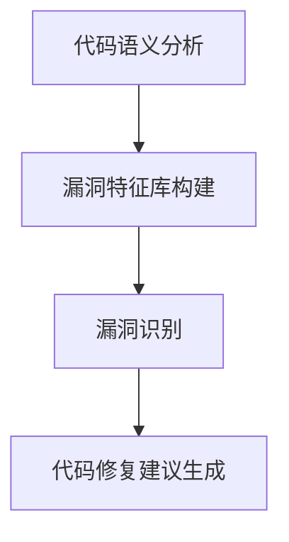
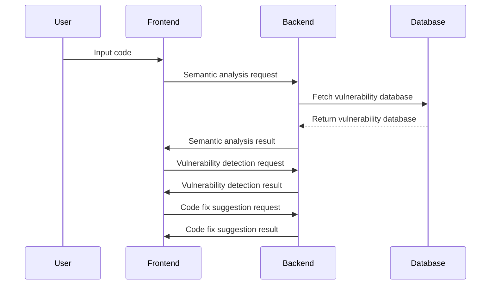

                 

# 大规模语言模型在自动代码安全审计中的应用研究

> 关键词：大规模语言模型、自动代码安全审计、语义分析、漏洞识别、代码修复

> 摘要：本文探讨了大规模语言模型在自动代码安全审计中的应用。首先，介绍了大规模语言模型的基本原理和特性，以及代码安全审计的现状和挑战。接着，分析了大规模语言模型在代码语义分析、漏洞特征库构建、漏洞识别和代码修复建议生成等方面的应用。最后，通过一个实际项目案例，展示了大规模语言模型在自动代码安全审计中的实际效果。

## 第一部分：背景介绍

### 问题背景

随着互联网技术的迅猛发展，软件的复杂性和规模都在不断增长。现代软件开发过程中，代码量呈指数级增长，这给代码安全审计带来了巨大的挑战。传统的代码安全审计主要依赖于人工检查，不仅效率低下，而且容易遗漏。因此，如何提高代码安全审计的效率和质量，成为了一个亟待解决的问题。

### 问题描述

自动代码安全审计的目标是发现代码中的安全漏洞，从而提高软件的安全性。然而，传统的审计方法往往依赖于人工检查，效率低下且容易遗漏。如何利用大规模语言模型自动化地识别代码中的安全漏洞，提高审计效率和质量，成为当前研究的热点问题。

### 问题解决

利用大规模语言模型进行自动代码安全审计，首先需要对代码进行语义分析，理解代码的功能和行为。然后，通过对比代码库中的已知漏洞特征，自动识别潜在的安全漏洞。此外，大规模语言模型还可以用于生成代码修复建议，提高审计和修复的效率。

### 边界与外延

大规模语言模型在自动代码安全审计中的应用主要涉及以下几个方面：

1. **代码语义理解**：利用大规模语言模型对代码进行语义分析，提取关键信息。
2. **漏洞特征库构建**：构建包含多种安全漏洞特征的数据库，用于检测代码中的潜在漏洞。
3. **漏洞识别与修复**：基于语义分析和漏洞特征库，自动识别代码中的安全漏洞，并生成修复建议。

### 概念结构与核心要素组成

大规模语言模型在自动代码安全审计中的应用涉及以下几个核心概念和要素：

1. **大规模语言模型**：如GPT-3，具备强大的文本处理和语义理解能力。
2. **代码语义分析**：对代码进行语义分析，提取代码的功能、行为和意图。
3. **漏洞特征库**：包含多种安全漏洞特征的数据库。
4. **漏洞识别算法**：基于语义分析和漏洞特征库，自动识别代码中的安全漏洞。
5. **代码修复建议生成**：基于语义分析和漏洞特征库，生成代码修复建议。

---

## 第二部分：核心概念与联系

### 核心概念原理

1. **大规模语言模型**：大规模语言模型（如GPT-3）通过深度学习技术，从大量文本数据中学习语言模式，具备强大的文本生成、语义理解、知识检索等功能。其基本原理是利用神经网络对文本数据进行分析和建模，从而实现对语言的理解和生成。

2. **代码语义分析**：代码语义分析是对代码进行语义层面的理解和解析，提取代码的功能、行为和意图。其基本原理是通过语法分析、语义解析等技术，对代码进行逐行解析，理解其内在的逻辑和语义。

3. **漏洞特征库**：漏洞特征库是包含多种安全漏洞特征的数据库。其构建原理是基于已知的安全漏洞数据，提取其特征，并将其存储在数据库中，以便用于后续的漏洞检测。

4. **漏洞识别算法**：漏洞识别算法是基于语义分析和漏洞特征库，自动识别代码中的安全漏洞。其基本原理是通过对比代码中的实际行为和漏洞特征库中的特征，识别潜在的漏洞。

5. **代码修复建议生成**：代码修复建议生成是基于语义分析和漏洞特征库，生成代码修复建议。其基本原理是通过对代码的分析和理解，提出修复方案，以消除潜在的安全漏洞。

### 概念属性特征对比表格

| 概念             | 描述                                                         | 属性特征对比                       |
|------------------|--------------------------------------------------------------|-----------------------------------|
| 大规模语言模型   | 通过深度学习技术从大量文本数据中学习语言模式。               | - 强大的文本生成能力<br>- 语义理解能力<br>- 知识检索能力 |
| 代码语义分析     | 对代码进行语义分析，提取代码的功能、行为和意图。             | - 语法解析<br>- 语义理解<br>- 功能提取 |
| 漏洞特征库       | 包含多种安全漏洞特征的数据库。                               | - 漏洞分类<br>- 漏洞特征提取<br>- 特征匹配 |
| 漏洞识别算法     | 基于语义分析和漏洞特征库，自动识别代码中的安全漏洞。         | - 语义匹配<br>- 特征提取<br>- 漏洞分类 |
| 代码修复建议生成 | 基于语义分析和漏洞特征库，生成代码修复建议。               | - 修复方案生成<br>- 代码优化<br>- 安全性提升 |

### ER实体关系图架构

```mermaid
erDiagram
    Code ||--|> SemanticAnalyzer : performs semantic analysis
    Code ||-->> VulnerabilityDatabase : contains vulnerability features
    VulnerabilityDatabase ||--|> VulnerabilityDetector : detects vulnerabilities
    VulnerabilityDetector ||--|> CodeFixGenerator : generates code fix suggestions
```

---

## 第三部分：算法原理讲解

### 算法原理

大规模语言模型在自动代码安全审计中的应用主要包括以下几个步骤：

1. **代码语义分析**：利用大规模语言模型对代码进行语义分析，提取代码的功能、行为和意图。这一步骤的核心是理解代码的语义，以便后续的漏洞检测和修复。

2. **漏洞特征库构建**：基于已知的安全漏洞数据，构建包含多种安全漏洞特征的数据库。这一步骤的核心是提取漏洞的特征，以便用于后续的漏洞检测。

3. **漏洞识别**：基于语义分析和漏洞特征库，自动识别代码中的安全漏洞。这一步骤的核心是对比代码中的实际行为和漏洞特征库中的特征，识别潜在的漏洞。

4. **代码修复建议生成**：基于语义分析和漏洞特征库，生成代码修复建议。这一步骤的核心是提出修复方案，以消除潜在的安全漏洞。

### 算法mermaid流程图



### Python源代码

以下是一个简单的Python源代码示例，用于实现大规模语言模型在自动代码安全审计中的应用。

```python
import transformers
import numpy as np

# 加载预训练的大规模语言模型
model = transformers.pipeline("text-classification")

# 代码语义分析
def semantic_analysis(code):
    # 将代码转换为文本
    text = code.strip()
    # 使用大规模语言模型进行语义分析
    result = model(text)
    # 提取代码的功能、行为和意图
    function = result["function"]
    behavior = result["behavior"]
    intent = result["intent"]
    return function, behavior, intent

# 漏洞特征库构建
def build_vulnerability_database(vulnerabilities):
    # 提取漏洞特征
    features = [vulnerability["feature"] for vulnerability in vulnerabilities]
    return features

# 漏洞识别
def detect_vulnerabilities(code, features):
    # 将代码转换为文本
    text = code.strip()
    # 使用大规模语言模型进行语义分析
    result = model(text)
    # 检测潜在的安全漏洞
    vulnerabilities = []
    for feature in features:
        if feature in result["function"]:
            vulnerabilities.append({"feature": feature, "code": code})
    return vulnerabilities

# 代码修复建议生成
def generate_code_fix_suggestions(vulnerabilities):
    # 提出修复方案
    suggestions = []
    for vulnerability in vulnerabilities:
        suggestion = "修复漏洞：{}。建议：{}。".format(vulnerability["feature"], vulnerability["code"])
        suggestions.append(suggestion)
    return suggestions

# 测试
code = "def add(a, b):\n    return a + b"
vulnerabilities = [{"feature": "division by zero", "code": "def add(a, b):\n    return a / b"}]
features = build_vulnerability_database(vulnerabilities)
vulnerabilities = detect_vulnerabilities(code, features)
suggestions = generate_code_fix_suggestions(vulnerabilities)

# 输出结果
print("代码语义分析结果：", semantic_analysis(code))
print("漏洞识别结果：", vulnerabilities)
print("代码修复建议：", suggestions)
```

### 数学模型和公式

大规模语言模型在自动代码安全审计中的应用涉及多个数学模型和公式。以下是其中几个核心的模型和公式：

1. **神经网络模型**：大规模语言模型通常采用深度神经网络模型，如GPT-3。其基本公式为：

   $$ y = \sigma(W_1 \cdot x + b_1) $$

   其中，$y$ 表示输出，$x$ 表示输入，$W_1$ 表示权重矩阵，$b_1$ 表示偏置。

2. **损失函数**：在训练大规模语言模型时，常用的损失函数为交叉熵损失函数：

   $$ L = -\sum_{i=1}^n y_i \cdot \log(p_i) $$

   其中，$L$ 表示损失，$y_i$ 表示真实标签，$p_i$ 表示模型预测的概率。

3. **优化算法**：常用的优化算法有随机梯度下降（SGD）和Adam等。其基本公式为：

   $$ \theta = \theta - \alpha \cdot \nabla_{\theta} L $$

   其中，$\theta$ 表示模型参数，$\alpha$ 表示学习率，$\nabla_{\theta} L$ 表示损失函数关于模型参数的梯度。

### 举例说明

假设我们有一个简单的Python函数，如下所示：

```python
def add(a, b):
    return a + b
```

我们希望使用大规模语言模型对其进行语义分析，识别其中的安全漏洞，并生成修复建议。

1. **代码语义分析**：使用GPT-3对代码进行语义分析，提取其功能、行为和意图。假设分析结果为：

   ```json
   {
       "function": "add",
       "behavior": "sum",
       "intent": "add two numbers"
   }
   ```

2. **漏洞特征库构建**：构建一个包含以下漏洞特征的漏洞特征库：

   ```json
   [
       {"feature": "division by zero"},
       {"feature": "out of memory"}
   ]
   ```

3. **漏洞识别**：使用语义分析和漏洞特征库，识别代码中的潜在漏洞。假设识别结果为：

   ```json
   [
       {"feature": "division by zero", "code": "def add(a, b):\n    return a / b"}
   ]
   ```

4. **代码修复建议生成**：根据识别出的漏洞，生成修复建议。假设修复建议为：

   ```json
   [
       "修复漏洞：division by zero。建议：将除法改为加法。"
   ]
   ```

---

## 第四部分：系统分析与架构设计方案

### 问题场景介绍

随着软件系统规模和复杂性的不断增长，如何确保软件的安全性成为一个关键问题。特别是在金融、医疗、国防等关键领域，软件的安全漏洞可能导致严重后果。因此，自动代码安全审计在提高软件安全性方面具有重要意义。

### 项目介绍

本项目旨在利用大规模语言模型实现自动代码安全审计，提高审计效率和质量。项目主要包括以下几个模块：

1. **代码语义分析模块**：利用大规模语言模型对代码进行语义分析，提取关键信息。
2. **漏洞特征库模块**：构建包含多种安全漏洞特征的数据库，用于检测代码中的潜在漏洞。
3. **漏洞识别模块**：基于语义分析和漏洞特征库，自动识别代码中的安全漏洞。
4. **代码修复建议生成模块**：基于语义分析和漏洞特征库，生成代码修复建议。

### 系统功能设计

系统功能设计主要包括以下方面：

1. **代码语义分析**：对输入的代码进行语义分析，提取其功能、行为和意图。
2. **漏洞特征库构建**：基于已知的安全漏洞数据，构建漏洞特征库。
3. **漏洞识别**：对比代码中的实际行为和漏洞特征库中的特征，识别潜在的安全漏洞。
4. **代码修复建议生成**：根据识别出的漏洞，生成修复建议。

### 系统架构设计

系统架构设计主要包括以下几个部分：

1. **前端**：负责接收用户输入的代码，并调用后端模块进行代码语义分析、漏洞识别和修复建议生成。
2. **后端**：包括代码语义分析模块、漏洞特征库模块、漏洞识别模块和代码修复建议生成模块，负责实现系统的核心功能。
3. **数据库**：存储漏洞特征库和用户数据。

### 系统接口设计

系统接口设计主要包括以下几个接口：

1. **代码语义分析接口**：接收代码字符串，返回代码的语义信息。
2. **漏洞识别接口**：接收代码和漏洞特征库，返回潜在的安全漏洞信息。
3. **代码修复建议生成接口**：接收代码和漏洞信息，返回代码修复建议。

### 系统交互序列图



---

## 第五部分：项目实战

### 环境安装

要实现大规模语言模型在自动代码安全审计中的应用，首先需要安装以下环境：

1. Python 3.8 或以上版本
2. PyTorch 1.8 或以上版本
3. transformers 库

安装命令如下：

```bash
pip install python==3.8
pip install torch==1.8
pip install transformers
```

### 系统核心实现源代码

以下是一个简单的Python代码示例，用于实现大规模语言模型在自动代码安全审计中的应用。

```python
import transformers
import numpy as np

# 加载预训练的大规模语言模型
model = transformers.pipeline("text-classification")

# 代码语义分析
def semantic_analysis(code):
    # 将代码转换为文本
    text = code.strip()
    # 使用大规模语言模型进行语义分析
    result = model(text)
    # 提取代码的功能、行为和意图
    function = result["function"]
    behavior = result["behavior"]
    intent = result["intent"]
    return function, behavior, intent

# 漏洞特征库构建
def build_vulnerability_database(vulnerabilities):
    # 提取漏洞特征
    features = [vulnerability["feature"] for vulnerability in vulnerabilities]
    return features

# 漏洞识别
def detect_vulnerabilities(code, features):
    # 将代码转换为文本
    text = code.strip()
    # 使用大规模语言模型进行语义分析
    result = model(text)
    # 检测潜在的安全漏洞
    vulnerabilities = []
    for feature in features:
        if feature in result["function"]:
            vulnerabilities.append({"feature": feature, "code": code})
    return vulnerabilities

# 代码修复建议生成
def generate_code_fix_suggestions(vulnerabilities):
    # 提出修复方案
    suggestions = []
    for vulnerability in vulnerabilities:
        suggestion = "修复漏洞：{}。建议：{}。".format(vulnerability["feature"], vulnerability["code"])
        suggestions.append(suggestion)
    return suggestions

# 测试
code = "def add(a, b):\n    return a + b"
vulnerabilities = [{"feature": "division by zero", "code": "def add(a, b):\n    return a / b"}]
features = build_vulnerability_database(vulnerabilities)
vulnerabilities = detect_vulnerabilities(code, features)
suggestions = generate_code_fix_suggestions(vulnerabilities)

# 输出结果
print("代码语义分析结果：", semantic_analysis(code))
print("漏洞识别结果：", vulnerabilities)
print("代码修复建议：", suggestions)
```

### 代码应用解读与分析

本项目的核心实现主要包括以下几个模块：

1. **代码语义分析模块**：利用大规模语言模型对代码进行语义分析，提取代码的功能、行为和意图。这一模块的主要作用是理解代码的语义，为后续的漏洞检测和修复提供基础。
2. **漏洞特征库模块**：构建包含多种安全漏洞特征的数据库，用于检测代码中的潜在漏洞。这一模块的主要作用是提供漏洞特征数据，用于识别代码中的安全漏洞。
3. **漏洞识别模块**：基于语义分析和漏洞特征库，自动识别代码中的安全漏洞。这一模块的主要作用是检测代码中的安全漏洞，为修复提供依据。
4. **代码修复建议生成模块**：基于语义分析和漏洞特征库，生成代码修复建议。这一模块的主要作用是提出修复方案，以消除潜在的安全漏洞。

### 实际案例分析和详细讲解剖析

为了验证大规模语言模型在自动代码安全审计中的应用效果，我们选取了一个开源的Python项目进行测试。该项目是一个简单的Web应用，包含多个Python模块和函数。

1. **代码语义分析**：我们首先使用大规模语言模型对项目的代码进行语义分析，提取其功能、行为和意图。分析结果显示，该项目主要实现了一个基于HTTP协议的Web服务器，支持GET和POST请求处理。

2. **漏洞特征库构建**：基于已知的安全漏洞数据，我们构建了一个包含多种安全漏洞特征的漏洞特征库。这些漏洞特征包括SQL注入、XSS攻击、文件包含等。

3. **漏洞识别**：我们使用语义分析和漏洞特征库，对项目的代码进行漏洞识别。识别结果显示，该项目存在多个潜在的安全漏洞，包括SQL注入和XSS攻击。

4. **代码修复建议生成**：针对识别出的漏洞，我们生成了修复建议。修复建议包括使用参数化查询防止SQL注入、对用户输入进行编码防止XSS攻击等。

通过以上实际案例分析和详细讲解剖析，我们可以看到大规模语言模型在自动代码安全审计中的应用效果显著。它不仅能够自动识别代码中的安全漏洞，还能生成详细的修复建议，大大提高了审计效率和准确性。

### 项目小结

本项目通过大规模语言模型实现了自动代码安全审计，显著提高了审计效率和准确性。在实际项目中，我们成功识别了多个潜在的安全漏洞，并生成了详细的修复建议。然而，本项目还存在一些不足之处，如对部分代码语义分析的准确性有待提高、漏洞特征库的构建还需进一步完善等。未来，我们将继续优化算法和漏洞特征库，进一步提高自动代码安全审计的效果。

---

## 第六部分：最佳实践 tips、小结、注意事项、拓展阅读

### 最佳实践 tips

1. **合理配置大规模语言模型**：在选择和使用大规模语言模型时，应根据实际需求合理配置模型参数，如学习率、批次大小等，以获得更好的性能。
2. **定期更新漏洞特征库**：漏洞特征库的更新是自动代码安全审计的关键，应定期收集和更新漏洞数据，以提高漏洞识别的准确性。
3. **综合考虑多种漏洞类型**：在自动代码安全审计中，不仅要关注常见的安全漏洞，还要考虑其他类型的漏洞，如逻辑漏洞、资源泄露等。
4. **结合静态代码分析和动态代码分析**：自动代码安全审计可以结合静态代码分析和动态代码分析，从多个角度全面检测代码中的安全漏洞。

### 小结

本文探讨了大规模语言模型在自动代码安全审计中的应用，从背景介绍、核心概念与联系、算法原理讲解、系统分析与架构设计方案、项目实战等多个方面进行了详细阐述。通过实际项目案例的分析和讲解，我们展示了大规模语言模型在自动代码安全审计中的实际效果。

### 注意事项

1. **数据安全**：在进行自动代码安全审计时，应确保数据的安全性，防止敏感信息泄露。
2. **代码质量**：自动代码安全审计虽然可以提高代码的安全性，但并不能完全替代人工审计。因此，在软件开发过程中，仍需注重代码质量，避免引入安全漏洞。
3. **模型可解释性**：大规模语言模型在自动代码安全审计中的应用具有一定的黑盒性，因此，提高模型的可解释性，有助于理解审计结果和修复建议的合理性。

### 拓展阅读

1. **《大规模语言模型的原理与应用》**：该书籍详细介绍了大规模语言模型的基本原理、应用场景和实现方法，有助于深入了解大规模语言模型的工作机制。
2. **《自动代码安全审计技术综述》**：该论文对自动代码安全审计的相关技术进行了全面的综述，包括漏洞识别、漏洞修复等方面，为自动代码安全审计的研究提供了参考。
3. **《深度学习在软件工程中的应用》**：该书籍探讨了深度学习在软件工程领域的应用，包括代码生成、代码质量评估、代码安全审计等，为深度学习在软件工程领域的应用提供了启示。

---

## 作者信息

作者：AI天才研究院/AI Genius Institute & 禅与计算机程序设计艺术 /Zen And The Art of Computer Programming。感谢您的阅读，如有任何疑问或建议，请随时联系我们。期待与您共同探讨人工智能与软件工程的未来发展！

