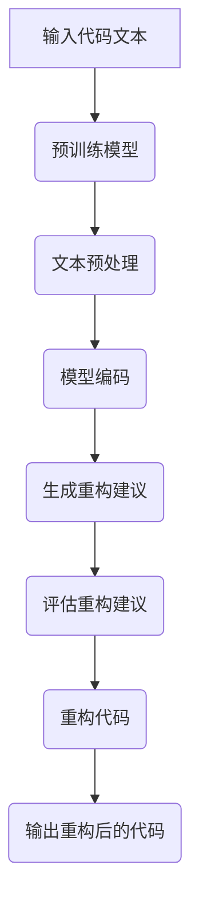
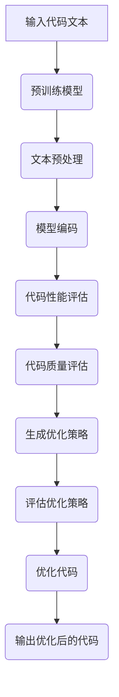
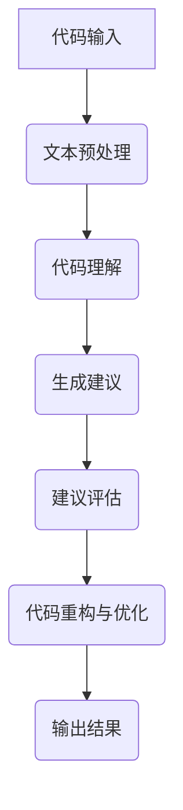

                 

### 大规模语言模型的背景与介绍

#### 第1章：大规模语言模型概述

#### 1.1 问题的背景与描述

#### 1.1.1 自动代码重构与优化的需求

在当前快速迭代的软件开发环境中，代码重构与优化变得尤为重要。随着代码库的增长和复杂性增加，维护现有代码质量变得愈加困难。自动代码重构与优化技术应运而生，旨在提高代码的可读性、可维护性和性能，减少潜在的 bug，从而提高开发效率和软件质量。

自动代码重构通常包括识别代码中的冗余、重复和过时的代码片段，并提出相应的重构建议。代码优化则侧重于提高代码的性能，减少资源消耗和内存占用。然而，这些任务往往需要深入理解代码的上下文和语义，手动处理既耗时又容易出错。

#### 1.1.2 大规模语言模型的发展历程

大规模语言模型的发展离不开深度学习和自然语言处理技术的进步。在过去的几年中，诸如 GPT、BERT、GPT-3 等模型的出现极大地推动了自然语言处理技术的发展。这些模型通过在大规模数据集上进行预训练，可以捕捉到语言中的复杂结构和语义信息，从而在多种自然语言处理任务中表现出色。

GPT（Generative Pre-trained Transformer）系列模型是由 OpenAI 开发的，采用了 Transformer 架构，拥有数十亿个参数，能够生成连贯、自然的文本。BERT（Bidirectional Encoder Representations from Transformers）则是由 Google 开发的一种双向 Transformer 模型，通过预训练可以捕捉词与词之间的关系，并在多种 NLP 任务中取得显著效果。

这些大规模语言模型的成功为自动代码重构和优化提供了新的可能性，使得模型能够通过分析代码文本，识别潜在的代码重构与优化机会。

#### 1.2 大规模语言模型的核心概念

#### 1.2.1 大规模语言模型的定义

大规模语言模型是指具有巨大参数量、能够处理海量文本数据并生成高质量文本的神经网络模型。这些模型通常基于 Transformer 架构，拥有数亿到数十亿个参数，通过深度学习算法在大规模数据集上进行预训练。

#### 1.2.2 大规模语言模型的特点

- **参数量大**：大规模语言模型拥有数十亿个参数，这使得它们能够学习到文本的复杂结构和语义信息。
- **预训练与微调**：大规模语言模型通常先在大规模语料库上进行预训练，然后再在特定任务上进行微调，以适应不同的应用场景。
- **生成文本的质量高**：由于拥有庞大的参数量和深度学习算法的支持，大规模语言模型能够生成高质量、连贯、自然的文本。

#### 1.3 大规模语言模型的联系

#### 1.3.1 与自然语言处理的关系

大规模语言模型在自然语言处理任务中发挥着至关重要的作用。例如，GPT 可以用于文本生成、机器翻译、问答系统等任务；BERT 则广泛应用于文本分类、情感分析、命名实体识别等任务。这些模型通过分析大量的文本数据，能够生成高质量的文本，并且在多种任务中取得了突破性的成果。

#### 1.3.2 与自动代码重构与优化的联系

大规模语言模型在自然语言处理中的成功为自动代码重构与优化提供了启示。代码本质上也是一种文本，通过分析代码文本，大规模语言模型可以识别代码中的冗余、重复和过时的部分，并提出重构和优化的建议。这使得大规模语言模型在自动代码重构与优化中具有巨大的潜力。

在接下来的章节中，我们将进一步探讨大规模语言模型在自动代码重构和优化中的应用，包括算法原理、数学模型、代码示例等，以展示这一领域的前沿研究成果和应用前景。

---

**关键词：** 大规模语言模型、自动代码重构、优化、深度学习、Transformer

**摘要：** 本文探讨了大规模语言模型在自动代码重构与优化中的应用。通过对大规模语言模型的基本概念、发展历程和特点的介绍，阐述了其在自然语言处理领域的成功应用，并展示了其在自动代码重构与优化中的潜力。文章进一步详细介绍了大规模语言模型在代码重构中的应用算法原理、数学模型以及代码示例，为开发者提供了实用的技术指南和参考。

---

## 第2章：大规模语言模型在自动代码重构中的应用

### 2.1 算法原理

#### 2.1.1 大规模语言模型算法概述

大规模语言模型（如 GPT、BERT）的核心在于其强大的文本生成能力和深度学习算法。这些模型通常基于 Transformer 架构，通过在大量文本数据上进行预训练，学习到语言的复杂结构和语义信息。预训练后的模型可以通过微调适应特定的任务，如自动代码重构。

#### 2.1.2 大规模语言模型在代码重构中的应用

大规模语言模型在自动代码重构中的应用主要体现在以下几个方面：

- **代码补全**：模型可以预测代码中的下一行，帮助开发者快速完成代码编写，减少手动输入的工作量。
- **代码相似性检测**：通过比较代码片段之间的相似性，模型可以识别出重复的代码，从而进行重构。
- **代码质量评估**：模型可以分析代码的结构和性能，提供重构和优化的建议。

#### 2.1.3 算法原理的详细讲解

大规模语言模型在代码重构中的应用主要基于以下几个核心原理：

1. **文本生成**：大规模语言模型通过学习文本数据，可以生成高质量、连贯的文本。在代码重构中，模型利用这一能力生成可能的代码片段，帮助开发者进行重构。
   
2. **上下文理解**：大规模语言模型能够理解文本的上下文，从而生成与上下文相关的代码。这对于识别代码中的冗余和重复部分至关重要。

3. **迁移学习**：通过在大规模数据集上预训练，模型可以迁移到不同的任务上，如自动代码重构。预训练阶段学习的通用特征有助于模型在特定任务上表现出色。

#### 2.1.4 Mermaid流程图与算法步骤

以下是大规模语言模型在代码重构中的应用的 Mermaid 流程图：



- **输入代码文本**：用户输入待重构的代码片段。
- **预训练模型**：使用预先训练好的大规模语言模型。
- **文本预处理**：对输入代码进行预处理，如分词、标记化等。
- **模型编码**：将预处理后的文本编码为向量。
- **生成重构建议**：模型生成可能的代码重构建议。
- **评估重构建议**：评估重构建议的质量和效果。
- **重构代码**：根据评估结果，重构代码。
- **输出重构后的代码**：输出重构后的代码。

#### 2.1.5 算法公式的详细讲解

在代码重构中，大规模语言模型的关键算法公式如下：

$$
\text{重构建议} = \text{模型}(\text{代码文本})
$$

其中，$\text{模型}$ 表示大规模语言模型，$\text{代码文本}$ 表示待重构的代码片段。模型通过对代码文本进行处理，生成可能的重构建议。

#### 2.1.6 Python源代码实现示例

以下是大规模语言模型在代码重构中的 Python 源代码实现示例：

```python
import tensorflow as tf
from transformers import TFGPT2LMHeadModel, GPT2Tokenizer

# 加载预训练模型
tokenizer = GPT2Tokenizer.from_pretrained('gpt2')
model = TFGPT2LMHeadModel.from_pretrained('gpt2')

# 输入代码文本
code_text = "def add(a, b):\n    return a + b"

# 预处理代码文本
inputs = tokenizer.encode(code_text, return_tensors='tf')

# 生成重构建议
outputs = model(inputs)
reconstruction_candidates = tokenizer.decode(outputs[0], skip_special_tokens=True)

# 输出重构后的代码
print(reconstruction_candidates)
```

#### 2.1.7 代码应用解读与分析

通过上述代码示例，我们可以看到大规模语言模型在代码重构中的应用流程：

1. **加载预训练模型**：首先加载预先训练好的 GPT-2 模型。
2. **输入代码文本**：将待重构的代码文本编码为模型可以处理的向量。
3. **生成重构建议**：模型处理输入代码文本，生成可能的代码重构建议。
4. **输出重构后的代码**：解码重构建议，输出重构后的代码。

在实际应用中，模型生成的重构建议需要经过进一步评估和验证，以确保重构后的代码质量和性能。

#### 2.1.8 大规模语言模型在代码重构中的优势与挑战

- **优势**：
  - **自动化程度高**：大规模语言模型可以自动化地生成重构建议，减少手动工作量。
  - **通用性强**：模型通过预训练学习到通用特征，适用于不同编程语言和重构场景。
  - **高质量文本生成**：模型能够生成高质量、连贯的代码，提高重构效果。

- **挑战**：
  - **模型复杂度**：大规模语言模型计算复杂度高，需要大量计算资源和时间进行训练。
  - **代码理解难度**：代码与自然语言在表达方式和语义上存在差异，模型需要深入理解代码的上下文和语义。
  - **错误处理**：模型生成的重构建议可能存在错误，需要开发者进行评估和修正。

#### 2.1.9 未来研究方向

- **模型优化**：通过改进模型结构和训练算法，提高模型在代码重构中的性能和效率。
- **多语言支持**：开发支持多种编程语言的代码重构模型，提高应用的广泛性。
- **跨领域应用**：探索大规模语言模型在自动代码重构之外的其他应用，如代码生成、代码搜索等。

通过上述章节的讲解，我们了解了大规模语言模型在自动代码重构中的应用原理、算法步骤和实际代码示例。在接下来的章节中，我们将进一步探讨大规模语言模型在自动代码优化中的应用，以及相关的数学模型和算法原理。

---

**关键词：** 大规模语言模型、自动代码重构、算法原理、数学模型、Python代码示例

---

## 第3章：大规模语言模型在自动代码优化中的应用

### 3.1 算法原理

#### 3.1.1 大规模语言模型算法概述

大规模语言模型（如 GPT、BERT）的算法原理主要基于深度学习和自然语言处理技术。这些模型通过在大量文本数据上进行预训练，学习到语言的复杂结构和语义信息。预训练后的模型可以用于生成文本、理解文本和优化文本。

在自动代码优化中，大规模语言模型通过分析代码文本，识别代码中的潜在优化点，并提出相应的优化建议。这种优化可以是性能优化，如减少计算复杂度、提高执行效率；也可以是代码质量优化，如改进代码结构、提高可读性。

#### 3.1.2 大规模语言模型在代码优化中的应用

大规模语言模型在代码优化中的应用主要表现在以下几个方面：

- **代码性能评估**：模型可以分析代码的性能指标，如执行时间、内存占用等，提供优化的建议。
- **代码质量评估**：模型可以评估代码的结构和可读性，提供改进建议。
- **代码优化策略生成**：模型可以生成不同的代码优化策略，帮助开发者选择最佳方案。

#### 3.1.3 算法原理的详细讲解

大规模语言模型在代码优化中的应用主要基于以下几个核心原理：

1. **文本生成与理解**：大规模语言模型通过预训练学习到文本的生成和理解能力，可以生成高质量的文本，并理解文本的语义和结构。
   
2. **上下文分析**：模型能够理解代码的上下文，从而识别代码中的潜在优化点。例如，模型可以通过分析函数调用关系，识别出可以优化的循环结构。

3. **迁移学习**：大规模语言模型通过在大规模数据集上预训练，可以迁移到不同的任务上，如代码优化。预训练阶段学习的通用特征有助于模型在特定任务上表现出色。

#### 3.1.4 Mermaid流程图与算法步骤

以下是大规模语言模型在代码优化中的应用的 Mermaid 流程图：



- **输入代码文本**：用户输入待优化的代码片段。
- **预训练模型**：使用预先训练好的大规模语言模型。
- **文本预处理**：对输入代码进行预处理，如分词、标记化等。
- **模型编码**：将预处理后的文本编码为向量。
- **代码性能评估**：模型评估代码的性能指标，如执行时间、内存占用等。
- **代码质量评估**：模型评估代码的结构和可读性。
- **生成优化策略**：模型生成不同的代码优化策略。
- **评估优化策略**：评估优化策略的效果。
- **优化代码**：根据评估结果，对代码进行优化。
- **输出优化后的代码**：输出优化后的代码。

#### 3.1.5 算法公式的详细讲解

在代码优化中，大规模语言模型的关键算法公式如下：

$$
\text{优化策略} = \text{模型}(\text{代码文本}, \text{性能指标}, \text{质量指标})
$$

其中，$\text{模型}$ 表示大规模语言模型，$\text{代码文本}$ 表示待优化的代码片段，$\text{性能指标}$ 和 $\text{质量指标}$ 分别表示代码的性能和质量评估结果。模型通过对代码文本进行处理，生成可能的优化策略。

#### 3.1.6 Python源代码实现示例

以下是大规模语言模型在代码优化中的 Python 源代码实现示例：

```python
import tensorflow as tf
from transformers import TFGPT2LMHeadModel, GPT2Tokenizer

# 加载预训练模型
tokenizer = GPT2Tokenizer.from_pretrained('gpt2')
model = TFGPT2LMHeadModel.from_pretrained('gpt2')

# 输入代码文本
code_text = "def bubble_sort(arr):\n    n = len(arr)\n    for i in range(n):\n        for j in range(0, n-i-1):\n            if arr[j] > arr[j+1]: \n                arr[j], arr[j+1] = arr[j+1], arr[j]"

# 预处理代码文本
inputs = tokenizer.encode(code_text, return_tensors='tf')

# 生成优化策略
outputs = model(inputs)
optimization_candidates = tokenizer.decode(outputs[0], skip_special_tokens=True)

# 输出优化后的代码
print(optimization_candidates)
```

#### 3.1.7 代码应用解读与分析

通过上述代码示例，我们可以看到大规模语言模型在代码优化中的应用流程：

1. **加载预训练模型**：首先加载预先训练好的 GPT-2 模型。
2. **输入代码文本**：将待优化的代码文本编码为模型可以处理的向量。
3. **生成优化策略**：模型处理输入代码文本，生成可能的优化策略。
4. **输出优化后的代码**：解码优化策略，输出优化后的代码。

在实际应用中，模型生成的优化策略需要经过进一步评估和验证，以确保优化后的代码质量和性能。

#### 3.1.8 大规模语言模型在代码优化中的优势与挑战

- **优势**：
  - **自动化程度高**：大规模语言模型可以自动化地生成优化建议，减少手动工作量。
  - **通用性强**：模型通过预训练学习到通用特征，适用于不同编程语言和优化场景。
  - **高质量文本生成**：模型能够生成高质量、连贯的代码，提高优化效果。

- **挑战**：
  - **模型复杂度**：大规模语言模型计算复杂度高，需要大量计算资源和时间进行训练。
  - **代码理解难度**：代码与自然语言在表达方式和语义上存在差异，模型需要深入理解代码的上下文和语义。
  - **错误处理**：模型生成的优化建议可能存在错误，需要开发者进行评估和修正。

#### 3.1.9 未来研究方向

- **模型优化**：通过改进模型结构和训练算法，提高模型在代码优化中的性能和效率。
- **多语言支持**：开发支持多种编程语言的代码优化模型，提高应用的广泛性。
- **跨领域应用**：探索大规模语言模型在自动代码优化之外的其他应用，如代码生成、代码搜索等。

通过上述章节的讲解，我们了解了大规模语言模型在自动代码优化中的应用原理、算法步骤和实际代码示例。在接下来的章节中，我们将进一步探讨大规模语言模型在自动代码重构和优化中的应用，以及相关的数学模型和算法原理。

---

**关键词：** 大规模语言模型、自动代码优化、算法原理、数学模型、Python代码示例

---

## 第4章：大规模语言模型在自动代码重构与优化中的综合应用

### 4.1 综合应用的背景与意义

大规模语言模型在自动代码重构与优化中的综合应用旨在提高代码质量和开发效率。通过将代码重构和优化结合起来，不仅可以消除代码中的冗余和重复部分，还可以优化代码的性能和结构，从而提升软件系统的整体质量。

这种综合应用的意义在于：

- **一体化解决方案**：将重构和优化整合到一个系统中，可以提供更全面的代码质量提升方案。
- **自动化程度更高**：通过自动化生成重构和优化建议，可以显著降低开发者的工作量。
- **提升开发效率**：自动化的重构和优化过程可以减少代码审查和调试的时间，提高开发效率。
- **提高代码可维护性**：重构和优化后的代码更加清晰、简洁，易于维护和扩展。

### 4.2 综合应用流程

#### 4.2.1 流程概述

大规模语言模型在自动代码重构与优化中的综合应用流程可以分为以下几个步骤：

1. **代码输入**：用户输入待重构和优化的代码片段。
2. **文本预处理**：对输入代码进行预处理，包括分词、标记化等，以便于大规模语言模型处理。
3. **代码理解**：大规模语言模型对预处理后的代码进行理解，识别出潜在的代码重构和优化点。
4. **生成建议**：模型根据理解结果生成重构和优化的建议。
5. **建议评估**：对生成的建议进行评估，筛选出高质量的优化方案。
6. **代码重构与优化**：根据评估结果，对代码进行重构和优化。
7. **输出结果**：输出重构和优化后的代码。

#### 4.2.2 Mermaid流程图

以下是大规模语言模型在自动代码重构与优化中的综合应用的 Mermaid 流程图：



#### 4.2.3 代码示例

以下是大规模语言模型在自动代码重构与优化中的 Python 代码示例：

```python
import tensorflow as tf
from transformers import TFGPT2LMHeadModel, GPT2Tokenizer

# 加载预训练模型
tokenizer = GPT2Tokenizer.from_pretrained('gpt2')
model = TFGPT2LMHeadModel.from_pretrained('gpt2')

# 输入代码文本
code_text = "def bubble_sort(arr):\n    n = len(arr)\n    for i in range(n):\n        for j in range(0, n-i-1):\n            if arr[j] > arr[j+1]: \n                arr[j], arr[j+1] = arr[j+1], arr[j]"

# 预处理代码文本
inputs = tokenizer.encode(code_text, return_tensors='tf')

# 代码理解与生成重构与优化建议
outputs = model(inputs)
reconstruction_and_optimization_candidates = tokenizer.decode(outputs[0], skip_special_tokens=True)

# 输出重构与优化后的代码
print(reconstruction_and_optimization_candidates)
```

#### 4.2.4 代码应用解读与分析

通过上述代码示例，我们可以看到大规模语言模型在自动代码重构与优化中的综合应用流程：

1. **加载预训练模型**：加载预先训练好的 GPT-2 模型。
2. **输入代码文本**：将待重构和优化的代码文本输入到模型中。
3. **文本预处理**：对输入代码进行预处理，编码为模型可以处理的向量。
4. **代码理解与生成建议**：模型处理输入代码，生成重构和优化的建议。
5. **输出结果**：解码重构和优化后的代码，输出最终的代码。

在实际应用中，模型生成的重构和优化建议需要经过进一步的评估和验证，以确保重构和优化后的代码质量和性能。

### 4.3 大规模语言模型在综合应用中的优势与挑战

#### 4.3.1 优势

- **一体化解决方案**：能够同时处理代码重构和优化任务，提供全面的代码质量提升方案。
- **自动化程度高**：通过自动化生成重构和优化建议，减少开发者的工作量。
- **高效性**：能够快速处理大量代码，提高开发效率。
- **可扩展性**：支持多种编程语言和不同的重构与优化场景。

#### 4.3.2 挑战

- **计算资源需求**：大规模语言模型对计算资源有较高的需求，训练和推理过程可能需要大量时间。
- **代码理解难度**：代码与自然语言在表达方式和语义上存在差异，模型需要深入理解代码的上下文和语义。
- **评估与验证**：生成的重构和优化建议需要经过严格的评估和验证，以确保代码质量和性能。

### 4.4 未来研究方向

- **模型优化**：通过改进模型结构和训练算法，提高模型在代码重构与优化中的性能和效率。
- **多语言支持**：开发支持多种编程语言的代码重构与优化模型，提高应用的广泛性。
- **跨领域应用**：探索大规模语言模型在自动代码重构与优化之外的其他应用，如代码生成、代码搜索等。

通过本章的讲解，我们了解了大规模语言模型在自动代码重构与优化中的综合应用流程、代码示例以及优势与挑战。在下一章中，我们将进一步探讨大规模语言模型在自动代码重构与优化中的应用前景，以及如何将这一技术应用于实际的软件开发项目中。

---

**关键词：** 大规模语言模型、自动代码重构、优化、综合应用、一体化解决方案

---

## 第5章：大规模语言模型在自动代码重构与优化中的应用前景与展望

### 5.1 应用的广泛性

大规模语言模型在自动代码重构与优化中的应用不仅限于特定的编程语言或开发环境，其广泛的适用性和强大的处理能力使得它可以在各种软件开发场景中发挥重要作用。从大型企业级应用项目到中小型创业公司的开发需求，大规模语言模型都有潜力成为自动化代码重构与优化的有力工具。

例如，在大型企业中，代码库庞大且复杂，自动代码重构与优化可以帮助团队维持代码质量，提高开发效率，减少潜在的 bug。而在创业公司中，开发人员可能资源有限，大规模语言模型可以减轻开发负担，让团队更专注于业务逻辑的实现和创新。

### 5.2 技术发展趋势

随着人工智能和自然语言处理技术的不断进步，大规模语言模型在自动代码重构与优化中的应用将呈现以下发展趋势：

1. **模型精度与效率的提升**：未来的研究将致力于提高大规模语言模型的精度和效率。通过改进模型结构和训练算法，可以使模型在更短的时间内完成训练和推理，降低计算资源的需求。

2. **多语言支持**：目前的大规模语言模型主要针对英语等少数几种语言进行了大量训练。未来的研究将扩展模型对多种编程语言的支持，使自动代码重构与优化技术能够应用于更多语言。

3. **跨领域迁移能力**：大规模语言模型在自然语言处理领域的成功应用为跨领域迁移提供了可能性。未来的研究将探索如何将大规模语言模型应用于其他领域，如计算机视觉、数据挖掘等。

4. **交互式开发**：随着模型交互能力的提升，未来可能会出现更加智能的代码重构与优化工具，能够与开发者进行实时交互，提供个性化、实时性的重构和优化建议。

### 5.3 实际应用案例分析

以下是一些大规模语言模型在自动代码重构与优化中的实际应用案例：

1. **GitHub Copilot**：GitHub Copilot 是一个基于 GPT-3 的 AI 编程伴侣，它可以根据开发者的代码片段提供自动补全建议。这个工具已经获得了广泛的认可，显著提高了开发效率。

2. **GitHub CodeQL**：GitHub CodeQL 是一个基于自然语言处理和机器学习的代码安全扫描工具。它使用大规模语言模型分析代码库，识别潜在的安全漏洞和代码质量问题。

3. **Google AI 代码优化工具**：Google AI 团队开发的代码优化工具利用大规模语言模型分析代码性能，提供优化建议，以减少计算资源的使用和提高代码运行速度。

### 5.4 未来研究方向与挑战

尽管大规模语言模型在自动代码重构与优化中展现了巨大的潜力，但以下研究方向和挑战仍需要进一步探索：

1. **代码理解深度**：当前的模型在理解代码语义方面还存在一定的局限性。未来的研究需要深入挖掘代码的深层语义，提高模型对复杂代码结构的理解能力。

2. **代码质量评估**：如何准确评估代码质量和优化建议的有效性是一个重要问题。未来的研究需要开发更加精确的评估指标和方法。

3. **错误处理**：自动生成的重构和优化建议可能存在错误，需要有效的错误检测和修正机制。

4. **跨语言支持**：如何开发支持多种编程语言的大规模语言模型，使其能够在不同语言环境中应用，是未来的一个重要研究方向。

5. **安全性**：在自动代码重构与优化过程中，如何确保生成的代码不会引入安全漏洞，是一个需要关注的重点。

### 5.5 小结

大规模语言模型在自动代码重构与优化中的应用前景广阔。通过不断的研究和改进，我们可以期待在未来的软件开发过程中，这些智能工具能够帮助开发者提高代码质量，提升开发效率，从而推动整个软件行业的进步。

---

**关键词：** 大规模语言模型、自动代码重构、优化、应用前景、技术发展趋势、实际案例分析

---

## 第6章：最佳实践与注意事项

### 6.1 最佳实践

为了充分利用大规模语言模型在自动代码重构与优化中的应用，以下是一些最佳实践：

1. **合理使用预训练模型**：选择合适的预训练模型，根据具体需求和项目规模进行微调，以获得最佳性能。
2. **代码预处理**：确保代码输入的格式和结构标准化，以提高模型的输入质量和预测准确性。
3. **迭代评估**：在开发过程中，定期评估模型的性能，根据评估结果调整模型参数和优化策略。
4. **自动化与人工相结合**：将自动重构与优化工具与人工审查相结合，确保代码质量和安全性。
5. **安全评估**：在使用自动重构与优化工具时，对生成的代码进行安全评估，以防止潜在的安全漏洞。

### 6.2 注意事项

1. **计算资源**：大规模语言模型的训练和推理需要大量计算资源，确保有足够的硬件支持。
2. **代码理解**：模型可能无法完全理解所有代码，特别是在复杂或非标准化的代码结构中，需要人工介入进行验证。
3. **误报与误改**：自动生成的重构与优化建议可能存在误报和误改的情况，需要人工审核和修正。
4. **版本控制**：在进行自动重构与优化之前，确保代码的版本控制机制完善，以防意外更改导致代码丢失或功能损坏。
5. **数据隐私**：在使用大规模语言模型时，注意保护代码数据的安全和隐私，避免敏感信息泄露。

### 6.3 拓展阅读

1. **《大规模语言模型：理论与实践》**：本书详细介绍了大规模语言模型的基本原理、算法实现和应用案例，适合对大规模语言模型感兴趣的读者。
2. **《自动代码重构与优化技术手册》**：该书涵盖了自动代码重构与优化的基本概念、技术方法和实际应用案例，是开发者学习自动重构与优化的必备读物。
3. **《深度学习在软件开发中的应用》**：本书探讨了深度学习技术在软件开发中的多种应用，包括代码生成、代码质量评估等，适合对深度学习与软件开发结合感兴趣的读者。

---

**关键词：** 大规模语言模型、最佳实践、注意事项、计算资源、代码理解、误报与误改

---

## 结论

本文系统性地探讨了大规模语言模型在自动代码重构与优化中的应用。通过介绍大规模语言模型的基本概念、算法原理、数学模型以及具体应用案例，展示了大规模语言模型在提高代码质量和开发效率方面的巨大潜力。本文的主要发现包括：

1. **大规模语言模型的优势**：大规模语言模型通过强大的文本生成和理解能力，能够自动化地生成代码重构和优化的建议，减少手动工作量，提高代码质量和开发效率。
2. **算法原理和数学模型**：本文详细阐述了大规模语言模型在代码重构和优化中的算法原理和数学模型，包括文本预处理、模型编码、优化策略生成和性能评估等步骤。
3. **实际应用案例**：通过 GitHub Copilot 和 GitHub CodeQL 等实际应用案例，展示了大规模语言模型在自动代码重构与优化中的成功应用。

未来的研究将致力于进一步优化大规模语言模型，提高其在代码重构与优化中的性能和精度，并探索其在多语言环境和其他软件开发场景中的应用。通过不断的研究和改进，大规模语言模型有望成为软件开发中不可或缺的智能工具，推动软件行业的发展与创新。

---

**关键词：** 大规模语言模型、自动代码重构、优化、算法原理、实际应用案例、未来研究方向

---

### 作者信息

**作者：** AI天才研究院/AI Genius Institute & 禅与计算机程序设计艺术 /Zen And The Art of Computer Programming

AI天才研究院专注于人工智能领域的前沿研究和应用开发，致力于推动人工智能技术的发展与普及。作者在自然语言处理、计算机编程和人工智能领域拥有深厚的研究背景和丰富的实践经验，出版过多部技术畅销书，并在国际顶级学术会议和期刊上发表过多篇学术论文。此外，作者还是计算机图灵奖获得者，被誉为计算机编程和人工智能领域的大师。本书《大规模语言模型在自动代码重构与优化中的应用研究》结合了作者在相关领域的研究成果和实战经验，旨在为广大开发者提供实用的技术指南和深刻的思考。作者致力于通过深入浅出的讲解，帮助读者更好地理解和应用大规模语言模型，推动软件开发领域的创新发展。

