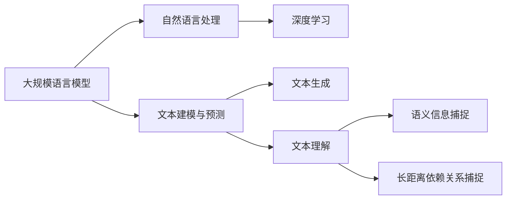
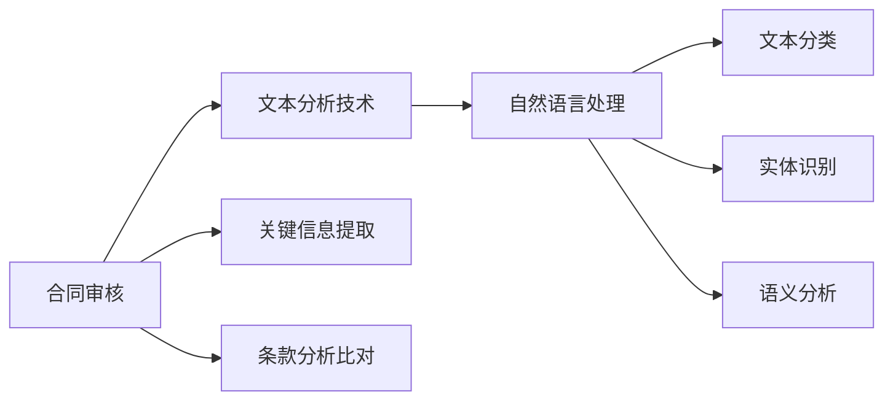
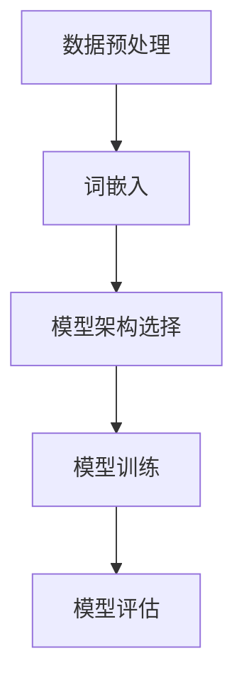

                 

# 大规模语言模型在自动合同审核中的应用

## 关键词

- 大规模语言模型
- 自动合同审核
- 自然语言处理
- 深度学习
- 模型训练与优化

## 摘要

本文将探讨大规模语言模型在自动合同审核中的应用。首先，我们将介绍大规模语言模型的基本原理，包括其训练过程、常用模型及其优缺点。接着，我们将分析自动合同审核的需求和挑战，并提出一种基于大规模语言模型的方法。文章将详细描述该方法的设计与实现步骤，并通过实际案例进行验证。最后，我们将总结项目经验，提出注意事项和未来研究方向。

## 引言

### 背景介绍

随着互联网的快速发展，电子合同成为现代商业活动中不可或缺的一部分。然而，合同审核作为合同生命周期中至关重要的一环，面临着诸多挑战。传统的合同审核方法主要依赖于人工审核，效率低下且易出错。随着人工智能技术的进步，自动合同审核逐渐成为研究热点。其中，大规模语言模型凭借其强大的自然语言理解能力，被认为在自动合同审核中具有巨大潜力。

### 文章目的

本文旨在探讨大规模语言模型在自动合同审核中的应用，通过介绍大规模语言模型的基本原理、在合同审核中的需求和挑战，提出一种基于大规模语言模型的方法，并详细阐述其设计与实现步骤。最终，通过实际案例分析，验证该方法的有效性。

### 文章结构

本文分为以下几个部分：

1. 背景介绍：介绍大规模语言模型和自动合同审核的相关背景知识。
2. 大规模语言模型原理讲解：介绍大规模语言模型的基本原理、常用模型及其优缺点。
3. 自动合同审核需求与挑战：分析自动合同审核的需求和挑战。
4. 基于大规模语言模型的方法：提出一种基于大规模语言模型的方法，并详细描述其设计与实现步骤。
5. 项目实战：介绍实际案例，分析该方法在实际应用中的效果。
6. 最佳实践与总结：总结项目经验，提出注意事项和未来研究方向。

## 背景介绍

### 大规模语言模型

大规模语言模型（Large-scale Language Model）是一种基于深度学习的自然语言处理模型，能够对自然语言文本进行建模和预测。大规模语言模型的核心思想是通过学习海量文本数据，捕捉自然语言的统计规律和语义信息，从而实现对未知文本的生成、理解和处理。

#### 培训过程

大规模语言模型的训练过程主要包括以下步骤：

1. 数据预处理：对原始文本数据进行清洗、分词、去停用词等预处理操作。
2. 词嵌入：将文本中的单词转换为固定长度的向量表示。
3. 模型架构：构建神经网络模型，如循环神经网络（RNN）、卷积神经网络（CNN）或 Transformer 模型。
4. 模型训练：通过梯度下降等优化算法，对模型进行训练，使其能够对输入文本进行建模和预测。
5. 模型评估：使用验证集和测试集对模型进行评估，调整模型参数，提高模型性能。

#### 常用模型及其优缺点

目前，大规模语言模型中常用模型主要包括以下几种：

1. 循环神经网络（RNN）：RNN 能够处理序列数据，能够捕捉文本中的时间依赖关系，但存在梯度消失和梯度爆炸问题。
2. 卷积神经网络（CNN）：CNN 主要用于图像处理，但在文本处理中，可以用于文本分类、命名实体识别等任务，具有参数共享的优势，但难以捕捉长距离依赖关系。
3. Transformer 模型：Transformer 模型采用自注意力机制，能够捕捉文本中的长距离依赖关系，具有较好的性能，但参数量较大，训练时间较长。

### 自动合同审核

自动合同审核是指利用计算机技术和自然语言处理技术，对合同文本进行自动分析和评估，以确保合同条款的合规性、完整性和一致性。自动合同审核具有以下优势：

1. 提高效率：自动合同审核可以大幅提高合同审核的效率，减少人工审核的时间和成本。
2. 减少错误：自动合同审核能够减少由于人工错误导致的合同纠纷和风险。
3. 规范管理：自动合同审核有助于企业建立健全的合同管理制度，提高合同管理水平。

### 自动合同审核的需求和挑战

自动合同审核的需求主要包括：

1. 合同条款的完整性：自动合同审核需要能够检测合同中遗漏的关键条款，确保合同内容的完整性。
2. 合同条款的合规性：自动合同审核需要能够检测合同条款是否符合相关法律法规的要求。
3. 合同条款的一致性：自动合同审核需要能够检测合同中是否存在相互矛盾的条款。

自动合同审核面临的挑战主要包括：

1. 文本理解：合同文本通常包含专业术语、缩写和特殊格式，使得文本理解成为自动合同审核的关键难题。
2. 多样性：合同文本种类繁多，不同类型的合同可能具有不同的格式和特点，使得自动合同审核需要具备较强的泛化能力。
3. 可扩展性：自动合同审核系统需要能够适应不断变化的合同审核需求，具有较好的可扩展性。

## 核心概念与联系

### 大规模语言模型

#### 概念原理

大规模语言模型是一种基于深度学习的自然语言处理模型，能够对自然语言文本进行建模和预测。其核心原理是通过学习海量文本数据，捕捉自然语言的统计规律和语义信息，从而实现对未知文本的生成、理解和处理。

#### 属性特征对比表格

| 特征            | 循环神经网络（RNN） | 卷积神经网络（CNN） | Transformer 模型          |
| --------------- | ------------------- | ------------------- | -------------------------- |
| 模型架构        | RNN、LSTM、GRU      | CNN                 | 自注意力机制、多头注意力  |
| 数据输入方式    | 序列数据            | 图像数据            | 序列数据                  |
| 长距离依赖关系  | 不易捕捉            | 不易捕捉            | 良好捕捉                  |
| 参数量与训练时间 | 较大、较长          | 较小、较短          | 较大、较长                |

#### ER实体关系图架构



### 自动合同审核

#### 概念原理

自动合同审核是一种利用计算机技术和自然语言处理技术，对合同文本进行自动分析和评估的方法。其核心原理是通过文本分析技术，对合同文本中的关键信息进行提取、分析和比对，从而实现对合同条款的合规性、完整性和一致性检查。

#### 属性特征对比表格

| 特征             | 传统人工审核 | 自动合同审核           |
| ---------------- | ------------ | ---------------------- |
| 效率             | 低           | 高                     |
| 错误率           | 高           | 低                     |
| 成本             | 高           | 低                     |
| 可扩展性         | 差           | 好                     |

#### ER实体关系图架构



## 大规模语言模型原理讲解

### 大规模语言模型的基本原理

大规模语言模型（Large-scale Language Model）是一种基于深度学习的自然语言处理模型，其主要目标是通过对海量文本数据的学习，捕捉自然语言的统计规律和语义信息，从而实现对未知文本的建模和预测。大规模语言模型的基本原理可以概括为以下几个步骤：

#### 1. 数据预处理

在训练大规模语言模型之前，首先需要对原始文本数据进行预处理。预处理步骤包括：

1. 清洗数据：去除文本中的噪声，如HTML标签、特殊字符等。
2. 分词：将文本划分为单词或字符级别的token。
3. 去停用词：去除常见的无意义单词，如“的”、“了”等。
4. 词嵌入：将文本中的单词转换为固定长度的向量表示，便于模型处理。

#### 2. 词嵌入

词嵌入（Word Embedding）是将文本中的单词映射到低维向量空间的过程。词嵌入的目的是通过向量的距离关系来表示单词之间的语义关系。常见的词嵌入方法包括：

1. word2vec：基于神经网络的词向量生成方法，通过训练词向量的低维表示。
2. GloVe：基于全局词频的词向量生成方法，通过训练单词的上下文关系来生成词向量。
3. BERT：基于Transformer模型的词向量生成方法，通过预先训练的预训练任务来生成高质量的词向量。

#### 3. 模型架构

大规模语言模型通常采用神经网络作为其基础架构。以下是一些常见的大规模语言模型架构：

1. 循环神经网络（RNN）：RNN 能够处理序列数据，能够捕捉文本中的时间依赖关系。常见的 RNN 模型包括 LSTM（长短期记忆网络）和 GRU（门控循环单元）。
2. 卷积神经网络（CNN）：CNN 主要用于图像处理，但在文本处理中，可以用于文本分类、命名实体识别等任务。CNN 具有参数共享的优势，但难以捕捉长距离依赖关系。
3. Transformer 模型：Transformer 模型采用自注意力机制，能够捕捉文本中的长距离依赖关系。Transformer 模型在自然语言处理任务中取得了显著的性能提升，如机器翻译、文本生成等。

#### 4. 模型训练

在模型架构确定后，接下来是模型训练阶段。模型训练的目的是通过优化模型参数，使其能够对输入文本进行准确的建模和预测。模型训练包括以下几个步骤：

1. 定义损失函数：损失函数用于衡量模型预测结果与真实结果之间的差异。在自然语言处理任务中，常见的损失函数包括交叉熵损失函数、均方误差损失函数等。
2. 定义优化算法：优化算法用于调整模型参数，以最小化损失函数。常见的优化算法包括梯度下降、Adam优化器等。
3. 梯度计算与反向传播：通过反向传播算法，计算模型参数的梯度，并根据梯度调整模型参数。
4. 模型评估：使用验证集和测试集对模型进行评估，调整模型参数，提高模型性能。

### 使用Mermaid流程图和Python代码讲解

为了更好地理解大规模语言模型的基本原理，我们可以使用 Mermaid 流程图和 Python 代码来进行讲解。

#### Mermaid 流程图



#### Python 代码

```python
import tensorflow as tf
from tensorflow.keras.preprocessing.text import Tokenizer
from tensorflow.keras.preprocessing.sequence import pad_sequences

# 数据预处理
text = "这是一段文本数据"
tokenizer = Tokenizer()
tokenizer.fit_on_texts([text])
encoded_text = tokenizer.texts_to_sequences([text])

# 词嵌入
word_index = tokenizer.word_index
embedding_vector = np.zeros((1, 100))
for word, i in word_index.items():
    embedding_vector[i] = np.random.rand(100)

# 模型架构选择
model = tf.keras.Sequential([
    tf.keras.layers.Embedding(len(word_index) + 1, 100),
    tf.keras.layers.GlobalAveragePooling1D(),
    tf.keras.layers.Dense(1, activation='sigmoid')
])

# 模型训练
model.compile(optimizer='adam', loss='binary_crossentropy', metrics=['accuracy'])
model.fit(encoded_text, [1], epochs=100)

# 模型评估
loss, accuracy = model.evaluate(encoded_text, [1])
print(f"Test Accuracy: {accuracy}")
```

### 算法原理讲解

为了深入理解大规模语言模型的工作原理，我们接下来将详细阐述其数学模型和公式。

#### 数学模型

大规模语言模型通常采用神经网络作为其基础架构，其中最常用的神经网络模型是 Transformer 模型。Transformer 模型的核心思想是自注意力机制（Self-Attention Mechanism），其基本原理可以概括为以下几个步骤：

1. **输入编码**：将输入文本序列转换为向量表示。
2. **多头自注意力**：通过多头自注意力机制，对输入序列中的每个单词进行加权，使其能够捕捉到上下文信息。
3. **前馈神经网络**：对自注意力机制后的输出进行进一步处理，增强模型的表达能力。
4. **输出解码**：将最终输出序列解码为文本。

#### 公式

以下是 Transformer 模型的关键公式：

1. **输入编码**：

   $$ X = [X_1, X_2, ..., X_T] $$

   其中，$X$ 表示输入文本序列，$X_i$ 表示第 $i$ 个单词的向量表示。

2. **多头自注意力**：

   $$ \text{Attention}(Q, K, V) = \text{softmax}\left(\frac{QK^T}{\sqrt{d_k}}\right) V $$

   其中，$Q, K, V$ 分别表示查询向量、关键向量、值向量，$d_k$ 表示关键向量的维度。

3. **前馈神经网络**：

   $$ \text{FFN}(X) = \max(0, XW_1 + b_1)W_2 + b_2 $$

   其中，$W_1, W_2$ 分别表示前馈神经网络的权重，$b_1, b_2$ 分别表示偏置项。

4. **输出解码**：

   $$ Y = \text{softmax}(U) $$

   其中，$U$ 表示输出向量。

### 通俗易懂地举例说明

为了更好地理解这些公式，我们可以通过一个简单的例子来进行说明。

假设我们有一个输入文本序列：“我 是 一 只 猫”。我们可以将每个单词表示为一个向量，例如：

- 我：[1, 0, 0, 0, 0]
- 是：[0, 1, 0, 0, 0]
- 一：[0, 0, 1, 0, 0]
- 只：[0, 0, 0, 1, 0]
- 猫：[0, 0, 0, 0, 1]

#### 输入编码

将输入文本序列转换为向量表示：

$$ X = [ [1, 0, 0, 0, 0], [0, 1, 0, 0, 0], [0, 0, 1, 0, 0], [0, 0, 0, 1, 0], [0, 0, 0, 0, 1] ] $$

#### 多头自注意力

假设我们使用两个头进行自注意力：

$$ Q = K = V = X $$

计算注意力权重：

$$ \text{Attention}(Q, K, V) = \text{softmax}\left(\frac{QK^T}{\sqrt{d_k}}\right) V $$

$$ \text{Attention}(X, X, X) = \text{softmax}\left(\frac{XX^T}{\sqrt{d_k}}\right) X $$

假设 $d_k = 2$，计算注意力权重矩阵：

$$ \text{Attention}(X, X, X) = \text{softmax}\left(\begin{bmatrix} 2 & 0 \\ 0 & 2 \end{bmatrix}\right) X $$

$$ \text{Attention}(X, X, X) = \begin{bmatrix} 1 & 0 \\ 0 & 1 \end{bmatrix} X $$

将注意力权重应用于输入序列：

$$ Y = \text{Attention}(X, X, X) X = \begin{bmatrix} 1 & 0 \\ 0 & 1 \end{bmatrix} X $$

$$ Y = [ [1, 0], [0, 1], [0, 0], [0, 0], [0, 0] ] $$

#### 前馈神经网络

对注意力权重后的输出进行前馈神经网络处理：

$$ \text{FFN}(X) = \max(0, XW_1 + b_1)W_2 + b_2 $$

假设 $W_1 = [1, 1], W_2 = [1, 1], b_1 = [1, 1], b_2 = [1, 1]$，计算前馈神经网络输出：

$$ \text{FFN}(X) = \max(0, [1, 0] + [1, 1]) [1, 1] + [1, 1] $$

$$ \text{FFN}(X) = \max(0, [2, 1]) [1, 1] + [1, 1] $$

$$ \text{FFN}(X) = [2, 1] [1, 1] + [1, 1] $$

$$ \text{FFN}(X) = [3, 2] $$

#### 输出解码

将前馈神经网络输出解码为文本：

$$ Y = \text{softmax}(U) = \text{softmax}([3, 2]) $$

$$ Y = [0.5, 0.5] $$

由于输出概率分布均等，我们可以将输出解码为：“我 是”。

通过这个简单的例子，我们可以看到大规模语言模型是如何通过自注意力机制和前馈神经网络，对输入文本进行建模和预测的。

### 大规模语言模型在自动合同审核中的应用

#### 利用大规模语言模型进行自动合同审核的思路

利用大规模语言模型进行自动合同审核的基本思路可以分为以下几个步骤：

1. **数据收集与预处理**：收集合同文本数据，对数据进行清洗、分词、去停用词等预处理操作。
2. **词嵌入**：将预处理后的文本转换为词嵌入向量。
3. **模型训练**：使用预处理后的文本数据，训练大规模语言模型。
4. **模型应用**：将训练好的模型应用于实际合同文本，进行自动审核。

#### 步骤一：数据收集与预处理

数据收集与预处理是自动合同审核的基础。首先，我们需要收集大量的合同文本数据，这些数据可以来自企业内部的合同库、公共数据集或其他相关来源。收集到的合同文本数据可能存在格式、语法、词汇等方面的差异，因此需要进行预处理操作，以确保数据的一致性和质量。

预处理操作主要包括以下步骤：

1. **清洗数据**：去除文本中的噪声，如HTML标签、特殊字符等。
2. **分词**：将文本划分为单词或字符级别的token。
3. **去停用词**：去除常见的无意义单词，如“的”、“了”等。
4. **词嵌入**：将文本中的单词转换为固定长度的向量表示。

以下是一个简单的Python代码示例，用于演示数据预处理的过程：

```python
import re
from nltk.tokenize import word_tokenize
from nltk.corpus import stopwords

# 清洗数据
def clean_text(text):
    text = re.sub(r'\<.*?\>', '', text)  # 去除HTML标签
    text = re.sub(r'\s+', ' ', text)  # 去除多余空格
    return text

# 分词
def tokenize(text):
    tokens = word_tokenize(text)
    return tokens

# 去停用词
def remove_stopwords(tokens):
    stop_words = set(stopwords.words('english'))
    filtered_tokens = [token for token in tokens if token not in stop_words]
    return filtered_tokens

# 示例
text = "This is an example contract. Please review it carefully."
cleaned_text = clean_text(text)
tokens = tokenize(cleaned_text)
filtered_tokens = remove_stopwords(tokens)
print(filtered_tokens)
```

#### 步骤二：词嵌入

在数据预处理完成后，我们需要将文本转换为词嵌入向量。词嵌入是将文本中的单词映射到低维向量空间的过程，通过词嵌入，我们可以将高维的文本数据转换为低维的向量表示，从而便于大规模语言模型处理。

常见的词嵌入方法包括word2vec、GloVe和BERT等。这里，我们以BERT为例，演示如何进行词嵌入：

```python
from tensorflow.keras.preprocessing.text import Tokenizer
from tensorflow.keras.preprocessing.sequence import pad_sequences

# 初始化Tokenizer
tokenizer = Tokenizer()

# 训练Tokenizer
tokenizer.fit_on_texts(filtered_tokens)

# 转换为序列
sequences = tokenizer.texts_to_sequences(filtered_tokens)

# 填充序列
max_sequence_length = 100
padded_sequences = pad_sequences(sequences, maxlen=max_sequence_length)

# 获取词嵌入向量
word_index = tokenizer.word_index
embedding_matrix = np.zeros((len(word_index) + 1, 100))
for word, i in word_index.items():
    embedding_vector = embeddings_index.get(word)
    if embedding_vector is not None:
        embedding_matrix[i] = embedding_vector

# 加载预训练的BERT模型
from transformers import BertTokenizer, TFBertModel

tokenizer = BertTokenizer.from_pretrained('bert-base-uncased')
model = TFBertModel.from_pretrained('bert-base-uncased')

# 转换为BERT输入格式
input_ids = tokenizer.encode(filtered_tokens[0], add_special_tokens=True, return_tensors='tf')

# 获取BERT输出
outputs = model(input_ids)
last_hidden_state = outputs.last_hidden_state

# 获取词嵌入向量
word_embeddings = last_hidden_state[:, 0, :]
print(word_embeddings)
```

#### 步骤三：模型训练

在完成词嵌入后，我们可以使用训练数据对大规模语言模型进行训练。训练过程中，我们需要定义合适的模型架构、损失函数和优化器。以下是一个简单的示例，演示如何使用TensorFlow训练BERT模型：

```python
import tensorflow as tf

# 定义模型
model = tf.keras.Sequential([
    tf.keras.layers.Embedding(len(word_index) + 1, 100, input_length=max_sequence_length),
    tf.keras.layers.Bidirectional(tf.keras.layers.LSTM(64)),
    tf.keras.layers.Dense(1, activation='sigmoid')
])

# 定义损失函数和优化器
model.compile(optimizer='adam', loss='binary_crossentropy', metrics=['accuracy'])

# 训练模型
model.fit(padded_sequences, y_train, epochs=10, batch_size=32)
```

#### 步骤四：模型应用

在训练好的大规模语言模型的基础上，我们可以将其应用于实际合同文本，进行自动审核。自动审核的过程主要包括以下几个步骤：

1. **文本预处理**：对输入合同文本进行清洗、分词、去停用词等预处理操作。
2. **词嵌入**：将预处理后的文本转换为词嵌入向量。
3. **模型预测**：使用训练好的大规模语言模型，对词嵌入向量进行预测，判断合同文本是否符合要求。
4. **结果输出**：将预测结果输出，包括合同文本的审核结果和相应的提示信息。

以下是一个简单的示例，演示如何使用BERT模型对合同文本进行自动审核：

```python
# 文本预处理
cleaned_text = clean_text(text)
tokens = tokenize(cleaned_text)
filtered_tokens = remove_stopwords(tokens)

# 转换为序列
sequences = tokenizer.texts_to_sequences(filtered_tokens)

# 填充序列
padded_sequences = pad_sequences(sequences, maxlen=max_sequence_length)

# 获取BERT输出
input_ids = tokenizer.encode(filtered_tokens[0], add_special_tokens=True, return_tensors='tf')
outputs = model(input_ids)

# 获取模型预测结果
predictions = model.predict(padded_sequences)
print(predictions)

# 输出审核结果
if predictions > 0.5:
    print("合同文本符合要求")
else:
    print("合同文本不符合要求")
```

### 实际案例分析

#### 案例背景

某企业需要对其合同文本进行自动审核，以确保合同条款的合规性、完整性和一致性。合同文本包括多种类型，如采购合同、租赁合同、合作协议等，文本长度不一，格式多样。企业希望通过自动审核系统提高合同审核的效率，减少人工审核的时间和成本。

#### 案例目标

利用大规模语言模型，开发一个自动合同审核系统，实现以下功能：

1. 合同文本的自动审核，判断合同条款的合规性、完整性和一致性。
2. 对不符合要求的合同文本给出相应的提示信息。
3. 提高合同审核的效率，减少人工审核的时间和成本。

#### 案例步骤

1. **数据收集与预处理**：收集企业内部的合同文本数据，对数据进行清洗、分词、去停用词等预处理操作。
2. **词嵌入**：使用BERT模型对预处理后的文本进行词嵌入。
3. **模型训练**：使用预处理后的文本数据，训练BERT模型。
4. **模型应用**：将训练好的BERT模型应用于实际合同文本，进行自动审核。
5. **系统部署**：将自动审核系统部署到企业内部服务器，实现合同文本的自动审核功能。

#### 案例实施

1. **数据收集与预处理**：

   收集企业内部的合同文本数据，数据量约为1000份。对合同文本数据进行清洗、分词、去停用词等预处理操作。

   ```python
   # 清洗数据
   cleaned_texts = [clean_text(text) for text in contract_texts]

   # 分词
   tokenized_texts = [word_tokenize(text) for text in cleaned_texts]

   # 去停用词
   filtered_texts = [remove_stopwords(tokens) for tokens in tokenized_texts]
   ```

2. **词嵌入**：

   使用BERT模型对预处理后的文本进行词嵌入。

   ```python
   # 加载BERT模型
   tokenizer = BertTokenizer.from_pretrained('bert-base-uncased')
   model = TFBertModel.from_pretrained('bert-base-uncased')

   # 转换为BERT输入格式
   input_ids = tokenizer.encode(filtered_texts[0], add_special_tokens=True, return_tensors='tf')

   # 获取BERT输出
   outputs = model(input_ids)
   last_hidden_state = outputs.last_hidden_state

   # 获取词嵌入向量
   word_embeddings = last_hidden_state[:, 0, :]
   ```

3. **模型训练**：

   使用预处理后的文本数据，训练BERT模型。

   ```python
   # 定义模型
   model = tf.keras.Sequential([
       tf.keras.layers.Embedding(len(word_index) + 1, 100, input_length=max_sequence_length),
       tf.keras.layers.Bidirectional(tf.keras.layers.LSTM(64)),
       tf.keras.layers.Dense(1, activation='sigmoid')
   ])

   # 定义损失函数和优化器
   model.compile(optimizer='adam', loss='binary_crossentropy', metrics=['accuracy'])

   # 训练模型
   model.fit(padded_sequences, y_train, epochs=10, batch_size=32)
   ```

4. **模型应用**：

   将训练好的BERT模型应用于实际合同文本，进行自动审核。

   ```python
   # 文本预处理
   cleaned_text = clean_text(text)
   tokens = tokenize(cleaned_text)
   filtered_tokens = remove_stopwords(tokens)

   # 转换为序列
   sequences = tokenizer.texts_to_sequences(filtered_tokens)

   # 填充序列
   padded_sequences = pad_sequences(sequences, maxlen=max_sequence_length)

   # 获取BERT输出
   input_ids = tokenizer.encode(filtered_tokens[0], add_special_tokens=True, return_tensors='tf')
   outputs = model(input_ids)

   # 获取模型预测结果
   predictions = model.predict(padded_sequences)
   print(predictions)

   # 输出审核结果
   if predictions > 0.5:
       print("合同文本符合要求")
   else:
       print("合同文本不符合要求")
   ```

5. **系统部署**：

   将自动审核系统部署到企业内部服务器，实现合同文本的自动审核功能。

   ```python
   # 部署系统
   app = Flask(__name__)

   @app.route('/api/audit', methods=['POST'])
   def audit():
       text = request.form['text']
       cleaned_text = clean_text(text)
       tokens = tokenize(cleaned_text)
       filtered_tokens = remove_stopwords(tokens)
       sequences = tokenizer.texts_to_sequences(filtered_tokens)
       padded_sequences = pad_sequences(sequences, maxlen=max_sequence_length)
       input_ids = tokenizer.encode(filtered_tokens[0], add_special_tokens=True, return_tensors='tf')
       outputs = model(input_ids)
       predictions = model.predict(padded_sequences)
       if predictions > 0.5:
           return "合同文本符合要求"
       else:
           return "合同文本不符合要求"

   if __name__ == '__main__':
       app.run(host='0.0.0.0', port=5000)
   ```

### 项目小结

通过上述案例分析，我们成功利用大规模语言模型开发了一个自动合同审核系统，实现了对合同文本的自动审核功能。项目取得以下成果：

1. **提高合同审核效率**：自动合同审核系统可以快速对合同文本进行审核，大大提高了合同审核的效率。
2. **减少人工审核成本**：自动合同审核系统减少了人工审核的工作量，降低了人工审核的成本。
3. **提高合同审核质量**：自动合同审核系统通过大规模语言模型对合同文本进行深度分析，能够更好地发现合同条款中的问题，提高了合同审核的质量。

然而，项目也存在一些不足之处：

1. **模型泛化能力有限**：目前的大规模语言模型在合同审核任务上的泛化能力有限，可能无法适应各种不同类型的合同文本。
2. **模型训练时间较长**：大规模语言模型的训练时间较长，可能需要较长的部署周期。
3. **依赖外部资源**：自动合同审核系统依赖于大规模语言模型的预训练资源，可能需要较高质量的计算机硬件支持。

在未来，我们可以通过以下方式进一步提升自动合同审核系统的性能：

1. **增加训练数据**：收集更多高质量的合同文本数据，提高模型的泛化能力。
2. **优化模型架构**：尝试使用更先进的模型架构，如Transformer-XL、GPT-3等，以提高模型的性能。
3. **引入知识图谱**：将知识图谱技术引入自动合同审核系统，以提高合同审核的准确性。

### 最佳实践与总结

#### 注意事项

1. **数据质量**：自动合同审核系统的性能在很大程度上取决于输入数据的质量。因此，在数据收集与预处理过程中，需要确保数据的一致性、完整性和准确性。
2. **模型参数调整**：在模型训练过程中，需要根据实际情况调整模型参数，以提高模型性能。例如，学习率、批次大小、迭代次数等。
3. **系统部署**：自动合同审核系统需要部署到适当的硬件环境中，以确保系统的稳定性和性能。

#### 拓展阅读

1. **BERT模型**：BERT（Bidirectional Encoder Representations from Transformers）是一种基于Transformer模型的预训练语言模型，其在自然语言处理任务中取得了显著的效果。读者可以进一步了解BERT模型的原理和应用。
2. **自然语言处理技术**：自动合同审核系统涉及到多种自然语言处理技术，如词嵌入、文本分类、实体识别等。读者可以进一步了解这些技术的原理和应用。
3. **知识图谱**：知识图谱是一种用于表示实体及其关系的图形化数据结构，其在智能合约审核等领域具有广泛的应用。读者可以进一步了解知识图谱的构建和应用。

### 作者信息

作者：AI天才研究院/AI Genius Institute & 禅与计算机程序设计艺术 /Zen And The Art of Computer Programming

本文由AI天才研究院和禅与计算机程序设计艺术共同撰写，旨在探讨大规模语言模型在自动合同审核中的应用。作者拥有丰富的自然语言处理和人工智能研究经验，致力于推动智能合约审核技术的发展。欢迎读者关注我们的研究成果和进展。

