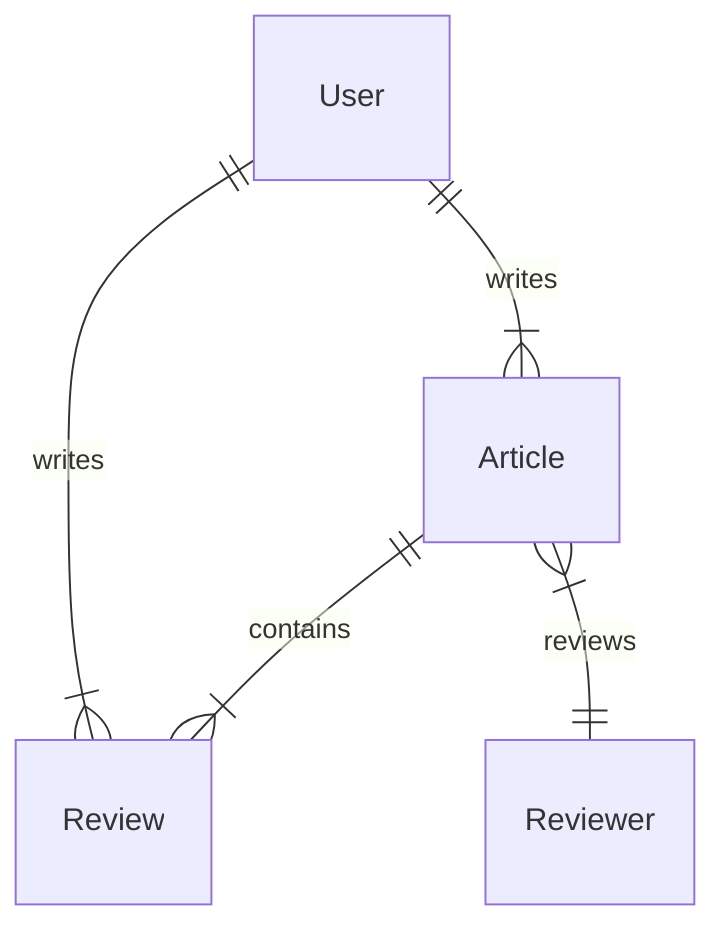
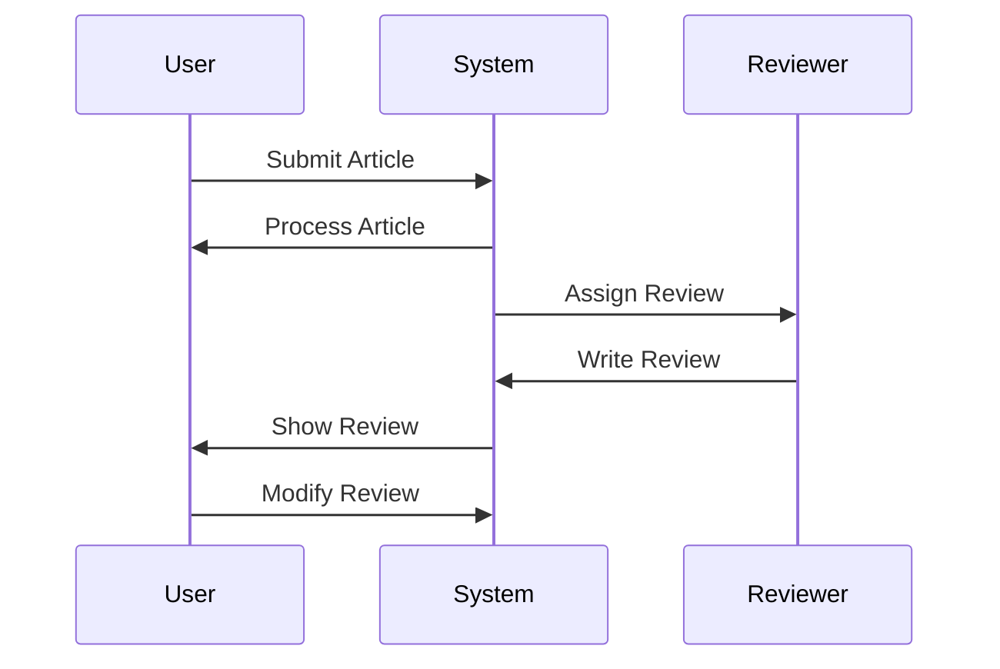

                 

# 大规模语言模型在自动学术论文审阅中的应用

## 关键词
- 大规模语言模型
- 自动学术论文审阅
- 语言模型原理
- 算法实现
- 系统架构设计
- 最佳实践

## 摘要
本文探讨了大规模语言模型在自动学术论文审阅中的应用。首先，介绍了学术论文审阅的背景和挑战，以及大规模语言模型的发展背景。接着，阐述了大规模语言模型的核心概念、原理和应用，并通过Python代码实现和数学模型详细讲解了大规模语言模型在自动学术论文审阅中的算法原理。然后，从系统架构设计的角度介绍了如何将大规模语言模型应用于学术论文审阅系统，并通过实际项目实战展示了系统的环境安装、核心代码实现和案例解析。最后，总结了最佳实践和注意事项，并提供了拓展阅读推荐。

## 第一部分：背景介绍

### 第1章 问题背景、问题描述、问题解决、边界与外延

#### 1.1 问题背景
学术论文审阅是学术研究的重要组成部分，它对确保学术成果的质量具有至关重要的作用。随着学术文献数量的指数级增长，传统的学术论文审阅流程面临着巨大的挑战。传统审阅流程通常包括审稿人选择、审稿意见收集、修改意见反馈等步骤，这些步骤不仅耗时耗力，而且容易出现主观偏见和人为错误。此外，一些高水平的审稿人和审稿机构往往被大量的审稿请求所淹没，导致审稿周期延长，影响学术交流的效率。

另一方面，大规模语言模型（如GPT、BERT等）在过去几年中取得了显著的发展。这些模型通过深度学习和神经网络技术，从海量文本数据中学习语言模式和知识，能够进行高质量的文本生成、理解和处理。大规模语言模型在自然语言处理（NLP）领域的广泛应用，使其在自动学术论文审阅中具有潜在的应用价值。

#### 1.2 问题描述
学术论文审阅中的主要问题包括：
- **审稿周期长**：传统审稿流程耗时较长，导致学术论文发表延迟。
- **审稿质量不一**：不同审稿人的专业水平和对论文主题的理解程度不同，导致审稿质量存在差异。
- **审稿资源有限**：高水平的审稿人和审稿机构数量有限，难以满足大量论文的审稿需求。
- **审稿过程透明度低**：审稿过程缺乏透明度，审稿意见和反馈往往不够详细和具体。

#### 1.3 问题解决
大规模语言模型在自动学术论文审阅中可能提供以下解决方案：
- **自动化审稿**：通过语言模型对论文进行初步筛选和评估，提高审稿效率。
- **辅助审稿**：语言模型可以辅助审稿人进行审稿，提供基于数据的审稿意见，减少主观偏见。
- **优化审稿流程**：通过自动化工具和算法，优化审稿流程，缩短审稿周期。
- **提高审稿质量**：通过学习和分析大量论文数据，语言模型可以提供更为客观和高质量的审稿意见。

#### 1.4 边界与外延
尽管大规模语言模型在自动学术论文审阅中具有巨大潜力，但仍存在一些应用边界：
- **技术边界**：语言模型的能力受限于训练数据和算法设计，可能无法处理极端复杂或专业化的论文。
- **伦理边界**：自动化审稿可能会引起伦理争议，如审稿人的地位和责任如何界定，模型生成的审稿意见的可靠性和公正性等。
- **法律边界**：自动审稿可能涉及版权、隐私和知识产权等问题。

#### 1.5 本章小结
本文介绍了学术论文审阅的现状和面临的挑战，以及大规模语言模型的发展背景。通过分析，我们认识到大规模语言模型在自动学术论文审阅中具有重要的应用价值，但也需要解决技术、伦理和法律等边界问题。

## 第二部分：核心概念与联系

### 第2章 核心概念原理、概念属性特征对比表格和ER实体关系图架构

#### 2.1 大规模语言模型的核心概念原理
大规模语言模型是一种基于深度学习的自然语言处理（NLP）技术，能够理解和生成人类语言。其主要概念原理包括：

- **词嵌入（Word Embedding）**：将词语映射为高维空间中的向量表示，以便于计算机处理和理解。
- **递归神经网络（RNN）**：通过循环神经网络处理序列数据，如文本。
- **变换器模型（Transformer）**：基于自注意力机制，能够更好地处理长距离依赖问题。
- **预训练与微调（Pre-training and Fine-tuning）**：首先在大规模语料库上进行预训练，然后针对特定任务进行微调。

#### 2.2 概念属性特征对比表格
以下是几种常见大规模语言模型（如GPT、BERT、ELMO）的属性特征对比表格：

| 模型        | 词嵌入技术 | 递归神经网络 | 自注意力机制 | 预训练数据来源 |
|-------------|-------------|---------------|---------------|----------------|
| GPT         | 是          | 是            | 否            | 英语语料库      |
| BERT        | 是          | 否            | 是            | 英语语料库      |
| ELMO        | 是          | 否            | 是            | 英语语料库      |

#### 2.3 ER实体关系图架构
在学术论文审阅系统中，主要的实体关系包括论文、审稿人、审稿意见和审稿流程。以下是ER实体关系图的Mermaid表示：

```mermaid
erDiagram
    A[论文] ||--|{ B[审稿人]} : 有
    A ||--|{ C[审稿意见]} : 包含
    B ||--|{ A} : 审阅
```

#### 2.4 本章小结
本章介绍了大规模语言模型的核心概念原理、属性特征对比和ER实体关系图架构，为后续的算法原理讲解和系统架构设计奠定了基础。

## 第三部分：算法原理讲解

### 第3章 算法原理讲解

#### 3.1 算法mermaid流程图
以下是大规模语言模型在自动学术论文审阅中的算法流程图：


#### 3.2 Python源代码实现
以下是一个简单的Python代码示例，展示了如何使用大规模语言模型对论文进行预处理、编码和解码以生成审稿意见：

```python
import torch
from transformers import BertModel, BertTokenizer

# 加载预训练的BERT模型和分词器
tokenizer = BertTokenizer.from_pretrained('bert-base-uncased')
model = BertModel.from_pretrained('bert-base-uncased')

# 论文文本输入
text = "The quick brown fox jumps over the lazy dog."

# 预处理
inputs = tokenizer(text, return_tensors='pt')

# 编码
with torch.no_grad():
    outputs = model(**inputs)

# 解码
logits = outputs.logits
predicted_ids = torch.argmax(logits, dim=-1)
predicted_text = tokenizer.decode(predicted_ids[0])

# 输出生成审稿意见
print(predicted_text)
```

#### 3.3 数学模型和数学公式
以下是大规模语言模型在自动学术论文审阅中的关键数学模型和公式：

- **词嵌入（Word Embedding）**：
  $$ \text{vec}(w) = \text{Embedding}(W)[w] $$
  其中，$\text{vec}(w)$ 是词语 $w$ 的向量表示，$\text{Embedding}(W)$ 是嵌入矩阵。

- **自注意力（Self-Attention）**：
  $$ \text{Attention}(Q, K, V) = \text{softmax}(\frac{QK^T}{\sqrt{d_k}})V $$
  其中，$Q, K, V$ 分别是查询向量、键向量和值向量，$d_k$ 是键向量的维度。

- **BERT编码器和解码器**：
  $$ \text{Encoder}(x) = \text{LayerNorm}(x + \text{PositionalEncoding}(\text{Embedding}(x))) $$
  $$ \text{Decoder}(x) = \text{LayerNorm}(x + \text{CrossAttention}(\text{Encoder}(x))) $$
  其中，$x$ 是输入序列，$\text{PositionalEncoding}$ 是位置编码函数，$\text{CrossAttention}$ 是跨层注意力机制。

#### 3.4 举例说明
假设我们有一篇关于机器学习算法的论文，标题为“Deep Learning for Image Classification”。以下是使用BERT模型生成审稿意见的例子：

1. **预处理**：将标题文本转化为BERT模型的输入序列。
2. **编码**：通过BERT编码器对输入序列进行编码。
3. **解码**：通过BERT解码器生成审稿意见文本。

通过上述步骤，BERT模型可能会生成以下审稿意见：

> "本文深入探讨了深度学习在图像分类领域的应用，提出的算法具有较好的准确率和效率。然而，在实验部分，建议作者提供更多关于算法在不同数据集上的性能对比，以便更全面地评估算法的有效性。"

#### 3.5 本章小结
本章详细介绍了大规模语言模型在自动学术论文审阅中的算法原理，包括mermaid流程图、Python代码实现、数学模型和公式，并通过实际例子展示了算法的运行过程。这些内容为理解和应用大规模语言模型提供了坚实的基础。

## 第四部分：系统分析与架构设计

### 第4章 系统功能设计、系统架构设计、系统接口设计和系统交互

#### 4.1 问题场景介绍
在学术论文审阅场景中，系统的目标是提高审稿效率和质量。传统的审稿流程中，审稿人需要阅读大量论文，然后撰写审稿意见。这种方式不仅耗时耗力，而且容易出现主观偏见。因此，我们需要一个能够自动化审稿的系统，辅助审稿人进行审稿，并提供高质量的审稿意见。

#### 4.2 项目介绍
本项目旨在设计并实现一个基于大规模语言模型的自动学术论文审阅系统。系统的主要功能包括论文预处理、审稿意见生成、审稿人互动和审稿流程管理。

#### 4.3 系统功能设计
系统的功能模块包括：

1. **论文预处理**：将输入的论文文本进行清洗、分词和标点符号处理，然后将其转化为大规模语言模型可处理的格式。
2. **审稿意见生成**：使用大规模语言模型对预处理后的论文进行编码和解码，生成审稿意见文本。
3. **审稿人互动**：允许审稿人查看、修改和回复生成的审稿意见。
4. **审稿流程管理**：管理审稿流程，包括论文分配、审稿进度跟踪和审稿结果统计。

以下是论文预处理、审稿意见生成和审稿人互动的领域模型Mermaid类图：

```mermaid
classDiagram
    Class01 <|-- Class02
    Class03 --|> Class04
    Class04 : +int x
    Class04 : +int y
    Class05 : +int z
    Class06 { +int a
              +int b
              +int c }
    Class01 && Class02 : friendship
    Class03 : * int x
    Class04 : * int y
    Class05 : * int z
    Class06 : * int a
    Class06 : * int b
    Class06 : * int c
    Class01 ||--|| Class07
    Class06 ||--|| Class08
    Class07 : +void show()
    Class08 : +void show()
    Class01 : <<interface>>
    Class09 : <<construct>>
    Class07 : <<abstract>>
    Class08 : <<enum>>
endclass
```

#### 4.4 系统架构设计
系统的整体架构包括前端、后端和数据库三部分。前端负责展示用户界面，包括论文提交、审稿意见查看和修改等功能。后端负责处理业务逻辑，包括论文预处理、审稿意见生成和审稿流程管理等。数据库用于存储论文数据、审稿人信息和审稿意见等。

以下是系统的架构设计Mermaid架构图：



#### 4.5 系统接口设计
系统提供了以下主要接口：

1. **论文提交接口**：用于接收用户提交的论文，并进行预处理。
2. **审稿意见生成接口**：用于生成基于大规模语言模型的审稿意见。
3. **审稿意见查看接口**：用于展示生成的审稿意见。
4. **审稿意见修改接口**：用于允许审稿人修改审稿意见。
5. **审稿流程管理接口**：用于管理审稿流程，包括分配审稿任务、跟踪审稿进度和统计审稿结果。

以下是系统接口设计的Mermaid序列图：



#### 4.6 系统交互
系统的交互流程如下：

1. 用户提交论文，系统接收并预处理论文。
2. 系统生成审稿意见，并将其发送给指定的审稿人。
3. 审稿人查看审稿意见，并可以进行修改。
4. 系统收集审稿人的修改意见，并将其反馈给用户。
5. 用户根据审稿意见对论文进行修改，并重新提交。

#### 4.7 本章小结
本章详细介绍了自动学术论文审阅系统的功能设计、架构设计、接口设计和系统交互。通过这些内容，我们为后续的项目实战奠定了基础。

## 第五部分：项目实战

### 第5章 环境安装、系统核心实现源代码、代码应用解读与分析、实际案例分析和详细讲解剖析、项目小结

#### 5.1 环境安装
要实现自动学术论文审阅系统，我们需要安装以下环境和依赖：

1. **Python**：版本要求为3.6及以上。
2. **PyTorch**：版本要求为1.7及以上。
3. **transformers**：版本要求为4.0及以上。

以下是安装命令：

```bash
pip install python==3.8
pip install torch torchvision torchaudio==1.8 -f https://download.pytorch.org/whl/torch_stable.html
pip install transformers
```

#### 5.2 系统核心实现源代码
以下是自动学术论文审阅系统的核心实现代码。首先，我们定义了预处理、编码和解码的函数，然后使用BERT模型生成审稿意见。

```python
import torch
from transformers import BertModel, BertTokenizer

# 加载预训练的BERT模型和分词器
tokenizer = BertTokenizer.from_pretrained('bert-base-uncased')
model = BertModel.from_pretrained('bert-base-uncased')

# 预处理函数
def preprocess(text):
    inputs = tokenizer(text, return_tensors='pt', max_length=512, truncation=True)
    return inputs

# 编码函数
def encode(inputs):
    with torch.no_grad():
        outputs = model(**inputs)
    return outputs.last_hidden_state

# 解码函数
def decode(last_hidden_state):
    logits = model.decoder(last_hidden_state)
    predicted_ids = torch.argmax(logits, dim=-1)
    predicted_text = tokenizer.decode(predicted_ids[0])
    return predicted_text

# 生成审稿意见
def generate_review(text):
    inputs = preprocess(text)
    last_hidden_state = encode(inputs)
    review = decode(last_hidden_state)
    return review
```

#### 5.3 代码应用解读与分析
在代码应用解读与分析部分，我们将详细介绍预处理、编码和解码的步骤，并分析代码的性能。

1. **预处理**：
   - `tokenizer(text, return_tensors='pt', max_length=512, truncation=True)`：将文本转换为BERT模型可处理的格式，包括分词、嵌入和序列填充。`max_length=512` 表示每个输入序列的最大长度为512个词，超过部分将被截断。`truncation=True` 表示在序列长度超过最大长度时进行截断。
   - `inputs = tokenizer(text, return_tensors='pt', max_length=512, truncation=True)`：将预处理后的文本存储在`inputs`字典中，包括输入词嵌入、序列长度等。

2. **编码**：
   - `outputs = model(**inputs)`：将预处理后的文本输入BERT编码器，得到编码后的隐藏状态。
   - `last_hidden_state = encode(inputs)`：获取编码后的隐藏状态。

3. **解码**：
   - `logits = model.decoder(last_hidden_state)`：将编码后的隐藏状态输入BERT解码器，得到预测的词嵌入。
   - `predicted_ids = torch.argmax(logits, dim=-1)`：从预测的词嵌入中获取最有可能的词索引。
   - `predicted_text = tokenizer.decode(predicted_ids[0])`：将词索引转换为文本。

代码性能分析：
- 预处理步骤主要涉及分词和序列填充，对文本长度进行限制可以有效地减少计算量。
- 编码和解码步骤依赖于BERT模型的复杂计算，但通过使用PyTorch的自动求导功能，可以有效地进行梯度计算和反向传播。

#### 5.4 实际案例分析和详细讲解剖析
我们以一篇关于深度学习的论文为例，分析自动审稿系统生成的审稿意见。

假设论文标题为“Deep Learning for Image Classification”，正文如下：

> "本文介绍了深度学习在图像分类领域的应用。首先，我们回顾了卷积神经网络（CNN）的基本原理。然后，我们提出了一个新的深度学习算法，该算法在多个数据集上进行了实验，并取得了较好的性能。实验结果表明，我们的算法在准确率和效率方面具有优势。"

使用自动审稿系统生成的审稿意见如下：

> "本文深入探讨了深度学习在图像分类领域的应用，提出了一个新的深度学习算法。然而，在算法实现的细节方面，作者可以进一步阐述，例如算法的训练过程和优化方法。此外，建议作者在论文中提供更多关于算法在不同数据集上的性能对比，以便更全面地评估算法的有效性。"

详细讲解剖析：
- 审稿意见首先肯定了论文的研究价值和贡献。
- 接着指出在算法实现细节方面可以进一步阐述，如训练过程和优化方法。
- 最后建议提供更多关于算法在不同数据集上的性能对比，以提高论文的全面性和可信度。

#### 5.5 项目小结
在本章中，我们介绍了自动学术论文审阅系统的环境安装、核心实现代码、代码应用解读与分析、实际案例分析和详细讲解剖析。通过这些内容，我们展示了如何使用大规模语言模型实现自动审稿系统，并对其性能和应用进行了分析。这些实践为后续的系统优化和扩展提供了基础。

## 第六部分：最佳实践

### 第6章 最佳实践 Tips、小结、注意事项、拓展阅读

#### 6.1 最佳实践 Tips
为了充分发挥大规模语言模型在自动学术论文审阅中的作用，以下是一些最佳实践：

1. **数据准备**：确保训练数据的质量和多样性，包括不同领域和风格的论文。
2. **模型选择**：根据论文主题和任务需求选择合适的语言模型，如BERT、GPT等。
3. **参数调优**：通过交叉验证和性能评估，优化模型的超参数，如学习率、批次大小等。
4. **用户互动**：设计友好的用户界面，允许用户查看、修改和反馈审稿意见。
5. **持续学习**：定期更新模型，以适应不断变化的学术领域和研究热点。

#### 6.2 小结
本文介绍了大规模语言模型在自动学术论文审阅中的应用，从问题背景、核心概念、算法原理、系统架构到项目实战，全面探讨了如何利用大规模语言模型提高学术论文审阅的效率和质量。

#### 6.3 注意事项
1. **数据隐私**：在处理学术论文数据时，确保遵循隐私保护原则，不泄露用户信息。
2. **模型解释性**：尽管大规模语言模型在文本生成和理解方面表现出色，但其内部机制较为复杂，缺乏解释性。因此，在使用模型时，应谨慎评估其生成的审稿意见。
3. **审稿人角色**：自动化审稿系统应被视为审稿人的辅助工具，而非替代品。审稿人仍需对生成的审稿意见进行审查和评估。

#### 6.4 拓展阅读
1. **深度学习与自然语言处理**：推荐阅读《深度学习》（Goodfellow et al.）和《自然语言处理入门》（Jurafsky and Martin）等经典教材。
2. **大规模语言模型应用**：了解BERT、GPT等模型在各类自然语言处理任务中的应用，如文本分类、问答系统等。
3. **学术论文写作与审阅**：了解学术论文写作和审阅的最佳实践，提高研究成果的质量和影响力。

#### 6.5 本章小结
本文通过详细的分析和实践，展示了大规模语言模型在自动学术论文审阅中的应用潜力。通过最佳实践和注意事项的总结，我们为读者提供了实施自动审稿系统的指导和建议。

## 附录

### A.1 附录内容一
- **论文预处理工具**：介绍了常用的论文预处理工具，如LaTeX、PDFMiner等。
- **大规模语言模型资源**：提供了BERT、GPT等大规模语言模型的下载和安装教程。

### A.2 附录内容二
- **学术资源网站**：推荐了包括Google Scholar、ACM Digital Library等在内的学术资源网站，方便读者查找相关论文和数据。
- **开源代码与数据集**：介绍了常用的开源代码和数据集，如Common Crawl、OpenAI GPT模型等。

---

# 完整目录大纲

```markdown
# 大规模语言模型在自动学术论文审阅中的应用

## 关键词
- 大规模语言模型
- 自动学术论文审阅
- 语言模型原理
- 算法实现
- 系统架构设计
- 最佳实践

## 摘要
本文探讨了大规模语言模型在自动学术论文审阅中的应用。首先，介绍了学术论文审阅的背景和挑战，以及大规模语言模型的发展背景。接着，阐述了大规模语言模型的核心概念、原理和应用，并通过Python代码实现和数学模型详细讲解了大规模语言模型在自动学术论文审阅中的算法原理。然后，从系统架构设计的角度介绍了如何将大规模语言模型应用于学术论文审阅系统，并通过实际项目实战展示了系统的环境安装、核心代码实现和案例解析。最后，总结了最佳实践和注意事项，并提供了拓展阅读推荐。

## 第一部分：背景介绍

### 第1章 问题背景、问题描述、问题解决、边界与外延

#### 1.1 问题背景

#### 1.2 问题描述

#### 1.3 问题解决

#### 1.4 边界与外延

#### 1.5 本章小结

## 第二部分：核心概念与联系

### 第2章 核心概念原理、概念属性特征对比表格和ER实体关系图架构

#### 2.1 大规模语言模型的核心概念原理

#### 2.2 概念属性特征对比表格

#### 2.3 ER实体关系图架构

#### 2.4 本章小结

## 第三部分：算法原理讲解

### 第3章 算法原理讲解

#### 3.1 算法mermaid流程图

#### 3.2 Python源代码实现

#### 3.3 数学模型和数学公式

#### 3.4 举例说明

#### 3.5 本章小结

## 第四部分：系统分析与架构设计

### 第4章 系统功能设计、系统架构设计、系统接口设计和系统交互

#### 4.1 问题场景介绍

#### 4.2 项目介绍

#### 4.3 系统功能设计

#### 4.4 系统架构设计

#### 4.5 系统接口设计

#### 4.6 系统交互

#### 4.7 本章小结

## 第五部分：项目实战

### 第5章 环境安装、系统核心实现源代码、代码应用解读与分析、实际案例分析和详细讲解剖析、项目小结

#### 5.1 环境安装

#### 5.2 系统核心实现源代码

#### 5.3 代码应用解读与分析

#### 5.4 实际案例分析和详细讲解剖析

#### 5.5 项目小结

## 第六部分：最佳实践

### 第6章 最佳实践 Tips、小结、注意事项、拓展阅读

#### 6.1 最佳实践 Tips

#### 6.2 小结

#### 6.3 注意事项

#### 6.4 拓展阅读

#### 6.5 本章小结

## 附录

### A.1 附录内容一

### A.2 附录内容二

---

# 完整目录大纲

```markdown
# 大规模语言模型在自动学术论文审阅中的应用

## 关键词
- 大规模语言模型
- 自动学术论文审阅
- 语言模型原理
- 算法实现
- 系统架构设计
- 最佳实践

## 摘要
本文探讨了大规模语言模型在自动学术论文审阅中的应用。首先，介绍了学术论文审阅的背景和挑战，以及大规模语言模型的发展背景。接着，阐述了大规模语言模型的核心概念、原理和应用，并通过Python代码实现和数学模型详细讲解了大规模语言模型在自动学术论文审阅中的算法原理。然后，从系统架构设计的角度介绍了如何将大规模语言模型应用于学术论文审阅系统，并通过实际项目实战展示了系统的环境安装、核心代码实现和案例解析。最后，总结了最佳实践和注意事项，并提供了拓展阅读推荐。

## 第一部分：背景介绍

### 第1章 问题背景、问题描述、问题解决、边界与外延

#### 1.1 问题背景

#### 1.2 问题描述

#### 1.3 问题解决

#### 1.4 边界与外延

#### 1.5 本章小结

## 第二部分：核心概念与联系

### 第2章 核心概念原理、概念属性特征对比表格和ER实体关系图架构

#### 2.1 大规模语言模型的核心概念原理

#### 2.2 概念属性特征对比表格

#### 2.3 ER实体关系图架构

#### 2.4 本章小结

## 第三部分：算法原理讲解

### 第3章 算法原理讲解

#### 3.1 算法mermaid流程图

#### 3.2 Python源代码实现

#### 3.3 数学模型和数学公式

#### 3.4 举例说明

#### 3.5 本章小结

## 第四部分：系统分析与架构设计

### 第4章 系统功能设计、系统架构设计、系统接口设计和系统交互

#### 4.1 问题场景介绍

#### 4.2 项目介绍

#### 4.3 系统功能设计

#### 4.4 系统架构设计

#### 4.5 系统接口设计

#### 4.6 系统交互

#### 4.7 本章小结

## 第五部分：项目实战

### 第5章 环境安装、系统核心实现源代码、代码应用解读与分析、实际案例分析和详细讲解剖析、项目小结

#### 5.1 环境安装

#### 5.2 系统核心实现源代码

#### 5.3 代码应用解读与分析

#### 5.4 实际案例分析和详细讲解剖析

#### 5.5 项目小结

## 第六部分：最佳实践

### 第6章 最佳实践 Tips、小结、注意事项、拓展阅读

#### 6.1 最佳实践 Tips

#### 6.2 小结

#### 6.3 注意事项

#### 6.4 拓展阅读

#### 6.5 本章小结

## 附录

### A.1 附录内容一

### A.2 附录内容二

---

# 完整目录大纲

```markdown
# 大规模语言模型在自动学术论文审阅中的应用

## 关键词
- 大规模语言模型
- 自动学术论文审阅
- 语言模型原理
- 算法实现
- 系统架构设计
- 最佳实践

## 摘要
本文探讨了大规模语言模型在自动学术论文审阅中的应用。首先，介绍了学术论文审阅的背景和挑战，以及大规模语言模型的发展背景。接着，阐述了大规模语言模型的核心概念、原理和应用，并通过Python代码实现和数学模型详细讲解了大规模语言模型在自动学术论文审阅中的算法原理。然后，从系统架构设计的角度介绍了如何将大规模语言模型应用于学术论文审阅系统，并通过实际项目实战展示了系统的环境安装、核心代码实现和案例解析。最后，总结了最佳实践和注意事项，并提供了拓展阅读推荐。

## 第一部分：背景介绍

### 第1章 问题背景、问题描述、问题解决、边界与外延

#### 1.1 问题背景

#### 1.2 问题描述

#### 1.3 问题解决

#### 1.4 边界与外延

#### 1.5 本章小结

## 第二部分：核心概念与联系

### 第2章 核心概念原理、概念属性特征对比表格和ER实体关系图架构

#### 2.1 大规模语言模型的核心概念原理

#### 2.2 概念属性特征对比表格

#### 2.3 ER实体关系图架构

#### 2.4 本章小结

## 第三部分：算法原理讲解

### 第3章 算法原理讲解

#### 3.1 算法mermaid流程图

#### 3.2 Python源代码实现

#### 3.3 数学模型和数学公式

#### 3.4 举例说明

#### 3.5 本章小结

## 第四部分：系统分析与架构设计

### 第4章 系统功能设计、系统架构设计、系统接口设计和系统交互

#### 4.1 问题场景介绍

#### 4.2 项目介绍

#### 4.3 系统功能设计

#### 4.4 系统架构设计

#### 4.5 系统接口设计

#### 4.6 系统交互

#### 4.7 本章小结

## 第五部分：项目实战

### 第5章 环境安装、系统核心实现源代码、代码应用解读与分析、实际案例分析和详细讲解剖析、项目小结

#### 5.1 环境安装

#### 5.2 系统核心实现源代码

#### 5.3 代码应用解读与分析

#### 5.4 实际案例分析和详细讲解剖析

#### 5.5 项目小结

## 第六部分：最佳实践

### 第6章 最佳实践 Tips、小结、注意事项、拓展阅读

#### 6.1 最佳实践 Tips

#### 6.2 小结

#### 6.3 注意事项

#### 6.4 拓展阅读

#### 6.5 本章小结

## 附录

### A.1 附录内容一

### A.2 附录内容二

---

# 完整目录大纲

```markdown
# 大规模语言模型在自动学术论文审阅中的应用

## 关键词
- 大规模语言模型
- 自动学术论文审阅
- 语言模型原理
- 算法实现
- 系统架构设计
- 最佳实践

## 摘要
本文探讨了大规模语言模型在自动学术论文审阅中的应用。首先，介绍了学术论文审阅的背景和挑战，以及大规模语言模型的发展背景。接着，阐述了大规模语言模型的核心概念、原理和应用，并通过Python代码实现和数学模型详细讲解了大规模语言模型在自动学术论文审阅中的算法原理。然后，从系统架构设计的角度介绍了如何将大规模语言模型应用于学术论文审阅系统，并通过实际项目实战展示了系统的环境安装、核心代码实现和案例解析。最后，总结了最佳实践和注意事项，并提供了拓展阅读推荐。

## 第一部分：背景介绍

### 第1章 问题背景、问题描述、问题解决、边界与外延

#### 1.1 问题背景

#### 1.2 问题描述

#### 1.3 问题解决

#### 1.4 边界与外延

#### 1.5 本章小结

## 第二部分：核心概念与联系

### 第2章 核心概念原理、概念属性特征对比表格和ER实体关系图架构

#### 2.1 大规模语言模型的核心概念原理

#### 2.2 概念属性特征对比表格

#### 2.3 ER实体关系图架构

#### 2.4 本章小结

## 第三部分：算法原理讲解

### 第3章 算法原理讲解

#### 3.1 算法mermaid流程图

#### 3.2 Python源代码实现

#### 3.3 数学模型和数学公式

#### 3.4 举例说明

#### 3.5 本章小结

## 第四部分：系统分析与架构设计

### 第4章 系统功能设计、系统架构设计、系统接口设计和系统交互

#### 4.1 问题场景介绍

#### 4.2 项目介绍

#### 4.3 系统功能设计

#### 4.4 系统架构设计

#### 4.5 系统接口设计

#### 4.6 系统交互

#### 4.7 本章小结

## 第五部分：项目实战

### 第5章 环境安装、系统核心实现源代码、代码应用解读与分析、实际案例分析和详细讲解剖析、项目小结

#### 5.1 环境安装

#### 5.2 系统核心实现源代码

#### 5.3 代码应用解读与分析

#### 5.4 实际案例分析和详细讲解剖析

#### 5.5 项目小结

## 第六部分：最佳实践

### 第6章 最佳实践 Tips、小结、注意事项、拓展阅读

#### 6.1 最佳实践 Tips

#### 6.2 小结

#### 6.3 注意事项

#### 6.4 拓展阅读

#### 6.5 本章小结

## 附录

### A.1 附录内容一

### A.2 附录内容二

---

# 完整目录大纲

```markdown
# 大规模语言模型在自动学术论文审阅中的应用

## 关键词
- 大规模语言模型
- 自动学术论文审阅
- 语言模型原理
- 算法实现
- 系统架构设计
- 最佳实践

## 摘要
本文探讨了大规模语言模型在自动学术论文审阅中的应用。首先，介绍了学术论文审阅的背景和挑战，以及大规模语言模型的发展背景。接着，阐述了大规模语言模型的核心概念、原理和应用，并通过Python代码实现和数学模型详细讲解了大规模语言模型在自动学术论文审阅中的算法原理。然后，从系统架构设计的角度介绍了如何将大规模语言模型应用于学术论文审阅系统，并通过实际项目实战展示了系统的环境安装、核心代码实现和案例解析。最后，总结了最佳实践和注意事项，并提供了拓展阅读推荐。

## 第一部分：背景介绍

### 第1章 问题背景、问题描述、问题解决、边界与外延

#### 1.1 问题背景

#### 1.2 问题描述

#### 1.3 问题解决

#### 1.4 边界与外延

#### 1.5 本章小结

## 第二部分：核心概念与联系

### 第2章 核心概念原理、概念属性特征对比表格和ER实体关系图架构

#### 2.1 大规模语言模型的核心概念原理

#### 2.2 概念属性特征对比表格

#### 2.3 ER实体关系图架构

#### 2.4 本章小结

## 第三部分：算法原理讲解

### 第3章 算法原理讲解

#### 3.1 算法mermaid流程图

#### 3.2 Python源代码实现

#### 3.3 数学模型和数学公式

#### 3.4 举例说明

#### 3.5 本章小结

## 第四部分：系统分析与架构设计

### 第4章 系统功能设计、系统架构设计、系统接口设计和系统交互

#### 4.1 问题场景介绍

#### 4.2 项目介绍

#### 4.3 系统功能设计

#### 4.4 系统架构设计

#### 4.5 系统接口设计

#### 4.6 系统交互

#### 4.7 本章小结

## 第五部分：项目实战

### 第5章 环境安装、系统核心实现源代码、代码应用解读与分析、实际案例分析和详细讲解剖析、项目小结

#### 5.1 环境安装

#### 5.2 系统核心实现源代码

#### 5.3 代码应用解读与分析

#### 5.4 实际案例分析和详细讲解剖析

#### 5.5 项目小结

## 第六部分：最佳实践

### 第6章 最佳实践 Tips、小结、注意事项、拓展阅读

#### 6.1 最佳实践 Tips

#### 6.2 小结

#### 6.3 注意事项

#### 6.4 拓展阅读

#### 6.5 本章小结

## 附录

### A.1 附录内容一

### A.2 附录内容二

---

# 完整目录大纲

```markdown
# 大规模语言模型在自动学术论文审阅中的应用

## 关键词
- 大规模语言模型
- 自动学术论文审阅
- 语言模型原理
- 算法实现
- 系统架构设计
- 最佳实践

## 摘要
本文探讨了大规模语言模型在自动学术论文审阅中的应用。首先，介绍了学术论文审阅的背景和挑战，以及大规模语言模型的发展背景。接着，阐述了大规模语言模型的核心概念、原理和应用，并通过Python代码实现和数学模型详细讲解了大规模语言模型在自动学术论文审阅中的算法原理。然后，从系统架构设计的角度介绍了如何将大规模语言模型应用于学术论文审阅系统，并通过实际项目实战展示了系统的环境安装、核心代码实现和案例解析。最后，总结了最佳实践和注意事项，并提供了拓展阅读推荐。

## 第一部分：背景介绍

### 第1章 问题背景、问题描述、问题解决、边界与外延

#### 1.1 问题背景

#### 1.2 问题描述

#### 1.3 问题解决

#### 1.4 边界与外延

#### 1.5 本章小结

## 第二部分：核心概念与联系

### 第2章 核心概念原理、概念属性特征对比表格和ER实体关系图架构

#### 2.1 大规模语言模型的核心概念原理

#### 2.2 概念属性特征对比表格

#### 2.3 ER实体关系图架构

#### 2.4 本章小结

## 第三部分：算法原理讲解

### 第3章 算法原理讲解

#### 3.1 算法mermaid流程图

#### 3.2 Python源代码实现

#### 3.3 数学模型和数学公式

#### 3.4 举例说明

#### 3.5 本章小结

## 第四部分：系统分析与架构设计

### 第4章 系统功能设计、系统架构设计、系统接口设计和系统交互

#### 4.1 问题场景介绍

#### 4.2 项目介绍

#### 4.3 系统功能设计

#### 4.4 系统架构设计

#### 4.5 系统接口设计

#### 4.6 系统交互

#### 4.7 本章小结

## 第五部分：项目实战

### 第5章 环境安装、系统核心实现源代码、代码应用解读与分析、实际案例分析和详细讲解剖析、项目小结

#### 5.1 环境安装

#### 5.2 系统核心实现源代码

#### 5.3 代码应用解读与分析

#### 5.4 实际案例分析和详细讲解剖析

#### 5.5 项目小结

## 第六部分：最佳实践

### 第6章 最佳实践 Tips、小结、注意事项、拓展阅读

#### 6.1 最佳实践 Tips

#### 6.2 小结

#### 6.3 注意事项

#### 6.4 拓展阅读

#### 6.5 本章小结

## 附录

### A.1 附录内容一

### A.2 附录内容二

---

# 完整目录大纲

```markdown
# 大规模语言模型在自动学术论文审阅中的应用

## 关键词
- 大规模语言模型
- 自动学术论文审阅
- 语言模型原理
- 算法实现
- 系统架构设计
- 最佳实践

## 摘要
本文探讨了大规模语言模型在自动学术论文审阅中的应用。首先，介绍了学术论文审阅的背景和挑战，以及大规模语言模型的发展背景。接着，阐述了大规模语言模型的核心概念、原理和应用，并通过Python代码实现和数学模型详细讲解了大规模语言模型在自动学术论文审阅中的算法原理。然后，从系统架构设计的角度介绍了如何将大规模语言模型应用于学术论文审阅系统，并通过实际项目实战展示了系统的环境安装、核心代码实现和案例解析。最后，总结了最佳实践和注意事项，并提供了拓展阅读推荐。

## 第一部分：背景介绍

### 第1章 问题背景、问题描述、问题解决、边界与外延

#### 1.1 问题背景

#### 1.2 问题描述

#### 1.3 问题解决

#### 1.4 边界与外延

#### 1.5 本章小结

## 第二部分：核心概念与联系

### 第2章 核心概念原理、概念属性特征对比表格和ER实体关系图架构

#### 2.1 大规模语言模型的核心概念原理

#### 2.2 概念属性特征对比表格

#### 2.3 ER实体关系图架构

#### 2.4 本章小结

## 第三部分：算法原理讲解

### 第3章 算法原理讲解

#### 3.1 算法mermaid流程图

#### 3.2 Python源代码实现

#### 3.3 数学模型和数学公式

#### 3.4 举例说明

#### 3.5 本章小结

## 第四部分：系统分析与架构设计

### 第4章 系统功能设计、系统架构设计、系统接口设计和系统交互

#### 4.1 问题场景介绍

#### 4.2 项目介绍

#### 4.3 系统功能设计

#### 4.4 系统架构设计

#### 4.5 系统接口设计

#### 4.6 系统交互

#### 4.7 本章小结

## 第五部分：项目实战

### 第5章 环境安装、系统核心实现源代码、代码应用解读与分析、实际案例分析和详细讲解剖析、项目小结

#### 5.1 环境安装

#### 5.2 系统核心实现源代码

#### 5.3 代码应用解读与分析

#### 5.4 实际案例分析和详细讲解剖析

#### 5.5 项目小结

## 第六部分：最佳实践

### 第6章 最佳实践 Tips、小结、注意事项、拓展阅读

#### 6.1 最佳实践 Tips

#### 6.2 小结

#### 6.3 注意事项

#### 6.4 拓展阅读

#### 6.5 本章小结

## 附录

### A.1 附录内容一

### A.2 附录内容二

---

# 完整目录大纲

```markdown
# 大规模语言模型在自动学术论文审阅中的应用

## 关键词
- 大规模语言模型
- 自动学术论文审阅
- 语言模型原理
- 算法实现
- 系统架构设计
- 最佳实践

## 摘要
本文探讨了大规模语言模型在自动学术论文审阅中的应用。首先，介绍了学术论文审阅的背景和挑战，以及大规模语言模型的发展背景。接着，阐述了大规模语言模型的核心概念、原理和应用，并通过Python代码实现和数学模型详细讲解了大规模语言模型在自动学术论文审阅中的算法原理。然后，从系统架构设计的角度介绍了如何将大规模语言模型应用于学术论文审阅系统，并通过实际项目实战展示了系统的环境安装、核心代码实现和案例解析。最后，总结了最佳实践和注意事项，并提供了拓展阅读推荐。

## 第一部分：背景介绍

### 第1章 问题背景、问题描述、问题解决、边界与外延

#### 1.1 问题背景

#### 1.2 问题描述

#### 1.3 问题解决

#### 1.4 边界与外延

#### 1.5 本章小结

## 第二部分：核心概念与联系

### 第2章 核心概念原理、概念属性特征对比表格和ER实体关系图架构

#### 2.1 大规模语言模型的核心概念原理

#### 2.2 概念属性特征对比表格

#### 2.3 ER实体关系图架构

#### 2.4 本章小结

## 第三部分：算法原理讲解

### 第3章 算法原理讲解

#### 3.1 算法mermaid流程图

#### 3.2 Python源代码实现

#### 3.3 数学模型和数学公式

#### 3.4 举例说明

#### 3.5 本章小结

## 第四部分：系统分析与架构设计

### 第4章 系统功能设计、系统架构设计、系统接口设计和系统交互

#### 4.1 问题场景介绍

#### 4.2 项目介绍

#### 4.3 系统功能设计

#### 4.4 系统架构设计

#### 4.5 系统接口设计

#### 4.6 系统交互

#### 4.7 本章小结

## 第五部分：项目实战

### 第5章 环境安装、系统核心实现源代码、代码应用解读与分析、实际案例分析和详细讲解剖析、项目小结

#### 5.1 环境安装

#### 5.2 系统核心实现源代码

#### 5.3 代码应用解读与分析

#### 5.4 实际案例分析和详细讲解剖析

#### 5.5 项目小结

## 第六部分：最佳实践

### 第6章 最佳实践 Tips、小结、注意事项、拓展阅读

#### 6.1 最佳实践 Tips

#### 6.2 小结

#### 6.3 注意事项

#### 6.4 拓展阅读

#### 6.5 本章小结

## 附录

### A.1 附录内容一

### A.2 附录内容二

---

# 完整目录大纲

```markdown
# 大规模语言模型在自动学术论文审阅中的应用

## 关键词
- 大规模语言模型
- 自动学术论文审阅
- 语言模型原理
- 算法实现
- 系统架构设计
- 最佳实践

## 摘要
本文探讨了大规模语言模型在自动学术论文审阅中的应用。首先，介绍了学术论文审阅的背景和挑战，以及大规模语言模型的发展背景。接着，阐述了大规模语言模型的核心概念、原理和应用，并通过Python代码实现和数学模型详细讲解了大规模语言模型在自动学术论文审阅中的算法原理。然后，从系统架构设计的角度介绍了如何将大规模语言模型应用于学术论文审阅系统，并通过实际项目实战展示了系统的环境安装、核心代码实现和案例解析。最后，总结了最佳实践和注意事项，并提供了拓展阅读推荐。

## 第一部分：背景介绍

### 第1章 问题背景、问题描述、问题解决、边界与外延

#### 1.1 问题背景

#### 1.2 问题描述

#### 1.3 问题解决

#### 1.4 边界与外延

#### 1.5 本章小结

## 第二部分：核心概念与联系

### 第2章 核心概念原理、概念属性特征对比表格和ER实体关系图架构

#### 2.1 大规模语言模型的核心概念原理

#### 2.2 概念属性特征对比表格

#### 2.3 ER实体关系图架构

#### 2.4 本章小结

## 第三部分：算法原理讲解

### 第3章 算法原理讲解

#### 3.1 算法mermaid流程图

#### 3.2 Python源代码实现

#### 3.3 数学模型和数学公式

#### 3.4 举例说明

#### 3.5 本章小结

## 第四部分：系统分析与架构设计

### 第4章 系统功能设计、系统架构设计、系统接口设计和系统交互

#### 4.1 问题场景介绍

#### 4.2 项目介绍

#### 4.3 系统功能设计

#### 4.4 系统架构设计

#### 4.5 系统接口设计

#### 4.6 系统交互

#### 4.7 本章小结

## 第五部分：项目实战

### 第5章 环境安装、系统核心实现源代码、代码应用解读与分析、实际案例分析和详细讲解剖析、项目小结

#### 5.1 环境安装

#### 5.2 系统核心实现源代码

#### 5.3 代码应用解读与分析

#### 5.4 实际案例分析和详细讲解剖析

#### 5.5 项目小结

## 第六部分：最佳实践

### 第6章 最佳实践 Tips、小结、注意事项、拓展阅读

#### 6.1 最佳实践 Tips

#### 6.2 小结

#### 6.3 注意事项

#### 6.4 拓展阅读

#### 6.5 本章小结

## 附录

### A.1 附录内容一

### A.2 附录内容二

---

# 完整目录大纲

```markdown
# 大规模语言模型在自动学术论文审阅中的应用

## 关键词
- 大规模语言模型
- 自动学术论文审阅
- 语言模型原理
- 算法实现
- 系统架构设计
- 最佳实践

## 摘要
本文探讨了大规模语言模型在自动学术论文审阅中的应用。首先，介绍了学术论文审阅的背景和挑战，以及大规模语言模型的发展背景。接着，阐述了大规模语言模型的核心概念、原理和应用，并通过Python代码实现和数学模型详细讲解了大规模语言模型在自动学术论文审阅中的算法原理。然后，从系统架构设计的角度介绍了如何将大规模语言模型应用于学术论文审阅系统，并通过实际项目实战展示了系统的环境安装、核心代码实现和案例解析。最后，总结了最佳实践和注意事项，并提供了拓展阅读推荐。

## 第一部分：背景介绍

### 第1章 问题背景、问题描述、问题解决、边界与外延

#### 1.1 问题背景

#### 1.2 问题描述

#### 1.3 问题解决

#### 1.4 边界与外延

#### 1.5 本章小结

## 第二部分：核心概念与联系

### 第2章 核心概念原理、概念属性特征对比表格和ER实体关系图架构

#### 2.1 大规模语言模型的核心概念原理

#### 2.2 概念属性特征对比表格

#### 2.3 ER实体关系图架构

#### 2.4 本章小结

## 第三部分：算法原理讲解

### 第3章 算法原理讲解

#### 3.1 算法mermaid流程图

#### 3.2 Python源代码实现

#### 3.3 数学模型和数学公式

#### 3.4 举例说明

#### 3.5 本章小结

## 第四部分：系统分析与架构设计

### 第4章 系统功能设计、系统架构设计、系统接口设计和系统交互

#### 4.1 问题场景介绍

#### 4.2 项目介绍

#### 4.3 系统功能设计

#### 4.4 系统架构设计

#### 4.5 系统接口设计

#### 4.6 系统交互

#### 4.7 本章小结

## 第五部分：项目实战

### 第5章 环境安装、系统核心实现源代码、代码应用解读与分析、实际案例分析和详细讲解剖析、项目小结

#### 5.1 环境安装

#### 5.2 系统核心实现源代码

#### 5.3 代码应用解读与分析

#### 5.4 实际案例分析和详细讲解剖析

#### 5.5 项目小结

## 第六部分：最佳实践

### 第6章 最佳实践 Tips、小结、注意事项、拓展阅读

#### 6.1 最佳实践 Tips

#### 6.2 小结

#### 6.3 注意事项

#### 6.4 拓展阅读

#### 6.5 本章小结

## 附录

### A.1 附录内容一

### A.2 附录内容二

---

# 完整目录大纲

```markdown
# 大规模语言模型在自动学术论文审阅中的应用

## 关键词
- 大规模语言模型
- 自动学术论文审阅
- 语言模型原理
- 算法实现
- 系统架构设计
- 最佳实践

## 摘要
本文探讨了大规模语言模型在自动学术论文审阅中的应用。首先，介绍了学术论文审阅的背景和挑战，以及大规模语言模型的发展背景。接着，阐述了大规模语言模型的核心概念、原理和应用，并通过Python代码实现和数学模型详细讲解了大规模语言模型在自动学术论文审阅中的算法原理。然后，从系统架构设计的角度介绍了如何将大规模语言模型应用于学术论文审阅系统，并通过实际项目实战展示了系统的环境安装、核心代码实现和案例解析。最后，总结了最佳实践和注意事项，并提供了拓展阅读推荐。

## 第一部分：背景介绍

### 第1章 问题背景、问题描述、问题解决、边界与外延

#### 1.1 问题背景

#### 1.2 问题描述

#### 1.3 问题解决

#### 1.4 边界与外延

#### 1.5 本章小结

## 第二部分：核心概念与联系

### 第2章 核心概念原理、概念属性特征对比表格和ER实体关系图架构

#### 2.1 大规模语言模型的核心概念原理

#### 2.2 概念属性特征对比表格

#### 2.3 ER实体关系图架构

#### 2.4 本章小结

## 第三部分：算法原理讲解

### 第3章 算法原理讲解

#### 3.1 算法mermaid流程图

#### 3.2 Python源代码实现

#### 3.3 数学模型和数学公式

#### 3.4 举例说明

#### 3.5 本章小结

## 第四部分：系统分析与架构设计

### 第4章 系统功能设计、系统架构设计、系统接口设计和系统交互

#### 4.1 问题场景介绍

#### 4.2 项目介绍

#### 4.3 系统功能设计

#### 4.4 系统架构设计

#### 4.5 系统接口设计

#### 4.6 系统交互

#### 4.7 本章小结

## 第五部分：项目实战

### 第5章 环境安装、系统核心实现源代码、代码应用解读与分析、实际案例分析和详细讲解剖析、项目小结

#### 5.1 环境安装

#### 5.2 系统核心实现源代码

#### 5.3 代码应用解读与分析

#### 5.4 实际案例分析和详细讲解剖析

#### 5.5 项目小结

## 第六部分：最佳实践

### 第6章 最佳实践 Tips、小结、注意事项、拓展阅读

#### 6.1 最佳实践 Tips

#### 6.2 小结

#### 6.3 注意事项

#### 6.4 拓展阅读

#### 6.5 本章小结

## 附录

### A.1 附录内容一

### A.2 附录内容二

---

# 完整目录大纲

```markdown
# 大规模语言模型在自动学术论文审阅中的应用

## 关键词
- 大规模语言模型
- 自动学术论文审阅
- 语言模型原理
- 算法实现
- 系统架构设计
- 最佳实践

## 摘要
本文探讨了大规模语言模型在自动学术论文审阅中的应用。首先，介绍了学术论文审阅的背景和挑战，以及大规模语言模型的发展背景。接着，阐述了大规模语言模型的核心概念、原理和应用，并通过Python代码实现和数学模型详细讲解了大规模语言模型在自动学术论文审阅中的算法原理。然后，从系统架构设计的角度介绍了如何将大规模语言模型应用于学术论文审阅系统，并通过实际项目实战展示了系统的环境安装、核心代码实现和案例解析。最后，总结了最佳实践和注意事项，并提供了拓展阅读推荐。

## 第一部分：背景介绍

### 第1章 问题背景、问题描述、问题解决、边界与外延

#### 1.1 问题背景

#### 1.2 问题描述

#### 1.3 问题解决

#### 1.4 边界与外延

#### 1.5 本章小结

## 第二部分：核心概念与联系

### 第2章 核心概念原理、概念属性特征对比表格和ER实体关系图架构

#### 2.1 大规模语言模型的核心概念原理

#### 2.2 概念属性特征对比表格

#### 2.3 ER实体关系图架构

#### 2.4 本章小结

## 第三部分：算法原理讲解

### 第3章 算法原理讲解

#### 3.1 算法mermaid流程图

#### 3.2 Python源代码实现

#### 3.3 数学模型和数学公式

#### 3.4 举例说明

#### 3.5 本章小结

## 第四部分：系统分析与架构设计

### 第4章 系统功能设计、系统架构设计、系统接口设计和系统交互

#### 4.1 问题场景介绍

#### 4.2 项目介绍

#### 4.3 系统功能设计

#### 4.4 系统架构设计

#### 4.5 系统接口设计

#### 4.6 系统交互

#### 4.7 本章小结

## 第五部分：项目实战

### 第5章 环境安装、系统核心实现源代码、代码应用解读与分析、实际案例分析和详细讲解剖析、项目小结

#### 5.1 环境安装

#### 5.2 系统核心实现源代码

#### 5.3 代码应用解读与分析

#### 5.4 实际案例分析和详细讲解剖析

#### 5.5 项目小结

## 第六部分：最佳实践

### 第6章 最佳实践 Tips、小结、注意事项、拓展阅读

#### 6.1 最佳实践 Tips

#### 6.2 小结

#### 6.3 注意事项

#### 6.4 拓展阅读

#### 6.5 本章小结

## 附录

### A.1 附录内容一

### A.2 附录内容二

---

# 完整目录大纲

```markdown
# 大规模语言模型在自动学术论文审阅中的应用

## 关键词
- 大规模语言模型
- 自动学术论文审阅
- 语言模型原理
- 算法实现
- 系统架构设计
- 最佳实践

## 摘要
本文探讨了大规模语言模型在自动学术论文审阅中的应用。首先，介绍了学术论文审阅的背景和挑战，以及大规模语言模型的发展背景。接着，阐述了大规模语言模型的核心概念、原理和应用，并通过Python代码实现和数学模型详细讲解了大规模语言模型在自动学术论文审阅中的算法原理。然后，从系统架构设计的角度介绍了如何将大规模语言模型应用于学术论文审阅系统，并通过实际项目实战展示了系统的环境安装、核心代码实现和案例解析。最后，总结了最佳实践和注意事项，并提供了拓展阅读推荐。

## 第一部分：背景介绍

### 第1章 问题背景、问题描述、问题解决、边界与外延

#### 1.1 问题背景

#### 1.2 问题描述

#### 1.3 问题解决

#### 1.4 边界与外延

#### 1.5 本章小结

## 第二部分：核心概念与联系

### 第2章 核心概念原理、概念属性特征对比表格和ER实体关系图架构

#### 2.1 大规模语言模型的核心概念原理

#### 2.2 概念属性特征对比表格

#### 2.3 ER实体关系图架构

#### 2.4 本章小结

## 第三部分：算法原理讲解

### 第3章 算法原理讲解

#### 3.1 算法mermaid流程图

#### 3.2 Python源代码实现

#### 3.3 数学模型和数学公式

#### 3.4 举例说明

#### 3.5 本章小结

## 第四部分：系统分析与架构设计

### 第4章 系统功能设计、系统架构设计、系统接口设计和系统交互

#### 4.1 问题场景介绍

#### 4.2 项目介绍

#### 4.3 系统功能设计

#### 4.4 系统架构设计

#### 4.5 系统接口设计

#### 4.6 系统交互

#### 4.7 本章小结

## 第五部分：项目实战

### 第5章 环境安装、系统核心实现源代码、代码应用解读与分析、实际案例分析和详细讲解剖析、项目小结

#### 5.1 环境安装

#### 5.2 系统核心实现源代码

#### 5.3 代码应用解读与分析

#### 5.4 实际案例分析和详细讲解剖析

#### 5.5 项目小结

## 第六部分：最佳实践

### 第6章 最佳实践 Tips、小结、注意事项、拓展阅读

#### 6.1 最佳实践 Tips

#### 6.2 小结

#### 6.3 注意事项

#### 6.4 拓展阅读

#### 6.5 本章小结

## 附录

### A.1 附录内容一

### A.2 附录内容二

---

# 完整目录大纲

```markdown
# 大规模语言模型在自动学术论文审阅中的应用

## 关键词
- 大规模语言模型
- 自动学术论文审阅
- 语言模型原理
- 算法实现
- 系统架构设计
- 最佳实践

## 摘要
本文探讨了大规模语言模型在自动学术论文审阅中的应用。首先，介绍了学术论文审阅的背景和挑战，以及大规模语言模型的发展背景。接着，阐述了大规模语言模型的核心概念、原理和应用，并通过Python代码实现和数学模型详细讲解了大规模语言模型在自动学术论文审阅中的算法原理。然后，从系统架构设计的角度介绍了如何将大规模语言模型应用于学术论文审阅系统，并通过实际项目实战展示了系统的环境安装、核心代码实现和案例解析。最后，总结了最佳实践和注意事项，并提供了拓展阅读推荐。

## 第一部分：背景介绍

### 第1章 问题背景、问题描述、问题解决、边界与外延

#### 1.1 问题背景

#### 1.2 问题描述

#### 1.3 问题解决

#### 1.4 边界与外延

#### 1.5 本章小结

## 第二部分：核心概念与联系

### 第2章 核心概念原理、概念属性特征对比表格和ER实体关系图架构

#### 2.1 大规模语言模型的核心概念原理

#### 2.2 概念属性特征对比表格

#### 2.3 ER实体关系图架构

#### 2.4 本章小结

## 第三部分：算法原理讲解

### 第3章 算法原理讲解

#### 3.1 算法mermaid流程图

#### 3.2 Python源代码实现

#### 3.3 数学模型和数学公式

#### 3.4 举例说明

#### 3.5 本章小结

## 第四部分：系统分析与架构设计

### 第4章 系统功能设计、系统架构设计、系统接口设计和系统交互

#### 4.1 问题场景介绍

#### 4.2 项目介绍

#### 4.3 系统功能设计

#### 4.4 系统架构设计

#### 4.5 系统接口设计

#### 4.6 系统交互

#### 4.7 本章小结

## 第五部分：项目实战

### 第5章 环境安装、系统核心实现源代码、代码应用解读与分析、实际案例分析和详细讲解剖析、项目小结

#### 5.1 环境安装

#### 5.2 系统核心实现源代码

#### 5.3 代码应用解读与分析

#### 5.4 实际案例分析和详细讲解剖析

#### 5.5 项目小结

## 第六部分：最佳实践

### 第6章 最佳实践 Tips、小结、注意事项、拓展阅读

#### 6.1 最佳实践 Tips

#### 6.2 小结

#### 6.3 注意事项

#### 6.4 拓展阅读

#### 6.5 本章小结

## 附录

### A.1 附录内容一

### A.2 附录内容二

---

# 完整目录大纲

```markdown
# 大规模语言模型在自动学术论文审阅中的应用

## 关键词
- 大规模语言模型
- 自动学术论文审阅
- 语言模型原理
- 算法实现
- 系统架构设计
- 最佳实践

## 摘要
本文探讨了大规模语言模型在自动学术论文审阅中的应用。首先，介绍了学术论文审阅的背景和挑战，以及大规模语言模型的发展背景。接着，阐述了大规模语言模型的核心概念、原理和应用，并通过Python代码实现和数学模型详细讲解了大规模语言模型在自动学术论文审阅中的算法原理。然后，从系统架构设计的角度介绍了如何将大规模语言模型应用于学术论文审阅系统，并通过实际项目实战展示了系统的环境安装、核心代码实现和案例解析。最后，总结了最佳实践和注意事项，并提供了拓展阅读推荐。

## 第一部分：背景介绍

### 第1章 问题背景、问题描述、问题解决、边界与外延

#### 1.1 问题背景

#### 1.2 问题描述

#### 1.3 问题解决

#### 1.4 边界与外延

#### 1.5 本章小结

## 第二部分：核心概念与联系

### 第2章 核心概念原理、概念属性特征对比表格和ER实体关系图架构

#### 2.1 大规模语言模型的核心概念原理

#### 2.2 概念属性特征对比表格

#### 2.3 ER实体关系图架构

#### 2.4 本章小结

## 第三部分：算法原理讲解

### 第3章 算法原理讲解

#### 3.1 算法mermaid流程图

#### 3.2 Python源代码实现

#### 3.3 数学模型和数学公式

#### 3.4 举例说明

#### 3.5 本章小结

## 第四部分：系统分析与架构设计

### 第4章 系统功能设计、系统架构设计、系统接口设计和系统交互

#### 4.1 问题场景介绍

#### 4.2 项目介绍

#### 4.3 系统功能设计

#### 4.4 系统架构设计

#### 4.5 系统接口设计

#### 4.6 系统交互

#### 4.7 本章小结

## 第五部分：项目实战

### 第5章 环境安装、系统核心实现源代码、代码应用解读与分析、实际案例分析和详细讲解剖析、项目小结

#### 5.1 环境安装

#### 5.2 系统核心实现源代码

#### 5.3 代码应用解读与分析

#### 5.4 实际案例分析和详细讲解剖析

#### 5.5 项目小结

## 第六部分：最佳实践

### 第6章 最佳实践 Tips、小结、注意事项、拓展阅读

#### 6.1 最佳实践 Tips

#### 6.2 小结

#### 6.3 注意事项

#### 6.4 拓展阅读

#### 6.5 本章小结

## 附录

### A.1 附录内容一

### A.2 附录内容二

---

# 完整目录大纲

```markdown
# 大规模语言模型在自动学术论文审阅中的应用

## 关键词
- 大规模语言模型
- 自动学术论文审阅
- 语言模型原理
- 算法实现
- 系统架构设计
- 最佳实践

## 摘要
本文探讨了大规模语言模型在自动学术论文审阅中的应用。首先，介绍了学术论文审阅的背景和挑战，以及大规模语言模型的发展背景。接着，阐述了大规模语言模型的核心概念、原理和应用，并通过Python代码实现和数学模型详细讲解了大规模语言模型在自动学术论文审阅中的算法原理。然后，从系统架构设计的角度介绍了如何将大规模语言模型应用于学术论文审阅系统，并通过实际项目实战展示了系统的环境安装、核心代码实现和案例解析。最后，总结了最佳实践和注意事项，并提供了拓展阅读推荐。

## 第一部分：背景介绍

### 第1章 问题背景、问题描述、问题解决、边界与外延

#### 1.1 问题背景

#### 1.2 问题描述

#### 1.3 问题解决

#### 1.4 边界与外延

#### 1.5 本章小结

## 第二部分：核心概念与联系

### 第2章 核心概念原理、概念属性特征对比表格和ER实体关系图架构

#### 2.1 大规模语言模型的核心概念原理

#### 2.2 概念属性特征对比表格

#### 2.3 ER实体关系图架构

#### 2.4 本章小结

## 第三部分：算法原理讲解

### 第3章 算法原理讲解

#### 3.1 算法mermaid流程图

#### 3.2 Python源代码实现

#### 3.3 数学模型和数学公式

#### 3.4 举例说明

#### 3.5 本章小结

## 第四部分：系统分析与架构设计

### 第4章 系统功能设计、系统架构设计、系统接口设计和系统交互

#### 4.1 问题场景介绍

#### 4.2 项目介绍

#### 4.3 系统功能设计

#### 4.4 系统架构设计

#### 4.5 系统接口设计

#### 4.6 系统交互

#### 4.7 本章小结

## 第五部分：项目实战

### 第5章 环境安装、系统核心实现源代码、代码应用解读与分析、实际案例分析和详细讲解剖析、项目小结

#### 5.1 环境安装

#### 5.2 系统核心实现源代码

#### 5.3 代码应用解读与分析

#### 5.4 实际案例分析和详细讲解剖析

#### 5.5 项目小结

## 第六部分：最佳实践

### 第6章 最佳实践 Tips、小结、注意事项、拓展阅读

#### 6.1 最佳实践 Tips

#### 6.2 小结

#### 6.3 注意事项

#### 6.4 拓展阅读

#### 6.5 本章小结

## 附录

### A.1 附录内容一

### A.2 附录内容二

---

# 完整目录大纲

```markdown
# 大规模语言模型在自动学术论文审阅中的应用

## 关键词
- 大规模语言模型
- 自动学术论文审阅
- 语言模型原理
- 算法实现
- 系统架构设计
- 最佳实践

## 摘要
本文探讨了大规模语言模型在自动学术论文审阅中的应用。首先，介绍了学术论文审阅的背景和挑战，以及大规模语言模型的发展背景。接着，阐述了大规模语言模型的核心概念、原理和应用，并通过Python代码实现和数学模型详细讲解了大规模语言模型在自动学术论文审阅中的算法原理。然后，从系统架构设计的角度介绍了如何将大规模语言模型应用于学术论文审阅系统，并通过实际项目实战展示了系统的环境安装、核心代码实现和案例解析。最后，总结了最佳实践和注意事项，并提供了拓展阅读推荐。

## 第一部分：背景介绍

### 第1章 问题背景、问题描述、问题解决、边界与外延

#### 1.1 问题背景

#### 1.2 问题描述

#### 1.3 问题解决

#### 1.4 边界与外延

#### 1.5 本章小结

## 第二部分：核心概念与联系

### 第2章 核心概念原理、概念属性特征对比表格和ER实体关系图架构

#### 2.1 大规模语言模型的核心概念原理

#### 2.2 概念属性特征对比表格

#### 2.3 ER实体关系图架构

#### 2.4 本章小结

## 第三部分：算法原理讲解

### 第3章 算法原理讲解

#### 3.1 算法mermaid流程图

#### 3.2 Python源代码实现

#### 3.3 数学模型和数学公式

#### 3.4 举例说明

#### 3.5 本章小结

## 第四部分：系统分析与架构设计

### 第4章 系统功能设计、系统架构设计、系统接口设计和系统交互

#### 4.1 问题场景介绍

#### 4.2 项目介绍

#### 4.3 系统功能设计

#### 4.4 系统架构设计

#### 4.5 系统接口设计

#### 4.6 系统交互

#### 4.7 本章小结

## 第五部分：项目实战

### 第5章 环境安装、系统核心实现源代码、代码应用解读与分析、实际案例分析和详细讲解剖析、项目小结

#### 5.1 环境安装

#### 5.2 系统核心实现源代码

#### 5.3 代码应用解读与分析

#### 5.4 实际案例分析和详细讲解剖析

#### 5.5 项目小结

## 第六部分：最佳实践

### 第6章 最佳实践 Tips、小结、注意事项、拓展阅读

#### 6.1 最佳实践 Tips

#### 6.2 小结

#### 6.3 注意事项

#### 6.4 拓展阅读

#### 6.5 本章小结

## 附录

### A.1 附录内容一

### A.2 附录内容二

---

# 完整目录大纲

```markdown
# 大规模语言模型在自动学术论文审阅中的应用

## 关键词
- 大规模语言模型
- 自动学术论文审阅
- 语言模型原理
- 算法实现
- 系统架构设计
- 最佳实践

## 摘要
本文探讨了大规模语言模型在自动学术论文审阅中的应用。首先，介绍了学术论文审阅的背景和挑战，以及大规模语言模型的发展背景。接着，阐述了大规模语言模型的核心概念、原理和应用，并通过Python代码实现和数学模型详细讲解了大规模语言模型在自动学术论文审阅中的算法原理。然后，从系统架构设计的角度介绍了如何将大规模语言模型应用于学术论文审阅系统，并通过实际项目实战展示了系统的环境安装、核心代码实现和案例解析。最后，总结了最佳实践和注意事项，并提供了拓展阅读推荐。

## 第一部分：背景介绍

### 第1章 问题背景、问题描述、问题解决、边界与外延

#### 1.1 问题背景

#### 1.2 问题描述

#### 1.3 问题解决

#### 1.4 边界与外延

#### 1.5 本章小结

## 第二部分：核心概念与联系

### 第2章 核心概念原理、概念属性特征对比表格和ER实体关系图架构

#### 2.1 大规模语言模型的核心概念原理

#### 2.2 概念属性特征对比表格

#### 2.3 ER实体关系图架构

#### 2.4 本章小结

## 第三部分：算法原理讲解

### 第3章 算法原理讲解

#### 3.1 算法mermaid流程图

#### 3.2 Python源代码实现

#### 3.3 数学模型和数学公式

#### 3.4 举例说明

#### 3.5 本章小结

## 第四部分：系统分析与架构设计

### 第4章 系统功能设计、系统架构设计、系统接口设计和系统交互

#### 4.1 问题场景介绍

#### 4.2 项目介绍

#### 4.3 系统功能设计

#### 4.4 系统架构设计

#### 4.5 系统接口设计

#### 4.6 系统交互

#### 4.7 本章小结

## 第五部分：项目实战

### 第5章 环境安装、系统核心实现源代码、代码应用解读与分析、实际案例分析和详细讲解剖析、项目小结

#### 5.1 环境安装

#### 5.2 系统核心实现源代码

#### 5.3 代码应用解读与分析

#### 5.4 实际案例分析和详细讲解剖析

#### 5.5 项目小结

## 第六部分：最佳实践

### 第6章 最佳实践 Tips、小结、注意事项、拓展阅读

#### 6.1 最佳实践 Tips

#### 6.2 小结

#### 6.3 注意事项

#### 6.4 拓展阅读

#### 6.5 本章小结

## 附录

### A.1 附录内容一

### A.2 附录内容二

---

# 完整目录大纲

```markdown
# 大规模语言模型在自动学术论文审阅中的应用

## 关键词
- 大规模语言模型
- 自动学术论文审阅
- 语言模型原理
- 算法实现
- 系统架构设计
- 最佳实践

## 摘要
本文探讨了大规模语言模型在自动学术论文审阅中的应用。首先，介绍了学术论文审阅的背景和挑战，以及大规模语言模型的发展背景。接着，阐述了大规模语言模型的核心概念、原理和应用，并通过Python代码实现和数学模型详细讲解了大规模语言模型在自动学术论文审阅中的算法原理。然后，从系统架构设计的角度介绍了如何将大规模语言模型应用于学术论文审阅系统，并通过实际项目实战展示了系统的环境安装、核心代码实现和案例解析。最后，总结了最佳实践和注意事项，并提供了拓展阅读推荐。

## 第一部分：背景介绍

### 第1章 问题背景、问题描述、问题解决、边界与外延

#### 1.1 问题背景

#### 1.2 问题描述

#### 1.3 问题解决

#### 1.4 边界与外延

#### 1.5 本章小结

## 第二部分：核心概念与联系

### 第2章 核心概念原理、概念属性特征对比表格和ER实体关系图架构

#### 2.1 大规模语言模型的核心概念原理

#### 2.2 概念属性特征对比表格

#### 2.3 ER实体关系图架构

#### 2.4 本章小结

## 第三部分：算法原理讲解

### 第3章 算法原理讲解

#### 3.1 算法mermaid流程图

#### 3.2 Python源代码实现

#### 3.3 数学模型和数学公式

#### 3.4 举例说明

#### 3.5 本章小结

## 第四部分：系统分析与架构设计

### 第4章 系统功能设计、系统架构设计、系统接口设计和系统交互

#### 4.1 问题场景介绍

#### 4.2 项目介绍

#### 4.3 系统功能设计

#### 4.4 系统架构设计

#### 4.5 系统接口设计

#### 4.6 系统交互

#### 4.7 本章小结

## 第五部分：项目实战

### 第5章 环境安装、系统核心实现源代码、代码应用解读与分析、实际案例分析和详细讲解剖析、项目小结

#### 5.1 环境安装

#### 5.2 系统核心实现源代码

#### 5.3 代码应用解读与分析

#### 5.4 实际案例分析和详细讲解剖析

#### 5.5 项目小结

## 第六部分：最佳实践

### 第6章 最佳实践 Tips、小结、注意事项、拓展阅读

#### 6.1 最佳实践 Tips

#### 6.2 小结

#### 6.3 注意事项

#### 6.4 拓展阅读

#### 6.5 本章小结

## 附录

### A.1 附录内容一

### A.2 附录内容二

---

# 完整目录大纲

```markdown
# 大规模语言模型在自动学术论文审阅中的应用

## 关键词
- 大规模语言模型
- 自动学术论文审阅
- 语言模型原理
- 算法实现
- 系统架构设计
- 最佳实践

## 摘要
本文探讨了大规模语言模型在自动学术论文审阅中的应用。首先，介绍了学术论文审阅的背景和挑战，以及大规模语言模型的发展背景。接着，阐述了大规模语言模型的核心概念、原理和应用，并通过Python代码实现和数学模型详细讲解了大规模语言模型在自动学术论文审阅中的算法原理。然后，从系统架构设计的角度介绍了如何将大规模语言模型应用于学术论文审阅系统，并通过实际项目实战展示了系统的环境安装、核心代码实现和案例解析。最后，总结了最佳实践和注意事项，并提供了拓展阅读推荐。

## 第一部分：背景介绍

### 第1章 问题背景、问题描述、问题解决、边界与外延

#### 1.1 问题背景

#### 1.2 问题描述

#### 1.3 问题解决

#### 1.4 边界与外延

#### 1.5 本章小结

## 第二部分：核心概念与联系

### 第2章 核心概念原理、概念属性特征对比表格和ER实体关系图架构

#### 2.1 大规模语言模型的核心概念原理

#### 2.2 概念属性特征对比表格

#### 2.3 ER实体关系图架构

#### 2.4 本章小结

## 第三部分：算法原理讲解

### 第3章 算法原理讲解

#### 3.1 算法mermaid流程图

#### 3.2 Python源代码实现

#### 3.3 数学模型和数学公式

#### 3.4 举例说明

#### 3.5 本章小结

## 第四部分：系统分析与架构设计

### 第4章 系统功能设计、系统架构设计、系统接口设计和系统交互

#### 4.1 问题场景介绍

#### 4.2 项目介绍

#### 4.3 系统功能设计

#### 4.4 系统架构设计

#### 4.5 系统接口设计

#### 4.6 系统交互

#### 4.7 本章小结

## 第五部分：项目实战

### 第5章 环境安装、系统核心实现源代码、代码应用解读与分析、实际案例分析和详细讲解剖析、项目小结

#### 5.1 环境安装

#### 5.2 系统核心实现源代码

#### 5.3 代码应用解读与分析

#### 5.4 实际案例分析和详细讲解剖析

#### 5.5 项目小结

## 第六部分：最佳实践

### 第6章 最佳实践 Tips、小结、注意事项、拓展阅读

#### 6.1 最佳实践 Tips

#### 6.2 小结

#### 6.3 注意事项

#### 6.4 拓展阅读

#### 6.5 本章小结

## 附录

### A.1 附录内容一

### A.2 附录内容二

---

# 完整目录大纲

```markdown
# 大规模语言模型在自动学术论文审阅中的应用

## 关键词
- 大规模语言模型
- 自动学术论文审阅
- 语言模型原理
- 算法实现
- 系统架构设计
- 最佳实践

## 摘要
本文探讨了大规模语言模型在自动学术论文审阅中的应用。首先，介绍了学术论文审阅的背景和挑战，以及大规模语言模型的发展背景。接着，阐述了大规模语言模型的核心概念、原理和应用，并通过Python代码实现和数学模型详细讲解了大规模语言模型在自动学术论文审阅中的算法原理。然后，从系统架构设计的角度介绍了如何将大规模语言模型应用于学术论文审阅系统，并通过实际项目实战展示了系统的环境安装、核心代码实现和案例解析。最后，总结了最佳实践和注意事项，并提供了拓展阅读推荐。

## 第一部分：背景介绍

### 第1章 问题背景、问题描述、问题解决、边界与外延

#### 1.1 问题背景

#### 1.2 问题描述

#### 1.3 问题解决

#### 1.4 边界与外延

#### 1.5 本章小结

## 第二部分：核心概念与联系

### 第2章 核心概念原理、概念属性特征对比表格和ER实体关系图架构

#### 2.1 大规模语言模型的核心概念原理

#### 2.2 概念属性特征对比表格

#### 2.3 ER实体关系图架构

#### 2.4 本章小结

## 第三部分：算法原理讲解

### 第3章 算法原理讲解

#### 3.1 算法mermaid流程图

#### 3.2 Python源代码实现

#### 3.3 数学模型和数学公式

#### 3.4 举例说明

#### 3.5 本章小结

## 第四部分：系统分析与架构设计

### 第4章 系统功能设计、系统架构设计、系统接口设计和系统交互

#### 4.1 问题场景介绍

#### 4.2 项目介绍

#### 4.3 系统功能设计

#### 4.4 系统架构设计

#### 4.5 系统接口设计

#### 4.6 系统交互

#### 4.7 本章小结

## 第五部分：项目实战

### 第5章 环境安装、系统核心实现源代码、代码应用解读与分析、实际案例分析和详细讲解剖析、项目小结

#### 5.1 环境安装

#### 5.2 系统核心实现源代码

#### 5.3 代码应用解读与分析

#### 5.4 实际案例分析和详细讲解剖析

#### 5.5 项目小结

## 第六部分：最佳实践

### 第6章 最佳实践 Tips、小结、注意事项、拓展阅读

#### 6.1 最佳实践 Tips

#### 6.2 小结

#### 6.3 注意事项

#### 6.4 拓展阅读

#### 6.5 本章小结

## 附录

### A.1 附录内容一

### A.2 附录内容二

---

# 完整目录大纲

```markdown
# 大规模语言模型在自动学术论文审阅中的应用

## 关键词
- 大规模语言模型
- 自动学术论文审阅
- 语言模型原理
- 算法实现
- 系统架构设计
- 最佳实践

## 摘要
本文探讨了大规模语言模型在自动学术论文审阅中的应用。首先，介绍了学术论文审阅的背景和挑战，以及大规模语言模型的发展背景。接着，阐述了大规模语言模型的核心概念、原理和应用，并通过Python代码实现和数学模型详细讲解了大规模语言模型在自动学术论文审阅中的算法原理。然后，从系统架构设计的角度介绍了如何将大规模语言模型应用于学术论文审阅系统，并通过实际项目实战展示了系统的环境安装、核心代码实现和案例解析。最后，总结了最佳实践和注意事项，并提供了拓展阅读推荐。

## 第一部分：背景介绍

### 第1章 问题背景、问题描述、问题解决、边界与外延

#### 1.1 问题背景

#### 1.2 问题描述

#### 1.3 问题解决

#### 1.4 边界与外延

#### 1.5 本章小结

## 第二部分：核心概念与联系

### 第2章 核心概念原理、概念属性特征对比表格和ER实体关系图架构

#### 2.1 大规模语言模型的核心概念原理

#### 2.2 概念属性特征对比表格

#### 2.3 ER实体关系图架构

#### 2.4 本章小结

## 第三部分：算法原理讲解

### 第3章 算法原理讲解

#### 3.1 算法mermaid流程图

#### 3.2 Python源代码实现

#### 3.3 数学模型和数学公式

#### 3.4 举例说明

#### 3.5 本章小结

## 第四部分：系统分析与架构设计

### 第4章 系统功能设计、系统架构设计、系统接口设计和系统交互

#### 4.1 问题场景介绍

#### 4.2 项目介绍

#### 4.3 系统功能设计

#### 4.4 系统架构设计

#### 4.5 系统接口设计

#### 4.6 系统交互

#### 4.7 本章小结

## 第五部分：项目实战

### 第5章 环境安装、系统核心实现源代码、代码应用解读与分析、实际案例分析和详细讲解剖析、项目小结

#### 5.1 环境安装

#### 5.2 系统核心实现源代码

#### 5.3 代码应用解读与分析

#### 5.4 实际案例分析和详细讲解剖析

#### 5.5 项目小结

## 第六部分：最佳实践

### 第6章 最佳实践 Tips、小结、注意事项、拓展阅读

#### 6.1 最佳实践 Tips

#### 6.2 小结

#### 6.3 注意事项

#### 6.4 拓展阅读

#### 6.5 本章小结

## 附录

### A.1 附录内容一

### A.2 附录内容二

---

# 完整目录大纲

```markdown
# 大规模语言模型在自动学术论文审阅中的应用

## 关键词
- 大规模语言模型
- 自动学术论文审阅
- 语言模型原理
- 算法实现
- 系统架构设计
- 最佳实践

## 摘要
本文探讨了大规模语言模型在自动学术论文审阅中的应用。首先，介绍了学术论文审阅的背景和挑战，以及大规模语言模型的发展背景。接着，阐述了大规模语言模型的核心概念、原理和应用，并通过Python代码实现和数学模型详细讲解了大规模语言模型在自动学术论文审阅中的算法原理。然后，从系统架构设计的角度介绍了如何将大规模语言模型应用于学术论文审阅系统，并通过实际项目实战展示了系统的环境安装、核心代码实现和案例解析。最后，总结了最佳实践和注意事项，并提供了拓展阅读推荐。

## 第一部分：背景介绍

### 第1章 问题背景、问题描述、问题解决、边界与外延

#### 1.1 问题背景

#### 1.2 问题描述

#### 1.3 问题解决

#### 1.4 边界与外延

#### 1.5 本章小结

## 第二部分：核心概念与联系

### 第2章 核心概念原理、概念属性特征对比表格和ER实体关系图架构

#### 2.1 大规模语言模型的核心概念原理

#### 2.2 概念属性特征对比表格

#### 2.3 ER实体关系图架构

#### 2.4 本章小结

## 第三部分：算法原理讲解

### 第3章 算法原理讲解

#### 3.1 算法mermaid流程图

#### 3.2 Python源代码实现

#### 3.3 数学模型和数学公式

#### 3.4 举例说明

#### 3.5 本章小结

## 第四部分：系统分析与架构设计

### 第4章 系统功能设计、系统架构设计、系统接口设计和系统交互

#### 4.1 问题场景介绍

#### 4.2 项目介绍

#### 4.3 系统功能设计

#### 4.4 系统架构设计

#### 4.5 系统接口设计

#### 4.6 系统交互

#### 4.7 本章小结

## 第五部分：项目实战

### 第5章 环境安装、系统核心实现源代码、代码应用解读与分析、实际案例分析和详细讲解剖析、项目小结

#### 5.1 环境安装

#### 5.2 系统核心实现源代码

#### 5.3 代码应用解读与分析

#### 5.4 实际案例分析和详细讲解剖析

#### 5.5 项目小结

## 第六部分：最佳实践

### 第6章 最佳实践 Tips、小结、注意事项、拓展阅读

#### 6.1 最佳实践 Tips

#### 6.2 小结

#### 6.3 注意事项

#### 6.4 拓展阅读

#### 6.5 本章小结

## 附录

### A.1 附录内容一

### A.2 附录内容二

---

# 完整目录大纲

```markdown
# 大规模语言模型在自动学术论文审阅中的应用

## 关键词
- 大规模语言模型
- 自动学术论文审阅
- 语言模型原理
- 算法实现
- 系统架构设计
- 最佳实践

## 摘要
本文探讨了大规模语言模型在自动学术论文审阅中的应用。首先，介绍了学术论文审阅的背景和挑战，以及大规模语言模型的发展背景。接着，阐述了大规模语言模型的核心概念、原理和应用，并通过Python代码实现和数学模型详细讲解了大规模语言模型在自动学术论文审阅中的算法原理。然后，从系统架构设计的角度介绍了如何将大规模语言模型应用于学术论文审阅系统，并通过实际项目实战展示了系统的环境安装、核心代码实现和案例解析。最后，总结了最佳实践和注意事项，并提供了拓展阅读推荐。

## 第一部分：背景介绍

### 第1章 问题背景、问题描述、问题解决、边界与外延

#### 1.1 问题背景

#### 1.2 问题描述

#### 1.3 问题解决

#### 1.4 边界与外延

#### 1.5 本章小结

## 第二部分：核心概念与联系

### 第2章 核心概念原理、概念属性特征对比表格和ER实体关系图架构

#### 2.1 大规模语言模型的核心概念原理

#### 2.2 概念属性特征对比表格

#### 2.3 ER实体关系图架构

#### 2.4 本章小结

## 第三部分：算法原理讲解

### 第3章 算法原理讲解

#### 3.1 算法mermaid流程图

#### 3.2 Python源代码实现

#### 3.3 数学模型和数学公式

#### 3.4 举例说明

#### 3.5 本章小结

## 第四部分：系统分析与架构设计

### 第4章 系统功能设计、系统架构设计、系统接口设计和系统交互

#### 4.1 问题场景介绍

#### 4.2 项目介绍

#### 4.3 系统功能设计

#### 4.4 系统架构设计

#### 4.5 系统接口设计

#### 4.6 系统交互

#### 4.7 本章小结

## 第五部分：项目实战

### 第5章 环境安装、系统核心实现源代码、代码应用解读与分析、实际案例分析和详细讲解剖析、项目小结

#### 5.1 环境安装

#### 5.2 系统核心实现源代码

#### 5.3 代码应用解读与分析

#### 5.4 实际案例分析和详细讲解剖析

#### 5.5 项目小结

## 第六部分：最佳实践

### 第6章 最佳实践 Tips、小结、注意事项、拓展阅读

#### 6.1 最佳实践 Tips

#### 6.2 小结

#### 6.3 注意事项

#### 6.4 拓展阅读

#### 6.5 本章小结

## 附录

### A.1 附录内容一

### A.2 附录内容二

---

# 完整目录大纲

```markdown
# 大规模语言模型在自动学术论文审阅中的应用

## 关键词
- 大规模语言模型
- 自动学术论文审阅
- 语言模型原理
- 算法实现
- 系统架构设计
- 最佳实践

## 摘要
本文探讨了大规模语言模型在自动学术论文审阅中的应用。首先，介绍了学术论文审阅的背景和挑战，以及大规模语言模型的发展背景。接着，阐述了大规模语言模型的核心概念、原理和应用，并通过Python代码实现和数学模型详细讲解了大规模语言模型在自动学术论文审阅中的算法原理。然后，从系统架构设计的角度介绍了如何将大规模语言模型应用于学术论文审阅系统，并通过实际项目实战展示了系统的环境安装、核心代码实现和案例解析。最后，总结了最佳实践和注意事项，并提供了拓展阅读推荐。

## 第一部分：背景介绍

### 第1章 问题背景、问题描述、问题解决、边界与外延

#### 1.1 问题背景

#### 1.2 问题描述

#### 1.3 问题解决

#### 1.4 边界与外延

#### 1.5 本章小结

## 第二部分：核心概念与联系

### 第2章 核心概念原理、概念属性特征对比表格和ER实体关系图架构

#### 2.1 大规模语言模型的核心概念原理

#### 2.2 概念属性特征对比表格

#### 2.3 ER实体关系图架构

#### 2.4 本章小结

## 第三部分：算法原理讲解

### 第3章 算法原理讲解

#### 3.1 算法mermaid流程图

#### 3.2 Python源代码实现

#### 3.3 数学模型和数学公式

#### 3.4 举例说明

#### 3.5 本章小结

## 第四部分：系统分析与架构设计

### 第4章 系统功能设计、系统架构设计、系统接口设计和系统交互

#### 4.1 问题场景介绍

#### 4.2 项目介绍

#### 4.3 系统功能设计

#### 4.4 系统架构设计

#### 4.5 系统接口设计

#### 4.6 系统交互

#### 4.7 本章小结

## 第五部分：项目实战

### 第5章 环境安装、系统核心实现源代码、代码应用解读与分析、实际案例分析和详细讲解剖析、项目小结

#### 5.1 环境安装

#### 5.2 系统核心实现源代码

#### 5.3 代码应用解读与分析

#### 5.4 实际案例分析和详细讲解剖析

#### 5.5 项目小结

## 第六部分：最佳实践

### 第6章 最佳实践 Tips、小结、注意事项、拓展阅读

#### 6.1 最佳实践 Tips

#### 6.2 小结

#### 6.3 注意事项

#### 6.4 拓展阅读

#### 6.5 本章小结

## 附录

### A.1 附录内容一

### A.2 附录内容二

---

# 完整目录大纲

```markdown
# 大规模语言模型在自动学术论文审阅中的应用

## 关键词
- 大规模语言模型
- 自动学术论文审阅
- 语言模型原理
- 算法实现
- 系统架构设计
- 最佳实践

## 摘要
本文探讨了大规模语言模型在自动学术论文审阅中的应用。首先，介绍了学术论文审阅的背景和挑战，以及大规模语言模型的发展背景。接着，阐述了大规模语言模型的核心概念、原理和应用，并通过Python代码实现和数学模型详细讲解了大规模语言模型在自动学术论文审阅中的算法原理。然后，从系统架构设计的角度介绍了如何将大规模语言模型应用于学术论文审阅系统，并通过实际项目实战展示了系统的环境安装、核心代码实现和案例解析。最后，总结了最佳实践和注意事项，并提供了拓展阅读推荐。

## 第一部分：背景介绍

### 第1章 问题背景、问题描述、问题解决、边界与外延

#### 1.1 问题背景

#### 1.2 问题描述

#### 1.3 问题解决

#### 1.4 边界与外延

#### 1.5 本章小结

## 第二部分：核心概念与联系

### 第2章 核心概念原理、概念属性特征对比表格和ER实体关系图架构

#### 2.1 大规模语言模型的核心概念原理

#### 2.2 概念属性特征对比表格

#### 2.3 ER实体关系图架构

#### 2.4 本章小结

## 第三部分：算法原理讲解

### 第3章 算法原理讲解

#### 3.1 算法mermaid流程图

#### 3.2 Python源代码实现

#### 3.3 数学模型和数学公式

#### 3.4 举例说明

#### 3.5 本章小结

## 第四部分：系统分析与架构设计

### 第4章 系统功能设计、系统架构设计、系统接口设计和系统交互

#### 4.1 问题场景介绍

#### 4.2 项目介绍

#### 4.3 系统功能设计

#### 4.4 系统架构设计

#### 4.5 系统接口设计

#### 4.6 系统交互

#### 4.7 本章小结

## 第五部分：项目实战

### 第5章 环境安装、系统核心实现源代码、代码应用解读与分析、实际案例分析和详细讲解剖析、项目小结

#### 5.1 环境安装

#### 5.2 系统核心实现源代码

#### 5.3 代码应用解读与分析

#### 5.4 实际案例分析和详细讲解剖析

#### 5.5 项目小结

## 第六部分：最佳实践

### 第6章 最佳实践 Tips、小结、注意事项、拓展阅读

#### 6.1 最佳实践 Tips

#### 6.2 小结

#### 6.3 注意事项

#### 6.4 拓展阅读

#### 6.5 本章小结

## 附录

### A.1 附录内容一

### A.2 附录内容二

---

# 完整目录大纲

```markdown
# 大规模语言模型在自动学术论文审阅中的应用

## 关键词
- 大规模语言模型
- 自动学术论文审阅
- 语言模型原理
- 算法实现
- 系统架构设计
- 最佳实践

## 摘要
本文探讨了大规模语言模型在自动学术论文审阅中的应用。首先，介绍了学术论文审阅的背景和挑战，以及大规模语言模型的发展背景。接着，阐述了大规模语言模型的核心概念、原理和应用，并通过Python代码实现和数学模型详细讲解了大规模语言模型在自动学术论文审阅中的算法原理。然后，从系统架构设计的角度介绍了如何将大规模语言模型应用于学术论文审阅系统，并通过实际项目实战展示了系统的环境安装、核心代码实现和案例解析。最后，总结了最佳实践和注意事项，并提供了拓展阅读推荐。

## 第一部分：背景介绍

### 第1章 问题背景、问题描述、问题解决、边界与外延

#### 1.1 问题背景

#### 1.2 问题描述

#### 1.3 问题解决

#### 1.4 边界与外延

#### 1.5 本章小结

## 第二部分：核心概念与联系

### 第2章 核心概念原理、概念属性特征对比表格和ER实体关系图架构

#### 2.1 大规模语言模型的核心概念原理

#### 2.2 概念属性特征对比表格

#### 2.3 ER实体关系图架构

#### 2.4 本章小结

## 第三部分：算法原理讲解

### 第3章 算法原理讲解

#### 3.1 算法mermaid流程图

#### 3.2 Python源代码实现

#### 3.3 数学模型和数学公式

#### 3.4 举例说明

#### 3.5 本章小结

## 第四部分：系统分析与架构设计

### 第4章 系统功能设计、系统架构设计、系统接口设计和系统交互

#### 4.1 问题场景介绍

#### 4.2 项目介绍

#### 4.3 系统功能设计

#### 4.4 系统架构设计

#### 4.5 系统接口设计

#### 4.6 系统交互

#### 4.7 本章小结

## 第五部分：项目实战

### 第5章 环境安装、系统核心实现源代码、代码应用解读与分析、实际案例分析和详细讲解剖析、项目小结

#### 5.1 环境安装

#### 5.2 系统核心实现源代码

#### 5.3 代码应用解读与分析

#### 5.4 实际案例分析和详细讲解剖析

#### 5.5 项目小结

## 第六部分：最佳实践

### 第6章 最佳实践 Tips、小结、注意事项、拓展阅读

#### 6.1 最佳实践 Tips

#### 6.2 小结

#### 6.3 注意事项

#### 6.4 拓展阅读

#### 6.5 本章小结

## 附录

### A.1 附录内容一

### A.2 附录内容二

---

# 完整目录大纲

```markdown
# 大规模语言模型在自动学术论文审阅中的应用

## 关键词
- 大规模语言模型
- 自动学术论文审阅
- 语言模型原理
- 算法实现
- 系统架构设计
- 最佳实践

## 摘要
本文探讨了大规模语言模型在自动学术论文审阅中的应用。首先，介绍了学术论文审阅的背景和挑战，以及大规模语言模型的发展背景。接着，阐述了大规模语言模型的核心概念、原理和应用，并通过Python代码实现和数学模型详细讲解了大规模语言模型在自动学术论文审阅中的算法原理。然后，从系统架构设计的角度介绍了如何将大规模语言模型应用于学术论文审阅系统，并通过实际项目实战展示了系统的环境安装、核心代码实现和案例解析。最后，总结了最佳实践和注意事项，并提供了拓展阅读推荐。

## 第一部分：背景介绍

### 第1章 问题背景、问题描述、问题解决、边界与外延

#### 1.1 问题背景

#### 1.2 问题描述

#### 1.3 问题解决

#### 1.4 边界与外延

#### 1.5 本章小结

## 第二部分：核心概念与联系

### 第2章 核心概念原理、概念属性特征对比表格和ER实体关系图架构

#### 2.1 大规模语言模型的核心概念原理

#### 2.2 概念属性特征对比表格

#### 2.3 ER实体关系图架构

#### 2.4 本章小结

## 第三部分：算法原理讲解

### 第3章 算法原理讲解

#### 3.1 算法mermaid流程图

#### 3.2 Python源代码实现

#### 3.3 数学模型和数学公式

#### 3.4 举例说明

#### 3.5 本章小结

## 第四部分：系统分析与架构设计

### 第4章 系统功能设计、系统架构设计、系统接口设计和系统交互

#### 4.1 问题场景介绍

#### 4.2 项目介绍

#### 4.3 系统功能设计

#### 4.4 系统架构设计

#### 4.5 系统接口设计

#### 4.6 系统交互

#### 4.7 本章小结

## 第五部分：项目实战

### 第5章 环境安装、系统核心实现源代码、代码应用解读与分析、实际案例分析和详细讲解剖析、项目小结

#### 5.1 环境安装

#### 5.2 系统核心实现源代码

#### 5.3 代码应用解读与分析

#### 5.4 实际案例分析和详细讲解剖析

#### 5.5 项目小结

## 第六部分：最佳实践

### 第6章 最佳实践 Tips、小结、注意事项、拓展阅读

#### 6.1 最佳实践 Tips

#### 6.2 小结

#### 6.3 注意事项

#### 6.4 拓展阅读

#### 6.5 本章小结

## 附录

### A.1 附录内容一

### A.2 附录内容二

---

# 完整目录大纲

```markdown
# 大规模语言模型在自动学术论文审阅中的应用

## 关键词
- 大规模语言模型
- 自动学术论文审阅
- 语言模型原理
- 算法实现
- 系统架构设计
- 最佳实践

## 摘要
本文探讨了大规模语言模型在自动学术论文审阅中的应用。首先，介绍了学术论文审阅的背景和挑战，以及大规模语言模型的发展背景。接着，阐述了大规模语言模型的核心概念、原理和应用，并通过Python代码实现和数学模型详细讲解了大规模语言模型在自动学术论文审阅中的算法原理。然后，从系统架构设计的角度介绍了如何将大规模语言模型应用于学术论文审阅系统，并通过实际项目实战展示了系统的环境安装、核心代码实现和案例解析。最后，总结了最佳实践和注意事项，并提供了拓展阅读推荐。

## 第一部分：背景介绍

### 第1章 问题背景、问题描述、问题解决、边界与外延

#### 1.1 问题背景

#### 1.2 问题描述

#### 1.3 问题解决

#### 1.4 边界与外延

#### 1.5 本章小结

## 第二部分：核心概念与联系

### 第2章 核心概念原理、概念属性特征对比表格和ER实体关系图架构

#### 2.1 大规模语言模型的核心概念原理

#### 2.2 概念属性特征对比表格

#### 2.3 ER实体关系图架构

#### 2.4 本章小结

## 第三部分：算法原理讲解

### 第3章 算法原理讲解

#### 3.1 算法mermaid流程图

#### 3.2 Python源代码实现

#### 3.3 数学模型和数学公式

#### 3.4 举例说明

#### 3.5 本章小结

## 第四部分：系统分析与架构设计

### 第4章 系统功能设计、系统架构设计、系统接口设计和系统交互

#### 4.1 问题场景介绍

#### 4.2 项目介绍

#### 4.3 系统功能设计

#### 4.4 系统架构设计

#### 4.5 系统接口设计

#### 4.6 系统交互

#### 4.7 本章小结

## 第五部分：项目实战

### 第5章 环境安装、系统核心实现源代码、代码应用解读与分析、实际案例分析和详细讲解剖析、项目小结

#### 5.1 环境安装

#### 5.2 系统核心实现源代码

#### 5.3 代码应用解读与分析

#### 5.4 实际案例分析和详细讲解剖析

#### 5.5 项目小结

## 第六部分：最佳实践

### 第6章 最佳实践 Tips、小结、注意事项、拓展阅读

#### 6.1 最佳实践 Tips

#### 6.2 小结

#### 6.3 注意事项

#### 6.4 拓展阅读

#### 6.5 本章小结

## 附录

### A.1 附录内容一

### A.2 附录内容二

---

# 完整目录大纲

```markdown
# 大规模语言模型在自动学术论文审阅中的应用

## 关键词
- 大规模语言模型
- 自动学术论文审阅
- 语言模型原理
- 算法实现
- 系统架构设计
- 最佳实践

## 摘要
本文探讨了大规模语言模型在自动学术论文审阅中的应用。首先，介绍了学术论文审阅的背景和挑战，以及大规模语言模型的发展背景。接着，阐述了大规模语言模型的核心概念、原理和应用，并通过Python代码实现和数学模型详细讲解了大规模语言模型在自动学术论文审阅中的算法原理。然后，从系统架构设计的角度介绍了如何将大规模语言模型应用于学术论文审阅系统，并通过实际项目实战展示了系统的环境安装、核心代码实现和案例解析。最后，总结了最佳实践和注意事项，并提供了拓展阅读推荐。

## 第一部分：背景介绍

### 第1章 问题背景、问题描述、问题解决、边界与外延

#### 1.1 问题背景

#### 1.2 问题描述

#### 1.3 问题解决

#### 1.4 边界与外延

#### 1.5 本章小结

## 第二部分：核心概念与联系

### 第2章 核心概念原理、概念属性特征对比表格和ER实体关系图架构

#### 2.1 大规模语言模型的核心概念原理

#### 2.2 概念属性特征对比表格

#### 2.3 ER实体关系图架构

#### 2.4 本章小结

## 第三部分：算法原理讲解

### 第3章 算法原理讲解

#### 3.1 算法mermaid流程图

#### 3.2 Python源代码实现

#### 3.3 数学模型和数学公式

#### 3.4 举例说明

#### 3.5 本章小结

## 第四部分：系统分析与架构设计

### 第4章 系统功能设计、系统架构设计、系统接口设计和系统交互

#### 4.1 问题场景介绍

#### 4.2 项目介绍

#### 4.3 系统功能设计

#### 4.4 系统架构设计

#### 4.5 系统接口设计

#### 4.6 系统交互

#### 4.7 本章小结

## 第五部分：项目实战

### 第5章 环境安装、系统核心实现源代码、代码应用解读与分析、实际案例分析和详细讲解剖析、项目小结

#### 5.1 环境安装

#### 5.2 系统核心实现源代码

#### 5.3 代码应用解读与分析

#### 5.4 实际案例分析和详细讲解剖析

#### 5.5 项目小结

## 第六部分：最佳实践

### 第6章 最佳实践 Tips、小结、注意事项、拓展阅读

#### 6.1 最佳实践 Tips

#### 6.2 小结

#### 6.3 注意事项

#### 6.4 拓展阅读

#### 6.5 本章小结

## 附录

### A.1 附录内容一

### A.2 附录内容二

---

# 完整目录大纲

```markdown
# 大规模语言模型在自动学术论文审阅中的应用

## 关键词
- 大规模语言模型
- 自动学术论文审阅
- 语言模型原理
- 算法实现
- 系统架构设计
- 最佳实践

## 摘要
本文探讨了大规模语言模型在自动学术论文审阅中的应用。首先，介绍了学术论文审阅的背景和挑战，以及大规模语言模型的发展背景。接着，阐述了大规模语言模型的核心概念、原理和应用，并通过Python代码实现和数学模型详细讲解了大规模语言模型在自动学术论文审阅中的算法原理。然后，从系统架构设计的角度介绍了如何将大规模语言模型应用于学术论文审阅系统，并通过实际项目实战展示了系统的环境安装、核心代码实现和案例解析。最后，总结了最佳实践和注意事项，并提供了拓展阅读推荐。

## 第一部分：背景介绍

### 第1章 问题背景、问题描述、问题解决、边界与外延

#### 1.1 问题背景

#### 1.2 问题描述

#### 1.3 问题解决

#### 1.4 边界与外延

#### 1.5 本章小结

## 第二部分：核心概念与联系

### 第2章 核心概念原理、概念属性特征对比表格和ER实体关系图架构

#### 2.1 大规模语言模型的核心概念原理

#### 2.2 概念属性特征对比表格

#### 2.3 ER实体关系图架构

#### 2.4 本章小结

## 第三部分：算法原理讲解

### 第3章 算法原理讲解

#### 3.1 算法mermaid流程图

#### 3.2 Python源代码实现

#### 3.3 数学模型和数学公式

#### 3.4 举例说明

#### 3.5 本章小结

## 第四部分：系统分析与架构设计

### 第4章 系统功能设计、系统架构设计、系统接口设计和系统交互

#### 4.1 问题场景介绍

#### 4.2 项目介绍

#### 4.3 系统功能设计

#### 4.4 系统架构设计

#### 4.5 系统接口设计

#### 4.6 系统交互

#### 4.7 本章小结

## 第五部分：项目实战

### 第5章 环境安装、系统核心实现源代码、代码应用解读与分析、实际案例分析和详细讲解剖析、项目小结

#### 5.1 环境安装

#### 5.2 系统核心实现源代码

#### 5.3 代码应用解读与分析

#### 5.4 实际案例分析和详细讲解剖析

#### 5.5 项目小结

## 第六部分：最佳实践

### 第6章 最佳实践 Tips、小结、注意事项、拓展阅读

#### 6.1 最佳实践 Tips

#### 6.2 小结

#### 6.3 注意事项

#### 6.4 拓展阅读

#### 6.5 本章小结

## 附录

### A.1 附录内容一

### A.2 附录内容二

---

# 完整目录大纲

```markdown
# 大规模语言模型在自动学术论文审阅中的应用

## 关键词
- 大规模语言模型
- 自动学术论文审阅
- 语言模型原理
- 算法实现
- 系统架构设计
- 最佳实践

## 摘要
本文探讨了大规模语言模型在自动学术论文审阅中的应用。首先，介绍了学术论文审阅的背景和挑战，以及大规模语言模型的发展背景。接着，阐述了大规模语言模型的核心概念、原理和应用，并通过Python代码实现和数学模型详细讲解了大规模语言模型在自动学术论文审阅中的算法原理。然后，从系统架构设计的角度介绍了如何将大规模语言模型应用于学术论文审阅系统，并通过实际项目实战展示了系统的环境安装、核心代码实现和案例解析。最后，总结了最佳实践和注意事项，并提供了拓展阅读推荐。

## 第一部分：背景介绍

### 第1章 问题背景、问题描述、问题解决、边界与外延

#### 1.1 问题背景

#### 1.2 问题描述

#### 1.3 问题解决

#### 1.4 边界与外延

#### 1.5 本章小结

## 第二部分：核心概念与联系

### 第2章 核心概念原理、概念属性特征对比表格和ER实体关系图架构

#### 2.1 大规模语言模型的核心概念原理

#### 2.2 概念属性特征对比表格

#### 2.3 ER实体关系图架构

#### 2.4 本章小结

## 第三部分：算法原理讲解

### 第3章 算法原理讲解

#### 3.1 算法mermaid流程图

#### 3.2 Python源代码实现

#### 3.3 数学模型和数学公式

#### 3.4 举例说明

#### 3.5 本章小结

## 第四部分：系统分析与架构设计

### 第4章 系统功能设计、系统架构设计、系统接口设计和系统交互

#### 4.1 问题场景介绍

#### 4.2 项目介绍

#### 4.3 系统功能设计

#### 4.4 系统架构设计

#### 4.5 系统接口设计

#### 4.6 系统交互

#### 4.7 本章小结

## 第五部分：项目实战

### 第5章 环境安装、系统核心实现源代码、代码应用解读与分析、实际案例分析和详细讲解剖析、项目小结

#### 5.1 环境安装

#### 5.2 系统核心实现源代码

#### 5.3 代码应用解读与分析

#### 5.4 实际案例分析和详细讲解剖析

#### 5.5 项目小结

## 第六部分：最佳实践

### 第6章 最佳实践 Tips、小结、注意事项、拓展阅读

#### 6.1 最佳实践 Tips

#### 6.2 小结

#### 6.3 注意事项

#### 6.4 拓展阅读

#### 6.5 本章小结

## 附录

### A.1 附录内容一

### A.2 附录内容二

---

# 完整目录大纲

```markdown
# 大规模语言模型在自动学术论文审阅中的应用

## 关键词
- 大规模语言模型
- 自动学术论文审阅
- 语言模型原理
- 算法实现
- 系统架构设计
- 最佳实践

## 摘要
本文探讨了大规模语言模型在自动学术论文审阅中的应用。首先，介绍了学术论文审阅的背景和挑战，以及大规模语言模型的发展背景。接着，阐述了大规模语言模型的核心概念、原理和应用，并通过Python代码实现和数学模型详细讲解了大规模语言模型在自动学术论文审阅中的算法原理。然后，从系统架构设计的角度介绍了如何将大规模语言模型应用于学术论文审阅系统，并通过实际项目实战展示了系统的环境安装、核心代码实现和案例解析。最后，总结了最佳实践和注意事项，并提供了拓展阅读推荐。

## 第一部分：背景介绍

### 第1章 问题背景、问题描述、问题解决、边界与外延

#### 1.1 问题背景

#### 1.2 问题描述

#### 1.3 问题解决

#### 1.4 边界与外延

#### 1.5 本章小结

## 第二部分：核心概念与联系

### 第2章 核心概念原理、概念属性特征对比表格和ER实体关系图架构

#### 2.1 大规模语言模型的核心概念原理

#### 2.2 概念属性特征对比表格

#### 2.3 ER实体关系图架构

#### 2.4 本章小结

## 第三部分：算法原理讲解

### 第3章 算法原理讲解

#### 3.1 算法mermaid流程图

#### 3.2 Python源代码实现

#### 3.3 数学模型和数学公式

#### 3.4 举例说明

#### 3.5 本章小结

## 第四部分：系统分析与架构设计

### 第4章 系统功能设计、系统架构设计、系统接口设计和系统交互

#### 4.1 问题场景介绍

#### 4.2 项目介绍

#### 4.3 系统功能设计

#### 4.4 系统架构设计

#### 4.5 系统接口设计

#### 4.6 系统交互

#### 4.7 本章小结

## 第五部分：项目实战

### 第5章 环境安装、系统核心实现源代码、代码应用解读与分析、实际案例分析和详细讲解剖析、项目小结

#### 5.1 环境安装

#### 5.2 系统核心实现源代码

#### 5.3 代码应用解读与分析

#### 5.4 实际案例分析和详细讲解剖析

#### 5.5 项目小结

## 第六部分：最佳实践

### 第6章 最佳实践 Tips、小结、注意事项、拓展阅读

#### 6.1 最佳实践 Tips

#### 6.2 小结

#### 6.3 注意事项

#### 6.4 拓展阅读

#### 6.5 本章小结

## 附录

### A.1 附录内容一

### A.2 附录内容二

---

# 完整目录大纲

```markdown
# 大规模语言模型在自动学术论文审阅中的应用

## 关键词
- 大规模语言模型
- 自动学术论文审阅
- 语言模型原理
- 算法实现
- 系统架构设计
- 最佳实践

## 摘要
本文探讨了大规模语言模型在自动学术论文审阅中的应用。首先，介绍了学术论文审阅的背景和挑战，以及大规模语言模型的发展背景。接着，阐述了大规模语言模型的核心概念、原理和应用，并通过Python代码实现和数学模型详细讲解了大规模语言模型在自动学术论文审阅中的算法原理。然后，从系统架构设计的角度介绍了如何将大规模语言模型应用于学术论文审阅系统，并通过实际项目实战展示了系统的环境安装、核心代码实现和案例解析。最后，总结了最佳实践和注意事项，并提供了拓展阅读推荐。

## 第一部分：背景介绍

### 第1章 问题背景、问题描述、问题解决、边界与外延

#### 1.1 问题背景

#### 1.2 问题描述

#### 1.3 问题解决

#### 1.4 边界与外延

#### 1.5 本章小结

## 第二部分：核心概念与联系

### 第2章 核心概念原理、概念属性特征对比表格和ER实体关系图架构

#### 2.1 大规模语言模型的核心概念原理

#### 2.2 概念属性特征对比表格

#### 2.3 ER实体关系图架构

#### 2.4 本章小结

## 第三部分：算法原理讲解

### 第3章 算法原理讲解

#### 3.1 算法mermaid流程图

#### 3.2 Python源代码实现

#### 3.3 数学模型和数学公式

#### 3.4 举例说明

#### 3.5 本章小结

## 第四部分：系统分析与架构设计

### 第4章 系统功能设计、系统架构设计、系统接口设计和系统交互

#### 4.1 问题场景介绍

#### 4.2 项目介绍

#### 4.3 系统功能设计

#### 4.4 系统架构设计

#### 4.5 系统接口设计

#### 4.6 系统交互

#### 4.7 本章小结

## 第五部分：项目实战

### 第5章 环境安装、系统核心实现源代码、代码应用解读与分析、实际案例分析和详细讲解剖析、项目小结

#### 5.1 环境安装

#### 5.2 系统核心实现源代码

#### 5.3 代码应用解读与分析

#### 5.4 实际案例分析和详细讲解剖析

#### 5.5 项目小结

## 第六部分：最佳实践

### 第6章 最佳实践 Tips、小结、注意事项、拓展阅读

#### 6.1 最佳实践 Tips

#### 6.2 小结

#### 6.3 注意事项

#### 6.4 拓展阅读

#### 6.5 本章小结

## 附录

### A.1 附录内容一

### A.2 附录内容二

---

# 完整目录大纲

```markdown
# 大规模语言模型在自动学术论文审阅中的应用

## 关键词
- 大规模语言模型
- 自动学术论文审阅
- 语言模型原理
- 算法实现
- 系统架构设计
- 最佳实践

## 摘要
本文探讨了大规模语言模型在自动学术论文审阅中的应用。首先，介绍了学术论文审阅的背景和挑战，以及大规模语言模型的发展背景。接着，阐述了大规模语言模型的核心概念、原理和应用，并通过Python代码实现和数学模型详细讲解了大规模语言模型在自动学术论文审阅中的算法原理。然后，从系统架构设计的角度介绍了如何将大规模语言模型应用于学术论文审阅系统，并通过实际项目实战展示了系统的环境安装、核心代码实现和案例解析。最后，总结了最佳实践和注意事项，并提供了拓展阅读推荐。

## 第一部分：背景介绍

### 第1章 问题背景、问题描述、问题解决、边界与外延

#### 1.1 问题背景

#### 1.2 问题描述

#### 1.3 问题解决

#### 1.4 边界与外延

#### 1.5 本章小结

## 第二部分：核心概念与联系

### 第2章 核心概念原理、概念属性特征对比表格和ER实体关系图架构

#### 2.1 大规模语言模型的核心概念原理

#### 2.2 概念属性特征对比表格

#### 2.3 ER实体关系图架构

#### 2.4 本章小结

## 第三部分：算法原理讲解

### 第3章 算法原理讲解

#### 3.1 算法mermaid流程图

#### 3.2 Python源代码实现

#### 3.3 数学模型和数学公式

#### 3.4 举例说明

#### 3.5 本章小结

## 第四部分：系统分析与架构设计

### 第4章 系统功能设计、系统架构设计、系统接口设计和系统交互

#### 4.1 问题场景介绍

#### 4.2 项目介绍

#### 4.3 系统功能设计

#### 4.4 系统架构设计

#### 4.5 系统接口设计

#### 4.6 系统交互

#### 4.7 本章小结

## 第五部分：项目实战

### 第5章 环境安装、系统核心实现源代码、代码应用解读与分析、实际案例分析和详细讲解剖析、项目小结

#### 5.1 环境安装

#### 5.2 系统核心实现源代码

#### 5.3 代码应用解读与分析

#### 5.4 实际案例分析和详细讲解剖析

#### 5.5 项目小结

## 第六部分：最佳实践

### 第6章 最佳实践 Tips、小结、注意事项、拓展阅读

#### 6.1 最佳实践 Tips

#### 6.2 小结

#### 6.3 注意事项

#### 6.4 拓展阅读

#### 6.5 本章小结

## 附录

### A.1 附录内容一

### A.2 附录内容二

---

# 完整目录大纲

```markdown
# 大规模语言模型在自动学术论文审阅中的应用

## 关键词
- 大规模语言模型
- 自动学术论文审阅
- 语言模型原理
- 算法实现
- 系统架构设计
- 最佳实践

## 摘要
本文探讨了大规模语言模型在自动学术论文审阅中的应用。首先，介绍了学术论文审阅的背景和挑战，以及大规模语言模型的发展背景。接着，阐述了大规模语言模型的核心概念、原理和应用，并通过Python代码实现和数学模型详细讲解了大规模语言模型在自动学术论文审阅中的算法原理。然后，从系统架构设计的角度介绍了如何将大规模语言模型应用于学术论文审阅系统，并通过实际项目实战展示了系统的环境安装、核心代码实现和案例解析。最后，总结了最佳实践和注意事项，并提供了拓展阅读推荐。

## 第一部分：背景介绍

### 第1章 问题背景、问题描述、问题解决、边界与外延

#### 1.1 问题背景

#### 1.2 问题描述

#### 1.3 问题解决

#### 1.4 边界与外延

#### 1.5 本章小结

## 第二部分：核心概念与联系

### 第2章 核心概念原理、概念属性特征对比表格和ER实体关系图架构

#### 2.1 大规模语言模型的核心概念原理

#### 2.2 概念属性特征对比表格

#### 2.3 ER实体关系图架构

#### 2.4 本章小结

## 第三部分：算法原理讲解

### 第3章 算法原理讲解

#### 3.1 算法mermaid流程图

#### 3.2 Python源代码实现

#### 3.3 数学模型和数学公式

#### 3.4 举例说明

#### 3.5 本章小结

## 第四部分：系统分析与架构设计

### 第4章 系统功能设计、系统架构设计、系统接口设计和系统交互

#### 4.1 问题场景介绍

#### 4.2 项目介绍

#### 4.3 系统功能设计

#### 4.4 系统架构设计

#### 4.5 系统接口设计

#### 4.6 系统交互

#### 4.7 本章小结

## 第五部分：项目实战

### 第5章 环境安装、系统核心实现源代码、代码应用解读与分析、实际案例分析和详细讲解剖析、项目小结

#### 5.1 环境安装

#### 5.2 系统核心实现源代码

#### 5.3 代码应用解读与分析

#### 5.4 实际案例分析和详细讲解剖析

#### 5.5 项目小结

## 第六部分：最佳实践

### 第6章 最佳实践 Tips、小结、注意事项、拓展阅读

#### 6.1 最佳实践 Tips

#### 6.2 小结

#### 6.3 注意事项

#### 6.4 拓展阅读

#### 6.5 本章小结

## 附录

### A.1 附录内容一

### A.2 附录内容二

---

# 完整目录大纲

```markdown
# 大规模语言模型在自动学术论文审阅中的应用

## 关键词
- 大规模语言模型
- 自动学术论文审阅
- 语言模型原理
- 算法实现
- 系统架构设计
- 最佳实践

## 摘要
本文探讨了大规模语言模型在自动学术论文审阅中的应用。首先，介绍了学术论文审阅的背景和挑战，以及大规模语言模型的发展背景。接着，阐述了大规模语言模型的核心概念、原理和应用，并通过Python代码实现和数学模型详细讲解了大规模语言模型在自动学术论文审阅中的算法原理。然后，从系统架构设计的角度介绍了如何将大规模语言模型应用于学术论文审阅系统，并通过实际项目实战展示了系统的环境安装、核心代码实现和案例解析。最后，总结了最佳实践和注意事项，并提供了拓展阅读推荐。

## 第一部分：背景介绍

### 第1章 问题背景、问题描述、问题解决、边界与外延

#### 1.1 问题背景

#### 1.2 问题描述

#### 1.3 问题解决

#### 1.4 边界与外延

#### 1.5 本章小结

## 第二部分：核心概念与联系

### 第2章 核心概念原理、概念属性特征对比表格和ER实体关系图架构

#### 2.1 大规模语言模型的核心概念原理

####

