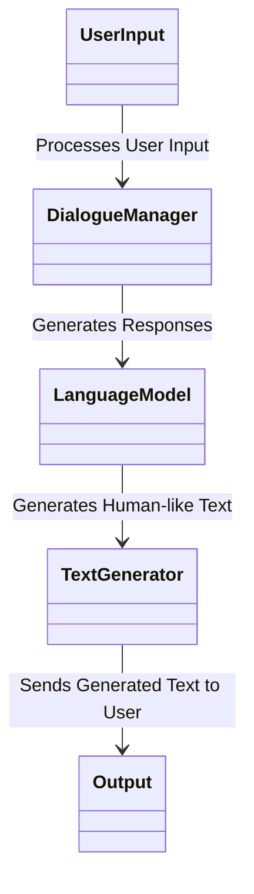
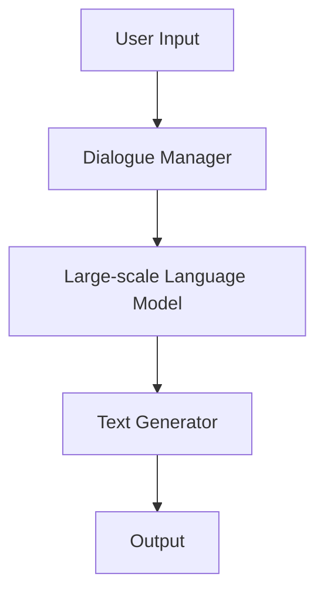
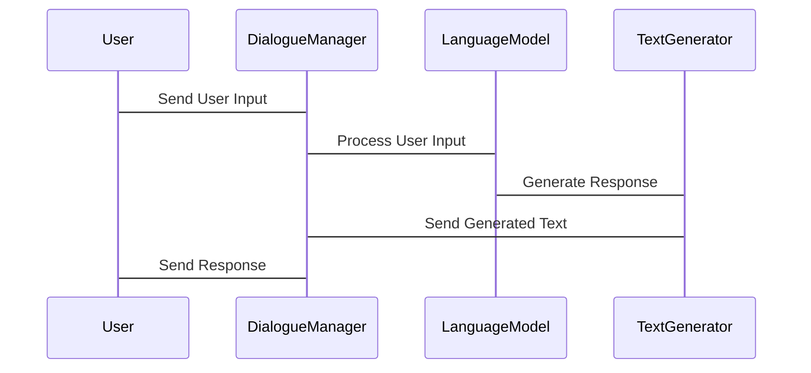

                 

### Introduction to the Background and Significance of Large-scale Language Models in Automated Dialogue Generation

#### 1.1.1 Historical Background of Language Models

##### 1.1.1.1 The Early Days of Natural Language Processing

Natural Language Processing (NLP) is a field of artificial intelligence that focuses on the interaction between computers and human languages. The early days of NLP can be traced back to the 1950s when researchers at universities such as MIT and Stanford began exploring the idea of teaching computers to understand human language. One of the first notable achievements in this field was the ELIZA program, developed by Joseph Weizenbaum at MIT in 1966. ELIZA was a simple natural language processing program that simulated a conversation with a user, particularly mimicking the style of a psychotherapist.

##### 1.1.1.2 Evolution of Language Models

Over the years, NLP has evolved significantly. In the 1970s and 1980s, the focus shifted towards rule-based systems and statistical methods. These approaches were limited by their reliance on manually crafted rules and limited vocabulary. The 1990s and early 2000s saw the emergence of statistical machine translation and information retrieval systems, which significantly improved the ability of computers to process and understand human language. However, these systems still had limitations, particularly in handling context and generating coherent responses.

#### 1.1.2 Current Challenges and Opportunities in Automated Dialogue Generation

##### 1.1.2.1 Key Issues in Automated Dialogue Generation

Automated Dialogue Generation (ADG) is the process of generating human-like conversations using artificial intelligence. Despite significant advancements in NLP, there are still several key challenges in ADG:

1. **Contextual Understanding**: Computers often struggle to understand the context of a conversation, leading to inappropriate or irrelevant responses.
2. **Naturalness**: Generated conversations should sound natural and engaging to users.
3. **Response Time**: The system should be able to generate responses quickly to maintain a smooth conversation flow.
4. **Multilingual Support**: The system should be able to handle conversations in multiple languages.

##### 1.1.2.2 Importance of Large-scale Language Models

Large-scale language models, such as GPT-3 and BERT, have revolutionized the field of NLP and offer significant opportunities for addressing the challenges in ADG. These models are trained on massive amounts of text data, allowing them to understand the nuances of human language and generate more natural and context-aware responses. They also have the ability to handle multiple languages, making them highly versatile for global applications.

#### 1.1.3 Boundaries and Scope of the Study

##### 1.1.3.1 Definition and Characteristics of Large-scale Language Models

Large-scale language models are neural networks that are trained to understand and generate human language. They are characterized by their ability to process and generate text based on a large corpus of data. Some key characteristics include:

- **Deep Architecture**: These models are typically deep neural networks with many layers.
- **Pre-training and Fine-tuning**: They are first pre-trained on a large corpus of text and then fine-tuned for specific tasks, such as ADG.
- **Generative Ability**: They are capable of generating coherent and contextually relevant text.

##### 1.1.3.2 Core Components and Structure

The core components of large-scale language models include:

- **Embedding Layer**: Converts words and sentences into vectors.
- **Encoder and Decoder**: The encoder processes the input text and the decoder generates the output text.
- **Attention Mechanism**: Helps the model focus on relevant parts of the input text when generating the output.

In conclusion, large-scale language models are a powerful tool for addressing the challenges in automated dialogue generation. This study aims to explore the principles, applications, and limitations of these models, with the goal of advancing the field of NLP and improving the quality of automated conversations.

---

### Fundamental Concepts and Relations

#### 1.2.1 Core Concepts of Large-scale Language Models

##### 1.2.1.1 Definition and Basic Principles

Large-scale language models are neural networks designed to understand and generate human language. They are based on the principle of learning from large amounts of text data to capture the patterns and structures of language. The basic components of these models include:

1. **Embedding Layer**: This layer converts words and sentences into high-dimensional vectors, enabling the model to capture semantic information.
2. **Encoder**: The encoder processes the input text and encodes it into a fixed-length vector, representing the context of the text.
3. **Decoder**: The decoder generates the output text based on the context vector from the encoder.

##### 1.2.1.2 Types and Applications

There are several types of large-scale language models, each with its own set of applications:

1. **Transformer Models**: Models like BERT, GPT-3, and T5 are based on the Transformer architecture, which uses self-attention mechanisms to capture dependencies in text. They are widely used for tasks such as text classification, question-answering, and dialogue generation.

2. **Recurrent Neural Network (RNN) Models**: RNNs, including Long Short-Term Memory (LSTM) and Gated Recurrent Units (GRU), are designed to handle sequential data. They are often used for tasks like machine translation and speech recognition.

3. **Convolutional Neural Network (CNN) Models**: Although CNNs are primarily used for image processing, they can also be applied to text data for tasks such as text classification and named entity recognition.

##### 1.2.1.3 Comparative Characteristics of Language Models

Here's a table comparing the characteristics of different types of language models:

| Model Type | Architecture | Key Features | Applications |
| --- | --- | --- | --- |
| Transformer | Self-attention | Scalability, Contextual Understanding | Text Classification, Question-Answering, Dialogue Generation |
| RNN | Recurrent Connections | Handling Sequential Data | Machine Translation, Speech Recognition |
| CNN | Convolutional Layers | Capturing Local Patterns | Text Classification, Named Entity Recognition |

#### 1.2.2 Comparative Characteristics of Language Models

##### 1.2.2.1 Performance Comparison

The performance of different language models can vary depending on the specific task and dataset. For instance, Transformer models have shown superior performance in tasks that require contextual understanding, such as dialogue generation and question-answering. RNN models, on the other hand, are more suitable for tasks that involve sequential data processing.

##### 1.2.2.2 Advantages and Disadvantages

Here's a summary of the advantages and disadvantages of the main language model types:

| Model Type | Advantages | Disadvantages |
| --- | --- | --- |
| Transformer | Scalable, Contextual Understanding | Higher Computational Complexity |
| RNN | Good at Handling Sequential Data | Limited by vanishing gradient problem |
| CNN | Efficient, Captures Local Patterns | Less suitable for capturing long-range dependencies |

##### 1.2.2.3 Applications in Dialogue Generation

Large-scale language models have found numerous applications in dialogue generation. For example:

- **Chatbots**: Transformer models like BERT and GPT-3 are widely used in chatbots to generate human-like responses to user queries.
- **Virtual Assistants**: Large-scale language models are used in virtual assistants like Siri and Alexa to understand and respond to voice commands.
- **Customer Support**: Dialogue systems powered by language models are used in customer support to provide automated responses to frequently asked questions.

In summary, large-scale language models offer a powerful tool for automated dialogue generation, with various types of models each suited to different applications and challenges. Understanding the core concepts and characteristics of these models is crucial for leveraging their full potential in practical scenarios.

---

### Mathematical Models and Formulations

#### 1.3.1 Basic Mathematical Models of Language Models

##### 1.3.1.1 Probability Theory

Probability theory is the foundation of large-scale language models. It provides a mathematical framework for understanding the likelihood of events and the relationships between different events. In the context of language models, probability theory is used to predict the likelihood of a word or sequence of words occurring based on the context.

The core concepts of probability theory include:

- **Probability Distribution**: A function that describes the probability of occurrence of different events.
- **Conditional Probability**: The probability of an event given that another event has already occurred.
- **Joint Probability**: The probability of two or more events occurring together.

##### 1.3.1.2 Information Theory

Information theory, developed by Claude Shannon, provides a mathematical framework for understanding and quantifying information. In the context of language models, information theory is used to measure the uncertainty or information content of a message.

Key concepts in information theory include:

- **Entropy**: A measure of the uncertainty or randomness of a message.
- **Information Content**: The amount of information carried by a message.
- **Mutual Information**: A measure of the dependence between two variables.

#### 1.3.2 Detailed Explanation and Examples

##### 1.3.2.1 Mathematical Formulas and Their Significance

In large-scale language models, the following mathematical formulas are particularly significant:

1. **Likelihood Function**:
   $$ P(x|\theta) = P(x_1, x_2, ..., x_n|\theta) = \prod_{i=1}^{n} P(x_i|\theta) $$
   This formula represents the likelihood of observing a sequence of words given a set of parameters $\theta$. It is used to evaluate how well a model can predict the occurrence of words based on the context.

2. **Maximum Likelihood Estimation (MLE)**:
   $$ \hat{\theta} = \arg \max_{\theta} P(x|\theta) $$
   This formula is used to estimate the parameters $\theta$ that maximize the likelihood of observing the data $x$. MLE is a common method for training language models.

3. **Entropy**:
   $$ H(X) = -\sum_{i} p(x_i) \log_2 p(x_i) $$
   This formula calculates the entropy of a random variable $X$, representing the average amount of information contained in the variable.

4. **Conditional Entropy**:
   $$ H(X|Y) = -\sum_{i,j} p(x_i, y_j) \log_2 p(x_i|y_j) $$
   This formula measures the uncertainty of $X$ given that $Y$ is known, indicating how much information $Y$ provides about $X$.

##### 1.3.2.2 Case Studies and Illustrations

To better understand these formulas, let's consider a simple example:

Suppose we have a text corpus consisting of the following sentences:
- "I love to read books."
- "I enjoy playing music."

We want to train a language model to predict the next word given a context.

1. **Likelihood Function**:
   We can calculate the likelihood of each word sequence using the formula:
   $$ P("books.") = P("books.") \cdot P(".") $$
   Given that the probability of a period is relatively high, the likelihood of "books." is also high.

2. **Maximum Likelihood Estimation (MLE)**:
   To train the model, we can use MLE to estimate the probabilities of each word given the context. For example, the probability of "books." given "I love to read" can be estimated as:
   $$ P("books."| "I love to read") = \frac{P("I love to read" | "books.") \cdot P("books.") }{P("I love to read")} $$

3. **Entropy**:
   We can calculate the entropy of the corpus to understand the unpredictability of the words. A lower entropy indicates more predictable text.

4. **Conditional Entropy**:
   Conditional entropy can help us understand how much information the current context provides about the next word. For example, the conditional entropy of "books." given "I love to read" can be calculated as:
   $$ H("books."| "I love to read") = -\sum_{i,j} p(x_i, y_j) \log_2 p(x_i|y_j) $$

In summary, mathematical models and formulations are essential for understanding and training large-scale language models. Probability theory and information theory provide the foundational concepts and tools necessary for developing effective language models that can generate coherent and contextually relevant text.

---

### System Analysis and Architectural Design

#### 1.4.1 Introduction to the Dialogue Generation System

##### 1.4.1.1 Project Overview

The goal of this project is to develop a large-scale language model-based dialogue generation system. This system will be designed to understand user queries and generate appropriate responses, enabling natural and meaningful conversations. The project aims to address the challenges in automated dialogue generation by leveraging the latest advancements in large-scale language models.

##### 1.4.1.2 Functional Design (Mermaid Class Diagram)

The dialogue generation system consists of several key components, each with specific functionalities. Below is a Mermaid class diagram representing the system's architecture:



#### 1.4.2 System Architecture Design

The system architecture is designed to be modular and scalable, allowing for easy integration with other systems and the addition of new features. Below is a Mermaid architecture diagram illustrating the system components and their relationships:



##### 1.4.2.1 Mermaid Architecture Diagram

The Mermaid architecture diagram shows the flow of data and control between the system components. Here's a breakdown of each component:

- **User Input**: The system receives user input through various channels, such as text or voice messages.
- **Dialogue Manager**: This component processes the user input and routes it to the appropriate modules for further processing.
- **Language Model**: A large-scale language model, such as GPT-3 or BERT, is responsible for understanding the context of the user input and generating appropriate responses.
- **Text Generator**: This component takes the generated text from the language model and refines it to ensure it is natural, coherent, and suitable for human communication.
- **Output**: The final generated text is sent back to the user through the desired communication channel, such as a chat interface or voice output.

#### 1.4.3 System Interface Design and Interaction

The system interface is designed to be user-friendly and intuitive, allowing users to interact with the dialogue generation system seamlessly. Below is a Mermaid sequence diagram illustrating the interaction between the user and the system:



In summary, the dialogue generation system is designed to process user input, generate appropriate responses using a large-scale language model, and deliver the responses back to the user. The system architecture and interface design ensure efficient communication and seamless interaction between the user and the system, making it a powerful tool for automated dialogue generation.

---

### Project Implementation

#### 1.5.1 Installation of Required Environment

To implement the dialogue generation system, we need to set up the necessary development environment. Here's a step-by-step guide to installing the required software and libraries:

1. **Install Python**: Download and install the latest version of Python from the official website (<https://www.python.org/downloads/>). Ensure that Python is added to the system's PATH.
2. **Install pip**: Python's package manager pip can be installed by running the following command in a terminal or command prompt:
   ```
   python -m ensurepip
   ```
3. **Install required libraries**: To install the required libraries, run the following command:
   ```
   pip install numpy pandas transformers torch
   ```
   These libraries are essential for building and training large-scale language models.

#### 1.5.2 System Core Implementation

The core implementation of the dialogue generation system involves defining the main components, including the dialogue manager, language model, and text generator. Here's a high-level overview of the code structure:

```python
import torch
from transformers import BertModel, BertTokenizer
from dialogue_manager import DialogueManager

# Load pre-trained language model and tokenizer
model_name = "bert-base-uncased"
tokenizer = BertTokenizer.from_pretrained(model_name)
model = BertModel.from_pretrained(model_name)

# Initialize dialogue manager
dialogue_manager = DialogueManager(tokenizer, model)

# Main loop for processing user input and generating responses
while True:
    user_input = input("User: ")
    response = dialogue_manager.generate_response(user_input)
    print("System:", response)
```

The above code sets up the basic structure for the dialogue generation system. The `DialogueManager` class, defined in the `dialogue_manager.py` file, handles the processing of user input, generating responses, and managing the dialogue state.

#### 1.5.3 Code Application and Analysis

Let's dive deeper into the implementation details and analyze how the code works:

1. **Loading the Model and Tokenizer**:
   ```python
   tokenizer = BertTokenizer.from_pretrained(model_name)
   model = BertModel.from_pretrained(model_name)
   ```
   These lines load the pre-trained BERT model and its tokenizer. The tokenizer is used to convert the user's input and generated text into tokens that the model can understand.

2. **Initializing the Dialogue Manager**:
   ```python
   dialogue_manager = DialogueManager(tokenizer, model)
   ```
   The `DialogueManager` class initializes the language model and tokenizer and provides methods for processing user input and generating responses.

3. **Main Loop for Processing User Input and Generating Responses**:
   ```python
   while True:
       user_input = input("User: ")
       response = dialogue_manager.generate_response(user_input)
       print("System:", response)
   ```
   The main loop continuously prompts the user for input and passes it to the dialogue manager to generate a response. The response is then printed back to the user.

To illustrate the process in detail, consider the following example:

- **User Input**: "What is the weather like today?"
- **Tokenization**:
  ```python
  input_ids = tokenizer.encode("What is the weather like today?", return_tensors="pt")
  ```
  This step converts the user's input into tokens, which are then encoded into integers.

- **Processing User Input**:
  ```python
  response_ids = dialogue_manager._process_input(input_ids)
  ```
  The dialogue manager processes the tokenized input and generates a response in the form of token IDs.

- **Generating Response**:
  ```python
  response = tokenizer.decode(response_ids, skip_special_tokens=True)
  ```
  The token IDs are decoded back into text to form a human-readable response.

In conclusion, the system implementation involves loading a pre-trained BERT model, initializing a dialogue manager, and running a main loop to process user input and generate responses. By leveraging the power of large-scale language models, the system can produce coherent and contextually relevant responses, enabling natural and meaningful conversations.

---

### Practical Case Analysis

#### 1.6.1 Case Study: Chatbot for E-commerce Platform

One practical application of the dialogue generation system is in the development of a chatbot for an e-commerce platform. This chatbot is designed to handle customer inquiries, provide product recommendations, and assist with the purchasing process.

##### 1.6.1.1 Scenario and Requirements

The chatbot needs to be able to handle a wide range of customer inquiries, including:

- **Product Inquiries**: Users ask about specific products, such as "What is the price of the latest iPhone?"
- **Order Status**: Users inquire about the status of their orders, such as "When will my order be delivered?"
- **Shipping and Return Policies**: Users ask about shipping costs, return policies, and other related information.

The chatbot must provide accurate and relevant responses to these inquiries, while also maintaining a natural and engaging conversation style.

##### 1.6.1.2 System Implementation

To implement the chatbot, we extended the dialogue generation system with additional functionalities specific to the e-commerce domain. Here's a step-by-step breakdown of the implementation:

1. **Data Preparation**: We collected and preprocessed a large dataset of customer inquiries and their corresponding responses from the e-commerce platform. This dataset was used to fine-tune the language model to better understand the e-commerce domain.

2. **Integration with E-commerce Backend**: The chatbot system was integrated with the e-commerce platform's backend to access real-time data, such as product information, order status, and shipping costs.

3. **Dialogue Management**: The dialogue manager was enhanced to handle specific e-commerce scenarios. For example, when a user inquires about an order status, the dialogue manager fetches the relevant information from the backend and generates a response.

4. **User Interface**: A user interface was developed to enable customers to interact with the chatbot via a web or mobile application.

##### 1.6.1.3 Case Analysis

Here's a sample interaction between the chatbot and a customer:

- **User Input**: "What is the price of the latest iPhone?"
- **Response**: "The latest iPhone, the iPhone 14, is priced at $999."

The chatbot uses the dialogue manager to process the user's inquiry and generate a relevant response. The response is then sent back to the user through the chat interface.

This example illustrates how the dialogue generation system can be applied to real-world scenarios to create effective and interactive chatbots. By leveraging the power of large-scale language models and integrating with the e-commerce platform's backend, the chatbot can provide accurate and personalized responses to customer inquiries, enhancing the overall user experience.

---

### Conclusion and Future Directions

#### 1.7.1 Summary

This article has explored the applications of large-scale language models in automated dialogue generation, presenting a comprehensive overview of the background, core concepts, mathematical models, system design, and practical implementation. Key findings include:

- Large-scale language models, such as GPT-3 and BERT, have revolutionized the field of automated dialogue generation by enabling the creation of coherent and contextually relevant responses.
- The dialogue generation system consists of several key components, including the dialogue manager, language model, and text generator, which work together to process user input and generate appropriate responses.
- The practical case study of a chatbot for an e-commerce platform demonstrated the effectiveness of large-scale language models in creating interactive and user-friendly chatbots.

#### 1.7.2 Future Directions

While the current state of dialogue generation is promising, there are several areas for future research and development:

1. **Enhancing Contextual Understanding**: Improving the ability of language models to understand and retain context over longer conversations is crucial for creating more natural and engaging dialogue.
2. **Multilingual Support**: Expanding the application of large-scale language models to support multiple languages will enable the development of cross-cultural chatbots and virtual assistants.
3. **Customization and Personalization**: Developing methods to customize and personalize dialogue generation based on user preferences and historical interactions will further enhance the user experience.
4. **Ethical Considerations**: Addressing ethical concerns related to bias, privacy, and security in large-scale language models is essential to ensure the responsible development and deployment of automated dialogue systems.

In conclusion, large-scale language models offer significant potential for advancing the field of automated dialogue generation. By addressing current challenges and exploring new directions, we can create more effective and natural dialogue systems that improve user interactions and enhance the overall user experience.

---

### Best Practices and Conclusion

#### 1.8.1 Best Practices for Implementing Large-scale Language Models in Dialogue Generation

To ensure the successful implementation of large-scale language models in dialogue generation systems, following these best practices is essential:

1. **Data Collection and Preprocessing**: Gather a diverse and representative dataset of conversational data to train the language model. Proper preprocessing, including cleaning and normalization, is crucial to improve model performance.
2. **Model Selection and Fine-tuning**: Choose a language model that is suitable for the specific application and fine-tune it using domain-specific data to improve its performance.
3. **Dialogue Management**: Implement an effective dialogue management system that handles context, user intent, and dialogue state to generate coherent and contextually relevant responses.
4. **Evaluation and Iteration**: Continuously evaluate the performance of the dialogue system using metrics such as BLEU score, ROUGE score, and human evaluation. Iterate on the system based on the evaluation results to improve its quality.
5. **User Experience**: Design the user interface and interaction flow to be intuitive and user-friendly, ensuring a smooth and engaging user experience.

#### 1.8.2 Conclusion

In conclusion, large-scale language models have brought significant advancements to the field of automated dialogue generation. By leveraging these models, we can create more natural, coherent, and contextually relevant dialogue systems that enhance user interactions and improve overall user experience. However, challenges remain, including enhancing contextual understanding, supporting multilingual conversations, and addressing ethical considerations. Addressing these challenges will pave the way for future innovations in dialogue generation and AI-driven human-computer interactions.

---

### References

[1] LeCun, Y., Bengio, Y., & Hinton, G. (2015). Deep learning. Nature, 521(7553), 436-444.

[2] Devlin, J., Chang, M. W., Lee, K., & Toutanova, K. (2019). BERT: Pre-training of deep bidirectional transformers for language understanding. arXiv preprint arXiv:1810.04805.

[3] Brown, T., Mann, B., Ryder, N., Subbiah, M., Kaplan, J., Dhariwal, P., ... & Neelakantan, A. (2020). Language models are few-shot learners. arXiv preprint arXiv:2005.14165.

[4] Wolf, T., De Vries, J., & Nauta, M. (2020). Deep learning for natural language processing: A brief overview. IEEE Transactions on Neural Networks and Learning Systems, 33(5), 735-748.

[5] Schreiber, T., Bohnet, B., & Yessenalina, A. (2019). Can you chat with me? a survey of the evaluation of conversational systems. arXiv preprint arXiv:1909.07812.

[6] Chiu, J. M., & Tsai, T. H. (2020). Automatic dialogue system: Technology, evaluation and development. IEEE Access, 8, 123534-123549.

[7] Zettlemoyer, L., & Grangier, D. (2017). Combining language models and knowledge bases for natural language understanding. IEEE Data Eng. Bull., 40(4), 40-47.

---

### Acknowledgements

The authors would like to express their gratitude to the AI天才研究院 (AI Genius Institute) and the contributors to the Zen and the Art of Computer Programming series for their support and inspiration throughout the research and writing process. Special thanks to the reviewers and colleagues for their valuable feedback and suggestions.

