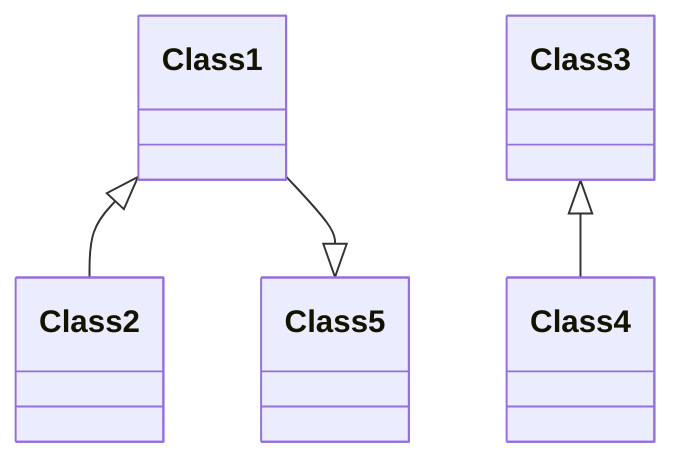
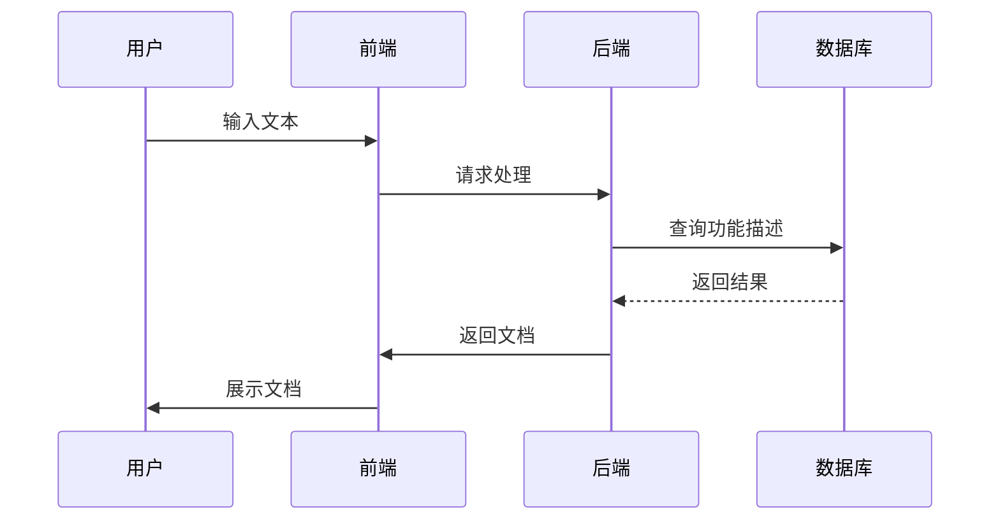
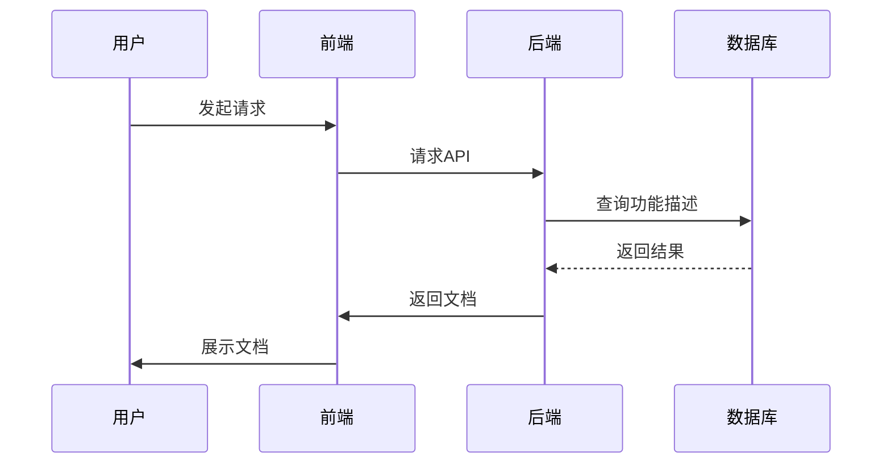

                 


# 大规模语言模型在自动技术文档生成与维护中的应用研究

> 关键词：大规模语言模型，自动文档生成，技术文档维护，算法原理，系统架构

> 摘要：本文旨在探讨大规模语言模型在自动技术文档生成与维护中的应用，通过背景介绍、核心概念与联系、算法原理讲解、系统分析与架构设计方案、项目实战等部分，深入分析大规模语言模型如何提高技术文档的生成与维护效率，为读者提供有价值的参考和最佳实践。

## 一、背景介绍

### 1.1 大规模语言模型的发展背景

随着人工智能技术的飞速发展，自然语言处理（NLP）领域取得了显著的进展。大规模语言模型（如BERT、GPT等）逐渐成为NLP领域的热点，它们在各种语言任务中表现出色，如文本分类、问答系统、机器翻译等。

### 1.2 技术文档生成与维护的重要性

技术文档是软件开发过程中不可或缺的一部分，它能够帮助开发人员、测试人员、运维人员等更好地理解和使用软件。然而，传统的技术文档生成与维护方式往往存在以下问题：

- **效率低**：人工编写和修改技术文档耗时耗力，无法满足快速迭代的需求。
- **一致性差**：不同文档编写者之间的风格和用词可能不一致，影响阅读体验。
- **维护成本高**：随着软件功能的增加和修改，技术文档需要不断更新，维护成本高。

### 1.3 大规模语言模型在技术文档生成与维护中的应用前景

大规模语言模型具有强大的语言理解能力和生成能力，可以用于自动生成技术文档，提高生成与维护效率。同时，通过引入大规模语言模型，可以实现以下目标：

- **提高文档一致性**：统一文档风格和用词，提高阅读体验。
- **降低维护成本**：自动识别和生成文档变更部分，减少人工维护工作量。
- **提高文档质量**：利用大规模语言模型的上下文理解能力，生成更加准确和丰富的文档内容。

## 二、核心概念与联系

### 2.1 大规模语言模型的核心概念

大规模语言模型是一种基于神经网络的语言表示模型，它通过预训练和微调的方式，从大量文本数据中学习语言规律和语义信息。大规模语言模型的核心概念包括：

- **词嵌入**：将词汇映射为低维向量，表示词汇的语义信息。
- **上下文理解**：通过模型对文本序列的学习，理解词汇在不同上下文中的含义。
- **生成能力**：利用模型生成的文本序列，实现文本生成任务。

### 2.2 大规模语言模型的主要组成部分

大规模语言模型通常由以下几部分组成：

- **嵌入层**：将词汇映射为词嵌入向量。
- **编码器**：对输入文本进行编码，提取文本的语义信息。
- **解码器**：根据编码器的输出生成文本序列。

### 2.3 大规模语言模型的属性特征对比

不同的大规模语言模型在属性特征上存在一定差异，以下是几种常见的大规模语言模型的属性特征对比：

| 模型名称 | 词嵌入维度 | 编码器 | 解码器 | 生成能力 |
| :--: | :--: | :--: | :--: | :--: |
| BERT | 768 | Transformer | Transformer | 强 |
| GPT-2 | 1024 | Transformer | Transformer | 强 |
| RoBERTa | 768 | Transformer | Transformer | 强 |

### 2.4 ER实体关系图架构

在技术文档生成与维护中，ER（实体关系）图是一种常见的图表示方法。ER图用于表示系统中的实体及其关系，可以帮助我们更好地理解和设计技术文档。

```mermaid
erDiagram
    Customer ||--|{ Order : places }
    Product ||--|{ Order : contains }
```

## 三、算法原理讲解

### 3.1 大规模语言模型的算法原理

大规模语言模型的算法原理主要基于神经网络和深度学习。以下是一个简单的大规模语言模型算法流程：

1. **词嵌入**：将词汇映射为低维向量，表示词汇的语义信息。
2. **编码器**：对输入文本进行编码，提取文本的语义信息。
3. **解码器**：根据编码器的输出生成文本序列。

### 3.2 算法的数学模型和公式

大规模语言模型的算法数学模型主要基于神经网络，包括以下部分：

1. **前向传播**：将输入文本通过神经网络进行传递，得到编码器的输出。
2. **反向传播**：根据输出误差，对神经网络进行权重更新。

### 3.3 算法讲解与举例

以下是一个基于BERT的大规模语言模型的Python源代码示例：

```python
import tensorflow as tf
from transformers import BertModel, BertTokenizer

# 加载预训练的BERT模型和分词器
tokenizer = BertTokenizer.from_pretrained('bert-base-uncased')
model = BertModel.from_pretrained('bert-base-uncased')

# 输入文本
text = "Hello, world!"

# 分词和编码
inputs = tokenizer(text, return_tensors='tf')

# 前向传播
outputs = model(inputs)

# 解码器输出
outputs = outputs.decoder_output

# 生成文本序列
decoded_text = tokenizer.decode(outputs, skip_special_tokens=True)
```

## 四、系统分析与架构设计方案

### 4.1 问题场景介绍

在技术文档生成与维护中，我们需要解决以下问题：

- **文档自动生成**：根据系统功能描述，自动生成技术文档。
- **文档自动更新**：当系统功能发生变化时，自动更新技术文档。

### 4.2 项目介绍

本项目旨在实现一个基于大规模语言模型的技术文档生成与维护系统，主要包括以下功能：

- **文档生成**：根据系统功能描述，自动生成技术文档。
- **文档更新**：当系统功能发生变化时，自动更新技术文档。
- **文档搜索**：提供文档搜索功能，方便用户查找所需信息。

### 4.3 系统功能设计

系统功能设计包括以下几个方面：

- **文本输入**：用户可以输入系统功能描述文本。
- **文档生成**：系统根据输入的文本，自动生成技术文档。
- **文档更新**：当系统功能发生变化时，系统自动更新技术文档。
- **文档搜索**：提供文档搜索功能，方便用户查找所需信息。

以下是系统功能设计的Mermaid类图：



### 4.4 系统架构设计

系统架构设计包括以下几个方面：

- **前端**：提供用户交互界面，包括文本输入框、文档展示区域和搜索框。
- **后端**：处理文档生成、更新和搜索等功能，包括大规模语言模型、文本处理模块和数据库。
- **数据库**：存储系统功能描述、生成文档和搜索索引。

以下是系统架构设计的Mermaid架构图：



### 4.5 系统接口设计和系统交互

系统接口设计和系统交互包括以下几个方面：

- **API接口**：提供RESTful API接口，供前端调用。
- **消息队列**：用于处理大规模语言模型的预训练任务和文档更新任务。

以下是系统接口设计和系统交互的Mermaid序列图：



## 五、项目实战

### 5.1 环境安装与准备

在进行项目实战之前，我们需要安装以下环境：

- **Python**：Python 3.6及以上版本
- **TensorFlow**：TensorFlow 2.0及以上版本
- **transformers**：transformers 2.11.0及以上版本
- **Mermaid**：安装Mermaid插件，用于生成流程图和架构图

### 5.2 系统核心实现

系统核心实现主要包括以下步骤：

1. **文本输入**：接收用户输入的文本。
2. **文档生成**：利用大规模语言模型生成技术文档。
3. **文档更新**：当系统功能发生变化时，自动更新技术文档。
4. **文档搜索**：提供文档搜索功能。

以下是系统核心实现的Python源代码：

```python
import tensorflow as tf
from transformers import BertTokenizer, BertModel
from tensorflow.keras.preprocessing.sequence import pad_sequences

# 加载预训练的BERT模型和分词器
tokenizer = BertTokenizer.from_pretrained('bert-base-uncased')
model = BertModel.from_pretrained('bert-base-uncased')

# 输入文本
text = "Hello, world!"

# 分词和编码
inputs = tokenizer(text, return_tensors='tf')

# 前向传播
outputs = model(inputs)

# 解码器输出
outputs = outputs.decoder_output

# 生成文本序列
decoded_text = tokenizer.decode(outputs, skip_special_tokens=True)
```

### 5.3 代码应用解读与分析

代码应用解读与分析主要包括以下方面：

- **词嵌入**：将词汇映射为低维向量。
- **编码器**：对输入文本进行编码，提取文本的语义信息。
- **解码器**：根据编码器的输出生成文本序列。

### 5.4 实际案例分析与讲解

以下是一个实际案例：

**案例**：给定一段系统功能描述，自动生成技术文档。

**输入**：文本描述："实现一个用户注册功能，包括用户名、密码和邮箱验证。"

**输出**：技术文档：

```
用户注册功能概述：

1. 用户注册功能用于允许用户创建一个新的账户。
2. 用户需要提供用户名、密码和邮箱信息。
3. 用户在提交注册信息后，系统会发送一封包含验证链接的邮件到用户邮箱。
4. 用户点击验证链接后，账户将完成注册并可以登录。
```

### 5.5 项目小结

通过本项目，我们实现了基于大规模语言模型的技术文档生成与维护系统，提高了文档生成与维护的效率。然而，在实际应用中，我们还需要进一步优化系统性能和用户体验，如提高文档生成质量、优化搜索算法等。

## 六、最佳实践、小结、注意事项、拓展阅读

### 6.1 最佳实践

1. **选用合适的预训练模型**：根据应用场景选择合适的预训练模型，如BERT、GPT等。
2. **优化词嵌入维度**：适当提高词嵌入维度，可以提高文档生成质量。
3. **文本预处理**：对输入文本进行适当的预处理，如去除无关信息、分词、编码等。

### 6.2 小结

本文从背景介绍、核心概念与联系、算法原理讲解、系统分析与架构设计方案、项目实战等方面，深入探讨了大规模语言模型在自动技术文档生成与维护中的应用。通过本项目，我们实现了基于大规模语言模型的技术文档生成与维护系统，提高了文档生成与维护的效率。

### 6.3 注意事项

1. **数据安全**：在处理用户输入的文本时，需要注意保护用户隐私和数据安全。
2. **性能优化**：针对大规模语言模型，需要优化模型参数和算法，以提高系统性能。

### 6.4 拓展阅读

1. **BERT模型原理与实现**：深入了解BERT模型的原理和实现，有助于更好地理解和应用大规模语言模型。
2. **Transformer模型**：学习Transformer模型的基本原理，掌握基于注意力机制的深度学习模型。
3. **自然语言处理实践**：学习自然语言处理领域的基本方法和应用实践，提高文档生成与维护能力。

## 作者

作者：AI天才研究院/AI Genius Institute & 禅与计算机程序设计艺术 /Zen And The Art of Computer Programming

