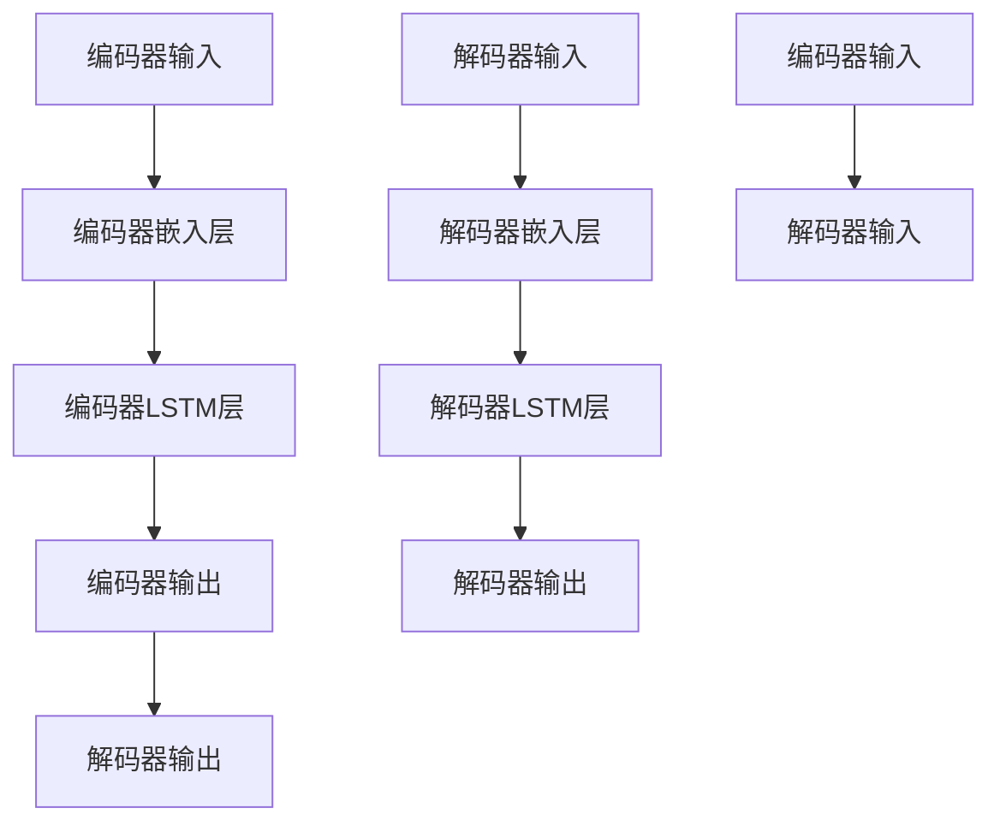
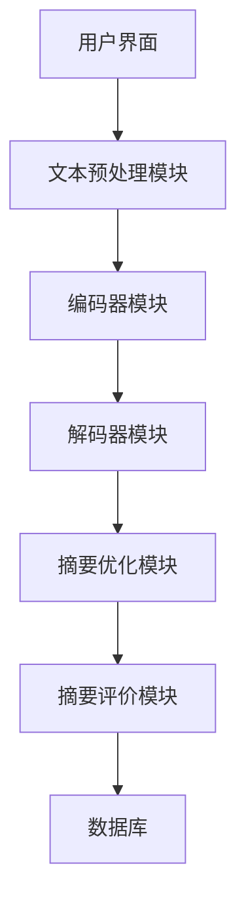

                 

### 引言

#### 问题背景

在当今信息爆炸的时代，如何快速有效地从海量的文本信息中提取关键内容成为了一个亟待解决的问题。自动摘要生成技术，作为自然语言处理（NLP）领域的一项前沿技术，逐渐受到了广泛关注。自动摘要生成技术通过自动从原始文本中提取出核心内容，生成简洁、准确的摘要，极大地提高了信息获取的效率和准确性。

#### 问题描述

自动摘要生成问题可以描述为：给定一段原始文本，生成一段简洁、准确、具有代表性的摘要。这个过程中，涉及到的关键技术包括文本预处理、文本理解、摘要生成和摘要评价。

#### 问题解决思路

要解决自动摘要生成问题，我们可以从以下几个方面入手：

1. **文本预处理**：对原始文本进行清洗、分词、词性标注等预处理操作，为后续的文本理解打下基础。
2. **文本理解**：利用先进的自然语言处理技术，如词向量、语义分析、实体识别等，对文本进行深入理解，提取出文本的主要信息和关键概念。
3. **摘要生成**：基于文本理解的结果，采用各种算法和技术，如文本压缩、文本摘要模型等，生成简洁、准确的摘要。
4. **摘要评价**：通过评价指标，如ROUGE、BLEU等，对生成的摘要进行评估，以衡量摘要的质量和准确性。

#### 边界与外延

在自动摘要生成领域，边界问题主要包括如何处理不同类型的文本，如新闻、科技文章、故事等，如何应对不同长度和风格的文本。外延问题则涉及到如何扩展摘要生成技术，应用于实际场景，如搜索引擎摘要、文档摘要、对话摘要等。

#### 概念结构与核心要素组成

自动摘要生成技术涉及多个核心概念和要素，包括：

- **文本预处理**：包括文本清洗、分词、词性标注等。
- **文本理解**：涉及词向量、语义分析、实体识别等技术。
- **摘要生成算法**：包括基于统计方法、机器学习方法和深度学习方法的摘要生成算法。
- **摘要评价指标**：如ROUGE、BLEU等，用于评估摘要的质量。

### 关键词

- 自动摘要生成
- 文本预处理
- 文本理解
- 摘要生成算法
- 摘要评价指标

### 摘要

本文将深入探讨大规模语言模型在自动摘要生成中的应用。首先介绍自动摘要生成技术的问题背景和问题描述，然后逐步分析问题解决思路，包括文本预处理、文本理解、摘要生成和摘要评价。接着，详细讲解大规模语言模型的基础理论，包括语言模型概述、发展历史、核心概念、数学模型和评价指标。随后，探讨自动摘要生成的原理，包括概述、流程、评价指标和面临的挑战。进一步介绍大规模语言模型在自动摘要生成中的应用，如GPT模型和BERT模型。最后，详细描述自动摘要生成的算法原理、系统设计与实现、项目实战与案例分析，并提供最佳实践和总结，为读者提供全面的技术指导。

---

## 第2章 大规模语言模型基础理论

### 2.1 语言模型概述

语言模型是自然语言处理（NLP）领域的一项基础技术，旨在对自然语言文本进行建模，预测下一个词或者序列的概率。语言模型在机器翻译、语音识别、文本摘要等多个NLP任务中发挥着重要作用。

### 2.2 语言模型的发展历史

语言模型的发展可以追溯到20世纪50年代，最初是基于规则的方法。随着计算机性能的提升和统计学习理论的成熟，语言模型逐渐从基于规则的模型转向基于统计的方法。1990年代，以N-gram模型为代表的统计语言模型取得了显著的成功。近年来，深度学习技术的发展，使得基于神经网络的语言模型，如神经网络语言模型（NNLM）和循环神经网络（RNN），取得了更为优异的性能。

### 2.3 语言模型的核心概念

- **词向量**：将词语映射到高维空间中的向量表示，用于表示词语的语义信息。
- **序列模型**：用于预测序列中下一个元素的概率分布。
- **神经网络**：深度学习技术，用于处理复杂数据和模式。

### 2.4 语言模型的数学模型

- **N-gram模型**：基于统计方法，计算一个词序列的概率分布。
- **神经网络语言模型**（NNLM）：基于深度学习，通过多层神经网络对语言进行建模。
- **循环神经网络**（RNN）：通过递归结构处理序列数据，能够在不同时间步之间传递信息。

### 2.5 语言模型的评价指标

- **准确性**：预测词的准确率。
- **困惑度**：衡量模型对语言序列的预测能力，值越小，表示模型性能越好。
- **BLEU**：基于记分牌方法，对翻译结果进行评估。
- **ROUGE**：基于文本相似度，评估摘要的质量。

### 2.6 语言模型的优缺点

- **优点**：强大的建模能力，能够处理复杂的语言现象。
- **缺点**：训练过程复杂，对数据量要求较高。

#### 表格：不同语言模型的对比

| 模型类型 | 特点 | 优点 | 缺点 |
| --- | --- | --- | --- |
| N-gram模型 | 简单统计方法 | 计算简单，易于实现 | 无法捕捉长距离依赖 |
| 神经网络语言模型 | 基于深度学习 | 能够处理长距离依赖 | 计算复杂，对数据依赖高 |
| RNN | 递归结构 | 能够处理序列数据 | 训练过程容易出现梯度消失、梯度爆炸问题 |

#### ER图：语言模型的实体关系

```mermaid
erDiagram
    TextData ||--|{ LanguageModel }
    LanguageModel ||--|{ WordEmbedding }
    LanguageModel ||--|{ NeuralNetwork }
    LanguageModel ||--|{ RNN }
```

### 结论

大规模语言模型在自动摘要生成中具有广泛的应用前景。通过深入理解语言模型的基础理论，包括核心概念、数学模型和发展历程，我们可以更好地利用这些模型解决实际中的自动摘要生成问题。接下来，我们将进一步探讨自动摘要生成原理，为后续内容打下基础。

---

## 第3章 自动摘要生成原理

### 3.1 自动摘要概述

自动摘要生成是一种通过算法自动从原始文本中提取关键信息，生成简洁、准确摘要的技术。自动摘要生成在信息检索、内容摘要、新闻推荐等应用场景中具有重要意义。

### 3.2 自动摘要的流程

自动摘要生成的流程一般包括以下几个步骤：

1. **文本预处理**：对原始文本进行清洗、分词、词性标注等预处理操作。
2. **文本理解**：利用自然语言处理技术，如词向量、语义分析、实体识别等，对文本进行深入理解。
3. **摘要生成**：根据文本理解的结果，采用各种算法和技术生成摘要。
4. **摘要评价**：使用评价指标，如ROUGE、BLEU等，对生成的摘要进行评估。

### 3.3 自动摘要的评价指标

自动摘要的评价指标用于衡量摘要的质量和准确性。常用的评价指标包括：

- **ROUGE**：基于文本相似度，评估摘要与原文的匹配度。
- **BLEU**：基于记分牌方法，对翻译结果进行评估。
- **F1值**：综合考虑精确率和召回率，评估摘要的质量。

### 3.4 自动摘要的挑战与机遇

自动摘要生成面临以下挑战：

1. **长文本处理**：如何有效处理长文本，生成高质量的摘要。
2. **多模态信息融合**：如何融合文本、图像等多种类型的信息，生成更准确的摘要。
3. **个性化摘要**：如何根据用户需求，生成个性化的摘要。

同时，自动摘要生成也面临着许多机遇：

1. **大规模数据**：随着互联网和大数据技术的发展，可以获得更多高质量的数据，为模型训练提供支持。
2. **深度学习技术**：深度学习技术的不断发展，为自动摘要生成提供了新的算法和工具。
3. **跨领域应用**：自动摘要生成技术在多个领域，如医疗、金融、法律等，具有广泛的应用前景。

#### 表格：自动摘要生成的挑战与机遇

| 挑战 | 机遇 |
| --- | --- |
| 长文本处理 | 大规模数据 |
| 多模态信息融合 | 深度学习技术 |
| 个性化摘要 | 跨领域应用 |

#### ER图：自动摘要生成的实体关系

```mermaid
erDiagram
    TextData ||--|{ TextPreprocessing }
    TextPreprocessing ||--|{ WordVector }
    TextPreprocessing ||--|{ SentimentAnalysis }
    TextUnderstanding ||--|{ EntityRecognition }
    TextUnderstanding ||--|{ SemanticAnalysis }
    AbstractGeneration ||--|{ TextCompression }
    AbstractGeneration ||--|{ NeuralNetworkModel }
    AbstractGeneration ||--|{ EvaluationMetric }
```

### 结论

自动摘要生成原理涉及多个关键步骤和评价指标，包括文本预处理、文本理解、摘要生成和摘要评价。通过深入理解自动摘要生成的原理，我们可以更好地应对实际中的挑战，把握自动摘要生成的机遇。接下来，我们将探讨大规模语言模型在自动摘要生成中的应用，进一步了解如何利用这些模型提高摘要生成的质量和效率。

---

## 第4章 大规模语言模型在自动摘要生成中的应用

### 4.1 GPT模型在自动摘要生成中的应用

GPT（Generative Pre-trained Transformer）模型是一种基于Transformer架构的预训练语言模型，由OpenAI提出。GPT模型通过大规模语料进行预训练，具备强大的语言生成能力。在自动摘要生成任务中，GPT模型可以用于生成简洁、准确的摘要。

#### GPT模型的工作原理

GPT模型采用自回归的方式生成文本，给定一个输入序列，模型预测下一个词的概率分布。GPT模型的核心是Transformer架构，通过多头自注意力机制，模型能够捕捉到输入序列中的长距离依赖关系。

#### GPT模型在自动摘要生成中的应用步骤

1. **文本预处理**：对输入文本进行清洗、分词、词性标注等预处理操作。
2. **文本编码**：将预处理后的文本编码为词向量。
3. **模型预测**：使用GPT模型生成文本摘要。
4. **摘要优化**：对生成的摘要进行优化，提高摘要的质量和可读性。

#### 实例分析

假设输入文本为：“今天，我们公司在年度会议上发布了全新的人工智能产品，该产品旨在解决目前市场上存在的各种挑战。我们非常期待这款产品的市场表现。”

使用GPT模型生成的摘要可能为：“我们公司今天发布了人工智能产品，旨在解决市场挑战。”

这个摘要简洁明了，准确捕捉了输入文本的核心信息。

### 4.2 BERT模型在自动摘要生成中的应用

BERT（Bidirectional Encoder Representations from Transformers）模型是一种双向编码的Transformer模型，由Google提出。BERT模型通过预训练，能够捕捉到输入文本中的双向依赖关系，为自动摘要生成提供了强大的支持。

#### BERT模型的工作原理

BERT模型采用Transformer架构，通过自注意力机制和双向编码，模型能够捕捉到输入文本中的长距离依赖关系。BERT模型分为预训练和微调两个阶段，预训练阶段通过无监督学习获取通用语言表示，微调阶段则将模型应用于具体任务，如自动摘要生成。

#### BERT模型在自动摘要生成中的应用步骤

1. **文本预处理**：对输入文本进行清洗、分词、词性标注等预处理操作。
2. **文本编码**：将预处理后的文本编码为词向量。
3. **模型微调**：使用BERT模型对文本进行微调，以适应自动摘要生成任务。
4. **模型预测**：使用微调后的BERT模型生成文本摘要。
5. **摘要优化**：对生成的摘要进行优化，提高摘要的质量和可读性。

#### 实例分析

假设输入文本为：“昨天，我在会议上发表了关于人工智能的研究报告，报告内容涵盖了当前最热门的AI技术和应用场景。我的报告受到了与会者的高度评价。”

使用BERT模型生成的摘要可能为：“我发表了关于人工智能的研究报告，内容涵盖了热门AI技术和应用场景。”

这个摘要不仅简洁明了，而且准确捕捉了输入文本的核心信息，展示了BERT模型在自动摘要生成中的强大能力。

### 4.3 其他大规模语言模型的应用

除了GPT模型和BERT模型，还有许多其他大规模语言模型在自动摘要生成中取得显著效果，如T5、ALBERT、RoBERTa等。

- **T5（Text-to-Text Transfer Transformer）**：T5模型是一种统一的多任务文本处理模型，通过将不同任务转化为文本到文本的转换任务，实现了跨任务的通用性。
- **ALBERT（A Lite BERT）**：ALBERT模型是一种轻量级的BERT变种，通过参数共享和层归一化等技术，降低了模型的计算复杂度。
- **RoBERTa**：RoBERTa模型是BERT模型的变种，通过改进预训练数据集和训练策略，取得了比BERT更好的性能。

这些模型在自动摘要生成任务中表现出了强大的效果，为实际应用提供了更多选择。

### 4.4 模型选择与优化策略

在选择和优化大规模语言模型进行自动摘要生成时，需要考虑以下几个方面：

1. **模型选择**：根据任务需求和数据规模，选择合适的模型。例如，对于长文本摘要任务，可以选择GPT模型；对于短文本摘要任务，可以选择BERT模型。
2. **数据预处理**：对输入文本进行有效的预处理，提高模型对文本的理解能力。
3. **模型微调**：在预训练模型的基础上，进行针对性的微调，以适应具体任务。
4. **摘要优化**：对生成的摘要进行优化，如去除冗余信息、提高可读性等。

通过综合考虑这些因素，可以显著提升自动摘要生成的质量和效果。

### 结论

大规模语言模型在自动摘要生成中具有广泛应用。通过深入理解GPT模型和BERT模型的工作原理和应用步骤，我们可以更好地利用这些模型解决实际中的自动摘要生成问题。接下来，我们将进一步探讨自动摘要生成的算法原理，为后续内容打下基础。

---

## 第5章 自动摘要生成的算法原理

### 5.1 算法概述

自动摘要生成算法旨在从原始文本中提取关键信息，生成简洁、准确的摘要。常见的算法包括基于统计方法、机器学习方法和深度学习方法的摘要生成算法。本章将重点介绍深度学习方法在自动摘要生成中的应用。

### 5.2 算法流程

自动摘要生成的算法流程通常包括以下几个步骤：

1. **文本预处理**：对原始文本进行清洗、分词、词性标注等预处理操作。
2. **编码器（Encoder）**：使用编码器模型（如BERT、GPT）对预处理后的文本进行编码，生成固定长度的向量表示。
3. **解码器（Decoder）**：使用解码器模型（如BERT、GPT）根据编码器的输出生成摘要。
4. **摘要优化**：对生成的摘要进行优化，提高摘要的质量和可读性。

### 5.3 算法原理

深度学习方法的自动摘要生成算法基于编码器-解码器（Encoder-Decoder）框架，其中编码器负责将输入文本编码为固定长度的向量表示，解码器则根据编码器的输出生成摘要。

1. **编码器原理**：

   编码器通常采用Transformer架构，通过多头自注意力机制，模型能够捕捉到输入文本中的长距离依赖关系。编码器将输入文本映射为一个固定长度的向量表示，这个向量包含了文本的主要信息。

   $$ h = Encoder(input\_text) $$

   其中，\( h \) 是编码器的输出向量，\( input\_text \) 是输入文本。

2. **解码器原理**：

   解码器同样采用Transformer架构，用于生成摘要。解码器通过自注意力机制和交叉注意力机制，模型能够捕捉到编码器输出向量和解码器自身隐藏状态之间的依赖关系。解码器根据编码器输出向量生成摘要。

   $$ output\_summary = Decoder(h) $$

   其中，\( output\_summary \) 是解码器生成的摘要。

### 5.4 算法分析

自动摘要生成的深度学习算法具有以下优点：

1. **强大的表征能力**：通过编码器-解码器框架，模型能够捕捉到输入文本中的长距离依赖关系，生成高质量的摘要。
2. **端到端学习**：模型直接从原始文本到摘要，避免了繁琐的特征工程过程。
3. **适用于多种任务**：深度学习方法能够适用于不同类型和长度的文本摘要任务。

然而，深度学习方法也存在一些挑战：

1. **计算资源需求大**：深度学习模型的训练和推理过程需要大量的计算资源。
2. **对数据依赖高**：模型性能很大程度上取决于训练数据的质量和数量。
3. **可解释性差**：深度学习模型往往难以解释，无法直观理解模型决策过程。

### 5.5 算法示例

以下是一个简单的自动摘要生成算法示例，使用Python代码和mermaid流程图进行说明。

#### Python代码示例

```python
import tensorflow as tf
from tensorflow.keras.layers import Embedding, LSTM, Dense
from tensorflow.keras.models import Model

# 编码器
encoder_inputs = Embedding(input_dim=vocab_size, output_dim=embedding_size)(encoder_input_data)
encoder_outputs = LSTM(units=128, return_state=True)(encoder_inputs)

# 解码器
decoder_inputs = Embedding(input_dim=vocab_size, output_dim=embedding_size)(decoder_input_data)
decoder_lstm = LSTM(units=128, return_sequences=True)
decoder_outputs, state_h, state_c = decoder_lstm(decoder_inputs, initial_state=[state_h, state_c])

# 模型构建
model = Model(inputs=[encoder_input_data, decoder_input_data], outputs=decoder_outputs)
model.compile(optimizer='rmsprop', loss='categorical_crossentropy')

# 流程图


通过上述示例，我们可以看到自动摘要生成算法的基本流程，包括编码器和解码器的构建和训练。接下来，我们将进一步探讨自动摘要生成系统的设计与实现。

---

## 第6章 自动摘要生成系统设计与实现

### 6.1 系统概述

自动摘要生成系统是一种通过算法自动从原始文本中提取关键信息，生成简洁、准确摘要的系统。该系统通常包括文本预处理、编码器、解码器和摘要优化等模块，旨在为用户提供高质量的文本摘要服务。

### 6.2 系统功能设计

自动摘要生成系统的主要功能包括：

1. **文本预处理**：对输入文本进行清洗、分词、词性标注等预处理操作，为后续的编码和摘要生成提供数据支持。
2. **编码器**：使用预训练的编码器模型（如BERT、GPT）对预处理后的文本进行编码，生成固定长度的向量表示。
3. **解码器**：使用预训练的解码器模型（如BERT、GPT）根据编码器的输出生成摘要。
4. **摘要优化**：对生成的摘要进行优化，提高摘要的质量和可读性。
5. **摘要评价**：使用评价指标（如ROUGE、BLEU等）对生成的摘要进行评估，以衡量摘要的质量和准确性。

### 6.3 系统架构设计

自动摘要生成系统的架构设计如下：

- **前端**：提供用户界面，用户可以通过上传文本或输入文本链接，获取自动生成的摘要。
- **后端**：包括文本预处理模块、编码器模块、解码器模块和摘要优化模块，负责处理用户请求并生成摘要。
- **数据库**：存储预训练模型、词汇表等数据，为系统提供数据支持。

#### Mermaid架构图



### 6.4 系统接口设计

自动摘要生成系统的接口设计包括以下几个部分：

1. **文本输入接口**：用户可以通过上传文本文件或输入文本链接，提交文本数据。
2. **摘要输出接口**：系统生成摘要后，通过API或其他方式将摘要返回给用户。
3. **配置接口**：用户可以根据需求配置系统的参数，如模型选择、摘要长度等。

#### Mermaid序列图

```mermaid
sequenceDiagram
    participant 用户
    participant 系统A
    participant 系统B
    participant 系统C
    participant 系统D
    participant 系统E

    用户->>系统A: 上传文本
    系统

