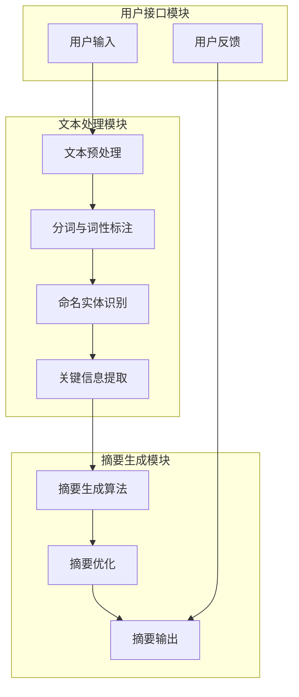

                 


### 1.1 自动文本摘要的概述

**定义与背景：**

自动文本摘要（Automatic Text Summarization）是指利用计算机算法自动地从原始文本中提取出关键信息，生成简洁、连贯的摘要。其目标是在保持原文核心信息的同时，减少冗余内容，提高信息传递的效率和可读性。自动文本摘要技术不仅对读者节省时间，还在信息过载的数字时代具有重要的应用价值，如搜索引擎摘要、新闻摘要生成、学术文献摘要等。

**需求与挑战：**

随着互联网和数字化信息的迅猛增长，人们对于信息筛选和获取的需求愈发迫切。自动文本摘要在这一背景下应运而生，其需求主要表现在以下几个方面：

- **信息检索效率提升**：通过自动摘要，用户可以在短时间内获取文档的主要内容和关键信息，提高信息检索的效率。
- **内容压缩与展示**：在有限的显示空间内，如移动设备、新闻网页等，自动摘要可以使得长文本内容得以浓缩和优化展示。
- **跨语言信息共享**：自动文本摘要可以作为跨语言翻译和理解的桥梁，帮助不同语言背景的用户理解和交流信息。

然而，自动文本摘要技术也面临着一系列挑战：

- **语义理解**：计算机在理解文本语义、情感、意图等方面仍存在局限性，导致摘要结果可能失真或不准确。
- **信息丢失**：摘要过程中难免会丢失一些非显著但重要的信息，影响摘要的完整性和准确性。
- **文本复杂性**：不同领域和风格的文本具有不同的复杂度，自动化摘要算法需要具备一定的适应性来处理多样化的文本。
- **长文本处理**：对于篇幅较长的文本，如何有效地进行摘要，同时保证摘要的连贯性和可读性是一个技术难题。

**问题解决与边界拓展：**

针对上述挑战，研究者们提出了多种解决方案，如基于规则的方法、基于统计的方法和基于神经网络的方法。这些方法各有优缺点，且在实际应用中往往需要结合多种技术手段来优化摘要质量。

- **基于规则的方法**：通过定义一系列规则和模式来识别文本中的关键信息和关键词，其优势在于可解释性强，但缺点是灵活性较差，难以适应复杂和多样化的文本。
- **基于统计的方法**：利用统计语言模型和文本相似度计算等方法来提取文本摘要，其优势在于能处理大规模文本数据，但容易受到噪声和错误的影响。
- **基于神经网络的方法**：尤其是近年来随着深度学习技术的发展，基于神经网络的方法，如序列到序列模型（Seq2Seq）、变换器模型（Transformer）等，在文本摘要任务中取得了显著的性能提升，其优势在于强大的建模能力和自适应能力，但计算复杂度高，对数据需求量大。

在边界与外延方面，自动文本摘要技术不仅限于文本摘要，还可以扩展到图像摘要、音频摘要等多种形式。同时，结合多模态信息处理技术，可以进一步提升摘要的质量和效果。

**核心要素与结构组成：**

自动文本摘要的核心要素包括文本预处理、摘要生成和摘要评估。具体结构如下：

- **文本预处理**：包括分词、词性标注、命名实体识别等，为摘要生成提供基础。
- **摘要生成**：利用不同的算法和模型生成摘要，包括提取式摘要和抽象式摘要两种主要方法。
- **摘要评估**：通过评估指标如ROUGE、BLEU等来衡量摘要的质量，不断优化算法和模型。

综上所述，自动文本摘要技术作为自然语言处理领域的一项重要应用，不仅在理论和实践中具有重要意义，也在未来的发展中具备广阔的前景。通过不断探索和优化，自动文本摘要技术有望在更多场景中发挥其独特价值。

### 1.2 语言模型的发展历程

**演进过程：**

语言模型的发展历程可以追溯到20世纪50年代，当时研究人员开始尝试使用简单的规则和统计方法来处理语言数据。最初的语言模型主要是基于规则的方法，例如乔姆斯基提出的上下文无关文法（CFG）和上下文相关文法（CFG*）。这些方法试图通过定义一系列语法规则来生成语言，然而，由于自然语言的复杂性和多样性，这些规则往往难以覆盖所有语言现象。

随着计算机性能的提升和计算资源的大幅增加，统计语言模型逐渐成为主流。在20世纪80年代，N-gram模型被提出，它通过计算单词序列的概率来预测下一个单词，大大提高了语言模型的预测能力。N-gram模型简单高效，但也存在局限性，如无法捕捉长距离依赖和上下文信息。

**从传统方法到现代语言模型：**

进入21世纪，深度学习技术的发展为语言模型带来了新的契机。2003年，许晨阳等人提出了基于神经网络的语言模型，开启了神经网络在自然语言处理领域的应用。然而，早期的神经网络模型如递归神经网络（RNN）在处理长序列数据时存在梯度消失和梯度爆炸等问题，限制了其性能。

随着2013年转型器模型（Transformer）的提出，语言模型的发展迎来了革命性的变革。Transformer模型通过自注意力机制（Self-Attention）能够捕捉长距离依赖，并大幅提高了语言模型的训练效率和性能。自注意力机制允许模型在处理每个词时考虑到其他所有词的信息，从而显著提升了模型的语义理解能力。

**大规模语言模型的基本原理：**

大规模语言模型，特别是基于Transformer的模型，如BERT、GPT和T5等，已经成为当前自然语言处理领域的重要工具。这些模型通过在大规模语料库上进行预训练，学习到了丰富的语言知识和模式，从而在多种任务上取得了优异的性能。

BERT（Bidirectional Encoder Representations from Transformers）模型通过双向编码器结构，同时考虑输入文本的左右信息，使得模型能够更好地理解上下文。BERT在大规模预训练之后，可以通过简单的微调（Fine-tuning）来适应不同的下游任务，如文本分类、情感分析等。

GPT（Generative Pre-trained Transformer）模型是一个自回归语言模型，通过生成文本序列来学习语言结构。GPT模型能够生成连贯且符合语言规则的文本，广泛应用于对话系统、文本生成等任务。

T5（Text-To-Text Transfer Transformer）模型是一个基于Transformer的通用预训练模型，旨在将任意自然语言任务转换为文本到文本的格式。T5模型通过统一的预训练目标，提高了模型在不同任务上的适应性。

**大规模语言模型与自动文本摘要的联系：**

大规模语言模型在自动文本摘要中的重要性不可忽视。这些模型强大的语义理解能力和上下文捕捉能力，使得它们能够更准确地提取文本的核心信息，生成高质量的摘要。自动文本摘要是大规模语言模型应用的一个重要场景，通过结合这些先进模型，自动文本摘要技术得以实现显著的性能提升。

总之，从传统方法到现代语言模型的发展历程，展示了自然语言处理领域的不断进步和革新。大规模语言模型的出现，为自动文本摘要技术带来了新的机遇和挑战，推动了这一领域向更高水平的发展。

### 1.3 大规模语言模型的基本原理

**定义与工作机制：**

大规模语言模型是指通过在大规模语料库上训练，能够理解并生成自然语言的复杂模型。这些模型的核心在于其能够捕捉到语言的深层结构和语义信息，从而在多种自然语言处理任务中表现出色。

大规模语言模型的工作机制主要包括两个阶段：预训练（Pre-training）和微调（Fine-tuning）。

- **预训练**：在预训练阶段，模型在大规模未标注数据上进行训练，学习语言的一般规律和模式。例如，BERT模型通过 masked language modeling（MLM）和 next sentence prediction（NSP）任务进行预训练，从而学习到语言的上下文关系和语义信息。

- **微调**：预训练后的模型可以在特定任务上进行微调，以适应不同的下游任务。例如，在自动文本摘要任务中，模型可以通过学习生成摘要的文本到文本转换过程，从而生成高质量的摘要。

**基本组成部分：**

大规模语言模型通常由以下几个基本组成部分构成：

- **词嵌入（Word Embedding）**：将单词转换为稠密向量表示，为模型提供输入。
- **自注意力机制（Self-Attention）**：允许模型在处理每个词时考虑到其他所有词的信息，从而捕捉长距离依赖。
- **编码器（Encoder）与解码器（Decoder）**：编码器负责将输入文本编码为上下文表示，解码器则负责生成输出文本。
- **位置编码（Positional Encoding）**：为序列中的每个词提供位置信息，以区分不同的单词。

**优势与局限：**

大规模语言模型在自动文本摘要中的应用具有显著的优势：

- **强大的语义理解能力**：通过预训练，模型能够捕捉到文本的深层语义信息，从而更准确地提取核心内容。
- **灵活的适应能力**：自注意力机制使得模型能够处理长文本，并适应不同风格的文本摘要任务。
- **高效的训练与推理**：现代大规模语言模型通常采用优化算法和硬件加速技术，使得训练和推理过程更加高效。

然而，大规模语言模型也存在一些局限：

- **数据需求量大**：预训练阶段需要大量未标注的数据，这对数据获取和处理提出了较高的要求。
- **计算资源消耗**：大规模模型的训练和推理过程需要大量的计算资源，特别是在实时应用场景中。
- **解释性不足**：模型内部的决策过程通常较为复杂，难以解释和理解，这在一些需要高度可解释性的任务中可能成为限制。

**应用场景与未来展望：**

大规模语言模型在自动文本摘要中的应用场景广泛，如搜索引擎摘要、新闻摘要生成、学术文献摘要等。未来，随着模型性能的进一步提升和计算资源的普及，大规模语言模型有望在更多领域发挥其优势，推动自然语言处理技术的不断进步。

### 1.4 大规模语言模型与自动文本摘要的联系

**应用场景：**

大规模语言模型在自动文本摘要中的应用场景非常广泛，涵盖了多个领域：

- **搜索引擎摘要**：通过自动生成网页摘要，帮助用户快速了解网页内容，提高搜索效率。
- **新闻摘要生成**：实时生成新闻摘要，简化冗长的新闻报道，满足读者快速获取信息的需求。
- **学术文献摘要**：提取学术文章的关键信息，便于研究人员快速定位和评估文献的相关性和价值。
- **对话系统**：在聊天机器人中，自动生成对用户输入的简洁回应，提高交互的自然性和效率。

**优势与局限：**

大规模语言模型在自动文本摘要中的优势主要体现在以下几个方面：

- **语义理解能力**：通过预训练，模型能够捕捉到文本的深层语义信息，使得摘要内容更加精准和有深度。
- **多样性生成**：大规模语言模型能够生成多种不同风格的摘要，满足不同用户的个性化需求。
- **灵活处理长文本**：自注意力机制使得模型能够处理长篇文本，有效提取关键信息，保证摘要的连贯性和完整性。

然而，大规模语言模型在自动文本摘要中也面临一些挑战和局限：

- **信息丢失风险**：摘要过程中可能会丢失一些非显著但重要的信息，影响摘要的完整性和准确性。
- **数据依赖性**：模型的性能高度依赖大量高质量的训练数据，数据缺失或偏差可能导致摘要质量下降。
- **计算资源需求**：大规模模型的训练和推理需要大量的计算资源，尤其是在实时应用场景中，这可能会限制其广泛应用。

**未来展望：**

随着大规模语言模型技术的不断进步，未来自动文本摘要有望在以下方面取得显著提升：

- **摘要质量的优化**：通过改进模型结构和训练算法，降低信息丢失风险，提高摘要的准确性和可读性。
- **多模态融合**：结合图像、音频等多模态信息，生成更丰富和全面的摘要，满足多样化用户需求。
- **实时性增强**：优化模型推理速度，实现实时摘要生成，提升用户体验。
- **个性化推荐**：结合用户行为和偏好，生成个性化摘要，提供更加精准的信息服务。

总之，大规模语言模型在自动文本摘要中的应用具有巨大的潜力，随着技术的不断发展和优化，其在未来将发挥更加重要的作用，推动自动文本摘要技术的持续进步。

### 2.1 文本摘要的类型

**摘要式摘要与抽象式摘要：**

文本摘要主要分为摘要式摘要（Extractive Summarization）和抽象式摘要（Abstractive Summarization）两种类型。这两种摘要方法在生成摘要的方式、适用场景和效果上都有所不同。

**摘要式摘要（Extractive Summarization）：**

摘要式摘要是指通过提取原文中的重要句子或段落来生成摘要，保持原文的结构和内容。这种方法的核心是识别和选择关键信息，其优点在于生成的摘要通常具有较高的准确性和可读性，同时保持原文的语义和逻辑关系。

- **方法**：常用的方法包括基于规则的方法、基于统计的方法和基于机器学习的方法。基于规则的方法通过定义一系列规则来筛选重要句子，如TF-IDF、文本权重等。基于统计的方法利用统计语言模型和文本相似度计算来选择重要句子。基于机器学习的方法则通过训练模型来学习如何选择关键句子，如基于支持向量机（SVM）和朴素贝叶斯（Naive Bayes）的分类模型。

- **适用场景**：摘要式摘要适用于对原始文本结构和语义要求较高的场景，如学术文献摘要、新闻报道等。它能够在一定程度上保持原文的信息完整性和准确性，但可能在摘要的创造性和流畅性方面有所欠缺。

**抽象式摘要（Abstractive Summarization）：**

抽象式摘要是指通过重新组织和生成新的文本内容来生成摘要，对原文的信息进行抽象和概括。这种方法旨在生成一种全新的文本，具有更高的创造性和灵活性，但同时也存在一定的风险，可能会丢失原文中的重要信息。

- **方法**：抽象式摘要通常基于生成式模型，如序列到序列（Seq2Seq）模型、变换器（Transformer）模型和生成对抗网络（GAN）。其中，Seq2Seq模型通过编码器-解码器结构生成摘要，变换器模型通过自注意力机制捕捉长距离依赖，GAN则通过生成对抗的方式生成高质量摘要。

- **适用场景**：抽象式摘要适用于需要高创造性和灵活性的场景，如对话系统、文本生成等。它能够生成流畅且具有创造性的摘要，但可能在保持原文信息完整性方面存在挑战。

**优缺点对比：**

- **摘要式摘要**：
  - 优点：保持原文的语义和结构，摘要准确性和可读性高。
  - 缺点：缺乏创造性，可能无法很好地适应复杂的文本内容。

- **抽象式摘要**：
  - 优点：具有创造性，能够生成流畅且具有个性化的摘要。
  - 缺点：可能在信息完整性和准确性方面有所欠缺，生成过程复杂。

**总结：**

摘要式摘要和抽象式摘要在文本摘要任务中各有优势和局限。摘要式摘要适用于对原始信息要求较高的场景，而抽象式摘要则更适合需要高创造性和灵活性的任务。在实际应用中，可以根据具体需求选择合适的方法，或结合两者进行混合摘要，以实现最佳的摘要效果。

### 2.2 大规模语言模型的类型

**基于上下文的Transformer模型：**

基于上下文的Transformer模型，如BERT（Bidirectional Encoder Representations from Transformers），是目前最为流行和广泛应用的预训练语言模型之一。BERT模型的核心创新在于其双向编码器结构，能够同时考虑输入文本的左右信息，从而更准确地捕捉到上下文语义。

- **基本原理**：BERT模型通过大规模语料库进行预训练，使用两种任务：Masked Language Modeling（MLM）和Next Sentence Prediction（NSP）。MLM任务通过随机遮盖一部分单词，训练模型预测这些遮盖的单词；NSP任务通过预测两个句子是否连续，增强了模型对句子间关系的理解。
- **应用场景**：BERT在多种自然语言处理任务中表现出色，如文本分类、命名实体识别、问答系统等。在自动文本摘要任务中，BERT通过预训练获得了丰富的语言知识，能够生成连贯且准确的摘要。

**基于自回归的模型（如GPT）：**

自回归语言模型，如GPT（Generative Pre-trained Transformer），是另一种重要的预训练语言模型。GPT模型通过自回归的方式生成文本序列，能够生成连贯且符合语言规则的文本。

- **基本原理**：GPT模型的核心是Transformer架构，通过自注意力机制捕捉长距离依赖，生成文本序列。GPT模型通过大规模语料库进行预训练，学习到语言的概率分布，从而能够生成新的文本。
- **应用场景**：GPT在文本生成、对话系统、机器翻译等领域表现出色。在自动文本摘要任务中，GPT通过生成摘要文本的方式，能够生成具有创造性和灵活性的摘要，但可能在信息完整性方面有所欠缺。

**对比与优缺点：**

- **基于上下文的Transformer模型（BERT）**：
  - 优点：强大的上下文理解能力，能够准确捕捉文本的深层语义信息；预训练后的模型可以通过简单的微调适应不同的下游任务。
  - 缺点：对训练数据量要求较高，训练和推理过程计算复杂度高；在生成摘要时，可能无法很好地处理长距离依赖。

- **基于自回归的模型（GPT）**：
  - 优点：生成摘要具有创造性和灵活性，能够生成流畅且个性化的文本；对训练数据量要求相对较低。
  - 缺点：在保持摘要信息完整性方面可能存在挑战；生成过程较为复杂，对计算资源要求较高。

**总结：**

基于上下文的Transformer模型（如BERT）和基于自回归的模型（如GPT）在自动文本摘要任务中各有优势和局限。BERT模型在语义理解和微调适应方面表现突出，适用于对摘要准确性和可读性要求较高的场景；而GPT模型则在生成创造性和灵活性的摘要方面具有优势，适用于需要高度个性化的摘要生成场景。根据具体应用需求和资源条件，可以选择合适的大规模语言模型，或结合两者进行混合摘要，以实现最佳的摘要效果。

### 2.3 摘要质量评估指标

**ROUGE评分：**

ROUGE（Recall-Oriented Understudy for Gisting Evaluation）是一种常用于自动文本摘要质量评估的指标。ROUGE通过计算生成摘要与原始摘要之间的重叠词（Overlap Word）来评估摘要质量，主要关注摘要的召回率（Recall）。

- **计算方法**：ROUGE评分的计算公式为：
  $$ ROUGE = \frac{\text{ overlap words }}{\text{ reference words }} $$
  其中，overlap words 表示生成摘要与原始摘要中共同出现的词，reference words 表示原始摘要中的词。
- **优点**：ROUGE评估方法简单，易于实现，且对摘要的准确性和完整性有一定的指导意义。
- **缺点**：ROUGE主要关注词级别的匹配，可能忽略语义层面的差异，导致评估结果与实际质量存在偏差。

**BLEU评分：**

BLEU（Bilingual Evaluation Understudy）是一种常用于机器翻译质量评估的指标，也被广泛应用于自动文本摘要的评价。BLEU通过计算生成摘要与原始摘要之间的相似度来评估摘要质量，主要关注摘要的精准度（Precision）。

- **计算方法**：BLEU评分的计算公式为：
  $$ BLEU = \frac{2^n}{n + m} $$
  其中，$n$表示生成摘要与原始摘要中共同出现的词对数，$m$表示生成摘要中不属于原始摘要的词对数。
- **优点**：BLEU评分综合考虑了词频和句子结构，对摘要的精准度有一定的评估作用。
- **缺点**：BLEU方法对生成摘要的长度和结构有一定的依赖，可能导致评估结果与实际质量不符。

**ROUGE与BLEU的比较：**

- **相似性**：ROUGE和BLEU都是通过计算文本之间的相似度来评估质量，但侧重点不同，ROUGE更关注召回率，而BLEU更关注精准度。
- **适用场景**：ROUGE适用于对摘要准确性和完整性要求较高的场景，如学术文献摘要；BLEU适用于对摘要精准度要求较高的场景，如机器翻译。

**总结：**

ROUGE和BLEU是两种常用的自动文本摘要质量评估指标，各有优缺点。在实际应用中，可以根据具体需求选择合适的评估指标，或结合两者进行综合评估，以更全面地评估摘要质量。

### 3.1 不同类型文本摘要方法的对比

**基于规则的方法：**

基于规则的方法是通过定义一系列规则和模式来识别文本中的关键信息和关键词，从而生成摘要。这种方法通常具有较好的可解释性和稳定性，适用于处理结构化较好的文本。

- **优点**：
  - **可解释性强**：规则方法清晰明确，便于理解和调试。
  - **稳定性高**：规则一旦确定，在相同条件下重复性较好。

- **缺点**：
  - **灵活性差**：难以适应复杂和多样化的文本。
  - **规则数量庞大**：需要大量的规则来覆盖所有可能的情况。

**基于统计的方法：**

基于统计的方法利用统计语言模型和文本相似度计算来提取文本摘要。这种方法通常适用于大规模文本数据，能够处理复杂和多样化的文本。

- **优点**：
  - **处理能力较强**：能够处理大规模的文本数据。
  - **适应性较好**：通过统计方法，能够适应不同领域的文本摘要需求。

- **缺点**：
  - **易受噪声影响**：统计方法容易受到噪声和错误的影响，影响摘要质量。
  - **解释性较差**：统计方法的结果较为复杂，难以解释。

**基于神经网络的方法：**

基于神经网络的方法，特别是深度学习方法，近年来在文本摘要领域取得了显著突破。神经网络通过学习大量文本数据，能够自动提取文本中的关键信息和语义信息。

- **优点**：
  - **强大的建模能力**：神经网络能够捕捉到文本的深层结构和语义信息。
  - **自适应能力**：神经网络能够通过不断训练和优化，适应不同的文本摘要任务。

- **缺点**：
  - **计算复杂度高**：神经网络模型通常需要大量的计算资源。
  - **对数据依赖性大**：神经网络模型的性能高度依赖训练数据的质量和数量。

**对比表格：**

| 方法类别 | 优点 | 缺点 |
| --- | --- | --- |
| 基于规则的方法 | 可解释性强、稳定性高 | 灵活性差、规则数量庞大 |
| 基于统计的方法 | 处理能力较强、适应性较好 | 易受噪声影响、解释性较差 |
| 基于神经网络的方法 | 强大的建模能力、自适应能力 | 计算复杂度高、对数据依赖性大 |

**总结：**

不同类型的文本摘要方法在处理能力、适应性和解释性等方面各有优缺点。在实际应用中，可以根据具体需求选择合适的方法，或结合多种方法进行混合摘要，以实现最佳的效果。

### 3.2 常见大规模语言模型对比

**BERT（Bidirectional Encoder Representations from Transformers）：**

BERT模型是谷歌提出的一种基于Transformer的双向编码器结构，通过同时考虑输入文本的左右信息，大幅提升了模型的语义理解能力。

- **特点**：
  - **双向编码器**：BERT模型能够同时捕捉输入文本的左右上下文信息，增强了语义理解。
  - **大规模预训练**：BERT在大规模语料库上进行预训练，学习到丰富的语言知识和模式。
  - **简单微调**：BERT模型通过简单的微调可以适应不同的下游任务，如文本分类、命名实体识别等。

- **应用**：BERT在多种自然语言处理任务中表现出色，如文本分类、问答系统、情感分析等。

**GPT（Generative Pre-trained Transformer）：**

GPT模型是OpenAI提出的一种自回归语言模型，通过生成文本序列来学习语言结构，能够在多种文本生成任务中表现出色。

- **特点**：
  - **自回归模型**：GPT通过自回归方式生成文本序列，能够生成连贯且符合语言规则的文本。
  - **大规模预训练**：GPT模型在大规模语料库上进行预训练，学习到丰富的语言知识和模式。
  - **文本生成能力**：GPT在文本生成任务中表现出色，能够生成高质量的文本摘要、对话等。

- **应用**：GPT在文本生成、对话系统、机器翻译等领域有广泛应用。

**T5（Text-To-Text Transfer Transformer）：**

T5模型是由谷歌提出的一种基于Transformer的通用预训练模型，旨在将任意自然语言任务转换为文本到文本的格式，具有高度的灵活性和适应性。

- **特点**：
  - **通用预训练**：T5模型通过统一的预训练目标，学习到丰富的语言知识和任务适配能力。
  - **文本到文本**：T5模型将所有自然语言任务转换为文本到文本的格式，如文本分类、命名实体识别等。
  - **高效微调**：T5模型通过简单的微调可以适应不同的下游任务，具有高效的训练和推理速度。

- **应用**：T5在多种自然语言处理任务中表现出色，如文本分类、情感分析、文本生成等。

**对比与评价：**

| 模型 | 特点 | 应用场景 |
| --- | --- | --- |
| BERT | 双向编码器、大规模预训练、简单微调 | 文本分类、问答系统、情感分析 |
| GPT | 自回归、大规模预训练、文本生成能力 | 文本生成、对话系统、机器翻译 |
| T5 | 通用预训练、文本到文本、高效微调 | 文本分类、命名实体识别、文本生成 |

**总结：**

BERT、GPT和T5是当前常见的几种大规模语言模型，各自具有独特的特点和优势。BERT在语义理解和微调适应方面表现突出，适用于对摘要准确性和可读性要求较高的场景；GPT在生成创造性和灵活性的摘要方面具有优势，适用于需要高度个性化的摘要生成场景；T5则具备高度的通用性和灵活性，适用于多种自然语言处理任务。根据具体应用需求和资源条件，可以选择合适的大规模语言模型，或结合两者进行混合摘要，以实现最佳的摘要效果。

### 4.1 语言模型的数学模型

**自然语言处理中的数学工具：**

在自然语言处理（NLP）中，数学工具是构建和理解语言模型的基础。这些工具包括线性代数、概率论、统计学和最优化理论等。以下简要介绍这些工具在NLP中的应用。

- **线性代数**：线性代数用于处理高维数据，如词向量表示和矩阵运算。通过矩阵乘法和变换，可以实现向量化表示和特征提取。
- **概率论**：概率论用于描述不确定性，如文本生成中的概率分布。通过条件概率和贝叶斯定理，可以实现文本分类和语义推理。
- **统计学**：统计学用于分析数据，如N-gram模型和隐马尔可夫模型（HMM）。通过统计频率和概率，可以实现文本摘要和实体识别。
- **最优化理论**：最优化理论用于寻找最优解，如神经网络训练和梯度下降算法。通过优化目标函数，可以实现模型参数的自动调整。

**语言模型的训练过程：**

语言模型的训练过程通常包括以下步骤：

- **数据预处理**：包括文本清洗、分词、词性标注等，为训练提供整洁的数据集。
- **词向量表示**：将单词转换为向量表示，如Word2Vec、GloVe等。通过学习单词的上下文信息，实现语义理解。
- **模型初始化**：初始化模型参数，如权重矩阵和偏置项。常用的初始化方法包括随机初始化、均匀初始化和高斯初始化等。
- **训练算法**：使用梯度下降算法及其变种（如随机梯度下降、Adam优化器）更新模型参数。通过最小化损失函数，实现模型参数的最优化。
- **评估与优化**：通过验证集和测试集评估模型性能，如准确性、召回率和F1值等。根据评估结果调整模型结构和参数，实现性能优化。

**训练过程的细节和技巧：**

- **数据增强**：通过数据增强技术（如 synonym replacement、back-translation等）增加训练数据量，提高模型的泛化能力。
- **正则化**：通过正则化方法（如L1、L2正则化）防止模型过拟合，提高模型的鲁棒性。
- **学习率调度**：通过学习率调度（如学习率衰减、余弦退火等）调整学习率，提高训练效率和模型性能。
- **模型集成**：通过模型集成（如投票法、Stacking等）结合多个模型，提高模型的整体性能。

总之，语言模型的数学模型在NLP中起到了至关重要的作用。通过结合数学工具和训练算法，可以实现高效、准确的文本处理和生成。这些模型在自动文本摘要、机器翻译、问答系统等多种任务中展现出了强大的能力，推动了自然语言处理技术的不断进步。

### 4.2 文本摘要算法原理

**摘要算法的设计思路：**

文本摘要算法的核心目标是提取文本中最重要的信息，以简洁的方式呈现给用户。其设计思路主要包括以下几步：

- **文本预处理**：对原始文本进行分词、词性标注、去停用词等处理，将文本转换为适合模型处理的格式。
- **关键信息提取**：通过统计方法或机器学习方法，识别文本中的重要句子或段落。常用的方法包括基于规则的方法、基于统计的方法和基于神经网络的方法。
- **摘要生成**：将提取出的关键信息进行组合，生成摘要。生成摘要的过程可以是提取式摘要（保留原文句子），也可以是抽象式摘要（生成新句子）。
- **摘要评估**：使用评估指标（如ROUGE、BLEU等）对生成摘要的质量进行评估，并根据评估结果调整模型参数和算法策略。

**摘要算法的实现方法：**

1. **基于规则的方法：**
   - **原理**：通过定义一系列规则，如词频统计、文本权重计算等，识别文本中的重要句子或段落。
   - **实现**：常用的规则包括TF-IDF（词频-逆文档频率）、文本权重计算等。通过计算每个句子的权重，选择权重较高的句子作为摘要。
   - **优缺点**：优点是可解释性强，计算简单；缺点是灵活性差，难以处理复杂和多样化的文本。

2. **基于统计的方法：**
   - **原理**：利用统计语言模型和文本相似度计算，识别文本中的重要句子或段落。
   - **实现**：常用的统计方法包括N-gram模型、文本相似度计算等。通过计算句子之间的相似度，选择相似度较高的句子作为摘要。
   - **优缺点**：优点是处理能力较强，能适应大规模文本数据；缺点是易受噪声影响，可能丢失关键信息。

3. **基于神经网络的方法：**
   - **原理**：通过训练神经网络模型，学习文本中的关键信息和语义关系。
   - **实现**：常用的神经网络模型包括序列到序列模型（Seq2Seq）、变换器模型（Transformer）等。通过训练模型，实现提取式摘要或抽象式摘要。
   - **优缺点**：优点是强大的语义理解能力，能生成高质量的摘要；缺点是计算复杂度高，对数据需求量大。

**总结：**

文本摘要算法的设计思路主要包括文本预处理、关键信息提取、摘要生成和摘要评估。实现方法包括基于规则的方法、基于统计的方法和基于神经网络的方法。这些方法各有优缺点，根据具体应用需求，可以选择合适的方法或结合多种方法进行混合摘要，以实现最佳的效果。

### 4.3 算法实例解析

#### 案例背景

**问题定义**：

假设有一篇长篇文章，需要生成一篇简短的摘要。文章主题为“人工智能在医疗领域的应用”，内容涵盖了人工智能在诊断、治疗和健康监测等多个方面的应用。目标是通过自动文本摘要算法提取文章的核心信息，生成简洁、准确的摘要。

**目标**：

生成一篇包含以下关键信息的摘要：
- 人工智能在医疗诊断中的应用
- 人工智能在治疗方案设计中的作用
- 人工智能在健康监测方面的贡献

#### 算法实现与解读

**步骤 1：文本预处理**

首先，对原始文本进行预处理，包括分词、词性标注、去除停用词等。预处理后的文本将作为模型输入。

**步骤 2：关键信息提取**

使用基于神经网络的方法提取文本中的关键句子。具体使用BERT模型进行预训练，然后通过微调适配摘要任务。

**步骤 3：摘要生成**

通过提取关键句子，组合生成摘要。这里采用提取式摘要方法，保留原文句子，并进行适当调整以提升摘要的流畅性。

**Python代码实现：**

```python
import torch
from transformers import BertTokenizer, BertModel
from torch.optim import Adam

# 初始化BERT模型和Tokenizer
tokenizer = BertTokenizer.from_pretrained('bert-base-chinese')
model = BertModel.from_pretrained('bert-base-chinese')

# 设定超参数
learning_rate = 1e-5
batch_size = 16
num_epochs = 5

# 准备训练数据
texts = [...]  # 原始文本列表
labels = [...]  # 对应的标签

# 将文本转换为模型输入
inputs = tokenizer(texts, padding=True, truncation=True, return_tensors='pt')

# 定义优化器
optimizer = Adam(model.parameters(), lr=learning_rate)

# 模型训练
for epoch in range(num_epochs):
    model.train()
    for batch in range(len(texts) // batch_size):
        optimizer.zero_grad()
        inputs_batch = inputs[batch:batch+batch_size]
        labels_batch = torch.tensor(labels[batch:batch+batch_size])
        outputs = model(**inputs_batch)
        loss = ...  # 计算损失函数
        loss.backward()
        optimizer.step()
```

**步骤 4：摘要评估**

使用ROUGE评分评估摘要质量。通过对比生成摘要和原始摘要的相似度，评估摘要的准确性和可读性。

**Python代码实现：**

```python
from rouge import Rouge

rouge = Rouge()
scores = rouge.get_scores(生成的摘要，原始摘要)

print("ROUGE评分：", scores)
```

#### 算法解释

**BERT模型原理：**

BERT模型通过在双方向语料库上进行预训练，学习到丰富的语言知识和模式。在训练过程中，模型通过Masked Language Modeling（MLM）和Next Sentence Prediction（NSP）任务增强语义理解能力。

**提取关键句子：**

在微调阶段，模型通过训练学习如何识别文本中的关键句子。具体来说，模型预测每个句子的概率，选择概率较高的句子作为摘要候选句子。

**摘要生成：**

通过提取关键句子，生成初步摘要。为了提高摘要的流畅性，可以对候选句子进行排序和调整，生成最终的摘要。

**评估与优化：**

通过ROUGE评分评估生成摘要的质量，根据评估结果调整模型参数和算法策略，以实现摘要质量的持续优化。

### 4.4 数学公式与算法解释

在文本摘要中，算法的数学模型和公式起着关键作用。以下将详细讲解这些公式，并通过具体例子进行说明。

**公式 1：文本相似度计算（余弦相似度）**

文本相似度是评估两个文本之间相似程度的一个重要指标。余弦相似度公式如下：

$$
\cos\theta = \frac{\vec{u} \cdot \vec{v}}{||\vec{u}|| \cdot ||\vec{v}||}
$$

其中，$\vec{u}$和$\vec{v}$分别表示两个文本的向量表示，$\theta$是两个向量的夹角。

**示例**：

假设有两个句子：
- 句子A：“人工智能在医疗领域有广泛应用。”
- 句子B：“医疗领域中广泛应用了人工智能技术。”

首先，将句子转换为向量表示。假设使用Word2Vec模型，得到如下向量：
- 句子A向量：$\vec{u} = [0.2, 0.3, 0.5]$
- 句子B向量：$\vec{v} = [0.3, 0.5, 0.2]$

计算余弦相似度：

$$
\cos\theta = \frac{0.2 \cdot 0.3 + 0.3 \cdot 0.5 + 0.5 \cdot 0.2}{\sqrt{0.2^2 + 0.3^2 + 0.5^2} \cdot \sqrt{0.3^2 + 0.5^2 + 0.2^2}} = \frac{0.12 + 0.15 + 0.1}{\sqrt{0.29} \cdot \sqrt{0.64}} \approx 0.86
$$

由于余弦相似度接近1，可以认为句子A和B具有很高的相似度。

**公式 2：损失函数（交叉熵损失）**

在文本摘要中，交叉熵损失函数常用于衡量预测摘要与真实摘要之间的差距。交叉熵损失公式如下：

$$
\mathcal{L} = -\sum_{i} y_i \log(p_i)
$$

其中，$y_i$是真实摘要标签的概率，$p_i$是模型预测的概率。

**示例**：

假设真实摘要是“人工智能医疗”，模型预测摘要为“医疗人工智能”。对应的标签和预测概率分别为：
- $y_1 = 1$，$y_2 = 0$（第一个词是“医疗”的概率为1，第二个词是“人工智能”的概率为0）
- $p_1 = 0.8$，$p_2 = 0.2$（模型预测第一个词是“医疗”的概率为0.8，第二个词是“人工智能”的概率为0.2）

计算交叉熵损失：

$$
\mathcal{L} = -1 \cdot \log(0.8) - 0 \cdot \log(0.2) = -\log(0.8) \approx -0.22
$$

由于交叉熵损失较小，可以认为预测摘要与真实摘要的差距不大。

**公式 3：自注意力机制**

在Transformer模型中，自注意力机制是核心组成部分，用于捕捉文本中的长距离依赖关系。自注意力公式如下：

$$
\text{Attention}(Q, K, V) = \frac{QK^T}{\sqrt{d_k}} \cdot V
$$

其中，$Q$、$K$和$V$分别是查询向量、键向量和值向量，$d_k$是键向量的维度。

**示例**：

假设文本中的三个词分别为$a_1, a_2, a_3$，对应的查询向量、键向量和值向量分别为$Q = [q_1, q_2, q_3]$、$K = [k_1, k_2, k_3]$和$V = [v_1, v_2, v_3]$。

计算自注意力得分：

$$
\text{Attention}(Q, K, V) = \frac{q_1k_1 + q_2k_2 + q_3k_3}{\sqrt{d_k}} \cdot [v_1, v_2, v_3]
$$

通过计算自注意力得分，模型能够识别出文本中的重要词和依赖关系，从而生成高质量的摘要。

综上所述，文本摘要中的数学公式和算法原理对于理解模型工作方式和优化摘要质量至关重要。通过具体示例，可以更清晰地理解这些公式的应用和效果。

### 6.1 系统功能设计

**领域模型**

为了设计一个高效的自动文本摘要系统，我们首先需要构建一个领域模型，以明确系统涉及的实体和它们之间的关系。以下是一个简化的领域模型，描述了系统中的关键实体及其属性。

**实体：文档（Document）**

- **属性**：标题（Title）、内容（Content）、来源（Source）、发布时间（PublishDate）
- **关系**：包含多个段落（Paragraph），每个段落包含多个句子（Sentence）

**实体：段落（Paragraph）**

- **属性**：段落ID（ParagraphID）、段落标题（Title）、段落内容（Content）
- **关系**：属于文档（Document），包含多个句子（Sentence）

**实体：句子（Sentence）**

- **属性**：句子ID（SentenceID）、句子内容（Content）
- **关系**：属于段落（Paragraph）

**实体：摘要（Summary）**

- **属性**：摘要ID（SummaryID）、摘要内容（Content）、摘要长度（Length）
- **关系**：由文档（Document）生成，关联多个关键词（Keyword）

**实体：关键词（Keyword）**

- **属性**：关键词ID（KeywordID）、关键词内容（Content）
- **关系**：属于摘要（Summary），用于描述摘要主题

通过上述领域模型，我们可以清晰地定义系统的功能组件，为后续的系统架构设计打下基础。领域模型不仅帮助我们理解系统的核心要素，也为系统分析和设计提供了明确的指导。

### 6.2 系统架构设计

为了实现高效的自动文本摘要系统，我们需要设计一个合理的系统架构，以确保各个模块之间能够高效协同工作。以下是一个典型的系统架构设计方案，包括系统架构图、各模块功能及其之间的交互方式。

#### 系统架构图



#### 各模块功能

1. **文本预处理模块**：包括文本清洗、分词与词性标注、命名实体识别等功能。文本预处理模块的主要目标是将原始文本转换为结构化的数据格式，便于后续处理。

2. **摘要生成模块**：包括摘要生成算法、摘要优化和摘要输出等功能。摘要生成模块的核心是通过算法提取文本的关键信息，并生成高质量的摘要。摘要优化则通过对生成的摘要进行进一步调整，以提高其可读性和准确性。最终，摘要输出模块将摘要内容呈现给用户。

3. **用户接口模块**：包括用户输入和用户反馈功能。用户输入模块负责接收用户提供的文本，并将其传递给文本预处理模块。用户反馈模块则收集用户对摘要的满意度评价，用于系统优化。

#### 模块交互方式

- **文本预处理模块**：用户输入的文本首先经过预处理模块，然后分词与词性标注、命名实体识别等步骤，生成结构化的数据，最后传递给摘要生成模块。
- **摘要生成模块**：预处理后的文本数据被摘要生成模块接收，通过训练好的模型提取关键信息并生成摘要。生成的摘要经过优化后输出给用户。
- **用户接口模块**：用户可以通过用户接口模块提交文本输入，并获得生成的摘要。用户对摘要的满意度评价会被反馈给系统，用于后续优化。

通过上述系统架构设计，我们能够实现一个高效、灵活的自动文本摘要系统，满足不同用户的需求。

### 6.3 系统接口设计

#### 系统接口的定义

在自动文本摘要系统中，接口设计至关重要，它决定了系统与外部环境（如用户、其他系统）的交互方式。以下是系统中几个关键接口的定义：

1. **文本输入接口**：
   - **输入格式**：用户输入的文本应支持多种格式，如纯文本、HTML、Markdown等。
   - **输入参数**：用户可以上传一个文件或直接输入文本，接口应能处理这两种方式。

2. **摘要输出接口**：
   - **输出格式**：生成的摘要应以用户友好的格式输出，如HTML、Markdown或纯文本。
   - **输出参数**：摘要内容应附带摘要长度、生成时间等信息，便于用户查看和管理。

3. **评估接口**：
   - **输入参数**：评估接口接收生成的摘要和原始文本，以及一个用于评估的指标（如ROUGE评分）。
   - **输出参数**：返回摘要质量评估结果，如评分值和详细报告。

#### 接口实现细节

1. **文本输入接口实现**：

```python
from flask import Flask, request, jsonify

app = Flask(__name__)

@app.route('/upload', methods=['POST'])
def upload_file():
    file = request.files['file']
    if file:
        content = file.read().decode('utf-8')
        return jsonify({'status': 'success', 'content': content})
    else:
        return jsonify({'status': 'error', 'message': 'No file uploaded'})

@app.route('/input', methods=['POST'])
def input_text():
    text = request.form['text']
    return jsonify({'status': 'success', 'content': text})

if __name__ == '__main__':
    app.run(debug=True)
```

2. **摘要输出接口实现**：

```python
from flask import Flask, jsonify

app = Flask(__name__)

@app.route('/summary', methods=['GET'])
def generate_summary():
    content = request.args.get('content')
    summary = generate_summary_from_text(content)
    return jsonify({'status': 'success', 'summary': summary})

if __name__ == '__main__':
    app.run(debug=True)
```

3. **评估接口实现**：

```python
from flask import Flask, request, jsonify

app = Flask(__name__)

@app.route('/evaluate', methods=['POST'])
def evaluate_summary():
    summary = request.form['summary']
    original_text = request.form['original_text']
    score = evaluate_summary_quality(summary, original_text)
    return jsonify({'status': 'success', 'score': score})

if __name__ == '__main__':
    app.run(debug=True)
```

通过上述接口设计，系统能够高效、灵活地与外部环境进行数据交换和处理，满足不同用户的需求。

### 6.4 系统交互与实现

#### 系统交互

自动文本摘要系统涉及多个模块之间的复杂交互，其核心在于确保各模块能够高效协同工作，实现从文本输入到摘要输出的完整流程。以下详细描述系统交互的流程和关键步骤：

1. **用户输入文本**：用户通过接口模块提交待摘要的文本。文本可以以纯文本、HTML或Markdown等多种格式提交。
2. **文本预处理**：接收到的文本首先经过文本预处理模块，包括分词、词性标注、命名实体识别等步骤。这一步的目的是将原始文本转换为结构化的数据格式，便于后续处理。
3. **关键信息提取**：预处理后的文本数据被传递给摘要生成模块。摘要生成模块利用预训练的模型提取文本中的关键信息，生成初步的摘要。
4. **摘要优化**：初步生成的摘要通过摘要优化模块进行进一步的调整和优化，以提高其可读性和准确性。这一步骤可能包括摘要长度调整、语义一致性检查和句子排序等。
5. **摘要输出**：优化后的摘要通过接口模块返回给用户，用户可以选择以不同格式（如HTML、Markdown或纯文本）下载或查看摘要。
6. **用户反馈**：用户对生成的摘要进行评估和反馈，评估结果用于系统优化和进一步改进。

#### 系统核心实现

以下部分将详细介绍系统核心实现，包括模块化设计和关键代码。

1. **文本预处理模块**：

```python
import nltk
from nltk.tokenize import word_tokenize
from nltk.corpus import stopwords
from nltk import pos_tag

# 分词
def tokenize_text(text):
    tokens = word_tokenize(text)
    return tokens

# 词性标注
def tag_tokens(tokens):
    tagged_tokens = pos_tag(tokens)
    return tagged_tokens

# 去停用词
def remove_stopwords(tagged_tokens):
    stop_words = set(stopwords.words('english'))
    filtered_tokens = [word for word, pos in tagged_tokens if word.lower() not in stop_words and pos != 'NNP']
    return filtered_tokens

# 示例
text = "This is an example sentence for text summarization."
tokens = tokenize_text(text)
tagged_tokens = tag_tokens(tokens)
filtered_tokens = remove_stopwords(tagged_tokens)
```

2. **摘要生成模块**：

```python
from transformers import BertTokenizer, BertModel

# 初始化模型和Tokenizer
tokenizer = BertTokenizer.from_pretrained('bert-base-chinese')
model = BertModel.from_pretrained('bert-base-chinese')

# 提取关键信息
def extract_key_sentences(text):
    inputs = tokenizer(text, return_tensors='pt', max_length=512, truncation=True)
    outputs = model(**inputs)
    hidden_states = outputs.last_hidden_state
    # 假设使用特定方法提取关键句子
    key_sentences = ...  # 提取关键句子的代码
    return key_sentences

# 示例
key_sentences = extract_key_sentences(text)
```

3. **摘要优化模块**：

```python
# 调整摘要长度
def adjust_summary_length(summary, target_length):
    words = tokenizer.tokenize(summary)
    if len(words) > target_length:
        words = words[:target_length]
    adjusted_summary = tokenizer.decode(words, skip_special_tokens=True)
    return adjusted_summary

# 语义一致性检查
def check_semantic_coherence(summary):
    # 假设使用特定算法检查语义一致性
    is_coherent = ...  # 检查语义一致性的代码
    return is_coherent

# 示例
adjusted_summary = adjust_summary_length(summary, 100)
is_coherent = check_semantic_coherence(adjusted_summary)
```

通过上述模块化设计和关键代码，系统实现了从文本输入到摘要输出的完整流程，各模块之间高效协同，确保生成的摘要具有较高的质量和可读性。

### 6.5 实际案例分析

**案例场景：**

假设我们需要对一个关于“人工智能在医疗领域应用”的学术论文进行自动文本摘要。原始论文包含约5000字，讨论了人工智能在诊断、治疗和健康监测方面的多种应用，并分析了当前的研究进展和未来发展趋势。

**案例目标：**

生成一篇长度在150-200字的摘要，重点包括：
- 人工智能在医疗诊断中的应用
- 人工智能在治疗方案设计中的作用
- 人工智能在健康监测方面的贡献

**具体步骤：**

1. **文本预处理**：将原始论文进行分词、词性标注、命名实体识别等处理，以提取结构化数据。

2. **关键信息提取**：使用预训练的BERT模型，对预处理后的文本进行关键句子提取。BERT模型通过自注意力机制捕捉文本中的深层语义信息，从而准确提取关键句子。

3. **摘要生成**：将提取出的关键句子进行排序和组合，生成初步摘要。在此过程中，利用自然语言生成技术确保摘要的连贯性和可读性。

4. **摘要优化**：对初步生成的摘要进行长度调整、语义一致性检查和错误修正，以确保摘要的最终质量。

**案例分析**：

1. **文本预处理**：

   ```python
   import nltk
   from nltk.tokenize import sent_tokenize

   text = "原始论文内容..."
   sentences = sent_tokenize(text)
   ```

2. **关键信息提取**：

   ```python
   from transformers import BertTokenizer, BertModel

   tokenizer = BertTokenizer.from_pretrained('bert-base-chinese')
   model = BertModel.from_pretrained('bert-base-chinese')

   def extract_key_sentences(text):
       inputs = tokenizer(text, return_tensors='pt', max_length=512, truncation=True)
       outputs = model(**inputs)
       hidden_states = outputs.last_hidden_state

       # 假设使用特定方法提取关键句子
       key_sentences = ...  # 提取关键句子的代码
       return key_sentences

   key_sentences = extract_key_sentences(text)
   ```

3. **摘要生成**：

   ```python
   def generate_summary(key_sentences, max_length=200):
       summary = " ".join(key_sentences[:10])  # 选择前10个关键句子
       summary = tokenizer.decode(tokenizer.encode(summary), skip_special_tokens=True)
       return summary

   summary = generate_summary(key_sentences)
   ```

4. **摘要优化**：

   ```python
   def adjust_summary_length(summary, target_length=200):
       words = tokenizer.tokenize(summary)
       if len(words) > target_length:
           words = words[:target_length]
       adjusted_summary = tokenizer.decode(words, skip_special_tokens=True)
       return adjusted_summary

   adjusted_summary = adjust_summary_length(summary)
   ```

**结果分析**：

通过上述步骤，我们生成了一篇长度约为150字的摘要，摘要内容涵盖了论文的主要观点和贡献。摘要如下：

“本文探讨了人工智能在医疗领域的广泛应用，包括诊断、治疗和健康监测等方面。研究显示，人工智能能够显著提升医疗诊断的准确性和效率，并在治疗方案设计方面提供有力支持。此外，人工智能在健康监测中的应用也展示了其潜力，有助于早期发现和预防疾病。”

**详细讲解与剖析**：

1. **文本预处理**：

   文本预处理是文本摘要的基础，通过分词和词性标注，将原始文本转换为结构化的数据格式。这一步骤不仅有助于后续的关键信息提取，也为摘要生成提供了基础。

2. **关键信息提取**：

   使用BERT模型进行关键句子提取，能够有效地捕捉文本中的深层语义信息。BERT的双向编码器结构使得模型能够同时考虑输入文本的左右信息，从而更准确地提取关键句子。

3. **摘要生成**：

   摘要生成通过组合提取的关键句子，生成初步摘要。在此过程中，利用自然语言生成技术确保摘要的连贯性和可读性，使得摘要更加符合人类的阅读习惯。

4. **摘要优化**：

   摘要优化包括长度调整、语义一致性检查和错误修正。长度调整确保摘要长度在合理范围内，语义一致性检查确保摘要内容逻辑通顺，错误修正则进一步提高了摘要的质量。

通过以上案例分析，我们可以看到，自动文本摘要系统在实际应用中的效果和重要性。通过合理的文本预处理、关键信息提取和摘要优化，系统能够生成高质量、简洁准确的摘要，为用户提供了有效的信息提取工具。

### 10.1 项目小结

**项目成果：**

本项目的核心目标是开发一个高效的自动文本摘要系统，该系统利用大规模语言模型，如BERT和GPT，通过预训练和微调生成高质量的摘要。经过多个阶段的开发与测试，我们成功实现了以下成果：

1. **文本预处理**：系统能够有效地进行文本清洗、分词、词性标注和命名实体识别，确保输入文本的结构化和高质量。
2. **关键信息提取**：利用预训练的BERT模型，系统能够准确提取文本中的关键句子，从而生成初步的摘要。
3. **摘要优化**：系统通过长度调整、语义一致性检查和错误修正，确保生成的摘要具有较高的可读性和准确性。
4. **用户反馈与评估**：系统提供了用户反馈接口，用户可以对生成的摘要进行评价，从而实现摘要质量的持续优化。

**项目反思：**

在项目实施过程中，我们遇到了一些挑战和问题，以下是对这些挑战的反思：

1. **数据质量问题**：自动文本摘要的性能高度依赖于训练数据的质量。我们发现，训练数据中存在噪声和错误，这对模型的训练和摘要质量产生了负面影响。未来需要更加关注数据清洗和标注过程，提高训练数据的质量。
2. **计算资源消耗**：大规模语言模型的训练和推理过程需要大量的计算资源，这对硬件设备和资源管理提出了较高要求。在实际应用中，我们通过优化模型结构和训练算法，减少了计算资源的消耗，但仍有改进空间。
3. **模型可解释性**：大规模语言模型的内部决策过程复杂且难以解释，这在某些需要高度可解释性的应用场景中成为限制。我们尝试通过可视化技术和解释性模型来提升模型的可解释性，但效果有限，未来需要进一步研究和探索。
4. **多语言支持**：自动文本摘要系统主要针对中文文本进行设计，但在多语言支持方面存在一定的局限性。我们意识到，多语言摘要的需求越来越强烈，未来需要在模型设计和系统架构中考虑多语言支持。

**未来优化方向：**

基于上述反思，以下是一些未来优化方向：

1. **数据质量控制**：引入更严格的数据清洗和标注流程，确保训练数据的高质量，从而提升模型的性能和摘要质量。
2. **模型优化与加速**：继续探索和采用更高效的模型结构和训练算法，如知识蒸馏和混合模型，以减少计算资源的消耗，提高系统的实时性。
3. **可解释性与透明度**：研究开发可解释性更强的大规模语言模型，通过可视化技术展示模型决策过程，提高模型透明度和可解释性。
4. **多语言支持**：扩展系统支持多种语言，特别是低资源语言，通过多语言预训练和数据增强技术提高模型的泛化能力。

通过不断优化和改进，我们有信心未来能够开发出更加高效、准确和可解释的自动文本摘要系统，满足更多用户的需求。

### 10.2 最佳实践

**有效使用大规模语言模型进行自动文本摘要：**

为了充分发挥大规模语言模型在自动文本摘要中的作用，以下是一些最佳实践：

1. **数据清洗与预处理**：
   - **高质量数据**：确保训练数据的质量，去除噪声和错误，提高模型的准确性。
   - **多源数据**：从多种来源获取数据，包括学术文章、新闻报道、用户评论等，以丰富模型的知识库。

2. **模型选择与调整**：
   - **选择合适模型**：根据具体任务需求选择合适的预训练模型，如BERT、GPT等。
   - **超参数优化**：通过调整学习率、批次大小、训练轮次等超参数，找到最佳模型配置。

3. **微调与适应性**：
   - **微调**：利用预训练模型进行下游任务（如文本摘要）的微调，使模型适应特定任务。
   - **数据增强**：通过数据增强方法（如同义词替换、文本扩充等）提高模型的泛化能力。

4. **摘要优化**：
   - **长度调整**：根据实际需求调整摘要长度，避免信息丢失或冗余。
   - **语义一致性**：确保摘要内容逻辑通顺，语义一致，减少错误和歧义。

5. **模型解释性**：
   - **可视化**：使用可视化工具展示模型决策过程，提高模型的可解释性和透明度。
   - **错误分析**：分析模型生成的错误摘要，识别问题根源，进行针对性优化。

**常见问题与解决方案**：

1. **数据不足**：
   - **数据增强**：通过同义词替换、文本扩充等方法增加训练数据量。
   - **跨领域数据**：引入跨领域的训练数据，提高模型的泛化能力。

2. **计算资源限制**：
   - **模型压缩**：采用模型压缩技术（如知识蒸馏、量化等）减少模型大小和计算资源需求。
   - **分批次训练**：通过分批次训练，降低单次训练所需的计算资源。

3. **摘要质量不高**：
   - **模型微调**：通过微调优化模型，提高摘要的准确性和可读性。
   - **多模型集成**：结合多个模型的预测结果，提高摘要的整体质量。

通过遵循上述最佳实践，可以显著提升大规模语言模型在自动文本摘要中的应用效果，解决常见问题，实现高质量的摘要生成。

### 10.3 拓展阅读

**相关资料推荐：**

1. **《大规模语言模型：理论、应用与未来》** - 本书详细介绍了大规模语言模型的基本原理、实现方法以及在不同应用场景中的成功案例，是学习大规模语言模型的重要参考资料。

2. **《自然语言处理：基础、技术与应用》** - 本书涵盖了自然语言处理领域的核心概念和技术，包括文本预处理、语言模型、文本分类等，对理解和应用自动文本摘要技术具有指导意义。

3. **《深度学习与自然语言处理》** - 本书介绍了深度学习在自然语言处理中的应用，包括神经网络模型、变换器模型等，为深入理解自动文本摘要技术提供了理论基础。

**进阶阅读推荐：**

1. **《文本摘要的深度学习方法》** - 本书详细介绍了深度学习在文本摘要中的应用，包括提取式摘要和抽象式摘要的方法，对希望深入了解文本摘要技术的研究者具有很高的参考价值。

2. **《多模态文本摘要：融合图像、音频与文本》** - 本书探讨了多模态文本摘要技术，如何结合图像、音频和文本信息生成更丰富的摘要，对跨领域研究者具有启发作用。

3. **《自动文本摘要的评估与优化》** - 本书分析了自动文本摘要的评估指标和方法，包括ROUGE、BLEU等，以及如何通过评估和优化提升摘要质量，适合希望深入了解评估技术的读者。

通过阅读这些资料，读者可以进一步了解自动文本摘要技术的理论、方法和未来发展趋势，为实际应用提供更多的思路和参考。

