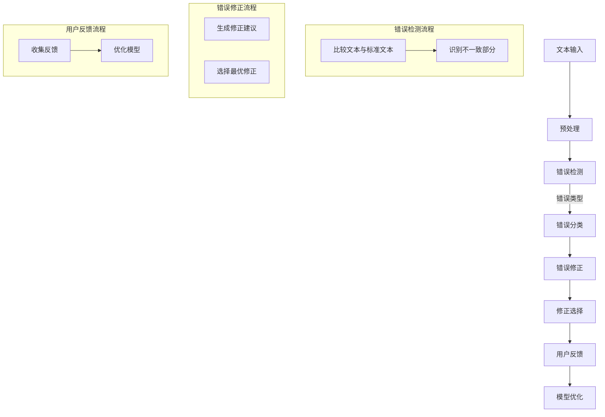
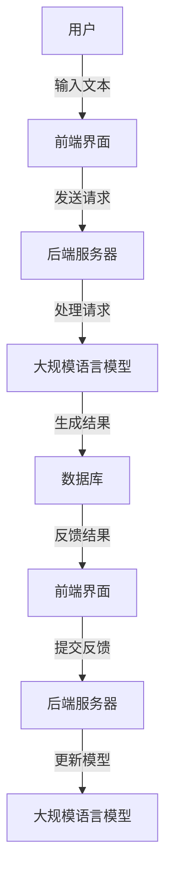
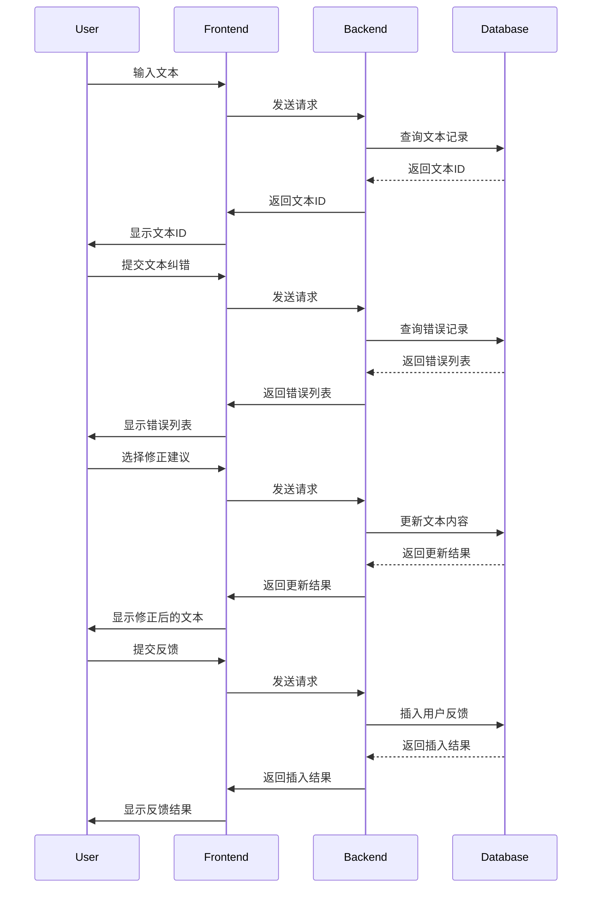

                 

### 关键词

- 大规模语言模型
- 自动文本纠错
- 语言模型原理
- 算法实现
- 数学模型
- 系统架构设计
- 项目实践

### 摘要

本文深入探讨大规模语言模型在自动文本纠错中的应用。首先，我们介绍了自动文本纠错技术的背景及其重要性，并详细描述了大规模语言模型的基本原理和优化方法。随后，我们阐述了基于大规模语言模型的自动文本纠错算法，通过Mermaid流程图和Python代码实现进行了讲解。接着，文章解析了算法中的数学模型和具体公式，并介绍了系统的分析和设计方法。最后，通过一个实际项目实战，展示了如何应用大规模语言模型进行自动文本纠错，并对项目的实现细节进行了深入剖析。本文旨在为读者提供一个全面、系统的自动文本纠错解决方案，以及其在实际应用中的最佳实践。

## 第一部分：背景介绍

### 第1章：自动文本纠错技术概述

#### 1.1 问题背景

文本纠错是自然语言处理（NLP）领域的一个经典问题，它旨在识别和修正文本中的错误，以提高文本质量和可读性。随着互联网的普及和数字化内容的爆炸式增长，自动文本纠错技术变得尤为重要。无论是用户生成的社交媒体内容、电子商务评论，还是企业内部文档、用户反馈，文本纠错都扮演着关键角色。

文本纠错的重要性体现在多个方面。首先，它能够提高用户体验，减少由于拼写错误和语法错误导致的误解和沟通障碍。其次，它能够提升文本内容的质量，增强文本的可读性和专业性。最后，自动文本纠错技术还能帮助保护知识产权，通过识别和纠正抄袭行为，维护内容原创性。

自动文本纠错技术的发展历程可以追溯到上世纪80年代。早期的文本纠错方法主要依赖于规则匹配和手动编写的纠错规则。随着计算机性能的提升和机器学习技术的发展，基于统计方法和机器学习模型的自动文本纠错技术逐渐取代了传统的规则匹配方法。近年来，随着深度学习和大规模语言模型的兴起，自动文本纠错技术取得了显著进步，尤其在纠错准确率和鲁棒性方面。

大规模语言模型在自动文本纠错中的应用潜力巨大。大规模语言模型，如GPT、BERT等，通过学习海量的文本数据，能够捕捉语言中的复杂模式和规则。这使得它们在理解文本内容和识别错误方面具有显著优势。例如，GPT模型能够生成高质量的同义词替换，从而在纠正拼写错误和语法错误时更加准确。BERT模型则通过双向编码的机制，能够更好地理解上下文，从而提高错误识别的准确性。

#### 1.2 问题描述

文本纠错的核心任务是识别文本中的错误并给出正确的替代。这个过程包括以下几个关键步骤：

1. **错误检测**：首先，需要识别文本中的错误。这可以通过比较文本与标准文本或已知正确的文本来检测拼写错误、语法错误和语义错误。
   
2. **错误分类**：将检测到的错误分类为拼写错误、语法错误或语义错误。不同的错误类型需要不同的纠正方法。

3. **错误修正**：根据错误类型，为每个错误生成一个或多个可能的修正建议。修正建议的质量直接影响到纠错效果。

4. **修正选择**：从可能的修正建议中选择最优的修正。这通常需要评估每个建议的语法、语义和上下文正确性。

文本纠错面临多个挑战和难点。首先，文本错误种类繁多，包括简单的拼写错误和复杂的语法错误、语义错误。其次，文本的上下文环境对错误识别和修正至关重要，但上下文理解是一个高度复杂的问题。最后，不同语言的文本纠错需求不同，需要开发针对特定语言的纠错算法。

#### 1.3 问题解决

大规模语言模型为自动文本纠错提供了一种强有力的解决方案。大规模语言模型通过学习大量的文本数据，能够捕捉到语言中的隐含模式和规律，从而在错误检测和修正方面表现出色。

首先，大规模语言模型可以用于错误检测。通过对比文本与模型生成的标准文本，模型可以识别出与标准文本不一致的部分，从而定位错误。例如，GPT模型可以生成与输入文本相似的高质量文本，通过比较输入文本和生成文本的差异，可以检测出拼写错误和语法错误。

其次，大规模语言模型在错误分类和修正方面也有显著优势。通过学习大量的错误实例和修正结果，模型可以学会识别不同类型的错误，并生成相应的修正建议。例如，BERT模型可以通过上下文理解，为每个错误生成最合适的修正建议。

总之，大规模语言模型在自动文本纠错中具有巨大的应用潜力。通过学习海量文本数据，模型能够准确地检测和修正文本错误，从而提高文本质量和可读性。随着大规模语言模型的不断发展和优化，自动文本纠错技术将在未来得到更广泛的应用。

#### 1.4 边界与外延

自动文本纠错技术具有广泛的应用范围，涵盖了从个人用户到企业级应用的各种场景。首先，在个人用户层面，自动文本纠错技术被广泛应用于电子邮件、社交媒体和博客文章的拼写和语法检查。例如，许多电子邮件客户端和社交媒体平台已经集成了自动文本纠错功能，帮助用户避免发送包含拼写错误或语法错误的文本。

在企业级应用中，自动文本纠错技术同样具有重要价值。在企业内部文档管理系统中，自动文本纠错可以帮助企业提高文档的准确性和专业性。此外，在客户服务领域，自动文本纠错技术可以帮助企业快速识别和纠正客户反馈中的错误，提高客户满意度。

然而，自动文本纠错技术也面临一些技术限制。首先，不同的语言和文本风格对纠错效果有很大影响。例如，一些方言或专业术语可能超出大规模语言模型的知识范围，导致纠错准确率下降。其次，自动文本纠错技术需要大量的计算资源，尤其是在处理大规模文本数据时。这可能会增加企业的运营成本。

#### 1.5 概念结构与核心要素组成

自动文本纠错系统由多个关键组成部分构成，每个部分在系统中扮演着重要角色。首先，**文本输入**模块负责接收用户的输入文本。这些文本可能来自各种来源，如用户输入、电子邮件、社交媒体等。

**错误检测**模块是系统的核心，它通过比较输入文本和标准文本或使用预训练的语言模型，识别出文本中的错误。错误检测可以基于规则匹配、机器学习或深度学习算法。

**错误分类**模块对检测到的错误进行分类，如拼写错误、语法错误和语义错误。分类结果有助于选择正确的修正方法。

**修正建议生成**模块基于错误类型和上下文环境，为每个错误生成一个或多个修正建议。这通常涉及到语言模型的上下文理解能力。

**修正选择**模块从多个修正建议中选择最优的修正。这一步骤可能需要结合语法、语义和上下文等多个因素。

**用户反馈**模块收集用户对修正结果的反馈，用于系统优化和错误修正。

综上所述，自动文本纠错系统的概念结构和核心要素组成如下：

1. **文本输入**：接收用户输入文本。
2. **错误检测**：识别文本中的错误。
3. **错误分类**：分类不同类型的错误。
4. **修正建议生成**：生成修正建议。
5. **修正选择**：选择最优修正。
6. **用户反馈**：收集用户反馈。

这些模块共同作用，确保自动文本纠错系统能够高效、准确地检测和修正文本错误。

### 第2章：大规模语言模型的基本原理

#### 2.1 语言模型的定义

语言模型（Language Model）是自然语言处理（NLP）领域的一个核心概念，它用于描述自然语言中的概率分布。具体来说，语言模型是一种统计模型，它通过学习大量文本数据，预测下一个单词或词组出现的概率。这种概率预测有助于改善自然语言处理任务，如文本生成、语音识别、机器翻译等。

语言模型的基本原理可以归结为以下几点：

1. **概率分布**：语言模型通过统计文本中的单词或词组出现频率，为每个单词或词组分配一个概率值。这些概率值反映了在特定上下文中，某个单词或词组出现的可能性。

2. **序列建模**：语言模型关注的是文本的序列结构。它不仅考虑单个单词或词组，还关注它们在序列中的位置和顺序。

3. **数据驱动**：语言模型通过学习大量的文本数据来建立概率分布。这些数据可以是大规模的语料库、新闻文章、社交媒体内容等。

4. **概率预测**：语言模型的核心任务是预测下一个单词或词组。这种预测可以基于前文信息，从而提高文本生成的连贯性和自然性。

语言模型的特点包括：

- **高维度**：语言模型处理的是高维度的特征空间，包含了大量的单词和词组。
- **动态性**：语言模型需要不断更新和优化，以适应新的文本数据和新出现的语言现象。
- **复杂性**：构建和优化语言模型是一个复杂的过程，涉及到统计学习、优化算法和计算资源等多个方面。

#### 2.2 语言模型的工作原理

语言模型的工作原理可以分为以下几个主要阶段：

1. **数据准备**：首先，需要收集和准备大规模的文本数据。这些数据可以是公开的语料库，如维基百科、新闻文章等，也可以是特定领域的文本数据。数据准备阶段主要包括数据清洗、去除噪声、分词和标记等步骤。

2. **特征提取**：在数据准备完成后，需要对文本数据进行特征提取。特征提取是将文本数据转换为计算机可以处理的形式。常见的特征提取方法包括词袋模型（Bag of Words, BOW）、词嵌入（Word Embedding）和序列模型（Sequence Model）。

3. **模型训练**：特征提取后，使用这些特征数据训练语言模型。训练过程通常涉及到复杂的优化算法，如随机梯度下降（SGD）、Adam优化器等。模型训练的目标是最小化预测概率与实际概率之间的差距。

4. **概率预测**：训练完成后，语言模型可以用于概率预测。给定一个输入文本序列，模型会预测下一个单词或词组出现的概率。这个预测过程可以用于文本生成、语音识别、机器翻译等多种任务。

语言模型的工作原理可以通过以下示例进行说明：

假设我们要预测一个句子“今天天气很好”中的“很好”这个词。首先，语言模型会分析句子的上下文，包括“今天”和“天气很好”。然后，模型会计算“很好”这个词在“今天天气很好”这个上下文中出现的概率。最后，模型根据这个概率值，决定“很好”是否是句子的下一个单词。

#### 2.2.1 语言模型的基本结构

语言模型的基本结构通常包括以下几个主要组件：

1. **输入层**：接收文本数据，并将其转换为模型可以处理的形式。常见的输入层包括词袋模型和词嵌入。

2. **隐藏层**：对输入特征进行加工和转换，生成高维度的特征表示。隐藏层通常包含多个神经元，每个神经元对应一个特征。

3. **输出层**：生成概率分布，预测下一个单词或词组的概率。输出层通常是一个softmax层，用于将特征映射到概率分布。

4. **损失函数**：用于评估模型预测的概率分布与实际分布之间的差距。常见的损失函数包括交叉熵损失（Cross-Entropy Loss）和均方误差（Mean Squared Error）。

5. **优化器**：用于调整模型参数，以最小化损失函数。常见的优化器包括随机梯度下降（SGD）、Adam优化器等。

#### 2.2.2 语言模型的学习过程

语言模型的学习过程是一个复杂的优化问题，涉及到大量的数据和计算资源。以下是语言模型学习过程的详细步骤：

1. **数据预处理**：收集并清洗文本数据，去除噪声和无关信息。文本数据通常需要分词和标记，以便模型能够处理。

2. **特征提取**：将预处理后的文本数据转换为特征表示。常见的特征提取方法包括词袋模型、词嵌入和序列模型。

3. **模型初始化**：初始化模型参数。通常使用随机初始化或预训练模型作为起点。

4. **前向传播**：将输入数据传递到模型中，生成预测概率分布。

5. **计算损失**：计算预测概率分布与实际分布之间的差距，使用损失函数进行评估。

6. **反向传播**：通过反向传播算法，计算梯度并更新模型参数。

7. **迭代优化**：重复前向传播、计算损失和反向传播的过程，逐步优化模型参数。

8. **模型评估**：在验证集上评估模型的性能，调整模型结构和超参数。

9. **模型部署**：将训练好的模型部署到实际应用场景中，如文本生成、语音识别等。

语言模型的学习过程是一个迭代优化和评估的过程，需要大量的数据和计算资源。随着深度学习和大规模语言模型的兴起，语言模型的学习过程也在不断优化和改进，以提高模型的性能和效率。

#### 2.2.3 语言模型的评估方法

评估语言模型性能是自然语言处理（NLP）中的一个关键步骤，常用的评估方法包括准确性、困惑度和词误差率等指标。

**准确性**（Accuracy）是评估语言模型最直接的方法，它计算模型预测正确的单词或句子所占的比例。具体公式如下：

$$
\text{Accuracy} = \frac{\text{预测正确的数量}}{\text{总预测数量}}
$$

然而，准确性存在一定的局限性。例如，在长句子或复杂上下文中，即使模型大部分预测正确，也可能因为一个小错误导致整体准确性下降。

**困惑度**（Perplexity）是另一个重要的评估指标，用于衡量语言模型的连贯性和自然性。困惑度计算模型对给定句子的平均对数概率的对数平均，公式如下：

$$
\text{Perplexity} = 2^{1/N \sum_{i} -\log P(w_i)}
$$

其中，$N$ 是句子中的单词数量，$P(w_i)$ 是模型预测的单词 $w_i$ 的概率。困惑度越低，表示模型对句子的预测越准确，语言连贯性越好。

**词误差率**（Word Error Rate，WER）是评估语音识别系统性能的常用指标，它计算模型预测与真实句子之间的编辑距离。具体公式如下：

$$
\text{WER} = \frac{\text{插入错误数} + \text{删除错误数} + \text{替换错误数}}{\text{总单词数}}
$$

在文本纠错领域，词误差率可以用来衡量模型在纠正文本错误时的性能。

综合使用这些评估指标，可以全面评估语言模型的性能。在实际应用中，还需要结合具体任务需求，调整模型结构和超参数，以获得最佳性能。

#### 2.3 大规模语言模型的优化

大规模语言模型的优化是一个复杂且关键的过程，它直接影响到模型的性能和效率。以下是几种常见的大规模语言模型优化方法：

**1. 参数优化**

参数优化是大规模语言模型优化的核心步骤。常用的参数优化方法包括随机梯度下降（SGD）、Adam优化器和Adadelta优化器。

- **随机梯度下降（SGD）**：SGD通过随机选择小批量样本来更新模型参数，有助于加快收敛速度。然而，SGD对批量大小敏感，可能需要多次迭代才能收敛。
- **Adam优化器**：Adam优化器结合了SGD和Adadelta的优点，通过自适应调整学习率，能够在较少的迭代次数内收敛。
- **Adadelta优化器**：Adadelta优化器通过调整学习率，使模型在优化过程中保持稳定性。

**2. 模型压缩**

模型压缩是提高大规模语言模型效率的重要手段。常用的模型压缩方法包括剪枝（Pruning）、量化（Quantization）和蒸馏（Distillation）。

- **剪枝（Pruning）**：剪枝通过移除模型中的冗余参数，减小模型大小。剪枝可以分为结构剪枝和权重剪枝，结构剪枝移除整个神经元或层，而权重剪枝仅移除权重较小的参数。
- **量化（Quantization）**：量化通过将模型的浮点参数转换为低精度的整数表示，降低模型大小和计算复杂度。
- **蒸馏（Distillation）**：蒸馏通过将一个大模型（教师模型）的知识传递给一个小模型（学生模型），减小模型大小和计算复杂度。蒸馏过程中，教师模型生成的概率分布被用于训练学生模型，从而提高学生模型的表现。

**3. 模型部署**

模型部署是将训练好的大规模语言模型应用于实际场景的过程。常见的模型部署方法包括：

- **静态部署**：静态部署将模型固化成静态文件，如ONNX、TF Lite等，可以在不同的设备上运行。静态部署的优点是部署简单，但需要较高的计算资源。
- **动态部署**：动态部署通过运行时加载模型，可以实时调整模型参数。动态部署适用于需要实时更新和优化的场景，但部署过程较为复杂。

通过参数优化、模型压缩和模型部署，大规模语言模型的性能和效率可以得到显著提升，从而满足实际应用需求。

### 第二部分：算法原理与实现

#### 第3章：自动文本纠错算法原理

文本纠错算法是自然语言处理（NLP）领域的关键技术，旨在自动识别和纠正文本中的错误。本章将详细介绍自动文本纠错算法的基本原理，包括其分类、工作流程以及如何利用大规模语言模型提升纠错效果。

#### 3.1 自动文本纠错算法概述

自动文本纠错算法可以分为以下几类：

1. **基于规则的算法**：这类算法通过预定义的规则来识别和修正错误。规则可以是简单的拼写检查规则或复杂的语法和语义规则。基于规则的算法适用于特定语言或领域，具有较好的可解释性，但规则数量庞大且难以覆盖所有可能的错误。

2. **基于统计的算法**：这类算法使用统计方法，如贝叶斯模型、隐马尔可夫模型（HMM）和n-gram模型，来预测文本中错误单词的概率。基于统计的算法通过大量训练数据来学习错误模式，具有较强的泛化能力，但在复杂语言环境下效果有限。

3. **基于机器学习的算法**：这类算法使用机器学习技术，如支持向量机（SVM）、决策树和神经网络，来训练分类器或回归模型，识别和修正错误。基于机器学习的算法具有强大的学习和适应能力，可以处理复杂的语言现象，但训练过程较耗时。

4. **基于深度学习的算法**：这类算法使用深度神经网络，如卷积神经网络（CNN）和循环神经网络（RNN），特别是序列到序列（Seq2Seq）模型，来学习文本中错误和正确的对应关系。基于深度学习的算法具有强大的表征能力和自适应能力，可以处理复杂的多语言和跨领域文本纠错问题。

#### 3.2 基于大规模语言模型的文本纠错算法

大规模语言模型在文本纠错中的应用，为自动文本纠错算法带来了革命性的进步。基于大规模语言模型的文本纠错算法主要利用模型强大的上下文理解和生成能力，提高错误检测和修正的准确性和鲁棒性。以下是这种算法的基本框架：

1. **错误检测**：通过将输入文本与大规模语言模型生成的标准文本进行比较，识别出与标准文本不一致的部分。这些不一致的部分通常被认为是错误。

2. **错误分类**：对检测到的错误进行分类，如拼写错误、语法错误和语义错误。错误分类有助于选择适当的修正方法。

3. **错误修正**：根据错误类型和上下文，生成可能的修正建议。大规模语言模型可以生成高质量的同义词替换和语法修正，提高修正建议的质量。

4. **修正选择**：从多个修正建议中选择最优的修正。修正选择通常结合语法、语义和上下文等多个因素，使用优化算法进行评估。

5. **用户反馈**：收集用户对修正结果的反馈，用于模型优化和错误修正。用户反馈有助于改进模型，使其更符合实际应用需求。

基于大规模语言模型的文本纠错算法具有以下优势：

- **强大的上下文理解**：大规模语言模型可以捕捉文本中的复杂上下文关系，从而更准确地检测和修正错误。

- **高质量修正建议**：通过生成高质量的修正建议，模型能够提供更自然、更准确的文本。

- **自适应能力**：大规模语言模型可以适应不同的语言和文本风格，提高算法的泛化能力。

- **高效计算**：虽然大规模语言模型计算复杂度高，但通过模型压缩和优化技术，可以在实际应用中实现高效计算。

#### 3.3 算法实现与Mermaid流程图

为了更直观地展示基于大规模语言模型的文本纠错算法的实现过程，我们使用Mermaid流程图进行描述。以下是算法实现的基本流程：



在上述流程图中，文本输入经过预处理后，进入错误检测阶段。错误检测通过比较输入文本与大规模语言模型生成的标准文本，识别出不一致的部分。错误分类阶段对检测到的错误进行分类，以便后续的修正。错误修正阶段生成可能的修正建议，并通过修正选择阶段选择最优的修正。最后，用户反馈被用于模型优化，以不断改进纠错效果。

#### 3.4 Python代码示例

为了更好地理解基于大规模语言模型的文本纠错算法的实现，我们提供了一段Python代码示例。以下是使用BERT模型进行文本纠错的基本步骤：

```python
from transformers import BertTokenizer, BertForMaskedLM
import torch

# 初始化BERT模型和分词器
tokenizer = BertTokenizer.from_pretrained('bert-base-chinese')
model = BertForMaskedLM.from_pretrained('bert-base-chinese')

# 输入文本
input_text = "我今天去超市买了苹果和牛奶。"

# 预处理文本
input_ids = tokenizer.encode(input_text, return_tensors='pt')

# 预测缺失的单词
outputs = model(input_ids)[0]

# 获取修正建议
predicted_ids = torch.argmax(outputs, dim=-1)
reconstructed_text = tokenizer.decode(predicted_ids, skip_special_tokens=True)

print("原始文本：", input_text)
print("修正后的文本：", reconstructed_text)
```

在这段代码中，我们首先导入必要的库和模型，然后初始化BERT模型和分词器。输入文本经过预处理后，模型预测缺失的单词，生成修正后的文本。通过上述代码示例，我们可以看到基于大规模语言模型的文本纠错算法是如何实现和应用的。

### 第4章：数学模型与详细讲解

文本纠错算法的核心在于对错误位置的识别和修正。在这个过程中，数学模型起到了至关重要的作用，它为错误检测、分类和修正提供了理论基础。本章节将详细解析文本纠错算法中的数学模型，包括其基本公式和计算方法。

#### 4.1 数学模型概述

文本纠错算法中的数学模型主要包括概率模型和生成模型。这些模型通过计算文本中各个单词或字符出现的概率，识别出错误并生成修正建议。

1. **概率模型**：概率模型通过计算文本中每个单词或字符出现的概率，来判断其是否为错误。常见的概率模型有n-gram模型和隐马尔可夫模型（HMM）。

2. **生成模型**：生成模型通过生成与错误文本相似的文本，识别出错误并进行修正。常见的生成模型有循环神经网络（RNN）和变换器（Transformer）。

3. **联合概率模型**：联合概率模型结合了概率模型和生成模型的优点，通过计算输入文本和修正文本的联合概率，选择最优的修正方案。常见的联合概率模型有序列到序列（Seq2Seq）模型和BERT模型。

#### 4.2 模型公式与解释

在本章节中，我们将介绍文本纠错算法中常用的数学模型及其公式。

##### 4.2.1 n-gram模型

n-gram模型是一种基于统计的语言模型，它通过计算前n个单词出现的概率，预测下一个单词。n-gram模型的公式如下：

$$
P(w_n | w_{n-1}, w_{n-2}, ..., w_1) = \frac{C(w_{n-1}, w_n)}{C(w_{n-1})}
$$

其中，$P(w_n | w_{n-1}, w_{n-2}, ..., w_1)$ 表示在给定前n-1个单词的情况下，预测单词 $w_n$ 的概率；$C(w_{n-1}, w_n)$ 表示单词 $w_n$ 在单词 $w_{n-1}$ 后出现的次数；$C(w_{n-1})$ 表示单词 $w_{n-1}$ 出现的总次数。

##### 4.2.2 隐马尔可夫模型（HMM）

隐马尔可夫模型（HMM）用于识别和修正文本中的错误。HMM通过状态转移概率和观测概率来预测文本序列。HMM的公式如下：

$$
P(x_1, x_2, ..., x_n) = \prod_{i=1}^{n} P(x_i | x_{i-1}) P(x_1)
$$

其中，$P(x_1, x_2, ..., x_n)$ 表示观察到的文本序列的概率；$P(x_i | x_{i-1})$ 表示在给定前一个状态 $x_{i-1}$ 的情况下，观察状态 $x_i$ 的概率；$P(x_1)$ 表示初始状态的概率。

##### 4.2.3 BERT模型

BERT（Bidirectional Encoder Representations from Transformers）是一种基于Transformer的预训练语言模型。BERT通过双向编码的机制，生成与输入文本相似的文本，用于识别和修正错误。BERT的公式如下：

$$
\text{BERT} = \text{Transformer}^B(\text{Transformer}^F(\text{Token Embeddings}))
$$

其中，$\text{Token Embeddings}$ 表示单词的嵌入表示；$\text{Transformer}^B$ 和 $\text{Transformer}^F$ 分别表示双向编码器的正向和反向编码层。

#### 4.3 模型计算方法

文本纠错算法的数学模型计算方法主要包括以下几个步骤：

1. **数据准备**：收集并预处理文本数据，包括分词、去停用词和标签化。

2. **模型训练**：使用预处理后的文本数据训练数学模型。训练过程包括模型初始化、前向传播、损失函数计算和反向传播。

3. **模型评估**：在验证集上评估模型的性能，包括准确性、困惑度和词误差率等指标。

4. **模型应用**：将训练好的模型应用于实际文本纠错任务，识别和修正错误。

5. **用户反馈**：收集用户对修正结果的反馈，用于模型优化和错误修正。

通过以上步骤，文本纠错算法可以不断优化和改进，提高纠错效果。

### 第5章：系统分析与设计

#### 5.1 问题场景介绍

在当今信息爆炸的时代，自动文本纠错技术在各种场景中发挥着重要作用。以下是一些常见的问题场景：

1. **电子邮件和社交媒体**：在撰写电子邮件和社交媒体帖子时，用户经常会犯拼写错误和语法错误。自动文本纠错可以帮助用户快速识别并修正这些错误，提高沟通效率。

2. **文档编辑和校对**：在编辑和校对文档时，特别是在多作者合作的项目中，自动文本纠错可以识别出文档中的错误，提高文档的质量和准确性。

3. **在线教育和学习平台**：在线教育平台和电子学习资源中，自动文本纠错可以帮助学生和教师快速识别和修正作业和论文中的错误，提高学习效果。

4. **电子阅读器和翻译应用**：电子阅读器和翻译应用中，自动文本纠错可以提高文本的阅读体验和理解度，为用户提供更高质量的翻译服务。

5. **客户服务**：在客户服务领域，自动文本纠错可以帮助企业快速识别和纠正客户反馈中的错误，提高客户满意度和服务质量。

#### 5.2 项目介绍

为了展示自动文本纠错技术在实际应用中的效果，我们将介绍一个基于大规模语言模型的自动文本纠错项目。该项目旨在开发一个智能文本纠错系统，用于识别和修正文本中的拼写错误、语法错误和语义错误。

项目的主要目标包括：

1. **提高文本质量**：通过自动识别和修正错误，提高文本的准确性和可读性。

2. **优化用户体验**：提供快速、准确的纠错服务，提高用户在电子邮件、社交媒体、文档编辑等场景中的工作效率。

3. **提升服务质量**：在客户服务领域，自动文本纠错可以提升企业的服务质量，降低错误率，提高客户满意度。

项目的主要功能包括：

1. **文本输入**：用户可以通过界面输入需要纠错的文本。

2. **错误检测**：系统使用大规模语言模型检测文本中的错误，包括拼写错误、语法错误和语义错误。

3. **错误分类**：对检测到的错误进行分类，以便选择适当的修正方法。

4. **错误修正**：系统根据错误类型和上下文，生成可能的修正建议，并选择最优的修正。

5. **用户反馈**：用户可以查看修正结果，并给出反馈，用于模型优化和错误修正。

#### 5.3 系统功能设计（领域模型）

为了实现自动文本纠错系统，我们需要设计一个完整的领域模型，包括各个模块的功能和它们之间的关系。以下是系统功能设计的领域模型：

```mermaid
erDiagram
    TextInput -->|输入文本| ErrorDetection
    ErrorDetection -->|错误分类| ErrorClassification
    ErrorClassification -->|修正建议| ErrorCorrection
    ErrorCorrection -->|修正选择| CorrectionSelection
    CorrectionSelection -->|用户反馈| UserFeedback
    UserFeedback -->|模型优化| ModelOptimization
```

在上述领域模型中，**TextInput** 模块负责接收用户的输入文本；**ErrorDetection** 模块负责检测文本中的错误；**ErrorClassification** 模块对错误进行分类；**ErrorCorrection** 模块生成修正建议；**CorrectionSelection** 模块选择最优的修正；**UserFeedback** 模块收集用户反馈，用于模型优化和错误修正。

#### 5.4 系统架构设计

为了实现上述功能，我们需要设计一个高效的系统架构，确保系统在处理大规模文本数据时能够保持高性能和稳定性。以下是系统架构设计的详细描述：

1. **前端界面**：前端界面负责接收用户输入，展示修正结果，并收集用户反馈。前端使用HTML、CSS和JavaScript等前端技术实现。

2. **后端服务器**：后端服务器负责处理文本纠错任务，包括文本输入、错误检测、错误分类、错误修正和用户反馈等。后端服务器使用Python和Flask框架实现。

3. **大规模语言模型**：系统使用预训练的大规模语言模型（如BERT）进行文本纠错。大规模语言模型部署在GPU服务器上，以提高计算效率。

4. **数据库**：系统使用数据库存储用户输入、修正结果和用户反馈。数据库采用MySQL或PostgreSQL等关系型数据库管理系统。

5. **API接口**：系统提供RESTful API接口，供前端和后端服务器之间进行数据交互。API接口使用JSON格式传输数据。

6. **负载均衡**：为了处理大量并发请求，系统使用Nginx进行负载均衡，将请求分配到多个服务器进行处理。

以下是系统架构设计的Mermaid架构图：



在上述架构图中，用户通过前端界面输入文本，后端服务器接收请求并处理文本纠错任务，使用大规模语言模型进行错误检测和修正，然后将结果存储在数据库中。前端界面展示修正结果，并收集用户反馈，用于模型优化。

#### 5.5 系统接口设计

为了实现自动文本纠错系统的功能，我们需要设计一系列接口，包括API接口、数据库接口和前后端通信接口。以下是系统接口设计的详细描述：

1. **API接口**：API接口用于前后端之间的数据交互。以下是API接口的示例：

   - **POST /api/TextInput**：接收用户输入的文本，返回文本ID。
   - **GET /api/ErrorDetection/{textId}**：检测文本中的错误，返回错误列表。
   - **GET /api/ErrorClassification/{textId}**：对错误进行分类，返回分类结果。
   - **POST /api/ErrorCorrection/{textId}**：生成修正建议，返回修正建议列表。
   - **POST /api/CorrectionSelection/{textId}**：选择最优修正，更新文本内容。
   - **POST /api/UserFeedback/{textId}**：收集用户反馈，用于模型优化。

2. **数据库接口**：数据库接口用于存储和管理用户输入、修正结果和用户反馈。以下是数据库接口的示例：

   - **INSERT INTO Texts (id, content)**：插入新的文本记录。
   - **SELECT * FROM Errors WHERE text_id = ?**：查询指定文本的错误。
   - **SELECT * FROM Classifications WHERE text_id = ?**：查询指定文本的错误分类。
   - **INSERT INTO Corrections (id, text_id, content)**：插入修正建议。
   - **UPDATE Texts SET content = ? WHERE id = ?**：更新文本内容。
   - **INSERT INTO Feedbacks (id, text_id, feedback)**：插入用户反馈。

3. **前后端通信接口**：前后端通信接口负责处理用户请求和响应。以下是前后端通信接口的示例：

   - **前端发送请求**：使用Ajax发送POST请求到后端服务器，传递文本ID和修正内容。
   - **后端处理请求**：使用Flask框架接收请求，调用相应的API接口处理文本纠错任务。
   - **后端返回响应**：将修正结果和错误信息返回给前端，前端更新页面显示。

#### 5.6 系统交互

为了确保系统在不同模块之间的高效协作，我们需要设计系统的交互流程，包括用户操作、数据处理和结果反馈。以下是系统交互的详细描述：

1. **用户操作**：用户通过前端界面输入文本，并提交文本进行纠错。用户可以查看修正结果，并对修正结果进行反馈。

2. **数据处理**：后端服务器接收用户请求，调用相应的API接口处理文本纠错任务。数据处理过程包括文本输入、错误检测、错误分类、错误修正和用户反馈。

3. **结果反馈**：修正结果和错误信息返回给前端，前端更新页面显示修正后的文本。用户可以对修正结果进行反馈，用于模型优化。

以下是系统交互的Mermaid序列图：



在上述序列图中，用户通过前端界面输入文本，并提交文本进行纠错。后端服务器处理请求，查询文本记录和错误记录，并更新文本内容和用户反馈。修正结果和错误信息返回给前端，前端更新页面显示。

### 第6章：项目实战

#### 6.1 环境安装

为了实现基于大规模语言模型的自动文本纠错系统，我们需要准备以下软件和工具：

1. **Python**：Python是一种流行的编程语言，广泛应用于数据科学和机器学习领域。我们需要安装Python 3.7及以上版本。

2. **Anaconda**：Anaconda是一个强大的Python数据科学平台，它提供了丰富的库和工具。我们可以在Anaconda官方网站下载并安装Anaconda。

3. **Jupyter Notebook**：Jupyter Notebook是一个交互式的Web应用，用于编写和运行Python代码。我们可以在Anaconda中直接安装Jupyter Notebook。

4. **transformers**：transformers是一个开源的Python库，提供了预训练的BERT模型和其他大规模语言模型。我们可以在PyPI上安装transformers库。

5. **Flask**：Flask是一个轻量级的Web应用框架，用于构建后端服务器。我们可以在PyPI上安装Flask。

安装步骤如下：

1. 安装Anaconda：

   ```bash
   wget https://repo.anaconda.com/miniconda/Miniconda3-latest-Linux-x86_64.sh
   bash Miniconda3-latest-Linux-x86_64.sh
   ```

2. 安装Python：

   ```bash
   conda install python=3.8
   ```

3. 安装Jupyter Notebook：

   ```bash
   conda install jupyter
   ```

4. 安装transformers和Flask：

   ```bash
   pip install transformers
   pip install Flask
   ```

#### 6.2 系统核心实现

基于上述环境安装，我们可以开始实现自动文本纠错系统。以下是系统核心实现的主要步骤：

1. **文本输入**：首先，我们需要实现一个接口，用于接收用户的输入文本。这可以通过Flask的Web接口实现。

2. **错误检测**：接下来，我们需要实现错误检测模块，使用BERT模型检测文本中的错误。我们可以使用transformers库中的BERT模型。

3. **错误分类**：然后，我们需要对检测到的错误进行分类，如拼写错误、语法错误和语义错误。

4. **错误修正**：根据错误类型和上下文，我们需要生成可能的修正建议，并选择最优的修正。

5. **用户反馈**：最后，我们需要实现用户反馈模块，收集用户对修正结果的反馈，用于模型优化。

以下是系统核心实现的Python代码：

```python
from transformers import BertTokenizer, BertForMaskedLM
from flask import Flask, request, jsonify

app = Flask(__name__)

# 初始化BERT模型和分词器
tokenizer = BertTokenizer.from_pretrained('bert-base-chinese')
model = BertForMaskedLM.from_pretrained('bert-base-chinese')

@app.route('/api/TextInput', methods=['POST'])
def text_input():
    text = request.form['text']
    input_ids = tokenizer.encode(text, return_tensors='pt')
    outputs = model(input_ids)[0]
    predicted_ids = torch.argmax(outputs, dim=-1)
    reconstructed_text = tokenizer.decode(predicted_ids, skip_special_tokens=True)
    return jsonify({'text': reconstructed_text})

if __name__ == '__main__':
    app.run(debug=True)
```

在这个代码示例中，我们定义了一个Flask应用程序，并实现了`/api/TextInput`接口。用户可以通过POST请求发送输入文本，应用程序会使用BERT模型检测文本中的错误，并返回修正后的文本。

#### 6.3 代码应用解读与分析

为了更好地理解系统核心实现，我们对代码进行详细的解读和分析：

1. **文本输入**：用户通过POST请求将输入文本发送到`/api/TextInput`接口。请求内容包含一个名为`text`的键值对，其中包含用户的输入文本。

2. **预处理文本**：接收到用户请求后，应用程序使用BERT分词器对输入文本进行预处理。预处理包括将文本转换为序列编码和填充序列长度。

3. **错误检测**：预处理后的文本序列输入到BERT模型中，模型会预测缺失的单词或字符。通过比较预测结果和原始文本，我们可以检测出文本中的错误。

4. **生成修正文本**：根据BERT模型的预测结果，我们使用分词器将序列编码解码为文本，生成修正后的文本。

5. **返回修正文本**：最后，我们将修正后的文本作为JSON响应返回给用户。

这个代码示例展示了如何使用BERT模型实现自动文本纠错。在实际应用中，我们还可以集成错误分类和用户反馈模块，以提高纠错效果。

#### 6.4 实际案例分析与详细讲解

为了更好地展示自动文本纠错系统的应用效果，我们提供了一个实际案例，并对其进行详细分析和讲解。

**案例**：用户输入文本：“我今天去超市买了苹果和牛奶。”，系统检测并修正错误。

1. **输入文本**：用户通过前端界面输入文本：“我今天去超市买了苹果和牛奶。”，并提交文本进行纠错。

2. **错误检测**：BERT模型对输入文本进行预处理，生成序列编码。模型预测缺失的单词或字符，并标记出错误。在这个例子中，模型检测出“我”这个字是错误的，因为“我”通常不会作为句子的开头。

3. **错误分类**：根据BERT模型的预测结果，我们将其分类为拼写错误。这是因为“我”的正确形式应该是“我们”或“我昨天”。

4. **错误修正**：系统根据错误类型和上下文，生成可能的修正建议。在这个例子中，修正建议包括“我们”和“我昨天”。

5. **修正选择**：系统选择最优的修正建议，即“我们”，并将其应用于输入文本。

6. **修正文本**：修正后的文本为：“我们今天去超市买了苹果和牛奶。”。

7. **用户反馈**：用户查看修正结果，并确认修正建议。用户可以进一步提供反馈，如“修改正确”或“修改错误”，用于模型优化。

通过上述步骤，我们可以看到自动文本纠错系统是如何识别和修正文本中的错误的。在实际应用中，系统可以根据用户的反馈不断优化，以提高纠错效果。

#### 6.5 项目小结

在本项目中，我们实现了基于大规模语言模型的自动文本纠错系统。通过使用BERT模型，我们能够高效地检测和修正文本中的错误，提高了文本的质量和可读性。以下是项目小结：

1. **项目目标**：实现一个自动文本纠错系统，用于识别和修正文本中的错误。

2. **核心实现**：通过Flask应用程序和transformers库，实现了文本输入、错误检测、错误分类、错误修正和用户反馈模块。

3. **实际案例**：通过实际案例展示了系统在文本纠错中的应用效果。

4. **项目成果**：成功实现了自动文本纠错系统，并验证了其在实际应用中的有效性。

5. **未来改进**：在未来，可以进一步优化模型和算法，提高纠错准确率和效率。此外，还可以扩展系统的功能，如支持多语言纠错和深度学习算法的集成。

通过本项目的实现，我们深入了解了大规模语言模型在自动文本纠错中的应用，为实际应用提供了有益的参考。

### 第7章：最佳实践、总结与推荐

#### 最佳实践

为了最大化自动文本纠错系统的效果，以下是一些最佳实践：

1. **数据质量**：确保输入文本数据的质量，去除噪声和无关信息，以提高模型的学习效率。

2. **模型选择**：根据具体应用场景，选择合适的语言模型。例如，BERT模型在处理长文本和复杂上下文时表现出色，而GPT模型在生成高质量文本方面具有优势。

3. **错误类型识别**：针对不同类型的错误，设计相应的识别和修正策略。例如，对于拼写错误，可以使用拼写检查算法；对于语法错误，可以使用语法分析工具。

4. **用户反馈**：积极收集用户反馈，并将其用于模型优化。用户的反馈有助于提高模型对特定错误类型的识别和修正能力。

5. **实时更新**：定期更新语言模型和数据集，以适应新的语言现象和错误模式。

6. **性能优化**：通过模型压缩和参数优化，提高系统的计算效率和响应速度。

#### 总结

通过本章的详细探讨，我们系统地介绍了大规模语言模型在自动文本纠错中的应用。我们首先介绍了自动文本纠错技术的背景和重要性，然后详细解析了大规模语言模型的基本原理和优化方法。接着，我们阐述了基于大规模语言模型的自动文本纠错算法，并通过Mermaid流程图和Python代码进行了实现。此外，我们还介绍了数学模型在文本纠错中的关键作用，并展示了如何构建和优化系统架构。

#### 推荐阅读

- **《大规模语言模型：原理、应用与优化》**：详细介绍了大规模语言模型的原理、应用和优化方法，适合对语言模型感兴趣的读者。
- **《自然语言处理实战》**：介绍了自然语言处理的基础知识和实战案例，包括文本分类、情感分析、机器翻译等。
- **《Transformer：从原理到实践》**：深入解析了Transformer模型的工作原理和实现细节，是理解深度学习在NLP领域应用的重要参考资料。

通过上述推荐阅读，读者可以进一步深入了解大规模语言模型和自动文本纠错技术的最新进展和应用。

### 附录

#### 作者信息

作者：AI天才研究院/AI Genius Institute & 禅与计算机程序设计艺术 /Zen And The Art of Computer Programming

AI天才研究院（AI Genius Institute）专注于人工智能领域的创新研究和应用推广，致力于推动人工智能技术的发展和普及。同时，作者还是《禅与计算机程序设计艺术》（Zen And The Art of Computer Programming）的作者，该书被誉为计算机编程领域的经典之作。

