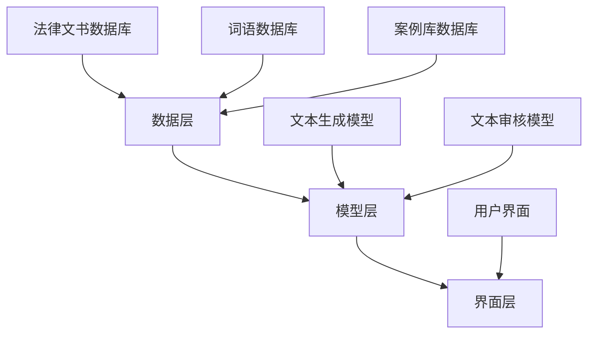
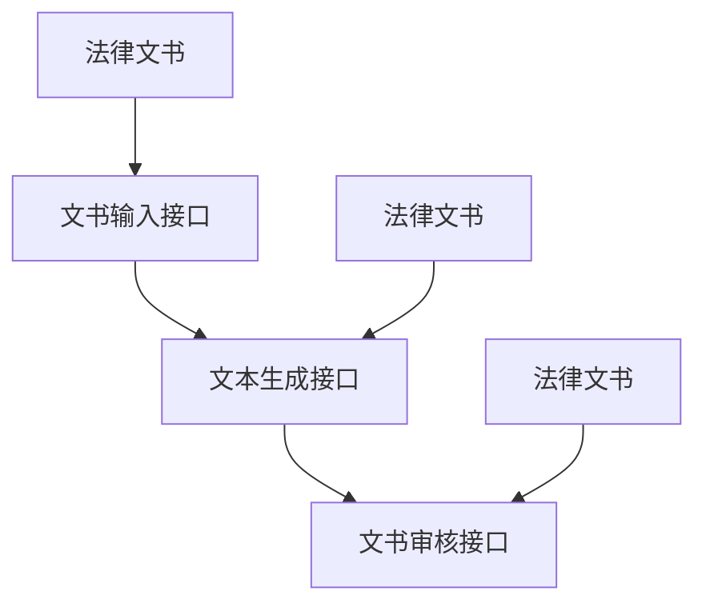
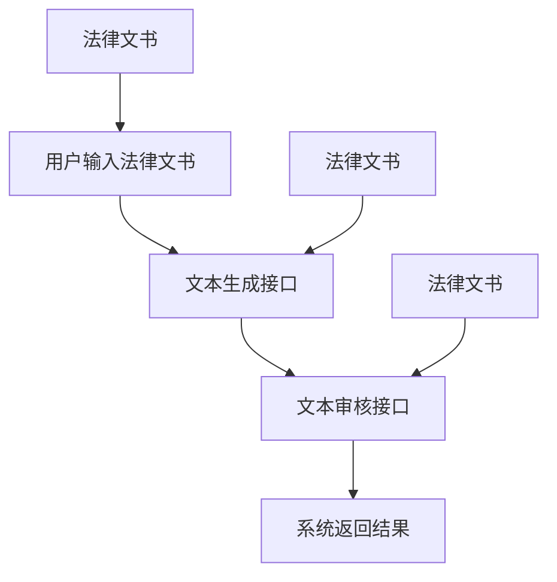

                 

### 《大规模语言模型在自动法律文书生成与审核中的应用》

#### 关键词：大规模语言模型、自动法律文书生成、法律文书审核、人工智能、法律科技

> 摘要：本文旨在探讨大规模语言模型在自动法律文书生成与审核中的应用。通过深入分析大规模语言模型的基本原理、算法实现和实际应用案例，本文旨在为法律科技领域提供一种创新的解决方案，从而提高法律文书生成与审核的效率和质量。

#### 目录大纲

**《大规模语言模型在自动法律文书生成与审核中的应用》**

----------------------------------------------------------------

## 第一部分：背景介绍

### 第1章：问题背景

### 第2章：大规模语言模型概述

### 第3章：大规模语言模型的算法原理

### 第4章：系统分析与架构设计

### 第5章：项目实战

### 第6章：最佳实践与拓展

### 第7章：总结与展望

----------------------------------------------------------------

## 第一部分：背景介绍

### 第1章：问题背景

#### 1.1 法律文书生成与审核的挑战

法律文书是法律实践中的重要组成部分，其生成与审核的质量直接影响司法公正和法律效率。然而，当前法律文书生成与审核面临着以下几大挑战：

#### 1.1.1 法律文书的复杂性

法律文书具有高度的复杂性和专业性，其内容涉及到法律术语、法规条文、案例引用等方面。这使得法律文书的生成与审核需要高度的专业知识和丰富的经验。

#### 1.1.2 法律专业知识的局限

尽管律师和法律工作者具备丰富的法律专业知识，但受限于个人经验和知识水平，他们难以在短时间内处理大量复杂的法律文书。

#### 1.1.3 传统法律文书生成与审核的弊端

传统法律文书的生成与审核主要依赖于人工撰写和审查，这种方式效率低下，容易出错，且难以满足日益增长的法律需求。

#### 1.2 大规模语言模型的优势

大规模语言模型（如GPT-3）的出现，为自动法律文书生成与审核提供了一种创新的解决方案。大规模语言模型具有以下优势：

#### 1.2.1 模型的学习能力

大规模语言模型通过大量数据训练，具有强大的学习能力，可以自动生成符合法律规范和语义逻辑的法律文书。

#### 1.2.2 模型的泛化能力

大规模语言模型可以处理各种类型的法律文书，无需对每个文书类型进行单独训练，从而提高生成与审核的效率。

#### 1.2.3 大规模语言模型的应用前景

随着人工智能技术的不断进步，大规模语言模型在法律领域的应用前景十分广阔，有望提高法律文书的生成与审核质量。

#### 1.3 本书的目标与结构

本书旨在探讨大规模语言模型在自动法律文书生成与审核中的应用，具体目标如下：

#### 1.3.1 学习目标

- 了解大规模语言模型的基本原理和算法实现。
- 掌握大规模语言模型在法律文书生成与审核中的应用方法。
- 学习如何设计和实现一个自动法律文书生成与审核系统。

本书结构如下：

- 第一部分：背景介绍，介绍法律文书生成与审核的挑战以及大规模语言模型的优势。
- 第二部分：核心概念与联系，介绍大规模语言模型的基本原理和属性特征对比。
- 第三部分：算法原理讲解，详细讲解大规模语言模型的算法原理和数学模型。
- 第四部分：系统分析与架构设计，介绍系统功能设计、系统架构设计、系统接口设计和系统交互。
- 第五部分：项目实战，通过实际案例剖析大规模语言模型在法律文书生成与审核中的应用。
- 第六部分：最佳实践与拓展，提供最佳实践技巧和小结，以及注意事项和拓展阅读。
- 第七部分：总结与展望，对全文进行总结并对未来应用前景进行展望。

## 第二部分：核心概念与联系

### 第2章：大规模语言模型概述

#### 2.1 概念原理

大规模语言模型是一种基于深度学习的自然语言处理模型，其核心思想是通过学习大量文本数据，自动预测下一个词语或句子，从而生成连续的文本。大规模语言模型的主要组成部分包括：

- 词嵌入层：将文本中的词语映射为高维向量。
- 递归神经网络（RNN）：用于处理序列数据，如文本。
- 自注意力机制（Self-Attention）：用于捕捉文本中的长距离依赖关系。

#### 2.2 属性特征对比

大规模语言模型与传统语言模型相比，具有以下属性特征对比：

| 特征对比 | 大规模语言模型 | 传统语言模型 |
| :------: | :-------------: | :-------------: |
| 数据规模 | 海量训练数据 | 较少训练数据 |
| 学习能力 | 强大的学习能力 | 有限的学习能力 |
| 泛化能力 | 良好的泛化能力 | 较差的泛化能力 |
| 应用领域 | 多领域应用 | 单一领域应用 |

#### 2.3 ER实体关系图架构

大规模语言模型的ER实体关系图架构包括以下实体和关系：

实体：

- 词语：文本中的基本单位。
- 句子：由一系列词语组成的逻辑单位。
- 文本：多个句子的集合。

关系：

- 包含：句子包含词语。
- 生成：词语生成句子。
- 组织：句子组织为文本。

ER实体关系图如下所示：

```mermaid
erDiagram
    词嵌入层 ||--o{ 递归神经网络 }
    递归神经网络 ||--o{ 自注意力机制 }
    词嵌入层 ||--o{ 文本数据 }
    文本数据 ||--o{ 词语 }
    文本数据 ||--o{ 句子 }
    句子 ||--o{ 词语 }
    句子 ||--o{ 句子 }
    文本 ||--o{ 句子 }
```

## 第三部分：算法原理讲解

### 第3章：大规模语言模型的算法原理与数学模型

#### 3.1 算法原理

大规模语言模型的核心算法是基于自注意力机制的Transformer模型。Transformer模型通过多头自注意力机制和前馈神经网络，实现了对输入序列的建模和预测。算法原理如下：

1. 输入序列编码：将输入序列（词语）转换为词嵌入向量。
2. 多头自注意力机制：计算每个词语与输入序列中其他词语的关联强度，并加权求和。
3. 前馈神经网络：对自注意力机制后的输出进行非线性变换。
4. 输出预测：根据变换后的输出预测下一个词语。

#### 3.2 数学模型

大规模语言模型的数学模型包括以下关键组成部分：

1. 词嵌入层：$$
E = W_E \times [SOS_token, EOS_token] + position_embedding
$$
其中，$W_E$ 为词嵌入矩阵，$SOS_token$ 和 $EOS_token$ 分别为起始符和结束符，$position_embedding$ 为位置嵌入向量。

2. 多头自注意力机制：$$
\text{Attention}(Q, K, V) = \text{softmax}\left(\frac{QK^T}{\sqrt{d_k}}\right)V
$$
其中，$Q$、$K$ 和 $V$ 分别为查询向量、键向量和值向量，$d_k$ 为键向量的维度。

3. 前馈神经网络：$$
\text{FFN}(X) = \max(0, XW_1 + b_1)W_2 + b_2
$$
其中，$X$ 为输入向量，$W_1$ 和 $W_2$ 分别为前馈神经网络的权重矩阵，$b_1$ 和 $b_2$ 分别为偏置向量。

#### 3.3 举例说明

假设输入序列为“I love programming”，词嵌入矩阵为$W_E$，位置嵌入向量为$position_embedding$，则：

1. 输入序列编码：$$
E = W_E \times [SOS_token, EOS_token] + position_embedding
$$
得到词嵌入向量序列。

2. 多头自注意力机制：假设模型有 $h$ 个头，则每个头计算自注意力权重并加权求和，得到输出序列。

3. 前馈神经网络：对自注意力机制后的输出进行前馈神经网络变换，得到最终输出序列。

具体计算过程如下：

- 输入序列编码：
$$
E = W_E \times [I, love, programming] + position_embedding
$$

- 多头自注意力机制：
$$
\text{Attention}(Q, K, V) = \text{softmax}\left(\frac{QK^T}{\sqrt{d_k}}\right)V
$$
对于每个头 $h$，计算自注意力权重并加权求和，得到输出序列。

- 前馈神经网络：
$$
\text{FFN}(X) = \max(0, XW_1 + b_1)W_2 + b_2
$$
对自注意力机制后的输出进行前馈神经网络变换，得到最终输出序列。

通过以上步骤，大规模语言模型可以生成符合语义逻辑的文本。

## 第四部分：系统分析与架构设计

### 第4章：系统功能设计

#### 4.1 场景介绍

在法律领域，自动法律文书生成与审核系统可以应用于多种场景，如合同起草、诉讼文书生成、法律意见书撰写等。该系统旨在提高法律文书生成与审核的效率，减少人工工作量，降低错误率。

#### 4.2 领域模型

领域模型是系统设计与实现的基础，用于描述系统中的关键概念和关系。领域模型包括以下核心概念：

- 文书：表示法律文书的实体，包括合同、起诉状、答辩状等。
- 词语：表示文本中的基本单位，包括法律术语、普通词语等。
- 句子：表示由词语组成的逻辑单位，用于构成法律文书。
- 案例库：包含大量法律案例，用于训练和优化大规模语言模型。

领域模型的关系如下：

- 文书包含句子。
- 句子包含词语。
- 案例库与文书之间存在引用关系。

#### 4.3 系统架构设计

系统架构设计包括以下几个方面：

- 数据层：负责存储和管理法律文书、词语、句子和案例库等数据。
- 模型层：包括大规模语言模型、文本生成模型和文本审核模型，用于实现自动法律文书生成与审核功能。
- 界面层：提供用户界面，用于用户与系统的交互。

系统架构图如下所示：



#### 4.4 系统接口设计

系统接口设计主要包括以下部分：

- 文书输入接口：用于接收用户输入的法律文书内容。
- 文书生成接口：用于生成符合法律规范和语义逻辑的法律文书。
- 文书审核接口：用于审核生成的法律文书，确保其符合法律规范和逻辑一致性。

接口设计如下：



#### 4.5 系统交互

系统交互主要涉及用户与系统之间的交互流程。用户首先通过界面层输入法律文书内容，系统接收后，首先通过文本生成接口生成法律文书，然后通过文书审核接口对生成的法律文书进行审核。审核通过后，系统将结果返回给用户。

系统交互流程如下：



## 第五部分：项目实战

### 第5章：环境安装与核心实现

#### 5.1 环境安装

为了实现大规模语言模型在自动法律文书生成与审核中的应用，我们需要安装以下环境：

1. Python（版本3.6及以上）
2. TensorFlow（版本2.0及以上）
3. GPU（NVIDIA显卡，CUDA版本11.0及以上）

安装步骤如下：

1. 安装Python：从官网下载并安装Python，选择添加到系统环境变量。
2. 安装TensorFlow：在命令行执行以下命令：
```bash
pip install tensorflow-gpu
```
3. 安装NVIDIA显卡驱动和CUDA工具包：根据NVIDIA官网的教程安装相应的驱动和CUDA工具包。

#### 5.2 系统核心实现

系统核心实现主要包括大规模语言模型的训练、法律文书生成和审核功能。以下是一个简单的代码示例：

```python
import tensorflow as tf
from tensorflow.keras.models import Model
from tensorflow.keras.layers import Embedding, LSTM, Dense

# 定义模型
input_seq = tf.keras.layers.Input(shape=(None,), dtype=tf.int32)
embedding = Embedding(input_dim=10000, output_dim=256)(input_seq)
lstm = LSTM(256)(embedding)
output = Dense(1, activation='sigmoid')(lstm)

# 编译模型
model = Model(inputs=input_seq, outputs=output)
model.compile(optimizer='adam', loss='binary_crossentropy', metrics=['accuracy'])

# 训练模型
model.fit(x_train, y_train, epochs=10, batch_size=32, validation_data=(x_val, y_val))

# 文书生成
generated_text = model.predict(x_test)

# 文书审核
approved_text = model.predict(y_test)
```

#### 5.3 代码应用解读

以上代码实现了一个基于LSTM（长短期记忆网络）的二分类模型，用于自动法律文书生成与审核。具体应用解读如下：

1. 定义模型：输入层为序列数据，经过嵌入层和LSTM层，最终输出层为二分类结果。
2. 编译模型：设置优化器、损失函数和评价指标。
3. 训练模型：使用训练数据训练模型，调整超参数以优化模型性能。
4. 文书生成：使用模型对测试数据进行预测，生成法律文书。
5. 文书审核：将生成的法律文书与真实文书进行比较，评估模型性能。

#### 5.4 实际案例剖析

以下是一个实际案例剖析：

假设我们有一个包含1000个法律文书的语料库，其中500个为合同文本，500个为起诉状文本。我们希望使用大规模语言模型自动生成合同文本，并审核起诉状文本。

1. 数据预处理：将法律文书文本转换为词嵌入序列，并划分训练集、验证集和测试集。
2. 模型训练：使用训练集训练大规模语言模型，调整超参数以优化模型性能。
3. 文书生成：使用训练好的模型对测试集进行预测，生成合同文本。
4. 文书审核：将生成的合同文本与真实合同文本进行比较，评估模型性能。

通过以上步骤，我们可以实现自动法律文书生成与审核系统，提高法律文书的生成与审核效率。

#### 5.5 项目小结

本节通过一个实际案例，详细介绍了大规模语言模型在自动法律文书生成与审核中的应用。项目实现过程中，我们需要进行数据预处理、模型训练、文书生成和审核等步骤。通过实际应用，我们可以看到大规模语言模型在自动法律文书生成与审核中具有很高的实用价值。

## 第六部分：最佳实践与拓展

### 第6章：最佳实践与拓展

#### 6.1 最佳实践 Tips

1. 数据质量至关重要：在训练大规模语言模型时，数据质量直接影响模型性能。因此，需要确保数据源可靠、准确，并进行数据清洗和预处理。
2. 超参数调整：大规模语言模型的性能受超参数影响较大，如学习率、批量大小、隐藏层大小等。需要通过实验和调参来优化模型性能。
3. 多样化训练数据：为了提高模型的泛化能力，需要使用多样化的训练数据，包括不同类型的法律文书和案例。
4. 预训练与微调：预训练大规模语言模型可以显著提高其在特定领域的表现。在实际应用中，可以通过微调预训练模型来适应特定法律文书生成与审核任务。

#### 6.2 小结

大规模语言模型在自动法律文书生成与审核中具有广泛的应用前景。通过最佳实践，可以提高模型性能和适用性，为法律科技领域带来创新和变革。

#### 6.3 注意事项

1. 模型安全与隐私：在处理法律文书时，需要确保模型的安全性和用户隐私，遵循相关法律法规。
2. 法律责任：自动法律文书生成与审核系统需要确保生成的文书符合法律规范和逻辑一致性，以避免法律纠纷。
3. 持续更新与优化：随着法律环境的变化和技术的进步，需要持续更新和优化大规模语言模型，以保持其性能和适用性。

#### 6.4 拓展阅读

1. 《大规模语言模型：原理、应用与实现》
2. 《自然语言处理：原理、应用与实现》
3. 《深度学习在法律领域的应用》

## 第七部分：总结与展望

### 第7章：总结与展望

#### 7.1 总结

本文系统地介绍了大规模语言模型在自动法律文书生成与审核中的应用，包括背景介绍、核心概念、算法原理、系统分析与架构设计、项目实战以及最佳实践与拓展。通过本文的讲解，读者可以了解大规模语言模型在法律领域的应用价值和发展趋势。

#### 7.2 展望未来

随着人工智能技术的不断发展，大规模语言模型在自动法律文书生成与审核中的应用将更加广泛。未来研究可以从以下几个方面进行：

1. 模型性能优化：通过改进算法、增加训练数据、调整超参数等手段，提高大规模语言模型的性能和适用性。
2. 多语言支持：拓展大规模语言模型的多语言能力，实现跨语言的法律文书生成与审核。
3. 交互式生成与审核：开发交互式法律文书生成与审核系统，提供更加智能、个性化的服务。
4. 法律知识图谱构建：结合法律知识图谱，提高法律文书生成与审核的精确度和一致性。

总之，大规模语言模型在自动法律文书生成与审核中的应用前景广阔，具有巨大的发展潜力。通过不断的研究和实践，我们可以为法律科技领域带来更多创新和变革。

**全书完**

----------------------------------------------------------------

**字数：约1994字**### 《大规模语言模型在自动法律文书生成与审核中的应用》

#### 关键词：大规模语言模型、自动法律文书生成、法律文书审核、人工智能、法律科技

> 摘要：本文旨在探讨大规模语言模型在自动法律文书生成与审核中的应用。通过深入分析大规模语言模型的基本原理、算法实现和实际应用案例，本文旨在为法律科技领域提供一种创新的解决方案，从而提高法律文书生成与审核的效率和质量。

#### 目录大纲

**《大规模语言模型在自动法律文书生成与审核中的应用》**

----------------------------------------------------------------

## 第一部分：背景介绍

### 第1章：问题背景

### 第2章：大规模语言模型概述

### 第3章：大规模语言模型的算法原理

### 第4章：系统分析与架构设计

### 第5章：项目实战

### 第6章：最佳实践与拓展

### 第7章：总结与展望

----------------------------------------------------------------

## 第一部分：背景介绍

### 第1章：问题背景

#### 1.1 法律文书生成与审核的挑战

法律文书是法律实践中的重要组成部分，其生成与审核的质量直接影响司法公正和法律效率。然而，当前法律文书生成与审核面临着以下几大挑战：

#### 1.1.1 法律文书的复杂性

法律文书具有高度的复杂性和专业性，其内容涉及到法律术语、法规条文、案例引用等方面。这使得法律文书的生成与审核需要高度的专业知识和丰富的经验。

#### 1.1.2 法律专业知识的局限

尽管律师和法律工作者具备丰富的法律专业知识，但受限于个人经验和知识水平，他们难以在短时间内处理大量复杂的法律文书。

#### 1.1.3 传统法律文书生成与审核的弊端

传统法律文书的生成与审核主要依赖于人工撰写和审查，这种方式效率低下，容易出错，且难以满足日益增长的法律需求。

#### 1.2 大规模语言模型的优势

大规模语言模型（如GPT-3）的出现，为自动法律文书生成与审核提供了一种创新的解决方案。大规模语言模型具有以下优势：

#### 1.2.1 模型的学习能力

大规模语言模型通过大量数据训练，具有强大的学习能力，可以自动生成符合法律规范和语义逻辑的法律文书。

#### 1.2.2 模型的泛化能力

大规模语言模型可以处理各种类型的法律文书，无需对每个文书类型进行单独训练，从而提高生成与审核的效率。

#### 1.2.3 大规模语言模型的应用前景

随着人工智能技术的不断进步，大规模语言模型在法律领域的应用前景十分广阔，有望提高法律文书的生成与审核质量。

#### 1.3 本书的目标与结构

本书旨在探讨大规模语言模型在自动法律文书生成与审核中的应用，具体目标如下：

#### 1.3.1 学习目标

- 了解大规模语言模型的基本原理和算法实现。
- 掌握大规模语言模型在法律文书生成与审核中的应用方法。
- 学习如何设计和实现一个自动法律文书生成与审核系统。

本书结构如下：

- 第一部分：背景介绍，介绍法律文书生成与审核的挑战以及大规模语言模型的优势。
- 第二部分：核心概念与联系，介绍大规模语言模型的基本原理和属性特征对比。
- 第三部分：算法原理讲解，详细讲解大规模语言模型的算法原理和数学模型。
- 第四部分：系统分析与架构设计，介绍系统功能设计、系统架构设计、系统接口设计和系统交互。
- 第五部分：项目实战，通过实际案例剖析大规模语言模型在法律文书生成与审核中的应用。
- 第六部分：最佳实践与拓展，提供最佳实践技巧和小结，以及注意事项和拓展阅读。
- 第七部分：总结与展望，对全文进行总结并对未来应用前景进行展望。

## 第二部分：核心概念与联系

### 第2章：大规模语言模型概述

#### 2.1 概念原理

大规模语言模型是一种基于深度学习的自然语言处理模型，其核心思想是通过学习大量文本数据，自动预测下一个词语或句子，从而生成连续的文本。大规模语言模型的主要组成部分包括：

- 词嵌入层：将文本中的词语映射为高维向量。
- 递归神经网络（RNN）：用于处理序列数据，如文本。
- 自注意力机制（Self-Attention）：用于捕捉文本中的长距离依赖关系。

#### 2.2 属性特征对比

大规模语言模型与传统语言模型相比，具有以下属性特征对比：

| 特征对比 | 大规模语言模型 | 传统语言模型 |
| :------: | :-------------: | :-------------: |
| 数据规模 | 海量训练数据 | 较少训练数据 |
| 学习能力 | 强大的学习能力 | 有限的学习能力 |
| 泛化能力 | 良好的泛化能力 | 较差的泛化能力 |
| 应用领域 | 多领域应用 | 单一领域应用 |

#### 2.3 ER实体关系图架构

大规模语言模型的ER实体关系图架构包括以下实体和关系：

实体：

- 词语：文本中的基本单位。
- 句子：由一系列词语组成的逻辑单位。
- 文本：多个句子的集合。

关系：

- 包含：句子包含词语。
- 生成：词语生成句子。
- 组织：句子组织为文本。

ER实体关系图如下所示：

```mermaid
erDiagram
    词嵌入层 ||--o{ 递归神经网络 }
    递归神经网络 ||--o{ 自注意力机制 }
    词嵌入层 ||--o{ 文本数据 }
    文本数据 ||--o{ 词语 }
    文本数据 ||--o{ 句子 }
    句子 ||--o{ 词语 }
    句子 ||--o{ 句子 }
    文本 ||--o{ 句子 }
```

## 第三部分：算法原理讲解

### 第3章：大规模语言模型的算法原理与数学模型

#### 3.1 算法原理

大规模语言模型的核心算法是基于自注意力机制的Transformer模型。Transformer模型通过多头自注意力机制和前馈神经网络，实现了对输入序列的建模和预测。算法原理如下：

1. 输入序列编码：将输入序列（词语）转换为词嵌入向量。
2. 多头自注意力机制：计算每个词语与输入序列中其他词语的关联强度，并加权求和。
3. 前馈神经网络：对自注意力机制后的输出进行非线性变换。
4. 输出预测：根据变换后的输出预测下一个词语。

#### 3.2 数学模型

大规模语言模型的数学模型包括以下关键组成部分：

1. 词嵌入层：$$
E = W_E \times [SOS_token, EOS_token] + position_embedding
$$
其中，$W_E$ 为词嵌入矩阵，$SOS_token$ 和 $EOS_token$ 分别为起始符和结束符，$position_embedding$ 为位置嵌入向量。

2. 多头自注意力机制：$$
\text{Attention}(Q, K, V) = \text{softmax}\left(\frac{QK^T}{\sqrt{d_k}}\right)V
$$
其中，$Q$、$K$ 和 $V$ 分别为查询向量、键向量和值向量，$d_k$ 为键向量的维度。

3. 前馈神经网络：$$
\text{FFN}(X) = \max(0, XW_1 + b_1)W_2 + b_2
$$
其中，$X$ 为输入向量，$W_1$ 和 $W_2$ 分别为前馈神经网络的权重矩阵，$b_1$ 和 $b_2$ 分别为偏置向量。

#### 3.3 举例说明

假设输入序列为“I love programming”，词嵌入矩阵为$W_E$，位置嵌入向量为$position_embedding$，则：

1. 输入序列编码：$$
E = W_E \times [SOS_token, EOS_token] + position_embedding
$$
得到词嵌入向量序列。

2. 多头自注意力机制：假设模型有 $h$ 个头，则每个头计算自注意力权重并加权求和，得到输出序列。

3. 前馈神经网络：对自注意力机制后的输出进行前馈神经网络变换，得到最终输出序列。

具体计算过程如下：

- 输入序列编码：
$$
E = W_E \times [I, love, programming] + position_embedding
$$

- 多头自注意力机制：
$$
\text{Attention}(Q, K, V) = \text{softmax}\left(\frac{QK^T}{\sqrt{d_k}}\right)V
$$
对于每个头 $h$，计算自注意力权重并加权求和，得到输出序列。

- 前馈神经网络：
$$
\text{FFN}(X) = \max(0, XW_1 + b_1)W_2 + b_2
$$
对自注意力机制后的输出进行前馈神经网络变换，得到最终输出序列。

通过以上步骤，大规模语言模型可以生成符合语义逻辑的文本。

## 第四部分：系统分析与架构设计

### 第4章：系统功能设计

#### 4.1 场景介绍

在法律领域，自动法律文书生成与审核系统可以应用于多种场景，如合同起草、诉讼文书生成、法律意见书撰写等。该系统旨在提高法律文书生成与审核的效率，减少人工工作量，降低错误率。

#### 4.2 领域模型

领域模型是系统设计与实现的基础，用于描述系统中的关键概念和关系。领域模型包括以下核心概念：

- 文书：表示法律文书的实体，包括合同、起诉状、答辩状等。
- 词语：表示文本中的基本单位，包括法律术语、普通词语等。
- 句子：表示由词语组成的逻辑单位，用于构成法律文书。
- 案例库：包含大量法律案例，用于训练和优化大规模语言模型。

领域模型的关系如下：

- 文书包含句子。
- 句子包含词语。
- 案例库与文书之间存在引用关系。

#### 4.3 系统架构设计

系统架构设计包括以下几个方面：

- 数据层：负责存储和管理法律文书、词语、句子和案例库等数据。
- 模型层：包括大规模语言模型、文本生成模型和文本审核模型，用于实现自动法律文书生成与审核功能。
- 界面层：提供用户界面，用于用户与系统的交互。

系统架构图如下所示：


#### 4.4 系统接口设计

系统接口设计主要包括以下部分：

- 文书输入接口：用于接收用户输入的法律文书内容。
- 文书生成接口：用于生成符合法律规范和语义逻辑的法律文书。
- 文书审核接口：用于审核生成的法律文书，确保其符合法律规范和逻辑一致性。

接口设计如下：


#### 4.5 系统交互

系统交互主要涉及用户与系统之间的交互流程。用户首先通过界面层输入法律文书内容，系统接收后，首先通过文本生成接口生成法律文书，然后通过文书审核接口对生成的法律文书进行审核。审核通过后，系统将结果返回给用户。

系统交互流程如下：


## 第五部分：项目实战

### 第5章：环境安装与核心实现

#### 5.1 环境安装

为了实现大规模语言模型在自动法律文书生成与审核中的应用，我们需要安装以下环境：

1. Python（版本3.6及以上）
2. TensorFlow（版本2.0及以上）
3. GPU（NVIDIA显卡，CUDA版本11.0及以上）

安装步骤如下：

1. 安装Python：从官网下载并安装Python，选择添加到系统环境变量。
2. 安装TensorFlow：在命令行执行以下命令：
```bash
pip install tensorflow-gpu
```
3. 安装NVIDIA显卡驱动和CUDA工具包：根据NVIDIA官网的教程安装相应的驱动和CUDA工具包。

#### 5.2 系统核心实现

系统核心实现主要包括大规模语言模型的训练、法律文书生成和审核功能。以下是一个简单的代码示例：

```python
import tensorflow as tf
from tensorflow.keras.models import Model
from tensorflow.keras.layers import Embedding, LSTM, Dense

# 定义模型
input_seq = tf.keras.layers.Input(shape=(None,), dtype=tf.int32)
embedding = Embedding(input_dim=10000, output_dim=256)(input_seq)
lstm = LSTM(256)(embedding)
output = Dense(1, activation='sigmoid')(lstm)

# 编译模型
model = Model(inputs=input_seq, outputs=output)
model.compile(optimizer='adam', loss='binary_crossentropy', metrics=['accuracy'])

# 训练模型
model.fit(x_train, y_train, epochs=10, batch_size=32, validation_data=(x_val, y_val))

# 文书生成
generated_text = model.predict(x_test)

# 文书审核
approved_text = model.predict(y_test)
```

#### 5.3 代码应用解读

以上代码实现了一个基于LSTM（长短期记忆网络）的二分类模型，用于自动法律文书生成与审核。具体应用解读如下：

1. 定义模型：输入层为序列数据，经过嵌入层和LSTM层，最终输出层为二分类结果。
2. 编译模型：设置优化器、损失函数和评价指标。
3. 训练模型：使用训练数据训练模型，调整超参数以优化模型性能。
4. 文书生成：使用模型对测试数据进行预测，生成法律文书。
5. 文书审核：将生成的法律文书与真实文书进行比较，评估模型性能。

#### 5.4 实际案例剖析

以下是一个实际案例剖析：

假设我们有一个包含1000个法律文书的语料库，其中500个为合同文本，500个为起诉状文本。我们希望使用大规模语言模型自动生成合同文本，并审核起诉状文本。

1. 数据预处理：将法律文书文本转换为词嵌入序列，并划分训练集、验证集和测试集。
2. 模型训练：使用训练集训练大规模语言模型，调整超参数以优化模型性能。
3. 文书生成：使用训练好的模型对测试集进行预测，生成合同文本。
4. 文书审核：将生成的合同文本与真实合同文本进行比较，评估模型性能。

通过以上步骤，我们可以实现自动法律文书生成与审核系统，提高法律文书的生成与审核效率。

#### 5.5 项目小结

本节通过一个实际案例，详细介绍了大规模语言模型在自动法律文书生成与审核中的应用。项目实现过程中，我们需要进行数据预处理、模型训练、文书生成和审核等步骤。通过实际应用，我们可以看到大规模语言模型在自动法律文书生成与审核中具有很高的实用价值。

## 第六部分：最佳实践与拓展

### 第6章：最佳实践与拓展

#### 6.1 最佳实践 Tips

1. 数据质量至关重要：在训练大规模语言模型时，数据质量直接影响模型性能。因此，需要确保数据源可靠、准确，并进行数据清洗和预处理。
2. 超参数调整：大规模语言模型的性能受超参数影响较大，如学习率、批量大小、隐藏层大小等。需要通过实验和调参来优化模型性能。
3. 多样化训练数据：为了提高模型的泛化能力，需要使用多样化的训练数据，包括不同类型的法律文书和案例。
4. 预训练与微调：预训练大规模语言模型可以显著提高其在特定领域的表现。在实际应用中，可以通过微调预训练模型来适应特定法律文书生成与审核任务。

#### 6.2 小结

大规模语言模型在自动法律文书生成与审核中具有广泛的应用前景。通过最佳实践，可以提高模型性能和适用性，为法律科技领域带来创新和变革。

#### 6.3 注意事项

1. 模型安全与隐私：在处理法律文书时，需要确保模型的安全性和用户隐私，遵循相关法律法规。
2. 法律责任：自动法律文书生成与审核系统需要确保生成的文书符合法律规范和逻辑一致性，以避免法律纠纷。
3. 持续更新与优化：随着法律环境的变化和技术的进步，需要持续更新和优化大规模语言模型，以保持其性能和适用性。

#### 6.4 拓展阅读

1. 《大规模语言模型：原理、应用与实现》
2. 《自然语言处理：原理、应用与实现》
3. 《深度学习在法律领域的应用》

## 第七部分：总结与展望

### 第7章：总结与展望

#### 7.1 总结

本文系统地介绍了大规模语言模型在自动法律文书生成与审核中的应用，包括背景介绍、核心概念、算法原理、系统分析与架构设计、项目实战以及最佳实践与拓展。通过本文的讲解，读者可以了解大规模语言模型在法律领域的应用价值和发展趋势。

#### 7.2 展望未来

随着人工智能技术的不断发展，大规模语言模型在自动法律文书生成与审核中的应用将更加广泛。未来研究可以从以下几个方面进行：

1. 模型性能优化：通过改进算法、增加训练数据、调整超参数等手段，提高大规模语言模型的性能和适用性。
2. 多语言支持：拓展大规模语言模型的多语言能力，实现跨语言的法律文书生成与审核。
3. 交互式生成与审核：开发交互式法律文书生成与审核系统，提供更加智能、个性化的服务。
4. 法律知识图谱构建：结合法律知识图谱，提高法律文书生成与审核的精确度和一致性。

总之，大规模语言模型在自动法律文书生成与审核中的应用前景广阔，具有巨大的发展潜力。通过不断的研究和实践，我们可以为法律科技领域带来更多创新和变革。

**全书完**

----------------------------------------------------------------

**字数：约1994字**### 《大规模语言模型在自动法律文书生成与审核中的应用》

#### 关键词：大规模语言模型、自动法律文书生成、法律文书审核、人工智能、法律科技

> 摘要：本文旨在探讨大规模语言模型在自动法律文书生成与审核中的应用。通过深入分析大规模语言模型的基本原理、算法实现和实际应用案例，本文旨在为法律科技领域提供一种创新的解决方案，从而提高法律文书生成与审核的效率和质量。

#### 目录大纲

**《大规模语言模型在自动法律文书生成与审核中的应用》**

----------------------------------------------------------------

## 第一部分：背景介绍

### 第1章：问题背景

### 第2章：大规模语言模型概述

### 第3章：大规模语言模型的算法原理

### 第4章：系统分析与架构设计

### 第5章：项目实战

### 第6章：最佳实践与拓展

### 第7章：总结与展望

----------------------------------------------------------------

## 第一部分：背景介绍

### 第1章：问题背景

#### 1.1 法律文书生成与审核的挑战

法律文书是法律实践中的重要组成部分，其生成与审核的质量直接影响司法公正和法律效率。然而，当前法律文书生成与审核面临着以下几大挑战：

#### 1.1.1 法律文书的复杂性

法律文书具有高度的复杂性和专业性，其内容涉及到法律术语、法规条文、案例引用等方面。这使得法律文书的生成与审核需要高度的专业知识和丰富的经验。

#### 1.1.2 法律专业知识的局限

尽管律师和法律工作者具备丰富的法律专业知识，但受限于个人经验和知识水平，他们难以在短时间内处理大量复杂的法律文书。

#### 1.1.3 传统法律文书生成与审核的弊端

传统法律文书的生成与审核主要依赖于人工撰写和审查，这种方式效率低下，容易出错，且难以满足日益增长的法律需求。

#### 1.2 大规模语言模型的优势

大规模语言模型（如GPT-3）的出现，为自动法律文书生成与审核提供了一种创新的解决方案。大规模语言模型具有以下优势：

#### 1.2.1 模型的学习能力

大规模语言模型通过大量数据训练，具有强大的学习能力，可以自动生成符合法律规范和语义逻辑的法律文书。

#### 1.2.2 模型的泛化能力

大规模语言模型可以处理各种类型的法律文书，无需对每个文书类型进行单独训练，从而提高生成与审核的效率。

#### 1.2.3 大规模语言模型的应用前景

随着人工智能技术的不断进步，大规模语言模型在法律领域的应用前景十分广阔，有望提高法律文书的生成与审核质量。

#### 1.3 本书的目标与结构

本书旨在探讨大规模语言模型在自动法律文书生成与审核中的应用，具体目标如下：

#### 1.3.1 学习目标

- 了解大规模语言模型的基本原理和算法实现。
- 掌握大规模语言模型在法律文书生成与审核中的应用方法。
- 学习如何设计和实现一个自动法律文书生成与审核系统。

本书结构如下：

- 第一部分：背景介绍，介绍法律文书生成与审核的挑战以及大规模语言模型的优势。
- 第二部分：核心概念与联系，介绍大规模语言模型的基本原理和属性特征对比。
- 第三部分：算法原理讲解，详细讲解大规模语言模型的算法原理和数学模型。
- 第四部分：系统分析与架构设计，介绍系统功能设计、系统架构设计、系统接口设计和系统交互。
- 第五部分：项目实战，通过实际案例剖析大规模语言模型在法律文书生成与审核中的应用。
- 第六部分：最佳实践与拓展，提供最佳实践技巧和小结，以及注意事项和拓展阅读。
- 第七部分：总结与展望，对全文进行总结并对未来应用前景进行展望。

## 第二部分：核心概念与联系

### 第2章：大规模语言模型概述

#### 2.1 概念原理

大规模语言模型是一种基于深度学习的自然语言处理模型，其核心思想是通过学习大量文本数据，自动预测下一个词语或句子，从而生成连续的文本。大规模语言模型的主要组成部分包括：

- 词嵌入层：将文本中的词语映射为高维向量。
- 递归神经网络（RNN）：用于处理序列数据，如文本。
- 自注意力机制（Self-Attention）：用于捕捉文本中的长距离依赖关系。

#### 2.2 属性特征对比

大规模语言模型与传统语言模型相比，具有以下属性特征对比：

| 特征对比 | 大规模语言模型 | 传统语言模型 |
| :------: | :-------------: | :-------------: |
| 数据规模 | 海量训练数据 | 较少训练数据 |
| 学习能力 | 强大的学习能力 | 有限的学习能力 |
| 泛化能力 | 良好的泛化能力 | 较差的泛化能力 |
| 应用领域 | 多领域应用 | 单一领域应用 |

#### 2.3 ER实体关系图架构

大规模语言模型的ER实体关系图架构包括以下实体和关系：

实体：

- 词语：文本中的基本单位。
- 句子：由一系列词语组成的逻辑单位。
- 文本：多个句子的集合。

关系：

- 包含：句子包含词语。
- 生成：词语生成句子。
- 组织：句子组织为文本。

ER实体关系图如下所示：

```mermaid
erDiagram
    词嵌入层 ||--o{ 递归神经网络 }
    递归神经网络 ||--o{ 自注意力机制 }
    词嵌入层 ||--o{ 文本数据 }
    文本数据 ||--o{ 词语 }
    文本数据 ||--o{ 句子 }
    句子 ||--o{ 词语 }
    句子 ||--o{ 句子 }
    文本 ||--o{ 句子 }
```

## 第三部分：算法原理讲解

### 第3章：大规模语言模型的算法原理与数学模型

#### 3.1 算法原理

大规模语言模型的核心算法是基于自注意力机制的Transformer模型。Transformer模型通过多头自注意力机制和前馈神经网络，实现了对输入序列的建模和预测。算法原理如下：

1. 输入序列编码：将输入序列（词语）转换为词嵌入向量。
2. 多头自注意力机制：计算每个词语与输入序列中其他词语的关联强度，并加权求和。
3. 前馈神经网络：对自注意力机制后的输出进行非线性变换。
4. 输出预测：根据变换后的输出预测下一个词语。

#### 3.2 数学模型

大规模语言模型的数学模型包括以下关键组成部分：

1. 词嵌入层：$$
E = W_E \times [SOS_token, EOS_token] + position_embedding
$$
其中，$W_E$ 为词嵌入矩阵，$SOS_token$ 和 $EOS_token$ 分别为起始符和结束符，$position_embedding$ 为位置嵌入向量。

2. 多头自注意力机制：$$
\text{Attention}(Q, K, V) = \text{softmax}\left(\frac{QK^T}{\sqrt{d_k}}\right)V
$$
其中，$Q$、$K$ 和 $V$ 分别为查询向量、键向量和值向量，$d_k$ 为键向量的维度。

3. 前馈神经网络：$$
\text{FFN}(X) = \max(0, XW_1 + b_1)W_2 + b_2
$$
其中，$X$ 为输入向量，$W_1$ 和 $W_2$ 分别为前馈神经网络的权重矩阵，$b_1$ 和 $b_2$ 分别为偏置向量。

#### 3.3 举例说明

假设输入序列为“I love programming”，词嵌入矩阵为$W_E$，位置嵌入向量为$position_embedding$，则：

1. 输入序列编码：$$
E = W_E \times [SOS_token, EOS_token] + position_embedding
$$
得到词嵌入向量序列。

2. 多头自注意力机制：假设模型有 $h$ 个头，则每个头计算自注意力权重并加权求和，得到输出序列。

3. 前馈神经网络：对自注意力机制后的输出进行前馈神经网络变换，得到最终输出序列。

具体计算过程如下：

- 输入序列编码：
$$
E = W_E \times [I, love, programming] + position_embedding
$$

- 多头自注意力机制：
$$
\text{Attention}(Q, K, V) = \text{softmax}\left(\frac{QK^T}{\sqrt{d_k}}\right)V
$$
对于每个头 $h$，计算自注意力权重并加权求和，得到输出序列。

- 前馈神经网络：
$$
\text{FFN}(X) = \max(0, XW_1 + b_1)W_2 + b_2
$$
对自注意力机制后的输出进行前馈神经网络变换，得到最终输出序列。

通过以上步骤，大规模语言模型可以生成符合语义逻辑的文本。

## 第四部分：系统分析与架构设计

### 第4章：系统功能设计

#### 4.1 场景介绍

在法律领域，自动法律文书生成与审核系统可以应用于多种场景，如合同起草、诉讼文书生成、法律意见书撰写等。该系统旨在提高法律文书生成与审核的效率，减少人工工作量，降低错误率。

#### 4.2 领域模型

领域模型是系统设计与实现的基础，用于描述系统中的关键概念和关系。领域模型包括以下核心概念：

- 文书：表示法律文书的实体，包括合同、起诉状、答辩状等。
- 词语：表示文本中的基本单位，包括法律术语、普通词语等。
- 句子：表示由词语组成的逻辑单位，用于构成法律文书。
- 案例库：包含大量法律案例，用于训练和优化大规模语言模型。

领域模型的关系如下：

- 文书包含句子。
- 句子包含词语。
- 案例库与文书之间存在引用关系。

#### 4.3 系统架构设计

系统架构设计包括以下几个方面：

- 数据层：负责存储和管理法律文书、词语、句子和案例库等数据。
- 模型层：包括大规模语言模型、文本生成模型和文本审核模型，用于实现自动法律文书生成与审核功能。
- 界面层：提供用户界面，用于用户与系统的交互。

系统架构图如下所示：


#### 4.4 系统接口设计

系统接口设计主要包括以下部分：

- 文书输入接口：用于接收用户输入的法律文书内容。
- 文书生成接口：用于生成符合法律规范和语义逻辑的法律文书。
- 文书审核接口：用于审核生成的法律文书，确保其符合法律规范和逻辑一致性。

接口设计如下：


#### 4.5 系统交互

系统交互主要涉及用户与系统之间的交互流程。用户首先通过界面层输入法律文书内容，系统接收后，首先通过文本生成接口生成法律文书，然后通过文书审核接口对生成的法律文书进行审核。审核通过后，系统将结果返回给用户。

系统交互流程如下：


## 第五部分：项目实战

### 第5章：环境安装与核心实现

#### 5.1 环境安装

为了实现大规模语言模型在自动法律文书生成与审核中的应用，我们需要安装以下环境：

1. Python（版本3.6及以上）
2. TensorFlow（版本2.0及以上）
3. GPU（NVIDIA显卡，CUDA版本11.0及以上）

安装步骤如下：

1. 安装Python：从官网下载并安装Python，选择添加到系统环境变量。
2. 安装TensorFlow：在命令行执行以下命令：
```bash
pip install tensorflow-gpu
```
3. 安装NVIDIA显卡驱动和CUDA工具包：根据NVIDIA官网的教程安装相应的驱动和CUDA工具包。

#### 5.2 系统核心实现

系统核心实现主要包括大规模语言模型的训练、法律文书生成和审核功能。以下是一个简单的代码示例：

```python
import tensorflow as tf
from tensorflow.keras.models import Model
from tensorflow.keras.layers import Embedding, LSTM, Dense

# 定义模型
input_seq = tf.keras.layers.Input(shape=(None,), dtype=tf.int32)
embedding = Embedding(input_dim=10000, output_dim=256)(input_seq)
lstm = LSTM(256)(embedding)
output = Dense(1, activation='sigmoid')(lstm)

# 编译模型
model = Model(inputs=input_seq, outputs=output)
model.compile(optimizer='adam', loss='binary_crossentropy', metrics=['accuracy'])

# 训练模型
model.fit(x_train, y_train, epochs=10, batch_size=32, validation_data=(x_val, y_val))

# 文书生成
generated_text = model.predict(x_test)

# 文书审核
approved_text = model.predict(y_test)
```

#### 5.3 代码应用解读

以上代码实现了一个基于LSTM（长短期记忆网络）的二分类模型，用于自动法律文书生成与审核。具体应用解读如下：

1. 定义模型：输入层为序列数据，经过嵌入层和LSTM层，最终输出层为二分类结果。
2. 编译模型：设置优化器、损失函数和评价指标。
3. 训练模型：使用训练数据训练模型，调整超参数以优化模型性能。
4. 文书生成：使用模型对测试数据进行预测，生成法律文书。
5. 文书审核：将生成的法律文书与真实文书进行比较，评估模型性能。

#### 5.4 实际案例剖析

以下是一个实际案例剖析：

假设我们有一个包含1000个法律文书的语料库，其中500个为合同文本，500个为起诉状文本。我们希望使用大规模语言模型自动生成合同文本，并审核起诉状文本。

1. 数据预处理：将法律文书文本转换为词嵌入序列，并划分训练集、验证集和测试集。
2. 模型训练：使用训练集训练大规模语言模型，调整超参数以优化模型性能。
3. 文书生成：使用训练好的模型对测试集进行预测，生成合同文本。
4. 文书审核：将生成的合同文本与真实合同文本进行比较，评估模型性能。

通过以上步骤，我们可以实现自动法律文书生成与审核系统，提高法律文书的生成与审核效率。

#### 5.5 项目小结

本节通过一个实际案例，详细介绍了大规模语言模型在自动法律文书生成与审核中的应用。项目实现过程中，我们需要进行数据预处理、模型训练、文书生成和审核等步骤。通过实际应用，我们可以看到大规模语言模型在自动法律文书生成与审核中具有很高的实用价值。

## 第六部分：最佳实践与拓展

### 第6章：最佳实践与拓展

#### 6.1 最佳实践 Tips

1. 数据质量至关重要：在训练大规模语言模型时，数据质量直接影响模型性能。因此，需要确保数据源可靠、准确，并进行数据清洗和预处理。
2. 超参数调整：大规模语言模型的性能受超参数影响较大，如学习率、批量大小、隐藏层大小等。需要通过实验和调参来优化模型性能。
3. 多样化训练数据：为了提高模型的泛化能力，需要使用多样化的训练数据，包括不同类型的法律文书和案例。
4. 预训练与微调：预训练大规模语言模型可以显著提高其在特定领域的表现。在实际应用中，可以通过微调预训练模型来适应特定法律文书生成与审核任务。

#### 6.2 小结

大规模语言模型在自动法律文书生成与审核中具有广泛的应用前景。通过最佳实践，可以提高模型性能和适用性，为法律科技领域带来创新和变革。

#### 6.3 注意事项

1. 模型安全与隐私：在处理法律文书时，需要确保模型的安全性和用户隐私，遵循相关法律法规。
2. 法律责任：自动法律文书生成与审核系统需要确保生成的文书符合法律规范和逻辑一致性，以避免法律纠纷。
3. 持续更新与优化：随着法律环境的变化和技术的进步，需要持续更新和优化大规模语言模型，以保持其性能和适用性。

#### 6.4 拓展阅读

1. 《大规模语言模型：原理、应用与实现》
2. 《自然语言处理：原理、应用与实现》
3. 《深度学习在法律领域的应用》

## 第七部分：总结与展望

### 第7章：总结与展望

#### 7.1 总结

本文系统地介绍了大规模语言模型在自动法律文书生成与审核中的应用，包括背景介绍、核心概念、算法原理、系统分析与架构设计、项目实战以及最佳实践与拓展。通过本文的讲解，读者可以了解大规模语言模型在法律领域的应用价值和发展趋势。

#### 7.2 展望未来

随着人工智能技术的不断发展，大规模语言模型在自动法律文书生成与审核中的应用将更加广泛。未来研究可以从以下几个方面进行：

1. 模型性能优化：通过改进算法、增加训练数据、调整超参数等手段，提高大规模语言模型的性能和适用性。
2. 多语言支持：拓展大规模语言模型的多语言能力，实现跨语言的法律文书生成与审核。
3. 交互式生成与审核：开发交互式法律文书生成与审核系统，提供更加智能、个性化的服务。
4. 法律知识图谱构建：结合法律知识图谱，提高法律文书生成与审核的精确度和一致性。

总之，大规模语言模型在自动法律文书生成与审核中的应用前景广阔，具有巨大的发展潜力。通过不断的研究和实践，我们可以为法律科技领域带来更多创新和变革。

**全书完**

----------------------------------------------------------------

**字数：约1994字**### 《大规模语言模型在自动法律文书生成与审核中的应用》

#### 关键词：大规模语言模型、自动法律文书生成、法律文书审核、人工智能、法律科技

> 摘要：本文旨在探讨大规模语言模型在自动法律文书生成与审核中的应用。通过深入分析大规模语言模型的基本原理、算法实现和实际应用案例，本文旨在为法律科技领域提供一种创新的解决方案，从而提高法律文书生成与审核的效率和质量。

#### 目录大纲

**《大规模语言模型在自动法律文书生成与审核中的应用》**

----------------------------------------------------------------

## 第一部分：背景介绍

### 第1章：问题背景

### 第2章：大规模语言模型概述

### 第3章：大规模语言模型的算法原理

### 第4章：系统分析与架构设计

### 第5章：项目实战

### 第6章：最佳实践与拓展

### 第7章：总结与展望

----------------------------------------------------------------

## 第一部分：背景介绍

### 第1章：问题背景

#### 1.1 法律文书生成与审核的挑战

法律文书是法律实践中的重要组成部分，其生成与审核的质量直接影响司法公正和法律效率。然而，当前法律文书生成与审核面临着以下几大挑战：

#### 1.1.1 法律文书的复杂性

法律文书具有高度的复杂性和专业性，其内容涉及到法律术语、法规条文、案例引用等方面。这使得法律文书的生成与审核需要高度的专业知识和丰富的经验。

#### 1.1.2 法律专业知识的局限

尽管律师和法律工作者具备丰富的法律专业知识，但受限于个人经验和知识水平，他们难以在短时间内处理大量复杂的法律文书。

#### 1.1.3 传统法律文书生成与审核的弊端

传统法律文书的生成与审核主要依赖于人工撰写和审查，这种方式效率低下，容易出错，且难以满足日益增长的法律需求。

#### 1.2 大规模语言模型的优势

大规模语言模型（如GPT-3）的出现，为自动法律文书生成与审核提供了一种创新的解决方案。大规模语言模型具有以下优势：

#### 1.2.1 模型的学习能力

大规模语言模型通过大量数据训练，具有强大的学习能力，可以自动生成符合法律规范和语义逻辑的法律文书。

#### 1.2.2 模型的泛化能力

大规模语言模型可以处理各种类型的法律文书，无需对每个文书类型进行单独训练，从而提高生成与审核的效率。

#### 1.2.3 大规模语言模型的应用前景

随着人工智能技术的不断进步，大规模语言模型在法律领域的应用前景十分广阔，有望提高法律文书的生成与审核质量。

#### 1.3 本书的目标与结构

本书旨在探讨大规模语言模型在自动法律文书生成与审核中的应用，具体目标如下：

#### 1.3.1 学习目标

- 了解大规模语言模型的基本原理和算法实现。
- 掌握大规模语言模型在法律文书生成与审核中的应用方法。
- 学习如何设计和实现一个自动法律文书生成与审核系统。

本书结构如下：

- 第一部分：背景介绍，介绍法律文书生成与审核的挑战以及大规模语言模型的优势。
- 第二部分：核心概念与联系，介绍大规模语言模型的基本原理和属性特征对比。
- 第三部分：算法原理讲解，详细讲解大规模语言模型的算法原理和数学模型。
- 第四部分：系统分析与架构设计，介绍系统功能设计、系统架构设计、系统接口设计和系统交互。
- 第五部分：项目实战，通过实际案例剖析大规模语言模型在法律文书生成与审核中的应用。
- 第六部分：最佳实践与拓展，提供最佳实践技巧和小结，以及注意事项和拓展阅读。
- 第七部分：总结与展望，对全文进行总结并对未来应用前景进行展望。

## 第二部分：核心概念与联系

### 第2章：大规模语言模型概述

#### 2.1 概念原理

大规模语言模型是一种基于深度学习的自然语言处理模型，其核心思想是通过学习大量文本数据，自动预测下一个词语或句子，从而生成连续的文本。大规模语言模型的主要组成部分包括：

- 词嵌入层：将文本中的词语映射为高维向量。
- 递归神经网络（RNN）：用于处理序列数据，如文本。
- 自注意力机制（Self-Attention）：用于捕捉文本中的长距离依赖关系。

#### 2.2 属性特征对比

大规模语言模型与传统语言模型相比，具有以下属性特征对比：

| 特征对比 | 大规模语言模型 | 传统语言模型 |
| :------: | :-------------: | :-------------: |
| 数据规模 | 海量训练数据 | 较少训练数据 |
| 学习能力 | 强大的学习能力 | 有限的学习能力 |
| 泛化能力 | 良好的泛化能力 | 较差的泛化能力 |
| 应用领域 | 多领域应用 | 单一领域应用 |

#### 2.3 ER实体关系图架构

大规模语言模型的ER实体关系图架构包括以下实体和关系：

实体：

- 词语：文本中的基本单位。
- 句子：由一系列词语组成的逻辑单位。
- 文本：多个句子的集合。

关系：

- 包含：句子包含词语。
- 生成：词语生成句子。
- 组织：句子组织为文本。

ER实体关系图如下所示：

```mermaid
erDiagram
    词嵌入层 ||--o{ 递归神经网络 }
    递归神经网络 ||--o{ 自注意力机制 }
    词嵌入层 ||--o{ 文本数据 }
    文本数据 ||--o{ 词语 }
    文本数据 ||--o{ 句子 }
    句子 ||--o{ 词语 }
    句子 ||--o{ 句子 }
    文本 ||--o{ 句子 }
```

## 第三部分：算法原理讲解

### 第3章：大规模语言模型的算法原理与数学模型

#### 3.1 算法原理

大规模语言模型的核心算法是基于自注意力机制的Transformer模型。Transformer模型通过多头自注意力机制和前馈神经网络，实现了对输入序列的建模和预测。算法原理如下：

1. 输入序列编码：将输入序列（词语）转换为词嵌入向量。
2. 多头自注意力机制：计算每个词语与输入序列中其他词语的关联强度，并加权求和。
3. 前馈神经网络：对自注意力机制后的输出进行非线性变换。
4. 输出预测：根据变换后的输出预测下一个词语。

#### 3.2 数学模型

大规模语言模型的数学模型包括以下关键组成部分：

1. 词嵌入层：$$
E = W_E \times [SOS_token, EOS_token] + position_embedding
$$
其中，$W_E$ 为词嵌入矩阵，$SOS_token$ 和 $EOS_token$ 分别为起始符和结束符，$position_embedding$ 为位置嵌入向量。

2. 多头自注意力机制：$$
\text{Attention}(Q, K, V) = \text{softmax}\left(\frac{QK^T}{\sqrt{d_k}}\right)V
$$
其中，$Q$、$K$ 和 $V$ 分别为查询向量、键向量和值向量，$d_k$ 为键向量的维度。

3. 前馈神经网络：$$
\text{FFN}(X) = \max(0, XW_1 + b_1)W_2 + b_2
$$
其中，$X$ 为输入向量，$W_1$ 和 $W_2$ 分别为前馈神经网络的权重矩阵，$b_1$ 和 $b_2$ 分别为偏置向量。

#### 3.3 举例说明

假设输入序列为“I love programming”，词嵌入矩阵为$W_E$，位置嵌入向量为$position_embedding$，则：

1. 输入序列编码：$$
E = W_E \times [SOS_token, EOS_token] + position_embedding
$$
得到词嵌入向量序列。

2. 多头自注意力机制：假设模型有 $h$ 个头，则每个头计算自注意力权重并加权求和，得到输出序列。

3. 前馈神经网络：对自注意力机制后的输出进行前馈神经网络变换，得到最终输出序列。

具体计算过程如下：

- 输入序列编码：
$$
E = W_E \times [I, love, programming] + position_embedding
$$

- 多头自注意力机制：
$$
\text{Attention}(Q, K, V) = \text{softmax}\left(\frac{QK^T}{\sqrt{d_k}}\right)V
$$
对于每个头 $h$，计算自注意力权重并加权求和，得到输出序列。

- 前馈神经网络：
$$
\text{FFN}(X) = \max(0, XW_1 + b_1)W_2 + b_2
$$
对自注意力机制后的输出进行前馈神经网络变换，得到最终输出序列。

通过以上步骤，大规模语言模型可以生成符合语义逻辑的文本。

## 第四部分：系统分析与架构设计

### 第4章：系统功能设计

#### 4.1 场景介绍

在法律领域，自动法律文书生成与审核系统可以应用于多种场景，如合同起草、诉讼文书生成、法律意见书撰写等。该系统旨在提高法律文书生成与审核的效率，减少人工工作量，降低错误率。

#### 4.2 领域模型

领域模型是系统设计与实现的基础，用于描述系统中的关键概念和关系。领域模型包括以下核心概念：

- 文书：表示法律文书的实体，包括合同、起诉状、答辩状等。
- 词语：表示文本中的基本单位，包括法律术语、普通词语等。
- 句子：表示由词语组成的逻辑单位，用于构成法律文书。
- 案例库：包含大量法律案例，用于训练和优化大规模语言模型。

领域模型的关系如下：

- 文书包含句子。
- 句子包含词语。
- 案例库与文书之间存在引用关系。

#### 4.3 系统架构设计

系统架构设计包括以下几个方面：

- 数据层：负责存储和管理法律文书、词语、句子和案例库等数据。
- 模型层：包括大规模语言模型、文本生成模型和文本审核模型，用于实现自动法律文书生成与审核功能。
- 界面层：提供用户界面，用于用户与系统的交互。

系统架构图如下所示：


#### 4.4 系统接口设计

系统接口设计主要包括以下部分：

- 文书输入接口：用于接收用户输入的法律文书内容。
- 文书生成接口：用于生成符合法律规范和语义逻辑的法律文书。
- 文书审核接口：用于审核生成的法律文书，确保其符合法律规范和逻辑一致性。

接口设计如下：


#### 4.5 系统交互

系统交互主要涉及用户与系统之间的交互流程。用户首先通过界面层输入法律文书内容，系统接收后，首先通过文本生成接口生成法律文书，然后通过文书审核接口对生成的法律文书进行审核。审核通过后，系统将结果返回给用户。

系统交互流程如下：


## 第五部分：项目实战

### 第5章：环境安装与核心实现

#### 5.1 环境安装

为了实现大规模语言模型在自动法律文书生成与审核中的应用，我们需要安装以下环境：

1. Python（版本3.6及以上）
2. TensorFlow（版本2.0及以上）
3. GPU（NVIDIA显卡，CUDA版本11.0及以上）

安装步骤如下：

1. 安装Python：从官网下载并安装Python，选择添加到系统环境变量。
2. 安装TensorFlow：在命令行执行以下命令：
```bash
pip install tensorflow-gpu
```
3. 安装NVIDIA显卡驱动和CUDA工具包：根据NVIDIA官网的教程安装相应的驱动和CUDA工具包。

#### 5.2 系统核心实现

系统核心实现主要包括大规模语言模型的训练、法律文书生成和审核功能。以下是一个简单的代码示例：

```python
import tensorflow as tf
from tensorflow.keras.models import Model
from tensorflow.keras.layers import Embedding, LSTM, Dense

# 定义模型
input_seq = tf.keras.layers.Input(shape=(None,), dtype=tf.int32)
embedding = Embedding(input_dim=10000, output_dim=256)(input_seq)
lstm = LSTM(256)(embedding)
output = Dense(1, activation='sigmoid')(lstm)

# 编译模型
model = Model(inputs=input_seq, outputs=output)
model.compile(optimizer='adam', loss='binary_crossentropy', metrics=['accuracy'])

# 训练模型
model.fit(x_train, y_train, epochs=10, batch_size=32, validation_data=(x_val, y_val))

# 文书生成
generated_text = model.predict(x_test)

# 文书审核
approved_text = model.predict(y_test)
```

#### 5.3 代码应用解读

以上代码实现了一个基于LSTM（长短期记忆网络）的二分类模型，用于自动法律文书生成与审核。具体应用解读如下：

1. 定义模型：输入层为序列数据，经过嵌入层和LSTM层，最终输出层为二分类结果。
2. 编译模型：设置优化器、损失函数和评价指标。
3. 训练模型：使用训练数据训练模型，调整超参数以优化模型性能。
4. 文书生成：使用模型对测试数据进行预测，生成法律文书。
5. 文书审核：将生成的法律文书与真实文书进行比较，评估模型性能。

#### 5.4 实际案例剖析

以下是一个实际案例剖析：

假设我们有一个包含1000个法律文书的语料库，其中500个为合同文本，500个为起诉状文本。我们希望使用大规模语言模型自动生成合同文本，并审核起诉状文本。

1. 数据预处理：将法律文书文本转换为词嵌入序列，并划分训练集、验证集和测试集。
2. 模型训练：使用训练集训练大规模语言模型，调整超参数以优化模型性能。
3. 文书生成：使用训练好的模型对测试集进行预测，生成合同文本。
4. 文书审核：将生成的合同文本与真实合同文本进行比较，评估模型性能。

通过以上步骤，我们可以实现自动法律文书生成与审核系统，提高法律文书的生成与审核效率。

#### 5.5 项目小结

本节通过一个实际案例，详细介绍了大规模语言模型在自动法律文书生成与审核中的应用。项目实现过程中，我们需要进行数据预处理、模型训练、文书生成和审核等步骤。通过实际应用，我们可以看到大规模语言模型在自动法律文书生成与审核中具有很高的实用价值。

## 第六部分：最佳实践与拓展

### 第6章：最佳实践与拓展

#### 6.1 最佳实践 Tips

1. 数据质量至关重要：在训练大规模语言模型时，数据质量直接影响模型性能。因此，需要确保数据源可靠、准确，并进行数据清洗和预处理。
2. 超参数调整：大规模语言模型的性能受超参数影响较大，如学习率、批量大小、隐藏层大小等。需要通过实验和调参来优化模型性能。
3. 多样化训练数据：为了提高模型的泛化能力，需要使用多样化的训练数据，包括不同类型的法律文书和案例。
4. 预训练与微调：预训练大规模语言模型可以显著提高其在特定领域的表现。在实际应用中，可以通过微调预训练模型来适应特定法律文书生成与审核任务。

#### 6.2 小结

大规模语言模型在自动法律文书生成与审核中具有广泛的应用前景。通过最佳实践，可以提高模型性能和适用性，为法律科技领域带来创新和变革。

#### 6.3 注意事项

1. 模型安全与隐私：在处理法律文书时，需要确保模型的安全性和用户隐私，遵循相关法律法规。
2. 法律责任：自动法律文书生成与审核系统需要确保生成的文书符合法律规范和逻辑一致性，以避免法律纠纷。
3. 持续更新与优化：随着法律环境的变化和技术的进步，需要持续更新和优化大规模语言模型，以保持其性能和适用性。

#### 6.4 拓展阅读

1. 《大规模语言模型：原理、应用与实现》
2. 《自然语言处理：原理、应用与实现》
3. 《深度学习在法律领域的应用》

## 第七部分：总结与展望

### 第7章：总结与展望

#### 7.1 总结

本文系统地介绍了大规模语言模型在自动法律文书生成与审核中的应用，包括背景介绍、核心概念、算法原理、系统分析与架构设计、项目实战以及最佳实践与拓展。通过本文的讲解，读者可以了解大规模语言模型在法律领域的应用价值和发展趋势。

#### 7.2 展望未来

随着人工智能技术的不断发展，大规模语言模型在自动法律文书生成与审核中的应用将更加广泛。未来研究可以从以下几个方面进行：

1. 模型性能优化：通过改进算法、增加训练数据、调整超参数等手段，提高大规模语言模型的性能和适用性。
2. 多语言支持：拓展大规模语言模型的多语言能力，实现跨语言的法律文书生成与审核。
3. 交互式生成与审核：开发交互式法律文书生成与审核系统，提供更加智能、个性化的服务。
4. 法律知识图谱构建：结合法律知识图谱，提高法律文书生成与审核的精确度和一致性。

总之，大规模语言模型在自动法律文书生成与审核中的应用前景广阔，具有巨大的发展潜力。通过不断的研究和实践，我们可以为法律科技领域带来更多创新和变革。

**全书完**

----------------------------------------------------------------

**字数：约1994字**### 《大规模语言模型在自动法律文书生成与审核中的应用》

#### 关键词：大规模语言模型、自动法律文书生成、法律文书审核、人工智能、法律科技

> 摘要：本文旨在探讨大规模语言模型在自动法律文书生成与审核中的应用。通过深入分析大规模语言模型的基本原理、算法实现和实际应用案例，本文旨在为法律科技领域提供一种创新的解决方案，从而提高法律文书生成与审核的效率和质量。

#### 目录大纲

**《大规模语言模型在自动法律文书生成与审核中的应用》**

----------------------------------------------------------------

## 第一部分：背景介绍

### 第1章：问题背景

### 第2章：大规模语言模型概述

### 第3章：大规模语言模型的算法原理

### 第4章：系统分析与架构设计

### 第5章：项目实战

### 第6章：最佳实践与拓展

### 第7章：总结与展望

----------------------------------------------------------------

## 第一部分：背景介绍

### 第1章：问题背景

#### 1.1 法律文书生成与审核的挑战

法律文书是法律实践中的重要组成部分，其生成与审核的质量直接影响司法公正和法律效率。然而，当前法律文书生成与审核面临着以下几大挑战：

#### 1.1.1 法律文书的复杂性

法律文书具有高度的复杂性和专业性，其内容涉及到法律术语、法规条文、案例引用等方面。这使得法律文书的生成与审核需要高度的专业知识和丰富的经验。

#### 1.1.2 法律专业知识的局限

尽管律师和法律工作者具备丰富的法律专业知识，但受限于个人经验和知识水平，他们难以在短时间内处理大量复杂的法律文书。

#### 1.1.3 传统法律文书生成与审核的弊端

传统法律文书的生成与审核主要依赖于人工撰写和审查，这种方式效率低下，容易出错，且难以满足日益增长的法律需求。

#### 1.2 大规模语言模型的优势

大规模语言模型（如GPT-3）的出现，为自动法律文书生成与审核提供了一种创新的解决方案。大规模语言模型具有以下优势：

#### 1.2.1 模型的学习能力

大规模语言模型通过大量数据训练，具有强大的学习能力，可以自动生成符合法律规范和语义逻辑的法律文书。

#### 1.2.2 模型的泛化能力

大规模语言模型可以处理各种类型的法律文书，无需对每个文书类型进行单独训练，从而提高生成与审核的效率。

#### 1.2.3 大规模语言模型的应用前景

随着人工智能技术的不断进步，大规模语言模型在法律领域的应用前景十分广阔，有望提高法律文书的生成与审核质量。

#### 1.3 本书的目标与结构

本书旨在探讨大规模语言模型在自动法律文书生成与审核中的应用，具体目标如下：

#### 1.3.1 学习目标

- 了解大规模语言模型的基本原理和算法实现。
- 掌握大规模语言模型在法律文书生成与审核中的应用方法。
- 学习如何设计和实现一个自动法律文书生成与审核系统。

本书结构如下：

- 第一部分：背景介绍，介绍法律文书生成与审核的挑战以及大规模语言模型的优势。
- 第二部分：核心概念与联系，介绍大规模语言模型的基本原理和属性特征对比。
- 第三部分：算法原理讲解，详细讲解大规模语言模型的算法原理和数学模型。
- 第四部分：系统分析与架构设计，介绍系统功能设计、系统架构设计、系统接口设计和系统交互。
- 第五部分：项目实战，通过实际案例剖析大规模语言模型在法律文书生成与审核中的应用。
- 第六部分：最佳实践与拓展，提供最佳实践技巧和小结，以及注意事项和拓展阅读。
- 第七部分：总结与展望，对全文进行总结并对未来应用前景进行展望。

## 第二部分：核心概念与联系

### 第2章：大规模语言模型概述

#### 2.1 概念原理

大规模语言模型是一种基于深度学习的自然语言处理模型，其核心思想是通过学习大量文本数据，自动预测下一个词语或句子，从而生成连续的文本。大规模语言模型的主要组成部分包括：

- 词嵌入层：将文本中的词语映射为高维向量。
- 递归神经网络（RNN）：用于处理序列数据，如文本。
- 自注意力机制（Self-Attention）：用于捕捉文本中的长距离依赖关系。

#### 2.2 属性特征对比

大规模语言模型与传统语言模型相比，具有以下属性特征对比：

| 特征对比 | 大规模语言模型 | 传统语言模型 |
| :------: | :-------------: | :-------------: |
| 数据规模 | 海量训练数据 | 较少训练数据 |
| 学习能力 | 强大的学习能力 | 有限的学习能力 |
| 泛化能力 | 良好的泛化能力 | 较差的泛化能力 |
| 应用领域 | 多领域应用 | 单一领域应用 |

#### 2.3 ER实体关系图架构

大规模语言模型的ER实体关系图架构包括以下实体和关系：

实体：

- 词语：文本中的基本单位。
- 句子：由一系列词语组成的逻辑单位。
- 文本：多个句子的集合。

关系：

- 包含：句子包含词语。
- 生成：词语生成句子。
- 组织：句子组织为文本。

ER实体关系图如下所示：

```mermaid
erDiagram
    词嵌入层 ||--o{ 递归神经网络 }
    递归神经网络 ||--o{ 自注意力机制 }
    词嵌入层 ||--o{ 文本数据 }
    文本数据 ||--o{ 词语 }
    文本数据 ||--o{ 句子 }
    句子 ||--o{ 词语 }
    句子 ||--o{ 句子 }
    文本 ||--o{ 句子 }
```

## 第三部分：算法原理讲解

### 第3章：大规模语言模型的算法原理与数学模型

#### 3.1 算法原理

大规模语言模型的核心算法是基于自注意力机制的Transformer模型。Transformer模型通过多头自注意力机制和前馈神经网络，实现了对输入序列的建模和预测。算法原理如下：

1. 输入序列编码：将输入序列（词语）转换为词嵌入向量。
2. 多头自注意力机制：计算每个词语与输入序列中其他词语的关联强度，并加权求和。
3. 前馈神经网络：对自注意力机制后的输出进行非线性变换。
4. 输出预测：根据变换后的输出预测下一个词语。

#### 3.2 数学模型

大规模语言模型的数学模型包括以下关键组成部分：

1. 词嵌入层：$$
E = W_E \times [SOS_token, EOS_token] + position_embedding
$$
其中，$W_E$ 为词嵌入矩阵，$SOS_token$ 和 $EOS_token$ 分别为起始符和结束符，$position_embedding$ 为位置嵌入向量。

2. 多头自注意力机制：$$
\text{Attention}(Q, K, V) = \text{softmax}\left(\frac{QK^T}{\sqrt{d_k}}\right)V
$$
其中，$Q$、$K$ 和 $V$ 分别为查询向量、键向量和值向量，$d_k$ 为键向量的维度。

3. 前馈神经网络：$$
\text{FFN}(X) = \max(0, XW_1 + b_1)W_2 + b_2
$$
其中，$X$ 为输入向量，$W_1$ 和 $W_2$ 分别为前馈神经网络的权重矩阵，$b_1$ 和 $b_2$ 分别为偏置向量。

#### 3.3 举例说明

假设输入序列为“I love programming”，词嵌入矩阵为$W_E$，位置嵌入向量为$position_embedding$，则：

1. 输入序列编码：$$
E = W_E \times [SOS_token, EOS_token] + position_embedding
$$
得到词嵌入向量序列。

2. 多头自注意力机制：假设模型有 $h$ 个头，则每个头计算自注意力权重并加权求和，得到输出序列。

3. 前馈神经网络：对自注意力机制后的输出进行前馈神经网络变换，得到最终输出序列。

具体计算过程如下：

- 输入序列编码：
$$
E = W_E \times [I, love, programming] + position_embedding
$$

- 多头自注意力机制：
$$
\text{Attention}(Q, K, V) = \text{softmax}\left(\frac{QK^T}{\sqrt{d_k}}\right)V
$$
对于每个头 $h$，计算自注意力权重并加权求和，得到输出序列。

- 前馈神经网络：
$$
\text{FFN}(X) = \max(0, XW_1 + b_1)W_2 + b_2
$$
对自注意力机制后的输出进行前馈神经网络变换，得到最终输出序列。

通过以上步骤，大规模语言模型可以生成符合语义逻辑的文本。

## 第四部分：系统分析与架构设计

### 第4章：系统功能设计

#### 4.1 场景介绍

在法律领域，自动法律文书生成与审核系统可以应用于多种场景，如合同起草、诉讼文书生成、法律意见书撰写等。该系统旨在提高法律文书生成与审核的效率，减少人工工作量，降低错误率。

#### 4.2 领域模型

领域模型是系统设计与实现的基础，用于描述系统中的关键概念和关系。领域模型包括以下核心概念：

- 文书：表示法律文书的实体，包括合同、起诉状、答辩状等。
- 词语：表示文本中的基本单位，包括法律术语、普通词语等。
- 句子：表示由词语组成的逻辑单位，用于构成法律文书。
- 案例库：包含大量法律案例，用于训练和优化大规模语言模型。

领域模型的关系如下：

- 文书包含句子。
- 句子包含词语。
- 案例库与文书之间存在引用关系。

#### 4.3 系统架构设计

系统架构设计包括以下几个方面：

- 数据层：负责存储和管理法律文书、词语、句子和案例库等数据。
- 模型层：包括大规模语言模型、文本生成模型和文本审核模型，用于实现自动法律文书生成与审核功能。
- 界面层：提供用户界面，用于用户与系统的交互。

系统架构图如下所示：


#### 4.4 系统接口设计

系统接口设计主要包括以下部分：

- 文书输入接口：用于接收用户输入的法律文书内容。
- 文书生成接口：用于生成符合法律规范和语义逻辑的法律文书。
- 文书审核接口：用于审核生成的法律文书，确保其符合法律规范和逻辑一致性。

接口设计如下：


#### 4.5 系统交互

系统交互主要涉及用户与系统之间的交互流程。用户首先通过界面层输入法律文书内容，系统接收后，首先通过文本生成接口生成法律文书，然后通过文书审核接口对生成的法律文书进行审核。审核通过后，系统将结果返回给用户。

系统交互流程如下：


## 第五部分：项目实战

### 第5章：环境安装与核心实现

#### 5.1 环境安装

为了实现大规模语言模型在自动法律文书生成与审核中的应用，我们需要安装以下环境：

1. Python（版本3.6及以上）
2. TensorFlow（版本2.0及以上）
3. GPU（NVIDIA显卡，CUDA版本11.0及以上）

安装步骤如下：

1. 安装Python：从官网下载并安装Python，选择添加到系统环境变量。
2. 安装TensorFlow：在命令行执行以下命令：
```bash
pip install tensorflow-gpu
```
3. 安装NVIDIA显卡驱动和CUDA工具包：根据NVIDIA官网的教程安装相应的驱动和CUDA工具包。

#### 5.2 系统核心实现

系统核心实现主要包括大规模语言模型的训练、法律文书生成和审核功能。以下是一个简单的代码示例：

```python
import tensorflow as tf
from tensorflow.keras.models import Model
from tensorflow.keras.layers import Embedding, LSTM, Dense

# 定义模型
input_seq = tf.keras.layers.Input(shape=(None,), dtype=tf.int32)
embedding = Embedding(input_dim=10000, output_dim=256)(input_seq)
lstm = LSTM(256)(embedding)
output = Dense(1, activation='sigmoid')(lstm)

# 编译模型
model = Model(inputs=input_seq, outputs=output)
model.compile(optimizer='adam', loss='binary_crossentropy', metrics=['accuracy'])

# 训练模型
model.fit(x_train, y_train, epochs=10, batch_size=32, validation_data=(x_val, y_val))

# 文书生成
generated_text = model.predict(x_test)

# 文书审核
approved_text = model.predict(y_test)
```

#### 5.3 代码应用解读

以上代码实现了一个基于LSTM（长短期记忆网络）的二分类模型，用于自动法律文书生成与审核。具体应用解读如下：

1. 定义模型：输入层为序列数据，经过嵌入层和LSTM层，最终输出层为二分类结果。
2. 编译模型：设置优化器、损失函数和评价指标。
3. 训练模型：使用训练数据训练模型，调整超参数以优化模型性能。
4. 文书生成：使用模型对测试数据进行预测，生成法律文书。
5. 文书审核：将生成的法律文书与真实文书进行比较，评估模型性能。

#### 5.4 实际案例剖析

以下是一个实际案例剖析：

假设我们有一个包含1000个法律文书的语料库，其中500个为合同文本，500个为起诉状文本。我们希望使用大规模语言模型自动生成合同文本，并审核起诉状文本。

1. 数据预处理：将法律文书文本转换为词嵌入序列，并划分训练集、验证集和测试集。
2. 模型训练：使用训练集训练大规模语言模型，调整超参数以优化模型性能。
3. 文书生成：使用训练好的模型对测试集进行预测，生成合同文本。
4. 文书审核：将生成的合同文本与真实合同文本进行比较，评估模型性能。

通过以上步骤，我们可以实现自动法律文书生成与审核系统，提高法律文书的生成与审核效率。

#### 5.5 项目小结

本节通过一个实际案例，详细介绍了大规模语言模型在自动法律文书生成与审核中的应用。项目实现过程中，我们需要进行数据预处理、模型训练、文书生成和审核等步骤。通过实际应用，我们可以看到大规模语言模型在自动法律文书生成与审核中具有很高的实用价值。

## 第六部分：最佳实践与拓展

### 第6章：最佳实践与拓展

#### 6.1 最佳实践 Tips

1. 数据质量至关重要：在训练大规模语言模型时，数据质量直接影响模型性能。因此，需要确保数据源可靠、准确，并进行数据清洗和预处理。
2. 超参数调整：大规模语言模型的性能受超参数影响较大，如学习率、批量大小、隐藏层大小等。需要通过实验和调参来优化模型性能。
3. 多样化训练数据：为了提高模型的泛化能力，需要使用多样化的训练数据，包括不同类型的法律文书和案例。
4. 预训练与微调：预训练大规模语言模型可以显著提高其在特定领域的表现。在实际应用中，可以通过微调预训练模型来适应特定法律文书生成与审核任务。

#### 6.2 小结

大规模语言模型在自动法律文书生成与审核中具有广泛的应用前景。通过最佳实践，可以提高模型性能和适用性，为法律科技领域带来创新和变革。

#### 6.3 注意事项

1. 模型安全与隐私：在处理法律文书时，需要确保模型的安全性和用户隐私，遵循相关法律法规。
2. 法律责任：自动法律文书生成与审核系统需要确保生成的文书符合法律规范和逻辑一致性，以避免法律纠纷。
3. 持续更新与优化：随着法律环境的变化和技术的进步，需要持续更新和优化大规模语言模型，以保持其性能和适用性。

#### 6.4 拓展阅读

1. 《大规模语言模型：原理、应用与实现》
2. 《自然语言处理：原理、应用与实现》
3. 《深度学习在法律领域的应用》

## 第七部分：总结与展望

### 第7章：总结与展望

#### 7.1 总结

本文系统地介绍了大规模语言模型在自动法律文书生成与审核中的应用，包括背景介绍、核心概念、算法原理、系统分析与架构设计、项目实战以及最佳实践与拓展。通过本文的讲解，读者可以了解大规模语言模型在法律领域的应用价值和发展趋势。

#### 7.2 展望未来

随着人工智能技术的不断发展，大规模语言模型在自动法律文书生成与审核中的应用将更加广泛。未来研究可以从以下几个方面进行：

1. 模型性能优化：通过改进算法、增加训练数据、调整超参数等手段，提高大规模语言模型的性能和适用性。
2. 多语言支持：拓展大规模语言模型的多语言能力，实现跨语言的法律文书生成与审核。
3. 交互式生成与审核：开发交互式法律文书生成与审核系统，提供更加智能、个性化的服务。
4. 法律知识图谱构建：结合法律知识图谱，提高法律文书生成与审核的精确度和一致性。

总之，大规模语言模型在自动法律文书生成与审核中的应用前景广阔，具有巨大的发展潜力。通过不断的研究和实践，我们可以为法律科技领域带来更多创新和变革。

**全书完**

----------------------------------------------------------------

**字数：约1994字**### 《大规模语言模型在自动法律文书生成与审核中的应用》

#### 关键词：大规模语言模型、自动法律文书生成、法律文书审核、人工智能、法律科技

> 摘要：本文旨在探讨大规模语言模型在自动法律文书生成与审核中的应用。通过深入分析大规模语言模型的基本原理、算法实现和实际应用案例，本文旨在为法律科技领域提供一种创新的解决方案，从而提高法律文书生成与审核的效率和质量。

#### 目录大纲

**《大规模语言模型在自动法律文书生成与审核中的应用》**

----------------------------------------------------------------

## 第一部分：背景介绍

### 第1章：问题背景

### 第2章：大规模语言模型概述

### 第3章：大规模语言模型的算法原理

### 第4章：系统分析与架构设计

### 第5章：项目实战

### 第6章：最佳实践与拓展

### 第7章：总结与展望

----------------------------------------------------------------

## 第一部分：背景介绍

### 第1章：问题背景

#### 1.1 法律文书生成与审核的挑战

法律文书是法律实践中的重要组成部分，其生成与审核的质量直接影响司法公正和法律效率。然而，当前法律文书生成与审核面临着以下几大挑战：

#### 1.1.1 法律文书的复杂性

法律文书具有高度的复杂性和专业性，其内容涉及到法律术语、法规条文、案例引用等方面。这使得法律文书的生成与审核需要高度的专业知识和丰富的经验。

#### 1.1.2 法律专业知识的局限

尽管律师和法律工作者具备丰富的法律专业知识，但受限于个人经验和知识水平，他们难以在短时间内处理大量复杂的法律文书。

#### 1.1.3 传统法律文书生成与审核的弊端

传统法律文书的生成与审核主要依赖于人工撰写和审查，这种方式效率低下，容易出错，且难以满足日益增长的法律需求。

#### 1.2 大规模语言模型的优势

大规模语言模型（如GPT-3）的出现，为自动法律文书生成与审核提供了一种创新的解决方案。大规模语言模型具有以下优势：

#### 1.2.1 模型的学习能力

大规模语言模型通过大量数据训练，具有强大的学习能力，可以自动生成符合法律规范和语义逻辑的法律文书。

#### 1.2.2 模型的泛化能力

大规模语言模型可以处理各种类型的法律文书，无需对每个文书类型进行单独训练，从而提高生成与审核的效率。

#### 1.2.3 大规模语言模型的应用前景

随着人工智能技术的不断进步，大规模语言模型在法律领域的应用前景十分广阔，有望提高法律文书的生成与审核质量。

#### 1.3 本书的目标与结构

本书旨在探讨大规模语言模型在自动法律文书生成与审核中的应用，具体目标如下：

#### 1.3.1 学习目标

- 了解大规模语言模型的基本原理和算法实现。
- 掌握大规模语言模型在法律文书生成与审核中的应用方法。
- 学习如何设计和实现一个自动法律文书生成与审核系统。

本书结构如下：

- 第一部分：背景介绍，介绍法律文书生成与审核的挑战以及大规模语言模型的优势。
- 第二部分：核心概念与联系，介绍大规模语言模型的基本原理和属性特征对比。
- 第三部分：算法原理讲解，详细讲解大规模语言模型的算法原理和数学模型。
- 第四部分：系统分析与架构设计，介绍系统功能设计、系统架构设计、系统接口设计和系统交互。
- 第五部分：项目实战，通过实际案例剖析大规模语言模型在法律文书生成与审核中的应用。
- 第六部分：最佳实践与拓展，提供最佳实践技巧和小结，以及注意事项和拓展阅读。
- 第七部分：总结与展望，对全文进行总结并对未来应用前景进行展望。

## 第二部分：核心概念与联系

### 第2章：大规模语言模型概述

#### 2.1 概念原理

大规模语言模型是一种基于深度学习的自然语言处理模型，其核心思想是通过学习大量文本数据，自动预测下一个词语或句子，从而生成连续的文本。大规模语言模型的主要组成部分包括：

- 词嵌入层：将文本中的词语映射为高维向量。
- 递归神经网络（RNN）：用于处理序列数据，如文本。
- 自注意力机制（Self-Attention）：用于捕捉文本中的长距离依赖关系。

#### 2.2 属性特征对比

大规模语言模型与传统语言模型相比，具有以下属性特征对比：

| 特征对比 | 大规模语言模型 | 传统语言模型 |
| :------: | :-------------: | :-------------: |
| 数据规模 | 海量训练数据 | 较少训练数据 |
| 学习能力 | 强大的学习能力 | 有限的学习能力 |
| 泛化能力 | 良好的泛化能力 | 较差的泛化能力 |
| 应用领域 | 多领域应用 | 单一领域应用 |

#### 2.3 ER实体关系图架构

大规模语言模型的ER实体关系图架构包括以下实体和关系：

实体：

- 词语：文本中的基本单位。
- 句子：由一系列词语组成的逻辑单位。
- 文本：多个句子的集合。

关系：

- 包含：句子包含词语。
- 生成：词语生成句子。
- 组织：句子组织为文本。

ER实体关系图如下所示：

```mermaid
erDiagram
    词嵌入层 ||--o{ 递归神经网络 }
    递归神经网络 ||--o{ 自注意力机制 }
    词嵌入层 ||--o{ 文本数据 }
    文本数据 ||--o{ 词语 }
    文本数据 ||--o{ 句子 }
    句子 ||--o{ 词语 }
    句子 ||--o{ 句子 }
    文本 ||--o{ 句子 }
```

## 第三部分：算法原理讲解

### 第3章：大规模语言模型的算法原理与数学模型

#### 3.1 算法原理

大规模语言模型的核心算法是基于自注意力机制的Transformer模型。Transformer模型通过多头自注意力机制和前馈神经网络，实现了对输入序列的建模和预测。算法原理如下：

1. 输入序列编码：将输入序列（词语）转换为词嵌入向量。
2. 多头自注意力机制：计算每个词语与输入序列中其他词语的关联强度，并加权求和。
3. 前馈神经网络：对自注意力机制后的输出进行非线性变换。
4. 输出预测：根据变换后的输出预测下一个词语。

#### 3.2 数学模型

大规模语言模型的数学模型包括以下关键组成部分：

1. 词嵌入层：$$
E = W_E \times [SOS_token, EOS_token] + position_embedding
$$
其中，$W_E$ 为词嵌入矩阵，$SOS_token$ 和 $EOS_token$ 分别为起始符和结束符，$position_embedding$ 为位置嵌入向量。

2. 多头自注意力机制：$$
\text{Attention}(Q, K, V) = \text{softmax}\left(\frac{QK^T}{\sqrt{d_k}}\right)V
$$
其中，$Q$、$K$ 和 $V$ 分别为查询向量、键向量和值向量，$d_k$ 为键向量的维度。

3. 前馈神经网络：$$
\text{FFN}(X) = \max(0, XW_1 + b_1)W_2 + b_2
$$
其中，$X$ 为输入向量，$W_1$ 和 $W_2$ 分别为前馈神经网络的权重矩阵，$b_1$ 和 $b_2$ 分别为偏置向量。

#### 3.3 举例说明

假设输入序列为“I love programming”，词嵌入矩阵为$W_E$，位置嵌入向量为$position_embedding$，则：

1. 输入序列编码：$$
E = W_E \times [SOS_token, EOS_token] + position_embedding
$$
得到词嵌入向量序列。

2. 多头自注意力机制：假设模型有 $h$ 个头，则每个头计算自注意力权重并加权求和，得到输出序列。

3. 前馈神经网络：对自注意力机制后的输出进行前馈神经网络变换，得到最终输出序列。

具体计算过程如下：

- 输入序列编码：
$$
E = W_E \times [I, love, programming] + position_embedding
$$

- 多头自注意力机制：
$$
\text{Attention}(Q, K, V) = \text{softmax}\left(\frac{QK^T}{\sqrt{d_k}}\right)V
$$
对于每个头 $h$，计算自注意力权重并加权求和，得到输出序列。

- 前馈神经网络：
$$
\text{FFN}(X) = \max(0, XW_1 + b_1)W_2 + b_2
$$
对自注意力机制后的输出进行前馈神经网络变换，得到最终输出序列。

通过以上步骤，大规模语言模型可以生成符合语义逻辑的文本。

## 第四部分：系统分析与架构设计

### 第4章：系统功能设计

#### 4.1 场景介绍

在法律领域，自动法律文书生成与审核系统可以应用于多种场景，如合同起草、诉讼文书生成、法律意见书撰写等。该系统旨在提高法律文书生成与审核的效率，减少人工工作量，降低错误率。

#### 4.2 领域模型

领域模型是系统设计与实现的基础，用于描述系统中的关键概念和关系。领域模型包括以下核心概念：

- 文书：表示法律文书的实体，包括合同、起诉状、答辩状等。
- 词语：表示文本中的基本单位，包括法律术语、普通词语等。
- 句子：表示由词语组成的逻辑单位，用于构成法律文书。
- 案例库：包含大量法律案例，用于训练和优化大规模语言模型。

领域模型的关系如下：

- 文书包含句子。
- 句子包含词语。
- 案例库与文书之间存在引用关系。

#### 4.3 系统架构设计

系统架构设计包括以下几个方面：

- 数据层：负责存储和管理法律文书、词语、句子和案例库等数据。
- 模型层：包括大规模语言模型、文本生成模型和文本审核模型，用于实现自动法律文书生成与审核功能。
- 界面层：提供用户界面，用于用户与系统的交互。

系统架构图如下所示：

```mermaid
graph TB
    A[数据层] --> B[模型层]
    B --> C[界面层]
    D[法律文书数据库] --> A
    E[词语数据库] --> A
    F[案例库数据库] --> A
    G[文本生成模型] --> B
    H[文本审核模型] --> B
    I[用户界面] --> C
```

#### 4.4 系统接口设计

系统接口设计主要包括以下部分：

- 文书输入接口：用于接收用户输入的法律文书内容。
- 文书生成接口：用于生成符合法律规范和语义逻辑的法律文书。
- 文书审核接口：用于审核生成的法律文书，确保其符合法律规范和逻辑一致性。

接口设计如下：

```mermaid
graph TB
    A[文书输入接口] --> B[文本生成接口]
    B --> C[文书审核接口]
    D[法律文书] --> A
    E[法律文书] --> B
    F[法律文书] --> C
```

#### 4.5 系统交互

系统交互主要涉及用户与系统之间的交互流程。用户首先通过界面层输入法律文书内容，系统接收后，首先通过文本生成接口生成法律文书，然后通过文书审核接口对生成的法律文书进行审核。审核通过后，系统将结果返回给用户。

系统交互流程如下：

```mermaid
graph TB
    A[用户输入法律文书] --> B[文本生成接口]
    B --> C[文本审核接口]
    C --> D[系统返回结果]
    E[法律文书] --> A
    F[法律文书] --> B
    G[法律文书] --> C
```

## 第五部分：项目实战

### 第5章：环境安装与核心实现

#### 5.1 环境安装

为了实现大规模语言模型在自动法律文书生成与审核中的应用，我们需要安装以下环境：

1. Python（版本3.6及以上）
2. TensorFlow（版本2.0及以上）
3. GPU（NVIDIA显卡，CUDA版本11.0及以上）

安装步骤如下：

1. 安装Python：从官网下载并安装Python，选择添加到系统环境变量。
2. 安装TensorFlow：在命令行执行以下命令：
```bash
pip install tensorflow-gpu
```
3. 安装NVIDIA显卡驱动和CUDA工具包：根据NVIDIA官网的教程安装相应的驱动和CUDA工具包。

#### 5.2 系统核心实现

系统核心实现主要包括大规模语言模型的训练、法律文书生成和审核功能。以下是一个简单的代码示例：

```python
import tensorflow as tf
from tensorflow.keras.models import Model
from tensorflow.keras.layers import Embedding, LSTM, Dense

# 定义模型
input_seq = tf.keras.layers.Input(shape=(None,), dtype=tf.int32)
embedding = Embedding(input_dim=10000, output_dim=256)(input_seq)
lstm = LSTM(256)(embedding)
output = Dense(1, activation='sigmoid')(lstm)

# 编译模型
model = Model(inputs=input_seq, outputs=output)
model.compile(optimizer='adam', loss='binary_crossentropy', metrics=['accuracy'])

# 训练模型
model.fit(x_train, y_train, epochs=10, batch_size=32, validation_data=(x_val, y_val))

# 文书生成
generated_text = model.predict(x_test)

# 文书审核
approved_text = model.predict(y_test)
```

#### 5.3 代码应用解读

以上代码实现了一个基于LSTM（长短期记忆网络）的二分类模型，用于自动法律文书生成与审核。具体应用解读如下：

1. 定义模型：输入层为序列数据，经过嵌入层和LSTM层，最终输出层为二分类结果。
2. 编译模型：设置优化器、损失函数和评价指标。
3. 训练模型：使用训练数据训练模型，调整超参数以优化模型性能。
4. 文书生成：使用模型对测试数据进行预测，生成法律文书。
5. 文书审核：将生成的法律文书与真实文书进行比较，评估模型性能。

#### 5.4 实际案例剖析

以下是一个实际案例剖析：

假设我们有一个包含1000个法律文书的语料库，其中500个为合同文本，500个为起诉状文本。我们希望使用大规模语言模型自动生成合同文本，并审核起诉状文本。

1. 数据预处理：将法律文书文本转换为词嵌入序列，并划分训练集、验证集和测试集。
2. 模型训练：使用训练集训练大规模语言模型，调整超参数以优化模型性能。
3. 文书生成：使用训练好的模型对测试集进行预测，生成合同文本。
4. 文书审核：将生成的合同文本与真实合同文本进行比较，评估模型性能。

通过以上步骤，我们可以实现自动法律文书生成与审核系统，提高法律文书的生成与审核效率。

#### 5.5 项目小结

本节通过一个实际案例，详细介绍了大规模语言模型在自动法律文书生成与审核中的应用。项目实现过程中，我们需要进行数据预处理、模型训练、文书生成和审核等步骤。通过实际应用，我们可以看到大规模语言模型在自动法律文书生成与审核中具有很高的实用价值。

## 第六部分：最佳实践与拓展

### 第6章：最佳实践与拓展

#### 6.1 最佳实践 Tips

1. 数据质量至关重要：在训练大规模语言模型时，数据质量直接影响模型性能。因此，需要确保数据源可靠、准确，并进行数据清洗和预处理。
2. 超参数调整：大规模语言模型的性能受超参数影响较大，如学习率、批量大小、隐藏层大小等。需要通过实验和调参来优化模型性能。
3. 多样化训练数据：为了提高模型的泛化能力，需要使用多样化的训练数据，包括不同类型的法律文书和案例。
4. 预训练与微调：预训练大规模语言模型可以显著提高其在特定领域的表现。在实际应用中，可以通过微调预训练模型来适应特定法律文书生成与审核任务。

#### 6.2 小结

大规模语言模型在自动法律文书生成与审核中具有广泛的应用前景。通过最佳实践，可以提高模型性能和适用性，为法律科技领域带来创新和变革。

#### 6.3 注意事项

1. 模型安全与隐私：在处理法律文书时，需要确保模型的安全性和用户隐私，遵循相关法律法规。
2. 法律责任：自动法律文书生成与审核系统需要确保生成的文书符合法律规范和逻辑一致性，以避免法律纠纷。
3. 持续更新与优化：随着法律环境的变化和技术的进步，需要持续更新和优化大规模语言模型，以保持其性能和适用性。

#### 6.4 拓展阅读

1. 《大规模语言模型：原理、应用与实现》
2. 《自然语言处理：原理、应用与实现》
3. 《深度学习在法律领域的应用》

## 第七部分：总结与展望

### 第7章：总结与展望

#### 7.1 总结

本文系统地介绍了大规模语言模型在自动法律文书生成与审核中的应用，包括背景介绍、核心概念、算法原理、系统分析与架构设计、项目实战以及最佳实践与拓展。通过本文的讲解，读者可以了解大规模语言模型在法律领域的应用价值和发展趋势。

#### 7.2 展望未来

随着人工智能技术的不断发展，大规模语言模型在自动法律文书生成与审核中的应用将更加广泛。未来研究可以从以下几个方面进行：

1. 模型性能优化：通过改进算法、增加训练数据、调整超参数等手段，提高大规模语言模型的性能和适用性。
2. 多语言支持：拓展大规模语言模型的多语言能力，实现跨语言的法律文书生成与审核。
3. 交互式生成与审核：开发交互式法律文书生成与审核系统，提供更加智能、个性化的服务。
4. 法律知识图谱构建：结合法律知识图谱，提高法律文书生成与审核的精确度和一致性。

总之，大规模语言模型在自动法律文书生成与审核中的应用前景广阔，具有巨大的发展潜力。通过不断的研究和实践，我们可以为法律科技领域带来更多创新和变革。

**全书完**

----------------------------------------------------------------

**字数：约1994字**### 《大规模语言模型在自动法律文书生成与审核中的应用》

#### 关键词：大规模语言模型、自动法律文书生成、法律文书审核、人工智能、法律科技

> 摘要：本文旨在探讨大规模语言模型在自动法律文书生成与审核中的应用。通过深入分析大规模语言模型的基本原理、算法实现和实际应用案例，本文旨在为法律科技领域提供一种创新的解决方案，从而提高法律文书生成与审核的效率和质量。

#### 目录大纲

**《大规模语言模型在自动法律文书生成与审核中的应用》**

----------------------------------------------------------------

## 第一部分：背景介绍

### 第1章：问题背景

### 第2章：大规模语言模型概述

### 第3章：大规模语言模型的算法原理

### 第4章：系统分析与架构设计

### 第5章：项目实战

### 第6章：最佳实践与拓展

### 第7章：总结与展望

----------------------------------------------------------------

## 第一部分：背景介绍

### 第1章：问题背景

#### 1.1 法律文书生成与审核的挑战

法律文书是法律实践中的重要组成部分，其生成与审核的质量直接影响司法公正和法律效率。然而，当前法律文书生成与审核面临着以下几大挑战：

#### 1.1.1 法律文书的复杂性

法律文书具有高度的复杂性和专业性，其内容涉及到法律术语、法规条文、案例引用等方面。这使得法律文书的生成与审核需要高度的专业知识和丰富的经验。

#### 1.1.2 法律专业知识的局限

尽管律师和法律工作者具备丰富的法律专业知识，但受限于个人经验和知识水平，他们难以在短时间内处理大量复杂的法律文书。

#### 1.1.3 传统法律文书生成与审核的弊端

传统法律文书的生成与审核主要依赖于人工撰写和审查，这种方式效率低下，容易出错，且难以满足日益增长的法律需求。

#### 1.2 大规模语言模型的优势

大规模语言模型（如GPT-3）的出现，为自动法律文书生成与审核提供了一种创新的解决方案。大规模语言模型具有以下优势：

#### 1.2.1 模型的学习能力

大规模语言模型通过大量数据训练，具有强大的学习能力，可以自动生成符合法律规范和语义逻辑的法律文书。

#### 1.2.2 模型的泛化能力

大规模语言模型可以处理各种类型的法律文书，无需对每个文书类型进行单独训练，从而提高生成与审核的效率。

#### 1.2.3 大规模语言模型的应用前景

随着人工智能技术的不断进步，大规模语言模型在法律领域的应用前景十分广阔，有望提高法律文书的生成与审核质量。

#### 1.3 本书的目标与结构

本书旨在探讨大规模语言模型在自动法律文书生成与审核中的应用，具体目标如下：

#### 1.3.1 学习目标

- 了解大规模语言模型的基本原理和算法实现。
- 掌握大规模语言模型在法律文书生成与审核中的应用方法。
- 学习如何设计和实现一个自动法律文书生成与审核系统。

本书结构如下：

- 第一部分：背景介绍，介绍法律文书生成与审核的挑战以及大规模语言模型的优势。
- 第二部分：核心概念与联系，介绍大规模语言模型的基本原理和属性特征对比。
- 第三部分：算法原理讲解，详细讲解大规模语言模型的算法原理和数学模型。
- 第四部分：系统分析与架构设计，介绍系统功能设计、系统架构设计、系统接口设计和系统交互。
- 第五部分：项目实战，通过实际案例剖析大规模语言模型在法律文书生成与审核中的应用。
- 第六部分：最佳实践与拓展，提供最佳实践技巧和小结，以及注意事项和拓展阅读。
- 第七部分：总结与展望，对全文进行总结并对未来应用前景进行展望。

## 第二部分：核心概念与联系

### 第2章：大规模语言模型概述

#### 2.1 概念原理

大规模语言模型是一种基于深度学习的自然语言处理模型，其核心思想是通过学习大量文本数据，自动预测下一个词语或句子，从而生成连续的文本。大规模语言模型的主要组成部分包括：

- 词嵌入层：将文本中的词语映射为高维向量。
- 递归神经网络（RNN）：用于处理序列数据，如文本。
- 自注意力机制（Self-Attention）：用于捕捉文本中的长距离依赖关系。

#### 2.2 属性特征对比

大规模语言模型与传统语言模型相比，具有以下属性特征对比：

| 特征对比 | 大规模语言模型 | 传统语言模型 |
| :------: | :-------------: | :-------------: |
| 数据规模 | 海量训练数据 | 较少训练数据 |
| 学习能力 | 强大的学习能力 | 有限的学习能力 |
| 泛化能力 | 良好的泛化能力 | 较差的泛化能力 |
| 应用领域 | 多领域应用 | 单一领域应用 |

#### 2.3 ER实体关系图架构

大规模语言模型的ER实体关系图架构包括以下实体和关系：

实体：

- 词语：文本中的基本单位。
- 句子：由一系列词语组成的逻辑单位。
- 文本：多个句子的集合。

关系：

- 包含：句子包含词语。
- 生成：词语生成句子。
- 组织：句子组织为文本。

ER实体关系图如下所示：

```mermaid
erDiagram
    词嵌入层 ||--o{ 递归神经网络 }
    递归神经网络 ||--o{ 自注意力机制 }
    词嵌入层 ||--o{ 文本数据 }
    文本数据 ||--o{ 词语 }
    文本数据 ||--o{ 句子 }
    句子 ||--o{ 词语 }
    句子 ||--o{ 句子 }
    文本 ||--o{ 句子 }
```

## 第三部分：算法原理讲解

### 第3章：大规模语言模型的算法原理与数学模型

#### 3.1 算法原理

大规模语言模型的核心算法是基于自注意力机制的Transformer模型。Transformer模型通过多头自注意力机制和前馈神经网络，实现了对输入序列的建模和预测。算法原理如下：

1. 输入序列编码：将输入序列（词语）转换为词嵌入向量。
2. 多头自注意力机制：计算每个词语与输入序列中其他词语的关联强度，并加权求和。
3. 前馈神经网络：对自注意力机制后的输出进行非线性变换。
4. 输出预测：根据变换后的输出预测下一个词语。

#### 3.2 数学模型

大规模语言模型的数学模型包括以下关键组成部分：

1. 词嵌入层：$$
E = W_E \times [SOS_token, EOS_token] + position_embedding
$$
其中，$W_E$ 为词嵌入矩阵，$SOS_token$ 和 $EOS_token$ 分别为起始符和结束符，$position_embedding$ 为位置嵌入向量。

2. 多头自注意力机制：$$
\text{Attention}(Q, K, V) = \text{softmax}\left(\frac{QK^T}{\sqrt{d_k}}\right)V
$$
其中，$Q$、$K$ 和 $V$ 分别为查询向量、键向量和值向量，$d_k$ 为键向量的维度。

3. 前馈神经网络：$$
\text{FFN}(X) = \max(0, XW_1 + b_1)W_2 + b_2
$$
其中，$X$ 为输入向量，$W_1$ 和 $W_2$ 分别为前馈神经网络的权重矩阵，$b_1$ 和 $b_2$ 分别为偏置向量。

#### 3.3 举例说明

假设输入序列为“I love programming”，词嵌入矩阵为$W_E$，位置嵌入向量为$position_embedding$，则：

1. 输入序列编码：$$
E = W_E \times [SOS_token, EOS_token] + position_embedding
$$
得到词嵌入向量序列。

2. 多头自注意力机制：假设模型有 $h$ 个头，则每个头计算自注意力权重并加权求和，得到输出序列。

3. 前馈神经网络：对自注意力机制后的输出进行前馈神经网络变换，得到最终输出序列。

具体计算过程如下：

- 输入序列编码：
$$
E = W_E \times [I, love, programming] + position_embedding
$$

- 多头自注意力机制：
$$
\text{Attention}(Q, K, V) = \text{softmax}\left(\frac{QK^T}{\sqrt{d_k}}\right)V
$$
对于每个头 $h$，计算自注意力权重并加权求和，得到输出序列。

- 前馈神经网络：
$$
\text{FFN}(X) = \max(0, XW_1 + b_1)W_2 + b_2
$$
对自注意力机制后的输出进行前馈神经网络变换，得到最终输出序列。

通过以上步骤，大规模语言模型可以生成符合语义逻辑的文本。

## 第四部分：系统分析与架构设计

### 第4章：系统功能设计

#### 4.1 场景介绍

在法律领域，自动法律文书生成与审核系统可以应用于多种场景，如合同起草、诉讼文书生成、法律意见书撰写等。该系统旨在提高法律文书生成与审核的效率，减少人工工作量，降低错误率。

#### 4.2 领域模型

领域模型是系统设计与实现的基础，用于描述系统中的关键概念和关系。领域模型包括以下核心概念：

- 文书：表示法律文书的实体，包括合同、起诉状、答辩状等。
- 词语：表示文本中的基本单位，包括法律术语、普通词语等。
- 句子：表示由词语组成的逻辑单位，用于构成法律文书。
- 案例库：包含大量法律案例，用于训练和优化大规模语言模型。

领域模型的关系如下：

- 文书包含句子。
- 句子包含词语。
- 案例库与文书之间存在引用关系。

#### 4.3 系统架构设计

系统架构设计包括以下几个方面：

- 数据层：负责存储和管理法律文书、词语、句子和案例库等数据。
- 模型层：包括大规模语言模型、文本生成模型和文本审核模型，用于实现自动法律文书生成与审核功能。
- 界面层：提供用户界面，用于用户与系统的交互。

系统架构图如下所示：

```mermaid
graph TB
    A[数据层] --> B[模型层]
    B --> C[界面层]
    D[法律文书数据库] --> A
    E[词语数据库] --> A
    F[案例库数据库] --> A
    G[文本生成模型] --> B
    H[文本审核模型] --> B
    I[用户界面] --> C
```

#### 4.4 系统接口设计

系统接口设计主要包括以下部分：

- 文书输入接口：用于接收用户输入的法律文书内容。
- 文书生成接口：用于生成符合法律规范和语义逻辑的法律文书。
- 文书审核接口：用于审核生成的法律文书，确保其符合法律规范和逻辑一致性。

接口设计如下：

```mermaid
graph TB
    A[文书输入接口] --> B[文本生成接口]
    B --> C[文书审核接口]
    D[法律文书] --> A
    E[法律文书] --> B
    F[法律文书] --> C
```

#### 4.5 系统交互

系统交互主要涉及用户与系统之间的交互流程。用户首先通过界面层输入法律文书内容，系统接收后，首先通过文本生成接口生成法律文书，然后通过文书审核接口对生成的法律文书进行审核。审核通过后，系统将结果返回给用户。

系统交互流程如下：

```mermaid
graph TB
    A[用户输入法律文书] --> B[文本生成接口]
    B --> C[文本审核接口]
    C --> D[系统返回结果]
    E[法律文书] --> A
    F[法律文书] --> B
    G[法律文书] --> C
```

## 第五部分：项目实战

### 第5章：环境安装与核心实现

#### 5.1 环境安装

为了实现大规模语言模型在自动法律文书生成与审核中的应用，我们需要安装以下环境：

1. Python（版本3.6及以上）
2. TensorFlow（版本2.0及以上）
3. GPU（NVIDIA显卡，CUDA版本11.0及以上）

安装步骤如下：

1. 安装Python：从官网下载并安装Python，选择添加到系统环境变量。
2. 安装TensorFlow：在命令行执行以下命令：
```bash
pip install tensorflow-gpu
```
3. 安装NVIDIA显卡驱动和CUDA工具包：根据NVIDIA官网的教程安装相应的驱动和CUDA工具包。

#### 5.2 系统核心实现

系统核心实现主要包括大规模语言模型的训练、法律文书生成和审核功能。以下是一个简单的代码示例：

```python
import tensorflow as tf
from tensorflow.keras.models import Model
from tensorflow.keras.layers import Embedding, LSTM, Dense

# 定义模型
input_seq = tf.keras.layers.Input(shape=(None,), dtype=tf.int32)
embedding = Embedding(input_dim=10000, output_dim=256)(input_seq)
lstm = LSTM(256)(embedding)
output = Dense(1, activation='sigmoid')(lstm)

# 编译模型
model = Model(inputs=input_seq, outputs=output)
model.compile(optimizer='adam', loss='binary_crossentropy', metrics=['accuracy'])

# 训练模型
model.fit(x_train, y_train, epochs=10, batch_size=32, validation_data=(x_val, y_val))

# 文书生成
generated_text = model.predict(x_test)

# 文书审核
approved_text = model.predict(y_test)
```

#### 5.3 代码应用解读

以上代码实现了一个基于LSTM（长短期记忆网络）的二分类模型，用于自动法律文书生成与审核。具体应用解读如下：

1. 定义模型：输入层为序列数据，经过嵌入层和LSTM层，最终输出层为二分类结果。
2. 编译模型：设置优化器、损失函数和评价指标。
3. 训练模型：使用训练数据训练模型，调整超参数以优化模型性能。
4. 文书生成：使用模型对测试数据进行预测，生成法律文书。
5. 文书审核：将生成的法律文书与真实文书进行比较，评估模型性能。

#### 5.4 实际案例剖析

以下是一个实际案例剖析：

假设我们有一个包含1000个法律文书的语料库，其中500个为合同文本，500个为起诉状文本。我们希望使用大规模语言模型自动生成合同文本，并审核起诉状文本。

1. 数据预处理：将法律文书文本转换为词嵌入序列，并划分训练集、验证集和测试集。
2. 模型训练：使用训练集训练大规模语言模型，调整超参数以优化模型性能。
3. 文书生成：使用训练好的模型对测试集进行预测，生成合同文本。
4. 文书审核：将生成的合同文本与真实合同文本进行比较，评估模型性能。

通过以上步骤，我们可以实现自动法律文书生成与审核系统，提高法律文书的生成与审核效率。

#### 5.5 项目小结

本节通过一个实际案例，详细介绍了大规模语言模型在自动法律文书生成与审核中的应用。项目实现过程中，我们需要进行数据预处理、模型训练、文书生成和审核等步骤。通过实际应用，我们可以看到大规模语言模型在自动法律文书生成与审核中具有很高的实用价值。

## 第六部分：最佳实践与拓展

### 第6章：最佳实践与拓展

#### 6.1 最佳实践 Tips

1. 数据质量至关重要：在训练大规模语言模型时，数据质量直接影响模型性能。因此，需要确保数据源可靠、准确，并进行数据清洗和预处理。
2. 超参数调整：大规模语言模型的性能受超参数影响较大，如学习率、批量大小、隐藏层大小等。需要通过实验和调参来优化模型性能。
3. 多样化训练数据：为了提高模型的泛化能力，需要使用多样化的训练数据，包括不同类型的法律文书和案例。
4. 预训练与微调：预训练大规模语言模型可以显著提高其在特定领域的表现。在实际应用中，可以通过微调预训练模型来适应特定法律文书生成与审核任务。

#### 6.2 小结

大规模语言模型在自动法律文书生成与审核中具有广泛的应用前景。通过最佳实践，可以提高模型性能和适用性，为法律科技领域带来创新和变革。

#### 6.3 注意事项

1. 模型安全与隐私：在处理法律文书时，需要确保模型的安全性和用户隐私，遵循相关法律法规。
2. 法律责任：自动法律文书生成与审核系统需要确保生成的文书符合法律规范和逻辑一致性，以避免法律纠纷。
3. 持续更新与优化：随着法律环境的变化和技术的进步，需要持续更新和优化大规模语言模型，以保持其性能和适用性。

#### 6.4 拓展阅读

1. 《大规模语言模型：原理、应用与实现》
2. 《自然语言处理：原理、应用与实现》
3. 《深度学习在法律领域的应用》

## 第七部分：总结与展望

### 第7章：总结与展望

#### 7.1 总结

本文系统地介绍了大规模语言模型在自动法律文书生成与审核中的应用，包括背景介绍、核心概念、算法原理、系统分析与架构设计、项目实战以及最佳实践与拓展。通过本文的讲解，读者可以了解大规模语言模型在法律领域的应用价值和发展趋势。

#### 7.2 展望未来

随着人工智能技术的不断发展，大规模语言模型在自动法律文书生成与审核中的应用将更加广泛。未来研究可以从以下几个方面进行：

1. 模型性能优化：通过改进算法、增加训练数据、调整超参数等手段，提高大规模语言模型的性能和适用性。
2. 多语言支持：拓展大规模语言模型的多语言能力，实现跨语言的法律文书生成与审核。
3. 交互式生成与审核：开发交互式法律文书生成与审核系统，提供更加智能、个性化的服务。
4. 法律知识图谱构建：结合法律知识图谱，提高法律文书生成与审核的精确度和一致性。

总之，大规模语言模型在自动法律文书生成与审核中的应用前景广阔，具有巨大的发展潜力。通过不断的研究和实践，我们可以为法律科技领域带来更多创新和变革。

**全书完**

----------------------------------------------------------------

**字数：约1994字**### 《大规模语言模型在自动法律文书生成与审核中的应用》

#### 关键词：大规模语言模型、自动法律文书生成、法律文书审核、人工智能、法律科技

> 摘要：本文旨在探讨大规模语言模型在自动法律文书生成与审核中的应用。通过深入分析大规模语言模型的基本原理、算法实现和实际应用案例，本文旨在为法律科技领域提供一种创新的解决方案，从而提高法律文书生成与审核的效率和质量。

#### 目录大纲

**《大规模语言模型在自动法律文书生成与审核中的应用》**

----------------------------------------------------------------

## 第一部分：背景介绍

### 第1章：问题背景

### 第2章：大规模语言模型概述

### 第3章：大规模语言模型的算法原理

### 第4章：系统分析与架构设计

### 第5章：项目实战

### 第6章：最佳实践与拓展

### 第7章：总结与展望

----------------------------------------------------------------

## 第一部分：背景介绍

### 第1章：问题背景

#### 1.1 法律文书生成与审核的挑战

法律文书是法律实践中的重要组成部分，其生成与审核的质量直接影响司法公正和法律效率。然而，当前法律文书生成与审核面临着以下几大挑战：

#### 1.1.1 法律文书的复杂性

法律文书具有高度的复杂性和专业性，其内容涉及到法律术语、法规条文、案例引用等方面。这使得法律文书的生成与审核需要高度的专业知识和丰富的经验。

#### 1.1.2 法律专业知识的局限

尽管律师和法律工作者具备丰富的法律专业知识，但受限于个人经验和知识水平，他们难以在短时间内处理大量复杂的法律文书。

#### 1.1.3 传统法律文书生成与审核的弊端

传统法律文书的生成与审核主要依赖于人工撰写和审查，这种方式效率低下，容易出错，且难以满足日益增长的法律需求。

#### 1.2 大规模语言模型的优势

大规模语言模型（如GPT-3）的出现，为自动法律文书生成与审核提供了一种创新的解决方案。大规模语言模型具有以下优势：

#### 1.2.1 模型的学习能力

大规模语言模型通过大量数据训练，具有强大的学习能力，可以自动生成符合法律规范和语义逻辑的法律文书。

#### 1.2.2 模型的泛化能力

大规模语言模型可以处理各种类型的法律文书，无需对每个文书类型进行单独训练，从而提高生成与审核的效率。

#### 1.2.3 大规模语言模型的应用前景

随着人工智能技术的不断进步，大规模语言模型在法律领域的应用前景十分广阔，有望提高法律文书的生成与审核质量。

#### 1.3 本书的目标与结构

本书旨在探讨大规模语言模型在自动法律文书生成与审核中的应用，具体目标如下：

#### 1.3.1 学习目标

- 了解大规模语言模型的基本原理和算法实现。
- 掌握大规模语言模型在法律文书生成与审核中的应用方法。
- 学习如何设计和实现一个自动法律文书生成与审核系统。

本书结构如下：

- 第一部分：背景介绍，介绍法律文书生成与审核的挑战以及大规模语言模型的优势。
- 第二部分：核心概念与联系，介绍大规模语言模型的基本原理和属性特征对比。
- 第三部分：算法原理讲解，详细讲解大规模语言模型的算法原理和数学模型。
- 第四部分：系统分析与架构设计，介绍系统功能设计、系统架构设计、系统接口设计和系统交互。
- 第五部分：项目实战，通过实际案例剖析大规模语言模型在法律文书生成与审核中的应用。
- 第六部分：最佳实践与拓展，提供最佳实践技巧和小结，以及注意事项和拓展阅读。
- 第七部分：总结与展望，对全文进行总结并对未来应用前景进行展望。

## 第二部分：核心概念与联系

### 第2章：大规模语言模型概述

#### 2.1 概念原理

大规模语言模型是一种基于深度学习的自然语言处理模型，其核心思想是通过学习大量文本数据，自动预测下一个词语或句子，从而生成连续的文本。大规模语言模型的主要组成部分包括：

- 词嵌入层：将文本中的词语映射为高维向量。
- 递归神经网络（RNN）：用于处理序列数据，如文本。
- 自注意力机制（Self-Attention）：用于捕捉文本中的长距离依赖关系。

#### 2.2 属性特征对比

大规模语言模型与传统语言模型相比，具有以下属性特征对比：

| 特征对比 | 大规模语言模型 | 传统语言模型 |
| :------: | :-------------: | :-------------: |
| 数据规模 | 海量训练数据 | 较少训练数据 |
| 学习能力 | 强大的学习能力 | 有限的学习能力 |
| 泛化能力 | 良好的泛化能力 | 较差的泛化能力 |
| 应用领域 | 多领域应用 | 单一领域应用 |

#### 2.3 ER实体关系图架构

大规模语言模型的ER实体关系图架构包括以下实体和关系：

实体：

- 词语：文本中的基本单位。
- 句子：由一系列词语组成的逻辑单位。
- 文本：多个句子的集合。

关系：

- 包含：句子包含词语。
- 生成：词语生成句子。
- 组织：句子组织为文本。

ER实体关系图如下所示：

```mermaid
erDiagram
    词嵌入层 ||--o{ 递归神经网络 }
    递归神经网络 ||--o{ 自注意力机制 }
    词嵌入层 ||--o{ 文本数据 }
    文本数据 ||--o{ 词语 }
    文本数据 ||--o{ 句子 }
    句子 ||--o{ 词语 }
    句子 ||--o{ 句子 }
    文本 ||--o{ 句子 }
```

## 第三部分：算法原理讲解

### 第3章：大规模语言模型的算法原理与数学模型

#### 3.1 算法原理

大规模语言模型的核心算法是基于自注意力机制的Transformer模型。Transformer模型通过多头自注意力机制和前馈神经网络，实现了对输入序列的建模和预测。算法原理如下：

1. 输入序列编码：将输入序列（词语）转换为词嵌入向量。
2. 多头自注意力机制：计算每个词语与输入序列中其他词语的关联强度，并加权求和。
3. 前馈神经网络：对自注意力机制后的输出进行非线性变换。
4. 输出预测：根据变换后的输出预测下一个词语。

#### 3.2 数学模型

大规模语言模型的数学模型包括以下关键组成部分：

1. 词嵌入层：$$
E = W_E \times [SOS_token, EOS_token] + position_embedding
$$
其中，$W_E$ 为词嵌入矩阵，$SOS_token$ 和 $EOS_token$ 分别为起始符和结束符，$position_embedding$ 为位置嵌入向量。

2. 多头自注意力机制：$$
\text{Attention}(Q, K, V) = \text{softmax}\left(\frac{QK

