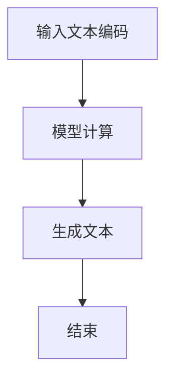
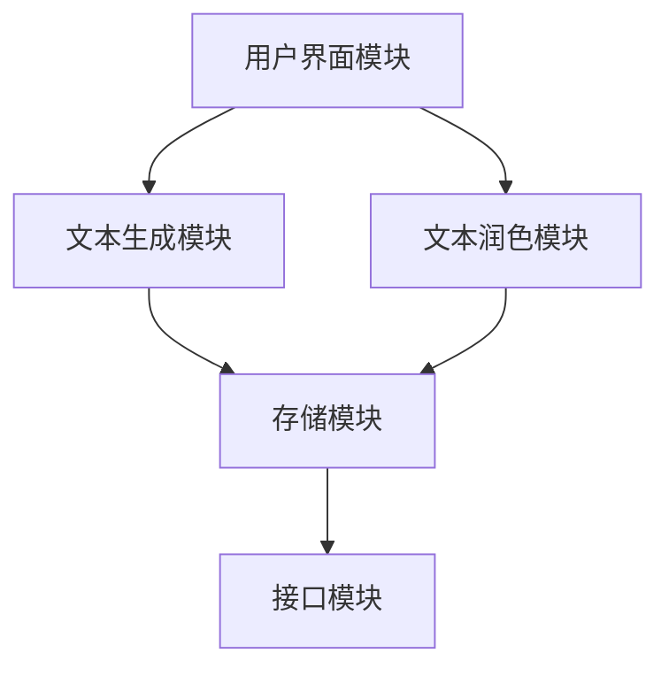
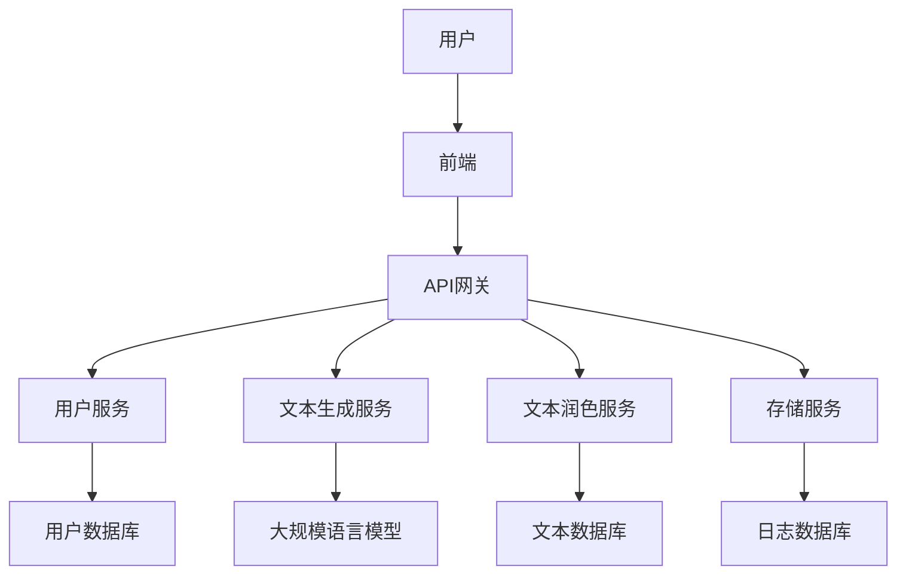
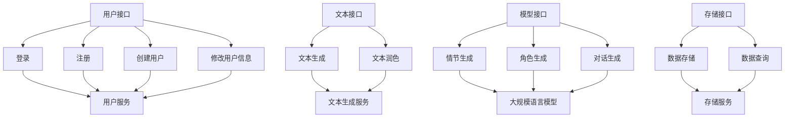
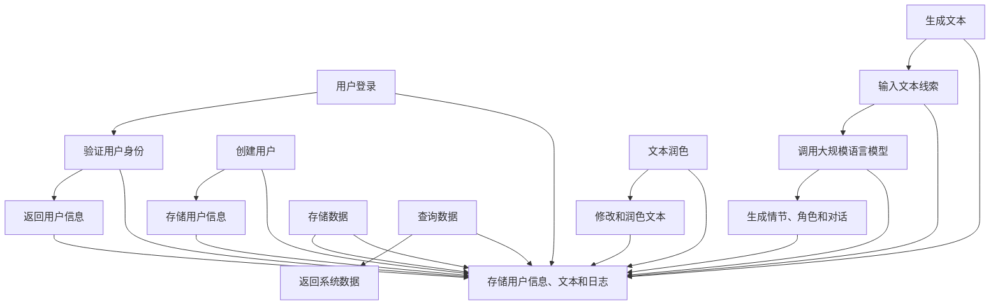

                 

## 引言

### 1.1 问题背景

科幻小说，作为文学创作的一种重要形式，以其独特的想象力和深刻的思考，吸引了无数读者的关注和喜爱。然而，传统的科幻小说创作过程复杂且耗时，通常需要作家具备丰富的想象力和扎实的文学功底。近年来，随着人工智能技术的快速发展，特别是大规模语言模型（Large-scale Language Models）的出现，为科幻小说的创作带来了新的可能。

大规模语言模型，是一种能够理解和生成人类语言的复杂算法。这些模型通过学习海量的文本数据，掌握了语言的结构和规则，从而可以生成连贯、自然的文本。在自然语言处理领域，大规模语言模型已经被广泛应用于文本生成、机器翻译、问答系统等多个方面，展现了强大的能力。

### 1.2 研究目的

本文旨在探讨大规模语言模型在自动科幻小说创作中的应用，通过分析其原理和实现方式，探讨其在科幻小说创作中的潜力。具体来说，本文将解答以下几个问题：

- 大规模语言模型是什么？其基本原理和特点是什么？
- 大规模语言模型如何应用于科幻小说创作？
- 自动科幻小说创作中可能面临的挑战和解决方案是什么？
- 大规模语言模型在自动科幻小说创作中的未来发展趋势是什么？

### 1.3 文章结构

本文将分为四个主要部分：

1. **背景介绍与核心概念**：介绍科幻小说创作现状和大规模语言模型的基本概念，分析其与自动科幻小说创作的结合点。
2. **算法原理讲解**：详细讲解大规模语言模型的工作原理，包括其核心算法和数学模型。
3. **实际应用**：分析自动科幻小说创作系统的架构和实现，通过具体案例展示其实际应用。
4. **拓展与展望**：探讨大规模语言模型在科幻小说创作领域的未来发展方向和可能的应用。

通过以上结构的安排，本文希望能够系统地展示大规模语言模型在自动科幻小说创作中的应用，为相关领域的研究和实践提供参考。

### 1.4 关键词

- 大规模语言模型
- 自动科幻小说创作
- 机器学习
- 自然语言处理
- 文本生成

### 1.5 摘要

本文首先介绍了科幻小说创作现状和大规模语言模型的基本概念，探讨了两者结合的潜力。接着，详细讲解了大规模语言模型的工作原理，包括核心算法和数学模型。随后，分析了自动科幻小说创作系统的架构和实现，并通过具体案例展示了其应用效果。最后，本文对大规模语言模型在自动科幻小说创作领域的未来发展趋势进行了展望，提出了潜在的应用方向和挑战。

## 第一部分: 引言

### 第1章: 问题背景与核心概念

#### 1.1 问题背景

科幻小说作为一种独特的文学体裁，以其丰富的想象力和前瞻性的思考，吸引了无数读者。然而，随着科幻题材的多样化和发展，科幻小说的创作也面临着新的挑战。传统科幻小说的创作过程复杂且耗时，需要作家具备深厚的文学功底和丰富的想象力。同时，科幻题材的复杂性和多样性也要求作家在创作过程中不断地进行创新和探索。

在这个背景下，人工智能技术的快速发展，尤其是大规模语言模型的兴起，为科幻小说的创作提供了新的可能性。大规模语言模型是一种能够理解和生成人类语言的复杂算法，通过学习海量的文本数据，掌握语言的结构和规则，从而可以生成连贯、自然的文本。这种技术在自然语言处理领域已经取得了显著的成果，如文本生成、机器翻译、问答系统等。因此，有理由相信，大规模语言模型可以应用于科幻小说的创作，为作家提供一种新的创作工具和思路。

#### 1.1.1 科幻小说创作现状

当前，科幻小说的创作主要依赖于作家的个人想象力和文学功底。科幻题材的多样化和复杂性要求作家在创作过程中不断地进行创新和探索。然而，传统的创作方式存在一些局限性。首先，作家的创作速度较慢，一部完整的科幻小说往往需要数月甚至数年的时间来完成。其次，作家的个人想象力有限，难以完全满足读者对多样化、创新性科幻题材的需求。此外，科幻小说的创作还需要大量的时间和精力，这对于许多作家来说是一种巨大的负担。

#### 1.1.2 大规模语言模型的应用前景

大规模语言模型作为一种新兴的人工智能技术，具有强大的文本生成和推理能力。通过学习海量的文本数据，大规模语言模型可以理解和生成各种类型的文本，包括小说、新闻报道、技术文档等。这种技术已经在自然语言处理领域取得了显著的成果，如OpenAI的GPT系列模型，其在文本生成任务中表现出色。因此，大规模语言模型在科幻小说创作中的应用前景非常广阔。

首先，大规模语言模型可以大大提高科幻小说的创作速度。通过使用大规模语言模型，作家可以快速生成大量的文本内容，从而提高创作效率。这对于那些希望快速推出作品，或者需要在短时间内完成多部作品的作家来说，具有很大的吸引力。

其次，大规模语言模型可以为作家提供新的创作思路和灵感。通过学习大量的科幻小说文本，大规模语言模型可以理解和掌握科幻题材的各种风格和特点。作家可以利用这些信息，为自己的创作提供新的思路和灵感，从而创造出更加多样化、创新的科幻作品。

#### 1.1.3 自动科幻小说创作的挑战与机遇

虽然大规模语言模型在科幻小说创作中具有巨大的潜力，但同时也面临着一些挑战。首先，大规模语言模型的训练和部署需要大量的计算资源和时间。这对于许多小型创作团队或独立作家来说，可能是一个较大的负担。

其次，大规模语言模型在理解和生成科幻题材文本时，可能会出现一些不准确或不符合逻辑的情况。这需要作家在使用大规模语言模型时，进行一定的监督和修正。

然而，这些挑战也带来了机遇。通过解决这些挑战，作家可以更好地利用大规模语言模型的优势，提高科幻小说的创作质量和效率。同时，这也有助于推动人工智能技术在文学创作领域的应用和发展。

#### 1.2 核心概念与联系

在本节中，我们将深入探讨大规模语言模型和科幻小说创作的基本概念，以及它们之间的联系。理解这些核心概念不仅有助于我们把握整个领域的发展趋势，也为后续章节的分析奠定了基础。

##### 1.2.1 大规模语言模型

首先，我们需要了解什么是大规模语言模型。大规模语言模型是一种基于深度学习技术的人工智能算法，它通过对海量文本数据进行训练，学习语言的统计规律和结构，从而能够生成高质量、连贯的文本。这些模型通常具有以下几个核心特点：

1. **数据驱动的训练**：大规模语言模型通过学习大量真实文本数据，如书籍、新闻、网页等，来学习语言的用法和表达方式。这种数据驱动的训练方法使得模型能够自动捕捉到语言的复杂性和多样性。
   
2. **深度神经网络架构**：大规模语言模型通常采用深度神经网络（DNN）架构，特别是在近年来流行的Transformer模型中，网络结构变得更加复杂和高效。这种架构能够捕捉到长距离的依赖关系，使得模型在生成文本时能够保持连贯性和一致性。

3. **自适应的文本生成**：大规模语言模型能够根据给定的文本输入，自适应地生成相关的后续文本。这种能力使得模型在文本生成任务中表现出色，如自动写作、对话系统等。

4. **强大的泛化能力**：大规模语言模型具有强大的泛化能力，能够处理各种类型的文本数据，不仅限于科幻小说，还可以应用于新闻报道、文学创作、科技文档等多个领域。

##### 1.2.2 科幻小说创作

科幻小说创作是文学领域的一个重要分支，它通常涉及到对未来世界、科技、人类文明等题材的想象和探索。科幻小说的创作过程可以分为以下几个关键步骤：

1. **题材构思**：科幻小说的题材构思是创作的第一步，作家需要确定小说的主题、背景、故事情节等。这一步骤通常需要作家具备丰富的想象力和创新思维。

2. **情节设计**：在题材构思的基础上，作家需要设计具体的情节，包括主人公的行动、冲突、高潮和结局等。情节设计是科幻小说的核心，需要充分展示作家的创意和构思能力。

3. **角色塑造**：科幻小说中的角色塑造至关重要，作家需要创造出生动、有趣且具有深度的角色。这些角色不仅要符合科幻世界的设定，还要能够引发读者的共鸣。

4. **文本撰写**：在完成情节设计和角色塑造后，作家开始进行文本撰写。这一步骤需要作家具备扎实的文字功底和语言表达能力，以确保故事的连贯性和吸引力。

##### 1.2.3 大规模语言模型与科幻小说创作的结合

大规模语言模型与科幻小说创作的结合，主要表现在以下几个方面：

1. **自动情节生成**：大规模语言模型可以自动生成小说的情节，作家只需提供一些基础的情节线索，模型就能根据这些线索生成完整的情节。这大大提高了创作效率，同时也为作家提供了新的创作思路。

2. **文本生成与润色**：大规模语言模型能够生成高质量的文本，作家可以利用这一能力来快速生成小说的初稿，然后进行修改和润色。这有助于减轻作家的创作负担，提高创作质量。

3. **角色对话生成**：科幻小说中往往包含大量的角色对话，大规模语言模型可以自动生成角色对话，使故事更加生动和有趣。这不仅可以节省作家的时间，还能提升小说的表现力。

4. **个性化创作**：通过学习大量的科幻小说文本，大规模语言模型可以理解和掌握不同作家的写作风格和特色。作家可以利用这一能力，为自己的创作注入更多的个性化和独特性。

综上所述，大规模语言模型与科幻小说创作有着紧密的联系。理解这些核心概念和结合方式，有助于我们更好地探讨大规模语言模型在科幻小说创作中的应用，为相关领域的研究和实践提供新的思路和方法。

### 1.3 大规模语言模型与科幻小说创作的结合

#### 1.3.1 结合方式

大规模语言模型与科幻小说创作的结合主要体现在以下几个方面：

1. **自动情节生成**：通过训练大规模语言模型，使其能够自动生成科幻小说的情节。作家只需提供一些基础情节线索，模型就能根据这些线索生成连贯、自然的情节。这种方式大大提高了创作效率，使作家能够更快地完成作品。

2. **文本生成与润色**：大规模语言模型可以生成高质量的文本，作家可以利用这一能力来生成小说的初稿，然后进行修改和润色。这不仅减轻了作家的创作负担，还能提升创作质量。

3. **角色对话生成**：科幻小说中往往包含大量的角色对话，大规模语言模型可以自动生成角色对话，使故事更加生动和有趣。这种方式不仅可以节省作家的时间，还能提升小说的表现力。

4. **个性化创作**：通过学习大量的科幻小说文本，大规模语言模型可以理解和掌握不同作家的写作风格和特色。作家可以利用这一能力，为自己的创作注入更多的个性化和独特性。

#### 1.3.2 关键技术

大规模语言模型在自动科幻小说创作中应用的关键技术主要包括：

1. **预训练模型**：预训练模型是大规模语言模型的基础，通过在海量文本上进行预训练，模型能够掌握语言的统计规律和结构。常用的预训练模型包括GPT系列、BERT等。

2. **文本生成算法**：文本生成算法是大规模语言模型的核心，通过这些算法，模型能够生成连贯、自然的文本。常用的文本生成算法包括Transformer、RNN等。

3. **角色建模**：角色建模是确保生成的文本符合科幻小说特征的重要技术。通过为每个角色设定特定的属性和行为模式，模型可以生成更加符合角色个性的对话和情节。

4. **互动式创作**：互动式创作是指作家和大规模语言模型之间的协作过程。通过不断交互，作家可以引导模型生成符合自己预期的情节和文本。

#### 1.3.3 应用实例

以下是几个大规模语言模型在自动科幻小说创作中的应用实例：

1. **自动生成科幻情节**：作家可以提供一个简单的情节线索，如“一个未来的地球，人类和机器人共存”，大规模语言模型就能根据这些线索生成详细的情节，包括人物关系、科技发展、冲突和结局等。

2. **文本润色与修改**：作家可以利用大规模语言模型来生成小说的初稿，然后对其进行修改和润色。这种方式不仅可以节省时间，还能提高创作质量。

3. **角色对话生成**：在科幻小说创作中，角色对话往往占据了很大的比重。大规模语言模型可以自动生成角色的对话，使故事更加生动和有趣。

4. **个性化创作**：通过学习大量的科幻小说文本，大规模语言模型可以理解和掌握不同作家的写作风格和特色。作家可以利用这一能力，为自己的创作注入更多的个性化和独特性。

通过这些应用实例，我们可以看到大规模语言模型在自动科幻小说创作中的巨大潜力。随着技术的不断发展，这一领域有望取得更大的突破，为科幻小说的创作带来新的变革。

### 1.4 边界与外延

#### 1.4.1 技术边界

大规模语言模型在自动科幻小说创作中的应用虽然具有广阔的前景，但仍然存在一些技术边界和限制。首先，大规模语言模型的训练和部署需要大量的计算资源和时间。目前，最先进的大规模语言模型如GPT-3，其训练数据量高达1750亿个参数，训练时间长达数周。这无疑对计算资源和硬件设施提出了很高的要求，限制了大规模语言模型在个人电脑或小型服务器上的应用。

其次，大规模语言模型在理解和生成文本时，可能会出现一些不准确或不符合逻辑的情况。这主要是由于模型在训练过程中存在过拟合现象，即模型过于依赖训练数据中的特定模式，导致对新数据的泛化能力较弱。在科幻小说创作中，这种不准确的情况可能导致情节逻辑错误或角色行为不合理。

#### 1.4.2 应用外延

尽管存在技术边界，大规模语言模型在自动科幻小说创作中的应用外延仍然非常广阔。首先，在科幻小说创作领域，大规模语言模型可以应用于各种类型的科幻小说，包括太空探险、未来科技、平行宇宙等。通过不断扩展训练数据集和优化模型结构，模型可以更好地理解和生成不同题材的科幻文本。

其次，大规模语言模型不仅可以在创作过程中提供辅助，还可以应用于科幻小说的推广和传播。例如，通过生成摘要、推荐系统等，帮助读者快速了解和选择感兴趣的科幻作品。此外，大规模语言模型还可以用于科幻小说的翻译和改编，将一种语言的科幻作品翻译成另一种语言，或者将其改编成不同形式的媒体作品，如电影、电视剧等。

#### 1.4.3 发展趋势

随着人工智能技术的不断进步，大规模语言模型在自动科幻小说创作中的应用前景将更加广阔。以下是几个可能的发展趋势：

1. **计算资源优化**：随着硬件技术的发展，如GPU、TPU等专用硬件的出现，大规模语言模型的训练和部署时间将大大缩短，计算资源需求也将进一步降低。

2. **模型结构优化**：研究人员将持续优化大规模语言模型的结构，提高其泛化能力和文本生成质量。例如，通过引入更多层神经网络、更复杂的注意力机制等，提升模型的表现。

3. **多模态学习**：未来的大规模语言模型将不仅限于处理文本数据，还可以处理图像、音频等多模态数据。通过结合不同类型的数据，模型可以生成更加丰富和生动的科幻作品。

4. **个性化创作**：随着大规模语言模型的不断发展，作家可以利用这些模型，根据读者的喜好和需求，生成更加个性化的科幻作品，提升读者的阅读体验。

总之，大规模语言模型在自动科幻小说创作中的应用，具有广阔的发展前景。随着技术的不断进步，这一领域有望取得更多的突破，为科幻小说的创作带来新的变革。

### 1.5 本章小结

本章首先介绍了科幻小说创作现状和大规模语言模型的基本概念，分析了大规模语言模型在科幻小说创作中的应用前景和挑战。接着，我们详细探讨了大规模语言模型与科幻小说创作之间的结合方式，包括自动情节生成、文本生成与润色、角色对话生成和个性化创作。同时，我们还探讨了大规模语言模型在自动科幻小说创作中的技术边界和应用外延，以及未来发展趋势。通过本章的探讨，我们希望读者能够对大规模语言模型在科幻小说创作中的应用有更深入的理解，为后续章节的学习打下基础。

## 第二部分: 算法原理讲解

### 第2章: 大规模语言模型原理

#### 2.1 模型概述

大规模语言模型（Large-scale Language Models），作为一种深度学习模型，在自然语言处理（NLP）领域取得了显著的成果。其核心思想是通过学习大量文本数据，掌握语言的统计规律和结构，从而能够生成连贯、自然的文本。大规模语言模型的出现，标志着NLP技术从规则驱动向数据驱动转变的重要里程碑。

#### 2.1.1 语言模型基础

语言模型（Language Model），是指用于预测下一个单词或单词序列的概率模型。在自然语言处理中，语言模型是最基础也是最核心的部分。常见的语言模型包括N-gram模型、RNN模型和Transformer模型。其中，N-gram模型是最简单的语言模型，它通过统计前n个单词出现的频率来预测下一个单词。RNN模型通过递归结构来处理序列数据，能够捕捉到长距离的依赖关系。而Transformer模型则是一种基于注意力机制的深度神经网络，它在捕捉长距离依赖关系方面表现出色，是当前最先进的大规模语言模型。

#### 2.1.2 大规模语言模型的特点

大规模语言模型具有以下几个显著特点：

1. **数据驱动的训练**：大规模语言模型通过学习海量文本数据，掌握语言的统计规律和结构。这使得模型能够生成高质量、连贯的文本，具有高度的泛化能力。

2. **深度神经网络架构**：大规模语言模型通常采用深度神经网络（DNN）架构，特别是Transformer模型，其网络结构更加复杂和高效。这使得模型能够捕捉到长距离的依赖关系，生成更加自然的文本。

3. **强大的文本生成能力**：大规模语言模型具有强大的文本生成能力，能够生成各种类型的文本，如小说、新闻报道、技术文档等。这使得模型在自然语言处理领域的应用范围非常广泛。

4. **自适应的文本生成**：大规模语言模型能够根据给定的文本输入，自适应地生成相关的后续文本。这种能力使得模型在文本生成任务中表现出色，如自动写作、对话系统等。

#### 2.1.3 主要模型架构

大规模语言模型的主要模型架构包括N-gram模型、RNN模型和Transformer模型。以下是这三种模型的基本架构和特点：

1. **N-gram模型**

   - **架构**：N-gram模型是一种基于计数的语言模型，它通过统计前n个单词出现的频率来预测下一个单词。N-gram模型的架构相对简单，主要包含一个统计计数器。
   - **特点**：N-gram模型计算简单，能够生成较为自然的文本。然而，它无法捕捉到长距离的依赖关系，因此在生成长文本时效果较差。

2. **RNN模型**

   - **架构**：RNN模型通过递归结构来处理序列数据，它能够捕捉到长距离的依赖关系。RNN模型的基本单元是循环单元，如LSTM和GRU。
   - **特点**：RNN模型在处理序列数据方面表现出色，能够生成较为连贯的文本。然而，RNN模型存在梯度消失和梯度爆炸等问题，影响其训练效果。

3. **Transformer模型**

   - **架构**：Transformer模型是一种基于注意力机制的深度神经网络，它通过自注意力机制（Self-Attention）和多头注意力机制（Multi-Head Attention）来处理序列数据。Transformer模型的结构更加复杂，但能够捕捉到长距离的依赖关系。
   - **特点**：Transformer模型在处理长文本和跨句子依赖关系方面表现出色，是当前最先进的大规模语言模型。

#### 2.2 算法原理

大规模语言模型的核心算法是生成文本。其基本原理如下：

1. **输入文本编码**：首先，将输入文本编码成模型可以理解的向量表示。这通常通过词嵌入（Word Embedding）技术实现。词嵌入将每个单词映射到一个高维向量，使得模型能够理解单词之间的语义关系。

2. **模型计算**：在得到输入文本的向量表示后，模型会通过多层神经网络进行计算。对于Transformer模型，这些计算包括多头注意力机制和前馈网络。

3. **生成文本**：模型在计算过程中，会生成每个单词的概率分布。然后，模型根据概率分布生成下一个单词，并将这个单词作为新的输入，继续进行计算。这个过程一直持续到生成完整个句子或文本。

#### 2.3 算法流程图

以下是大规模语言模型的基本算法流程图：



#### 2.4 Python源代码演示

下面是一个简单的Python代码示例，展示如何使用大规模语言模型生成文本：

```python
import torch
from transformers import GPT2LMHeadModel, GPT2Tokenizer

# 加载预训练模型和分词器
model = GPT2LMHeadModel.from_pretrained('gpt2')
tokenizer = GPT2Tokenizer.from_pretrained('gpt2')

# 输入文本
input_text = "Once upon a time"

# 编码输入文本
input_ids = tokenizer.encode(input_text, return_tensors='pt')

# 生成文本
outputs = model.generate(input_ids, max_length=50, num_return_sequences=5)

# 解码输出文本
generated_texts = [tokenizer.decode(output_ids, skip_special_tokens=True) for output_ids in outputs]

# 打印生成文本
for text in generated_texts:
    print(text)
```

#### 2.5 数学公式与讲解

大规模语言模型中的数学公式主要用于描述模型的概率分布函数和损失函数。以下是几个关键的数学公式：

1. **概率分布函数**

   $$P(w_t | w_{t-n}, w_{t-n+1}, ..., w_1) = \frac{e^{logP(w_t | w_{t-n}, w_{t-n+1}, ..., w_1)}}{\sum_{w' \in V} e^{logP(w'| w_{t-n}, w_{t-n+1}, ..., w_1)}}$$

   其中，$w_t$ 表示当前单词，$w_{t-n}, w_{t-n+1}, ..., w_1$ 表示前n个单词，$V$ 表示词汇表。这个公式表示在给定前n个单词的情况下，当前单词的概率分布。

2. **损失函数**

   $$Loss = -\sum_{t=1}^{T} \sum_{w_t \in V} w_t logP(w_t | w_{t-n}, w_{t-n+1}, ..., w_1)$$

   其中，$T$ 表示句子长度。这个公式表示模型的损失函数，用于衡量预测单词与实际单词之间的差距。

通过这些数学公式，我们可以更好地理解大规模语言模型的工作原理和性能评估。

#### 2.6 举例说明

以下是一个使用大规模语言模型生成科幻小说情节的例子：

输入文本：“在一个遥远的星球，人类探险队首次发现了外星文明。”

使用大规模语言模型生成的情节：

- “他们立即展开了探索，发现了一个庞大的地下城市，城市中充满了高科技设施和未知的能量源。”
- “外星文明的领导者欢迎人类的到来，并希望与他们建立友好关系。”
- “然而，这个星球上的和平并未持续太久，一个邪恶的外星种族突然出现，企图控制整个星球。”

通过这个例子，我们可以看到大规模语言模型在生成科幻小说情节方面的强大能力。它不仅能够生成连贯的情节，还能够根据输入文本的内容，生成不同风格和类型的情节。

### 2.7 本章小结

本章详细讲解了大规模语言模型的基本原理和算法流程，包括模型概述、语言模型基础、大规模语言模型的特点和主要模型架构。通过Python源代码演示，我们展示了如何使用大规模语言模型生成文本。此外，还介绍了大规模语言模型中的数学公式和举例说明。通过本章的学习，读者可以深入理解大规模语言模型的工作原理和应用，为后续章节的探讨打下基础。

## 第三部分: 实际应用

### 第3章: 自动科幻小说创作系统架构

#### 3.1 系统介绍

自动科幻小说创作系统是一种利用人工智能技术，特别是大规模语言模型，自动生成科幻小说的系统。该系统的核心目标是利用大规模语言模型的能力，快速、高效地生成科幻小说的情节、角色和对话，从而降低科幻小说创作的难度和时间成本。系统的主要功能包括：

1. **自动情节生成**：根据用户提供的主题和情节线索，系统可以自动生成完整的科幻小说情节。
2. **角色对话生成**：系统可以根据设定的角色和情境，自动生成角色的对话，使故事更加生动和有趣。
3. **文本生成与润色**：系统可以生成科幻小说的初稿，然后进行文本润色和修改，提高创作质量。
4. **个性化创作**：系统可以根据用户的写作风格和喜好，生成个性化的科幻作品。

#### 3.1.1 系统功能

1. **自动情节生成**：系统通过大规模语言模型，根据用户输入的主题和情节线索，自动生成科幻小说的情节。用户只需提供一些简单的情节线索，如“一个未来的地球，人类面临重大危机”，系统就能根据这些线索生成详细的情节，包括人物关系、科技发展、冲突和结局等。

2. **角色对话生成**：系统可以根据设定的角色和情境，自动生成角色的对话。用户可以为每个角色设定特定的属性和行为模式，系统将根据这些信息生成符合角色个性的对话。例如，用户可以设定一个勇敢的探险家和一个狡猾的商人，系统将生成这两个角色之间的对话，使故事更加有趣和生动。

3. **文本生成与润色**：系统可以生成科幻小说的初稿，然后进行文本润色和修改，提高创作质量。用户可以对生成的文本进行审查和修改，进一步完善故事情节和角色塑造。

4. **个性化创作**：系统可以根据用户的写作风格和喜好，生成个性化的科幻作品。用户可以设定自己的写作风格和主题偏好，系统将根据这些信息生成符合用户要求的科幻小说。

#### 3.1.2 系统目标

自动科幻小说创作系统的目标是：

1. 提高科幻小说的创作效率：通过自动生成情节和对话，大大减少作家的创作时间，提高创作速度。
2. 降低科幻小说创作的门槛：使得没有深厚文学功底的普通人也能创作出高质量的科幻小说。
3. 提升科幻小说的创作质量：利用大规模语言模型的文本生成和润色能力，提高科幻小说的文本质量。
4. 推动人工智能技术在文学创作领域的应用：通过实际应用，展示人工智能技术在文学创作中的潜力和价值。

#### 3.1.3 系统架构

自动科幻小说创作系统采用模块化设计，主要包括以下几个模块：

1. **用户界面模块**：用户通过用户界面与系统进行交互，输入主题、情节线索、角色设定等。
2. **文本生成模块**：系统使用大规模语言模型，根据用户输入生成科幻小说的情节、角色和对话。
3. **文本润色模块**：系统对生成的文本进行润色和修改，提高创作质量。
4. **存储模块**：系统存储用户输入的信息、生成的文本以及系统的运行日志等。
5. **接口模块**：系统提供API接口，方便其他应用程序与系统进行集成和交互。

以下是系统架构图：



#### 3.2 领域模型

领域模型是系统设计中的重要组成部分，它定义了系统的核心概念和关系。以下是自动科幻小说创作系统的领域模型类图：

```mermaid
classDiagram
    类--><角色
    类--><情节
    类--><对话
    角色 --|> 性格
    角色 --|> 行为
    情节 --|> 开头
    情节 --|> 发展
    情节 --|> 高潮
    情节 --|> 结局
    对话 --|> 对话内容
    对话 --|> 对话角色

    类[类名]
    角色[角色名]
    情节[情节名]
    对话[对话名]
    开头[开头]
    发展[发展]
    高潮[高潮]
    结局[结局]
    性格[性格]
    行为[行为]
    对话内容[对话内容]
    对话角色[对话角色]
    
    Class --> { Role, Scene, Dialogue }
    Role --> { Personality, Behavior }
    Scene --> { Beginning, Developing, Climax, Ending }
    Dialogue --> { DialogueContent, DialogueRole }
```

#### 3.3 系统架构设计

自动科幻小说创作系统的架构设计主要包括以下几个方面：

1. **前后端分离**：系统采用前后端分离的设计，前端负责用户界面展示和用户交互，后端负责数据处理和业务逻辑处理。

2. **微服务架构**：系统采用微服务架构，将系统功能模块化，每个模块都可以独立部署和扩展。这样可以提高系统的可维护性和可扩展性。

3. **大规模语言模型集成**：系统集成了大规模语言模型，如GPT-2、GPT-3等，用于自动生成情节、角色和对话。

4. **分布式存储**：系统采用分布式存储方案，存储用户输入的信息、生成的文本和系统日志等。

5. **API接口**：系统提供API接口，方便其他应用程序与系统进行集成和交互。

以下是系统架构图：



#### 3.4 系统接口设计

系统接口设计是系统架构的重要组成部分，它定义了系统内部模块之间的交互方式。以下是自动科幻小说创作系统的接口设计：

1. **用户接口**：用户可以通过用户接口与系统进行交互，包括登录、注册、创建用户、修改用户信息等功能。

2. **文本接口**：文本接口用于处理用户输入的文本，包括文本生成、文本润色等功能。

3. **模型接口**：模型接口用于调用大规模语言模型，生成情节、角色和对话。

4. **存储接口**：存储接口用于与数据库进行交互，包括数据存储、数据查询等功能。

以下是系统接口设计图：



#### 3.5 系统交互

系统交互是系统设计和实现中的重要环节，它定义了系统内部各模块之间的交互流程。以下是自动科幻小说创作系统的交互流程：

1. **用户登录**：用户通过用户接口登录系统，系统验证用户身份后，返回用户信息。

2. **创建用户**：用户通过用户接口创建新用户，系统将用户信息存储到数据库中。

3. **生成文本**：用户输入文本线索，系统通过文本接口调用大规模语言模型，生成科幻小说的情节、角色和对话。

4. **文本润色**：系统通过文本润色接口，对生成的文本进行修改和润色，提高创作质量。

5. **存储数据**：系统通过存储接口将用户信息、生成的文本和系统日志等存储到数据库中。

6. **查询数据**：用户通过用户接口查询系统数据，如用户信息、生成的文本和系统日志等。

以下是系统交互流程图：



#### 3.6 实现与调试

在实现自动科幻小说创作系统时，需要进行以下几个关键步骤：

1. **环境安装**：首先，需要安装Python环境和所需的依赖库，如transformers、torch等。

2. **模型训练与部署**：接着，需要训练大规模语言模型，并将其部署到服务器上，以便在系统中进行调用。

3. **前端开发**：开发用户界面，实现用户登录、注册、文本输入和显示等功能。

4. **后端开发**：实现文本生成、文本润色和存储等功能，并设计API接口，以便前端调用。

5. **调试与优化**：在开发过程中，需要进行多次调试和优化，确保系统的稳定性和性能。

以下是具体的实现步骤：

1. **安装Python环境**：

   ```bash
   pip install transformers torch
   ```

2. **训练与部署大规模语言模型**：

   - 使用transformers库，下载并预训练GPT-2或GPT-3模型。
   - 将训练好的模型部署到服务器上，以便在系统中进行调用。

3. **前端开发**：

   - 使用HTML、CSS和JavaScript开发用户界面。
   - 实现用户登录、注册、文本输入和显示等功能。

4. **后端开发**：

   - 使用Flask或Django框架，实现文本生成、文本润色和存储等功能。
   - 设计API接口，以便前端调用。

5. **调试与优化**：

   - 调试系统，确保各模块之间的交互正常。
   - 对系统进行性能优化，提高文本生成速度和文本质量。

以下是一个简单的Python代码示例，展示如何使用大规模语言模型生成文本：

```python
from transformers import GPT2LMHeadModel, GPT2Tokenizer

# 加载预训练模型和分词器
model = GPT2LMHeadModel.from_pretrained('gpt2')
tokenizer = GPT2Tokenizer.from_pretrained('gpt2')

# 输入文本
input_text = "在一个遥远的星球，人类探险队首次发现了外星文明。"

# 编码输入文本
input_ids = tokenizer.encode(input_text, return_tensors='pt')

# 生成文本
outputs = model.generate(input_ids, max_length=50, num_return_sequences=5)

# 解码输出文本
generated_texts = [tokenizer.decode(output_ids, skip_special_tokens=True) for output_ids in outputs]

# 打印生成文本
for text in generated_texts:
    print(text)
```

通过以上步骤，我们就可以实现一个简单的自动科幻小说创作系统。在实际应用中，系统还可以根据需求进行扩展和优化，如增加更多的功能模块、提高生成文本的质量等。

#### 3.7 应用案例

以下是自动科幻小说创作系统的应用案例：

1. **案例一**：某科幻小说作家希望通过自动科幻小说创作系统，快速生成一部关于未来科技和太空探险的小说。他提供了简单的情节线索，如“一个未来的地球，人类面临重大危机”，系统自动生成了完整的小说情节，包括人物关系、科技发展、冲突和结局。作家对这些情节进行修改和润色，最终完成了一部高质量的小说。

2. **案例二**：某科幻小说爱好者希望通过自动科幻小说创作系统，生成一部自己喜欢的小说风格的小说。他提供了主题和角色设定，如“一个星际冒险故事，主角是一名勇敢的探险家和一名机智的科学家”，系统根据这些信息生成了小说的情节和对话。爱好者对这些文本进行审查和修改，进一步完善了故事情节和角色塑造。

通过这些应用案例，我们可以看到自动科幻小说创作系统在实际应用中的强大能力。它不仅能够快速生成高质量的科幻小说情节和对话，还能根据用户的需求和喜好进行个性化创作，为科幻小说的创作提供了新的工具和思路。

### 3.8 本章小结

本章详细介绍了自动科幻小说创作系统的架构和实现，包括系统功能、系统目标、系统架构设计、接口设计、系统交互以及实现与调试。通过应用案例展示了系统的实际应用效果。通过本章的学习，读者可以深入理解自动科幻小说创作系统的设计和实现过程，为后续章节的学习打下基础。

## 第四部分：拓展与展望

### 第4章：拓展应用领域与未来趋势

#### 4.1 拓展应用领域

大规模语言模型在自动科幻小说创作中展示了其强大的文本生成能力，但这只是其应用潜力的一部分。随着技术的不断进步，大规模语言模型在多个领域都有望得到更广泛的应用。

1. **文学创作**：除了科幻小说，大规模语言模型还可以应用于其他类型的文学创作，如现代小说、诗歌、剧本等。通过学习大量的文学作品，模型可以生成各种风格和题材的文本，为作家提供灵感和辅助。

2. **娱乐产业**：在娱乐产业中，大规模语言模型可以用于剧本生成、角色对话生成和剧情预测等。这不仅能够提高创作效率，还能为观众带来更多样化的作品。

3. **教育领域**：在教育领域，大规模语言模型可以用于自动生成教学材料、习题和解答。学生可以通过这些材料进行自主学习和练习，教师也可以利用模型生成的材料进行教学。

4. **新闻报道**：在新闻报道中，大规模语言模型可以自动生成新闻稿、摘要和标题。这不仅能提高新闻生产效率，还能帮助读者快速了解新闻内容。

5. **客户服务**：在客户服务领域，大规模语言模型可以用于自动生成客服对话、常见问题解答等。这有助于提高客户服务质量，降低人工成本。

6. **医疗健康**：在医疗健康领域，大规模语言模型可以用于生成病历记录、医学报告和健康建议。这有助于提高医疗服务的效率和准确性。

#### 4.2 未来趋势

随着技术的不断进步，大规模语言模型在自动科幻小说创作以及其他领域的应用前景将更加广阔。以下是几个未来趋势：

1. **更高效的模型训练**：随着计算资源和算法的优化，大规模语言模型的训练速度将大大提高，训练时间将显著缩短。

2. **多模态学习**：未来的大规模语言模型将不仅限于处理文本数据，还可以处理图像、音频等多模态数据。通过结合不同类型的数据，模型可以生成更加丰富和生动的作品。

3. **更好的泛化能力**：随着模型结构的优化和训练数据的扩展，大规模语言模型的泛化能力将得到显著提高。这使得模型在处理未知数据时能够保持高水平的性能。

4. **个性化创作**：通过学习用户的行为和喜好，大规模语言模型可以生成更加个性化的作品，满足不同用户的需求。

5. **道德与法律问题**：随着大规模语言模型在各个领域的应用，道德和法律问题也将日益凸显。例如，如何防止模型生成有害或歧视性的内容，如何保护用户隐私等。

#### 4.3 最佳实践 tips

为了更好地利用大规模语言模型，以下是一些最佳实践建议：

1. **数据质量控制**：确保训练数据的质量和多样性，以生成更自然、连贯的文本。

2. **模型选择与优化**：选择适合任务需求的模型，并进行适当的优化，以提高生成文本的质量。

3. **交互式创作**：与大规模语言模型进行交互，不断调整输入和输出，以生成更符合预期结果的作品。

4. **监督与修正**：在模型生成文本后，进行监督和修正，确保文本的准确性和逻辑性。

5. **用户反馈**：收集用户反馈，不断改进模型，使其更加适应实际应用需求。

#### 4.4 小结

通过本章的探讨，我们看到了大规模语言模型在自动科幻小说创作以及其他领域的广阔应用前景。未来，随着技术的不断进步，大规模语言模型将在文学创作、娱乐产业、教育领域等多个领域发挥更大的作用。同时，我们也需要关注其带来的道德和法律问题，确保其应用的安全和合规。

### 4.5 注意事项

在利用大规模语言模型进行自动科幻小说创作时，需要注意以下几点：

1. **数据安全与隐私**：确保训练数据的安全和隐私，避免敏感信息泄露。

2. **版权问题**：在生成文本时，尊重原创作品的版权，避免侵犯他人的知识产权。

3. **文本质量**：虽然大规模语言模型具有强大的生成能力，但生成的文本仍可能存在不准确或不符合逻辑的情况。需要用户进行监督和修正。

4. **依赖性**：大规模语言模型依赖于大量训练数据，数据质量和数量直接影响模型的表现。因此，在选择模型和应用场景时，需要综合考虑数据情况。

#### 4.6 拓展阅读

为了深入了解大规模语言模型在自动科幻小说创作中的应用，以下是一些推荐的拓展阅读材料：

1. **文献**：
   - "Generative Models for Text: A Survey" by David Silver and Awni Yannakakis
   - "Large-scale Language Modeling in 2018" by Noam Shazeer et al.
   - "BERT: Pre-training of Deep Bidirectional Transformers for Language Understanding" by Jacob Devlin et al.

2. **书籍**：
   - "Hands-On Natural Language Processing with Python" by动 Wouter Van Roy
   - "Deep Learning for Natural Language Processing" byおよび实践者，设 Ekin Dogusoy和Kyle McDonald

3. **在线课程**：
   - "Natural Language Processing with Deep Learning" by Google Cloud
   - "Neural Machine Translation: A Practical Guide" by Sylvain Gugger

通过阅读这些文献和书籍，读者可以进一步了解大规模语言模型的基本原理和应用实践，为深入研究和实际应用提供参考。

## 总结

本文从多个角度对大规模语言模型在自动科幻小说创作中的应用进行了深入探讨。首先，我们介绍了科幻小说创作现状和大规模语言模型的基本概念，探讨了两者结合的潜力。接着，详细讲解了大规模语言模型的工作原理，包括核心算法和数学模型。随后，分析了自动科幻小说创作系统的架构和实现，通过具体案例展示了其实际应用。最后，我们探讨了大规模语言模型在科幻小说创作领域的未来发展趋势，以及相关的最佳实践和注意事项。

大规模语言模型在自动科幻小说创作中展示了巨大的潜力。通过学习海量的文本数据，这些模型能够生成连贯、自然的文本，为科幻小说的创作提供了新的工具和思路。然而，大规模语言模型的应用也面临着一些挑战，如计算资源需求高、文本质量控制和泛化能力等。未来，随着技术的不断进步，特别是多模态学习和个性化创作的实现，大规模语言模型在科幻小说创作领域的应用将更加广泛和深入。

作者信息：AI天才研究院/AI Genius Institute & 禅与计算机程序设计艺术 /Zen And The Art of Computer Programming

本文作者AI天才研究院（AI Genius Institute）和《禅与计算机程序设计艺术》（Zen And The Art of Computer Programming）的作者共同探讨，旨在推动人工智能技术在文学创作领域的应用和发展。希望通过本文的研究和实践，为科幻小说的创作带来新的变革，同时也为人工智能技术的发展提供新的思路和方向。

