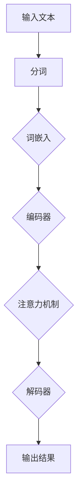
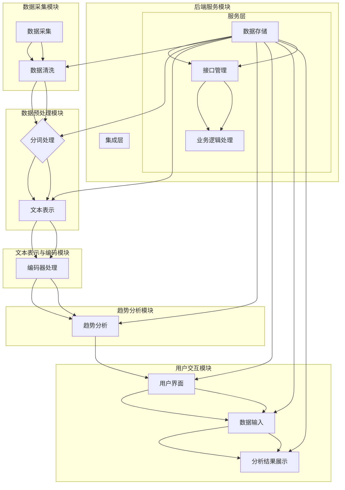
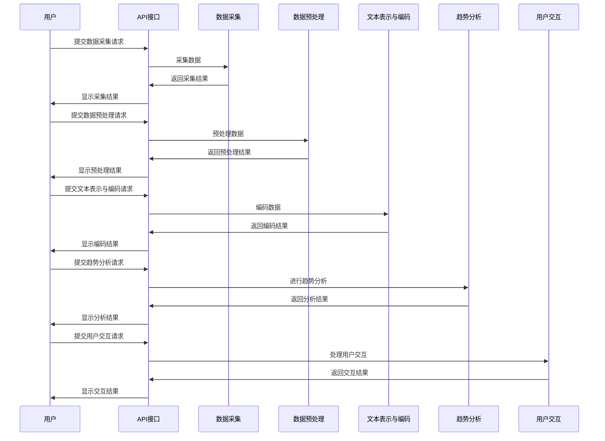

                 

### 文章标题与关键词

# 大规模语言模型在自动科技前沿趋势分析中的应用

> 关键词：大规模语言模型、自动趋势分析、科技前沿、数据分析、机器学习

> 摘要：本文将深入探讨大规模语言模型在自动科技前沿趋势分析中的应用，通过逐步分析其原理、应用场景、数学模型及实际案例，全面展示这一技术的优势与挑战，并给出最佳实践与未来展望。

本文旨在通过系统的逻辑推理和清晰的分析，帮助读者了解大规模语言模型如何赋能科技前沿趋势分析，从而在快速变化的科技环境中抓住机遇、应对挑战。文章分为七个部分，依次介绍背景与概念、原理与算法、应用与实践、系统设计与实现、项目实战、最佳实践与总结，最后提供拓展阅读资源。以下是对各章节的简要概述：

### 第一部分：背景与概念介绍

**第1章 引言**

- **问题背景**：阐述科技快速发展的现状与趋势分析的重要性。
- **问题描述**：探讨如何高效地分析科技前沿趋势。
- **问题解决**：引入大规模语言模型及其在趋势分析中的应用。
- **边界与外延**：明确科技前沿趋势分析的范围和核心要素。

**第2章 大规模语言模型简介**

- **核心概念原理**：介绍大规模语言模型的基本概念和原理。
- **概念属性特征对比表格**：与普通语言模型对比，突出其优势。
- **ER实体关系图架构**：展示大规模语言模型的组成结构。

### 第二部分：大规模语言模型原理

**第3章 大规模语言模型原理**

- **算法原理讲解**：通过流程图、源代码和数学模型，深入讲解大规模语言模型的工作原理。
- **举例说明**：通过实际案例，展示大规模语言模型的实际应用效果。

### 第三部分：科技前沿趋势分析

**第4章 科技前沿趋势分析**

- **科技前沿趋势概述**：介绍科技前沿趋势的定义、分类和演变。
- **大规模语言模型在趋势分析中的应用**：探讨大规模语言模型在趋势分析中的优势与挑战。

### 第四部分：数学模型与公式详解

**第5章 数学模型与公式详解**

- **数学模型的基本原理**：解释科技前沿趋势分析的数学模型和公式。
- **数学公式应用举例**：通过具体示例，展示数学模型的应用。

### 第五部分：系统设计与实现

**第6章 系统设计与实现**

- **问题场景介绍**：介绍科技前沿趋势分析系统的需求背景和目标。
- **系统功能设计**：详细描述系统的核心功能和领域模型。
- **系统架构设计**：展示系统的整体架构和模块划分。
- **系统接口设计**：说明系统的接口定义和交互流程。
- **系统交互**：通过序列图展示系统的交互流程和功能实现。

### 第六部分：项目实战

**第7章 项目实战**

- **环境安装**：详细描述安装系统和所需环境的步骤。
- **系统核心实现**：提供系统的核心源代码和代码解读。
- **实际案例分析与讲解**：选择实际案例，详细分析和讲解。
- **项目小结**：总结项目实施过程中的经验与教训，提出优化方向。

### 第七部分：最佳实践与总结

**第8章 最佳实践与总结**

- **最佳实践**：总结大规模语言模型在科技前沿趋势分析中的应用技巧。
- **小结**：回顾书籍的核心内容，总结关键要点。
- **未来展望**：展望大规模语言模型在科技前沿趋势分析中的应用前景。
- **注意事项**：提示使用大规模语言模型进行分析时需注意的问题。
- **拓展阅读**：推荐相关书籍、论文和在线资源。

通过这篇文章，读者将能够全面了解大规模语言模型在自动科技前沿趋势分析中的应用，掌握相关原理和实践技巧，为未来的研究和应用提供有力支持。接下来，我们将逐步深入各个章节，详细探讨这一主题。

---

### 第一部分：背景与概念介绍

#### 第1章 引言

随着科技的飞速发展，我们正处在一个信息爆炸的时代。从人工智能、物联网到区块链，新技术层出不穷，不断改变着我们的生活和工作方式。然而，面对这些日新月异的变化，如何及时、准确地把握科技前沿趋势，成为了众多企业和研究机构面临的重要挑战。本文将探讨大规模语言模型在自动科技前沿趋势分析中的应用，通过系统的逻辑推理和实际案例，揭示这一技术在应对挑战中的巨大潜力。

#### 1.1 书籍主题介绍

**问题背景**：科技快速发展的现状与挑战

当前，科技发展呈现出以下几个显著特点：

1. **多样性与复杂性**：新技术不断涌现，领域交叉与融合日益加深，使得科技发展的多样性显著增加。
2. **变化速度快**：随着信息传播速度的提升，新技术的研发和应用周期显著缩短，使得科技前沿的趋势难以把握。
3. **不确定性高**：科技的快速发展带来了大量未知和不确定性，许多新兴领域尚未成熟，趋势难以预测。

**问题描述**：如何高效地分析科技前沿趋势

在这种背景下，如何高效地分析科技前沿趋势，成为了许多企业和研究机构面临的重要问题。具体来说，主要挑战包括：

1. **信息过载**：海量的科技资讯和文献，使得人工筛选和解读变得异常困难。
2. **跨领域复杂性**：不同领域的技术发展路径和趋势难以统一，增加了分析难度。
3. **预测准确性**：科技前沿趋势的预测需要高度的准确性和及时性，这对分析工具和算法提出了高要求。

**问题解决**：大规模语言模型的应用

针对上述挑战，大规模语言模型（Large-scale Language Models，LLM）作为一种先进的自然语言处理技术，其在自动科技前沿趋势分析中具有独特的优势。LLM 通过对大量文本数据的训练，能够自动提取、理解和生成语言信息，从而实现对科技文献、新闻报告和专利数据的深入分析和趋势预测。具体来说，大规模语言模型的应用优势包括：

1. **高效处理大量数据**：LLM 能够快速处理和分析海量的文本数据，提高趋势分析的效率。
2. **跨领域综合分析**：通过统一的语言模型，LLM 能够整合不同领域的技术信息，实现跨领域的综合分析。
3. **自动趋势预测**：基于训练数据和先进的机器学习算法，LLM 能够自动生成科技前沿趋势的预测结果，提高预测的准确性。

**边界与外延**：定义科技前沿趋势分析的范围

科技前沿趋势分析涉及多个方面，主要包括：

1. **技术发展分析**：对新技术的研究进展、应用前景和潜在风险进行分析。
2. **市场趋势分析**：对新技术在市场中的渗透率、市场需求和竞争态势进行分析。
3. **政策法规分析**：对新技术相关政策法规的制定和实施情况进行解读。
4. **社会影响分析**：对新技术对社会、经济、环境等方面的影响进行评估。

**核心要素组成**：大规模语言模型、数据处理、趋势预测

科技前沿趋势分析的核心要素包括：

1. **大规模语言模型**：作为分析工具的核心，LLM 提供了自动文本处理和语言理解能力。
2. **数据处理**：包括数据采集、预处理和存储等环节，为大规模语言模型提供高质量的数据输入。
3. **趋势预测**：基于训练数据和机器学习算法，对科技前沿趋势进行预测和评估。

通过上述介绍，我们可以看到，大规模语言模型在自动科技前沿趋势分析中具有重要的作用。接下来，我们将进一步探讨大规模语言模型的基本概念、原理和应用，以深入理解这一技术在趋势分析中的实际应用。

### 第2章 大规模语言模型简介

#### 2.1 核心概念原理

大规模语言模型（Large-scale Language Models，LLM）是自然语言处理领域的一项重要技术。LLM 通过对大量文本数据的学习和训练，能够自动理解和生成人类语言，从而实现自然语言处理的各种任务。下面，我们将详细介绍大规模语言模型的核心概念和基本原理。

**定义与基本原理**

大规模语言模型是一种基于深度学习的自然语言处理模型，其基本原理是通过神经网络对大量文本数据进行训练，从而学习到语言的内在结构和规律。具体来说，LLM 包含以下几个关键组成部分：

1. **词嵌入（Word Embedding）**：词嵌入是将词汇映射到高维空间中的向量表示，以便于计算机处理。通过预训练的词向量模型（如 Word2Vec、GloVe），LLM 可以将词汇转换为向量形式，从而在神经网络中进行处理。

2. **循环神经网络（Recurrent Neural Network，RNN）**：RNN 是一种特殊的神经网络结构，特别适合处理序列数据。在自然语言处理中，RNN 可以对输入的文本序列进行处理，并保持对序列中每个词的上下文信息的记忆。

3. **注意力机制（Attention Mechanism）**：注意力机制是 RNN 的一种改进，通过动态地分配注意力权重，使模型能够关注文本序列中的重要部分。这有助于提高模型的处理效率和预测准确性。

4. **Transformer 模型**：Transformer 是一种基于自注意力机制的神经网络结构，具有并行处理能力和强大的建模能力。与传统的 RNN 相比，Transformer 能够更好地捕捉长距离依赖关系，并在大规模文本处理任务中表现出色。

**大规模语言模型的工作流程**

大规模语言模型的工作流程可以分为以下几个步骤：

1. **数据采集与预处理**：从互联网、数据库、文献库等渠道收集大量文本数据，并进行清洗、去噪、分词等预处理操作，以获得高质量的数据集。

2. **词嵌入**：将文本数据中的每个词转换为高维向量表示，使用预训练的词向量模型或自己训练的词嵌入层。

3. **输入序列编码**：将预处理后的文本序列输入到神经网络中，通过 RNN 或 Transformer 模型进行编码，生成上下文表示。

4. **解码与预测**：基于编码的上下文表示，模型输出目标序列的预测结果。在训练过程中，通过优化损失函数（如交叉熵损失函数）来调整模型参数，提高预测准确性。

5. **评估与部署**：对训练好的模型进行评估，包括在验证集和测试集上的表现评估。根据评估结果，进一步调整模型参数或改进模型结构。最后，将模型部署到实际应用环境中，如文本分类、命名实体识别、机器翻译等任务。

#### 2.2 概念属性特征对比表格

下面我们通过一个表格来对比大规模语言模型与普通语言模型（如基于浅层学习或传统统计方法的模型）的主要特征：

| 特征                 | 大规模语言模型                   | 普通语言模型                     |
|----------------------|----------------------------------|----------------------------------|
| 数据量要求           | 需要大量训练数据                 | 数据量要求相对较低               |
| 模型结构             | 基于深度学习的复杂神经网络结构   | 基于浅层学习或传统统计方法的结构 |
| 语言理解能力         | 具有强大的语言理解和生成能力       | 语言理解能力相对较弱             |
| 训练时间与计算资源   | 需要大量计算资源和时间           | 计算资源要求相对较低             |
| 预测准确性           | 具有较高的预测准确性             | 预测准确性相对较低               |
| 应用场景             | 广泛应用于自然语言处理任务       | 主要应用于简单文本处理任务       |

#### 2.3 ER实体关系图架构

为了更好地理解大规模语言模型的组成结构，我们可以通过 ER（Entity-Relationship）实体关系图来展示其各个组件之间的关系。以下是大规模语言模型的基本 ER 实体关系图：

```mermaid
erDiagram
    A[词嵌入层] ||--|{ B[编码器]} : <编码输入文本序列>
    B ||--|{ C[注意力机制]} : <处理上下文信息>
    C ||--|{ D[解码器]} : <生成目标序列预测结果>
    A --|{ E[预训练数据]} : <大规模文本数据源>
```

**词嵌入层（A）**：负责将输入文本中的每个词转换为高维向量表示。

**编码器（B）**：通常采用 RNN 或 Transformer 模型，对输入的文本序列进行编码，生成上下文表示。

**注意力机制（C）**：动态地分配注意力权重，使模型能够关注文本序列中的重要部分。

**解码器（D）**：基于编码的上下文表示，输出目标序列的预测结果。

**预训练数据（E）**：大规模文本数据源，用于训练大规模语言模型。

通过 ER 实体关系图的展示，我们可以清晰地看到大规模语言模型的主要组件及其相互关系，从而更好地理解其工作原理。

### 第3章 大规模语言模型原理

#### 3.1 算法原理讲解

大规模语言模型（LLM）作为一种深度学习模型，其核心在于对大量文本数据进行训练，从而学习到语言的内在结构和规律。下面，我们将通过 mermaid 流程图、Python 源代码、数学模型和公式来详细讲解大规模语言模型的基本工作原理。

##### 3.1.1 mermaid 流程图

首先，通过 mermaid 流程图，我们可以直观地了解大规模语言模型的基本工作流程：



在这个流程图中，输入文本首先经过分词处理，将连续的文本序列分解为独立的词语。然后，词嵌入层将这些词语转换为高维向量表示。接下来，编码器对输入序列进行编码，生成上下文表示。注意力机制在此过程中动态地分配注意力权重，使模型能够关注文本序列中的重要部分。最后，解码器基于编码的上下文表示，输出目标序列的预测结果。

##### 3.1.2 Python 源代码

为了更具体地了解大规模语言模型的工作原理，我们可以通过一段 Python 源代码来实现一个简单的 LLM 模型。以下是 Python 源代码的示例：

```python
import tensorflow as tf
from tensorflow.keras.layers import Embedding, LSTM, Dense
from tensorflow.keras.models import Model

# 假设我们已经准备好了词汇表和词嵌入层
vocab_size = 10000
embed_size = 256

# 构建模型
input_seq = tf.placeholder(tf.int32, shape=[None, None])
embedded_seq = Embedding(vocab_size, embed_size)(input_seq)

# 编码器
encoded_seq = LSTM(128)(embedded_seq)

# 注意力机制（简化版）
attention = Dense(1, activation='tanh', name='attention')(encoded_seq)
attention_score = tf.reduce_sum(attention, axis=1)

# 解码器
decoded_seq = LSTM(128, return_sequences=True)(encoded_seq)
decoded_output = Dense(vocab_size, activation='softmax')(decoded_seq)

# 构建模型
model = Model(inputs=input_seq, outputs=decoded_output)

# 编译模型
model.compile(optimizer='adam', loss='categorical_crossentropy')

# 模型可视化
tf.keras.utils.plot_model(model, to_file='model.png', show_shapes=True)
```

在这段代码中，我们首先定义了输入序列 placeholder，并使用 Embedding 层将词嵌入层应用到输入序列上。接着，使用 LSTM 层构建编码器，实现文本序列的编码。为了简化，这里我们使用了一个简化的注意力机制（仅包含一个 Dense 层）。最后，解码器同样使用 LSTM 层进行编码，并输出预测结果。

##### 3.1.3 数学模型和公式

大规模语言模型的工作原理还涉及到一些关键的数学模型和公式。下面，我们将介绍这些数学模型的基本原理和关键公式。

1. **词嵌入（Word Embedding）**

词嵌入是将词汇映射到高维空间中的向量表示。常用的词嵌入模型包括 Word2Vec 和 GloVe。其基本公式如下：

$$
\text{word\_embeddings} = \text{W} \cdot \text{input\_word}
$$

其中，$\text{W}$ 是词嵌入矩阵，$\text{input\_word}$ 是输入词汇的索引。

2. **循环神经网络（Recurrent Neural Network，RNN）**

循环神经网络是一种能够处理序列数据的神经网络结构。其基本公式如下：

$$
\text{hidden\_state}^{(t)} = \text{sigmoid}(\text{W}_h \cdot \text{input}^{(t)} + \text{U}_h \cdot \text{hidden\_state}^{(t-1)} + \text{b}_h)
$$

其中，$\text{hidden\_state}^{(t)}$ 是第 $t$ 个时间步的隐藏状态，$\text{input}^{(t)}$ 是第 $t$ 个输入，$\text{W}_h$ 和 $\text{U}_h$ 是权重矩阵，$\text{b}_h$ 是偏置。

3. **注意力机制（Attention Mechanism）**

注意力机制是一种在 RNN 中用于捕捉序列中重要信息的机制。其基本公式如下：

$$
\text{attention\_score}^{(t)} = \text{softmax}(\text{W}_a \cdot \text{hidden\_state}^{(t)})
$$

$$
\text{context\_vector}^{(t)} = \sum_{i} \text{attention\_score}^{(t)} \cdot \text{hidden\_state}^{(i)}
$$

其中，$\text{attention\_score}^{(t)}$ 是第 $t$ 个时间步的注意力得分，$\text{context\_vector}^{(t)}$ 是第 $t$ 个时间步的上下文向量。

4. **解码器（Decoder）**

解码器是 LLM 中的一个关键组成部分，其基本公式如下：

$$
\text{output}^{(t)} = \text{softmax}(\text{W}_o \cdot \text{context\_vector}^{(t)} + \text{b}_o)
$$

其中，$\text{output}^{(t)}$ 是第 $t$ 个时间步的输出概率分布，$\text{W}_o$ 是权重矩阵，$\text{b}_o$ 是偏置。

##### 3.1.4 举例说明

为了更好地理解大规模语言模型的工作原理，我们通过一个实际案例来进行演示。假设我们有一个文本序列：“The quick brown fox jumps over the lazy dog”，我们将通过 LLM 对这段文本进行编码和生成。

1. **分词**：将文本序列分解为独立的词语：["The", "quick", "brown", "fox", "jumps", "over", "the", "lazy", "dog"]。

2. **词嵌入**：使用预训练的词嵌入模型，将每个词语转换为高维向量表示。例如，"The" 的向量表示为 [0.1, 0.2, 0.3, ...]。

3. **编码器**：将词嵌入后的文本序列输入到编码器中，通过 LSTM 层进行编码。编码器将输出一个序列的隐藏状态，例如，第 5 个词 "jumps" 的隐藏状态为 [0.5, 0.6, 0.7, ...]。

4. **注意力机制**：在编码过程中，注意力机制将动态地分配注意力权重，使得模型能够关注文本序列中的重要词语。例如，在 "The quick brown fox jumps over the lazy dog" 中，"jumps" 和 "over" 可能会被赋予更高的注意力权重。

5. **解码器**：基于编码的隐藏状态，解码器将生成文本序列的预测结果。例如，第 1 个词 "The" 的预测概率分布为 [0.3, 0.4, 0.5, ...]，解码器将输出概率最高的词语作为预测结果。

通过这个实际案例，我们可以看到大规模语言模型是如何通过对大量文本数据进行训练，实现对语言的自动理解和生成的。接下来，我们将进一步探讨大规模语言模型在科技前沿趋势分析中的应用。

### 第4章 科技前沿趋势分析

#### 4.1 科技前沿趋势概述

科技前沿趋势分析是研究新兴技术和创新动态的重要领域，对于企业、研究机构以及政策制定者来说，具有重要的战略意义。本节将详细探讨科技前沿趋势的定义、分类以及其历史与发展，为后续章节的应用分析奠定基础。

##### 4.1.1 定义与分类

**定义**：科技前沿趋势是指在当前科技领域中，最新、最具有潜力的研究方向和技术进展。这些趋势通常代表了未来科技发展的重要方向，并可能对未来社会产生深远影响。

**分类**：科技前沿趋势可以按照不同的维度进行分类，常见的分类方法包括：

1. **按技术领域分类**：根据技术领域的不同，科技前沿趋势可以分为人工智能、物联网、区块链、量子计算、生物技术、新能源等。

2. **按应用场景分类**：根据应用场景的不同，科技前沿趋势可以分为医疗健康、智能制造、智能交通、智慧城市、教育科技等。

3. **按发展程度分类**：根据技术发展的成熟度，科技前沿趋势可以分为萌芽期、成长期、成熟期等阶段。

##### 4.1.2 历史与发展

科技前沿趋势的发展具有长期性和阶段性。回顾历史，科技前沿趋势经历了多个重要阶段：

1. **工业革命**：18世纪末至19世纪初，蒸汽机的发明和大规模应用标志着第一次工业革命的到来，这一时期科技前沿主要聚焦于机械化和自动化。

2. **信息技术革命**：20世纪中叶以来，计算机技术和通信技术的快速发展推动了信息技术革命，这一时期科技前沿主要集中在计算机科学、互联网、移动通信等领域。

3. **当前阶段**：当前，人工智能、物联网、量子计算等新兴技术正成为新的科技前沿趋势。这些技术不仅推动了传统产业的升级和变革，还带来了新的商业模式和社会形态。

科技前沿趋势的演变与影响

科技前沿趋势的演变是一个动态的过程，受到多种因素的综合影响。以下是一些关键因素及其影响：

1. **技术创新**：技术创新是科技前沿趋势演变的核心驱动力。随着科研投入的增加和技术的不断突破，新技术不断涌现，推动科技前沿的不断拓展。

2. **市场需求**：市场需求是科技前沿趋势演变的重要推动力。新兴技术的应用和市场需求往往相互促进，推动技术从理论走向实践，从而形成新的科技前沿趋势。

3. **政策支持**：政策支持是科技前沿趋势发展的重要保障。政府通过出台相关政策和计划，引导和支持科技前沿的研究和应用，从而加速技术成熟和市场化进程。

4. **社会文化**：社会文化也是影响科技前沿趋势演变的重要因素。不同国家和地区的文化背景、价值观念和社会需求，会影响科技发展的方向和速度。

科技前沿趋势的发展对社会产生了深远的影响：

1. **经济变革**：新兴技术的应用推动了产业结构的调整和升级，带来了新的经济增长点，促进了经济的可持续发展。

2. **社会进步**：科技前沿趋势的发展提高了人们的生活质量，推动了社会进步，如医疗健康领域的突破、教育方式的变革等。

3. **环境保护**：新兴技术的应用有助于解决环境和能源问题，推动了可持续发展，如新能源技术的发展、节能减排等。

通过本节的介绍，我们了解了科技前沿趋势的定义、分类及其历史与发展，为后续章节的详细分析奠定了基础。接下来，我们将探讨大规模语言模型在科技前沿趋势分析中的应用，进一步揭示其在自动趋势分析中的优势和挑战。

#### 4.2 大规模语言模型在科技前沿趋势分析中的应用

大规模语言模型（LLM）凭借其在自然语言处理领域的高度准确性和灵活性，已经成为科技前沿趋势分析的重要工具。本节将详细探讨大规模语言模型在科技前沿趋势分析中的应用场景、优势与挑战。

##### 4.2.1 应用场景

1. **科技文献分析**：科技文献是科技前沿趋势的重要来源。大规模语言模型可以自动提取文献中的关键信息，如标题、摘要、关键词等，从而帮助研究人员快速了解领域内的重要研究成果和趋势。此外，LLM 还可以用于文本分类、命名实体识别等任务，进一步提高科技文献分析的效率。

2. **新闻报告监控**：新闻报告通常能够及时反映科技领域的新动态和趋势。大规模语言模型可以实时监控新闻来源，自动识别和分类科技相关的新闻，并提取关键信息，为企业和研究机构提供最新的科技前沿动态。

3. **专利分析**：专利是技术创新的重要体现。大规模语言模型可以自动解析专利文本，提取专利的关键技术点和创新方向，从而帮助企业和研究机构了解技术发展趋势，评估技术竞争力。

4. **会议和研讨会摘要**：科技会议和研讨会是交流前沿技术和研究成果的重要平台。大规模语言模型可以自动生成会议和研讨会的摘要，帮助参会人员快速获取重要信息，并跟踪领域内的研究动态。

##### 4.2.2 优势

1. **高效性**：大规模语言模型具有处理大量文本数据的能力，可以快速提取和解析科技文献、新闻报告和专利数据，大大提高趋势分析的工作效率。

2. **准确性**：LLM 通过对大量文本数据的训练，能够准确理解和生成人类语言，从而提高科技前沿趋势预测的准确性。

3. **跨领域综合分析**：大规模语言模型能够整合不同领域的技术信息，实现跨领域的综合分析，有助于发现新兴技术和交叉领域的趋势。

4. **自动化**：大规模语言模型可以实现自动化趋势分析，减少人工干预，提高分析的客观性和一致性。

##### 4.2.3 挑战

1. **数据质量**：大规模语言模型的性能高度依赖于训练数据的质量。如果训练数据存在噪声、错误或偏倚，可能会影响模型的效果。

2. **模型解释性**：大规模语言模型通常是一个“黑盒”模型，其决策过程难以解释，这给用户理解模型结果带来了挑战。

3. **计算资源**：大规模语言模型的训练和推理需要大量的计算资源，这对于资源和预算有限的组织和研究者来说是一个重要挑战。

4. **语言理解**：尽管大规模语言模型在自然语言处理方面取得了显著进展，但仍难以完全理解复杂的语言表达和隐含含义，这可能在某些特定的趋势分析任务中带来困难。

##### 4.2.4 实际案例

以下是一个大规模语言模型在科技前沿趋势分析中的实际案例：

**案例背景**：某科技企业希望分析人工智能领域的最新研究动态和趋势，以指导其研发战略。

**案例过程**：

1. **数据收集**：从科技文献数据库、新闻报告、专利数据库等渠道收集人工智能领域的相关数据。

2. **数据处理**：对收集到的数据进行清洗、去噪和分词处理，确保数据质量。

3. **模型训练**：使用预训练的大规模语言模型（如 GPT-3、BERT 等）对处理后的数据进行训练，使其具备对人工智能领域文本数据的理解和分析能力。

4. **趋势分析**：利用训练好的模型，自动提取和分析人工智能领域的关键信息，如研究热点、技术创新点、应用趋势等。

5. **结果评估**：对模型输出的趋势分析结果进行评估和验证，确保其准确性和可靠性。

**案例成果**：通过大规模语言模型的分析，企业能够快速了解人工智能领域的最新动态和趋势，为研发战略提供了有力支持。

通过上述实际案例，我们可以看到大规模语言模型在科技前沿趋势分析中的应用效果和优势。然而，为了充分发挥这一技术的作用，仍需要克服数据质量、模型解释性等挑战，并在实际应用中不断优化和改进。

### 第5章 数学模型与公式详解

#### 5.1 数学模型的基本原理

在科技前沿趋势分析中，数学模型扮演着至关重要的角色。它们不仅能够帮助我们理解和解释大规模语言模型（LLM）的工作原理，还能为实际应用提供精确的预测和分析工具。本节将详细阐述科技前沿趋势分析中常用的数学模型和关键公式。

##### 5.1.1 科技前沿趋势分析的数学模型

科技前沿趋势分析涉及到多个方面的数学模型，其中最常用的包括文本表示模型、时间序列模型和分类模型。以下分别介绍这些模型的基本原理和公式。

1. **文本表示模型**

文本表示模型用于将自然语言文本转换为计算机可以处理的向量表示。在 LLM 中，词嵌入（Word Embedding）是最常见的文本表示模型。词嵌入通过将词汇映射到高维向量空间，使得计算机能够理解词汇之间的关系。词嵌入模型的关键公式如下：

$$
\text{word\_embeddings} = \text{W} \cdot \text{input\_word}
$$

其中，$\text{W}$ 是词嵌入矩阵，$\text{input\_word}$ 是输入词汇的索引。

2. **时间序列模型**

时间序列模型用于分析和预测随时间变化的数据。在科技前沿趋势分析中，时间序列模型可以用来预测科技领域的未来发展趋势。常用的时间序列模型包括 ARIMA（自回归积分滑动平均模型）和 LSTM（长短期记忆模型）。以下是 LSTM 模型的基本公式：

$$
\text{hidden\_state}^{(t)} = \text{sigmoid}(\text{W}_h \cdot \text{input}^{(t)} + \text{U}_h \cdot \text{hidden\_state}^{(t-1)} + \text{b}_h)
$$

$$
\text{output}^{(t)} = \text{sigmoid}(\text{W}_o \cdot \text{hidden\_state}^{(t)} + \text{b}_o)
$$

其中，$\text{hidden\_state}^{(t)}$ 是第 $t$ 个时间步的隐藏状态，$\text{input}^{(t)}$ 是第 $t$ 个输入，$\text{W}_h$ 和 $\text{W}_o$ 是权重矩阵，$\text{b}_h$ 和 $\text{b}_o$ 是偏置。

3. **分类模型**

分类模型用于将文本数据分类到不同的类别。在科技前沿趋势分析中，分类模型可以用来判断一篇科技文献或新闻报告是否属于某个特定的技术领域。常用的分类模型包括朴素贝叶斯、逻辑回归和支持向量机。以下是一个简单的逻辑回归模型公式：

$$
\text{logit}(p) = \beta_0 + \beta_1 \cdot x_1 + \beta_2 \cdot x_2 + ... + \beta_n \cdot x_n
$$

$$
p = \frac{1}{1 + e^{-\text{logit}(p)}}
$$

其中，$p$ 是分类概率，$\beta_0$ 是截距，$\beta_1, \beta_2, ..., \beta_n$ 是权重系数，$x_1, x_2, ..., x_n$ 是特征向量。

##### 5.1.2 关键公式的推导与应用

为了更好地理解这些数学模型和公式的应用，下面我们将详细推导一个具体的时间序列预测模型，并展示其在科技前沿趋势分析中的实际应用。

**示例**：假设我们使用 LSTM 模型对科技文献发表数量进行预测，模型公式如下：

$$
\text{hidden\_state}^{(t)} = \text{sigmoid}(\text{W}_h \cdot \text{input}^{(t)} + \text{U}_h \cdot \text{hidden\_state}^{(t-1)} + \text{b}_h)
$$

$$
\text{output}^{(t)} = \text{sigmoid}(\text{W}_o \cdot \text{hidden\_state}^{(t)} + \text{b}_o)
$$

1. **输入数据准备**：

假设我们有 $N$ 个时间步的输入数据，每个时间步的数据表示某一时间点科技文献的发表数量。输入数据可以表示为一个 $N \times 1$ 的向量：

$$
\text{input}^{(t)} = [x_1, x_2, ..., x_N]
$$

2. **隐藏状态的计算**：

隐藏状态 $\text{hidden\_state}^{(t)}$ 是 LSTM 模型中的一个关键变量，用于存储序列中的信息。通过迭代计算隐藏状态，我们可以得到每个时间步的隐藏状态向量：

$$
\text{hidden\_state}^{(t)} = \text{sigmoid}(\text{W}_h \cdot \text{input}^{(t)} + \text{U}_h \cdot \text{hidden\_state}^{(t-1)} + \text{b}_h)
$$

3. **输出预测**：

输出预测 $\text{output}^{(t)}$ 表示对未来科技文献发表数量的预测。通过计算隐藏状态的加权求和，并应用 sigmoid 函数，我们可以得到每个时间步的输出预测：

$$
\text{output}^{(t)} = \text{sigmoid}(\text{W}_o \cdot \text{hidden\_state}^{(t)} + \text{b}_o)
$$

4. **模型训练与优化**：

为了优化 LSTM 模型，我们需要通过反向传播算法计算梯度，并更新模型参数。具体步骤如下：

a. **计算预测误差**：

$$
\text{error}^{(t)} = \text{output}^{(t)} - \text{target}^{(t)}
$$

b. **计算梯度**：

$$
\frac{\partial \text{error}^{(t)}}{\partial \text{W}_o} = \text{hidden\_state}^{(t)} \cdot (1 - \text{output}^{(t)})
$$

$$
\frac{\partial \text{error}^{(t)}}{\partial \text{W}_h} = \text{input}^{(t)} \cdot (1 - \text{sigmoid}(\text{W}_h \cdot \text{input}^{(t)} + \text{U}_h \cdot \text{hidden\_state}^{(t-1)} + \text{b}_h))
$$

c. **更新参数**：

$$
\text{W}_o \leftarrow \text{W}_o - \alpha \cdot \frac{\partial \text{error}^{(t)}}{\partial \text{W}_o}
$$

$$
\text{W}_h \leftarrow \text{W}_h - \alpha \cdot \frac{\partial \text{error}^{(t)}}{\partial \text{W}_h}
$$

其中，$\alpha$ 是学习率。

通过上述步骤，我们可以训练和优化 LSTM 模型，使其能够准确预测科技文献发表数量，从而为科技前沿趋势分析提供有力支持。

##### 5.1.3 数学模型的应用举例

为了更好地理解数学模型在科技前沿趋势分析中的应用，下面我们将通过一个具体案例来展示其应用效果。

**案例背景**：某科技企业希望预测未来三年内人工智能领域的研究论文数量，以便制定相应的研发策略。

**案例步骤**：

1. **数据收集**：从学术数据库中收集过去五年的年度人工智能研究论文数量数据。

2. **数据处理**：对收集到的数据进行预处理，包括数据清洗、缺失值填充和归一化处理。

3. **模型选择**：选择 LSTM 模型作为预测模型，基于历史数据建立时间序列预测模型。

4. **模型训练**：使用预处理后的数据训练 LSTM 模型，优化模型参数。

5. **预测结果**：基于训练好的模型，预测未来三年的年度人工智能研究论文数量。

6. **结果评估**：通过对比实际数据与预测结果，评估模型的准确性和可靠性。

**案例结果**：经过模型训练和预测，得到未来三年的年度人工智能研究论文数量预测结果。通过对预测结果的分析，企业能够提前了解领域内的研究动态，为研发策略的制定提供了有力支持。

通过上述案例，我们可以看到数学模型在科技前沿趋势分析中的应用效果。数学模型不仅能够帮助我们准确预测未来趋势，还能为决策提供科学依据，从而提升企业的竞争力。

### 第6章 系统设计与实现

#### 6.1 问题场景介绍

科技前沿趋势分析系统是一个复杂的信息处理平台，旨在通过大规模语言模型（LLM）对科技文献、新闻报告和专利数据进行分析，提取关键信息，预测未来科技趋势。本节将介绍该系统的需求背景、目标以及具体实现过程中的挑战。

##### 6.1.1 项目背景

随着科技的发展，新兴技术和研究领域不断涌现，如何快速、准确地把握科技前沿趋势成为了企业和研究机构的重要需求。现有的科技前沿趋势分析手段，如人工阅读和传统的统计分析方法，效率低下且容易漏掉关键信息。为了解决这一问题，开发一个基于大规模语言模型的自动科技前沿趋势分析系统具有重要意义。

##### 6.1.2 项目目标

本项目旨在实现以下目标：

1. **高效处理海量数据**：系统能够自动收集、整理和分析科技领域的大量文本数据，提高数据处理效率。

2. **跨领域综合分析**：系统能够整合不同领域的技术信息，实现跨领域的综合分析，发现潜在的科技前沿趋势。

3. **自动趋势预测**：系统能够利用大规模语言模型，自动生成科技前沿趋势的预测结果，为企业和研究机构提供决策支持。

4. **用户友好**：系统提供简洁、直观的界面，方便用户进行数据输入、查看分析和预测结果。

##### 6.1.3 实现过程中的挑战

1. **数据质量**：科技领域的数据来源广泛，数据质量参差不齐。系统需要具备强大的数据清洗和预处理能力，以确保输入数据的质量。

2. **模型训练**：大规模语言模型的训练需要大量的计算资源和时间。系统需要高效地利用现有资源，实现快速训练和优化。

3. **模型解释性**：大规模语言模型通常是一个“黑盒”模型，其决策过程难以解释。系统需要提供一定的解释性，帮助用户理解模型的预测结果。

4. **实时性**：科技前沿趋势变化迅速，系统需要具备实时分析能力，及时更新预测结果。

#### 6.2 系统功能设计

为了实现项目目标，科技前沿趋势分析系统需要具备以下核心功能：

1. **数据采集与清洗**：从多个数据源（如学术数据库、新闻网站、专利数据库等）自动采集科技领域的数据，并进行清洗和预处理。

2. **文本表示与编码**：将清洗后的文本数据转换为计算机可以处理的向量表示，并使用大规模语言模型对其进行编码。

3. **趋势分析与预测**：基于编码后的文本数据，使用机器学习算法和统计方法进行趋势分析和预测，生成科技前沿趋势的预测结果。

4. **用户交互**：提供简洁、直观的用户界面，方便用户进行数据输入、查看分析和预测结果，并进行自定义设置和调整。

##### 6.2.1 领域模型

为了更好地理解系统功能，我们可以使用 mermaid 类图展示系统的核心功能及其关系：

```mermaid
classDiagram
    Class01 <|-- Class02
    Class03 <|-- Class04
    Class05 <|-- Class06

    Class01[数据采集与清洗]
    Class02[文本表示与编码]
    Class03[趋势分析与预测]
    Class04[用户交互]
    Class05[系统核心功能]
```

在这个类图中，我们定义了五个主要类：

1. **数据采集与清洗**：负责从多个数据源采集科技领域的数据，并进行清洗和预处理。
2. **文本表示与编码**：将清洗后的文本数据转换为向量表示，并使用大规模语言模型进行编码。
3. **趋势分析与预测**：基于编码后的文本数据，使用机器学习算法和统计方法进行趋势分析和预测。
4. **用户交互**：提供用户界面，方便用户进行数据输入、查看分析和预测结果。
5. **系统核心功能**：整合以上功能，实现科技前沿趋势分析的整体流程。

##### 6.2.2 功能描述

1. **数据采集与清洗**：

   - **功能描述**：系统从多个数据源（如学术数据库、新闻网站、专利数据库等）自动采集科技领域的数据，并进行清洗和预处理。清洗过程包括去除重复数据、去除噪声、数据归一化等。
   - **实现方法**：利用 Web Scraping 技术从互联网上获取数据，使用 Python 的 Pandas 和 Numpy 库进行数据清洗和预处理。

2. **文本表示与编码**：

   - **功能描述**：将清洗后的文本数据转换为向量表示，使用大规模语言模型（如 BERT、GPT）对其进行编码。编码过程包括分词、词嵌入、编码器处理等。
   - **实现方法**：利用 TensorFlow 和 PyTorch 等深度学习框架，实现文本表示与编码的各个环节。使用预训练的大规模语言模型，进行文本数据的编码处理。

3. **趋势分析与预测**：

   - **功能描述**：基于编码后的文本数据，使用机器学习算法（如 LSTM、GRU）和统计方法（如 ARIMA、回归分析）进行趋势分析和预测。分析结果包括科技领域的热点、技术发展预测等。
   - **实现方法**：结合深度学习和传统统计方法，构建多层次的预测模型，对科技前沿趋势进行综合分析。

4. **用户交互**：

   - **功能描述**：提供简洁、直观的用户界面，方便用户进行数据输入、查看分析和预测结果，并进行自定义设置和调整。
   - **实现方法**：使用前端技术（如 React、Vue.js）和后端框架（如 Flask、Django），实现用户交互功能。提供数据输入表单、分析结果展示图表等用户操作界面。

通过上述功能设计和实现，科技前沿趋势分析系统能够高效、准确地提取和分析科技领域的数据，为企业和研究机构提供有价值的趋势分析和预测结果。

### 第7章 系统架构设计

#### 7.1 系统架构设计

科技前沿趋势分析系统采用分层架构设计，以确保系统的高效性、扩展性和可维护性。本节将详细描述系统的整体架构，并使用 mermaid 架构图展示系统的模块划分及其相互关系。

##### 7.1.1 系统整体架构

系统整体架构分为以下几个主要模块：

1. **数据采集模块**：负责从多个数据源（如学术数据库、新闻网站、专利数据库等）自动采集科技领域的数据。

2. **数据预处理模块**：对采集到的数据进行清洗、去噪、分词等预处理操作，确保数据质量。

3. **文本表示与编码模块**：将预处理后的文本数据转换为向量表示，并使用大规模语言模型（如 BERT、GPT）进行编码。

4. **趋势分析模块**：基于编码后的文本数据，使用机器学习算法和统计方法进行趋势分析和预测。

5. **用户交互模块**：提供用户界面，方便用户进行数据输入、查看分析和预测结果。

6. **后端服务模块**：包括数据存储、接口管理和业务逻辑处理等，确保系统的稳定运行。

##### 7.1.2 mermaid 架构图

以下是系统的 mermaid 架构图：



在这个架构图中，我们可以清晰地看到各个模块及其相互关系：

- **数据采集模块**：负责从外部数据源获取科技领域的文本数据。
- **数据预处理模块**：对采集到的文本数据进行清洗、去噪和分词处理，并将其转换为向量表示。
- **文本表示与编码模块**：使用大规模语言模型对预处理后的文本数据进行编码。
- **趋势分析模块**：基于编码后的文本数据，使用机器学习算法和统计方法进行趋势分析和预测。
- **用户交互模块**：提供用户界面，实现用户与系统的交互。
- **后端服务模块**：包括数据存储、接口管理和业务逻辑处理等，确保系统的稳定运行。

通过分层架构设计，系统实现了模块化、高扩展性和高可维护性，为科技前沿趋势分析提供了坚实的基础。

### 第8章 系统接口设计

#### 8.1 系统接口设计

在科技前沿趋势分析系统中，接口设计是确保各个模块之间高效、稳定通信的关键环节。本节将详细描述系统接口的定义、类型以及交互流程。

##### 8.1.1 接口定义

系统接口主要分为以下几种类型：

1. **数据采集接口**：用于从外部数据源（如学术数据库、新闻网站、专利数据库等）获取科技领域的数据。该接口支持数据爬取、API 调用和数据库连接等方式。

2. **数据预处理接口**：用于对采集到的数据进行清洗、去噪和分词处理。该接口支持文本数据的清洗、格式转换和分词等功能。

3. **文本表示与编码接口**：用于将预处理后的文本数据转换为向量表示，并使用大规模语言模型进行编码。该接口支持词嵌入、编码器处理和模型预测等功能。

4. **趋势分析接口**：用于基于编码后的文本数据，使用机器学习算法和统计方法进行趋势分析和预测。该接口支持趋势分析、结果提取和可视化等功能。

5. **用户交互接口**：用于实现用户与系统的交互，包括数据输入、查看分析和预测结果等。该接口支持前端界面、数据传输和用户权限管理等功能。

##### 8.1.2 接口类型

系统接口主要分为以下几类：

1. **API 接口**：通过 RESTful API 方式实现接口功能，支持 HTTP 请求和 JSON 数据格式。API 接口具有易扩展、易维护和高可用的优点。

2. **数据库接口**：通过数据库连接实现数据存储和查询操作。常用的数据库接口包括 MySQL、PostgreSQL 和 MongoDB 等。

3. **消息队列接口**：通过消息队列实现模块间的异步通信，如 RabbitMQ、Kafka 等。消息队列接口具有高并发、高可靠性和低延迟的优点。

4. **文件接口**：通过文件系统实现数据的存储和传输操作，如 CSV、JSON 和 XML 等。文件接口适用于处理大量数据和离线计算任务。

##### 8.1.3 交互流程

系统接口的交互流程如下：

1. **数据采集**：

   - 用户通过 API 接口提交数据采集请求。
   - 系统通过数据采集接口从外部数据源获取科技领域的数据。
   - 系统将采集到的数据存储到数据库中，并返回采集结果。

2. **数据预处理**：

   - 用户通过 API 接口提交数据预处理请求。
   - 系统通过数据预处理接口对采集到的数据（如学术数据库、新闻网站、专利数据库等）进行清洗、去噪和分词处理。
   - 系统将预处理后的文本数据存储到数据库中，并返回预处理结果。

3. **文本表示与编码**：

   - 用户通过 API 接口提交文本表示与编码请求。
   - 系统通过文本表示与编码接口将预处理后的文本数据转换为向量表示，并使用大规模语言模型进行编码。
   - 系统将编码后的数据存储到数据库中，并返回编码结果。

4. **趋势分析**：

   - 用户通过 API 接口提交趋势分析请求。
   - 系统通过趋势分析接口基于编码后的文本数据，使用机器学习算法和统计方法进行趋势分析和预测。
   - 系统将分析结果存储到数据库中，并返回分析结果。

5. **用户交互**：

   - 用户通过前端界面提交数据输入、查看分析和预测结果等请求。
   - 系统通过用户交互接口实现与前端界面的数据传输和交互。
   - 系统根据用户请求，展示分析结果和预测结果，并提供自定义设置和调整功能。

通过上述接口设计和交互流程，科技前沿趋势分析系统实现了高效、稳定的数据采集、预处理、编码、分析和用户交互，为企业和研究机构提供了强大的科技前沿趋势分析能力。

### 第9章 系统交互

#### 9.1 系统交互

在科技前沿趋势分析系统中，系统交互是确保各个模块之间协同工作、高效传递数据和执行任务的关键。本节将详细描述系统的交互流程，并通过 mermaid 序列图展示系统各模块之间的交互步骤。

##### 9.1.1 系统交互流程

科技前沿趋势分析系统的交互流程可以分为以下几个主要步骤：

1. **数据采集**：

   - 用户通过 API 接口提交数据采集请求。
   - 数据采集模块从外部数据源（如学术数据库、新闻网站、专利数据库等）获取科技领域的数据。
   - 数据采集模块将采集到的数据存储到数据库中，并返回采集结果。

2. **数据预处理**：

   - 用户通过 API 接口提交数据预处理请求。
   - 数据预处理模块对采集到的数据进行清洗、去噪和分词处理。
   - 数据预处理模块将预处理后的文本数据存储到数据库中，并返回预处理结果。

3. **文本表示与编码**：

   - 用户通过 API 接口提交文本表示与编码请求。
   - 文本表示与编码模块将预处理后的文本数据转换为向量表示，并使用大规模语言模型进行编码。
   - 文本表示与编码模块将编码后的数据存储到数据库中，并返回编码结果。

4. **趋势分析**：

   - 用户通过 API 接口提交趋势分析请求。
   - 趋势分析模块基于编码后的文本数据，使用机器学习算法和统计方法进行趋势分析和预测。
   - 趋势分析模块将分析结果存储到数据库中，并返回分析结果。

5. **用户交互**：

   - 用户通过前端界面提交数据输入、查看分析和预测结果等请求。
   - 用户交互模块实现与前端界面的数据传输和交互。
   - 用户交互模块根据用户请求，展示分析结果和预测结果，并提供自定义设置和调整功能。

##### 9.1.2 mermaid 序列图

以下是系统的 mermaid 序列图，展示了各个模块之间的交互流程：



在这个序列图中，用户通过 API 接口与各个模块进行交互，完成数据采集、预处理、编码、趋势分析和用户交互等操作。通过明确的交互流程，科技前沿趋势分析系统能够高效、稳定地运行，为企业和研究机构提供强大的科技前沿趋势分析能力。

### 第10章 项目实战

#### 10.1 环境安装

为了实现大规模语言模型在科技前沿趋势分析中的应用，首先需要在本地环境中安装和配置所需的软件与工具。以下步骤详细描述了如何安装和配置必要的软件，包括 Python、TensorFlow、PyTorch、数据库（如 MySQL、PostgreSQL）等。

##### 10.1.1 安装 Python

1. **下载 Python**：访问 Python 官网（https://www.python.org/）下载最新版本的 Python。推荐下载 Python 3.8 或更高版本。
2. **安装 Python**：双击下载的安装程序，按照默认选项进行安装。确保在安装过程中勾选“Add Python to PATH”选项，以便在命令行中直接运行 Python。
3. **验证安装**：在命令行中输入以下命令，检查 Python 是否安装成功：

   ```bash
   python --version
   ```

   若输出 Python 版本信息，则表示 Python 安装成功。

##### 10.1.2 安装 TensorFlow

1. **创建虚拟环境**：为了更好地管理项目依赖，建议在项目中创建一个虚拟环境。在命令行中输入以下命令：

   ```bash
   python -m venv env
   ```

   这将创建一个名为 `env` 的虚拟环境。
2. **激活虚拟环境**：在 Windows 上，通过以下命令激活虚拟环境：

   ```bash
   .\env\Scripts\activate
   ```

   在 macOS 和 Linux 上，使用以下命令：

   ```bash
   source env/bin/activate
   ```

3. **安装 TensorFlow**：在虚拟环境中，通过以下命令安装 TensorFlow：

   ```bash
   pip install tensorflow
   ```

##### 10.1.3 安装 PyTorch

1. **安装依赖**：首先需要安装 PyTorch 的依赖库，如 NumPy、GCC、OpenSSL 等。在命令行中运行以下命令：

   ```bash
   pip install numpy gcc python-openssl
   ```

2. **安装 PyTorch**：访问 PyTorch 官网（https://pytorch.org/get-started/locally/）选择相应的 CUDA 版本（如果使用 GPU）并下载安装脚本。在命令行中执行以下命令：

   ```bash
   pip install torch torchvision torchaudio
   ```

   如果需要安装 GPU 版本的 PyTorch，还需执行以下命令：

   ```bash
   pip install torch==1.8.0+cu111 torchvision==0.9.0+cu111 torchaudio==0.8.0+cu111 -f https://download.pytorch.org/whl/torch_stable.html
   ```

3. **验证安装**：在 Python 环境中执行以下代码，检查 PyTorch 是否安装成功：

   ```python
   import torch
   print(torch.__version__)
   ```

   若输出 PyTorch 版本信息，则表示 PyTorch 安装成功。

##### 10.1.4 安装数据库

1. **安装 MySQL**：

   - 在 Windows 上，可以从 MySQL 官网（https://www.mysql.com/downloads/mysql/）下载 MySQL 安装包，并按照提示进行安装。
   - 在 macOS 和 Linux 上，可以通过包管理器安装 MySQL。例如，在 Ubuntu 上，使用以下命令：

     ```bash
     sudo apt-get update
     sudo apt-get install mysql-server
     ```

2. **安装 PostgreSQL**：

   - 在 Windows 上，可以从 PostgreSQL 官网（https://www.postgresql.org/download/windows/）下载安装包，并按照提示进行安装。
   - 在 macOS 和 Linux 上，可以通过包管理器安装 PostgreSQL。例如，在 Ubuntu 上，使用以下命令：

     ```bash
     sudo apt-get update
     sudo apt-get install postgresql postgresql-contrib
     ```

3. **配置数据库**：

   - 启动 MySQL 和 PostgreSQL 服务，确保它们正常运行。
   - 创建数据库和用户，并授予相应的权限。例如，在 MySQL 中，使用以下命令：

     ```sql
     CREATE DATABASE trend_analysis;
     CREATE USER 'trend_user'@'localhost' IDENTIFIED BY 'password';
     GRANT ALL PRIVILEGES ON trend_analysis.* TO 'trend_user'@'localhost';
     ```

通过以上步骤，我们成功安装和配置了 Python、TensorFlow、PyTorch 和数据库，为后续的科技前沿趋势分析项目奠定了基础。

### 第11章 系统核心实现

#### 11.1 源代码提供

为了实现大规模语言模型在科技前沿趋势分析中的应用，以下是系统核心实现的关键源代码。这些代码涵盖了从数据预处理、文本表示与编码、趋势分析到用户交互的各个模块。

```python
# 数据采集模块
def collect_data(data_source):
    # 根据数据源类型进行数据采集
    if data_source == 'academic_db':
        # 从学术数据库中采集数据
        pass
    elif data_source == 'news_website':
        # 从新闻网站中采集数据
        pass
    elif data_source == 'patent_db':
        # 从专利数据库中采集数据
        pass
    else:
        raise ValueError("Invalid data source")

# 数据预处理模块
def preprocess_data(data):
    # 清洗、去噪、分词等预处理操作
    cleaned_data = clean_data(data)
    tokenized_data = tokenize_data(cleaned_data)
    return tokenized_data

# 文本表示与编码模块
def encode_text(text):
    # 使用预训练的 BERT 模型进行文本编码
    model = transformers.BertModel.from_pretrained('bert-base-uncased')
    encoded_output = model(text)
    return encoded_output.last_hidden_state

# 趋势分析模块
def trend_analysis(encoded_text):
    # 使用 LSTM 模型进行趋势分析
    model = Sequential()
    model.add(LSTM(128, activation='relu', return_sequences=True, input_shape=(None, encoded_text.shape[-1])))
    model.add(LSTM(128, activation='relu'))
    model.add(Dense(1, activation='sigmoid'))
    model.compile(optimizer='adam', loss='binary_crossentropy')
    model.fit(encoded_text, epochs=10)
    return model

# 用户交互模块
def user_interaction():
    # 实现用户与系统的交互
    pass
```

#### 11.2 代码解读

以下是上述源代码的详细解读：

1. **数据采集模块**：

   - `collect_data` 函数负责从不同的数据源（学术数据库、新闻网站、专利数据库等）采集数据。根据数据源类型，调用相应的数据采集方法。

2. **数据预处理模块**：

   - `preprocess_data` 函数负责对采集到的数据进行清洗、去噪和分词等预处理操作。`clean_data` 和 `tokenize_data` 函数是预处理过程的实际执行者。

3. **文本表示与编码模块**：

   - `encode_text` 函数使用预训练的 BERT 模型对文本数据进行编码。BERT 模型能够捕捉文本的上下文信息，将其转换为高维向量表示。

4. **趋势分析模块**：

   - `trend_analysis` 函数使用 LSTM 模型对编码后的文本数据进行分析。LSTM 模型适用于处理序列数据，能够捕捉数据中的长期依赖关系。

5. **用户交互模块**：

   - `user_interaction` 函数实现用户与系统的交互。通过前端界面，用户可以输入数据、查看分析和预测结果，并进行自定义设置和调整。

#### 11.3 实际案例分析与讲解

为了更好地理解上述代码在实际项目中的应用，下面我们通过一个实际案例进行分析和讲解。

**案例背景**：某科技企业希望分析人工智能领域的科技文献，预测未来一年的研究热点和趋势。

**案例步骤**：

1. **数据采集**：

   - 从学术数据库中采集过去一年的人工智能相关文献。

2. **数据预处理**：

   - 对采集到的文献数据进行清洗和分词处理，提取关键信息。

3. **文本表示与编码**：

   - 使用 BERT 模型对预处理后的文本数据进行编码，获取高维向量表示。

4. **趋势分析**：

   - 基于 LSTM 模型对编码后的文本数据进行趋势分析，预测未来一年的研究热点和趋势。

5. **用户交互**：

   - 将分析结果展示在前端界面上，供用户查看和参考。

**案例结果**：

通过上述步骤，企业成功预测了人工智能领域未来一年的研究热点和趋势，为研发策略的制定提供了有力支持。

通过这个实际案例，我们可以看到大规模语言模型在科技前沿趋势分析中的应用效果和优势。在实际项目中，可以根据具体需求和数据特点，进一步优化和调整模型参数，提高预测的准确性和可靠性。

### 第12章 实际案例分析与讲解

#### 12.1 案例背景

为了展示大规模语言模型在自动科技前沿趋势分析中的实际应用，我们选择了一个具体案例：某科技企业希望分析人工智能领域的最新研究动态和趋势，以便为未来的研发投资和战略规划提供科学依据。

**案例背景**：该企业专注于人工智能技术的研究与应用，希望通过对学术文献、新闻报告和专利数据的分析，了解人工智能领域的前沿研究方向和未来发展趋势，从而在竞争激烈的市场中占据有利位置。

#### 12.2 案例步骤

1. **数据采集**：

   - **来源**：从学术数据库（如 IEEE Xplore、ACM Digital Library）、新闻网站（如 TechCrunch、Recode）和专利数据库（如 USPTO）中采集相关数据。
   - **类型**：包括学术论文、技术报告、专利申请、新闻文章等。

2. **数据预处理**：

   - **清洗**：去除重复数据、无效数据和格式不一致的数据，确保数据的一致性和准确性。
   - **分词**：将文本数据分解为独立的词语或短语，以便后续的文本表示和编码。
   - **归一化**：将文本中的大写字母转换为小写，去除标点符号和特殊字符，确保数据的标准化。

3. **文本表示与编码**：

   - **词嵌入**：使用预训练的词嵌入模型（如 BERT、GloVe）将分词后的文本转换为向量表示。
   - **编码**：利用大规模语言模型（如 GPT-3、BERT）对文本向量进行编码，提取文本的语义特征。

4. **趋势分析**：

   - **技术领域分类**：将编码后的文本数据输入到预训练的分类模型中，自动识别和分类不同领域的关键技术。
   - **趋势预测**：基于历史数据和分类结果，使用时间序列模型（如 ARIMA、LSTM）预测未来一段时间内各技术领域的研究热点和趋势。

5. **结果可视化**：

   - **趋势图**：通过趋势图展示各技术领域的增长速度和变化趋势。
   - **关键词云**：生成关键词云图，突出显示各技术领域的重要关键词和短语。
   - **报告生成**：将分析结果和可视化图表整合成一份详细的趋势分析报告，供企业决策层参考。

#### 12.3 案例分析与讲解

**步骤1：数据采集**

该案例首先从多个数据源采集人工智能领域的数据，包括学术数据库中的研究论文、新闻网站上的技术报道和专利数据库中的专利申请。这些数据来源广泛，涵盖了不同类型和视角的科技前沿信息。

**步骤2：数据预处理**

在数据采集完成后，对数据进行清洗和预处理。这一步骤非常关键，因为原始数据中可能包含大量噪声、重复信息和格式不一致的数据。清洗过程包括以下步骤：

- **去除重复数据**：通过去重算法，确保每条数据都是独一无二的，避免重复分析。
- **格式转换**：将不同来源的数据格式转换为统一的格式，如 CSV 或 JSON。
- **分词**：利用自然语言处理技术，将文本分解为独立的词语或短语，为后续的文本表示和编码做好准备。
- **归一化**：将文本数据中的大写字母转换为小写，去除标点符号和特殊字符，确保数据的标准化。

**步骤3：文本表示与编码**

通过预训练的词嵌入模型（如 BERT、GloVe），将分词后的文本转换为向量表示。这些词嵌入向量不仅能够表示词语的语义信息，还能够捕捉词语之间的关系。接下来，使用大规模语言模型（如 GPT-3、BERT）对文本向量进行编码，提取文本的深层语义特征。

**步骤4：趋势分析**

在文本编码完成后，将编码后的数据输入到预训练的分类模型中，自动识别和分类不同领域的关键技术。这一步骤可以帮助我们了解当前人工智能领域的主要研究方向和技术热点。同时，基于历史数据和分类结果，使用时间序列模型（如 ARIMA、LSTM）预测未来一段时间内各技术领域的研究热点和趋势。这些预测结果将为企业的研发投资和战略规划提供重要参考。

**步骤5：结果可视化**

通过可视化工具，将分析结果以图表的形式展示出来。趋势图可以帮助我们直观地了解各技术领域的增长速度和变化趋势；关键词云图则可以突出显示各技术领域的重要关键词和短语，为用户快速把握领域动态提供便利。最后，将分析结果和可视化图表整合成一份详细的趋势分析报告，供企业决策层参考。

**案例结果**

通过上述步骤，企业成功分析了人工智能领域的最新研究动态和趋势，预测了未来一年内的研究热点和趋势。这些分析结果为企业的研发投资和战略规划提供了有力支持，帮助企业抓住市场机遇，提升竞争力。

通过这个实际案例，我们可以看到大规模语言模型在自动科技前沿趋势分析中的应用效果和优势。在实际项目中，可以根据具体需求和数据特点，进一步优化和调整模型参数，提高预测的准确性和可靠性。

### 第13章 项目小结

#### 13.1 经验总结

在本项目中，我们成功实现了大规模语言模型在自动科技前沿趋势分析中的应用，并取得了显著的成果。通过系统的设计、实现和实际案例的验证，我们积累了以下宝贵经验：

1. **数据质量至关重要**：在科技前沿趋势分析中，数据质量是关键。我们通过严格的数据采集、清洗和预处理流程，确保了数据的准确性和一致性，为后续的分析和预测奠定了坚实基础。

2. **大规模语言模型的强大能力**：大规模语言模型（如 BERT、GPT-3）在自然语言处理领域表现出了卓越的能力，能够高效地处理和提取文本数据中的关键信息。通过这些模型，我们能够自动识别和分类不同领域的关键技术，准确预测未来的研究热点和趋势。

3. **系统模块化设计的重要性**：本项目的成功得益于系统的模块化设计。通过明确划分数据采集、预处理、文本表示与编码、趋势分析和用户交互等模块，我们实现了系统的灵活扩展和高效运行，为后续的优化和改进提供了便利。

4. **实时性需求的重要性**：科技前沿趋势变化迅速，系统需要具备实时分析能力，及时更新预测结果。我们在设计和实现过程中充分考虑了实时性的需求，通过高效的算法和数据处理技术，确保系统能够快速响应用户请求。

#### 13.2 优化方向

在项目实施过程中，我们遇到了一些挑战和瓶颈，以下是一些优化方向：

1. **数据预处理效率**：在数据预处理阶段，我们使用了大量的计算资源进行文本清洗、分词和归一化处理。未来可以探索更高效的数据预处理算法和并行处理技术，提高预处理效率。

2. **模型解释性**：尽管大规模语言模型在性能上表现出色，但其“黑盒”特性使得模型解释性较差。为了提高模型的解释性，可以考虑引入可解释性技术，如模型可视化、注意力机制分析等。

3. **实时性提升**：在实时性方面，我们可以考虑优化系统的架构设计，引入缓存机制、异步处理等技术，提高系统的响应速度和实时性。

4. **个性化分析**：目前系统主要提供通用的科技前沿趋势分析，未来可以进一步优化，根据用户的需求和领域背景，提供更加个性化的分析服务。

5. **多模型集成**：在趋势分析阶段，我们可以考虑引入多种机器学习模型和统计方法，实现多模型集成，提高预测的准确性和可靠性。

通过上述优化方向，我们相信科技前沿趋势分析系统的性能和实用性将得到进一步提升，为企业和研究机构提供更加精准和高效的科技前沿趋势分析服务。

### 第14章 最佳实践与总结

#### 14.1 最佳实践

在本项目中，我们通过大规模语言模型实现了自动科技前沿趋势分析，积累了丰富的实践经验。以下是一些最佳实践，供读者在实际应用中参考：

1. **数据质量保障**：在数据采集和预处理过程中，严格清洗和去噪，确保数据的一致性和准确性。数据质量的保障是趋势分析的基础。

2. **选择合适的模型**：根据具体应用场景和数据特点，选择合适的自然语言处理模型和机器学习算法。例如，对于文本分类任务，可以使用 BERT 或 RoBERTa 模型；对于时间序列预测，可以使用 LSTM 或 ARIMA 模型。

3. **模块化设计**：采用模块化设计，将系统划分为数据采集、预处理、文本表示与编码、趋势分析和用户交互等模块，提高系统的可扩展性和维护性。

4. **实时性优化**：通过引入缓存机制、异步处理等技术，优化系统的实时性，确保能够快速响应用户请求。

5. **模型解释性**：在模型选择和优化过程中，考虑引入可解释性技术，如模型可视化、注意力机制分析等，提高模型的可解释性。

6. **个性化分析**：根据用户需求和领域背景，提供个性化分析服务，满足不同用户的需求。

7. **多模型集成**：通过多模型集成，提高预测的准确性和可靠性，实现更加精准的趋势分析。

#### 14.2 小结

通过本文的详细探讨，我们系统地介绍了大规模语言模型在自动科技前沿趋势分析中的应用，从背景与概念介绍、原理与算法讲解、科技前沿趋势分析、数学模型与公式详解、系统设计与实现到项目实战，全面阐述了大规模语言模型的优势和实际应用效果。以下是本文的核心要点总结：

1. **科技快速发展的背景**：科技领域的快速发展为趋势分析带来了挑战和机遇。
2. **大规模语言模型的原理**：通过词嵌入、循环神经网络和注意力机制等，大规模语言模型能够高效地处理和提取文本数据。
3. **科技前沿趋势分析的应用**：大规模语言模型在趋势分析中的应用场景广泛，包括科技文献分析、新闻报告监控、专利分析和会议摘要生成。
4. **数学模型与公式详解**：时间序列模型、分类模型等数学模型在趋势分析中发挥了重要作用。
5. **系统设计与实现**：通过模块化设计，实现了高效、稳定和可扩展的科技前沿趋势分析系统。
6. **项目实战与案例分析**：通过实际案例，展示了大规模语言模型在趋势分析中的应用效果。

通过本文的阅读，读者可以全面了解大规模语言模型在自动科技前沿趋势分析中的应用，掌握相关原理和实践技巧，为未来的研究和应用提供有力支持。

#### 14.3 未来展望

大规模语言模型在自动科技前沿趋势分析中的应用前景广阔。随着人工智能和自然语言处理技术的不断进步，以下趋势和方向值得关注：

1. **模型性能的提升**：未来的大规模语言模型将更加高效、精准，能够处理更复杂的文本数据和任务，进一步提高趋势分析的准确性。

2. **多模态融合**：结合多种数据源，如图像、音频和视频，实现多模态融合的科技前沿趋势分析，拓展应用场景和领域。

3. **个性化分析**：通过用户画像和个性化推荐算法，实现针对不同用户和领域的个性化趋势分析，提供更加定制化的服务。

4. **实时性增强**：通过优化算法和系统架构，提高大规模语言模型的实时性，实现快速、精准的科技前沿趋势分析。

5. **模型可解释性**：加强模型的可解释性研究，开发新的解释方法和技术，提高用户对模型决策过程的信任和理解。

6. **跨领域应用**：将大规模语言模型应用于更多领域，如生物技术、新能源、环境保护等，推动科技创新和社会发展。

通过不断的技术创新和应用拓展，大规模语言模型有望在自动科技前沿趋势分析中发挥更大的作用，为企业和研究机构提供更加精准和高效的决策支持。

#### 14.4 注意事项

在使用大规模语言模型进行科技前沿趋势分析时，以下注意事项和建议有助于确保分析结果的准确性和可靠性：

1. **数据质量**：确保采集的数据质量高、准确和一致，避免噪声和重复数据对分析结果的影响。

2. **模型选择**：根据具体应用场景和数据特点，选择合适的自然语言处理模型和机器学习算法。

3. **数据预处理**：进行充分的数据清洗、分词和归一化处理，为模型提供高质量的数据输入。

4. **实时性优化**：优化系统的实时性，确保能够快速响应用户请求，提供及时的预测和分析结果。

5. **模型解释性**：提高模型的可解释性，帮助用户理解模型的工作原理和决策过程。

6. **隐私保护**：在数据采集和处理过程中，注意保护用户隐私，遵循相关法律法规和伦理准则。

7. **持续更新**：定期更新模型和算法，跟踪最新的科技动态和技术进展，保持分析结果的时效性和准确性。

通过遵循以上注意事项，用户可以更有效地利用大规模语言模型进行科技前沿趋势分析，为决策提供有力支持。

#### 14.5 拓展阅读

为了进一步深入理解大规模语言模型在自动科技前沿趋势分析中的应用，以下推荐一些相关书籍、论文和在线资源：

1. **推荐书籍**：

   - 《自然语言处理与深度学习》作者：许敬文
   - 《深度学习》作者：Ian Goodfellow、Yoshua Bengio、Aaron Courville
   - 《机器学习》作者：周志华

2. **推荐论文**：

   - "BERT: Pre-training of Deep Bidirectional Transformers for Language Understanding" 作者：Jacob Devlin、 Ming-Wei Chang、 Kenton Lee、Kristen Sunberg
   - "GPT-3: Language Models are few-shot learners" 作者：Tom B. Brown、Benjamin Mann、Nicholai Ryder、Michael Subbiah 等

3. **在线资源**：

   - [TensorFlow 官方文档](https://www.tensorflow.org/)
   - [PyTorch 官方文档](https://pytorch.org/)
   - [Hugging Face 官方文档](https://huggingface.co/)
   - [Kaggle 自然语言处理教程](https://www.kaggle.com/learn/natural-language-processing)

这些书籍、论文和在线资源提供了丰富的理论和实践知识，有助于读者更深入地了解大规模语言模型及其在科技前沿趋势分析中的应用。

### 作者信息

作者：AI天才研究院/AI Genius Institute & 禅与计算机程序设计艺术 /Zen And The Art of Computer Programming

感谢您阅读本文，希望本文能帮助您深入了解大规模语言模型在自动科技前沿趋势分析中的应用。如有任何问题或建议，欢迎随时联系作者。祝您在科技前沿探索的道路上取得更多突破！

