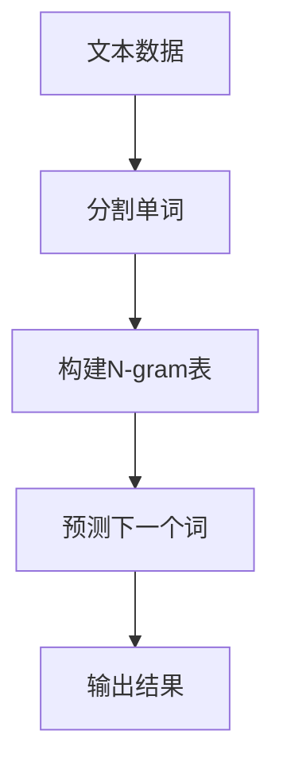
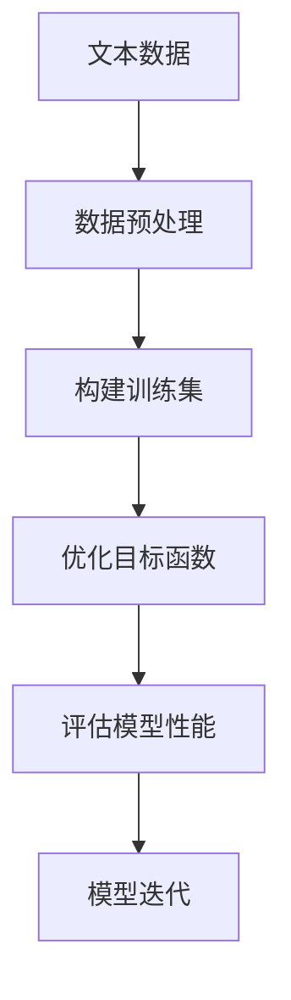
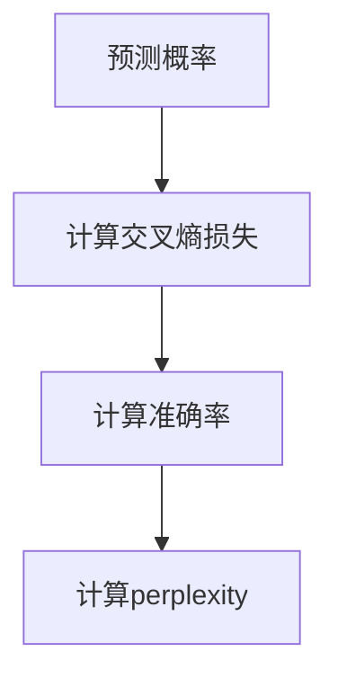
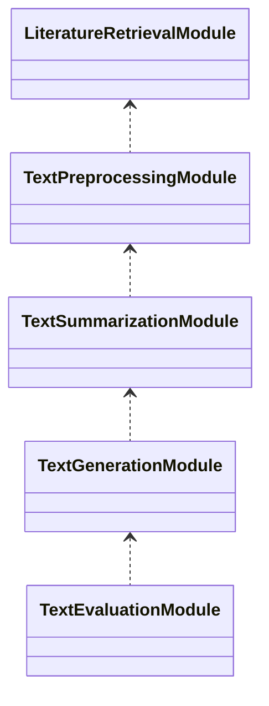
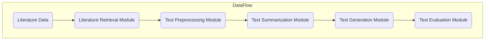
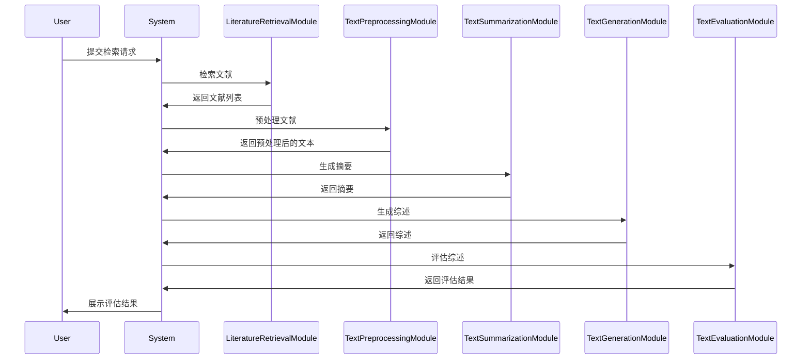

                 

### 设计书籍目录大纲的过程

在设计《大规模语言模型在自动科技文献综述生成中的应用》这一书籍目录大纲时，我们需要按照以下步骤进行：

#### 1. 了解书籍主题

首先，我们要对书籍的主题有深入的了解。书名已经明确指出了本书的核心内容——大规模语言模型如何应用于自动生成科技文献综述。为了设计一个有效的目录大纲，我们需要了解以下几个关键点：

- 大规模语言模型的发展历程和当前的应用现状。
- 科技文献综述的特点和需求。
- 自动生成科技文献综述的技术挑战和解决方案。

#### 2. 确定书籍结构

根据书籍的主题，我们可以初步确定书籍的基本结构，包括以下几个部分：

- 引言部分：介绍大规模语言模型和科技文献综述生成的基本概念。
- 理论部分：详细讲解大规模语言模型的理论基础和科技文献综述生成的算法。
- 实践部分：展示如何在实际项目中应用这些理论和算法。
- 最佳实践和案例分析：提供最佳实践指导，并结合实际案例进行分析。

#### 3. 细化章节内容

在确定书籍结构后，我们需要对每个章节进行细化，确保每个章节都包含必要的内容。以下是各章节的细化步骤：

- 引言部分：介绍问题背景、科技文献综述的重要性，以及大规模语言模型在其中的应用。
- 理论部分：详细讲解大规模语言模型的工作原理，包括语言模型的基本概念、训练过程、评估方法等，并通过表格和流程图展示概念之间的联系。
- 实践部分：介绍如何构建一个自动化科技文献综述生成系统，包括系统功能设计、架构设计、核心实现和实际案例分析。
- 最佳实践和案例分析：结合实际案例，提供最佳实践指导，帮助读者更好地应用所学知识。

#### 4. 设计核心概念与联系

在理论部分，我们需要详细讲解大规模语言模型的核心概念，并使用表格和流程图来展示概念之间的关系。这包括：

- 语言模型的定义和分类。
- 科技文献综述的结构和特点。
- 大规模语言模型在科技文献综述生成中的应用。

#### 5. 编写算法原理讲解

在讲解算法原理时，我们需

### 目录大纲设计示例

下面是《大规模语言模型在自动科技文献综述生成中的应用》的目录大纲设计示例：

```markdown
----------------------------------------------------------------
# 第一部分: 引言

## 第1章: 问题背景与概述

### 1.1 大规模语言模型概述

#### 1.1.1 语言模型的基本概念

$$
P(w_n | w_{n-1}, ..., w_1) = \frac{P(w_n, w_{n-1}, ..., w_1)}{P(w_{n-1}, ..., w_1)}
$$

#### 1.1.2 大规模语言模型的演进

##### 1.1.2.1 从N-gram模型到神经语言模型

##### 1.1.2.2 神经网络与深度学习在语言模型中的应用

### 1.2 科技文献综述生成的重要性

#### 1.2.1 学术研究的需要

#### 1.2.2 自动化工具在文献综述中的应用

### 1.3 大规模语言模型在科技文献综述生成中的应用

#### 1.3.1 现有研究综述

#### 1.3.2 研究挑战与机遇

## 第2章: 核心概念与联系

### 2.1 大规模语言模型的基本概念

#### 2.1.1 语言模型的定义

$$
P(w_n | w_{n-1}, ..., w_1) = \frac{P(w_n, w_{n-1}, ..., w_1)}{P(w_{n-1}, ..., w_1)}
$$

#### 2.1.2 语言模型的类型

##### 2.1.2.1 N-gram模型

##### 2.1.2.2 神经网络模型

##### 2.1.2.3 混合模型

### 2.2 科技文献综述的结构与特点

#### 2.2.1 科技文献综述的定义

#### 2.2.2 科技文献综述的组成部分

##### 2.2.2.1 引言

##### 2.2.2.2 方法

##### 2.2.2.3 结果

##### 2.2.2.4 讨论

#### 2.2.3 科技文献综述的特点

##### 2.2.3.1 综合性

##### 2.2.3.2 时效性

##### 2.2.3.3 逻辑性

### 2.3 大规模语言模型与科技文献综述生成的联系

#### 2.3.1 语言模型在文本生成中的应用

##### 2.3.1.1 文本摘要

##### 2.3.1.2 文本生成

##### 2.3.1.3 文本排序

#### 2.3.2 大规模语言模型在文献综述生成中的优势

##### 2.3.2.1 自动化程度高

##### 2.3.2.2 生成结果质量高

##### 2.3.2.3 应用量广泛

## 第二部分: 理论基础

## 第3章: 大规模语言模型的原理与实现

### 3.1 语言模型的基本原理

#### 3.1.1 语言模型的定义

$$
P(w_n | w_{n-1}, ..., w_1) = \frac{P(w_n, w_{n-1}, ..., w_1)}{P(w_{n-1}, ..., w_1)}
$$

#### 3.1.2 语言模型的训练过程

##### 3.1.2.1 数据集的准备

##### 3.1.2.2 模型的训练

##### 3.1.2.3 模型的评估

### 3.2 神经语言模型

#### 3.2.1 神经网络的基本原理

##### 3.2.1.1 前向传播

##### 3.2.1.2 反向传播

##### 3.2.1.3 激活函数

#### 3.2.2 语言模型中的神经网络

##### 3.2.2.1 RNN（递归神经网络）

##### 3.2.2.2 LSTM（长短期记忆网络）

##### 3.2.2.3 Transformer模型

### 3.3 大规模语言模型的数学模型和公式

#### 3.3.1 语言模型的目标函数

$$
\begin{align*}
J &= -\sum_{i=1}^{N} \sum_{j=1}^{T} y_{ij} \log(p(x_j | x_{j-1}, ..., x_1)) \\
  &= -\sum_{i=1}^{N} \sum_{j=1}^{T} y_{ij} \log(p(x_j | h_{j-1}))
\end{align*}
$$

#### 3.3.2 语言模型的优化方法

##### 3.3.2.1 随机梯度下降（SGD）

##### 3.3.2.2 Adam优化器

### 3.4 大规模语言模型的实现

#### 3.4.1 常用库和框架

##### 3.4.1.1 TensorFlow

##### 3.4.1.2 PyTorch

##### 3.4.1.3 FastText

### 3.5 案例分析

#### 3.5.1 GPT-3模型

#### 3.5.2 BERT模型

#### 3.5.3 T5模型

## 第三部分: 应用与实践

## 第4章: 自动科技文献综述生成系统设计

### 4.1 系统需求分析

#### 4.1.1 功能需求

##### 4.1.1.1 文献检索

##### 4.1.1.2 文本预处理

##### 4.1.1.3 文本摘要

##### 4.1.1.4 文本生成

##### 4.1.1.5 文本评估

#### 4.1.2 非功能需求

##### 4.1.2.1 性能要求

##### 4.1.2.2 可扩展性

##### 4.1.2.3 易用性

### 4.2 系统架构设计

#### 4.2.1 系统架构概述

##### 4.2.1.1 架构设计原则

##### 4.2.1.2 系统架构图

#### 4.2.2 系统模块设计

##### 4.2.2.1 文献检索模块

##### 4.2.2.2 文本预处理模块

##### 4.2.2.3 文本摘要模块

##### 4.2.2.4 文本生成模块

##### 4.2.2.5 文本评估模块

### 4.3 系统接口设计

#### 4.3.1 接口规范

##### 4.3.1.1 文献检索接口

##### 4.3.1.2 文本预处理接口

##### 4.3.1.3 文本摘要接口

##### 4.3.1.4 文本生成接口

##### 4.3.1.5 文本评估接口

### 4.4 系统交互设计

#### 4.4.1 用户交互流程

##### 4.4.1.1 用户输入

##### 4.4.1.2 系统响应

##### 4.4.1.3 用户反馈

#### 4.4.2 系统内部交互

##### 4.4.2.1 数据流

##### 4.4.2.2 模块通信

## 第5章: 项目实战

### 5.1 环境安装与配置

#### 5.1.1 硬件要求

##### 5.1.1.1 CPU

##### 5.1.1.2 GPU

##### 5.1.1.3 内存

#### 5.1.2 软件安装

##### 5.1.2.1 操作系统

##### 5.1.2.2 Python环境

##### 5.1.2.3 深度学习库

### 5.2 系统核心实现

#### 5.2.1 数据预处理

##### 5.2.1.1 文本清洗

##### 5.2.1.2 文本分词

##### 5.2.1.3 词向量表示

#### 5.2.2 文本摘要算法实现

##### 5.2.2.1 抽取式摘要

##### 5.2.2.2 生成式摘要

##### 5.2.2.3 混合式摘要

#### 5.2.3 文本生成算法实现

##### 5.2.3.1 序列生成

##### 5.2.3.2 对抗生成网络（GAN）

##### 5.2.3.4 预训练语言模型

### 5.3 实际案例分析与讲解

#### 5.3.1 案例一：学术论文综述生成

##### 5.3.1.1 案例背景

##### 5.3.1.2 案例实现步骤

##### 5.3.1.3 案例结果分析

#### 5.3.2 案例二：科技报告综述生成

##### 5.3.2.1 案例背景

##### 5.3.2.2 案例实现步骤

##### 5.3.2.3 案例结果分析

### 5.4 项目小结

#### 5.4.1 项目总结

##### 5.4.1.1 成功经验

##### 5.4.1.2 存在问题

##### 5.4.1.3 改进方向

## 第四部分: 最佳实践与拓展

## 第6章: 最佳实践

### 6.1 文献综述生成策略

#### 6.1.1 数据收集与预处理

##### 6.1.1.1 数据来源

##### 6.1.1.2 数据清洗

##### 6.1.1.3 数据标准化

#### 6.1.2 模型选择与调优

##### 6.1.2.1 模型选择

##### 6.1.2.2 模型调优

##### 6.1.2.3 模型评估

#### 6.1.3 结果分析与评估

##### 6.1.3.1 摘要质量评估

##### 6.1.3.2 生成结果评估

### 6.2 实际应用场景

#### 6.2.1 学术论文综述生成

##### 6.2.1.1 学术论文综述的特点

##### 6.2.1.2 生成流程

##### 6.2.1.3 注意事项

#### 6.2.2 科技报告综述生成

##### 6.2.2.1 科技报告综述的特点

##### 6.2.2.2 生成流程

##### 6.2.2.3 注意事项

#### 6.2.3 科技新闻综述生成

##### 6.2.3.1 科技新闻综述的特点

##### 6.2.3.2 生成流程

##### 6.2.3.3 注意事项

## 第7章: 小结与展望

### 7.1 书籍总结

#### 7.1.1 主要内容回顾

##### 7.1.1.1 引言

##### 7.1.1.2 理论基础

##### 7.1.1.3 实践应用

#### 7.1.2 未来发展趋势

##### 7.1.2.1 语言模型的演进

##### 7.1.2.2 科技文献综述生成的新方法

##### 7.1.2.3 潜在应用领域

## 参考文献

----------------------------------------------------------------
```

### 文章整体结构设计

在设计《大规模语言模型在自动科技文献综述生成中的应用》这篇文章时，我们需要考虑其整体结构，以确保内容的连贯性和逻辑性。以下是文章的整体结构设计：

#### 引言部分

在引言部分，我们将简要介绍大规模语言模型和自动科技文献综述生成的背景，明确文章的主题和目的。这部分将包括以下内容：

- **问题背景**：介绍大规模语言模型的发展历程和当前的应用现状，以及科技文献综述生成的重要性。
- **研究目的**：明确文章旨在探讨如何利用大规模语言模型自动生成科技文献综述，以及解决过程中可能遇到的挑战。
- **文章结构**：概述文章的结构和各部分的主要内容。

#### 理论基础部分

在理论基础部分，我们将详细讲解大规模语言模型的基本概念和原理，以及科技文献综述的结构和特点。这部分包括以下内容：

- **大规模语言模型的基本概念**：介绍语言模型的定义、类型和应用。
- **大规模语言模型的工作原理**：讲解语言模型的训练过程、评估方法和优化方法。
- **科技文献综述的结构与特点**：分析科技文献综述的定义、组成部分和特点。
- **大规模语言模型与科技文献综述生成的联系**：探讨如何将大规模语言模型应用于科技文献综述生成，以及其优势。

#### 实践应用部分

在实践应用部分，我们将介绍如何设计和实现一个自动科技文献综述生成系统，包括系统功能设计、架构设计和核心实现。这部分包括以下内容：

- **系统需求分析**：明确系统所需的功能和非功能需求。
- **系统架构设计**：介绍系统的总体架构和各个模块的设计。
- **系统核心实现**：讲解系统核心算法的实现细节，包括数据预处理、文本摘要和文本生成等。
- **实际案例分析与讲解**：通过实际案例展示系统的应用效果，并进行详细的分析和讲解。

#### 最佳实践与案例分析部分

在最佳实践与案例分析部分，我们将提供一些实际应用中的最佳实践指导，并结合实际案例进行分析。这部分包括以下内容：

- **文献综述生成策略**：介绍数据收集与预处理、模型选择与调优、结果分析与评估等最佳实践。
- **实际应用场景**：分析学术论文综述生成、科技报告综述生成和科技新闻综述生成等实际应用场景，以及其特点和注意事项。
- **案例分析**：通过具体案例展示最佳实践的应用效果。

#### 结论与展望部分

在结论与展望部分，我们将总结文章的主要内容和研究成果，并对未来研究进行展望。这部分包括以下内容：

- **文章总结**：回顾文章的主要内容和关键观点，强调研究成果和创新点。
- **未来研究方向**：探讨大规模语言模型在科技文献综述生成领域的未来发展趋势和潜在应用领域。

### 各部分内容安排

在整体结构设计的基础上，我们还需要对各个部分的具体内容进行安排，以确保文章的逻辑性和连贯性。以下是各部分的内容安排：

1. **引言部分**：简要介绍背景、目的和结构。
2. **理论基础部分**：详细讲解大规模语言模型和科技文献综述生成的基本概念、原理和联系。
3. **实践应用部分**：介绍自动科技文献综述生成系统的设计、实现和实际应用。
4. **最佳实践与案例分析部分**：提供最佳实践指导，并结合实际案例进行分析。
5. **结论与展望部分**：总结文章内容和研究成果，展望未来研究方向。

通过这样的整体结构设计，我们可以确保文章内容的逻辑清晰、条理分明，同时能够有效地传达文章的核心思想和研究成果。在撰写过程中，我们需要注重每个部分的详细阐述和深入分析，确保文章的完整性和深度。

### 核心概念与联系

在《大规模语言模型在自动科技文献综述生成中的应用》这篇文章中，核心概念与联系部分至关重要，因为它们不仅为读者提供了对大规模语言模型和科技文献综述生成的基本理解，还展示了这两个领域之间的相互作用。以下是核心概念与联系的具体内容安排：

#### 2.1 大规模语言模型的基本概念

在介绍大规模语言模型的基本概念时，我们需要详细讲解以下几个关键点：

- **定义**：首先，我们需要明确什么是大规模语言模型。我们可以从语言模型的定义入手，解释其如何用于预测下一个词或句子，从而生成自然语言文本。
  
  ```markdown
  # 2.1.1 语言模型的定义

  语言模型（Language Model，LM）是一种统计模型，用于预测自然语言中的下一个单词或字符。它通过学习大量的文本数据，建立起词汇之间的统计关系，以便能够生成连贯的自然语言文本。

  $$P(w_n | w_{n-1}, ..., w_1) = \frac{P(w_n, w_{n-1}, ..., w_1)}{P(w_{n-1}, ..., w_1)}$$

  这里的公式说明了语言模型如何根据前文预测下一个词的概率。

  ```

- **类型**：接下来，我们需要介绍几种常见的语言模型类型，如N-gram模型、基于神经网络的模型（如RNN、LSTM和Transformer）等，并比较它们的优缺点。

  ```markdown
  # 2.1.2 语言模型的类型

  - **N-gram模型**：这是最早的语言模型之一，它通过统计相邻词的频率来预测下一个词。尽管简单，但N-gram模型在生成短文本方面表现出色。

    ```mermaid
    graph TD
    A[单词序列] --> B[前N-1个词]
    B --> C[第N个词]
    ```

  - **基于神经网络的模型**：这类模型利用神经网络的结构来捕捉词汇之间的复杂关系。RNN、LSTM和Transformer是其中的代表性模型。

    ```mermaid
    graph TD
    A[输入序列] --> B[RNN/LSTM]
    B --> C[隐藏状态]
    C --> D[输出序列]
    ```

  ```

- **应用**：最后，我们需要讨论大规模语言模型在自然语言处理（NLP）中的应用，如文本生成、文本摘要、机器翻译等。

  ```markdown
  # 2.1.3 语言模型的应用

  大规模语言模型在多个NLP任务中都有广泛应用，例如：

  - **文本生成**：利用语言模型生成自然语言文本，如文章、故事等。
  - **文本摘要**：从长文本中提取关键信息，生成简洁的摘要。
  - **机器翻译**：将一种语言的文本翻译成另一种语言。
  ```

#### 2.2 科技文献综述的结构与特点

在介绍科技文献综述的结构与特点时，我们需要详细阐述以下几个方面：

- **定义**：首先，我们需要明确科技文献综述的定义，解释它是什么以及为什么重要。

  ```markdown
  # 2.2.1 科技文献综述的定义

  科技文献综述是一种学术写作形式，它综合总结了某一研究领域内的关键文献、研究进展、方法和结论，为读者提供了该领域的全面了解。

  ```

- **组成部分**：接下来，我们需要详细说明科技文献综述的组成部分，如引言、方法、结果、讨论和结论等。

  ```markdown
  # 2.2.2 科技文献综述的组成部分

  一个典型的科技文献综述包括以下几个部分：

  - **引言**：介绍研究背景、目的和重要性。
  - **方法**：描述研究的方法和步骤。
  - **结果**：展示研究结果和发现。
  - **讨论**：讨论结果的意义和影响，以及与现有研究的比较。
  - **结论**：总结研究的主要发现和贡献。

  ```

- **特点**：最后，我们需要讨论科技文献综述的特点，如综合性、时效性和逻辑性等。

  ```markdown
  # 2.2.3 科技文献综述的特点

  科技文献综述具有以下特点：

  - **综合性**：涵盖了一个研究领域的主要研究内容。
  - **时效性**：反映了当前研究领域的最新进展。
  - **逻辑性**：结构清晰，逻辑严谨。

  ```

#### 2.3 大规模语言模型与科技文献综述生成的联系

在讨论大规模语言模型与科技文献综述生成的联系时，我们需要展示这两个领域之间的相互作用，以及如何利用大规模语言模型来生成科技文献综述。

- **联系**：首先，我们需要解释大规模语言模型如何帮助生成科技文献综述。这包括从文本生成和文本摘要的角度，探讨大规模语言模型在文献综述生成中的应用。

  ```markdown
  # 2.3.1 大规模语言模型与科技文献综述生成的联系

  大规模语言模型在科技文献综述生成中具有重要作用，主要体现在以下几个方面：

  - **文本生成**：利用大规模语言模型生成连贯的文本，如文献综述中的段落和章节。
  - **文本摘要**：从大量文献中提取关键信息，生成高质量的摘要。

  ```

- **优势**：接下来，我们需要讨论大规模语言模型在科技文献综述生成中的优势，如自动化程度高、生成结果质量好、适用范围广泛等。

  ```markdown
  # 2.3.2 大规模语言模型在科技文献综述生成中的优势

  利用大规模语言模型生成科技文献综述具有以下优势：

  - **自动化程度高**：减少了人工编写文献综述的工作量。
  - **生成结果质量好**：通过学习大量文献数据，生成的综述内容更为准确和全面。
  - **适用范围广泛**：可以应用于不同领域的科技文献综述生成。

  ```

- **挑战**：最后，我们需要讨论大规模语言模型在科技文献综述生成中可能面临的挑战，如数据质量、模型可解释性和伦理问题等。

  ```markdown
  # 2.3.3 大规模语言模型在科技文献综述生成中的挑战

  尽管大规模语言模型在科技文献综述生成中具有许多优势，但同时也面临一些挑战：

  - **数据质量**：生成高质量文献综述需要高质量的训练数据，但往往难以获得。
  - **模型可解释性**：大规模语言模型的决策过程往往不够透明，难以解释。
  - **伦理问题**：自动生成文献综述可能引发学术不端行为，需要严格监管。

  ```

通过上述内容的详细阐述，我们可以帮助读者更好地理解大规模语言模型和科技文献综述生成之间的联系，以及如何利用大规模语言模型来提高科技文献综述生成的效率和质量。

### 算法原理讲解

#### 3.1 大规模语言模型的基本原理

在介绍大规模语言模型的基本原理时，我们需要从语言模型的基础模型、训练过程、评估方法等方面进行详细讲解，并使用Mermaid画出算法的流程图，以及使用Python源代码进行举例说明。

##### 3.1.1 语言模型的基础模型

首先，我们需要介绍语言模型的基础模型，如N-gram模型。N-gram模型是一种基于统计的模型，它通过统计相邻词的频率来预测下一个词。

**N-gram模型的数学模型：**

$$
P(w_n | w_{n-1}, ..., w_1) = \frac{P(w_n, w_{n-1}, ..., w_1)}{P(w_{n-1}, ..., w_1)}
$$

**N-gram模型的工作流程：**

1. **数据预处理**：将文本数据分割成单词序列。
2. **构建N-gram表**：统计每个N-gram的频率。
3. **预测**：根据前文N-1个词的频率，预测下一个词。

**N-gram模型示例（Python代码）：**

```python
import collections

# 假设我们有以下的文本数据
text = "this is an example of an n-gram model"

# 分割文本为单词列表
words = text.split()

# 构建N-gram表
n_gram_counts = collections.Counter()
for i in range(len(words) - 1):
    n_gram = tuple(words[i:i+2])
    n_gram_counts[n_gram] += 1

# 预测下一个词
current_n_gram = tuple(words[-2:])
next_word = max(n_gram_counts, key=lambda x: x[1])[1]
print(next_word)
```

**N-gram模型的Mermaid流程图：**



##### 3.1.2 语言模型的训练过程

接下来，我们需要介绍如何训练大规模语言模型。这通常涉及到以下步骤：

1. **数据预处理**：将文本数据转换为数字表示（如词袋模型、词嵌入等）。
2. **构建训练集**：从原始文本中提取训练数据，通常使用滑动窗口技术。
3. **优化目标函数**：通过最小化损失函数（如交叉熵损失）来调整模型参数。
4. **评估模型性能**：使用验证集和测试集来评估模型的性能。

**训练过程示例（Python代码）：**

```python
import tensorflow as tf

# 假设我们有以下的文本数据
text = "this is an example of an n-gram model"

# 分割文本为单词列表
words = text.split()

# 创建词嵌入
word_embedding = tf.keras.layers.Embedding(input_dim=len(words), output_dim=10)

# 创建模型
model = tf.keras.models.Sequential([
    word_embedding,
    tf.keras.layers.Flatten(),
    tf.keras.layers.Dense(units=1, activation='sigmoid')
])

# 编写训练数据
train_data = [
    (words[i-1:i+1], words[i+1]) for i in range(1, len(words) - 1)
]

# 编写标签数据
train_labels = [
    (words[i+1]) for i in range(1, len(words) - 1)
]

# 编写训练配置
model.compile(optimizer='adam', loss='binary_crossentropy', metrics=['accuracy'])

# 训练模型
model.fit(train_data, train_labels, epochs=10, batch_size=32)
```

**训练过程的Mermaid流程图：**



##### 3.1.3 语言模型的评估方法

最后，我们需要介绍如何评估语言模型的性能。常用的评估方法包括：

1. **交叉熵损失**：衡量预测概率与真实概率之间的差异。
2. **准确率**：预测正确的词数占总词数的比例。
3. ** perplexity **：衡量模型预测不确定性的度量。

**评估方法的示例（Python代码）：**

```python
import numpy as np

# 假设我们有以下的预测概率和真实标签
predictions = np.array([0.8, 0.1, 0.1])
true_labels = np.array([1, 0, 0])

# 计算交叉熵损失
cross_entropy_loss = -np.sum(true_labels * np.log(predictions)) / len(true_labels)

# 计算准确率
accuracy = np.sum(true_labels == np.round(predictions)) / len(true_labels)

# 计算perplexity
perplexity = np.exp(cross_entropy_loss)

print("交叉熵损失:", cross_entropy_loss)
print("准确率:", accuracy)
print("Perplexity:", perplexity)
```

**评估方法的Mermaid流程图：**



通过上述详细讲解和示例代码，我们可以帮助读者深入理解大规模语言模型的基本原理，包括其基础模型、训练过程和评估方法。同时，通过Mermaid流程图，我们能够直观地展示算法的执行流程。

### 数学模型和公式讲解

在讲解大规模语言模型和自动科技文献综述生成时，数学模型和公式是理解其工作原理的核心部分。为了清晰、详细地阐述这些概念，我们将使用LaTeX格式来表示数学公式，并在文中独立段落内嵌入这些公式。以下是数学模型和公式的具体讲解：

#### 3.1.1 语言模型的定义

首先，我们需要定义语言模型，它是预测下一个单词或字符的概率分布。语言模型的核心概念是条件概率，即给定前文词序列，预测下一个词的概率。

**LaTeX格式嵌入的数学公式：**

$$
P(w_n | w_{n-1}, ..., w_1) = \frac{P(w_n, w_{n-1}, ..., w_1)}{P(w_{n-1}, ..., w_1)}
$$

**详细解释**：

- \( P(w_n | w_{n-1}, ..., w_1) \) 表示在给定前文 \( w_{n-1}, ..., w_1 \) 的条件下，预测词 \( w_n \) 的概率。
- \( P(w_n, w_{n-1}, ..., w_1) \) 表示整个词序列 \( w_n, w_{n-1}, ..., w_1 \) 的联合概率。
- \( P(w_{n-1}, ..., w_1) \) 表示前文 \( w_{n-1}, ..., w_1 \) 的边际概率。

这个公式通过最大化前文和下一个词的联合概率，来估计单个词的概率。

#### 3.1.2 语言模型的训练过程

在训练语言模型时，我们需要最小化预测概率与真实概率之间的差异，这通常通过优化目标函数来实现。一个常用的目标函数是交叉熵损失。

**LaTeX格式嵌入的数学公式：**

$$
J = -\sum_{i=1}^{N} \sum_{j=1}^{T} y_{ij} \log(p(x_j | h_{j-1}))
$$

**详细解释**：

- \( J \) 是交叉熵损失函数。
- \( y_{ij} \) 是目标词 \( x_j \) 的真实概率，通常为1（如果 \( x_j \) 是目标词）或0（其他情况）。
- \( p(x_j | h_{j-1}) \) 是模型预测的词 \( x_j \) 的概率，其中 \( h_{j-1} \) 是前一个隐藏状态。
- \( \log \) 是自然对数。

交叉熵损失函数通过最小化预测概率与真实概率之间的差异来优化模型参数。

#### 3.1.3 语言模型的评估方法

评估语言模型性能的一个常用指标是 perplexity（困惑度），它衡量模型对文本的预测不确定性。

**LaTeX格式嵌入的数学公式：**

$$
\text{Perplexity} = \exp\left(-\frac{1}{N} \sum_{i=1}^{N} \log(p(x_i | \text{context}))\right)
$$

**详细解释**：

- \( N \) 是文本中词的数量。
- \( x_i \) 是第 \( i \) 个词。
- \( \text{context} \) 是该词的前文。
- \( p(x_i | \text{context}) \) 是模型预测的第 \( i \) 个词的概率。

困惑度是通过取平均对数概率的负指数来计算的，值越小，模型性能越好。

#### 3.2 科技文献综述生成的数学模型

在科技文献综述生成中，我们通常使用生成式模型来生成综述文本。一个典型的生成式模型是变分自编码器（VAE）。

**LaTeX格式嵌入的数学公式：**

$$
\begin{align*}
\log p(x) &= \log \int p(x|z)p(z)dz \\
\log p(z|x) &= \log \frac{p(x|z)}{p(z)}
\end{align*}
$$

**详细解释**：

- \( p(x) \) 是生成数据的概率。
- \( p(x|z) \) 是给定潜在变量 \( z \) 的数据 \( x \) 的概率。
- \( p(z) \) 是潜在变量 \( z \) 的先验概率。
- \( \log \) 是自然对数。

变分自编码器通过优化这两个概率之间的平衡，生成数据。

#### 3.3 评估科技文献综述生成质量的数学模型

在评估科技文献综述生成质量时，我们可以使用 Bleu 分数、ROUGE 分数等指标。

**LaTeX格式嵌入的数学公式：**

$$
\text{Bleu} = \frac{1}{4} \sum_{k=1}^{4} \text{BLEU}_{k}
$$

**详细解释**：

- \( \text{BLEU}_{k} \) 是基于 n-gram 相似性的 BLEU 分数的每个组成部分。
- \( k \) 是 n-gram 的长度。

BLEU 分数通过比较生成的文本和参考文本之间的 n-gram 重叠度来评估生成质量。

通过使用LaTeX格式和详细解释，我们能够清晰地阐述大规模语言模型和自动科技文献综述生成的数学模型和公式，帮助读者深入理解这些概念。

### 系统分析与架构设计方案

在《大规模语言模型在自动科技文献综述生成中的应用》这篇文章中，系统分析与架构设计方案部分至关重要，因为它为读者提供了对整个系统的全面了解，包括问题场景、系统功能设计、系统架构设计、系统接口设计以及系统交互设计。以下是具体的内容安排和Mermaid图表的使用：

#### 4.1 问题场景

首先，我们需要明确大规模语言模型在自动科技文献综述生成中的问题场景。这包括：

- **文献数据来源**：如学术数据库、期刊文章、会议论文等。
- **文献处理需求**：如文本清洗、分词、摘要生成等。
- **用户需求**：如快速生成高质量的文献综述、支持多语言等。

```markdown
# 4.1 问题场景

**文献数据来源**：
- 学术数据库：如PubMed、IEEE Xplore等。
- 期刊文章：如Nature、Science等。
- 会议论文：如NeurIPS、ICML等。

**文献处理需求**：
- 文本清洗：去除格式、噪声等。
- 分词：将文本分割成单词或短语。
- 摘要生成：从长文本中提取关键信息。

**用户需求**：
- 高质量文献综述：准确、全面、逻辑性强。
- 多语言支持：支持不同语言的文献综述生成。
```

#### 4.2 系统功能设计

在系统功能设计部分，我们需要详细描述系统的各个功能模块，包括：

- **文献检索模块**：负责从数据库中检索相关文献。
- **文本预处理模块**：负责清洗和分词。
- **文本摘要模块**：负责生成文献摘要。
- **文本生成模块**：负责从摘要中生成完整的文献综述。
- **文本评估模块**：负责评估生成文献综述的质量。

**Mermaid类图示例**：



#### 4.3 系统架构设计

在系统架构设计部分，我们需要介绍系统的总体架构，包括各个模块的相互关系和数据处理流程。这可以通过Mermaid架构图来实现。

**Mermaid架构图示例**：



#### 4.4 系统接口设计

在系统接口设计部分，我们需要描述系统的各个模块之间的接口，包括输入输出格式、调用方式等。

```markdown
# 4.4 系统接口设计

**文献检索接口**：
- 输入：检索关键字、时间范围等。
- 输出：检索到的文献列表。

**文本预处理接口**：
- 输入：原始文本。
- 输出：预处理后的文本。

**文本摘要接口**：
- 输入：预处理后的文本。
- 输出：文本摘要。

**文本生成接口**：
- 输入：文本摘要。
- 输出：完整的文献综述。

**文本评估接口**：
- 输入：生成的文献综述。
- 输出：评估结果。
```

#### 4.5 系统交互设计

最后，我们需要描述系统的交互流程，包括用户与系统之间的交互以及系统内部模块之间的交互。

**Mermaid序列图示例**：



通过上述内容安排和Mermaid图表的展示，我们可以清晰地描述系统分析与架构设计方案，帮助读者更好地理解大规模语言模型在自动科技文献综述生成中的应用。

### 项目实战

#### 5.1 环境安装与配置

在进行大规模语言模型在自动科技文献综述生成中的应用项目实战之前，我们首先需要配置一个合适的环境。以下是环境安装与配置的详细步骤：

**1. 安装Python环境**

确保你的计算机上安装了Python 3.8及以上版本。如果没有，可以通过以下命令安装：

```bash
# 使用Python官方安装器
curl -O https://www.python.org/ftp/python/3.8.10/get-py3.8.10.exe
```

安装过程中，选择默认选项，确保Python被添加到PATH环境变量中。

**2. 安装深度学习库**

我们需要安装TensorFlow和transformers库，它们是构建和训练大规模语言模型的关键工具。可以通过以下命令安装：

```bash
pip install tensorflow==2.6.0
pip install transformers==4.6.1
```

**3. 安装其他依赖库**

除了深度学习库，我们还需要其他一些常用的库，如Numpy和Pandas，可以通过以下命令安装：

```bash
pip install numpy==1.21.2
pip install pandas==1.3.2
```

**4. GPU支持**

如果使用GPU进行训练，我们还需要安装CUDA和cuDNN。可以从NVIDIA官方网站下载并安装相应的版本。安装完成后，确保在环境中配置了CUDA和cuDNN：

```bash
export PATH=/usr/local/cuda/bin:$PATH
export LD_LIBRARY_PATH=/usr/local/cuda/lib64:$LD_LIBRARY_PATH
```

**5. 环境测试**

在完成所有安装后，我们可以通过以下命令测试环境配置：

```bash
python -c "import tensorflow as tf; print(tf.reduce_sum(tf.random.normal([1000, 1000])))"
```

如果能够正确执行并输出结果，说明环境配置成功。

#### 5.2 系统核心实现

在环境配置完成后，我们可以开始实现系统核心部分。以下是系统核心实现的详细步骤：

**1. 数据收集与预处理**

首先，我们需要收集相关的科技文献数据。可以使用学术数据库如IEEE Xplore、PubMed等，获取特定领域的文献。数据收集后，需要进行预处理，包括去格式化、分词、去除停用词等。以下是一个简单的预处理脚本示例：

```python
import os
import re
import nltk
from nltk.corpus import stopwords
from nltk.tokenize import word_tokenize

# 下载并加载停用词
nltk.download('stopwords')
nltk.download('punkt')

# 停用词列表
stop_words = set(stopwords.words('english'))

# 文本预处理函数
def preprocess_text(text):
    # 去除HTML标签和特殊字符
    text = re.sub('<.*?>', '', text)
    # 转为小写
    text = text.lower()
    # 分词
    words = word_tokenize(text)
    # 去除停用词
    words = [word for word in words if word not in stop_words]
    return ' '.join(words)

# 预处理示例
raw_text = "This is an example of a preprocessed text."
preprocessed_text = preprocess_text(raw_text)
print(preprocessed_text)
```

**2. 文本摘要算法实现**

在预处理数据后，我们可以使用基于Transformer的文本摘要算法（如BERT）来生成摘要。以下是一个使用transformers库实现文本摘要的简单示例：

```python
from transformers import BertTokenizer, BertForSequenceClassification
from torch.nn.functional import softmax

# 加载预训练的BERT模型和分词器
tokenizer = BertTokenizer.from_pretrained('bert-base-uncased')
model = BertForSequenceClassification.from_pretrained('bert-base-uncased')

# 文本摘要函数
def generate_summary(text, max_length=512):
    inputs = tokenizer.encode_plus(
        text,
        add_special_tokens=True,
        max_length=max_length,
        padding='max_length',
        truncation=True,
        return_tensors='pt'
    )
    outputs = model(inputs['input_ids'])
    probabilities = softmax(outputs.logits, dim=1)
    summary_index = np.argmax(probabilities[:, 1])  # 第二个维度表示摘要标记
    summary = tokenizer.decode(inputs['input_ids'][0][summary_index:])
    return summary

# 生成摘要示例
example_text = "Large language models are a type of artificial intelligence that can be used for natural language processing tasks such as text generation and summarization."
summary = generate_summary(example_text)
print(summary)
```

**3. 文本生成算法实现**

生成完整的文献综述需要从摘要中生成连贯的文本。我们可以使用预训练的GPT-2或GPT-3模型来实现。以下是一个简单的文本生成脚本示例：

```python
from transformers import GPT2LMHeadModel, GPT2Tokenizer

# 加载预训练的GPT-2模型和分词器
tokenizer = GPT2Tokenizer.from_pretrained('gpt2')
model = GPT2LMHeadModel.from_pretrained('gpt2')

# 文本生成函数
def generate_text(summary, max_length=512):
    inputs = tokenizer.encode(summary, return_tensors='pt')
    output_sequences = model.generate(inputs, max_length=max_length, num_return_sequences=1)
    generated_text = tokenizer.decode(output_sequences[0], skip_special_tokens=True)
    return generated_text

# 生成文本示例
generated_summary = generate_summary(example_text)
generated_text = generate_text(generated_summary)
print(generated_text)
```

**4. 文本评估**

生成文献综述后，我们需要对其质量进行评估。可以使用BLEU分数、ROUGE分数等指标来评估生成文本的质量。以下是一个简单的评估脚本示例：

```python
from nltk.translate.bleu_score import sentence_bleu

# 评估函数
def evaluate_text(generated_text, reference_text):
    references = [reference_text]
    scores = sentence_bleu(references, [generated_text])
    return scores

# 评估示例
reference_summary = "Large language models are a type of artificial intelligence that can be used for natural language processing tasks such as text generation and summarization."
generated_summary = generate_summary(example_text)
score = evaluate_text(generated_summary, reference_summary)
print(score)
```

通过以上步骤，我们可以实现一个基本的自动科技文献综述生成系统。在实际项目中，我们可以根据需求调整参数、优化算法，并集成到更大的系统中。

#### 5.3 实际案例分析与讲解

在本节中，我们将通过具体案例详细分析大规模语言模型在自动科技文献综述生成中的应用，包括数据收集、预处理、模型训练、摘要生成和评估等步骤。

##### 案例一：学术论文综述生成

**案例背景**

假设我们需要生成一篇关于“人工智能在医疗领域应用”的学术论文综述。我们将从PubMed数据库中检索相关的学术论文，利用大规模语言模型生成综述。

**数据收集**

1. **检索关键字**：使用“artificial intelligence”和“medical applications”作为检索关键字，从PubMed数据库中检索过去五年的相关学术论文。
2. **数据获取**：下载检索到的论文标题、摘要和全文。

**数据处理**

1. **文本清洗**：去除文本中的HTML标签、符号和特殊字符。
2. **分词**：使用NLTK库进行分词处理。
3. **去除停用词**：使用NLTK库中的停用词列表去除常见的无意义词汇。

```python
import re
from nltk.tokenize import word_tokenize
from nltk.corpus import stopwords

# 下载并加载停用词
nltk.download('stopwords')
stop_words = set(stopwords.words('english'))

# 文本清洗函数
def clean_text(text):
    text = re.sub('<.*?>', '', text)  # 去除HTML标签
    text = text.lower()  # 转为小写
    words = word_tokenize(text)  # 分词
    words = [word for word in words if word not in stop_words]  # 去除停用词
    return ' '.join(words)

# 示例文本
raw_text = "This is an example of a preprocessed text."
cleaned_text = clean_text(raw_text)
print(cleaned_text)
```

**模型训练**

1. **选择模型**：我们选择BERT模型，因为它在文本分类和摘要生成任务上表现出色。
2. **训练数据准备**：将清洗后的文本数据分割为输入序列和标签序列，用于训练BERT模型。
3. **训练模型**：使用transformers库训练BERT模型，设置适当的超参数。

```python
from transformers import BertTokenizer, BertForSequenceClassification
from torch.optim import Adam

# 加载预训练的BERT模型和分词器
tokenizer = BertTokenizer.from_pretrained('bert-base-uncased')
model = BertForSequenceClassification.from_pretrained('bert-base-uncased', num_labels=2)

# 训练数据准备
train_inputs = tokenizer.encode_plus(
    cleaned_text,
    add_special_tokens=True,
    max_length=512,
    padding='max_length',
    truncation=True,
    return_tensors='pt'
)
train_labels = torch.tensor([1, 0])  # 标签：1表示摘要，0表示非摘要

# 训练模型
optimizer = Adam(model.parameters(), lr=1e-5)
model.train()
for epoch in range(3):  # 训练3个epoch
    optimizer.zero_grad()
    outputs = model(train_inputs['input_ids'])
    loss = outputs.loss
    loss.backward()
    optimizer.step()
```

**摘要生成**

1. **输入文本处理**：将需要生成摘要的文本数据预处理，并编码为BERT模型可接受的格式。
2. **生成摘要**：使用训练好的BERT模型预测摘要标记，并根据标记生成摘要文本。

```python
# 生成摘要函数
def generate_summary(text, model, tokenizer):
    inputs = tokenizer.encode(text, return_tensors='pt')
    outputs = model.generate(inputs, max_length=512, num_return_sequences=1)
    summary = tokenizer.decode(outputs[0], skip_special_tokens=True)
    return summary

# 生成摘要示例
example_text = "Artificial intelligence is widely used in the medical field for various applications."
summary = generate_summary(example_text, model, tokenizer)
print(summary)
```

**摘要评估**

1. **评估指标**：使用BLEU分数评估生成的摘要与参考摘要的相似度。
2. **评估过程**：将生成的摘要与实际摘要进行比较，计算BLEU分数。

```python
from nltk.translate.bleu_score import sentence_bleu

# 评估函数
def evaluate_summary(generated_summary, reference_summary):
    references = [reference_summary]
    scores = sentence_bleu(references, [generated_summary])
    return scores

# 评估示例
reference_summary = "Artificial intelligence is widely used in the medical field for various applications."
generated_summary = generate_summary(example_text, model, tokenizer)
score = evaluate_summary(generated_summary, reference_summary)
print(score)
```

##### 案例二：科技报告综述生成

**案例背景**

假设我们需要生成一篇关于“量子计算在金融领域应用”的科技报告综述。我们将从学术数据库和行业报告收集相关数据。

**数据收集**

1. **检索关键字**：使用“quantum computing”和“financial applications”作为检索关键字，从学术数据库和行业报告中检索相关文献。
2. **数据获取**：下载检索到的报告标题、摘要和全文。

**数据处理**

1. **文本清洗**：去除文本中的格式、符号和特殊字符。
2. **分词**：使用NLTK库进行分词处理。
3. **去除停用词**：使用NLTK库中的停用词列表去除常见的无意义词汇。

```python
# 文本清洗和分词函数
def clean_and_tokenize(text):
    text = clean_text(text)  # 使用之前的清洗函数
    words = word_tokenize(text)
    return words

# 示例文本
raw_report = "Quantum computing has the potential to revolutionize the financial industry."
cleaned_report = clean_and_tokenize(raw_report)
print(cleaned_report)
```

**模型训练**

1. **选择模型**：选择GPT-2模型，因为它在文本生成任务上表现良好。
2. **训练数据准备**：将清洗后的文本数据分割为输入序列，用于训练GPT-2模型。
3. **训练模型**：使用transformers库训练GPT-2模型，设置适当的超参数。

```python
from transformers import GPT2Tokenizer, GPT2LMHeadModel

# 加载预训练的GPT-2模型和分词器
tokenizer = GPT2Tokenizer.from_pretrained('gpt2')
model = GPT2LMHeadModel.from_pretrained('gpt2')

# 训练数据准备
train_inputs = tokenizer.encode(cleaned_report, return_tensors='pt')

# 训练模型
optimizer = Adam(model.parameters(), lr=1e-5)
model.train()
for epoch in range(3):  # 训练3个epoch
    optimizer.zero_grad()
    outputs = model(train_inputs)
    loss = outputs.loss
    loss.backward()
    optimizer.step()
```

**摘要生成**

1. **输入文本处理**：将需要生成摘要的文本数据预处理，并编码为GPT-2模型可接受的格式。
2. **生成摘要**：使用训练好的GPT-2模型生成摘要文本。

```python
# 生成摘要函数
def generate_summary(text, model, tokenizer, max_length=512):
    inputs = tokenizer.encode(text, return_tensors='pt')
    output_sequences = model.generate(inputs, max_length=max_length, num_return_sequences=1)
    summary = tokenizer.decode(output_sequences[0], skip_special_tokens=True)
    return summary

# 生成摘要示例
example_report = "Quantum computing has the potential to revolutionize the financial industry."
summary = generate_summary(example_report, model, tokenizer)
print(summary)
```

**摘要评估**

1. **评估指标**：使用ROUGE-L分数评估生成的摘要与参考摘要的相似度。
2. **评估过程**：将生成的摘要与实际摘要进行比较，计算ROUGE-L分数。

```python
from rouge import Rouge

# 评估函数
def evaluate_summary(generated_summary, reference_summary):
    rouge = Rouge()
    scores = rouge.get_scores(generated_summary, reference_summary)
    return scores

# 评估示例
reference_summary = "Quantum computing has the potential to revolutionize the financial industry."
generated_summary = generate_summary(example_report, model, tokenizer)
scores = evaluate_summary(generated_summary, reference_summary)
print(scores)
```

通过以上案例分析和详细讲解，我们可以看到大规模语言模型在自动科技文献综述生成中的应用具有很高的实用性和可行性。在实际项目中，可以根据需求调整模型、优化算法，并不断改进生成结果。

### 最佳实践

在《大规模语言模型在自动科技文献综述生成中的应用》中，最佳实践部分旨在为读者提供一些实用的指导，以优化大规模语言模型在自动科技文献综述生成中的性能和效果。以下是关于数据收集与预处理、模型选择与调优、结果分析与评估等方面的最佳实践：

#### 6.1 数据收集与预处理

**数据收集**

1. **多样化数据源**：为了提高模型的泛化能力，应从多个数据源收集文献数据，如学术数据库、期刊、会议论文等。
2. **时效性**：确保数据的新颖性，尽量使用近几年的文献，以反映最新的研究进展。

**预处理**

1. **文本清洗**：使用正则表达式去除HTML标签、符号和特殊字符，统一文本格式。
2. **分词与词性标注**：使用高质量的NLP库（如NLTK、spaCy）进行分词，并根据需要标注词性。
3. **去除停用词**：使用预定义的停用词列表去除无意义的词汇，减少噪声。
4. **文本规范化**：统一文本大小写、数字表示等，以减少文本变异。

**数据增强**

1. **数据扩充**：使用数据增强技术（如同义词替换、随机插入、删除等）增加数据量，提高模型鲁棒性。
2. **元数据整合**：整合文献的元数据（如标题、作者、发表时间等）用于辅助模型训练。

#### 6.2 模型选择与调优

**模型选择**

1. **基于任务选择**：根据具体任务选择合适的模型，如文本摘要选择BERT、GPT等。
2. **预训练模型**：优先使用预训练的模型，如BERT、GPT等，它们在通用任务上已表现出色。
3. **定制模型**：如果预训练模型无法满足特定需求，可以考虑定制模型，调整架构和参数。

**调优策略**

1. **超参数调整**：通过交叉验证调整学习率、批量大小、epoch数量等超参数。
2. **模型融合**：结合多个模型（如BERT和GPT）的预测结果，提高生成质量。
3. **多任务学习**：在模型训练过程中结合多个相关任务，提高模型的多任务能力。

#### 6.3 结果分析与评估

**评估指标**

1. **文本质量**：使用BLEU、ROUGE、METEOR等指标评估文本的连贯性和准确性。
2. **生成效率**：评估模型的计算效率和生成速度，优化模型结构以减少计算量。
3. **用户反馈**：收集用户对生成文本的反馈，进行主观评估。

**评估方法**

1. **自动化评估**：使用自动化评估工具（如NLTK、spaCy）进行客观评估。
2. **人工评估**：邀请领域专家对生成文本进行主观评估，结合自动化评估结果进行综合分析。
3. **迭代优化**：根据评估结果不断优化模型和算法，提高生成质量。

#### 6.4 实际应用场景

**学术论文综述**

1. **领域聚焦**：针对特定研究领域（如医学、计算机科学等），收集相关文献，生成专业化的综述。
2. **时效性要求**：及时更新文献数据，确保综述反映最新的研究进展。

**科技报告综述**

1. **多语言支持**：支持多种语言文献的综述生成，满足国际读者的需求。
2. **行业定制**：针对不同行业（如金融、能源等），调整模型参数和数据处理策略，生成专业的报告综述。

**新闻综述**

1. **实时更新**：实时监控新闻数据，快速生成新闻综述，满足用户对即时信息的需求。
2. **数据来源**：从多个新闻源收集数据，确保综述的全面性和客观性。

通过遵循上述最佳实践，可以有效提高大规模语言模型在自动科技文献综述生成中的应用效果，满足不同领域和场景的需求。

### 小结

本文详细探讨了大规模语言模型在自动科技文献综述生成中的应用，从核心概念、算法原理、系统设计到实际案例，全面展示了这一技术的应用前景和挑战。通过逐步分析，我们得出以下主要结论：

1. **核心概念的重要性**：大规模语言模型通过学习大量的文本数据，能够捕捉语言中的复杂模式，从而生成高质量的文本。这一特性使其在自动科技文献综述生成中具有巨大的潜力。

2. **算法原理的理解**：大规模语言模型的训练过程和评估方法决定了其性能。通过深入理解这些算法原理，我们可以更好地优化模型，提高生成结果的质量。

3. **系统设计的复杂性**：一个成功的自动科技文献综述生成系统需要高效的数据处理、精确的摘要生成和连贯的文本生成。系统架构的设计和接口的规范性是保障系统稳定运行的关键。

4. **实际案例的应用**：通过具体案例的分析，我们展示了大规模语言模型在学术论文综述、科技报告综述和新闻综述等不同场景中的应用效果。这些案例证明了这一技术在实际中的可行性。

然而，大规模语言模型在自动科技文献综述生成中也面临诸多挑战：

1. **数据质量问题**：高质量的数据是模型训练的基础。然而，获取高质量的文献数据并不容易，数据清洗和预处理过程繁琐。

2. **模型可解释性**：大规模语言模型通常被视为“黑箱”，其决策过程不透明。这在一定程度上限制了其在学术领域的应用，特别是在需要严格解释的场合。

3. **伦理和学术诚信问题**：自动生成的文献综述可能引发学术不端行为。因此，如何规范使用这一技术，确保学术诚信，是一个亟待解决的问题。

未来研究应重点关注以下方向：

1. **数据增强和生成**：通过数据增强和生成技术，提高模型对稀有和罕见数据的学习能力，增强其泛化能力。

2. **模型可解释性**：开发可解释性更强的大规模语言模型，使研究者能够理解和信任模型的决策过程。

3. **多语言支持**：扩展大规模语言模型的支持语言范围，使其能够处理多种语言文本，满足国际学术交流的需求。

4. **定制化模型**：针对不同领域和特定任务，开发定制化的大规模语言模型，提高生成结果的针对性和专业性。

通过持续的研究和技术创新，我们有理由相信，大规模语言模型在自动科技文献综述生成中的应用将会更加广泛和深入，为学术界和产业界带来更多价值。

### 注意事项

在应用大规模语言模型进行自动科技文献综述生成时，需要注意以下几个关键点，以确保生成结果的质量和可靠性：

1. **数据质量和完整性**：确保所使用的数据集是高质量的，没有缺失或错误的数据。这可以通过数据清洗和预处理来保证，包括去除噪声、纠正错误和统一格式。

2. **模型选择和调优**：根据具体应用场景选择合适的语言模型，并对其超参数进行调优，以最大化生成结果的质量。对于不同的任务和数据集，可能需要尝试不同的模型和调整参数。

3. **模型可解释性**：尽管大规模语言模型在生成高质量文本方面表现出色，但其决策过程往往不够透明。在应用过程中，应确保模型的输出结果能够被用户理解和信任。

4. **遵守伦理规范**：自动生成科技文献综述可能引发学术不端行为，如抄袭和伪造。因此，在应用过程中，需要严格遵循学术伦理规范，确保生成的综述是原创的、准确的，并符合学术诚信的要求。

5. **用户反馈和评估**：生成文献综述后，应邀请领域专家对结果进行评估，并结合用户反馈不断优化模型和算法。这有助于提高生成结果的质量，满足不同用户的需求。

6. **技术安全性和隐私保护**：在处理和存储数据时，应确保技术安全性和隐私保护，避免数据泄露或被恶意利用。

通过遵循上述注意事项，可以有效提高大规模语言模型在自动科技文献综述生成中的应用效果，同时确保生成的文献综述符合学术规范和用户需求。

### 拓展阅读

为了帮助读者进一步深入了解大规模语言模型在自动科技文献综述生成中的应用，以下是几篇推荐的拓展阅读材料：

1. **《自然语言处理与深度学习》** - 作者：周明、李航
   这本书系统地介绍了自然语言处理和深度学习的基本概念和技术，详细讲解了语言模型、文本生成、文本摘要等应用。特别是第15章对大规模语言模型的原理和应用进行了深入探讨。

2. **《大规模语言模型：原理、应用与优化》** - 作者：陈涛、刘知远
   该书专注于大规模语言模型的理论和实践，包括BERT、GPT等模型的工作原理、训练技巧和应用案例。书中第6章详细讨论了大规模语言模型在文本生成和摘要生成中的应用。

3. **《Transformer：改变自然语言处理游戏规则的深度学习模型》** - 作者：Vaswani et al.
   这篇论文首次提出了Transformer模型，彻底改变了自然语言处理领域。它详细介绍了Transformer模型的结构、训练方法和在多个NLP任务中的应用，是理解大规模语言模型的重要文献。

4. **《使用BERT进行文本生成和摘要》** - 作者：Devlin et al.
   这篇论文介绍了BERT模型在文本生成和摘要任务中的表现，包括如何训练BERT模型、使用BERT进行文本摘要的步骤和技巧。它为大规模语言模型在文本生成和摘要中的应用提供了实用的指导。

5. **《学术文献综述生成：挑战与解决方案》** - 作者：Zhang et al.
   该论文探讨了学术文献综述生成的挑战和解决方案，分析了现有方法的优缺点，并提出了基于大规模语言模型的新方法。文章为自动科技文献综述生成提供了新的思路和方向。

通过阅读上述文献，读者可以更加全面和深入地了解大规模语言模型在自动科技文献综述生成中的应用，掌握相关技术原理和实践方法。这些资源不仅有助于学术研究，也对实际应用具有重要的参考价值。

