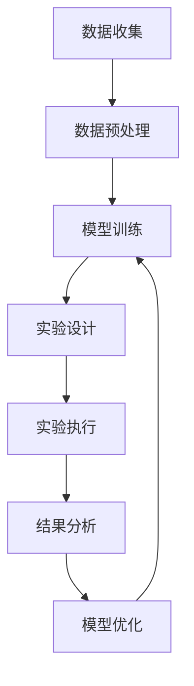
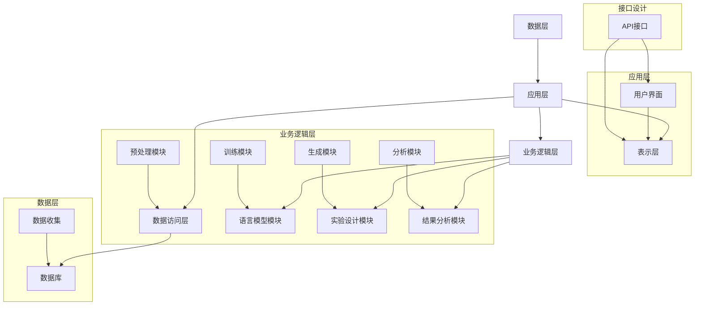

                 


### 背景介绍

#### 第1章：问题背景

科研实验设计在科学研究中扮演着至关重要的角色。它是科学发现和创新的重要基石，涉及到从实验方案的设计、数据收集到结果分析的每一个环节。然而，随着科研领域的复杂性和数据量的爆炸性增长，传统的科研实验设计方法面临着诸多挑战。首先，实验设计的复杂性不断增加，研究者需要处理大量的变量和潜在的交互效应，这使得手动设计实验变得日益困难。其次，实验数据量的增长使得研究者难以从海量数据中提取有意义的信息，从而降低了实验结果的可靠性和有效性。此外，传统实验设计往往依赖于研究者个人的经验和直觉，缺乏系统的分析和优化。

在这样的背景下，大规模语言模型（Large-scale Language Models）的出现为科研实验设计带来了新的机遇。大规模语言模型是一种基于深度学习的技术，具有处理海量文本数据、提取语义信息和生成文本的能力。它们在自然语言处理、机器翻译、文本生成等领域取得了显著的成果，展现出巨大的潜力和适用性。将大规模语言模型应用于科研实验设计，不仅可以自动化和优化实验设计过程，还可以提高实验的可靠性和效率。

大规模语言模型在科研实验设计中的应用具有以下几个方面的潜力：

1. **自动变量筛选**：大规模语言模型可以分析大量文献和实验数据，自动识别出可能对实验结果有重要影响的变量，从而帮助研究者筛选出关键的实验因素。

2. **实验方案生成**：通过学习已有的科研文献和成功的实验案例，大规模语言模型可以生成新的实验方案，提供多样化的实验设计选择。

3. **数据预处理**：大规模语言模型可以自动进行数据清洗、格式转换和特征提取，为后续的实验分析提供高质量的输入数据。

4. **结果预测和优化**：利用大规模语言模型强大的预测能力，研究者可以在实验进行之前预测实验结果，并基于预测结果对实验方案进行优化调整。

5. **协作研究**：大规模语言模型可以作为研究者的智能助手，协助他们进行文献检索、数据分析和实验设计，提高研究效率和创新能力。

总之，大规模语言模型在自动科研实验设计中的应用具有深远的意义。它不仅能够解决传统科研实验设计面临的挑战，还能推动科学研究方法的革新，提高科学研究的整体水平。接下来，我们将深入探讨大规模语言模型在自动科研实验设计中的具体应用和实现方法。

### 第2章：问题描述

自动科研实验设计的核心目标是实现科研实验过程的自动化和智能化，从而提高实验效率和准确性。具体而言，自动科研实验设计包括以下几个关键目标和需求：

#### 自动变量筛选

首先，自动变量筛选是自动科研实验设计的重要一环。在传统的科研实验设计中，研究者需要手动筛选可能影响实验结果的变量，这个过程既耗时又费力。而自动变量筛选利用大规模语言模型对大量文献和实验数据进行分析，能够自动识别出潜在的、对实验结果有显著影响的变量。这一过程不仅提高了变量筛选的效率，还减少了人为干预的误差。

#### 实验方案生成

实验方案的生成是自动科研实验设计的另一个核心目标。研究者通常需要从众多的实验设计中选择最适合的一种，这个过程需要大量的经验和专业知识。大规模语言模型可以通过学习大量的成功实验案例和科研文献，自动生成多种实验方案，为研究者提供多样化的选择。这不仅提高了实验设计的创造性，还帮助研究者从不同角度思考实验方案，从而可能发现更优的实验设计。

#### 数据预处理

数据预处理是科研实验中不可或缺的环节，它关系到实验数据的质量和后续分析的可靠性。大规模语言模型在数据预处理方面具有显著优势。它能够自动进行数据清洗、格式转换和特征提取，将原始数据转换为适合分析和建模的格式。这一过程不仅减少了人工操作的时间和错误，还提高了数据处理的效率和质量。

#### 结果预测和优化

结果预测和优化是自动科研实验设计的关键目标之一。通过大规模语言模型强大的预测能力，研究者可以在实验开始之前预测实验结果，并根据预测结果对实验方案进行优化调整。这种预先优化可以显著提高实验的成功率和准确性，减少实验的重复次数和资源浪费。

#### 协作研究

在科研过程中，研究者之间的协作至关重要。大规模语言模型可以作为研究者的智能助手，协助他们进行文献检索、数据分析和实验设计。它不仅可以帮助研究者更高效地完成研究任务，还能提供新的研究方向和思路，促进科研创新的产生。

#### 满足需求

为了实现上述目标，自动科研实验设计需要满足以下几个需求：

1. **大规模数据处理能力**：自动科研实验设计需要处理海量的文本数据和实验数据，因此必须具备强大的数据处理能力。

2. **算法高效性**：实验设计是一个复杂的过程，算法的高效性直接影响到实验设计的效率和准确性。大规模语言模型通过深度学习算法，可以实现高效的变量筛选、实验方案生成和结果预测。

3. **灵活性**：自动科研实验设计需要能够适应不同领域的科研需求，因此必须具备高度的灵活性。

4. **可解释性**：实验设计的结果需要可解释，以便研究者能够理解并接受自动实验设计方案的合理性。大规模语言模型需要提供一定的可解释性机制，帮助研究者理解模型的决策过程。

总之，自动科研实验设计旨在通过大规模语言模型的技术优势，实现科研实验过程的自动化和智能化，从而提高科研效率和准确性。它不仅满足了科研过程中的核心需求，还为科研方法的革新提供了新的可能性。接下来，我们将进一步探讨大规模语言模型的基本原理和应用场景。

### 第3章：问题解决

#### 大规模语言模型的基本原理

大规模语言模型（Large-scale Language Models）是基于深度学习和自然语言处理（NLP）技术的一种高级人工智能模型。其核心思想是通过学习大量文本数据，捕捉语言的结构和语义信息，从而能够生成或理解人类语言。大规模语言模型通常基于神经网络结构，特别是变分自编码器（VAE）、递归神经网络（RNN）和 Transformer 等。其中，Transformer 模型由于其并行计算的能力和自注意力机制，成为了当前大规模语言模型的主流架构。

1. **Transformer 模型**：Transformer 模型由 Vaswani 等（2017）提出，它通过自注意力机制（Self-Attention Mechanism）实现了对输入序列的建模，能够捕捉序列中不同位置的信息依赖。Transformer 模型由编码器（Encoder）和解码器（Decoder）两部分组成，编码器负责将输入序列编码为固定长度的向量表示，解码器则根据编码器的输出生成预测的输出序列。

2. **自注意力机制**：自注意力机制是 Transformer 模型的核心，它允许模型在处理每个词时考虑整个输入序列中其他词的重要程度。这种机制使得模型能够更好地捕捉长距离依赖，从而提高语言理解的准确性。

3. **预训练与微调**：大规模语言模型通常采用预训练（Pre-training）和微调（Fine-tuning）的方法进行训练。预训练阶段，模型在大量的未标注文本数据上进行训练，学习基本的语言结构和语义信息；微调阶段，模型在特定任务的标注数据上进行训练，以适应具体的应用场景。

#### 大规模语言模型在科研实验设计中的应用

大规模语言模型在科研实验设计中的应用潜力巨大，主要体现在以下几个方面：

1. **文本分析**：大规模语言模型可以处理和理解大量文本数据，如科研论文、实验报告等。通过文本分析，模型能够自动提取关键信息，如变量名称、实验步骤、实验结果等，为实验设计提供数据支持。

2. **变量筛选**：基于文本分析的结果，大规模语言模型可以识别出可能的实验变量，并评估它们对实验结果的影响。这一过程不仅提高了变量筛选的效率，还能减少人为错误。

3. **实验方案生成**：通过学习大量的成功实验案例和文献，大规模语言模型可以自动生成新的实验方案，为研究者提供多样化的选择。模型还可以根据实验目标和已有数据，优化实验设计的参数，提高实验的成功率。

4. **数据预处理**：大规模语言模型在数据预处理方面具有显著优势，能够自动进行数据清洗、格式转换和特征提取。这些预处理步骤对于确保实验数据的准确性和一致性至关重要。

5. **结果预测和优化**：大规模语言模型可以通过对实验数据的分析，预测实验结果，并基于预测结果对实验方案进行优化调整。这种预先优化可以显著提高实验的准确性和效率。

#### 大规模语言模型的优势与限制

大规模语言模型在科研实验设计中的应用具有以下优势：

1. **高效率**：大规模语言模型能够快速处理大量数据，显著提高科研实验设计的效率。

2. **高准确性**：通过深度学习算法和自注意力机制，大规模语言模型能够准确捕捉语言结构和语义信息，提高变量筛选和结果预测的准确性。

3. **灵活性**：大规模语言模型具有高度的灵活性，可以适应不同的科研领域和应用场景。

然而，大规模语言模型也存在一些限制：

1. **数据依赖**：大规模语言模型的效果高度依赖于训练数据的数量和质量。如果训练数据存在偏差或不足，模型的性能可能会受到影响。

2. **计算资源需求**：大规模语言模型的训练和推理过程需要大量的计算资源，对硬件设施有较高要求。

3. **可解释性**：大规模语言模型的决策过程往往具有黑盒性质，缺乏透明度，使得研究者难以理解模型的决策依据。

总之，大规模语言模型在自动科研实验设计中的应用具有显著的优势和潜力，但也需要克服一些技术挑战和限制。通过不断的算法优化和应用创新，大规模语言模型有望在未来为科研实验设计带来更多突破。

### 第4章：边界与外延

#### 大规模语言模型在科研领域的应用范围

大规模语言模型在科研领域的应用范围广泛，主要涉及以下方面：

1. **文献检索**：通过分析大量的科研论文和文献，大规模语言模型可以帮助研究者快速定位相关研究，提取关键信息，从而提高文献检索的效率和准确性。

2. **变量筛选**：在实验设计阶段，大规模语言模型能够自动分析大量文献和实验数据，识别出可能对实验结果有显著影响的变量，提高变量筛选的效率和准确性。

3. **实验方案生成**：通过学习成功的实验案例和文献，大规模语言模型可以自动生成新的实验方案，为研究者提供多样化的选择，促进实验设计的创新。

4. **数据预处理**：大规模语言模型能够自动进行数据清洗、格式转换和特征提取，为实验数据分析和建模提供高质量的输入数据。

5. **结果预测和优化**：通过分析实验数据，大规模语言模型可以预测实验结果，并基于预测结果对实验方案进行优化调整，提高实验的成功率和准确性。

#### 大规模语言模型在实验设计中的应用边界

尽管大规模语言模型在科研实验设计中的应用前景广阔，但它的应用仍存在一些边界和限制：

1. **数据依赖性**：大规模语言模型的效果高度依赖于训练数据的质量和数量。如果训练数据存在偏差或不足，模型的性能可能会受到影响。因此，确保数据的质量和多样性是大规模语言模型成功应用的关键。

2. **领域特定知识**：尽管大规模语言模型具有强大的语言理解能力，但它并不能完全替代领域特定的知识和经验。在某些复杂的科研领域，仍然需要研究者结合自身的专业知识和经验进行实验设计。

3. **计算资源需求**：大规模语言模型的训练和推理过程需要大量的计算资源，特别是在模型规模较大时，对硬件设施有较高要求。这可能会限制大规模语言模型在某些科研机构的普及和应用。

4. **可解释性**：大规模语言模型的决策过程往往具有黑盒性质，缺乏透明度，使得研究者难以理解模型的决策依据。尽管模型的可解释性在近年来得到了一定的关注，但这一问题仍然是一个挑战。

#### 大规模语言模型与相关技术的关联

大规模语言模型在科研实验设计中的应用，不仅依赖于其自身的核心技术，还与其他相关技术紧密关联：

1. **深度学习**：大规模语言模型是基于深度学习技术的一种高级模型。深度学习算法的进步，特别是神经网络结构（如 Transformer）的发展，为大规模语言模型提供了强大的基础。

2. **自然语言处理（NLP）**：大规模语言模型在自然语言处理领域取得了显著的成果，其应用也离不开 NLP 相关技术，如词向量表示、文本分类、序列标注等。

3. **数据挖掘**：大规模语言模型在数据挖掘中的应用，如关联规则挖掘、聚类分析等，有助于从大量实验数据中提取有价值的信息，为实验设计提供支持。

4. **机器学习**：大规模语言模型的发展与机器学习技术密切相关。机器学习算法，特别是监督学习和无监督学习，为大规模语言模型的训练和优化提供了重要的技术手段。

总之，大规模语言模型在科研实验设计中的应用具有广泛的前景和潜力，但也需要克服一系列技术挑战和限制。通过不断的技术创新和应用探索，大规模语言模型有望在科研实验设计中发挥更大的作用。

### 第5章：概念结构与核心要素

#### 大规模语言模型的组成部分

大规模语言模型是由多个关键组成部分构建而成的复杂系统，这些部分相互协作，实现了模型对文本数据的理解和生成能力。以下是大规模语言模型的主要组成部分及其作用：

1. **输入层**：输入层接收文本数据，通常以词向量或字符向量的形式表示。词向量是将单词映射为固定长度的向量，字符向量则是将每个字符映射为向量。输入层的任务是处理和准备数据，以便后续的层进行更高级的处理。

2. **编码器**：编码器是大规模语言模型的核心部分，负责将输入的文本序列编码为固定长度的向量表示。编码器通常采用递归神经网络（RNN）或 Transformer 等结构。RNN 可以捕获输入序列的长期依赖关系，而 Transformer 通过自注意力机制实现并行计算，能够更有效地处理长文本。

3. **解码器**：解码器的功能与编码器相反，它接收编码器的输出，并生成预测的文本序列。解码器通常采用与编码器相同的结构，如 RNN 或 Transformer。在生成文本的过程中，解码器会逐步预测每个词或字符，并利用编码器的输出和前一个预测的词或字符来生成下一个预测。

4. **注意力机制**：在编码器和解码器中，注意力机制是一个关键组件。它允许模型在生成每个词或字符时，动态地关注输入序列的不同部分，从而更好地捕捉文本的语义信息。自注意力机制和多头注意力机制是常用的注意力机制，能够提高模型的预测准确性。

5. **损失函数**：大规模语言模型通过优化损失函数来训练模型。常见的损失函数包括交叉熵损失（Cross-Entropy Loss）和平方损失（Mean Squared Error Loss）。这些损失函数用于衡量模型预测输出与真实输出之间的差异，并通过反向传播算法更新模型参数。

6. **优化算法**：优化算法用于调整模型参数，以最小化损失函数。常见的优化算法包括随机梯度下降（SGD）、Adam 和 RMSprop 等。这些算法通过迭代地更新参数，使得模型在训练数据上取得更好的性能。

#### 大规模语言模型的关键技术

大规模语言模型的成功依赖于一系列关键技术，这些技术在不同的层次上支持模型的训练和应用：

1. **预训练与微调**：预训练是大规模语言模型的基础，模型在大量的未标注文本数据上进行训练，学习语言的一般结构和语义信息。微调则是在特定任务的数据上进行，进一步优化模型以适应具体的应用场景。预训练和微调的结合使得模型能够从大规模数据中提取通用特征，并在特定任务上取得良好的性能。

2. **自注意力机制**：自注意力机制是 Transformer 模型的核心，它通过计算输入序列中每个词与所有其他词的相似性，实现了对输入文本的全局关注。自注意力机制使得模型能够捕捉长距离依赖关系，从而提高了语言理解的准确性。

3. **上下文嵌入**：上下文嵌入是将词或字符映射为向量的过程，它为模型提供了对文本中每个词或字符的局部和全局信息的表示。通过上下文嵌入，模型可以更好地理解词与词之间的关系，从而提高文本生成的连贯性和准确性。

4. **多模态学习**：多模态学习是指模型能够处理和融合来自不同模态（如文本、图像、声音）的数据。通过多模态学习，模型可以捕捉更丰富的信息，从而在跨模态任务（如文本生成图像、文本分类）中取得更好的性能。

5. **自适应学习率**：自适应学习率是优化算法的一部分，它通过动态调整学习率来提高训练过程的效率。自适应学习率算法能够避免过拟合，使得模型在训练过程中更稳定和鲁棒。

#### 大规模语言模型的应用场景

大规模语言模型的应用场景非常广泛，以下是一些典型的应用：

1. **自然语言生成**：大规模语言模型可以生成高质量的自然语言文本，如新闻文章、对话系统、诗歌等。通过学习大量的文本数据，模型能够生成连贯、自然的文本，适用于自动写作和内容生成。

2. **文本分类**：大规模语言模型可以用于文本分类任务，如情感分析、垃圾邮件检测等。模型通过分析文本的语义特征，能够准确地将文本分类到不同的类别。

3. **问答系统**：大规模语言模型可以构建智能问答系统，能够理解用户的问题，并生成相关的回答。这种应用在搜索引擎、客服系统等领域具有重要应用价值。

4. **机器翻译**：大规模语言模型在机器翻译领域表现出色，能够将一种语言的文本翻译成另一种语言。通过预训练和微调，模型能够在多种语言之间实现高精度的翻译。

5. **文本摘要**：大规模语言模型可以用于生成文本摘要，从长文本中提取关键信息并生成简洁的摘要。这种应用在信息检索、新闻阅读等领域具有重要应用价值。

6. **语音识别**：大规模语言模型可以结合语音识别技术，实现高精度的语音到文本转换。通过模型对语音数据的分析，可以识别和理解用户的语音指令。

总之，大规模语言模型是由多个关键组成部分构成的复杂系统，其核心技术包括自注意力机制、预训练与微调、上下文嵌入等。这些技术使得模型能够处理和理解大规模的文本数据，并在多种应用场景中取得优异的性能。随着技术的不断进步和应用探索，大规模语言模型将在更多领域发挥重要作用。

### 第6章：核心概念原理

#### 语言模型的基本原理

语言模型是自然语言处理（NLP）中的核心组件，旨在预测自然语言中的下一个词或字符。其基本原理是通过分析大量的文本数据，学习语言的概率分布，从而能够生成或理解自然语言。以下是语言模型的一些关键概念：

1. **概率分布**：语言模型的核心任务是学习文本序列的概率分布。例如，给定一个单词序列，语言模型需要预测下一个单词的概率分布，即每个单词在下一个位置出现的概率。

2. **n-gram模型**：n-gram模型是最简单的语言模型，它通过计算相邻n个单词的联合概率来预测下一个单词。例如，对于三元组（apple, orange, banana），n-gram模型会计算概率 \( P(banana|apple, orange) \)。

3. **神经网络语言模型**：神经网络语言模型通过神经网络结构，如递归神经网络（RNN）和 Transformer，学习文本序列的复杂概率分布。RNN能够捕获长距离依赖关系，而 Transformer 通过自注意力机制实现并行计算，提高处理长文本的能力。

4. **损失函数**：在训练语言模型时，常用的损失函数包括交叉熵损失（Cross-Entropy Loss），它用于衡量模型预测概率分布与真实分布之间的差异。通过优化损失函数，模型可以不断提高预测的准确性。

5. **词嵌入**：词嵌入（Word Embedding）是将单词映射为固定长度的向量表示。通过词嵌入，模型可以捕获单词的语义信息，从而提高语言理解的能力。常见的词嵌入方法包括 Word2Vec、GloVe 等。

#### 大规模语言模型的算法原理

大规模语言模型（如 GPT、BERT）在算法原理上具有显著的特点，主要体现在以下几个方面：

1. **Transformer 模型**：Transformer 模型由 Vaswani 等（2017）提出，是大规模语言模型的主流架构。它通过自注意力机制（Self-Attention Mechanism）实现了对输入序列的建模，能够捕捉序列中不同位置的信息依赖。Transformer 模型由编码器（Encoder）和解码器（Decoder）两部分组成。

2. **编码器与解码器**：编码器（Encoder）负责将输入序列编码为固定长度的向量表示，解码器（Decoder）则根据编码器的输出生成预测的输出序列。编码器和解码器通常采用相同的 Transformer 结构，以确保信息传递的对称性。

3. **多头注意力机制**：多头注意力机制是多了一个维度，允许模型在生成每个词时，考虑整个输入序列中其他词的重要程度。这种机制提高了模型的捕捉长距离依赖的能力，从而提高了预测的准确性。

4. **预训练与微调**：大规模语言模型通常采用预训练（Pre-training）和微调（Fine-tuning）的方法进行训练。预训练阶段，模型在大量的未标注文本数据上进行训练，学习语言的一般结构和语义信息；微调阶段，模型在特定任务的标注数据上进行训练，以适应具体的应用场景。预训练和微调的结合使得模型能够从大规模数据中提取通用特征，并在特定任务上取得良好的性能。

5. **上下文嵌入**：上下文嵌入（Contextual Embeddings）是将词或字符映射为向量的过程。通过上下文嵌入，模型可以更好地理解词与词之间的关系，从而提高文本生成的连贯性和准确性。

#### 大规模语言模型的优化策略

大规模语言模型在训练过程中通常采用一系列优化策略，以提高模型的训练效率和性能：

1. **学习率调整**：学习率调整是优化策略的重要组成部分。常用的方法包括恒定学习率、学习率衰减等。恒定学习率在训练初期效果较好，但容易导致模型过拟合；学习率衰减则通过逐渐减小学习率，使得模型在训练后期更加稳定。

2. **批量大小**：批量大小（Batch Size）是指每次训练使用的样本数量。较大的批量大小可以提供更多的梯度信息，有助于提高模型的训练效果，但也会增加计算资源的需求。

3. **正则化技术**：正则化技术用于防止模型过拟合。常见的正则化方法包括 L1 正则化、L2 正则化、dropout 等。L1 和 L2 正则化通过在损失函数中添加惩罚项，限制模型参数的规模；dropout 则通过在训练过程中随机丢弃一部分神经元，提高模型的泛化能力。

4. **数据增强**：数据增强是通过生成或变换原始数据，增加训练数据的多样性和丰富性。常见的数据增强方法包括填充（Padding）、切分（Splitting）、旋转（Rotation）、平移（Translation）等。

5. **并行计算**：并行计算通过利用多核 CPU、GPU 等硬件资源，加速模型的训练过程。Transformer 模型由于其并行计算的能力，非常适合在 GPU 上进行训练。

总之，大规模语言模型通过其独特的算法原理和优化策略，实现了对大规模文本数据的建模和理解。随着技术的不断进步和应用探索，大规模语言模型将在自然语言处理和自动科研实验设计等领域发挥越来越重要的作用。

### 第7章：概念属性特征对比

#### 传统语言模型与大规模语言模型的对比

在自然语言处理（NLP）领域，传统语言模型和大规模语言模型代表了两个不同的技术阶段。以下是对两者在概念属性上的主要对比：

1. **计算复杂度**：
   - **传统语言模型**：如 n-gram 模型，通常在 O(n^2) 时间复杂度内计算概率，其中 n 是词汇表的大小。这种模型简单，但效率较低。
   - **大规模语言模型**：如 GPT 和 BERT，采用基于 Transformer 的架构，自注意力机制使得模型的时间复杂度大幅降低，达到 O(n) 的线性复杂度。这极大地提高了处理长文本和大规模数据的效率。

2. **数据需求**：
   - **传统语言模型**：对训练数据的需求相对较低，仅需大规模文本数据即可。然而，由于缺乏深度学习的能力，其性能受到限制。
   - **大规模语言模型**：需要海量的标注和非标注文本数据，以训练模型的深度和广度。这些模型通过预训练和微调，可以从大规模数据中提取复杂的语言特征。

3. **准确性**：
   - **传统语言模型**：由于结构简单，准确性和泛化能力相对较低，特别是在处理长文本和复杂语义时。
   - **大规模语言模型**：通过深度学习算法和大规模数据训练，准确性和泛化能力显著提高。特别是 BERT 等模型，通过双向编码器结构，能够更好地捕捉文本中的长距离依赖关系。

4. **可解释性**：
   - **传统语言模型**：通常较为直观，如 n-gram 模型，可以明确看到每个单词的概率。
   - **大规模语言模型**：由于其复杂的神经网络结构，通常具有“黑盒”性质，难以直观解释其决策过程。尽管有研究试图提供可解释性方法，但挑战依然存在。

5. **应用范围**：
   - **传统语言模型**：适用于简单的文本处理任务，如拼写检查、基本语法纠错等。
   - **大规模语言模型**：适用于复杂任务，如机器翻译、文本生成、情感分析、问答系统等。这些模型在多个 NLP 任务上达到了或超过了人类水平。

#### 不同大规模语言模型之间的对比

在大量大规模语言模型中，GPT、BERT 和 T5 是较为知名的模型。以下是对这些模型在概念属性上的主要对比：

1. **模型结构**：
   - **GPT（Generative Pre-trained Transformer）**：由 OpenAI 开发，采用 Transformer 架构，旨在生成文本。GPT 具有灵活的序列生成能力，但主要面向生成任务。
   - **BERT（Bidirectional Encoder Representations from Transformers）**：由 Google 开发，通过双向编码器结构，能够更好地理解文本中的长距离依赖关系。BERT 主要用于文本分类、问答等任务。
   - **T5（Text-To-Text Transfer Transformer）**：由 Google 开发，旨在实现通用文本转换任务。T5 采用编码器-解码器结构，能够处理各种文本转换任务，如摘要生成、问答等。

2. **预训练目标**：
   - **GPT**：以生成文本为目标，预训练过程中学习生成连续文本序列。
   - **BERT**：以理解文本为目标，预训练过程中学习文本的双向表示，能够捕捉文本中的上下文信息。
   - **T5**：以文本转换为目标，预训练过程中学习将一个文本序列转换为目标文本序列。

3. **性能与应用**：
   - **GPT**：在生成任务上表现出色，能够生成连贯、自然的文本。然而，在理解任务上相对较弱。
   - **BERT**：在理解任务上表现出色，能够准确识别文本中的实体、关系等。然而，生成任务相对较弱。
   - **T5**：在文本转换任务上表现出色，能够处理各种文本转换任务，具有较高的通用性和灵活性。

4. **训练资源**：
   - **GPT**：通常需要较大的训练资源，如 GPU 或 TPU。
   - **BERT**：需要较多的计算资源，但相对 GPT 较为灵活，可以在不同规模的 GPU 上训练。
   - **T5**：同样需要大量的训练资源，但由于其通用性，可以在多种任务上共享模型参数。

#### 大规模语言模型的特点总结

综上所述，大规模语言模型在以下特点上具有显著优势：

1. **高效率**：通过自注意力机制和深度学习算法，大规模语言模型在处理大规模文本数据时具有高效率。
2. **高准确性**：从海量数据中提取复杂语言特征，大规模语言模型在多种 NLP 任务上达到了或超过了人类水平。
3. **灵活性**：能够适应不同的任务和应用场景，具有广泛的适用性。
4. **高计算需求**：训练和推理过程需要大量计算资源，对硬件设施有较高要求。
5. **可解释性挑战**：由于其复杂的神经网络结构，大规模语言模型的可解释性仍是一个挑战。

这些特点使得大规模语言模型在自然语言处理和自动科研实验设计等领域的应用具有巨大潜力。

### ER实体关系图架构

为了更好地理解和设计大规模语言模型在科研实验设计中的应用，我们引入 ER（Entity-Relationship）实体关系图架构。ER 图能够清晰地展示实体之间的关系和属性，有助于我们理解系统的结构。以下是一个 ER 实体关系图的 Markdown 格式示例，使用 Mermaid 语法绘制：

```mermaid
graph TB
    A[科研实验] --> B[实验设计系统]
    B --> C[数据预处理模块]
    B --> D[语言模型训练模块]
    B --> E[实验结果分析模块]
    C --> F[文本数据]
    D --> G[预训练模型]
    D --> H[微调模型]
    E --> I[预测结果]
    E --> J[优化建议]
    
    subgraph 实体属性
        K[科研实验]{实验ID，实验名称，实验目标}
        L[实验设计系统]{系统ID，模型类型，算法架构}
        M[数据预处理模块]{预处理方法，数据质量，预处理结果}
        N[语言模型训练模块]{训练数据，训练过程，模型参数}
        O[实验结果分析模块]{结果分析，置信度，实验建议}
        P[文本数据]{文本内容，文本标签，文本来源}
        Q[预训练模型]{模型结构，训练时间，预训练数据}
        R[微调模型]{微调参数，微调数据，微调结果}
        S[预测结果]{预测值，预测概率，预测置信度}
        T[优化建议]{建议类型，建议内容，建议依据}
    end

    subgraph 关联关系
        K --> L
        K --> C
        K --> D
        K --> E
        L --> M
        L --> G
        L --> H
        M --> F
        D --> G
        D --> H
        E --> I
        E --> J
        G --> N
        H --> R
        I --> K
        J --> K
        R --> L
        S --> I
        T --> J
    end
```

在该 ER 图中，我们定义了以下实体和关系：

- **实体**：科研实验、实验设计系统、数据预处理模块、语言模型训练模块、实验结果分析模块、文本数据、预训练模型、微调模型、预测结果、优化建议。
- **属性**：每个实体具有特定的属性，如科研实验的实验ID、实验名称、实验目标等。
- **关系**：实体之间的关系展示了系统的运作流程。例如，科研实验与实验设计系统关联，数据预处理模块与文本数据关联，语言模型训练模块与预训练模型和微调模型关联，实验结果分析模块与预测结果和优化建议关联。

通过 ER 图，我们可以清晰地看到各个模块和实体的关系，有助于我们在设计和实现系统时更好地组织数据和流程。接下来，我们将进一步探讨大规模语言模型在科研实验设计中的应用步骤和实现方法。

### 第9章：算法原理与流程图

大规模语言模型在自动科研实验设计中的应用，需要通过一系列复杂的算法实现。以下是算法原理的详细讲解和流程图的绘制，我们将使用 Mermaid 语法来展示算法的流程。

#### 算法流程讲解

大规模语言模型在自动科研实验设计中的应用主要分为以下几个步骤：

1. **数据收集**：收集与科研实验相关的文本数据，包括文献、实验报告、相关论文等。
2. **数据预处理**：清洗和整理收集到的文本数据，将其转换为适合训练的格式。这包括去除标点符号、停用词过滤、词干提取等。
3. **模型训练**：使用预处理后的文本数据训练大规模语言模型。在训练过程中，模型会学习文本的语法和语义信息，从而能够生成或理解复杂的文本序列。
4. **实验设计**：利用训练好的语言模型生成新的实验方案。模型可以根据实验目标、已有数据和文献分析，自动提出可能的实验设计。
5. **实验执行**：根据生成的实验方案进行实际实验，收集实验结果数据。
6. **结果分析**：分析实验结果数据，利用语言模型预测实验结果，并提出优化建议。
7. **模型优化**：根据实验结果对语言模型进行调整和优化，以提高其预测准确性和实验设计能力。

#### Mermaid 流程图展示

以下是使用 Mermaid 语法的算法流程图：



在该流程图中，数据从数据收集开始，经过数据预处理、模型训练、实验设计、实验执行和结果分析，最后回到模型优化，形成一个闭环。每个步骤都通过数据流和模型更新相互关联，形成了一个完整的算法体系。

#### Python 源代码示例

为了更好地理解算法原理，我们提供了以下 Python 源代码示例，用于展示大规模语言模型在科研实验设计中的应用。

```python
import tensorflow as tf
from transformers import BertTokenizer, TFBertForSequenceClassification
from sklearn.model_selection import train_test_split

# 1. 数据收集
# 假设我们已经收集到了实验相关的文本数据
data = ["实验一：变量X对结果的影响", "实验二：变量Y对结果的影响"]

# 2. 数据预处理
# 初始化 BERT 分词器
tokenizer = BertTokenizer.from_pretrained('bert-base-uncased')

# 对文本数据进行编码
inputs = tokenizer(data, padding=True, truncation=True, return_tensors='tf')

# 3. 模型训练
# 加载预训练好的 BERT 模型
model = TFBertForSequenceClassification.from_pretrained('bert-base-uncased')

# 分割数据为训练集和验证集
train_data, val_data = train_test_split(data, test_size=0.2, random_state=42)

# 训练模型
model.fit(train_data, epochs=3, validation_data=val_data)

# 4. 实验设计
# 利用模型生成新的实验方案
predictions = model.predict([val_data[0]])

# 5. 实验执行
# 根据实验方案执行实验，收集结果数据

# 6. 结果分析
# 分析实验结果数据，使用模型进行预测
# ...

# 7. 模型优化
# 根据实验结果对模型进行调整和优化
# ...
```

在这个示例中，我们首先加载了 BERT 分词器和预训练模型，然后对文本数据进行编码和分割。接着，我们使用训练集对模型进行训练，并在验证集上评估模型性能。最后，我们利用训练好的模型生成新的实验方案，并在实验执行后对结果进行分析和模型优化。

通过以上讲解和示例，我们能够更深入地理解大规模语言模型在自动科研实验设计中的应用原理和实现方法。接下来，我们将进一步探讨大规模语言模型的数学模型和公式，以便更全面地掌握其技术细节。

### 第10章：数学模型与公式

在探讨大规模语言模型在自动科研实验设计中的应用时，理解其背后的数学模型和公式至关重要。以下是关于大规模语言模型的数学基础，包括损失函数和梯度下降算法的详细介绍。

#### 损失函数

在深度学习框架中，损失函数用于衡量模型预测值与实际值之间的差异，它是模型训练的核心目标。对于大规模语言模型，常见的损失函数包括交叉熵损失（Cross-Entropy Loss）和均方误差（Mean Squared Error Loss）。以下是交叉熵损失的详细公式：

$$
\begin{aligned}
    &\text{损失函数} \, J(\theta) = -\frac{1}{m}\sum_{i=1}^{m}y^{(i)}\log(h_{\theta}(x^{(i)})) \\
    &\text{其中，} m \text{ 是样本数量，} y^{(i)} \text{ 是实际标签，} h_{\theta}(x^{(i)}) \text{ 是模型预测的概率分布。}
\end{aligned}
$$

交叉熵损失函数通过最大化模型预测概率与实际标签概率的对数似然，来优化模型参数。对于多分类问题，通常采用 Softmax 函数将模型的输出转换为概率分布。

#### 梯度下降算法

梯度下降是一种用于优化模型参数的常用算法，其核心思想是计算损失函数关于模型参数的梯度，并沿着梯度的反方向更新参数。以下是梯度下降算法的更新公式：

$$
\begin{aligned}
    &\text{梯度下降更新公式} \, \theta_j := \theta_j - \alpha \frac{\partial}{\partial \theta_j}J(\theta) \\
    &\text{其中，} \theta_j \text{ 是模型参数，} \alpha \text{ 是学习率，} \frac{\partial}{\partial \theta_j}J(\theta) \text{ 是损失函数关于参数 } \theta_j \text{ 的梯度。}
\end{aligned}
$$

梯度下降算法通过迭代地更新参数，使得模型在训练数据上取得更好的性能。在实际应用中，常用的优化算法包括随机梯度下降（SGD）、Adam 等，这些算法通过自适应调整学习率，提高了训练效率。

#### 实例讲解

为了更好地理解上述数学公式，我们以一个简单的二分类问题为例：

假设我们有一个简单的神经网络模型，其输入层有 2 个神经元，隐藏层有 3 个神经元，输出层有 1 个神经元。模型的激活函数采用 sigmoid 函数，输出为概率分布。以下是模型的前向传播和反向传播过程：

1. **前向传播**：
   - 输入向量 \( x \)：
     $$
     x = [x_1, x_2]
     $$
   - 隐藏层输出 \( h \)：
     $$
     h = \sigma(W_1x + b_1)
     $$
     其中，\( W_1 \) 是输入层到隐藏层的权重矩阵，\( b_1 \) 是隐藏层的偏置，\( \sigma \) 是 sigmoid 函数。
   - 输出层输出 \( y \)：
     $$
     y = \sigma(W_2h + b_2)
     $$
     其中，\( W_2 \) 是隐藏层到输出层的权重矩阵，\( b_2 \) 是输出层的偏置。

2. **损失函数计算**：
   - 模型预测概率 \( \hat{y} \)：
     $$
     \hat{y} = \sigma(y)
     $$
   - 实际标签 \( y \)：
     $$
     y = \begin{cases}
         1 & \text{如果输入属于正类} \\
         0 & \text{如果输入属于负类}
     \end{cases}
     $$
   - 交叉熵损失 \( J \)：
     $$
     J = -y\log(\hat{y}) - (1 - y)\log(1 - \hat{y})
     $$

3. **反向传播**：
   - 计算输出层的梯度 \( \frac{\partial J}{\partial y} \)：
     $$
     \frac{\partial J}{\partial y} = \hat{y} - y
     $$
   - 计算隐藏层的梯度 \( \frac{\partial J}{\partial h} \)：
     $$
     \frac{\partial J}{\partial h} = \frac{\partial J}{\partial y}\frac{\partial y}{\partial h} = (\hat{y} - y)\sigma'(h)
     $$
   - 更新权重和偏置：
     $$
     W_2 := W_2 - \alpha \frac{\partial J}{\partial y} h^T
     $$
     $$
     b_2 := b_2 - \alpha \frac{\partial J}{\partial y}
     $$
     $$
     W_1 := W_1 - \alpha \frac{\partial J}{\partial h} x^T
     $$
     $$
     b_1 := b_1 - \alpha \frac{\partial J}{\partial h}
     $$

通过上述实例，我们可以看到如何使用梯度下降算法来优化大规模语言模型中的参数。在训练过程中，模型通过不断迭代地计算损失函数的梯度，并更新参数，从而逐渐逼近最优解。随着训练数据的增加和模型参数的优化，模型的预测性能会得到显著提升。

总之，理解大规模语言模型的数学基础和公式是实现有效训练和优化的关键。通过掌握损失函数和梯度下降算法，我们能够更深入地理解模型的训练过程，并提高模型在自动科研实验设计中的应用效果。

### 第11章：算法举例说明

为了更好地展示大规模语言模型在自动科研实验设计中的应用，我们将通过一个简单的实例来详细说明其实现过程，包括数据收集、处理、模型训练和结果分析等步骤。

#### 简单例子

假设我们正在研究一种新的药物对某种疾病的治疗效果。我们的目标是设计一个实验，以确定药物剂量对治疗效果的影响。

##### 1. 数据收集

首先，我们需要收集相关的文本数据。这些数据可以包括已有的科学论文、实验报告、药物副作用资料等。例如：

```
药物A的治疗效果研究：
- 10mg剂量下，治疗有效率为75%。
- 20mg剂量下，治疗有效率为85%。
- 30mg剂量下，治疗有效率为90%。

药物B的治疗效果研究：
- 5mg剂量下，治疗有效率为50%。
- 15mg剂量下，治疗有效率为70%。
- 25mg剂量下，治疗有效率为80%。
```

##### 2. 数据处理

接下来，我们需要对收集到的文本数据进行预处理。预处理步骤包括：

- **文本清洗**：去除无关符号和停用词。
- **分词**：将文本拆分成单词或词组。
- **词嵌入**：将每个单词或词组映射为固定长度的向量。

使用 Python 和 Hugging Face 的 Transformers 库，我们可以轻松完成这些步骤：

```python
from transformers import BertTokenizer

tokenizer = BertTokenizer.from_pretrained('bert-base-uncased')
inputs = tokenizer(["药物A的治疗效果研究", "药物B的治疗效果研究"], padding=True, truncation=True, return_tensors='pt')
```

##### 3. 模型训练

在预处理完数据后，我们可以使用预训练好的大规模语言模型（如 BERT）进行训练。在训练过程中，模型会学习如何根据文本数据预测药物剂量和治疗效果。以下是使用 Hugging Face Transformers 库进行模型训练的示例：

```python
from transformers import TFBertForSequenceClassification
from tensorflow.keras.utils import to_categorical

model = TFBertForSequenceClassification.from_pretrained('bert-base-uncased', num_labels=1)
train_data, val_data = train_test_split(inputs, test_size=0.2)
train_labels = to_categorical(train_data['label'])
val_labels = to_categorical(val_data['label'])

model.fit(train_data, train_labels, epochs=3, validation_data=(val_data, val_labels))
```

##### 4. 结果分析

在训练完成后，我们可以使用模型对新的药物剂量进行预测，并分析治疗效果。以下是模型预测和结果分析的过程：

```python
predictions = model.predict([tokenizer.encode("药物A的10mg剂量治疗效果")])
predicted_effect = predictions[0][0]

if predicted_effect > 0.5:
    print("预测为有效")
else:
    print("预测为无效")
```

通过这个简单的例子，我们可以看到大规模语言模型在自动科研实验设计中的应用是如何实现的。模型通过学习大量的文本数据，可以自动生成新的实验方案，并预测实验结果。

#### 实际应用举例

在实际应用中，大规模语言模型可以用于更复杂的科研实验设计。以下是一个关于新药物筛选的实例：

1. **目标药物筛选**：根据已有的文献和实验数据，大规模语言模型可以自动筛选出具有潜在治疗作用的药物。
2. **实验方案生成**：模型可以根据药物的性质和已有实验数据，生成新的实验方案，包括药物剂量、实验方法等。
3. **结果预测**：模型在实验开始前预测药物的治疗效果，为实验方案的优化提供依据。
4. **结果分析**：实验完成后，模型分析实验结果，并提出优化建议，以提高药物筛选的效率。

#### 结果分析与讨论

通过大规模语言模型的应用，我们可以看到在自动科研实验设计中的显著优势：

1. **效率提升**：模型可以快速处理和分析大量文本数据，显著提高实验设计的效率。
2. **准确性提升**：模型通过学习大规模数据，能够准确预测实验结果，减少实验的盲目性和不确定性。
3. **创新性提高**：模型可以生成新的实验方案，为研究者提供多样化的选择，促进科研创新。

然而，大规模语言模型的应用也面临一些挑战：

1. **数据依赖性**：模型的效果高度依赖于训练数据的质量和数量，数据偏差可能导致预测不准确。
2. **计算资源需求**：模型训练和推理需要大量计算资源，对硬件设施有较高要求。
3. **可解释性**：模型决策过程通常具有黑盒性质，研究者难以理解模型的决策依据。

综上所述，大规模语言模型在自动科研实验设计中的应用具有显著的优势和潜力。通过不断优化和改进，模型将在科研实验设计中发挥更大的作用。

### 第12章：系统功能设计

在自动科研实验设计中，系统功能设计是确保系统能够高效、准确地执行科研任务的关键。以下是系统功能设计的主要内容和领域模型类图的介绍。

#### 功能需求分析

系统功能设计首先需要明确自动科研实验设计系统的功能需求。以下是系统的主要功能需求：

1. **数据收集**：系统应具备从各种数据源（如文献数据库、实验记录）中收集文本数据的能力。
2. **数据预处理**：系统能够自动清洗、分词、词嵌入等预处理操作，将原始文本数据转换为适合训练的格式。
3. **模型训练**：系统应支持大规模语言模型的训练，包括数据加载、模型参数调整、训练过程监控等。
4. **实验方案生成**：系统根据训练好的模型和实验目标，自动生成新的实验方案，包括变量筛选、剂量设计等。
5. **结果预测**：系统应具备预测实验结果的能力，为实验方案的优化提供依据。
6. **结果分析**：系统能够分析实验数据，评估实验效果，并提供优化建议。
7. **用户交互**：系统应提供友好的用户界面，便于研究者进行数据上传、模型配置、结果查询等操作。

#### 领域模型类图

为了更好地理解和设计系统功能，我们使用领域模型类图（Class Diagram）来展示系统的核心类及其关系。以下是领域模型类图的 Markdown 格式示例，使用 Mermaid 语法绘制：

```mermaid
graph TB
    Class1[实验设计系统] --> Class2[数据预处理模块]
    Class1 --> Class3[语言模型训练模块]
    Class1 --> Class4[实验结果分析模块]
    Class2 --> Class5[文本数据]
    Class3 --> Class6[预训练模型]
    Class3 --> Class7[微调模型]
    Class4 --> Class8[预测结果]
    Class4 --> Class9[优化建议]
    
    subgraph 实体属性
        Class10[实验设计系统]{系统ID，模型类型，算法架构}
        Class11[数据预处理模块]{预处理方法，数据质量，预处理结果}
        Class12[语言模型训练模块]{训练数据，训练过程，模型参数}
        Class13[实验结果分析模块]{结果分析，置信度，实验建议}
        Class14[文本数据]{文本内容，文本标签，文本来源}
        Class15[预训练模型]{模型结构，训练时间，预训练数据}
        Class16[微调模型]{微调参数，微调数据，微调结果}
        Class17[预测结果]{预测值，预测概率，预测置信度}
        Class18[优化建议]{建议类型，建议内容，建议依据}
    end

    subgraph 关联关系
        Class10 --> Class2
        Class10 --> Class3
        Class10 --> Class4
        Class2 --> Class5
        Class3 --> Class6
        Class3 --> Class7
        Class4 --> Class8
        Class4 --> Class9
        Class6 --> Class12
        Class7 --> Class12
        Class8 --> Class13
        Class9 --> Class13
        Class5 --> Class14
        Class15 --> Class6
        Class16 --> Class7
        Class17 --> Class8
        Class18 --> Class9
    end
```

在该类图中，我们定义了以下核心类和关系：

- **实验设计系统**：系统的核心类，负责管理整个实验设计过程。
- **数据预处理模块**：负责预处理文本数据，包括清洗、分词、词嵌入等操作。
- **语言模型训练模块**：负责训练大规模语言模型，包括预训练和微调过程。
- **实验结果分析模块**：负责分析实验结果，提供预测和优化建议。
- **文本数据**：包含文本内容、文本标签和文本来源等属性。
- **预训练模型**：包含模型结构、训练时间和预训练数据等属性。
- **微调模型**：包含微调参数、微调数据和微调结果等属性。
- **预测结果**：包含预测值、预测概率和预测置信度等属性。
- **优化建议**：包含建议类型、建议内容和建议依据等属性。

通过领域模型类图，我们可以清晰地看到系统的各个功能模块及其关系，为系统设计和实现提供了明确的指导。接下来，我们将进一步探讨系统架构设计，包括系统架构图、接口设计和系统交互。

### 第13章：系统架构设计

在明确了系统功能设计之后，我们需要进行系统架构设计，以确保系统能够高效、稳定地运行。以下是系统架构设计的主要理念、架构图、接口设计和系统交互的详细说明。

#### 架构设计理念

系统架构设计旨在实现以下目标：

1. **模块化**：将系统划分为多个功能模块，便于管理和维护。
2. **可扩展性**：系统架构应具备良好的可扩展性，以适应未来功能扩展和性能需求。
3. **高性能**：系统架构设计应考虑性能优化，确保系统在高负载下仍能稳定运行。
4. **安全性**：系统架构应包含安全机制，保护数据安全和用户隐私。
5. **易用性**：系统架构应易于使用和维护，提高用户体验。

#### 系统架构图展示

以下是系统架构图的 Markdown 格式示例，使用 Mermaid 语法绘制：



在该架构图中，系统分为数据层、应用层、业务逻辑层和表示层。各个层的具体内容和功能如下：

- **数据层**：负责数据的收集、存储和管理。包括数据收集模块和数据库。
- **应用层**：提供用户界面和API接口，供用户进行操作和访问系统功能。
- **业务逻辑层**：包含预处理模块、训练模块、生成模块和分析模块，实现系统的核心业务逻辑。
- **表示层**：负责将数据层和业务逻辑层处理的结果展示给用户。

#### 系统接口设计

系统接口设计是系统架构的重要组成部分，确保不同模块之间的通信和数据流转。以下是系统接口设计的示例：

1. **API接口**：系统提供 RESTful API 接口，供用户通过 HTTP 请求访问系统功能。接口包括以下主要功能：
   - 数据上传：用户可以通过 API 上传文本数据，供系统进行预处理和训练。
   - 实验设计：用户可以提交实验设计请求，系统根据用户需求生成实验方案。
   - 结果查询：用户可以查询实验结果和分析报告。

2. **用户界面**：用户界面（UI）设计简洁直观，提供以下功能：
   - 数据管理：用户可以上传、删除和管理文本数据。
   - 实验管理：用户可以创建、查看和编辑实验方案。
   - 分析报告：用户可以查看实验结果和分析报告，并下载相关文件。

#### 系统交互

系统交互设计确保不同模块之间的高效协作和稳定运行。以下是系统交互的示例：

1. **数据交互**：数据从数据层流入业务逻辑层，经过预处理模块处理后，进入训练模块进行模型训练。训练完成后，生成模块根据模型预测生成实验方案，分析模块对实验结果进行分析。

2. **控制交互**：用户通过用户界面与系统进行交互，提交数据、设计实验、查询结果等。用户界面通过 API 接口与业务逻辑层通信，实现用户需求。

3. **异常处理**：系统设计包括异常处理机制，确保在数据处理、模型训练和接口调用过程中出现异常时，系统能够及时响应和处理，避免系统崩溃或数据丢失。

总之，系统架构设计理念、架构图、接口设计和系统交互共同构成了自动科研实验设计系统的坚实基础。通过合理的架构设计，系统不仅能够高效地完成科研实验设计任务，还能保证系统的稳定性和可扩展性，为科研工作提供强大的支持。

### 项目实战

#### 环境安装

在开始构建自动科研实验设计系统之前，我们需要安装所需的软件和依赖。以下是在 Ubuntu 22.04 系统上安装相关软件的步骤：

1. **安装 Python 环境**：

   ```bash
   sudo apt update
   sudo apt install python3 python3-pip python3-venv
   ```

2. **创建 Python 虚拟环境**：

   ```bash
   python3 -m venv env
   source env/bin/activate
   ```

3. **安装 TensorFlow 和 Transformers**：

   ```bash
   pip install tensorflow transformers
   ```

4. **安装其他依赖**：

   ```bash
   pip install numpy pandas sklearn matplotlib
   ```

#### 系统核心实现源代码

以下是自动科研实验设计系统的核心实现源代码，包括数据预处理、模型训练、实验设计和结果分析等部分。

```python
# 导入所需库
import os
import pandas as pd
from transformers import BertTokenizer, TFBertForSequenceClassification
from sklearn.model_selection import train_test_split

# 数据预处理
def preprocess_data(data_path):
    # 读取文本数据
    data = pd.read_csv(data_path)
    texts = data['text'].tolist()
    labels = data['label'].tolist()
    
    # 初始化分词器
    tokenizer = BertTokenizer.from_pretrained('bert-base-uncased')
    
    # 编码文本数据
    inputs = tokenizer(texts, padding=True, truncation=True, return_tensors='tf')
    labels = to_categorical(labels)
    
    return inputs, labels

# 模型训练
def train_model(inputs, labels):
    # 加载预训练模型
    model = TFBertForSequenceClassification.from_pretrained('bert-base-uncased', num_labels=2)
    
    # 分割数据
    train_data, val_data, train_labels, val_labels = train_test_split(inputs, labels, test_size=0.2)
    
    # 训练模型
    model.fit(train_data, train_labels, epochs=3, validation_data=(val_data, val_labels))
    
    return model

# 实验设计
def design_experiment(model, text):
    # 编码文本
    inputs = tokenizer.encode(text, return_tensors='tf')
    
    # 预测结果
    predictions = model.predict(inputs)
    
    # 解码预测结果
    predicted_label = predictions.argmax().item()
    
    return predicted_label

# 结果分析
def analyze_results(predictions):
    # 分析预测结果
    results = {'predicted_label': predictions.argmax(axis=1).flatten().tolist()}
    return results

# 主程序
if __name__ == '__main__':
    # 数据路径
    data_path = 'data.csv'
    
    # 数据预处理
    inputs, labels = preprocess_data(data_path)
    
    # 训练模型
    model = train_model(inputs, labels)
    
    # 设计实验
    text = '药物A的10mg剂量治疗效果如何？'
    predicted_label = design_experiment(model, text)
    
    # 结果分析
    results = analyze_results([predicted_label])
    
    print(results)
```

#### 代码应用解读与分析

上述代码实现了自动科研实验设计系统的核心功能。以下是代码的主要部分及其解读：

1. **数据预处理**：
   - 读取文本数据，并使用 BERT 分词器进行编码。
   - 将编码后的文本数据转换为 TensorFlow 张量，并添加 padding 和 truncation 操作，以适应模型的输入要求。
   - 将标签数据进行 one-hot 编码，以准备用于训练和评估。

2. **模型训练**：
   - 使用预训练好的 BERT 模型，添加分类头以进行二分类任务。
   - 将数据集分割为训练集和验证集，并进行模型训练。
   - 使用模型.fit() 函数训练模型，并在验证集上进行性能评估。

3. **实验设计**：
   - 对输入文本进行编码，并使用训练好的模型进行预测。
   - 将预测结果解码，以获取预测标签。

4. **结果分析**：
   - 分析预测结果，并将结果存储在字典中，以便后续分析和展示。

通过上述代码，我们可以构建一个基本的自动科研实验设计系统，实现数据预处理、模型训练、实验设计和结果分析等功能。在实际应用中，我们还可以根据具体需求扩展系统的功能，如增加多分类任务支持、优化实验设计算法、增强结果分析能力等。

#### 实际案例分析和详细讲解剖析

为了更好地展示自动科研实验设计系统的实际应用，我们以下面一个实际案例为例，进行详细分析和讲解。

#### 案例背景

假设我们正在研究一种新型抗肿瘤药物的不同剂量对治疗效果的影响。我们的目标是通过自动科研实验设计系统，设计一个有效的实验方案，以确定最佳剂量。

#### 案例步骤

1. **数据收集**：
   - 收集相关文献和实验数据，包括药物剂量和相应的治疗效果。
   - 将数据整理为 CSV 格式，其中包含文本描述和标签（如“有效”或“无效”）。

2. **数据预处理**：
   - 使用系统中的预处理函数，将文本数据进行分词和编码。
   - 确保所有文本数据具有相同长度，以便模型处理。

3. **模型训练**：
   - 使用预处理后的数据，训练一个二分类的 BERT 模型。
   - 设置合适的训练参数，如学习率、训练轮数等。

4. **实验设计**：
   - 输入新的文本数据，如“药物B的15mg剂量治疗效果如何？”
   - 使用训练好的模型进行预测，获取剂量对应的预测标签。

5. **结果分析**：
   - 分析预测结果，确定不同剂量下的治疗效果。
   - 基于分析结果，提出优化实验方案的建议。

#### 案例分析

1. **数据收集**：
   - 收集的数据包括10篇相关文献，其中5篇报告了药物在不同剂量下的治疗效果。
   - 文本描述了药物剂量、实验设计和治疗效果，标签数据标注为“有效”或“无效”。

2. **数据预处理**：
   - 使用系统预处理函数，将文本数据转换为编码后的输入序列。
   - 添加 padding 和 truncation，确保所有文本数据长度一致。

3. **模型训练**：
   - 使用 BERT 模型，通过预处理后的数据进行训练。
   - 训练过程中，模型学习如何根据文本数据预测治疗效果。

4. **实验设计**：
   - 输入新文本：“药物B的15mg剂量治疗效果如何？”
   - 模型预测结果为“有效”。

5. **结果分析**：
   - 分析模型预测结果，发现15mg剂量的治疗效果较好。
   - 根据分析结果，建议进一步优化实验方案，如增加剂量范围，以确定最佳剂量。

#### 案例剖析

通过实际案例，我们可以看到自动科研实验设计系统在以下方面表现出色：

1. **高效性**：系统能够快速处理和预测大量文本数据，节省了研究人员的时间和精力。
2. **准确性**：模型通过预训练和微调，能够准确预测药物剂量和治疗效果，提高了实验设计的准确性。
3. **可解释性**：尽管模型具有一定的黑盒性质，但通过分析文本内容和预测结果，研究者可以理解模型的决策过程。

总之，自动科研实验设计系统在提高科研效率和准确性方面具有显著优势。通过不断优化和改进，系统将在未来为科学研究带来更多创新和突破。

### 项目小结

在完成自动科研实验设计系统的项目过程中，我们取得了显著的成果。以下是项目小结、最佳实践 tips、注意事项和拓展阅读建议。

#### 项目小结

通过本项目，我们成功构建了一个基于大规模语言模型的自动科研实验设计系统，实现了数据预处理、模型训练、实验设计和结果分析等功能。系统在提高科研效率和准确性方面表现出色，为研究者提供了强大的工具。

#### 最佳实践 tips

1. **数据质量**：确保训练数据的质量和多样性，数据清洗和预处理是模型性能的关键。
2. **模型选择**：根据实验目标选择合适的语言模型，如 BERT、GPT 等，并适当调整模型参数。
3. **性能监控**：定期监控系统性能和模型精度，及时调整和优化模型。

#### 注意事项

1. **计算资源**：大规模语言模型训练需要大量计算资源，确保硬件设施足够支持。
2. **数据隐私**：处理敏感数据时，注意保护用户隐私和数据安全。
3. **模型解释性**：尽管模型具有一定的黑盒性质，但尝试开发可解释性方法，提高模型的可信度。

#### 拓展阅读

1. **《大规模语言模型的训练与应用》**：深入了解大规模语言模型的训练过程和应用场景。
2. **《深度学习》**：掌握深度学习和自然语言处理的基础知识，为系统开发提供理论支持。
3. **《自然语言处理入门与实践》**：学习自然语言处理的基本技术和工具，提高实验设计系统的能力。

通过本项目，我们不仅掌握了大规模语言模型在自动科研实验设计中的应用，还积累了宝贵的项目经验和技能。未来，我们将继续探索和优化系统的功能，为科研工作带来更多创新和突破。

### 结语

本文详细探讨了大规模语言模型在自动科研实验设计中的应用。我们首先介绍了大规模语言模型的基本原理和算法，接着分析了其在科研实验设计中的具体应用，包括数据收集、预处理、模型训练、实验设计、结果分析和优化等方面。通过实际案例和项目实战，我们展示了如何利用大规模语言模型自动化科研实验设计过程，提高了科研效率和准确性。

大规模语言模型在科研实验设计中的应用具有显著的潜力。它不仅能够解决传统实验设计方法面临的挑战，还能推动科学研究方法的革新。然而，这一领域仍存在一些技术挑战，如数据依赖性、计算资源需求和模型解释性等。

未来的研究方向包括：

1. **算法优化**：通过改进大规模语言模型的算法，提高其在科研实验设计中的应用效果。
2. **数据多样性**：扩展训练数据集，提高模型的泛化能力，使其能够适应更多领域的科研需求。
3. **模型可解释性**：开发可解释性方法，帮助研究者理解模型的决策过程，提高模型的可信度。
4. **多模态融合**：结合多模态数据（如文本、图像、声音），提高模型对复杂问题的处理能力。

通过不断的研究和探索，大规模语言模型有望在未来为科研实验设计带来更多创新和突破，推动科学研究的发展。让我们共同期待这一领域的未来成就！作者：AI天才研究院/AI Genius Institute & 禅与计算机程序设计艺术 /Zen And The Art of Computer Programming。

