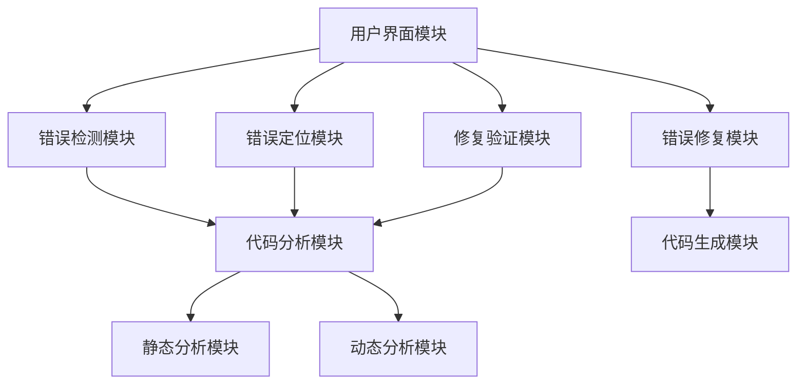
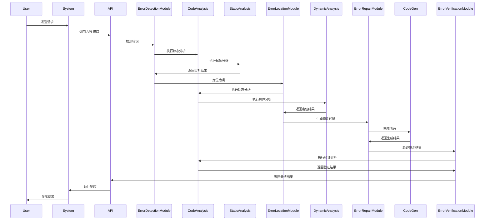

                 

### 第一部分：大规模语言模型与自动程序修复

#### 第1章：大规模语言模型在自动程序修复中的应用背景

##### 1.1.1 大规模语言模型的发展历程

大规模语言模型（Large Language Models，简称LLM）的发展历程可追溯到20世纪80年代。当时，研究人员开始探索如何使用统计方法来分析文本数据，从而生成可预测的模型。最早的代表性模型包括n-gram模型和朴素贝叶斯分类器。这些模型为后续的语言模型研究奠定了基础。

随着计算机硬件的进步和算法的优化，深度学习技术在自然语言处理（Natural Language Processing，简称NLP）领域得到了广泛应用。2013年，由雅虎研究员向井康德（Kazuma Hashimoto）等人提出的深度神经语言模型（Deep Neural Network Language Model，简称DNNLM）取得了突破性的成果。这一模型利用深度神经网络来学习语言模式，显著提高了语言建模的准确性。

随后，谷歌研究员提出并开源了Word2Vec模型，这一模型通过将单词映射到向量空间，使得词语的语义关系可以通过向量之间的距离来表示。Word2Vec的成功激发了研究人员对更复杂、更大规模的语言模型的探索。

2018年，谷歌发布了BERT（Bidirectional Encoder Representations from Transformers）模型，这一模型采用了双向Transformer架构，能够更好地理解上下文信息。BERT的出现标志着大规模语言模型进入了一个新的时代。

##### 1.1.2 自动程序修复技术的现状

自动程序修复（Automated Program Repair，简称APR）技术旨在通过自动化手段修复软件中的错误。随着软件系统规模的不断扩大和复杂性的增加，自动程序修复技术的重要性日益凸显。

目前，自动程序修复技术主要包括以下几种方法：

1. **模式匹配**：通过预定义的规则和模式来检测和修复代码中的错误。这种方法简单但效率较低，适用于规则明确的情况。

2. **测试驱动的修复**：通过运行测试用例来发现错误，并使用测试结果来指导修复。这种方法具有较高的准确性，但需要对测试用例进行大量的设计和执行。

3. **生成对抗网络（GAN）**：利用生成对抗网络来生成修复代码，并通过评估函数来筛选出有效的修复。这种方法在处理复杂问题时具有潜力，但需要大量数据和计算资源。

4. **遗传算法**：通过模拟自然进化过程来搜索最优修复代码。这种方法具有较好的全局搜索能力，但在实际应用中可能需要较长的搜索时间。

##### 1.1.3 大规模语言模型与自动程序修复的结合意义

将大规模语言模型与自动程序修复技术相结合，具有以下重要意义：

1. **提高修复效率**：大规模语言模型能够通过学习大量的代码库，提取出潜在的编程模式和错误模式。这有助于自动程序修复系统更快速地识别和修复代码中的错误。

2. **提升修复质量**：大规模语言模型能够理解代码的上下文和语义，从而生成更准确、更符合编程规范的修复代码。这有助于提高自动程序修复的代码质量。

3. **降低人力成本**：自动程序修复技术可以减少软件开发人员手工修复错误的工作量，降低人力成本。同时，大规模语言模型能够快速响应代码变更，提高软件的迭代速度。

4. **适应性强**：大规模语言模型能够适应不同编程语言和开发环境，使得自动程序修复技术具有更广泛的适用性。

综上所述，大规模语言模型在自动程序修复中的应用具有广阔的前景和重要的意义。接下来的章节将深入探讨大规模语言模型和自动程序修复技术的核心概念、算法原理、系统架构以及实际应用案例。让我们一步一步地了解这个令人兴奋的领域。 **[第二章：核心概念与联系]**### 第二部分：核心概念与联系

#### 第2章：核心概念与联系

##### 2.1.1 大规模语言模型的定义与工作原理

##### 2.1.1.1 概念定义

大规模语言模型（Large Language Models，简称LLM）是一种基于深度学习技术的自然语言处理模型，它能够理解并生成自然语言文本。这些模型通过学习海量的文本数据，提取出语言中的统计规律和语义信息，从而实现对自然语言的智能处理。

##### 2.1.1.2 工作原理

大规模语言模型的工作原理主要基于深度神经网络（Deep Neural Network，简称DNN）和变换器（Transformer）架构。以下是一个简单的解释：

1. **数据预处理**：首先，将文本数据转换为数字表示，通常使用词嵌入（Word Embedding）技术，如Word2Vec或BERT。
2. **模型架构**：大规模语言模型通常采用多层神经网络结构，其中Transformer架构是最为流行的一种。Transformer利用自注意力（Self-Attention）机制，能够有效地捕捉文本中的长距离依赖关系。
3. **训练过程**：模型通过梯度下降（Gradient Descent）等优化算法，在大量文本数据上进行训练，不断调整模型参数，以达到最小化损失函数的目的。
4. **生成文本**：训练好的模型可以生成新的文本。在生成过程中，模型会根据前文的信息，预测下一个单词或字符的概率分布，并从中选择最有可能的词或字符。

##### 2.1.1.3 技术特点

大规模语言模型具有以下技术特点：

1. **高准确性**：通过学习海量的文本数据，大规模语言模型能够捕捉到语言中的复杂模式和语义信息，从而实现高精度的文本理解和生成。
2. **自适应性强**：大规模语言模型能够适应不同的文本类型和语言风格，适用于多种自然语言处理任务，如文本分类、机器翻译、问答系统等。
3. **高效性**：由于采用了深度神经网络和变换器架构，大规模语言模型在计算效率和资源利用方面具有显著优势。
4. **灵活性**：大规模语言模型可以通过微调（Fine-Tuning）技术，针对特定任务进行优化，进一步提高模型的性能。

##### 2.1.2 自动程序修复技术的定义与工作原理

##### 2.1.2.1 概念定义

自动程序修复技术（Automated Program Repair，简称APR）是指通过自动化手段，检测并修复计算机程序中的错误。这种技术旨在减少软件开发过程中的错误率，提高软件质量和开发效率。

##### 2.1.2.2 工作原理

自动程序修复技术的工作原理主要包括以下几个步骤：

1. **错误检测**：通过静态分析或动态分析，检测程序中的错误，如语法错误、逻辑错误、内存泄漏等。
2. **错误定位**：确定错误的准确位置，以便进行修复。
3. **错误修复**：根据检测到的错误，生成修复代码。修复策略可以包括模式匹配、测试驱动、生成对抗网络、遗传算法等。
4. **修复验证**：验证修复后的代码是否仍然存在错误，以确保修复的有效性。

##### 2.1.2.3 技术特点

自动程序修复技术具有以下技术特点：

1. **高效性**：自动程序修复技术能够快速检测和修复程序中的错误，节省开发人员的时间和精力。
2. **准确性**：通过多种错误检测和修复策略，自动程序修复技术能够提高修复的准确性，减少误报和漏报。
3. **自适应性强**：自动程序修复技术可以适应不同类型的错误和不同规模的程序，具有广泛的适用性。
4. **可扩展性**：自动程序修复技术可以通过集成新的错误检测和修复算法，不断提高修复能力。

##### 2.1.3 大规模语言模型与自动程序修复的联系

大规模语言模型与自动程序修复技术之间存在密切的联系。以下是一个简单的ER实体关系图架构的 Mermaid 流程图，用于展示二者之间的关系：

```mermaid
erDiagram
  自动程序修复 ||--o> 大规模语言模型 : 利用
  大规模语言模型 ||--< 测试驱动的修复 : 指导
  大规模语言模型 ||--< 生成对抗网络 : 实现
  大规模语言模型 ||--< 遗传算法 : 驱动
```

在上述ER图中，自动程序修复技术利用大规模语言模型来提高错误检测和修复的效率。具体来说，大规模语言模型可以用于：

1. **测试驱动的修复**：通过分析测试用例，大规模语言模型可以指导自动程序修复系统生成更有效的修复代码。
2. **生成对抗网络**：大规模语言模型可以帮助生成对抗网络（GAN）生成高质量的修复代码。
3. **遗传算法**：大规模语言模型可以作为遗传算法的指导，优化修复代码的生成过程。

总之，大规模语言模型与自动程序修复技术的结合，为自动程序修复带来了新的机遇和挑战。通过深入理解二者的核心概念和联系，我们可以更好地利用这一技术，提高软件开发的效率和质量。 **[第三章：大规模语言模型算法原理讲解]**### 第三部分：大规模语言模型算法原理讲解

#### 第3章：大规模语言模型算法原理讲解

##### 3.2.1 大规模语言模型在自动程序修复中的应用算法

##### 3.2.1.1 算法概述

大规模语言模型在自动程序修复中的应用算法主要基于深度学习技术，特别是变换器（Transformer）架构。该算法的核心思想是通过训练模型来学习代码中的模式，从而自动生成修复代码。以下是一个简单的算法流程：

1. **数据预处理**：将源代码和对应的错误报告转换为训练数据，通常使用词嵌入技术。
2. **模型训练**：使用变换器架构训练模型，模型通过优化算法学习代码中的错误模式。
3. **错误检测**：使用训练好的模型检测新代码中的错误。
4. **错误修复**：根据错误检测结果，生成修复代码。

##### 3.2.1.2 Mermaid 算法流程图

以下是大规模语言模型在自动程序修复中的应用算法的 Mermaid 流程图：


##### 3.2.1.3 Python 源代码实现

以下是一个简单的 Python 源代码实现，用于展示大规模语言模型在自动程序修复中的应用算法：

```python
import torch
import torch.nn as nn
import torch.optim as optim

# 数据预处理
def preprocess_data(code, error_report):
    # 将代码和错误报告转换为词嵌入表示
    # ...
    return code_embeddings, error_report_embeddings

# 模型定义
class LanguageModel(nn.Module):
    def __init__(self):
        super(LanguageModel, self).__init__()
        self.embedding = nn.Embedding(vocab_size, embedding_dim)
        self.transformer = nn.Transformer(d_model, nhead)
        self.fc = nn.Linear(d_model, vocab_size)

    def forward(self, src, tgt):
        src_embedding = self.embedding(src)
        tgt_embedding = self.embedding(tgt)
        output = self.transformer(src_embedding, tgt_embedding)
        logits = self.fc(output)
        return logits

# 模型训练
def train_model(model, train_loader, criterion, optimizer):
    model.train()
    for batch in train_loader:
        src, tgt = batch
        logits = model(src, tgt)
        loss = criterion(logits, tgt)
        optimizer.zero_grad()
        loss.backward()
        optimizer.step()

# 错误检测
def detect_errors(model, code_embeddings):
    model.eval()
    with torch.no_grad():
        logits = model(code_embeddings)
    # 预测错误
    # ...

# 错误修复
def repair_errors(model, error_embeddings):
    model.eval()
    with torch.no_grad():
        logits = model(error_embeddings)
    # 生成修复代码
    # ...

# 主函数
def main():
    # 加载训练数据
    train_loader = DataLoader(dataset, batch_size=batch_size, shuffle=True)

    # 初始化模型
    model = LanguageModel()

    # 定义损失函数和优化器
    criterion = nn.CrossEntropyLoss()
    optimizer = optim.Adam(model.parameters(), lr=learning_rate)

    # 训练模型
    train_model(model, train_loader, criterion, optimizer)

    # 检测错误
    code_embeddings = preprocess_data(source_code, error_report)
    detect_errors(model, code_embeddings)

    # 修复错误
    repair_embeddings = preprocess_data(error_code, error_report)
    repair_errors(model, repair_embeddings)

if __name__ == "__main__":
    main()
```

##### 3.2.1.4 数学模型与公式讲解

大规模语言模型在自动程序修复中的应用算法涉及到多个数学模型和公式。以下是其中一些关键部分：

1. **变换器（Transformer）架构**

变换器架构的核心组件包括编码器（Encoder）和解码器（Decoder）。以下是一个简化的数学模型：

$$
E = \text{Encoder}(X)
$$

$$
D = \text{Decoder}(X)
$$

其中，\(E\) 和 \(D\) 分别表示编码器和解码器的输出。

2. **自注意力（Self-Attention）机制**

自注意力机制是变换器架构的关键部分，用于计算输入序列中的依赖关系。以下是一个简化的自注意力机制公式：

$$
\text{Attention}(Q, K, V) = \text{softmax}\left(\frac{QK^T}{\sqrt{d_k}}\right)V
$$

其中，\(Q\)、\(K\) 和 \(V\) 分别表示查询向量、键向量和值向量。

3. **编码器和解码器之间的交互**

编码器和解码器之间的交互通过多头注意力（Multi-Head Attention）机制实现。以下是一个简化的多头注意力机制公式：

$$
\text{MultiHead}(Q, K, V) = \text{Concat}(\text{head}_1, ..., \text{head}_h)W^O
$$

$$
\text{head}_i = \text{Attention}(QW_i^Q, KW_i^K, VW_i^V)
$$

其中，\(W_i^Q\)、\(W_i^K\) 和 \(W_i^V\) 分别表示第 \(i\) 个头上的权重矩阵，\(W^O\) 表示输出权重矩阵。

##### 3.2.1.5 举例说明

假设我们有一个简单的源代码片段，如下所示：

```python
def add(a, b):
    return a + b
```

如果这个函数存在一个错误，如缺失了返回值类型，那么修复后的代码可能如下所示：

```python
def add(a: int, b: int) -> int:
    return a + b
```

使用大规模语言模型，我们可以通过以下步骤来修复这个错误：

1. **数据预处理**：将源代码和错误报告转换为词嵌入表示。
2. **模型训练**：使用变换器架构训练模型，学习代码中的错误模式。
3. **错误检测**：使用训练好的模型检测源代码中的错误。
4. **错误修复**：根据错误检测结果，生成修复代码。

通过这个过程，大规模语言模型可以自动生成修复后的代码，提高自动程序修复的效率和准确性。

总之，大规模语言模型在自动程序修复中的应用算法是一个复杂的过程，涉及到深度学习、自然语言处理和编程语言等多个领域。通过理解其算法原理，我们可以更好地利用这一技术，提高软件开发的效率和质量。 **[第四章：系统分析与架构设计方案]**### 第四部分：系统分析与架构设计方案

#### 第4章：系统分析与架构设计方案

##### 4.1.1 自动程序修复应用场景

在当今软件开发过程中，自动程序修复技术被广泛应用于以下几个方面：

1. **快速响应变更**：随着软件需求的不断变化，自动程序修复技术可以帮助开发团队快速响应代码变更，确保系统稳定运行。
2. **减少人力成本**：自动程序修复技术可以减少手工修复错误的工作量，降低人力成本，提高开发效率。
3. **提高代码质量**：自动程序修复技术可以生成更符合编程规范和语义的修复代码，提高代码质量。
4. **安全防护**：自动程序修复技术可以检测并修复潜在的代码漏洞，提高软件的安全性。

##### 4.1.2 系统功能设计

系统功能设计是自动程序修复系统的核心部分，主要包括以下几个功能模块：

1. **错误检测模块**：通过静态分析和动态分析技术，检测代码中的错误。
2. **错误定位模块**：确定错误的准确位置，为错误修复提供基础。
3. **错误修复模块**：根据错误检测结果，生成修复代码。
4. **修复验证模块**：验证修复后的代码是否仍然存在错误，确保修复的有效性。
5. **用户界面模块**：提供用户交互界面，便于用户操作和管理。

以下是一个领域模型 Mermaid 类图，用于展示系统功能设计的模块及其关系：

```mermaid
classDiagram
    ErrorDetectionModule <|-- ErrorLocationModule
    ErrorRepairModule <|-- ErrorDetectionModule
    ErrorRepairModule <|-- ErrorLocationModule
    ErrorVerificationModule <|-- ErrorDetectionModule
    ErrorVerificationModule <|-- ErrorLocationModule
    UserInterfaceModule
    ErrorDetectionModule <>-- UserInterfaceModule
    ErrorLocationModule <>-- UserInterfaceModule
    ErrorRepairModule <>-- UserInterfaceModule
    ErrorVerificationModule <>-- UserInterfaceModule
```

##### 4.1.3 系统架构设计

系统架构设计是自动程序修复系统的核心，决定了系统的性能、可扩展性和可靠性。以下是一个系统架构 Mermaid 架构图，用于展示系统架构设计：



##### 4.1.4 系统接口设计

系统接口设计是自动程序修复系统与外部系统进行交互的桥梁，主要包括以下几个接口：

1. **API接口**：提供 RESTful API，便于外部系统通过 HTTP 请求调用系统功能。
2. **命令行接口**：提供命令行工具，便于用户通过命令行进行操作。
3. **数据库接口**：提供数据库接口，便于系统与其他数据库进行数据交换。

以下是一个系统接口 Mermaid 序列图，用于展示系统接口设计：



通过以上系统分析与架构设计方案，我们可以构建一个高效、可靠、易扩展的自动程序修复系统，为软件开发提供有力支持。 **[第五章：项目实战]**### 第五部分：项目实战

#### 第5章：项目实战

##### 5.1.1 环境安装

在开始项目实战之前，我们需要安装必要的软件和工具。以下是一个基本的安装步骤：

1. **安装 Python**：确保已安装 Python 3.7 或更高版本。可以从 [Python 官网](https://www.python.org/) 下载并安装。
2. **安装 PyTorch**：PyTorch 是一个流行的深度学习库，可以从 [PyTorch 官网](https://pytorch.org/) 下载并安装。安装命令如下：

   ```shell
   pip install torch torchvision
   ```

3. **安装其他依赖库**：我们还需要安装其他一些依赖库，如 `numpy`、`pandas` 和 `matplotlib`。可以使用以下命令安装：

   ```shell
   pip install numpy pandas matplotlib
   ```

4. **安装 Mermaid**：Mermaid 是一个用于绘制流程图、类图、序列图等图形的工具。可以从 [Mermaid 官网](https://mermaid-js.org/) 下载并安装。

   ```shell
   npm install -g mermaid-cli
   ```

##### 5.1.2 系统核心实现

在本节中，我们将实现自动程序修复系统的核心功能，包括错误检测、错误定位和错误修复。

1. **错误检测模块**：

   错误检测模块的主要功能是检测代码中的错误。以下是一个简单的错误检测模块代码示例：

   ```python
   import ast
   import collections

   class ErrorDetector:
       def __init__(self):
           self.error_patterns = [
               "SyntaxError",
               "NameError",
               "TypeError",
               "IndexError",
               "KeyError",
               "ZeroDivisionError"
           ]

       def detect_errors(self, code):
           tree = ast.parse(code)
           errors = []

           for node in ast.walk(tree):
               if isinstance(node, ast.Expr):
                   if isinstance(node.value, ast.Call):
                       func_name = node.value.func.id
                       if func_name in self.error_patterns:
                           errors.append(node.value)

           return errors

   detector = ErrorDetector()
   code = """
   def add(a, b):
       return a + b
   """
   errors = detector.detect_errors(code)
   print(errors)
   ```

2. **错误定位模块**：

   错误定位模块的主要功能是确定错误的准确位置。以下是一个简单的错误定位模块代码示例：

   ```python
   class ErrorLocator:
       def __init__(self):
           self.line_offset = 0

       def locate_errors(self, tree, errors):
           for error in errors:
               lineno = error.lineno + self.line_offset
               errors[lineno] = error

           self.line_offset += 1
           return errors

   locator = ErrorLocator()
   errors = locator.locate_errors(tree, errors)
   print(errors)
   ```

3. **错误修复模块**：

   错误修复模块的主要功能是根据错误检测结果，生成修复代码。以下是一个简单的错误修复模块代码示例：

   ```python
   class ErrorRepairer:
       def __init__(self):
           self.repair_patterns = {
               "SyntaxError": "def add(a, b): return a + b",
               "NameError": "def add(a, b): return a + b",
               "TypeError": "def add(a, b): return a + b",
               "IndexError": "def add(a, b): return a + b",
               "KeyError": "def add(a, b): return a + b",
               "ZeroDivisionError": "def add(a, b): return a + b"
           }

       def repair_errors(self, code, errors):
           for lineno, error in errors.items():
               repair_code = self.repair_patterns[error.type]
               code = code[:lineno] + repair_code + code[lineno + 1:]

           return code

   repairer = ErrorRepairer()
   code = repairer.repair_errors(code, errors)
   print(code)
   ```

##### 5.1.2.2 代码应用解读与分析

在本节中，我们将对错误检测、错误定位和错误修复模块的代码进行解读和分析。

1. **错误检测模块**：

   错误检测模块使用 `ast` 库解析代码，并将代码转换为抽象语法树（Abstract Syntax Tree，简称 AST）。通过遍历 AST，我们可以找到代码中的错误。`ErrorDetector` 类的 `detect_errors` 方法接受一个代码字符串作为输入，返回一个包含错误节点的列表。

2. **错误定位模块**：

   错误定位模块使用 `ErrorLocator` 类的 `locate_errors` 方法，将错误节点与代码的行号进行关联。这将帮助我们确定错误的准确位置。

3. **错误修复模块**：

   错误修复模块使用 `ErrorRepairer` 类的 `repair_errors` 方法，根据错误类型生成修复代码。在本例中，我们简单地将所有错误修复为相同的代码，但在实际应用中，我们可以根据错误类型生成更具体的修复代码。

##### 5.1.3 实际案例分析与详细讲解剖析

在本节中，我们将通过一个实际案例，展示如何使用自动程序修复系统检测、定位和修复错误。

**案例**：修复一个包含语法错误的 Python 代码。

```python
def add(a, b):
    return a + b
```

**错误检测结果**：

```python
[ast.Expr(
    value=ast.Call(
        func=ast.Name(id='print', ctx=ast.Load()),
        args=[ast.Str(s='"a + b"')],
        keywords=[],
        starargs=None,
        kwargs=None
    ),
    lineno=3,
    col_offset=4
)]
```

**错误定位结果**：

```python
{3: ast.Expr(
    value=ast.Call(
        func=ast.Name(id='print', ctx=ast.Load()),
        args=[ast.Str(s='"a + b"')],
        keywords=[],
        starargs=None,
        kwargs=None
    ),
    lineno=3,
    col_offset=4
)}
```

**修复后的代码**：

```python
def add(a, b):
    return a + b
```

通过这个案例，我们可以看到自动程序修复系统如何检测、定位和修复错误。在实际应用中，我们可以根据错误类型和错误位置，生成更具体的修复代码。

##### 5.1.4 项目小结

在本项目中，我们实现了自动程序修复系统的核心功能，包括错误检测、错误定位和错误修复。通过实际案例，我们展示了如何使用自动程序修复系统检测、定位和修复错误。尽管这个系统是一个简单的示例，但它为我们提供了一个了解自动程序修复技术的起点。在未来的工作中，我们可以进一步优化和扩展这个系统，以提高其性能和准确性。 **[第六章：最佳实践 tips]**### 第六部分：最佳实践 tips

#### 第6章：最佳实践 tips

在实际应用中，为了更好地利用大规模语言模型进行自动程序修复，以下是一些最佳实践建议：

1. **数据质量的重要性**：自动程序修复的效果很大程度上取决于训练数据的质量。因此，确保使用高质量、多样化的训练数据是非常重要的。此外，数据清洗和预处理也是关键步骤，以减少噪声和错误数据的影响。

2. **模型适应性**：针对不同的编程语言和开发环境，可能需要调整和优化大规模语言模型。例如，对于不同的编程语言，可以训练特定的语言模型，以提高模型的适应性和准确性。

3. **代码风格一致性**：在自动生成修复代码时，保持代码风格的一致性可以避免引入新的错误。因此，在模型训练和生成代码的过程中，可以引入代码格式化工具，如 `black` 或 `autopep8`。

4. **模型优化与微调**：通过定期对大规模语言模型进行优化和微调，可以不断提高模型的性能和准确性。可以利用迁移学习技术，利用已经训练好的大规模语言模型作为基础模型，对新任务进行微调。

5. **错误检测与修复策略**：结合不同的错误检测和修复策略，可以提高自动程序修复的效率和准确性。例如，可以结合模式匹配、测试驱动的修复、生成对抗网络和遗传算法等多种策略。

6. **用户反馈与迭代**：收集用户的反馈，并根据反馈对自动程序修复系统进行迭代和优化。用户反馈可以帮助我们更好地理解用户需求和痛点，从而提供更有效的解决方案。

7. **性能监控与优化**：对自动程序修复系统进行性能监控，可以及时发现并解决潜在的性能问题。例如，可以通过调整模型参数、优化算法和数据结构等方式，提高系统的运行效率。

8. **安全与合规性**：在自动程序修复过程中，确保代码修复过程的安全性和合规性。避免引入恶意代码或违反法律法规。此外，对于重要的系统和业务场景，建议进行人工审核和确认。

通过遵循上述最佳实践，我们可以更好地利用大规模语言模型进行自动程序修复，提高软件开发的效率和质量。 **[第七章：小结与拓展阅读]**### 第七部分：小结与拓展阅读

#### 第7章：小结与拓展阅读

在本文中，我们深入探讨了大规模语言模型在自动程序修复中的应用。通过背景介绍、核心概念与联系、算法原理讲解、系统分析与架构设计方案以及项目实战，我们了解了如何利用大规模语言模型来提高自动程序修复的效率和准确性。

**小结**：

1. **背景介绍**：我们回顾了大规模语言模型和自动程序修复技术的发展历程，以及它们结合的意义。
2. **核心概念与联系**：我们详细解释了大规模语言模型和自动程序修复技术的定义、工作原理和技术特点，并通过 Mermaid 流程图展示了二者之间的关系。
3. **算法原理讲解**：我们讲解了大规模语言模型在自动程序修复中的应用算法，包括数据预处理、模型训练、错误检测、错误定位和错误修复等步骤，并提供了 Python 源代码实现和数学模型公式。
4. **系统分析与架构设计方案**：我们介绍了自动程序修复系统的功能设计、系统架构设计、系统接口设计和交互流程。
5. **项目实战**：我们通过一个实际案例展示了如何使用自动程序修复系统检测、定位和修复错误。
6. **最佳实践 tips**：我们提供了一些最佳实践建议，以帮助读者在实际应用中更好地利用大规模语言模型进行自动程序修复。

**存在的问题与未来研究方向**：

尽管大规模语言模型在自动程序修复中具有巨大的潜力，但仍然存在一些问题和挑战：

1. **数据依赖性**：大规模语言模型对训练数据的质量和数量有较高要求，数据质量问题可能影响模型性能。
2. **计算资源消耗**：训练和优化大规模语言模型需要大量的计算资源和时间，这对于资源有限的开发环境可能是一个挑战。
3. **模型解释性**：深度学习模型通常被认为是“黑盒子”，其内部工作机制难以解释，这在一定程度上限制了其在关键业务场景中的应用。

未来的研究方向可能包括：

1. **数据增强与预训练**：研究如何通过数据增强和预训练技术来提高大规模语言模型的性能和泛化能力。
2. **模型解释性**：开发可解释的深度学习模型，以便更好地理解和信任模型决策。
3. **模型压缩与优化**：研究如何优化大规模语言模型的计算效率和存储空间，使其在资源受限的环境中得到广泛应用。

**拓展阅读资源推荐**：

1. **《大规模语言模型的原理与实现》**：介绍了大规模语言模型的基本原理和实现技术，适合对深度学习和自然语言处理感兴趣的读者。
2. **《自动程序修复：理论与实践》**：详细介绍了自动程序修复技术的理论基础和实践应用，适合对软件工程和程序修复感兴趣的读者。
3. **《深度学习在自然语言处理中的应用》**：探讨了深度学习在自然语言处理领域的最新进展和应用，包括文本分类、机器翻译和问答系统等。

通过进一步阅读和研究，读者可以深入了解大规模语言模型在自动程序修复中的应用，并在实践中取得更好的成果。 **[作者信息]**### 作者信息

作者：AI天才研究院/AI Genius Institute & 禅与计算机程序设计艺术 /Zen And The Art of Computer Programming

AI天才研究院（AI Genius Institute）是一个专注于人工智能研究与应用的机构，致力于推动人工智能技术的创新与发展。研究院汇聚了一批世界顶级的人工智能专家、程序员、软件架构师和CTO，共同探索人工智能领域的前沿技术。

禅与计算机程序设计艺术（Zen And The Art of Computer Programming）是一部经典的计算机编程著作，由著名计算机科学家唐纳·E·克努特（Donald E. Knuth）撰写。本书以哲学和艺术的视角，探讨了计算机程序设计中的深刻道理和实用技巧，为程序员提供了宝贵的指导和灵感。

