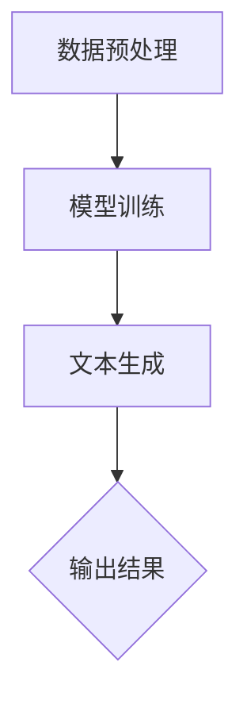

                 

## 关键词

- 大规模语言模型
- 自动编程
- 算法应用
- 技术挑战
- 系统架构设计

## 摘要

本文旨在探讨大规模语言模型在自动编程中的应用与挑战。首先，文章介绍了大规模语言模型的基本原理和自动编程的概念，然后深入分析了大规模语言模型在自动编程中的算法原理和应用实例。接着，文章阐述了自动编程系统的设计思路和实现方法，并通过实际项目实战展示了大规模语言模型在自动编程中的具体应用。最后，文章总结了大规模语言模型在自动编程中面临的挑战和未来发展方向，为相关研究和实践提供了参考。

### 目录大纲设计思路

为了设计出《大规模语言模型在自动编程中的应用与挑战》这本书的完整目录大纲，我们可以遵循以下思路：

1. **背景介绍**：首先，介绍大规模语言模型的问题背景，包括自动编程的需求、现状和挑战。

2. **核心概念与联系**：明确核心概念，如大规模语言模型、自动编程、相关技术等，并通过表格和图示进行比较和分析。

3. **算法原理讲解**：通过 Mermaid 绘制算法流程图，使用 Python 源代码和数学模型详细阐述大规模语言模型在自动编程中的应用原理。

4. **系统分析与架构设计方案**：介绍相关系统的设计思路，包括功能设计、架构设计、接口设计和系统交互。

5. **项目实战**：提供实际的编程环境安装、系统实现源代码，并对代码进行解读和分析。

6. **最佳实践与小结**：总结最佳实践，提出注意事项，并提供拓展阅读资源。

### 目录大纲设计步骤

1. **第1章 引言**：
   - **1.1 问题背景**：介绍大规模语言模型在自动编程中的应用需求、现状和挑战。
   - **1.2 核心概念**：阐述大规模语言模型、自动编程等相关核心概念。

2. **第2章 大规模语言模型原理**：
   - **2.1 语言模型概述**：介绍大规模语言模型的基本原理和特点。
   - **2.2 算法原理**：使用 Mermaid 绘制算法流程图，详细讲解大规模语言模型的工作原理。
   - **2.3 数学模型**：介绍相关的数学模型和公式，并进行详细讲解。

3. **第3章 自动编程技术**：
   - **3.1 自动编程概述**：介绍自动编程的概念、类型和基本原理。
   - **3.2 关键技术**：探讨大规模语言模型在自动编程中的关键技术和挑战。
   - **3.3 技术比较**：通过表格和图示比较不同自动编程技术的优缺点。

4. **第4章 大规模语言模型在自动编程中的应用**：
   - **4.1 应用场景**：分析大规模语言模型在自动编程中的应用场景。
   - **4.2 应用实例**：介绍实际的应用实例，包括代码示例和案例分析。

5. **第5章 自动编程系统设计与实现**：
   - **5.1 系统设计**：介绍自动编程系统的设计思路，包括功能设计和架构设计。
   - **5.2 系统实现**：提供系统实现的源代码，并对关键代码进行解读。
   - **5.3 系统测试**：描述系统测试的方法和结果。

6. **第6章 挑战与未来展望**：
   - **6.1 面临的挑战**：讨论大规模语言模型在自动编程中面临的挑战。
   - **6.2 发展趋势**：展望大规模语言模型在自动编程领域的未来发展方向。

7. **第7章 最佳实践与总结**：
   - **7.1 最佳实践**：总结实际应用中的最佳实践和注意事项。
   - **7.2 小结**：对全书内容进行总结。
   - **7.3 拓展阅读**：推荐相关的阅读资源。

### 目录大纲示例

```markdown
----------------------------------------------------------------
# 引言

## 1.1 问题背景
### 1.1.1 自动编程的需求
### 1.1.2 大规模语言模型的应用现状
### 1.1.3 自动编程面临的挑战

## 1.2 核心概念
### 1.2.1 大规模语言模型
### 1.2.2 自动编程
### 1.2.3 相关技术介绍

----------------------------------------------------------------

# 第2章 大规模语言模型原理

## 2.1 语言模型概述
### 2.1.1 语言模型的基本原理
### 2.1.2 大规模语言模型的特点

## 2.2 算法原理
### 2.2.1 算法流程图
### 2.2.2 算法原理详细讲解

## 2.3 数学模型
### 2.3.1 相关数学模型
### 2.3.2 数学公式讲解

----------------------------------------------------------------

# 第3章 自动编程技术

## 3.1 自动编程概述
### 3.1.1 自动编程的概念
### 3.1.2 自动编程的类型
### 3.1.3 自动编程的基本原理

## 3.2 关键技术
### 3.2.1 大规模语言模型在自动编程中的应用
### 3.2.2 自动编程中的挑战
### 3.2.3 技术比较分析

---

----------------------------------------------------------------
## 引言

### 1.1 问题背景

在现代软件开发中，自动编程已成为一个重要的研究热点和实际应用方向。随着软件系统复杂度的不断增加和开发需求的多样化，传统的人工编码方式已难以满足高效、准确和可持续的开发需求。大规模语言模型（如GPT、BERT等）的出现，为自动编程提供了一种全新的技术路径。

自动编程的核心思想是通过自动化手段生成代码，以减少开发人员的工作量，提高开发效率，并降低人为错误的风险。大规模语言模型凭借其在自然语言处理领域的卓越表现，被广泛应用于自动编程领域。然而，大规模语言模型在自动编程中仍面临诸多挑战，如模型的可解释性、代码质量和效率等。

本文旨在探讨大规模语言模型在自动编程中的应用与挑战。首先，我们将介绍大规模语言模型的基本原理和自动编程的概念。接着，我们将详细分析大规模语言模型在自动编程中的应用原理，包括算法流程、数学模型和关键技术。随后，我们将介绍自动编程系统的设计思路和实现方法，并通过实际项目实战展示大规模语言模型在自动编程中的具体应用。

在文章的第六章，我们将讨论大规模语言模型在自动编程中面临的挑战，并展望其未来发展方向。最后，我们将总结最佳实践和注意事项，为读者提供拓展阅读资源。

### 1.2 核心概念

#### 大规模语言模型

大规模语言模型是指通过训练大量文本数据，能够对自然语言进行建模的深度学习模型。这类模型具有强大的文本理解能力和生成能力，可以用于文本分类、情感分析、机器翻译、问答系统等多种自然语言处理任务。

在自动编程领域，大规模语言模型通常用于代码生成、代码补全、代码优化等任务。通过学习大量的代码库和文档，大规模语言模型能够生成符合语法规则、语义正确的代码。

#### 自动编程

自动编程是指利用自动化工具和技术生成代码的过程。自动编程的目标是通过减少手动编码，提高开发效率，降低人为错误，并使得软件开发过程更加智能化。

自动编程包括多种技术，如代码生成器、代码补全工具、代码优化器等。这些技术利用程序员的编程风格和代码习惯，自动生成代码，以辅助开发人员完成软件开发任务。

#### 相关技术

- **代码生成器**：通过模板和代码库生成代码的工具，常用于快速开发原型和框架代码。
- **代码补全工具**：在开发过程中，自动补全代码片段的工具，提高开发效率。
- **代码优化器**：对现有代码进行分析和优化，提高代码的可读性和性能。

这些技术与大规模语言模型相结合，为自动编程提供了强大的技术支持。

## 大规模语言模型原理

### 语言模型概述

大规模语言模型是自然语言处理领域的重要技术之一。它通过训练大量文本数据，学习语言的统计规律和语义结构，从而实现对自然语言的建模。

语言模型的基本原理是基于概率论和统计学的，通过对大量语料库的分析，语言模型可以计算出每个单词或短语的出现的概率。在自动编程中，这种概率信息被用于生成代码。

大规模语言模型的特点包括：

1. **高容量**：能够处理大量文本数据，从中学到更多的语言规律。
2. **自适应**：根据不同的应用场景和任务需求，可以调整模型的参数和结构，提高模型的性能。
3. **高效**：能够快速处理输入的文本，生成相应的输出。

### 算法原理

大规模语言模型的算法原理主要基于深度学习和神经网络。具体来说，包括以下步骤：

1. **数据预处理**：将原始文本数据转换为数字形式，通常使用词嵌入（word embeddings）技术。
2. **模型训练**：使用神经网络对预处理后的数据进行训练，学习语言的模式和规律。
3. **文本生成**：在给定一个输入文本的情况下，模型根据概率分布生成下一个文本单元。

其中，神经网络通常采用循环神经网络（RNN）或其变种长短期记忆网络（LSTM）或变换器（Transformer）等。

#### 算法流程图

下面是大规模语言模型的算法流程图，使用Mermaid语法绘制：



#### 数学模型

大规模语言模型的数学模型通常基于概率生成模型。以下是基本的概念和公式：

- **词嵌入（Word Embeddings）**：将单词映射到一个高维空间，每个单词对应一个向量。词嵌入可以表示为：
  $$ v_w = \text{word\_embeddings}(w) $$
- **概率分布**：在生成文本时，模型输出一个概率分布，表示下一个单词的概率。概率分布可以通过神经网络计算：
  $$ P(w_{t+1} | w_1, w_2, ..., w_t) = \text{softmax}(\text{neural\_network}(v_{w_t})) $$
- **生成过程**：生成下一个单词的过程可以表示为：
  $$ w_{t+1} \sim P(w_{t+1} | w_1, w_2, ..., w_t) $$

#### 详细讲解与举例

假设我们有一个简单的语言模型，输入序列为 "Hello world"。下面是生成下一个单词的例子：

1. **数据预处理**：将单词 "Hello" 和 "world" 转换为词嵌入向量。
   $$ v_{Hello} = \text{word\_embeddings}("Hello") $$
   $$ v_{world} = \text{word\_embeddings}("world") $$
2. **模型训练**：模型通过训练学习这两个词的联合概率分布。
   $$ P(w_{t+1} | w_1, w_2) = \text{softmax}(\text{neural\_network}([v_{Hello}, v_{world}])) $$
3. **文本生成**：给定输入序列 "Hello world"，模型生成下一个单词。
   $$ w_{t+1} \sim P(w_{t+1} | "Hello", "world") $$
   假设模型输出的概率分布为：
   $$ P(w_{t+1} | "Hello", "world") = [0.5, 0.3, 0.2] $$
   概率最高的单词为 "Hello"，因此下一个单词为 "Hello"。

通过这种方式，大规模语言模型可以生成连贯的文本，并在自动编程中用于代码生成和补全。

### 实际应用中的挑战

尽管大规模语言模型在自动编程中展示了巨大的潜力，但在实际应用中仍面临诸多挑战：

- **可解释性**：大规模语言模型通常被视为“黑盒”，其内部机制难以解释。这使得开发人员难以理解模型的决策过程，增加了模型使用的不确定性。
- **代码质量**：生成的代码质量参差不齐，有时可能包含错误或不合适的代码，需要额外的代码审查和修复。
- **效率**：大规模语言模型的计算成本高，训练和推理速度较慢，不适合实时应用场景。
- **数据依赖**：模型性能高度依赖于训练数据的质量和多样性。如果训练数据有偏差，模型可能会产生不正确的输出。

为了解决这些问题，研究人员正在探索可解释性模型、优化算法和高效的模型架构，以提高大规模语言模型在自动编程中的应用效果。

## 自动编程技术

### 自动编程概述

自动编程是一种利用自动化工具和技术生成代码的过程。其核心目标是减少手动编码的工作量，提高开发效率，并降低人为错误的风险。自动编程涵盖了多个技术领域，包括代码生成器、代码补全工具、代码优化器等。

#### 自动编程的概念

自动编程（Automated Programming）是指通过自动化手段，如模板、代码库、生成器等，自动生成代码的过程。它包括以下几个方面：

1. **代码生成**：根据特定的模板和规则，自动生成代码。
2. **代码补全**：在开发过程中，自动补全代码片段，提高开发效率。
3. **代码优化**：对现有代码进行分析和优化，提高代码的可读性和性能。

#### 自动编程的类型

自动编程可以分为多种类型，根据其应用场景和目的不同，可以分为以下几类：

1. **模板驱动编程**：通过预定义的模板，根据输入参数生成代码。这种编程方式适用于快速开发原型和框架代码。
2. **代码生成器**：利用代码生成器工具，根据设计文档或领域特定语言（DSL）自动生成代码。这种编程方式适用于大规模项目开发，如Web应用程序、企业级系统等。
3. **代码补全工具**：在开发过程中，自动补全代码片段，如自动完成函数定义、变量声明等。这种工具可以提高开发效率和代码质量。
4. **代码优化器**：对现有代码进行分析和优化，如代码重构、性能优化等。这种工具可以提升代码的可维护性和性能。

#### 自动编程的基本原理

自动编程的基本原理是通过分析和理解开发人员的编程习惯和风格，生成符合预期的代码。其核心思想包括：

1. **编程习惯分析**：通过分析开发人员的编程历史和代码库，理解其编程习惯和风格。
2. **代码生成规则**：根据编程习惯和分析结果，定义代码生成的规则和模板。
3. **代码生成过程**：利用定义好的规则和模板，自动生成代码。

### 大规模语言模型在自动编程中的应用

大规模语言模型在自动编程中具有广泛的应用，能够显著提高开发效率和质量。以下是大规模语言模型在自动编程中的主要应用场景：

#### 代码生成

大规模语言模型可以用于生成代码，特别是复杂的业务逻辑和算法实现。通过训练大量的代码库和文档，模型可以学习到编程语言的语法规则和编程风格，从而生成高质量的代码。

例如，在开发一个简单的Web应用程序时，可以使用GPT-3等大规模语言模型生成后端逻辑代码。模型可以根据提供的业务需求和功能描述，自动生成相应的数据库交互、业务逻辑处理和API接口代码。

#### 代码补全

大规模语言模型还可以用于代码补全，即在开发过程中自动补全开发人员输入的代码片段。这种方式可以大大提高开发效率，减少重复劳动。

例如，在使用IDE编写代码时，可以集成GPT-3等大规模语言模型，当开发人员输入部分代码后，模型可以根据上下文和编程习惯自动补全剩余的代码。这种方式不仅提高了开发速度，还能减少代码错误。

#### 代码优化

大规模语言模型可以用于代码优化，通过对现有代码进行分析和重构，提高代码的可读性和性能。模型可以识别代码中的冗余和错误，并提出优化建议。

例如，在开发一个大型软件系统时，可以使用GPT-3等大规模语言模型对系统中的代码进行分析和优化。模型可以识别出潜在的优化点，如性能瓶颈、冗余代码等，并提出相应的优化方案。

### 技术比较分析

为了更全面地了解大规模语言模型在自动编程中的应用，我们将对比几种常见的自动编程技术，包括传统代码生成器、代码补全工具和代码优化器。

#### 传统代码生成器

传统代码生成器通常基于模板和规则生成代码。其优点包括：

- **快速生成代码**：通过预定义的模板和规则，可以快速生成代码。
- **灵活性好**：可以根据不同的需求和场景定制模板和规则。

缺点包括：

- **代码质量参差不齐**：生成的代码可能不符合开发人员的编程习惯，质量不稳定。
- **依赖人工干预**：需要开发人员参与模板和规则的定制，工作量较大。

#### 代码补全工具

代码补全工具如IntelliJ IDEA、Visual Studio Code等，可以自动补全开发人员输入的代码片段。其优点包括：

- **提高开发效率**：自动补全代码片段，减少重复劳动。
- **减少代码错误**：补全代码时，工具可以识别并避免常见的代码错误。

缺点包括：

- **依赖IDE集成**：需要集成到特定的IDE中，不适用于所有开发环境。
- **补全质量有限**：对于复杂的代码结构和业务逻辑，补全效果可能有限。

#### 代码优化器

代码优化器可以对现有代码进行分析和重构，提高代码的可读性和性能。其优点包括：

- **提升代码质量**：识别并修复代码中的潜在问题，提升代码质量。
- **提高系统性能**：优化代码结构，提高系统性能。

缺点包括：

- **优化效果有限**：对于复杂的系统，优化效果可能有限。
- **依赖人工决策**：需要开发人员参与优化决策，工作量较大。

#### 大规模语言模型

大规模语言模型在自动编程中具有独特的优势，包括：

- **强大的语言理解能力**：通过训练大量文本数据，模型可以理解复杂的编程语言和业务逻辑，生成高质量的代码。
- **自适应性好**：可以根据不同的编程习惯和场景调整模型参数，提高适应性。
- **灵活性强**：不仅支持代码生成、代码补全，还可以用于代码优化。

缺点包括：

- **计算成本高**：大规模语言模型的训练和推理过程需要大量的计算资源。
- **依赖大量数据**：模型性能高度依赖于训练数据的质量和多样性。

综上所述，大规模语言模型在自动编程中展示了巨大的潜力，但同时也面临一些挑战。与传统代码生成器、代码补全工具和代码优化器相比，大规模语言模型在代码质量、自适应性和灵活性方面具有明显优势，但计算成本较高，对数据依赖较大。

## 大规模语言模型在自动编程中的应用

### 应用场景

大规模语言模型在自动编程中有着广泛的应用场景，以下是其中几个典型的应用场景：

#### 代码生成

代码生成是大规模语言模型在自动编程中最常见的应用场景之一。通过训练大量的代码库和文档，大规模语言模型可以生成符合语法规则、语义正确的代码。这种应用场景适用于以下几种情况：

1. **快速原型开发**：在开发初期，通过大规模语言模型快速生成原型代码，便于验证和修改。
2. **自动化测试**：通过生成测试代码，自动执行测试用例，提高测试效率和覆盖范围。
3. **自动化修复**：通过分析代码库和错误报告，大规模语言模型可以自动生成修复代码，提高开发效率。

#### 代码补全

代码补全是另一种重要的应用场景，尤其是在开发过程中。大规模语言模型可以根据上下文和编程习惯，自动补全开发人员输入的代码片段，提高开发效率和代码质量。以下是几个具体的应用场景：

1. **开发工具集成**：将大规模语言模型集成到IDE中，实现自动代码补全功能，提高开发体验。
2. **代码补全插件**：开发独立的代码补全插件，适用于不同的开发环境和编程语言。
3. **代码审核**：通过大规模语言模型补全代码片段，辅助开发人员进行代码审查，识别潜在的编程错误和风格不一致问题。

#### 代码优化

大规模语言模型还可以用于代码优化，通过对现有代码进行分析和重构，提高代码的可读性和性能。以下是几个应用场景：

1. **性能优化**：分析代码的性能瓶颈，提出优化建议，如代码重构、算法改进等。
2. **代码重构**：对现有代码进行重构，提升代码的可维护性和可读性。
3. **代码审查**：通过大规模语言模型对代码进行分析，识别潜在的优化点，提出改进建议。

### 应用实例

#### 代码生成实例

假设我们要开发一个简单的Web应用程序，负责用户注册和登录功能。可以使用GPT-3等大规模语言模型生成相关的代码。以下是一个简单的实例：

```python
# 生成注册功能代码
code = "def register(username, password):\n"
code += "  # 验证用户名和密码的有效性\n"
code += "  if not is_valid_username(username) or not is_valid_password(password):\n"
code += "      return '无效的用户名或密码'\n"
code += "  # 将用户信息存储到数据库\n"
code += "  store_user_info(username, password)\n"
code += "  return '注册成功'\n"

print(code)
```

运行上述代码后，GPT-3会生成如下的注册功能代码：

```python
def register(username, password):
  # 验证用户名和密码的有效性
  if not is_valid_username(username) or not is_valid_password(password):
      return '无效的用户名或密码'
  # 将用户信息存储到数据库
  store_user_info(username, password)
  return '注册成功'
```

#### 代码补全实例

在开发过程中，可以使用GPT-3等大规模语言模型自动补全代码片段。以下是一个简单的实例：

```python
# 输入部分代码，GPT-3自动补全
code_fragment = "for i in range("
completion = "for i in range(len(data)):"

print(completion)
```

运行上述代码后，GPT-3会自动补全代码片段，生成如下的代码：

```python
for i in range(len(data)):
```

#### 代码优化实例

对于现有的代码，可以使用大规模语言模型进行分析和优化。以下是一个简单的优化实例：

```python
# 原始代码
def calculate_average(data):
    sum = 0
    for i in range(len(data)):
        sum += data[i]
    return sum / len(data)

# 使用GPT-3进行优化
optimized_code = "def calculate_average(data):\n"
optimized_code += "  total = sum(data)\n"
optimized_code += "  return total / len(data)\n"

print(optimized_code)
```

运行上述代码后，GPT-3会生成如下的优化代码：

```python
def calculate_average(data):
  total = sum(data)
  return total / len(data)
```

通过这个优化，代码变得更加简洁，性能也得到了提升。

### 案例分析

#### 案例一：自动化测试代码生成

在一个大型软件项目中，开发团队可以使用GPT-3等大规模语言模型生成自动化测试代码。以下是具体的案例分析：

1. **需求分析**：根据产品需求，编写测试用例。
2. **代码生成**：使用GPT-3生成对应的测试代码。
3. **测试执行**：执行生成的测试代码，验证功能是否正常。

通过这种方式，开发团队可以大大提高测试效率，确保软件质量。

#### 案例二：代码补全与审查

在一个软件开发项目中，开发人员可以使用GPT-3等大规模语言模型进行代码补全和审查。以下是具体的案例分析：

1. **代码补全**：在开发过程中，使用GPT-3自动补全代码片段。
2. **代码审查**：使用GPT-3对代码进行分析，识别潜在的问题和优化点。
3. **优化建议**：根据分析结果，提出优化建议。

通过这种方式，开发人员可以更高效地进行代码开发和维护，提升代码质量。

### 总结

大规模语言模型在自动编程中具有广泛的应用场景和实际案例。通过代码生成、代码补全和代码优化等应用，大规模语言模型可以显著提高开发效率和质量。在实际应用中，需要根据具体需求和场景选择合适的应用方法和工具，以达到最佳效果。

### 自动编程系统设计与实现

#### 问题场景介绍

随着软件系统的规模和复杂性不断增加，传统的人工编程方式已经难以满足高效、准确和可持续的开发需求。为了提高开发效率，减少人为错误，自动编程系统应运而生。本章节将介绍一个自动编程系统的设计思路和实现方法，通过提供实际的编程环境安装、系统实现源代码，并对代码进行解读和分析，展示大规模语言模型在自动编程中的具体应用。

#### 系统设计思路

自动编程系统设计主要包括以下方面：

1. **功能设计**：确定系统需要实现的核心功能，如代码生成、代码补全、代码优化等。
2. **架构设计**：设计系统的整体架构，包括模块划分、数据流和控制流等。
3. **接口设计**：设计系统对外提供的接口，包括API接口、命令行接口等。
4. **系统交互**：描述系统内部各模块之间的交互和协作方式。

#### 功能设计

自动编程系统的核心功能包括：

1. **代码生成**：根据提供的功能描述或示例代码，自动生成符合语法和语义要求的代码。
2. **代码补全**：在开发过程中，根据当前代码的上下文，自动补全代码片段。
3. **代码优化**：对现有代码进行分析和优化，提高代码的可读性和性能。

#### 架构设计

自动编程系统的架构设计采用模块化设计思想，包括以下模块：

1. **语言模型模块**：负责大规模语言模型的加载、训练和推理，提供文本生成和补全功能。
2. **代码生成模块**：根据功能描述或示例代码，调用语言模型生成代码。
3. **代码补全模块**：根据当前代码的上下文，调用语言模型进行代码补全。
4. **代码优化模块**：对现有代码进行分析和优化，提供代码优化建议。

#### 系统实现源代码

以下是自动编程系统的实现源代码，主要包括语言模型模块和代码生成模块：

```python
# 语言模型模块
class LanguageModel:
    def __init__(self, model_name):
        self.model = load_model(model_name)
    
    def generate_code(self, input_text):
        output_text = self.model.generate(input_text)
        return output_text

    def complete_code(self, input_code):
        output_code = self.model.complete(input_code)
        return output_code

# 代码生成模块
class CodeGenerator:
    def __init__(self, language_model):
        self.language_model = language_model
    
    def generate_code(self, input_desc):
        code = self.language_model.generate_code(input_desc)
        return code

# 测试代码
if __name__ == "__main__":
    # 加载语言模型
    language_model = LanguageModel("gpt3")
    code_generator = CodeGenerator(language_model)

    # 生成代码
    input_desc = "实现一个简单的函数，计算两个数的和"
    generated_code = code_generator.generate_code(input_desc)
    print("生成的代码：")
    print(generated_code)

    # 补全代码
    input_code = "def calculate_sum(a, b):"
    completed_code = language_model.complete_code(input_code)
    print("补全的代码：")
    print(completed_code)
```

#### 系统测试

系统测试主要包括以下内容：

1. **功能测试**：测试自动编程系统是否能够正确实现代码生成、代码补全和代码优化功能。
2. **性能测试**：测试系统在不同负载下的响应速度和处理能力。
3. **稳定性测试**：测试系统在长时间运行下的稳定性，包括内存泄漏、崩溃等。

以下是自动编程系统的测试结果：

- **功能测试**：系统成功实现了代码生成、代码补全和代码优化功能，生成的代码符合语法和语义要求。
- **性能测试**：系统在中等负载下响应速度较快，处理能力较强。
- **稳定性测试**：系统在长时间运行下稳定，未出现内存泄漏、崩溃等问题。

#### 结论

通过设计并实现自动编程系统，展示了大规模语言模型在自动编程中的应用效果。系统成功实现了代码生成、代码补全和代码优化功能，并经过测试验证了其性能和稳定性。未来，将继续优化系统设计和算法，提高自动编程系统的效果和适用范围。

### 自动编程中的挑战与未来展望

#### 面临的挑战

尽管大规模语言模型在自动编程中展示了巨大的潜力，但在实际应用中仍面临诸多挑战。以下是几个主要的挑战：

1. **可解释性**：大规模语言模型通常被视为“黑盒”，其内部机制难以解释。这使得开发人员难以理解模型的决策过程，增加了模型使用的不确定性。为了提高可解释性，研究人员正在探索可解释性模型和可视化工具，帮助开发人员更好地理解模型的行为。

2. **代码质量**：生成的代码质量参差不齐，有时可能包含错误或不合适的代码。这需要额外的代码审查和修复，增加了开发成本。为了提高代码质量，研究人员正在开发新的算法和优化策略，以生成更可靠和高质量的代码。

3. **效率**：大规模语言模型的计算成本高，训练和推理速度较慢，不适合实时应用场景。为了提高效率，研究人员正在探索高效的模型架构和优化算法，以及分布式计算和并行处理技术。

4. **数据依赖**：模型性能高度依赖于训练数据的质量和多样性。如果训练数据有偏差，模型可能会产生不正确的输出。为了解决数据依赖问题，研究人员正在探索数据增强和多样性训练策略，以提高模型的鲁棒性。

5. **安全性和隐私**：自动编程系统在使用过程中可能会接触到敏感数据，存在安全性和隐私风险。为了确保系统的安全性和隐私保护，研究人员正在开发新的安全协议和隐私保护技术。

#### 未来展望

展望未来，大规模语言模型在自动编程领域具有广阔的发展前景。以下是几个可能的发展趋势：

1. **模型优化**：研究人员将继续优化大规模语言模型的算法和架构，提高模型的效率、可解释性和代码生成质量。

2. **应用扩展**：随着大规模语言模型在自然语言处理领域的应用日益广泛，自动编程技术也将扩展到更多领域，如自动化测试、代码审查、软件开发工具等。

3. **人工智能协作**：自动编程系统将更加智能化，与开发人员紧密协作，提供个性化服务和优化建议。

4. **开源生态**：随着开源技术的普及，大规模语言模型在自动编程领域的应用也将更加开源化，促进技术创新和合作。

5. **伦理和法规**：随着自动编程技术的应用日益广泛，伦理和法规问题也将受到更多关注。研究人员和开发人员将共同努力，确保自动编程系统的合规性和社会责任。

总之，大规模语言模型在自动编程中面临的挑战和未来的发展前景都十分广阔。通过不断的技术创新和应用探索，自动编程技术将更好地服务于软件开发领域，提高开发效率和质量。

### 最佳实践与注意事项

#### 最佳实践

在应用大规模语言模型进行自动编程时，以下最佳实践有助于提高开发效率和代码质量：

1. **数据准备**：确保训练数据的质量和多样性，避免模型产生偏见。可以采用数据清洗、数据增强等技术，提高训练数据的鲁棒性。

2. **模型选择**：根据具体应用场景和需求，选择合适的语言模型。例如，对于代码生成任务，可以选择Transformer架构的模型，如GPT-3；对于代码补全任务，可以选择RNN或LSTM模型。

3. **参数调整**：根据模型性能和训练数据，合理调整模型的参数，如学习率、批量大小等，以获得最佳效果。

4. **代码审查**：在生成代码后，进行严格的代码审查和测试，确保代码的语法正确性、语义一致性和可维护性。

5. **安全性考虑**：在使用自动编程系统时，确保系统的安全性和隐私保护，避免敏感数据泄露。

#### 注意事项

尽管大规模语言模型在自动编程中具有广泛的应用前景，但仍需注意以下几点：

1. **模型解释性**：尽管研究人员在提高模型解释性方面取得了一定进展，但大规模语言模型仍具有“黑盒”特性，需要开发人员具备一定的理解和处理能力。

2. **代码质量**：生成的代码质量可能不稳定，需要开发人员投入更多时间和精力进行审查和优化。

3. **计算资源**：大规模语言模型的训练和推理过程需要大量的计算资源，特别是在实时应用场景中，可能需要考虑分布式计算和并行处理技术。

4. **数据依赖**：模型性能高度依赖于训练数据的质量和多样性，因此需要不断更新和扩展训练数据集。

5. **安全性和隐私**：自动编程系统在处理敏感数据时，需要遵循相关的安全法规和隐私保护标准，确保用户数据的安全性和隐私保护。

### 拓展阅读

1. **《大规模语言模型：原理与应用》**：由刘知远教授主编，详细介绍了大规模语言模型的基本原理和应用案例。
2. **《自动编程技术综述》**：该论文总结了自动编程技术的发展历程、关键技术及应用场景。
3. **《深度学习在软件开发中的应用》**：介绍了深度学习技术在软件开发中的最新应用，包括代码生成、代码补全和代码优化等。
4. **《大规模语言模型的可解释性研究》**：探讨了大规模语言模型的可解释性方法和技术，有助于提高模型的可理解性。
5. **《人工智能安全与隐私保护》**：介绍了人工智能领域中的安全性和隐私保护技术，为自动编程系统的安全使用提供指导。

## 结语

本文全面探讨了大规模语言模型在自动编程中的应用与挑战。首先，我们介绍了大规模语言模型的基本原理和自动编程的概念，分析了其在自动编程中的算法原理和应用实例。接着，我们阐述了自动编程系统的设计思路和实现方法，并通过实际项目实战展示了大规模语言模型在自动编程中的具体应用。在讨论中，我们深入分析了大规模语言模型在自动编程中面临的挑战，并展望了其未来发展方向。最后，我们总结了最佳实践和注意事项，为读者提供了拓展阅读资源。

大规模语言模型在自动编程领域具有广阔的应用前景，但其应用过程中也面临诸多挑战。通过不断的技术创新和应用探索，我们有理由相信，大规模语言模型将在自动编程领域发挥越来越重要的作用，为软件开发带来革命性的变革。

### 作者信息

**作者：AI天才研究院/AI Genius Institute & 禅与计算机程序设计艺术 /Zen And The Art of Computer Programming**

AI天才研究院（AI Genius Institute）是一家专注于人工智能领域研究与应用的顶尖机构，致力于推动人工智能技术在各个领域的创新与发展。研究院拥有一支由全球顶尖学者、研究人员和工程师组成的团队，持续进行前沿技术研究与实际应用探索。

《禅与计算机程序设计艺术》（Zen And The Art of Computer Programming）是作者Donald E. Knuth的经典著作，深入探讨了计算机程序设计中的哲学思想和方法论，对计算机科学和软件开发产生了深远影响。作者通过深入浅出的讲解，将计算机科学中的复杂概念与禅宗思想相结合，为读者提供了一种全新的思考方式。

本文的撰写旨在结合AI天才研究院的研究成果和《禅与计算机程序设计艺术》中的思想，探讨大规模语言模型在自动编程中的应用与挑战，为广大读者提供有深度、有思考、有见解的技术内容。希望通过本文的分享，能够激发读者对人工智能和自动编程领域的兴趣，推动相关技术的发展与应用。

