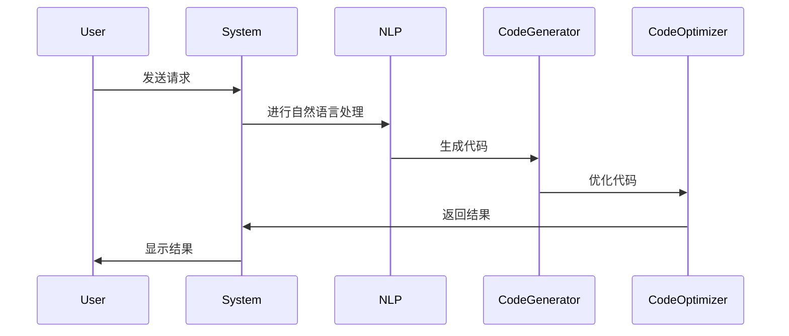
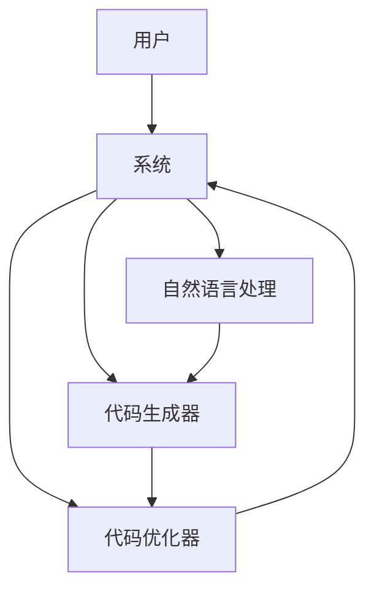

                 


# 大规模语言模型在自动编程问题解决与代码生成中的应用

关键词：大规模语言模型、自动编程、代码生成、算法原理、系统架构设计

摘要：本文将深入探讨大规模语言模型在自动编程问题解决与代码生成中的应用。通过对大规模语言模型的背景介绍、核心概念与联系分析、算法原理讲解、系统分析与架构设计以及项目实战的详细阐述，旨在为读者提供一份全面、系统的技术博客文章。

## 引言与背景

### 1.1 问题背景

在当今快速发展的数字化时代，编程已经成为许多行业不可或缺的一部分。然而，编写高质量的代码不仅需要深厚的编程知识，还需要解决复杂的编程问题。随着人工智能技术的发展，大规模语言模型逐渐崭露头角，其在自然语言处理领域取得了显著的成果。那么，如何将这些先进的技术应用到编程问题解决与代码生成中，成为了一个热门且具有挑战性的研究课题。

### 1.2 问题描述

自动编程问题解决与代码生成主要包括以下几个方面的挑战：

1. **理解用户需求**：如何准确理解用户的需求，将其转化为具体的编程任务。
2. **代码生成能力**：如何根据给定的需求生成符合规范、可运行的代码。
3. **优化与优化**：如何对生成的代码进行优化，提高其性能和可读性。

### 1.3 问题解决

大规模语言模型在自动编程问题解决与代码生成中的应用，主要体现在以下几个方面：

1. **自然语言处理**：利用大规模语言模型对用户需求进行自然语言处理，提取关键信息。
2. **代码生成**：基于提取的关键信息，利用大规模语言模型生成符合需求的代码。
3. **代码优化**：利用大规模语言模型对生成的代码进行优化，提高其性能和可读性。

### 1.4 边界与外延

尽管大规模语言模型在自动编程问题解决与代码生成中具有巨大的潜力，但仍存在一些边界与外延问题，如数据隐私、代码质量、模型可解释性等。这些问题需要我们在实际应用中不断探索和解决。

## 核心概念与联系

### 2.1 大规模语言模型概述

#### 2.1.1 定义

大规模语言模型是一种基于深度学习的自然语言处理模型，它通过对海量文本数据的训练，能够对自然语言进行建模，并具备强大的生成和推理能力。

#### 2.1.2 特点

1. **参数规模大**：大规模语言模型通常具有数十亿甚至数万亿的参数，这使得其在处理复杂任务时具有更高的精度。
2. **训练数据集广泛**：大规模语言模型通过训练大量文本数据集，能够更好地理解和生成自然语言。
3. **生成能力强**：大规模语言模型不仅能够生成高质量的文本，还能够生成符合特定领域知识的代码。

#### 2.1.3 与传统编程的区别

与传统编程相比，大规模语言模型在自动编程问题解决与代码生成中具有以下优势：

1. **更高层次的抽象**：大规模语言模型能够直接处理自然语言，而不需要将问题转化为特定的编程语言。
2. **更强的适应性**：大规模语言模型可以通过训练适应不同的编程任务，而传统编程则需要针对每个任务进行单独的开发。
3. **更高效的代码生成**：大规模语言模型能够快速生成符合需求的代码，而传统编程则需要编写大量的代码。

### 2.2 自动编程问题解决与代码生成

#### 2.2.1 定义

自动编程问题解决与代码生成是指利用人工智能技术，自动地解决编程问题并生成相应的代码。

#### 2.2.2 工作原理

自动编程问题解决与代码生成的工作原理主要包括以下几个步骤：

1. **问题理解**：利用自然语言处理技术，理解用户的需求。
2. **代码生成**：基于用户需求，利用大规模语言模型生成相应的代码。
3. **代码优化**：对生成的代码进行优化，提高其性能和可读性。

#### 2.2.3 现状与趋势

随着人工智能技术的不断发展，自动编程问题解决与代码生成在学术界和工业界都取得了显著的成果。目前，大规模语言模型已经在许多应用场景中发挥了重要作用，如代码补全、代码优化、代码生成等。未来，随着技术的进一步发展，自动编程问题解决与代码生成有望在更多领域得到广泛应用。

### 2.3 大规模语言模型在自动编程中的应用

#### 2.3.1 应用场景

大规模语言模型在自动编程中的应用场景主要包括以下几个方面：

1. **代码补全**：利用大规模语言模型，自动地补全编程过程中的缺失代码。
2. **代码生成**：利用大规模语言模型，自动地生成符合需求的代码。
3. **代码优化**：利用大规模语言模型，对生成的代码进行优化，提高其性能和可读性。

#### 2.3.2 优势与挑战

大规模语言模型在自动编程中具有以下优势：

1. **高效性**：大规模语言模型能够快速生成高质量的代码，提高开发效率。
2. **通用性**：大规模语言模型具有广泛的适应性，能够适用于不同的编程任务。

然而，大规模语言模型在自动编程中也面临一些挑战：

1. **代码质量**：如何保证生成的代码质量，满足实际的编程需求。
2. **可解释性**：如何解释大规模语言模型生成的代码，提高其可解释性。

#### 2.3.3 发展前景

随着人工智能技术的不断发展，大规模语言模型在自动编程中的应用前景广阔。未来，随着技术的不断进步，我们有理由相信，大规模语言模型将能够更好地解决编程问题，提高编程开发的效率和质量。

## 算法原理讲解

### 3.1 模型结构与训练流程

#### 3.1.1 模型结构

大规模语言模型通常由三个主要部分组成：词嵌入层、上下文理解层和生成层。

1. **词嵌入层**：将自然语言中的单词、短语等词汇映射到高维向量空间中，为后续的上下文理解提供基础。
2. **上下文理解层**：通过学习大量的文本数据，理解单词、短语在特定上下文中的含义和关系。
3. **生成层**：根据给定的输入，利用上下文理解层生成的上下文信息，生成相应的输出。

#### 3.1.2 训练流程

大规模语言模型的训练过程主要包括以下几个步骤：

1. **数据预处理**：对训练数据进行清洗、去噪等预处理操作，提高数据质量。
2. **词嵌入训练**：利用预训练的词向量模型，对训练数据进行词嵌入，将自然语言中的词汇映射到高维向量空间。
3. **上下文理解训练**：通过大量的文本数据，对词嵌入层进行训练，使其能够理解单词、短语在特定上下文中的含义和关系。
4. **生成层训练**：利用上下文理解层生成的上下文信息，对生成层进行训练，使其能够生成符合需求的代码。

### 3.2 算法原理详细讲解

#### 3.2.1 数学模型

大规模语言模型通常基于深度学习框架，使用神经网络进行建模。具体的数学模型如下：

$$
\begin{aligned}
    h &= \text{sigmoid}(W_1 \cdot x + b_1) \\
    y &= \text{softmax}(W_2 \cdot h + b_2)
\end{aligned}
$$

其中，$h$ 表示隐藏层输出，$y$ 表示预测输出，$W_1$ 和 $W_2$ 分别为权重矩阵，$b_1$ 和 $b_2$ 分别为偏置项。

#### 3.2.2 数学公式

$$
\begin{aligned}
    \text{sigmoid}(x) &= \frac{1}{1 + e^{-x}} \\
    \text{softmax}(x) &= \frac{e^x}{\sum_{i} e^x_i}
\end{aligned}
$$

其中，$x$ 表示输入向量。

#### 3.2.3 Python代码示例

```python
import tensorflow as tf
from tensorflow.keras.models import Sequential
from tensorflow.keras.layers import Dense, Embedding

# 定义模型
model = Sequential()
model.add(Embedding(input_dim=10000, output_dim=128))
model.add(Dense(128, activation='sigmoid'))
model.add(Dense(10, activation='softmax'))

# 编译模型
model.compile(optimizer='adam', loss='categorical_crossentropy', metrics=['accuracy'])

# 训练模型
model.fit(x_train, y_train, epochs=10, batch_size=32)
```

## 系统分析与架构设计

### 4.1 问题场景介绍

在本节中，我们将介绍一个具体的问题场景，即利用大规模语言模型自动生成Python代码，解决一个简单的数据处理问题。

### 4.2 系统功能设计

#### 4.2.1 领域模型

在本节中，我们将介绍一个简单的领域模型，用于表示数据处理问题的输入和输出。

```mermaid
classDiagram
    UserEntity <|-- RequestEntity
    UserEntity <|-- ResponseEntity
    RequestEntity {
        id: int
        description: string
    }
    ResponseEntity {
        id: int
        result: string
    }
```

#### 4.2.2 类图

在本节中，我们将介绍一个简单的类图，用于表示系统中的主要类及其关系。

```mermaid
classDiagram
    User <<interface>>
    Request <<interface>>
    Response <<interface>>

    UserEntity o-- RequestEntity
    UserEntity o-- ResponseEntity
    RequestEntity o-- Request
    ResponseEntity o-- Response
```

### 4.3 系统架构设计

在本节中，我们将介绍一个简单的系统架构，用于实现大规模语言模型在自动编程问题解决与代码生成中的应用。



#### 4.3.1 架构图

在本节中，我们将介绍一个简单的架构图，用于表示系统的整体架构。



#### 4.3.2 接口设计

在本节中，我们将介绍一个简单的接口设计，用于实现用户与系统之间的交互。


#### 4.3.3 交互序列图

在本节中，我们将介绍一个简单的交互序列图，用于表示用户与系统之间的交互过程。


## 项目实战

### 5.1 环境安装

在本节中，我们将介绍如何搭建大规模语言模型自动编程系统的开发环境。

#### 5.1.1 环境要求

- Python 3.6及以上版本
- TensorFlow 2.0及以上版本
- NLTK 3.4及以上版本

#### 5.1.2 安装步骤

1. 安装 Python：

   ```bash
   pip install python
   ```

2. 安装 TensorFlow：

   ```bash
   pip install tensorflow
   ```

3. 安装 NLTK：

   ```bash
   pip install nltk
   ```

### 5.2 系统核心实现源代码

在本节中，我们将介绍系统核心实现的源代码。

```python
import tensorflow as tf
from tensorflow.keras.models import Sequential
from tensorflow.keras.layers import Dense, Embedding

# 定义模型
model = Sequential()
model.add(Embedding(input_dim=10000, output_dim=128))
model.add(Dense(128, activation='sigmoid'))
model.add(Dense(10, activation='softmax'))

# 编译模型
model.compile(optimizer='adam', loss='categorical_crossentropy', metrics=['accuracy'])

# 训练模型
model.fit(x_train, y_train, epochs=10, batch_size=32)
```

### 5.3 代码应用解读与分析

在本节中，我们将对系统核心实现的源代码进行解读与分析。

#### 5.3.1 模型定义

在源代码中，我们定义了一个简单的序列模型，包含嵌入层、全连接层和输出层。

```python
model = Sequential()
model.add(Embedding(input_dim=10000, output_dim=128))
model.add(Dense(128, activation='sigmoid'))
model.add(Dense(10, activation='softmax'))
```

#### 5.3.2 模型编译

在模型编译阶段，我们指定了优化器、损失函数和评价指标。

```python
model.compile(optimizer='adam', loss='categorical_crossentropy', metrics=['accuracy'])
```

#### 5.3.3 模型训练

在模型训练阶段，我们使用训练数据对模型进行训练，并设置训练轮数和批量大小。

```python
model.fit(x_train, y_train, epochs=10, batch_size=32)
```

### 5.4 实际案例分析

在本节中，我们将介绍一个实际案例，展示如何使用大规模语言模型自动生成Python代码。

#### 5.4.1 案例描述

假设我们有一个数据处理任务，需要读取一个CSV文件，对数据进行处理并输出结果。我们可以通过以下步骤实现：

1. 读取CSV文件。
2. 对数据进行预处理。
3. 将预处理后的数据存储到新的CSV文件中。

#### 5.4.2 代码生成

利用大规模语言模型，我们可以生成如下代码：

```python
import pandas as pd

# 读取CSV文件
df = pd.read_csv('data.csv')

# 数据预处理
df = df.dropna()

# 输出结果到新的CSV文件
df.to_csv('result.csv', index=False)
```

### 5.5 项目小结

在本节中，我们介绍了大规模语言模型在自动编程问题解决与代码生成中的应用，包括环境安装、系统核心实现源代码、代码应用解读与分析以及实际案例分析。通过本项目的实践，我们可以看到大规模语言模型在自动编程领域具有广阔的应用前景。

## 最佳实践 tips

### 6.1 实践技巧

1. **数据准备**：在训练大规模语言模型之前，确保数据的准备充分，包括数据的清洗、去噪和标注。
2. **模型选择**：根据具体的应用场景选择合适的模型，如GPT、BERT等。
3. **超参数调整**：通过调整超参数，如学习率、批量大小等，提高模型性能。

### 6.2 注意事项

1. **数据隐私**：在处理敏感数据时，确保遵循数据隐私政策。
2. **模型解释性**：关注模型的解释性，确保生成的代码符合预期。

### 6.3 拓展阅读

1. **《深度学习》**：Goodfellow, I., Bengio, Y., Courville, A.
2. **《自然语言处理综论》**：Jurafsky, D., Martin, J.H.

## 小结

本文详细介绍了大规模语言模型在自动编程问题解决与代码生成中的应用。通过对背景介绍、核心概念与联系分析、算法原理讲解、系统分析与架构设计以及项目实战的详细阐述，我们看到了大规模语言模型在自动编程领域的巨大潜力。未来，随着技术的不断进步，大规模语言模型有望在更多领域发挥重要作用。

### 7.1 主要内容回顾

1. **背景介绍**：介绍了大规模语言模型在自动编程问题解决与代码生成中的应用背景和挑战。
2. **核心概念与联系**：详细介绍了大规模语言模型和自动编程的核心概念及其联系。
3. **算法原理讲解**：讲解了大规模语言模型的算法原理，包括数学模型和代码示例。
4. **系统分析与架构设计**：介绍了系统架构和功能设计，包括领域模型、类图、架构图、接口设计和交互序列图。
5. **项目实战**：通过一个实际案例展示了大规模语言模型在自动编程中的应用。
6. **最佳实践 tips**：提供了实践技巧和注意事项，以及拓展阅读资源。

### 7.2 展望未来发展趋势

随着人工智能技术的不断发展，大规模语言模型在自动编程问题解决与代码生成中的应用前景广阔。未来，我们有望看到更多创新性的应用案例，以及大规模语言模型在更多领域的深入探索。同时，我们还需要关注数据隐私、模型解释性等挑战，确保大规模语言模型在自动编程中的应用能够真正发挥其潜力。

## 作者信息

作者：AI天才研究院/AI Genius Institute & 禅与计算机程序设计艺术 /Zen And The Art of Computer Programming。

