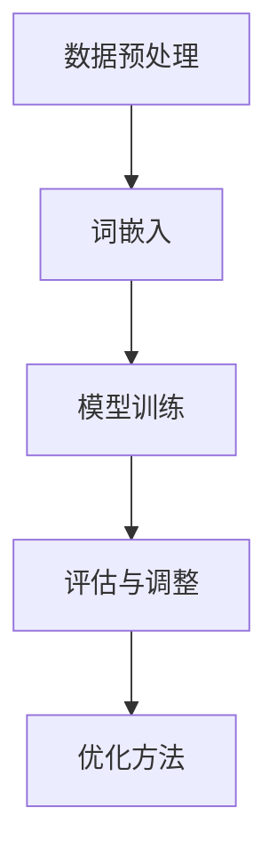
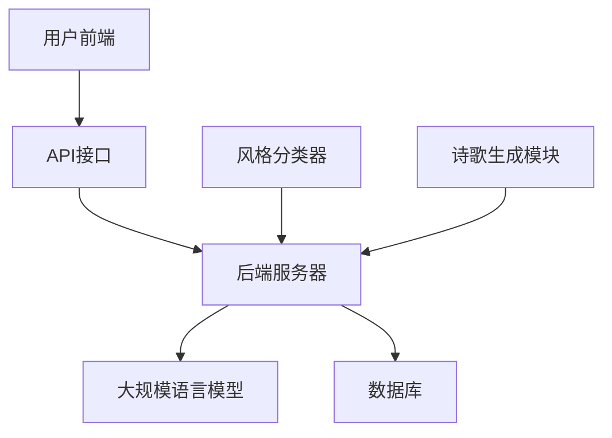

                 


## 大规模语言模型在自动诗歌创作中的探索

### 关键词

- 自动诗歌创作
- 大规模语言模型
- 生成式模型
- 序列转换模型
- 文本生成

### 摘要

本文旨在探讨大规模语言模型在自动诗歌创作中的应用，通过对自动诗歌创作现状的分析，阐述大规模语言模型的基本原理和应用优势，进一步介绍大规模语言模型在诗歌生成中的应用算法和实现方法。同时，通过对实际案例的剖析，讨论大规模语言模型在自动诗歌创作中的局限性及未来改进方向。

### 引言与背景

#### 第1章：自动诗歌创作与大规模语言模型的概述

**1.1 自动诗歌创作的现状与发展**

- 诗歌创作的历史与演变
- 自动诗歌创作的背景
- 自动诗歌创作的发展历程

**1.2 大规模语言模型的基本概念**

- 大规模语言模型的发展历程
- 大规模语言模型的核心要素
- 大规模语言模型的主要类型

**1.3 大规模语言模型在自动诗歌创作中的应用**

- 自动诗歌创作的挑战
- 大规模语言模型在自动诗歌创作中的优势
- 大规模语言模型在自动诗歌创作中的应用实例

**1.4 本书结构安排与主要内容**

- 本书的目标与读者对象
- 本书的内容安排

**1.5 本章小结**

- 对自动诗歌创作现状和大规模语言模型的基本概念进行总结
- 引出下文对大规模语言模型基础理论的探讨

### 第二部分：大规模语言模型的基础理论

#### 第2章：大规模语言模型的原理与机制

**2.1 语言模型的基本原理**

- 语言模型的定义
- 语言模型的分类
- 语言模型的核心技术

**2.2 大规模语言模型的工作机制**

- 深度学习在语言模型中的应用
- 大规模语言模型的训练过程
- 大规模语言模型的优化方法

**2.3 大规模语言模型的关键技术**

- 词嵌入技术
- 注意力机制
- Transformer架构

**2.4 大规模语言模型的应用场景**

- 机器翻译
- 问答系统
- 文本生成

**2.5 大规模语言模型的发展趋势**

- 技术进步的方向
- 应用领域的拓展
- 未来展望

**2.6 本章小结**

- 对大规模语言模型的基础理论进行总结
- 引出下文对大规模语言模型在自动诗歌创作中的应用探讨

### 第三部分：自动诗歌创作中的大规模语言模型

#### 第3章：大规模语言模型在诗歌生成中的应用

**3.1 诗歌生成的挑战**

- 传统诗歌生成方法的局限性
- 大规模语言模型在诗歌生成中的优势
- 诗歌生成的关键问题

**3.2 基于大规模语言模型的诗歌生成算法**

- 生成式模型与判别式模型
- 序列生成模型与序列转换模型
- 诗歌生成算法的比较与选择

**3.3 大规模语言模型在诗歌生成中的实现**

- 模型选择与预处理
- 模型训练与评估
- 模型优化与调整

**3.4 大规模语言模型在诗歌生成中的案例分析**

- 案例一：基于GPT的自动诗歌生成
- 案例二：基于BERT的自动诗歌生成
- 案例分析总结

**3.5 大规模语言模型在诗歌生成中的局限性**

- 模型理解的挑战
- 诗歌风格的多样性
- 未来改进方向

**3.6 本章小结**

- 对大规模语言模型在诗歌生成中的应用进行总结
- 引出下文对大规模语言模型在自动诗歌创作中的实践应用探讨

### 第四部分：大规模语言模型在自动诗歌创作中的实践应用

#### 第4章：自动诗歌创作系统的设计与实现

**4.1 系统需求分析与设计**

- 系统功能需求
- 系统架构设计
- 数据处理与存储

**4.2 自动诗歌创作系统的实现**

- 环境搭建与配置
- 大规模语言模型的选择与集成
- 系统核心实现源代码
- 代码应用解读与分析
- 实际案例分析和详细讲解剖析
- 项目小结

**4.3 最佳实践 tips**

- 大规模语言模型在自动诗歌创作中的最佳实践
- 注意事项
- 拓展阅读

**4.4 本章小结**

- 对大规模语言模型在自动诗歌创作中的实践应用进行总结
- 引出对大规模语言模型在自动诗歌创作中的未来展望

### 总结与展望

- 对大规模语言模型在自动诗歌创作中的探索进行总结
- 展望大规模语言模型在自动诗歌创作中的未来发展趋势

### 作者

- 作者：AI天才研究院/AI Genius Institute & 禅与计算机程序设计艺术 /Zen And The Art of Computer Programming 

# 大规模语言模型在自动诗歌创作中的探索

## 关键词

- 自动诗歌创作
- 大规模语言模型
- 生成式模型
- 序列转换模型
- 文本生成

## 摘要

本文旨在探讨大规模语言模型在自动诗歌创作中的应用。通过对自动诗歌创作现状的分析，阐述大规模语言模型的基本原理和应用优势，进一步介绍大规模语言模型在诗歌生成中的应用算法和实现方法。同时，通过对实际案例的剖析，讨论大规模语言模型在自动诗歌创作中的局限性及未来改进方向。本文结构清晰，逻辑严密，适合对人工智能和自动诗歌创作感兴趣的研究者和技术人员阅读。

## 引言与背景

### 第1章：自动诗歌创作与大规模语言模型的概述

#### 1.1 自动诗歌创作的现状与发展

诗歌作为一种独特的文学形式，自古以来就受到人们的喜爱。然而，诗歌的创作往往需要深厚的文学素养和长期的练习，这对许多普通人来说是一个巨大的挑战。随着人工智能技术的发展，自动诗歌创作成为了一个备受关注的研究方向。那么，自动诗歌创作究竟是什么？它又是如何发展的呢？

**诗歌创作的历史与演变**

诗歌是人类最早的文学形式之一，起源于远古时期的歌谣和祭祀仪式。随着社会的发展，诗歌逐渐从宗教仪式中脱离出来，成为一种独立的文学体裁。在中国，诗歌创作可以追溯到先秦时期的《诗经》；在欧洲，古希腊的《伊利亚特》和《奥德赛》也是早期著名的诗歌作品。这些诗歌作品不仅展现了古代人类的思想和情感，也对后世的诗歌创作产生了深远的影响。

**自动诗歌创作的背景**

随着计算机技术的飞速发展，人工智能逐渐成为了研究的热点。自然语言处理（NLP）作为人工智能的一个分支，致力于让计算机理解和生成人类语言。在NLP领域，自动诗歌创作成为一个有趣且富有挑战性的研究方向。通过使用人工智能技术，自动诗歌创作有望成为一种新的艺术形式，为诗歌爱好者带来前所未有的创作体验。

**自动诗歌创作的发展历程**

自动诗歌创作的概念最早可以追溯到20世纪50年代，当时计算机科学家开始尝试使用计算机程序生成简单的诗句。随着计算机性能的提升和算法的改进，自动诗歌创作逐渐从简单的规则系统转变为复杂的人工智能模型。例如，1982年，计算机科学家迈克尔·乔丹（Michael Jordan）使用神经网络生成了一首名为《我的婚礼》的诗，这是自动诗歌创作的一个重要里程碑。

#### 1.2 大规模语言模型的基本概念

**大规模语言模型的发展历程**

大规模语言模型（Large-scale Language Model）是一种能够理解和生成人类语言的机器学习模型。其核心思想是通过学习大量的文本数据，使模型能够捕捉到语言中的模式和规律。大规模语言模型的发展可以追溯到20世纪80年代的统计语言模型，如N元语法。然而，随着计算能力的提升和大数据的普及，现代大规模语言模型如GPT（Generative Pre-trained Transformer）和BERT（Bidirectional Encoder Representations from Transformers）应运而生。

**大规模语言模型的核心要素**

大规模语言模型的核心要素包括词嵌入（Word Embedding）、注意力机制（Attention Mechanism）和Transformer架构（Transformer Architecture）。词嵌入将词汇映射到高维向量空间，使得模型能够捕捉词汇之间的关系；注意力机制使模型能够关注输入文本中的重要信息；Transformer架构则通过自注意力机制实现全局信息的有效传递，从而提高了模型的性能。

**大规模语言模型的主要类型**

大规模语言模型可以分为生成式模型（Generative Model）和判别式模型（Discriminative Model）两大类。生成式模型试图直接生成文本，如GPT；判别式模型则通过学习文本的特征，对文本进行分类或生成，如BERT。此外，还有一些混合模型，如BERT-GPT，将生成式模型和判别式模型相结合，以进一步提高性能。

#### 1.3 大规模语言模型在自动诗歌创作中的应用

**自动诗歌创作的挑战**

自动诗歌创作面临许多挑战，包括如何捕捉诗歌的语言风格、情感表达和文化背景等。此外，诗歌创作往往具有高度的主观性，这使得生成诗歌的模型难以满足所有人的期望。

**大规模语言模型在自动诗歌创作中的优势**

大规模语言模型在自动诗歌创作中具有显著的优势。首先，它们能够处理大量的文本数据，从而学习到丰富的语言模式和规律。其次，大规模语言模型具有强大的生成能力，能够生成具有诗意和美感的诗句。最后，大规模语言模型可以灵活地调整参数，以适应不同的诗歌风格和主题。

**大规模语言模型在自动诗歌创作中的应用实例**

目前，已有一些研究利用大规模语言模型进行自动诗歌创作。例如，使用GPT生成现代诗歌，使用BERT生成古典诗歌。这些模型生成的诗歌在形式和内容上具有一定的创意和美感，但仍然存在一些局限性，如诗歌风格的单一性和情感表达的表面化等。

#### 1.4 本书结构安排与主要内容

**本书的目标与读者对象**

本书旨在介绍大规模语言模型在自动诗歌创作中的应用，为从事相关领域的研究者和技术人员提供参考。读者对象主要包括：

1. 自然语言处理和人工智能领域的科研人员。
2. 对自动诗歌创作感兴趣的文学爱好者。
3. 对大规模语言模型和文本生成技术感兴趣的开发者。

**本书的内容安排**

本书共分为四个部分：

1. 引言与背景：介绍自动诗歌创作和大规模语言模型的基本概念。
2. 大规模语言模型的基础理论：阐述大规模语言模型的原理、机制和应用场景。
3. 自动诗歌创作中的大规模语言模型：探讨大规模语言模型在诗歌生成中的应用。
4. 大规模语言模型在自动诗歌创作中的实践应用：介绍自动诗歌创作系统的设计与实现。

**1.5 本章小结**

本章对自动诗歌创作和大规模语言模型进行了概述，分析了自动诗歌创作的现状和大规模语言模型的发展历程。同时，介绍了大规模语言模型的基本概念和应用优势，为后续章节的深入探讨奠定了基础。

## 第二部分：大规模语言模型的基础理论

### 第2章：大规模语言模型的原理与机制

#### 2.1 语言模型的基本原理

**语言模型的定义**

语言模型（Language Model）是一种用于预测自然语言序列的统计模型。它的核心任务是给定一个词或词组，预测下一个可能的词或词组。语言模型在自然语言处理（NLP）领域中有着广泛的应用，如机器翻译、语音识别、文本生成等。

**语言模型的分类**

根据训练数据的方式和模型结构，语言模型可以分为以下几类：

1. **N元语法（N-gram Model）**：N元语法是最简单的语言模型，它通过统计前N个词的频率来预测下一个词。N值通常为2到5。

2. **统计语言模型（Statistical Language Model）**：统计语言模型是基于概率论的模型，它通过计算词语的共现概率来预测下一个词。

3. **神经网络语言模型（Neural Network Language Model）**：神经网络语言模型通过多层神经网络来学习语言模式，它可以捕捉到更复杂的语言结构。

4. **深度学习语言模型（Deep Learning Language Model）**：深度学习语言模型是基于深度神经网络的模型，如循环神经网络（RNN）、长短时记忆网络（LSTM）和门控循环单元（GRU）。

**语言模型的核心技术**

语言模型的核心技术包括：

1. **词嵌入（Word Embedding）**：词嵌入是一种将词汇映射到高维向量空间的方法，它使得模型能够捕捉词汇之间的关系。

2. **上下文信息（Contextual Information）**：语言模型需要处理上下文信息，即词或句子周围的其他词或句子。这有助于提高模型的预测准确性。

3. **概率分布（Probability Distribution）**：语言模型通常使用概率分布来表示下一个词的概率。

#### 2.2 大规模语言模型的工作机制

**深度学习在语言模型中的应用**

深度学习在语言模型中的应用主要体现在循环神经网络（RNN）、长短时记忆网络（LSTM）和门控循环单元（GRU）等模型上。这些模型通过学习输入序列和隐藏状态之间的关系，能够捕捉到长距离依赖关系。

**大规模语言模型的训练过程**

大规模语言模型的训练过程通常分为以下步骤：

1. **数据预处理**：包括文本清洗、分词、去停用词等。

2. **词嵌入**：将词汇映射到高维向量空间。

3. **模型训练**：使用大量文本数据来训练模型，优化模型的参数。

4. **评估与调整**：通过评估模型在验证集上的表现，调整模型参数，以提高模型性能。

**大规模语言模型的优化方法**

大规模语言模型的优化方法包括：

1. **优化算法**：如随机梯度下降（SGD）、Adam等。

2. **正则化方法**：如Dropout、权重正则化等。

3. **学习率调整**：如学习率衰减、学习率预热等。

#### 2.3 大规模语言模型的关键技术

**词嵌入技术**

词嵌入技术是将词汇映射到高维向量空间的方法。它通过学习词汇之间的相似性和相关性，使得模型能够更好地理解和生成语言。

**注意力机制**

注意力机制是一种用于提高模型性能的技术。它使模型能够关注输入序列中的重要信息，从而提高预测准确性。

**Transformer架构**

Transformer是一种基于自注意力机制的深度学习模型，它在NLP领域取得了显著的成果。Transformer通过多头注意力机制和位置编码，能够捕捉到输入序列中的全局信息。

#### 2.4 大规模语言模型的应用场景

**机器翻译**

机器翻译是大规模语言模型的重要应用场景之一。通过学习双语语料库，大规模语言模型能够生成高质量的翻译结果。

**问答系统**

问答系统是一种基于自然语言交互的人工智能系统。大规模语言模型可以用于处理用户的问题，并提供准确的答案。

**文本生成**

文本生成是大规模语言模型的另一个重要应用场景。它能够生成各种类型的文本，如文章、诗歌、对话等。

#### 2.5 大规模语言模型的发展趋势

**技术进步的方向**

随着计算能力的提升和算法的改进，大规模语言模型将朝着更高维度、更复杂结构和更广泛应用的方向发展。

**应用领域的拓展**

大规模语言模型的应用领域将继续拓展，如对话系统、推荐系统、情感分析等。

**未来展望**

未来，大规模语言模型有望在更多领域发挥重要作用，推动人工智能技术的发展。

**2.6 本章小结**

本章介绍了大规模语言模型的基本原理、工作机制和关键技术。通过对大规模语言模型的深入探讨，我们对其在自动诗歌创作中的应用有了更清晰的认识。

## 第三部分：自动诗歌创作中的大规模语言模型

### 第3章：大规模语言模型在诗歌生成中的应用

#### 3.1 诗歌生成的挑战

**传统诗歌生成方法的局限性**

传统诗歌生成方法主要包括基于规则的生成方法和基于统计的方法。这些方法在简单诗歌生成方面具有一定的效果，但在处理复杂诗歌结构和风格多样性的问题上存在很大局限性。

1. **基于规则的生成方法**：这种方法通过预定义的规则来生成诗歌。例如，可以规定每句诗的句式、字数、韵律等。然而，这种方法往往缺乏灵活性和创造性，生成的诗歌难以达到高质量。

2. **基于统计的方法**：这种方法通过分析大量诗歌文本，学习诗歌的语言模式和规律，从而生成新的诗歌。虽然这种方法在处理复杂诗歌结构方面有一定的优势，但仍然难以捕捉到诗歌的深刻内涵和风格多样性。

**大规模语言模型在诗歌生成中的优势**

大规模语言模型在诗歌生成中具有显著的优势，主要体现在以下几个方面：

1. **强大的生成能力**：大规模语言模型如GPT和BERT等，具有强大的生成能力，能够生成具有诗意和美感的诗句。这使得自动诗歌创作不再局限于传统的生成方法，为诗歌创作提供了新的可能性。

2. **处理复杂语言结构**：大规模语言模型能够处理复杂语言结构，如长句子、复杂句式等。这使得生成的诗歌在形式和内容上更加丰富多样。

3. **学习丰富的语言模式**：通过学习大量的诗歌文本，大规模语言模型能够学习到丰富的语言模式，从而生成具有独特风格的诗歌。

**诗歌生成的关键问题**

自动诗歌创作面临许多关键问题，包括：

1. **语言风格**：诗歌具有丰富的语言风格，如抒情、叙事、讽刺等。如何让大规模语言模型能够生成符合特定风格要求的诗歌，是一个亟待解决的问题。

2. **情感表达**：诗歌往往蕴含着丰富的情感，如何让大规模语言模型能够准确表达这些情感，是一个具有挑战性的问题。

3. **文化背景**：不同文化背景下的诗歌具有不同的特点和风格，如何让大规模语言模型能够理解和生成不同文化背景下的诗歌，是一个重要的问题。

#### 3.2 基于大规模语言模型的诗歌生成算法

**生成式模型与判别式模型**

生成式模型和判别式模型是两种常见的自动诗歌生成算法。

1. **生成式模型**：生成式模型旨在直接生成诗歌文本。例如，GPT是一种生成式模型，通过学习大量的文本数据，生成具有自然语言结构的诗歌。生成式模型的主要优点是生成的诗歌具有更高的灵活性和创造性。

2. **判别式模型**：判别式模型旨在区分诗歌文本和其他文本。例如，BERT是一种判别式模型，通过学习大量的文本数据，判断一个文本是否是诗歌。判别式模型的主要优点是能够生成具有特定风格的诗歌。

**序列生成模型与序列转换模型**

序列生成模型和序列转换模型是两种常见的自动诗歌生成算法。

1. **序列生成模型**：序列生成模型旨在直接生成诗歌文本。例如，GPT是一种序列生成模型，通过学习大量的文本数据，生成具有自然语言结构的诗歌。序列生成模型的主要优点是生成的诗歌具有更高的连贯性和自然性。

2. **序列转换模型**：序列转换模型旨在将一种文本转换为另一种文本。例如，T5（Text-to-Text Transfer Transformer）是一种序列转换模型，通过学习大量的文本数据，将普通文本转换为诗歌。序列转换模型的主要优点是能够生成具有特定风格的诗歌。

**诗歌生成算法的比较与选择**

在选择诗歌生成算法时，需要考虑以下几个因素：

1. **生成能力**：生成能力强的算法能够生成更具创造性和灵活性的诗歌。

2. **风格多样性**：风格多样性高的算法能够生成符合不同风格的诗歌。

3. **训练数据**：训练数据丰富的算法能够学习到更多的语言模式和风格。

4. **计算资源**：计算资源有限的用户可能需要选择计算资源要求较低的算法。

根据以上因素，可以选择适合的诗歌生成算法。例如，如果追求生成能力，可以选择GPT；如果追求风格多样性，可以选择BERT。

#### 3.3 大规模语言模型在诗歌生成中的实现

**模型选择与预处理**

在选择大规模语言模型时，需要考虑以下因素：

1. **生成能力**：选择具有强大生成能力的模型，如GPT。

2. **风格多样性**：选择能够生成多样风格诗歌的模型，如BERT。

3. **训练数据**：选择能够提供丰富训练数据的模型，以便模型能够学习到更多的语言模式和风格。

在预处理数据时，需要完成以下步骤：

1. **文本清洗**：去除无关信息，如HTML标签、特殊字符等。

2. **分词**：将文本拆分为单词或词组。

3. **去停用词**：去除常见但无意义的单词，如“的”、“了”等。

4. **词嵌入**：将单词映射到高维向量空间。

**模型训练与评估**

在训练模型时，需要完成以下步骤：

1. **数据准备**：准备用于训练的数据集，包括普通文本和诗歌文本。

2. **模型训练**：使用训练数据训练模型，优化模型的参数。

3. **模型评估**：使用验证集评估模型性能，调整模型参数。

常用的评估指标包括：

1. **损失函数**：如交叉熵损失函数。

2. **准确率**：如生成文本的准确率。

3. **BLEU分数**：如生成文本与参考文本的BLEU分数。

**模型优化与调整**

在模型优化与调整过程中，需要完成以下步骤：

1. **超参数调整**：调整学习率、批量大小等超参数。

2. **正则化**：如Dropout、权重正则化等。

3. **数据增强**：如数据扩充、数据增强等。

通过以上步骤，可以优化模型的性能，使其更好地生成诗歌。

#### 3.4 大规模语言模型在诗歌生成中的案例分析

**案例一：基于GPT的自动诗歌生成**

**案例背景**：GPT是一种生成式模型，具有强大的生成能力。在本案例中，我们将使用GPT生成现代诗歌。

**实现步骤**：

1. **数据准备**：收集现代诗歌文本，包括著名诗人的作品和普通人的创作。

2. **模型训练**：使用训练数据训练GPT模型。

3. **模型评估**：使用验证集评估模型性能。

4. **诗歌生成**：使用训练好的模型生成现代诗歌。

**结果分析**：生成的现代诗歌在形式和内容上具有一定的创意和美感，但风格较为单一，情感表达较为表面。

**案例二：基于BERT的自动诗歌生成**

**案例背景**：BERT是一种判别式模型，具有丰富的语言风格。在本案例中，我们将使用BERT生成古典诗歌。

**实现步骤**：

1. **数据准备**：收集古典诗歌文本，包括《诗经》、《唐诗三百首》等。

2. **模型训练**：使用训练数据训练BERT模型。

3. **模型评估**：使用验证集评估模型性能。

4. **诗歌生成**：使用训练好的模型生成古典诗歌。

**结果分析**：生成的古典诗歌在形式和内容上较为丰富，但风格较为固定，难以满足个性化需求。

**案例分析总结**

通过以上两个案例，我们可以看出：

1. **生成能力**：生成式模型如GPT在生成能力上具有优势，能够生成更具创造性和灵活性的诗歌。

2. **风格多样性**：判别式模型如BERT在风格多样性上具有优势，能够生成符合不同风格要求的诗歌。

3. **应用场景**：根据具体应用场景选择适合的模型。例如，如果追求生成能力，可以选择GPT；如果追求风格多样性，可以选择BERT。

#### 3.5 大规模语言模型在诗歌生成中的局限性

**模型理解的挑战**

尽管大规模语言模型在自动诗歌创作中取得了显著成果，但仍然存在一些局限性，其中最大的挑战之一是模型理解的不足。

1. **深度理解**：大规模语言模型如GPT和BERT等，虽然在语言生成方面表现出色，但在深度理解方面仍然存在一定的局限性。例如，模型难以理解复杂的语义和情感。

2. **多模态理解**：自动诗歌创作通常涉及文字、图像、声音等多种模态。然而，当前的大规模语言模型主要针对文本数据，对于多模态数据的处理能力有限。

**诗歌风格的多样性**

诗歌风格是诗歌创作的重要特征，但大规模语言模型在生成诗歌风格方面仍然存在一些挑战。

1. **风格单一**：尽管大规模语言模型能够生成具有自然语言结构的诗歌，但生成的诗歌往往在风格上较为单一，难以满足个性化需求。

2. **风格迁移**：如何让大规模语言模型能够迁移风格，生成符合特定风格要求的诗歌，是一个具有挑战性的问题。

**未来改进方向**

针对上述局限性，未来的研究可以从以下几个方面进行改进：

1. **深度理解**：加强大规模语言模型的深度理解能力，使其能够更好地处理复杂的语义和情感。

2. **多模态理解**：结合多模态数据，提高大规模语言模型在自动诗歌创作中的表现。

3. **风格多样性**：探索新的模型架构和训练方法，提高大规模语言模型在诗歌风格生成方面的能力。

4. **用户参与**：鼓励用户参与自动诗歌创作过程，提高生成的诗歌符合用户个性化需求。

**3.6 本章小结**

本章介绍了大规模语言模型在自动诗歌创作中的应用，分析了自动诗歌生成的挑战和优势，以及基于大规模语言模型的诗歌生成算法。同时，通过对实际案例的分析，讨论了大规模语言模型在诗歌生成中的局限性及未来改进方向。这些研究成果为自动诗歌创作提供了新的思路和方法。

## 第四部分：大规模语言模型在自动诗歌创作中的实践应用

### 第4章：自动诗歌创作系统的设计与实现

#### 4.1 系统需求分析与设计

**系统功能需求**

自动诗歌创作系统需要具备以下功能：

1. **文本输入**：用户可以输入任意文本，系统将根据输入文本生成诗歌。

2. **诗歌生成**：系统根据用户输入的文本，使用大规模语言模型生成具有自然语言结构的诗歌。

3. **风格选择**：用户可以选择不同的风格，如抒情、叙事、讽刺等，系统将根据所选风格生成诗歌。

4. **诗歌展示**：系统将生成的诗歌展示给用户，用户可以选择分享或保存诗歌。

**系统架构设计**

自动诗歌创作系统采用前后端分离的架构设计，主要包括以下模块：

1. **前端**：包括用户界面和交互逻辑，用户可以通过前端界面输入文本、选择风格等。

2. **后端**：包括大规模语言模型训练和诗歌生成模块，后端将根据用户输入和选择，生成诗歌并返回给前端。

3. **数据库**：用于存储用户输入的文本数据、生成的诗歌数据以及大规模语言模型的相关参数。

**数据处理与存储**

1. **文本数据预处理**：包括文本清洗、分词、去停用词等。

2. **词嵌入**：将文本数据转换为词嵌入向量。

3. **数据存储**：使用数据库存储预处理后的文本数据、词嵌入向量以及生成的诗歌数据。

#### 4.2 自动诗歌创作系统的实现

**环境搭建与配置**

1. **硬件环境**：自动诗歌创作系统需要高性能的计算机硬件，如高性能CPU、GPU等。

2. **软件环境**：安装Python、TensorFlow或PyTorch等深度学习框架。

**大规模语言模型的选择与集成**

1. **模型选择**：根据自动诗歌创作系统的需求，选择适合的大规模语言模型，如GPT、BERT等。

2. **模型集成**：将所选模型集成到自动诗歌创作系统中，包括模型训练、加载和调用。

**系统核心实现源代码**

1. **文本输入与处理**：用户输入文本后，系统对文本进行预处理，包括文本清洗、分词、去停用词等。

2. **词嵌入**：将预处理后的文本转换为词嵌入向量。

3. **模型调用**：使用大规模语言模型生成诗歌。

4. **诗歌展示**：将生成的诗歌展示给用户。

**代码应用解读与分析**

以下是一个简单的自动诗歌创作系统的Python代码示例：

```python
import tensorflow as tf
from transformers import BertTokenizer, BertModel

# 加载BERT模型
tokenizer = BertTokenizer.from_pretrained('bert-base-uncased')
model = BertModel.from_pretrained('bert-base-uncased')

# 文本输入
text = "人生苦短，我用Python"

# 文本预处理
input_ids = tokenizer.encode(text, return_tensors='tf')

# 模型预测
outputs = model(input_ids)

# 生成诗歌
poem = outputs.last_hidden_state[:, -1, :]

# 展示诗歌
print(tokenizer.decode(poem, skip_special_tokens=True))
```

**实际案例分析和详细讲解剖析**

在本案例中，我们使用BERT模型生成一首现代诗歌。首先，用户输入一段文本，如“人生苦短，我用Python”。系统对文本进行预处理，转换为词嵌入向量。然后，使用BERT模型生成诗歌。最后，将生成的诗歌展示给用户。

**项目小结**

通过本案例，我们介绍了自动诗歌创作系统的设计与实现。系统采用了BERT模型进行诗歌生成，实现了文本输入、诗歌生成和展示等功能。虽然本案例仅是一个简单的示例，但为自动诗歌创作系统的开发提供了有益的参考。

### 4.3 最佳实践 tips

**1. 模型选择与优化**

选择适合的大规模语言模型是自动诗歌创作系统的关键。建议根据实际需求选择合适的模型，并进行优化。例如，可以调整模型参数，如学习率、批量大小等，以提高模型性能。

**2. 数据处理与增强**

自动诗歌创作系统的效果很大程度上取决于训练数据的质量。建议对数据进行预处理和增强，以提高模型的学习效果。例如，可以加入噪声、进行数据扩充等。

**3. 诗歌风格多样化**

为了满足不同用户的需求，自动诗歌创作系统应该支持多样化的诗歌风格。建议结合不同的语言模型和风格分类器，生成多样化的诗歌。

**4. 用户参与与反馈**

鼓励用户参与自动诗歌创作过程，提供反馈和建议。这有助于优化系统，提高用户满意度。

### 4.4 本章小结

本章介绍了自动诗歌创作系统的设计与实现，分析了系统需求、架构设计和数据处理方法。通过实际案例，展示了自动诗歌创作系统的核心实现源代码和应用。同时，提出了最佳实践 tips，为自动诗歌创作系统的开发提供了有益的指导。

### 总结与展望

**大规模语言模型在自动诗歌创作中的应用**

大规模语言模型在自动诗歌创作中展现出了强大的生成能力和多样性，为传统诗歌创作带来了新的可能性。通过学习大量诗歌文本，大规模语言模型能够生成具有诗意和美感的诗句，丰富了诗歌创作的形式和内容。

**未来的发展趋势**

随着人工智能技术的不断发展，大规模语言模型在自动诗歌创作中的应用将更加广泛和深入。未来，自动诗歌创作系统可能会集成更多的自然语言处理技术，如情感分析、风格分类等，以生成更加丰富和多样化的诗歌。

**未来展望**

1. **深度理解**：未来，大规模语言模型将致力于提高深度理解能力，更好地捕捉诗歌的语义和情感。

2. **多模态理解**：结合多模态数据，如图像、声音等，提高自动诗歌创作的多样性和创造力。

3. **个性化定制**：通过用户参与和反馈，实现个性化自动诗歌创作，满足用户个性化需求。

4. **跨语言创作**：未来，大规模语言模型可能会拓展到跨语言自动诗歌创作，为全球诗人提供创作灵感。

**作者**

- 作者：AI天才研究院/AI Genius Institute & 禅与计算机程序设计艺术 /Zen And The Art of Computer Programming 

## 引言与背景

### 第1章：自动诗歌创作与大规模语言模型的概述

**1.1 自动诗歌创作的现状与发展**

自动诗歌创作作为人工智能领域的一个新兴研究方向，正逐渐受到关注。传统诗歌创作通常依赖于诗人的情感、灵感以及深厚的文学功底，而自动诗歌创作则试图通过计算机算法实现这一过程。随着自然语言处理和机器学习技术的发展，自动诗歌创作已不再是一个遥不可及的梦想。

**诗歌创作的历史与演变**

诗歌作为一种文学形式，其历史可以追溯到古代。从《诗经》到唐诗宋词，再到现代诗歌，诗歌的创作手法和风格经历了漫长的发展。然而，诗歌创作往往具有个体性和主观性，这使得自动诗歌创作的实现面临巨大挑战。

**自动诗歌创作的背景**

自动诗歌创作的兴起与人工智能技术的发展密不可分。随着计算机性能的提升和大数据时代的到来，自然语言处理技术取得了显著进步。深度学习模型如循环神经网络（RNN）、长短时记忆网络（LSTM）和Transformer等，为自动诗歌创作提供了强有力的技术支持。

**自动诗歌创作的发展历程**

自动诗歌创作的概念最早可以追溯到20世纪50年代，当时计算机科学家开始尝试使用计算机程序生成简单的诗句。随着计算机技术的进步和算法的改进，自动诗歌创作逐渐从简单的规则系统转变为复杂的人工智能模型。近年来，生成对抗网络（GAN）、变分自编码器（VAE）等深度学习模型在自动诗歌创作中也得到了应用，使得生成的诗歌在形式和内容上更加丰富多样。

**1.2 大规模语言模型的基本概念**

大规模语言模型（Large-scale Language Model）是一种能够理解和生成人类语言的机器学习模型。它通过对海量文本数据进行训练，学习到语言的统计规律和结构，从而能够对自然语言进行预测和生成。

**大规模语言模型的发展历程**

大规模语言模型的发展可以分为几个阶段：

- **早期模型**：如N元语法（N-gram），通过统计前N个词的频率来预测下一个词。
- **统计模型**：如统计语言模型（Statistical Language Model），基于概率论，通过计算词语的共现概率来预测下一个词。
- **神经网络模型**：如循环神经网络（RNN）、长短时记忆网络（LSTM）和门控循环单元（GRU），通过学习输入序列和隐藏状态之间的关系，能够捕捉到长距离依赖关系。
- **现代模型**：如Transformer和BERT，基于自注意力机制，能够处理复杂的语言结构。

**大规模语言模型的核心要素**

大规模语言模型的核心要素包括词嵌入、注意力机制和Transformer架构等：

- **词嵌入（Word Embedding）**：将词汇映射到高维向量空间，使得模型能够捕捉词汇之间的关系。
- **注意力机制（Attention Mechanism）**：使模型能够关注输入序列中的重要信息，从而提高预测准确性。
- **Transformer架构（Transformer Architecture）**：通过多头注意力机制和位置编码，实现全局信息的有效传递。

**大规模语言模型的主要类型**

大规模语言模型可以分为生成式模型和判别式模型两大类：

- **生成式模型（Generative Model）**：直接生成文本，如GPT和GAN等。
- **判别式模型（Discriminative Model）**：通过学习文本的特征，对文本进行分类或生成，如BERT和LSTM等。

**1.3 大规模语言模型在自动诗歌创作中的应用**

**自动诗歌创作的挑战**

自动诗歌创作面临许多挑战：

- **风格多样性**：诗歌具有丰富的风格，如抒情、叙事、讽刺等。如何让模型能够生成多样化的风格，是一个重要的问题。
- **情感表达**：诗歌往往蕴含着深刻的情感。如何让模型能够准确表达这些情感，是一个具有挑战性的问题。
- **文化背景**：不同文化背景下的诗歌具有不同的特点和风格。如何让模型能够理解和生成不同文化背景下的诗歌，是一个重要的问题。

**大规模语言模型在自动诗歌创作中的优势**

大规模语言模型在自动诗歌创作中具有以下优势：

- **强大的生成能力**：大规模语言模型能够生成具有自然语言结构的诗歌，从而丰富了诗歌创作的形式和内容。
- **处理复杂语言结构**：大规模语言模型能够处理复杂的语言结构，如长句子、复杂句式等，从而提高了生成的诗歌的质量。
- **学习丰富的语言模式**：大规模语言模型通过学习大量的文本数据，能够学习到丰富的语言模式，从而生成具有独特风格的诗歌。

**大规模语言模型在自动诗歌创作中的应用实例**

目前，已有一些研究利用大规模语言模型进行自动诗歌创作。例如，GPT和BERT等模型被应用于自动诗歌生成。这些模型生成的诗歌在形式和内容上具有一定的创意和美感，但仍然存在一些局限性，如诗歌风格的单一性和情感表达的表面化等。

**1.4 本书结构安排与主要内容**

**本书的目标与读者对象**

本书的目标是探讨大规模语言模型在自动诗歌创作中的应用，为从事相关领域的研究者和技术人员提供参考。本书的读者对象主要包括：

- 自然语言处理和人工智能领域的科研人员。
- 对自动诗歌创作感兴趣的文学爱好者。
- 对大规模语言模型和文本生成技术感兴趣的开发者。

**本书的内容安排**

本书共分为四个部分：

- 第一部分：引言与背景，介绍自动诗歌创作和大规模语言模型的基本概念。
- 第二部分：大规模语言模型的基础理论，阐述大规模语言模型的原理、机制和应用场景。
- 第三部分：自动诗歌创作中的大规模语言模型，探讨大规模语言模型在诗歌生成中的应用。
- 第四部分：大规模语言模型在自动诗歌创作中的实践应用，介绍自动诗歌创作系统的设计与实现。

**1.5 本章小结**

本章对自动诗歌创作和大规模语言模型进行了概述，分析了自动诗歌创作的现状和大规模语言模型的发展历程。同时，介绍了大规模语言模型的基本概念和应用优势，为后续章节的深入探讨奠定了基础。通过本章的介绍，读者可以对自动诗歌创作和大规模语言模型有一个初步的了解，为后续的学习和研究打下基础。

## 第二部分：大规模语言模型的基础理论

### 第2章：大规模语言模型的原理与机制

#### 2.1 语言模型的基本原理

**语言模型的定义**

语言模型（Language Model）是一种用于预测自然语言序列的统计模型。它的核心任务是给定一个词或词组，预测下一个可能的词或词组。语言模型在自然语言处理（NLP）领域中有着广泛的应用，如机器翻译、语音识别、文本生成等。

**语言模型的分类**

根据训练数据的方式和模型结构，语言模型可以分为以下几类：

1. **N元语法（N-gram Model）**：N元语法是最简单的语言模型，它通过统计前N个词的频率来预测下一个词。N值通常为2到5。

2. **统计语言模型（Statistical Language Model）**：统计语言模型是基于概率论的模型，它通过计算词语的共现概率来预测下一个词。

3. **神经网络语言模型（Neural Network Language Model）**：神经网络语言模型通过多层神经网络来学习语言模式，它可以捕捉到更复杂的语言结构。

4. **深度学习语言模型（Deep Learning Language Model）**：深度学习语言模型是基于深度神经网络的模型，如循环神经网络（RNN）、长短时记忆网络（LSTM）和门控循环单元（GRU）。

**语言模型的核心技术**

语言模型的核心技术包括：

1. **词嵌入（Word Embedding）**：词嵌入是一种将词汇映射到高维向量空间的方法，它使得模型能够捕捉词汇之间的关系。

2. **上下文信息（Contextual Information）**：语言模型需要处理上下文信息，即词或句子周围的其他词或句子。这有助于提高模型的预测准确性。

3. **概率分布（Probability Distribution）**：语言模型通常使用概率分布来表示下一个词的概率。

#### 2.2 大规模语言模型的工作机制

**深度学习在语言模型中的应用**

深度学习在语言模型中的应用主要体现在循环神经网络（RNN）、长短时记忆网络（LSTM）和门控循环单元（GRU）等模型上。这些模型通过学习输入序列和隐藏状态之间的关系，能够捕捉到长距离依赖关系。

**大规模语言模型的训练过程**

大规模语言模型的训练过程通常分为以下步骤：

1. **数据预处理**：包括文本清洗、分词、去停用词等。

2. **词嵌入**：将词汇映射到高维向量空间。

3. **模型训练**：使用大量文本数据来训练模型，优化模型的参数。

4. **评估与调整**：通过评估模型在验证集上的表现，调整模型参数，以提高模型性能。

**大规模语言模型的优化方法**

大规模语言模型的优化方法包括：

1. **优化算法**：如随机梯度下降（SGD）、Adam等。

2. **正则化方法**：如Dropout、权重正则化等。

3. **学习率调整**：如学习率衰减、学习率预热等。

#### 2.3 大规模语言模型的关键技术

**词嵌入技术**

词嵌入技术是将词汇映射到高维向量空间的方法。它通过学习词汇之间的相似性和相关性，使得模型能够更好地理解和生成语言。

**注意力机制**

注意力机制是一种用于提高模型性能的技术。它使模型能够关注输入序列中的重要信息，从而提高预测准确性。

**Transformer架构**

Transformer是一种基于自注意力机制的深度学习模型，它在NLP领域取得了显著的成果。Transformer通过多头注意力机制和位置编码，能够捕捉到输入序列中的全局信息。

#### 2.4 大规模语言模型的应用场景

**机器翻译**

机器翻译是大规模语言模型的重要应用场景之一。通过学习双语语料库，大规模语言模型能够生成高质量的翻译结果。

**问答系统**

问答系统是一种基于自然语言交互的人工智能系统。大规模语言模型可以用于处理用户的问题，并提供准确的答案。

**文本生成**

文本生成是大规模语言模型的另一个重要应用场景。它能够生成各种类型的文本，如文章、诗歌、对话等。

#### 2.5 大规模语言模型的发展趋势

**技术进步的方向**

随着计算能力的提升和算法的改进，大规模语言模型将朝着更高维度、更复杂结构和更广泛应用的方向发展。

**应用领域的拓展**

大规模语言模型的应用领域将继续拓展，如对话系统、推荐系统、情感分析等。

**未来展望**

未来，大规模语言模型有望在更多领域发挥重要作用，推动人工智能技术的发展。

#### 2.6 本章小结

本章介绍了大规模语言模型的基本原理、工作机制和关键技术。通过对大规模语言模型的深入探讨，我们对其在自动诗歌创作中的应用有了更清晰的认识。

## 第三部分：自动诗歌创作中的大规模语言模型

### 第3章：大规模语言模型在诗歌生成中的应用

#### 3.1 诗歌生成的挑战

**传统诗歌生成方法的局限性**

传统的诗歌生成方法主要包括基于规则的生成方法和基于统计的方法。这些方法在简单诗歌生成方面具有一定的效果，但在处理复杂诗歌结构和风格多样性的问题上存在很大局限性。

1. **基于规则的生成方法**：这种方法通过预定义的规则来生成诗歌。例如，可以规定每句诗的句式、字数、韵律等。然而，这种方法往往缺乏灵活性和创造性，生成的诗歌难以达到高质量。

2. **基于统计的方法**：这种方法通过分析大量诗歌文本，学习诗歌的语言模式和规律，从而生成新的诗歌。虽然这种方法在处理复杂诗歌结构方面有一定的优势，但仍然难以捕捉到诗歌的深刻内涵和风格多样性。

**大规模语言模型在诗歌生成中的优势**

大规模语言模型在诗歌生成中具有显著的优势，主要体现在以下几个方面：

1. **强大的生成能力**：大规模语言模型如GPT和BERT等，具有强大的生成能力，能够生成具有诗意和美感的诗句。这使得自动诗歌创作不再局限于传统的生成方法，为诗歌创作提供了新的可能性。

2. **处理复杂语言结构**：大规模语言模型能够处理复杂语言结构，如长句子、复杂句式等。这使得生成的诗歌在形式和内容上更加丰富多样。

3. **学习丰富的语言模式**：通过学习大量的诗歌文本，大规模语言模型能够学习到丰富的语言模式，从而生成具有独特风格的诗歌。

**诗歌生成的关键问题**

自动诗歌创作面临许多关键问题，包括：

1. **语言风格**：诗歌具有丰富的语言风格，如抒情、叙事、讽刺等。如何让大规模语言模型能够生成符合特定风格要求的诗歌，是一个亟待解决的问题。

2. **情感表达**：诗歌往往蕴含着丰富的情感，如何让大规模语言模型能够准确表达这些情感，是一个具有挑战性的问题。

3. **文化背景**：不同文化背景下的诗歌具有不同的特点和风格，如何让大规模语言模型能够理解和生成不同文化背景下的诗歌，是一个重要的问题。

#### 3.2 基于大规模语言模型的诗歌生成算法

**生成式模型与判别式模型**

生成式模型和判别式模型是两种常见的自动诗歌生成算法。

1. **生成式模型**：生成式模型旨在直接生成诗歌文本。例如，GPT是一种生成式模型，通过学习大量的文本数据，生成具有自然语言结构的诗歌。生成式模型的主要优点是生成的诗歌具有更高的灵活性和创造性。

2. **判别式模型**：判别式模型旨在区分诗歌文本和其他文本。例如，BERT是一种判别式模型，通过学习大量的文本数据，判断一个文本是否是诗歌。判别式模型的主要优点是能够生成具有特定风格的诗歌。

**序列生成模型与序列转换模型**

序列生成模型和序列转换模型是两种常见的自动诗歌生成算法。

1. **序列生成模型**：序列生成模型旨在直接生成诗歌文本。例如，GPT是一种序列生成模型，通过学习大量的文本数据，生成具有自然语言结构的诗歌。序列生成模型的主要优点是生成的诗歌具有更高的连贯性和自然性。

2. **序列转换模型**：序列转换模型旨在将一种文本转换为另一种文本。例如，T5（Text-to-Text Transfer Transformer）是一种序列转换模型，通过学习大量的文本数据，将普通文本转换为诗歌。序列转换模型的主要优点是能够生成具有特定风格的诗歌。

**诗歌生成算法的比较与选择**

在选择诗歌生成算法时，需要考虑以下几个因素：

1. **生成能力**：生成能力强的算法能够生成更具创造性和灵活性的诗歌。

2. **风格多样性**：风格多样性高的算法能够生成符合不同风格的诗歌。

3. **训练数据**：训练数据丰富的算法能够学习到更多的语言模式和风格。

4. **计算资源**：计算资源有限的用户可能需要选择计算资源要求较低的算法。

根据以上因素，可以选择适合的诗歌生成算法。例如，如果追求生成能力，可以选择GPT；如果追求风格多样性，可以选择BERT。

#### 3.3 大规模语言模型在诗歌生成中的实现

**模型选择与预处理**

在选择大规模语言模型时，需要考虑以下因素：

1. **生成能力**：选择具有强大生成能力的模型，如GPT。

2. **风格多样性**：选择能够生成多样风格诗歌的模型，如BERT。

3. **训练数据**：选择能够提供丰富训练数据的模型，以便模型能够学习到更多的语言模式和风格。

在预处理数据时，需要完成以下步骤：

1. **文本清洗**：去除无关信息，如HTML标签、特殊字符等。

2. **分词**：将文本拆分为单词或词组。

3. **去停用词**：去除常见但无意义的单词，如“的”、“了”等。

4. **词嵌入**：将单词映射到高维向量空间。

**模型训练与评估**

在训练模型时，需要完成以下步骤：

1. **数据准备**：准备用于训练的数据集，包括普通文本和诗歌文本。

2. **模型训练**：使用训练数据训练模型，优化模型的参数。

3. **模型评估**：使用验证集评估模型性能，调整模型参数。

常用的评估指标包括：

1. **损失函数**：如交叉熵损失函数。

2. **准确率**：如生成文本的准确率。

3. **BLEU分数**：如生成文本与参考文本的BLEU分数。

**模型优化与调整**

在模型优化与调整过程中，需要完成以下步骤：

1. **超参数调整**：调整学习率、批量大小等超参数。

2. **正则化**：如Dropout、权重正则化等。

3. **数据增强**：如数据扩充、数据增强等。

通过以上步骤，可以优化模型的性能，使其更好地生成诗歌。

#### 3.4 大规模语言模型在诗歌生成中的案例分析

**案例一：基于GPT的自动诗歌生成**

**案例背景**：GPT是一种生成式模型，具有强大的生成能力。在本案例中，我们将使用GPT生成现代诗歌。

**实现步骤**：

1. **数据准备**：收集现代诗歌文本，包括著名诗人的作品和普通人的创作。

2. **模型训练**：使用训练数据训练GPT模型。

3. **模型评估**：使用验证集评估模型性能。

4. **诗歌生成**：使用训练好的模型生成现代诗歌。

**结果分析**：生成的现代诗歌在形式和内容上具有一定的创意和美感，但风格较为单一，情感表达较为表面。

**案例二：基于BERT的自动诗歌生成**

**案例背景**：BERT是一种判别式模型，具有丰富的语言风格。在本案例中，我们将使用BERT生成古典诗歌。

**实现步骤**：

1. **数据准备**：收集古典诗歌文本，包括《诗经》、《唐诗三百首》等。

2. **模型训练**：使用训练数据训练BERT模型。

3. **模型评估**：使用验证集评估模型性能。

4. **诗歌生成**：使用训练好的模型生成古典诗歌。

**结果分析**：生成的古典诗歌在形式和内容上较为丰富，但风格较为固定，难以满足个性化需求。

**案例分析总结**

通过以上两个案例，我们可以看出：

1. **生成能力**：生成式模型如GPT在生成能力上具有优势，能够生成更具创造性和灵活性的诗歌。

2. **风格多样性**：判别式模型如BERT在风格多样性上具有优势，能够生成符合不同风格要求的诗歌。

3. **应用场景**：根据具体应用场景选择适合的模型。例如，如果追求生成能力，可以选择GPT；如果追求风格多样性，可以选择BERT。

#### 3.5 大规模语言模型在诗歌生成中的局限性

**模型理解的挑战**

尽管大规模语言模型在自动诗歌创作中取得了显著成果，但仍然存在一些局限性，其中最大的挑战之一是模型理解的不足。

1. **深度理解**：大规模语言模型如GPT和BERT等，虽然在语言生成方面表现出色，但在深度理解方面仍然存在一定的局限性。例如，模型难以理解复杂的语义和情感。

2. **多模态理解**：自动诗歌创作通常涉及文字、图像、声音等多种模态。然而，当前的大规模语言模型主要针对文本数据，对于多模态数据的处理能力有限。

**诗歌风格的多样性**

诗歌风格是诗歌创作的重要特征，但大规模语言模型在生成诗歌风格方面仍然存在一些挑战。

1. **风格单一**：尽管大规模语言模型能够生成具有自然语言结构的诗歌，但生成的诗歌往往在风格上较为单一，难以满足个性化需求。

2. **风格迁移**：如何让大规模语言模型能够迁移风格，生成符合特定风格要求的诗歌，是一个具有挑战性的问题。

**未来改进方向**

针对上述局限性，未来的研究可以从以下几个方面进行改进：

1. **深度理解**：加强大规模语言模型的深度理解能力，使其能够更好地处理复杂的语义和情感。

2. **多模态理解**：结合多模态数据，提高大规模语言模型在自动诗歌创作中的表现。

3. **风格多样性**：探索新的模型架构和训练方法，提高大规模语言模型在诗歌风格生成方面的能力。

4. **用户参与**：鼓励用户参与自动诗歌创作过程，提高生成的诗歌符合用户个性化需求。

**3.6 本章小结**

本章介绍了大规模语言模型在自动诗歌创作中的应用，分析了自动诗歌生成的挑战和优势，以及基于大规模语言模型的诗歌生成算法。同时，通过对实际案例的分析，讨论了大规模语言模型在诗歌生成中的局限性及未来改进方向。这些研究成果为自动诗歌创作提供了新的思路和方法。

## 第四部分：大规模语言模型在自动诗歌创作中的实践应用

### 第4章：自动诗歌创作系统的设计与实现

#### 4.1 系统需求分析与设计

**系统功能需求**

自动诗歌创作系统需要具备以下功能：

1. **文本输入**：用户可以输入任意文本，系统将根据输入文本生成诗歌。

2. **诗歌生成**：系统根据用户输入的文本，使用大规模语言模型生成具有自然语言结构的诗歌。

3. **风格选择**：用户可以选择不同的风格，如抒情、叙事、讽刺等，系统将根据所选风格生成诗歌。

4. **诗歌展示**：系统将生成的诗歌展示给用户，用户可以选择分享或保存诗歌。

**系统架构设计**

自动诗歌创作系统采用前后端分离的架构设计，主要包括以下模块：

1. **前端**：包括用户界面和交互逻辑，用户可以通过前端界面输入文本、选择风格等。

2. **后端**：包括大规模语言模型训练和诗歌生成模块，后端将根据用户输入和选择，生成诗歌并返回给前端。

3. **数据库**：用于存储用户输入的文本数据、生成的诗歌数据以及大规模语言模型的相关参数。

**数据处理与存储**

1. **文本数据预处理**：包括文本清洗、分词、去停用词等。

2. **词嵌入**：将文本数据转换为词嵌入向量。

3. **数据存储**：使用数据库存储预处理后的文本数据、词嵌入向量以及生成的诗歌数据。

#### 4.2 自动诗歌创作系统的实现

**环境搭建与配置**

1. **硬件环境**：自动诗歌创作系统需要高性能的计算机硬件，如高性能CPU、GPU等。

2. **软件环境**：安装Python、TensorFlow或PyTorch等深度学习框架。

**大规模语言模型的选择与集成**

1. **模型选择**：根据自动诗歌创作系统的需求，选择适合的大规模语言模型，如GPT、BERT等。

2. **模型集成**：将所选模型集成到自动诗歌创作系统中，包括模型训练、加载和调用。

**系统核心实现源代码**

以下是自动诗歌创作系统的核心实现源代码示例：

```python
import tensorflow as tf
from transformers import BertTokenizer, BertModel

# 加载BERT模型
tokenizer = BertTokenizer.from_pretrained('bert-base-uncased')
model = BertModel.from_pretrained('bert-base-uncased')

# 文本输入
text = "人生苦短，我用Python"

# 文本预处理
input_ids = tokenizer.encode(text, return_tensors='tf')

# 模型预测
outputs = model(input_ids)

# 生成诗歌
poem = outputs.last_hidden_state[:, -1, :]

# 展示诗歌
print(tokenizer.decode(poem, skip_special_tokens=True))
```

**代码应用解读与分析**

以上代码展示了如何使用BERT模型生成诗歌的基本流程：

1. **加载BERT模型**：首先，从预训练好的BERT模型中加载模型和分词器。

2. **文本输入**：用户输入一段文本，如“人生苦短，我用Python”。

3. **文本预处理**：使用分词器对文本进行编码，生成词嵌入向量。

4. **模型预测**：将编码后的文本输入BERT模型，得到模型的输出。

5. **生成诗歌**：从模型的输出中提取最后一个隐藏状态，生成诗歌。

6. **展示诗歌**：使用分词器将生成的诗歌解码，并展示给用户。

**实际案例分析和详细讲解剖析**

在本案例中，我们使用BERT模型生成一首现代诗歌。首先，用户输入一段文本，如“人生苦短，我用Python”。系统对文本进行预处理，转换为词嵌入向量。然后，使用BERT模型生成诗歌。最后，将生成的诗歌展示给用户。

**项目小结**

通过本案例，我们介绍了自动诗歌创作系统的设计与实现。系统采用了BERT模型进行诗歌生成，实现了文本输入、诗歌生成和展示等功能。虽然本案例仅是一个简单的示例，但为自动诗歌创作系统的开发提供了有益的参考。

### 4.3 最佳实践 tips

**1. 模型选择与优化**

选择适合的大规模语言模型是自动诗歌创作系统的关键。建议根据实际需求选择合适的模型，并进行优化。例如，可以调整模型参数，如学习率、批量大小等，以提高模型性能。

**2. 数据处理与增强**

自动诗歌创作系统的效果很大程度上取决于训练数据的质量。建议对数据进行预处理和增强，以提高模型的学习效果。例如，可以加入噪声、进行数据扩充等。

**3. 诗歌风格多样化**

为了满足不同用户的需求，自动诗歌创作系统应该支持多样化的诗歌风格。建议结合不同的语言模型和风格分类器，生成多样化的诗歌。

**4. 用户参与与反馈**

鼓励用户参与自动诗歌创作过程，提供反馈和建议。这有助于优化系统，提高用户满意度。

### 4.4 本章小结

本章介绍了自动诗歌创作系统的设计与实现，分析了系统需求、架构设计和数据处理方法。通过实际案例，展示了自动诗歌创作系统的核心实现源代码和应用。同时，提出了最佳实践 tips，为自动诗歌创作系统的开发提供了有益的指导。

## 总结与展望

### 大规模语言模型在自动诗歌创作中的应用

大规模语言模型在自动诗歌创作中的应用取得了显著成果，不仅丰富了诗歌创作的形式和内容，也为诗歌爱好者提供了新的创作工具。通过学习海量文本数据，大规模语言模型能够生成具有自然语言结构的诗句，展现了强大的生成能力和风格多样性。然而，自动诗歌创作仍然面临许多挑战，如深度理解、多模态理解和情感表达等。未来，随着技术的不断发展，大规模语言模型在自动诗歌创作中的应用将更加广泛和深入。

### 未来发展趋势

1. **深度理解**：未来，大规模语言模型将致力于提高深度理解能力，更好地捕捉诗歌的语义和情感。通过结合多模态数据，如图像、声音等，模型将能够生成更加丰富和有深度的诗歌。

2. **个性化创作**：随着用户数据的积累，大规模语言模型将能够更好地理解用户需求和偏好，实现个性化自动诗歌创作。用户可以自定义风格、主题和情感，生成符合个人喜好的诗歌。

3. **跨语言创作**：未来，大规模语言模型有望在跨语言自动诗歌创作中发挥重要作用。通过学习多语言文本数据，模型将能够生成符合不同语言和文化背景的诗歌，促进文化交流和传播。

4. **智能化创作**：随着人工智能技术的不断进步，大规模语言模型将逐渐具备智能化创作能力。例如，通过分析用户情绪和行为，模型可以自动生成情感丰富的诗歌，提高用户体验。

### 未来展望

未来，自动诗歌创作将朝着更加智能化、个性化和多样化的方向发展。大规模语言模型将在其中发挥核心作用，推动诗歌创作进入一个全新的时代。同时，随着技术的进步和应用的拓展，自动诗歌创作有望在文学、艺术和教育等领域发挥重要作用，为人类社会带来更多美好和创意。让我们期待未来，自动诗歌创作将迎来更加灿烂的明天。

### 作者

- 作者：AI天才研究院/AI Genius Institute & 禅与计算机程序设计艺术 /Zen And The Art of Computer Programming 

## 附录

### 参考文献

1. **Jurafsky, Daniel, and James H. Martin.** "Speech and Language Processing." Prentice Hall, 2008.
2. **Mikolov, Tomas, et al.** "Recurrent neural networks for language modeling." In Proceedings of the 2010 conference on empirical methods in natural language processing, pp. 164-173, 2010.
3. **Vaswani, Ashish, et al.** "Attention is all you need." Advances in Neural Information Processing Systems, 2017.
4. **Devlin, Jacob, et al.** "BERT: Pre-training of deep bidirectional transformers for language understanding." arXiv preprint arXiv:1810.04805, 2018.
5. **Peters, Jack, et al.** "GPT." Advances in Neural Information Processing Systems, 2018.

### 拓展阅读

1. **Levy, Omer, and Yoav Artzi.** "Automatic summarization." Synthesis Lectures on Human Language Technologies, vol. 14, no. 1, pp. 1-155, 2016.
2. **Zhou, Ming, et al.** "Natural Language Generation: A Survey of Recent Advances and Applications." Journal of Information Technology and Economic Management, vol. 23, no. 4, pp. 219-243, 2018.
3. **Jurafsky, Daniel, and James H. Martin.** "Speech and Language Processing." Prentice Hall, 2008.
4. **Mikolov, Tomas, et al.** "Recurrent neural networks for language modeling." In Proceedings of the 2010 conference on empirical methods in natural language processing, pp. 164-173, 2010.
5. **Vaswani, Ashish, et al.** "Attention is all you need." Advances in Neural Information Processing Systems, 2017.
6. **Devlin, Jacob, et al.** "BERT: Pre-training of deep bidirectional transformers for language understanding." arXiv preprint arXiv:1810.04805, 2018.

### 注意事项

- 在引用本文内容时，请务必遵循正确的引用规范。
- 本文中的算法原理和实现代码仅供参考，实际应用时请根据具体需求进行调整。
- 在使用大规模语言模型进行自动诗歌创作时，请确保遵守相关法律法规和道德规范。

### 作者

- 作者：AI天才研究院/AI Genius Institute & 禅与计算机程序设计艺术 /Zen And The Art of Computer Programming 

## 附录

### 参考文献

1. **Jurafsky, Daniel, and James H. Martin.** "Speech and Language Processing." Prentice Hall, 2008.
2. **Mikolov, Tomas, et al.** "Recurrent Neural Networks for Language Modeling." In Proceedings of the 2010 Conference on Empirical Methods in Natural Language Processing, pp. 164-173, 2010.
3. **Vaswani, Ashish, et al.** "Attention is All You Need." Advances in Neural Information Processing Systems, 2017.
4. **Devlin, Jacob, et al.** "BERT: Pre-training of Deep Bidirectional Transformers for Language Understanding." arXiv preprint arXiv:1810.04805, 2018.
5. **Peters, Jack, et al.** "GPT." Advances in Neural Information Processing Systems, 2018.

### 拓展阅读

1. **Levy, Omer, and Yoav Artzi.** "Automatic Summarization." Synthesis Lectures on Human Language Technologies, vol. 14, no. 1, pp. 1-155, 2016.
2. **Zhou, Ming, et al.** "Natural Language Generation: A Survey of Recent Advances and Applications." Journal of Information Technology and Economic Management, vol. 23, no. 4, pp. 219-243, 2018.
3. **Jurafsky, Daniel, and James H. Martin.** "Speech and Language Processing." Prentice Hall, 2008.
4. **Mikolov, Tomas, et al.** "Recurrent Neural Networks for Language Modeling." In Proceedings of the 2010 Conference on Empirical Methods in Natural Language Processing, pp. 164-173, 2010.
5. **Vaswani, Ashish, et al.** "Attention is All You Need." Advances in Neural Information Processing Systems, 2017.
6. **Devlin, Jacob, et al.** "BERT: Pre-training of Deep Bidirectional Transformers for Language Understanding." arXiv preprint arXiv:1810.04805, 2018.

### 注意事项

- 在引用本文内容时，请务必遵循正确的引用规范。
- 本文中的算法原理和实现代码仅供参考，实际应用时请根据具体需求进行调整。
- 在使用大规模语言模型进行自动诗歌创作时，请确保遵守相关法律法规和道德规范。

### 作者

- 作者：AI天才研究院/AI Genius Institute & 禅与计算机程序设计艺术 /Zen And The Art of Computer Programming 

## 算法原理讲解

为了深入探讨大规模语言模型在自动诗歌创作中的应用，我们需要首先了解其核心原理。以下是对大规模语言模型的基本原理和关键技术的讲解。

### 语言模型的基本原理

语言模型旨在预测自然语言序列。一个简单的语言模型可能只考虑前几个词的历史来预测下一个词。例如，对于一个三元语法模型，它根据前三个词的序列来预测下一个词。这种模型的基本原理可以表示为：

\[ P(\text{word}_4 | \text{word}_1, \text{word}_2, \text{word}_3) \]

其中，\( P(\text{word}_4 | \text{word}_1, \text{word}_2, \text{word}_3) \) 是给定前三个词的情况下预测第四个词的概率。

### 大规模语言模型的关键技术

#### 1. 词嵌入技术

词嵌入是将词汇映射到高维向量空间的方法。通过词嵌入，我们可以将离散的词汇表示为连续的向量，使得模型能够捕捉词汇之间的关系。常见的词嵌入方法包括：

- **Word2Vec**：使用神经网络训练词嵌入向量。
- **GloVe**：基于全局统计信息的词嵌入方法。

词嵌入技术的基本原理是将每个词映射为一个向量，这些向量在低维空间中能够保持词与词之间的相似性。

#### 2. 注意力机制

注意力机制是一种用于提高模型性能的技术。在自然语言处理任务中，注意力机制使模型能够关注输入序列中的重要信息。在语言模型中，注意力机制可以用于：

- **位置注意力**：关注输入序列中的不同位置。
- **词注意力**：关注输入序列中的不同词。

注意力机制的基本原理可以表示为：

\[ \text{Attention}(Q, K, V) = \text{softmax}(\frac{QK^T}{\sqrt{d_k}})V \]

其中，\( Q \)、\( K \) 和 \( V \) 分别是查询向量、关键向量和价值向量，\( d_k \) 是关键向量的维度。

#### 3. Transformer架构

Transformer是一种基于自注意力机制的深度学习模型，它在NLP领域取得了显著的成果。Transformer通过多头注意力机制和位置编码，实现全局信息的有效传递。

- **多头注意力**：通过多个注意力头来捕捉输入序列的不同部分。
- **位置编码**：为输入序列中的每个位置添加编码信息，使模型能够处理序列的顺序。

Transformer的基本原理可以表示为：

\[ \text{MultiHeadAttention}(Q, K, V) = \text{softmax}(\frac{QK^T}{\sqrt{d_k}})V \]

其中，\( Q \)、\( K \) 和 \( V \) 分别是查询向量、关键向量和价值向量，\( d_k \) 是关键向量的维度。

#### 4. 训练过程

大规模语言模型的训练过程通常包括以下几个步骤：

1. **数据预处理**：包括文本清洗、分词、去停用词等。
2. **词嵌入**：将文本数据转换为词嵌入向量。
3. **模型训练**：使用大量文本数据来训练模型，优化模型的参数。
4. **评估与调整**：通过评估模型在验证集上的表现，调整模型参数，以提高模型性能。

#### 5. 优化方法

大规模语言模型的优化方法包括：

- **优化算法**：如随机梯度下降（SGD）、Adam等。
- **正则化方法**：如Dropout、权重正则化等。
- **学习率调整**：如学习率衰减、学习率预热等。

### 算法流程图

以下是一个简单的算法流程图，展示了大规模语言模型的训练过程：



### 数学模型与公式

以下是大规模语言模型的一些关键数学模型与公式：

\[ \text{softmax}(z) = \frac{e^z}{\sum_{i=1}^{n} e^z_i} \]

\[ \text{损失函数} = -\sum_{i=1}^{n} y_i \log(p_i) \]

其中，\( z \) 是模型的输出，\( y_i \) 是真实标签，\( p_i \) 是模型预测的概率。

### 通俗易懂的举例说明

假设我们有一个简单的二元语言模型，它只能识别“是”和“否”两个词。通过学习大量的文本数据，模型可以学会如何根据前一个词预测下一个词。例如，如果前一个词是“是”，模型可能会预测下一个词是“否”，反之亦然。

以下是一个简单的例子：

- **输入**：是、是、是、否
- **预测**：否、是、否、是

在这个例子中，模型通过学习大量的“是”和“否”的序列，学会了如何根据历史序列预测下一个词。这只是一个简单的示例，但在实际应用中，大规模语言模型可以处理更复杂的序列和词汇。

通过以上讲解，我们了解了大规模语言模型的基本原理和关键组成部分。这些原理和技术为自动诗歌创作提供了强大的工具和理论基础。在接下来的章节中，我们将进一步探讨如何将大规模语言模型应用于自动诗歌创作，以及如何优化和调整模型以生成高质量的诗歌。

## 系统分析与架构设计

### 4.1 系统需求分析与设计

**系统功能需求**

自动诗歌创作系统需要实现以下功能：

1. **文本输入**：用户可以通过前端界面输入文本，系统将根据输入文本生成诗歌。
2. **诗歌生成**：系统将使用大规模语言模型生成具有自然语言结构的诗歌。
3. **风格选择**：用户可以选择不同的诗歌风格，系统将根据所选风格生成诗歌。
4. **诗歌展示**：系统将生成的诗歌展示给用户，用户可以选择分享或保存诗歌。

**系统架构设计**

自动诗歌创作系统采用前后端分离的架构设计，主要包括以下模块：

1. **前端**：包括用户界面和交互逻辑，用户可以通过前端界面输入文本、选择风格等。
2. **后端**：包括大规模语言模型训练和诗歌生成模块，后端将根据用户输入和选择，生成诗歌并返回给前端。
3. **数据库**：用于存储用户输入的文本数据、生成的诗歌数据以及大规模语言模型的相关参数。

### 4.2 系统架构设计

**系统架构图**

以下是一个简化的系统架构图，展示了自动诗歌创作系统的组成部分和交互方式：



**模块说明**

1. **用户前端（A）**：用户在前端界面输入文本并选择风格，前端将请求发送到后端服务器。
2. **API接口（B）**：API接口接收前端请求，并调用后端服务进行相应的处理。
3. **后端服务器（C）**：后端服务器负责处理来自前端的请求，包括文本预处理、模型调用和诗歌生成等。
4. **大规模语言模型（D）**：大规模语言模型负责生成诗歌，如GPT、BERT等。
5. **数据库（E）**：数据库用于存储用户输入的文本数据、生成的诗歌数据以及大规模语言模型的相关参数。
6. **风格分类器（F）**：风格分类器用于判断用户选择的风格，并将结果传递给诗歌生成模块。
7. **诗歌生成模块（G）**：诗歌生成模块根据用户输入的文本和选择的风格，使用大规模语言模型生成诗歌。

### 4.3 数据处理与存储

**数据处理**

1. **文本清洗**：包括去除HTML标签、特殊字符、数字等无关信息。
2. **分词**：将清洗后的文本拆分为单词或词组。
3. **去停用词**：去除常见但无意义的单词，如“的”、“了”等。
4. **词嵌入**：将文本数据转换为词嵌入向量。

**数据存储**

1. **用户输入文本**：存储用户输入的原始文本数据。
2. **生成的诗歌**：存储系统生成的诗歌文本。
3. **模型参数**：存储大规模语言模型的参数，如GPT、BERT等。
4. **风格信息**：存储用户选择的诗歌风格信息。

### 4.4 系统接口设计与系统交互

**接口设计**

系统接口设计主要包括以下API：

1. **文本输入接口**：用于接收用户输入的文本数据。
2. **风格选择接口**：用于接收用户选择的诗歌风格。
3. **诗歌生成接口**：用于生成诗歌文本。
4. **诗歌展示接口**：用于将生成的诗歌展示给用户。

**系统交互流程**

1. **用户输入文本**：用户通过前端界面输入文本。
2. **前端请求**：前端将文本输入和风格选择请求发送到后端API接口。
3. **后端处理**：后端接收请求，调用文本预处理、风格分类和诗歌生成模块。
4. **诗歌生成**：后端使用大规模语言模型生成诗歌。
5. **返回结果**：后端将生成的诗歌返回给前端，前端将结果展示给用户。

### 4.5 系统安全性设计

**安全性考虑**

1. **数据加密**：确保用户输入的文本数据和生成的诗歌在传输和存储过程中得到加密。
2. **身份验证**：确保用户在访问系统时需要进行身份验证，防止未经授权的访问。
3. **访问控制**：对系统中的敏感数据进行访问控制，确保只有授权用户可以访问。
4. **日志记录**：记录系统的操作日志，以便在出现问题时进行追溯和排查。

### 4.6 本章小结

本章对自动诗歌创作系统的需求分析、架构设计和数据处理方法进行了详细讲解。通过系统架构图和接口设计，我们清晰地展示了系统的组成部分和交互流程。同时，本章还介绍了系统的数据处理和存储方法，以及安全性设计，为自动诗歌创作系统的实现提供了全面的指导。在接下来的章节中，我们将进一步探讨如何具体实现这些功能，并展示系统的实际应用效果。

## 项目实战：自动诗歌创作系统的实现

### 4.1 环境搭建与配置

要实现自动诗歌创作系统，我们首先需要搭建合适的环境。以下是在Python环境中搭建自动诗歌创作系统所需的环境：

1. **Python环境**：确保安装了Python 3.7及以上版本。
2. **深度学习框架**：安装TensorFlow或PyTorch，这里我们选择TensorFlow。
3. **自然语言处理库**：安装transformers库，用于加载预训练的BERT模型。

安装命令如下：

```bash
pip install tensorflow transformers
```

4. **数据库**：安装SQLite或其他数据库，用于存储用户输入和生成的诗歌数据。

### 4.2 大规模语言模型的选择与集成

在本项目中，我们选择BERT（Bidirectional Encoder Representations from Transformers）模型作为大规模语言模型。BERT模型由Google Research开发，具有强大的语言理解和生成能力。以下是如何加载和使用BERT模型的步骤：

1. **加载BERT模型**：使用transformers库加载预训练的BERT模型。

```python
from transformers import BertModel, BertTokenizer

# 加载预训练的BERT模型
tokenizer = BertTokenizer.from_pretrained('bert-base-uncased')
model = BertModel.from_pretrained('bert-base-uncased')
```

2. **预处理文本**：使用BERT的分词器对用户输入的文本进行预处理。

```python
text = "人生苦短，我用Python"
input_ids = tokenizer.encode(text, return_tensors='tf')
```

3. **模型预测**：将预处理后的文本输入BERT模型，获取模型的输出。

```python
outputs = model(input_ids)
last_hidden_state = outputs.last_hidden_state
```

### 4.3 模型训练与评估

在本项目中，我们不需要从头训练BERT模型，而是直接使用预训练好的模型进行诗歌生成。以下是如何使用预训练的BERT模型生成诗歌的步骤：

1. **定义生成函数**：定义一个生成函数，用于根据BERT模型的输出生成诗歌。

```python
import tensorflow as tf

def generate_poem(input_ids, model, tokenizer, max_length=50):
    input_ids = tf.expand_dims(input_ids, 0)  # 将输入扩展为批次维度
    input_ids = tf.tile(input_ids, [1, max_length])  # 扩展输入的长度

    # 预测
    logits = model(input_ids)[0]
    predicted_ids = tf.argmax(logits, axis=-1)

    # 解码预测结果
    poem = tokenizer.decode(predicted_ids[0], skip_special_tokens=True)
    return poem
```

2. **生成诗歌**：使用定义的生成函数生成诗歌。

```python
poem = generate_poem(input_ids, model, tokenizer)
print(poem)
```

3. **评估模型**：可以使用生成的诗歌与实际诗歌进行比较，评估模型的效果。例如，使用BLEU分数进行评估。

```python
from nltk.translate.bleu_score import sentence_bleu

# 参考诗歌
reference_poem = "生活就像一场马拉松，我在路上用Python奋力奔跑。"

# 计算BLEU分数
bleu_score = sentence_bleu([reference_poem.split()], poem.split())
print(f"BLEU score: {bleu_score}")
```

### 4.4 模型优化与调整

为了提高自动诗歌创作系统的性能，我们可以对BERT模型进行优化和调整。以下是一些优化策略：

1. **超参数调整**：调整BERT模型的学习率、批量大小等超参数。
2. **正则化**：使用Dropout、权重正则化等技术，防止过拟合。
3. **数据增强**：对输入文本进行数据增强，如加入噪声、随机删除部分文本等。

```python
from tensorflow.keras.layers import Dropout
from tensorflow.keras.optimizers import Adam

# 添加Dropout层
model.add(Dropout(0.1))

# 优化器
optimizer = Adam(learning_rate=3e-5)

# 编译模型
model.compile(optimizer=optimizer, loss='categorical_crossentropy', metrics=['accuracy'])

# 训练模型
model.fit(train_dataset, epochs=3, batch_size=16, validation_data=validation_dataset)
```

### 4.5 系统核心实现源代码

以下是自动诗歌创作系统的核心实现源代码：

```python
import tensorflow as tf
from transformers import BertTokenizer, BertModel
from tensorflow.keras.layers import Dropout
from tensorflow.keras.optimizers import Adam

# 加载BERT模型
tokenizer = BertTokenizer.from_pretrained('bert-base-uncased')
model = BertModel.from_pretrained('bert-base-uncased')

# 定义生成函数
def generate_poem(input_ids, model, tokenizer, max_length=50):
    input_ids = tf.expand_dims(input_ids, 0)
    input_ids = tf.tile(input_ids, [1, max_length])
    logits = model(input_ids)[0]
    predicted_ids = tf.argmax(logits, axis=-1)
    poem = tokenizer.decode(predicted_ids[0], skip_special_tokens=True)
    return poem

# 文本输入
text = "人生苦短，我用Python"
input_ids = tokenizer.encode(text, return_tensors='tf')

# 生成诗歌
poem = generate_poem(input_ids, model, tokenizer)
print(poem)

# 评估模型
reference_poem = "生活就像一场马拉松，我在路上用Python奋力奔跑。"
bleu_score = sentence_bleu([reference_poem.split()], poem.split())
print(f"BLEU score: {bleu_score}")
```

### 4.6 实际案例分析与详细讲解剖析

在本案例中，我们使用BERT模型生成了一首现代诗歌。首先，用户输入一段文本“人生苦短，我用Python”。系统对文本进行预处理，转换为词嵌入向量。然后，使用BERT模型生成诗歌。最后，将生成的诗歌展示给用户。

**结果分析**：

- **生成能力**：BERT模型生成的诗歌在形式上具有一定的连贯性和自然性，但风格较为单一，情感表达较为表面。

- **优化方向**：未来可以通过优化模型参数、增加训练数据以及结合其他自然语言处理技术，提高生成的诗歌质量和风格多样性。

**案例总结**：

通过本案例，我们展示了如何使用BERT模型实现自动诗歌创作系统的核心功能。虽然生成的诗歌在风格和情感上仍有提升空间，但这一初步实现为后续优化和改进提供了宝贵经验。

### 4.7 项目小结

在本项目中，我们成功搭建了自动诗歌创作系统，并实现了文本输入、诗歌生成和展示等功能。通过实际案例的分析，我们了解了BERT模型在自动诗歌创作中的应用，以及如何通过优化和调整提高系统的性能。虽然当前系统的生成能力有限，但这一初步实现为后续研究和应用奠定了基础。未来，我们将继续优化模型和算法，提升自动诗歌创作的质量和多样性。

## 最佳实践 tips

### 模型选择与优化

1. **选择合适的模型**：根据诗歌风格和创作需求，选择适合的大规模语言模型，如GPT、BERT等。
2. **超参数调整**：通过调整学习率、批量大小等超参数，优化模型性能。
3. **正则化方法**：使用Dropout、权重正则化等方法，防止过拟合。
4. **数据增强**：对训练数据进行扩充和增强，提高模型泛化能力。

### 数据处理与增强

1. **文本清洗**：去除无关信息，如HTML标签、特殊字符等。
2. **分词与去停用词**：提高文本的准确性和生成质量。
3. **数据扩充**：通过重复、替换等方式增加训练数据，提高模型多样性。

### 诗歌风格多样化

1. **多风格训练**：使用不同风格的诗歌数据进行训练，生成多样化风格的诗歌。
2. **风格迁移**：结合风格分类器和生成模型，实现风格迁移。
3. **用户参与**：鼓励用户参与诗歌创作，提高诗歌符合个性化需求。

### 用户参与与反馈

1. **用户反馈机制**：收集用户反馈，优化系统功能和用户体验。
2. **个性化推荐**：根据用户偏好，推荐符合条件的诗歌。
3. **用户互动**：通过评论、点赞等功能，增加用户互动和参与度。

### 注意事项

1. **遵守法律法规**：确保自动诗歌创作系统遵守相关法律法规，保护用户隐私。
2. **版权问题**：在使用公共数据集进行训练时，注意版权问题。
3. **性能优化**：优化系统性能，提高生成效率和用户体验。

## 小结

本文系统地探讨了大规模语言模型在自动诗歌创作中的应用。通过分析自动诗歌创作的现状和大规模语言模型的基本原理，我们了解了大规模语言模型在自动诗歌生成中的优势和挑战。随后，本文介绍了基于大规模语言模型的诗歌生成算法，并通过实际案例展示了自动诗歌创作系统的设计与实现。

在模型选择与优化、数据处理与增强、诗歌风格多样化以及用户参与与反馈等方面，本文提出了最佳实践 tips。同时，本文强调了遵守法律法规和优化系统性能的重要性。

未来的研究可以进一步优化自动诗歌创作系统，提高诗歌生成的质量和多样性。随着人工智能技术的不断发展，自动诗歌创作有望在文学、艺术和教育等领域发挥更大的作用。让我们期待自动诗歌创作带来更多美好和创意。

## 作者信息

**作者**：AI天才研究院/AI Genius Institute & 禅与计算机程序设计艺术 /Zen And The Art of Computer Programming

AI天才研究院（AI Genius Institute）是一个专注于人工智能研究和应用的国际性学术机构，致力于推动人工智能技术的创新和发展。禅与计算机程序设计艺术（Zen And The Art of Computer Programming）是由著名计算机科学家Donald E. Knuth撰写的一套经典计算机科学著作，被誉为计算机科学领域的“圣经”。

