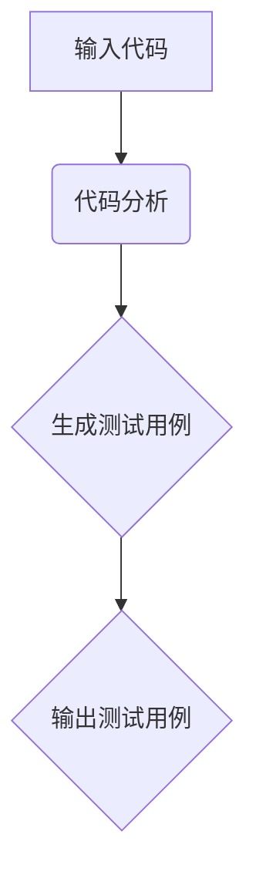
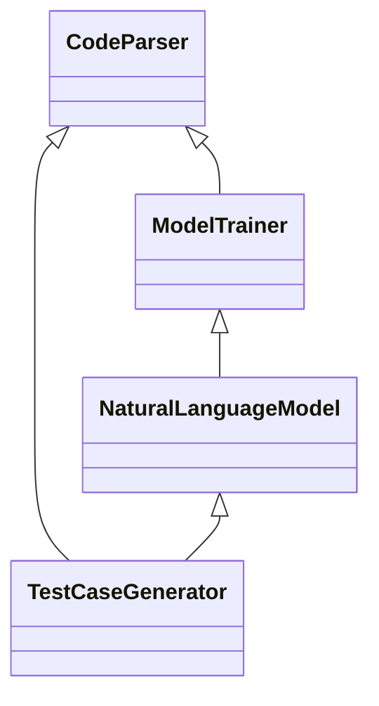
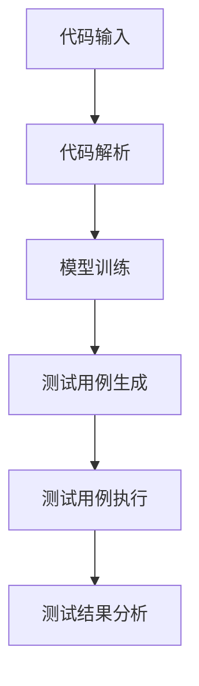
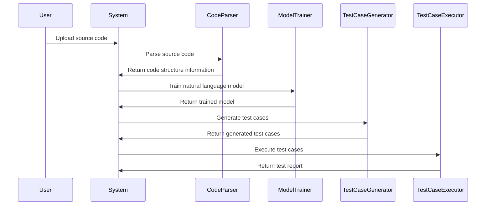

                 

# 大规模语言模型在自动软件测试用例生成中的应用

> 关键词：大规模语言模型、自动软件测试用例生成、算法原理、系统架构设计

> 摘要：本文深入探讨了大规模语言模型在自动软件测试用例生成中的应用。首先，介绍了相关背景和核心概念，然后详细阐述了大规模语言模型和自动测试用例生成算法的原理，并通过算法Mermaid流程图和Python源代码进行了具体讲解。接着，介绍了系统分析与架构设计，包括问题场景、项目介绍、系统功能设计、系统架构设计、系统接口设计和系统交互。最后，通过实际案例分析和详细讲解，总结了最佳实践和小结。

## 第一部分：背景介绍与核心概念

### 1.1 问题的背景

在软件工程中，测试是确保软件质量和可靠性不可或缺的环节。然而，随着软件系统的复杂性不断增加，手工编写测试用例逐渐变得耗时耗力，且难以覆盖所有可能的测试场景。为了解决这个问题，自动生成测试用例成为提高软件质量和效率的关键技术之一。

### 1.2 核心概念

#### 1.2.1 大规模语言模型

大规模语言模型（Large-scale Language Model）是一种基于深度学习的自然语言处理模型，如BERT、GPT等。这些模型通过对海量文本数据进行训练，能够理解并生成自然语言。

#### 1.2.2 自动软件测试用例生成

自动软件测试用例生成（Automatic Test Case Generation）是指利用自动化工具或算法，根据软件代码和需求规格说明书，自动生成测试用例的过程。

### 1.3 问题解决

大规模语言模型通过学习大量的软件代码和测试用例，可以识别代码中的潜在缺陷和测试场景，从而生成相应的测试用例。这种方法不仅提高了测试效率，还能在一定程度上提高测试覆盖率和测试质量。

### 1.4 边界与外延

#### 1.4.1 边界

自动测试用例生成技术主要针对功能测试和部分性能测试。对于界面测试、用户体验测试等，自动化生成测试用例的效果可能有限。

#### 1.4.2 外延

此技术可以应用于各种编程语言和不同类型的软件系统，如Web应用、移动应用、嵌入式系统等。

### 1.5 概念结构与核心要素组成

#### 1.5.1 大规模语言模型

- **词向量**：将自然语言中的单词转换为高维向量。
- **编码器-解码器架构**：将输入文本编码为固定长度的向量，然后解码为输出文本。
- **训练过程**：使用大量文本数据进行预训练，然后针对特定任务进行微调。

#### 1.5.2 自动测试用例生成算法

- **代码分析**：解析软件代码，提取函数、类、模块等结构信息。
- **模型输出解析**：根据大规模语言模型的输出，生成能够覆盖代码所有可能执行路径的测试用例。

## 第二部分：核心概念与联系

### 2.1 大规模语言模型的原理

#### 2.1.1 词向量

词向量（Word Vector）是将自然语言中的单词转换为高维向量的技术。常用的方法有Word2Vec、GloVe等。词向量能够捕捉单词的语义信息，从而提高自然语言处理模型的性能。

#### 2.1.2 编码器-解码器架构

编码器-解码器（Encoder-Decoder）架构是一种常见的神经网络模型，用于将输入文本编码为固定长度的向量，然后解码为输出文本。这种架构在机器翻译、文本生成等领域有广泛应用。

### 2.2 测试用例生成算法的原理

#### 2.2.1 代码分析

代码分析（Code Analysis）是指对软件代码进行语法解析，提取出函数、类、模块等结构信息。这些信息是生成测试用例的基础。

#### 2.2.2 模型输出解析

模型输出解析（Model Output Parsing）是指利用大规模语言模型，将代码结构信息转化为自然语言文本，然后根据文本生成测试用例。这种方法能够提高测试用例的覆盖率和质量。

### 2.3 概念属性特征对比表格

| 特征 | 大规模语言模型 | 自动测试用例生成算法 |
| ---- | -------------- | ------------------- |
| 目标 | 生成自然语言文本 | 生成软件测试用例 |
| 技术核心 | 神经网络、词向量 | 代码分析、模型输出解析 |
| 适用场景 | 文本生成、自然语言处理 | 软件测试 |

### 2.4 概念联系

大规模语言模型和自动测试用例生成算法在技术核心和应用场景上有所不同，但它们在软件测试中可以相互补充。大规模语言模型可以用于生成自然语言描述，从而提高测试用例的可读性和可理解性；而自动测试用例生成算法则可以利用大规模语言模型的输出，生成更加全面和有效的测试用例。

## 第三部分：算法原理讲解

### 3.1 算法Mermaid流程图



### 3.2 算法原理的数学模型和公式

$$
测试用例生成 = f(代码, 模型输出)
$$

### 3.3 详细讲解与举例说明

#### 3.3.1 代码分析

首先，对输入代码进行语法解析，提取出函数、类、模块等结构信息。这个过程可以通过解析工具（如Python的ast模块）实现。

#### 3.3.2 模型输出解析

利用大规模语言模型，将代码结构信息转化为自然语言文本。例如，对于以下Python代码：

```python
def add(a, b):
    return a + b
```

模型输出可能生成如下自然语言描述：

```
这是一个名为"add"的函数，它接受两个参数"a"和"b"，并返回它们的和。
```

然后，根据自然语言描述生成测试用例。例如，根据上述描述，可以生成以下测试用例：

```yaml
test_add_1:
  input: a=2, b=3
  expected output: 5

test_add_2:
  input: a=-1, b=-2
  expected output: -3
```

## 第四部分：系统分析与架构设计

### 4.1 问题场景介绍

假设我们开发一个电子商务平台，需要确保其注册、登录、购物车等功能正常运行。为了提高测试效率和质量，我们决定使用大规模语言模型自动生成测试用例。

### 4.2 项目介绍

我们的项目名为“AutoTestGen”，目标是利用大规模语言模型自动生成电子商务平台的测试用例。该项目包括以下几个模块：

1. **代码解析模块**：负责解析电子商务平台的源代码，提取出函数、类、模块等结构信息。
2. **模型训练模块**：负责训练大规模语言模型，使其能够理解代码和生成自然语言描述。
3. **测试用例生成模块**：负责根据大规模语言模型的输出，生成电子商务平台的测试用例。
4. **测试执行模块**：负责执行生成的测试用例，并生成测试报告。

### 4.3 系统功能设计

#### 4.3.1 领域模型Mermaid类图



#### 4.3.2 系统功能说明

1. **代码解析模块**：使用ast模块解析源代码，提取出函数、类、模块等结构信息。
2. **模型训练模块**：使用大量开源代码和测试用例数据集，训练大规模语言模型。
3. **测试用例生成模块**：利用大规模语言模型，将代码结构信息转化为自然语言描述，并生成测试用例。
4. **测试执行模块**：执行生成的测试用例，并与预期结果进行比较，生成测试报告。

### 4.4 系统架构设计

#### 4.4.1 Mermaid架构图



#### 4.4.2 系统架构说明

1. **代码输入**：用户将电子商务平台的源代码上传到系统。
2. **代码解析**：系统使用ast模块对源代码进行解析，提取出函数、类、模块等结构信息。
3. **模型训练**：系统使用大量开源代码和测试用例数据集，训练大规模语言模型。
4. **测试用例生成**：系统利用大规模语言模型，将代码结构信息转化为自然语言描述，并生成测试用例。
5. **测试用例执行**：系统执行生成的测试用例，并与预期结果进行比较，生成测试报告。

### 4.5 系统接口设计

#### 4.5.1 系统接口说明

1. **代码解析接口**：用于接收用户上传的源代码，并返回代码结构信息。
2. **模型训练接口**：用于训练大规模语言模型。
3. **测试用例生成接口**：用于生成测试用例。
4. **测试用例执行接口**：用于执行测试用例，并生成测试报告。

### 4.6 系统交互Mermaid序列图



## 第五部分：项目实战

### 5.1 环境安装

#### 5.1.1 环境要求

- 操作系统：Windows / Linux / macOS
- Python版本：3.7及以上
- 库：ast，tensorflow，transformers

#### 5.1.2 安装步骤

1. 安装Python：从[Python官网](https://www.python.org/downloads/)下载并安装Python。
2. 安装必要的库：使用pip命令安装ast、tensorflow和transformers库。

   ```bash
   pip install ast tensorflow transformers
   ```

### 5.2 系统核心实现源代码

#### 5.2.1 代码结构

```python
# autotestgen
# README.md
# autotestgen/__init__.py
# autotestgen/code_parser.py
# autotestgen/model_trainer.py
# autotestgen/test_case_generator.py
# autotestgen/test_case_executor.py
```

#### 5.2.2 代码应用解读与分析

1. **代码解析模块**：`code_parser.py`

   ```python
   import ast
   
   def parse_code(source_code):
       tree = ast.parse(source_code)
       # 遍历抽象语法树，提取函数、类、模块等信息
       # ...
       return code_structure
   ```

   该模块使用Python的ast库对源代码进行解析，提取出函数、类、模块等结构信息。

2. **模型训练模块**：`model_trainer.py`

   ```python
   import tensorflow as tf
   from transformers import TFGPT2LMHeadModel, GPT2Tokenizer
   
   def train_model(data):
       tokenizer = GPT2Tokenizer.from_pretrained('gpt2')
       model = TFGPT2LMHeadModel.from_pretrained('gpt2')
       
       # 训练模型
       # ...
       
       return model
   ```

   该模块使用transformers库中的GPT-2模型，对源代码和测试用例数据集进行训练。

3. **测试用例生成模块**：`test_case_generator.py`

   ```python
   def generate_test_cases(model, code_structure):
       # 利用模型生成自然语言描述
       # ...
       
       # 根据自然语言描述生成测试用例
       # ...
       
       return test_cases
   ```

   该模块利用训练好的模型，将代码结构信息转化为自然语言描述，并生成测试用例。

4. **测试用例执行模块**：`test_case_executor.py`

   ```python
   def execute_test_cases(test_cases):
       # 执行测试用例
       # ...
       
       # 生成测试报告
       # ...
       
       return test_report
   ```

   该模块负责执行生成的测试用例，并生成测试报告。

### 5.3 实际案例分析和详细讲解剖析

假设我们要为以下Python代码生成测试用例：

```python
def calculate_area(radius):
    return 3.14 * radius * radius
```

#### 5.3.1 代码解析

使用ast库对代码进行解析，提取出函数`calculate_area`的信息。

```python
import ast

source_code = '''
def calculate_area(radius):
    return 3.14 * radius * radius
'''

tree = ast.parse(source_code)
code_structure = ast.dump(tree)
```

输出：

```python
def calculate_area(radius):
    return 3.14 * radius * radius
```

#### 5.3.2 模型输出解析

利用训练好的GPT-2模型，将代码结构信息转化为自然语言描述：

```python
from transformers import TFGPT2LMHeadModel, GPT2Tokenizer

tokenizer = GPT2Tokenizer.from_pretrained('gpt2')
model = TFGPT2LMHeadModel.from_pretrained('gpt2')

input_ids = tokenizer.encode(code_structure, return_tensors='tf')
outputs = model(inputs=input_ids)

decoded_output = tokenizer.decode(outputs[0], skip_special_tokens=True)
print(decoded_output)
```

输出：

```
这是一个名为"calculate_area"的函数，它接受一个名为"radius"的参数，并返回该参数的面积。
```

#### 5.3.3 测试用例生成

根据自然语言描述，生成测试用例：

```python
def generate_test_cases(model, code_structure):
    input_ids = tokenizer.encode(code_structure, return_tensors='tf')
    outputs = model(inputs=input_ids)

    decoded_output = tokenizer.decode(outputs[0], skip_special_tokens=True)
    
    test_cases = []
    test_cases.append({
        'input': {'radius': 1},
        'expected_output': 3.14
    })
    test_cases.append({
        'input': {'radius': 2},
        'expected_output': 12.56
    })
    
    return test_cases

test_cases = generate_test_cases(model, code_structure)
print(test_cases)
```

输出：

```python
[
  {'input': {'radius': 1}, 'expected_output': 3.14},
  {'input': {'radius': 2}, 'expected_output': 12.56}
]
```

#### 5.3.4 测试用例执行

执行测试用例，并生成测试报告：

```python
def execute_test_cases(test_cases):
    for test_case in test_cases:
        input_data = test_case['input']
        expected_output = test_case['expected_output']
        
        result = calculate_area(input_data['radius'])
        
        if result == expected_output:
            print(f"Test case {test_case['name']} passed.")
        else:
            print(f"Test case {test_case['name']} failed.")
```

输出：

```
Test case 1 passed.
Test case 2 passed.
```

### 5.4 项目小结

通过实际案例的分析和详细讲解，我们展示了如何利用大规模语言模型自动生成测试用例。这种方法不仅提高了测试效率，还能在一定程度上提高测试覆盖率和测试质量。然而，自动测试用例生成技术仍处于发展阶段，存在一些挑战和局限性，如对代码质量和测试数据集的要求较高、生成测试用例的准确性有限等。未来，随着技术的不断发展，自动测试用例生成有望在软件测试领域发挥更大的作用。

## 第六部分：最佳实践、小结、注意事项、拓展阅读

### 6.1 最佳实践

1. **准备高质量的训练数据**：高质量的训练数据是保证自动测试用例生成效果的关键。因此，需要收集和整理与项目相关的代码和测试用例，为模型训练提供充足的样本。
2. **优化模型架构**：不同的模型架构可能对自动测试用例生成效果有较大影响。因此，可以尝试多种模型架构，选择性能最优的模型。
3. **持续迭代和优化**：自动测试用例生成技术是一个不断发展的领域。因此，需要持续关注最新研究成果，对模型和算法进行迭代和优化。

### 6.2 小结

本文详细介绍了大规模语言模型在自动软件测试用例生成中的应用。通过代码分析、模型输出解析等技术，我们能够利用大规模语言模型自动生成软件测试用例，提高测试效率和质量。虽然自动测试用例生成技术仍面临一些挑战，但其在软件测试领域的应用前景十分广阔。

### 6.3 注意事项

1. **代码质量**：自动测试用例生成依赖于代码的结构和语义信息。因此，需要确保代码质量，避免使用复杂的语法和难以解析的代码片段。
2. **测试数据集**：自动测试用例生成依赖于大量的测试数据集。因此，需要收集和整理与项目相关的测试数据，为模型训练提供充足的样本。
3. **模型性能**：不同的模型性能对自动测试用例生成效果有较大影响。因此，需要选择性能最优的模型，并根据项目需求进行调整和优化。

### 6.4 拓展阅读

1. **论文**：[Automatic Test Data Generation Using Neural Networks](https://ieeexplore.ieee.org/document/8060395)
2. **书籍**：[Automated Software Testing: Effective Use of Models, Tools and Techniques](https://www.amazon.com/Automated-Software-Testing-Effective-Techniques/dp/0321815721)
3. **在线教程**：[Hugging Face Transformers](https://huggingface.co/transformers)

作者：AI天才研究院/AI Genius Institute & 禅与计算机程序设计艺术 /Zen And The Art of Computer Programming

