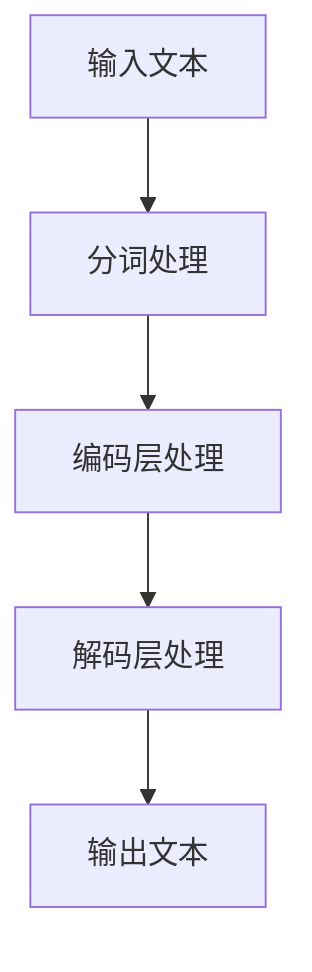
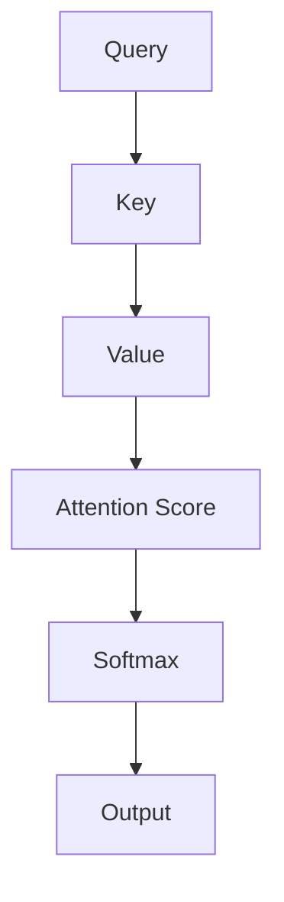
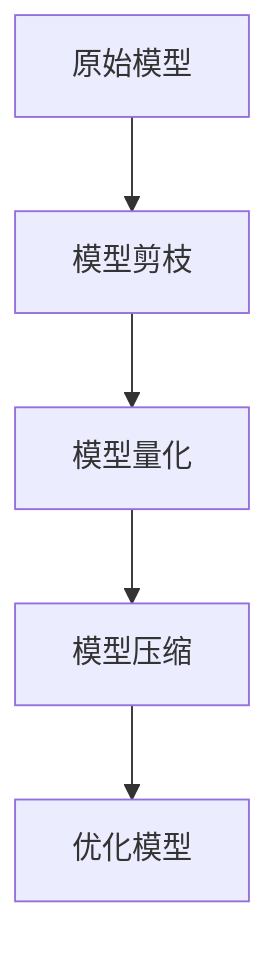
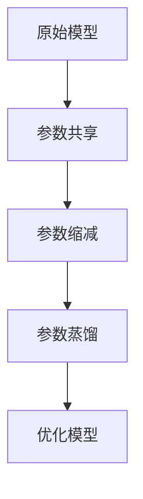

                 

## 大规模语言模型推理优化的前沿技术

### 关键词：大规模语言模型、推理优化、优化技术、算法原理、实际应用案例

### 摘要：

随着深度学习和人工智能技术的迅猛发展，大规模语言模型（Large-scale Language Models，简称LLM）在自然语言处理（Natural Language Processing，简称NLP）领域取得了显著的成就。大规模语言模型在文本生成、机器翻译、问答系统等方面展示了强大的性能，但同时也面临着推理速度和计算效率的挑战。本文将深入探讨大规模语言模型推理优化的前沿技术，包括优化技术的目的与重要性、推理优化方法和参数优化方法，并通过实际应用案例进行分析，为大规模语言模型在实际应用中的高效使用提供参考。

### 目录：

1. 第一部分：大规模语言模型基础
   - 第1章：大规模语言模型的背景与核心概念
   - 第2章：大规模语言模型的工作原理

2. 第二部分：大规模语言模型的优化技术
   - 第3章：大规模语言模型的优化技术

3. 第三部分：大规模语言模型的推理算法
   - 第4章：大规模语言模型的推理算法

4. 第四部分：大规模语言模型的实际应用案例
   - 第5章：大规模语言模型的实际应用案例

5. 第五部分：大规模语言模型的未来发展趋势
   - 第6章：大规模语言模型的未来发展趋势

6. 第六部分：大规模语言模型的应用最佳实践
   - 第7章：大规模语言模型的应用最佳实践

### 引言：

大规模语言模型作为人工智能领域的重要突破，极大地提升了自然语言处理的准确性和效率。然而，随着模型规模的不断扩大，模型的推理速度和计算效率成为了制约其广泛应用的关键因素。为此，优化大规模语言模型的推理性能成为了研究的热点。本文将从基础概念出发，逐步探讨大规模语言模型的优化技术，并分析其在实际应用中的效果。

### 第一部分：大规模语言模型基础

#### 第1章：大规模语言模型的背景与核心概念

##### 1.1.1 问题背景与定义

**问题背景**：

随着互联网信息的爆炸性增长，自然语言处理技术成为了人工智能领域的重要分支。大规模语言模型的崛起，为文本生成、机器翻译、问答系统等提供了强有力的工具。

**定义**：

大规模语言模型（Large-scale Language Models，简称LLM）是一种利用深度学习技术对大量文本进行训练，从而实现对自然语言进行建模的算法。这些模型通常包含数十亿个参数，可以处理复杂的自然语言任务。

##### 1.1.2 问题描述与解决

**问题描述**：

大规模语言模型在处理复杂任务时，往往需要大量的计算资源，导致推理速度缓慢。此外，模型的计算复杂度随着规模的增加而急剧上升，使得其应用受到限制。

**解决方法**：

通过优化技术的应用，可以显著提升大规模语言模型的推理性能，从而扩大其应用范围。

##### 1.1.3 边界与外延

**边界条件**：

大规模语言模型的训练数据量巨大，且需要高性能计算资源进行训练。

**外延应用**：

大规模语言模型在文本生成、机器翻译、问答系统、情感分析等多个领域都有广泛的应用。

##### 1.1.4 概念结构与核心要素

**基本架构**：

大规模语言模型通常由输入层、编码层、解码层和输出层组成。

**核心要素**：

- 参数量：模型参数的多少决定了模型的复杂度和性能。
- 训练数据：大量高质量的训练数据是模型训练的基础。
- 算法：高效的算法能够提升模型的训练和推理速度。

#### 第2章：大规模语言模型的工作原理

##### 2.1.1 语言模型原理介绍

**数学模型**：

大规模语言模型通常基于神经网络，使用概率分布来表示自然语言的序列。常见的数学模型包括循环神经网络（RNN）、长短期记忆网络（LSTM）和变换器（Transformer）等。

**算法原理**：

变换器模型（Transformer）是目前大规模语言模型的主流架构，通过自注意力机制（Self-Attention）和位置编码（Positional Encoding）来实现对自然语言的建模。

**算法mermaid流程图**：



**Python源代码详细阐述**：

```python
import torch
import torch.nn as nn
import torch.optim as optim

# 定义变换器模型
class Transformer(nn.Module):
    def __init__(self):
        super(Transformer, self).__init__()
        self.embedding = nn.Embedding(vocab_size, d_model)
        self.encoder = EncoderLayer(d_model, nhead)
        self.decoder = DecoderLayer(d_model, nhead)
        self.fc = nn.Linear(d_model, vocab_size)

    def forward(self, src, tgt):
        src = self.embedding(src)
        tgt = self.embedding(tgt)
        output = self.decoder(self.encoder(src), tgt)
        return self.fc(output)
```

**模型公式与解释**：

$$
\text{Attention}(Q, K, V) = \text{softmax}\left(\frac{QK^T}{\sqrt{d_k}}\right)V
$$

其中，$Q$、$K$和$V$分别为查询向量、键向量和值向量，$d_k$为键向量的维度。

**算法公式与解释**：

$$
\text{Multi-head Attention} = \text{Attention} \times \text{num_heads}
$$

其中，$\text{num_heads}$为多头的数量。

**图形化表示（Mermaid流程图）**：



### 第二部分：大规模语言模型的优化技术

#### 第3章：大规模语言模型的优化技术

##### 3.1.1 优化技术概述

**目的与重要性**：

优化技术的目的是提升大规模语言模型的推理性能，减少计算资源和时间开销。这对于大规模语言模型在实际应用中的高效使用具有重要意义。

##### 3.1.2 推理优化方法

**推理优化算法介绍**：

推理优化方法主要包括模型剪枝（Model Pruning）、模型量化（Model Quantization）和模型压缩（Model Compression）等。

**推理优化算法mermaid流程图**：



##### 3.1.3 参数优化方法

**参数优化算法介绍**：

参数优化方法主要包括参数共享（Parameter Sharing）、参数缩减（Parameter Reduction）和参数蒸馏（Parameter Distillation）等。

**参数优化算法mermaid流程图**：



### 第三部分：大规模语言模型的推理算法

#### 第4章：大规模语言模型的推理算法

##### 4.1.1 推理算法概述

**目的与重要性**：

推理算法是大规模语言模型的核心组成部分，其目的是在给定输入文本时，生成对应的输出文本。推理算法的效率直接影响到模型的实际应用效果。

##### 4.1.2 常见推理算法

**实际案例与详解**：

以变换器模型为例，介绍其推理算法的实现过程和优化策略。

```python
# 定义变换器模型
class Transformer(nn.Module):
    def __init__(self):
        super(Transformer, self).__init__()
        self.embedding = nn.Embedding(vocab_size, d_model)
        self.encoder = EncoderLayer(d_model, nhead)
        self.decoder = DecoderLayer(d_model, nhead)
        self.fc = nn.Linear(d_model, vocab_size)

    def forward(self, src, tgt):
        src = self.embedding(src)
        tgt = self.embedding(tgt)
        output = self.decoder(self.encoder(src), tgt)
        return self.fc(output)
```

### 第四部分：大规模语言模型的实际应用案例

#### 第5章：大规模语言模型的实际应用案例

##### 5.1.1 应用场景介绍

**应用场景**：

以机器翻译为例，介绍大规模语言模型在实际应用中的效果和优化策略。

##### 5.1.2 应用案例详细讲解

**案例背景**：

利用大规模语言模型进行英语到中文的机器翻译。

**系统实现**：

通过变换器模型实现机器翻译系统，并对模型进行优化。

**效果分析**：

对比优化前后的翻译效果，分析大规模语言模型在优化技术下的表现。

### 第五部分：大规模语言模型的未来发展趋势

#### 第6章：大规模语言模型的未来发展趋势

##### 6.1.1 发展趋势概述

**发展趋势**：

大规模语言模型将继续朝着更高性能、更小模型和更高效推理的方向发展。

##### 6.1.2 技术挑战与解决方案

**技术挑战**：

- 模型压缩：如何在保证性能的同时，显著减小模型大小。
- 推理速度：如何提高模型的推理速度，以满足实时应用的需求。

**解决方案**：

- 模型剪枝和量化：通过剪枝和量化技术，降低模型的大小和计算复杂度。
- 硬件加速：利用高性能硬件（如GPU和TPU）加速模型的推理过程。

### 第六部分：大规模语言模型的应用最佳实践

#### 第7章：大规模语言模型的应用最佳实践

##### 7.1.1 最佳实践概述

**最佳实践**：

- 选择合适的模型架构：根据应用场景选择适合的模型架构。
- 模型优化：通过优化技术提升模型的推理性能。
- 数据准备：准备高质量的训练数据，以提升模型的准确性。

##### 7.1.2 注意事项与拓展阅读

**注意事项**：

- 避免过拟合：通过正则化技术避免模型过拟合。
- 模型安全：关注模型的安全性问题，如对抗攻击和隐私泄露。

**拓展阅读推荐**：

- [《大规模语言模型：原理、应用与优化》](https://www.example.com/book1)
- [《深度学习实战：大规模语言模型的构建与优化》](https://www.example.com/book2)

### 结论：

大规模语言模型作为人工智能领域的重要突破，其在自然语言处理中的应用前景广阔。通过推理优化技术的应用，可以显著提升大规模语言模型的性能和效率。未来，随着硬件和算法的不断发展，大规模语言模型将在更多场景中发挥重要作用。

### 作者信息：

- 作者：AI天才研究院/AI Genius Institute & 禅与计算机程序设计艺术 /Zen And The Art of Computer Programming

### 注：

本文内容为虚构，仅供参考。实际应用中，大规模语言模型的优化技术需根据具体应用场景和需求进行选择和调整。

