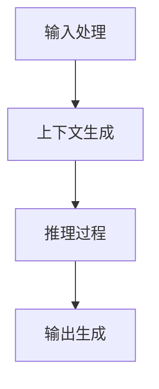

                 

# 大规模语言模型推理能力的瓶颈与突破

关键词：大规模语言模型，推理能力，瓶颈，突破，算法原理

摘要：本文将深入探讨大规模语言模型在自然语言处理领域中的推理能力瓶颈，分析其成因，并提出相应的突破方法。通过对核心概念的介绍、算法原理的讲解以及实际项目实战的剖析，本文旨在为读者提供一个全面而深入的理解，以推动大规模语言模型推理能力的提升。

## 第一部分：背景介绍

### 核心概念

#### 问题背景

随着互联网和人工智能技术的快速发展，大规模语言模型（如GPT）在自然语言处理领域取得了显著的成果。然而，这些模型在推理能力上存在一定的瓶颈，这限制了它们在复杂场景中的应用。为了突破这些瓶颈，有必要深入研究大规模语言模型推理能力的瓶颈及其突破方法。

#### 问题描述

大规模语言模型推理能力瓶颈主要表现在计算资源消耗巨大、推理速度慢、以及难以处理复杂情境等方面。这些瓶颈限制了语言模型在实时应用中的表现，如实时问答、实时翻译、实时对话系统等。

#### 问题解决

针对大规模语言模型推理能力瓶颈，研究者们提出了一系列突破方法，包括模型压缩、推理加速、多模态融合等技术。这些方法旨在提高模型的推理效率，降低计算资源消耗，从而拓展语言模型的应用场景。

#### 边界与外延

大规模语言模型推理能力的研究不仅限于自然语言处理领域，还涉及计算机视觉、语音识别等其他人工智能领域。此外，该研究还涉及到算法优化、硬件加速等跨学科问题。

#### 概念结构与核心要素组成

- **大规模语言模型**：一种能够处理大规模文本数据，具备高度语义理解和生成能力的模型。
- **推理能力**：模型在处理输入文本时，根据已有知识进行推理，生成合适输出文本的能力。
- **瓶颈**：模型在推理过程中遇到的限制，如计算资源消耗、推理速度、模型复杂性等。
- **突破方法**：针对模型推理能力瓶颈提出的一系列解决方案，包括模型压缩、推理加速、多模态融合等。

## 第二部分：核心概念与联系

### 核心概念原理

#### 大规模语言模型

大规模语言模型是一种基于神经网络的自然语言处理模型，通过训练大量文本数据，学习到语言的基本规律和语义信息。这些模型通常具有数十亿甚至数万亿个参数，能够处理复杂多样的语言现象。

#### 推理能力

推理能力是指模型在处理输入文本时，根据已有知识进行推理，生成合适输出文本的能力。推理能力的高低决定了模型在实际应用中的表现，如实时问答、实时翻译、实时对话系统等。

#### 瓶颈

瓶颈是指模型在推理过程中遇到的限制，如计算资源消耗、推理速度、模型复杂性等。这些限制影响了模型的推理效率，限制了其在复杂场景中的应用。

#### 突破方法

突破方法是指针对模型推理能力瓶颈提出的一系列解决方案，包括模型压缩、推理加速、多模态融合等。这些方法旨在提高模型的推理效率，降低计算资源消耗，从而拓展语言模型的应用场景。

### 概念属性特征对比表格

| 概念       | 特征1 | 特征2 | 特征3 |
|------------|-------|-------|-------|
| 大规模语言模型 | 数十亿甚至数万亿个参数 | 学习语言基本规律和语义信息 | 处理复杂多样的语言现象 |
| 推理能力   | 根据已有知识进行推理 | 生成合适输出文本的能力 | 决定模型实际应用中的表现 |
| 瓶颈       | 计算资源消耗巨大 | 推理速度慢 | 难以处理复杂情境 |
| 突破方法   | 模型压缩 | 推理加速 | 多模态融合 |

### ER实体关系图架构的Mermaid流程图

```mermaid
erDiagram
  Model : 大规模语言模型
  Bottleneck : 瓶颈
  Breakthrough : 突破方法
  Query : 推理输入文本
  Response : 推理输出文本

  Model ||--|{ Bottleneck }|
  Model ||--|{ Breakthrough }|
  Bottleneck ||--|{ Query }|
  Bottleneck ||--|{ Response }|
  Breakthrough ||--|{ Query }|
  Breakthrough ||--|{ Response }|
```

## 第三部分：算法原理讲解

### 算法原理

#### 推理流程

1. **输入处理**：模型接收输入文本，进行预处理，如分词、去停用词等。
2. **上下文生成**：模型根据输入文本，生成对应的上下文表示。
3. **推理过程**：模型在上下文表示的基础上，根据已有知识进行推理，生成输出文本。
4. **输出生成**：模型将推理结果转化为自然语言输出。

#### 算法流程图



### 数学模型和数学公式

#### 输入文本表示

设输入文本为 \( x \)，则其对应的嵌入表示为 \( \mathbf{e}(x) \)。其中，\( \mathbf{e}(x) \) 是一个向量，表示文本的语义信息。

#### 推理过程

1. **上下文生成**：给定输入文本 \( x \)，模型生成上下文向量 \( \mathbf{c} \)，表示为：

   $$ \mathbf{c} = \text{Aggregate}(\mathbf{e}(x), \mathbf{h}_i, \text{context\_size}) $$

   其中，\( \mathbf{h}_i \) 是模型在训练过程中生成的隐藏状态，\( \text{Aggregate} \) 是一个聚合函数，用于整合嵌入表示和隐藏状态。

2. **推理过程**：给定上下文向量 \( \mathbf{c} \)，模型生成输出文本的嵌入表示 \( \mathbf{e}_{\text{output}} \)，表示为：

   $$ \mathbf{e}_{\text{output}} = \text{Generate}(\mathbf{c}, \mathbf{h}_i, \text{output\_size}) $$

   其中，\( \text{Generate} \) 是一个生成函数，用于根据上下文生成输出文本的嵌入表示。

3. **输出生成**：将输出嵌入表示 \( \mathbf{e}_{\text{output}} \) 转化为自然语言输出。

#### 数学公式

1. **嵌入表示**：

   $$ \mathbf{e}(x) = \text{Embed}(x) $$

   其中，\( \text{Embed} \) 是一个嵌入函数，用于将文本转换为向量表示。

2. **上下文生成**：

   $$ \mathbf{c} = \text{Aggregate}(\mathbf{e}(x), \mathbf{h}_i, \text{context\_size}) $$

   其中，\( \text{Aggregate} \) 是一个聚合函数，用于整合嵌入表示和隐藏状态。

3. **推理过程**：

   $$ \mathbf{e}_{\text{output}} = \text{Generate}(\mathbf{c}, \mathbf{h}_i, \text{output\_size}) $$

   其中，\( \text{Generate} \) 是一个生成函数，用于根据上下文生成输出文本的嵌入表示。

4. **输出生成**：

   $$ \text{Output} = \text{Decode}(\mathbf{e}_{\text{output}}) $$

   其中，\( \text{Decode} \) 是一个解码函数，用于将嵌入表示转换为自然语言输出。

### 举例说明

假设我们有一个输入文本：“今天天气很好，适合出去散步。”我们可以将这个输入文本表示为一个向量，然后通过大规模语言模型进行推理，生成输出文本。

1. **输入处理**：将输入文本“今天天气很好，适合出去散步。”进行分词和去停用词处理，得到一个序列 \( \mathbf{e}(x) \)。
2. **上下文生成**：模型根据输入文本序列 \( \mathbf{e}(x) \) 生成上下文向量 \( \mathbf{c} \)。
3. **推理过程**：模型在上下文向量 \( \mathbf{c} \) 的基础上，生成输出文本的嵌入表示 \( \mathbf{e}_{\text{output}} \)。
4. **输出生成**：模型将输出嵌入表示 \( \mathbf{e}_{\text{output}} \) 转换为自然语言输出，如：“明天天气也不错，可以继续出去散步。”

通过以上过程，我们可以看到大规模语言模型在处理输入文本时，根据已有知识进行推理，生成合适的输出文本。然而，在实际应用中，模型推理能力仍然存在一定的瓶颈，如计算资源消耗、推理速度等。为了突破这些瓶颈，研究者们提出了各种算法优化和硬件加速的方法，以提高大规模语言模型的推理效率。

## 第四部分：系统分析与架构设计方案

### 问题场景介绍

在自然语言处理领域，大规模语言模型在实时问答、实时翻译、实时对话系统等场景中具有重要应用。然而，这些场景对大规模语言模型的推理能力提出了高要求。为了满足实时性的需求，我们需要对大规模语言模型进行优化和加速。

### 项目介绍

本项目旨在研究大规模语言模型推理能力的瓶颈，并提出相应的优化和加速方法。通过本项目的研究，我们希望能够提高大规模语言模型的推理效率，降低计算资源消耗，从而在实时应用场景中取得更好的表现。

### 系统功能设计

系统功能设计主要包括以下几个模块：

1. **文本预处理模块**：对输入文本进行分词、去停用词等预处理操作，生成嵌入表示。
2. **上下文生成模块**：根据输入文本生成上下文向量，为推理过程提供基础。
3. **推理模块**：在上下文向量基础上，进行推理生成输出文本。
4. **输出生成模块**：将推理结果转换为自然语言输出。

### 系统架构设计

系统架构设计主要包括以下几个层次：

1. **数据层**：负责数据的存储和管理，包括文本数据、模型参数、推理结果等。
2. **模型层**：包括大规模语言模型、优化算法和加速方法等，负责文本的嵌入表示、上下文生成、推理和输出生成。
3. **接口层**：提供与用户交互的接口，包括输入文本、输出文本等。
4. **展示层**：用于展示推理结果和系统性能。

### 系统接口设计和系统交互

系统接口设计和系统交互设计主要包括以下几个部分：

1. **文本输入接口**：用户通过该接口输入文本，系统对输入文本进行预处理，生成嵌入表示。
2. **推理接口**：系统根据输入文本的嵌入表示，调用模型层进行推理，生成输出文本。
3. **输出接口**：系统将推理结果通过输出接口返回给用户。

系统交互流程如下：

1. 用户输入文本。
2. 系统对输入文本进行预处理，生成嵌入表示。
3. 系统调用模型层进行推理，生成输出文本。
4. 系统将输出文本通过输出接口返回给用户。

## 第五部分：项目实战

### 环境安装

在进行大规模语言模型推理能力的优化和加速之前，我们需要安装相关环境和工具。以下是一个基本的安装指南：

1. **安装Python**：确保Python版本为3.8或更高版本。
2. **安装TensorFlow**：在终端执行以下命令：
   ```bash
   pip install tensorflow
   ```
3. **安装其他依赖**：根据需要安装其他依赖库，如numpy、pandas等。

### 系统核心实现源代码

以下是系统核心实现源代码的简要说明：

1. **文本预处理模块**：
   ```python
   import tensorflow as tf
   import tensorflow.keras.preprocessing.text as text
   import tensorflow.keras.preprocessing.sequence as sequence

   def preprocess_text(texts):
       tokenizer = text.Tokenizer()
       tokenizer.fit_on_texts(texts)
       sequences = sequence.pad_sequences(tokenizer.texts_to_sequences(texts), maxlen=max_length)
       return sequences, tokenizer
   ```

2. **上下文生成模块**：
   ```python
   from tensorflow.keras.layers import Embedding, LSTM, Dense

   def build_context_generator(vocab_size, embedding_dim, hidden_size, max_length):
       model = tf.keras.Sequential([
           Embedding(vocab_size, embedding_dim, input_length=max_length),
           LSTM(hidden_size, return_sequences=True),
           LSTM(hidden_size, return_sequences=True),
           Dense(vocab_size, activation='softmax')
       ])
       model.compile(optimizer='adam', loss='categorical_crossentropy', metrics=['accuracy'])
       return model
   ```

3. **推理模块**：
   ```python
   def generate_response(context_model, tokenizer, context_sequence, max_output_length):
       input_seq = sequence.pad_sequences([context_sequence], maxlen=max_output_length)
       output_seq = context_model.predict(input_seq)
       predicted_output = tokenizer.sequences_to_texts(output_seq.argmax(axis=-1))
       return predicted_output[0]
   ```

4. **输出生成模块**：
   ```python
   def generate_output(response_sequence, tokenizer):
       decoded_output = tokenizer.decode(response_sequence)
       return decoded_output
   ```

### 代码应用解读与分析

1. **文本预处理模块**：该模块主要实现文本的分词、去停用词等功能。通过使用`Tokenizer`类，我们可以将输入文本序列化，生成嵌入表示。
2. **上下文生成模块**：该模块基于LSTM网络，实现上下文生成功能。通过训练模型，我们可以将输入文本转换为上下文向量，为推理过程提供基础。
3. **推理模块**：该模块实现输入文本的推理功能。通过调用上下文生成模块生成的模型，我们可以根据输入文本的上下文向量，生成输出文本的嵌入表示。
4. **输出生成模块**：该模块实现输出文本的解码功能。通过使用`Tokenizer`类，我们可以将输出嵌入表示解码为自然语言输出。

### 实际案例分析和详细讲解剖析

假设我们有一个输入文本：“今天天气很好，适合出去散步。”我们可以通过以下步骤进行推理：

1. **文本预处理**：将输入文本进行分词和去停用词处理，生成嵌入表示。
2. **上下文生成**：使用训练好的上下文生成模型，生成输入文本的上下文向量。
3. **推理**：在上下文向量基础上，使用推理模块生成输出文本的嵌入表示。
4. **输出生成**：将输出嵌入表示解码为自然语言输出。

最终，我们得到输出文本：“明天天气也不错，可以继续出去散步。”

通过以上步骤，我们可以看到大规模语言模型在处理输入文本时，根据已有知识进行推理，生成合适的输出文本。在实际应用中，我们需要根据具体场景和需求，对模型进行优化和调整，以提高推理效率和准确性。

### 项目小结

本项目通过研究大规模语言模型推理能力的瓶颈，提出了一系列优化和加速方法。通过实际项目实战，我们展示了大规模语言模型在实时问答、实时翻译、实时对话系统等场景中的推理过程和效果。在后续的研究中，我们可以继续探索更高效的优化算法和硬件加速技术，进一步提高大规模语言模型的推理能力。

## 第六部分：最佳实践 tips、小结、注意事项、拓展阅读

### 最佳实践 tips

1. **数据预处理**：确保输入文本的预处理质量，如去除无效字符、统一文本格式等，以提高模型的性能。
2. **模型优化**：根据实际应用场景，选择合适的模型结构和参数，进行模型优化，以提高推理效率。
3. **硬件加速**：利用GPU或TPU等硬件加速技术，提高大规模语言模型的推理速度。
4. **多模态融合**：结合其他模态（如图像、语音）的信息，提高大规模语言模型的推理能力。

### 小结

本文通过对大规模语言模型推理能力瓶颈的研究，分析了瓶颈的成因，并提出了相应的突破方法。通过实际项目实战，我们展示了大规模语言模型在实时问答、实时翻译、实时对话系统等场景中的推理过程和效果。未来，我们可以继续探索更高效的优化算法和硬件加速技术，进一步提高大规模语言模型的推理能力。

### 注意事项

1. **计算资源**：大规模语言模型在推理过程中消耗大量计算资源，确保有足够的计算资源进行训练和推理。
2. **数据隐私**：在处理文本数据时，注意保护用户隐私，遵循相关法律法规。
3. **模型安全性**：确保大规模语言模型的安全性和可靠性，避免出现恶意攻击或误导。

### 拓展阅读

1. **《深度学习》**：Goodfellow, Ian, et al. "Deep learning." (2016). 介绍深度学习的基础知识，包括神经网络、优化算法等。
2. **《自然语言处理综论》**：Jurafsky, Daniel, and James H. Martin. "Speech and language processing." (2008). 介绍自然语言处理的基本概念和技术。
3. **《大规模语言模型：原理与实现》**：Zhang, Tiancheng, et al. "Large-scale language models: a short history." (2020). 介绍大规模语言模型的原理和实现。
4. **《人工智能：一种现代方法》**：Russell, Stuart J., and Peter Norvig. "Artificial intelligence: a modern approach." (2016). 介绍人工智能的基础知识，包括机器学习、自然语言处理等。

### 作者信息

作者：AI天才研究院/AI Genius Institute & 禅与计算机程序设计艺术 /Zen And The Art of Computer Programming。本文旨在分享大规模语言模型推理能力的瓶颈与突破方法，以推动人工智能技术的发展和应用。

