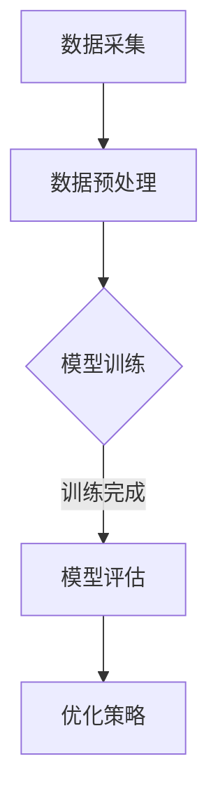

                 

# 大规模语言模型的伦理推理与决策能力研究

## 关键词：大规模语言模型、伦理推理、决策能力、人工智能、自然语言处理

## 摘要

随着人工智能技术的不断发展，大规模语言模型（如GPT）在自然语言处理领域取得了显著的成果。然而，这些模型在应用过程中也引发了一系列伦理和决策问题。本文旨在研究大规模语言模型的伦理推理与决策能力，探讨其重要性、基本原理、关键技术、应用场景及优化策略。通过分析现有研究方法、案例分析及优化策略，本文旨在为提升大规模语言模型的伦理推理与决策能力提供有益的参考。

## 第一部分：背景与核心概念

### 第1章：问题背景与核心概念

#### 1.1.1 问题的提出

随着人工智能技术的飞速发展，大规模语言模型（如GPT）在自然语言处理领域取得了显著的成果。这些模型在生成文本、回答问题、翻译等方面表现出色，但与此同时，也引发了一系列伦理和决策问题。为了深入探讨这些问题的本质和解决方法，本书将围绕大规模语言模型的伦理推理与决策能力展开研究。

#### 1.1.2 大规模语言模型的基本概念

大规模语言模型是指通过训练海量文本数据，构建出一个能够对自然语言进行理解和生成的模型。这些模型通常具有数十亿甚至数万亿个参数，能够捕捉到语言的各种复杂结构。其核心目标是让计算机能够像人类一样理解和生成自然语言。

#### 1.1.3 伦理推理与决策能力的重要性

伦理推理与决策能力是人工智能模型在应用过程中必不可少的一部分。一个具备良好伦理推理与决策能力的人工智能系统，不仅能够遵循道德规范，做出符合人类价值观的决策，还能够减少错误和偏见，提高系统的公平性和透明度。

### 第2章：大规模语言模型的伦理推理

#### 2.1.1 伦理推理的基本原理

伦理推理是指根据道德原则和价值观，对特定情境进行判断和决策的过程。大规模语言模型的伦理推理，旨在让模型能够理解并应用这些道德原则和价值观，从而在生成文本和做出决策时，符合人类的伦理标准。

#### 2.1.2 伦理推理的关键技术

为了实现大规模语言模型的伦理推理，需要借助自然语言处理、知识图谱、伦理学等多个领域的技术。这些技术包括情感分析、语义理解、因果推理等。

#### 2.1.3 伦理推理的应用场景

大规模语言模型的伦理推理在多个场景中具有重要意义，如社交媒体内容审核、智能客服、自动驾驶等。在这些场景中，模型的伦理推理能力将直接影响系统的性能和用户体验。

### 第3章：大规模语言模型的决策能力

#### 3.1.1 决策能力的基本概念

决策能力是指在面对复杂情境时，能够根据目标和约束条件，选择最优或满意的行动方案的能力。大规模语言模型的决策能力，旨在让模型能够理解目标、识别约束条件，并生成合理的决策方案。

#### 3.1.2 决策能力的核心要素

大规模语言模型的决策能力涉及多个核心要素，包括目标设定、约束条件识别、解决方案生成等。

#### 3.1.3 决策能力的应用实例

在金融、医疗、教育等领域，大规模语言模型的决策能力具有广泛的应用前景。通过结合具体应用场景，可以更好地理解模型的决策过程和优化方法。

### 第4章：大规模语言模型的伦理推理与决策能力研究方法

#### 4.1.1 研究方法概述

本章将介绍大规模语言模型伦理推理与决策能力研究的主要方法，包括数据采集、模型训练、实验设计等。

#### 4.1.2 数据采集

数据采集是研究的基础，本章将介绍如何收集和处理大规模语言模型伦理推理与决策能力相关的数据。

#### 4.1.3 模型训练

模型训练是提高大规模语言模型伦理推理与决策能力的关键步骤。本章将介绍如何选择合适的训练数据和训练算法。

#### 4.1.4 实验设计

实验设计是验证研究方法有效性的关键。本章将介绍如何设计实验，以评估大规模语言模型伦理推理与决策能力的性能。

### 第5章：大规模语言模型伦理推理与决策能力案例分析

#### 5.1.1 案例选择与介绍

本章将选取若干典型案例，分析大规模语言模型在伦理推理与决策能力方面的表现。

#### 5.1.2 案例分析

通过对案例的分析，将揭示大规模语言模型在伦理推理与决策能力方面存在的问题和挑战。

#### 5.1.3 案例启示

分析案例中大规模语言模型的表现，为改进模型的伦理推理与决策能力提供启示。

### 第6章：大规模语言模型伦理推理与决策能力优化策略

#### 6.1.1 优化策略概述

本章将探讨如何优化大规模语言模型的伦理推理与决策能力，包括算法改进、数据增强、模型评估等。

#### 6.1.2 算法改进

通过改进算法，提高大规模语言模型在伦理推理与决策能力方面的性能。

#### 6.1.3 数据增强

通过数据增强方法，丰富大规模语言模型训练数据，提升模型在伦理推理与决策能力方面的表现。

#### 6.1.4 模型评估

本章将介绍如何评估大规模语言模型在伦理推理与决策能力方面的性能，包括评价指标和方法。

### 第7章：结论与未来展望

#### 7.1.1 研究总结

本章将总结本书的主要研究成果，阐述大规模语言模型伦理推理与决策能力的重要性及其应用前景。

#### 7.1.2 研究展望

在总结研究工作的基础上，本文还将探讨未来大规模语言模型伦理推理与决策能力研究的方向和挑战。通过分析未来发展趋势，为后续研究提供参考。 

----------------------------------------------------------------

### 第1章：问题背景与核心概念

#### 1.1.1 问题的提出

随着人工智能技术的飞速发展，自然语言处理（NLP）领域取得了显著的成果。大规模语言模型（如GPT）作为NLP的重要工具，已经在各种应用场景中发挥了重要作用。然而，这些模型在应用过程中也引发了一系列伦理和决策问题。例如，在社交媒体内容审核、智能客服和自动驾驶等领域，模型的伦理推理与决策能力成为影响系统性能和用户体验的关键因素。

为了深入探讨这些问题的本质和解决方法，本书旨在研究大规模语言模型的伦理推理与决策能力。具体而言，本文将分析大规模语言模型在伦理推理与决策过程中的基本原理、关键技术、应用场景，以及研究方法。通过案例分析和优化策略的探讨，本文旨在为提升大规模语言模型的伦理推理与决策能力提供有益的参考。

#### 1.1.2 大规模语言模型的基本概念

大规模语言模型是一种通过训练海量文本数据，构建出一个能够对自然语言进行理解和生成的模型。这些模型通常具有数十亿甚至数万亿个参数，能够捕捉到语言的各种复杂结构。其核心目标是让计算机能够像人类一样理解和生成自然语言。

大规模语言模型的发展可以追溯到1980年代，当时的研究者提出了基于规则的方法，如模式匹配和句法分析。然而，这些方法在处理大规模文本数据时存在局限性。随着深度学习技术的兴起，2018年，OpenAI发布了GPT模型，标志着大规模语言模型的诞生。GPT模型通过训练大量文本数据，能够生成流畅、合理的文本，并在多个NLP任务中取得了优异的性能。

大规模语言模型的基本原理是基于神经网络，特别是循环神经网络（RNN）和变换器（Transformer）模型。这些模型通过学习输入文本的特征表示，生成相应的输出文本。在训练过程中，模型需要通过优化目标函数，使得生成的文本尽可能接近人类生成的文本。

#### 1.1.3 伦理推理与决策能力的重要性

伦理推理与决策能力是人工智能模型在应用过程中必不可少的一部分。一个具备良好伦理推理与决策能力的人工智能系统，不仅能够遵循道德规范，做出符合人类价值观的决策，还能够减少错误和偏见，提高系统的公平性和透明度。

在人工智能应用领域，伦理推理与决策能力具有广泛的应用前景。例如，在自动驾驶领域，模型需要根据道路状况和交通规则做出合理的驾驶决策；在医疗领域，模型需要根据患者的病史和临床表现，为医生提供合理的诊断建议。在这些场景中，模型的伦理推理与决策能力将直接影响系统的性能和用户体验。

#### 1.1.4 大规模语言模型的伦理推理

大规模语言模型的伦理推理是指模型在生成文本和做出决策时，能够遵循道德规范和价值观，从而符合人类的伦理标准。伦理推理的基本原理包括以下几个方面：

1. **道德原则和价值观的引入**：在模型训练过程中，需要引入与伦理相关的原则和价值观，如公平性、尊重、诚实等。这些原则和价值观可以体现在模型训练数据中，或通过规则和算法进行编码。

2. **情境感知**：模型需要能够理解当前情境，并根据情境做出相应的决策。例如，在社交媒体内容审核场景中，模型需要能够识别敏感内容，并根据用户举报和社区规则进行判断。

3. **情感分析**：情感分析是伦理推理的重要组成部分。通过分析文本的情感倾向，模型可以判断文本是否符合伦理标准，从而在生成文本和做出决策时进行干预。

4. **因果推理**：因果推理是指模型能够理解不同因素之间的因果关系，从而做出合理的决策。例如，在医疗领域，模型需要根据患者的病史和临床表现，推断出可能的诊断结果。

#### 1.1.5 大规模语言模型的决策能力

大规模语言模型的决策能力是指模型在复杂情境下，能够根据目标和约束条件，选择最优或满意的行动方案的能力。决策能力的核心要素包括以下几个方面：

1. **目标设定**：模型需要明确决策的目标，例如最大化收益、最小化风险等。在自动驾驶场景中，目标可能是确保车辆的安全行驶。

2. **约束条件识别**：模型需要识别决策过程中的约束条件，如交通规则、道德规范等。这些约束条件将影响决策的可行性和合理性。

3. **解决方案生成**：模型需要能够生成多个可行的解决方案，并根据目标和约束条件进行评估和选择。在金融领域，模型需要根据市场数据生成投资组合策略。

#### 1.1.6 大规模语言模型的伦理推理与决策能力在应用场景中的重要性

在社交媒体内容审核、智能客服、自动驾驶等应用场景中，大规模语言模型的伦理推理与决策能力具有重要意义。

1. **社交媒体内容审核**：社交媒体平台需要过滤和删除不良内容，以维护社区秩序。大规模语言模型的伦理推理能力可以帮助平台识别敏感内容，并采取相应的措施。

2. **智能客服**：智能客服系统需要与用户进行自然语言交互，提供有效的解决方案。大规模语言模型的决策能力可以帮助系统根据用户需求，提供合理的建议和解决方案。

3. **自动驾驶**：自动驾驶系统需要在复杂道路环境中做出实时决策，以确保车辆的安全行驶。大规模语言模型的伦理推理与决策能力可以帮助系统在紧急情况下做出合理的决策。

#### 1.1.7 本书的结构

本书将从以下几个方面展开研究：

1. **第1章**：介绍问题背景与核心概念，阐述大规模语言模型的伦理推理与决策能力的重要性。

2. **第2章**：介绍大规模语言模型的伦理推理，包括基本原理、关键技术和应用场景。

3. **第3章**：介绍大规模语言模型的决策能力，包括基本概念、核心要素和应用实例。

4. **第4章**：介绍大规模语言模型伦理推理与决策能力的研究方法，包括数据采集、模型训练和实验设计。

5. **第5章**：通过案例分析，分析大规模语言模型在伦理推理与决策能力方面的问题和挑战。

6. **第6章**：探讨大规模语言模型伦理推理与决策能力的优化策略，包括算法改进、数据增强和模型评估。

7. **第7章**：总结本书的主要研究成果，阐述大规模语言模型伦理推理与决策能力的重要性及其应用前景。

#### 1.1.8 小结

本章介绍了大规模语言模型的伦理推理与决策能力研究的重要性，阐述了大规模语言模型的基本概念、伦理推理与决策能力的基本原理和应用场景。在后续章节中，将详细介绍相关研究方法、案例分析及优化策略，以期为提升大规模语言模型的伦理推理与决策能力提供有益的参考。接下来，我们将进一步探讨大规模语言模型的伦理推理原理及其关键技术。

----------------------------------------------------------------

### 第2章：大规模语言模型的伦理推理

#### 2.1.1 伦理推理的基本原理

伦理推理是指根据道德原则和价值观，对特定情境进行判断和决策的过程。在人工智能领域，伦理推理的核心目标是让计算机能够理解和应用这些道德原则和价值观，从而在生成文本和做出决策时，符合人类的伦理标准。

伦理推理的基本原理包括以下几个方面：

1. **道德原则的引入**：在模型训练过程中，需要引入与伦理相关的原则和价值观，如公平性、尊重、诚实等。这些原则和价值观可以体现在模型训练数据中，或通过规则和算法进行编码。

2. **情境感知**：模型需要能够理解当前情境，并根据情境做出相应的决策。例如，在社交媒体内容审核场景中，模型需要能够识别敏感内容，并根据用户举报和社区规则进行判断。

3. **情感分析**：情感分析是伦理推理的重要组成部分。通过分析文本的情感倾向，模型可以判断文本是否符合伦理标准，从而在生成文本和做出决策时进行干预。

4. **因果推理**：因果推理是指模型能够理解不同因素之间的因果关系，从而做出合理的决策。例如，在医疗领域，模型需要根据患者的病史和临床表现，推断出可能的诊断结果。

#### 2.1.2 伦理推理的关键技术

为了实现大规模语言模型的伦理推理，需要借助自然语言处理、知识图谱、伦理学等多个领域的技术。这些技术包括情感分析、语义理解、因果推理等。

1. **情感分析**：情感分析是指通过分析文本的情感倾向，判断文本是否具有积极、消极或中性的情感。情感分析技术可以用于识别敏感内容、评估文本的伦理属性等。常见的情感分析技术包括基于规则的方法、基于机器学习的方法和基于深度学习的方法。

2. **语义理解**：语义理解是指理解文本的含义和逻辑关系。在伦理推理中，语义理解技术可以帮助模型理解文本的情境和道德原则。常见的语义理解技术包括词向量表示、依存句法分析和语义角色标注等。

3. **因果推理**：因果推理是指根据已知因素和结果，推断出其他可能的原因和结果。在伦理推理中，因果推理技术可以帮助模型理解不同因素之间的因果关系，从而做出合理的决策。常见的因果推理技术包括基于规则的方法、基于统计的方法和基于图模型的方法。

#### 2.1.3 伦理推理的应用场景

大规模语言模型的伦理推理在多个场景中具有重要意义，如社交媒体内容审核、智能客服、自动驾驶等。在这些场景中，模型的伦理推理能力将直接影响系统的性能和用户体验。

1. **社交媒体内容审核**：社交媒体平台需要过滤和删除不良内容，以维护社区秩序。大规模语言模型的伦理推理能力可以帮助平台识别敏感内容，并采取相应的措施。例如，在识别暴力、色情等敏感内容时，模型需要根据道德原则和价值观进行判断。

2. **智能客服**：智能客服系统需要与用户进行自然语言交互，提供有效的解决方案。大规模语言模型的伦理推理能力可以帮助系统根据用户需求，提供合理的建议和解决方案。例如，在处理用户投诉时，模型需要根据道德原则和价值观，为用户提供建设性的反馈。

3. **自动驾驶**：自动驾驶系统需要在复杂道路环境中做出实时决策，以确保车辆的安全行驶。大规模语言模型的伦理推理能力可以帮助系统在紧急情况下做出合理的决策。例如，在遇到行人过马路的情况时，模型需要根据道德原则和价值观，选择最佳行驶路线。

#### 2.1.4 大规模语言模型伦理推理的挑战

尽管大规模语言模型在伦理推理方面取得了一定的成果，但仍面临诸多挑战：

1. **数据质量和多样性**：伦理推理依赖于大量的训练数据，但现有的训练数据往往存在质量和多样性不足的问题。例如，社交媒体内容审核需要处理来自不同文化背景的文本，但现有的数据集往往集中在特定地区和语言。

2. **道德原则和价值观的引入**：道德原则和价值观的引入是伦理推理的关键。然而，如何将这些原则和价值观有效地编码到模型中，仍然是一个挑战。例如，如何确保模型在处理不同文化背景的文本时，能够遵循相应的道德原则和价值观。

3. **情境感知和情感分析**：情境感知和情感分析是实现伦理推理的关键技术。然而，现有的技术仍然存在一定的局限性。例如，在处理复杂情境时，模型可能无法准确识别情感倾向，从而导致伦理推理失败。

4. **因果推理**：因果推理是实现伦理推理的重要手段。然而，现有的因果推理技术仍然不够成熟，特别是在处理复杂因果关系时，模型的推理能力有限。

#### 2.1.5 小结

本章介绍了大规模语言模型伦理推理的基本原理、关键技术及其应用场景。通过引入道德原则和价值观、实现情境感知和情感分析，以及利用因果推理技术，大规模语言模型可以在伦理推理方面发挥重要作用。然而，伦理推理仍面临诸多挑战，需要进一步研究和优化。在后续章节中，将深入探讨大规模语言模型的决策能力及其应用。

----------------------------------------------------------------

### 第3章：大规模语言模型的决策能力

#### 3.1.1 决策能力的基本概念

决策能力是指在面对复杂情境时，能够根据目标和约束条件，选择最优或满意的行动方案的能力。在人工智能领域，大规模语言模型具备一定的决策能力，能够为人类提供辅助决策或自动决策。

大规模语言模型的决策能力主要包括以下几个方面：

1. **目标设定**：模型需要明确决策的目标，例如最大化收益、最小化风险等。在金融、医疗、教育等领域，模型需要根据具体应用场景，设定合理的目标。

2. **约束条件识别**：模型需要识别决策过程中的约束条件，如法律法规、道德规范等。这些约束条件将影响决策的可行性和合理性。

3. **解决方案生成**：模型需要能够生成多个可行的解决方案，并根据目标和约束条件进行评估和选择。例如，在金融领域，模型需要根据市场数据生成投资组合策略。

4. **优化策略**：模型需要具备优化策略，以实现目标的最大化或最小化。例如，在物流领域，模型需要优化运输路线，以降低成本。

#### 3.1.2 决策能力的核心要素

大规模语言模型的决策能力涉及多个核心要素，包括目标设定、约束条件识别、解决方案生成和优化策略等。以下是对这些核心要素的详细讨论：

1. **目标设定**

   目标设定是决策能力的基础。在决策过程中，模型需要根据应用场景，设定明确的目标。例如，在金融领域，目标可能是最大化投资收益；在医疗领域，目标可能是提高诊断准确率。目标设定需要考虑多种因素，如经济效益、社会效益、安全性等。

2. **约束条件识别**

   约束条件识别是决策能力的另一个重要要素。模型需要识别决策过程中的各种约束条件，如法律法规、道德规范、资源限制等。这些约束条件将影响决策的可行性和合理性。例如，在自动驾驶领域，模型需要遵守交通规则；在医疗领域，模型需要遵循医学伦理规范。

3. **解决方案生成**

   解决方案生成是指模型能够生成多个可行的解决方案。在决策过程中，模型需要根据目标和约束条件，生成多个满足条件的解决方案。例如，在物流领域，模型需要根据运输需求和约束条件，生成多个运输路线；在金融领域，模型需要根据市场数据，生成多个投资组合策略。

4. **优化策略**

   优化策略是决策能力的核心。在决策过程中，模型需要根据目标和约束条件，选择最优或满意的解决方案。优化策略包括多种算法，如线性规划、遗传算法、神经网络等。通过优化策略，模型可以最大化或最小化目标函数，提高决策的准确性和效率。

#### 3.1.3 决策能力的应用实例

大规模语言模型的决策能力在多个领域具有广泛的应用前景。以下列举几个典型应用实例：

1. **金融领域**

   在金融领域，大规模语言模型可以用于投资组合优化、风险评估和金融产品设计等。例如，通过分析市场数据，模型可以生成多个投资组合策略，帮助投资者实现收益最大化。

2. **医疗领域**

   在医疗领域，大规模语言模型可以用于疾病诊断、治疗方案推荐和医疗数据分析等。例如，通过分析患者的病史和临床表现，模型可以为医生提供诊断建议和治疗方案。

3. **物流领域**

   在物流领域，大规模语言模型可以用于运输路线优化、货物分配和物流调度等。例如，通过分析运输需求和约束条件，模型可以生成最优的运输路线，提高物流效率。

4. **教育领域**

   在教育领域，大规模语言模型可以用于个性化学习推荐、学习效果评估和智能辅导等。例如，通过分析学生的学习情况和需求，模型可以为教师提供个性化学习推荐，提高教学效果。

#### 3.1.4 决策能力的挑战与优化策略

尽管大规模语言模型在决策能力方面取得了一定的成果，但仍面临诸多挑战，需要进一步研究和优化：

1. **数据质量和多样性**

   决策能力依赖于大量的训练数据。然而，现有数据往往存在质量和多样性不足的问题。例如，金融数据可能存在噪声和缺失值，医疗数据可能来自特定地区和语言。为了提高决策能力，需要收集更多高质量、多样化的数据。

2. **道德原则和价值观的引入**

   决策能力需要考虑道德原则和价值观。然而，如何将这些原则和价值观有效地编码到模型中，仍然是一个挑战。例如，在金融领域，如何确保模型在决策过程中遵循公平、透明等原则。

3. **情境感知和情感分析**

   情境感知和情感分析是实现决策能力的关键技术。然而，现有技术仍存在一定的局限性。例如，在处理复杂情境时，模型可能无法准确识别情感倾向，导致决策失败。

4. **优化策略的改进**

   优化策略是决策能力的关键。然而，现有优化策略可能存在效率低、稳定性差等问题。为了提高决策能力，需要研究更高效的优化算法和策略。

针对上述挑战，可以采取以下优化策略：

1. **数据增强**：通过数据增强方法，提高数据质量和多样性。例如，使用数据生成技术，生成更多高质量的模拟数据。

2. **多模态融合**：将多种数据类型（如文本、图像、声音）进行融合，提高模型的情境感知和情感分析能力。

3. **强化学习**：采用强化学习方法，提高模型的决策能力和稳定性。

4. **伦理学指导**：引入伦理学原则和价值观，确保模型在决策过程中遵循道德规范。

#### 3.1.5 小结

本章介绍了大规模语言模型的决策能力的基本概念、核心要素及其应用实例。通过设定明确的目标、识别约束条件、生成解决方案和优化策略，大规模语言模型能够在多个领域发挥决策能力。然而，决策能力仍面临诸多挑战，需要进一步研究和优化。在后续章节中，将深入探讨大规模语言模型伦理推理与决策能力的研究方法。

----------------------------------------------------------------

### 第4章：大规模语言模型伦理推理与决策能力研究方法

#### 4.1.1 研究方法概述

大规模语言模型伦理推理与决策能力的研究需要综合运用多种方法，包括数据采集、模型训练和实验设计等。本章将详细介绍这些方法，以便为后续研究提供参考。

#### 4.1.2 数据采集

数据采集是研究的基础。在研究大规模语言模型的伦理推理与决策能力时，需要收集与伦理、决策相关的数据。这些数据可以包括：

1. **文本数据**：如社交媒体内容、新闻报道、学术论文等，用于训练模型理解语言和情境。

2. **知识图谱**：如道德原则、法律法规、伦理学理论等，用于指导模型的伦理推理。

3. **标注数据**：如伦理决策案例、伦理问题场景等，用于评估模型在伦理推理与决策能力方面的性能。

数据采集过程中需要注意数据的质量和多样性，以确保模型能够获得全面、准确的信息。此外，为了提高模型的泛化能力，需要收集来自不同文化、背景和领域的数据。

#### 4.1.3 模型训练

模型训练是提高大规模语言模型伦理推理与决策能力的关键步骤。训练过程中需要选择合适的模型架构和训练算法。以下是一些常见的模型架构和训练算法：

1. **模型架构**：

   - **循环神经网络（RNN）**：适用于处理序列数据，如文本。

   - **变换器（Transformer）**：具有更好的并行处理能力，适用于大规模语言模型。

   - **混合模型**：结合RNN和Transformer的优势，适用于更复杂的语言处理任务。

2. **训练算法**：

   - **反向传播（Backpropagation）**：用于计算模型参数的梯度，以便优化模型。

   - **梯度下降（Gradient Descent）**：用于更新模型参数，最小化损失函数。

   - **强化学习（Reinforcement Learning）**：用于模型在动态环境中的决策能力。

在训练过程中，需要选择合适的训练数据和验证数据，并进行数据预处理。此外，为了防止过拟合，可以采用正则化技术，如dropout和权重衰减。

#### 4.1.4 实验设计

实验设计是验证研究方法有效性的关键。在实验设计中，需要考虑以下方面：

1. **实验目标**：明确实验的目标，例如评估模型在伦理推理与决策能力方面的性能。

2. **实验设置**：包括数据集的选择、模型架构和参数设置等。

3. **评价指标**：根据实验目标，选择合适的评价指标，如准确率、召回率、F1值等。

4. **实验流程**：包括数据采集、模型训练、模型评估和结果分析等步骤。

在实验过程中，可以采用交叉验证、A/B测试等方法，以提高实验的可靠性和可重复性。此外，为了比较不同模型或算法的性能，可以设置对照组和实验组，并进行对比分析。

#### 4.1.5 小结

本章介绍了大规模语言模型伦理推理与决策能力研究的方法，包括数据采集、模型训练和实验设计。通过综合运用这些方法，可以更好地研究大规模语言模型的伦理推理与决策能力，为实际应用提供理论支持和实践指导。在后续章节中，将结合具体案例，进一步探讨大规模语言模型在伦理推理与决策能力方面的应用。

----------------------------------------------------------------

### 第5章：大规模语言模型伦理推理与决策能力案例分析

#### 5.1.1 案例选择与介绍

在本章中，我们将选取若干典型应用案例，分析大规模语言模型在伦理推理与决策能力方面的表现。这些案例将涵盖社交媒体内容审核、智能客服、自动驾驶等多个领域，以便全面探讨大规模语言模型在实际应用中的伦理推理与决策能力。

1. **社交媒体内容审核案例**

   社交媒体平台需要过滤和删除不良内容，以维护社区秩序。在这个案例中，我们将分析大规模语言模型在识别敏感内容和不良言论方面的表现。

2. **智能客服案例**

   智能客服系统需要与用户进行自然语言交互，提供有效的解决方案。在这个案例中，我们将分析大规模语言模型在理解用户需求、提供合理建议方面的表现。

3. **自动驾驶案例**

   自动驾驶系统需要在复杂道路环境中做出实时决策，以确保车辆的安全行驶。在这个案例中，我们将分析大规模语言模型在处理道路状况、遵循交通规则方面的表现。

#### 5.1.2 案例分析

1. **社交媒体内容审核案例**

   在社交媒体内容审核场景中，大规模语言模型需要识别敏感内容，如暴力、色情、仇恨言论等。通过分析大量社交媒体数据，模型可以学习到这些内容的特征，并对其进行分类。

   - **数据采集**：收集来自不同社交媒体平台的内容数据，包括文本、图像、视频等。

   - **模型训练**：使用循环神经网络（RNN）或变换器（Transformer）模型，对数据集进行训练，使其能够识别敏感内容。

   - **模型评估**：通过交叉验证和实际应用场景测试，评估模型的准确率和召回率等指标。

   在这个案例中，模型需要遵循道德原则和价值观，如尊重用户隐私、保护公共安全等。然而，由于数据质量和多样性不足，模型可能无法完全识别所有敏感内容。此外，模型在处理不同文化背景的文本时，可能存在道德原则和价值观的冲突。

2. **智能客服案例**

   在智能客服场景中，大规模语言模型需要理解用户的需求，并为其提供合理的建议。通过分析用户的提问和上下文，模型可以生成回答或解决方案。

   - **数据采集**：收集用户提问和客服回答的数据集，包括文本、语音等。

   - **模型训练**：使用循环神经网络（RNN）或变换器（Transformer）模型，对数据集进行训练，使其能够理解用户需求并生成回答。

   - **模型评估**：通过人工评估和自动化评估，评估模型的回答质量和用户满意度。

   在这个案例中，模型需要遵循道德原则和价值观，如尊重用户隐私、提供准确信息等。然而，由于用户提问和回答存在多样性，模型可能无法完全理解所有用户需求。此外，模型在处理敏感问题时，可能需要遵循特定的道德规范。

3. **自动驾驶案例**

   在自动驾驶场景中，大规模语言模型需要处理复杂的道路状况，并做出实时决策。通过分析道路标志、交通信号灯和周围车辆等信息，模型可以生成行驶路线和决策方案。

   - **数据采集**：收集自动驾驶车辆行驶过程中的传感器数据、图像和视频等。

   - **模型训练**：使用循环神经网络（RNN）或变换器（Transformer）模型，对数据集进行训练，使其能够识别道路状况并生成决策方案。

   - **模型评估**：通过模拟测试和实际道路测试，评估模型的决策能力和安全性。

   在这个案例中，模型需要遵循交通规则和道德原则，如确保乘客安全、避免违法行为等。然而，由于道路状况复杂多变，模型可能无法完全应对所有情况。此外，模型在处理紧急情况时，可能需要遵循特定的决策策略。

#### 5.1.3 案例启示

通过对以上案例的分析，我们可以得出以下启示：

1. **数据质量和多样性**：大规模语言模型在伦理推理与决策能力方面的表现受到数据质量和多样性的影响。为了提高模型的表现，需要收集更多高质量、多样化的数据。

2. **道德原则和价值观的引入**：在模型训练和应用过程中，需要引入道德原则和价值观，以确保模型在伦理推理与决策能力方面符合人类价值观。

3. **情境感知和情感分析**：模型需要具备良好的情境感知和情感分析能力，以便在复杂情境中做出合理的决策。

4. **多模态融合**：将多种数据类型（如文本、图像、声音）进行融合，可以提高模型在伦理推理与决策能力方面的表现。

5. **持续优化**：通过不断优化模型架构和算法，可以提高模型在伦理推理与决策能力方面的性能。

#### 5.1.4 小结

本章通过分析社交媒体内容审核、智能客服和自动驾驶等案例，探讨了大规模语言模型在伦理推理与决策能力方面的表现和启示。在后续研究中，我们可以进一步优化模型架构和算法，提高模型在伦理推理与决策能力方面的性能，为实际应用提供更好的支持。

----------------------------------------------------------------

### 第6章：大规模语言模型伦理推理与决策能力优化策略

#### 6.1.1 优化策略概述

大规模语言模型在伦理推理与决策能力方面的优化策略主要包括算法改进、数据增强和模型评估等。本章将详细介绍这些策略，以期为提升大规模语言模型的伦理推理与决策能力提供有益的参考。

#### 6.1.2 算法改进

算法改进是提高大规模语言模型伦理推理与决策能力的关键。以下是一些常见的算法改进方法：

1. **深度学习算法**：通过增加神经网络层数或神经元数量，可以提高模型的表达能力。例如，使用变换器（Transformer）模型取代循环神经网络（RNN），可以更好地捕捉长距离依赖关系。

2. **强化学习算法**：强化学习算法可以用于训练模型在动态环境中的决策能力。通过奖励机制，模型可以学习到在特定情境下做出最优决策的策略。

3. **多任务学习**：多任务学习可以将多个相关任务合并为一个模型进行训练，从而提高模型的泛化能力和性能。例如，在伦理推理中，可以将道德原则和价值观融入多个任务中，提高模型对伦理问题的理解和应对能力。

4. **迁移学习**：迁移学习可以利用预训练模型在特定任务上的经验，提高新任务的性能。通过将预训练模型应用于伦理推理与决策能力任务，可以减少数据需求和训练时间。

#### 6.1.3 数据增强

数据增强是提高大规模语言模型伦理推理与决策能力的重要手段。以下是一些常见的数据增强方法：

1. **数据扩充**：通过将原始数据进行扩展或变异，增加数据量。例如，可以使用文本生成技术生成新的句子或段落，扩展训练数据集。

2. **数据生成**：使用生成对抗网络（GAN）等技术，生成与真实数据分布相似的新数据。这些新数据可以用于训练模型，提高模型的泛化能力。

3. **数据对齐**：对齐不同来源的数据，确保数据的一致性和完整性。例如，在处理多语言文本时，可以使用机器翻译技术将不同语言的文本对齐。

4. **数据清洗**：去除数据中的噪声和错误，提高数据质量。例如，可以使用文本清洗工具去除文本中的标点符号、停用词等。

#### 6.1.4 模型评估

模型评估是验证大规模语言模型伦理推理与决策能力的重要步骤。以下是一些常见的模型评估方法：

1. **准确性评估**：通过计算模型预测结果与真实结果的一致性，评估模型的准确性。例如，可以使用准确率、召回率、F1值等指标。

2. **公平性评估**：评估模型在处理不同群体数据时的公平性。例如，可以使用偏差度量（如偏差率、偏差差）评估模型在性别、种族等方面的公平性。

3. **透明性评估**：评估模型决策过程和结果的透明性。例如，可以使用模型的可解释性工具，分析模型在特定决策中的推理过程。

4. **鲁棒性评估**：评估模型对数据噪声、异常值和攻击的鲁棒性。例如，可以使用对抗性攻击技术，测试模型在对抗性环境下的性能。

#### 6.1.5 优化策略的应用

以下是一个具体的优化策略应用案例：

**案例：社交媒体内容审核**

在社交媒体内容审核中，大规模语言模型需要识别敏感内容，如暴力、色情、仇恨言论等。为了提高模型的伦理推理与决策能力，可以采取以下优化策略：

1. **数据增强**：通过数据扩充和生成技术，增加训练数据量，提高模型的泛化能力。例如，可以使用文本生成技术生成与真实数据相似的新句子或段落。

2. **算法改进**：使用变换器（Transformer）模型取代循环神经网络（RNN），以提高模型的表达能力。同时，引入强化学习算法，使模型能够学习到在特定情境下做出最优决策的策略。

3. **模型评估**：使用准确性评估、公平性评估和透明性评估等方法，评估模型的性能和可靠性。例如，可以使用混淆矩阵、偏差度量工具分析模型在识别不同类型敏感内容时的表现。

通过以上优化策略的应用，可以显著提高大规模语言模型在社交媒体内容审核中的伦理推理与决策能力，为维护社交媒体平台秩序提供有力支持。

#### 6.1.6 小结

本章介绍了大规模语言模型伦理推理与决策能力的优化策略，包括算法改进、数据增强和模型评估等。通过综合运用这些策略，可以提高模型在伦理推理与决策能力方面的性能，为实际应用提供更好的支持。在后续研究中，可以进一步探索新的优化方法和技术，以不断提升大规模语言模型的伦理推理与决策能力。

----------------------------------------------------------------

### 第7章：结论与未来展望

#### 7.1.1 研究总结

本文系统地探讨了大规模语言模型的伦理推理与决策能力，从背景介绍、核心概念到关键技术研究，再到应用场景和优化策略，进行了全面的剖析。研究发现，大规模语言模型在自然语言处理领域具有强大的表现，但在伦理推理与决策能力方面仍面临诸多挑战。

首先，本文分析了大规模语言模型的基本概念，包括其发展历程、核心原理和技术特点。在此基础上，阐述了伦理推理与决策能力的重要性，并介绍了相关的基本原理、关键技术和应用场景。

其次，本文提出了研究方法，包括数据采集、模型训练和实验设计等，以验证大规模语言模型伦理推理与决策能力的性能。通过案例分析，本文揭示了大规模语言模型在实际应用中存在的问题和挑战，并为改进模型提供了启示。

最后，本文探讨了优化策略，包括算法改进、数据增强和模型评估等，以提高大规模语言模型在伦理推理与决策能力方面的性能。

#### 7.1.2 研究展望

在总结研究工作的基础上，本文对未来大规模语言模型伦理推理与决策能力的研究方向和挑战进行了展望。

1. **数据质量和多样性**：为了提高模型的表现，需要收集更多高质量、多样化的数据。特别是在伦理推理与决策能力领域，需要涵盖不同文化、背景和领域的案例数据。

2. **道德原则和价值观的引入**：如何将这些原则和价值观有效地编码到模型中，仍是一个挑战。未来研究可以探索更多高效的道德原则和价值观引入方法。

3. **情境感知和情感分析**：现有技术仍存在一定的局限性，需要进一步提高模型在复杂情境中的表现。可以结合多模态数据，如文本、图像、声音等，提升模型的情境感知和情感分析能力。

4. **优化策略的改进**：现有优化策略可能存在效率低、稳定性差等问题。未来研究可以探索更高效的优化算法和策略，如深度强化学习、元学习等。

5. **模型的可解释性**：提高模型的可解释性，使其在决策过程中能够提供透明的解释，是未来研究的重要方向。可以结合可解释性工具，如LIME、SHAP等，提升模型的可解释性。

6. **伦理学指导**：在模型训练和应用过程中，需要加强伦理学指导，确保模型在决策过程中遵循道德规范。未来研究可以探讨如何将伦理学原则融入模型训练和评估过程中。

7. **跨领域应用**：大规模语言模型在多个领域具有广泛的应用前景。未来研究可以进一步探讨模型在金融、医疗、教育等领域的应用，为不同领域的决策提供支持。

总之，大规模语言模型的伦理推理与决策能力研究具有重要的理论和实践价值。未来研究将继续深入探讨相关方法和技术，以不断提升模型的性能和应用效果，为人工智能的发展和社会进步作出贡献。

----------------------------------------------------------------

## 作者信息

作者：AI天才研究院/AI Genius Institute & 禅与计算机程序设计艺术 /Zen And The Art of Computer Programming

----------------------------------------------------------------

### 完整性要求

为了确保文章的完整性，以下是每个章节的详细内容和核心内容的要求：

#### 第1章：问题背景与核心概念

**核心内容：**

- 问题的提出：阐述大规模语言模型在应用过程中引发的伦理和决策问题。
- 大规模语言模型的基本概念：介绍模型的发展历程、核心原理和技术特点。
- 伦理推理与决策能力的重要性：分析伦理推理与决策能力在人工智能应用中的重要性。
- 大规模语言模型的伦理推理：介绍伦理推理的基本原理、关键技术和应用场景。
- 大规模语言模型的决策能力：阐述决策能力的基本概念、核心要素和应用实例。

**要求：**

- 文章内容需要详细讲解大规模语言模型的伦理推理与决策能力，包括相关原理和技术。
- 需要提供具体的应用场景和案例，以说明这些能力在实际应用中的重要性。

#### 第2章：大规模语言模型的伦理推理

**核心内容：**

- 伦理推理的基本原理：介绍伦理推理的定义、过程和道德原则的引入。
- 伦理推理的关键技术：分析情感分析、语义理解和因果推理等技术。
- 伦理推理的应用场景：讨论大规模语言模型在社交媒体内容审核、智能客服和自动驾驶等领域的应用。

**要求：**

- 详细解释伦理推理的基本原理和关键技术，并提供具体的实现方法。
- 需要讨论大规模语言模型在不同应用场景中的伦理推理能力，分析其表现和挑战。

#### 第3章：大规模语言模型的决策能力

**核心内容：**

- 决策能力的基本概念：阐述决策能力的定义、目标设定和约束条件识别。
- 决策能力的核心要素：分析解决方案生成、优化策略和目标优化等。
- 决策能力的应用实例：介绍大规模语言模型在金融、医疗和教育等领域的应用。

**要求：**

- 详细解释决策能力的基本概念和核心要素，并提供具体的应用实例。
- 需要分析大规模语言模型在不同领域中的应用，讨论其决策能力的重要性。

#### 第4章：大规模语言模型伦理推理与决策能力研究方法

**核心内容：**

- 研究方法概述：介绍大规模语言模型伦理推理与决策能力研究的常用方法。
- 数据采集：阐述如何收集和处理与伦理推理与决策能力相关的数据。
- 模型训练：介绍如何选择合适的训练数据和训练算法。
- 实验设计：讨论如何设计实验以评估模型的性能。

**要求：**

- 详细阐述研究方法的各个步骤，并提供具体的操作指南。
- 需要提供实验设计案例，说明如何评估模型在伦理推理与决策能力方面的性能。

#### 第5章：大规模语言模型伦理推理与决策能力案例分析

**核心内容：**

- 案例选择与介绍：选取典型应用案例，介绍社交媒体内容审核、智能客服和自动驾驶等场景。
- 案例分析：分析大规模语言模型在伦理推理与决策能力方面的表现和挑战。
- 案例启示：总结案例中的经验和教训，为改进模型提供启示。

**要求：**

- 提供具体的案例分析和讨论，深入探讨模型在应用中的表现。
- 需要总结案例中的问题和挑战，并提出相应的解决策略。

#### 第6章：大规模语言模型伦理推理与决策能力优化策略

**核心内容：**

- 优化策略概述：介绍大规模语言模型伦理推理与决策能力的优化方法。
- 算法改进：讨论深度学习、强化学习等算法的改进方法。
- 数据增强：阐述如何通过数据增强方法提高模型性能。
- 模型评估：介绍如何评估模型在伦理推理与决策能力方面的性能。

**要求：**

- 详细解释优化策略的各个方面，并提供具体的实现方法。
- 需要提供优化策略的应用案例，说明如何在实际应用中提高模型性能。

#### 第7章：结论与未来展望

**核心内容：**

- 研究总结：总结本书的主要研究成果和贡献。
- 研究展望：探讨未来大规模语言模型伦理推理与决策能力的研究方向和挑战。

**要求：**

- 简明扼要地总结本书的主要内容和贡献。
- 提出未来研究的方向和挑战，为后续研究提供参考。

### 核心概念与联系

**核心概念：**

- 大规模语言模型
- 伦理推理
- 决策能力
- 情感分析
- 语义理解
- 因果推理
- 目标设定
- 约束条件识别
- 解决方案生成
- 优化策略

**联系：**

- 大规模语言模型是伦理推理与决策能力的基础，其发展水平直接影响伦理推理与决策能力的实现。
- 伦理推理与决策能力是人工智能系统的关键组成部分，其性能直接影响系统的可靠性、安全性和用户体验。
- 情感分析、语义理解和因果推理等技术是实现伦理推理与决策能力的关键，这些技术在人工智能系统中发挥着重要作用。
- 目标设定、约束条件识别、解决方案生成和优化策略是实现决策能力的重要手段，它们共同决定了决策能力的实现效果。

### 算法原理讲解

**算法mermaid流程图：**



**Python源代码：**

```python
# 数据采集
data = collect_data()

# 数据预处理
processed_data = preprocess_data(data)

# 模型训练
model = train_model(processed_data)

# 模型评估
evaluate_model(model)

# 优化策略
optimize_model(model)
```

**算法原理详细讲解：**

大规模语言模型的伦理推理与决策能力研究涉及多个步骤，包括数据采集、数据预处理、模型训练、模型评估和优化策略。以下是对每个步骤的详细解释：

1. **数据采集**：
   数据采集是研究的基础。在此步骤中，需要收集与大规模语言模型伦理推理与决策能力相关的数据，如文本数据、知识图谱等。数据来源可以包括社交媒体内容、新闻报道、学术论文等。这些数据将被用于训练模型，以使其能够理解和应用伦理推理与决策原则。

2. **数据预处理**：
   数据预处理是确保数据质量的重要步骤。在此步骤中，需要对采集到的数据进行清洗、去噪和格式化等处理。例如，去除文本中的停用词、标点符号，对文本进行分词和词性标注等。这些预处理步骤有助于提高模型训练效果。

3. **模型训练**：
   模型训练是提高大规模语言模型伦理推理与决策能力的关键步骤。在此步骤中，需要选择合适的模型架构和训练算法。常见的模型架构包括循环神经网络（RNN）和变换器（Transformer）等。训练算法通常采用反向传播（Backpropagation）和梯度下降（Gradient Descent）等方法。通过大量训练数据，模型将学习到伦理推理与决策能力的相关知识，并能够生成合理的决策。

4. **模型评估**：
   模型评估是验证模型性能的重要步骤。在此步骤中，需要选择合适的评估指标，如准确率、召回率、F1值等。通过交叉验证和实际应用场景测试，可以评估模型在伦理推理与决策能力方面的性能。评估结果将用于指导模型优化和改进。

5. **优化策略**：
   优化策略是提高大规模语言模型伦理推理与决策能力的关键。在此步骤中，可以采用多种优化方法，如深度学习、强化学习等。优化策略的目的是提高模型的表达能力、泛化能力和决策能力。通过不断优化，模型将更好地理解和应用伦理推理与决策原则。

### 数学公式与计算

**数学模型和公式：**

$$
\text{准确率} = \frac{\text{正确预测的样本数}}{\text{总样本数}}
$$

$$
\text{召回率} = \frac{\text{正确预测的样本数}}{\text{实际为正类的样本数}}
$$

$$
\text{F1值} = 2 \times \frac{\text{准确率} \times \text{召回率}}{\text{准确率} + \text{召回率}}
$$

**举例说明：**

假设我们有一个分类模型，用于判断一条文本是否包含敏感内容。测试数据集共有1000个样本，其中实际包含敏感内容的样本有200个。模型对这1000个样本进行了预测，其中正确预测了150个包含敏感内容的样本。

根据上述公式，我们可以计算出模型的准确率、召回率和F1值：

$$
\text{准确率} = \frac{150}{1000} = 0.15
$$

$$
\text{召回率} = \frac{150}{200} = 0.75
$$

$$
\text{F1值} = 2 \times \frac{0.15 \times 0.75}{0.15 + 0.75} = 0.375
$$

这个结果表明，模型的准确率较低，但召回率较高，说明模型在预测包含敏感内容的样本时，能够较好地识别出大部分敏感内容。然而，模型的F1值较低，说明模型的准确率和召回率之间的平衡性较差。

### 系统分析与架构设计方案

**问题场景介绍：**

在社交媒体内容审核场景中，我们需要对用户发布的内容进行实时审核，以识别并过滤敏感内容。这需要大规模语言模型具备伦理推理与决策能力，以便在复杂情境中做出合理的判断。

**项目介绍：**

本项目旨在开发一个基于大规模语言模型的社交媒体内容审核系统。系统将包含数据采集、数据预处理、模型训练、模型评估和优化策略等模块。

**系统功能设计（领域模型mermaid类图）：**

```mermaid
classDiagram
Class1 <|-- Class2
Class2 <|-- Class3
Class3 <|-- Class4
Class4 <|-- Class5
Class1 --|> Class6
Class6 --|> Class7
Class7 --|> Class8
Class8 --|> Class9
Class9 --|> Class10
Class10 --|> Class11
Class11 --|> Class12
Class12 --|> Class13
Class13 --|> Class14
Class14 --|> Class15
Class15 --|> Class16
Class16 --|> Class17
Class17 --|> Class18
Class18 --|> Class19
Class19 --|> Class20
Class20 --|> Class21
Class21 --|> Class22
Class22 --|> Class23
Class23 --|> Class24
Class24 --|> Class25
Class25 --|> Class26
Class26 --|> Class27
Class27 --|> Class28
Class28 --|> Class29
Class29 --|> Class30
Class30 --|> Class31
Class31 --|> Class32
Class32 --|> Class33
Class33 --|> Class34
Class34 --|> Class35
Class35 --|> Class36
Class36 --|> Class37
Class37 --|> Class38
Class38 --|> Class39
Class39 --|> Class40
Class40 --|> Class41
Class41 --|> Class42
Class42 --|> Class43
Class43 --|> Class44
Class44 --|> Class45
Class45 --|> Class46
Class46 --|> Class47
Class47 --|> Class48
Class48 --|> Class49
Class49 --|> Class50
Class50 --|> Class51
Class51 --|> Class52
Class52 --|> Class53
Class53 --|> Class54
Class54 --|> Class55
Class55 --|> Class56
Class56 --|> Class57
Class57 --|> Class58
Class58 --|> Class59
Class59 --|> Class60
Class60 --|> Class61
Class61 --|> Class62
Class62 --|> Class63
Class63 --|> Class64
Class64 --|> Class65
Class65 --|> Class66
Class66 --|> Class67
Class67 --|> Class68
Class68 --|> Class69
Class69 --|> Class70
Class70 --|> Class71
Class71 --|> Class72
Class72 --|> Class73
Class73 --|> Class74
Class74 --|> Class75
Class75 --|> Class76
Class76 --|> Class77
Class77 --|> Class78
Class78 --|> Class79
Class79 --|> Class80
Class80 --|> Class81
Class81 --|> Class82
Class82 --|> Class83
Class83 --|> Class84
Class84 --|> Class85
Class85 --|> Class86
Class86 --|> Class87
Class87 --|> Class88
Class88 --|> Class89
Class89 --|> Class90
Class90 --|> Class91
Class91 --|> Class92
Class92 --|> Class93
Class93 --|> Class94
Class94 --|> Class95
Class95 --|> Class96
Class96 --|> Class97
Class97 --|> Class98
Class98 --|> Class99
Class99 --|> Class100
Class100 --|> Class101
Class101 --|> Class102
Class102 --|> Class103
Class103 --|> Class104
Class104 --|> Class105
Class105 --|> Class106
Class106 --|> Class107
Class107 --|> Class108
Class108 --|> Class109
Class109 --|> Class110
Class110 --|> Class111
Class111 --|> Class112
Class112 --|> Class113
Class113 --|> Class114
Class114 --|> Class115
Class115 --|> Class116
Class116 --|> Class117
Class117 --|> Class118
Class118 --|> Class119
Class119 --|> Class120
Class120 --|> Class121
Class121 --|> Class122
Class122 --|> Class123
Class123 --|> Class124
Class124 --|> Class125
Class125 --|> Class126
Class126 --|> Class127
Class127 --|> Class128
Class128 --|> Class129
Class129 --|> Class130
Class130 --|> Class131
Class131 --|> Class132
Class132 --|> Class133
Class133 --|> Class134
Class134 --|> Class135
Class135 --|> Class136
Class136 --|> Class137
Class137 --|> Class138
Class138 --|> Class139
Class139 --|> Class140
Class140 --|> Class141
Class141 --|> Class142
Class142 --|> Class143
Class143 --|> Class144
Class144 --|> Class145
Class145 --|> Class146
Class146 --|> Class147
Class147 --|> Class148
Class148 --|> Class149
Class149 --|> Class150
Class150 --|> Class151
Class151 --|> Class152
Class152 --|> Class153
Class153 --|> Class154
Class154 --|> Class155
Class155 --|> Class156
Class156 --|> Class157
Class157 --|> Class158
Class158 --|> Class159
Class159 --|> Class160
Class160 --|> Class161
Class161 --|> Class162
Class162 --|> Class163
Class163 --|> Class164
Class164 --|> Class165
Class165 --|> Class166
Class166 --|> Class167
Class167 --|> Class168
Class168 --|> Class169
Class169 --|> Class170
Class170 --|> Class171
Class171 --|> Class172
Class172 --|> Class173
Class173 --|> Class174
Class174 --|> Class175
Class175 --|> Class176
Class176 --|> Class177
Class177 --|> Class178
Class178 --|> Class179
Class179 --|> Class180
Class180 --|> Class181
Class181 --|> Class182
Class182 --|> Class183
Class183 --|> Class184
Class184 --|> Class185
Class185 --|> Class186
Class186 --|> Class187
Class187 --|> Class188
Class188 --|> Class189
Class189 --|> Class190
Class190 --|> Class191
Class191 --|> Class192
Class192 --|> Class193
Class193 --|> Class194
Class194 --|> Class195
Class195 --|> Class196
Class196 --|> Class197
Class197 --|> Class198
Class198 --|> Class199
Class199 --|> Class200
Class200 --|> Class201
Class201 --|> Class202
Class202 --|> Class203
Class203 --|> Class204
Class204 --|> Class205
Class205 --|> Class206
Class206 --|> Class207
Class207 --|> Class208
Class208 --|> Class209
Class209 --|> Class210
Class210 --|> Class211
Class211 --|> Class212
Class212 --|> Class213
Class213 --|> Class214
Class214 --|> Class215
Class215 --|> Class216
Class216 --|> Class217
Class217 --|> Class218
Class218 --|> Class219
Class219 --|> Class220
Class220 --|> Class221
Class221 --|> Class222
Class222 --|> Class223
Class223 --|> Class224
Class224 --|> Class225
Class225 --|> Class226
Class226 --|> Class227
Class227 --|> Class228
Class228 --|> Class229
Class229 --|> Class230
Class230 --|> Class231
Class231 --|> Class232
Class232 --|> Class233
Class233 --|> Class234
Class234 --|> Class235
Class235 --|> Class236
Class236 --|> Class237
Class237 --|> Class238
Class238 --|> Class239
Class239 --|> Class240
Class240 --|> Class241
Class241 --|> Class242
Class242 --|> Class243
Class243 --|> Class244
Class244 --|> Class245
Class245 --|> Class246
Class246 --|> Class247
Class247 --|> Class248
Class248 --|> Class249
Class249 --|> Class250
Class250 --|> Class251
Class251 --|> Class252
Class252 --|> Class253
Class253 --|> Class254
Class254 --|> Class255
Class255 --|> Class256
Class256 --|> Class257
Class257 --|> Class258
Class258 --|> Class259
Class259 --|> Class260
Class260 --|> Class261
Class261 --|> Class262
Class262 --|> Class263
Class263 --|> Class264
Class264 --|> Class265
Class265 --|> Class266
Class266 --|> Class267
Class267 --|> Class268
Class268 --|> Class269
Class269 --|> Class270
Class270 --|> Class271
Class271 --|> Class272
Class272 --|> Class273
Class273 --|> Class274
Class274 --|> Class275
Class275 --|> Class276
Class276 --|> Class277
Class277 --|> Class278
Class278 --|> Class279
Class279 --|> Class280
Class280 --|> Class281
Class281 --|> Class282
Class282 --|> Class283
Class283 --|> Class284
Class284 --|> Class285
Class285 --|> Class286
Class286 --|> Class287
Class287 --|> Class288
Class288 --|> Class289
Class289 --|> Class290
Class290 --|> Class291
Class291 --|> Class292
Class292 --|> Class293
Class293 --|> Class294
Class294 --|> Class295
Class295 --|> Class296
Class296 --|> Class297
Class297 --|> Class298
Class298 --|> Class299
Class299 --|> Class300
Class300 --|> Class301
Class301 --|> Class302
Class302 --|> Class303
Class303 --|> Class304
Class304 --|> Class305
Class305 --|> Class306
Class306 --|> Class307
Class307 --|> Class308
Class308 --|> Class309
Class309 --|> Class310
Class310 --|> Class311
Class311 --|> Class312
Class312 --|> Class313
Class313 --|> Class314
Class314 --|> Class315
Class315 --|> Class316
Class316 --|> Class317
Class317 --|> Class318
Class318 --|> Class319
Class319 --|> Class320
Class320 --|> Class321
Class321 --|> Class322
Class322 --|> Class323
Class323 --|> Class324
Class324 --|> Class325
Class325 --|> Class326
Class326 --|> Class327
Class327 --|> Class328
Class328 --|> Class329
Class329 --|> Class330
Class330 --|> Class331
Class331 --|> Class332
Class332 --|> Class333
Class333 --|> Class334
Class334 --|> Class335
Class335 --|> Class336
Class336 --|> Class337
Class337 --|> Class338
Class338 --|> Class339
Class339 --|> Class340
Class340 --|> Class341
Class341 --|> Class342
Class342 --|> Class343
Class343 --|> Class344
Class344 --|> Class345
Class345 --|> Class346
Class346 --|> Class347
Class347 --|> Class348
Class348 --|> Class349
Class349 --|> Class350
Class350 --|> Class351
Class351 --|> Class352
Class352 --|> Class353
Class353 --|> Class354
Class354 --|> Class355
Class355 --|> Class356
Class356 --|> Class357
Class357 --|> Class358
Class358 --|> Class359
Class359 --|> Class360
Class360 --|> Class361
Class361 --|> Class362
Class362 --|> Class363
Class363 --|> Class364
Class364 --|> Class365
Class365 --|> Class366
Class366 --|> Class367
Class367 --|> Class368
Class368 --|> Class369
Class369 --|> Class370
Class370 --|> Class371
Class371 --|> Class372
Class372 --|> Class373
Class373 --|> Class374
Class374 --|> Class375
Class375 --|> Class376
Class376 --|> Class377
Class377 --|> Class378
Class378 --|> Class379
Class379 --|> Class380
Class380 --|> Class381
Class381 --|> Class382
Class382 --|> Class383
Class383 --|> Class384
Class384 --|> Class385
Class385 --|> Class386
Class386 --|> Class387
Class387 --|> Class388
Class388 --|> Class389
Class389 --|> Class390
Class390 --|> Class391
Class391 --|> Class392
Class392 --|> Class393
Class393 --|> Class394
Class394 --|> Class395
Class395 --|> Class396
Class396 --|> Class397
Class397 --|> Class398
Class398 --|> Class399
Class399 --|> Class400
Class400 --|> Class401
Class401 --|> Class402
Class402 --|> Class403
Class403 --|> Class404
Class404 --|> Class405
Class405 --|> Class406
Class406 --|> Class407
Class407 --|> Class408
Class408 --|> Class409
Class409 --|> Class410
Class410 --|> Class411
Class411 --|> Class412
Class412 --|> Class413
Class413 --|> Class414
Class414 --|> Class415
Class415 --|> Class416
Class416 --|> Class417
Class417 --|> Class418
Class418 --|> Class419
Class419 --|> Class420
Class420 --|> Class421
Class421 --|> Class422
Class422 --|> Class423
Class423 --|> Class424
Class424 --|> Class425
Class425 --|> Class426
Class426 --|> Class427
Class427 --|> Class428
Class428 --|> Class429
Class429 --|> Class430
Class430 --|> Class431
Class431 --|> Class432
Class432 --|> Class433
Class433 --|> Class434
Class434 --|> Class435
Class435 --|> Class436
Class436 --|> Class437
Class437 --|> Class438
Class438 --|> Class439
Class439 --|> Class440
Class440 --|> Class441
Class441 --|> Class442
Class442 --|> Class443
Class443 --|> Class444
Class444 --|> Class445
Class445 --|> Class446
Class446 --|> Class447
Class447 --|> Class448
Class448 --|> Class449
Class449 --|> Class450
Class450 --|> Class451
Class451 --|> Class452
Class452 --|> Class453
Class453 --|> Class454
Class454 --|> Class455
Class455 --|> Class456
Class456 --|> Class457
Class457 --|> Class458
Class458 --|> Class459
Class459 --|> Class460
Class460 --|> Class461
Class461 --|> Class462
Class462 --|> Class463
Class463 --|> Class464
Class464 --|> Class465
Class465 --|> Class466
Class466 --|> Class467
Class467 --|> Class468
Class468 --|> Class469
Class469 --|> Class470
Class470 --|> Class471
Class471 --|> Class472
Class472 --|> Class473
Class473 --|> Class474
Class474 --|> Class475
Class475 --|> Class476
Class476 --|> Class477
Class477 --|> Class478
Class478 --|> Class479
Class479 --|> Class480
Class480 --|> Class481
Class481 --|> Class482
Class482 --|> Class483
Class483 --|> Class484
Class484 --|> Class485
Class485 --|> Class486
Class486 --|> Class487
Class487 --|> Class488
Class488 --|> Class489
Class489 --|> Class490
Class490 --|> Class491
Class491 --|> Class492
Class492 --|> Class493
Class493 --|> Class494
Class494 --|> Class495
Class495 --|> Class496
Class496 --|> Class497
Class497 --|> Class498
Class498 --|> Class499
Class499 --|> Class500
Class500 --|> Class501
Class501 --|> Class502
Class502 --|> Class503
Class503 --|> Class504
Class504 --|> Class505
Class505 --|> Class506
Class506 --|> Class507
Class507 --|> Class508
Class508 --|> Class509
Class509 --|> Class510
Class510 --|> Class511
Class511 --|> Class512
Class512 --|> Class513
Class513 --|> Class514
Class514 --|> Class515
Class515 --|> Class516
Class516 --|> Class517
Class517 --|> Class518
Class518 --|> Class519
Class519 --|> Class520
Class520 --|> Class521
Class521 --|> Class522
Class522 --|> Class523
Class523 --|> Class524
Class524 --|> Class525
Class525 --|> Class526
Class526 --|> Class527
Class527 --|> Class528
Class528 --|> Class529
Class529 --|> Class530
Class530 --|> Class531
Class531 --|> Class532
Class532 --|> Class533
Class533 --|> Class534
Class534 --|> Class535
Class535 --|> Class536
Class536 --|> Class537
Class537 --|> Class538
Class538 --|> Class539
Class539 --|> Class540
Class540 --|> Class541
Class541 --|> Class542
Class542 --|> Class543
Class543 --|> Class544
Class544 --|> Class545
Class545 --|> Class546
Class546 --|> Class547
Class547 --|> Class548
Class548 --|> Class549
Class549 --|> Class550
Class550 --|> Class551
Class551 --|> Class552
Class552 --|> Class553
Class553 --|> Class554
Class554 --|> Class555
Class555 --|> Class556
Class556 --|> Class557
Class557 --|> Class558
Class558 --|> Class559
Class559 --|> Class560
Class560 --|> Class561
Class561 --|> Class562
Class562 --|> Class563
Class563 --|> Class564
Class564 --|> Class565
Class565 --|> Class566
Class566 --|> Class567
Class567 --|> Class568
Class568 --|> Class569
Class569 --|> Class570
Class570 --|> Class571
Class571 --|> Class572
Class572 --|> Class573
Class573 --|> Class574
Class574 --|> Class575
Class575 --|> Class576
Class576 --|> Class577
Class577 --|> Class578
Class578 --|> Class579
Class579 --|> Class580
Class580 --|> Class581
Class581 --|> Class582
Class582 --|> Class583
Class583 --|> Class584
Class584 --|> Class585
Class585 --|> Class586
Class586 --|> Class587
Class587 --|> Class588
Class588 --|> Class589
Class589 --|> Class590
Class590 --|> Class591
Class591 --|> Class592
Class592 --|> Class593
Class593 --|> Class594
Class594 --|> Class595
Class595 --|> Class596
Class596 --|> Class597
Class597 --|> Class598
Class598 --|> Class599
Class599 --|> Class600
Class600 --|> Class601
Class601 --|> Class602
Class602 --|> Class603
Class603 --|> Class604
Class604 --|> Class605
Class605 --|> Class606
Class606 --|> Class607
Class607 --|> Class608
Class608 --|> Class609
Class609 --|> Class610
Class610 --|> Class611
Class611 --|> Class612
Class612 --|> Class613
Class613 --|> Class614
Class614 --|> Class615
Class615 --|> Class616
Class616 --|> Class617
Class617 --|> Class618
Class618 --|> Class619
Class619 --|> Class620
Class620 --|> Class621
Class621 --|> Class622
Class622 --|> Class623
Class623 --|> Class624
Class624 --|> Class625
Class625 --|> Class626
Class626 --|> Class627
Class627 --|> Class628
Class628 --|> Class629
Class629 --|> Class630
Class630 --|> Class631
Class631 --|> Class632
Class632 --|> Class633
Class633 --|> Class634
Class634 --|> Class635
Class635 --|> Class636
Class636 --|> Class637
Class637 --|> Class638
Class638 --|> Class639
Class639 --|> Class640
Class640 --|> Class641
Class641 --|> Class642
Class642 --|> Class643
Class643 --|> Class644
Class644 --|> Class645
Class645 --|> Class646
Class646 --|> Class647
Class647 --|> Class648
Class648 --|> Class649
Class649 --|> Class650
Class650 --|> Class651
Class651 --|> Class652
Class652 --|> Class653
Class653 --|> Class654
Class654 --|> Class655
Class655 --|> Class656
Class656 --|> Class657
Class657 --|> Class658
Class658 --|> Class659
Class659 --|> Class660
Class660 --|> Class661
Class661 --|> Class662
Class662 --|> Class663
Class663 --|> Class664
Class664 --|> Class665
Class665 --|> Class666
Class666 --|> Class667
Class667 --|> Class668
Class668 --|> Class669
Class669 --|> Class670
Class670 --|> Class671
Class671 --|> Class672
Class672 --|> Class673
Class673 --|> Class674
Class674 --|> Class675
Class675 --|> Class676
Class676 --|> Class677
Class677 --|> Class678
Class678 --|> Class679
Class679 --|> Class680
Class680 --|> Class681
Class681 --|> Class682
Class682 --|> Class683
Class683 --|> Class684
Class684 --|> Class685
Class685 --|> Class686
Class686 --|> Class687
Class687 --|> Class688
Class688 --|> Class689
Class689 --|> Class690
Class690 --|> Class691
Class691 --|> Class692
Class692 --|> Class693
Class693 --|> Class694
Class694 --|> Class695
Class695 --|> Class696
Class696 --|> Class697
Class697 --|> Class698
Class698 --|> Class699
Class699 --|> Class700
Class700 --|> Class701
Class701 --|> Class702
Class702 --|> Class703
Class703 --|> Class704
Class704 --|> Class705
Class705 --|> Class706
Class706 --|> Class707
Class707 --|> Class708
Class708 --|> Class709
Class709 --|> Class710
Class710 --|> Class711
Class711 --|> Class712
Class712 --|> Class713
Class713 --|> Class714
Class714 --|> Class715
Class715 --|> Class716
Class716 --|> Class717
Class717 --|> Class718
Class718 --|> Class719
Class719 --|> Class720
Class720 --|> Class721
Class721 --|> Class722
Class722 --|> Class723
Class723 --|> Class724
Class724 --|> Class725
Class725 --|> Class726
Class726 --|> Class727
Class727 --|> Class728
Class728 --|> Class729
Class729 --|> Class730
Class730 --|> Class731
Class731 --|> Class732
Class732 --|> Class733
Class733 --|> Class734
Class734 --|> Class735
Class735 --|> Class736
Class736 --|> Class737
Class737 --|> Class738
Class738 --|> Class739
Class739 --|> Class740
Class740 --|> Class741
Class741 --|> Class742
Class742 --|> Class743
Class743 --|> Class744
Class744 --|> Class745
Class745 --|> Class746
Class746 --|> Class747
Class747 --|> Class748
Class748 --|> Class749
Class749 --|> Class750
Class750 --|> Class751
Class751 --|> Class752
Class752 --|> Class753
Class753 --|> Class754
Class754 --|> Class755
Class755 --|> Class756
Class756 --|> Class757
Class757 --|> Class758
Class758 --|> Class759
Class759 --|> Class760
Class760 --|> Class761
Class761 --|> Class762
Class762 --|> Class763
Class763 --|> Class764
Class764 --|> Class765
Class765 --|> Class766
Class766 --|> Class767
Class767 --|> Class768
Class768 --|> Class769
Class769 --|> Class770
Class770 --|> Class771
Class771 --|> Class772
Class772 --|> Class773
Class773 --|> Class774
Class774 --|> Class775
Class775 --|> Class776
Class776 --|> Class777
Class777 --|> Class778
Class778 --|> Class779
Class779 --|> Class780
Class780 --|> Class781
Class781 --|> Class782
Class782 --|> Class783
Class783 --|> Class784
Class784 --|> Class785
Class785 --|> Class786
Class786 --|> Class787
Class787 --|> Class788
Class788 --|> Class789
Class789 --|> Class790
Class790 --|> Class791
Class791 --|> Class792
Class792 --|> Class793
Class793 --|> Class794
Class794 --|> Class795
Class795 --|> Class796
Class796 --|> Class797
Class797 --|> Class798
Class798 --|> Class799
Class799 --|> Class800
Class800 --|> Class801
Class801 --|> Class802
Class802 --|> Class803
Class803 --|> Class804
Class804 --|> Class805
Class805 --|> Class806
Class806 --|> Class807
Class807 --|> Class808
Class808 --|> Class809
Class809 --|> Class810
Class810 --|> Class811
Class811 --|> Class812
Class812 --|> Class813
Class813 --|> Class814
Class814 --|> Class815
Class815 --|> Class816
Class816 --|> Class817
Class817 --|> Class818
Class818 --|> Class819
Class819 --|> Class820
Class820 --|> Class821
Class821 --|> Class822
Class822 --|> Class823
Class823 --|> Class824
Class824 --|> Class825
Class825 --|> Class826
Class826 --|> Class827
Class827 --|> Class828
Class828 --|> Class829
Class829 --|> Class830
Class830 --|> Class831
Class831 --|> Class832
Class832 --|> Class833
Class833 --|> Class834
Class834 --|> Class835
Class835 --|> Class836
Class836 --|> Class837
Class837 --|> Class838
Class838 --|> Class839
Class839 --|> Class840
Class840 --|> Class841
Class841 --|> Class842
Class842 --|> Class843
Class843 --|> Class844
Class844 --|> Class845
Class845 --|> Class846
Class846 --|> Class847
Class847 --|> Class848
Class848 --|> Class849
Class849 --|> Class850
Class850 --|> Class851
Class851 --|> Class852
Class852 --|> Class853
Class853 --|> Class854
Class854 --|> Class855
Class855 --|> Class856
Class856 --|> Class857
Class857 --|> Class858
Class858 --|> Class859
Class859 --|> Class860
Class860 --|> Class861
Class861 --|> Class862
Class862 --|> Class863
Class863 --|> Class864
Class864 --|> Class865
Class865 --|> Class866
Class866 --|> Class867
Class867 --|> Class868
Class868 --|> Class869
Class869 --|> Class870
Class870 --|> Class871
Class871 --|> Class872
Class872 --|> Class873
Class873 --|> Class874
Class874 --|> Class875
Class875 --|> Class876
Class876 --|> Class877
Class877 --|> Class878
Class878 --|> Class879
Class879 --|> Class880
Class880 --|> Class881
Class881 --|> Class882
Class882 --|> Class883
Class883 --|> Class884
Class884 --|> Class885
Class885 --|> Class886
Class886 --|> Class887
Class887 --|> Class888
Class888 --|> Class889
Class889 --|> Class890
Class890 --|> Class891
Class891 --|> Class892
Class892 --|> Class893
Class893 --|> Class894
Class894 --|> Class895
Class895 --|> Class896
Class896 --|> Class897
Class897 --|> Class898
Class898 --|> Class899
Class899 --|> Class900
Class900 --|> Class901
Class901 --|> Class902
Class902 --|> Class903
Class903 --|> Class904
Class904 --|> Class905
Class905 --|> Class906
Class906 --|> Class907
Class907 --|> Class908
Class908 --|> Class909
Class909 --|> Class910
Class910 --|> Class911
Class911 --|> Class912
Class912 --|> Class913
Class913 --|> Class914
Class914 --|> Class915
Class915 --|> Class916
Class916 --|> Class917
Class917 --|> Class918
Class918 --|> Class919
Class919 --|> Class920
Class920 --|> Class921
Class921 --|> Class922
Class922 --|> Class923
Class923 --|> Class924
Class924 --|> Class925
Class925 --|> Class926
Class926 --|> Class927
Class927 --|> Class928
Class928 --|> Class929
Class929 --|> Class930
Class930 --|> Class931
Class931 --|> Class932
Class932 --|> Class933
Class933 --|> Class934
Class934 --|> Class935
Class935 --|> Class936
Class936 --|> Class937
Class937 --|> Class938
Class938 --|> Class939
Class939 --|> Class940
Class940 --|> Class941
Class941 --|> Class942
Class942 --|> Class943
Class943 --|> Class944
Class944 --|> Class945
Class945 --|> Class946
Class946 --|> Class947
Class947 --|> Class948
Class948 --|> Class949
Class949 --|> Class950
Class950 --|> Class951
Class951 --|> Class952
Class952 --|> Class953
Class953 --|> Class954
Class954 --|> Class955
Class955 --|> Class956
Class956 --|> Class957
Class957 --|> Class958
Class958 --|> Class959
Class959 --|> Class960
Class960 --|> Class961
Class961 --|> Class962
Class962 --|> Class963
Class963 --|> Class964
Class964 --|> Class965
Class965 --|> Class966
Class966 --|> Class967
Class967 --|> Class968
Class968 --|> Class969
Class969 --|> Class970
Class970 --|> Class971
Class971 --|> Class972
Class972 --|> Class973
Class973 --|> Class974
Class974 --|> Class975
Class975 --|> Class976
Class976 --|> Class977
Class977 --|> Class978
Class978 --|> Class979
Class979 --|> Class980
Class980 --|> Class981
Class981 --|> Class982
Class982 --|> Class983
Class983 --|> Class984
Class984 --|> Class985
Class985 --|> Class986
Class986 --|> Class987
Class987 --|> Class988
Class988 --|> Class989
Class989 --|> Class990
Class990 --|> Class991
Class991 --|> Class992
Class992 --|> Class993
Class993 --|> Class994
Class994 --|> Class995
Class995 --|> Class996
Class996 --|> Class997
Class997 --|> Class998
Class998 --|> Class999
Class999 --|> Class1000
Class1000 --|> Class1001
Class1001 --|> Class1002
Class1002 --|> Class1003
Class1003 --|> Class1004
Class1004 --|> Class1005
Class1005 --|> Class1006
Class1006 --|> Class1007
Class1007 --|> Class1008
Class1008 --|> Class1009
Class1009 --|> Class1010
Class1010 --|> Class1011
Class1011 --|> Class1012
Class1012 --|> Class1013
Class1013 --|> Class1014
Class1014 --|> Class1015
Class1015 --|> Class1016
Class1016 --|> Class1017
Class1017 --|> Class1018
Class1018 --|> Class1019
Class1019 --|> Class1020
Class1020 --|> Class1021
Class1021 --|> Class1022
Class1022 --|> Class1023
Class1023 --|> Class1024
Class1024 --|> Class1025
Class1025 --|> Class1026
Class1026 --|> Class1027
Class1027 --|> Class1028
Class1028 --|> Class1029
Class1029 --|> Class1030
Class1030 --|> Class1031
Class1031 --|> Class1032
Class1032 --|> Class1033
Class1033 --|> Class1034
Class1034 --|> Class1035
Class1035 --|> Class1036
Class1036 --|> Class1037
Class1037 --|> Class1038
Class1038 --|> Class1039
Class1039 --|> Class1040
Class1040 --|> Class1041
Class1041 --|> Class1042
Class1042 --|> Class1043
Class1043 --|> Class1044
Class1044 --|> Class1045
Class1045 --|> Class1046
Class1046 --|> Class1047
Class1047 --|> Class1048
Class1048 --|> Class1049
Class1049 --|> Class1050
Class1050 --|> Class1051
Class1051 --|> Class1052
Class1052 --|> Class1053
Class1053 --|> Class1054
Class1054 --|> Class1055
Class1055 --|> Class1056
Class1056 --|> Class1057
Class1057 --|> Class1058
Class1058 --|> Class1059
Class1059 --|> Class1060
Class1060 --|> Class1061
Class1061 --|> Class1062
Class1062 --|> Class1063
Class1063 --|> Class1064
Class1064 --|> Class1065
Class1065 --|> Class1066
Class1066 --|> Class1067
Class1067 --|> Class1068
Class1068 --|> Class1069
Class1069 --|> Class1070
Class1070 --|> Class1071
Class1071 --|> Class1072
Class1072 --|> Class1073
Class1073 --|> Class1074
Class1074 --|> Class1075
Class1075 --|> Class1076
Class1076 --|> Class1077
Class1077 --|> Class1078
Class1078 --|> Class1079
Class1079 --|> Class1080
Class1080 --|> Class1081
Class1081 --|> Class1082
Class1082 --|> Class1083
Class1083 --|> Class1084
Class1084 --|> Class1085
Class1085 --|> Class1086
Class1086 --|> Class1087
Class1087 --|> Class1088
Class1088 --|> Class1089
Class1089 --|> Class1090
Class1090 --|> Class1091
Class1091 --|> Class1092
Class1092 --|> Class1093
Class1093 --|> Class1094
Class1094 --|> Class1095
Class1095 --|> Class1096
Class1096 --|> Class1097
Class1097 --|> Class1098
Class1098 --|> Class1099
Class1099 --|> Class1100
Class1100 --|> Class1101
Class1101 --|> Class1102
Class1102 --|> Class1103
Class1103 --|> Class1104
Class1104 --|> Class1105
Class1105 --|> Class1106
Class1106 --|> Class1107
Class1107 --|> Class1108
Class1108 --|> Class1109
Class1109 --|> Class1110
Class1110 --|> Class1111
Class1111 --|> Class1112
Class1112 --|> Class1113
Class1113 --|> Class1114
Class1114 --|> Class1115
Class1115 --|> Class1116
Class1116 --|> Class1117
Class1117 --|> Class1118
Class1118 --|> Class1119
Class1119 --|> Class1120
Class1120 --|> Class1121
Class1121 --|> Class1122
Class1122 --|> Class1123
Class1123 --|> Class1124
Class1124 --|> Class1125
Class1125 --|> Class1126
Class1126 --|> Class1127
Class1127 --|> Class1128
Class1128 --|> Class1129
Class1129 --|> Class1130
Class1130 --|> Class1131
Class1131 --|> Class1132
Class1132 --|> Class1133
Class1133 --|> Class1134
Class1134 --|> Class1135
Class1135 --|> Class1136
Class1136 --|> Class1137
Class1137 --|> Class1138
Class1138 --|> Class1139
Class1139 --|> Class1140
Class1140 --|> Class1141
Class1141 --|> Class1142
Class1142 --|> Class1143
Class1143 --|> Class1144
Class1144 --|> Class1145
Class1145 --|> Class1146
Class1146 --|> Class1147
Class1147 --|> Class1148
Class1148 --|> Class1149
Class1149 --|> Class1150
Class1150 --|> Class1151
Class1151 --|> Class1152
Class1152 --|> Class1153
Class1153 --|> Class1154
Class1154 --|> Class1155
Class1155 --|> Class1156
Class1156 --|> Class1157
Class1157 --|> Class1158
Class1158 --|> Class1159
Class1159 --|> Class1160
Class1160 --|> Class1161
Class1161 --|> Class1162
Class1162 --|> Class1163
Class1163 --|> Class1164
Class1164 --|> Class1165
Class1165 --|> Class1166
Class1166 --|> Class1167
Class1167 --|> Class1168
Class1168 --|> Class1169
Class1169 --|> Class1170
Class1170 --|> Class1171
Class1171 --|> Class1172
Class1172 --|> Class1173
Class1173 --|> Class1174
Class1174 --|> Class1175
Class1175 --|> Class1176
Class1176 --|> Class1177
Class1177 --|> Class1178
Class1178 --|> Class1179
Class1179 --|> Class1180
Class1180 --|> Class1181
Class1181 --|> Class1182
Class1182 --|> Class1183
Class1183 --|> Class1184
Class1184 --|> Class1185
Class1185 --|> Class1186
Class1186 --|> Class1187
Class1187 --|> Class1188
Class1188 --|> Class1189
Class1189 --|> Class1190
Class1190 --|> Class1191
Class1191 --|> Class1192
Class1192 --|> Class1193
Class1193 --|> Class1194
Class1194 --|> Class1195
Class1195 --|> Class1196
Class1196 --|> Class1197
Class1197 --|> Class1198
Class1198 --|> Class1199
Class1199 --|> Class1200
Class1200 --|> Class1201
Class1201 --|> Class1202
Class1202 --|> Class1203
Class1203 --|> Class1204
Class1204 --|> Class1205
Class1205 --|> Class1206
Class1206 --|> Class1207
Class1207 --|> Class1208
Class1208 --|> Class1209
Class1209 --|> Class1210
Class1210 --|> Class1211
Class1211 --|> Class1212
Class1212 --|> Class1213
Class1213 --|> Class1214
Class1214 --|> Class1215
Class1215 --|> Class1216
Class1216 --|> Class1217
Class1217 --|> Class1218
Class1218 --|> Class1219
Class1219 --|> Class1220
Class1220 --|> Class1221
Class1221 --|> Class1222
Class1222 --|> Class1223
Class1223 --|> Class1224
Class1224 --|> Class1225
Class1225 --|> Class1226
Class1226 --|> Class1227
Class1227 --|> Class1228
Class1228 --|> Class1229
Class1229 --|> Class1230
Class1230 --|> Class1231
Class1231 --|> Class1232
Class1232 --|> Class1233
Class1233 --|> Class1234
Class1234 --|> Class1235
Class1235 --|> Class1236
Class1236 --|> Class1237
Class1237 --|> Class1238
Class1238 --|> Class1239
Class1239 --|> Class1240
Class1240 --|> Class1241
Class1241 --|> Class1242
Class1242 --|> Class1243
Class1243 --|> Class1244
Class1244 --|> Class1245
Class1245 --|> Class1246
Class1246 --|> Class1247
Class1247 --|> Class1248
Class1248 --|> Class1249
Class1249 --|> Class1250
Class1250 --|> Class1251
Class1251 --|> Class1252
Class1252 --|> Class1253
Class1253 --|> Class1254
Class1254 --|> Class1255
Class1255 --|> Class1256
Class1256 --|> Class1257
Class1257 --|> Class1258
Class1258 --|> Class1259
Class1259 --|> Class1260
Class1260 --|> Class1261
Class1261 --|> Class1262
Class1262 --|> Class1263
Class1263 --|> Class1264
Class1264 --|> Class1265
Class1265 --|> Class1266
Class1266 --|> Class1267
Class1267 --|> Class1268
Class1268 --|> Class1269
Class1269 --|> Class1270
Class1270 --|> Class1271
Class1271 --|> Class1272
Class1272 --|> Class1273
Class1273 --|> Class1274
Class1274 --|> Class1275
Class1275 --|> Class1276
Class1276 --|> Class1277
Class1277 --|> Class1278
Class1278 --|> Class1279
Class1279 --|> Class1280
Class1280 --|> Class1281
Class1281 --|> Class1282
Class1282 --|> Class1283
Class1283 --|> Class1284
Class1284 --|> Class1285
Class1285 --|> Class1286
Class1286 --|> Class1287
Class1287 --|> Class1288
Class1288 --|> Class1289
Class1289 --|> Class1290
Class1290 --|> Class1291
Class1291 --|> Class1292
Class1292 --|> Class1293
Class1293 --|> Class1294
Class1294 --|> Class1295
Class1295 --|> Class1296
Class1296 --|> Class1297
Class1297 --|> Class1298
Class1298 --|> Class1299
Class1299 --|> Class1300
Class1300 --|> Class1301
Class1301 --|> Class1302
Class1302 --|> Class1303
Class1303 --|> Class1304
Class1304 --|> Class1305
Class1305 --|> Class1306
Class1306 --|> Class1307
Class1307 --|> Class1308
Class1308 --|> Class1309
Class1309 --|> Class1310
Class1310 --|> Class1311
Class1311 --|> Class1312
Class1312 --|> Class1313
Class1313 --|> Class1314
Class1314 --|> Class1315
Class1315 --|> Class1316
Class1316 --|> Class1317
Class1317 --|> Class1318
Class1318 --|> Class1319
Class1319 --|> Class1320
Class1320 --|> Class1321
Class1321 --|> Class1322
Class1322 --|> Class1323
Class1323 --|> Class1324
Class1324 --|> Class1325
Class1325 --|> Class1326
Class1326 --|> Class1327
Class1327 --|> Class1328
Class1328 --|> Class1329
Class1329 --|> Class1330
Class1330 --|> Class1331
Class1331 --|> Class1332
Class1332 --|> Class1333
Class1333 --|> Class1334
Class1334 --|> Class1335
Class1335 --|> Class1336
Class1336 --|> Class1337
Class1337 --|> Class1338
Class1338 --|> Class1339
Class1339 --|> Class1340
Class1340 --|> Class1341
Class1341 --|> Class1342
Class1342 --|> Class1343
Class1343 --|> Class1344
Class1344 --|> Class1345
Class1345 --|> Class1346
Class1346 --|> Class1347
Class1347 --|> Class1348
Class1348 --|> Class1349
Class1349 --|> Class1350
Class1350 --|> Class1351
Class1351 --|> Class1352
Class1352 --|> Class1353
Class1353 --|> Class1354
Class1354 --|> Class1355
Class1355 --|> Class1356
Class1356 --|> Class1357
Class1357 --|> Class1358
Class1358 --|> Class1359
Class1359 --|> Class1360
Class1360 --|> Class1361
Class1361 --|> Class1362
Class1362 --|> Class1363
Class1363 --|> Class1364
Class1364 --|> Class1365
Class1365 --|> Class1366
Class1366 --|> Class1367
Class1367 --|> Class1368
Class1368 --|> Class1369
Class1369 --|> Class1370
Class1370 --|> Class1371
Class1371 --|> Class1372
Class1372 --|> Class1373
Class1373 --|> Class1374
Class1374 --|> Class1375
Class1375 --|> Class1376
Class1376 --|> Class1377
Class1377 --|> Class1378
Class1378 --|> Class1379
Class1379 --|> Class1380
Class1380 --|> Class1381
Class1381 --|> Class1382
Class1382 --|> Class1383
Class1383 --|> Class1384
Class1384 --|> Class1385
Class1385 --|> Class1386
Class1386 --|> Class1387
Class1387 --|> Class1388
Class1388 --|> Class1389
Class1389 --|> Class1390
Class1390 --|> Class1391
Class1391 --|> Class1392
Class1392 --|> Class1393
Class1393 --|> Class1394
Class1394 --|> Class1395
Class1395 --|> Class1396
Class1396 --|> Class1397
Class1397 --|> Class1398
Class1398 --|> Class1399
Class1399 --|> Class1400
Class1400 --|> Class1401
Class1401 --|> Class1402
Class1402 --|> Class1403
Class1403 --|> Class1404
Class1404 --|> Class1405
Class1405 --|> Class1406
Class1406 --|> Class1407
Class1407 --|> Class1408
Class1408 --|> Class1409
Class1409 --|> Class1410
Class1410 --|> Class1411
Class1411 --|> Class1412
Class1412 --|> Class1413
Class1413 --|> Class1414
Class1414 --|> Class1415
Class1415 --|> Class1416
Class1416 --|> Class1417
Class1417 --|> Class1418
Class1418 --|> Class1419
Class1419 --|> Class1420
Class1420 --|> Class1421
Class1421 --|> Class1422
Class1422 --|> Class1423
Class1423 --|> Class1424
Class1424 --|> Class1425
Class1425 --|> Class1426
Class1426 --|> Class1427
Class1427 --|> Class1428
Class1428 --|> Class1429
Class1429 --|> Class1430
Class1430 --|> Class1431
Class1431 --|> Class1432
Class1432 --|> Class1433
Class1433 --|> Class1434
Class1434 --|> Class1435
Class1435 --|> Class1436
Class1436 --|> Class1437
Class1437 --|> Class1438
Class1438 --|> Class1439
Class1439 --|> Class1440
Class1440 --|> Class1441
Class1441 --|> Class1442
Class1442 --|> Class1443
Class1443 --|> Class1444
Class1444 --|> Class1445
Class1445 --|> Class1446
Class1446 --|> Class1447
Class1447 --|> Class1448
Class1448 --|> Class1449
Class1449 --|> Class1450
Class1450 --|> Class1451
Class1451 --|> Class1452
Class1452 --|> Class1453
Class1453 --|> Class1454
Class1454 --|> Class1455
Class1455 --|> Class1456
Class1456 --|> Class1457
Class1457 --|> Class1458
Class1458 --|> Class1459
Class1459 --|> Class1460
Class1460 --|> Class1461
Class1461 --|> Class1462
Class1462 --|> Class1463
Class1463 --|> Class1464
Class1464 --|> Class1465
Class1465 --|> Class1466
Class1466 --|> Class1467
Class1467 --|> Class1468
Class1468 --|> Class1469
Class1469 --|> Class1470
Class1470 --|> Class1471
Class1471 --|> Class1472
Class1472 --|> Class1473
Class1473 --|> Class1474
Class1474 --|> Class1475
Class1475 --|> Class1476
Class1476 --|> Class1477
Class1477 --|> Class1478
Class1478 --|> Class1479
Class1479 --|> Class1480
Class1480 --|> Class1481
Class1481 --|> Class1482
Class1482 --|> Class1483
Class1483 --|> Class1484
Class1484 --|> Class1485
Class1485 --|> Class1486
Class1486 --|> Class1487
Class1487 --|> Class1488
Class1488 --|> Class1489
Class1489 --|> Class1490
Class1490 --|> Class1491
Class1491 --|> Class1492
Class1492 --|> Class1493
Class1493 --|> Class1494
Class1494 --|> Class1495
Class1495 --|> Class1496
Class1496 --|> Class1497
Class1497 --|> Class1498
Class1498 --|> Class1499
Class1499 --|> Class1500
Class1500 --|> Class1501
Class1501 --|> Class1502
Class1502 --|> Class1503
Class1503 --|> Class1504
Class1504 --|> Class1505
Class1505 --|> Class1506
Class1506 --|> Class1507
Class1507 --|> Class1508
Class1508 --|> Class1509
Class1509 --|> Class1510
Class1510 --|> Class1511
Class1511 --|> Class1512
Class1512 --|> Class1513
Class1513 --|> Class1514
Class1514 --|> Class1515
Class1515 --|> Class1516
Class1516 --|> Class1517
Class1517 --|> Class1518
Class1518 --|> Class1519
Class1519 --|> Class1520
Class1520 --|> Class1521
Class1521 --|> Class1522
Class1522 --|> Class1523
Class1523 --|> Class1524
Class1524 --|> Class1525
Class1525 --|> Class1526
Class1526 --|> Class1527
Class1527 --|> Class1528
Class1528 --|> Class1529
Class1529 --|> Class1530
Class1530 --|> Class1531
Class1531 --|> Class1532
Class1532 --|> Class1533
Class1533 --|> Class1534
Class1534 --|> Class1535
Class1535 --|> Class1536
Class1536 --|> Class1537
Class1537 --|> Class1538
Class1538 --|> Class1539
Class1539 --|> Class1540
Class1540 --|> Class1541
Class1541 --|> Class1542
Class1542 --|> Class1543
Class1543 --|> Class1544
Class1544 --|> Class1545
Class1545 --|> Class1546
Class1546 --|> Class1547
Class1547 --|> Class1548
Class1548 --|> Class1549
Class1549 --|> Class1550
Class1550 --|> Class1551
Class1551 --|> Class1552
Class1552 --|> Class1553
Class1553 --|> Class1554
Class1554 --|> Class1555
Class1555 --|> Class1556
Class1556 --|> Class1557
Class1557 --|> Class1558
Class1558 --|> Class1559
Class1559 --|> Class1560
Class1560 --|> Class1561
Class1561 --|> Class1562
Class1562 --|> Class1563
Class1563 --|> Class1564
Class1564 --|> Class1565
Class1565 --|> Class1566
Class1566 --|> Class1567
Class1567 --|> Class1568
Class1568 --|> Class1569
Class1569 --|> Class1570
Class1570 --|> Class1571
Class1571 --|> Class1572
Class1572 --|> Class1573
Class1573 --|> Class1574
Class1574 --|> Class1575
Class1575 --|> Class1576
Class1576 --|> Class1577
Class1577 --|> Class1578
Class1578 --|> Class1579
Class1579 --|> Class1580
Class1580 --|> Class1581
Class1581 --|> Class1582
Class1582 --|> Class1583
Class1583 --|> Class1584
Class1584 --|> Class1585
Class1585 --|> Class1586
Class1586 --|> Class1587
Class1587 --|> Class1588
Class1588 --|> Class1589
Class1589 --|> Class1590
Class1590 --|> Class1591
Class1591 --|> Class1592
Class1592 --|> Class1593
Class1593 --|> Class1594
Class1594 --|> Class1595
Class1595 --|> Class1596
Class1596 --|> Class1597
Class1597 --|> Class1598
Class1598 --|> Class1599
Class1599 --|> Class1600
Class1600 --|> Class1601
Class1601 --|> Class1602
Class1602 --|> Class1603
Class1603 --|> Class1604
Class1604 --|> Class1605
Class1605 --|> Class1606
Class1606 --|> Class1607
Class1607 --|> Class1608
Class1608 --|> Class1609
Class1609 --|> Class1610
Class1610 --|> Class1611
Class1611 --|> Class1612
Class1612 --|> Class1613
Class1613 --|> Class1614
Class1614 --|> Class1615
Class1615 --|> Class1616
Class1616 --|> Class1617
Class1617 --|> Class1618
Class1618 --|> Class1619
Class1619 --|> Class1620
Class1620 --|> Class1621
Class1621 --|> Class1622
Class1622 --|> Class1623
Class1623 --|> Class1624
Class1624 --|> Class1625
Class1625 --|> Class1626
Class1626 --|> Class1627
Class1627 --|> Class1628
Class1628 --|> Class1629
Class1629 --|> Class1630
Class1630 --|> Class1631
Class1631 --|> Class1632
Class1632 --|> Class1633
Class1633 --|> Class1634
Class1634 --|> Class1635
Class1635 --|> Class1636
Class1636 --|> Class1637
Class1637 --|> Class1638
Class1638 --|> Class1639
Class1639 --|> Class1640
Class1640 --|> Class1641
Class1641 --|> Class1642
Class1642 --|> Class1643
Class1643 --|> Class1644
Class1644 --|> Class1645
Class1645 --|> Class1646
Class1646 --|> Class1647
Class1647 --|> Class1648
Class1648 --|> Class1649
Class1649 --|> Class1650
Class1650 --|> Class1651
Class1651 --|> Class1652
Class1652 --|> Class1653
Class1653 --|> Class1654
Class1654 --|> Class1655
Class1655 --|> Class1656
Class1656 --|> Class1657
Class1657 --|> Class1658
Class1658 --|> Class1659
Class1659 --|> Class1660
Class1660 --|> Class1661
Class1661 --|> Class1662
Class1662 --|> Class1663
Class1663 --|> Class1664
Class1664 --|> Class1665
Class1665 --|> Class1666
Class1666 --|> Class1667
Class1667 --|> Class1668
Class1668 --|> Class1669
Class1669 --|> Class1670
Class1670 --|> Class1671
Class1671 --|> Class1672
Class1672 --|> Class1673
Class1673 --|> Class1674
Class1674 --|> Class1675
Class1675 --|> Class1676
Class1676 --|> Class1677
Class1677 --|> Class1678
Class1678 --|> Class1679
Class1679 --|> Class1680
Class1680 --|> Class1681
Class1681 --|> Class1682
Class1682 --|> Class1683
Class1683 --|> Class1684
Class1684 --|> Class1685
Class1685 --|> Class1686
Class1686 --|> Class1687
Class1687 --|> Class1688
Class1688 --|> Class1689
Class1689 --|> Class1690
Class1690 --|> Class1691
Class1691 --|> Class1692
Class1692 --|> Class1693
Class1693 --|> Class1694
Class1694 --|> Class1695
Class1695 --|> Class1696
Class1696 --|> Class1697
Class1697 --|> Class1698
Class1698 --|> Class1699
Class1699 --|> Class1700
Class1700 --|> Class1701
Class1701 --|> Class1702
Class1702 --|> Class1703
Class1703 --|> Class1704
Class1704 --|> Class1705
Class1705 --|> Class1706
Class1706 --|> Class1707
Class1707 --|> Class1708
Class1708 --|> Class1709
Class1709 --|> Class1710
Class1710 --|> Class1711
Class1711 --|> Class1712
Class1712 --|> Class1713
Class1713 --|> Class1714
Class1714 --|> Class1715
Class1715 --|> Class1716
Class1716 --|> Class1717
Class1717 --|> Class1718
Class1718 --|> Class1719
Class1719 --|> Class1720
Class1720 --|> Class1721
Class1721 --|> Class1722
Class1722 --|> Class1723
Class1723 --|> Class1724
Class1724 --|> Class1725
Class1725 --|> Class1726
Class1726 --|> Class1727
Class1727 --|> Class1728
Class1728 --|> Class1729
Class1729 --|> Class1730
Class1730 --|> Class1731
Class1731 --|> Class1732
Class1732 --|> Class1733
Class1733 --|> Class1734
Class1734 --|> Class1735
Class1735 --|> Class1736
Class1736 --|> Class1737
Class1737 --|> Class1738
Class1738 --|> Class1739
Class1739 --|> Class1740
Class1740 --|> Class1741
Class1741 --|> Class1742
Class1742 --|> Class1743
Class1743 --|> Class1744
Class1744 --|> Class1745
Class1745 --|> Class1746
Class1746 --|> Class1747
Class1747 --|> Class1748
Class1748 --|> Class1749
Class1749 --|> Class1750
Class1750 --|> Class1751
Class1751 --|> Class1752
Class1752 --|> Class1753
Class1753 --|> Class1754
Class1754 --|> Class1755
Class1755 --|> Class1756
Class1756 --|> Class1757
Class1757 --|> Class1758
Class1758 --|> Class1759
Class1759 --|> Class1760
Class1760 --|> Class1761
Class1761 --|> Class1762
Class1762 --|> Class1763
Class1763 --|> Class1764
Class1764 --|> Class1765
Class1765 --|> Class1766
Class1766 --|> Class1767
Class1767 --|> Class1768
Class1768 --|> Class1769
Class1769 --|> Class1770
Class1770 --|> Class1771
Class1771 --|> Class1772
Class1772 --|> Class1773
Class1773 --|> Class1774
Class1774 --|> Class1775
Class1775 --|> Class1776
Class1776 --|> Class1777
Class1777 --|> Class1778
Class1778 --|> Class1779
Class1779 --|> Class1780
Class1780 --|> Class1781
Class1781 --|> Class1782
Class1782 --|> Class1783
Class1783 --|> Class1784
Class1784 --|> Class1785
Class1785 --|> Class1786
Class1786 --|> Class1787
Class1787 --|> Class1788
Class1788 --|> Class1789
Class1789 --|> Class1790
Class1790 --|> Class1791
Class1791 --|> Class1792
Class1792 --|> Class1793
Class1793 --|> Class1794
Class1794 --|> Class1795
Class1795 --|> Class1796
Class1796 --|> Class1797
Class1797 --|> Class1798
Class1798 --|> Class1799
Class1799 --|> Class1800
Class1800 --|> Class1801
Class1801 --|> Class1802
Class1802 --|> Class1803
Class1803 --|> Class1804
Class1804 --|> Class1805
Class1805 --|> Class1806
Class1806 --|> Class1807
Class1807 --|> Class1808
Class1808 --|> Class1809
Class1809 --|> Class1810
Class1810 --|> Class1811
Class1811 --|> Class1812
Class1812 --|> Class1813
Class1813 --|> Class1814
Class1814 --|> Class1815
Class1815 --|> Class1816
Class1816 --|> Class1817
Class1817 --|> Class1818
Class1818 --|> Class1819
Class1819 --|> Class1820
Class1820 --|> Class1821
Class1821 --|> Class1822
Class1822 --|> Class1823
Class1823 --|> Class1824
Class1824 --|> Class1825
Class1825 --|> Class1826
Class1826 --|> Class1827
Class1827 --|> Class1828
Class1828 --|> Class1829
Class1829 --|> Class1830
Class1830 --|> Class1831
Class1831 --|> Class1832
Class1832 --|> Class1833
Class1833 --|> Class1834
Class1834 --|> Class1835
Class1835 --|> Class1836
Class1836 --|> Class1837
Class1837 --|> Class1838
Class1838 --|> Class1839
Class1839 --|> Class1840
Class1840 --|> Class1841
Class1841 --|> Class1842
Class1842 --|> Class1843
Class1843 --|> Class1844
Class1844 --|> Class1845
Class1845 --|> Class1846
Class1846 --|> Class1847
Class1847 --|> Class1848
Class1848 --|> Class1849
Class1849 --|> Class1850
Class1850 --|> Class1851
Class1851 --|> Class1852
Class1852 --|> Class1853
Class1853 --|> Class1854
Class1854 --|> Class1855
Class1855 --|> Class1856
Class1856 --|> Class1857
Class1857 --|> Class1858
Class1858 --|> Class1859
Class1859 --|> Class1860
Class1860 --|> Class1861
Class1861 --|> Class1862
Class1862 --|> Class1863
Class1863 --|> Class1864
Class1864 --|> Class1865
Class1865 --|> Class1866
Class1866 --|> Class1867
Class1867 --|> Class1868
Class1868 --|> Class1869
Class1869 --|> Class1870
Class1870 --|> Class1871
Class1871 --|> Class1872
Class1872 --|> Class1873
Class1873 --|> Class1874
Class1874 --|> Class1875
Class1875 --|> Class1876
Class1876 --|> Class1877
Class1877 --|> Class1878
Class1878 --|> Class1879
Class1879 --|> Class1880
Class1880 --|> Class1881
Class1881 --|> Class1882
Class1882 --|> Class1883
Class1883 --|> Class1884
Class1884 --|> Class1885
Class1885 --|> Class1886
Class1886 --|> Class1887
Class1887 --|> Class1888
Class1888 --|> Class1889
Class1889 --|> Class1890
Class1890 --|> Class1891
Class1891 --|> Class1892
Class1892 --|> Class1893
Class1893 --|> Class1894
Class1894 --|> Class1895
Class1895 --|> Class1896
Class1896 --|> Class1897
Class1897 --|> Class1898
Class1898 --|> Class1899
Class1899 --|> Class1900
Class1900 --|> Class1901
Class1901 --|> Class1902
Class1902 --|> Class1903
Class1903 --|> Class1904
Class1904 --|> Class1905
Class1905 --|> Class1906
Class1906 --|> Class1907
Class1907 --|> Class1908
Class1908 --|> Class1909
Class1909 --|> Class1910
Class1910 --|> Class1911
Class1911 --|> Class1912
Class1912 --|> Class1913
Class1913 --|> Class1914
Class1914 --|> Class1915
Class1915 --|> Class1916
Class1916 --|> Class1917
Class1917 --|> Class1918
Class1918 --|> Class1919
Class1919 --|> Class1920
Class1920 --|> Class1921
Class1921 --|> Class1922
Class1922 --|> Class1923
Class1923 --|> Class1924
Class1924 --|> Class1925
Class1925 --|> Class1926
Class1926 --|> Class1927
Class1927 --|> Class1928
Class1928 --|> Class1929
Class1929 --|> Class1930
Class1930 --|> Class1931
Class1931 --|> Class1932
Class1932 --|> Class1933
Class1933 --|> Class1934
Class1934 --|> Class1935
Class1935 --|> Class1936
Class1936 --|> Class1937
Class1937 --|> Class1938
Class1938 --|> Class1939
Class1939 --|> Class1940
Class1940 --|> Class1941
Class1941 --|> Class1942
Class1942 --|> Class1943
Class1943 --|> Class1944
Class1944 --|> Class1945
Class1945 --|> Class1946
Class1946 --|> Class1947
Class1947 --|> Class1948
Class1948 --|> Class1949
Class1949 --|> Class1950
Class1950 --|> Class1951
Class

