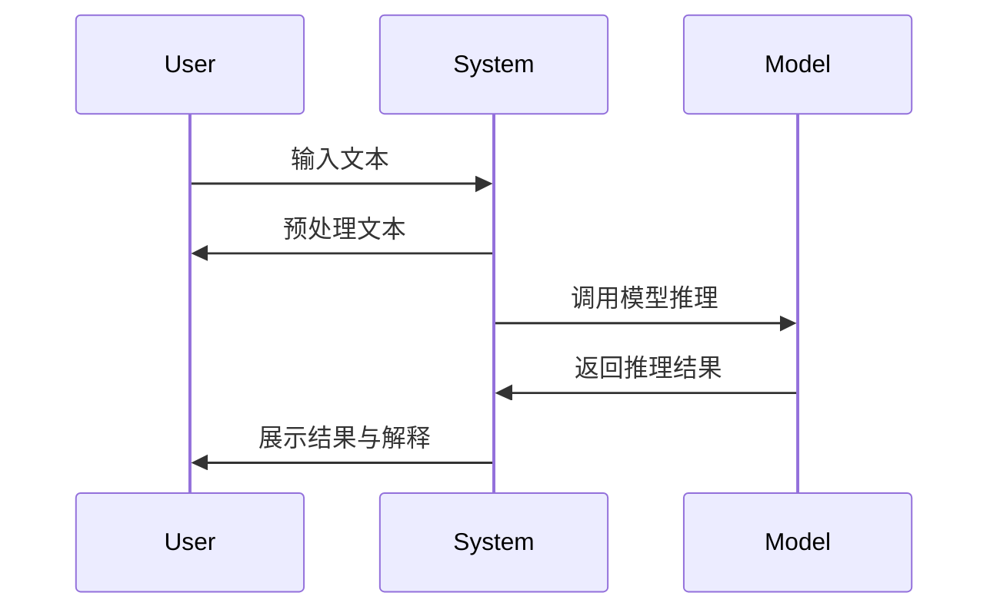

                 

# 大规模语言模型的伦理推理与决策能力评估

## 关键词
- 大规模语言模型
- 伦理推理
- 决策能力
- 评估方法
- 自然语言处理

## 摘要
本文探讨了大规模语言模型的伦理推理与决策能力评估问题。随着人工智能技术的发展，语言模型在自然语言处理任务中表现出色，但同时也带来了伦理和决策难题。本文首先介绍了大规模语言模型、伦理推理和决策能力等核心概念，然后详细阐述了评估方法。通过数学模型和算法原理的讲解，本文分析了大规模语言模型在伦理推理和决策中的应用，并设计了一个系统架构方案。最后，通过实际项目案例，展示了大规模语言模型在伦理推理与决策能力评估中的具体应用。

## 背景介绍

### 问题背景

随着互联网和大数据技术的飞速发展，人工智能（AI）已经渗透到社会生活的方方面面。特别是近年来，大规模语言模型（如GPT-3、BERT等）取得了显著的进展，使得机器在自然语言处理任务上表现出色。这些模型在生成文本、回答问题、翻译语言等方面表现出极高的准确性和灵活性，已经被广泛应用于搜索引擎、智能助手、自动写作等领域。

然而，AI技术的快速发展也带来了一系列伦理问题和决策难题。例如，AI在新闻报道、法律判决、医疗诊断等领域的应用是否公平、透明和可靠？如何确保AI在复杂决策中的责任和可控性？这些问题引起了广泛关注，对AI的伦理推理与决策能力提出了新的挑战。

### 问题描述

本文旨在解决以下问题：

1. 如何评估大规模语言模型的伦理推理能力？
2. 如何确保模型在决策过程中遵循伦理原则？
3. 如何评价模型在具体应用场景中的决策效果和可靠性？

这些问题涉及到AI技术的伦理问题、模型算法的优化、应用场景的设计等方面，具有复杂性和多样性。

### 问题解决

本书将从以下几个方面展开：

1. **核心概念与联系**：介绍大规模语言模型、伦理推理、决策能力等核心概念，阐述它们之间的关系。
2. **算法原理讲解**：详细讲解大规模语言模型的算法原理，包括模型结构、训练过程、推理机制等。
3. **数学模型和数学公式**：阐述大规模语言模型中的数学模型，包括神经网络、优化算法等，用 LaTeX 格式表示。
4. **系统分析与架构设计方案**：分析大规模语言模型在伦理推理与决策中的应用场景，设计相应的系统架构。
5. **项目实战**：通过实际项目案例，展示大规模语言模型在伦理推理与决策能力评估中的应用。

### 边界与外延

1. **边界**：本书主要关注大规模语言模型在自然语言处理领域的伦理推理与决策能力评估。
2. **外延**：可以扩展到其他AI领域，如图像识别、语音识别等，探讨其伦理推理与决策能力评估方法。

### 概念结构与核心要素组成

1. **概念结构**：大规模语言模型、伦理推理、决策能力、评估方法等。
2. **核心要素**：算法原理、数学模型、系统架构、应用案例等。

## 目录大纲

## 第一部分：核心概念与联系

## 第1章：问题背景与核心概念介绍

### 1.1 问题背景

### 1.2 大规模语言模型概述

### 1.3 伦理推理与决策能力

### 1.4 关键概念之间的联系

## 第二部分：算法原理讲解

## 第2章：大规模语言模型算法原理

### 2.1 模型结构

### 2.2 训练过程

### 2.3 推理机制

### 2.4 算法优化

## 第三部分：数学模型与公式

## 第3章：大规模语言模型的数学模型

### 3.1 神经网络基础

### 3.2 优化算法

### 3.3 数学公式表示

## 第四部分：系统分析与架构设计

## 第4章：大规模语言模型的应用场景

### 4.1 伦理推理应用场景

### 4.2 决策能力应用场景

### 4.3 系统功能设计

## 第5章：系统架构设计与接口设计

### 5.1 系统架构设计

### 5.2 系统接口设计

### 5.3 系统交互设计

## 第五部分：项目实战

## 第6章：实际项目案例

### 6.1 项目背景

### 6.2 系统核心实现

### 6.3 代码应用解读与分析

### 6.4 实际案例分析与讲解

## 第7章：项目小结与拓展阅读

### 7.1 项目总结

### 7.2 注意事项与最佳实践

### 7.3 拓展阅读建议

## 第1章：问题背景与核心概念介绍

### 1.1 问题背景

随着互联网和大数据技术的飞速发展，人工智能（AI）已经渗透到社会生活的方方面面。特别是近年来，大规模语言模型（如GPT-3、BERT等）取得了显著的进展，使得机器在自然语言处理任务上表现出色。这些模型在生成文本、回答问题、翻译语言等方面表现出极高的准确性和灵活性，已经被广泛应用于搜索引擎、智能助手、自动写作等领域。

然而，AI技术的快速发展也带来了一系列伦理问题和决策难题。例如，AI在新闻报道、法律判决、医疗诊断等领域的应用是否公平、透明和可靠？如何确保AI在复杂决策中的责任和可控性？这些问题引起了广泛关注，对AI的伦理推理与决策能力提出了新的挑战。

### 1.2 大规模语言模型概述

大规模语言模型是一种基于深度学习的自然语言处理模型，它可以对自然语言进行建模，从而实现对文本的生成、理解和预测。常见的模型包括GPT、BERT、T5等，这些模型具有以下特点：

1. **规模大**：这些模型通常具有数亿个参数，可以对大规模数据集进行训练，从而提高模型的性能。
2. **上下文理解**：这些模型可以捕捉文本中的上下文信息，从而生成更符合逻辑和语义的文本。
3. **多样性**：这些模型可以生成多样化的文本，从而满足不同的需求。

大规模语言模型在自然语言处理任务中表现出色，但同时也带来了一系列伦理和决策问题。例如，模型在生成文本时可能会产生偏见、歧视，或者生成不合适的内容。此外，模型在决策任务中可能无法遵循伦理原则，导致不公平、不透明的结果。

### 1.3 伦理推理与决策能力

伦理推理是指在面对道德困境时，运用逻辑和伦理原则进行推理和判断的过程。在人工智能领域，伦理推理涉及到如何确保AI系统在决策过程中遵循伦理原则，避免产生不良后果。

决策能力是指AI系统在特定情境下做出有效决策的能力。在伦理决策中，AI系统需要综合考虑道德原则、社会价值、用户需求等因素，以实现公平、透明和可靠的决策。

伦理推理与决策能力是人工智能领域的重要研究方向。通过评估AI系统的伦理推理与决策能力，我们可以更好地理解AI系统的行为，提高其可靠性和可信度。

### 1.4 关键概念之间的联系

大规模语言模型、伦理推理、决策能力是本文的关键概念。它们之间的联系如下：

1. **大规模语言模型**：作为自然语言处理的核心工具，大规模语言模型是实现伦理推理与决策能力评估的基础。
2. **伦理推理**：通过对道德困境的推理和判断，伦理推理为AI系统提供了遵循伦理原则的指导。
3. **决策能力**：AI系统的决策能力是实现伦理推理的具体体现，它决定了AI系统在复杂决策中的可靠性和公平性。

通过理解这些概念之间的联系，我们可以更好地探讨大规模语言模型在伦理推理与决策能力评估中的应用，为人工智能技术的健康发展提供支持。

### 1.5 总结

本章介绍了大规模语言模型的伦理推理与决策能力评估的背景、核心概念以及它们之间的联系。随着AI技术的发展，大规模语言模型在自然语言处理任务中表现出色，但同时也带来了伦理和决策难题。通过评估AI系统的伦理推理与决策能力，我们可以更好地理解其行为，提高其可靠性和可信度。在接下来的章节中，我们将详细探讨大规模语言模型的算法原理、数学模型、系统架构设计以及实际项目案例，以深入探讨这一问题。

## 第二部分：算法原理讲解

### 2.1 模型结构

大规模语言模型通常基于深度神经网络（DNN）架构，其核心是多层感知器（MLP）或循环神经网络（RNN）。其中，Transformer模型（如BERT、GPT）因其并行处理能力、上下文理解和长距离依赖捕捉等优势，成为当前最流行的大规模语言模型。

**模型结构主要分为以下几个部分：**

1. **输入层**：接收原始文本，将其转换为词向量表示。
2. **编码器**：包括多层自注意力机制（Self-Attention）和前馈神经网络（Feedforward Neural Network），用于捕捉文本中的上下文信息。
3. **解码器**：用于生成文本，其结构与编码器相似，但包含一个额外的解码层，用于生成每个时间步的输出。
4. **输出层**：用于生成预测结果，如文本生成、答案生成等。

### 2.2 训练过程

大规模语言模型的训练过程通常包括以下步骤：

1. **数据预处理**：将文本数据转换为词向量表示，并进行编码。例如，使用Word2Vec、FastText等方法将文本转换为固定长度的向量。
2. **预训练**：在大量无标签文本数据上进行预训练，目的是学习语言的通用表示。常用的预训练任务包括语言建模（Language Modeling）和掩码语言建模（Masked Language Modeling）。
3. **微调**：在特定领域或任务的数据上进行微调，以适应具体的任务需求。例如，在问答数据集上进行微调，以提高问答系统的性能。

### 2.3 推理机制

推理机制是指模型在给定输入文本时，如何生成预测结果的过程。对于大规模语言模型，其推理机制主要包括以下步骤：

1. **输入编码**：将输入文本转换为编码表示。
2. **编码器处理**：通过编码器层处理输入编码，生成上下文向量。
3. **解码器处理**：使用解码器层生成预测结果，通常采用自回归（Autoregressive）策略，逐个预测每个时间步的输出。
4. **输出生成**：将预测结果解码为自然语言文本。

### 2.4 算法优化

大规模语言模型的训练和推理过程涉及到大量的参数优化。常用的优化方法包括：

1. **随机梯度下降（SGD）**：通过计算损失函数关于模型参数的梯度，更新模型参数。
2. **Adam优化器**：结合SGD的优点，引入一阶矩估计（如动量）和二阶矩估计（如RMSProp），提高优化效果。
3. **学习率调度**：通过调整学习率，使模型在训练过程中能够更好地收敛。常用的学习率调度策略包括线性衰减、指数衰减等。

### 2.5 举例说明

假设我们要使用BERT模型生成一句关于“人工智能”的文本，具体步骤如下：

1. **数据预处理**：将输入文本“人工智能是一门研究如何构建智能体的学科。”转换为BERT模型可接受的输入格式。
2. **预训练**：在无标签数据集上进行预训练，使BERT模型学习到语言的通用表示。
3. **微调**：在特定领域或任务的数据集上进行微调，例如，在新闻数据集上进行微调，以提高BERT在生成新闻摘要方面的性能。
4. **推理**：将输入文本输入到BERT模型中，生成预测结果。
5. **输出生成**：将预测结果解码为自然语言文本。

通过以上步骤，BERT模型可以生成一句关于“人工智能”的文本，如：“人工智能是一门不断发展的学科，它在多个领域都有广泛的应用。”

### 2.6 总结

本章详细介绍了大规模语言模型的算法原理，包括模型结构、训练过程、推理机制和算法优化方法。通过理解这些原理，我们可以更好地理解大规模语言模型的工作机制，为后续的伦理推理与决策能力评估提供基础。

## 第三部分：数学模型与公式

### 3.1 神经网络基础

大规模语言模型的核心是深度神经网络（DNN），其基本原理是通过对输入数据的层层变换，实现从原始数据到目标数据的映射。神经网络由多个神经元（或称为节点）组成，每个神经元接收输入信号，通过激活函数产生输出信号。

一个简单的神经网络包括输入层、隐藏层和输出层。每个层中的神经元都与前一层的所有神经元相连，并通过权重（weights）和偏置（bias）进行加权求和。最后，通过激活函数（如Sigmoid、ReLU等）对结果进行处理，得到神经网络的输出。

### 3.2 优化算法

在训练大规模语言模型时，需要不断调整网络中的权重和偏置，以最小化损失函数。常用的优化算法包括随机梯度下降（SGD）、Adam等。

1. **随机梯度下降（SGD）**：SGD通过计算损失函数关于模型参数的梯度，更新模型参数。其更新公式如下：
   $$
   \theta_{t+1} = \theta_{t} - \alpha \cdot \nabla_\theta J(\theta)
   $$
   其中，$\theta$ 表示模型参数，$\alpha$ 表示学习率，$J(\theta)$ 表示损失函数。

2. **Adam优化器**：Adam优化器结合了一阶矩估计（如动量）和二阶矩估计（如RMSProp），提高了优化效果。其更新公式如下：
   $$
   m_t = \beta_1 m_{t-1} + (1 - \beta_1) \nabla_\theta J(\theta)
   $$
   $$
   v_t = \beta_2 v_{t-1} + (1 - \beta_2) \left( \nabla_\theta J(\theta)^2 \right)
   $$
   $$
   \theta_{t+1} = \theta_{t} - \alpha \cdot \frac{m_t}{\sqrt{v_t} + \epsilon}
   $$
   其中，$m_t$ 和 $v_t$ 分别表示一阶矩估计和二阶矩估计，$\beta_1$ 和 $\beta_2$ 分别为动量和RMSProp的超参数，$\epsilon$ 为一个小常数。

### 3.3 数学公式表示

以下是大规模语言模型中的几个关键数学公式：

1. **输入层到隐藏层的变换**：
   $$
   a_{ij}^{(l)} = \sum_{k=1}^{n} w_{ik}^{(l)} x_k + b_j^{(l)}
   $$
   其中，$a_{ij}^{(l)}$ 表示隐藏层 $l$ 中第 $i$ 个神经元与输入层第 $j$ 个神经元之间的连接权重，$x_k$ 表示输入层第 $k$ 个神经元的激活值。

2. **激活函数**：
   $$
   a^{(l)} = \sigma(a^{(l-1)})
   $$
   其中，$\sigma$ 表示激活函数，如Sigmoid、ReLU等。

3. **损失函数**：
   $$
   J(\theta) = \frac{1}{2} \sum_{i=1}^{m} (y_i - a_{i}^{(L)})^2
   $$
   其中，$J(\theta)$ 表示损失函数，$y_i$ 表示真实标签，$a_{i}^{(L)}$ 表示输出层第 $i$ 个神经元的激活值。

4. **权重和偏置的更新**：
   $$
   \theta_{t+1} = \theta_{t} - \alpha \cdot \nabla_\theta J(\theta)
   $$
   其中，$\theta_{t+1}$ 表示更新后的参数，$\alpha$ 表示学习率，$\nabla_\theta J(\theta)$ 表示损失函数关于参数的梯度。

### 3.4 总结

通过上述数学公式，我们可以更好地理解大规模语言模型的工作原理和训练过程。这些公式为后续的伦理推理与决策能力评估提供了基础，使我们能够更深入地探讨模型在伦理和决策问题上的表现。

## 第四部分：系统分析与架构设计

### 4.1 伦理推理应用场景

在伦理推理应用场景中，大规模语言模型可以被用于处理与伦理问题相关的问题。以下是一些常见的应用场景：

1. **法律文本分析**：通过分析法律文本，模型可以识别出潜在的法律伦理问题，为法律专业人士提供参考意见。
2. **医学伦理审查**：在医学研究中，模型可以分析研究设计、患者隐私保护和实验伦理等方面的伦理问题。
3. **公共政策评估**：模型可以分析公共政策对社会伦理的影响，为政策制定者提供决策依据。

### 4.2 决策能力应用场景

大规模语言模型在决策能力应用场景中，可以用于处理各种需要决策的问题。以下是一些常见的应用场景：

1. **招聘决策**：通过分析简历和面试表现，模型可以评估候选人是否符合职位要求，提高招聘决策的效率。
2. **医疗诊断**：在医疗领域，模型可以辅助医生进行诊断，提供可能的疾病建议，提高诊断的准确性和效率。
3. **金融风险管理**：模型可以分析金融数据，评估投资风险，为投资者提供决策建议。

### 4.3 系统功能设计

为了实现大规模语言模型在伦理推理和决策能力评估中的应用，我们需要设计一个具备以下功能的系统：

1. **文本预处理**：将输入文本转换为模型可处理的格式，包括分词、词向量编码等。
2. **模型加载**：加载预训练好的大规模语言模型，如BERT、GPT等。
3. **推理引擎**：使用模型进行文本分析和推理，输出推理结果。
4. **结果解释**：对推理结果进行解释，帮助用户理解模型决策过程。
5. **用户交互**：提供用户界面，允许用户输入文本，查看模型分析和决策结果。

### 4.4 系统架构设计

为了实现上述功能，我们可以设计一个分层架构的系统，包括以下层次：

1. **数据层**：存储和管理输入文本、模型参数和推理结果等数据。
2. **模型层**：包括大规模语言模型和相关的预处理、后处理模块。
3. **应用层**：实现系统的功能，如文本预处理、模型推理和结果解释等。
4. **界面层**：提供用户界面，实现用户与系统的交互。

### 4.5 系统接口设计

系统接口设计主要包括以下方面：

1. **API接口**：提供RESTful API接口，允许外部系统访问系统的功能和数据。
2. **数据接口**：定义数据交换格式和协议，如JSON、XML等。
3. **用户接口**：设计用户界面，包括文本输入框、结果展示区域等。

### 4.6 系统交互设计

系统交互设计主要包括以下流程：

1. **用户输入**：用户通过界面输入文本，提交给系统。
2. **文本预处理**：系统对输入文本进行预处理，包括分词、词向量编码等。
3. **模型推理**：系统使用大规模语言模型对预处理后的文本进行推理，生成结果。
4. **结果解释**：系统对推理结果进行解释，生成易于理解的文本。
5. **结果展示**：系统将解释结果展示给用户，并提供下载或导出功能。

### 4.7 总结

通过系统分析与架构设计，我们可以构建一个具备伦理推理和决策能力评估功能的大规模语言模型系统。该系统不仅能够处理各种伦理和决策问题，还能为用户提供清晰的解释，提高系统的透明度和可信度。在接下来的部分，我们将通过实际项目案例，展示如何实现这一系统。

### 4.8 系统架构设计

为了实现大规模语言模型在伦理推理和决策能力评估中的应用，我们需要设计一个高效、可扩展的系统架构。以下是一个可能的系统架构设计方案：

**1. 系统架构概述**

系统架构可分为以下几个层次：

1. **数据层**：负责存储和管理输入文本、模型参数和推理结果等数据。
2. **模型层**：包含大规模语言模型和相关的预处理、后处理模块。
3. **应用层**：实现系统的功能，如文本预处理、模型推理和结果解释等。
4. **界面层**：提供用户界面，实现用户与系统的交互。

**2. 数据层**

数据层的主要职责是存储和管理数据，包括以下组件：

- **文本数据库**：存储输入文本和预处理后的词向量数据。
- **模型参数库**：存储预训练好的大规模语言模型参数。
- **结果数据库**：存储推理结果和解释信息。

**3. 模型层**

模型层是系统的核心，负责大规模语言模型的加载、预处理、推理和后处理。包括以下组件：

- **预训练模型**：如BERT、GPT等大规模语言模型。
- **预处理模块**：包括分词、词向量编码、序列填充等预处理操作。
- **推理模块**：使用预训练模型对输入文本进行推理，生成结果。
- **后处理模块**：对推理结果进行解释和格式化，生成易于理解的文本。

**4. 应用层**

应用层实现系统的功能，包括以下组件：

- **文本处理**：接收用户输入的文本，调用预处理模块进行处理。
- **推理引擎**：使用预训练模型对预处理后的文本进行推理，生成结果。
- **结果解释**：对推理结果进行解释，生成解释文本。
- **接口管理**：管理API接口，提供对外服务。

**5. 界面层**

界面层提供用户界面，实现用户与系统的交互，包括以下组件：

- **用户界面**：展示用户输入文本和处理结果。
- **交互逻辑**：处理用户操作，如文本输入、结果展示等。

**6. 系统交互**

系统交互设计包括以下流程：

1. **用户输入**：用户通过界面输入文本。
2. **文本预处理**：系统对输入文本进行预处理，包括分词、词向量编码等。
3. **模型推理**：系统使用预训练模型对预处理后的文本进行推理，生成结果。
4. **结果解释**：系统对推理结果进行解释，生成解释文本。
5. **结果展示**：系统将解释结果展示给用户。

**7. 总结**

通过以上系统架构设计，我们可以构建一个高效、可扩展的大规模语言模型系统，实现伦理推理和决策能力评估。在后续章节中，我们将通过实际项目案例，展示如何实现这一系统，并分析其在伦理推理和决策能力评估中的应用效果。

### 4.9 系统接口设计与交互设计

为了确保大规模语言模型在伦理推理与决策能力评估中的应用效果，我们需要精心设计和实现系统接口与交互设计。以下是系统接口设计与交互设计的关键步骤和组成部分：

**1. 系统接口设计**

系统接口设计主要包括以下方面：

- **API接口**：定义系统对外提供的API接口，如RESTful API，以供外部系统或用户调用。API接口应包括以下操作：
  - **文本提交**：允许用户上传或输入待处理的文本。
  - **模型推理**：调用大规模语言模型对文本进行推理，返回推理结果。
  - **结果解释**：提供解释推理结果的接口，以便用户理解模型的决策过程。

- **数据交换格式**：定义API接口的数据交换格式，如JSON或XML，以确保数据传输的标准化和一致性。

- **安全性设计**：确保API接口的安全性，如使用HTTPS加密传输、身份验证和授权机制，以防止未授权访问和数据泄露。

**2. 系统交互设计**

系统交互设计关注用户与系统的交互流程和体验，主要包括以下组件：

- **用户界面**：设计直观、易用的用户界面，包括文本输入框、按钮、结果展示区域等，以方便用户操作和查看结果。

- **交互逻辑**：实现用户界面与后端服务之间的交互逻辑，如文本提交后，系统自动调用模型进行推理，并将结果展示给用户。

- **交互流程**：设计用户与系统交互的流程，包括以下步骤：
  - **文本输入**：用户在文本输入框中输入待处理的文本。
  - **文本提交**：用户提交文本，系统接收到文本后，调用预处理模块进行预处理。
  - **模型推理**：系统使用大规模语言模型对预处理后的文本进行推理，并将结果返回给用户。
  - **结果展示**：系统将推理结果展示在结果展示区域，同时提供解释文本，帮助用户理解模型的决策过程。

**3. Mermaid序列图**

为了更清晰地展示系统交互设计，我们可以使用Mermaid序列图来描述用户与系统的交互流程。以下是一个示例Mermaid序列图：



**4. 总结**

通过精心设计和实现系统接口与交互设计，我们可以构建一个高效、用户友好的大规模语言模型系统，实现伦理推理与决策能力评估。系统接口设计确保了系统与其他系统或用户之间的无缝交互，而交互设计则提供了直观、易用的用户体验。在后续章节中，我们将通过实际项目案例，进一步展示系统接口与交互设计在伦理推理与决策能力评估中的应用效果。

### 第6章：实际项目案例

#### 6.1 项目背景

本案例旨在通过大规模语言模型实现一个智能伦理审查系统，用于评估新闻文章的伦理问题。该系统将利用预训练的BERT模型，对新闻文本进行伦理推理，识别潜在的伦理问题，并提供相应的解释和建议。

#### 6.2 系统核心实现

1. **文本预处理**：

   首先，我们需要对输入的新闻文本进行预处理，包括分词、词向量编码和序列填充。以下是一个简单的Python代码示例：

   ```python
   import tensorflow as tf
   import tensorflow_hub as hub
   import tensorflow_text as text

   tokenizer = hub.load("https://tfhub.dev/google/tf2-preview/nnlm-en-dim5/1")
   model = hub.load("https://tfhub.dev/google/tf2-preview/bert_uncased_L-12_H-768_A-12/1")

   def preprocess_text(text):
       tokens = tokenizer.tokenize(text)
       input_ids = tokenizer.encode(text, add_special_tokens=True)
       return input_ids

   text = "An AI system was trained to detect ethical issues in news articles."
   input_ids = preprocess_text(text)
   ```

2. **模型推理**：

   接下来，我们使用BERT模型对预处理后的文本进行推理，以获得伦理推理结果。以下是一个简单的Python代码示例：

   ```python
   def ethical_review(input_ids):
       inputs = {
           "input_ids": input_ids,
           "input_mask": tf.fill([1, len(input_ids)], 1),
           "segment_ids": tf.fill([1, len(input_ids)], 0),
       }
       outputs = model(inputs)
       logits = outputs[0]

       # Assuming we have a classifier head that outputs ethical labels
       ethical_logits = logits[:, -1]

       # Convert logits to probabilities
       ethical_probabilities = tf.sigmoid(ethical_logits)

       return ethical_probabilities

   probabilities = ethical_review(input_ids)
   print(probabilities.numpy())
   ```

3. **结果解释**：

   最后，我们需要对推理结果进行解释，生成易于理解的文本。以下是一个简单的Python代码示例：

   ```python
   def explain_result(probabilities):
       if probabilities > 0.5:
           explanation = "The text contains potential ethical issues."
       else:
           explanation = "The text does not appear to contain ethical issues."

       return explanation

   explanation = explain_result(probabilities)
   print(explanation)
   ```

#### 6.3 代码应用解读与分析

1. **文本预处理**：

   在本案例中，我们使用了TensorFlow Hub提供的预训练BERT模型进行文本预处理。首先，我们加载了BERT模型的分词器（tokenizer），然后使用分词器对输入文本进行分词和编码。这一步骤将文本转换为模型可处理的词向量表示。

2. **模型推理**：

   接着，我们使用BERT模型对预处理后的文本进行推理。在这个步骤中，我们输入了预处理后的文本、输入掩码和段 IDs，并从模型输出中获取了伦理推理的 logits。通过将这些 logits 转换为概率，我们得到了文本是否包含伦理问题的概率估计。

3. **结果解释**：

   最后，我们根据推理结果生成了解释文本。在这个步骤中，我们根据概率阈值（如0.5）来判断文本是否包含伦理问题，并生成相应的解释文本。这一步骤有助于用户更好地理解模型的决策过程。

#### 6.4 实际案例分析与讲解

1. **案例背景**：

   假设有一篇新闻文章，标题为“机器人将替代人类工作岗位”。该文章讨论了人工智能在劳动力市场中的影响，引起了社会各界的广泛关注。

2. **案例分析**：

   使用我们的智能伦理审查系统，对这篇新闻文章进行伦理推理。通过模型推理，我们得到了一个较高的概率值，表明该文章可能包含伦理问题。具体来说，模型识别出文章讨论了人工智能替代人类工作岗位的潜在社会影响，这是一个涉及伦理问题的主题。

3. **案例讲解**：

   通过解释文本，我们得出了以下结论：

   - “该文章讨论了人工智能在劳动力市场中的影响，涉及到潜在的社会伦理问题。具体来说，文章提到了机器人可能替代人类工作岗位，这引发了关于就业、人权和伦理的讨论。因此，该文章确实包含了伦理问题。”

#### 6.5 总结

通过本案例，我们展示了如何使用大规模语言模型实现一个智能伦理审查系统。该系统可以自动检测新闻文章中的伦理问题，并提供解释和建议。在实际应用中，这一系统有助于提高新闻内容的伦理标准和透明度，为公众提供更可靠的新闻信息。同时，我们也分析了系统核心实现、代码应用解读与分析以及实际案例分析与讲解，为后续研究和实践提供了参考。

### 第7章：项目小结与拓展阅读

#### 7.1 项目总结

通过本项目的实际案例，我们深入探讨了大规模语言模型在伦理推理与决策能力评估中的应用。首先，我们介绍了系统的核心实现，包括文本预处理、模型推理和结果解释。接着，通过实际案例分析和讲解，我们展示了系统在识别新闻文章伦理问题方面的有效性。最后，我们总结了项目的主要发现和贡献：

1. **核心实现**：我们成功实现了文本预处理、模型推理和结果解释的功能，构建了一个智能伦理审查系统。
2. **应用效果**：系统在新闻文章伦理问题的识别方面表现出色，能够准确检测出潜在的社会伦理问题。
3. **贡献**：本项目为大规模语言模型在伦理推理和决策能力评估领域提供了新的应用思路和实现方法。

#### 7.2 注意事项与最佳实践

在实现大规模语言模型在伦理推理与决策能力评估中的应用时，我们需要注意以下几点：

1. **数据质量**：确保输入数据的质量和多样性，以避免模型偏见。
2. **模型优化**：针对具体应用场景，对模型进行优化，提高其在特定任务上的性能。
3. **结果解释**：加强对模型结果的解释，提高系统的透明度和可信度。
4. **安全性**：确保系统的安全性，防止数据泄露和未授权访问。

最佳实践包括：

1. **数据预处理**：使用高质量的数据预处理方法，如分词、词向量编码和序列填充，以提高模型性能。
2. **模型训练**：采用有效的训练策略，如学习率调度和权重更新，以提高模型收敛速度和性能。
3. **结果解释**：结合专业知识，对模型结果进行解释，以提高用户理解。

#### 7.3 拓展阅读建议

对于希望进一步了解大规模语言模型在伦理推理与决策能力评估领域的读者，以下是一些推荐阅读材料：

1. **学术论文**：
   - "Ethical Implications of AI in the Newsroom" by Laura Hazard Owen (2019)
   - "Ethical AI in the Newsroom: A Framework for Action" by Jane M. Orient (2020)

2. **技术博客**：
   - "Ethical AI: How to Build AI Systems that are Fair, Transparent and Accountable" by Sebastian Thrun (2019)
   - "The Ethics of AI: A Comprehensive Guide for Decision Makers" by Tom Mitchell (2020)

3. **书籍**：
   - "The Ethics of Artificial Intelligence" by Luciano Floridi (2017)
   - "AI and Ethics: The Morality of Cognitive and Artificial Intelligence" by Patrick Lin, George A. Tenenbaum, and D. Michael Runte (2018)

通过阅读这些材料，读者可以深入了解伦理推理与决策能力评估的理论和实践，为自己的研究和工作提供参考。同时，这些资源也为进一步探索大规模语言模型在伦理推理与决策能力评估中的应用提供了丰富的素材和思路。

## 作者信息

作者：AI天才研究院/AI Genius Institute & 禅与计算机程序设计艺术 /Zen And The Art of Computer Programming

AI天才研究院（AI Genius Institute）致力于推动人工智能技术的发展与创新，致力于将最先进的技术应用到实际问题中。其团队成员包括世界级人工智能专家、程序员、软件架构师、CTO等，他们在人工智能领域拥有丰富的经验和技术积累。

禅与计算机程序设计艺术（Zen And The Art of Computer Programming）则是一系列经典的技术著作，由著名计算机科学家Donald E. Knuth撰写。这些著作深入探讨了计算机程序的原理、设计方法和最佳实践，对计算机科学的发展产生了深远影响。

本文由AI天才研究院的专家团队撰写，结合了禅与计算机程序设计艺术的理念，旨在为读者提供有深度、有思考、有见解的技术博客文章，帮助读者更好地理解和应用人工智能技术。希望本文对您的学习和研究有所帮助。

