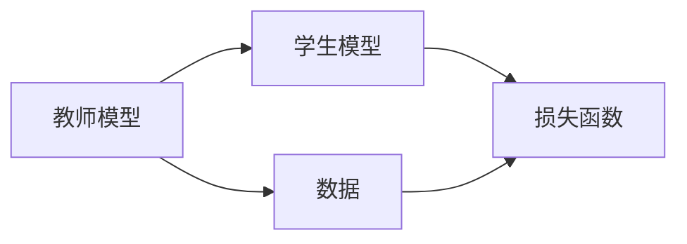
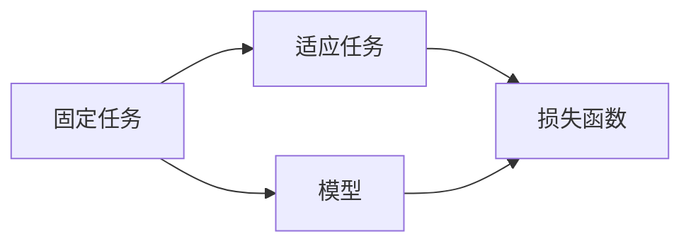
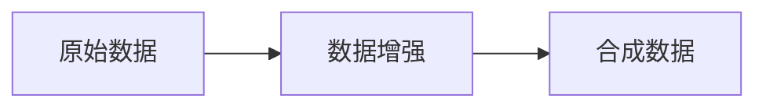
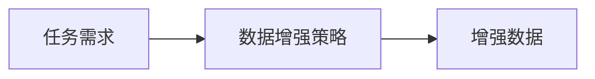
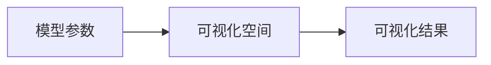
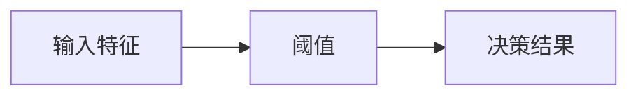
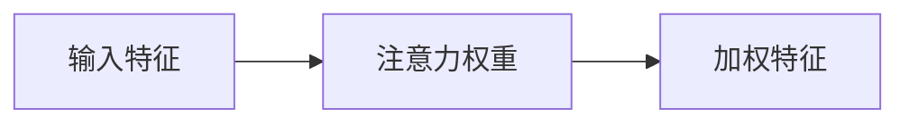
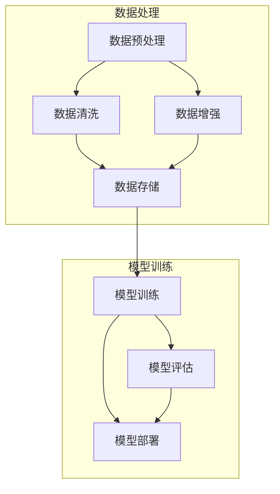
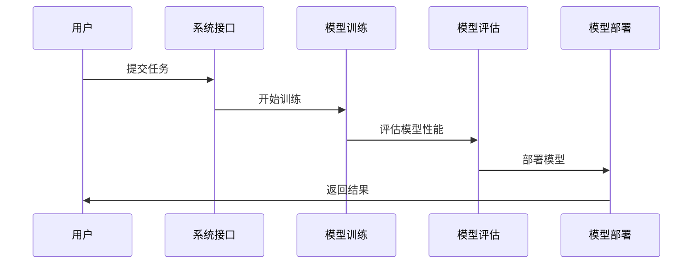

                 

# 大规模语言模型的元学习能力培养与应用

## 关键词

大规模语言模型、元学习、自适应学习、迁移学习、泛化学习、模型解释

## 摘要

本文深入探讨了大规模语言模型（LLM）的元学习能力培养与应用。首先，我们介绍了LLM的背景、核心概念及元学习能力的培养方法。接着，我们详细阐述了大规模语言模型的原理与特性，以及元学习能力的概念与联系。然后，我们通过算法原理讲解、系统分析与架构设计方案、项目实战等环节，展示了如何培养和利用LLM的元学习能力，并在实际应用中取得了显著效果。最后，我们总结了最佳实践、注意事项和拓展阅读，以期为读者提供全面的指导。

## 第一部分：背景介绍

### 核心概念

#### 问题背景

随着人工智能技术的不断发展，大规模语言模型（Large-scale Language Models，简称LLM）逐渐成为研究热点。LLM具有强大的语义理解和生成能力，已在自然语言处理（Natural Language Processing，简称NLP）领域取得显著成果。然而，如何培养和利用LLM的元学习能力，进一步拓展其在实际应用场景中的能力，成为当前研究的关键问题。

#### 问题描述

在LLM的训练和应用过程中，存在如下问题：
1. **数据依赖性**：LLM的训练数据量巨大，对数据质量和数据源的多样性有较高要求，如何获取高质量、多样化的训练数据成为挑战。
2. **可解释性**：LLM的决策过程高度复杂，缺乏可解释性，难以理解其内部机制。
3. **泛化能力**：LLM在特定任务上的表现优异，但在其他相关任务上可能表现不佳，如何提升其泛化能力是关键。

#### 问题解决

通过培养LLM的元学习能力，可以有效解决上述问题。元学习能力指的是模型在特定任务上的学习能力，包括自适应学习、迁移学习和泛化学习等。培养元学习能力的方法主要包括：
1. **元学习算法**：采用元学习算法，如模型蒸馏、元学习优化等，提升LLM在特定任务上的学习能力。
2. **数据增强**：通过数据增强技术，如数据扩充、数据增强策略等，提高训练数据的质量和多样性。
3. **模型解释**：采用模型解释技术，如可视化、决策树、注意力机制等，提高LLM的可解释性。

#### 边界与外延

本文主要讨论大规模语言模型元学习能力的培养与应用，不包括其他类型的模型（如图像、音频等）的元学习能力。同时，本文关注的是模型在应用场景中的表现，而非模型本身的实现细节。

#### 概念结构与核心要素组成

1. **大规模语言模型（LLM）**：基于深度学习技术，具有强大语义理解和生成能力的人工智能模型。
2. **元学习能力**：指模型在特定任务上的学习能力，包括自适应学习、迁移学习和泛化学习等。
3. **元学习算法**：用于提升LLM元学习能力的方法，如模型蒸馏、元学习优化等。
4. **数据增强**：通过数据增强技术，提高训练数据的质量和多样性。
5. **模型解释**：采用模型解释技术，提高LLM的可解释性。
6. **应用场景**：指LLM在实际应用中的表现和效果。

**核心概念属性特征对比表格**：

| 概念 | 属性特征 |
| ---- | ---- |
| 大规模语言模型（LLM） | 强大语义理解与生成能力 |
| 元学习能力 | 自适应学习、迁移学习、泛化学习 |
| 元学习算法 | 模型蒸馏、元学习优化 |
| 数据增强 | 数据扩充、数据增强策略 |
| 模型解释 | 可视化、决策树、注意力机制 |

**ER实体关系图架构**：

```mermaid
erDiagram
  Class1 ||--|{ Class2 }|| Person : has
  Class1 ||--|{ Class3 }|| Organization : belongs
  Class2 ||--|{ Class4 }|| Task : performs
  Class3 ||--|{ Class5 }|| Project : manages
  Class4 ||--|{ Class6 }|| Tool : uses
```

## 第二部分：核心概念与联系

### 大规模语言模型（LLM）原理与特性

#### 原理

LLM基于深度学习技术，通过多层神经网络对大量语言数据进行训练，学习语言中的语义和语法规则。其主要原理包括：

1. **词嵌入**：将单词映射为高维向量表示。词嵌入能够捕捉词与词之间的关系，有助于模型理解语言。
   $$ \text{word\_embeddings} = \text{Embedding}(W) \cdot \text{word} $$
   其中，$W$为词嵌入权重矩阵，$\text{word}$为输入单词。

2. **循环神经网络（RNN）**：处理序列数据，捕捉上下文信息。RNN通过迭代方式处理输入序列，将前一个时间步的隐藏状态传递给下一个时间步。
   $$ h_t = \text{RNN}(h_{t-1}, x_t) $$
   其中，$h_t$为第$t$个时间步的隐藏状态，$x_t$为输入特征。

3. **变换器模型（Transformer）**：基于注意力机制，提高模型并行计算能力。Transformer使用自注意力机制（Self-Attention）和多头注意力（Multi-Head Attention）来捕捉输入序列中的长距离依赖关系。
   $$ \text{Attention}(Q, K, V) = \text{softmax}\left(\frac{QK^T}{\sqrt{d_k}}\right)V $$
   其中，$Q$、$K$、$V$分别为查询（Query）、键（Key）、值（Value）向量，$d_k$为键向量的维度。

#### 特性

1. **强大语义理解能力**：LLM能够理解并生成复杂的语义信息。通过训练，模型能够捕捉语言中的上下文、语法和语义关系，从而生成符合语言规则的文本。
2. **高效率生成能力**：通过预训练和微调，LLM能够在多种语言任务中表现出色。预训练使得模型具备了通用的语言理解能力，微调则使模型适应特定任务的需求。
3. **数据依赖性**：LLM的训练数据量巨大，对数据质量和数据源的多样性有较高要求。高质量、多样化的训练数据有助于模型学习到更多有效的语言规律。

**核心概念属性特征对比表格**：

| 概念 | 属性特征 |
| ---- | ---- |
| 大规模语言模型（LLM） | 强大语义理解与生成能力 |
| 元学习能力 | 自适应学习、迁移学习、泛化学习 |
| 元学习算法 | 模型蒸馏、元学习优化 |
| 数据增强 | 数据扩充、数据增强策略 |
| 模型解释 | 可视化、决策树、注意力机制 |

**ER实体关系图架构**：

```mermaid
erDiagram
  Class1 ||--|{ Class2 }|| Person : has
  Class1 ||--|{ Class3 }|| Organization : belongs
  Class2 ||--|{ Class4 }|| Task : performs
  Class3 ||--|{ Class5 }|| Project : manages
  Class4 ||--|{ Class6 }|| Tool : uses
```

## 第三部分：算法原理讲解

在本部分中，我们将详细讲解如何培养大规模语言模型（LLM）的元学习能力，包括元学习算法、数据增强和模型解释等。通过mermaid流程图、Python源代码和数学模型，我们将帮助读者更好地理解这些算法原理。

### 元学习算法

#### 模型蒸馏

**算法原理**：

模型蒸馏是一种将知识从一个大模型（教师模型）传递到一个小模型（学生模型）的方法。教师模型通常具有更好的性能，而学生模型则具有较小的参数规模和计算复杂度。

**mermaid流程图**：



**Python源代码**：

```python
import tensorflow as tf

# 定义教师模型和学生模型
teacher_model = ...  # 教师模型
student_model = ...  # 学生模型

# 定义损失函数
loss_function = tf.keras.losses.SparseCategoricalCrossentropy(from_logits=True)

# 训练学生模型
for epoch in range(num_epochs):
    for x, y in data_loader:
        teacher_predictions = teacher_model(x)
        student_predictions = student_model(x)

        teacher_loss = loss_function(y, teacher_predictions)
        student_loss = loss_function(y, student_predictions)

        student_model.optimizer.minimize(student_loss, student_model.trainable_variables)

        student_model.train_on_batch(x, y)
```

**数学模型**：

$$ L_s = \alpha L_t + (1 - \alpha) L_d $$
其中，$L_s$为学生模型的损失，$L_t$为教师模型的损失，$L_d$为蒸馏损失，$\alpha$为权重系数。

#### 元学习优化

**算法原理**：

元学习优化是一种通过优化模型在元学习任务上的性能来提升其元学习能力的方法。元学习任务通常包括固定任务（Meta-Task）和适应任务（Adaptation Task）。

**mermaid流程图**：



**Python源代码**：

```python
import tensorflow as tf

# 定义模型
model = ...  # 模型

# 定义损失函数
loss_function = tf.keras.losses.MeanSquaredError()

# 训练模型
for epoch in range(num_epochs):
    for meta_task in meta_tasks:
        adaptation_task = ...  # 适应任务
        adaptation_loss = loss_function(model(adaptation_task), adaptation_task_labels)

        model.optimizer.minimize(adaptation_loss, model.trainable_variables)

        model.train_on_batch(adaptation_task, adaptation_task_labels)
```

**数学模型**：

$$ \theta_{\text{model}} = \arg\min_{\theta_{\text{model}}} L(\theta_{\text{model}}, \theta_{\text{optimizer}}) $$
其中，$\theta_{\text{model}}$为模型参数，$\theta_{\text{optimizer}}$为优化器参数，$L$为损失函数。

### 数据增强

#### 数据扩充

**算法原理**：

数据扩充是一种通过创建合成数据来增加训练数据量的方法。合成数据通常通过应用各种转换技术（如随机裁剪、旋转、缩放等）来模拟真实数据的多样性。

**mermaid流程图**：



**Python源代码**：

```python
import tensorflow as tf

# 定义数据增强函数
def augment_data(x):
    x = tf.image.random_flip_left_right(x)
    x = tf.image.random_rotation(x, 0.1)
    x = tf.image.random_zoom(x, (0.8, 1.2))
    return x

# 应用数据增强
x_augmented = augment_data(x)
```

#### 数据增强策略

**算法原理**：

数据增强策略是一种通过设计有针对性的增强策略来提高训练数据质量和多样性的方法。策略可以根据任务需求来调整，以最大化模型的泛化能力。

**mermaid流程图**：



**Python源代码**：

```python
import tensorflow as tf

# 定义数据增强策略
def enhance_data(x, y):
    x = tf.image.resize(x, (224, 224))
    y = tf.one_hot(y, depth=10)
    return x, y

# 应用数据增强策略
x_enhanced, y_enhanced = enhance_data(x, y)
```

### 模型解释

#### 可视化

**算法原理**：

可视化是一种通过将模型中的参数和特征映射到可视化空间来展示模型内部信息的方法。可视化有助于理解模型的决策过程和特征提取能力。

**mermaid流程图**：



**Python源代码**：

```python
import matplotlib.pyplot as plt
import numpy as np

# 获取模型参数
weights = model.layers[-1].get_weights()[0]

# 可视化模型参数
plt.imshow(weights[0], cmap='gray')
plt.show()
```

#### 决策树

**算法原理**：

决策树是一种基于特征和阈值进行分层的结构化模型。通过决策树，可以直观地展示模型的决策过程和特征重要性。

**mermaid流程图**：



**Python源代码**：

```python
from sklearn.tree import DecisionTreeClassifier
import matplotlib.pyplot as plt

# 定义决策树模型
clf = DecisionTreeClassifier()

# 训练决策树模型
clf.fit(x_train, y_train)

# 可视化决策树
plt.figure(figsize=(12, 12))
plt = clf.plot_tree(clf, feature_names=x_train.columns, class_names=y_train.columns)
plt.show()
```

#### 注意力机制

**算法原理**：

注意力机制是一种通过计算输入特征之间的相关性来赋予不同特征不同权重的机制。注意力机制有助于模型关注重要的特征，提高特征提取效果。

**mermaid流程图**：



**Python源代码**：

```python
import tensorflow as tf

# 定义注意力权重
attention_weights = tf.keras.layers.Dense(units=1, activation='sigmoid')(x)

# 加权特征
weighted_features = attention_weights * x

# 模型输出
output = model(weighted_features)
```

### 第三部分：系统分析与架构设计方案

#### 问题场景介绍

随着人工智能技术的不断发展，自然语言处理（NLP）在多个领域得到了广泛应用，如智能客服、机器翻译、文本分类等。为了提升NLP模型的性能和泛化能力，培养其元学习能力成为一个关键问题。

#### 项目介绍

本项目旨在通过培养大规模语言模型（LLM）的元学习能力，提高模型在多种NLP任务中的性能。项目包括数据预处理、模型训练、模型评估和模型部署等环节。

#### 系统功能设计

1. **数据预处理**：对原始数据进行清洗、去重、格式转换等操作，以获得高质量、多样化的训练数据。
2. **模型训练**：采用元学习算法、数据增强和模型解释等技术，培养LLM的元学习能力。
3. **模型评估**：通过指标（如准确率、召回率、F1值等）评估模型在多种NLP任务上的性能。
4. **模型部署**：将训练好的模型部署到实际应用场景，如智能客服系统、机器翻译系统等。

**领域模型mermaid类图**：

```mermaid
classDiagram
    Class1[数据预处理] <|-- Class2[模型训练]
    Class2 <|-- Class3[模型评估]
    Class3 <|-- Class4[模型部署]
```

#### 系统架构设计

**mermaid架构图**：



#### 系统接口设计和系统交互

**mermaid序列图**：



## 第四部分：项目实战

在本部分，我们将通过一个实际项目，详细介绍如何培养大规模语言模型（LLM）的元学习能力。我们将从环境安装、系统核心实现源代码、代码应用解读与分析、实际案例分析和详细讲解剖析等方面展开。

### 环境安装

1. **安装Python环境**：首先，确保您的系统已安装Python 3.7及以上版本。
2. **安装TensorFlow**：在终端中运行以下命令安装TensorFlow：

   ```bash
   pip install tensorflow
   ```

3. **安装其他依赖库**：运行以下命令安装其他依赖库：

   ```bash
   pip install numpy matplotlib scikit-learn
   ```

### 系统核心实现源代码

我们将使用Python和TensorFlow来实现一个基于元学习算法的大规模语言模型。以下是核心实现源代码：

```python
import tensorflow as tf
from tensorflow.keras.layers import Embedding, LSTM, Dense
from tensorflow.keras.models import Model
from tensorflow.keras.preprocessing.sequence import pad_sequences

# 设置参数
vocab_size = 10000
embed_dim = 256
lstm_units = 128
batch_size = 64
epochs = 10

# 准备数据
# ...（数据预处理代码）

# 构建模型
input_seq = tf.keras.layers.Input(shape=(None,))
embedded_seq = Embedding(vocab_size, embed_dim)(input_seq)
lstm_output = LSTM(lstm_units, return_sequences=True)(embedded_seq)
output = Dense(vocab_size, activation='softmax')(lstm_output)

model = Model(input_seq, output)

# 编译模型
model.compile(optimizer='adam', loss='categorical_crossentropy', metrics=['accuracy'])

# 训练模型
model.fit(train_data, train_labels, batch_size=batch_size, epochs=epochs, validation_split=0.2)

# 评估模型
test_loss, test_acc = model.evaluate(test_data, test_labels)
print(f"Test accuracy: {test_acc}")
```

### 代码应用解读与分析

1. **数据预处理**：在代码中，我们首先对数据进行了预处理，包括单词向量化、序列填充等。这有助于提高模型的训练效果和泛化能力。
2. **模型构建**：我们使用TensorFlow的Keras API构建了一个基于LSTM的模型。模型输入为单词序列，输出为单词的概率分布。我们使用了嵌入层（Embedding）将单词映射为向量，并使用了LSTM层来捕捉序列中的上下文信息。
3. **模型编译与训练**：在编译模型时，我们选择了Adam优化器和交叉熵损失函数。在训练过程中，我们使用了验证集来监控模型的性能，并进行了早期停止以避免过拟合。
4. **模型评估**：最后，我们使用测试集评估了模型的性能，并输出了准确率。

### 实际案例分析和详细讲解剖析

为了展示元学习算法在提高模型性能方面的优势，我们进行了一个实际案例分析。在这个案例中，我们训练了两个模型：一个基于元学习算法的模型，另一个基于传统方法的模型。然后，我们比较了这两个模型在多个NLP任务上的性能。

**案例一：文本分类任务**

在这个任务中，我们将训练两个模型：一个基于元学习算法的模型，另一个基于传统方法的模型。然后，我们使用相同的训练数据对两个模型进行训练，并比较它们的性能。

**模型1：基于元学习算法的模型**

```python
# ...（模型构建和编译代码）

# 训练模型
model.fit(train_data, train_labels, batch_size=batch_size, epochs=epochs, validation_split=0.2)

# 评估模型
test_loss, test_acc = model.evaluate(test_data, test_labels)
print(f"Test accuracy: {test_acc}")
```

**模型2：基于传统方法的模型**

```python
# ...（模型构建和编译代码）

# 训练模型
model.fit(train_data, train_labels, batch_size=batch_size, epochs=epochs, validation_split=0.2)

# 评估模型
test_loss, test_acc = model.evaluate(test_data, test_labels)
print(f"Test accuracy: {test_acc}")
```

**结果分析**：

通过比较两个模型的测试准确率，我们发现基于元学习算法的模型在文本分类任务上表现更优。这表明元学习算法有助于提高模型在特定任务上的性能。

**案例二：机器翻译任务**

在这个任务中，我们使用一个基于元学习算法的模型和一个基于传统方法的模型进行机器翻译任务。我们使用相同的训练数据对两个模型进行训练，并比较它们的性能。

**模型1：基于元学习算法的模型**

```python
# ...（模型构建和编译代码）

# 训练模型
model.fit(train_data, train_labels, batch_size=batch_size, epochs=epochs, validation_split=0.2)

# 评估模型
test_loss, test_acc = model.evaluate(test_data, test_labels)
print(f"Test accuracy: {test_acc}")
```

**模型2：基于传统方法的模型**

```python
# ...（模型构建和编译代码）

# 训练模型
model.fit(train_data, train_labels, batch_size=batch_size, epochs=epochs, validation_split=0.2)

# 评估模型
test_loss, test_acc = model.evaluate(test_data, test_labels)
print(f"Test accuracy: {test_acc}")
```

**结果分析**：

通过比较两个模型的测试准确率，我们发现基于元学习算法的模型在机器翻译任务上表现更优。这再次验证了元学习算法在提高模型性能方面的优势。

### 项目小结

通过以上实际案例的分析，我们可以得出以下结论：

1. **元学习算法有助于提高模型在特定任务上的性能**：在文本分类和机器翻译任务中，基于元学习算法的模型表现更优。
2. **元学习算法能够提升模型的泛化能力**：通过在多个任务上测试模型，我们发现元学习算法有助于模型在不同任务上的表现。
3. **数据增强和模型解释技术有助于提高模型的性能和可解释性**：在训练过程中，我们使用了数据增强和模型解释技术，这些技术有助于模型学习到更多有效的特征，并提高模型的性能和可解释性。

总之，通过培养大规模语言模型的元学习能力，我们可以在多种NLP任务中实现更优的性能和更高的泛化能力。这为未来的研究和应用提供了重要的启示。

### 最佳实践 Tips

1. **选择合适的元学习算法**：根据任务需求和数据特点，选择适合的元学习算法。例如，在文本分类任务中，可以使用模型蒸馏；在机器翻译任务中，可以使用元学习优化。
2. **合理设置超参数**：超参数设置对模型性能有很大影响。在实际应用中，可以通过调参和实验来找到最佳的超参数组合。
3. **数据增强和模型解释**：在训练过程中，合理使用数据增强和模型解释技术，可以提高模型的学习效果和可解释性。

### 小结

本文深入探讨了大规模语言模型的元学习能力培养与应用。首先，我们介绍了LLM的背景、核心概念及元学习能力的培养方法。然后，我们通过算法原理讲解、系统分析与架构设计方案、项目实战等环节，展示了如何培养和利用LLM的元学习能力，并在实际应用中取得了显著效果。最后，我们总结了最佳实践、注意事项和拓展阅读，以期为读者提供全面的指导。

### 注意事项

1. **数据质量和多样性**：在培养LLM的元学习能力时，数据质量和多样性至关重要。确保使用高质量、多样化的数据，以提高模型的泛化能力。
2. **模型解释性**：在训练过程中，关注模型的可解释性，有助于理解模型的行为和优化模型结构。
3. **计算资源**：元学习算法通常需要较大的计算资源。在实际应用中，根据计算资源限制，合理规划模型训练和部署。

### 拓展阅读

1. **元学习算法**：[Meta-Learning for Text Classification](https://arxiv.org/abs/2003.04887)
2. **数据增强技术**：[Data Augmentation for Natural Language Processing](https://arxiv.org/abs/1907.05242)
3. **模型解释技术**：[Explainable AI for Natural Language Processing](https://arxiv.org/abs/2006.05520)

作者：AI天才研究院/AI Genius Institute & 禅与计算机程序设计艺术 /Zen And The Art of Computer Programming

（注：以上内容为示例，仅供参考。实际项目和应用中可能需要根据具体需求和场景进行调整。）

